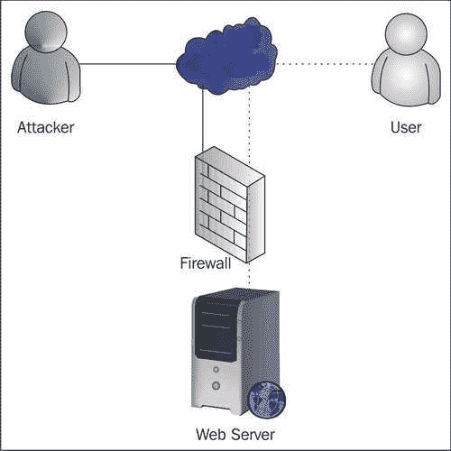
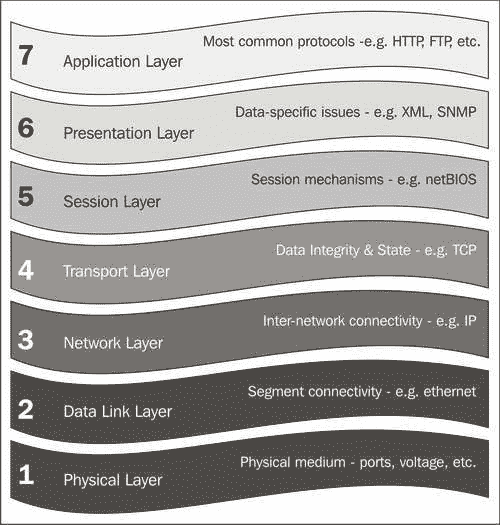
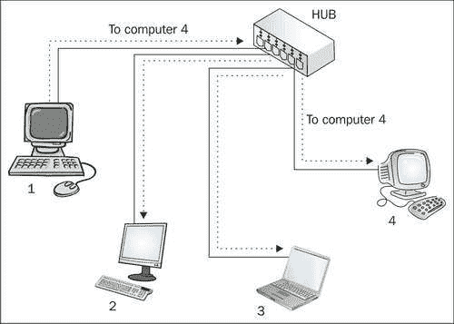
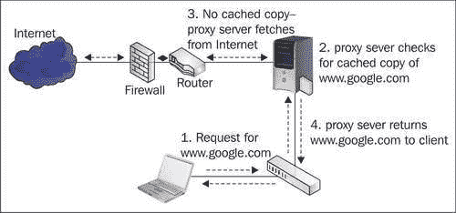

# 一、防火墙简介

在本章中，我们将详细介绍一些防火墙和网络概念，以便让那些已经遇到过它们的人有所耳目一新，但方式要尽可能少，因为理解网络概念不是本书的重点。 我们认为其中一些概念很重要，更广泛地了解这些技术是如何使用的以及它们来自何处，有助于我们更好地理解 IT 的工作方式-但是，对于时间紧迫的读者，我们尽可能提供*斜体*的关于这些概念的知识摘要，这些知识对于我们来说很重要。

如果您没有理解我们讨论的所有概念，也不用担心--同样，对网络概念比较熟悉的读者应该可以跳过。 IPCop 使对其中许多概念的明确理解变得无关紧要，因为它试图尽可能使管理变得简单和自动化。 但是，如果您确实想更深入地了解这些主题，这里给出的介绍以及我们提供的一些 URL 和指向其他资源的链接有望对您有所帮助。 如果您打算继续定期使用 IPCop 等系统，了解网络、路由以及一些常见协议的工作原理(虽然不是必需的)也会对您有不可估量的帮助。

# (TCP/IP)网络简介

在 20 世纪 70 年代初，随着数据网络变得越来越普遍，构建数据网络的不同方式的数量呈指数级增加。 对于许多人来说，*互连*(IBM*TCP/IP 教程和技术概述，Martin W.Murhammer，Orcun Atakan，Stefan Bretz，Larry R.Pugh，Kazunari Suzuki，David H.Wood，1998 年 10 月，PP3)*或*将多个网络相互连接*的概念变得极其重要，因为将围绕不同技术集构建的不同和不同的网络连接在一起开始带来痛苦。

在 IT 和计算机科学的上下文中，协议通常是计算机为特定目的交换数据的通用格式。 在网络中，最好将协议比作语言--在 20 世纪 70 年代的网络环境中，有许多不同的语言，几乎没有可供人们翻译的口译员。

由此产生的研究，最重要的是由美国国防部*国防高级研究计划局*([http://www.darpa.mil](http://www.darpa.mil))进行并资助的研究，不仅产生了一系列为互操作性而设计的网络*协议*(也就是说，为了允许在一系列设备之间进行简单的、平台无关的通信)，而且还产生了一个网络，**ARPANet，**，就是为了这个明确的目的而建立的。 在语言内部，最好的比较是*世界语*的发展-尽管这种*国际*语言的普及程度相当小，但计算机的优势是不需要花费数年时间来学习特定的协议！

此 ARPANet 于 1976 年首次使用 TCP/IP 进行试验，1983 年 1 月，所有参与网络的计算机都必须使用此 ARPANet。 到 20 世纪 70 年代末，除军方以外的许多组织也获准访问 ARPANet，如 NASA、**国家科学基金会**(**NSF**)，最终还包括大学和其他学术实体。

在军方脱离 ARPANet 形成自己的、独立的军用网络(**Milnet**)后，该网络成为 NSF 的责任，NSF 开始创建自己的高速主干，称为**NSFnet**，以促进互联互通。

当 NSFnet 的可接受使用政策开始允许非学术流量时，NSFnet 开始与其他(商业和私有)网络(如通过 CIX 操作的网络)结合，形成我们现在所知的互联网实体。 1995 年 4 月，随着 NSF 退出对互联网的管理和 NSFnet 的关闭，互联网被不断增长的商业、学术和私人用户群体所占据。

互联网所基于的标准已经成为现代网络的主要标准，如今，当任何人说“网络”时，他们往往指的是使用(和围绕)**TCP/IP**(最初是为在 ARPANet 上使用而开发的一组分层协议)以及其他实现 TCP/IP 的标准(如**802.3**或**Ethernet)构建的东西，**定义了 TCP/IP 在网段中运行的最流行的标准之一是如何工作的。

这些分层的协议除了由于历史和轶事的原因对我们来说很有趣之外，还对我们有几个重要的影响。 最值得注意的是，围绕它们建造的任何设备都完全可以与任何其他设备互操作。 这样做的结果是，我们可以购买任何供应商制造的网络组件-我们运行 Microsoft Windows 的戴尔笔记本电脑可以使用 Linksys 交换机、插入思科路由器，通过 TCP/IP 在以太网上自由通信，还可以查看运行 AIX 的 IBM 服务器上托管的网页，也可以使用 TCP/IP 通信。

在 TCP/IP 之上运行的更多标准化协议(如 HTTP)实际上承载着信息本身，由于这些协议的分层，我们可以拥有大量不同的网络连接，这些网络对使用 HTTP 等协议的 Web 浏览器和 Web 服务器等设备看起来是透明的。 在我们的戴尔笔记本电脑和 IBM 服务器之间，我们可能有一个拨号连接、一个帧中继网段、一部分互联网主干和一条无线网络链路--它们都不涉及 TCP/IP 或 HTTP，它们位于这些网络层之上，并在它们之上自由传输。 如果一辆满载着孩子们参加学校旅游的长途汽车可以使用飞机、渡轮、自行车道和缆车，而不需要下车，也不会意识到他们脚下不断变化的交通工具，那该多好！ 从这个意义上讲，TCP/IP 能够实现的分层通信功能非常强大，并且确实允许我们的通信基础设施进行扩展。

# 防火墙的用途

这个网络和支持它的研究最初是基于一个国家的军事目的而资助的，但已经远远超出了最初的目标，通过国际研究和吸收，催生了一种正在塑造(并将塑造)未来几代人的现象。 网络现在不仅是政府和研究机构的核心活动，也是大大小小的公司，甚至是家庭用户的核心活动。 进一步的发展，如无线技术的开始，使这项技术变得更容易获得(和相关)，人们在家里、在路上，在不久的将来，几乎在地球表面的任何地方！

这些网络协议中的许多最初都是在“*黑客*”这个词还没有现在所具有的(负面)含义的环境中设计的，并且是在存在相互信任和尊重文化的网络上实现的。 **IPv4**是通过 Internet(和大多数专用网络)进行所有通信的基础，**SMTP**(用于将电子邮件从一个服务器转发到另一个服务器的协议)就是两个主要的例子。 在最初的版本中，这两个协议都没有设计用于保持如今与有效通信同义词的三个特性：**机密性、完整性**和**可用性**(称为**CIA 三合一**)。 中情局黑社会通常被定义为信息安全的目标-[http://en.wikipedia.org/wiki/CIA_triad](http://en.wikipedia.org/wiki/CIA_triad)。 *垃圾邮件*和*拒绝服务攻击*只是(恶意)利用这两个协议中某些漏洞的两个示例。

随着网络技术的发展并被依赖这些技术的政府和大型组织所采用，对这三种特性的需求不断增加，网络防火墙变得必不可少。 简而言之，对*网络安全*的需求应运而生。 互联网也从它卑微的开端走了很长一段路。 随着进入门槛的降低，以及对支撑门槛的技术的了解变得更加容易，它已经成为一个越来越友好的地方。

随着对互联网通信的日益依赖，在撰写本文时，防火墙几乎已普遍部署为防范未经授权的网络活动、自动攻击和内部滥用的主要防线。 它们被部署在任何地方，在此上下文中使用术语“防火墙”来指代从内置于常用操作系统中的软件堆栈(例如内置于微软视窗操作系统([http://www.microsoft.com/windowsxp/using/security/internet/sp2_wfintro.mspx](http://www.microsoft.com/windowsxp/using/security/internet/sp2_wfintro.mspx))的 Service Pack2 中的*视窗防火墙*)，到只保护其运行的计算机的任何设备，到部署在银行、数据中心、。 以及政府设施(如思科的 PIX 线防火墙产品([http://www.cisco.com/en/US/products/hw/vpndevc/ps2030/](http://www.cisco.com/en/US/products/hw/vpndevc/ps2030/)))。 这样的高端设备可以管理和限制数十万台单独计算机之间的网络流量。

鉴于“防火墙”这个术语的使用越来越多，并且在这个词中添加了如此多的限定符来区分不同类型的防火墙(例如，术语有状态、代理、应用、数据包过滤器、硬件、软件、电路级等等)，当某人告诉你他们的网络“有防火墙”时，很难知道他们的意思是什么。 因此，我们对 IPCop 的探索必须从探索防火墙的实际内容开始，然后利用这些知识，我们可以将 IPCop 与这些知识联系起来，并了解 IPCop 可以为我们完成哪些功能。

为了提高我们的网络安全，我们首先需要找出我们需要解决的问题，并确定这个防火墙是否是解决这些问题的办法。 为了满足时髦的要求而实施防火墙是安全设计中的常见错误。

术语防火墙通常指的是所有技术和设备的集合，它们都设计用来做一件事--阻止未经授权的网络活动。 防火墙充当多个网络(或网段)之间的阻塞点，并使用(希望)严格定义的一组规则，以便允许或不允许某些类型的流量通过防火墙的另一端。 最重要的是，它是两个或多个网络之间的安全边界。



在上图中，连接到 Internet 的 Web 服务器受到防火墙的保护，该防火墙位于它和 Internet 之间，过滤所有传入和传出流量。 在这种情况下，来自攻击者的非法流量会被防火墙拦截。 这可能是由多种原因造成的，例如攻击者试图连接的服务被防火墙阻止进入 Internet，因为攻击者的网络地址被列入黑名单，或者因为攻击者发送的通信量类型被防火墙识别为拒绝服务攻击的一部分。

在这种情况下，通过防火墙将 Web 服务器所在的网络(在这种情况下可能包含多个 Web 服务器)与 Internet 分开，从而有效地实施安全策略，该安全策略规定*什么*可以从一个网络(或网络集合)传输到另一个网络。 例如，如果我们的防火墙不允许攻击者连接到 Web 服务器上的文件共享端口，而“用户”可以自由访问端口 80 上的 Web 服务器，则防火墙后的其他服务器可能会被允许访问文件共享端口，以便同步内容或进行备份。

分层协议通常使用**开放系统互连**(**OSI**)层来解释。 这方面的知识对从事网络或防火墙工作的任何人都非常有用，因为与此相关的许多概念都需要了解这种分层的工作方式。

OSI 层将流量和数据分为七层，理论上每一层都属于一种协议。 尽管网络和 IT 应用在理论上非常出色，但它们并不总是严格遵守 OSI 层，因此值得将其视为指导原则，而不是严格的框架。 这就是说，它们对于可视化连接非常有用，而且一般说来，层的愿景，每个层都利用不同供应商设计的硬件和软件，每个层与上面和下面的层进行互操作并不是不现实的。

# OSI 模型

OSI 模型如下图所示：



## 第一层：物理层

物理层包含构建网络的物理介质。 物理层内运行的规格包括端口、电压、引脚规格、电缆设计和材料等物理接口。 **网络集线器是**一层设备。

## 第二层：数据链路层

数据链路层提供同一网段上的主机之间的连接。 **MAC**地址在物理层用于区分不同的物理网络适配器并允许它们通信。 **以太网**是第二层标准。

## 第 3 层：网络层

网络层提供不同网络上的主机之间的连接，路由就是在这一层进行的。 该层存在网际协议(**IP**)和**地址解析协议**(**ARP**)。 ARP 具有重要作用，因为它通过确定给定第 3 层(IP)地址的第 2 层(MAC)地址在第 2 层和第 3 层之间进行中介。

## 第 4 层：传输层

传输层通常充当确保数据完整性的层。 **TCP**是这一层最常用的协议，它是一种**有状态**协议，通过与远程主机保持连接，可以重新传输未到达目的地的数据。 **UDP**是另一种(稍微不常见的)协议，它也在这一层运行，但不是有状态的-它发送的每条消息都不是“连接”的一部分，并且被视为与回复(如果需要)或以前在两台主机之间传递的任何消息完全分开。

### 备注

**IP、TCP/IP、UDP 和其他第四层协议**

从对 OSI 层的研究中可以看出，TCP 是运行在 IP 之上的协议，形成了缩写 TCP/IP。 不幸的是，当人们使用术语 TCP/IP 时，这对特定的协议并不总是他们的意思--“TCP/IP 协议组”经常被定义为 IP、TCP 以及与其一起使用的其他协议，例如 UDP 和 ICMP。 这是一个值得注意的区别，在 IT 专业人员以及 Microsoft 的 Windows 等操作系统的文档中尤其常见。

## 第五层：会话层

OSI 模型中的上三层不再关注(内部)网络问题，而是更多地关注使用连接的软件和应用的实用性。 会话层是建立会话的机制所在，例如**NetBIOS**协议。

## 第六层：表示层

表示层处理特定于数据的问题，如编码、压缩和加密。 **SNMP**和**XML**是经常使用的标准，它们存在于这一层。

## 第 7 层：应用层

应用层是用于通信的常用协议所在的层，例如**HTTP、FTP**和**SMTP**。

通常，第三层和第四层是防火墙最常处理的两层，数量较少(但不断增加)，通常称为“代理防火墙”或“应用层防火墙”，位于这两层之上(并且知道 HTTP、DNS、RCP 和 NetBIOS 等协议)。 值得注意的是，许多防火墙(错误地)将第三层以上的所有层分类为*应用层*。

就我们的目的而言，完全了解(和解释)OSI 层以及联网的一些更概念性和技术性方面是不必要的-尽管我们已尝试提供这些方面的一些概述，但这更多是为了让您熟悉，以便让您对将来可能想要学习的内容有所了解。

就我们的目的而言，有分层存在的知识就足够了。 如果您觉得有必要(或倾向于)更多地了解这些主题，本章中给出的一些 URL 可以作为很好的起点。 您不必了解、同意或喜欢 OSI 层才能使用防火墙(事实上，许多 TCP/IP 堆栈并不严格遵守基于它们的流量分段处理)，但是了解它们的存在并大致了解它们的设计目的以及围绕它们构建的技术如何交互对于认真了解防火墙或网络的任何人或经常使用这些技术的任何人来说都很重要。

在许多情况下，Wikipedia([http://www.wikipedia.org](http://www.wikipedia.org))是技术概念的一个很好的起点参考，而 Wikipedia 的受众(表面上精通 IT)在提供全面的主题覆盖方面确实大放异彩！ 维基百科的 OSI 层页面被很好地引用，并且有技术上准确的内容。 这可以在[http://en.wikipedia.org/wiki/OSI_seven-layer_model](http://en.wikipedia.org/wiki/OSI_seven-layer_model)找到。

关于 tcp/IP 的所有信息的另一个优秀的在线资源是[http://tcpipguide.com/](http://tcpipguide.com/)。

本章前面提到的 IBM“TCP/IP 教程和技术概述”，作者是 Martin W.Murhamm、Orcun Atakan、Stefan Bretz、Larry R.Pugh、Kazunari Suzuki 和 David H.Wood，是 TCP/IP 网络世界的另一个很好的(免费的)指南。 虽然稍微过时了(上一次迭代是在 1998 年 10 月发布的)，但围绕 TCP/IP 的许多标准在过去 20 多年中没有变化，因此日期不会让您有太大的迟疑。 本指南以及与开放标准和 ibm 产品相关的许多其他内容可以在优秀的“ibm 红皮书”站点[http://www.redbooks.ibm.com/](http://www.redbooks.ibm.com/)上找到。

对于已出版的 TCP/IP 简介，理查德·W·史蒂文斯(Richard W.Stevens)的三本“TCP/IP 插图”(TCP/IP Illustrated)书籍通常被认为是该主题的权威来源。 成套图书的国际标准书号是 0-201-77631-6，在任何一家好的大型书店或在线图书零售商都可以找到。

# 网络是如何构建的

不管你知不知道，你使用的任何网络都有可能是建立在 IP(互联网协议)之上的。 IP 及其之上的协议(如 TCP、UDP 和 ICMP，所有这些协议都使用 IP 数据报)是目前部署的几乎所有网络的基础。 构建这种网络的组件是可互操作的，因此它们的角色被很好地定义和理解。 我们将简要讨论这些设备，特别是它们如何与防火墙互连。

以太网作为底层技术构成了这些设备的基础，大多数这些协议通常都是在以太网之上分层的。 因此，网络设备、外围设备和设备通常被称为**LAN**、以太网或 TCP/IP 设备(或者更常见地，简称为“**网络**”设备)。 还有其他正在使用的网络标准，其中两个是**令牌环**和**SNA**网络，它们都有相当特定的用途。 许多这些标准，包括上面提到的两个标准，通常都被认为是过时的。 通常情况是，在由于遗留原因仍在部署这些网络的情况下，此类网络被标记为需要更换或实际上已冻结更改。

令人感兴趣的是，令牌环和 SNA 通常部署在较大的组织中，后者几乎是单方面地与 IBM zSeries 等大型机通信。 其他专门的 IT 环境(如群集)有特定的网络要求，这也将他们吸引到其他形式的网络。

但是，这里我们将考虑以下(以太网/IP)网络设备：

*   服务器和客户端(微型计算机)

*   交换机和集线器

*   路由器

*   组合设备

## 服务器和客户端

服务器/客户端关系是 TCP/IP 协议的基石，为了能够有效地管理、实施和考虑它，有必要对其有一些了解。 简而言之，客户端是发起连接(即开始发送数据)到另一台计算机的任何设备，而服务器是监听这样的连接以便允许其他人连接到它的任何设备。

在 TCP/IP 环境中，网络上的所有设备都是服务器和客户端，无论它们是专门指定为服务器(如公司邮件服务器)还是客户端(如台式计算机)。 这有两个原因：首先，许多更高级的协议发起从服务器本身返回到客户端的连接；其次，TCP/IP 连接实际上涉及将数据发送到两个连接中的侦听端口-最初是从客户端发送到服务器以开始事务，(通常)连接到服务器上的已知端口以便访问特定服务(例如 HTTP 的端口 80、SMTP 的端口 25 或 FTP 的端口 21)，其流量(通常)来自客户端上的随机临时(即大于 1024)端口。

一旦数据到达，服务器就会将数据发送到客户端(在这个连接中，服务器就是客户端！)。 从服务端口到客户端上用作初始连接源端口的(随机)端口。 使用从服务器上的服务端口到客户端的流量，以便服务器回复客户端。 数据从客户端到服务器和服务器到客户端的双向流动构成了一个“完整的”TCP/IP 连接。 稍后我们讨论流量过滤时，这一特殊区别变得很重要。

在网络环境中，服务器是向该网络上的主机提供固定服务的设备。 通常，这涉及到某种形式的集中化资源；尽管“防火墙”可能被描述为服务器，但它不一定要接受到自己的连接(而是促进到其他位置和/或服务器的连接)。

服务器可以提供文件、电子邮件或网页，通过 DHCP 提供网络配置信息，提供域名、主机名和充当 DNS 服务器的 IP 地址之间的转换，甚至提供其他更复杂的服务，这些服务有助于单点登录或提供安全服务(如 Kerberos 服务器、RADIUS 服务器、入侵检测系统等)。 在本书中，我们通常将服务器视为向网络上的其他计算机和设备提供服务和数据的*设备。*

客户端通常由用户直接使用，将位于桌面上，并插入显示器和输入设备，或者是笔记本电脑(服务器通常要么共享这样的外围设备，要么根本没有这些外围设备)。 它们直接用于访问有时存储在别处(如来自文件服务器的网页或文件)或本地(如存储在本地 `My Documents`文件夹上的文档)的资源和信息。 出于本书的目的，我们通常将客户端视为用户用于访问网络或 Internet 上的其他计算机上的服务(以及存储在这些计算机上的数据)的*设备*。

### 备注

有关客户端/服务器关系的详细信息，请参阅[http://en.wikipedia.org/wiki/Client-server](http://en.wikipedia.org/wiki/Client-server)。

## 交换机和集线器

集线器是一种网络设备，它允许多个客户端插入网段，在该网段内它们可以相互通信。 集线器在逻辑上非常简单，基本上充当连接到该设备的所有设备的逻辑连接器，允许流量从一个端口自由流动到另一个端口，这样在四端口设备中，如果连接到端口 1 的客户端向连接到端口 4 的客户端发送数据，则集线器(不知道“客户端”的概念)只是允许该流量流向该设备上的所有端口-客户端 2 和 3 忽略不是发往它们的流量。



交换机解决了集线器的几个缺点，通常优先于集线器进行部署。 此外，越来越多的中心正在成为前一个时代的遗迹，在零售店和网上购买变得非常困难。


交换机的工作方式是在内存中保存一个表，将端口与 MAC 地址相关联，这样交换机就可以知道哪些计算机插入了哪个端口。 虽然在非托管或非堆叠交换机通过交叉布线简单地相互连接的网络中，给定的交换机只会在特定端口上看到大量 MAC 地址，但某些交换机(可以进行堆叠)会将这一点应用于整个网段，但在该网络中，非托管或未堆叠的交换机只是通过交叉布线相互连接。

因为本地网段上的流量(甚至是通过该网段路由并发往另一个网络的流量)是从一台主机到另一台主机(路由器到路由器、路由器到客户端、客户端到服务器等)传递的。 交换机可以直接根据 MAC 地址根据其拥有的端口来决定特定数据报要发往哪个端口。 由于需要处理，交换机历来比集线器更贵，因为执行这种处理所需的电子设备比集线器内部的“愚蠢”组件成本更高。

就其优势而言，交换机速度更快，因为任何两个端口都可以使用大量带宽，而不会影响设备上其他端口可用的带宽。 在非交换网络中，如果客户端 1 和 4 以 90%的可用带宽生成流量，则网络的其余部分只有 10%的带宽可用(实际上，在处理 IP 带来的开销时更少)。 在交换网络上，每个端口在逻辑上都有显著增加的带宽限制，通常最高可达交换机硬件的限制。

值得注意的是，许多交换机对通过所有端口的流量都有总体带宽限制，并且大多数中高端交换机都有一个“上行链路”端口，除了提供 MDI-X 功能(能够检测是否需要交叉链路，如果需要，则在交换机中执行必要的修改，以便普通的“补丁”电缆可以用于交换机到交换机的连接)之外，它还是一个更高带宽的端口(100 兆交换机上的千兆位)，或者是一个支持模块化上行链路的 GBIC 接口

交换机本身也稍微安全一些，因为任何设备都更难任意侦听可能包含私有数据或验证信息(如密码)的网络流量。 交换机了解哪些客户端插入了交换机上的哪个插座，并且在正常情况下会将数据从一个端口移动到另一个端口，而不会将不相关的流量传递到不充当目的地的计算机。

然而，这不是绝对的安全措施，可以使用称为 arp 欺骗或 arp 中毒([http://www.node99.org/projects/arpspoof/](http://www.node99.org/projects/arpspoof/))的技术来规避。 **ARP 欺骗**是一种非常著名的技术，有几个工具可用于多个平台，以便允许人们执行该技术。 在本地网段上，ARP 欺骗允许任何对 PC 具有管理员或系统级访问权限的用户(管理员凭据、要插入笔记本电脑的备用网络插座，或仅配置为从 CD 或软盘启动的计算机)拦截同一网段上其他计算机发送的任何和所有流量，并将其透明地重定向到 Internet(或另一个目的地)，而不会对用户造成任何明显的中断。 一旦该第二层协议被攻破，每隔一层的所有其他协议(除了涉及难以攻击的握手或使用证书的强加密协议之外)也必须被认为是被攻破的。

现代交换机通常具有多种形式的高级功能。 传统交换机虽然比集线器更智能，但它们被描述为“非托管”交换机(按照上面描述的形式)。 较新的“托管”交换机(通常具有更大的微处理器、更大的内存和更高的吞吐量(在给定时间范围内可以通过网络传输的数据量))提供了更多的功能。 例如，能够提供额外的安全功能，如 MAC 地址过滤、DHCP 监听和监控端口。 其他这样的新功能可能涉及安全性和网络结构，例如 VLAN。 如前所述，一些“受管”交换机提供堆叠功能，通过使用专有链路电缆(例如 3Com 超级堆叠交换机的“Matrix”电缆)或交换机上行链路端口之间的普通接插/交叉电缆，可以将交换机的“堆叠”作为一个整体进行管理，从而有效地共享配置和管理界面。

一些非常高端的交换机，如 Cisco 6500 系列和 3Com Corebuilder 交换机也有“路由引擎”，使它们能够实现路由器的某些功能。 当我们将 OSI 层应用于“现实生活”时，这再次导致 OSI 层之间的“模糊”。

交换机的范围从通常与其他网络设备集成并作为消费类设备(如 Linksys WRT54G)销售的小型四端口设备，到专为数据中心设计的大型高可用性设备，这些设备支持数百个并发客户端并具有极高的吞吐量。

在本书的上下文中，我们将在相当简单的上下文中考虑交换机，而忽略 VLAN 和路由引擎等功能，这些功能超出了我们在讨论 IPCop 时可以合理处理的范围(这样的讨论更适合于一本关于网络的书)。 出于本书的目的，虽然交换机知识很有用，但只要了解交换机是*设备就足够了，这些设备允许插入网络套接字的所有客户端与交换机上的所有其他主机通信，从而为多台主机提供彼此之间、网络和存储在服务器*上的共享资源的连接。

## 路由器

如果一系列交换机和集线器将我们的客户端设备连接在一起以形成网络，那么非常简单地说，路由器就是将这些网络连接在一起的设备(换句话说，路由器是互联网络的基础)。 小型路由器(例如 1700 系列 Cisco 路由器)可以通过 ISDN 或宽带链路将分支机构链接到总部，而在规模的另一端，来自 Cisco、Juniper 或 Nortel(或基于 Windows 2003 或 Linux 等操作系统)的昂贵高端路由器可能有几条网络链路，负责将较小的 ISP 与几个较大的 ISP 连接到 Internet 主干。 在规模的高端，专用设备虽然基于类似于 PC 的架构，但可以处理比运行 Windows 或 Linux 等操作系统的“普通”计算机多得多的流量，因此，这些“主干”路由器很少不是专用设备。

在 TCP/IP 网络中，同一“子网”(即插入同一集线器/交换机或一系列集线器/交换机)上的计算机将直接相互通信，使用 ARP(地址解析协议)找出目的计算机的硬件(或 MAC)地址(正如我们在讨论 OSI 层时提到的，ARP 主要用于在第 2 层和第 3 层之间切换)，然后将数据直接发送到本地网段上的此 MAC 地址。 正因为如此，“子网掩码”很重要；它允许设备计算哪些网络地址是“本地”的，哪些不是“本地”的。 如果我们的网络使用(私有)地址范围 192.168.0.1，并且我们的子网掩码为 255.255.255.0(或一个 C 类网络或 a/24 CIDR 地址空间)，则任何不以 192.168.0 开头的网络地址。 将被视为远程地址，并且该设备不会尝试直接(通过第二层)连接到该地址，而是会查询“路由表”，以确定应该使用哪个“路由器”(通过第三层)作为另一个网络的中介来发送数据。

小型网络(或结构良好的大型网络)上的客户端的一个相当典型的配置是，只有一台路由器--“默认”路由器--流量通过它。 使用前面的示例，如果我们的设备尝试连接到网络地址为 192.0.2.17 的另一台设备，操作系统(根据网络适配器的网络地址和子网发现这不是本地设备)会将此目的地的数据发送到“默认网关”，然后该网关将流量“路由”到正确的目的地。 虽然可以将客户端配置为对不同的网段使用不同的路由器，但这是一个更高级且不太常见的配置选项。

例如，如果网络使用快速网络连接(例如 ADSL 路由器)作为默认网关(用于 Internet 访问)，而使用速度较慢的网络连接(使用单独的路由器访问内部网络的另一个子网)(例如，具有多个站点的公司的分支机构)，则可能需要为客户端配置多条路由。 在较小的公司中，更可取的方案是通过一台同时处理两者的路由器提供内部和互联网连接，从而使客户端配置和管理变得更简单(所有流量都通过默认网关，而不是每个客户端上的静态路由表指向不同的路由器)，但这可能并不总是可行或可取的。


在上图中，我们考虑一家拥有总部大楼的公司。 **总部**LAN 基础设施(此处由左下角的柱廊建筑表示)包含内部访问的服务器，如文件、邮件、打印和目录服务器，以及客户端。 位于此网络与 Internet 和不可信网段(DMZ)(其中包含可从外部访问的公司 Web/邮件系统、托管公司网站并接受传入电子邮件)之间的是防火墙。

除了位于防火墙后面的总部的客户外，我们还有与总部位于同一城镇的**二级办公室**-在总部扩展空间不足时开业。 该办公室的服务器和客户端系统都位于与**总部**相同的逻辑网络基础设施上，但在其自己的(路由)子网中，通过大楼到大楼的无线链路(可能通过微波或激光链路工作)连接到总部网络。

**分支机构**(可能针对我们虚拟业务客户密度较高的国家另一个地区的销售人员)也使用**总部**网络上的资源。 由于距离较远，该办公室也有自己的服务器(很可能是内容和信息同步到**总部**中相应系统的文件、打印和电子邮件系统)。 在自己的子网中，该网络通过 VPN 链接，由于租用线路或类似连接的高昂成本，从**辅助办公室**网段到**总部**网段的路由通过 Internet 和防火墙进行隧道传输。

由于网络/邮件服务可用于互联网，我们的**总部**有多个互联网连接以实现冗余。 在这样的场景中，通常会有更多的路由器同时用于**总部**基础设施(可能相当大)和 Internet 服务提供(并且**总部**防火墙本身很可能是另一台路由器，或者伴随着另一台路由器)。 为了简单起见，这些都被省略了！

出于我们的目的，我们将路由器视为通过广域网或网际网络将数据包转发到其正确目的地的*设备。*

## 路由器、防火墙和 NAT

尽管很容易用这样简单的术语谈论网络-基于层的独立网络，以及作为独立的、定义明确的项目的网络设备，但情况往往并非如此。 由于许多原因(包括网络拓扑和有限的资源)，角色经常组合在一起，特别是在较小的网络中。 通常，第一个组合的角色是“防火墙”和“路由器”。

由于网络经常通过路由器连接在一起，因此这个自然的阻塞点似乎也是防火墙的便捷之处。 这本身就是很好的网络理论，但通常是通过向现有路由器添加防火墙功能或规则集来实现的，而无需对网络进行任何更改。 虽然这在小型网络中有一定的意义，但它可能会导致处理负载的问题，并增加设备(路由器)的复杂性，该设备应尽可能保持简单。 通常，尽可能通过使用单独的路由器、防火墙、代理服务器等来拆分角色是个好主意。

这也适用于服务器上的其他基础架构角色-DNS 服务器、Kerberos 域控制器、DHCP 服务器、Web 服务器等，出于性能、可靠性和安全性的考虑，应尽可能分开。

不幸的是，正如我们已经提到的，这并不总是可能的，而且有几个经常组合在一起的网络角色，例如防火墙和路由器。 特别是在不是每个网络设备都有自己的可路由 IP 地址的组织中(实际上是每个 SME(中小型企业))，都需要网络地址转换。 NAT 是这样一个过程：(为了缓解 Internet 上可用 IP 地址日益短缺的问题)，本地网络将不使用在 Internet 上工作(可“路由”)的 IP 地址。

### 网络地址转换

网络地址转换是 Internet 及其构建协议设计方式的另一个结果。 就像 DNS、SMTP 和 TCP/IP 之类的协议是在一个安全性经常是事后才想到的环境中设计的，互联网的发展程度(将来会是什么)也是在这个环境中设计的。 我们应该熟悉的 IPv4 编址方案使用四个二进制八位数，每个二进制八位数的范围从 0 到 255，假设最多有 40 亿个地址(准确地说是 255^4)。

鉴于互联网连接的广泛普及和大量使用 IP 地址的个人计算机、移动电话、PDA 和其他设备(其中路由器、非移动 IP 电话，甚至冰箱和微波炉等家用电器只是其中的一小部分)，这个地址空间虽然最初可能被认为是巨大的，但正开始耗尽。 因此，由于 IPv6 的部署时间较长(除了对 IPv4 的许多其他功能改进包括更大的地址空间之外)，需要一种临时方法来降低 IP 地址的使用率-这就是 NAT。

作为 NAT 在实践中如何使用的示例，请考虑以下假设场景：


请看上图--一个虚构的 ISP 和它的四个客户。 ISP 为每个客户分配一个 IP 地址，分配给直接连接到 ISP 提供的连接的计算机或设备。

客户 A 是一家中等规模的律师事务所-客户 A 的内网网段中有一个基于 IPCop 的防火墙、几个服务器和几个客户端。 它的内部客户端使用 10.0.1.0/24(C 类)子网，但其外部 IP 实际上被数十台计算机使用。

客户 B 是家庭用户-客户 B 只有一台直接连接到 ISP 互联网连接的计算机，即笔记本电脑。 客户 B 的外部 IP 由一台计算机使用，没有 NAT，也没有内网。

客户 C 是一家规模更大的制造公司-客户 C 的互联网连接有一个高端防火墙，其内部网络中有大量不同的设备。 客户 C 将 172.16.5.0/24 子网用于其防火墙正后方的网段，其内部网络中有电话系统、客户端、服务器系统和中端大型机系统。

客户 D 的家中有几台供家庭成员使用的计算机和一台平板电脑-他们有几个客户端连接到本地电脑商店购买的一体式交换机/路由器/防火墙设备(可能是前面提到的 Linksys WAP54G)提供的无线网络。

仅仅四个 IP 地址实际上就代表了互联网上的数百个客户端-通过巧妙地使用技术，客户端使用互联网服务提供商提供对互联网的访问，通过不为每台主机分配 IP 地址来减少 IP 浪费。

如果您的计算机作为主机存在于默认网关正在执行网络地址转换的网络上，并且您访问了网站，则您的计算机将启动到您要连接的 Web 服务器上的端口 80 的连接，您的计算机将从其拥有的 IP 地址(在 NAT 情况下，是类似 192.168.1.23 的私有地址)向目的地发送数据包。 对于互联网上的网站，目的地将是可在互联网上路由的 IP 地址，例如 72.14.207.99(谷歌的 IP 地址之一)。

如果您的网关只是简单地将此数据包转发到 Google，则一开始就不太可能到达那里，因为您的计算机和 Google 之间的路由器几乎肯定会被配置为“丢弃”来自 192.168.0.0/16 地址范围等地址的数据包，这些地址对互联网通信无效。 因此，您的路由器*会在转发数据包之前重写*数据包，并将 192.168.1.23 替换为您的 ISP 临时提供给您的路由器的外部地址。

当从另一端的主机返回回复时，路由器在记下转换过程后，会查询内存中的表，根据连接的序列号确定 192.168.1.23 是始发主机，然后再次重写数据包。 实际上，您的客户端正在伪装成连接到 Internet 的设备(或者伪装成它们)，实际上，“伪装”是 Linux 的 iptables/netfilter 防火墙组件中 NAT 的技术术语。 虽然 NAT 过程破坏了一些更复杂的协议，但它是在一个互联网可路由(公共)IP 地址后面让成百上千台设备在线的一种极其有效的方式。

对于客户端，设置看起来好像他们的地址范围是作为 Internet 的正常路由网段存在的，而实际上，“默认网关”正在执行网络地址转换。 以这种方式，以牺牲一些便利性为代价，缓解了世界范围内的 IP 地址短缺问题。 尤其是小型和家庭办公设备，例如 D-Link、Linksys 等公司销售的任何设备，几乎总是使用网络地址转换为其客户端提供连接，IPCop 也使用它。

### 备注

**专用地址范围**

这些“私有”IP 地址范围在 RFC1918([http://www.rfc-archive.org/getrfc.php?rfc=1918](http://www.rfc-archive.org/getrfc.php?rfc=1918))中列出。 RFC，或评论请求，虽然不是技术标准，但它是“始于 1969 年的关于因特网(最初是 ARPANET)的技术*和组织说明。RFC 系列中的备忘录讨论了计算机网络的许多方面，包括协议、程序、程序和概念，以及会议记录、意见，有时还包括幽默。”*([http://www.rfc-editor.org/](http://www.rfc-editor.org/)，2005 年 11 月 20 日，头版)。[RFC(](http://www.rfc-editor.org/)[RFC](http://www.rfc-editor.org/)，头版，2005 年 11 月 20 日)。 对于协议、标准和约定，它们是很好的第一行参考，尽管(通常取决于作者和目标受众)它们通常是相当技术性的。

私有 IP 范围中最容易识别的可能是 192.168.0.0/16 范围，它构成 255 个 C 类‘子网’，其中最常用的两个是 192.168.0.1/24 和 192.168.1.1/24 子网。 此地址范围经常用作**Small Office Home Office**(**SOHO**)路由器的默认私有地址范围。 出于这些目的，还有另外两个私有地址范围，即 10.0.0.0/8 和 172.16.0.0/12 范围。

### 组合角色设备

因此，由于 NAT，位于小型办公室家庭办公网络边界的设备几乎总是*组合角色*，虽然通常以*路由器/防火墙*或简单的*路由器*形式销售，但通常执行以下所有角色：

*   路由器(执行网络地址转换)

*   防火墙

*   DHCP 服务器

*   缓存/解析 DNS 服务器

某些此类设备(包括 IPCop)还可能提供以下部分功能，其中大多数通常在企业产品中较为常见：

*   代理服务器

*   内容过滤

*   文件服务器文件服务器

*   入侵检测

*   VPN/IPSec 服务器

由于其中一些任务的复杂性，通常情况下，“嵌入式”组合设备很难配置，并且一些更复杂的功能(如 IPSec 和文件服务)与其他设备(如另一供应商的 IPSec/VPN 设备)的互操作可能非常困难。 虽然这些设备的价格和大小使其成为小型网络的一个非常有吸引力的前景，但需要一些更高级功能的网络应该非常仔细地研究它们，并评估它们在经济和技术上是否能满足其需求。

当需要组合角色时，需要更大、设计更全面的解决方案(例如来自边界软件、Checkpoint、思科等的防火墙设备)。 或者，商业软件(如微软的 ISA 服务器)通常比它们更小、更便宜的 SOHO 同类软件更有效地完成这项工作，并且以更可配置和可互操作的方式完成这项工作。 显然，我们相信 IPCop 不仅比嵌入式设备更好地完成其预定任务，而且比某些商业防火墙和网关软件包做得更好！

# 流量过滤

了解了防火墙的用途以及为什么它们的功能对我们很重要，现在有必要简要地探讨一下防火墙是如何实现我们为它们指定的广泛目的的。

## 个人防火墙

在过去的五年里，个人防火墙变得越来越普遍。 随着 Windows XP Service Pack 2 中包含个人防火墙技术(以及即将推出的 Windows Vista 中的增强技术)，以及 OSX 和 Linux 操作系统中的防火墙堆栈，现在工作站和台式机运行防火墙软件已相当正常。

通常，这有两种形式：一种是内置到操作系统中的防火墙软件(如 OSX、Linux 和 XP 的 Windows 防火墙)，另一种是编写此类软件的软件供应商提供的众多第三方防火墙之一。 Agnitum 的前哨包和 ZoneLabs ZoneAlarm 包是两个比较受欢迎的包。

个人防火墙软件不能是真正的防火墙。 正如我们前面讨论的，防火墙是防火墙一侧和另一侧之间的安全边界。 根据定义，个人防火墙必须将数据接受到计算机上，然后才能决定是否允许其存在。 许多形式的利用漏洞攻击涉及在解析和评估恶意构建的数据时曲解该数据。 由于防火墙在其应该保护的主机上执行这些任务，因此它无法有效地将执行保护的软件部分与正在保护的软件部分隔离开来。 即使对于较小的网络，个人防火墙也无法提供网络防火墙提供的隔离程度。

尽管个人防火墙软件对入站(入站)流量相对有效，但此类软件不能提供针对未经授权的出站(或出站)流量的保护，因为在工作站上生成此类流量的应用通常可以在一定程度上访问防火墙的内部结构。 如果登录的用户是工作站的管理员(或者如果操作系统中存在允许非管理应用获得系统或管理权限的安全缺陷)，则很有可能使用操作系统([http://www.vigilantminds.com/files/defeating_windows_personal_firewalls.pdf](http://www.vigilantminds.com/files/defeating_windows_personal_firewalls.pdf))以与客户端本身不同的防火墙无法实现的方式绕过软件/个人防火墙。

许多个人防火墙包(如 ZoneAlarm)超越了数据包过滤防火墙单独提供的服务，并充当基于主机的入侵检测系统(HIDS)或基于主机的入侵防御系统(HIPS)。 这些系统主动监控，如果是 HIPS，则防止对操作系统及其组件进行更改。 由于显而易见的原因，网络防火墙(如 IPCop)无法提供此类功能，但 HIPS 和 Personal Firewall 同样受到批评-最终，如果运行 HIPS 的主机受到威胁，入侵防御系统的准确性也会受到影响。

安全方面的最新发展包括 Rootkit 软件，它能够使用虚拟化软件(如 VMware)和基于硬件的虚拟化支持(如 AMD 和英特尔最新处理器)提供进入主机操作系统的“后门”。 这类软件就像 VMware 和 Virtual PC 本身一样，实际上充当了在其内部运行的操作系统的容器(或管理程序)，其结果是这样的后门实际上存在于安装它们的操作系统之外。 根据公开展示的这些概念，基于主机的防火墙和 IPS 软件的作用加倍--是安全解决方案的一部分，而不是“杀手级应用”。 从根本上说，我们可以肯定的是，不同的软件包有不同的优势，我们永远不应该特别依赖其中一个。

尽管个人防火墙是整体安全立场的重要组成部分，但并非所有防火墙都是平等的，作为网络整体安全策略的一部分，个人防火墙永远不应被视为设计良好、维护良好的周边和网段防火墙的替代品。

## 无状态包过滤

“数据包过滤”是一个术语，通常用于描述在网络层运行的防火墙，它根据数据包的标准决定数据应该发送到哪里。 通常，这将包括源端口和目标端口以及源地址和目标地址-例如，组织可能允许从业务合作伙伴的 IP 地址范围连接到其远程访问服务器，但一般不允许从 Internet 连接到远程访问服务器。 其他标准可能包括一天中进行连接的时间。

尽管“无状态”数据包筛选器快速且历史有效，但它只在网络层运行，根本不检查通过它们传输的数据-配置为允许从 Internet 到组织 DMZ 中的端口 80 的流量的无状态数据包过滤器将允许此类流量，而不管发往端口 80 的数据是什么，更重要的是，该数据是否实际上是已建立连接的一部分。

## 状态包过滤

有状态的数据包过滤器了解通过它进行的 TCP 连接的状态。 在建立 TCP 连接时，源主机和目标主机之间会发生一个非常特定的过程，称为“三次握手”。

这是对状态防火墙的非常基本、简单的解释--如果本文涵盖状态防火墙的整个主题(还有其他资源，如[http://en.wikipedia.org/wiki/Stateful_inspection](http://en.wikipedia.org/wiki/Stateful_inspection)涵盖此内容)，则超出了范围，但对该主题的基本解释是有用的：

首先，连接中的客户端向目的地发出 TCP SYN 数据包。 对于防火墙来说，这被认为是一个“新”连接，此时防火墙将分配内存来跟踪连接的状态。

其次，服务器(如果连接按预期进行)通过发回带有正确序列号、源端口和目的端口的数据包(同时设置了 SYN 和 ACK 标志)进行回复。

第三，客户端在接收到 SYN ACK 分组时，返回仅设置了 ACK 分组的第三分组。 通常，此数据包还将包含与其中的连接相关的一些前几位数据。 此时，防火墙认为该连接已“建立”，并将允许与该连接关联的数据(即，进出源/目的地址、进出正确端口、具有正确序列号的数据)自由地通过该防火墙。在这一点上，防火墙将认为该连接已“建立”，并将允许与该连接相关联的数据(即进出源/目的地址、具有正确序列号的正确端口的数据)自由通过防火墙。

如果此操作未完成，防火墙将在特定时间段之后或在用于记忆此类连接的可用内存耗尽时忘记连接的详细信息，具体取决于防火墙的工作方式。 这种对内存的额外使用使得“有状态”数据包检测更加占用处理器和内存，尽管由于它只检查数据的报头，它仍然不像防火墙那样占用大量处理器或内存，防火墙会一直检查数据直到应用层，因此也会解包通过它的数据包的有效负载。

然而，状态防火墙的主要优势来自于它对“已建立”连接的理解。 在具有多个客户端的网络中，如果这些客户端具有允许这些客户端连接到端口 80 上的外部站点的无状态防火墙，则任何目的端口为 80 的流量都将被允许出网络，但更重要的是，Internet 上的任何主机都将能够完全绕过防火墙，只需从源端口 80 发送其流量即可连接到内部客户端。 因为来自 Web 服务器的响应将来自端口 80，而没有防火墙检查来自网络外部的来自端口 80 的连接是否是对内部客户端的响应(即没有状态操作)，所以无法阻止这种情况。

然而，状态防火墙只允许数据在属于“已建立”连接的情况下通过防火墙。 由于在三次握手之前发送的数据包不应允许有效负载通过，因此这将最大限度地减少攻击者在未以防火墙允许的方式完全连接到目标系统的情况下实际可能对目标系统执行的操作。

## 应用层防火墙

尽管有状态数据包防火墙可以非常有效地限制流量在网络上的去向，但它无法控制流量的确切内容。 数据包内部的实际数据存在于比数据包防火墙更高的级别，后者作为网络层设备不知道应用层。

例如，假设有一个简单的办公网络，其网关允许出站连接到端口 80(HTTP)，以允许网络上的客户端浏览 Internet。 网络管理员拒绝连接到所有其他端口(如 443 和 25)，因为公司政策规定员工不能访问外部邮件(通过 25)或需要 HTTPS 登录的站点(因为其中许多站点是 eBay 和 Webmail 站点，公司不希望其员工访问这些站点)。 它使用状态防火墙来阻止源端口为 80 的流量进入其网络，这可能被用来攻击、探测或扫描其网络上的客户端。

但是，此防火墙不会阻止工作人员访问端口 80 上的其他资源-例如，其中一名工作人员可能设置了一个侦听端口 80 的邮件服务器，并使用该服务器读取他或她的邮件。 另一种可能是让 SSH 服务或 VPN 服务器在公司外或家中的服务器上运行，监听端口 80，并使用此连接通过隧道传输其他通信量，以便连接到服务(如邮件、IRC 等)。 但 IT 政策对此予以否认。

除非管理员有了解应用层的防火墙，否则很难防止这种情况发生，因为只有这样，他或她才能专门根据流量的类型来限制流量。 这样的防火墙通常被称为“代理防火墙”，因为它们的工作方式通常是通过代理流量-代表客户端接受连接，将其解包并检查数据，然后在防火墙设置的任何访问控制允许的情况下将其转发到目的地。 与状态防火墙一样，应用层防火墙或代理服务器可以根据目的地、时间、内容(在本例中)和许多其他因素来限制流量。 IPCop 附带的开源代理服务器 Squid 在这方面非常强大，能够实施强大的访问控制，特别是与 SquidGuard 附加组件结合使用时。

有争议的是，Web 代理服务器是一种经常部署的应用层防火墙-尽管通常不会这样考虑，但许多代理服务器具有与成熟的应用层防火墙类似的功能，并且通过阻止到端口 80 的正常连接并通过代理服务器强制连接到 Internet，组织可以确保向端口 80 发出的请求是 HTTP，并且不允许通过该端口使用其他协议。 不幸的是，许多协议(如端口 443 上的 SSL)由于使用了加密技术而很难代理，因此这些端口经常没有保护，因此很容易被恶意入侵者(或错误的员工)用于邪恶的目的。

将边境控制视为一堂实物课-我们通过使用护照来验证某人是否有权往返于来源和目的地国家/地区来限制跨境旅行-这类似于无状态数据包过滤，因为护照本质上类似于数据包头；它们包含有关持有者(或有效载荷)的信息。 然后，我们使用签证来核实某人在旅行期间的*状态*-也就是说，他们是否处于合法居留期满的状态，是否没有合法理由进入该国(即使根据法律他们可能有权入境)，等等。 护照(和对护照的检查)本身并不根据某人是谁、他们在做什么，以及他们是否出于安全原因在黑名单上而限制旅行。 这类似于应用层防火墙。 此外，通过护照和名单，各国政府可以检查越境旅行的人本身，并检查他们的行李(有效载荷)，以核实是否合法携带(或含有违禁品，如爆炸物或弹药)--这可以与应用层防火墙和入侵检测/防御系统相比较。

## 代理服务器

因此，代理服务器可以是应用层防火墙的一种形式。 非常简单地说，代理服务器是接受来自一台计算机的请求并将其传递给另一台计算机的设备。 在传递请求时，代理服务器还可以对该请求的确切内容施加某些限制。 然而，最重要的是，由于代理服务器理解“请求”的概念，它提供的安全性高于简单地允许客户端连接到目的服务器或服务本身，因为代理服务器不允许任何东西穿越防火墙。

考虑一下我们前面的例子--一个小型网络，它希望允许客户端访问 Internet，同时阻止他们访问某些资源(如邮件、在线拍卖网站、游戏等)。 网络管理员在确定当前的防火墙策略不充分时，安装了代理服务器，并为网络上的客户端配置 Web 浏览器(手动或自动使用脚本或集中式配置方法，如 Red Hat Directory 服务器或 Microsoft 的 Active Directory)，以指向代理服务器进行 Internet 访问。

然后，网络管理员将防火墙配置为丢弃来自网络上工作站的所有出站连接(允许从代理服务器连接到 Internet)。 此时，如果任何人使用网关/防火墙连接到 Internet，例如假想的员工出于恶意目的连接到端口 80 上的 SSH 服务器，这些连接将被防火墙丢弃(并可能被记录)。 从现在起，每当员工使用他或她的 Web 浏览器发起到网站的连接时，Web 浏览器不会执行之前的操作，而是尝试连接到有问题的网站并为用户检索内容。 取而代之的是，Web 浏览器连接到配置了它的代理服务器，并请求代理服务器向它提供所讨论的网页。

此时，执行任何形式的访问控制的代理服务器将确定所讨论的用户是否被允许访问所请求的资源。 Dan‘s Guardian 是 IPCop 包的一个例子，它允许过滤不适当的网站。

代理服务器的另一个优点是，当它们充当对内容的**个请求**的瓶颈时，它们可以检查网页是否已经被请求，如果已经被请求，则向客户端提供该页面的本地(高速缓存)副本，而不是检索相同内容的另一个副本。 这样的代理服务器被称为*缓存 web 代理*。 微软的 ISA 服务器和开源包 Squid 就是这样的例子。

在确定没有内容的本地副本(如果代理服务器正在缓存)并且用户被授权查看内容(如果存在有效的访问控制)之后，代理服务器将尝试从上游代理服务器或者(更有可能)从因特网本身检索内容本身。 如果目标站点不存在，则代理服务器可以向用户返回错误，或者将从远程站点返回的错误返回给用户。

透明代理(IPCop 支持)或‘*截取代理’*([http://www.rfc.org.uk/cgi-bin/lookup.cgi?rfc=rfc3040](http://www.rfc.org.uk/cgi-bin/lookup.cgi?rfc=rfc3040))‘通过 NAT 执行此操作，无需重新配置(也无需客户端参与)，利用阻塞点对流量实施网络策略。



在上面的示例中，我们的透明代理服务器为笔记本电脑客户端获取[www.google.com](http://www.google.com)。 假设我们允许访问大多数互联网站点(如 Google)，但会阻止访问带有“色情”等关键字的站点或包含在黑名单中的站点。 在这种情况下，代理服务器通过提供内容过滤来实现我们的 IT 策略的目标。 它还会对内容进行清理，以确保只允许有效的 HTTP 流量，而不允许针对任意应用(如 Skype 或 MSN)的连接，这是我们的 IT 政策所不允许的。 如果第二个客户端现在请求相同的页面，则代理服务器可以比第一次更快地交付缓存副本(省去步骤 3)，从而为客户端提供更好的服务，并减少互联网连接上的负载。 代理服务器实质上为客户端本身承担“重担”。

在防火墙角色中，代理服务器的主要优势除了能够更有效地限制用户访问某些资源外，还在一定程度上清理进出网络的数据。 因为为了使业务流出或进入网络，它必须符合与网页相关的标准(web 代理理解)，所以“带外”或非标准数据要进入/离开安全边界要困难得多。

一些包，如开源包 Zorp 和微软的 ISA 服务器，也将代理其他协议，如 RPC-这是防火墙世界的一个相对较新的进入者，在企业网络之外部署具有此类功能的防火墙的情况较少。

# 其他服务有时在防火墙上运行

虽然在企业方案中(如本章前面列出的网络拓扑示例)，防火墙、路由器和代理服务器通常是独立的设备，但在较小的网络(甚至一些较大的网络)中，角色经常组合在一起。 即使是在大型企业的分支机构中，如果办公室只有 50 名员工，那么拥有三台网络基础设施服务器(防火墙、路由器、代理服务器)和三台桌面基础设施服务器(文件服务器、邮件服务器、打印服务器)可能也没有经济意义！ 通过将我们所有的网络任务放在一台运行 IPCop 等软件的主机上，并在一台服务器上处理我们的桌面服务，我们将设备减少了三分之二，并可能提高性能(因为我们可以将这些服务放在更高规格的机器上)。 我们更易于管理的环境需要更少的电力、更少的空调，并且占用更少的空间。

## DNA

域名系统([http://www.dns.net/dnsrd/rfc/](http://www.dns.net/dnsrd/rfc/))是通过互联网(以及专用网络)将主机名转换为 IP 地址的系统。 与前面的主题一样，这是对 DNS 功能的非常基本、简单化的解释-这是为了让您对该主题有一个基本的了解，而不是培养 DNS 专家。 已经有很多关于 DNS 的理论和实践的书籍([http://www.packtpub.com/DNS/book](http://www.packtpub.com/DNS/book)就是这样的一个例子)，在这里重新创建它们超出了我们的范围。

除了用于互联网访问的默认网关和/或代理服务器之外，还为客户端分配了 DNS 服务器，该服务器允许客户端查找任何给定 DNS 域名的互联网协议地址。 当连接到另一台主机时，网络客户端将向分配给它的第一个 DNS 服务器发出查找请求，请求 A 记录(除非它连接到 SMTP 之类的服务，该服务使用自己的特定记录(在本例中为 MX)进行配置)。

DNS 服务器向客户端返回一个 IP 地址或多个 IP 地址，然后客户端使用该 IP 地址通过默认网关连接到站点或向代理服务器发出连接请求。 在许多情况下，有一个被定义为网站的 A 记录的 IP 地址，客户端将连接到该 IP 地址，但在某些情况下，通常对于较大的站点，有几个 IP 地址-在这些情况下，响应的 DNS 服务器将在每次请求它们时以随机顺序返回它们，使用此顺序来平衡所有 IP 地址上的流量。 这种技术被称为“循环 DNS”，Google 就是使用这种技术的一个典型例子。

电子邮件使用 MX 记录来指示特定域的电子邮件应该发送到哪里。 为域列出的每个 MX 记录通常将具有其自己的‘首选项号’-惯例是最低的首选项号是最重要的邮件服务器，因此域名设置两个(或更多)MX 记录是相当频繁的，主邮件服务器的一个主 MX 记录(具有例如 10 的优先级)，以及在主 MX 服务器出现故障的情况下指向备用 MX 服务器的次要 MX 记录(例如具有 50 个优先级)是相当频繁的。

在 Unix 或 Linux 系统(或安装了 cygwin 工具包的 Windows 系统)上使用 `dig`或 `host`命令，或在 Windows(或 Unix/Linux)中使用 `nslookup`命令，我们可以检索为给定域名列出的 IP 地址以及(使用最新版本的 `host`命令)该域名的 MX 记录，如下所示：

```sh
james@horus: ~ $ host google.com
DNSIP address, retrievinggoogle.com has address 72.14.207.99
google.com has address 64.233.187.99
google.com mail is handled by 10 smtp2.google.com.
google.com mail is handled by 10 smtp3.google.com.
google.com mail is handled by 10 smtp4.google.com.
google.com mail is handled by 10 smtp1.google.com.
james@horus: ~ $

```

也可以使用 `dig`命令(将要检索的记录类型作为第一个参数作为输入)来排除故障，如下所示：

```sh
james@horus: ~ $ dig mx google.com
; <<>> DiG 9.3.1 <<>> mx google.com
;; global options: printcmd
;; Got answer:
;; ->>HEADER<<- opcode: QUERY, status: NOERROR, id: 64387
;; flags: qr rd ra; QUERY: 1, ANSWER: 4, AUTHORITY: 0, ADDITIONAL: 1
;; QUESTION SECTION:
;google.com. IN MX
;; ANSWER SECTION:
google.com. 118 IN MX 10 smtp3.google.com.
google.com. 118 IN MX 10 smtp4.google.com.
google.com. 118 IN MX 10 smtp1.google.com.
google.com. 118 IN MX 10 smtp2.google.com.
;; ADDITIONAL SECTION:
smtp3.google.com. 209 IN A 64.233.183.25
;; Query time: 21 msec
;; SERVER: 10.1.1.6#53(10.1.1.6)
;; WHEN: Sun Nov 20 19:59:24 2005
;; MSG SIZE rcvd: 132
james@horus: ~ $

```

作为循环 DNS 的完美演示，我们可以看到，每次我们查询 MX 记录时，都会以不同的顺序(2341,3412)返回它们，从而分散了负载。

Windows 中的 `nslookup`命令可以按如下方式在交互模式下使用，按如下方式查找 MX 记录(或 A 记录，默认情况下，不设置显式记录类型)：


在对防火墙和网络问题进行故障排除时，此知识通常很有用，因为 DNS 故障是可能阻止连接的众多问题之一(实际上也是错误配置的 Active Directory 环境中故障的头号原因)。 了解 DNS(以及如何手动查找 DNS 记录)和知道如何使用 `ping`命令是 IT 专业人员用于调试连接问题的工具包中的前两个工具。 虽然 `ping`使用的第四层协议 ICMP 经常在客户端或目的地被防火墙保护([www.microsoft.com](http://www.microsoft.com)就是丢弃 ICMP 数据包的网站的一个例子)，但 `ping`命令在排除连通性故障时通常很有用，因此不能总是依赖缺少 `ping`响应来明确指示连通性问题。

IPCop 包括 DNS 服务器，该服务器在默认情况下设置为解析名称服务器-也就是说，它将接受来自客户端的 DNS 请求并在外部解析它们，然后将结果传回本地网络上的客户端。 与 Web 代理服务器一样，当解析名称服务器具有域/IP 关联的缓存副本时，这可以加快请求的速度，它可以将其传递回客户端，而无需增加完全解析它的毫秒数秒。 还可以将客户端配置为通过防火墙向外部 DNS 服务器发出自己的 DNS 查询，但这样效率很低，会通过防火墙打开不必要的端口，而且通常不建议这样配置。

## DHCP

DHCP(动态主机配置协议)是 BOOTP(早期协议)的派生协议，用于使用网络地址和其他配置信息(如网关和 DNS 服务器信息)自动配置网络上的主机。 DHCP 使用广播流量工作-非常简单，配置为使用 DHCP 的客户端在连接到网络请求 DHCP 服务器时，会将带有 DHCPDISCOVER 消息的 UDP 数据包发送到地址 255.255.255.255(广播地址，转发到同一子网中的每台主机)。

根据客户端的请求，网段上的 DHCP 服务器将发回一个 DHCPOFFER 请求，指定它提供给客户端的 IP 地址。 一般来说，一台服务器只会为一个客户端提供一个 IP 地址(在同一网段上运行多个 DHCP 服务器的情况相当少见)，但如果有多个服务器，则客户端将选择其中一个提供的 IP 地址。 然后，客户端向广播地址返回 DHCPREQUEST 消息，请求其选择的配置。 一切正常后，服务器向客户端返回 DHCPACK 消息，以确认它可以获得分配的配置信息。

除了 IP 地址，DHCP 还可以分配各种其他配置信息，最常见的几个选项是 DNS 服务器、WINS 服务器、网关、子网掩码、NTP 服务器和 DNS 域名。 IPCop 包括一个 DHCP 实施，默认情况下配置为分发使用 IPCop 服务器进行互联网访问所需的信息，并使用*动态 DNS*使用 DHCP 请求发出的主机名填充 DNS 服务器，以便在客户端通过 DHCP 请求配置时为网络上的客户端设置 DNS 条目。

在 Windows 中，可以使用‘`ipconfig /a`’命令在客户端设备上查看 DHCP 配置(或静态网络配置)；在 Unix/Linux 中，可以使用‘`ifconfig -a`’命令查看。 在 Windows 中， `ipconfig`命令还允许用户释放和续订 DHCP 信息。

# 摘要

在本章中，我们讨论了一些主题，如互联网从何而来，其中涉及的一些设计考虑因素，以及为什么防火墙如此重要并符合总体规划。 我们还了解了基本网络，包括网络层的重要性及其作用、一些不同类型的防火墙，以及防火墙可能运行的其他一些服务。

至此，我们应该对 IPCop 中使用的协议和技术的范围有了较好的了解。 我们可能还发现了一些您没有听说过或不了解的技术--别担心，这是一件好事！ 如果有这种倾向，可以根据这里总结的信息和其他资源的链接来了解这些技术。