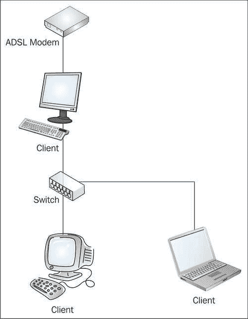
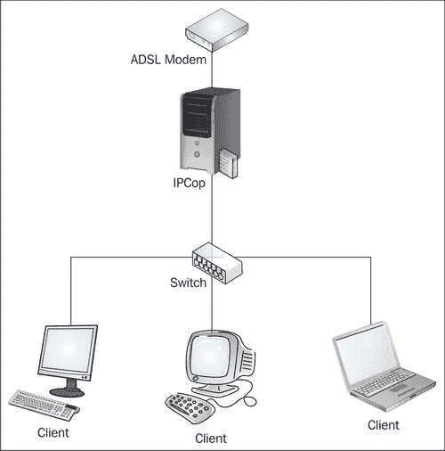
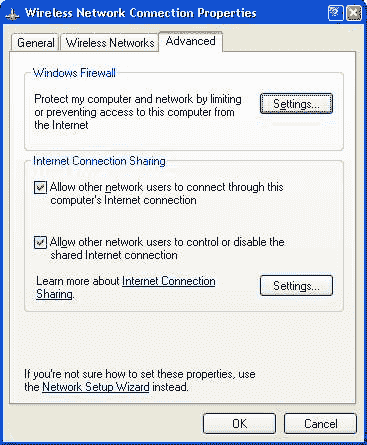
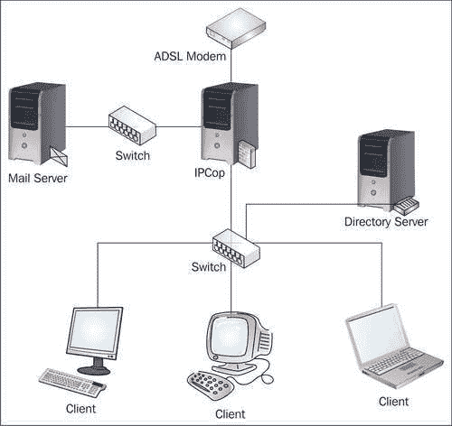

# 三、部署 IPCop 和设计网络

既然我们了解了 IPCop 作为未连接到任何其他系统的防火墙所能起到的作用，我们需要开始考虑它是如何连接到这些系统的，以及它对我们的影响是什么。 正如您现在必须意识到的那样，部署 IPCop 的范围是多种多样的，特别是结合 Linux 知识和开放源码软件的灵活性，即使是一个 IPCop 机器的可能排列也是相当无限的！ 也就是说，大多数网络都使用核心功能，在所有这些排列中，有几个核心网络布局可能会在大多数 IPCop 部署中通用。

因此，我们在这里要做的是概述部署 IPCop 的几种常见方法以及这些拓扑背后的动机，具体取决于我们要部署的 IPCop 组件。

# 接口之间的信任关系

正如我们现在所了解的，IPCop 支持的四种类型的网络接口(绿色、红色、蓝色和橙色)具有不同的相关信任级别。 以下是一个简单的表格，概述了允许哪些流量进出哪些接口。 在考虑使用多少接口以及使用它们做什么时，此表以及其中包含的知识应构成我们规划的基础。 这基本上是 IPCop 管理指南([http://www.ipcop.org/1.4.0/en/admin/html/section-firewall.html](http://www.ipcop.org/1.4.0/en/admin/html/section-firewall.html))中的流量流程图。

<colgroup><col width="1.11527777777778" style="text-align: left"> <col width="0.9375" style="text-align: left"> <col width="0.721527777777778" style="text-align: left"> <col width="1.60317414529914" style="text-align: left"></colgroup> 
| 

接口来自

 | 

接口到

 | 

地位 / 状态 / 身份

 | 

如何访问

 |
| --- | --- | --- | --- |
| 红颜料 / 赤字 / 红衣 / 红葡萄酒红颜料 / 赤字 / 红衣 / 红葡萄酒红颜料 / 赤字 / 红衣 / 红葡萄酒红颜料 / 赤字 / 红衣 / 红葡萄酒 | 防火墙（与）奥兰治会（有关）的蓝色 / 蓝色颜料 / 蓝色物品 / 蓝灰蝶绿色的 / 幼嫩的 / 未熟的 / 青春的 | 关闭的 / 歇业的 / 不公开的关闭的 / 歇业的 / 不公开的关闭的 / 歇业的 / 不公开的关闭的 / 歇业的 / 不公开的 | 外部访问端口转发端口转发/VPN 端口转发/VPN |
| （与）奥兰治会（有关）的（与）奥兰治会（有关）的（与）奥兰治会（有关）的（与）奥兰治会（有关）的 | 防火墙红颜料 / 赤字 / 红衣 / 红葡萄酒蓝色 / 蓝色颜料 / 蓝色物品 / 蓝灰蝶绿色的 / 幼嫩的 / 未熟的 / 青春的 | 关闭的 / 歇业的 / 不公开的坦率的 / 公开的 / 敞开的 / 营业着的关闭的 / 歇业的 / 不公开的关闭的 / 歇业的 / 不公开的 |   |   | DMZ 针孔 DMZ 针孔 |
| 蓝色 / 蓝色颜料 / 蓝色物品 / 蓝灰蝶蓝色 / 蓝色颜料 / 蓝色物品 / 蓝灰蝶蓝色 / 蓝色颜料 / 蓝色物品 / 蓝灰蝶蓝色 / 蓝色颜料 / 蓝色物品 / 蓝灰蝶 | 防火墙红颜料 / 赤字 / 红衣 / 红葡萄酒（与）奥兰治会（有关）的绿色的 / 幼嫩的 / 未熟的 / 青春的 | 关闭的 / 歇业的 / 不公开的关闭的 / 歇业的 / 不公开的关闭的 / 歇业的 / 不公开的关闭的 / 歇业的 / 不公开的 | 蓝色通道蓝色通道蓝色通道 DMZ 针孔/VPN |   |   |
| 绿色的 / 幼嫩的 / 未熟的 / 青春的绿色的 / 幼嫩的 / 未熟的 / 青春的绿色的 / 幼嫩的 / 未熟的 / 青春的绿色的 / 幼嫩的 / 未熟的 / 青春的 | 防火墙红颜料 / 赤字 / 红衣 / 红葡萄酒（与）奥兰治会（有关）的蓝色 / 蓝色颜料 / 蓝色物品 / 蓝灰蝶 | 坦率的 / 公开的 / 敞开的 / 营业着的坦率的 / 公开的 / 敞开的 / 营业着的坦率的 / 公开的 / 敞开的 / 营业着的坦率的 / 公开的 / 敞开的 / 营业着的 |   |   |   |

在可视化通信通过 IPCop 防火墙的方式中，我们可以将其视为与交通警察(字面意思是 IP Cop-因此得名！)的一个巨大交汇点。 在它的中间。 当汽车(网络术语中是数据包)到达十字路口时，COP(根据 IPCop 使用的路由表)决定数据包应该朝哪个方向移动，并将其推向适当的方向。

在绿色客户端访问 Internet 的情况下，我们可以从上一表中看到此访问是开放的，因此 COP 允许流量通过。 然而，在其他情况下，情况可能并非如此。 例如，如果蓝色客户端尝试访问绿色网段上的客户端，如果流量通过 VPN 或通过 DMZ 针孔，则 CoP 可能会允许流量通过-但如果蓝色网段上的客户端既没有明确允许流量，也没有明确允许流量，它就会被停止。 车停在路边，乘客们在牢房里度过了一段虚拟的时间！

请注意，(通常)当我们说明 IPCop 配置时，红色接口位于最上方(北部)，橙色接口位于左侧(西部)，蓝色接口位于右侧(东部)，绿色接口位于底部(南部)。 对于所有四个接口，如下所示：

# 更改 IPCop 功能

与 IPCop 防火墙行为的许多方面一样，可以改变防火墙规则的行为，以便定制 IPCop 以满足默认规则无法迎合的拓扑。 在防火墙规则的上下文中，IPCop 从 1.4 系列版本开始就有一个文件，允许用户专门添加他们自己的防火墙规则(`/etc/rc.d/rc.firewall.local`)。 从 1.3 版开始，已有 iptables 链、*CUSTOMINPUT、CUSTOMFORWARD、*等，允许手动添加 iptables 规则。

具体使用 iptables 超出了我们的范围，但我们建议感兴趣的读者阅读：

Linux iptables 如何在[http://www.linuxguruz.com/iptables/howto/](http://www.linuxguruz.com/iptables/howto/)

# 拓扑一：NAT 防火墙

我们的第一个拓扑是作为市场上存在的许多 NAT 防火墙的临时替代品而存在的。 在小型办公室和家庭中，经常部署 D-Link、Linksys 和 Friends 销售的嵌入式 NAT 防火墙等解决方案，以便为小型网络提供经济高效的互联网接入。 一些解决方案，如**互联网连接共享**(参见[http://www.microsoft.com/windowsxp/Using/Networking/Learnmore/default.mspx](http://www.microsoft.com/windowsxp/)了解微软提供的互联网连接共享的更多信息)、组合 NAT 防火墙、DNS 代理和 DHCP 服务器(从 Windows98 开始内置于客户机版中)也经常使用，以便允许一台带有调制解调器或网络接口的 PC 充当其他客户机的网络网关。 出于我们这里的目的，我们将考虑**ICS**，因为具有 ICS 的这种拓扑实际上是替换诸如 Linksys 或 NETGEAR 型号的路由器所需工作的超集，如前所述，我们从这些路由器之一迁移到 IPCop 将是相同的，除了客户端上的 ICS 软件退役-如果我们移除路由器，这是不必要的，并且路由器可以保持原样配置(和/或作为备份， 或在其他地方重用)(参见[Windows](http://www.annoyances.org/exec/show/ics)以了解有关在不同 http://www.annoyances.org/exec/show/ics 版本上实现(并因此退役)ICS 的更多信息)。

具有 ICS 的此类拓扑可能如下所示：

这种解决方案虽然便宜且方便，但通常不具有可扩展性或可靠性，并且安全性较差。 它们使工作站面临不必要的安全风险，提供的吞吐量有限，而且通常不可靠，需要频繁重新启动和锁定。

与软件防火墙一样，网络防火墙被设计为您的工作站和 Internet 之间的屏障。 通过将您的一台工作站直接连接到 Internet 并使用类似 ICS 的解决方案，尽管您减少了共享 Internet 连接所需的资源，但您会使该工作站面临不必要的风险。 该 PC 也有义务始终处于开机状态-与没有不必要组件的低端 PC 和运行 IPCop 的低功耗 PSU 相比，这可能会更嘈杂，功耗也更高。

IPCop 在这种情况下提供了经济高效的替代方案，为小型企业和家庭用户提供了强大的防火墙，而不需要过于复杂，并添加了嵌入式解决方案或 IC 中没有的其他功能，如可自定义的 DHCP 服务器、入侵检测和代理服务器等。

在这种情况下，当 IPCop 充当替代网络时，替代网络可能如下所示：

这样的拓扑确保在数据到达客户端之前进行防火墙，使用一个设计用作网络防火墙的软件包，从而极大地提高了对客户端的服务质量以及他们的网络提供的安全性。 在这种情况下，使用的 IPCop 组件为：

*   绿区/红区

*   DHCP 服务器

*   DNS 服务器

在这种情况下，网络管理员或顾问还可以选择启用以下任何功能，以增强向网络提供的服务：

*   入侵检测

*   IPSec，以便允许远程工作或远程支持

*   端口转发，以便允许远程访问 VNC 或终端服务/远程桌面，实现远程支持的简化远程访问模型(比 IPSec 更方便，但本质上更不安全)

在这种情况下停用 ICS 非常简单-我们只需禁用 ICS 功能，如下面的屏幕截图所示(取自外部、面向 Internet 的 ICS 网络接口的网络连接属性)。

删除 IC 与取消选择**允许其他网络用户通过此计算机的 Internet 连接**选项一样简单。 完成此操作后，我们应点击**OK**，如果要求重新启动，则可以自由禁用和/或移除工作站上的外部接口(如果我们希望在机器中保留第二个网卡或如果它有两个板载网卡，则禁用；如果我们使用的是外部调制解调器或其他硬件，则可以移除，如果我们打算移除或安装在 IPCop 主机上)。

### 笔记 / 便条 / 票据 / 注解

**IPCop 的入侵检测系统**

入侵检测功能是 IPCop 的一个功能强大的组件，易于启用和使用。 虽然精确分析 IPCop 的 IDS 生成的日志文件需要相当多的技能和经验，但它很容易打开，除非 IPCop 防火墙有特定的空间要求(即，它在硬盘或闪存卡非常小的设备上运行，或者 CPU/内存不足以执行分析)，但没有令人信服的理由不启用 IDS 系统。

此拓扑的防火墙规则很简单；由于自动允许绿色网段访问 Red 接口上的资源，因此设置此设置不需要特定于拓扑的设置。

为如此小的办公环境部署 IPCop 的另一个重大好处是，在需要业务增长的情况下，其拥有的解决方案是可扩展的。 这样的企业在一个工作组中运行几个 Windows 工作站，可能会认为一个工作组不足以满足其需求，并且需要集中管理、文件存储和配置。

即使在这样的升级前场景中，IPCop 也很有优势，因为它提供了一个内置的、开放的升级路径。 从简单的 NAT 和 DHCP 迁移到具有多个网段、端口转发和代理服务器的网络不需要硬件或软件升级。 如果服务器已经有几个网卡(以目前的价格，如果预期会扩展，它没有理由不这样做)，这甚至可以在对现有客户端的服务很少或没有明显中断的情况下完成。

# 拓扑二：带 DMZ 的 NAT 防火墙

在公司不断壮大的小型办公室环境中，对传入电子邮件的需求可能会迫使激活橙色区域，并在此细分市场中部署和安装邮件服务器。

这样的公司可能会选择将其桌面和内部服务器基础设施保留在 Green 网段内，并将其位于 DMZ 中的 ITS 服务器放置在交换机/集线器上，或者简单地使用交叉电缆连接到 IPCop 主机的 Orange 接口。 当这样的系统暴露在互联网上时，这种细分提供了一个相当大的优势，因为它提供了一条“阻止线”，入侵者如果超过这条线，就更难升级他或她对网络的访问。

### 笔记 / 便条 / 票据 / 注解

**DMZ 和外部网段基础设施**

虽然使用交叉电缆将 DMZ 服务器或外部路由器连接到防火墙(或另一台路由器)通常非常方便，但使用集线器或交换机通常会带来好处-不可避免的是，当您实际需要此角色的交换机或集线器时，可能需要排除与这些系统相关的连接问题，在这种情况下，您可能无法在足够的时间内找到并安装集线器/交换机，或者可能不想中断任何剩余的连接。

使用集线器和交换机还可以规划未来的扩展，使您能够更轻松地添加另一个系统。 带有六个端口的小型交换机也真的不贵！

一段时间以来，Microsoft 的 Exchange 邮件服务器通过使用“前端”和“后端”交换角色来支持这样的配置(尽管这些角色将在未来的 Exchange 版本中弃用)。 但是，对于不同的网络配置，例如使用 Novell 的 eDirectory 或 RedHat 的目录服务器(RHDS)或过滤设备等管理系统的 Linux 客户端，具有面向外部的 SMTP 服务器(可能运行开放源码的 MTA ExIm)的类似系统将同样受益。

在此拓扑中，客户端可以自由连接到邮件服务器(无论是通过 POP、IMAP、RPC 还是 RPC over HTTP)。 为了让作为网络域的一部分存在的邮件服务器向目录服务器进行身份验证，我们还需要使用 DMZ 针孔功能打开到目录服务器的适当端口(取决于目录提供商)。

### 笔记 / 便条 / 票据 / 注解

**防火墙 Active Directory 域控制器**

有关活动目录需要具体复制哪些端口(即，如果邮件主机和目录服务器是域控制器，则在域控制器之间)的信息，请访问[http://www.microsoft.com/technet/prodtechnol/windows2000serv/technologies/activedirectory/deploy/confeat/adrepfir.mspx](http://www.microsoft.com/technet/prodtechnol/windows2000serv/technologies/activedirectory/deploy/confeat/adrepfir.mspx)

虽然在这种情况下，DMZ 的安全优势将是有限的，因为邮件主机的危害将意味着域控制器的危害，但仍有轻微的安全优势-但是，不建议在面向 Internet 的角色中运行域控制器！

可以在以下文章中找到与域控制器对话的客户端或服务器所需的端口，其中详细介绍了在 Windows 2003 系统上配置 Windows 防火墙所需的端口：

[http://support.microsoft.com/default.aspx?scid=kb；en-us；555381&sd=rss&spid=3198](http://support.microsoft.com/default.aspx?scid=kb;en-us;555381&sd=rss&spid=3198)

我们还设置了从 IPCop 防火墙的外部 IP 地址到邮件服务器上的端口 25 的端口转发规则。 这允许外部邮件服务器连接到邮件服务器以传递电子邮件。

在此拓扑中，邮件服务器(在绿色网段中可能危及整个网段)的危害受到控制，因为防火墙提供了一定程度的保护。

在这样的拓扑中，我们使用 IPCop 防火墙的以下功能：

*   红色、橙色、绿色区域

*   DMZ 针孔

*   DHCP 服务器

*   DNS 服务器

*   转发到橙色网段的端口

我们还可以选择使用以下任何功能元素：

*   入侵检测系统

*   端口转发到邮件服务器上的 Web 服务器(用于通过 Web 邮件解决方案(如 Horde、SquirrelMail 或 Outlook Web Access)外部访问 IMAP 或 Exchange 邮箱)

*   代理服务器(用于桌面互联网访问)

*   IPSec，用于远程访问 Green and Orange 细分市场中的服务器或提供外部支持

*   邮箱在绿色区域中的后端邮件服务器，使用橙色区域中的服务器作为中继，执行反垃圾邮件和防病毒扫描/过滤

# 拓扑三：带 DMZ 和无线的 NAT 防火墙

在较大的组织中，或者如果上面的网络发展壮大，我们可能会选择使用一个或多个 IPCop 防火墙来扩展我们的网络拓扑。 非常大的网络不在本书的讨论范围之内，因为它们需要网络/IT 专业人员需要从多个来源收集的聚合知识和经验。

### 笔记 / 便条 / 票据 / 注解

**IPCop 邮件列表**

IPCop 用户邮件列表是有关扩展 IPCop 并将其部署到更高级角色的非常好的信息来源。 对于那些对 IPCop 感兴趣的人来说，这本书值得订阅和细读。 此邮件列表的存档可在[https://sourceforge.net/mailarchive/forum.php?forum_id=4957](http://https://sourceforge.net/mailarchive/forum.php?forum_id=4957)找到，订阅页面位于[http://lists.sourceforge.net/lists/listinfo/ipcop-user](http://lists.sourceforge.net/lists/listinfo/ipcop-user)。

这样的个人可以使用几个 IPCop 防火墙来分隔几个站点，或者为了进一步分隔一个或多个具有物理上不同的防火墙的 DMZ。

同样值得考虑的是，IPCop 主要针对中小型企业和家庭/家庭办公市场中作为唯一网络防火墙的网络而设计。 虽然可以在更大的部署中设置 IPCop，但这种情况相当少见，而且可以说还有其他包更适合这种部署。 在这种情况下，IPCop 网络分段的约束开始变得更加繁重，而定制 IPCop 以满足组织需求所需的工作量可能会超过手动设置另一个防火墙包以适应相同拓扑所需的工作量。(=

在本示例中，我们将考虑部署一个 IPCop 盒的最广泛范围，使用所有四个网络接口保护具有内部(绿色)网络、Internet 或 WAN 连接(红色)、包含多个服务器的 DMZ(橙色)以及具有 IPSec VPN 系统的无线网段(蓝色)的网络。

在这种情况下，我们几乎肯定会选择部署 IPCop 包含的所有高端功能，例如代理服务器和入侵检测系统。

在这种情况下，我们为各个网络接口提供的服务如下：

在 Red 接口上，除了默认的防火墙策略外，我们还调用端口转发功能，以允许连接到 DMZ 中端口 25 上的邮件服务器，以及连接到邮件服务器上的端口 443(HTTPS)，以便连接到企业 WebMail 系统。 我们还允许进入 IPCop 防火墙的 IPSec 连接，以便允许远程工作的员工进行远程访问，并为 IT 员工和第三方软件和硬件供应商提供远程连接以提供支持。

在 Blue 接口上，我们通过 IPSec VPN 为客户端提供连接，以便他们可以访问从 Green 网段和 DMZ 网段内部的服务器运行的服务。 供应商和访问者可以通过在无线接入点上配置的预共享密钥模式下使用 WPA 来访问绿色网段。

### 笔记 / 便条 / 票据 / 注解

**WPA 和 WEP**

WPA 旨在引入更高级的无线标准的一些功能，旨在完全取代 WEP，但在该标准制定之前。 保护 802.11 个无线局域网的 wep 系统的不安全性是有据可查的，wpa 最引人注目的是使用 tkip 协议(以及其他更改)不断更改用于加密空中传输的数据的加密密钥。 使用 TKIP 而不是经常使用的密钥可以极大地降低加密被破解的严重程度(实际上，它只在短时间内被破解)，尽管这确实意味着用于生成这些加密密钥的预共享密钥必须是强的，并且受到严密保护。

WPA-RADIUS 或 WPA-Enterprise 使用 RADIUS 服务器。 RADIUS 通常用于向交换机或系统验证用户以提供 Internet 服务，它允许接入点强制客户端计算机使用用户名和密码或加密证书向 RADIUS 服务器进行身份验证，然后才允许客户端计算机与无线接入点完全关联。 以这种方式利用 RADIUS 服务器比使用 WPA-PSK 安全得多，这既是因为消除了预共享密钥的不安全性(每个客户端具有其自己的证书或用户名/密码，并且可以单独锁定或分发这些证书或用户名/密码)，还因为为每个客户端创建了唯一的加密隧道，使得无线网络的行为在逻辑上更像交换机而不是集线器(通过使用加密)。

WPA2 消除了 WPA 和 TKIP 的一些加密弱点，功能更强大，并使用 AES 加密标准来实现最大的数据安全性。

微软 TechNet 提供了关于使用其 RADIUS 服务器(互联网身份验证服务)实施 WPA-RADIUS 的优秀指南，可通过 Microsoft TechNet 在线获得，网址为：使用证书服务保护无线局域网：[http://www.microsoft.com/technet/security/prodtech/windowsserver2003/pkiwire/swlan.mspx?mfr=true](http://www.microsoft.com/technet/security/prodtech/windowsserver2003/pkiwire/swlan.mspx?mfr=true)

使用 PEAP 和密码保护无线局域网：[http://www.microsoft.com/technet/security/topics/cryptographyetc/peap_0.mspx](http://www.microsoft.com/technet/security/topics/cryptographyetc/peap_0.mspx)

只有一个接入点的 WPA-PSK 可防止未经授权的用户访问无线网段和互联网，对于大多数中小型网络来说，这是一个合适的解决方案；对于那些没有实现 RADIUS 或证书服务的接入点或网络基础设施的用户，使用更新的、支持 WPA2-PSK 的接入点可以更好地提高安全性。

防火墙策略和 IPSec 系统确保访问者/供应商只能访问红色区域(互联网)，而不能访问网络上的任何资源。

在 Orange 界面上，我们的针孔允许 DMZ 服务器连接到 Green 段中的目录服务器和 Kerberos 域控制器，以便对通过公司目录系统登录到它们的用户进行身份验证。 这可确保集中管理这些服务器的策略和配置，并集中存储这些服务器的日志，但极大地降低了这些面向外部的服务的危害，从而确保了业务安全和法规遵从性。

在绿色接口上，我们允许连接到所有接口，因为绿色部分中的工作站和服务器是托管服务工作站，用户在这些工作站上没有必要的访问权限来损坏他们有权访问的资源。

在这种情况下，我们使用以下 IPCop 功能：

*   红色、橙色、绿色、蓝色区域

*   DMZ 针孔

*   DHCP 服务器

*   DNS 服务器

*   转发到橙色网段的端口

*   用于远程访问绿色、橙色和蓝色网段的 IPSec

*   蓝色用户访问内部资源的 IPSec

*   入侵检测系统

*   将端口转发到外部邮件服务器上的 Web 服务器

*   代理服务器(用于桌面互联网访问)

在较大的组织中，我们还可以选择在站点到站点模式下使用 IPSec，以便将此办公室与一个或多个分支或父办公室链接起来。 在这一角色中，就像在单个网络防火墙的角色中一样，IPCop 出类拔萃。

# 规划站点到站点 VPN 拓扑

除了*本地*服务(如前面在我们的 IPCop 部署中说明的服务)外，我们还可能使用 IPCop 中的 IPSec 软件为分支机构或父办公室、业务合作伙伴、支持公司或第二个站点配置站点到站点的 VPN。 在这种情况下，随着网络的发展，拓扑规划可能会变得很重要。

如果我们有多个站点，考虑如何配置我们的 VPN 隧道以便为我们的客户端提供服务和稳定性的平衡，这一点很重要。 例如，在连接到一个总部的两个分支机构都包含彼此同步内容的文件服务器的情况下，在‘辐条’拓扑中设置从分支机构到总部的两个 VPN 隧道几乎没有意义。 在文件传输过程中，额外的跳跃会减慢主站点的互联网连接速度，从而导致传输速度变慢。

相反，如果我们有许多较小的办公室，对站点到站点的流量要求最低，而总部有很大的互联网连接，我们可能会认为，对我们来说，通过单一地点集中所有网络活动的额外控制是值得的。 随着网络的增加，在“网状”配置中从一个站点到另一个站点形成单独的 VPN 隧道可能会变得非常复杂和难以管理-尽管与 IPCop 部署相比不太可能，但如果不考虑使用 RIP 或 OSPF 等路由协议为我们计算路由表，这样一个由十几台左右的服务器组成的部署将越来越难以灵活管理！

在考虑您的 VPN 设计时，花点时间确定您在冗余和速度方面的目标(例如，在您的主站点出现故障的情况下，从远程办公室到彼此设置 VPN 的额外负担值得吗？)。 把它写在纸上，想一想你的 VPN 上会有什么流量，然后为你挑选最适合你的、可扩展的设计。

# 摘要

在本章中，我们简要概述了 IPCop 可以部署在适合它的角色中的三种情况，并分析了在这些情况下使用 IPCop 的优势和缺陷。

书中将进一步使用这三种拓扑作为维护和部署的案例研究。

拓扑一：为一些客户端执行网络地址转换的双宿主防火墙。 这是替代小型 SOHO 路由器或微软互联网连接防火墙的绝佳替代产品。 与适用于类似情况的其他解决方案相比，该解决方案更安全、更可靠、可伸缩性更强。

此拓扑使用 IPCop 的 NAT 功能，可以使用端口转发进行外部服务访问，使用入侵检测系统提高网络安全性。

拓扑二：具有单独网段的 DMZ 防火墙，用于面向外部的服务，如传入邮件。 通常由已无法使用单个子网网络的中小型企业使用，它是具有嵌入式设备的小型网络与具有商用或中高端防火墙的大型网络之间的常见垫脚石。

此拓扑使用 IPCop 的 NAT 功能以及 DMZ 针孔，以便允许 DMZ 网段中的服务器访问资源并向绿色区域中的服务器进行身份验证。 入侵检测系统可用于增加安全性，端口转发用于允许外部(红色区域)访问在 DMZ 中的主机上运行的服务。

拓扑三：具有独立网段的 DMZ 防火墙，用于面向外部的服务，如传入邮件和无线访问。 这通常由单个子网网络无法满足需求的中小型企业使用。 这类似于第二种拓扑，它为不太可信的网络上的无线客户端添加了第三个内部网段，即蓝色区域。

这可能是拓扑 2 的常见扩展，也可能是将具有两个工作站网段的较大网络分段的一种方式。

此拓扑使用 IPCop 的 NAT 功能以及 DMZ 针孔，以便允许 DMZ 网段中的服务器访问资源并向绿色区域中的服务器进行身份验证。 入侵检测系统可用于增加安全性，端口转发用于允许外部(红色区域)访问在 DMZ 中的主机上运行的服务。 使用 IPSec 服务器是为了允许蓝色区域中的主机访问绿色区域和橙色区域中的资源。

此拓扑也可用于在不使用无线技术的情况下对网络进行分段或提供更好的安全性。