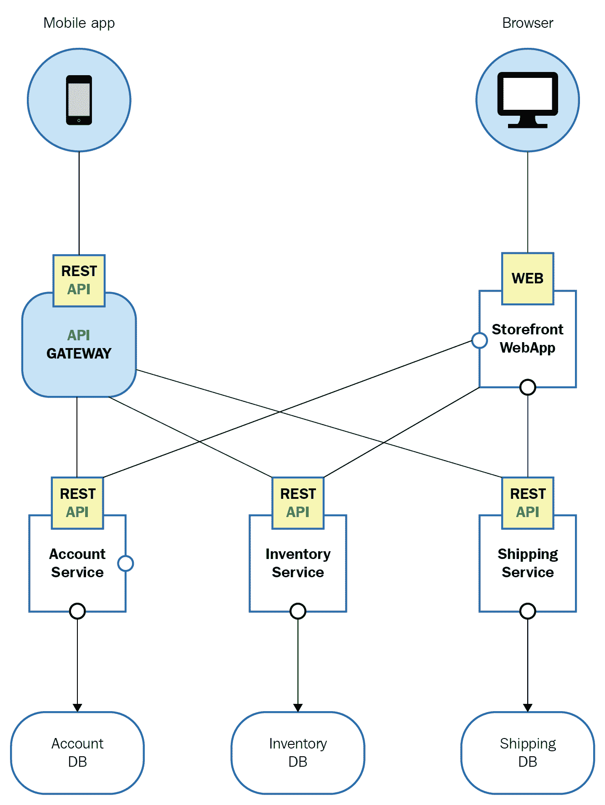
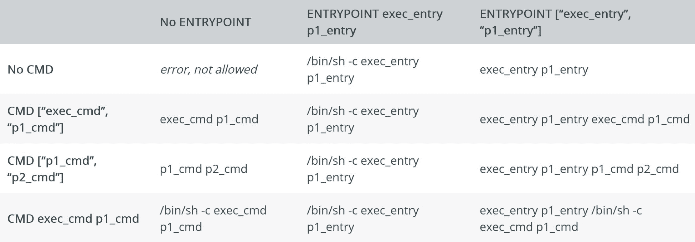
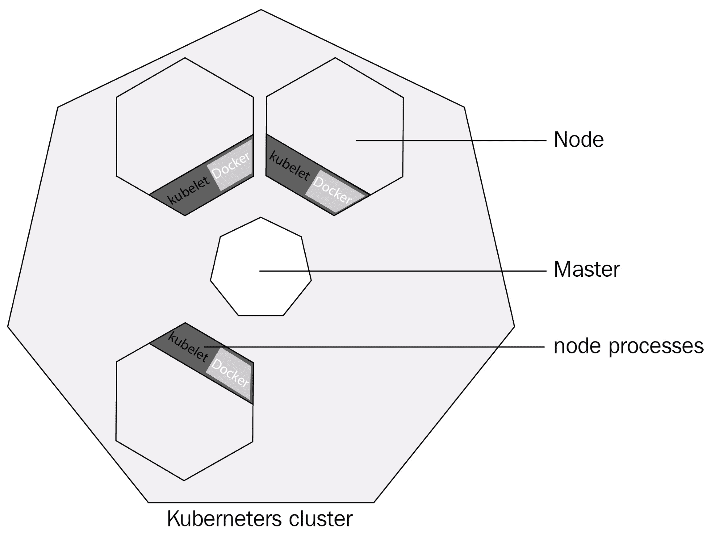

# 六、创建高可用性自我修复架构

在本章中，我们将介绍信息技术行业如何从使用单一应用发展到云原生、容器化和高可用性的微服务。

通过开源，我们可以提供解决方案，使我们能够根据用户消费创建应用的高可用性和按需扩展。

我们将在本章中讨论以下主题:

*   描述微服务
*   为什么容器是微服务的家
*   我们如何编排我们的容器
*   探索开源中最常用的管弦乐手，Kubernetes。

# 微服务

微服务用于以模块化的方式设计应用，其中每个模块都是独立部署的，它们通过 API 相互通信。所有这些模块一起工作来交付一个应用，其中每个功能都有自己的目的。

例如，让我们看一下一家在线商店。我们只能看到主网站；然而，在后端有几个微服务发挥作用，一个服务接受订单，另一个服务根据您以前的浏览、支付处理、评论和评论处理程序等为您建议项目。

下图是一个微服务应用的示例:



本质上，微服务应用不需要庞大的团队来支持整个应用。一个团队只支持一个或两个模块，在最终产品的每个活动部分的支持和专业知识方面创造了一个更精细的方法。支持和开发不仅是颗粒的，也有失败的。在单个微服务失败的情况下，只有应用的这一部分会失败。

继续我们的在线商店示例，假设处理评论和评论的微服务失败了。这是因为我们的网站是使用微服务构建的，因此只有我们网站的该组件对我们的客户不可用。

然而，他们仍然可以毫无问题地继续购买和使用网站，虽然用户无法看到他们感兴趣的产品的评论，但这并不意味着我们整个网站的可用性受到损害。根据导致问题的原因，您可以修补微服务或重新启动它。不再需要关闭整个网站进行修补或重启。

作为基础设施工程师，您可能会想，为什么我必须知道什么是微服务，或者它有什么好处？原因很简单。作为架构师或基础架构工程师，您正在为这种类型的应用构建底层基础架构。无论它们是运行在单个主机上的单一应用，还是分布在多个容器中的微服务，它都肯定会影响您设计客户体系结构的方式。

在这里，Linux 将是您最好的朋友，因为您会发现多个开源工具，这些工具将帮助您保持高可用性、负载平衡以及与 Docker、Kubernetes、Jenkins、Salt 和 Puppet 等工具的**持续集成** ( **CI** )/ **持续交付** ( **CD** )。因此，每当客户问你他应该开始设计他的微服务应用的操作系统环境时，Linux 将是你的答案。

目前，Docker Swarm 和 Kubernetes 在容器编排方面处于领先地位。说到微服务，在为客户设计基础架构时，容器也是您的首选。

我们将在[第 7 章](07.html)*中深入探讨 Kubernetes，了解 Kubernetes 集群*的核心组件，并展示它将如何帮助您为托管微服务和其他类型的应用编排和交付一个优雅但复杂的解决方案。

然而，在谈论 Kubernetes 或容器编排之前，我们需要解释容器的概念，以便理解为什么它们非常适合容纳微服务应用。

Linux 中的容器已经有一段时间了，但是直到几年前(随着 Docker Engine 的发布)，它们才获得了所有技术社区的动力和钦佩。容器在正确的时间发挥了作用，随着微服务架构的兴起，它们开始留下来，并正在塑造我们设计和执行它的方式。

让我们后退一步，这样您就可以了解此类技术的优势。想象一下，您有一个简单的整体应用，它运行一个应用编程接口，您可以从该应用编程接口中查询用户列表以及他们从您托管在同一个应用捆绑包中的网站上购买的内容。

过了一段时间，您的客户看到他们的应用编程接口在其他应用中变得非常流行，这些应用现在在高峰时间发出数千个 HTTP `GET`请求。当前的基础架构无法处理如此多的请求，因此您的客户要求您以能够处理更多请求的方式扩展他们的基础架构。这里的问题是，因为这是一个单一的应用，您不仅需要计算应用编程接口所需的资源，还必须考虑与应用编程接口一起托管的网络商店前端，尽管应用编程接口是您实际上需要扩展的唯一东西。

这将是资源的浪费，因为你也在使用网络商店前端，这不需要任何额外的副本或资源。您正在将宝贵的，有时是昂贵的(如果您在公共云中)存储、内存和 CPU 资源浪费在实际上并不需要的东西上。

因此，这就是微服务以及用于托管此类应用的容器发挥作用的地方。有了容器映像中的微服务，您不必在每次因需求而需要扩展服务时都调配一台新服务器，也不必在每次执行应用或操作系统更新时都重新启动服务器或处理包依赖关系。只需一个简单的命令(`docker container run companyreg.io/storeapi:latest`)，您的应用就可以启动并准备好服务请求了。同样，如果您的应用失败了，只需重新启动您的容器或提供一个新的容器，您就可以开始了。如果对微服务进行的更新有错误怎么办？只需继续并恢复到以前的图像版本，您就可以重新启动并运行；没有必要开始卸载更新的库或处理依赖性问题。

容器还允许跨应用部署的一致性，因为正如您可能知道的，安装包有多种方式。可以通过`apt`、`yum`、`apk`等包管理器，也可以通过`git`、`/curl/wget`、`pip`、`juju`等包管理器，根据安装方式的不同，包管理器还会定义维护方式。

想象一个生产环境，开发人员将他们的包发送到**开放评测标准** ( **OPS** )团队进行部署，每个 OPS 工程师以不同的方式部署应用！这将变得不可支持，并且非常难以跟踪。带有应用的容器映像将创建一致性，因为无论您将它作为容器部署在哪里，它对于所有配置文件、二进制文件、库和依赖项的位置都是相同的。所有内容都将被隔离到一个容器中，该容器运行有自己的**进程名称空间** ( **进程名称空间**)、网络名称空间和**挂载名称空间** ( **MNT 名称空间**)。

在微服务中构建应用的目的是为应用中的每个微服务提供隔离，以便可以轻松管理和维护它们，而容器正是实现了这一点。您甚至可以定义每次容器出现时您希望如何启动应用——同样，一致性在这里起着主导作用。

# 创建容器图像

构建容器的方式是通过一个叫做 **Dockerfile** 的东西。Dockerfile 基本上是一组关于如何构建容器映像的指令；典型的 Dockerfile 如下所示:

```sh
FROM ubuntu:latest
LABEL maintainer="WebAdmin@company.com"

RUN apt update
RUN apt install -y apache2
RUN mkdir /var/log/my_site

ENV APACHE_LOG_DIR /var/log/my_site
ENV APACHE_RUN_DIR /var/run/apache2
ENV APACHE_RUN_USER www-data
ENV APACHE_RUN_GROUP www-data

COPY /my_site/ /var/www/html/

EXPOSE 80

CMD ["/usr/sbin/apache2","-D","FOREGROUND"]
```

如您所见，这是一组可读性很强的指令。甚至不知道每条指令做什么，我们就可以承担它的功能，因为它与英语非常相似。这个 Dockerfile 只是一个例子，也是目前为止最有效的方法。

图像本质上类似于**虚拟机** ( **VM** )世界中的模板；它是一组只读层，包含部署容器所需的所有信息—从单个映像中，您可以部署多个容器，因为它们都在自己的可写层上工作。

例如，无论何时拉取图像，您都会看到以下输出:

```sh
[dsala@redfedora ~]# docker pull httpd:latest
latest: Pulling from library/httpd
d660b1f15b9b: Pull complete
aa1c79a2fa37: Pull complete
f5f6514c0aff: Pull complete
676d3dd26040: Pull complete
4fdddf845a1b: Pull complete
520c4b04fe88: Pull complete
5387b1b7893c: Pull complete
Digest: sha256:8c84e065bdf72b4909bd55a348d5e91fe265e08d6b28ed9104bfdcac9206dcc8
Status: Downloaded newer image for httpd:latest
```

您看到的每个`Pull complete`实例对应于图像的一个图层。那么，这些层是什么，它们来自哪里？

当我们执行图像的构建时，我们在 Dockerfile 中定义的一些指令将创建一个新的层。文件中的每个指令都在容器中的读写层中执行，在构建结束时，这些指令将被提交给最终的层栈，该栈将形成最终的图像。需要注意的一点是，即使构建过程中的每个指令都在一个容器中执行，也不是所有的命令都会创建使图像在大小和图层方面变大的数据——其中一些命令只会写入名为**图像清单**的东西，它本质上是一个包含所有图像元数据的文件。

让我们进一步探究每个命令。

# 从

`FROM`指令表明你最初的形象是什么，本质上，你将开始建立自己的形象的基础。

您在这里放什么将取决于您的需求，例如，哪个映像预装了我的应用所需的库，哪个映像已经有了我编译应用所需的编译器，或者哪个映像对我们的最终大小影响最小。例如，您的应用构建在 Python 2 上。不需要用 CentOS 或者 Ubuntu 作为初始镜像，然后手动安装 Python，只需要使用`python:2.7`镜像就可以了，它已经会自带 Python 为你预装了。

显然，这里有更多的事情需要考虑，但是我们将在本章的后面讨论形象构建的最佳实践。

由于此指令采用另一个图像并将其用作基础，因此您的最终图像将继承您的基础图层；因此，最终层数如下:

*最终图像图层=基础图像图层+您创建的图层*

# 标签

`LABEL`指令非常容易解释——它用键值对将图像标记为元数据，您稍后可以通过`docker inspect`命令检索这些元数据。您可以使用它来添加您希望图像用户知道的数据。通常，它用于添加有关图像作者的信息，如他们的电子邮件或公司:

```sh
LABEL maintener="john.doe@company.com"
```

因为这个指令只是元数据，不会给你的图像增加额外的图层。

# 奔跑

有了`RUN`，你将运行你需要准备你的容器来运行你的应用的命令；例如，安装软件包、编译代码以及创建用户或目录。`RUN`有两种运行命令的方式。

Shell 形式如下:

```sh
 RUN <command>
```

在这种形式下，尽管您可以使用`SHELL`指令更改 Shell，但默认情况下，您的所有命令都将使用`/bin/sh -c`Shell 运行，如下所示:

```sh
 SHELL ["/bin/bash", "-c"]
 RUN echo "Hello I'm using bash" 
```

`SHELL`关键字只能以 JSON 数组格式运行，这就引出了第二种可以用来运行`RUN`指令的形式。

执行形式如下:

```sh
RUN ["echo","hello world"]
```

除了格式之外，这里的主要区别在于，在 exec 表单中不调用 shell，因此不会发生正常的变量替换，相反，您必须调用 shell 作为命令，以便 shell 能够提供变量扩展:

```sh
 RUN ["/bin/bash","-c","echo $HOME"]
```

由于`RUN`关键字的性质，它的每个实例都将在一个新的图层上执行，并提交给最终的图像，因此，每次使用`RUN`时，它都会为您的图像添加一个新的图层。

# 包封/包围（动词 envelop 的简写）

对于`ENV`，没什么好说的——这条指令为环境设置变量。它们将在构建时使用，并且在容器运行时可用。`ENV`不会为容器生成额外的层，因为它将环境变量作为元数据存储在图像清单上:

```sh
 ENV <key>=<value>
```

`ENV`的参数以`<key>` / `<value>`对处理，其中`<key>`参数是变量名，`<value>`参数是其内容或值。您可以使用`=`标志进行申报，也可以不使用。引号和反斜杠可用于转义值字段中的空格。

以下所有变体均有效:

```sh

ENV USER="Jane Doe"  

ENV USER=Jane\ Doe

ENV USER Jane Doe
```

# 复制

借助`COPY`，我们可以将文件或目录从我们的本地主机(您正在其中执行 Docker 构建)复制到我们的映像中。这非常有用，因为您实际上是在将内容移动到图像中，这样您就可以复制您的应用、文件或容器工作所需的任何内容。正如我们前面提到的，任何将实际数据添加到容器中的指令都会创建一个新层，从而增加最终图像的存储空间。

该指令与`RUN`形式相同；您可以使用 JSON 格式，也可以将`<src>`源与`<dst>`目的地分开:

```sh
 COPY <src>  <dst>
 COPY ["<src1>","<src2>","<dst>"]
```

我们需要经历几个困境。首先，如果任何文件名或目录的名称中有空格，则必须使用 JSON 数组格式。

第二，默认情况下，所有文件和目录都会复制**用户标识符** ( **UID** )和**组标识符** ( **GID** ) `0`(根)。要覆盖这一点，您可以使用`--chown=<UID>:<GID>`标志，如下所示:

```sh
 COPY --chown=JANE:GROUP <src> <dst> 
```

`chown`接受数字标识或用户或组的名称。如果只有一个，则定义如下:

```sh
COPY --chown=JANE <src> <dst> 
```

`COPY`将假设用户和组都是相同的。

如果您正在复制名称相似的文件，那么您可以始终使用通配符— `COPY`将使用 Go `filepath.Match`规则，该规则可以在[http://golang.org/pkg/path/filepath#Match](http://golang.org/pkg/path/filepath#Match)找到。

如何定义`<src>`和`<dst>`条目非常重要，因为它们遵循以下三个规则:

*   您在`<src>`中定义的路径必须在构建的上下文中，本质上，位于您在运行 Docker 构建`PATH`命令时指定的目录中的所有文件和目录。
*   如果你正在复制目录，那么总是以`/`结束。这样，Docker 知道这是一个目录，而不是您正在复制的单个文件。此外，如果它是一个目录，里面的所有文件也会被复制。
*   除非使用`WORKDIR`指令指定一个相对的工作目录，否则`<dst>`中定义的路径必须始终是绝对路径。

说完`COPY`指令，我必须补充一句`COPY`只支持复制本地文件。如果您想使用 URL 从远程服务器复制文件，您必须使用`ADD`指令，该指令遵循`COPY`的相同规则，但对 URL 有一些其他的警告。这超出了本章的范围，但您可以在[https://docs.docker.com](https://docs.docker.com)了解更多信息。

# 揭露

使用`EXPOSE`关键字，我们实际上并没有发布我们在这里指定的容器端口；相反，我们正在为容器的用户创建一个指南，让他们知道在启动容器时要发布哪些端口。

因此，这只是在图像清单中再次创建的元数据，稍后可以通过`docker inspect`检索。不会使用此关键字创建其他层。

`EXPOSE`指令中定义的端口可以是**用户数据报协议** ( **UDP** )或**传输控制协议** ( **TCP** )，但默认情况下，如果未指定协议，则假定为 TCP。

以下是`EXPOSE`指令的一些例子:

```sh
 EXPOSE 80
  EXPOSE 53/udp
  EXPOSE 80/tcp
```

# CMD 和 ENTRYPOINT

这些可能是 Dockerfile 中最重要的指令，因为它们告诉容器在启动时要运行什么。我们将仔细研究它们，并探索它们如何相互作用，以及它们之间有何不同。

先从`ENTRYPOINT`说起。如前所述，该指令允许您定义启动容器时要运行的可执行文件。您可以在一个 Dockerfile 中添加多个`ENTRYPOINT`定义，但是只有最后一个定义将在`docker container run`上执行。

当使用`run`参数运行容器时，通常可以添加命令行参数。这些参数将被附加到`ENTRYPOINT`参数中，除非您在使用`docker container run`覆盖`ENTRYPOINT`可执行文件时使用`--entrypoint`标志。

我们来看一些例子。假设我们使用的容器包含以下 Dockerfile:

```sh
 FROM alpine
 ENTRYPOINT ["echo","Hello from Entrypoint"]
```

现在，让我们假设我们构建了图像并标记了它`entrypointexample`。当我们在没有额外命令行参数的情况下运行这个容器时，它将如下所示:

```sh
[dsala@redfedora]# docker container run entrypointexample
Hello from Entrypoint
```

如果我们将命令行参数添加到`run`命令中，我们将看到如下内容:

```sh
[dsala@redfedora]# docker container run entrypointexample /bin/bash
Hello from Entrypoint /bin/bash
```

正如您所看到的，它实际上并没有执行一个 BASH shell，而是将`/bin/bash`当作我们在 Dockerfile 中定义的`echo`命令的字符串。让我们考虑一个更明确的例子，因为与前一个例子一样，我只想证明，即使您传递一个实际的命令或试图执行一个 shell，它仍然会接受并传递它作为`ENTRYPOINT`的参数。下面是一个简单字符串的更清楚的例子:

```sh
[dsala@redfedora]# docker container run entrypointexample I AM AN ARGUMENT
Hello from Entrypoint I AM AN ARGUMENT
```

现在，如果我们通过`--entrypoint`标志，我们将覆盖`ENTRYPOINT`可执行文件:

```sh
[dsala@redfedora]# docker container run --entrypoint /bin/ls entrypointexample -lath /var
total 0
drwxr-xr-x    1 root root           6 Aug 8 01:22 ..
drwxr-xr-x   11 root root         125 Jul 5 14:47 .
dr-xr-xr-x    2 root root           6 Jul 5 14:47 empty
drwxr-xr-x    5 root root          43 Jul 5 14:47 lib
drwxr-xr-x    2 root root           6 Jul 5 14:47 local
drwxr-xr-x    3 root root          20 Jul 5 14:47 lock
drwxr-xr-x    2 root root           6 Jul 5 14:47 log
drwxr-xr-x    2 root root           6 Jul 5 14:47 opt
lrwxrwxrwx    1 root root           4 Jul 5 14:47 run -> /run
drwxr-xr-x    3 root root          18 Jul 5 14:47 spool
drwxrwxrwt    2 root root           6 Jul 5 14:47 tmp
drwxr-xr-x    4 root root          29 Jul 5 14:47 cache
```

好吧，那么为什么这个命令的格式是这样的呢？正如我们前面看到的，`--entrypoint`标志仅替换可执行文件——所有附加参数都必须作为参数传递。这就是为什么我们的`ls`在最后有它的`-lath /var`论点。这里我们需要看到一些额外的东西，它们对应于`ENTRYPOINT`指令所具有的形式。

与其他 Dockerfile 指令一样，`ENTRYPOINT`有两种形式，shell 和 exec:

```sh
 ENTRYPOINT command argument1 argument2 
 ENTRYPOINT ["executable", "param1", "param2"]
```

对于 exec 表单，适用于以前 Dockerfile 指令的相同规则也适用于此处。

在执行形式中不调用 shell，因此`$PATH`变量不存在，如果不提供完整的路径，您将无法使用可执行文件——这就是为什么我们使用`/bin/ls`而不仅仅是`ls`。另外，您可以看到，您首先在 JSON 数组中定义了可执行文件，然后定义了它的参数，第一个字段是`--entrypoint`标志将替换的内容。使用标志时的任何附加参数都必须传递给`docker container run`命令参数，就像我们在示例中所做的那样。

另一方面，Shell 表单将加载`/bin/sh`，以便环境变量可用。我们来看一个例子；下面是一个容器，包含以下使用 exec 形式的 Dockerfile:

```sh
FROM alpine
ENTRYPOINT ["echo", "$PATH"]
```

让我们假设我们构建了图像并标记了它`pathexampleexec`。当我们运行容器时，我们将看到以下内容:

```sh
[dsala@redfedora]#docker container run pathexampleexec
$PATH
```

下面是一个容器，它包含以下使用 Shell 形式的 Dockerfile:

```sh
FROM alpine
ENTRYPOINT echo $PATH
```

当我们运行容器时，我们将看到以下内容:

```sh
 [dsala@redfedora]# docker container run pathexampleshell
 /usr/local/sbin:/usr/local/bin:/usr/sbin:/usr/bin:/sbin:/bin
```

现在，假设您希望应用有一些默认参数，但是您希望用户能够覆盖并使用不同的参数(如果他们需要的话)。这就是`CMD`进来的地方；使用`CMD`，您可以为您的可执行文件指定默认参数，但是如果用户使用`docker container run`上的命令参数运行容器，这些参数将被覆盖。您必须小心如何声明`ENTRYPOINT`，因为如果使用 Shell 形式声明`ENTRYPOINT`，所有`CMD`定义都将被忽略。

让我们看几个例子；以下是要运行的容器的 Dockerfile:

```sh
 FROM alpine
 ENTRYPOINT echo Hello
 CMD ["I'm Ignored"]
```

这里是前面提到的容器的运行，假设它被构建并标记为`cmdexample`:

```sh
[dsala@redfedora]# docker container run cmdexample
Hello
```

现在，如果我们使用`ENTRYPOINT`的执行形式，CMD 参数将被附加到`ENTRYPOINT`中。供参考的文件:

```sh
 FROM alpine
  ENTRYPOINT ["echo", "hello from ENTRY"]
  CMD ["hello", "from CMD"]
```

这里是输出，假设图像被构建并标记为`execcmdexample`:

```sh
[dsala@redfedora]# docker container run execcmdexmple
hello from ENTRY hello from CMD
```

请注意，这一次`CMD`条目被追加到`ENTRYPOINT`作为参数。但是要记住`CMD`的内容只是默认；如果我们指定`docker container run`上的参数，这些参数将覆盖`CMD`中的参数。
使用与前面示例相同的 Dockerfile，我们将得到类似于以下内容的内容:

```sh
[dsala@redfedora]# docker container run execcmdexmple "hello" "from" "run"
 hello from ENTRY hello from run
```

`CMD`和`ENTRYPOINT`之间有几种组合，在下面取自[https://docs.docker.com](https://docs.docker.com)的图表中可以看到全部组合:



# 使用最佳实践构建容器映像

Dockerfiles 就像是你的应用的食谱，但是你不能只是把材料扔进去，然后抱最好的希望。创建一个高效的形象需要你小心如何利用你所掌握的工具。

容器的全部意义在于占用空间小 100 MB 应用的 1 GB+映像并不意味着占用空间小，也完全没有效率。微服务也是如此；为您的微服务拥有小容器映像不仅可以提高性能，而且存储利用率可以减少安全漏洞和故障点，还可以为您节省资金。

容器映像本地存储在主机中，远程存储在容器注册表中。公共云提供商向您收取注册表存储利用率的费用，而不是您存储在其中的映像数量。把注册表想象成容器的 GitHub。假设您必须从云提供商的注册表中提取一个图像；你觉得拉哪个形象会更快？1 GB 映像还是 100 MB 映像？图像尺寸至关重要。

构建图像时首先要考虑的是您将要使用的基础图像。不要使用大型映像(如完整的 Linux 发行版、Ubuntu、Debian 或 CentOS)，这些映像有许多您的应用运行不需要的工具和可执行文件，而是使用较小的映像，如 Alpine:

| **储存库** | **尺寸** |
| `centos` | 200 兆字节 |
| `ubuntu` | 83.5 兆字节 |
| `debian` | 101 兆字节 |
| `alpine ` | 4.41 兆字节 |

你会发现大部分的图片都有一个比较苗条的自己，比如`httpd`和`nginx`:

| **储存库** | **标签** | **尺寸** |
| `httpd` | `alpine` | 91.4 兆字节 |
| `httpd` | `latest` | 178 兆字节 |
| `nginx` | `alpine` | 18.6 兆字节 |
| `nginx` | `latest` | 109 兆字节 |

可以看到，`httpd` : `alpine`比`httpd` : `latest`小了差不多 50%，`nginx` : `alpine`小了 80%！

较小的图像不仅会减少您的存储消耗，还会减少您的攻击面。这是因为较小的容器具有较低的攻击面；让我们来看看最新的 Ubuntu 图片与最新的 Alpine 对比。

对于 Ubuntu，我们可以看到根据最新标签的 Docker Hub 页面，漏洞数量有所增加；这在下面的截图中捕捉到:


对于 Alpine Linux，计数下降到零，如下图所示:


在前面的截图中，我们可以看到与 Ubuntu 相比的漏洞数量。即使在今天，最新的阿尔卑斯山图像也没有任何漏洞。相比之下，Ubuntu 有七个易受攻击的组件，我们的应用甚至不需要它们来运行。

另一个要考虑的是你形象的层次感；每次你在构建中运行`RUN`语句，它都会给你的最终图像增加一层和尺寸。减少`RUN`语句的数量和您在这些语句上运行的内容将显著减小您的图像大小。

让我们看第一个 Dockerfile，如下所示:

```sh
    FROM ubuntu:latest
    LABEL maintainer="WebAdmin@company.com"

    RUN apt update
    RUN apt install -y apache2
    RUN mkdir /var/log/my_site

    ENV APACHE_LOG_DIR /var/log/my_site
    ENV APACHE_RUN_DIR /var/run/apache2
    ENV APACHE_RUN_USER www-data
    ENV APACHE_RUN_GROUP www-data

    COPY /my_site/ /var/www/html/

    EXPOSE 80

    CMD ["/usr/sbin/apache2","-D","FOREGROUND"]
```

我们可以将`RUN`指令修改为以下方式:

```sh
RUN apt update && \
      apt install -y apache2 --no-install-recommends && \
      apt clean && \
      mkdir /var/my_site/ /var/log/my_site
```

现在，通过在一条语句中运行所有命令，我们将只生成一个层，而不是创建三个层。

请记住，您在`RUN`中所做的一切都是用`/bin/sh -c`或您用`SHELL`指定的任何其他 shell 来执行的，因此`&`、`;`和`\`会像在常规 shell 中一样被接受。

然而，我们不仅删除了多余的`RUN`指令；我们还添加了`apt clean`在容器提交之前清理容器的缓存，并使用`--no-install-recommend`标志来避免安装任何不必要的包，从而减少存储空间和攻击面:

下面是原始图像的细节:

| **储存库** | **尺寸** |
| `bigimage` | 221 兆字节 |

以下是较小图像的细节:

| **储存库** | **尺寸** |
| `smallerimage` | 214 兆字节 |

当然，这不是一个巨大的差异，但这只是一个例子，没有安装真正的应用。在生产映像中，您需要做的不仅仅是安装`apache2`。

现在，让我们利用我们学到的两种技术来缩小我们的形象:

```sh
FROM alpine

RUN apk update && \
      apk add mini_httpd && \
       mkdir /var/log/my_site

COPY /my_site/ /var/www/localhost/htdocs/
EXPOSE 80

CMD ["/usr/sbin/mini_httpd", "-D", "-d", "/var/www/localhost/htdocs/"]
```

这是图像的最终大小:

| **储存库** | **尺寸** |
| `finalimage` | 5.79 兆字节 |

现在，您可以看到在大小上有很大的差异——我们从 221 MB 传递到 217 MB，最终得到了 5.79 MB 的图像！这两张图片做了完全相同的事情，那就是服务于一个网页，但是足迹完全不同。

# 容器编排

既然我们知道如何创建图像，我们就需要一种方法来维护应用的期望状态。这里是容器管弦乐队进来的地方。容器编排者回答如下问题:

*   如何维护我的应用，使它们高度可用？
*   如何按需扩展每个微服务？
*   如何在多台主机上平衡应用的负载？
*   如何限制应用在主机上的资源消耗？
*   如何轻松部署多个服务？

使用容器编排器，管理您的容器从来没有像现在这样容易或高效。有几个可用的管弦乐队，但最广泛使用的是 Docker Swarm 和 Kubernetes。我们将在本章稍后讨论 Kubernetes，并在[第 7 章](07.html)*了解 Kubernetes 集群的核心组件*中对其进行更深入的研究。

所有编排者的共同点是，他们的基本架构是一个由一些主节点组成的集群，这些主节点监视您想要的状态，这些状态将保存在数据库中。然后，Masters 将根据负责容器工作负载的工作节点的状态来启动或停止容器。每个主节点还将负责根据您的预定义要求，规定哪个容器必须在哪个节点上运行，以及扩展或重新启动任何失败的实例。

然而，协调器不仅通过按需重启和启动容器来提供高可用性，Kubernetes 和 Docker Swarm 也有机制来控制到后端容器的流量，以便为应用服务的传入请求提供负载平衡。

下图演示了流向协调集群的流量:


让我们进一步探索 Kubernetes。

# 忽必烈忽必烈忽必烈忽必烈忽必烈忽必烈忽必烈忽必烈忽必烈忽必烈

Kubernetes 是目前为止最受欢迎的容器编导。许多公共云提供商现在采用它作为事实上的容器编排者；比如拥有 **Azure Kubernetes 服务** ( **AKS** )、拥有**Kubernetes 弹性容器服务** ( **EKS** )的 Amazon Web Services、拥有 **Google Kubernetes 引擎** ( **GKE** )的 Google Cloud。这些解决方案中的大多数都是托管的，为用户抽象出管理平面以便于使用，并采用云原生解决方案，例如与公共云负载平衡器和 DNS 服务的集成。

Kubernetes 位于**平台即服务** ( **PaaS** )解决方案和**基础架构即服务** ( **IaaS** )解决方案的中间，因为它为您提供了运行容器和管理数据的平台，但它仍然允许您调配软件定义的基础架构，如负载平衡器、网络管理、入口控制和资源分配。

使用 Kubernetes，我们可以自动化部署容器和维护所需状态的过程，同时控制应用的资源消耗，并在不同的应用之间提供高可用性和隔离。

Kubernetes 拥有我们之前提到的基本管弦乐队组件；它有工作节点、主节点和保存集群状态的数据库。我们将在[第 7 章](07.html)*中开始深入探索 Kubernetes 概念，了解 Kubernetes 集群的核心组件*。

下图显示了 Kubernetes 的基本架构:



# 摘要

在本章中，我们讨论了信息技术如何从单一设计发展到微服务，以及容器如何通过允许模块化基础设施来帮助我们实现这种类型的架构。我们使用在线商店的例子来演示微服务如何允许特定组件的可伸缩性，而不需要关闭整个应用。此外，我们通过讨论微服务方法如何在不影响整个解决方案的情况下只允许应用的一部分失败(也就是说，如何在不关闭整个在线商店的情况下仅审查部分失败)，探索了同一个示例如何具有高可用性设计。

后来，我们学习了如何通过使用 Dockerfile 从图像创建容器，docker file 使用一组可读的指令来创建基本图像。在虚拟机环境中，映像可以被视为模板的副本。

从这个 Dockerfile 中，我们了解到一个`FROM`语句指示初始图像是什么，`LABEL`指令如何向容器添加元数据，`RUN`如何执行您需要准备容器来运行应用的命令，以及`ENV`如何为用于容器构建的环境设置变量。

此外，我们还讨论了构建容器映像时的一些最佳实践，例如使用较小的映像(例如 Alpine)，以及选择较小的映像如何帮助减少构建的容器中存在的漏洞数量。

最后，我们快速浏览了一些可用的更流行的编排工具，这些工具是 Docker Swarm 和 Kubernetes。

在下一章中，我们将开始探索 Kubernetes 集群的核心组件。

# 问题

1.  Kubernetes 的成分是什么？
2.  GKE、EKS 和 AKS 有什么区别？
3.  容器免受攻击的安全性如何？
4.  在容器中部署应用有多容易？
5.  Docker 容器和 Kubernetes 是 Linux 独有的吗？

# 进一步阅读

*   *掌握 Kubernetes* 作者:Gigi Sayfan:[https://www . packtpub . com/虚拟化与云/掌握-kubernetes](https://www.packtpub.com/virtualization-and-cloud/mastering-kubernetes)
*   *开发人员的 Kubernetes*作者:Joseph Heck:[https://www . packtpub . com/虚拟化与云/kubernetes-developers](https://www.packtpub.com/virtualization-and-cloud/kubernetes-developers)
*   *与 Kubernetes 的实践微服务*作者:Gigi Sayfan:[https://www . packtpub . com/虚拟化与云/实践微服务-kubernetes](https://www.packtpub.com/virtualization-and-cloud/hands-microservices-kubernetes)
*   *Kubernetes 入门-第三版*作者:Jonathan Baier，杰西·怀特:[https://www . packtpub . com/虚拟化与云/入门-Kubernetes-第三版](https://www.packtpub.com/virtualization-and-cloud/getting-started-kubernetes-third-edition)
*   *Mastering Docker -第二版*Russ McKendrick，Scott 加拉格尔:[https://www . packtpub . com/虚拟化与云/Mastering-Docker-第二版](https://www.packtpub.com/virtualization-and-cloud/mastering-docker-second-edition)
*   *Docker Bootcamp* 作者:Russ McKendrick 等人:[https://www . packtpub . com/虚拟化与云/docker-bootcamp](https://www.packtpub.com/virtualization-and-cloud/docker-bootcamp)

# 参考书目/来源

*   什么是微服务？:[http://microservices.io/](http://microservices.io/)
*   坞站中枢:https://hub . docker . com/
*   生产级容器编排:[http://kubernetes.io/](http://kubernetes.io/)