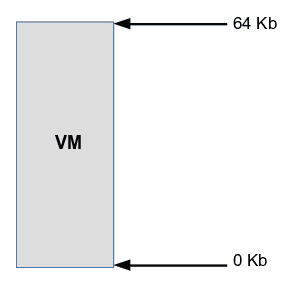
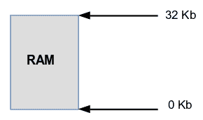
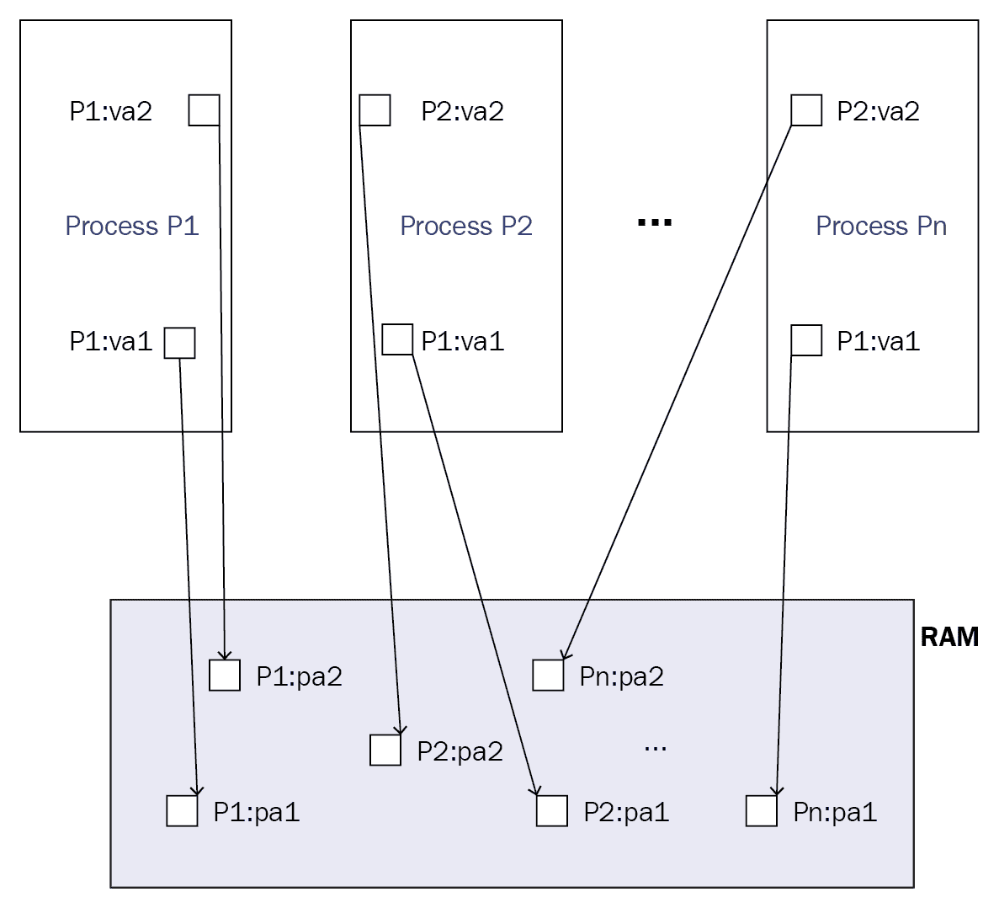
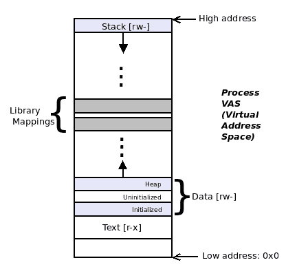
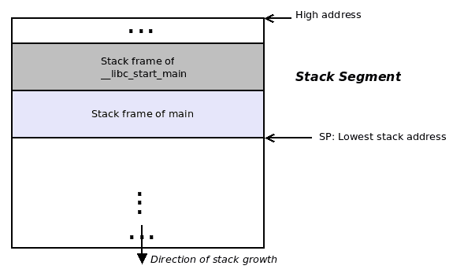

# 二、虚拟内存

回到本章，我们将了解**虚拟内存**(**VM**)的含义和用途，重要的是，为什么它是一个关键概念和必需概念。 我们将介绍 VM 的含义和重要性、分页和地址转换、使用 VM 的好处、正在执行的进程的内存布局，以及内核看到的进程的内部布局。 我们还将深入研究哪些段构成进程虚拟地址空间。 在难以调试的情况下，这方面的知识是必不可少的。

在本章中，我们将介绍以下主题：

*   虚拟内存
*   进程虚拟地址空间

# 技术要求

需要一台现代化的台式 PC 或笔记本电脑；Ubuntu Desktop 为安装和使用发行版指定了以下建议的系统要求：

*   2 GHz 双核或更高处理器
*   *   **在物理主机上运行**：2 GB 或更大系统内存
    *   **以来宾身份运行**：主机系统应至少有 4 GB RAM(越多，体验越好、越流畅)

*   25 GB 可用硬盘空间
*   用于安装程序介质的 DVD 驱动器或 USB 端口
*   上网肯定是有帮助的

我们建议读者使用以下 Linux 发行版之一(如上所述，可以作为 Windows 或 Linux 主机系统上的客户操作系统*和*安装)：

*   Ubuntu 18.04 LTS Desktop(Ubuntu 16.04 LTS Desktop 也是一个很好的选择，因为它也有长期的支持，几乎所有东西都应该可以工作)
    *   Ubuntu：桌面下载链接：[https://www.ubuntu.com/download/desktop](https://www.ubuntu.com/download/desktop)
*   Feddora-27(工作站)
    *   下载链接：11-13[HTTPS：//getfedora.org/en_gb/workstation/download/](https://getfedora.org/en_GB/workstation/download/)

请注意，这些发行版的默认形式是 OSS 和非专有的，并且可以作为最终用户免费使用。

There are instances where the entire code snippet isn't included in the book . Thus the GitHub URL to refer the codes: [https://github.com/PacktPublishing/Hands-on-System-Programming-with-Linux](https://github.com/PacktPublishing/Hands-on-System-Programming-with-Linux). 
Also, for the further reading section, refer to the preceding GitHub link.

# 虚拟内存

现代操作系统基于一种名为 VM 的内存模型。 这包括 Linux、Unix、MS Windows 和 MacOS。 真正理解现代操作系统是如何在幕后工作的，需要对虚拟机和内存管理有深刻的理解，而不是本书中我们深入探讨的主题；然而，扎实地掌握虚拟机概念对于 Linux 系统开发人员来说是至关重要的。

# 没有虚拟机-问题所在

让我们设想一下，VM 和它所携带的所有复杂包袱都不存在。 因此，我们正在一个(虚构的)纯平面物理内存平台上工作，比如说，它有 64MB 的 RAM。 这实际上并不是那么不寻常-大多数旧操作系统(想想 DOS)，甚至现代的**实时操作系统**(RTOS)都是这样运行的：


Figure 1: Flat physical address space of 64 MB

显然，在这台机器上运行的所有东西都必须共享这个物理内存空间：操作系统、设备驱动程序、库和应用。 我们可能会这样将其可视化(当然，这并不是为了反映实际的系统--这只是一个高度简化的示例，以帮助您了解情况)：一个操作系统、几个设备驱动程序(用于驱动硬件外围设备)、一组库和两个应用。 这个虚构的(64 MB 系统)平台的物理内存映射(未按比例绘制)可能如下所示：

| **对象** | **占用的空间** | **地址范围** |
| 操作系统(OS) | 3 MB | ==同步，由 Elderman 更正==@ELDER_MAN |
| 设备驱动程序 | 5MB | 0x02d0 0x0320 0x0320 0x02d0 |
| 图书馆 / 图书馆的藏书 / 资料室 / 文库 | 10 MB | 0x00a00,000-0x040 |
| 应用 2 | 1MB | 0x0010 0x0x0020 0x0010 0x0020 0x0020 0x0020 |
| 应用 1 | 0.5MB | 0x0000»0x0008 0000 |
| 总可用内存 | 44.5 MB | <various></various> |

Table 1: The physical memory map

相同的虚构系统如下图所示：


Fig 2: The physical memory map of our fictional 64 MB system

当然，通常情况下，该系统在发布之前会经过严格的测试，并将按预期运行；不过，在我们的行业中，您可能听说过一种叫做 bug 的东西。 确实是这样。

但让我们设想一下，假设由于以下原因之一，在无处不在的应用`memcpy(3)`和 glibc API 的使用过程中，有一个危险的错误潜入应用 1：

*   不经意的编程错误
*   蓄意恶意

作为快速提醒，`memcpy`库 API 的用法如下所示：

`void *memcpy(void *dest, const void *src, size_t n).`

# 客观的 / 宾格的 / 真实的 / 目标的

下面的 C 程序片段打算使用常用的`memcpy(3)`和 glibc API 将一些内存(例如 1024 字节)从源位置 300KB 复制到目标位置 400KB 到程序中。由于应用 1 是位于物理内存低端的程序(请参见前面的内存图)，因此它从物理偏移量的`0x0`开始。

We understand that on a modern OS nothing will start at address `0x0`; that's the canonical NULL memory location! Keep in mind that this is just a fictional example for learning purposes

首先，让我们看看正确的用法。

请参阅以下伪代码：

```sh
phy_offset = 0x0;
src = phy_offset + (300*1024);       /* = 0x0004 b000 */
dest = phy_offset + (400*1024);      /* = 0x0006 4000 */
n = 1024;
memcpy(dest, src, n);
```

上述代码的效果如下图所示：


Fig 3: Zoomed into App 1: the correct memcpy()

如上图所示，这是可行的！ (大)箭头显示从源到目标的复制路径，长度为 1,024 字节。 太棒了。

现在来看马车的案子。

所有内容都保持不变，只是这一次由于错误(或恶意)，`dest`*和*指针被修改如下：

```sh
phy_offset = 0x0;
src = phy_offset + (300*1024);       /* = 0x0004 b000 */
dest = phy_offset + (400*1024*156);  /* = 0x03cf 0000 *!*BUG*!* */
n = 1024;
memcpy(dest, src, n);
```

目标位置现在大约 64 KB(0x03cf0000-0x03d00000)进入操作系统！ 最好的部分：代码本身不会失败*。* `memcpy()`履行其职责。 当然，现在操作系统可能已经损坏，整个系统(最终)将崩溃。

注意，这里的目的不是调试原因(我们知道)；这里的目的是清楚地认识到，尽管有这个错误，memcpy 还是成功的。
为什么？ 这是因为我们正在用 C 语言编程--我们可以随心所欲地读写物理内存；无意中的 bug 是我们的问题，而不是语言的问题！

那现在怎么办？ 啊，这是 VM**，**系统出现的关键原因之一。

# 虚拟内存

不幸的是，术语**虚拟内存**(**VM**)经常被大多数工程师误解或模糊理解。 在本节中，我们试图阐明这个术语及其相关术语(如内存金字塔、寻址和分页)的真正含义；对于开发人员来说，清楚地理解这一关键领域非常重要。

First, what is a process?

A process is an instance of a program in execution*.*
A program is a binary executable file: a dead, disk object. For example, take the `cat` program*:* `$ ls -l /bin/cat`
`-rwxr-xr-x 1 root root 36784 Nov 10 23:26 /bin/cat`
`$`
When we run `cat` it becomes a live runtime schedulable entity, which, in the Unix universe, we call a process.

为了更清楚地理解更深层次的概念，我们从一台小的、简单的、虚构的机器开始。 想象一下，它有一个有 16 条地址线的微处理器。 因此，很容易看出，它可以访问 2<sup>16</sup>=65,536 字节=64 KB 的总潜在内存空间(或地址空间)：



Fig 4: Virtual memory of 64 KB

但是，如果机器上的物理内存(RAM)要小得多，比如 32KB，那该怎么办呢？
显然，上图描述的是虚拟内存，而不是物理内存。
同时，物理内存(RAM)如下所示：



Fig 5: Physical memory of 32 KB

尽管如此，系统对每个活着的进程做出的承诺：每个进程都将拥有整个虚拟地址空间，即 64KB。这听起来很荒谬，不是吗？是的，直到人们意识到内存不仅仅是 RAM；实际上，内存被视为一个层次结构-通常被称为内存金字塔：


Fig 6: The Memory pyramid

就像生活一样，每件事都是需要权衡的。 在金字塔的顶端，我们以牺牲大小为代价获得了**速度**；在金字塔的底部，它是以速度为代价倒置的：**大小**。 人们也可以认为 CPU 寄存器位于金字塔的最顶端；因为它的大小几乎微不足道，所以没有显示出来。

*Swap* is a filesystem type – a raw disk partition is formatted as swap upon system installation. It's treated as second-level RAM by the OS. When the OS runs out of RAM, it uses swap. As a rough heuristic, system administrators sometimes configure the size of the swap partition to be twice that of available RAM.

为了帮助量化这一点，根据 Hennessy&Patterson 的*Computer Architecture*，*A Quantity Approach*，*Five Ed*，相当典型的数字如下：

| **类型** | **CPU 寄存器** | **CPU 缓存** | **RAM** | **交换/存储** |
| L1 | L2 | L3 |
| 提供服务者 / 发球员 / 服勤者 | 1000 字节 | 64 KB | 256 KB | 2-4 MB | 4-16 GB | 4-16 TB |
| 300ps | 1 ns | 3-10 ns | 10-20 ns | 50-100 ns | 5-10 毫秒 |
| 嵌入的 | 500 字节 | 64 KB | 256 KB | -你知道吗？ | 256-512 MB | 4-8 GB 闪存 |
| 500 ps | 2 ns | 10-20 ns | -你知道吗？ | 50-100 ns | 25-50 美元 |

Table 2: Memory hierarchy numbers Many (if not most) embedded Linux systems do not support a swap partition; the reason is straightforward: embedded systems mostly use flash memory as the secondary storage medium (not a traditional SCSI disk as do laptops, desktops, and servers). Writing to a flash chip wears it out (it has limited erase-write cycles); hence, embedded-system designers would rather sacrifice swap and just use RAM. (Please note that the embedded system can still be VM-based, which is the usual case with Linux and Win-CE, for example).

操作系统将尽最大努力保持工作页面集尽可能位于金字塔的最高位置，从而优化性能。

It's important for the reader to note that, in the sections that follow, while this book attempts to explain some of the inner workings of advanced topics such as VM and addressing (paging), we quite deliberately do not paint a complete, realistic, real-world view.

The reason is straightforward: the deep and gory technical details are well beyond the scope of this book. So, the reader should keep in mind that several of the following areas are explained in concept and not in actuality. The *Further reading* section provides references for readers who are interested in going deeper into these matters. Refer it on the GitHub repository.

# 解决 1--简单化的有缺陷的方法

好了，现在来看记忆金字塔；即使我们同意虚拟记忆现在是一种可能性，但一个关键和困难的障碍仍然存在。 要解释这一点，请注意，每个活动的进程都将占用整个可用的**虚拟地址空间**(**VAS**)。 因此，每个进程在 VAS 方面都与其他进程重叠。 但这是如何运作的呢？ 它本身是不会的。 为了让这个精心设计的方案发挥作用，系统必须以某种方式将每个进程中的每个虚拟地址映射到一个物理地址！ 请参阅以下虚拟地址到物理地址的映射：

**Process P:virtual address (va) → RAM:physical address (pa)**

那么现在的情况是这样的：


Fig 7: Processes containing virtual addresses

进程**P1**、**P2**和**PN**在 VM 中处于活动状态并且运行良好。 它们的虚拟地址空间大小从 0 到 64 KB，并且相互重叠。 此(虚构)系统上存在 32KB 的物理内存(RAM)。

例如，每个进程的两个虚拟地址以以下格式显示：

**`P'r':va'n'`**；其中`r`是进程号，`n`是 1 和 2。

如前所述，现在的关键是将每个进程的虚拟地址映射到物理地址。 因此，我们需要映射以下内容：

```sh
P1:va1 → P1:pa1
P1:va2 → P1:pa2
...

P2:va1 → P2:pa1
P2:va2 → P2:pa2
...

[...]

Pn:va1 → Pn:pa1
Pn:va2 → Pn:pa2
...
```

我们可以让操作系统执行此映射；然后，操作系统将为每个进程维护一个映射表来执行此操作。 从图表和概念上看，它如下所示：



Fig 8: Direct mapping virtual addresses to physical RAM addresses

那就这样了吗？ 实际上，看起来很简单。 嗯，不，它在现实中是行不通的：要将每个进程所有可能的虚拟地址映射到 RAM 中的物理地址，操作系统需要为每个进程的每个地址维护一个**va**到**pa**的转换条目！ 这太昂贵了，因为每个表都可能超过物理内存的大小，从而使该方案变得无用。

快速计算会发现我们有 64KB 的虚拟内存，即 65,536 个字节或地址。 这些虚拟地址中的每一个都需要映射到物理地址。 因此，每个流程都需要：

*   对于映射表，65536*2=131072=128KB。 每个进程。

实际上，情况会变得更糟；操作系统需要在每个地址转换条目中存储一些元数据；比方说 8 字节的元数据。 所以现在，每个流程都需要：

*   65536*2*8=1048576=1 MB，用于映射表。 每个进程。

哇，每个进程 1 兆字节的 RAM！ 这太多了(想想嵌入式系统)；而且，在我们虚构的系统上，总共有 32KB 的 RAM。 哎呦。

好的，我们可以通过不映射每个字节而映射每个字来减少这个开销；比如说，4 个字节映射到一个字。 所以现在，每个流程都需要：

*   (65536*2*8)/4=262144=256KB，用于映射表。 每个进程。

好多了，但还不够好。 如果只有 20 个进程处于活动状态，我们将需要 5MB 的物理内存来仅存储映射元数据。 使用 32KB 的 RAM，我们无法做到这一点。

# 简要介绍 2 小时寻呼

为了解决这个棘手的问题(双关语)，计算机科学家想出了一个解决方案：不要试图将单个虚拟字节(甚至单词)映射到它们的物理对应项；这太昂贵了。 相反，应将物理和虚拟内存空间划分为块并对其进行映射。

简而言之，有两种方法可以做到这一点：

*   硬件分段
*   硬件分页

**硬件分段：**将虚拟和物理地址空间划分为称为**段**的任意大小的块。 最好的例子是 Intel 32 位处理器。

**硬件分页：**将虚拟和物理地址空间分割成大小相等的块，称为**页**。 大多数实际处理器都支持硬件分页，包括 Intel、ARM、PPC 和 MIPS。

实际上，选择使用哪种方案甚至不是由操作系统开发人员决定的：选择是由硬件 MMU 决定的。

Again, we remind the reader: the intricate details are beyond the scope of this book. See the *Further reading* section on the GitHub repository.

让我们假设我们使用分页技术。 关键之处在于，我们不再尝试将每个进程所有可能的虚拟地址映射到 RAM 中的物理地址，而是将虚拟页面(仅称为页面)映射到物理页面(称为页帧)。

Common Terminology

**virtual address space** : **VAS**
Virtual page within the process VAS : page
Physical page in RAM : **page frame** (**pf**) Does NOT work: **virtual address** (**va**) → **physical address** (**pa**)
Does work: (virtual) page → page frame 

The left-to-right arrow represents the mapping.

根据经验法则(以及普遍接受的规范)，页面大小为 4 千字节(4,096 字节)。同样，决定页面大小的是处理器**内存管理单元**(**MMU**)。

那么，这一计划如何以及为什么会有所帮助呢？

想一想，在我们的虚构机器里，我们有：64KB 的 VM，也就是 64K/4K=816 页，32KB 的 RAM，也就是 32K/4K=8 个页框。

将 16 个页面映射到相应的页帧需要每个进程只有 16 个条目的表；这是可行的！

As in our earlier calculations:
16 * 2 * 8 = 256 bytes, for a mapping table per process.

非常重要的一点是，它值得重复：我们是否可以将(虚拟)页面映射到(物理)页面框架！

这是由操作系统在每个进程的基础上完成的。 因此，每个进程都有自己的映射表，在运行时将页面转换为页帧；它通常称为**分页表**(**PT**)：


Fig 9: Mapping (virtual) pages to (physical) page frames

# 分页表

同样，在我们的虚构机器中，我们有 64KB 的 VM，即 64K/4K=16 页，以及 32KB 的 RAM，即 32K/4K=8 个页帧。

将 16 个(虚拟)页面映射到相应的(物理)页帧需要每个进程只有 16 个条目的表，这使得整个交易可行。

非常简单地说，操作系统创建的单个进程的 PT 如下所示：

| **(虚拟)页** | **(物理)页框** |
| `0` | `3` |
| `1` | `2` |
| `2` | `5` |
| `[...]` | `[...]` |
| `15` | `6` |

Table 3: OS-created PT

当然，精明的读者会注意到我们有一个问题：我们有 16 页和只有 8 个页框可以将它们映射到地图上--剩下的 8 页怎么办？

好吧，考虑一下这个：

*   实际上，每个进程都不会将每个可用页面用于代码或数据或其他任何东西；虚拟地址空间的几个区域将保持为空(稀疏)，
*   即使我们确实需要它，我们也有办法：不要忘记记忆金字塔。 当内存用完时，我们使用交换。 因此，流程的(概念性)PT 可能如下所示(例如，第 13 页和第 14 页驻留在交换中)：

| **(虚拟)页** | **(物理)页框** |
| `0` | `3` |
| `1` | `2` |
| `2` | `5` |
| `[...]` | `[...]` |
| `13` | `<swap-address>` |
| `14` | `<swap-address>` |
| `15` | `6` |

Table 4: Conceptual PT Again, please note that this description of PTs is purely conceptual; actual PTs are more complex and highly arch (CPU/MMU) dependent.

# 间接 / 拐弯抹角 / 迂回 / 不坦率

通过引入分页，我们实际上引入了一种间接级别：我们不再认为(虚拟)地址是从零开始的绝对偏移量，而是相对量：`va = (page, offset)`。

我们认为每个虚拟地址都与页码和从该页开始的偏移量相关联。 这称为使用一个级别的间接。

因此，每当进程引用虚拟地址时(当然，请注意，几乎所有时候都会发生这种情况)，系统必须基于该进程的 PTS 将虚拟地址转换为相应的物理地址。

# 地址转换

因此，在运行时，该进程查找一个虚拟地址，比方说，从 0 开始查找 9,192 字节，也就是它的虚拟地址：**`va = 9192 = 0x000023E8`**。 如果每页大小为 4,096 字节，这意味着新地址位于第三页(页#2)上，从该页开始的偏移量为 1,000 字节。

因此，对于一个间接层，我们有：**`va = (page, offset) = (2, 1000)`**。

啊哈！ 现在我们可以看到地址转换的工作原理：操作系统发现进程需要第 2 页中的地址。它在该进程的 PT 上进行查找，发现第 2 页映射到页帧 5。要计算如下所示的物理地址：

```sh
pa = (pf * PAGE_SIZE) + offset
   = (5 * 4096) + 1000
   = 21480 = 0x000053E8
```

这就对了。

系统现在将物理地址放在总线上，CPU 照常执行其工作。 它看起来很简单，但同样，它也不现实-请参阅下面的信息框。

分页模式获得的另一个优势是操作系统只需要存储页面到页面框架的映射。 这让我们只需添加偏移量，就可以自动将页面中的任何字节转换为页面帧中相应的物理字节，因为页面和页面框架之间存在 1：1 的映射(两者的大小相同)。

In reality, it's not the OS that does the actual calculations to perform address-translation. This is because doing this in the software would be far too slow (remember, looking up virtual addresses is an ongoing activity happening almost all the time). The reality is that the address lookup and translation is done by silicon – the hardware **Memory Management Unit** (**MMU**) within the CPU!

Keep the following in mind:
    • The OS is responsible for creating and maintaining PTs for each process.
    • The MMU is responsible for performing runtime address-translation (using the OS PTs).
    • Beyond this, modern hardware supports hardware accelerators, such as the TLB, use of CPU caches, and virtualization extensions, which go a long way toward getting decent performance.

# 使用虚拟机的优势

乍一看，虚拟内存和相关的地址转换带来的巨大开销似乎保证不使用它。 是的，开销很高，但现实是这样的：

*   现代硬件加速(通过 TLB/CPU 缓存/预取)减轻了这一开销，并提供了相当不错的性能
*   从虚拟机中获得的好处超过了性能问题

在基于 VM 的系统上，我们可以获得以下好处：

*   进程隔离
*   程序员不必担心物理存储器
*   内存保护

更好地理解这些是很重要的。

# 进程隔离

有了虚拟内存，每个进程都可以在沙箱中运行，而沙箱是其 VAS 的范围。 关键规则是：它不能跳出框框。

因此，想想看，一个进程不可能窥视或戳到任何其他进程的 VA 的内存。 这有助于使系统安全稳定。

例如：我们有两个进程，A 和 B。进程 A 想要写入进程 B 中的虚拟地址 A`0x10ea`。它不能，即使它试图写入该地址，它实际上所做的只是写入它自己的虚拟地址：T`0x10ea`！ 阅读也是如此。

所以我们得到了进程隔离--每个进程都与其他进程完全隔离。
进程 A 的虚拟地址 X 与进程 B 的虚拟地址 X 不同；它们很可能转换为不同的物理地址(通过它们的 PT)。
利用这一特性，Android 系统被设计为非常有意地使用 Android 应用的进程模型：当 Android 应用启动时，它会变成一个 Linux 进程，该进程驻留在它自己的 VAS 中，与其他 Android 应用(进程)隔离，因此不受其他 Android 应用(进程)的影响！

*   同样，不要错误地假设给定进程中的每个(虚拟)页面对于该进程本身都是有效的。 页面只有在被映射的情况下才是有效的，也就是说，它已经被分配，并且操作系统对它有一个有效的翻译(或者找到它的方法)。 事实上，尤其是对于庞大的 64 位 VAS，进程虚拟地址空间被认为是非常稀疏的，也就是稀缺的。
*   如果进程隔离是如上所述的，那么如果进程 A 需要与进程 B 对话怎么办？ 事实上，这是许多(如果不是大多数)真正的 Linux 应用经常需要的设计要求-我们需要一些机制才能读/写另一个进程的 VAS。 现代操作系统提供了实现这一点的机制：**进程间通信**(**IPC**)机制。 (有关 IPC 的一些内容可以在[第 15 章](15.html)和*使用 Pthread 的多线程第二部分-同步中找到。* )

# 程序员不必担心物理存储器

在较旧的操作系统上，甚至在现代的 RTOS 上，程序员应该详细了解整个系统的内存布局，并相应地使用内存(回想*图 1*)。 显然，这给开发人员带来了很大的负担；他们必须确保在系统的物理限制范围内正常工作。

大多数在现代操作系统上工作的现代开发人员从来没有这样想过：比如说，如果我们想要 512KB 的内存，难道我们不只是动态分配它(使用`malloc(3)`，稍后将在[第 4 章](04.html)，*动态内存分配*中详细介绍)，而留下如何以及在哪里对库和 OS 层进行操作的确切细节？ 事实上，我们可以这样做几十次，而不用担心这样的问题：“是否有足够的物理 RAM？应该使用哪些物理页帧？碎片/浪费怎么办？”

我们还获得了额外的好处，系统返回给我们的内存保证是连续的；当然，它实际上是连续的，它不需要是物理上连续的，但这种细节正是 VM 层负责的！

所有这些都是由操作系统中的库层和底层内存管理系统有效地处理的。

# 内存保护

也许 VM 最重要的好处是：能够定义对虚拟内存的保护，并让操作系统遵守这些保护。

UNIX 和 Friends(包括 Linux)在内存页上允许四个保护值或权限值：

| **保护或权限类型** | **含义** |
| 毫不 / 绝不 | 没有在页面上执行任何操作的权限 |
| 阅读 / 检查记录上的数字 / 攻读 / 复制 | 页面可以从中读取 |
| 写字 / 写给 / 编著 / 写作 | 页面可以写入 |
| 执行 | 可以执行页面(代码) |

Table 5:  Protection or permission values on memory pages

让我们来看一个小例子：我们在进程中分配了四页内存(编号为 0 到 3)。 默认情况下，页面上的默认权限或保护是**RW**(**读写**)，这意味着页面既可以读取，也可以写入。

借助虚拟内存操作系统级别的支持，操作系统公开了 API(系统调用的`mmap(2)`和`mprotect(2)`)，用户可以使用这些 API 更改默认的页面保护！请看下表：

| **内存页编号** | **默认保护** | **更改保护** |
| 0 | RW- | 不不 |
| 1. | RW- | 只读(R--) |
| 2 个 | RW- | 只写(-W-) |
| 3. | RW- | 读取-执行(R-X) |

有了这样强大的 API，我们可以将内存保护设置为单个页面的粒度！

应用(实际上是操作系统)可以并且确实能够利用这些强大的机制；事实上，这正是操作系统对进程地址空间的特定区域所做的事情(正如我们将在下一节*侧栏：：测试 memcpy()‘C’程序*中了解的那样)。

好吧，好吧，我们可以在某些页面上设置一定的保护措施，但如果某个应用违反了这些保护措施呢？ 例如，在将第 3 页(如上表所示)设置为读取-执行后，如果应用(或操作系统)尝试写入该页怎么办？

这就是虚拟内存(和内存管理)的真正力量所在：现实是，在启用了 VM 的系统上，操作系统(更现实地说，是 MMU)能够进入每一次内存访问，并确定最终用户进程是否遵守规则。 如果是，则访问成功进行；如果不是，则 MMU 硬件引发异常(与中断相似，但不完全相同)。 操作系统现在跳转到称为异常(或故障)处理程序的代码例程中。 OS 异常处理例程确定该访问是否确实是非法的，如果是，则 OS 立即终止尝试该非法访问的进程。

这样可以保护你的记忆吗？ 事实上，这几乎就是分段违规或分段错误的含义；在[第 12 章](12.html)，*信号-第二部分*中有更多关于这方面的内容。 异常处理程序例程称为 OS 故障处理程序。

# 侧边栏：：测试 memcpy()C 程序

现在我们已经更好地理解了 VM 系统的内容和原因，让我们回到本章开始时考虑的有缺陷的伪代码示例：我们使用`memcpy(3)`复制一些内存，但是指定了错误的目标地址(并且它将覆盖我们虚构的仅限物理内存的系统中的操作系统本身)。

这里显示并试用了一个概念上类似的 C 程序，但它运行在 Linux 上-一个完全支持虚拟内存的操作系统。 让我们看看 Buggy 程序在 Linux 上是如何工作的：

```sh
$ cat mem_app1buggy.c /*
 * mem_app1buggy.c
 *
 ***************************************************************
 * This program is part of the source code released for the book
 *  "Linux System Programming"
 *  (c) Kaiwan N Billimoria
 *  Packt Publishers
 *
 * From:
 *  Ch 2 : Virtual Memory
 ****************************************************************
 * A simple demo to show that on Linux - full-fledged Virtual 
 * Memory enabled OS - even a buggy app will _NOT_ cause system
 * failure; rather, the buggy process will be killed by the 
 * kernel!
 * On the other hand, if we had run this or a similar program in a flat purely 
 * physical address space based OS, this seemingly trivial bug 
 * can wreak havoc, bringing the entire system down.
 */
#define _GNU_SOURCE
#include <stdio.h>
#include <unistd.h>
#include <stdlib.h>
#include <string.h>
#include "../common.h"

int main(int argc, char **argv)
{
    void *ptr = NULL;
    void *dest, *src = "abcdef0123456789";
    void *arbit_addr = (void *)0xffffffffff601000;
    int n = strlen(src);

    ptr = malloc(256 * 1024);
    if (!ptr)
          FATAL("malloc(256*1024) failed\n");

    if (argc == 1)
        dest = ptr;           /* correct */
    else
        dest = arbit_addr;    /* bug! */
    memcpy(dest, src, n);

    free(ptr);
    exit(0);
}
```

`malloc(3)`API 将在下一章详细介绍；目前，只需理解它用于为进程动态分配 256KB 的内存。 当然，`memcpy(3)`还用于将内存从源指针复制到目标指针，以 n 字节为单位：

```sh
void *memcpy(void *dest, const void *src, size_t n);
```

有趣的是，我们有一个名为`arbit_addr`的变量；它被设置为任意无效(虚拟)地址。 正如您从代码中看到的，当用户向程序传递任何参数时，我们将目标代码指针设置为`arbit_addr`，使其成为有错误的测试用例。 让我们尝试在正确和错误的情况下运行该程序。

以下是正确的案例：

```sh
$ ./mem_app1buggy
$ 
```

它运行得很好，没有任何错误。

以下是一个令人费解的案例：

```sh
$ ./mem_app1buggy buggy-case pass-params forcing-argc-to-not-be-1
Segmentation fault (core dumped)
$ 
```

它坠毁了！ 如前所述，有 bug 的 memcpy 会导致 MMU 出错；OS 故障处理代码会意识到这确实是一个 bug，它会杀死有问题的进程！ 进程死亡是因为它有问题，而不是系统。 这不仅是正确的，还会提醒开发人员他们的代码有错误，必须修复。

1\. What's a core dump anyway?
A core dump is a snapshot of certain dynamic regions (segments) of the process at the time it crashed (technically, it's a snapshot of minimally the data and stack segments). The core dump can be analyzed postmortem using debuggers such as GDB. We do not cover these areas in this book.

2\. Hey, it says (core dumped) but I don't see any core file?
Well, there can be several reasons why the core file isn't present; the details lie beyond the scope of this book. Please refer to the man page on `core(5)` for details: [https://linux.die.net/man/5/core](https://linux.die.net/man/5/core).

更详细地想一想这里发生了什么：在 x86_64 处理器上，目的地指针的值是 1`0xffffffffff601000;`，这实际上是一个内核虚拟地址。 现在，我们，一个非用户模式的进程，正试图向这个目标区域写入一些内存，该目标区域受到保护，不会受到用户空间的访问。 从技术上讲，它位于内核虚拟地址空间中，这对于用户模式进程是不可用的(回想一下我们在[第 1 章](01.html)，*Linux 系统体系结构*中对*CPU 特权级别*的讨论)。 因此，当我们尝试-用户模式进程-尝试写入内核虚拟地址空间时，保护机制会旋转起来，阻止我们这样做，从而在交易中杀死我们。

高级：系统如何知道这个地区受到保护？它有什么样的保护？ 这些详细信息被编码到进程的**分页表条目**(**PTES**)中，并由 MMU 在每次访问时进行检查！

如果没有硬件和软件的支持，这种高级内存保护是不可能的：

*   通过所有现代微处理器中的 MMU 提供硬件支持
*   通过操作系统提供软件支持

VM 还提供了更多好处，包括(但不限于)使强大的技术成为可能，例如按需分页、**写入时复制**(**COW**)处理、碎片整理、内存过量使用、内存压缩、**内核页面合并**(**KSM**)和**超越内存***(**TM**)。**内核页面合并**(**KSM**)和**超越内存***(**TM**)。

# 进程内存布局

进程是正在执行的程序的实例。 它被操作系统视为活动的、运行时可调度的实体。 换句话说，它是我们启动程序时运行的过程。

操作系统或内核将有关进程的元数据存储在内核内存的数据结构中；在 Linux 上，此结构通常称为**进程描述符**-尽管术语*任务结构*更为准确。 进程属性存储在任务结构中；进程**PID**(**进程标识符**)-标识进程、进程凭证、打开文件信息、信号信息等的唯一整数驻留在此。

根据前面的讨论*和虚拟内存*，我们了解到进程具有 VAS*等许多属性。* VAS 是潜在可用的空间总和。 与我们前面的示例一样，对于一台具有 16 个地址线的虚拟计算机，每个进程的 VAS 将为 2^16=64KB。

现在，让我们考虑一个更现实的系统：一个 32 位 CPU，有 32 行用于寻址。 显然，每个进程都有 2^32 的 VAS，这是一个相当大的 4 GB 的数量。

十六进制格式的 4 GB 是`0x100000000;`，因此 VAS 从`0x0`的低位地址到`4GB - 1 = 0xffff ffff.`的高位地址

但是，关于高端 VAS 的确切用法，我们还需要了解更多细节(参见*Advanced：VM Split*)。 因此，至少暂时来说，让我们把这个称为高地址，而不是给它一个特定的数值。

下面是它的图表表示：


Fig 10: Process virtual address space (VAS)

因此，现在要理解的是，在 32 位 Linux 上，每个活动的进程都有这个映像：**0x0**to 0xffff ffff=4 GB 的虚拟地址空间*。*

# 分段或映射

创建新进程时(详见[第 10 章](10.html)，*进程创建*)，其 VAS 必须由操作系统设置。 所有现代操作系统都将进程 VA 划分为称为**段**的同构区域(不要将这些段与*简介*部分中提到的硬件分段方法混淆)。

段是流程 VAS 的同构或统一区域；它由虚拟页面组成。 数据段具有属性，例如起始地址和结束地址、保护(RWX/无)和映射类型。 目前的关键点是：属于一个细分市场的所有页面都共享相同的属性。

从技术上讲，更准确地说，从操作系统的角度来看，这个段被称为**映射**。

From now on, when we use the word segment, we also mean mapping and vice versa.

简而言之，从低端到高端，每个 Linux 进程都将有以下段(或映射)：

*   文本(代码)
*   数据（datum 的复数） / 数据资料 / 论据 / 资料
*   库(或其他)
*   栈



Fig 11: Overall view of the process VAS with segments

请继续阅读，了解有关每个细分市场的更多详细信息。

# 文本段

文本就是代码：实际的操作码和操作数，它们构成提供给 CPU 使用的机器指令。 读者可能还记得我们在[第 1 章](01.html)和*Linux 系统架构*中所做的介绍`objdump --source ./hello_dbg`，展示了翻译成汇编语言和机器语言的 C 代码。 该机器代码驻留在进程 VAS 中名为**text**的段中。 例如，假设一个程序有 32KB 的文本；当我们运行它时，它变成一个进程，文本段占用 32KB 的虚拟内存；即 32K/4K=8(虚拟)页。

为了优化和保护，OS 将所有这八页文本标记为**Read-Execute**(**r-x**)，即保护所有这八页文本。 这是有道理的：代码将从内存中读取并由 CPU 执行，而不是写入。

Linux 上的文本段始终是进程 VAS 的低端。 请注意，它永远不会从`0x0`地址开始。

As a typical example, on the IA-32, the text segment usually starts at `0x0804 8000`. This is very arch-specific though  and changes in the presence of Linux security mechanisms like **Address Space Layout Randomization** (**ASLR**).

# 数据段

文本段的正上方是数据段，它是进程保存程序的全局变量和静态变量(数据)的位置。

实际上，它不是一个映射(段)；数据段由三个截然不同的映射组成。 从低地址开始，它由初始化数据段、未初始化数据段和堆段组成。

我们知道，在 C 程序中，未初始化的全局变量和静态变量会自动初始化为零。 初始化的全局变量怎么办？ 初始化数据段 A 是存储显式初始化的全局变量和静态变量的地址空间区域。

未初始化的数据段是地址空间的区域，当然，未初始化的全局变量和静态变量驻留在其中。 关键点：它们被隐式初始化为零(实际上是 Memset 为零)。 此外，更早的文献经常将这一地区称为 BSS。 BSS 是可以忽略的旧汇编指令 BLOCK(以符号开头)；今天，BSS 区域或段只是进程 VAS 的未初始化数据段。

堆应该是大多数 C 程序员所熟悉的术语；它指的是为动态内存分配(以及后续的空闲内存分配)保留的内存区。 可以将堆视为在启动时向进程免费赠送的内存页。

要点：文本、初始化数据和未初始化数据段的大小是固定的；堆是动态段，它可以在运行时增大或缩小大小。 值得注意的是，堆段会朝着更高的虚拟地址增长。有关堆及其用法的更多详细信息可以在下一章中找到。

# 库分段

链接程序时，我们有两个广泛的选择：

*   静态链接
*   动态链接

静态链接意味着任何和所有库文本(代码)和数据都保存在程序的二进制可执行文件中(因此它更大，加载速度也更快)。

动态链接意味着任何和所有共享库文本(代码)和数据都不保存在程序的二进制可执行文件中；相反，它由所有进程共享，并在运行时映射到 Process VAS 中(因此二进制可执行文件要小得多，尽管加载时间可能会稍长一些)。 动态链接始终是默认设置。

想想`Hello, world`C 程序。 您调用了`printf(3)`，但是您为它编写了代码吗？ 不，当然不是；我们知道它在 glibc 中，并将在运行时链接到我们的流程中。 这正是动态链接所发生的情况：在进程加载时，程序依赖(使用)的所有库文本和数据段都被*内存映射到进程 VAS 中(详细信息见[第 18 章](18.html)和*高级文件 I/O*)。 哪里?。 在堆顶部和堆栈底部之间的区域中：库段(参见上图)。*

另一件事是：其他映射(除了库文本和数据)可能会进入这个地址空间区域。 典型的情况是开发人员进行显式内存映射(使用`mmap(2)`系统调用)、隐式映射(如 IPC 机制进行的映射，如共享内存映射)和 malloc 例程(请参阅[第 4 章](04.html)，*动态内存分配*)。

# 堆栈段

本节解释进程堆栈：什么、原因和方式。

# 什么是堆栈内存？

您可能还记得有人告诉您堆栈内存就是内存，但具有特殊的推送/弹出语义；您最后推送的内存驻留在堆栈的顶部，如果执行弹出操作，该内存就会从堆栈中弹出-从堆栈中删除。

将一叠餐盘形象化的教学例子就是一个很好的例子：你最后放的盘子在顶部，你把顶部的盘子拿下来给你的晚餐客人(当然，你可以坚持把盘子从叠的中间或底部给他们，但我们认为最上面的盘子最容易弹出来)。

一些文献还将这种推送/弹出行为称为**后进先出**(**后进先出**)。 当然可以。

工艺 VAS 的高端用于堆栈段(参见*图 11*)。 好吧，好吧，但它到底是用来做什么的？ 这有什么用呢？

# 为什么选择进程堆栈？

我们学到了如何编写好的模块化代码：将您的工作划分为子例程，并将它们实现为小的、易读的和可维护的 C 函数。 太好了。

不过，CPU 并不真正了解如何调用 C 函数、如何传递参数、存储局部变量以及向调用函数返回结果。 我们的救星，编译器接手，将 C 代码转换成汇编语言，能够使整个函数工作起来。

编译器生成调用函数的汇编代码，传递参数，为局部变量分配空间，最后向调用方返回返回结果。 为此，它使用堆栈！ 因此，与堆类似，堆栈也是一个动态段。

每次调用函数时，都会在堆栈区域(或段或映射)中分配内存，以保存具有函数调用、参数传递和函数返回机制工作的元数据。 每个函数的此元数据区域称为堆栈帧*。* 

The stack frame holds the metadata necessary to implement the function call-parameter use-return value mechanism. The exact layout of a stack frame is highly CPU (and compiler) dependent; it's one of the key areas addressed by the CPU ABI document.

On the IA-32 processor, the stack frame layout essentially is as follows:

`[ <-- high address`
`  [ Function Parameters ... ]`
`  [ RET address ]`
`  [ Saved Frame Pointer ] (optional)`
`  [ Local Variables ... ]`
`]  <-- SP: lowest address  `

考虑一些伪代码：

```sh
bar() { jail();}
foo() { bar();}
main() { foo();}
```

调用图非常明显：

`main --> foo --> bar --> jail`

The arrow drawn like --> means calls; so, main calls foo, and so on.

需要理解的是：每个函数调用在运行时都由进程堆栈中的堆栈框架表示。

如果处理器收到推送或弹出指令，它将继续执行该指令。 但是，想想看，CPU 如何知道它应该推入或弹出内存的确切位置--即哪个堆栈内存位置或地址？ 答案是：我们保留了一个特殊的 CPU 寄存器，即**堆栈指针**(通常缩写为**SP**)，正是出于这个目的：SP 中的值始终指向堆栈的顶部。

下一个关键点：堆栈段向更低的虚拟地址增长。这通常被称为堆栈增长向下的语义。 还要注意，堆栈增长方向是由该 CPU 的 ABI 规定的特定于 CPU 的特性；大多数现代 CPU(包括 Intel、ARM、PPC、Alpha 和 Sun SPARC)都遵循堆栈向下增长的语义。

SP 始终指向堆栈的顶部；当我们使用向下增长的堆栈时，这是堆栈中最低的虚拟地址！

为清楚起见，让我们查看一个图，该图在调用`main()`(`main()`由一个`__libc_start_main()`(glibc 例程)调用后立即可视化进程堆栈)：



Figure 12: Process stack after main() is called

进入`jail()`函数时的进程堆栈：


Figure 13: Process stack after jail() is called

# 偷看那堆东西

我们可以通过不同的方式来窥探进程堆栈(从技术上讲，是进程堆栈`main()`)。 在这里，我们展示了两种可能性：

*   通过实用程序自动(_U)
*   使用 gdb 调试器手动执行

首先，通过`gstack(1)`查看用户模式堆栈：

WARNING! Ubuntu users, you might face an issue here. At the time of writing (Ubuntu 18.04), gstack does not seem to be available for Ubuntu (and its alternative, pstack, does not work well either!). Please use the second method (via GDB), as follows.

作为一个快速示例，我们查找`bash`的堆栈(该参数是进程的 PID)：

```sh
$ gstack 14654
#0  0x00007f3539ece7ea in waitpid () from /lib64/libc.so.6
#1  0x000056474b4b41d9 in waitchld.isra ()
#2  0x000056474b4b595d in wait_for ()
#3  0x000056474b4a5033 in execute_command_internal ()
#4  0x000056474b4a52c2 in execute_command ()
#5  0x000056474b48f252 in reader_loop ()
#6  0x000056474b48dd32 in main ()
$ 
```

堆栈帧编号出现在左侧，前面有`#`符号；请注意，帧`#0`是堆栈的顶部(最低的帧)。 以自下而上的方式读取堆栈，即从第`#6`帧(第`main()`个函数的帧)到第`#0`帧(第`waitpid()`个函数的帧)。 还要注意，如果进程是多线程的，`gstack`将显示*个*线程的堆栈。

接下来，请通过 gdb 查看用户模式堆栈(Usermode Stack)。

**G****Nu-Deb****ugger**(**gdb**)是一款功能非常强大的知名调试工具(如果您尚未使用它，我们强烈建议您学习如何使用；请查看*进一步阅读*部分中的链接)。 在这里，我们将使用 gdb 附加到进程，并在附加之后查看其进程堆栈。

一个小的测试 C 程序，它进行几个嵌套的函数调用，将作为一个很好的例子。 从本质上讲，数据调用图如下所示：

```sh
main() --> foo() --> bar() --> bar_is_now_closed() --> pause()
```

`pause(2)`的系统调用是阻塞调用的一个很好的例子-它使调用进程休眠，等待(或阻塞)一个事件；它在这里阻塞的事件是向进程传递任何信号。 (耐心；我们将在[第 11 章](11.html)、*信号-第一部分*和[第 12 章](12.html)、*信号-第二部分*)中了解更多内容。

相关代码`(ch2/stacker.c)`如下：

```sh
static void bar_is_now_closed(void)
{
     printf("In function %s\n"
     "\t(bye, pl go '~/' now).\n", __FUNCTION__);
     printf("\n Now blocking on pause()...\n"
         " Connect via GDB's 'attach' and then issue the 'bt' command"
         " to view the process stack\n");
     pause(); /*process blocks here until it receives a signal */
}
static void bar(void)
{
     printf("In function %s\n", __FUNCTION__);
     bar_is_now_closed();
}
static void foo(void)
{
     printf("In function %s\n", __FUNCTION__);
     bar();
}
int main(int argc, char **argv)
{
     printf("In function %s\n", __FUNCTION__);
     foo();
     exit (EXIT_SUCCESS);
}
```

请注意，要让 gdb 看到符号(函数名、变量、行号)，必须使用`-g`开关编译代码(生成调试信息)。

现在，我们在后台运行该过程：

```sh
$ ./stacker_dbg &
[2] 28957
In function main
In function foo
In function bar
In function bar_is_now_closed
 (bye, pl go '~/' now).
 Now blocking on pause()...
 Connect via GDB's 'attach' and then issue the 'bt' command to view the process stack
$ 
```

接下来，打开 gdb；在 gdb 中，将其附加到进程(前面的代码中显示了 PID)，并使用**backtrace**(***bt**)命令查看其堆栈：

```sh
$ gdb --quiet
(gdb) attach 28957 *# parameter to 'attach' is the PID of the process to attach to*
Attaching to process 28957
Reading symbols from <...>/Hands-on-System-Programming-with-Linux/ch2/stacker_dbg...done.
Reading symbols from /lib64/libc.so.6...Reading symbols from /usr/lib/debug/usr/lib64/libc-2.26.so.debug...done.
done.
Reading symbols from /lib64/ld-linux-x86-64.so.2...Reading symbols from /usr/lib/debug/usr/lib64/ld-2.26.so.debug...done.
done.
0x00007fce204143b1 in __libc_pause () at ../sysdeps/unix/sysv/linux/pause.c:30
30 return SYSCALL_CANCEL (pause);
(gdb) bt
#0 0x00007fce204143b1 in __libc_pause () at ../sysdeps/unix/sysv/linux/pause.c:30
#1 0x00000000004007ce in bar_is_now_closed () at stacker.c:31
#2 0x00000000004007ee in bar () at stacker.c:36
#3 0x000000000040080e in foo () at stacker.c:41
#4 0x0000000000400839 in main (argc=1, argv=0x7ffca9ac5ff8) at stacker.c:47
(gdb) 
```

On Ubuntu, due to security, GDB will not allow one to attach to any process; one can overcome this by running GDB as root; then it works well.

如何通过`gstack`页面查找相同的过程(在撰写本文时，Ubuntu 用户，您运气不佳)。 这是 Fedora 27 盒子上的照片：

```sh
$ gstack 28957
#0 0x00007fce204143b1 in __libc_pause () at ../sysdeps/unix/sysv/linux/pause.c:30
#1 0x00000000004007ce in bar_is_now_closed () at stacker.c:31
#2 0x00000000004007ee in bar () at stacker.c:36
#3 0x000000000040080e in foo () at stacker.c:41
#4 0x0000000000400839 in main (argc=1, argv=0x7ffca9ac5ff8) at stacker.c:47
$ 
```

Guess what? It turns out that `gstack` is really a wrapper shell script that invokes GDB in a non-interactive fashion and it issues the very same `backtrace` command we just used! 
As a quick learning exercise, check out the `gstack` script.

# 高级虚拟机拆分-支持虚拟机拆分

到目前为止，我们看到的实际上并不是全部情况；实际上，这个地址空间需要在用户和内核空间之间共享。

This section is considered advanced. We leave it to the reader to decide whether to dive into the details that follow. While they're very useful, especially from a debug viewpoint, it's not strictly required for following the rest of this book.

回想一下我们在*库分段*部分中提到的内容：如果`Hello, world`应用要工作，它需要有到`printf(3)`Glibc 例程的映射。 这是通过在运行时(由加载器程序)将动态或共享库内存映射到流程 VAS 来实现的。

对于进程发出的任何系统调用，都可以提出类似的论点：正如我们从[第 1 章](01.html)和*Linux 系统体系结构*了解到的那样，系统调用代码实际上在内核地址空间内。 因此，如果要成功发出系统调用，我们需要将 CPU 的**指令指针**(**IP、**或 PC 寄存器)重新定向到系统调用代码的地址，当然，系统调用代码位于内核地址空间内。 现在，如果流程 VAS 只由文本、数据、库和堆栈段组成(就像我们到目前为止所建议的那样)，那么它将如何工作呢？ 回想一下虚拟内存的基本规则：您不能在框外查看(可用地址空间)。

因此，为了使整个方案成功，即使是内核虚拟地址空间-是的，请注意，甚至内核地址空间也被认为是虚拟的-也必须以某种方式映射到进程 VAS 中。

正如我们在前面看到的，在 32 位系统上，一个进程可用的 VAS 总数是 4 GB。 到目前为止，隐含的假设是 32 位上的进程 VAS 的顶端是 4 GB。 没错。 同样，隐含的假设是堆栈段(由堆栈帧组成)位于此处-在顶部的 4 GB 点。 嗯，这是不正确的(请参考*图 11*)。

实际情况是：操作系统创建进程 VAS，并安排其中的段；但是，它在顶端为内核或操作系统映射(即内核代码、数据结构、堆栈和驱动程序)保留了一定数量的虚拟内存。 顺便说一句，这个包含内核代码和数据的段通常被称为内核段。

内核段保留了多少 VM？ 啊，这是内核开发人员(或系统管理员)在内核配置时设置的可调或可配置参数；它称为**VMSPLIT**。 这是 VAS 中我们在操作系统内核和用户模式内存之间划分地址空间的点-文本、数据、库和堆栈段！

实际上，为了清楚起见，让我们重现图 11(如图 14)，但这一次，显式地显示 VM 拆分：


Figure 14: The process VM Split

这里我们不涉及血淋淋的细节：只要说在 IA-32(Intelx86 32 位)上，拆分点通常是 3 GB 点就足够了。 因此，在 IA-32 上，我们有一个比率：*用户空间 VAS：内核 VAS：：3 GB：1 GB VAS。*

记住，这是可调的。 在其他系统上，例如典型的 ARM-32 平台，拆分可能是这样的：*在 ARM-32*上，用户空间 VAS：内核 VAS：：2 GB：2 GB。

在具有超大`2^64`VAS 的 x86_64 上(这是令人难以置信的 16 艾字节！)，在 x86_64 上应该是：*用户空间 VAS：内核 VAS：128TB：128TB；在 x86_64*上。

现在我们可以清楚地看到为什么我们使用单块这个术语来描述 Linux OS 体系结构--每个进程确实就像一块大石头！

每个进程都包含以下两项：

*   用户空间映射

    *   文本(代码)
    *   数据（datum 的复数） / 数据资料 / 论据 / 资料
        *   初始化数据
        *   未初始化数据(BSS)
        *   堆
    *   库映射
    *   其他映射
    *   栈
*   核心段

每个活动的进程都映射到其顶端的内核 VAS(通常称为内核段)。

这是至关重要的一点。 让我们看一个真实的案例：在运行 Linux 操作系统的 Intel IA-32 上，`VMSPLIT`的默认值是 3 GB(即`0xc0000000`)。 因此，在此处理器上，每个进程的 VM 布局如下：

*   **0x0**到**0xbfffffff**：用户空间映射，即文本、数据、库和堆栈。
*   **0xc0000000**到**0xFFFFFFFFFFFFFFFFFFFFFFFFF**：内核空间或内核段。

下图清楚地说明了这一点：


Fig 15: Full process VAS on the IA-32

请注意，每个进程的 VAS 的最高 GB 是如何相同的-内核段。 还要记住，此布局在所有系统上并不相同-VMSPLIT 以及用户和内核段的大小随 CPU 体系结构而异。

从 Linux 3.3 特别是 3.10(当然是内核版本)开始，Linux 就支持`prctl(2)`的系统调用。 查看它的手册页可以发现人们可以做的各种有趣的事情，尽管这些事情是不可移植的(仅限 Linux)。 例如，与`PR_SET_MM`参数一起使用的`prctl(2)`允许进程(具有 root 权限)根据文本、数据、堆和堆栈的开始和结束虚拟地址实质上指定其 VAS 布局、段。 对于正常的应用，这当然不是必需的。

# 简略的 / 概括的 / 简易判罪的 / 简易的

本章深入探讨了虚拟机的概念、为什么虚拟机如此重要，以及它对现代操作系统和在其上运行的应用的诸多好处。 然后，我们介绍了 Linux 操作系统上进程虚拟地址空间的布局，包括关于文本、(多)数据和堆栈段的一些信息。 本文还介绍了堆栈的真正原因及其布局。

在下一章中，读者将了解每个进程的资源限制：为什么需要它们，它们是如何工作的，当然还有使用它们所需的程序员界面。