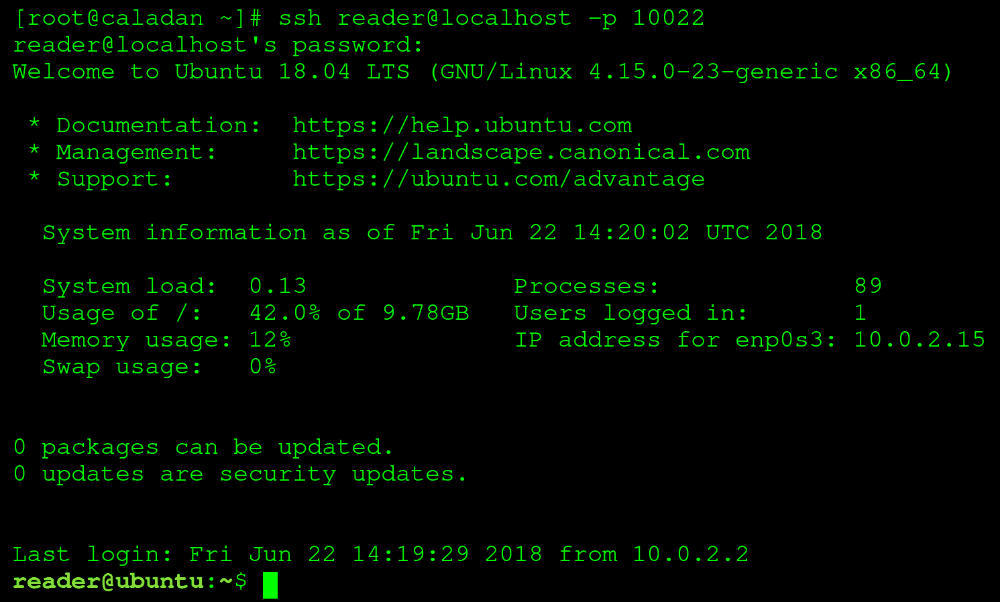

# 一、概述

在我们开始编写 shell 脚本之前，我们需要有一些关于我们最相关的两个组件的上下文: **Linux** 和 **Bash** 。我们将解释 Linux 和 Bash，研究这两种技术背后的历史，并讨论两者的当前状态。

本章将涵盖以下主题:

*   什么是 Linux？
*   什么是 Bash？

# 什么是 Linux？

Linux 是一个通用术语，指的是基于 Linux 内核的不同开源操作系统。Linux 内核最初是由 Linus Torvalds 在 1991 年创建的，并于 1996 年开源。内核是一种软件，被设计为充当低级硬件(如处理器、内存和输入/输出设备)和高级软件(如操作系统)之间的中间层。除了 Linux 内核，大部分 Linux 操作系统都严重依赖 GNU 项目实用程序；例如，Bash shell 是一个 GNU 程序。正因为如此，Linux 操作系统被一些人称为 GNU/Linux。GNU 项目，GNU 代表*T1】GNU 的 **N** ot **U** nix！*(递归首字母缩略词)，是一个自由软件的集合，其中很多在大多数 Linux 发行版中都可以找到。这个集合包括许多工具，但也包括一个名为 GNU HURD 的替代内核(它不像 Linux 内核那样广泛)。

为什么我们需要内核？因为内核位于硬件和操作系统之间，所以它为与硬件交互提供了一个抽象。这就是 Linux 生态系统变得如此庞大的原因:内核可以自由使用，并且它可以在许多类型的硬件上处理许多低级操作。因此，操作系统的创建者可以花时间为他们的用户创造易于使用的美好体验，而不必担心如何将用户的图片写入系统的物理磁盘。

Linux 内核就是所谓的**类 Unix**软件。你可能会怀疑，这意味着它类似于最初的 Unix 内核，它是由肯·汤普森和丹尼斯·里奇于 1971 年至 1973 年在贝尔实验室创建的。然而，Linux 内核只是基于 Unix 原则的*，并不与 Unix 系统共享代码。著名的 Unix 系统包括 BSDs (FreeBSD、OpenBSD 等)和 macOS。*

Linux 操作系统被广泛用于两个目的之一:作为桌面或服务器。作为桌面，Linux 可以替代更常用的微软视窗或苹果操作系统。然而，大多数 Linux 的使用都是在服务器环境中。在撰写本文时，估计互联网上大约 70%的服务器使用 Unix 或类似 Unix 的操作系统。下次您浏览新闻、阅读邮件或滚动浏览您最喜欢的社交媒体网站时，请记住，您正在显示的页面很有可能已经被一个或多个 Linux 服务器处理过。

Linux 有许多发行版或版本。大多数 Linux 操作系统都属于发行系列。分发系列基于一个共同的祖先，并且经常使用相同的包管理工具。其中一个比较知名的 Linux 发行版 **Ubuntu** ，是基于 **Debian** 发行家族。另一个著名的 Linux 发行版， **Fedora** 基于**红帽**家族。其他值得注意的分布家族包括 **SUSE** 、 **Gentoo** 和 **Arch** 。

没有多少人意识到有多少设备运行 Linux 内核。例如，目前使用的最常见的智能手机操作系统安卓(市场份额约为 85%)使用了 Linux 内核的修改版本。许多智能电视、路由器、调制解调器和各种其他(嵌入式)设备也是如此。如果我们包括 Unix 和其他类似 Unix 的软件，我们可以有把握地说，世界上大多数设备都运行在这些内核上！

# 什么是 Bash？

Linux 系统中最常用的 Shell 是**B**ourne-**a**gain**sh**ell，或 Bash。Bash Shell 基于**伯恩 Shell**，被称为 **sh** 。但是什么是贝壳呢？

Shell 本质上是一个用户界面。最常见的是指基于文本的界面，也称为**命令行界面** ( **CLI** )。然而，它被称为*壳*，因为它可以被视为围绕内核的*壳；这意味着它不仅适用于 CLIs，也同样适用于**图形用户界面**(**GUI**)。当我们在本书中提到 shell 时，我们指的是 CLI，除非另有说明，否则我们指的是 Bash shell。*

命令行界面和图形用户界面 Shell 的目的是允许用户与系统交互。毕竟，一个不提供交互的系统很难被证明是正确的，更不用说很难使用了！在这种情况下，交互意味着很多事情:在键盘上打字会让字母出现在屏幕上，移动鼠标会改变光标在屏幕上的位置，发出删除文件的命令(用命令行界面或图形用户界面)会从磁盘上删除字节，等等。

在 Unix 和计算机的早期，没有图形用户界面可用，所以所有的工作都是通过命令行界面来执行的。为了连接到运行机器上的 Shell，使用了**视频终端**:通常这是一个非常简单的显示器，结合键盘，通过例如 RS-232 串行电缆连接。在这个视频终端上输入的命令由运行在 Unix 机器上的 shell 处理。

对我们来说幸运的是，自从第一台电脑问世以来，事情发生了很大的变化。今天，我们不再使用专用硬件来连接 Shell。运行在图形用户界面中的一个软件，即**终端仿真器**，用于与 Shell 进行交互。让我们快速了解一下使用终端仿真器连接到 Bash Shell 会是什么样子:

在前面的截图中，我们通过**安全 Shell** ( **SSH** )协议，使用终端仿真器(GNOME Terminal)连接到一个 Linux 虚拟机(我们将在下一章对此进行设置)。需要注意的一些有趣的事情:

*   我们在命令行界面上；我们没有鼠标，也不需要鼠标
*   我们连接到一台 Ubuntu 机器，但我们在另一个操作系统(在本例中是 Arch Linux)中运行它
*   Ubuntu 18.04 向我们呈现了一条欢迎消息，显示了一些关于系统的一般信息

除了使用 Bash shell 进行直接的系统交互之外，它还提供了另一个重要的功能:能够根据特定的目标顺序执行多个命令，无论是否有用户交互。这听起来可能很复杂，但实际上很简单:我们谈论的是本书的主题 **Bash 脚本**！

# 摘要

在这一章中，您已经了解了 GNU/Linux 操作系统和 Linux 内核，什么是内核，以及 Linux 发行版对日常生活的影响有多大。您还了解了什么是 shell，最常见的 Linux shell Bash 既可以用来与 Linux 系统交互，也可以用来编写 shell 脚本。

在下一章中，我们将设置一个本地环境，我们将在本书的其余部分中使用它，包括示例和练习。