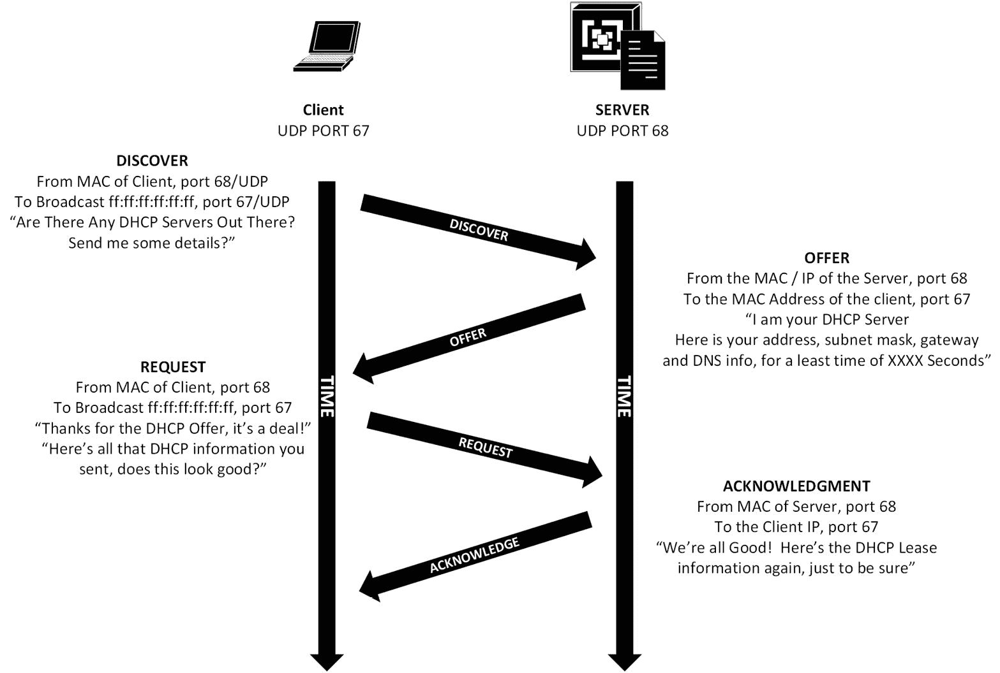
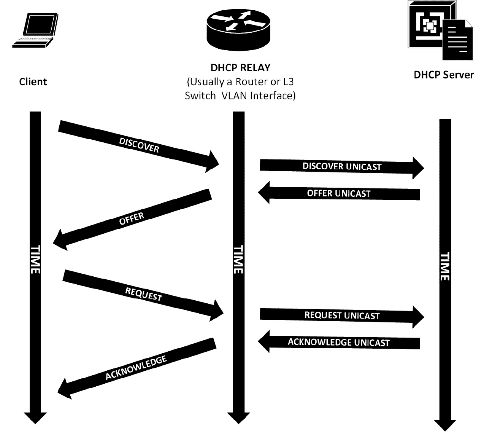
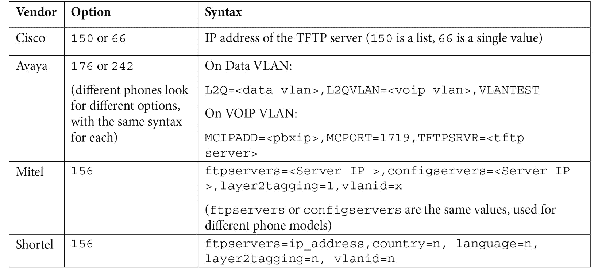
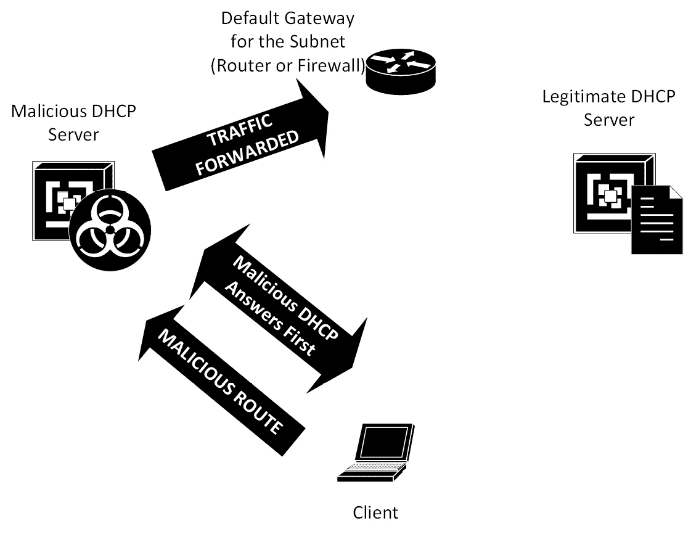
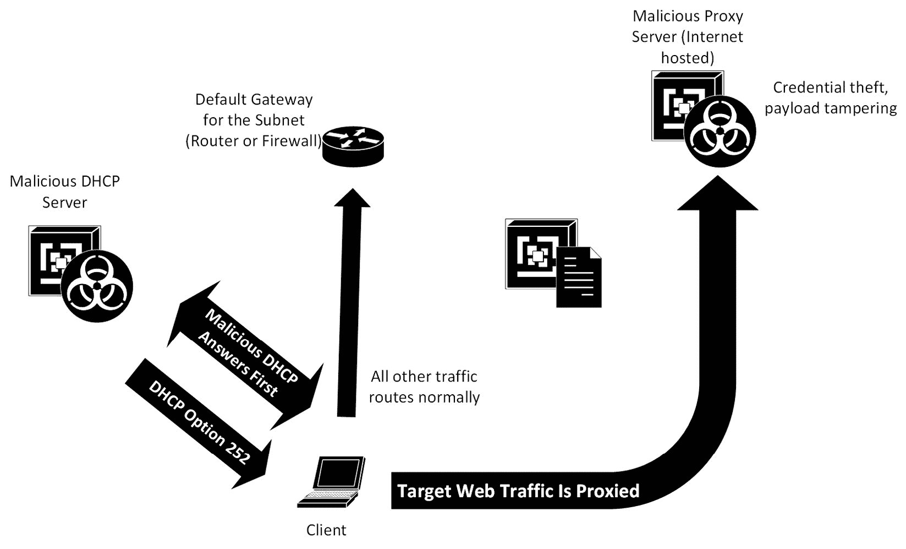

# 七、Linux 上的 DHCP 服务

在本章中，我们将涵盖涉及**动态主机控制协议(DHCP**)的几个主题。 顾名思义，DHCP 用于提供主机连接到网络所需要的基本信息，在某些情况下，还用于提供在何处找到额外配置的信息，这使它成为大多数基础设施的关键部分。

在本章中，我们将覆盖该协议如何工作的基础知识，然后进展到构建和最终排除 DHCP 服务，具体来说:

*   DHCP 是如何工作的?
*   保护您的 DHCP 服务
*   安装和配置 DHCP 服务器

让我们开始吧!

# DHCP 如何工作?

让我们从开始描述 DHCP 实际上是如何工作的。 我们首先来看看数据包在 DHCP 请求和响应中是如何工作的——客户机请求什么信息，服务器提供什么，以及它是如何工作的。 然后，我们将开始讨论 DHCP 选项如何在许多实现中提供帮助。

## 基本 DHCP 操作

**DHCP**允许系统管理员在服务器上集中定义设备配置，当这些设备启动时，可以请求这些配置参数。 此*中心配置*几乎总是包括 IP 地址、子网掩码、默认网关、DNS 服务器、DNS 域名等基本网络参数。 在大多数组织中，这意味着在大多数情况下，几乎没有设备获得静态 IP 地址或其他网络定义; 所有工作站网络配置均由 DHCP 服务器设置。 当我们更深入地研究该协议时，您将看到 DHCP 的其他用途，通常是*与*结合在这些基本设置上。

当客户端发送广播**DISCOVER**包时，DHCP 进程开始，本质上是说“外面有任何 DHCP 服务器吗?” 这就是我正在寻找的信息。” 然后 DHCP 服务器回复一个包含所有信息的**OFFER**报文。 客户机用一个**REQUEST**包进行响应，这个包的名称似乎很奇怪——实际上，客户机只是通过确认的方式，发送它刚刚从服务器返回的信息。 然后，服务器发送最后的**ACKNOWLEDGEMENT**数据包，同样带有相同的信息，再次确认它。

这是通常称为**DORA**序列(**发现、提供、请求、确认**)，通常是这样描述的:



图 7.1 - DHCP DORA 顺序

因为这些都是 UDP 数据包，请记住 UDP 协议中没有任何会话信息，那么是什么将这四个数据包绑定到一个“会话”中呢? 因此，最初的 Discover 报文有一个事务 ID，在随后的三个报文中匹配- Wireshark 跟踪如下所示:


图 7.2 - Wireshark 显示的 DHCP DORA 顺序

重要提示

实际上，客户端直到第四个包才有一个地址，所以 Discover 和 Request 包是从 IP 为`0.0.0.0`的客户端的 MAC 地址到`255.255.255.255`的广播地址(即到整个局域网)。

现在我们理解了 DHCP 如何工作的基础知识，我们看到它严重依赖于广播地址，而广播地址仅限于本地子网。 我们如何在更实际的设置中使用 DHCP，其中 DHCP 服务器在不同的子网，甚至可能在不同的城市或国家?

## 来自其他子网(转发器、中继或助手)的 DHCP 请求

但是等等，你可能会说——在许多公司网络中，服务器在它们自己的子网中——分离服务器和工作站是相当普遍的做法。 这种情况下 DHCP 顺序如何工作? DORA 序列的前三个数据包被发送到广播地址，因此它们只能到达同一 VLAN 上的其他主机。

我们通过在客户端子网中的主机上放置一个 DHCP“转发器”或“中继”进程来完成这项工作。 该进程接收本地广播，然后将其以单播形式转发给 DHCP 服务器。 当服务器应答时(以单播方式向转发器主机)，转发器将包“转换”为客户机所期望的广播应答。 几乎总是，这个转发器功能是在客户端子网上的路由器或交换机 IP 地址上完成的——换句话说，接口最终将成为客户端的默认网关。 这个函数在技术上不需要在那个接口上，但它是一个我们知道会在那里的接口，而且这个函数几乎总是可供我们使用。 另外，如果我们将其作为一种不成文的惯例，当我们以后需要更改它时，它将更容易找到该命令! 在 Cisco 路由器或交换机上，这个命令看起来像这样:

```sh
interface VLAN <x>  ip helper-address 10.10.10.10
```

这里，`10.10.10.10`是我们 DHCP 服务器的 IP 地址。

在操作中，这改变了我们在大多数家庭网络上拥有的简单的广播操作，包括一个单播“腿”，以将协议扩展到位于另一个子网的 DHCP 服务器:



图 7.3 - DHCP 中继或转发器操作

这如何修改我们的 DORA 序列? 简单的回答是，它实际上不会修改任何数据包的 DHCP 内容。 它所做的是修改数据包中的上层“IP 地址”字段-路由器和服务器之间修改的数据包有“真实的”源和目的 IP 地址。 但是，客户端看到的包内容保持不变。 如果你深入研究 DHCP 报文，你会发现不管是否有中继，DHCP 客户端的 MAC 地址和 DHCP 服务器的 IP 地址实际上包含在 7 层 DHCP 协议的数据字段中。

现在我们开始为基本配置 DHCP 服务器工作站操作,但在我们到达之前,我们要考虑我们需要的专用设备,如 iphone,**无线访问点**(**WAP), 或者甚至是**预执行环境(PXE**)设备，可以从 DHCP 信息加载其整个操作系统。**

## DHCP 选项

在 DHCP Discover 报文中发送的选项本质上是客户端知道如何处理的 DHCP 网络参数的列表。 服务器的 Offer 包将尝试尽可能多地填充这个列表。 最常见的请求选项(并在服务器上配置)如下:

*   子网掩码
*   路由器(默认网关)
*   DNS 服务器列表
*   DNS 域名

更完整的引用在 IANA DHCP 选项可以找到网站,https://www.iana.org/assignments/bootp-dhcp-parameters/bootp-dhcp-parameters.xhtml,或在相关的 RFC: https://tools.ietf.org/html/rfc2132。

然而，在许多公司网络中，您可能会看到请求和提供的其他信息——通常这是为了支持**VOIP**电话的启动。 这些选项通常是特定于供应商的，但在大多数情况下，客户端设备将请求的信息列表如下:

*   **我需要在哪个 VLAN 上?** :该选项在现代网络中使用的频率较低，有利于仅使用**链路层发现协议(LLDP**)在交换机上识别 VOICE VLAN。 在 Cisco 交换机上，这就像在 VLAN 定义中添加 voice 关键字一样简单。
*   **我要连接的 PBX 的 IP 是多少?**
*   **我应该连接到哪个 TFTP 或 HTTP 服务器来收集我的硬件配置?**

如果服务器拥有所请求的信息，那么它将在服务器的响应包中的 DHCP offer 中提供。

大多数情况下，你会看到以下这些 DHCP 选项，但如果你使用的是不同的手机厂商，当然，你的里程可能会有所不同:



注意，Mitel 和 Shortel 电话使用相同的 DHCP 选项，但语法略有不同。

DHCP 选项有时也用来告诉 WAP 使用哪个 IP 来找到他们的控制器，控制 PXE 站点的引导顺序，或任何数量的自定义使用。 在大多数情况下，DHCP 选项的存在是为了确保远程设备获得从一个中心位置启动所需的信息，而不必配置每个设备。 如果您需要特定设备的这些选项，详细信息将在供应商的文档中(查找**DHCP 选项**)。

如果你正在对 DHCP 序列进行故障排除，特别是为什么 DHCP 选项不能以你可能期望的方式工作，任何特定设备所需要的 DHCP 选项总是在初始的 Discover 报文中，即 DORA 序列中的第一个报文中。 总是从这里开始您的调查，并且您经常会发现请求的 DHCP 选项并不是配置的选项。

既然我们已经了解了 DHCP 的基本工作原理，那么如何保护它不受常见攻击或操作问题的影响呢?

# 保护 DHCP 服务

关于 DHCP 有趣的是，在几乎所有情况下，保护服务是在网络交换机上而不是在 DHCP 服务器本身上完成的。 在大多数情况下,DHCP 服务器接收匿名的请求,然后适当地回答,没有很多的机会,以确保我们的服务没有增加很多复杂性(使用签名和 PKI,我们会讲到),或者通过维护一组授权的 MAC 地址(这增加了很多复杂性)。 这两种方法都与拥有 DHCP 服务的整个要点背道而驰，即“自动”完成工作站、电话和其他网络连接设备的网络配置，而不会增加太多的复杂性或管理开销。

那么，我们如何确保我们的服务? 让我们看看一些攻击场景，然后添加最常见的防御。

## 非法 DHCP 服务器

首先，让我们看看**流氓 DHCP 服务器**的可能性。 这种是迄今为止最常见的攻击，而且在大多数情况下，它甚至不是故意的。 我们经常看到的情况是，一个人从家里带了一个未经授权的无线路由器或有线交换机，并且家庭设备启用了其默认 DHCP 服务器。 在大多数情况下，这个家庭设备将被配置为一个网络为`192.168.1.0/24`或`192.168.0.0/24`，这几乎总是*而不是我们在工作时配置的*。 因此，一旦此子网连接到网络，工作站将开始获得该子网上的地址，并将失去与实际公司网络的连接。

我们如何防范这种情况? 答案就在网络交换机上。 我们所做的是，在每个交换机上，我们评估拓扑结构，并决定我们可以信任哪些端口向我们发送 DHCP Offer 数据包——换句话说，“哪些端口引导我们到 DHCP 服务器?” 这几乎总是交换机上行链路，这是我们通向服务器的链路。

一旦它在交换机上被识别，我们就使能被称为**DHCP Snooping**的，它指示交换机检查 DHCP 报文。 这是一个 vlan 一个 vlan 地完成的，在大多数环境中，我们只是列出所有 vlan。 然后，我们将上行端口配置为“可信”的源 DHCP 数据包。 这通常是一个非常简单的配置更改，看起来类似于以下(思科配置显示):

```sh
ip dhcp snooping vlan 1 2 10
interface e1/48
    ip dhcp snooping trust
```

如果在除我们配置为“可信”的端口或 IP 地址以外的任何端口或 IP 地址上收到 DHCP Offer 包，默认情况下，该端口将被关闭并发送警报(尽管您可以将它们配置为只发送警报)。 然后，端口处于所谓的*错误禁用*状态，通常需要网络管理员查找根本原因并修复它。 这使得日志记录和警报过程非常重要。 您可以跳过[*第 13 章*](13.html#_idTextAnchor236)，*Linux 上的入侵防御系统*，如果这对您的组织非常重要的话。

对于一些交换机供应商，我们可以信任 DHCP 服务器的 IP 而不是上行端口。 例如，在 HP 交换机上，我们仍然可以使用上述方法，但我们也可以根据 IP 地址添加一个更简单的配置:

```sh
dhcp-snooping
dhcp-snooping vlan 1 2 10
dhcp-snooping authorized-server <server ip address>
```

在一个更大的网络中，这种方法使我们的配置简单得多——不需要识别不同交换机的上行端口; 这两条线路可以简单地复制到所有工作站交换机。

当我们到达服务器 vlan 和数据中心交换机时，我们面临的事实是我们的 DHCP 服务器很可能是一个 VM。 这给我们留下了两个选择——要么在所有连接到 hypervisor 服务器的上行链路上配置 DHCP 信任，要么在服务器交换机上配置 DHCP snooping 或信任，我们根本不配置 DHCP snooping 或信任。 这两种选择都是有效的，而且老实说，第二种选择是我们最经常看到的——在许多情况下，网络管理员可以相信服务器交换机是在一个锁着的房间或橱柜中，这就成为我们的 DHCP 服务的安全层。 这还意味着，服务器和管理程序管理员在服务器端进行更改时，不需要过多地考虑物理网络(在许多情况下根本不需要涉及网络管理员)。

我们确实提到了“意外 DHCP 服务器”是迄今为止最常见的非法 DHCP 服务器攻击。 但是如何处理故意的 DHCP 服务器攻击; 这些攻击看起来像什么? 第一种情况是 DHCP 服务器添加了一个恶意主机作为默认网关(通常是它自己)。 当数据包被接收时，恶意主机将检查该流量以获取它想要窃取、窃听或修改的信息，然后将其转发到合法路由器(该子网的默认网关):



图 7.4 -使用 DHCP 的三层 MiTM 攻击

另一种情况是恶意 DHCP 服务器给客户端提供了所有正确的信息，但在 DHCP 租期—DHCP 选项`252`上增加了一个“额外的”DHCP 位信息。 选项`252`是一个文本字符串，指向一个**代理自动配置**(**PAC**)文件，该文件格式化为 URL:`http://<malicious server>/link/<filename.pac>`。 PAC 文件是经过特殊格式化的。 攻击者将建立它来使用他们的恶意代理服务器的目标网站，并简单地路由网络流量正常为其他网站。 **这两个机器的意图在中间**【病人】(通常缩短**MiTM)情况是窃取用户的凭证,当你浏览到目标网站如贝宝,亚马逊,或者你的银行,攻击者将有一个假网站准备收集您的用户 ID 和密码。 这是通常称为**WPAD 攻击**(**Windows 代理自动发现**)，因为它对那些默认配置为信任 DHCP 服务器的代理设置的 Windows 客户端非常成功。 在大多数情况下，WPAD 攻击是首选，因为攻击者不必担心解密 HTTPS、SSH 或任何其他加密流量:**



图 7.5 - WPAD 攻击-恶意 DHCP 服务器设置代理服务器

在这两种恶意 DHCP 服务器的情况下，我们的“DHCP 信任”防御工作得非常好。

另一种防范 WPAD 攻击的方法是在您的 DNS 服务器上为 WPAD -`yourinternaldomain.com`添加一个 DNS 条目。 这可能很有帮助，因为 WPAD 攻击可以与其他攻击结合使用(特别是针对任何多播 DNS 协议，如 LLMNR)，但是如果该主机名有一个 DNS 条目，那么这些攻击就可以很好地规避。 此外，记录针对可疑主机名(如 WPAD)的所有 DNS 请求是一种很好的实践，可以帮助您在攻击发生时识别和定位攻击。

但是，如何从另一个方向添加保护来防止攻击呢——如何处理未经授权的客户机呢?

## 非法 DHCP 客户端

越少常见的攻击向量是一个流氓 DHCP 客户端——一个人从家里带来了他们的服务器和插入一个未使用的以太网端口,或攻击者插头一个微小的,专门攻击个人电脑(通常称为**pwnplug)到一个未使用的以太网端口在大堂或任何可访问的位置。 在植物、打印机或其他障碍物的后面是它们最喜欢的位置。**

针对这种攻击的老式防御方法是保存公司中所有授权 MAC 地址的数据库，或者将它们设置为 DHCP 中的授权客户端，或者为每个授权 MAC 地址设置一个静态 DHCP 保留。 这两种情况在现代企业中都不理想。 首先，这是一个非常重要的管理过程。 我们正在向服务器团队的流程中添加一个手动库存组件。 由于 DHCP 服务器通常是一个低开销的服务器组件，没有人会对这个感到兴奋。 其次，如果采用“静态保留”方法，则需要为每个 VLAN、无线 SSID 或客户机可能需要连接到的可能位置添加保留。 不用说，大多数组织都不喜欢这两种方法。

保存未授权客户端的更新方法是使用 802.1x 身份验证，其中客户端在被允许登录之前必须向网络进行身份验证。 这涉及到使用*服务半径为 Linux*([*第 9 章*](09.html#_idTextAnchor153))和*证书服务在 Linux 上*(【显示】*第八章*)。 证书用于增强信任——客户机需要信任 RADIUS 服务器，更重要的是，RADIUS 服务器需要信任连接的客户机，以便身份验证安全地工作。 如您所料,我们将在这本书的后面覆盖这个解决方案(在【病人】*第八章*,【t16.1】证书服务在 Linux 上和[*第 9 章*](09.html#_idTextAnchor153),*服务半径 Linux*)

完成所有这些理论并内化后，让我们开始配置 DHCP 服务器。

# 安装配置 DHCP 服务器

我们将将配置任务分成三个部分:

*   DHCP 服务器的基本配置和作用域
*   DHCP 租期的静态保留——例如，服务器或打印机。
*   使用 DHCP 日志进行网络智能和库存检查或填充

让我们开始吧。

## 基本配置

正如你所期望的，我们将从`apt`命令开始我们的旅程，在我们的实验室主机上安装 ISC DHCP 服务器:

```sh
$ sudo apt-get install isc-dhcp-server
```

安装之后，我们可以配置基本的服务器选项。 设置租期和任何与范围无关的内容—例如，我们将配置中央 DNS 服务器。 另外，请注意，我们正在添加一个 ping 检查——例如，在分配租约之前，这个主机会 ping 候选地址，以确保其他主机没有静态地分配它。 这是避免重复 IP 地址的一个很好的检查，这在默认情况下是不开启的。 在我们的示例中，ping 的超时被设置为 2 秒(默认为 1 秒)。 注意，对于某些 dhcpd 服务器，`ping-check`参数可能被缩短为`ping`。

还要注意租赁时间变量。 它们决定 DHCP“租期”的有效时间，以及客户端何时开始请求租期更新。 这些因素之所以重要，有以下几个原因:

*   尽管我们努力将 IP 地址从各种诊断工具中分离出来，但在事件响应中能够或多或少地依赖于地址不会改变太多，这是非常有帮助的。 例如，如果你正在解决一个问题，并在问题开始时确定一个人的站点 IP 地址，如果你能指望在接下来的 3-4 天内不会改变，这是非常有帮助的。 这意味着您可以对所有相关日志只进行一次基于地址的搜索，这是非常有用的。 由于这个原因，内部工作站 DHCP 租期通常被设置为最多 4 天长的周末，甚至最多 2-3 周的假期间隔，在这些时间期间保持 DHCP 租期活跃。
*   当然，客座网络是例外，特别是客座无线网络。 如果你不把客人的地址和他们的身份或他们的担保人的身份联系起来，那么短的租借时间可能会有帮助。 此外，访客网络经常看到来来去去的“临时”用户，因此短租期可以在一定程度上避免耗尽地址池。 如果您曾经在一个短租期的“匿名访客”网络上做事件响应，您很可能会基于 MAC 地址而不是 IP 地址(并以同样的方式阻止可疑主机)来创建“伪身份”。

可用的三个租赁时间变量如下:

*   `default-lease-time`:如果客户端没有请求租期，租期的持续时间
*   `max-lease-time`:服务器能够提供的最长租期
*   `min-lease-time`:如果客户要求的租期比此时间间隔短，则强制其延长租期

在所有情况下，客户端都可以在协商的租期间隔的 50%开始请求租期续订。

让我们编辑 DHCP 服务器`/etc/dhcp/dhcpd.conf`的主要配置。 请确保使用`sudo`以便您在编辑此文件时拥有适当的权限:

```sh
default-lease-time 3600;
max-lease-time 7200;
ping true;
ping-timeout 2;
option domain-name-servers 192.168.122.10, 192.168.124.11;
```

在这个文件的下面一点取消`authoritative`参数的注释:

```sh
# If this DHCP server is the official DHCP server for the local
# network, the authoritative directive should be uncommented.
authoritative;
```

在该文件的末尾，添加范围的详细信息。 请注意，如果您正在部署新的子网，请尽量避免使用`192168.0.0/24`或`192.168.1.0/24`——因为这些子网在家庭网络中使用得非常频繁，在工作中使用它们会让那些远程人员陷入混乱。 如果他们使用 VPN，他们将有两个不同的`192.168.1.0`网络竞争-其中一个可能是不可达的:

```sh
# Specify the network address and subnet-mask
  subnet 192.168.122.0 netmask 255.255.255.0 {
  # Specify the default gateway address
  option routers 192.168.122.1;
  # Specify the subnet-mask
  option subnet-mask 255.255.255.0;
  # Specify the range of leased IP addresses
  range 192.168.122.10 192.168.122.200;
}
```

这也是你放置任何其他 DHCP 选项的地方，我们在本章前面已经讨论过了——例如，支持 VOIP 电话、PXE 主机或无线接入点的选项。

最后，重启 DHCP 服务器:

```sh
$ sudo systemctl restart isc-dhcp-server.service
```

只是为了好玩，如果你想让客户端尝试更新 DNS 服务器与他们的信息，你可以添加以下:

```sh
ddns-update-style interim;
# If you have fixed-address entries you want to use dynamic dns
update-static-leases on;
```

现在让我们将基本配置扩展为静态保留—使用 DHCP 将固定 IP 地址分配给打印机或其他网络设备，如时钟、IP 摄像机、门锁甚至服务器。

## 静态保留

要向主机添加一个静态定义，我们需要在`dhcpd.conf`中添加一个`host`节。 在它最基本的配置中，当我们看到一个特定的 MAC 地址时，我们分配一个固定的 IP 地址:

```sh
host PrtAccounting01 {
  hardware ethernet 00:b1:48:bd:14:9a;
  fixed-address 172.16.12.49;}
```

在某些情况下，工作站可能会漫游——例如，如果一个设备是无线的，并且可能在不同的时间出现在不同的网络中，我们将希望分配其他选项，但让 IP 地址保持动态。 在这种情况下，我们告诉设备要使用哪个 DNS 后缀，以及如何使用动态 DNS 注册自己:

```sh
host LTOP-0786 {
    hardware ethernet 3C:52:82:15:57:1D;
    option host-name "LTOP-0786";
    option domain-name "coherentsecurity.com";
    ddns-hostname "LTOP-786";
    ddns-domain-name "coherentsecurity.com";
}
```

或者，要为一组主机添加静态定义，请执行以下命令:

```sh
group {
    option domain-name "coherentsecurity.com";
    ddns-domainname "coherentsecurity";
    host PrtAccounting01 {
        hardware ethernet 40:b0:34:72:48:e4;
        option host-name "PrtAccounting01";
        ddns-hostname "PrtAccounting01";
        fixed-address 192.168.122.10;
    }
    host PrtCafe01 {
        hardware ethernet 00:b1:48:1c:ac:12;
        option host-name "PrtCafe01";
        ddns-hostname "PrtCafe01";
        fixed-address 192.168.125.9
    }
}
```

现在我们已经配置并运行了 DHCP，如果出现问题，我们需要什么工具来帮助排除故障呢? 让我们首先查看 DHCP 租期信息，然后深入研究`dhcpd`守护进程的日志。

## 日常使用中的简单 DHCP 日志记录和故障排除

要查看当前 DHCP 租期的列表，使用`dhcp-lease-list`命令，它会给出如下列表(注意文本被换行; 这个输出是每一个设备租期一行):

```sh
$ dhcp-lease-list
Reading leases from /var/lib/dhcp/dhcpd.leases
MAC                IP              hostname       valid until         manufacturer
===============================================================================================
e0:37:17:6b:c1:39  192.168.122.161 -NA-           2021-03-22 14:53:26 Technicolor CH USA Inc.
```

注意，这个输出已经从每个 MAC 提取了 OUI，因此，例如，您可以使用这个命令及其输出来查找“奇球”网卡类型。 这些应该在您的 VOIP 子网或主要是移动设备的子网中立即突出。 即使在标准的数据 VLAN 中，基于 OUI 的奇怪的设备类型通常也很容易被发现。 我经常看到这样的情况，当一个客户有一个标准的手机类型，并发现一个非品牌的手机第一次看到 OUI 摘录，或者如果他们是一个 Windows 商店，看到一个苹果电脑，他们没有期待。

您可以很容易地将租赁信息“收获”到您选择的电子表格中，这样您就可以修改该列表以适应您的需要，或者您的库存应用需要输入的内容。 或者，如果你只是想提取一个 MAC 地址到主机名表，例如，执行以下命令:

```sh
$ dhcp-lease-list | sed –n '3,$p' |  tr –s " " | cut –d " " –f 1,3 > output.txt
```

简单地说，这相当于运行`dhcp-lease-list`命令。 在第 3 行打印从开始的整个清单，删除重复的空格，然后取第 1 列和第 3 列，使用一个空格作为列分隔符。

如果您需要更详细的信息，或者如果您正在调查过去的事件，您可能需要更多或不同的数据——为此，您需要日志。 DHCP 日志到`/var/log/dhcpd.log`，输出非常详细。 例如，你可以收集任何特定 MAC 地址的整个 DORA 序列:

```sh
cat dhcpd.log | grep e0:37:17:6b:c1:39 | grep "Mar 19" | more
Mar 19 13:54:15 pfSense dhcpd: DHCPDISCOVER from e0:37:17:6b:c1:39 via vmx1
Mar 19 13:54:16 pfSense dhcpd: DHCPOFFER on 192.168.122.113 to e0:37:17:6b:c1:39 via vmx1
Mar 19 13:54:16 pfSense dhcpd: DHCPREQUEST for 192.168.122.113 (192.168.122.1) from e0:37:17:6b:c1:39 via vmx1
Mar 19 13:54:16 pfSense dhcpd: DHCPACK on 192.168.122.113 to e0:37:17:6b:c1:39 via vmx1
```

或者你可以进一步问“谁拥有这个 IP 地址?” 我们将收集一整天的数据，以防多个主机可能已经使用了该地址。 为了获得最终的地址分配，我们只需要确认(`DHCPACK`)包:

```sh
cat /var/log/dhcpd.log | grep 192.168.122.113 | grep DHCPACK | grep "Mar 19"
Mar 19 13:54:16 pfSense dhcpd: DHCPACK on 192.168.122.113 to
 e0:37:17:6b:c1:39 via vmx1
Mar 19 16:43:29 pfSense dhcpd: DHCPACK on 192.168.122.113 to e0:37:17:6b:c1:39 via vmx1
Mar 19 19:29:19 pfSense dhcpd: DHCPACK on 192.168.122.113 to e0:37:17:6b:c1:39 via vmx1
Mar 19 08:12:18 pfSense dhcpd: DHCPACK on 192.168.122.113 to e0:37:17:6b:c1:39 via vmx1
Mar 19 11:04:42 pfSense dhcpd: DHCPACK on 192.168.122.113 to e0:37:17:6b:c1:39 via vmx1
```

或者，进一步缩小的范围，以收集当天该 IP 地址的 MAC 地址，执行以下命令:

```sh
$ cat dhcpd.log | grep 192.168.122.113 | grep DHCPACK | grep "Mar 19" | cut -d " " -f 10 | sort | uniq
e0:37:17:6b:c1:39
```

现在我们已经有了从租赁表和日志中提取 MAC 地址的工具，您可以使用这些方法进行故障排除、更新库存或在网络中寻找库存不足或“意外”的主机。 我们将在本章的 Q&A 部分进一步探讨故障排除序列。

# 总结

关于 DHCP 的讨论结束后，您现在应该已经具备了为您的组织构建基本 DHCP 服务器(包括本地子网和远程服务器)的工具。 您还应该能够实现基本的安全性，以防止非法 DHCP 服务器在您的网络上操作。 从活动租期表和 DHCP 日志中提取基本数据应该是组织工具箱的一部分。

结合起来，这应该涵盖大多数组织在安装、配置和故障排除方面的需求，以及在库存输入和事件响应中使用 DHCP。

在下一章中，我们将继续为 Linux 主机添加核心网络服务。 我们的下一步将是使用**公钥基础设施**(**PKI**)——使用私有和公共证书机构和证书来确保我们的基础设施安全。

# 问题

正如我们总结的，这里有一个问题列表，供你测试你对本章材料的知识。 你可以在附录的*评估*部分找到答案:

1.  今天是周一，一个远程销售办公室刚刚打电话给 Helpdesk，说他们没有得到 DHCP 地址。 您将如何解决此问题?
2.  您的工程部没有网络接入，但您仍然可以到达子网。 如何确定这是否与非法 DHCP 服务器有关，如果是，如何找到该非法设备?

# 进一步阅读

欲知更多有关这方面的资料:

*   DHCP snooping and trust configuration:

    [https://isc.sans.edu/forums/diary/Layer+2+Network+Protections+against+Man+in+the+Middle+Attacks/7567/](https://isc.sans.edu/forums/diary/Layer+2+Network+Protections+against+Man+in+the+Middle+Attacks/7567/%20)

*   WPAD attacks:

    https://nakedsecurity.sophos.com/2016/05/25/when-domain-names-attack-the-wpad-name-collision-vulnerability/

    https://us-cert.cisa.gov/ncas/alerts/TA16-144A

    https://blogs.msdn.microsoft.com/ieinternals/2012/06/05/the-intranet-zone/

*   DHCP and DHCP option RFCs; also, the IANA reference on DHCP options:

    动态主机配置协议:https://tools.ietf.org/html/rfc2131

    DHCP 选项和**引导协议**(**BOOTP**)厂商扩展:https://tools.ietf.org/html/rfc2132

    Vendor- identifying Vendor Options for Dynamic Host Configuration Protocol version 4 (DHCPv4): https://tools.ietf.org/html/rfc3925

    DHCP 和 BOOTP 参数:https://www.iana.org/assignments/bootp-dhcp-parameters/bootp-dhcp-parameters.xhtml