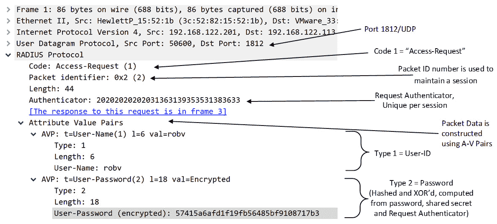
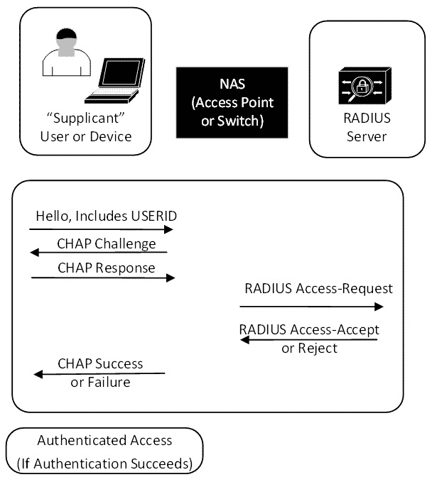
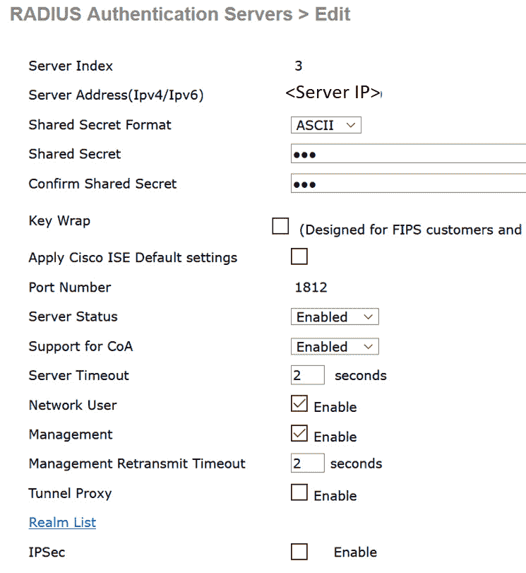
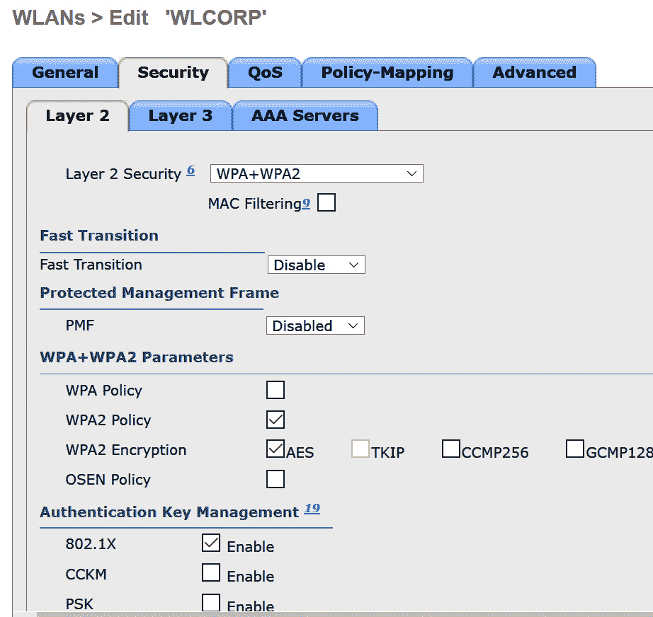
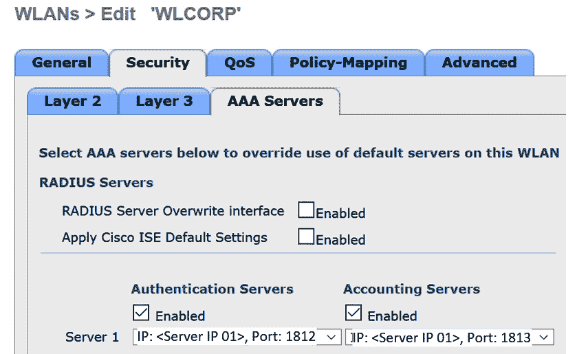

# 九、Linux 上的 RADIUS 服务

在本章中，我们将介绍远程认证拨号用户服务(**RADIUS**)，这是网络上认证服务的主要方法之一。 我们将实现 FreeRADIUS 服务器,它链接到一个后端**轻量级目录访问协议(LDAP**)/【显示】安全 LDAP**(**LDAPS)目录,并使用它访问网络上的各种服务进行身份验证。****

 **特别地，我们将涵盖以下主题:

*   RADIUS 基础—什么是 RADIUS 以及它是如何工作的?
*   用本地 Linux 身份验证实现 RADIUS
*   RADIUS 与 LDAP/LDAPS 后端认证
*   Unlang—the unlanguage
*   半径用例场景
*   使用谷歌认证器进行**多因素认证**(**MFA**)

# 技术要求

为了遵循本节中的示例，我们将使用现有的 Ubuntu 主机或**虚拟机**(**VM**)。 在这一章中，我们将涉及一些无线主题，所以如果你的主机或虚拟机中没有无线卡，你将需要一个 Wi-Fi 适配器来完成这些示例。

在我们研究各种示例时，我们将编辑几个配置文件。 如果没有特别引用，那么`freeradius`的配置文件都保存在`/etc/freeradius/3.0/`目录中。

对于我们正在安装的 Ubuntu 默认不包含的软件包，请确保您有一个正常的互联网连接，以便您可以使用`apt`命令进行安装。

# RADIUS 基础知识-什么是 RADIUS，它是如何工作的?

在我们开始之前，让我们先回顾一个关键的概念——aaa。 **AAA**是**常见的行业术语,代表认证**、**授权【显示】,**和**会计 3 关键概念控制对资源的访问。**

身份验证是证明你的身份所需要的一切。 在许多情况下，这只涉及到一个用户**标识符**(**ID**)和一个密码，但是我们将在本章中探索使用 MFA 的更复杂的方法。

授权通常在身份验证之后进行。 一旦您证明了您的身份，各种系统将使用该身份信息来确定您可以访问什么。 这可能意味着您可以访问哪些子网、主机和服务，或者可能涉及您可以访问哪些文件或目录。 在常规语言中，身份验证和授权通常可以互换使用，但在讨论 RADIUS 和系统访问时，它们是完全不同的。

会计有点倒退回拨号上网的时代。 当人们使用拨号调制解调器访问公司系统或互联网时，他们在会话期间占用了宝贵的资源(即接收调制解调器和电路)，因此 RADIUS 用于跟踪他们的会话时间和持续时间，以获得每月的发票。 在更现代的时代，RADIUS 会计仍然用于跟踪会话时间和持续时间，但现在这些信息更多地用于故障排除，有时用于取证目的。

目前，RADIUS 的主要用途是用于身份验证，通常还配置了计费功能。 授权通常由其他后端系统完成，但是 RADIUS 可以用于为每个身份验证会话分配一个基于网络的**访问控制列表**(**ACL**)，这是一种授权形式。

了解了这些背景知识之后，让我们更详细地讨论 RADIUS。 **RADIUS**认证协议极其简单，这使得它对许多不同的用例具有吸引力，因此几乎所有可能需要认证的设备和服务都支持它。 让我们来看看一个配置以及一个典型的身份验证交换(在高级别上)。

首先，让我们讨论一个需要身份验证的设备，该设备在本上下文中称为**网络访问服务器**(**NAS**)。 NAS 可以是一个**虚拟专用网络**(**VPN**)设备，一个无线控制器或接入点，或者交换机——实际上，用户可能访问的任何需要身份验证的设备。 NAS 是在 RADIUS 服务器上定义的，通常是通过**Internet 协议**(**IP**)地址，以及关联的“共享秘密”来对设备进行认证。

接下来配置设备使用 RADIUS 认证。 如果这是用于管理访问，本地身份验证通常会作为备用方法保留—因此，如果 RADIUS 不可用，本地身份验证仍然可以工作。

这就是设备(NAS)配置的全部内容。 当客户端试图连接 NAS 时，NAS 会收集登录信息并将其转发给 RADIUS 服务器进行验证(Wireshark 捕获的典型 RADIUS 请求报文见*图 9.1*)。 在包中要注意的事项包括:

*   RADIUS 请求使用的端口为`1812/udp`。 RADIUS 计费的匹配端口是`1813/udp`—计费跟踪连接时间等，并在历史上用于计费。 许多 RADIUS 服务器仍然完全支持旧式的端口集(`1645`和`1646/udp`)。
*   `Code`字段用于识别数据包类型——在本例中，我们将介绍`Access-Request`(代码`1`)、`Accept`(代码`2`)和`Reject`(代码`3`)。 完整的 RADIUS 代码列表包括以下代码:


表 9.1 - RADIUS 代码

*   `Packet ID`字段用于将请求和响应包连接在一起。 自半径是一个**用户数据报协议(UDP**)协议,没有一个会话的概念在协议必须说明的载荷【T7 包。****
*****   `Authenticator`字段对每个包都是唯一的，应该是随机生成的。*   报文的剩余部分由**属性值对**(通常称为**AV 对**)组成。 每一个在包装上都贴有`AVP`标签。 这使得协议可扩展; NAS 和 RADIUS 服务器都可以根据具体情况添加 AV 对。 一般有几个 AV 对支持实现,以及一些特定于供应商的 AV 对通常与 NAS 供应商和具体情况为例,区分管理访问设备和用户访问 VPN 或**无线服务设置 ID【显示】(****名称)。 当我们在本章后面探索一些用例时，我们将更深入地讨论这个问题。******

 ****在以下简单的例子,我们的两个属性是`User-Name`AV,以明文,和`User-Password`AV,贴上`Encrypted`,但是,事实上,MD5 散列值(在**MD**代表**消息摘要【显示】),使用密码文本, 共享秘密(NAS 和服务器都配置了)，以及`Request Authenticator`值。 **要求评论**(**【病人】RFC) (RFC 2865*—看【t16.1】进一步阅读部分)有一个完美的解释这是如何计算的,如果你感兴趣的更多细节:*

 *

图 9.1 -简单的 RADIUS 请求

响应通常比简单得多，如下所述:

*   它通常是代码 2`Accept`(*图 9.2*)或代码 3`Reject`(*图 9.3*)响应。
*   报文 ID 与请求中相同。
*   响应验证器由响应报文代码(在本例中为 2)、响应长度(在本例中为 20 字节)、报文 ID(2)、请求验证器和共享秘密计算而成。 回复中的其他 AV 对也将用于计算此值。 这个字段的关键是 NAS 将使用它来验证响应是否来自它所期望的 RADIUS 服务器。 第一个包示例显示了一个`Access-Accept`响应，其中访问请求被授予:


图 9.2 -简单的 RADIUS 响应(Access-Accept)

第二个响应报文示例显示了一个`Access-Reject`报文。 所有字段保持和不变，除了访问请求已经被拒绝。 如果没有配置错误，当用户名或密码值不正确时，通常会看到这个结果:


图 9.3 -简单 RADIUS 响应(Access-Reject)

现在我们知道了简单的 RADIUS 请求是如何工作的，让我们开始构建 RADIUS 服务器。

# 实现 RADIUS 与 Linux 本地认证

本例显示了最简单的 RADIUS 配置，其中`UserID`和`Password`值都在本地配置文件中定义。 由于以下几个原因，不建议在任何生产环境中使用此方法:

*   密码以明文字符串的形式存储，因此在发生泄漏时，恶意参与者可以收集所有 RADIUS 密码。
*   密码由管理员输入，而不是用户输入。 这意味着“不可抵赖性”这一关键安全概念将不复存在——如果某个事件与此类帐户绑定，那么受影响的用户总是可以说“管理员也知道我的密码——肯定是他们”。
*   还与管理员输入的密码有关——用户不能更改他们的密码，这也意味着在大多数情况下，这个 RADIUS 密码将与用户使用的其他密码不同，这使得它更难记住。

不过，在使用后端身份验证存储和更复杂的 RADIUS 交换将其复杂化之前，它是测试初始 RADIUS 配置的一种简便方法。

首先，我们将安装`freeradius`，如下:

```sh
sudo apt-get install freeradius
```

接下来，让我们编辑`client`配置，它定义了人们将向其发出身份验证请求的各种 NAS 设备。 为此，使用`sudo`编辑`/etc/freeradius/3.0/clients.conf`文件。 如您所料，您将看到 RADIUS 配置文件不能用普通权限编辑，甚至不能查看，因此必须使用`sudo`对这些文件进行所有访问。

在这个文件的底部，我们将为每个 RADIUS 客户端设备添加一个节，其中包含其名称、IP 地址和该设备的共享秘密。 请注意，最好的做法是使用一个长的随机字符串，每个设备都是唯一的。 您可以很容易地编写一个快速脚本来生成它，参见[https://isc.sans.edu/forums/diary/How+do+you+spell+PSK/16643](https://isc.sans.edu/forums/diary/How+do+you+spell+PSK/16643)了解更多细节。

在下面的代码示例中，我们添加了三个交换机(每个交换机的名称都以`sw`开头)和一个无线控制器(`VWLC01`，一个虚拟无线控制器)。 这里的一个关键概念是一致地命名设备。 对于不同的设备类型，你可能需要不同的规则或策略; 根据设备类型给它们提供一致的名称是一个方便的概念，可以简化这一点。 此外，如果设备名称标准已知且一致，那么像排序列表这样简单的事情就会变得更简单:

```sh
client sw-core01 {
   ipaddr=192.168.122.9
   nastype = cisco
   secret = 7HdRRTP8qE9T3Mte
}
client sw-office01 {
   ipaddr=192.168.122.5
   nastype = cisco
   secret = SzMjFGX956VF85Mf
}
client sw-floor0 {
   ipaddr = 192.168.122.6
   nastype = cisco
   secret = Rb3x5QW9W6ge6nsR
}
client vwlc01 {
   ipaddr = 192.168.122.8
   nastype = cisco
   secret = uKFJjaBbk2uBytmD
}
```

注意，在某些情况下，你可能需要配置整个子网——在这种情况下，客户端行可能会像这样:

```sh
Client 192.168.0.0/16 {
```

通常不建议这样做，因为它会打开 RADIUS 服务器，使其受到来自该子网的任何攻击。 如果可能的话，使用固定的 IP 地址。 在某些情况下,然而,你可能会被迫使用 subnets-for 实例,如果你有**无线访问点**(**wap)为无线客户验证直接半径,动态 ip 分配使用**动态主机配置协议(DHCP**【显示】)。**

 **注意和`nastype`一行——它将设备绑定到一个`dictionary`文件，该文件包含该供应商的通用 AV 对的定义。

接下来，让我们创建一个测试用户使用`sudo`来编辑`/etc/freeradius/3.0/users`文件，并添加一个测试帐户，如下所示:

```sh
testaccount  Cleartext-Password := "Test123"
```

最后，使用以下命令重新启动您的服务:

```sh
sudo service freeradius restart
```

现在，进行一些故障排除——为了测试配置文件的语法，使用以下命令:

```sh
sudo freeradius –CX
```

要测试认证操作，请验证您的 RADIUS 服务器信息被定义为 RADIUS 客户端(默认为 RADIUS 客户端)，然后使用`radclient`命令，如下所示:

```sh
$ echo "User-Name=testaccount,User-Password=Test123" | radclient localhost:1812 auth testing123
Sent Access-Request Id 31 from 0.0.0.0:34027 to 127.0.0.1:1812 length 44
Received Access-Accept Id 31 from 127.0.0.1:1812 to 127.0.0.1:34027 length 20
```

完成这个测试后，建议您删除本地定义的用户—这不是您应该忘记的事情，因为它可能会留给攻击者以后使用。 现在让我们将配置扩展到一个更典型的企业配置—我们将添加一个基于 LDAP 的后端目录。

# 带 LDAP/LDAPS 后端认证的 RADIUS

使用等后端身份验证存储(如**LDAP**)有很多好处。 由于这通常与常规登录使用相同的身份验证存储，这给我们带来了几个好处，详细如下:

*   LDAP 中的组成员关系可用于控制对关键访问(如管理访问)的访问。
*   RADIUS 访问的密码与标准登录的密码相同，这使得它们更容易记住。
*   密码和密码更改由用户控制。
*   当用户更改组时，凭证维护位于一个中心位置。 特别是，如果用户离开组织，他们的帐户在 LDAP 中被禁用后，就会在 RADIUS 中被禁用。

这种方法的缺点很简单:用户很难选择好的密码。 这就是为什么，特别是对于任何面向公共互联网的接口，建议使用 MFA(我们将在本章的后面介绍这一点)。

利用这一点，如果访问仅由一个简单的用户/密码交换控制，攻击者有几个很好的选择来获得访问，概述如下:

*   **使用凭证填充**: 用这种方法,攻击者从其他收集密码妥协(这些都是免费的),以及密码,你可能希望看到本地或在公司内部(当地体育团队或公司产品名称,例如),或者单词,可能是重要的目标账户(儿童或配偶的名字,汽车模型, 例如街道名称或电话号码信息)。 然后，他们会尝试所有这些方法来对付他们的目标，他们通常会从公司网站或社交媒体网站上收集这些信息(LinkedIn 就是他们最喜欢的方法)。 这是非常成功的，因为人们倾向于使用可预测的密码，或者在多个站点使用相同的密码，或者两者都使用。 在任何规模的组织中，攻击者在这种攻击中通常是成功的，时间通常从几分钟到一天。 这足够成功,自动在一些恶意病毒,最明显的是*开始 Mirai*2017 年(攻击行政上网常见**的**(【显示】物联网)设备), 然后扩展到包括任意数量的派生字符，它们使用普通单词列表来猜测密码。
*   **强力强制凭据**:与凭据填充相同，但对所有帐户使用整个密码列表，并在用尽这些单词后尝试所有字符组合。 实际上，这与证书填充是一样的，只是在最初的攻击之后“继续”。 这显示了攻击者和防御者之间的不平衡——继续攻击对攻击者来说基本上是免费的(或者像计算时间和带宽一样便宜)，那么为什么他们不继续尝试呢?

为 LDAP 身份验证存储配置 RADIUS 很容易。 虽然我们将讨论 LDAP 配置标准,重要的是要记住,这个协议是明文,因此攻击者是一个伟大的目标——**LDAPS**(**LDAP /传输层安全性(TLS)**总是优先。 通常，标准 LDAP 配置应该只用于测试，然后再使用 LDAPS 对加密方面进行分层。

首先，让我们在 RADIUS 中配置后端目录，使用 LDAP 作为传输协议。 在本例中，我们的 LDAP 目录是 Microsoft 的**Active directory**(**AD**)，但在仅 Linux 环境中，通常有一个 Linux LDAP 目录(例如，使用 OpenLDAP)。

首先，安装`freeradius-ldap`包，如下所示:

```sh
$ sudo apt-get install freeradius-ldap
```

在继续实现 LDAPS 之前，您需要您的 LDAPS 服务器所使用的 CA 服务器的公共证书。 收集这个文件在**隐私增强邮件**(**PEM)格式(也叫做 Base64 格式,如果你还记得从[*第八章【显示】*](08.html#_idTextAnchor133),*证书服务在 Linux 上*),并将其复制到`/usr/share/ca-certificates/extra`目录中(您需要创建这个目录),如下:**

```sh
$ sudo mkdir /usr/share/ca-certificates/extra
```

将证书复制或移动到新目录中，如下所示:

```sh
$ sudo cp publiccert.crt /usr/share/ca-certifiates/extra
```

告诉 Ubuntu 将这个目录添加到`certs listgroups`，如下所示:

```sh
$ sudo dpkg-reconfigure ca-certificates
```

系统将提示您添加任何新证书，因此请确保选择刚刚添加的证书。 如果您不希望在列表中看到任何证书，请取消此操作，并在继续之前验证这些证书不是恶意的。

接下来，我们将编辑`/etc/freeradius/3.0/mods-enabled/ldap`文件。 这个文件不在这里——如果需要，您可以引用`/etc/freeradius/3.0/mods-available/ldap`文件作为示例，或者直接链接到该文件。

下面显示的配置中的`server`行意味着您的 RADIUS 服务器必须能够使用**域名系统**(**DNS**)解析该服务器名称。

我们将使用以下几行配置 LDAPS:

```sh
ldap {
        server = 'dc01.coherentsecurity.com'
        port = 636
        # Login credentials for a special user for FreeRADIUS which has the required permissions
        identity = ldapuser@coherentsecurity.com
        password = <password>
        base_dn = 'DC=coherentsecurity,DC=com'
        user {
        # Comment out the default filter which uses uid and replace that with samaccountname
                #filter = "(uid=%{%{Stripped-User-Name}:-%{User-Name}})"
                filter = "(samaccountname=%{%{Stripped-User-Name}:-%{User-Name}})"
        }
        tls {
                ca_file = /usr/share/ca-certificates/extra/publiccert.crt
        }
}
```

如果您被迫配置 LDAP 而不是 LDAPS，端口将更改为`389`，当然没有证书，因此`ldap`配置文件中的`tls`部分可以删除或注释掉。

我们通常使用的`ldapuser`示例用户不需要任何异常访问。 但是，请确保为该帐户使用一个长(>16 个字符)随机密码，因为在大多数环境中，该密码不太可能随着时间的推移频繁更改。

接下来,我们直接**密码身份验证协议**(**PAP) LDAP 认证,通过将这部分添加到`/etc/freeradius/3.0/sites-enabled/default`的`authenticate / pap`部分文件(注意,这是一个链接到主文件`/etc/freeradius/3.0/sites-available`),如下:**

```sh
        pap
        if (noop && User-Password) {
                update control {
                        Auth-Type := LDAP
                }
        }
```

另外，请确保取消同一部分中的`ldap`行注释，如下所示:

```sh
       ldap
```

现在我们可以在前台运行`freeradius`。 这将允许我们看到消息发生时的处理过程—特别是显示的任何错误。 这意味着我们不必在初始测试集期间查找错误日志。 下面是你需要的代码:

```sh
$ sudo freeradius -cx
```

如果需要进一步调试，可以将`freeradius`服务器作为前台应用运行，以实时显示默认日志，代码如下:

```sh
$ sudo freeradius –X
```

最后，当一切正常工作时，通过运行以下命令重新启动 RADIUS 服务器来收集配置更改:

```sh
$ sudo service freeradius restart
```

同样，要从本地机器测试用户登录，请执行以下代码:

```sh
$ echo "User-Name=test,User-Password=P@ssw0rd!" | radclient localhost:1812 auth testing123
```

最后，我们希望启用启用 ldap 的组支持——我们将在后面的部分(*RADIUS 用例场景*)中看到，我们希望在各种策略中使用组成员关系。 为此，我们将重新访问`ldap`文件并添加一个`group`节，如下所示:

```sh
        group {
            base_dn = "${..base_dn}"
            filter = '(objectClass=Group)'
            name_attribute = cn
            membership_filter = "(|(member=%{control:${..user_dn}})(memberUid=%{%{Stripped-User-Name}:-%{User-Name}}))"
             membership_attribute = 'memberOf'
             cacheable_name = 'no'
             cacheable_dn = 'no'
        }
```

完成这些之后，我们应该认识到，LDAP 与其说是用于身份验证，不如说是用于授权—例如，它是检查组成员关系的一种很好的方法。 事实上，如果您注意到在我们构建时，这是在配置文件中特别调用的。

让我们来解决这个问题，让使用**NT LAN Manager**(**NTLM**)，这是用于身份验证的底层 AD 协议之一。

## NTLM 认证(AD) -引入 CHAP

将 RADIUS 链接回 AD 以获取帐户信息和组成员身份是目前我们在大多数组织中看到的最常见的配置。 而微软**网络策略服务器**(**NPS)是免费的,很容易安装在 domain-member Windows Server,它没有一个简单的配置链接它**双重认证【显示】**(**2 fa)服务,如谷歌身份验证。 这使得具有 AD 集成的基于 linux 的 RADIUS 服务器成为需要 MFA 的组织的一个有吸引力的选择，这些组织在建立访问权限时还需要利用 AD 组成员。****

 **这个方法的身份验证是什么样的? 让我们看看标准**Challenge-Handshake 认证协议**(**的家伙),**微软章**(**MS-CHAP**)或 MS-CHAPv2,这【显示】将口令修改功能添加到半径交换。 一个基本的 CHAP 交换看起来像这样:**



图 9.4 -基本的 CHAP 交换

按照顺序进行前面的交换，我们可以注意到以下几点:

*   首先，客户端发送初始的**Hello**，其中包括**USERID**(但不包括密码)。
*   事件解释**CHAP 挑战**来自 NAS。 这是一个随机数和 RADIUS 密钥的结果，然后使用 MD5 对密钥进行散列。
*   客户端(**Supplicant**)使用该值对密码进行散列，然后在响应中发送该值。
*   NAS 将随机数和响应值发送给 RADIUS 服务器，RADIUS 服务器进行自己的计算。
*   如果两个值匹配，则会话收到**RADIUS Access-Accept**响应; 如果不是，则会得到一个**RADIUS Access-Reject**响应。

**受保护的可扩展身份验证协议**(**PEAP)添加一个皱纹这交换——之间有一个 TLS 交换客户端和 RADIUS 服务器,客户端可以验证服务器的身份,以及加密的数据交换使用标准的 TLS。 为此，RADIUS 服务器需要一个证书，而客户机需要其受信任 CA 存储库中的颁发 CA。**

 **要为 FreeRADIUS 配置 AD 集成(使用 PEAP MS-CHAPv2)，我们将为身份验证配置`ntlm_auth`，并将 LDAP 按原样移动到配置的`authorize`部分。

要开始使用`ntlm_auth`，我们需要安装`samba`(一个对**SMB**的操作，它代表**服务器消息块**的)。 首先，确保它还没有安装，如下所示:

```sh
$ sudo apt list --installed | grep samba
WARNING: apt does not have a stable CLI interface. Use with caution in scripts.
samba-libs/focal-security,now 2:4.11.6+dfsg-0ubuntu1.6 amd64 [installed,upgradable to: 2:4.11.6+dfsg-0ubuntu1.8]
```

从这个清单中，我们看到它没有安装在我们的 VM 中，所以让我们用以下命令将它添加到我们的配置中:

```sh
 sudo apt-get install samba
```

同时，安装以下设备:

```sh
winbind with sudo apt-get install winbind.
```

编辑`/etc/samba/smb.conf`，并为您的域(显示了我们的测试域)更新以下代码片段中显示的行。 请确保在编辑时使用`sudo`—你需要 root 权限来修改这个文件(注意`[homes]`行可能在默认情况下被注释掉):

```sh
[global]
   workgroup = COHERENTSEC
    security = ADS
    realm = COHERENTSECURITY.COM
    winbind refresh tickets = Yes
    winbind use default domain = yes
    vfs objects = acl_xattr
    map acl inherit = Yes
    store dos attributes = Yes 
    dedicated keytab file = /etc/krb5.keytab
    kerberos method = secrets and keytab
[homes]
    comment = Home Directories
    browseable = no
    writeable=yes
```

接下来，我们将编辑`krb5.conf`文件。 示例文件位于`/usr/share/samba/setup`—将该文件复制到`/etc`并编辑该副本。 注意，在默认情况下，存在`EXAMPLE.COM`项，在大多数安装中，应该删除这些项(`example.com`是示例和文档的保留域)。 下面的代码片段说明了该代码:

```sh
[logging]
 default = FILE:/var/log/krb5libs.log
 kdc = FILE:/var/log/krb5kdc.log
 admin_server = FILE:/var/log/kadmind.log
[libdefaults]
 default_realm = COHERENTSECURITY.COM
 dns_lookup_realm = false
 dns_lookup_kdc = false
[realms]
 COHERENTSECURITY.COM = {
  kdc = dc01.coherentsecurity.com:88
  admin_server = dc01.coherentsecurity.com:749
  kpaswordserver = dc01.coherentsecurity.com
  default_domain = COHERENTSECURITY.COM
 }
[domain_realm]
 .coherentsecurity.com = coherentsecurity.com
[kdc]
  profile = /var/kerberos/krb5kdc/kdc.conf
[appdefaults]
 pam = {
  debug = false
  ticket_lifetime = 36000
  renew_lifetime = 36000
  forwardable = true
  krb4_convert = false
 }
```

编辑`/etc/nsswitch.conf`文件并添加`winbind`关键字，如下面的代码片段所示。 请注意，在 Ubuntu 20 中，`automount`这一行在默认情况下是没有的，所以你可能希望添加这一行:

```sh
passwd:         files systemd winbind
group:          files systemd winbind
shadow:         files winbind
protocols:      db files winbind
services:       db files winbind
netgroup:       nis winbind
automount:      files winbind
```

现在应该为您部分配置了，重新启动您的 Linux 主机，然后验证以下两个服务正在运行:

*   `smbd`提供文件共享和打印机共享服务。
*   `nmbd`提供 NetBIOS-to-IP-address 名称服务。

此时，您可以将您的 Linux 主机加入到 AD 域中(您将被提示输入密码)，如下所示:

```sh
# net ads join –U Administrator
```

重新启动`smbd`和`windbind`守护进程，如下所示:

```sh
# systemctl restart smbd windbind
```

您可以使用以下代码检查状态:

```sh
$ sudo ps –e | grep smbd
$ sudo ps –e | grep nmbd
```

或者，为了获得更详细的信息，你可以运行以下代码:

```sh
$ sudo service smbd status
$ sudo service nmbd status
```

你现在应该能够列出 Windows 域中的用户和组，如下代码片段所示:

```sh
$ wbinfo -u
COHERENTSEC\administrator
COHERENTSEC\guest
COHERENTSEC\ldapuser
COHERENTSEC\test
….
$ wbinfo -g
COHERENTSEC\domain computers
COHERENTSEC\domain controllers
COHERENTSEC\schema admins
COHERENTSEC\enterprise admins
COHERENTSEC\cert publishers
COHERENTSEC\domain admins
…
```

如果不起作用，那么首先要寻找答案的地方可能是 DNS。 记住这句古老的谚语，在这里用俳句来表达:

*不是 DNS*

*不可能是 DNS*

*DNS*

这很有趣，因为这是真的。 如果 DNS 配置不完美，那么所有其他事情都不能像预期的那样工作。 为了让这一切工作，您的 Linux 工作站将需要解析 Windows DNS 服务器上的记录。 做到这一点最简单的方法是让你站的 DNS 服务器设置点的 IP(参考第二章[](02.html#_idTextAnchor035)*,*基本的 Linux 网络配置和操作使用本地接口*,在`nmcli`如果你需要刷新命令)。 或者，您可以在您的 Linux DNS 服务器上设置一个条件转发器，或者在您的 Linux 主机上添加一个 AD DNS 的辅助区域—有几种可供选择的方法，这取决于您需要在您的情况下将哪个服务作为“主要”服务。*

 *要测试 DNS 解析，请尝试按名称 ping 您的域控制器。 如果可以，尝试查找一些**服务**(**SRV**)记录(这些记录是 AD 基础的一部分)—例如，您可以查看下面这个:

```sh
dig +short _ldap._tcp.coherentsecurity.com SRV
0 100 389 dc01.coherentsecurity.com.
```

接下来，验证您可以使用`wbinfo`验证 AD，然后再次使用`ntlm_auth`命令(RADIUS 使用的)，如下所示:

```sh
wbinfo -a administrator%Passw0rd!
plaintext password authentication failed
# ntlm_auth –-request-nt-key –-domain=coherentsecurity.com --username=Administrator
Password:
NT_STATUS_OK: The operation completed successfully. (0x0)
```

请注意，对于`wbinfo`登录尝试，纯文本密码失败——这(当然)是预期的情况。

在与域的连接正常工作之后，我们现在就可以开始处理 RADIUS 配置了。

我们的第一步是更新`/etc/freeradius/3.0/mods-available/mschap`文件，配置一个设置来修复挑战/响应握手中的问题。 你的`mschap`文件需要包含以下代码:

```sh
chap {
    with_ntdomain_hack = yes
}
```

此外，如果在文件中向下滚动，您将看到以`ntlm_auth ="`开头的一行。 你会希望这一行读起来像这样:

```sh
ntlm_auth = "/usr/bin/ntlm_auth --request-nt-key --username=%{%{Stripped-User-Name}:-%{%{User-Name}:-None}} --challenge=%{%{mschap:Challenge}:-00} --nt-response=%{%{mschap:NT-Response}:-00} --domain=%{mschap:NT-Domain}"
```

如果您正在进行机器身份验证，您可能需要将`username`参数更改为如下:

```sh
--username=%{%{mschap:User-Name}:-00}
```

最后，为了启用 PEAP，我们转到`mods-available/eap`文件并更新`default_eap_type`行，并将该方法从`md5`更改为`peap`。 然后，在`tls-config tls-common`部分中，将`random_file`行从默认值`${certdir}/random`更新为现在显示的`random_file = /dev/urandom`。

完成后，您希望对`eap`文件的更改如下所示:

```sh
eap {
        default_eap_type = peap
}
tls-config tls-common {
        random_file = /dev/urandom
}
```

这样就完成了 PEAP 身份验证的典型服务器端配置。

在客户端(请求方)端，我们只需启用 CHAP 或 PEAP 身份验证。 在这种配置中，工作站发送用户 ID 或机器名作为身份验证帐户，以及用户或工作站的密码的散列版本。 在服务器端，将此散列与其自己的计算集进行比较。 密码永远不会在明文中传输; 但是，服务器发送的“挑战”是作为额外的步骤发送的。

在 NAS 设备(例如，VPN 网关或无线系统)上，我们启用`MS-CHAP`或`MS-CHAPv2`身份验证(这增加了通过 RADIUS 更改密码的能力)。

现在，我们会看到事情变得有点复杂; 如果您想为多个事情使用 RADIUS—例如，在上同时控制 VPN 访问和管理访问该 VPN 服务器，使用相同的 RADIUS 服务器，该怎么办? 让我们来探索如何使用*U**nlang*语言来建立规则。

# Unlang – the unlanguage

FreeRADIUS 支持简单的处理语言**Unlang**(简称**unlanguage**)。 这允许我们制定规则，向 RADIUS 身份验证流和最终决策添加额外的控制。

Unlang 语法通常是发现在虚拟服务器文件在我们的例子中,这将是`/etc/freeradius/3.0/sites-enabled/default`,并且可以在部分名为`authorize`,`authenticate`,`post-auth`,`preacct`,`accounting`,`pre-proxy`,`post-proxy`、【显示】。

在最常见的部署,我们可能会寻找一个传入的变量或 AV 半径两例,`Service-Type`,这可能是`Administrative`或`Authenticate-Only`,Unlang 代码,匹配核对集团加入实例,网络管理员,VPN 用户,或无线用户。

对于两个防火墙登录需求(`VPN-Only`或`Administrative`访问)的简单情况，您可能有这样的规则:

```sh
if(&NAS-IP-Address == "192.168.122.20") {
    if(Service-Type == Administrative && LDAP-Group == "Network Admins") {
            update reply {
                Cisco-AVPair = "shell:priv-lvl=15"
            } 
            accept
    } 
    elsif (Service-Type == "Authenticate-Only" && LDAP-Group == "VPN Users" ) {
        accept
    }
    elsif {
        reject
    }
}
```

您可以添加进一步这个例子中,知道如果一个用户是 vpn,`Called-Station-ID`将外部防火墙的 IP 地址,而行政登录请求将 IP 或内部管理 IP(取决于您的配置)。

如果有大量设备在运行，那么可以使用`switch/case`结构来简化`if/else-if`语句的无穷无尽的列表。 您还可以针对各种设备名称使用**正则表达式**(**regexes**)，因此如果您有良好的命名约定，那么可以将`all switches`与(例如)`NAS-Identifier =~ /SW*/`匹配。

如果对无线接入进行身份验证，则`NAS-Port-Type`设置为`Wireless-802.11`，对于 802.1x 有线接入请求，则`NAS-Port-Type`设置为`Ethernet`。

你还可以包含不同的认证标准/无线名称,名称是典型的`Called-Station-SSID`变量,在格式`<Mac Address of the AP>:SSIDNAME`、`-`字符分隔的**媒体访问控制(MAC【显示】**)字节,`58-97-bd-bc-3e-c0:WLCORP`。 因此，为了只返回 MAC 地址，您需要匹配最后 6 个字符——比如`.\.WLCORP$`。****

 **在典型的企业环境中，我们可能有 2 到 3 个 ssid 用于不同的访问级别、不同网络设备类型的管理用户、使用 VPN 访问的用户或访问特定 ssid 的用户—您可以看到编码工作如何快速变得非常复杂。 建议首先在小型测试环境(可能使用虚拟网络设备)中测试对`unlang`语法的更改，然后在计划的停机/测试维护窗口期间部署并进行生产测试。

现在我们已经构建了所有的部分，让我们为各种身份验证需求配置一些真实的设备。

# RADIUS 用例场景

在本节中，我们将研究几种设备类型以及这些设备可能具有的各种身份验证选项和需求，并探索如何使用 RADIUS 解决所有这些问题。 让我们从一个 VPN 网关开始，使用标准的用户 ID 和密码身份验证(不要担心——我们不会让它这样)。

## 使用用户 ID 和密码进行 VPN 认证

认证到 VPN 服务(或者，在之前，拨号服务)是大多数组织首先考虑的 RADIUS 服务。 然而，随着时间的推移，单因素用户 ID 和密码登录不再是任何面向公众的服务的安全选项。 我们将在本节中讨论这个问题，但在 MFA 这一节中，我们将更新它以使用更现代的方法。

首先，将你的 VPN 网关(通常是你的防火墙)作为 radius 的客户端添加到你的`/etc/freeradius/3.0/clients.conf`文件中，像这样:

```sh
client hqfw01 {
  ipaddr = 192.168.122.1
  vendor = cisco
  secret = pzg64yr43njm5eu
}
```

接下来，将防火墙配置为指向 RADIUS 以进行 VPN 用户身份验证。 例如，对于 Cisco**自适应安全设备**(**ASA**)防火墙，您需要进行以下更改:

```sh
! create a AAA Group called "RADIUS" that uses the protocol RADIUS
aaa-server RADIUS protocol radius
! next, create servers that are members of this group
aaa-server RADIUS (inside) host <RADIUS Server IP 01>
 key <some key 01>
 radius-common-pw <some key 01>
 no mschapv2-capable
 acl-netmask-convert auto-detect
aaa-server RADIUS (inside) host <RADIUS Server IP 02>
 key <some key 02>
 radius-common-pw <some key 02>
 no mschapv2-capable
 acl-netmask-convert auto-detect
```

接下来，更新隧道组使用`RADIUS`服务器组进行认证，如下所示:

```sh
tunnel-group VPNTUNNELNAME general-attributes
 authentication-server-group RADIUS
 default-group-policy VPNPOLICY
```

现在已经可以工作了，让我们添加`RADIUS`作为管理访问该框的身份验证方法。

## 对网络设备的管理访问

我们想要添加的下一个内容是对同一防火墙的管理访问。 我们如何为管理员做到这一点，同时又以某种方式阻止普通 VPN 用户访问管理功能? 很简单——我们将利用一些额外的 AV 对(还记得我们在本章前面讨论的那些吗?)

我们将从添加一个新的网络策略开始，使用以下凭证:

*   对于 VPN 用户，我们将为`Service-Type`添加一个 AV 对，其值为`Authenticate Only`。
*   对于管理用户，我们将为`Service-Type`添加一个 AV 对，其值为`Administrative`。

在 RADIUS 端，策略将为每个策略要求组成员关系，因此我们将在后端身份验证存储中创建名为`VPN Users`和`Network Administrators`的组，并适当地填充它们。 请注意，当这些都放在一起时，管理员将拥有 VPN 访问权和管理员访问权，但拥有普通 VPN 帐户的人将只拥有 VPN 访问权。

为了获得实际的规则语法，我们将返回到关于 Unlang 的前一节并使用该示例，该示例完成了我们所需要的操作。 如果您请求管理访问，则需要位于`Network Admins`组中，如果您需要进行 VPN 访问，则需要位于`VPN Users`组中。 如果访问权限和组成员身份没有对齐，就会拒绝访问。

现在,半径设置,**让我们直接管理访问图形用户界面**(**GUI)和**Secure Shell (SSH【显示】**)接口半径进行身份验证。 在防火墙上，将以下更改添加到我们在 VPN 实例中讨论的 ASA 防火墙配置:******

```sh
aaa authentication enable console RADIUS LOCAL
aaa authentication http console RADIUS LOCAL
aaa authentication ssh console RADIUS LOCAL
aaa accounting enable console RADIUS
aaa accounting ssh console RADIUS
aaa authentication login-history
```

注意，每个登录方法都有一个“身份验证列表”。 我们首先使用 RADIUS，但如果失败(例如，如果 RADIUS 服务器关闭或无法访问)，本地帐户的身份验证将失败。 另外，请注意，我们在`enable`模式的列表中有 RADIUS。 这意味着我们不再需要所有管理员都必须使用一个单一的、共享的启用密码。 最后，`aaa authentication log-history`命令意味着当您进入`enable`模式时，防火墙将把您的用户名注入到 RADIUS 请求中，因此您在进入`enable`模式时只需要输入您的密码。

如果我们没有使用`unlang`规则，那么仅仅通过前面的配置就可以允许普通的访问 VPN 用户请求并获得管理访问权。 一旦您让 RADIUS 控制一个设备上的多次访问，您就必须编写规则来保持它们的直通性。

配置好防火墙后，让我们看看对路由器和交换机的管理访问。

### 对路由器和交换机的管理访问

我们将从一个 Cisco 路由器或交换机配置开始。 这个配置在平台和**Internetwork Operating System**(**IOS**)之间会有细微的差异，但看起来应该非常类似如下:

```sh
radius server RADIUS01
    address ipv4 <radius server ip 01> auth-port 1812 acct-port 1813
    key <some key>
radius server RADIUS02
    address ipv4 <radius server ip 02> auth-port 1812 acct-port 1813
    key <some key>
aaa group server radius RADIUSGROUP
    server name RADIUS01
    server name RADIUS02
ip radius source-interface <Layer 3 interface name>
aaa new-model
aaa authentication login RADIUSGROUP group radius local
aaa authorization exec RADIUSGROUP group radius local
aaa authorization network RADIUSGROUP group radius local
line vty 0 97
 ! restricts access to a set of trusted workstations or subnets
 access-class ACL-MGT in
 login authentication RADIUSG1
 transport input ssh
```

**Hewlett-Packard**(**HP**)ProCurve 等效配置如下:

```sh
radius-server host <server ip> key <some key 01>
aaa server-group radius "RADIUSG1" host <server ip 01>
! optional RADIUS and AAA parameters
radius-server dead-time 5
radius-server timeout 3
radius-server retransmit 2
aaa authentication num-attempts 3
aaa authentication ssh login radius server-group "RADIUSG1" local
aaa authentication ssh enable radius server-group "RADIUSG1" local
```

注意，当进入`enable`模式时，HP 交换机将需要第二次完整的身份验证(用户 ID 和密码)，而不像您所期望的那样仅仅是密码。

在 RADIUS 服务器上，来自 Cisco 和 HP 交换机的管理访问请求将包括我们看到的用于管理访问防火墙的相同 AV 对:`Service-type: Administrative`。 您可能会将它与 RADIUS 中的组成员要求结合起来，就像我们对防火墙所做的那样。

现在我们有了 RADIUS 控制对交换机的管理访问，让我们扩展 RADIUS 控制以包含更安全的身份验证方法。 让我们从研究 EAP- tls(其中**EAP**代表**可扩展身份验证协议**)开始，它使用证书在客户端和 RADIUS 服务器之间进行相互身份验证交换。

## EAP-TLS 认证的 RADIUS 配置

在开始这个部分之前，让我们来讨论一下什么是 EAP-TLS。 **EAP**是将 RADIUS 扩展到传统的用户 ID/密码交换之外的一种方法。 我们熟悉的 TLS 来自[*第 8 章*](08.html#_idTextAnchor133)，*Linux 上的证书服务*。 因此，简单地说，EAP-TLS 就是使用证书来证明身份并在 RADIUS 内提供身份验证服务。

在大多数“常规公司”用例中，EAP-TLS 与称为 802.1x 的第二协议配对，该协议用于控制对网络的访问——例如，对无线 SSID 或有线以太网端口的访问。 我们还需要一段时间才能实现这个目标，但是让我们先看看 EAP-TLS 的具体细节，然后再添加网络访问。

那么，从协议的角度来看，这看起来如何呢? 如果你回顾一下*使用 web 服务器证书——*的例子中我们讨论了[*第八章*](08.html#_idTextAnchor133),*证书服务在 Linux 上*,它看起来一模一样,但在两个方向。 把它画出来(在*图 9.5*)，我们看到了与我们在 web 服务器例子中看到的相同的信息交换，但在两个方向上，概述如下:

*   客户端(或乞求者)将他们的身份信息发送给半径,用他们的用户或设备证书而不是用户 ID 和 password-this RADIUS 服务器所使用的信息核实乞求者的身份,和允许或拒绝访问基于信息(和相关规则内半径)。
*   同时，验证服务器名称是否与证书中的**Common name**(**CN**)匹配，是否受信任。 这可以防止部署恶意的 RADIUS 服务器(例如，在“邪恶的孪生”无线攻击中)。
*   Once this mutual authentication is completed, the network connection is completed between the supplicant and the network device (NAS)—usually, that device is a switch or a WAP (or a wireless controller).

    你可以在下面的图表中看到这方面的说明:


图 9.5 - 802.1x/EAP-TLS 会话认证流程

以下是一些需要注意的事情:

*   所有这些都规定，所有必需的证书都是提前分发的。 这意味着 RADIUS 服务器需要安装它的证书，而请求者需要安装他们的设备证书和/或用户证书。
*   作为其中的一部分，CA 必须受到设备、用户和 RADIUS 服务器的信任。 虽然所有这些都可以使用公共 CA 完成，但通常由私有 CA 完成。
*   在身份验证过程中，请求者和 RADIUS 服务器(当然)都不与 CA 通信。

现在我们理解了 EAP-TLS 在概念上是如何工作的，那么在无线控制器上 EAP-TLS 配置是什么样子的呢?

## 基于 802.1x/EAP-TLS 的无线网络认证

802.1x 认证的 EAP-TLS 作为其无线客户端认证机制被引入到许多公司中，这主要是因为每一种无线认证方法都会受到一种或多种简单的攻击。 实际上，EAP-TLS 是对无线进行身份验证的唯一安全方法。

也就是说，NAS 上的配置(在本例中是无线控制器)非常简单—准备和配置的繁重工作都在 RADIUS 服务器和客户机站上完成。 对于 Cisco 无线控制器，配置通常主要通过 GUI 完成，当然，也有一个命令行。

在 GUI 中，EAP-TLS 身份验证非常简单—我们只是为客户机设置一个直通通道，以便直接向 RADIUS 服务器进行身份验证(反之亦然)。 步骤概述如下:

1.  First, define a RADIUS server for authentication. There's an almost identical configuration for the same server for RADIUS accounting, using port `1813`. You can see a sample configuration in the following screenshot:

    

    图 9.6 - RADIUS 服务器的无线控制器配置

2.  Next, under **SSID Definition**, we'll set up the authentication as 802.1x, as illustrated in the following screenshot:

    

    图 9.7 -配置 SSID 使用 802.1x 认证

3.  最后，在**AAA 服务器**下，我们将 RADIUS 服务器连接到**SSID**，如下截图所示:



图 9.8 -分配用于 802.1x 认证和计费的 RADIUS 服务器

要实现这一切，客户机和 RADIUS 服务器都需要适当的证书，并需要为 EAP-TLS 身份验证配置证书。 建议提前分发证书——特别是如果您正在使用自动化方式颁发证书，那么您希望给您的客户机站点足够的前置时间，以便它们都已连接并触发它们的证书颁发和安装。

现在使用 EAP-TLS 保护无线网络身份验证，典型工作站交换机上的类似配置是什么样子的?

## 基于 802.1x/EAP-TLS 的有线网络认证

在这个示例中，我们将展示用于网络设备 802.1x 身份验证的交换机侧配置(Cisco)。 在这个配置中，工作站使用 EAP-TLS 进行身份验证，并且我们告诉交换机“信任”电话。 虽然这是一种常见的配置,很容易绕开了攻击者可以告诉他们的笔记本“标签”其包(例如使用`nmcli`命令)**虚拟局域网**(**VLAN) 105 (VLAN)的声音。 只要交换机信任设备来设置自己的 VLAN，这种攻击就不是那么困难，尽管从那里获得所有参数“刚刚好”来继续攻击可能需要一些努力。 出于这个原因，到目前为止，最好让 pc 和手机都进行身份验证，但这需要进行额外的设置——手机需要设备证书来完成这个推荐的配置。**

让我们继续示例交换机配置。 首先，我们定义 RADIUS 服务器和组(从管理访问一节看来，这应该很熟悉)。

交换机允许 802.1x 的配置包括几个全局命令，建立 RADIUS 服务器和 RADIUS 组，并将 802.1x 认证连接回 RADIUS 配置。 下面的代码片段说明了这些命令:

```sh
radius server RADIUS01
    address ipv4 <radius server ip 01> auth-port 1812 acct-port 1813
    key <some key>
radius server RADIUS02
    address ipv4 <radius server ip 02> auth-port 1812 acct-port 1813
    key <some key>
aaa group server radius RADIUSGROUP
    server name RADIUS01
    server name RADIUS02
! enable dot1x authentication for all ports by default
dot1x system-auth-control
! set up RADIUS Authentication and Accounting for Network Access
aaa authentication dot1x default group RADIUSGROUP
aaa accounting dot1x default start-stop group RADIUSGROUP
```

接下来，我们配置交换机端口。 典型交换机端口,802.1 x 认证工作站的 VLAN 101,使用工作站和/或用户证书(此前发布)和没有认证**语音 IP**(**VOIP)手机(VLAN 105)。 请注意，正如我们所讨论的，身份验证是相互的——工作站验证 RADIUS 服务器是否有效，就像 RADIUS 服务器验证工作站一样。**


表 9.2 -交换机 802.1x/EAP-TLS 配置接口配置

要强制 VOIP 电话也使用 802.1x 和证书进行身份验证，请删除`trust device cisco-phone`线路。 有一些政治风险在这如果一个人的电脑不能进行身份验证和他们不能叫 Helpdesk 因为他们的电话,立即引发了“温度”的整个故障诊断和解决方案的过程,即使他们可以叫 Helpdesk 使用手机。

接下来，让我们回溯一点并添加 MFA，以谷歌 Authenticator 的形式。 当用户 ID 和密码可能是遗留解决方案时，通常使用这种方法。 例如，这是一种很好的解决方案，可以保护 VPN 身份验证免受密码填充攻击之类的攻击。

# 为 MFA 使用谷歌认证器

正如所讨论的，2FA 身份验证方案是访问面向公共的服务的最佳选择，特别是任何面向公共互联网的服务，而在过去，您可能已经为身份验证配置了一个简单的用户 ID 和密码。 **与的短消息服务**(**短信)妥协,我们看到了媒体为什么短信 2 fa-it 是幸运的,一个贫穷的首选工具,如谷歌身份验证可以配置免费这个用例。**

首先，我们将安装一个新的包，允许对谷歌 Authenticator 进行身份验证，如下所示:

```sh
$ sudo apt-get install libpam-google-authenticator -y
```

在`users`文件中，我们将将用户身份验证改为使用**可插入身份验证模块**(**PAMs**)，如下所示:

```sh
# Instruct FreeRADIUS to use PAM to authenticate users
DEFAULT Auth-Type := PAM
$ sudo vi /etc/freeradius/3.0/sites-enabled/default
```

取消`pam`行注释，如下所示:

```sh
#  Pluggable Authentication Modules.
        pam
```

接下来，我们需要编辑`/etc/pam.d/radiusd`文件。 注释掉默认的`include`文件，如下面的代码片段所示，并添加用于谷歌 Authenticator 的行。 注意`freeraduser`是一个本地 Linux 用户 ID，它将是这个模块的进程所有者:

```sh
#@include common-auth
#@include common-account
#@include common-password
#@include common-session
auth requisite pam_google_authenticator.so forward_pass secret=/etc/freeradius/${USER}/.google_authenticator user=<freeraduser>
auth required pam_unix.so use_first_pass
```

如果您的谷歌身份验证器服务正在工作，那么到它的 RADIUS 链接现在也应该工作!

接下来,生成谷歌身份验证器密钥和供应**快速反应****(QR)代码,帐户恢复信息和其他帐户信息到客户端(这可能是一个自助式的实现在大多数环境中)。**

现在，当用户对 RADIUS 进行身份验证时(对于 VPN、管理访问或其他类型)，他们使用常规密码和谷歌密钥。 在大多数情况下，您不希望这种开销用于无线身份验证。 证书往往最适合这种情况——如果您的无线设备没有使用 EAP-TLS 进行身份验证，那么它很容易受到一种或多种常见攻击。

# 总结

这就结束了我们使用 RADIUS 对各种服务器进行身份验证的旅程。 与我们在本书中探讨的许多 Linux 服务一样，本章只是触及了 RADIUS 可以用来解决的常见配置、用例和组合的表面。

此时，您应该具备了解 RADIUS 如何工作的专业知识，并能够为 VPN 服务和管理访问以及无线和有线网络访问配置安全的 RADIUS 身份验证。 您应该具备了解 PAP、CHAP、LDAP、EAP-TLS 和 802.1x 认证协议的基础知识。 特别是，EAP-TLS 用例应该说明为什么拥有一个内部 CA 可以真正帮助保护您的网络基础设施。

最后，我们讨论了 MFA 的谷歌 Authenticator 与 RADIUS 的集成。 不过，我们没有介绍谷歌 Authenticator 服务的详细配置——最近这种情况似乎变化得非常频繁，因此最好参考该服务的谷歌文档。

在下一章中，我们将讨论如何使用 Linux 作为负载平衡器。 负载平衡器已经存在了很多年，但是最近几年，它们在物理数据中心和虚拟数据中心的部署频率越来越高，而且差异也越来越大——敬请关注!

# 问题

正如我们总结的，这里有一个问题列表，供你测试你对本章材料的知识。 你可以在附录的*评估*部分找到答案:

1.  对于您打算对管理访问和 VPN 访问进行身份验证的防火墙，如何允许普通用户访问 VPN 而不允许管理访问?
2.  为什么 EAP-TLS 是一种很好的无线网络认证机制?
3.  如果 EAP-TLS 是如此伟大，为什么 MFA 比 EAP-TLS 更适合用于 VPN 访问认证证书?

# 进一步阅读

本章所引用的基本 rfc 列于此:

*   *RFC 2865*:*RADIUS*([https://tools.ietf.org/html/rfc2865](https://tools.ietf.org/html/rfc2865))
*   *RFC 3579*:*RADIUS 支持 EAP*([https://tools.ietf.org/html/rfc3579](https://tools.ietf.org/html/rfc3579))
*   *RFC 3580*:*IEEE 802.1X RADIUS 使用指南*([https://tools.ietf.org/html/rfc3580](https://tools.ietf.org/html/rfc3580))

但是，DNS 的 rfc 的完整列表是相当大的。 下面的列表显示当前淘汰的 rfc 和实验性 rfc 已被删除。 当然，这些都可以在[https://tools.ietf.org](https://tools.ietf.org)和[https://www.rfc-editor.org:](https://www.rfc-editor.org:)中找到。

*RFC 2548*:*Microsoft Vendor-specific RADIUS Attributes*

*RFC 2607*:*代理链和漫游策略实现*

*RFC 2809*:*L2TP 强制隧道 RADIUS 实现*

*RFC 2865*:*Remote Authentication Dial-In User Service (RADIUS)*

*RFC 2866*:*RADIUS 计费*

*RFC 2867*:*RADIUS 计费修改支持隧道协议*

*RFC 2868*:*RADIUS 协议支持属性*

*RFC 2869*:*RADIUS 扩展*

*RFC 2882*:*网络接入服务器需求:扩展的 RADIUS 实践*

*RFC 3162*:*RADIUS 和 IPv6*

*RFC 3575*:*RADIUS 的 IANA 考虑因素*

*RFC 3579*:*RADIUS 支持 EAP*

*RFC 3580*:*IEEE 802.1X RADIUS 使用指南*

*RFC 4014*:*RADIUS Attributes Suboption for the DHCP Relay Agent Information Option*

*RFC 4372*:*计费用户身份*

*RFC 4668*:*RADIUS 认证客户端 MIB for IPv6*

*RFC 4669*:*RADIUS 认证服务器 MIB for IPv6*

*RFC 4670*:*RADIUS Accounting Client MIB for IPv6*

*RFC 4671*:*RADIUS Accounting Server MIB for IPv6*

*RFC 4675*:*RADIUS 属性 for Virtual LAN and Priority Support*

*RFC 4679*:*DSL 论坛特定的 RADIUS 属性*

*RFC 4818*:*RADIUS delegation - ipv6 - prefix Attribute*

*RFC 4849*:*RADIUS 过滤规则属性*

*RFC 5080*:*常见的 RADIUS 实现问题及建议修复*

*RFC 5090*:*RADIUS 扩展 for Digest Authentication*

*RFC 5176*:*RADIUS 动态授权扩展*

*RFC 5607*:*RADIUS Authorization for NAS Management*

*RFC 5997*:*状态服务器报文在 RADIUS 协议中的使用*

*RFC 6158*:*RADIUS 设计指引*

*RFC 6218*:*Cisco Vendor-Specific RADIUS Attributes for Delivery of key Material*

*RFC 6421*:*Crypto-Agility Requirements for Remote Authentication Dial-In User Service (RADIUS)*

*RFC 6911*:*RADIUS 属性 for IPv6 接入网络*

*RFC 6929*:*RADIUS (Remote Authentication Dial-In User Service)协议扩展*

*RFC 8044*:*RADIUS 数据类型*

*   AD/SMB integration:

    [https://wiki.freeradius.org/guide/freeradius-active-directory-integration-howto](https://wiki.freeradius.org/guide/freeradius-active-directory-integration-howto)

    [https://web.mit.edu/rhel-doc/5/RHEL-5-manual/Deployment_Guide-en-US/s1-samba-security-modes.html](https://web.mit.edu/rhel-doc/5/RHEL-5-manual/Deployment_Guide-en-US/s1-samba-security-modes.html)

    [https://wiki.samba.org/index.php/Setting_up_Samba_as_a_Domain_Member](https://wiki.samba.org/index.php/Setting_up_Samba_as_a_Domain_Member)

*   802.1x:[https://isc.sans.edu/diary/The+Other+Side+of+Critical +Control+1%3A+802.1x+Wired+Network+Access+Controls/25146](https://isc.sans.edu/diary/The+Other+Side+of+Critical+Control+1%3A+802.1x+Wired+Network+Access+Controls/25146)
*   Unlang references:

    [https://networkradius.com/doc/3.0.10/unlang/home.html](https://networkradius.com/doc/3.0.10/unlang/home.html)

    [https://freeradius.org/radiusd/man/unlang.txt](https://freeradius.org/radiusd/man/unlang.txt)********************