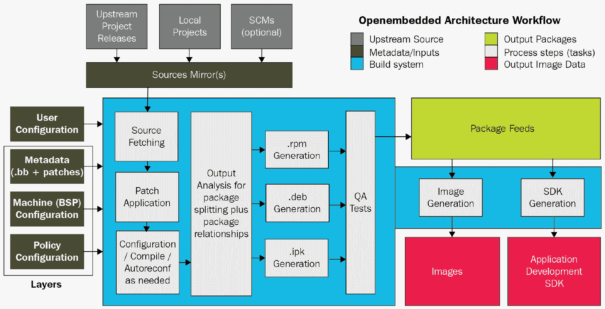
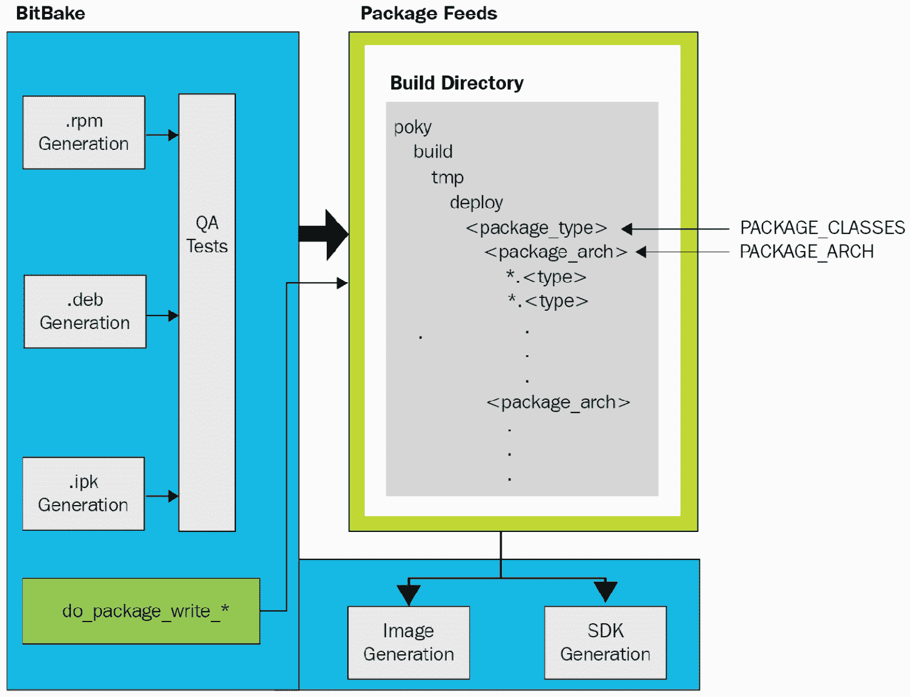
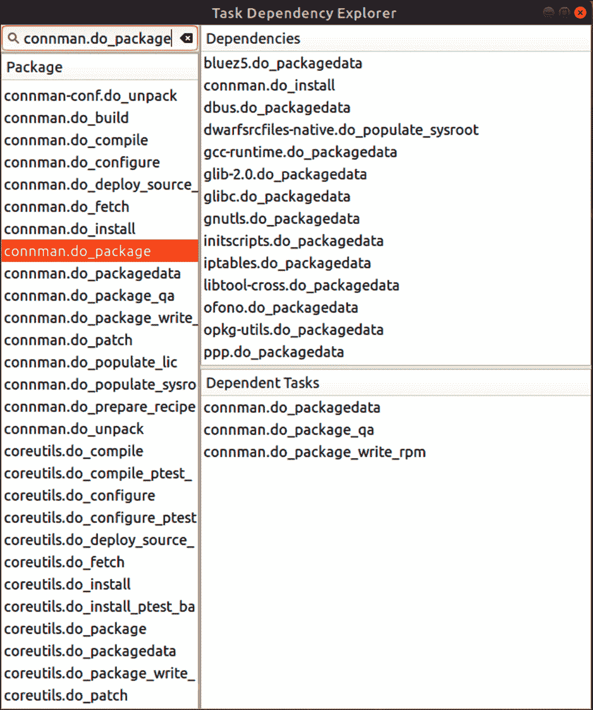

# 八、引擎盖下的 Yocto

在本章中，我们将深入研究嵌入式 Linux 的主要构建系统**Yocto**。 我们将从介绍 Yocto 的架构开始，逐步介绍整个构建工作流程。 接下来，我们将看看 Yocto 的多层方法，以及为什么将元数据分成不同的层是个好主意。 随着越来越多的**BitBake**层在您的项目中堆积起来，问题将不可避免地出现。 我们将研究调试 Yocto 构建失败的多种方法，包括任务日志、`devshell`和依赖图。

在分析完构建系统之后，我们将回顾上一章中关于 BitBake 的主题。 这一次，我们将介绍更多的基本语法和语义，以便您可以从头开始编写您自己的食谱。 我们将从实际的菜谱、包含和配置文件中查看 BitBake shell 和 Python 代码的真实示例，这样您就可以知道当您开始涉足 Yocto 的元数据海洋时会发生什么。

在本章中，我们将介绍以下主题：

*   分解 Yocto 的体系结构和工作流
*   将元数据分成多个图层
*   生成失败故障排除
*   了解 BitBake 语法和语义

我们开始吧!

# 技术要求

要按照本章中的示例操作，请确保您具备以下条件：

*   至少具有 60 GB 可用磁盘空间的基于 Linux 的系统主机系统
*   Yocto 3.1(邓费尔)LTS 版本

您应该已经在[*第 6 章*](06.html#_idTextAnchor164)，
*选择构建系统*中构建了 Yocto 的 3.1(Dunfall)LTS 发行版。 如果没有，请参考*Yocto Project Quick Build*指南([https://www.yoctoproject.org/docs/current/brief-yoctoprojectqs/brief-yoctoprojectqs.html](https://www.yoctoproject.org/docs/current/brief-yoctoprojectqs/brief-yoctoprojectqs.html))的*Compatible Linux Distribution*和*Build Host Packages*部分，然后根据[*第 6 章*](06.html#_idTextAnchor164)中的说明在您的 LINUX 主机上构建 Yocto。

# 分解 Yocto 的架构和工作流程

**Yocto**是一个复杂的野兽。 拆解它是理解它的第一步。 构建系统的体系结构可以根据其工作流程进行组织。 Yocto 从它所基于的**OpenEmbbedded**项目获得其工作流。 源材料以 BitBake 食谱的形式以元数据的形式作为输入输入到系统中。 构建系统使用此元数据来获取、配置源代码，并将其编译为二进制包提要。 在生成最终的 Linux 映像和 SDK 之前，这些单独的输出包将在登台区域内组装，并带有一个清单，其中包括每个包的许可证：



图 8.1-OpenEmbedded 体系结构工作流

以下是 Yocto 构建系统工作流程的 7 个步骤，如上图
所示：

1.  定义策略、计算机和软件元数据的层。
2.  从软件项目的源 URI 获取源。
3.  解压源代码，应用任何补丁程序，然后编译软件。
4.  将构建构件安装到临时区域以进行打包。
5.  将安装的构建构件捆绑到根文件系统的包提要中。
6.  在提交二进制程序包源之前，对其运行 QA 检查。
7.  并行生成完成的 Linux 镜像和 SDK。

除第一步和最后一步外，此工作流程中的所有步骤都是在每个配方的基础上执行的。 代码编译、清理和其他形式的静态分析可能发生在编译之前或之后。 单元和集成测试可以直接在构建机器上运行，也可以在充当目标 SoC 替身的 QEMU 实例上运行，也可以在目标本身上运行。 构建完成后，可以将完成的映像部署到一组专用设备上进行进一步测试。 作为嵌入式 Linux 构建系统的黄金标准，Yocto 是许多产品的软件 CI/CD 管道的重要组件。

Yocto 生成的包可以是`rpm`、`deb`或`ipk`格式。 默认情况下，除了主二进制程序包之外，构建系统还尝试为处方生成以下所有程序包：

*   `dbg`：二进制文件，包括调试符号
*   `static-dev`：头文件和静态库
*   `dev`：头文件和共享库符号链接
*   `doc`：文档，包括手册页
*   `locale`：语言翻译信息

除非启用`ALLOW_EMPTY`
变量，否则不会生成不包含文件的包。 默认情况下要生成的包集由`PACKAGES`变量确定。 这两个变量都是在`meta/classes/packagegroup.bbclass`中定义的，但是它们的值可以被从该`BitBake`类继承的包组食谱覆盖。

构建 SDK 支持整个其他开发工作流程，用于操作单独的包食谱。 在上一章的*使用 devtool*捕获更改一节中，我们了解了如何使用`devtool`添加和修改 SDK 软件包，以便将它们集成回映像中。

## 元数据

**元数据**是进入构建系统的输入。 它控制着建造什么以及如何建造。 元数据不仅仅是食谱。 BSP、策略、补丁和其他形式的配置文件也是元数据。 构建哪个版本的包以及从哪里提取源代码肯定是元数据的形式。 开发人员通过命名文件、设置变量和运行命令来做出所有这些选择。 这些配置操作、参数值及其产生的构件是另一种形式的元数据。 Yocto 解析所有这些输入，并将它们转换为完整的 Linux 映像。

对于使用 Yocto 进行构建，开发人员做出的第一个选择是
机器架构的目标。 这可以通过在项目的
`conf/local.conf`文件中设置`MACHINE`变量来实现。 在针对 QEMU 时，我喜欢使用
`MACHINE ?= "qemuarm64"`来指定`aarch64`作为机器架构。
Yocto 确保正确的编译器标志从 BSP 向下传播到其他构建层。

特定于体系结构的设置在名为*tunes*的文件中定义，这些文件位于 Yocto 的`meta/conf/machine/include`目录中，以及各个 BSP 层本身。 每个 Yocto 版本都包含许多 BSP 层。 在上一章中，我们广泛使用了`meta-raspberrypi`BSP 层。 每个 BSP 的源代码都驻留在它自己的 Git 存储库中。

要克隆 Xilinx 的 BSP 层(其中包含对其 Zynq 系列 SoC 的支持)，请使用以下命令：

```sh
$ git clone git://git.yoctoproject.org/meta-xilinx 
```

这只是 Yocto 附带的众多 BSP 层中的一个例子。 在后续的任何练习中，您都不需要该层，因此可以随意丢弃它。

元数据需要个源代码才能起作用。 BitBake 的`do_fetch`任务可以通过多种不同的方式获取菜谱源文件。 以下是两种最突出的方法：

*   当别人开发你需要的软件时，最简单的方法就是让 BitBake 下载该项目的 tarball 版本。
*   要扩展别人的开源软件，只需在 GitHub 上派生存储库。 然后，BitBake 的`do_fetch`任务可以使用 Git 从给定的`SRC_URI`克隆源文件。

如果您的团队负责软件，那么您可以选择将其作为本地项目嵌入到您的工作环境中。 您可以通过将其嵌套为子目录或使用`externalsrc`类将其定义在树外来实现这一点。 嵌入意味着源代码绑定到您的层存储库，不能在其他地方轻松使用。
使用`externalsrc`的树外项目要求所有建筑实例上的路径相同，并破坏可重复性。 这两种技术仅仅是用于加速开发的工具。 这两种产品都不应该用于生产。

策略是作为分布层捆绑在一起的属性。 其中包括 Linux 发行版需要哪些特性(例如`systemd`)、C 库实现
(`glibc`或`musl`)和包管理器。 每个发行版层都有自己的`conf/distro`子目录。 目录中`.conf`文件定义分发或映像的顶级策略。 有关发行版层的示例，请参见`meta-poky`子目录。 这个 POKY 参考分布层包括`.conf`文件，用于为您的目标设备构建默认的、微小的、渗漏边缘的和其他风格的 POKY。 我们在上一章的*构建您自己的发行版*一节中介绍了这一点。

## 构建任务

我们已经看到了 BitBake 的`do_fetch`任务如何下载和提取食谱的源代码。 构建过程的下一步是修补、配置和编译所述源代码：`do_patch`、`do_configure`和`do_compile`。

`do_patch`任务使用`FILESPATH`变量和配方的`SRC_URI`变量来定位补丁文件并将它们应用到预期的源代码。 在`meta/classes/base.bbclass`中的`FILESPATH`变量定义构建系统用来搜索补丁文件的默认目录集
(*Yocto Project Reference Manual*，
[https://www.yoctoproject.org/docs/current/ref-manual/ref-manual.html#ref-tasks-patch](https://www.yoctoproject.org/docs/current/ref-manual/ref-manual.html#ref-tasks-patch))。 按照惯例，补丁文件的名称以`.diff`和`.patch`结尾，并且驻留在相应配方文件所在的子目录中。 通过定义一个`FILESEXTRAPATHS`变量并将文件路径名附加到
配方的`SRC_URI`变量，可以扩展和覆盖此默认行为。 修补源代码后，`do_configure`和
`do_compile`任务将配置、编译和链接它：



图 8.2-软件包馈送

当`do_compile`完成时，`do_install`任务将结果文件复制到
临时区域，在那里它们已准备好打包。 在那里，`do_package`和
`do_package_data`任务协同工作，以处理登台区中的构建构件，并将它们划分为包。 在将包提交到 Package Feed 区域之前，`do_package_qa`任务会对包构件进行一系列 QA 检查。 这些自动生成的质量保证检查在`meta/classes/insane.bbclass`中定义。 最后，`do_package_write_*`任务创建各个包并将它们发送到包提要区域。 一旦填充了包提要区域，BitBake 就可以生成图像和 SDK 了。

## 图像生成

生成图像是一个多阶段的过程，它依赖于几个变量来执行一系列任务。 `do_rootfs`任务为映像创建根文件系统。 这些变量决定将哪些软件包安装到映像上：

*   `IMAGE_INSTALL`：要安装到映像上的软件包
*   `PACKAGE_EXCLUDE`：要从映像中省略的包
*   `IMAGE_FEATURES`：要安装到映像上的其他软件包
*   `PACKAGE_CLASSES`：要使用的包格式(`rpm`、`deb`或`ipk`)
*   `IMAGE_LINGUAS`：要包括的支持包的语言(文化)

回想一下，在[*第 6 章*](06.html#_idTextAnchor164)，*选择构建系统*中，我们将包添加到`IMAGE_INSTALL`变量中，作为*编写映像配方*部分的一部分。 来自`IMAGE_INSTALL`变量的包列表被传递给包管理器(`dnf`、`apt`或`opkg`)，以便可以将它们安装在映像上。 调用哪个包管理器取决于包提要的格式：`do_package_write_rpm`、`do_package_write_deb`或`do_package_write_ipk`。 无论目标上是否包含运行时包管理器，都会进行包安装。 如果没有安装包管理器，则出于卫生目的和节省空间的目的，不必要的文件将在此包安装阶段结束时从映像中删除。

软件包安装完成后，将运行软件包的安装后脚本。 这些安装后脚本随软件包一起提供。 如果所有安装后脚本都成功运行，则会写入一个清单，并在根文件系统映像上执行优化。 此顶级`.manifest`文件列出了已安装在映像上的所有软件包。 默认库大小和可执行启动时间优化由`ROOTFS_POSTPROCESS_COMMAND`变量定义。

现在已经完全填充了根文件系统，`do_image`任务可以开始图像处理了。 首先，执行由`IMAGE_PREPROCESS_COMMAND`变量定义的所有预处理命令。 接下来，该过程创建最终的图像输出文件。 它通过为`IMAGE_FSTYPES`变量中指定的每个图像类型(例如，`cpio.lz4`、`ext4`和`squashfs-lzo`)启动一个`do_image_*`任务来实现这一点。 然后，构建系统获取`IMAGE_ROOTFS`目录的内容，并将其转换为一个或多个图像文件。 当指定的文件系统格式允许时，这些输出图像文件被压缩。 最后，`do_image_complete`任务通过执行`IMAGE_POSTPROCESS_COMMAND`变量定义的每个后处理命令来完成图像。

现在，我们已经端到端地跟踪了 Yocto 的整个构建工作流，让我们来看看构建大型项目的一些最佳实践。

# 将元数据分成层

Yocto 元数据围绕以下概念进行组织：

*   **发行版**：操作系统特性，包括选择 C 库、`init`系统和
    窗口管理器
*   **机器**：CPU 架构、内核、驱动程序和引导加载程序
*   **配方**：应用二进制文件和/或脚本
*   **图像**：开发、制造或生产

这些概念将直接映射到构建系统的实际副产品，从而为我们在设计项目时提供指导。 我们可以急于将所有东西组装到一个单层中，但这很可能会导致一个缺乏灵活性和不可维护性的项目。 硬件不可避免地会被修改，一个成功的消费设备很快就会变成一系列产品。 出于这些原因，最好在早期采用多层方法，这样我们最终得到的软件组件就可以很容易地修改、换出和重用。

至少，您应该为开始使用 Yocto 的每个主要项目创建单独的分布层、BSP 层和应用层。 分布层构建您的应用将在其上运行的目标操作系统(Linux 发行版)。 帧缓冲区和窗口管理器配置文件属于分布层。 BSP 层指定硬件运行所需的引导加载程序、内核和设备树。 应用层包含构建构成自定义应用的所有包所需的配方。

我们第一次遇到`MACHINE`变量是在[*第 6 章*](06.html#_idTextAnchor164)，*选择构建系统*中，当时我们使用 Yocto 执行了我们的第一次构建。 我们在上一章末尾介绍了变量`DISTRO`
，当时我们创建了自己的分布层。
本书中的其他 Yocto 练习依赖于`meta-poky`作为发行版层。 通过将层插入到 Active Build 目录的
`conf/bblayers.conf`文件中的`BBLAYERS`变量中，可以将层添加到您的构建中。 以下是 POKY 的默认`BBLAYERS`定义的示例：

```sh
BBLAYERS ?= " \
  /home/frank/poky/meta \
  /home/frank/poky/meta-poky \
  /home/frank/poky/meta-yocto-bsp \
  "
```

使用`bitbake-layers`命令行工具处理项目图层，而不是直接编辑`bblayers.conf`。 抵制直接修改 POKY 源码树的诱惑。 始终在 POKY 上方创建您自己的图层(例如，`meta-mine`)，并在那里进行更改。 下面是开发期间 Active Build 目录(例如，`build-mine`)中的`conf/bblayers.conf`文件中的`BBLAYERS`变量应该是什么样子：

```sh
BBLAYERS ?= " \
  /home/frank/poky/meta \
  /home/frank/poky/meta-poky \
  /home/frank/poky/meta-yocto-bsp \
  /home/frank/meta-mine \
  /home/frank/build-mine/workspace \
  "
```

`workspace`是我们在上一章实验`devtool`时遇到的一个特殊临时层。 每个 BitBake 层都具有相同的基本目录结构，无论它是哪种类型的层。 按照惯例，层目录名称通常以`meta-`前缀开头。 以下面的虚拟图层为例：

```sh
$ tree meta-example
meta-example
├── classes
│   ├── class-a.bbclass
│   ├── ...
│   └── class-z.bbclass
├── conf
│   └── layer.conf
├── COPYING.MIT
├── README
├── recipes-a
│   ├── package-a
│   │   └── package-a_0.1.bb
│   ├── ...
│   └── package-z
│       └── package-z_0.1.bb
├── recipes-b
│   └── ...
└── recipes-c
    └── ...
```

每个层都必须有一个包含`layer.conf`文件的`conf`目录，以便 BitBake 可以设置路径和搜索元数据文件的模式。 我们在[*第 6 章*](06.html#_idTextAnchor164)，*选择构建系统*中仔细查看了`layer.conf`的内容，当时我们为 Nova 电路板创建了`meta-nova`层。 BSP 和分布层还可以在`conf`目录下有一个`machine`或`distro`子目录以及更多。 `conf`文件。 我们在上一章中研究了机器和发行版的结构，当时我们在`meta-raspberrypi`层的基础上构建并创建了我们自己的`meta-mackerel`发行层。

只有定义自己的 BitBake 类的层才需要`classes`子目录。 食谱是按类别组织的，例如*连接性*，因此`recipes-a`实际上是`recipes-connectivity`的占位符，依此类推。 一个类别可以包含一个或多个包，每个包都有自己的一组 BitBake 配方文件(`.bb`)。 配方文件按包版本号进行版本控制。 同样，像`package-a`和`package-z`这样的名称仅仅是真实包的占位符。

在这些不同的层次中很容易迷失方向。 即使你对 Yocto 变得越来越熟练，你也会发现很多时候你会问自己某个特定的文件是如何出现在你的图像上的。 或者，更有可能的是，您需要修改或扩展的食谱文件在哪里才能完成您需要做的事情？ 幸运的是，Yocto 提供了一些命令行工具来帮助您回答这些问题。 我建议您探索`recipetool`、`oe-pkgdata-util`和`oe-pkgdata-browser`，并熟悉它们。 你可以为自己节省很多时间。

# 生成失败故障排除

在前两章中，我们了解了如何为 QEMU、我们的 Nova 主板和 Raspberry PI 4 构建可引导映像。但是当出现问题时会发生什么？ 在这一节中，我们将介绍一些有用的调试技术，这些技术应该会使争论 Yocto 构建失败的前景变得不那么可怕。

要执行后续练习中的命令，需要激活 BitBake 环境，如下所示：

1.  首先，在克隆 Yocto 的目录上导航一级。
2.  接下来，设置您的 BitBake 工作环境：

    ```sh
    $ source poky/oe-init-build-env build-rpi
    ```

这将设置一系列环境变量，并将您带回我们在上一章中创建的`build-rpi`目录。

## 隔离错误

那么，您的构建失败了，但是它在哪里失败了呢？ 您收到了一条错误消息，但它是什么意思？它来自哪里？ 不要绝望。 调试的第一步是重现错误。 一旦可以重现错误，就可以将问题缩小到一系列已知步骤。 追溯这些步骤就是您发现故障的方式：

1.  首先，查看 BitBake 构建错误消息，看看是否识别出任何包或任务名称。 如果您不确定工作区中有哪些包，可以使用以下命令获取它们的列表：

    ```sh
    $ bitbake-layers show-recipes
    ```

2.  Once you have identified which package failed to build, then search your current layers for any recipe or appends files related to that package, like so:

    ```sh
    $ find ../poky -name "*connman*.bb*"
    ```

    在本例中，要搜索的包是`connman`。 前面`find`命令中的`../poky`参数假定您的构建目录与`poky`相邻，就像上一章中的`build-pi`一样。

3.  接下来，列出`connman`配方可用的所有任务：

    ```sh
    $ bitbake -c listtasks connman
    ```

4.  要重现错误，可以重新生成`connman`，如下所示：

    ```sh
    $ bitbake -c clean connman && bitbake connman 
    ```

既然您知道了构建失败的秘诀和任务，您就可以继续进行下一阶段的调试了。

## 倾倒环境

在调试构建失败时，您需要查看 BitBake 环境中变量的当前值。 让我们从头开始，然后向下工作：

1.  First, dump the global environment and search for the value of `DISTRO_FEATURES`:

    ```sh
    $ bitbake -e | less
    ```

    输入`/DISTRO_FEATURES=`(注意前面的正斜杠)；`less`应该跳到类似下面这样的一行：

    ```sh
    DISTRO_FEATURES="acl alsa argp bluetooth ext2 ipv4 ipv6 largefile pcmcia usbgadget usbhost wifi xattr nfs zeroconf pci 3g nfc x11 vfat largefile opengl ptest multiarch wayland vulkan pulseaudio sysvinit gobject-introspection-data ldconfig"
    ```

2.  要转储 busybox 的软件包环境并找到其源目录，请使用以下命令：

    ```sh
    $ bitbake -e busybox | grep ^S=
    ```

3.  To dump connman's package environment and locate its working directory, use the following command:

    ```sh
    $ bitbake -e connman | grep ^WORKDIR=
    ```

    包的工作目录是在
    个 BitBake 构建期间保存其配方任务日志的位置。

在*步骤 1*中，我们可以将输出从`bitbake -e`输送到`grep`，但是`less`允许我们更容易地跟踪变量的求值。 在`less`中输入不带尾随等号的`/DISTRO_FEATURES`以搜索该变量的更多匹配项。 点击*n*跳转到下一个事件，点击*N*跳到上一个事件。

同样的命令也适用于图像和包装食谱：

```sh
$ bitbake -e core-image-minimal | grep ^S=
```

在本例中，要转储的目标环境属于`core-image-minimal`。

现在您知道了源和任务日志文件的位置，让我们来看看一些任务日志。

## 读取任务日志

BitBake 为每个 shell 任务创建一个日志文件，并将其保存到包的工作目录中的临时文件夹中。 在`connman`的情况下，该临时文件夹的路径类似于
：

```sh
$ ./tmp/work/aarch64-poky-linux/connman/1.37-r0/temp
```

日志文件名的格式为`log.do_<task>.<pid>`。 还有名称末尾没有`<pid>`的`symlinks`，它们指向每个任务的最新日志文件。 日志文件包含任务运行的输出，在大多数情况下，这是调试问题所需的所有信息。 如果没有，猜猜你能做什么？

## 添加更多日志记录

在 BitBake 中，来自 Python 的日志记录不同于来自 Shell 的日志记录。 要从 Python 登录，可以使用 BitBake 的`bb`模块，该模块调用 Python 的标准`logger`模块，如下所示：

```sh
bb.plain -> none; Output: logs console
bb.note -> logger.info; Output: logs
bb.warn -> logger.warning; Output: logs console
bb.error -> logger.error; Output: logs console
bb.fatal -> logger.critical; Output: logs console
bb.debug -> logger.debug; Output: logs console
```

要从 shell 进行日志记录，可以使用 BitBake 的`logging`类，其源代码可以在`meta/classes/logging.bbclass`中找到。 继承`base.bbclass`的所有配方自动继承`logging.bbclass`。 这意味着您应该已经可以从大多数 Shell 配方文件中使用以下所有日志记录功能：

```sh
bbplain -> Prints exactly what is passed in. Use sparingly.
bbnote -> Prints noteworthy conditions with the NOTE prefix.
bbwarn -> Prints a non-fatal warning with the WARNING prefix.
bberror -> Prints a non-fatal error with the ERROR prefix.
bbfatal -> Prints a fatal error and halts the build.
bbdebug -> Prints debug messages depending on log level.
```

根据`logging.bbclass`源，`bbdebug`函数将整数调试日志级别作为其第一个参数：

```sh
# Usage: bbdebug 1 "first level debug message" 
#        bbdebug 2 "second level debug message 
bbdebug () { 
    USAGE = 'Usage: bbdebug [123] "message"' 
    …
}
```

根据调试日志级别的不同，`bbdebug`消息可能会进入控制台，也可能不会进入控制台。

## 从 devshell 运行命令

BitBake 提供了一个开发 shell，这样您就可以在更具交互性的环境中手动运行构建命令。 要进入`devshell`以构建`connman`，请使用以下命令：

```sh
$ bitbake -c devshell connman
```

首先，该命令提取并修补`connman`的源代码。 接下来，它将在 Connman 的源目录中打开一个新的终端，并正确设置用于构建的环境。 一旦进入`devshell`，就可以运行像`./configure`和`make`这样的命令，或者直接使用`$CC`调用交叉编译器。 `devshell`非常适合于试验像`CFLAGS`或`LDFLAGS`这样的值，这些值作为命令行参数或环境变量传递给 CMake 和 Autotools 等工具。 至少，如果您正在阅读的错误消息没有意义，您可以提高构建命令的详细级别。

## 用图形表示依赖项

有时，构建错误的原因无法在包配方文件中找到，因为错误实际上是在构建包的依赖项时发生的。 要获取`connman`包的依赖项列表，请使用以下命令：

```sh
$ bitbake -v connman
```

我们可以使用 BitBake 的内置任务资源管理器来显示和导航依赖项：

```sh
$ bitbake -g connman -u taskexp
```

前面的命令在分析`connman`之后启动任务资源管理器的图形用户界面：

重要注

一些较大的映像(如 core-image-x11)具有复杂的包依赖关系树，这可能会使任务资源管理器崩溃。



图 8.3-任务资源管理器

现在，让我们将从构建和构建失败的主题中移开，专注于 Yocto 项目的原材料；也就是 BitBake 元数据。

# 了解 BitBake 语法和语义

BitBake 是一个任务运行者。 它在这方面类似于 GNU`make`，不同之处在于它对食谱而不是 Make 文件进行操作。 这些食谱中的元数据定义了 Shell 和 Python 中的任务。 BitBake 本身是用 Python 编写的。 Yocto 基于的 OpenEmbedded 项目由 BitBake 和用于构建嵌入式 Linux 发行版的大量食谱组成。 BitBake 的强大之处在于它能够并行运行任务，同时仍然满足任务间的依赖关系。 它对元数据的分层和基于继承的方法使 Yocto 能够以基于 Buildroot 的构建系统无法实现的方式进行扩展。

在[*第 6 章*](06.html#_idTextAnchor164)，*选择构建系统*中，我们了解了五种类型的 BitBake 元数据文件，即`.bb`、`.bbappend`、`.inc`、`.bbclass`和`.conf`。 我们还编写了用于构建基本`helloworld`程序和`nova-image`映像的 BitBake 食谱。 现在，我们将更仔细地查看 BitBake 元数据文件的内容。 我们知道任务是用 shell 和 Python 混合编写的，但是什么会去哪里？为什么呢？ 我们可以使用哪些语言构造，我们可以用它们做什么？ 我们如何编写元数据来构建我们的应用？ 在充分利用 Yocto 的强大功能之前，你需要学习读写 BitBake。

## 任务

任务是 BitBake 需要按顺序运行以执行配方的函数。 回想一下，任务名称以`do_`前缀开头。 以下是来自`recipes-core/systemd`的任务：

```sh
do_deploy () {
    install ${B}/src/boot/efi/systemd-boot*.efi ${DEPLOYDIR}
}
addtask deploy before do_build after do_compile
```

在本例中，定义了名为`do_deploy`的函数，并使用`addtask`命令将其立即提升为任务。 `addtask`命令还指定任务间的依赖关系。 例如，此`do_deploy`任务取决于`do_compile`任务的完成，而`do_build`任务取决于`do_deploy`任务的完成。 `addtask`表示的依赖关系只能在配方文件内部。

也可以使用`deltask`命令删除任务。 这会阻止 BitBake 将该任务作为配方的一部分执行。 要删除前面的`do_deploy`任务，请使用以下命令：

```sh
deltask do_deploy
```

这将从配方中删除任务，但原始的`do_deploy`函数定义仍将保留，并且仍然可以调用。

## 依赖关系

为了确保高效的并行处理，BitBake 在任务级别处理依赖关系。
我们看到了如何使用`addtask`来表示单个配方文件中的任务之间的依赖关系。 不同配方中的任务之间也存在依赖关系。 事实上，当我们考虑包之间的构建时和运行时依赖关系时，通常会想到这些任务间依赖关系。

### 任务间依赖关系

变量标志(**可变标志**)是一种将属性或属性附加到变量的方法。 它们的行为类似于散列映射中的键，因为它们允许您为值设置键并按键检索值。 BitBake 定义了一大组在食谱和类中使用的 varflag。 这些 varflag 指示任务的组件和依赖项是什么。 以下是 varflag 的一些示例：

```sh
do_patch[postfuncs] += "copy_sources"
do_package_index[depends] += "signing-keys:do_deploy"
do_rootfs[recrdeptask] += "do_package_write_deb do_package_qa"
```

分配给 varflag 键的值通常是一个或多个其他任务。 这意味着与`addtask`不同，BitBake 可变标志为我们提供了另一种表达任务间依赖关系的方式。 大多数嵌入式 Linux 开发人员在日常工作中可能永远不需要接触 varflag。 我在这里介绍它们，这样我们就可以理解下面的`DEPENDS`和`RDEPENDS`示例。

### 构建时依赖项

BitBake 使用`DEPENDS`变量来管理构建时依赖项。 任务的`deptask`varflag 表示必须为`DEPENDS`中的每个项目完成的任务，然后才能执行该任务(*BitBake 用户手册*，[https://www.yoctoproject.org/docs/current/bitbake-user-manual/bitbake-user-manual.html#build-dependencies](https://www.yoctoproject.org/docs/current/bitbake-user-manual/bitbake-user-manual.html#build-dependencies))：

```sh
do_package[deptask] += "do_packagedata"
```

在本例中，必须先完成`DEPENDS`中每个项目的`do_packagedata`任务，然后才能执行`do_package`。

或者，您可以绕过`DEPENDS`变量，使用`depends`标志显式定义构建时依赖项：

```sh
do_patch[depends] += "quilt-native:do_populate_sysroot"
```

在本例中，属于`quilt-native`命名空间的`do_populate_sysroot`任务必须先完成，然后才能执行`do_patch`。 食谱的任务通常组合在它们自己的命名空间中，以支持这种直接访问。

### 运行时依赖项

BitBake 使用`PACKAGES`和`RDEPENDS`变量来管理运行时依赖项。 变量`PACKAGES`列出配方创建的所有运行时包。 这些包中的每一个都可以有`RDEPENDS`个运行时依赖项。 这些是必须安装的包，给定的包才能运行。 任务的`rdeptask`https://www.yoctoproject.org/docs/current/bitbake-user-manual/bitbake-user-manual.html#runtime-dependencies 标志指定在执行任务之前必须为每个运行时依赖项完成哪些任务(*BitBake 用户手册*，[varflag](https://www.yoctoproject.org/docs/current/bitbake-user-manual/bitbake-user-manual.html#runtime-dependencies))：

```sh
do_package_qa[rdeptask] = "do_packagedata"
```

在本例中，必须先完成`RDEPENDS`中每个项目的`do_package_data`任务，然后才能执行`do_package_qa`。

类似地，`rdepends`标志的工作方式与`depends`标志非常相似，它允许您绕过`RDEPENDS`变量。 唯一的区别是`rdepends`是在运行时强制执行的，而不是在构建时强制执行的。

## 变量

BitBake 变量语法类似于`make`变量语法。 BitBake 中变量的作用域取决于定义变量的元数据文件的类型。 配方文件(`.bb`)中声明的每个变量都是局部变量。 配置文件(`.conf`)中声明的每个变量都是全局变量。 图像只是一个食谱，所以图像不能影响另一个食谱中发生的事情。

### 分配和扩展

变量赋值和扩展的工作方式与 Shell 中相同。 默认情况下，在解析语句后立即进行赋值，并且赋值是无条件的。 `$`字符触发变量扩展。 括起的大括号是可选的，用于保护要扩展的变量不受紧随其后的字符的影响。 扩展变量通常用双引号括起来，以避免意外的分词和截断：

```sh
OLDPKGNAME = "dbus-x11"
PROVIDES_${PN} = "${OLDPKGNAME}"
```

变量是可变的，通常在引用时计算，而不是像`make`中那样赋值。 这意味着如果变量在赋值的右侧被引用，那么在
左侧的变量被展开之前，引用的变量不会被求值。 因此，如果右侧的值随时间变化，那么
左侧变量的值也会随时间变化。

如果变量在解析时未定义，则条件赋值仅定义该变量。 当您不想要该行为时，这会阻止重新分配：

```sh
PREFERRED_PROVIDER_virtual/kernel ?= "linux-yocto"
```

在生成文件的顶部使用条件赋值，以防止可能已由构建系统设置的变量(例如，`CC`、`CFLAGS`和`LDFLAGS`)被覆盖。 条件赋值确保我们不会附加或预先添加到菜谱中稍后未定义的变量。

使用`??=`的延迟赋值行为与`?=`相同，不同之处在于赋值是在解析过程结束时进行的，而不是立即进行(*BitBake 用户手册*，[https://www.yoctoproject.org/docs/current/bitbake-user-manual/bitbake-user-manual.html#setting-a-weak-default-value](https://www.yoctoproject.org/docs/current/bitbake-user-manual/bitbake-user-manual.html#setting-a-weak-default-value))：

```sh
TOOLCHAIN_TEST_HOST ??= "localhost"
```

这意味着如果变量名位于多个惰性赋值的左侧，则最后一个惰性赋值语句获胜。

另一种形式的变量赋值强制在解析时立即对赋值的右侧进行求值：

```sh
target_datadir := "${datadir}"
```

请注意，用于立即赋值的`:=`运算符来自`make`，而不是 shell。

### 追加和前置

在 BitBake 中附加或前置变量或变量标志很容易。 以下两个运算符在左侧的值和从右侧追加或附加的值之间插入一个空格：

```sh
CXXFLAGS += "-std=c++11"
PACKAGES =+ "gdbserver"
```

请注意，当而不是字符串值应用于整数时，`+=`运算符表示递增，而不是追加。

如果您希望省略单个空格，也有赋值运算符可以做到这一点：

```sh
BBPATH .= ":${LAYERDIR}"
FILESEXTRAPATHS =. "${FILE_DIRNAME}/systemd:"
```

附加和前置赋值运算符的单空格版本在整个 BitBake 元数据文件中使用。

### 覆盖

BitBake 提供了另一种附加和前置变量的语法。 这种连接样式称为*覆盖*语法：

```sh
CFLAGS_append = " -DSQLITE_ENABLE_COLUMN_METADATA"
PROVIDES_prepend = "${PN} "
```

虽然乍一看可能不明显，但前面两行并没有定义新的变量。 后缀`_append`和`_prepend`修改或*覆盖*现有变量的值。 它们的功能更像 BitBake 的`.=`和`=.`，而不是`+=`和`=+`运算符，因为它们在组合字符串时省略了单个空格。 与这些运算符不同，覆盖是惰性的，因此在所有解析完成之前不会进行赋值。

最后，让我们看一下更高级的条件赋值形式，它涉及`meta/conf/bitbake.conf`中定义的`OVERRIDES`变量。 `OVERRIDES`变量是您希望满足的条件的冒号分隔列表。 此列表用于在同一变量的多个版本之间进行选择，每个版本由不同的后缀区分。 各种后缀与条件的名称相匹配。 假设`OVERRIDES`列表包含`${TRANSLATED_TARGET_ARCH}`作为条件。 现在，您可以定义一个以`aarch64`目标 CPU 体系结构为条件的变量版本，例如`VALGRINDARCH_aarch64`变量：

```sh
VALGRINDARCH ?= "${TARGET_ARCH}"
VALGRINDARCH_aarch64 = "arm64"
VALGRINDARCH_x86-64 = "amd64"
```

当`TRANSLATED_TARGET_ARCH`变量扩展到`aarch64`时，将优先选择`VALGRINDARCH`变量的`VALGRINDARCH_aarch64`版本。 与其他条件赋值方法(如 C 中的`#ifdef`指令)相比，基于`OVERRIDES`选择变量值更干净、更不易损坏。

BitBake 还支持根据特定项目是否列在`OVERRIDES`(*BitBake 用户手册*，[https://www.yoctoproject.org/docs/current/bitbake-user-manual/bitbake-user-manual.html#conditional-metadata](https://www.yoctoproject.org/docs/current/bitbake-user-manual/bitbake-user-manual.html#conditional-metadata))中对变量值进行追加和前置操作。 以下是各种真实世界的示例：

```sh
EXTRA_OEMAKE_prepend_task-compile = "${PARALLEL_MAKE} "
EXTRA_OEMAKE_prepend_task-install = "${PARALLEL_MAKEINST} "
DEPENDS = "attr libaio libcap acl openssl zip-native"
DEPENDS_append_libc-musl = " fts "
EXTRA_OECONF_append_libc-musl = " LIBS=-lfts "
EXTRA_OEMAKE_append_libc-musl = " LIBC=musl "
```

请注意，`libc-musl`是将字符串值附加到`DEPENDS`、`EXTRA_OECONF`和`EXTRA_OEMAKE`变量的条件。 与前面用于追加和前置变量的无条件覆盖语法一样，此条件语法也是惰性的。 直到配方和配置文件被解析之后，才会发生赋值。

根据`OVERRIDES`的内容对变量进行有条件的追加和前置操作非常复杂，可能会导致不必要的意外。 在采用这些更高级的 BitBake 特性之前，我建议您多练习基于`OVERRIDES`的条件赋值。

### 内联蟒蛇

BitBake 中的`@`符号允许我们在变量中插入和执行 Python 代码。 每次展开`=`运算符左侧的变量
时，都会计算
内联 Python 表达式。
运算符`:=`右侧的内联 Python 表达式在解析时只计算一次。 以下是一些内联 Python 变量扩展的示例：

```sh
PV = "${@bb.parse.vars_from_file(d.getVar('FILE', False),d)[1] or '1.0'}"
BOOST_MAJ = "${@"_".join(d.getVar("PV").split(".")[0:2])}"
GO_PARALLEL_BUILD ?= "${@oe.utils.parallel_make_argument(d, '-p %d')}"
```

请注意，`bb`和`oe`是 BitBake 和 OpenEmbedded 的 Python 模块的别名。 另外，请注意，`d.getVar("PV")`用于从任务的运行时环境中检索`PV`变量的值。 变量`d`引用一个数据存储对象，BitBake 将原始执行环境的副本保存到该对象。 这在很大程度上就是 BitBake shell 和 Python 代码彼此互操作的方式。

## 函数

函数是构成 BitBake 任务的材料。 它们是用 Shell 或 Python 编写的，并在`.bbclass`、`.bb`和`.inc`文件中定义。

### 壳 / 炮弹 / 鞘翅 / 外皮

用 shell 编写的函数作为函数或任务执行。 作为任务运行的函数通常为，其名称以`do_`前缀开头。 下面是 shell 中函数的外观：

```sh
meson_do_install() {
    DESTDIR='${D}' ninja -v ${PARALLEL_MAKEINST} install
}
```

请记住，在编写函数时要保持外壳不可知性。 BitBake 使用`/bin/sh`执行 shell 代码片段，它可能是也可能不是 Bash shell，具体取决于主机发行版。 通过对您的 shell 脚本运行`scripts/verify-bashisms`Linter 来避免虚张声势。

### 蟒蛇，蚺蛇 / 巨蛇

BitBake 理解三种类型的 Python 函数：纯、BitBake 样式和匿名。

#### 纯 Python 函数

**纯 Python 函数**是用常规的 Python 编写的，并由其他 Python 代码调用。 所谓*纯*，我的意思是函数完全位于 Python 解释器的执行环境范围内，而不是函数编程意义上的纯*。 下面是`meta/recipes-connectivity/bluez5/bluez5.inc`中的一个示例：*

```sh
def get_noinst_tools_paths (d, bb, tools):
    s = list()
    bindir = d.getVar("bindir")
    for bdp in tools.split():
        f = os.path.basename(bdp)
        s.append("%s/%s" % (bindir, f))
    return "\n".join(s)
```

请注意，此函数接受参数，就像真正的 Python 函数一样。 关于这个函数，我还想指出一些更值得注意的事情。 首先，数据存储对象不可用，因此需要将其作为函数参数传递(在本例中为`d`变量)。 其次，`os`模块是自动可用的，因此不需要导入或传入。

纯 Python 函数可以由使用`@`符号分配给外壳变量的内联 Python 调用。 事实上，这正是该包含文件的下一行中发生的事情：

```sh
FILES_${PN}-noinst-tools = \
"${@get_noinst_tools_paths(d, bb, d.getVar('NOINST_TOOLS'))}"
```

请注意，在`@`符号之后的内联 Python 作用域中，`d`数据存储对象和`bb`模块都自动可用。

#### BitBake 样式的 Python 函数

**BitBake 样式 Python 函数**定义由`python`关键字表示，而不是 Python 的原生`def`关键字。 这些函数通过从其他 Python 函数(包括 BitBake 自己的内部函数)调用`bb.build.exec_func()`来执行。 与纯 Python 函数不同，BitBake 样式函数不带参数。 缺少参数不是什么大问题，因为数据存储对象始终可以作为全局变量使用；也就是`d`。 虽然不像 Pythonic 那样，但 BitBake 定义函数的风格在整个 Yocto 中占主导地位。 下面是`meta/classes/sign_rpm.bbclass`中的 BitBake 样式 Python 函数定义：

```sh
python sign_rpm () {
    import glob
    from oe.gpg_sign import get_signer
    signer = get_signer(d, d.getVar('RPM_GPG_BACKEND'))
    rpms = glob.glob(d.getVar('RPM_PKGWRITEDIR') + '/*')

    signer.sign_rpms(rpms,
                     d.getVar('RPM_GPG_NAME'),
                     d.getVar('RPM_GPG_PASSPHRASE'),
                     d.getVar('RPM_FILE_CHECKSUM_DIGEST'),
                     int(d.getVar('RPM_GPG_SIGN_CHUNK')),
                     d.getVar('RPM_FSK_PATH'),
                     d.getVar('RPM_FSK_PASSWORD'))
} 
```

#### 匿名 Python 函数

**匿名 Python 函数**看起来很像 BitBake 样式的 Python 函数，但它在解析期间执行。 因为它们首先运行，所以匿名函数非常适合于可以在解析时完成的操作，比如初始化变量和其他形式的设置。 匿名函数定义可以使用或不使用`__anonymous`函数名编写：

```sh
python __anonymous () {
    systemd_packages = "${PN} ${PN}-wait-online"
    pkgconfig = d.getVar('PACKAGECONFIG')
    if ('openvpn' or 'vpnc' or 'l2tp' or 'pptp') in pkgconfig.split():
        systemd_packages += " ${PN}-vpn"
    d.setVar('SYSTEMD_PACKAGES', systemd_packages)
} 
python () {
    packages = d.getVar('PACKAGES').split()
    if d.getVar('PACKAGEGROUP_DISABLE_COMPLEMENTARY') != '1':
        types = ['', '-dbg', '-dev']
        if bb.utils.contains('DISTRO_FEATURES', 'ptest', True, False, d):
            types.append('-ptest')
        packages = [pkg + suffix for pkg in packages
                    for suffix in types]
        d.setVar('PACKAGES', ' '.join(packages))
    for pkg in packages:
        d.setVar('ALLOW_EMPTY_%s' % pkg, '1')
}
```

匿名 Python 函数中的`d`变量表示整个配方(*BitBake 用户手册*，[https://www.yoctoproject.org/docs/current/bitbake-user-manual/bitbake-user-manual.html#anonymous-python-functions](https://www.yoctoproject.org/docs/current/bitbake-user-manual/bitbake-user-manual.html#anonymous-python-functions))的数据存储。 因此，当您在匿名函数作用域中设置一个变量时，当其他函数运行时，该值将通过全局数据存储对象提供给其他函数。

## RDEPENDS 重访

让我们回到运行时依赖关系的主题。 这些是必须安装的包，给定的包才能运行。 该列表在包的`RDEPENDS`变量中定义。 下面是`populate_sdk_base.bbclass`中一个有趣的摘录：

```sh
do_sdk_depends[rdepends] = "${@get_sdk_ext_rdepends(d)}"
```

下面是对应的内联 Python 函数的定义：

```sh
def get_sdk_ext_rdepends(d):
    localdata = d.createCopy()
    localdata.appendVar('OVERRIDES', ':task-populate-sdk-ext')
    return localdata.getVarFlag('do_populate_sdk', 'rdepends')
```

这里有相当多的东西要拆开。 首先，该函数复制数据存储对象，以便不修改 TASK 运行时环境。 回想一下，`OVERRIDES`变量是用于在变量的多个版本之间进行选择的条件列表。 下一行将条件`task-populate-sdk-ext`添加到数据存储的本地副本中的`OVERRIDES`列表。 最后，该函数返回`do_populate_sdk`任务的`rdepends`varflag 的值。 现在的不同之处在于，使用变量的`_task-populate-sdk-ext`版本计算`rdepends`，如下所示：

```sh
SDK_EXT_task-populate-sdk-ext = "-ext"
SDK_DIR_task-populate-sdk-ext = "${WORKDIR}/sdk-ext"
```

我发现使用临时`OVERRIDES`既聪明又可怕。

BitBake 的语法和语义似乎令人望而生畏。 将 Shell 和 Python 结合在一起形成了有趣的语言特性组合。 我们现在不仅知道如何定义变量和函数，而且现在还可以通过编程方式继承类文件、覆盖变量和更改条件。 这些高级概念在`.bb`、`.bbappend`、`.inc`、`.bbclass`和`.conf`文件中反复出现，随着时间的推移将变得越来越容易识别。 当我们努力精通 BitBake，并开始扩展我们新发现的能力时，错误不可避免地会发生。

# 摘要

尽管您几乎可以使用 Yocto 构建任何东西，但要知道构建系统正在做什么或如何做并不总是那么容易。 不过，我们还是有希望的。 有命令行工具可以帮助我们找到某些东西的来源以及如何更改它。 我们可以读取和写入任务日志。 还有`devshell`，我们可以使用它从命令行配置和编译各个内容。 如果我们从一开始就将我们的项目分成多个层次，我们很可能会从我们所做的工作中获得更多的里程数
。

BitBake 的 shell 和 Python 混合支持一些强大的语言构造，比如继承、覆盖和条件变量选择。 这既有好的一面，也有坏的一面。 它的好处在于，层和食谱是完全可组合和可定制的。 不同配方文件和不同层中的元数据可能会以奇怪和意想不到的方式交互，这在某种意义上是不好的。 将这些强大的语言特性与数据存储对象充当 shell 和 Python 执行环境之间门户的能力结合起来，您就有了无数小时乐趣的秘诀。

这结束了我们对 Yocto 项目的深入探索，以及本书关于嵌入式 Linux 的*元素*的第一节。 在本书的下一节中，我们将转换话题，研究*系统架构和设计决策*，从[*第 9 章*](09.html#_idTextAnchor246)，*创建存储策略*开始。 当我们评估 Mender 时，我们将有机会在[*第 10 章*](10.html#_idTextAnchor278)，*《现场更新软件》*中再次使用 Yocto。

# 进一步阅读

以下资源包含有关本章中介绍的主题的详细信息：

*   *Yocto 项目概述和概念手册*，Scott Rifenbark：[https://www.yoctoproject.org/docs/latest/overview-manual/overview-manual.html](https://www.yoctoproject.org/docs/latest/overview-manual/overview-manual.html)
*   *我希望我知道的是什么*，Yocto 项目：[https://www.yoctoproject.org/docs/what-i-wish-id-known](https://www.yoctoproject.org/docs/what-i-wish-id-known)
*   *BitBake 用户手册*，作者：Richard Purdie、Chris Larson 和 Phil Blundell：[HTTPS：//www.yoctoproject.org/docs/Latest/bitbake-user-Manual/bitbake-user-manual.html](https://www.yoctoproject.org/docs/latest/bitbake-user-manual/bitbake-user-manual.html)
*   *Embedded Linux Projects Using Yocto Project Cookbook*，Alex Gonzalez 著*