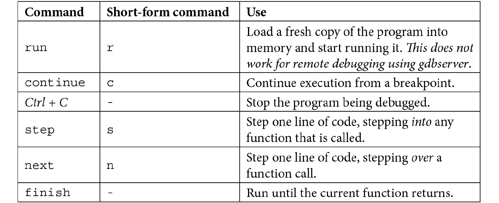
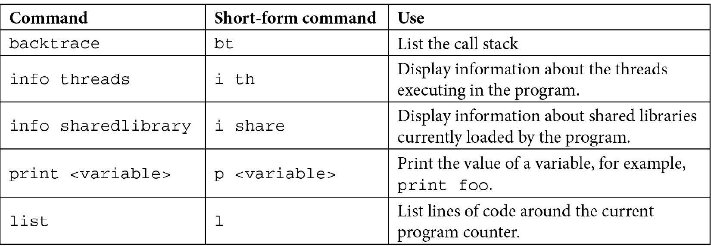
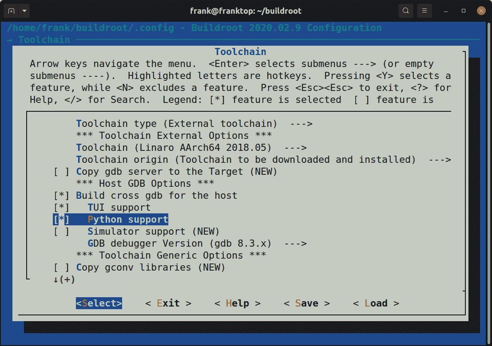
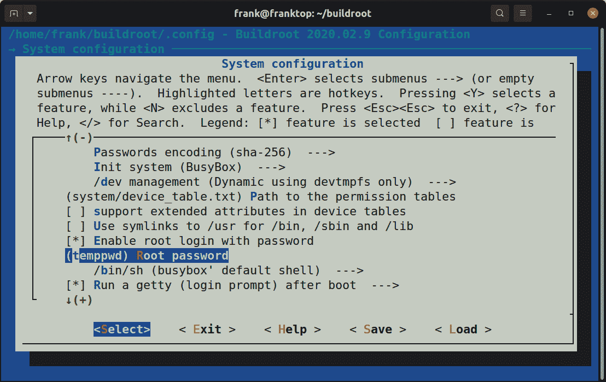

# 十九、使用 gdb 调试

虫子就会出现。 识别和修复它们是开发过程的一部分。 有许多不同的技术可用于查找和表征程序缺陷，包括静态和动态分析、代码审查、跟踪、分析和交互调试。 我将在下一章介绍跟踪器和分析器，但这里我想集中介绍通过调试器监视代码执行的传统方法，在我们的例子中是**GNU Project Debugger**(**gdb**)。 Gdb 是一个强大而灵活的工具。 您可以使用它来调试应用、检查在程序崩溃后创建的事后文件(核心文件)，甚至逐步执行内核代码。

在本章中，我们将介绍以下主题：

*   GNU 调试器
*   正在准备调试
*   调试应用
*   实时调试
*   调试叉和线程
*   核心文件
*   地理数据库用户界面
*   调试内核代码

# 技术要求

要按照示例操作，请确保您具备以下条件：

*   至少具有 60 GB 可用磁盘空间的基于 Linux 的主机系统
*   Buildroot 2020.02.9 LTS 版本
*   Yocto 3.1(邓费尔)LTS 版本
*   适用于 Linux 的蚀刻器
*   MicroSD 卡读卡器和卡
*   USB 转 TTL 3.3V 串行电缆
*   覆盆子派 4
*   5V 3A USB-C 电源
*   用于网络连接的以太网电缆和端口
*   比格尔博恩黑
*   5V 1A 直流电源

您应该已经为[*第 6 章*](06.html#_idTextAnchor164)，*选择构建系统*安装了 Buildroot 的 2020.02.9 LTS 版本。 如果没有，请参考*Buildroot 用户手册*([https://buildroot.org/downloads/manual/manual.html](https://buildroot.org/downloads/manual/manual.html))的*系统要求*部分，然后再按照[*第 6 章*](06.html#_idTextAnchor164)中的说明在您的 LINUX 主机上安装 Buildroot。

您应该已经为[*第 6 章*](06.html#_idTextAnchor164)，*选择构建系统*安装了 Yocto 的 3.1(Dunfall)LTS 发行版。 如果没有，请参考*Yocto Project Quick Build*指南([https://www.yoctoproject.org/docs/current/brief-yoctoprojectqs/brief-yoctoprojectqs.html](https://www.yoctoproject.org/docs/current/brief-yoctoprojectqs/brief-yoctoprojectqs.html))的*Compatible Linux Distribution*和*Build Host Packages*部分，然后根据[*第 6 章*](06.html#_idTextAnchor164)中的说明在您的 LINUX 主机上安装 Yocto。

本章的所有代码都可以在本书的 GitHub 存储库的`Chapter19`文件夹中找到：[https://github.com/PacktPublishing/Mastering-Embedded-Linux-Programming-Third-Edition](https://github.com/PacktPublishing/Mastering-Embedded-Linux-Programming-Third-Edition)。

# GNU 调试器

GDB 是针对种编译语言(主要是 C 和 C++)的源代码级调试器，但也支持各种其他语言，如 GO 和 Objective-C。 您应该阅读您正在使用的 GDB 版本的说明，以了解当前对各种语言的支持状态。

项目网站是[https://www.gnu.org/software/gdb/](https://www.gnu.org/software/gdb/)，它包含许多有用的信息，包括 gdb 用户手册、*使用 gdb*进行调试。

GDB 有一个开箱即用的命令行用户界面，有些人会觉得它令人不快，尽管在现实中，只要稍加练习就可以很容易地使用它。 如果命令行界面不是您喜欢的，GDB 有很多前端用户界面，我将在本章后面描述其中的三个。

# 准备调试

您需要使用调试符号编译要调试的代码。 GCC 为此提供了两种选择：`-g`和`-ggdb`。 后者添加特定于 gdb 的调试信息，而前者为您使用的任何目标操作系统生成适当格式的信息，使其成为更可移植的选项。 在我们的特定情况下，目标操作系统始终是 Linux，无论您使用`-g`还是`-ggdb`，差别都不大。 更有趣的是，这两个选项都允许您指定调试信息的级别(从`0`到`3`)：

*   `0`：这根本不会产生调试信息，相当于省略了`-g`或`-ggdb`开关。
*   `1`：这会产生最少的信息，但包括函数名和外部变量，这足以生成回溯。
*   `2`：这是默认设置，包括有关局部变量和行号的信息，以便您可以执行源代码级别的调试和单步执行代码。
*   `3`：这包括额外的信息，这意味着 gdb 可以正确处理宏扩展。

在大多数情况下，`-g`就足够了：如果您在单步执行代码时遇到问题，特别是当它包含*宏*时，请保留`-g3`或`-ggdb3`。

下一个要考虑的问题是代码优化级别。 编译器优化倾向于破坏源代码和机器代码行之间的关系，这使得单步执行源代码变得不可预测。 如果遇到这样的问题，很可能需要在不进行优化的情况下进行编译，省略`-O`编译开关，或者使用`-Og`，这样可以实现不干扰调试的优化。

一个相关的问题是堆栈帧指针，gdb 需要它来生成直到当前函数调用的回溯。 在某些架构上，GCC 不会生成优化级别较高(`-O2`及以上)的栈帧指针。 如果您发现自己确实需要使用`-O2`进行编译，但仍然需要回溯，则可以使用`-fno-omit-frame-pointer`覆盖默认行为。 还要查找代码，这些代码经过手工优化，通过添加`-fomit-frame-pointer`去掉了帧指针：您可能希望临时删除这些位。

# 调试应用

您可以使用 gdb 以两种方式之一调试应用：如果您正在开发在桌面和服务器上运行的代码，或者实际上是在同一台机器上编译和运行代码的任何环境，那么在本地运行 gdb 是很自然的。 但是，大多数嵌入式开发都是使用跨工具链完成的，因此您希望调试设备上运行的代码，但要从拥有源代码和工具的交叉开发环境进行控制。 我将重点介绍后一种情况，因为这是嵌入式开发人员最有可能遇到的情况，但我还将向您展示如何设置用于本机调试的系统。 我不打算在这里描述使用 gdb 的基础知识，因为已经有很多关于该主题的参考资料，包括 gdb 用户手册和本章末尾建议的*进一步阅读*部分。

## 使用 gdbserver 进行远程调试

远程调试的关键组件是调试代理`gdbserver`，它在目标系统上运行并控制所调试程序的执行。 `gdbserver`通过网络连接或串行接口连接到主机上运行的 gdb 副本。

通过`gdbserver`调试几乎(但不完全)与本机调试相同。 差异主要集中在这样一个事实上，即涉及两台计算机，它们必须处于正确的状态才能进行调试。 以下是一些需要注意的事项：

*   在调试会话开始时，您需要使用`gdbserver`在目标上加载要调试的程序，然后从主机上的交叉工具链单独加载 gdb。
*   在调试会话开始之前，gdb 和`gdbserver`需要相互连接。
*   在主机上运行的 gdb 需要被告知在哪里查找调试符号和源代码，尤其是查找共享库的调试符号和源代码。
*   Gdb`run`命令不能按预期工作。
*   `gdbserver`将在调试会话结束时终止，如果您需要另一个调试会话，则需要重新启动它。
*   您需要在主机上调试二进制文件的调试符号和源代码，但不需要在目标上调试。 通常，目标上没有足够的存储空间来容纳它们，在部署到目标之前需要剥离它们。
*   Gdb/`gdbserver`组合并不支持本机运行的 gdb 的所有功能：例如，`gdbserver`不能在`fork`之后跟随子进程，而本机 gdb 可以。
*   如果 gdb 和`gdbserver`来自不同的 gdb 版本，或者是相同的版本但配置不同，则可能会发生奇怪的事情。 理想情况下，它们应该使用您最喜欢的构建工具从同一来源构建。

调试符号会显著增加可执行文件的大小，有时会增加 10 倍。如[*第 5 章*](05.html#_idTextAnchor122)，*构建根文件系统*中所述，在不重新编译所有内容的情况下删除调试符号非常有用。 作业的工具是交叉工具链中的`binutils`包中的`strip`。 您可以使用以下开关控制条带级别：

*   `--strip-all`：这将删除所有符号(默认)。
*   `--strip-unneeded`：这将删除重新定位处理不需要的符号。
*   `--strip-debug`: This removes only debug symbols.

    重要音符

    对于应用和共享库，`--strip-all`(缺省值)是可以的，但是当涉及到内核模块时，您会发现它会阻止模块加载。 请改用`--strip-unneeded`。 我仍在研究`–-strip-debug`的一个用例。

考虑到这一点，让我们看看使用 Yocto 项目和 Buildroot 调试所涉及的细节。

## 设置 Yocto 项目以进行远程调试

在使用 Yocto 项目远程调试应用时，需要做两件事：您需要将`gdbserver`添加到目标映像中；您需要创建一个 SDK，其中包含 gdb，并且包含您计划调试的可执行文件的调试符号。

首先，要在目标映像中包含`gdbserver`，您可以通过将以下内容添加到`conf/local.conf`来显式添加包：

```sh
IMAGE_INSTALL_append = " gdbserver"
```

在没有串行控制台的情况下，还需要添加 SSH 守护进程，以便您可以在目标系统上启动`gdbserver`：

```sh
EXTRA_IMAGE_FEATURES ?= "ssh-server-openssh"
```

或者，您可以将`tools-debug`添加到`EXTRA_IMAGE_FEATURES`，这会将`gdbserver`、Native`gdb`和`strace`添加到目标映像中(我将在下一章讨论`strace`)：

```sh
EXTRA_IMAGE_FEATURES ?= "tools-debug ssh-server-openssh"
```

对于第二部分，您只需要构建 SDK，如我在[*第 6 章*](06.html#_idTextAnchor164)，*选择构建系统*中所述：

```sh
$ bitbake -c populate_sdk <image>
```

SDK 包含一份 gdb 副本。 它还包含目标的`sysroot`，其中包含作为目标映像一部分的所有程序和库的调试符号。 最后，SDK 包含可执行文件的源代码。 以为例，查看为 Raspberry PI 4 构建并由 Yocto 项目的 3.1.5 版生成的 SDK，它默认安装在`/opt/poky/3.1.5/`中。 目标的`sysroot`是`/opt/poky/3.1.5/sysroots/aarch64-poky-linux/`。 程序位于相对于`sysroot`的`/bin/`、`/sbin/`、`/usr/bin/`和`/usr/sbin/`中，库位于`/lib/`和`/usr/lib/`中。 在每个目录中，您会发现一个名为`.debug/`的子目录，其中包含每个程序和库的符号。 Gdb 知道在搜索符号信息时要查看`.debug/`。 可执行文件的源代码相对于`sysroot`存储在
`/usr/src/debug/`中。

## 设置 Buildroot 以进行远程调试

Buildroot 没有区分构建环境和用于应用开发的环境：没有 SDK。 假设您使用的是 Buildroot 内部工具链，则需要启用这些选项来构建主机的交叉 GDB 和构建目标的`gdbserver`：

*   `BR2_PACKAGE_HOST_GDB`，在**工具链中|为主机**构建交叉 gdb
*   `BR2_PACKAGE_GDB`，在**目标包|调试、评测和
    基准|GDB**中
*   `BR2_PACKAGE_GDB_SERVER`，在**目标包|调试、性能分析和基准测试|gdbserver**中

您还需要在**Build Options|Build Packages with Debug Symbol**中构建带有调试符号的可执行文件，为此需要启用`BR2_ENABLE_DEBUG`。

这将在`output/host/usr/<arch>/sysroot`中创建带有调试符号的库。

## 开始调试

既然您已经在目标上安装了`gdbserver`，并且在主机上安装了一个交叉 GDB，您就可以启动调试会话了。

### 连接 gdb 和 gdbserver

GDB 和`gdbserver`之间的连接可以通过网络或串行接口。 在网络连接的情况下，您可以使用要侦听的 TCP 端口号启动`gdbserver`，也可以选择使用要接受连接的 IP 地址来启动`gdbserver`。 在大多数情况下，您并不关心要连接哪个 IP 地址，因此只需提供端口号即可。 在此示例中，`gdbserver`等待端口`10000`上来自任何主机的连接：

```sh
# gdbserver :10000 ./hello-world
Process hello-world created; pid = 103
Listening on port 10000
```

接下来，从工具链启动 gdb 副本，将其指向程序的未剥离副本，以便 gdb 可以加载符号表：

```sh
$ aarch64-poky-linux-gdb hello-world
```

在 gdb 中，使用`target remote`命令建立到`gdbserver`的连接，为其提供目标的 IP 地址或主机名以及它正在等待的端口：

```sh
(gdb) target remote 192.168.1.101:10000
```

当`gdbserver`看到来自主机的连接时，它会打印以下内容：

```sh
Remote debugging from host 192.168.1.1
```

该过程与串行连接类似。 在目标上，您告诉`gdbserver`使用哪个串行端口：

```sh
# gdbserver /dev/ttyO0 ./hello-world
```

您可能需要使用`stty(1)`或类似程序预先配置端口波特率。 下面是一个简单的示例：

```sh
# stty -F /dev/ttyO0 115200
```

`stty`还有许多其他选项，请阅读手册页以了解更多详细信息。 值得注意的是，该端口不得用于任何其他用途。 例如，您不能使用正在用作系统控制台的端口。

在主机上，您可以使用`target remote`加上电缆主机端的串行设备连接到`gdbserver`。 在大多数情况下，您需要首先使用 gdb 命令`set serial baud`设置主机串行端口的波特率：

```sh
(gdb) set serial baud 115200
(gdb) target remote /dev/ttyUSB0
```

尽管 gdb 和`gdbserver`现在已经连接，但我们还没有准备好设置断点并开始单步执行源代码。

### 设置 sysroot

Gdb 需要知道在哪里可以找到调试信息和您正在调试的程序和共享库的源代码。 在本地调试时，路径是众所周知的，并且内置于 gdb 中，但是当使用跨工具链时，gdb 无法猜测目标文件系统的根在哪里。 你必须提供这些信息。

如果您使用 Yocto Project SDK 构建应用，则`sysroot`位于 SDK 中，因此您可以在 GDB 中进行如下设置：

```sh
(gdb) set sysroot /opt/poky/3.1.5/sysroots/aarch64-poky-linux
```

如果您使用的是 Buildroot，您会发现`sysroot`在`output/host/usr/<toolchain>/sysroot`中，并且在`output/staging`中有一个指向它的符号链接。 因此，对于 Buildroot，您可以这样设置`sysroot`：

```sh
(gdb) set sysroot /home/chris/buildroot/output/staging
```

Gdb 还需要找到您正在调试的文件的源代码。 Gdb 有源文件的搜索路径，您可以使用`show directories`命令查看：

```sh
(gdb) show directories
Source directories searched: $cdir:$cwd
```

以下是缺省值：`$cwd`是主机上运行的 gdb 实例的当前工作目录；`$cdir`是编译源代码的目录。 后者被编码到带有标签`DW_AT_comp_dir`的目标文件中。 您可以使用`objdump --dwarf`查看这些标记，例如：

```sh
$ aarch64-poky-linux-objdump --dwarf ./helloworld | grep DW_AT_comp_dir
[…]
<160> DW_AT_comp_dir : (indirect string, offset: 0x244): /home/chris/helloworld
[…]
```

在大多数情况下，缺省值`$cdir`和`$cwd`就足够了，但是如果在编译和调试之间移动了目录，就会出现问题。 Yocto 项目就是一个这样的例子。 深入研究一下使用 Yocto Project SDK 编译的程序的`DW_AT_comp_dir`标记，您可能会注意到：

```sh
$ aarch64-poky-linux-objdump --dwarf ./helloworld | grep DW_AT_comp_dir
<2f> DW_AT_comp_dir : /usr/src/debug/glibc/2.31-r0/git/csu
<79> DW_AT_comp_dir : (indirect string, offset: 0x139): /usr/src/debug/glibc/2.31-r0/git/csu
<116> DW_AT_comp_dir : /usr/src/debug/glibc/2.31-r0/git/csu
<160> DW_AT_comp_dir : (indirect string, offset: 0x244): /home/chris/helloworld
[…]
```

在这里，您可以看到对目录`/usr/src/debug/glibc/2.31-r0/git`的多个引用，但是它在哪里呢？ 答案是它在 SDK 的`sysroot`中，所以完整路径是`/opt/poky/3.1.5/sysroots/aarch64-poky-linux /usr/src/debug/glibc/2.31-r0/git`。 SDK 包含目标映像中所有程序和库的源代码。 GDB 有一种简单的方法来处理整个目录树的移动，如下所示：`substitute-path`。 因此，在使用 Yocto Project SDK 进行调试时，您需要使用以下命令：

```sh
(gdb) set sysroot /opt/poky/3.1.5/sysroots/aarch64-poky-linux
(gdb) set substitute path /usr/src/debug/opt/poky/3.1.5/sysroots/aarch64-poky-linux/usr/src/debug
```

您可能有其他共享库存储在`sysroot`之外。 在这种情况下，您可以使用`set solib-search-path`，它可以包含冒号分隔的目录列表来搜索共享库。 Gdb 仅在无法找到`sysroot`中的二进制文件时才搜索`solib-search-path`。

告诉 GDB 在哪里查找源代码(库和程序)的第三种方法是使用`directory`命令：

```sh
(gdb) directory /home/chris/MELP/src/lib_mylib
Source directories searched: /home/chris/MELP/src/lib_mylib:$cdir:$cwd
```

以这种方式添加的路径优先，因为它们在从`sysroot`或`solib-search-path`搜索之前搜索*。*

### Gdb 命令文件

您每次运行 gdb 时都需要执行一些操作，例如，设置`sysroot`。 将这样的命令放入命令文件中并在每次启动 gdb 时运行它们是很方便的。 Gdb 从`$HOME/.gdbinit`读取命令，然后从当前目录中的`.gdbinit`读取命令，然后从命令行中使用`-x`参数指定的文件读取命令。 然而，出于安全原因，最近版本的 gdb 将拒绝从当前目录加载`.gdbinit`。 您可以通过向`$HOME/.gdbinit`添加如下行来覆盖该行为：

```sh
set auto-load safe-path /
```

或者，如果您不想全局启用自动加载，您可以指定一个特定的目录，如下所示：

```sh
add-auto-load-safe-path /home/chris/myprog
```

我个人的偏好是使用`-x`参数指向命令文件，它公开了文件的位置，这样我就不会忘记它。

为了帮助您设置 gdb，Buildroot 在`output/staging/usr/share/buildroot/gdbinit`中创建了一个包含正确的`sysroot`命令的 gdb 命令文件。 它将包含类似于下面一行的行：

```sh
set sysroot /home/chris/buildroot/output/host/usr/aarch64-buildroot-linux-gnu/sysroot
```

既然 gdb 已经在运行，并且可以找到它需要的信息，那么让我们来看看我们可以使用它执行的一些命令。

### Gdb 命令概述

Gdb 有更多的命令，这些命令在联机手册和*进一步阅读*部分提到的资源中进行了描述。 为了帮助您尽快开始使用，这里列出了最常用的命令。 在大多数情况下，命令有缩写形式，如下表所示。

#### 断点

以下是用于管理断点的命令：


#### 跑步和踏步

以下是控制程序执行的命令：



#### 获取信息

以下是命令，用于获取有关调试器的信息：



在我们开始单步执行调试会话中的程序之前，我们首先需要设置一个初始断点。

### 运行到断点

`gdbserver`将程序加载到内存中，并在第一条指令处设置断点，然后等待来自 gdb 的连接。 建立连接后，您将进入调试会话。 但是，您会发现，如果您尝试立即单步执行，则会收到以下消息：

```sh
Cannot find bounds of current function
```

这是因为程序在汇编语言编写的代码中已暂停，这为 C/C++程序创建了运行时环境。 C/C++代码的第一行是`main()`函数。 假设您想要在`main()`处停止，您可以在那里设置一个断点，然后使用`continue`命令(缩写为`c`)告诉`gdbserver`从程序开始处的断点继续，并在`main()`处停止：

```sh
(gdb) break main
Breakpoint 1, main (argc=1, argv=0xbefffe24) at helloworld.c:8 printf("Hello, world!\n");
(gdb) c
```

此时，您可能会看到以下内容：

```sh
Reading /lib/ld-linux.so.3 from remote target...
warning: File transfers from remote targets can be slow. Use "set sysroot" to access files locally instead.
```

在旧版本的 gdb 中，您可能会看到以下内容：

```sh
warning: Could not load shared library symbols for 2 libraries, e.g. /lib/libc.so.6.
```

在这两种情况下，问题是您忘记设置`sysroot`！ 再看一下`sysroot`前面的部分。

这与本机启动程序完全不同，在本机启动程序时只需键入`run`即可。 事实上，如果您尝试在远程调试会话中键入`run`，您将看到一条消息，提示远程目标不支持`run`命令，或者在较早版本的 gdb 中，它将在没有任何解释的情况下挂起。

### 使用 Python 扩展地理数据库

我们可以在 gdb 中嵌入一个完整的 Python 解释器来扩展它的功能。 这是通过在构建之前使用`--with-python`选项配置 gdb 来实现的。 GDB 有一个 API，可以将其大部分内部状态公开为 Python 对象。 此 API 允许我们将自己的自定义 gdb 命令定义为用 Python 编写的脚本。 这些额外的命令可能包括一些有用的调试辅助工具，比如跟踪点和漂亮的打印机，这些都不是 gdb 内置的。

#### 使用 Python 支持构建地理数据库

我们已经介绍了*设置 Buildroot 以进行远程调试*。 要在 GDB 中启用 Python 支持，还需要一些额外的步骤。 在撰写本文时，Buildroot 只支持在 GDB 中嵌入 Python2.7，这很不幸，但总比根本不支持 Python 要好。 我们不能使用 Buildroot 生成的工具链来构建具有 Python 支持的 GDB，因为它缺少一些必要的线程支持。

要为支持 Python 的主机构建跨 GDB，请执行以下步骤：

1.  导航到安装 Buildroot 的目录：

    ```sh
    $ cd buildroot
    ```

2.  复制您要为其构建镜像的板的配置文件：

    ```sh
    $ cd configs
    $ cp raspberrypi4_64_defconfig rpi4_64_gdb_defconfig
    $ cd ..
    ```

3.  从`output`目录清除以前的生成项目：

    ```sh
    $ make clean
    ```

4.  激活您的配置文件：

    ```sh
    $ make rpi4_64_gdb_defconfig
    ```

5.  开始自定义您的映像：

    ```sh
    $ make menuconfig
    ```

6.  导航到**工具链|工具链类型|外部工具链**并选择该选项，即可启用外部工具链。
7.  退出**外部工具链**并打开**工具链**子菜单。 选择一个已知的工作工具链，例如**Linaro AArch64 2018.05**，作为您的外部工具链。
8.  Select **Build cross gdb for the host** from the **Toolchain** page and enable both **TUI support** and **Python support**:

    

    图 19.1-GDB 中的 Python 支持

9.  从**工具链**页面深入到**gdb 调试器版本**子菜单，然后选择 Buildroot 中提供的最新版本的 gdb。
10.  返回**工具链**页面的，并向下钻取到**构建选项**。 选择**生成带有调试符号的包**。
11.  Back out of the **Build options** page and drill down into **System Configuration** and select **Enable root login with password**. Open **Root password** and enter a non-empty password in the text field:

    

    图 19.2-超级用户密码

12.  退出**System Configuration**页面，深入到**Target Packages|Debug，Profiling and Benchmark**。 选择**gdb**包将`gdbserver`添加到目标镜像。
13.  退出**调试、分析和基准测试**，深入到**目标包|网络应用**。 选择**DropBear**包以启用`scp`和`ssh`访问目标。 请注意，`dropbear`不允许在没有密码的情况下访问`root``scp`和`ssh`。
14.  添加**haveged**熵守护进程，该守护进程可以在**目标包|其他**下找到，以便在引导时更快地使用 SSH。
15.  将另一个包添加到您的映像中，这样您就有了需要调试的东西。 我选择了`bsdiff`二进制补丁/比较工具，它是用 C 语言编写的，可以在**Target Packages|Development Tools**下找到。
16.  保存更改并退出 Buildroot 的`menuconfig`。
17.  将更改保存到配置文件：

    ```sh
    $ make savedefconfig
    ```

18.  为目标构建映像：

    ```sh
    $ make
    ```

如果您想跳过前面的`menuconfig`步骤，可以在本章的代码档案中找到 Raspberry PI 4 的现成`rpi4_64_gdb_defconfig`文件。 将该文件从`MELP/Chapter19/buildroot/configs/`复制到您的`buildroot/configs`目录，如果您愿意，可以在该目录上运行`make`。

构建完成后，`outpimg/`中应该有一个可引导的`sdcard.img`文件，您可以使用 Etcher 将其写入 microSD 卡。 将 microSD 插入目标设备并引导它。 使用以太网电缆将目标设备连接到您的本地网络，并使用`arp-scan`查找其 IP 地址。 以`root`身份通过 SSH 登录设备，然后输入您在配置映像时设置的密码。 我指定`temppwd`作为我的`rpi4_64_gdb_defconfig`镜像的`root`密码。

现在，让我们使用 gdb 远程调试`bsdiff`：

1.  首先，导航到目标上的`/usr/bin`目录：

    ```sh
    # cd /usr/bin
    ```

2.  然后，以`gdbserver`开始`bdiff`，就像我们之前对`helloworld`所做的那样：

    ```sh
    # gdbserver :10000 ./bsdiff pcregrep pcretest out
    Process ./bsdiff created; pid = 169
    Listening on port 10000
    ```

3.  接下来，从工具链启动 gdb 副本，将其指向程序的未剥离副本，以便 gdb 可以加载符号表：

    ```sh
    $ cd output/build/bsdiff-4.3
    $ ~/buildroot/output/host/bin/aarch64-linux-gdb bsdiff
    ```

4.  在 gdb 中，设置`sysroot`如下：

    ```sh
    (gdb) set sysroot ~/buildroot/output/staging
    ```

5.  然后，使用命令 target remote 建立到`gdbserver`的连接，为其提供目标的 IP 地址或主机名以及它正在等待的端口：

    ```sh
    (gdb) target remote 192.168.1.101:10000
    ```

6.  当`gdbserver`看到来自主机的连接时，它会打印以下内容：

    ```sh
    Remote debugging from host 192.168.1.1
    ```

7.  We can now load Python command scripts such as `tp.py` into GDB from `<data-directory>/python` and use these commands like so:

    ```sh
    (gdb) source tp.py
    (gdb) tp search
    ```

    在本例中，`tp`是*tracepoint*命令的名称，`search`是`bsdiff`中递归函数的名称。

8.  要显示 gdb 搜索 Python 命令脚本的目录，请执行以下命令：

    ```sh
    (gdb) show data-directory
    ```

GDB 中的 Python 支持也可用于调试 Python 程序。 Gdb 可以查看 CPython 的内部结构，这是 Python 的标准`pdb`调试器所不具备的。 它甚至可以将 Python 代码注入到正在运行的 Python 进程中。 这样就可以创建强大的调试工具，比如 Facebook 的 Python3 内存分析器([https://github.com/facebookincubator/memory-analyzer](https://github.com/facebookincubator/memory-analyzer))。

## 本机调试

在目标系统上运行 gdb 的本机副本并不像远程运行那样常见，但这是可能的。 除了在目标映像中安装 gdb 之外，您还需要要调试的可执行文件的未剥离副本以及目标映像中安装的相应源代码。 Yocto 项目和 Buildroot 都允许您这样做。

重要音符

虽然本机调试不是嵌入式开发人员的常见活动，但在目标系统上运行分析和跟踪工具非常常见。 如果目标上有未剥离的二进制文件和源代码，这些工具通常工作得最好，这就是我在这里讲述的故事的一半。 我将在下一章回到这个主题。

### Yocto 计划

首先，通过将以下内容添加到`conf/local.conf`，将`gdb`添加到目标图像：

```sh
EXTRA_IMAGE_FEATURES ?= "tools-debug dbg-pkgs"
```

您需要要调试的包的调试信息。 Yocto 项目构建包的调试变体，其中包含未剥离的二进制文件和源代码。 通过将`<package name>-dbg`添加到您的`conf/local.conf`，您可以有选择地将这些调试包添加到您的目标映像中。 或者，您可以通过将`dbg-pkgs`添加到`EXTRA_IMAGE_FEATURES`来简单地安装*所有*调试包，如刚才所示。 请注意，这将显著增加目标图像的大小，可能会增加数百兆字节。

源代码安装在目标镜像的`/usr/src/debug/<package name>`中。 这意味着 gdb 无需运行`set substitute-path`即可获取它。 如果您不需要源代码，可以通过将以下内容添加到您的`conf/local.conf`文件来阻止其安装：

```sh
PACKAGE_DEBUG_SPLIT_STYLE = "debug-without-src"
```

### Buildroot

使用 Buildroot，您可以通过启用此选项告诉它在目标映像中安装 gdb 的本机副本：

*   `BR2_PACKAGE_GDB_DEBUGGER`在**目标包|调试、分析和基准测试|完全调试器**

然后，要使用调试信息构建二进制文件，并在不剥离的情况下将其安装在目标映像中，请启用这两个选项中的第一个选项并禁用第二个选项：

*   `BR2_ENABLE_DEBUG`在**生成选项|生成带有调试符号的包**
*   `BR2_STRIP_strip`中的**生成选项|剥离目标二进制文件**

关于本机调试，我要说的就是这些。 同样，这种做法在嵌入式设备上并不常见，因为额外的源代码和调试符号会使目标图像变得臃肿。 接下来，让我们看看另一种形式的远程调试。

# 实时调试

有时，程序在运行一段时间后会开始不正常，您想知道它在做什么。 Gdb*Attach*特性就是这样做的。 我称之为即时调试。 它既可用于本机调试会话，也可用于远程调试会话。

在远程调试的情况下，您需要找到要调试的进程的 PID，并使用`--attach`选项将其传递给`gdbserver`。 例如，如果 PID 为`109`，则应键入以下内容：

```sh
# gdbserver --attach :10000 109
Attached; pid = 109
Listening on port 10000
```

这会强制进程停止，就像它在断点处一样，允许您以正常方式启动跨 gdb 并连接到`gdbserver`。 完成后，您可以`detach`，允许程序在没有调试器的情况下继续运行：

```sh
(gdb) detach
Detaching from program: /home/chris/MELP/helloworld/helloworld, process 109
Ending remote debugging.
```

通过 PID 附加到正在运行的进程当然很方便，但是多进程或多线程程序又如何呢？ 也有使用 gdb 调试这些类型的程序的技术。

# 调试叉和线程

当您正在调试的程序派生时会发生什么？ 调试会话是跟随父进程还是子进程？ 此行为由`follow-fork-mode`控制，可以是`parent`或`child`，其中`parent`是默认值。 遗憾的是，当前版本(10.1)的`gdbserver`不支持此选项，因此它只适用于本机调试。 如果您确实需要在使用`gdbserver`时调试子进程，解决方法是修改代码，以便子进程在 fork 之后立即循环一个变量，这样您就有机会将一个新的`gdbserver`会话附加到它，然后设置该变量，使其退出循环。

当多线程进程中的线程遇到断点时，默认行为是所有线程暂停。 在大多数情况下，这是最好的做法，因为它允许您查看静态变量，而不会被其他线程更改。 当您重新开始执行线程时，所有停止的线程都会启动，即使您是单步执行，尤其是最后一种情况会导致问题。 有一种方法可以通过名为`scheduler-locking`的参数修改 gdb 处理停止线程的方式。 通常为`off`，但如果将其设置为`on`，则只恢复在
断点处停止的线程，而其他线程保持停止状态，这样您就有机会在不受干扰的情况下查看该线程单独执行了什么操作。 在关闭`scheduler-locking`之前，这种情况一直存在。 `gdbserver`支持此功能。

# 核心文件

核心文件捕获失败程序在其终止点的状态。 当 bug 显现时，您甚至不需要和调试器在房间里。 因此，当您看到`Segmentation fault (core dumped)`时，不要耸耸肩；研究**核心文件**并提取其中的信息宝库。

第一个观察结果是，默认情况下不会创建核心文件，但只有当进程的核心文件资源限制为非零时才会创建。 您可以使用`ulimit -c`为当前 shell 更改它。 要取消对核心文件大小的所有限制，请键入以下命令：

```sh
$ ulimit -c unlimited
```

默认情况下，核心文件名为`core`，放在进程的当前工作目录中，也就是`/proc/<PID>/cwd`所指向的目录。 这项计划有很多问题。 首先，当查看包含多个名为`core`的文件的设备时，并不清楚是哪个程序生成了每个文件。 其次，进程的当前工作目录很可能位于只读文件系统中，可能没有足够的空间来存储核心文件，或者进程可能没有写入当前工作目录的权限。

有两个文件控制核心文件的命名和放置。 第一个是
`/proc/sys/kernel/core_uses_pid`。 向其写入`1`会导致将死进程的 PID 号附加到文件名上，只要您可以将 PID 号与日志文件中的程序名相关联，这就有些用处。

更有用的是`/proc/sys/kernel/core_pattern`，它使您可以更好地控制核心文件。 默认模式为 core，但您可以将其更改为由以下元字符组成的模式：

*   `%p`：PID
*   `%u`：转储进程的真实 UID
*   `%g`：转储进程的真实 GID
*   `%s`：导致转储的信号编号
*   `%t`：转储时间，自纪元起秒数，1970-01-01 00：00：00+0000(UTC)
*   `%h`：主机名
*   `%e`：可执行文件名
*   `%E`：可执行文件的路径名，将斜杠(`/`)替换为感叹号(`!`)
*   `%c`：转储进程的核心文件大小软资源限制

您还可以使用以绝对目录名开头的模式，以便所有核心文件都集中在一个位置。 例如，下面的模式将所有核心文件放入`/corefiles`目录，并使用程序名和崩溃时间对它们进行命名：

```sh
# echo /corefiles/core.%e.%t > /proc/sys/kernel/core_pattern
```

在`core`转储之后，您会发现类似以下内容：

```sh
# ls /corefiles
core.sort-debug.1431425613
```

有关详细信息，请参阅手册页`core(5)`。

## 使用 gdb 查看核心文件

下面的是查看`core`文件的示例 gdb 会话：

```sh
$ arm-poky-linux-gnueabi-gdb sort-debug /home/chris/rootfs/corefiles/core.sort-debug.1431425613
[…]
Core was generated by `./sort-debug'.
Program terminated with signal SIGSEGV, Segmentation fault.
#0 0x000085c8 in addtree (p=0x0, w=0xbeac4c60 "the") at sort-debug.c:41
41 p->word = strdup (w);
```

这表明程序在第`41`行停止。 LIST 命令显示
附近的代码：

```sh
(gdb) list
37 static struct tnode *addtree (struct tnode *p, char *w)
38 {
39 int cond;
40
41 p->word = strdup (w);
42 p->count = 1;
43 p->left = NULL;
44 p->right = NULL;
45
```

`backtrace`命令(缩写为`bt`)显示了我们是如何做到这一点的：

```sh
(gdb) bt
#0 0x000085c8 in addtree (p=0x0, w=0xbeac4c60 "the") at sort-debug.c:41
#1 0x00008798 in main (argc=1, argv=0xbeac4e24) at sort-debug.c:89
```

这是一个明显的错误：`addtree()`是用空指针调用的。

Gdb 最初是一个命令行调试器，许多人仍然以这种方式使用它。 尽管 LLVM 项目的 LLDB 调试器越来越受欢迎，但 GCC 和 gdb 仍然是 Linux 的重要编译器和调试器。 到目前为止，我们只关注 gdb 的命令行界面。 现在我们来看一下 GDB 的一些前台，这些前台的用户界面逐渐变得更加现代化。

# 地理数据库用户界面

Gdb 通过 gdb 机器接口 gdb/MI 控制在的较低级别，gdb/MI 可用于将 gdb 包装在用户界面中或作为更大程序的一部分，它极大地扩展了可供选择的范围。

在本节中，我将描述三个非常适合调试嵌入式目标的工具：
**终端用户界面**(**TUI**)、**数据显示调试器**(**DDD**)和 Visual
Studio 代码。

## 终端用户界面

**终端用户界面**(**TUI**)是标准 GDB 包的可选部分。 主要功能是一个代码窗口，其中显示即将执行的代码行以及任何断点。 这是对命令行模式 gdb 中 list 命令的明显改进。

TUI 的吸引力在于，它无需任何额外设置即可工作，而且由于它处于文本模式，因此可以在 SSH 终端会话上使用，例如，当在目标上本地运行`gdb`时。 大多数交叉工具链使用 TUI 配置 gdb。 只需将`-tui`添加到命令行，您将看到以下内容：


图 19.3-TUI

如果您仍然觉得 TUI 缺乏，并且更喜欢真正的图形化前端而不是 gdb，那么 GNU 项目也提供了其中之一([https://www.gnu.org/software/ddd](https://www.gnu.org/software/ddd))。

## 调试器数据显示(_D)

**Data Display Debugger**(**DDD**)是一个简单的独立程序，它为您提供了 GDB 的图形用户界面，而无需最少的麻烦，尽管 UI 控件看起来过时了，但它做了所有必要的事情。

`--debugger`选项告诉 DDD 从您的工具链使用 gdb，您可以使用`-x`参数给出 gdb 命令文件的路径：

```sh
$ ddd --debugger arm-poky-linux-gnueabi-gdb -x gdbinit sort-debug
```

下面的屏幕截图展示了最好的功能之一：数据窗口，它包含网格中的项目，您可以根据需要重新排列。 如果双击指针，它将展开为一个新的数据项，并且该链接用箭头显示：


图 19.4-DDD

如果这两个 GDB 前端都不能接受，因为您是一个习惯于使用您所在行业最新工具的全栈 Web 开发人员，那么我们仍然可以覆盖您。

## Visual Studio 代码

**Visual Studio Code**是微软非常流行的开源代码编辑器。 因为它是用 TypeScript 编写的 Electron 应用，所以 VisualStudio 代码感觉比成熟的 IDE(如 Eclipse)更轻量级，响应速度更快。 有丰富的语言支持(代码完成、转到定义等)。 通过其庞大的用户社区贡献的扩展，用于许多语言。 远程跨 GDB 调试可以使用 CMake 和 C/C++扩展集成到 Visual Studio 代码中。

### 安装 Visual Studio 代码

在 Ubuntu Linux 系统上安装 Visual Studio 代码的最简单方法是使用`snap`：

```sh
$ sudo snap install --classic code
```

在创建可以部署到 Raspberry PI 4 并进行远程调试的 C/C++项目之前，我们首先需要一个工具链。

### 安装工具链

我们将使用 Yocto 为 Raspberry Pi 4 构建一个 SDK。该 SDK 将包括一个针对 Raspberry Pi 4 的 64 位 ARM 内核的工具链。 在[*第 7 章*](07.html#_idTextAnchor193)，*使用 Yocto*开发的*构建现有 BSP*一节中，我们已经使用 Yocto 为 Raspberry PI 4 构建了 64 位 ARM 图像。

让我们使用该章中相同`poky/build-rpi`输出目录来构建新的`core-image-minimal-dev`映像以及该映像的相应 SDK：

1.  首先，在克隆 Yocto 的目录上导航一级。
2.  接下来，获取`build-rpi`构建环境：

    ```sh
    $ source poky/oe-init-build-env build-rpi
    ```

3.  Edit `conf/local.conf` so that it includes the following:

    ```sh
    MACHINE ?= "raspberrypi4-64"
    IMAGE_INSTALL_append = " gdbserver"
    EXTRA_IMAGE_FEATURES ?= "ssh-server-openssh debug-tweaks"
    ```

    `debug-tweaks`功能不需要`root`密码，因此可以使用命令行工具(如`scp`和`ssh`)从主机部署和运行新构建的二进制文件。

4.  然后，构建 Raspberry PI 4 的开发映像：

    ```sh
    $ bitbake core-image-minimal-dev
    ```

5.  使用 Etcher 将生成的`core-image-minimal-dev-raspberrypi4-64.wic.bz2`映像从`tmp/deplimg/raspberrypi4-64/`写入 microSD 卡，并在 Raspberry PI 4 上引导它。
6.  通过以太网将 Raspberry PI 4 插入您的本地网络，并使用`arp-scan`定位 Raspberry PI 4 的 IP 地址。稍后在*配置 CMake*进行远程调试时，我们将需要此 IP 地址。
7.  Lastly, build the SDK:

    ```sh
    $ bitbake -c populate_sdk core-image-minimal-dev
    ```

    重要音符

    切勿在生产图像中使用`debug-tweaks`。 OTA 软件更新的自动化 CI/CD 管道至关重要，但必须非常小心，以确保开发映像不会意外泄漏到生产中。

现在，我们在`poky/build-rpi`下的`tmp/deploy/sdk`目录中有一个名为`poky-glibc-x86_64-core-image-minimal-dev-aarch64-raspberrypi4-64-toolchain-3.1.5.sh`的自解压安装程序，我们可以使用它在任何 Linux 开发机器上安装这个新构建的 SDK。 在`tmp/deploy/sdk`中找到 SDK 安装程序并运行它：

```sh
$ ./poky-glibc-x86_64-core-image-minimal-dev-aarch64-raspberrypi4-64-toolchain-3.1.5.sh
Poky (Yocto Project Reference Distro) SDK installer version 3.1.5
=================================================================
Enter target directory for SDK (default: /opt/poky/3.1.5): 
You are about to install the SDK to "/opt/poky/3.1.5". Proceed [Y/n]? Y
[sudo] password for frank: 
Extracting SDK..........................................................done
Setting it up...done
SDK has been successfully set up and is ready to be used.
Each time you wish to use the SDK in a new shell session, you need to source the environment setup script e.g.
 $ . /opt/poky/3.1.5/environment-setup-aarch64-poky-linux
```

请注意，SDK 已安装到`/opt/poky/3.1.5`。 我们不会按照说明获取`environment-setup-aarch64-poky-linux`，但该文件的内容将用于填充即将到来的 Visual Studio 代码的项目文件。

### 安装 CMake

我们将使用**CMake**交叉编译我们将在 Raspberry PI 4 上部署和调试的 C 代码。要在 Ubuntu Linux 上安装 CMake，请执行以下命令：

```sh
$ sudo apt update
$ sudo apt install cmake
```

CMake 应该已经作为[*第 2 章*](02.html#_idTextAnchor029)，*了解工具链*的一部分安装在您的主机上。

### 创建 Visual Studio 代码项目

使用 CMake 构建的项目具有规范的结构，其中包括一个`CMakeLists.txt`文件和单独的`src`和`build`目录。

在您的主目录中创建名为`hellogdb`的 Visual Studio 代码项目：

```sh
$ mkdir hellogdb
$ cd hellogdb
$ mkdir src build
$ code .
```

最后一个`code .`命令将启动 Visual Studio 代码并打开`hellogdb`目录。 当您从目录启动 Visual Studio 代码时，还会创建一个隐藏的`.vscode`目录，其中包含项目的`settings.json`和`launch.json`。

### 安装 Visual Studio 代码扩展

我们需要安装以下 Visual Studio 代码扩展，以便使用 SDK 中的工具链交叉编译和调试代码：

*   Microsoft 提供的 C/C++
*   CMake by Txs
*   微软的 CMake Tools

单击 Visual Studio 代码窗口左侧的**Extensions**图标，在 Marketplace 中搜索这些扩展并安装它们。 安装后，您的**扩展**侧栏应该如下所示：


图 19.5-扩展

现在，我们将使用 CMake 集成我们构建的 SDK 附带的工具链，用于交叉编译和调试我们的`hellogdb`项目。

### ==同步，由 Elderman 更正==@ELDER_MAN

我们需要填充`CMakeLists.txt`和`cross.cmake`，以使用我们的工具链交叉编译`hellogdb`项目：

1.  首先，将`MELP/Chapter19/hellogdb/CMakeLists.txt`复制到主目录中的`hellogdb`项目文件夹。
2.  在 Visual Studio 代码中，单击 Visual Studio 窗口左上角的**Explorer**图标，打开**Explorer**侧边栏。
3.  单击**Explorer**侧栏中的`CMakeLists.txt`查看文件内容。 请注意，项目名称定义为`HelloGDBProject`，目标板的 IP 地址硬编码为`192.168.1.128`。
4.  将其更改为与 Raspberry PI 4 的 IP 地址相匹配，并保存`CMakeLists.txt`文件。
5.  展开**src**文件夹，然后单击**Explorer**侧边栏中的**New File**图标，在`hellogdb`项目的`src`目录中创建名为`main.c`的文件。
6.  将以下代码粘贴到那个`main.c`源文件中并保存它：

    ```sh
    #include <stdio.h>
    int main() {
        printf("Hello CMake\n");
        return 0;
    }
    ```

7.  将`MELP/Chapter19/hellogdb/cross.cmake`复制到主目录中的`hellogdb`项目文件夹。
8.  最后，单击**Explorer**侧边栏中的`cross.cmake`查看文件内容。 请注意，`cross.cmake`中定义的`sysroot_target`和`tools`路径指向我们安装 SDK 的`/opt/poky/3.1.5`目录。 还要注意，`CMAKE_C_COMPILE`、`CMAKE_CXX_COMPILE`和`CMAKE_CXX_FLAGS`变量的值是直接从 SDK 附带的环境设置脚本派生的。

有了这两个文件，我们就可以构建我们的`hellogdb`项目了。

### 配置用于生成的项目设置

现在，让我们将`hellogdb`项目的`settings.json`文件配置为使用`CMakeLists.txt`和`cross.cmake`构建：

1.  在 Visual Studio 代码中打开`hellogdb`项目后，点击*Ctrl+Shift+P*以调出**Command Palette**字段。
2.  在**命令调色板**字段中输入`>settings.json`，然后从选项列表中选择**首选项：打开工作空间设置(JSON)**。
3.  Edit the `.vscode/settings.json` for `hellogdb` so that it looks something like this:

    ```sh
    {
        "cmake.sourceDirectory": "${workspaceFolder}",
        "cmake.configureArgs": [
            "-DCMAKE_TOOLCHAIN_FILE=${workspaceFolder}/cross.cmake"
        ],
        "C_Cpp.default.configurationProvider": "ms-vscode.cmake-tools"
    }
    ```

    请注意`cmake.configureArgs`定义中对`cross.cmake`的引用。

4.  点击*Ctrl+Shift+P*再次调出**命令调色板**字段。
5.  在**Command Palette**字段中输入`>CMake: Delete Cache and Configuration`并执行它。
6.  单击 Visual Studio 窗口左边缘的**CMake**图标以打开**CMake**侧边栏。
7.  单击**CMake**侧边栏中的`HelloGDBProject`二进制文件以构建它：


图 19.6-构建 HelloGDBProject

如果您正确配置了所有内容，**Output**窗格的内容应该类似于
：

```sh
[main] Building folder: hellogdb HelloGDBProject
[build] Starting build
[proc] Executing command: /usr/bin/cmake --build /home/frank/hellogdb/build --config Debug --target HelloGDBProject -- -j 14
[build] [100%] Built target HelloGDBProject
[build] Build finished with exit code 0
```

现在我们已经使用 Visual Studio 代码构建了一个针对 64 位 ARM 的可执行二进制文件，让我们将其部署到 Raspberry PI 4 中进行远程调试。

### 配置远程调试的启动设置

现在，让我们创建一个`launch.json`文件，以便可以将`HelloGDBProject`二进制文件部署到 RaspberryPI 4，并从 Visual Studio 代码中远程调试它：

1.  单击 Visual Studio 代码窗口左边缘的**Run**图标，打开**Run**侧边栏。
2.  在**Run**侧边栏上单击**create a Launch.json file**，然后为环境选择**C++(gdb/ldb)**。
3.  提示输入 C/C++调试配置类型时，从选项列表中选择**Default Configuration**。
4.  在`.vscode/launch.json`内的`"(gdb) Launch"`配置中添加或编辑以下字段，如下所示：

    ```sh
    "program": "${workspaceFolder}/build/HelloGDBProject",
    "miDebuggerServerAddress": "192.168.1.128:10000",
    "targetArchitecture": "aarch64",
    "miDebuggerPath": "/opt/poky/3.1.5/sysroots/x86_64-pokysdk-linux/usr/bin/aarch64-poky-linux/aarch64-poky-linux-gdb",
    ```

5.  将`miDebuggerServerAddress`中的`192.168.1.128`地址替换为您的 Raspberry PI 4 的 IP 地址，然后保存该文件。
6.  在`main()`函数体的第一行的`main.c`中设置断点。
7.  在**Run**侧边栏中单击新的**Build_and_Debug-Utility**，将`HelloGDBProject`二进制文件发送到 Raspberry PI 4 并用`gdbserver`启动。

如果 Raspberry PI 4 和`launch.json`文件设置正确，则**Output**窗格的内容应如下所示：

```sh
[main] Building folder: hellogdb build_and_debug
[build] Starting build
[proc] Executing command: /usr/bin/cmake --build /home/frank/hellogdb/build --config Debug --target build_and_debug -- -j 14
[build] [100%] Built target HelloGDBProject
[build] Process ./HelloGDBProject created; pid = 552
[build] Listening on port 10000
```

单击 Visual Studio 代码窗口左上角的**(Gdb)Launch**按钮。 Gdb 应该命中我们在`main.c`中设置的断点，并且在**输出**窗格中应该出现如下所示的行：

```sh
[build] Remote debugging from host 192.168.1.69, port 44936
```

这是当 gdb 到达断点时 VisualStudio 代码应该是什么样子：


图 19.7-GDB 远程调试

点击上方悬停的蓝色**Continue**按钮，输出窗格中应显示以下行：

```sh
[build] Hello CMake
[build] 
[build] Child exited with status 0
[build] [100%] Built target build_and_debug
[build] Build finished with exit code 0
```

祝贺你!。 您已经使用 CMake 成功地将使用 Yocto 构建的 SDK 集成到 Visual Studio 代码中，以便在目标设备上启用 GDB 远程调试。 这
不是一个小壮举，但是现在您已经了解了它是如何完成的，您可以为您自己的项目做同样的事情。

# 调试内核代码

您可以使用`kgdb`进行源代码级别的调试，其方式类似于使用`gdbserver`进行远程调试。 还有一个自托管内核调试器`kdb`，它对于轻量级任务非常方便，比如查看指令是否已执行，以及获取回溯以找出它是如何到达那里的。 最后，还有内核*Oops*消息和死机，它们告诉您很多关于内核异常原因的信息。

## 使用 kgdb 调试内核代码

在使用源代码调试器查看内核代码时，必须记住内核是一个复杂的系统，具有实时行为。 不要期望调试像调试应用一样简单。 单步执行更改内存映射或切换上下文的代码可能会产生奇怪的结果。

**kgdb**是给内核 gdb 存根命名的，多年来，内核 gdb 存根一直是主流 Linux 的一部分。 内核 Docbook 中有一个用户手册，您可以在[https://www.kernel.org/doc/htmldocs/kgdb/index.html](https://www.kernel.org/doc/htmldocs/kgdb/index.html)上找到在线版本。

在大多数情况下，您将通过串行接口连接到`kgdb`，该接口通常与串行控制台共享。 因此，此实现称为**kgdboc**，是 Console 上的**kgdb 的缩写。 要工作，它需要支持 I/O 轮询而不是中断的平台`tty`驱动程序，因为`kgdb`在与 GDB 通信时必须禁用中断。 有几个平台支持 USB 上的`kgdb`，也有一些版本可以在以太网上工作，但不幸的是，这些版本都没有进入主流 Linux。**

关于优化和堆栈框架的相同警告也适用于内核，但限制是内核被编写为假定优化级别至少为`-O1`。 您可以通过在运行`make`之前设置`KCFLAGS`来覆盖内核编译标志。

那么，以下是内核调试所需的内核配置选项：

*   `CONFIG_DEBUG_INFO`在**内核破解|编译时检查和编译器选项|使用调试信息编译内核**菜单中。
*   `CONFIG_FRAME_POINTER`可能是适用于您的体系结构的选项，位于**内核破解|编译时检查和编译器选项|使用帧指针编译内核**菜单中。
*   `CONFIG_KGDB`在**内核破解|kgdb：内核调试器**菜单中。
*   `CONFIG_KGDB_SERIAL_CONSOLE`位于**内核黑客|kgdb：内核调试器|kgdb：在串行控制台**菜单上使用 kgdb。

除了`zImage`或`uImage`压缩内核映像之外，内核映像必须是 ELF 对象格式，以便 gdb 可以将符号加载到内存中。 这是在构建 Linux 的目录中生成的名为`vmlinux`的文件。 在 Yocto 中，您可以请求在目标镜像和 SDK 中包含一份副本。 它被构建为一个名为`kernel-vmlinux`的软件包，您可以像安装任何其他软件包一样安装它，例如，通过将其添加到`IMAGE_INSTALL`列表中。

该文件被放入 sysroot`boot`目录，名称如下：

```sh
/opt/poky/3.1.5/sysroots/cortexa8hf-neon-poky-linux-gnueabi/boot/vmlinux-5.4.72-yocto-standard
```

在 Buildroot 中，您将在构建内核的目录中找到`vmlinux`，该目录位于`output/build/linux-<version string>/vmlinux`中。

## 示例调试会话

向您展示它的工作原理的最好方法是用一个简单的例子。

您需要通过内核命令行或在运行时通过`sysfs`告知`kgdb`使用哪个串行端口。 对于第一个选项，将`kgdboc=<tty>,<baud rate>`添加到命令行，如下所示：

```sh
kgdboc=ttyO0,115200
```

对于第二个选项，启动设备并将终端名称写入
`/sys/module/kgdboc/parameters/kgdboc`文件，如下所示：

```sh
# echo ttyO0 > /sys/module/kgdboc/parameters/kgdboc
```

请注意，您不能以这种方式设置波特率。 如果它与控制台相同`tty`，则它已经设置。 如果没有，请使用`stty`或类似的程序。

现在，您可以在主机上启动 gdb，选择与
运行的内核匹配的`vmlinux`文件：

```sh
$ arm-poky-linux-gnueabi-gdb ~/linux/vmlinux
```

Gdb 从`vmlinux`加载符号表，并等待进一步输入。

接下来，关闭连接到控制台的任何终端仿真器：您将要将其用于 gdb，如果两者同时处于活动状态，则某些调试字符串可能会损坏。

现在，您可以返回 gdb 并尝试连接到`kgdb`。 但是，您会发现此时从`target remote`得到的响应无济于事：

```sh
(gdb) set serial baud 115200
(gdb) target remote /dev/ttyUSB0
Remote debugging using /dev/ttyUSB0
Bogus trace status reply from target: qTStatus
```

问题是`kgdb`此时没有侦听连接。 在进入与内核的交互式 gdb 会话之前，您需要中断内核。 不幸的是，只是在 gdb 中键入*Ctrl+C*，就像在应用中一样，不能正常工作。 您必须通过在目标上启动另一个 shell(例如，通过 SSH)并在目标板上将`g`写入`/proc/sysrq-trigger`来强制陷阱进入内核：

```sh
# echo g > /proc/sysrq-trigger
```

目标在这一点上停了下来。 现在，您可以通过电缆主机端的串行设备连接到`kgdb`：

```sh
(gdb) set serial baud 115200
(gdb) target remote /dev/ttyUSB0
Remote debugging using /dev/ttyUSB0
0xc009a59c in arch_kgdb_breakpoint ()
```

最后，广发银行掌权了。 您可以设置断点、检查变量、查看回溯等。 例如，在`sys_sync`上设置一个断点，如下所示：

```sh
(gdb) break sys_sync
Breakpoint 1 at 0xc0128a88: file fs/sync.c, line 103.
(gdb) c
Continuing.
```

现在目标又复活了(T2)。 在目标上键入`sync`将调用`sys_sync`并点击
断点：

```sh
[New Thread 87]
[Switching to Thread 87]
Breakpoint 1, sys_sync () at fs/sync.c:103
```

如果您已完成调试会话并想要禁用`kgdboc`，只需将`kgdboc`端子设置为`null`即可：

```sh
# echo "" > /sys/module/kgdboc/parameters/kgdboc
```

与使用 gdb 附加到正在运行的进程类似，这种捕获内核并通过串行控制台连接到`kgdb`的技术在内核引导完成后起作用。 但是，如果内核因为错误而无法完成引导，该怎么办呢？

## 调试早期代码

前面的示例在系统完全引导时执行您感兴趣的代码的情况下有效。 如果您需要提早进入，您可以通过在命令行中的`kgdboc`选项后面添加`kgdbwait`来告诉内核在引导期间等待：

```sh
kgdboc=ttyO0,115200 kgdbwait
```

现在，当您引导时，您将在控制台上看到以下内容：

```sh
[ 1.103415] console [ttyO0] enabled
[ 1.108216] kgdb: Registered I/O driver kgdboc.
[ 1.113071] kgdb: Waiting for connection from remote gdb...
```

此时，您可以按常规方式关闭控制台并从 gdb 连接。

## 调试模块

调试内核模块带来了额外的挑战，因为代码在运行时被重新定位，因此您需要找出它驻留在什么地址。 信息通过`sysfs`呈现。 模块每个部分的重定位地址存储在`/sys/module/<module name>/sections`中。 请注意，由于 ELF 节以点(`.`)开头，因此它们显示为隐藏文件，如果要列出它们，则必须使用`ls -a`。 重要的是`.text`、`.data`和`.bss`。

以名为`mbx`的模块为例：

```sh
# cat /sys/module/mbx/sections/.text
0xbf000000
# cat /sys/module/mbx/sections/.data
0xbf0003e8
# cat /sys/module/mbx/sections/.bss
0xbf0005c0
```

现在，您可以在 gdb 中使用这些数字来加载位于这些地址的模块的符号表：

```sh
(gdb) add-symbol-file /home/chris/mbx-driver/mbx.ko 0xbf000000 \
-s .data 0xbf0003e8 -s .bss 0xbf0005c0
add symbol table from file "/home/chris/mbx-driver/mbx.ko" at
.text_addr = 0xbf000000
.data_addr = 0xbf0003e8
.bss_addr = 0xbf0005c0
```

现在，一切都应该正常工作：您可以在模块中设置断点并检查全局变量和局部变量，就像在`vmlinux`中一样：

```sh
(gdb) break mbx_write
Breakpoint 1 at 0xbf00009c: file /home/chris/mbx-driver/mbx.c, line 93.
(gdb) c
Continuing.
```

然后，强制设备驱动程序调用`mbx_write`，它将命中断点：

```sh
Breakpoint 1, mbx_write (file=0xde7a71c0, buffer=0xadf40 "hello\n\n",
length=6, offset=0xde73df80)
at /home/chris/mbx-driver/mbx.c:93
```

如果您已经使用 gdb 在用户空间调试代码，那么您应该可以轻松地使用`kgdb`调试内核代码和模块。 接下来让我们看一下`kdb`。

## 使用 kdb 调试内核代码

虽然**kdb**不具备`kgdb`和 gdb 的特性，但它确实有其用途，而且是自托管的，不需要担心外部依赖。 `kdb`有一个简单的命令行界面，您可以在串行控制台上使用。 您可以使用它检查内存、寄存器、进程列表和`dmesg`，甚至可以将断点设置为在某个位置停止。

要配置内核以便可以通过串行控制台调用`kdb`，请启用前面所示的`kgdb`，然后启用此附加选项：

*   `CONFIG_KGDB_KDB`，位于**kgdb：内核破解|内核调试器|kgdb_kdb：包含 kgdb**菜单的 kdb 前端

现在，当您强制内核进入陷阱时，您将在控制台上看到`kdb`shell，而不是进入 gdb 会话：

```sh
# echo g > /proc/sysrq-trigger
[ 42.971126] SysRq : DEBUG
Entering kdb (current=0xdf36c080, pid 83) due to Keyboard Entry
kdb>
```

您可以在`kdb`shell 中执行很多操作。 `help`命令将打印所有选项。 以下是对此的概述：

*   **Getting information**:

    `ps`：此选项显示活动进程。

    `ps A`：显示所有进程。

    `lsmod`：列出模块。

    `dmesg`：这将显示内核日志缓冲区。

*   **Breakpoints**:

    `bp`：这将设置断点。

    `bl`：这列出了断点。

    `bc`：这将清除断点。

    `bt`：这将打印回溯。

    `go`：这将继续执行。

*   **Inspect memory and registers**:

    `md`：这显示内存。

    `rd`：此选项显示寄存器。

下面是设置断点的快速示例：

```sh
kdb> bp sys_sync
Instruction(i) BP #0 at 0xc01304ec (sys_sync)
is enabled addr at 00000000c01304ec, hardtype=0 installed=0
kdb> go
```

内核恢复运行，控制台显示正常的 shell 提示符。 如果您键入`sync`，它将命中断点并再次进入`kdb`：

```sh
Entering kdb (current=0xdf388a80, pid 88) due to Breakpoint @0xc01304ec
```

`kdb`不是源代码级别的调试器，因此您看不到源代码或单步执行。 但是，您可以使用`bt`命令显示回溯，这对于了解程序流和调用层次结构非常有用。

## 看一个 Oops

当内核执行无效内存访问或执行非法指令时，内核**Oops**消息将写入内核日志。 其中最有用的部分是回溯，我想向您展示如何使用那里的信息来定位导致错误的代码行。 如果 Oops 消息导致系统崩溃，我还将解决保留 Oops 消息的问题。

此 Oops 消息是通过写入`MELP/Chapter19/mbx-driver-oops`中的邮箱驱动程序生成的：

```sh
Unable to handle kernel NULL pointer dereference at virtual address 00000004
pgd = dd064000
[00000004] *pgd=9e58a831, *pte=00000000, *ppte=00000000
Internal error: Oops: 817 [#1] PREEMPT ARM
Modules linked in: mbx(O)
CPU: 0 PID: 408 Comm: sh Tainted: G O 4.8.12-yocto-standard #1
Hardware name: Generic AM33XX (Flattened Device Tree)
task: dd2a6a00 task.stack: de596000
PC is at mbx_write+0x24/0xbc [mbx]
LR is at __vfs_write+0x28/0x48
pc : [<bf0000f0>] lr : [<c024ff40>] psr: 800e0013
sp : de597f18 ip : de597f38 fp : de597f34
r10: 00000000 r9 : de596000 r8 : 00000000
r7 : de597f80 r6 : 000fda00 r5 : 00000002 r4 : 00000000
r3 : de597f80 r2 : 00000002 r1 : 000fda00 r0 : de49ee40
Flags: Nzcv IRQs on FIQs on Mode SVC_32 ISA ARM Segment none
Control: 10c5387d Table: 9d064019 DAC: 00000051
Process sh (pid: 408, stack limit = 0xde596210)
```

Oops 中显示 PC 的行位于`mbx_write+0x24/0xbc [mbx]`，它告诉您想知道的大部分内容：最后一条指令位于名为`mbx`的内核模块的`mbx_write`函数中。 此外，它位于函数开始处的偏移量`0x24`字节，即`0xbc`字节长。

接下来，我们来看看回溯：

```sh
Stack: (0xde597f18 to 0xde598000)
7f00: bf0000cc 00000002
7f20: 000fda00 de597f80 de597f4c de597f38 c024ff40 bf0000d8 de49ee40 00000002
7f40: de597f7c de597f50 c0250c40 c024ff24 c026eb04 c026ea70 de49ee40 de49ee40
7f60: 000fda00 00000002 c0107908 de596000 de597fa4 de597f80 c025187c c0250b80
7f80: 00000000 00000000 00000002 000fda00 b6eecd60 00000004 00000000 de597fa8
7fa0: c0107700 c0251838 00000002 000fda00 00000001 000fda00 00000002 00000000
7fc0: 00000002 000fda00 b6eecd60 00000004 00000002 00000002 000ce80c 00000000
7fe0: 00000000 bef77944 b6e1afbc b6e73d00 600e0010 00000001 d3bbdad3 d54367bf
[<bf0000f0>] (mbx_write [mbx]) from [<c024ff40>] (__vfs_write+0x28/0x48)
[<c024ff40>] (__vfs_write) from [<c0250c40>] (vfs_write+0xcc/0x158)
[<c0250c40>] (vfs_write) from [<c025187c>] (SyS_write+0x50/0x88)
[<c025187c>] (SyS_write) from [<c0107700>] (ret_fast_syscall+0x0/0x3c)
Code: e590407c e3520b01 23a02b01 e1a05002 (e5842004)
---[ end trace edcc51b432f0ce7d ]---
```

在本例中，我们没有了解更多信息，只知道`mbx_write`是从虚拟文件系统函数`_vfs_write`调用的。

找到与`mbx_write+0x24`相关的代码行将是非常好的，我们可以使用带有`/s`修饰符的 gdb 命令`disassemble`，这样它就可以同时显示源代码和汇编器代码。 在本例中，代码位于`mbx.ko`模块中，因此我们将其加载到`gdb`中：

```sh
$ arm-poky-linux-gnueabi-gdb mbx.ko
[…]
(gdb) disassemble /s mbx_write
Dump of assembler code for function mbx_write:
99 {
0x000000f0 <+0>: mov r12, sp
0x000000f4 <+4>: push {r4, r5, r6, r7, r11, r12, lr, pc}
0x000000f8 <+8>: sub r11, r12, #4
0x000000fc <+12>: push {lr} ; (str lr, [sp, #-4]!)
0x00000100 <+16>: bl 0x100 <mbx_write+16>
100 struct mbx_data *m = (struct mbx_data *)file->private_data;
0x00000104 <+20>: ldr r4, [r0, #124] ; 0x7c
0x00000108 <+24>: cmp r2, #1024 ; 0x400
0x0000010c <+28>: movcs r2, #1024 ; 0x400
101 if (length > MBX_LEN)
102 length = MBX_LEN;
103 m->mbx_len = length;
0x00000110 <+32>: mov r5, r2
0x00000114 <+36>: str r2, [r4, #4]
```

OOPS 告诉我们错误发生在`mbx_write+0x24`。 从反汇编中，我们可以看到`mbx_write`位于地址`0xf0`。 将`0x24`相加得到`0x114`，它由行`103`上的代码生成。

重要音符

您可能认为我收到了错误的说明，因为列表显示为`0x00000114 <+36>: str r2, [r4, #4]`。 当然，我们要找的是`+24`，而不是`+36`？ 啊，但是 gdb 的作者试图在这里迷惑我们。 偏移量是以十进制显示的，而不是`hex: 36 = 0x24`，所以我最终还是得到了正确的偏移量！

您可以从行`100`看到`m`具有类型 struct`mbx_data *`。 下面是定义该结构的地方：

```sh
#define MBX_LEN 1024
struct mbx_data {
    char mbx[MBX_LEN];
    int mbx_len;
};
```

因此，看起来`m`变量是一个空指针，这就是导致 Oops 的原因。 查看`m`被初始化的代码，我们可以看到缺少一行。 通过修改驱动程序来初始化指针，如以下代码块中突出显示的那样，它工作正常，没有 Oop：

```sh
static int mbx_open(struct inode *inode, struct file *file)
{
    if (MINOR(inode->i_rdev) >= NUM_MAILBOXES) {
        printk("Invalid mbx minor number\n");
        return -ENODEV;
    }
    file->private_data = &mailboxes[MINOR(inode->i_rdev)];
    return 0;
}
```

并不是每个 Oops 都这么容易定位，特别是如果它发生在内核日志缓冲区的内容可以显示之前。

## 保存 Oop

解码 Oops 只有在您首先能够捕获它的情况下才有可能。 如果系统在控制台启用之前或挂起后启动时崩溃，您将看不到它。 有一些机制可以将内核 Oop 和消息记录到 MTD 分区或永久内存，但这里有一种简单的技术，它在许多情况下都有效，不需要事先考虑。

只要内存内容在重置期间没有损坏(通常不会损坏)，您就可以重新引导到引导加载程序并使用它来显示内存。 您需要知道内核日志缓冲区的位置，记住它是一个简单的文本消息环形缓冲区。 符号为`__log_buf`。 在`System.map`中查找内核：

```sh
$ grep __log_buf System.map
c0f72428 b __log_buf
```

然后，通过减去`PAGE_OFFSET`并添加 RAM 的物理起点，将该内核逻辑地址映射到 U-Boot 可以理解的物理地址。 `PAGE_OFFSET`几乎总是`0xc0000000`，而 RAM 的起始地址是 Beaglebone 上的`0x80000000`，因此计算变成了`c0f72428 - 0xc0000000 + 0x80000000 = 80f72428`。

现在可以使用 U-Boot`md`命令显示日志：

```sh
U-Boot#
md 80f72428
80f72428: 00000000 00000000 00210034 c6000000 ........4.!.....
80f72438: 746f6f42 20676e69 756e694c 6e6f2078 Booting Linux on
80f72448: 79687020 61636973 5043206c 78302055 physical CPU 0x
80f72458: 00000030 00000000 00000000 00730084 0.............s.
80f72468: a6000000 756e694c 65762078 6f697372 ....Linux versio
80f72478: 2e34206e 30312e31 68632820 40736972 n 4.1.10 (chris@
80f72488: 6c697562 29726564 63672820 65762063 builder) (gcc ve
80f72498: 6f697372 2e34206e 20312e39 6f726328 rsion 4.9.1 (cro
80f724a8: 6f747373 4e2d6c6f 2e312047 302e3032 sstool-NG 1.20.0
80f724b8: 20292029 53203123 5720504d 4f206465 ) ) #1 SMP Wed O
80f724c8: 32207463 37312038 3a31353a 47203335 ct 28 17:51:53 G
```

重要音符

从 Linux3.5 开始，内核日志缓冲区中的每一行都有一个 16 字节的二进制头，用于编码时间戳、日志级别和其他内容。 在 Linux 周新闻*朝向更可靠的日志记录*，在[https://lwn.net/Articles/492125/](https://lwn.net/Articles/492125/)上有一个关于它的讨论。

在本节中，我们研究了如何使用`kgdb`在源代码级别调试内核代码。 然后，我们研究了在`kdb`shell 中设置断点和打印回溯。 最后，我们了解了如何使用`dmesg`或 U-Boot 命令行从控制台读取内核 Oops 消息。

# 摘要

了解如何使用 gdb 进行交互式调试是嵌入式系统开发人员工具箱中的一个有用工具。 它是一个稳定的、有据可查的、知名的实体。 它能够通过在目标上放置一个代理来进行远程调试，无论是应用的`gdbserver`还是内核代码的`kgdb`，虽然默认的命令行用户界面需要一段时间才能习惯，但还有许多替代前端。 我提到的三个是 TUI、DDD 和 Visual Studio 代码。 Eclipse 是另一个流行的前端，它支持通过 CDT 插件使用 GDB 进行调试。 有关如何配置 CDT 以使用交叉工具链并连接到远程设备的信息，请参考*进一步阅读*部分中的参考资料。

第二种同样重要的调试方法是收集崩溃报告并离线分析它们。 在这个类别中，我们查看了应用核心转储和内核 Oops 消息。

然而，这只是识别程序缺陷的一种方式。 在下一章中，我将讨论分析和跟踪作为分析和优化程序的方法。

# 进一步阅读

以下资源提供了有关本章中介绍的主题的更多信息：

*   *The Art of Debug with gdb，DDD，and Eclipse*，Norman Matloff 和 Peter
    Jay Salzman
*   *GDB Pocket Reference*，Arnold Robbins 著
*   *GNU 调试器中的 Python 解释器，*by Crazygiar：[https://www.pythonsheets.com/appendix/python-gdb.html](https://www.pythonsheets.com/appendix/python-gdb.html)
*   *使用 Python 扩展 gdb，*作者：Lisa Roach：[https://www.youtube.com/watch?v=xt9v5t4_zvE](https://www.youtube.com/watch?v=xt9v5t4_zvE)
*   *用 CMake 和 VS 代码*交叉编译，Enes？ZTÜRK：[https://enes-ozturk.medium.com/cross-compiling-with-cmake-and-vscode-9ca4976fdd1](https://enes-ozturk.medium.com/cross-compiling-with-cmake-and-vscode-9ca4976fdd1)
*   *使用 gdb*进行远程调试，由 enesÖZTÜRK：[https://enes-ozturk.medium.com/remote-debugging-with-gdb-b4b0ca45b8c1](https://enes-ozturk.medium.com/remote-debugging-with-gdb-b4b0ca45b8c1)
*   *掌握 Eclipse：交叉编译*：[https://2net.co.uk/tutorial/eclipse-cross-compile](https://2net.co.uk/tutorial/eclipse-cross-compile)
*   *掌握 Eclipse：远程访问和调试*：[https://2net.co.uk/tutorial/eclipse-rse](https://2net.co.uk/tutorial/eclipse-rseS)