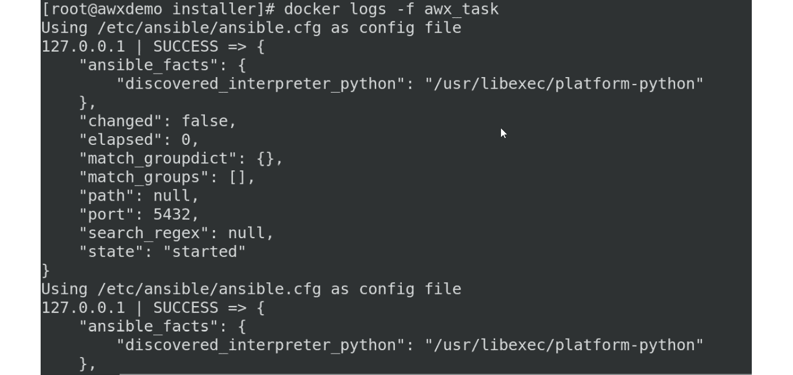
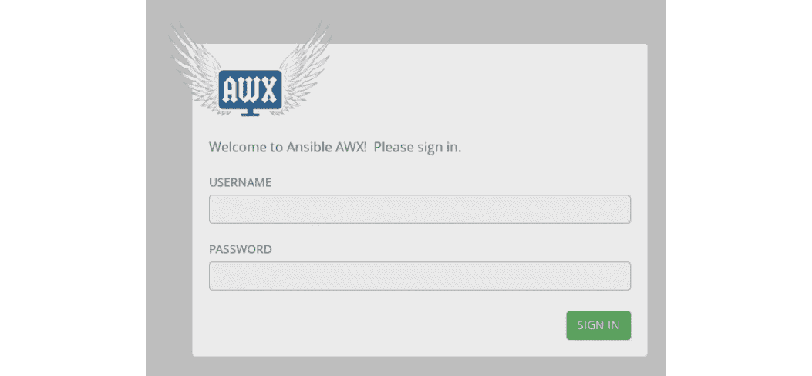
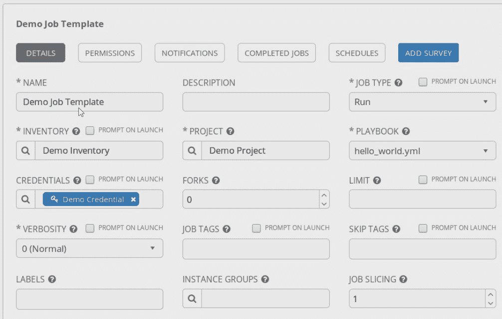
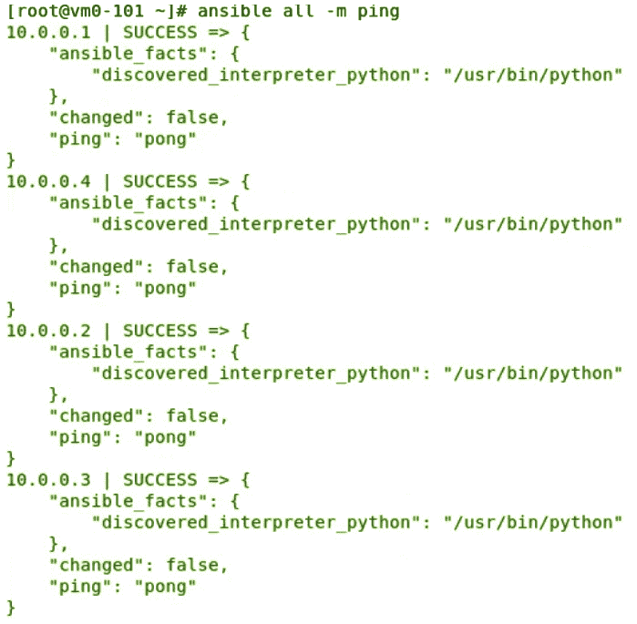
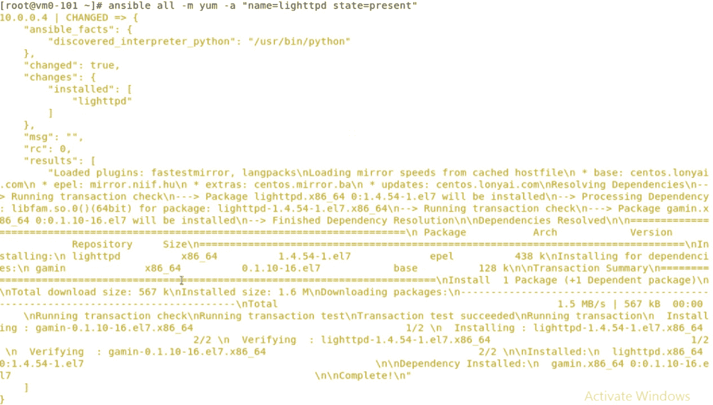
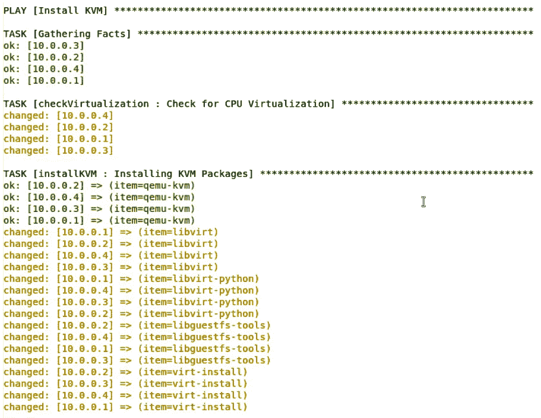
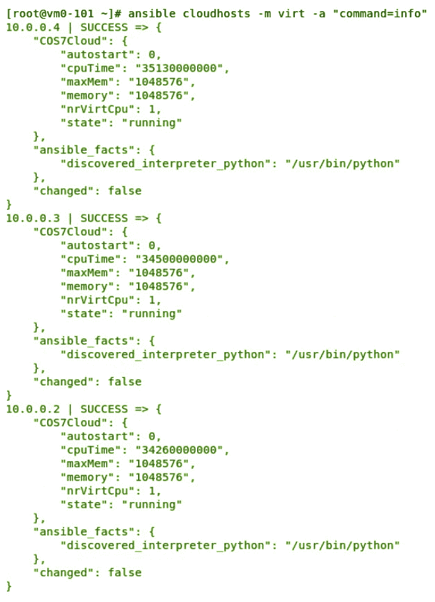
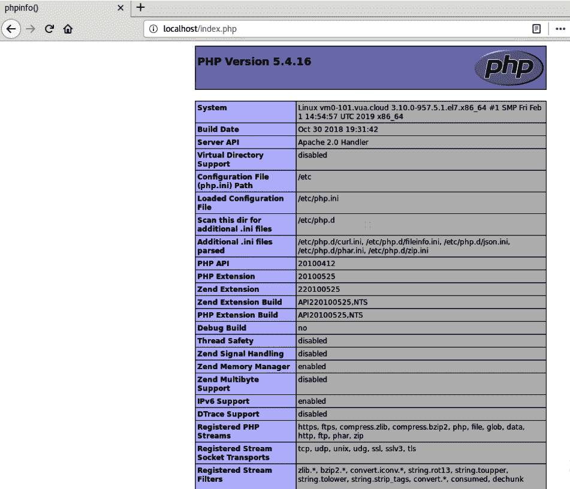

# 十一、用于编排和自动化的可解析和脚本

Ansible 已经成为当今开放源码社区的事实标准，因为它提供了如此多的功能，而对您和您的基础设施要求很少。 将 Ansible 与**基于内核的虚拟机**(**KVM**)配合使用也很有意义，尤其是在考虑更大的环境时。 如果只是简单地配置您想要做的 KVM 主机(安装 libvirt 和相关软件)，或者如果您想在主机上统一配置 KVM 网络，这并不重要-Ansible 对两者都是无价的。 例如，在本章中，我们将使用 Ansible 部署托管在 KVM 虚拟机内的虚拟机和多层应用，这在较大的环境中是非常常见的用例。 然后，我们将转到更迂腐的结合 Ansible 和 cloud-init 的主题，因为它们在应用的时间线和完成事情的方式方面有所不同。 Cloud-init 是初始虚拟机配置(主机名、网络和 SSH 密钥)的理想自动方式。 然后，我们通常转移到 Ansible，这样我们就可以在初始配置后执行额外的编排-添加软件包，对系统进行更大的更改，等等。 让我们看看如何在 KVM 中使用 Ansible 和 cloud-init。

在本章中，我们将介绍以下主题：

*   暗影
*   使用`kvm_libvirt`模块配置虚拟机
*   使用 Ansible 和 cloud-init 实现自动化和编排
*   编排 KVM 上的多层应用部署
***   通过示例学习，包括如何在 KVM 中使用 Ansible 的各种示例**

 **我们开始吧!

# = 0:

一个称职的管理员的主要角色之一就是尝试让自己尽可能地实现自动化。 有一句话说，每件事都必须至少手工做一次。 如果你必须再做一次，你可能会被它惹恼，而第三次你必须做的时候，你会自动完成这个过程。 当我们谈论自动化时，它可能意味着很多不同的事情。

让我们试着用一个例子来解释这一点，因为这是描述问题和解决方案的最方便的方式。 假设您正在为一家公司工作，该公司需要部署 50 台 Web 服务器来托管标准配置的 Web 应用。 标准配置包括需要安装的软件包、需要配置的服务和网络设置、需要配置的防火墙规则，以及需要从网络共享复制到虚拟机内部本地磁盘以便我们可以通过 Web 服务器提供这些文件的文件。 你打算如何实现这一点呢？

脑海中浮现出三种基本方法：

*   一切都要手动完成。 这将花费大量的时间，而且会有大量的机会去做错事，因为我们毕竟是人，而且我们也会犯错(双关语)。
*   尝试通过部署 50 台虚拟机，然后将整个配置方面放到一个脚本中来自动化该过程，该脚本可以是自动安装过程的一部分(例如，kickstart)。
*   尝试通过部署包含已安装的所有移动部件的单个虚拟机模板来自动化该过程。 这意味着我们只需要从虚拟机模板部署这 50 台虚拟机，并进行一些定制，以确保我们的虚拟机可以使用。

有不同种类的自动化可供选择。 纯脚本编写就是其中之一，它涉及到使用需要多次运行的所有内容创建脚本。 从事某项工作多年的管理员通常有一批有用的脚本。 好的管理员还至少懂一种编程语言，即使他们不愿承认，因为作为管理员意味着必须在其他人破坏后进行修复，而且有时还需要相当多的编程。

因此，如果您正在考虑通过脚本实现自动化，我们完全同意您的观点，即这是可行的。 但问题仍然是，您将花费多少时间覆盖该脚本的每一个方面，以使脚本*始终*正常工作。 此外，如果不是这样，您将不得不做大量的体力劳动来使其正确，而没有任何真正的方法在先前不成功的配置之上修改额外的配置。

这就是基于过程的工具(如 Ansible)派上用场的地方。 Ansible 生成**模块**，这些模块被推送到端点(在我们的示例中是虚拟机)，从而将我们的对象带到*所需的状态*。 如果您来自 Microsoft PowerShell 世界，是的，Ansible 和 PowerShell**Desired State Configuration**(**DSC**)本质上都在尝试做同样的事情。 他们只是以一种不同的方式来做这件事。 那么，让我们讨论一下这些不同的自动化过程，看看 Ansible 在哪里适合那个世界。

## 自动化方法

一般而言，所有这些都适用于管理系统及其部件、安装应用，以及通常处理已安装系统内部的事情。 这可以被认为是*旧的*管理方法，因为它通常处理服务，而不是服务器。 同时，这种自动化显然集中在单个服务器或少量服务器上，因为它没有很好的伸缩性。 如果我们需要在多台服务器上工作，使用常规脚本会产生新的问题。 我们需要考虑很多额外的变量(不同的 SSH 密钥、主机名和 IP 地址)，因为脚本更难扩展以在多个服务器上工作(这在 Ansible 中很容易)。

如果一个脚本还不够，那么我们必须转移到多个脚本，这就产生了一个新的问题，其中之一就是脚本管理。 想想看--当我们需要更改脚本中的某些内容时会发生什么？ 我们如何确保所有服务器上的所有实例都使用相同的版本，特别是在服务器 IP 地址不连续的情况下？ 因此，总而言之，虽然这种自动化是陈旧的和经过测试的，但它有严重的缺点。

还有另一种自动化正在 DevOps 社区中获得支持-大写字母 A 的 Automation。这是一种跨不同机器-甚至跨不同操作系统-实现系统操作自动化的方法。 有几个自动化系统可以实现这一点，它们基本上可以分为两组：使用代理的系统和无代理系统。

### 使用代理的系统

使用代理的系统更为常见，因为与无代理系统相比，它们有一些优势。 第一个也是最重要的优势是，它们不仅能够跟踪需要完成的更改，而且能够跟踪用户对系统所做的更改。 这种更改跟踪意味着我们可以跨系统跟踪正在发生的事情，并采取适当的操作。

它们几乎都是以相同的方式工作的。 我们需要监视的系统上安装了一个称为代理的小应用。 安装应用后，它会连接或允许来自中央服务器的连接，该服务器处理与自动化有关的所有事情。 因为您正在阅读本文，所以您可能对这样的系统很熟悉。 周围有很多这样的人，你很有可能已经遇到了其中一人。 要理解这一原理，请看下图：


图 11.1-管理平台需要代理来连接到需要编排和自动化的对象

在这些系统中，代理具有双重目的。 它们在这里运行任何需要在本地运行的东西，并持续监视系统的更改。 这种更改跟踪功能可以通过不同的方式实现，但结果是相似的-中央系统将知道发生了什么更改以及以什么方式更改。 更改跟踪是部署中的一件重要事情，因为它实现了实时的合规性检查，并防止了许多由未经授权的更改引起的问题。

### 无代理系统

无代理系统的行为不同。 必须管理的系统上没有安装；相反，中央服务器(或多个服务器)使用某种命令和控制通道执行所有操作。 在 Windows 上，这可能是**PowerShell**、**WinRM**或，而在 Linux 上，这通常是**SSH**或其他远程执行框架。 中央服务器创建一个任务，然后通过远程通道执行该任务，该任务通常以脚本的形式被复制，然后在目标系统上启动。 这是这个原则应该是什么样子的：


图 11.2-管理平台不需要代理来连接到需要编排和自动化的对象

不管它们的类型如何，这些系统通常被称为自动化或配置管理系统，虽然这是两个事实上的标准，但完全不同，但在现实中，它们被不加区别地使用。 在撰写本文时，最受欢迎的两个是 Pupet 和 Ansible，尽管还有其他的(Chef、SaltStack 等)。

在本章中，我们将介绍 Ansible，因为它易学、无代理，并且在 Internet 上拥有大量用户。

## =0 到 Accessible

Ansible 是一个 IT 自动化引擎(有人称之为自动化框架)，它使管理员能够自动执行资源调配、配置管理以及系统管理员可能需要完成的许多日常任务。

对 Ansible 最简单(也是过于简化)的思考方式是，它是一组复杂的脚本，旨在大规模完成管理任务，无论是从复杂性还是它可以控制的系统数量来看都是如此。 Ansible 在一台简单的服务器上运行，该服务器安装了 Ansible 系统的所有部分。 它不需要在它控制的机器上安装任何东西。 可以肯定地说，Ansible 是完全无代理的，为了实现其目标，它使用不同的方式连接到远程系统并将小脚本推送到远程系统。

这也意味着 Ansible 无法检测其控制的系统上的更改；它完全取决于我们创建的配置脚本来控制如果事情不是我们预期的那样会发生什么。

在做其他事情之前，我们需要定义一些东西--我们可以把它们看作*构建块*或模块。 Ansible 喜欢称自己为一个从根本上简单的 IT 引擎，而且它只有几个这样的构建块可以让它工作。

首先，它有**个清单**-定义将在哪些主机上执行特定任务的主机列表。 主机是在一个简单的文本文件中定义的，可以像每行包含一个主机的直接列表一样简单，也可以像 Ansible 执行任务时创建的动态清单一样复杂。 在展示如何使用它们时，我们将更详细地介绍它们。 需要记住的是，主机是在文本文件中定义的，因为不涉及数据库(尽管可能有)，并且主机可以分组，这是您将广泛使用的特性。

其次，还有一个名为*Play*的概念，我们将其定义为一组由 Ansible 在目标主机上运行的不同任务。 我们通常使用剧本来开始一部剧本，这是 Ansible 层次结构中的另一种对象类型。

就剧本而言，可以将其视为在特定系统上执行某项任务或实现特定状态所需的一项策略或一组任务/剧本。 剧本也是文本文件，专为人类可读而设计，由人类创建。 剧本用于定义配置，或者更准确地说，用于声明它。 它们可以包含以有序方式启动不同任务的步骤。 这些步骤称为剧本，因此得名剧本。 Ansible 文档有助于解释这一点，因为考虑到体育中的游戏，可以执行的任务列表被提供，并且需要被记录，但同时可能不被调用。 这里需要理解的重要一点是，我们的剧本中可以包含决策逻辑。

Ansible 谜题的第四大部分是它的**模**。 可以将模块看作是在您试图控制的机器上执行的小程序，以便完成某些任务。 Ansible 包中包含数百个模块，它们可以单独使用，也可以在您的攻略中使用。

模块允许我们完成任务，其中一些模块是严格的声明性的。 其他模块则返回数据，或者作为模块执行的任务的结果，或者作为模块通过称为事实收集的过程从正在运行的系统获得的显式数据。 此过程基于名为`gather_facts`的模块。 一旦我们开始开发自己的剧本，收集有关系统的正确事实是我们可以做的最重要的事情之一。

以下架构显示了所有这些部分协同工作的情况：


图 11.3-可解析的体系结构-Python API 和 SSH 连接

IT 工作人员的普遍共识是，通过 Ansible 进行管理比通过其他工具更容易，因为它不需要您在设置或攻略开发上浪费数天时间。 但是，不要搞错：要广泛使用 Ansible，您必须学习 YAML 语法。 也就是说，如果您对更基于 GUI 的方法感兴趣，您可以随时考虑购买 Red Hat Ansible Tower。

Ansible Tower 是一个基于 GUI 的实用程序，您可以使用它来管理基于 Ansible 的环境。 这是从名为**AWX**的项目开始的，该项目至今仍然非常活跃。 但是 AWX 的发布方式与 Ansible Tower 的发布方式有一些关键的区别。 主要原因是 Ansible Tower 使用特定的发布版本，而 AWX 采用了 OpenStack 以前的*方法--这个项目进展得相当快，而且经常有新的版本。*

正如 RedHat 在[https://www.ansible.com/products/awx-project/faq](https://www.ansible.com/products/awx-project/faq)上明确声明的那样：

*“Ansible Tower 的生产方法是选择 AWX 的选定版本，对其进行强化以获得长期支持，并将其作为 Ansible Tower 产品提供给客户。”*

基本上，AWX 是一个社区支持的项目，而 Red Hat 直接支持 Ansible Tower。 下面是**Ansible AWX**的屏幕截图，以便您可以看到 GUI 的外观：


图 11.4-Ansible AWX GUI for Ansible

Ansible 还有其他个 GUI 可用，比如**Rundeck**、**信号量**等等。 但不知何故，对于那些没有办法支付额外费用购买 Ansible Tower 的用户来说，AWX 似乎是最合乎逻辑的选择。 在讨论常规的 Ansible 部署和使用之前，让我们先花一点时间研究 AWX。

## 部署和使用 AWX

AWX 是作为一个开源项目宣布的，它为开发者提供访问 Ansible Tower 的权限，而不需要许可证。 与几乎所有其他 Red Hat 项目一样，这个项目还旨在弥合一个经过强化生产并可供企业使用的付费产品与一个社区驱动的项目之间的差距，前者拥有几乎所有必需的功能，但规模较小，没有企业客户可以使用的所有花哨功能。 但这并不意味着 AWX 在任何方面都是一个*小*项目。 它构建了 Ansible 的功能，并启用了一个简单的 GUI 来帮助您运行 Ansible 部署中的所有内容。

我们在这里几乎没有足够的空间来演示它的外观和用途，所以我们只介绍安装它和部署最简单场景的基础知识。

当我们谈论 awx 时，我们需要知道的最重要的地址是[https://github.com/ansible/awx](https://github.com/ansible/awx)。 这是项目所在的位置。 最新的信息在这里的`readme.md`中，它是 GitHub 页面上显示的一个文件。 如果您不熟悉从 GitHub 克隆*，请不要担心-我们基本上只是从一个特殊的源进行复制，这样您就可以只复制自上次获得文件版本以来已更改的内容。 这意味着要更新到新版本，只需使用相同的命令再次克隆即可。*

 *在 GitHub 页面上，有一个指向我们将要遵循的安装说明的直接链接。 请记住，此部署是从头开始的，因此我们需要再次构建演示计算机，并安装缺少的所有内容。

我们需要做的第一件事是获取必要的 AWX 文件。 让我们将 GitHub 存储库克隆到本地磁盘：


图 11.5-Git 克隆 AWX 文件

请注意，我们使用 13.0.0 作为版本号，因为这是撰写本文时 AWX 的当前版本。

然后，我们需要整理一些依赖项。 AWX 显然需要 Ansible、Python 和 Git，但除此之外，我们还需要能够支持 Docker，我们还需要 GNU make 以便稍后能够准备一些文件。 我们还需要一个环境来运行我们的虚拟机。 在本教程中，我们选择了 Docker，因此我们将使用 Docker Compose。

此外，这也是一个很好的地方，我们的机器上至少需要 4 GB 的 RAM 和 20 GB 的空间才能运行 AWX。 这与我们习惯在 Ansible 中使用的低内存使用量有所不同，但这是有意义的，因为 AWX 不仅仅是一堆脚本。 让我们从安装必备组件开始。

Docker 是我们要安装的第一个。 我们使用的是 CentOS 8，因此 Docker 不再是默认套餐的一部分。 因此，我们需要添加存储库，然后安装 Docker 引擎。 我们将使用`-ce`包，它代表 Community Edition。 我们还将使用`--nobest`选项安装 Docker-如果没有此选项，CentOS 将报告我们缺少一些依赖项：


图 11.6-在 CentOS 8 上部署 docker-ce 软件包

之后，我们需要运行以下命令：

```sh
dnf install docker-ce -y --nobest
```

总体结果应该如下所示。 请注意，您特定安装的每个软件包的版本可能会有所不同。 这是正常的，因为包裹一直在变化：


图 11.7-启动并启用 Docker 服务

然后，我们将使用以下命令安装 Ansible 本身：

```sh
dnf install ansible
```

如果您运行的是完全干净的 CentOS 8 安装，则可能必须先安装`epel-release`，然后才能使用 Ansible。

我们名单上的下一个是 Python。 仅仅使用`dnf`命令不会安装 Python，因为我们必须提供我们想要的 Python 版本。 为此，我们将这样做：


图 11.8-安装 Python；在本例中为 3.8 版

之后，我们将使用 pip 安装 Python 的 Docker 组件。 只需键入`pip3 install docker`，您需要的所有内容都将安装。

我们还需要安装`make`包：


图 11.9-部署 GNU Make

现在，是 Docker 组成部分的时间。 我们需要运行`pip3 install docker-compose`命令来安装 Python 部件，并运行以下命令来安装 docker-compose：

```sh
curl -L https://github.com/docker/compose/releases/download/1.25.0/docker-compose-`uname -s`-`uname -m` -o /usr/local/bin/docker-compose
```

该命令将从 GitHub 获取必要的安装文件，并使用必要的输入参数(通过执行`uname`命令)来启动 docker-compose 的安装过程。

我们知道这是很多依赖项，但是 AWX 在幕后是一个相当复杂的系统。 然而，从表面上看，事情并没有那么复杂。 在执行最终安装部分之前，我们需要验证防火墙是否已停止以及是否已禁用。 我们正在创建一个演示环境，`firewalld`将阻止容器之间的通信。 一旦系统运行好了，我们可以稍后再解决这个问题。

一旦一切都运行好了，安装 AWX 就很简单了。 只需转到`awx/installer`目录并运行以下命令：

```sh
ansible-playbook -i inventory -e docker_registry_password=password install.yml
```

安装应该需要几分钟时间。 结果应该是一个以以下内容结尾的长列表：

```sh
PLAY RECAP *********************************************************************
localhost  : ok=16   changed=8    unreachable=0    failed=0    skipped=86   rescued=0    ignored=0   
```

这意味着本地 AWX 环境已经成功部署。

现在，有趣的部分开始了。 AWX 由四个小的 Docker 图像组成。 要使其正常工作，所有这些都需要配置并运行。 您可以使用`docker ps`和`docker logs -t awx_task`将其检出。

第一个命令列出所有已部署的映像及其状态：


图 11.10-检查拉出并启动的坞站图像

第二个命令显示`awx_task`机器正在创建的所有日志。 这些是整个系统的主要日志。 稍后，初始配置将完成：



图 11.11-检查 AWX_TASK 日志

将进行大量日志记录，您必须使用*Ctrl+C*来中断此命令。

在此整个过程之后，我们可以将 Web 浏览器指向`http://localhost`。 我们应该看到如下所示的屏幕：



图 11.12？AWX 默认登录屏幕

默认的用户名是`admin`，而密码是`password`。 成功登录后，我们将面对如下界面：


图 11.13-登录后的初始 AWX 控制面板

这里有很多东西需要学习，所以我们只需要了解一些基础知识。 基本上，AWX 代表的是 Ansible 的智能 GUI。 如果我们打开**模板**(在窗口左侧)并查看**演示**模板，我们可以快速看到这一点：



图 11.14-在 AWX 中使用演示模板

在本章的下一部分，当我们部署 Ansible 时，我们在这里看到的内容将变得更加熟悉。 所有这些属性都是 Ansible 攻略的不同部分，包括攻略本身、库存、使用的凭证，以及其他一些使 Ansible 的使用更容易的事情。 如果我们向下滚动一点，那里应该有三个按钮。 按**启动**按钮。 这将播放模板并将其转换为`job`：


图 11.15-通过单击启动按钮，我们可以开始模板作业

我们的想法是，我们可以创建模板并随心所欲地运行它们。 运行它们之后，运行的结果将最终显示在**作业**下(作为窗口左侧的第二个项查找)：


图 11.16-模板作业详细信息

作业的详细信息基本上是所发生的事情、何时以及使用了哪些可选元素的摘要。 我们还可以看到刚刚运行的攻略的实际结果：


图 11.17-检查演示作业模板的文本输出

AWX 真正做的是自动化。 它使您在使用 Ansible 时更加高效，因为它为 Ansible 使用的不同文件提供了一个更加直观的界面。 它还使您能够跟踪做了什么、何时做了什么，以及结果是什么。 所有这些都可以使用 Ansible CLI 实现，但是 AWX 在我们控制整个过程的同时为我们节省了大量精力。

当然，因为本章的目标是使用 Ansible，这意味着我们需要部署所有必要的软件包，这样我们才能使用它。 因此，让我们将转移到 Ansible 流程的下一个阶段并部署 Ansible。

## _

在所有为编排和系统管理设计的个类似的应用中，Ansible 可能是安装最简单的一个。 由于它所管理的系统上不需要任何代理，因此安装仅限于一台计算机-将运行所有脚本和剧本的计算机。 默认情况下，Ansible 使用 SSH 连接到计算机，因此使用它的唯一先决条件是我们的远程系统启动并运行了 SSH 服务器。

除此之外，没有数据库(Ansible 使用文本文件)，没有守护进程(Ansible 按需运行)，也没有对 Ansible 本身的管理。 由于没有任何东西在后台运行，Ansible 很容易升级-唯一可以改变的是剧本的结构方式，这很容易修复。 Ansible 基于 Python 编程语言，但其结构比标准 Python 程序更简单。 配置文件和攻略要么是简单的文本文件，要么是 YAML 格式的文本文件，YAML 是用于定义数据结构的文件格式。 学习 YAML 超出了本章的范围，因此我们假设您了解简单的数据结构。 我们将作为示例使用的 YAML 文件非常简单，几乎不需要任何解释，但如果需要，我们会提供它。

安装可以非常简单，只需运行以下命令：

```sh
yum install ansible 
```

您可以以 root 用户身份运行此命令，也可以使用以下命令：

```sh
apt install ansible 
```

选择取决于您的发行版(Red Hat/CentOS 或 Ubuntu/Debian)。 更多信息可以在安赛的网站上找到，网址是[https://docs.ansible.com/](https://docs.ansible.com/)。

RHEL8 用户必须首先启用包含 Ansible RPM 的回购。 在编写本文时，这可以通过运行以下命令来完成：

```sh
sudo subscription-manager repos --enable ansible-2.8-for-rhel-8-x86_64-rpms
```

在运行前面的命令之后，使用以下代码：

```sh
dnf install ansible
```

这就是安装 Ansible 所需的全部内容。

有一件事会让您大吃一惊，那就是安装的大小：它真的很小(大约 20MB)，并且会根据需要安装 Python 依赖项。

Ansible 安装了的机器也称为*控制节点*。 它必须安装在 Linux 主机上，因为此角色不支持 Windows。 可能的控制节点可以在虚拟机内部运行。

我们控制的机器称为托管节点，默认情况下，它们是通过`SSH`协议控制的 Linux 机器。 有一些模块和插件可以将其扩展到 Windows 和 MacOS 操作系统，以及其他通信渠道。 当您开始阅读 Ansible 文档时，您会注意到大多数支持多个体系结构的模块都有关于如何在不同操作系统上完成相同任务的明确说明。

我们可以使用`/etc/ansible/ansible`配置 Ansible 的设置。 该文件包含定义缺省值的参数，其本身包含许多行，这些行被注释掉，但包含 Ansible 使用的所有工作的缺省值。 除非我们有所改变，否则这些就是安西普将要用来运行的价值观。 让我们在实际意义上使用 Ansible 来看看这一切是如何结合在一起的。 在我们的场景中，我们将使用 Ansible 通过其内置模块来配置虚拟机。

# 使用 kvm_libvirt 模块配置虚拟机

您可能包括也可能不包括的一件事是定义如何使用 SSH 连接到 Ansible 将要配置的机器的设置。 在此之前，我们需要花一点时间来讨论安全和可分析问题。 就像几乎所有与 Linux(或`*nix`)相关的东西一样，Ansible 不是一个集成的系统，而是依赖于已经存在的不同服务。 要连接到它管理的系统和执行命令，Ansible 依赖`SSH`(在 Linux 中)或其他系统，如 Windows 上的**WinRM**或**PowerShell**。 我们在这里将重点放在 Linux 上，但请记住，关于 Ansible 的相当多的信息是完全独立于系统的。

`SSH`是一种简单但极其健壮的协议，允许我们通过安全通道在远程主机上传输数据(安全 FTP、SFTP 等)和执行命令(`SSH`)。 Ansible 通过连接然后执行命令和传输文件直接使用 SSH。 当然，这意味着为了让 Ansible 工作，SSH 工作是至关重要的。

使用`SSH`连接时需要记住几件事：

*   第一个是密钥指纹，从 Ansible 控制节点(服务器)可以看到。 首次建立连接时，`SSH`要求用户验证并接受远程系统提供的密钥。 这是为了防止 MITM 攻击而设计的，在日常使用中是一个很好的策略。 但是，如果我们处于必须配置个新安装的系统的位置，则*所有*系统都需要我们接受它们的密钥。 一旦我们开始使用攻略，这既耗时又复杂，因此您要启动的第一个攻略可能会禁用密钥检查和登录机器。 当然，这只能在受控的环境中使用，因为这会降低整个 Ansible 系统的安全性。
*   您需要知道的第二件事是，Ansible 以普通用户身份运行。 话虽如此，也许我们不想以当前用户的身份连接到远程系统。 Ansible 通过在单独的计算机或组上设置一个变量来解决这一问题，该变量指示系统将使用什么用户名连接到这台特定的计算机。 连接之后，Ansible 允许我们以完全不同的用户身份在远程系统上执行命令。 这是常用的功能，因为它使我们能够完全重新配置机器并更改用户，就像我们在控制台一样。
*   我们需要记住的第三件事是密钥-`SSH`可以通过使用交互式身份验证(即通过密码或使用预共享密钥)登录，这些密钥只交换一次，然后重复使用以建立 SSH 会话。 还有`ssh-agent`，它可用于对会话进行身份验证。

虽然我们可以在清单文件(或特殊密钥库)中使用固定密码，但这不是一个好主意。 幸运的是，Ansible 使我们能够编写很多脚本，包括将密钥复制到远程系统。 这意味着我们将拥有一些行动手册，它们将自动部署新系统，这些将使我们能够控制它们以进行进一步的配置。

综上所述，部署系统的可行步骤可能如下所示：

1.  安装核心系统并确保`SSHD`正在运行。
2.  定义对系统具有管理员权限的用户。
3.  从控制节点运行将建立初始连接的播放列表，并将本地`SSH`键复制到远程位置。
4.  使用适当的攻略安全地重新配置系统，而无需在本地存储密码。

现在，让我们更深入地挖掘。

每一个理性的经理都会告诉你，为了做任何事情，你需要定义问题的范围。 在自动化方面，这意味着定义 Ansible 将要工作的系统。 这是通过位于`/etc/Ansible`中的名为`hosts`的清单文件来完成的。

`Hosts`可以分组或单独命名。 在文本格式中，它可能如下所示：

```sh
[servers]
srv1.local
srv2.local
srv3.local
[workstations]
wrk1.local
wrk2.local
wrk3.local
```

计算机可以同时属于多个组，并且组可以嵌套。

我们在这里使用的格式是纯文本。 让我们用 YAML 重写这段代码：

```sh
All:
  Servers:
     Hosts:
	Srv1.local:
Srv2.local:
Srv3.local:
 Workstations:
     Hosts:
	Wrk1.local:
Wrk2.local:
Wrk3.local:
Production:
   Hosts:
	Srv1.local:
	Workstations:
```

重要注

我们创建了另一个名为 Production 的组，其中包含所有工作站和一台服务器。

任何不属于默认或标准配置的内容都可以作为变量单独包含在主机定义或组定义中。 每个 Ansible 命令都有一定的灵活性，可以部分或完全覆盖配置或清单中的所有项目。

清单支持主机定义中的范围。 我们前面的示例可以编写如下：

```sh
[servers]
Srv[1:3].local
[workstations]
Wrk[1:3].local
```

这也适用于字符，因此如果我们需要定义名为`srva`、`srvb`、`srvc`和`srvd`的服务器，我们可以通过说明以下内容来实现：

```sh
srv[a:d]
```

也可以使用 IP 范围。 因此，例如，`10.0.0.0/24`可以写成：

```sh
10.0.0.[1:254]
```

还可以使用两个预定义的默认组：`all`和`ungrouped`。 顾名思义，如果我们在攻略中引用`all`，它将在我们库存中的每台服务器上运行。 `Ungrouped`将仅引用不属于任何组的那些系统。

未分组的引用在设置新计算机时特别有用-如果它们不在任何组中，我们可以将它们视为*新的*，并将它们设置为加入到特定组。

这些组是隐式定义的，不需要重新配置它们，甚至不需要在清单文件中提及它们。

我们提到清单文件可以包含变量。 当我们需要在一组计算机、用户、密码或特定于该组的设置中定义属性时，变量非常有用。 假设我们要定义要在`servers`组上使用的用户：

1.  首先，我们定义一个组：

    ```sh
    [servers]
    srv[1:3].local
    ```

2.  然后，我们定义将用于整个组的变量：

    ```sh
    [servers:vars]
    ansible_user=Ansibleuser
    ansible_connection=ssh
    ```

当要求执行攻略时，这将使用名为`Ansibleuser`的用户使用`SSH`进行连接。

重要注

请注意，密码不存在，如果未单独提及密码或未事先交换密钥，本攻略将失败。 有关变量及其用法的更多信息，请参考 Ansible 文档。

现在我们已经创建了我们的第一个实际的 Ansible 任务，是时候讨论如何让 Ansible 在使用更客观的*方法的同时同时做很多事情了。 能够创建单个任务或几个任务非常重要，我们可以通过称为*剧本*的概念将它们组合在一起，剧本可以包括多个任务/剧本。*

 *## 使用攻略

一旦我们决定了如何连接到我们计划管理的机器，一旦我们创建了清单，我们就可以开始实际使用 Ansible 来做一些有用的事情了。 这就是攻略开始有意义的地方。

在我们的示例中，我们配置了四个 CentOS7 系统，为它们分配了`10.0.0.1`到`10.0.0.4`范围内的连续地址，并将它们用于任何事情。

Ansible 安装在 IP 地址为`10.0.0.1`的系统上，但正如我们已经说过的，这完全是任意的。 Ansible 在用作控制节点的系统上占用的空间最小，并且可以安装在任何系统上，只要它连接到我们要管理的网络的其余部分。 我们简单地选择了我们小型网络中的第一台计算机。 另外需要注意的是，控制节点可以通过 Ansible 自行控制。 这是有用的，但同时也不是一件好事。 根据您的设置，在将各个命令部署到其他计算机之前，您不仅要测试剧本，还要测试各个命令-在您的控制服务器上执行此操作不是明智之举。

既然安装了 Ansible，我们就可以尝试用它做点什么了。 Ansible 有两种截然不同的运行方式。 一种是运行剧本，即包含要执行的任务的文件。 另一种方式是使用单个任务，有时称为**特别**执行。 无论哪种方式使用 Ansible 都有理由--攻略是我们的主要工具，你可能大部分时间都会用到它们。 但是临时执行也有它的优势，特别是如果我们有兴趣做一些我们需要在多个服务器上做一次的事情。 一个典型的例子是使用一个简单的命令来检查已安装应用的版本或应用状态。 如果我们需要它来检查什么，我们就不会写剧本了。

要查看是否一切正常，我们将从简单地使用 ping 检查机器是否在线开始。

Ansible 喜欢自称*极其简单的自动化*，我们要做的第一件事就是证明这一点。

我们将在中使用一个名为 ping 的模块，该模块尝试连接到主机，验证它是否可以在本地 Python 环境中运行，如果一切正常，则返回一条消息。 不要将此模块与 Linux 中的`ping`命令混淆；我们不是通过网络执行 ping 操作；我们只是从控制节点向我们试图控制的服务器执行*ping*操作。 通过发出以下命令，我们将使用一个简单的`ansible`命令 ping 所有定义的主机：

```sh
ansible all -m ping
```

以下是运行上述命令的结果：



图 11.18-我们的第一个 Ansible 模块-ping，检查 Python 并报告其状态

我们在这里所做的是运行一个名为`ansible all -m ping`的命令。

`ansible`是可用的最简单的命令，它运行单个任务。 参数`all`表示在清单中的所有主机上运行它，`-m`用于调用要运行的模块。

这个特定的模块没有参数或选项，所以我们只需要运行它就可以得到结果。 结果本身很有趣；它是 YAML 格式，除了命令的结果之外，还包含其他一些内容。

如果我们仔细观察这一点，我们会发现 Ansible 为清单中的每台主机返回了一个结果。 我们首先可以看到的是命令的最终结果-`SUCCESS`表示任务本身运行没有问题。 之后，我们可以看到数组形式的数据-`ansible_facts`包含模块返回的信息，在编写攻略时广泛使用。 以这种方式返回的数据可能会有所不同。 在下一节中，我们将展示一个更大的数据集，但在本例中，唯一显示的是 Python 解释器的位置。 在那之后，我们有了`changed`变量，这是一个有趣的变量。

当 Ansible 运行时，它尝试检测它是否正确运行，以及它是否更改了系统状态。 在此特定任务中，运行的命令只是提供信息，不会更改系统上的任何内容，因此系统状态没有变化。

换句话说，这意味着无论运行什么，都不会在系统上安装或更改任何东西。 稍后，当我们需要检查是否安装了某些东西(如服务)时，状态会更有意义。

我们可以看到的最后一个变量是`ping`命令的返回。 它只说明**PONG**，因为如果设置正确，这就是模块给出的正确答案。

让我们做一些类似的事情，但这一次使用一个参数，例如我们希望在远程主机上执行的即席命令。 因此，请键入以下命令：

```sh
ansible all -m shell -a "hostname"
```

以下是输出：


图 11.19-使用 Ansible 在 Ansible 目标上显式执行特定命令

在这里，我们调用了另一个名为`shell`的模块。 它只是将作为参数提供的任何内容作为 shell 命令运行。 返回的是本地主机名。 这在功能上与我们使用`SSH`连接到清单中的每台主机，执行命令，然后注销时发生的情况相同。

要简单演示 Ansible 的功能，这是可以的，但让我们做一些更复杂的事情。 我们将使用特定于 CentOS/Red Hat 的名为`yum`的模块来检查我们的主机上是否安装了 Web 服务器。 我们要检查的 Web 服务器将是`lighttpd`，因为我们需要一些轻量级的东西。

当我们谈到状态时，我们谈到了一个概念，这个概念一开始有点令人困惑，但一旦我们开始使用它，它就会变得非常有用。 当调用这样的命令时，我们声明的是所需的状态，因此如果状态不是我们要求的状态，系统本身就会改变。 这意味着，在本例中，我们实际上并没有测试是否安装了`lighttpd`--我们告诉 Ansible 检查它，如果没有安装来安装它。 甚至这也不是完全正确的-该模块有两个参数：服务的名称和它应该处于的状态。 如果我们正在检查的系统上的状态与调用模块时发送的状态相同，我们将得到`changed: false`，因为没有任何更改。 但如果系统的状态不同，Ansible 将使系统的当前状态与我们请求的状态相同。

为了证明这一点，我们将查看服务是*没有安装*，还是没有安装*。 请记住，如果安装了该服务，则会将其卸载。 键入以下命令：*

```sh
ansible all -m yum -a "name=lighttpd state=absent" 
```

这是您在运行前面的命令后应该得到的结果：


图 11.20-使用 Ansible 检查服务的状态

然后，我们可以说我们希望它出现在系统上。 Ansible 将根据需要安装服务：



图 11.21-在所有可选目标上使用 yum install 命令

在这里，我们可以看到 Ansible 只是检查并安装了服务，因为它不在那里。 它还向我们提供了其他有用的信息，例如对系统进行了哪些更改，以及它执行的命令的输出。 信息是以变量数组的形式提供的；这通常意味着我们必须进行一些字符串操作才能使其看起来更美观。

现在，让我们再次运行该命令：

```sh
ansible all -m yum -a "name=lighttpd state=absent" 
```

这应该是结果：


图 11.22-服务安装后使用 Ansible 检查服务状态

正如我们所看到的，自从安装了该服务以来，这里没有任何更改。

这些都是的开始示例，因此我们可以稍微了解一下 Ansible。 现在，让我们在此基础上进行扩展，并创建一个 Ansible 攻略，它将在我们预定义的一组主机上安装 KVM。

## 安装 KVM

现在，让我们创建我们的第一本剧本，并使用它在所有主机上安装 KVM。 在我们的攻略中，我们使用了由 Jared Blomer 创建的 GitHub 存储库中的一个很好的示例，因为我们已经配置了选项和库存，所以进行了一些更改。 原始文件位于[https://github.com/jbloomer/Ansible---Install-KVM-on-CentOS-7.git](https://github.com/jbloomer/Ansible---Install-KVM-on-CentOS-7.git)。

本攻略将展示我们需要了解的有关自动化简单任务的所有内容。 我们之所以选择这个特定的例子，是因为它不仅展示了自动化是如何工作的，而且还展示了如何创建单独的任务并在不同的剧本中重用它们。 使用公共存储库还有一个额外的好处，即您将始终获得最新版本，但它可能与此处提供的版本有很大不同：

1.  First, we created our main playbook – the one that will get called – and named it `installkvm.yaml`:

    

    图 11.23-主要的 Ansible 攻略，检查虚拟化支持并安装 KVM

    正如我们所看到的，这是一个简单的声明，所以让我们逐行分析它。 首先，我们有剧本名称，它是一个字符串，可以包含我们想要的任何内容：

    变量`hosts`定义将在清单的哪个部分上执行此剧本-在我们的示例中，是所有主机。 我们可以在运行时覆盖这一点(以及所有其他变量)，但它有助于将剧本限制为我们需要控制的主机。 在我们的特定情况下，这实际上是我们库存中的所有主机，但在生产中，我们可能会有不止一组主机。

    下一个变量是要执行任务的用户名。 我们不建议在生产中执行此处的操作，因为我们使用超级用户帐户来执行任务。 Ansible 完全有能力使用非特权帐户，并在需要时提升权限，但就像在所有演示中一样，我们会犯错误，这样您就不必犯错误了，这一切都是为了让事情更容易理解。

    现在，真正执行我们任务的部分来了。 在 Ansible 中，我们为系统声明角色。 在我们的示例中，它们有两个。 角色实际上只是要执行的任务，这将导致系统处于特定状态。 在我们的第一个角色中，我们将检查系统是否支持虚拟化，然后在第二个角色中，我们将在所有支持虚拟化的系统上安装 KVM 服务。

2.  When we downloaded the script from the GitHub, it created a few folders. In the one named `roles`, there are two subfolders that each contain a file; one is called `checkVirtualization` and the other is called `installKVM`.

    你可能已经看到事情的发展方向了。 首先，让我们看看`checkVirtualization`包含哪些内容：

    

    图 11.24-通过 lscpu 命令检查 CPU 虚拟化

    该任务只调用一个 shell 命令，并尝试对包含 CPU 虚拟化参数的行执行`grep`。 如果没有找到，则失败。

3.  Now, let's see the other task:

    

    图 11.25-安装必要的 libvirt 软件包的可行任务

    第一部分是一个简单的循环，如果五个不同的包不存在，它将只安装它们。 我们在这里使用的是 Package 模块，这是一种与我们在第一次演示中使用的有关如何安装软件包的方法不同的方法。 我们在本章前面使用的模块称为`yum`，特定于作为发行版的 CentOS。 `package`模块是一个通用模块，它将转换为特定发行版使用的任何包管理器。 一旦我们安装了所需的所有软件包，我们需要确保`libvirtd`已启用并启动。

    我们使用一个简单的循环来检查我们正在安装的所有包。 这不是必需的，但这比复制和粘贴单个命令更好，因为它使我们需要的包列表更具可读性。

    然后，作为任务的最后一部分，我们验证 KVM 是否已加载。

    正如我们所看到的，攻略的语法很简单。 它很容易阅读，即使是对脚本或编程略知一二的人也是如此。 我们甚至可以说，对 Linux 命令行的工作方式有一个确切的理解更为重要。

4.  In order to run a playbook, we use the `ansible-playbook` command, followed by the name of the playbook. In our case, we're going to use the `ansible-playbook main.yaml` command. Here are the results:

    

    图 11.26-交互式 Ansible 攻略监控

5.  Here, we can see that Ansible breaks down everything it did on every host, change by change. The end result is a success:

    

    图 11.27-Ansible 攻略报告

    现在，让我们检查一下新安装的 KVM*集群*是否正常工作。

6.  我们将启动`virsh`并列出个群集所有部分上的活动虚拟机：


图 11.28-使用 Ansible 检查 Ansible 目标上的所有虚拟机

完成这个简单的练习之后，我们已经在四台机器上运行了 KVM，并且能够从一个位置控制它们。 但是我们仍然没有在主机上运行虚拟机。 接下来，我们将向您展示如何在 KVM 环境中创建 CentOS 安装，但我们将使用最基本的方法-`virsh`。

我们将做两件事：首先，我们将从互联网上下载 CentOS 的最小 ISO 映像。 然后，我们将调用`virsh`。 本书将向您展示完成此任务的不同方法；从互联网下载是最慢的方法之一：

1.  As always, Ansible has a module dedicated to downloading files. The parameters it expects are the URL where the file is located and the location of the saved file:

    

    图 11.29-下载 Ansible 攻略中的文件

2.  After running the playbook, we need to check if the files have been downloaded:

    

    图 11.30-S 状态检查-检查文件是否已下载到我们的目标

3.  由于我们不会自动执行此操作，而是创建单个任务，因此我们将在本地 shell 中运行它。 为此运行的命令应该是类似以下内容的：

    ```sh
    ansible all -m shell -a "virt-install --name=COS7Core --ram=2048 --vcpus=4 --cdrom=/var/lib/libvirt/boot/CentOS-7-x86_64-Minimal-1810.iso --os-type=linux --os-variant=rhel7 --disk path=/var/lib/libviimg/cos7vm.dsk,size=6"
    ```

4.  Without a kickstart file or some other kind of preconfiguration, this VM makes no sense since we will not be able to connect to it or even finish the installation. In the next task, we will remedy that using cloud-init.

    现在，我们可以检查是否一切正常：


图 11.31-使用 Ansible 检查我们的所有虚拟机是否都在运行

在这里，我们可以看到所有 KVM 都在运行，并且每个 KVM 都有自己的台虚拟机在线并在运行。

现在，我们将清除 KVM 集群并重新开始，但这一次使用不同的配置：我们将部署 CentOS 的云版本，并使用 cloud-init 重新配置它。

## 使用 Ansible 和 cloud-init 实现自动化和编排

**cloud-init**是私有云和混合云环境中较为流行的机器部署方式中的之一。 这是因为它使机器能够快速重新配置，使其功能恰到好处地连接到编排环境(如 Ansible)。

更多详细信息可以在[cloud-init.io](http://cloud-init.io)上找到，但简而言之，cloud-init 是一个支持创建特殊文件的工具，这些文件可以与 VM 模板组合在一起，以便快速部署它们。 Cloud-init 和无人值守安装脚本之间的主要区别在于，cloud-init 或多或少与分布无关，并且更容易使用脚本工具进行更改。 这意味着部署期间的工作量更少，从开始部署到机器联机并正常工作所需的时间也更短。 在 CentOS 上，这可以通过 kickstart 文件来实现，但这远不如 cloud-init 灵活。

Cloud-init 使用两个独立的部分工作：一个是我们正在部署的操作系统的分发文件。 这不是通常的操作系统安装文件，而是一个专门配置的机器模板，旨在用作云初始化映像。

系统的另一部分是配置文件，它是从包含机器配置的特殊 YAML 文本文件中*编译*-或者更准确地说，是*打包*的。 此配置体积小，非常适合网络传输。

这两个部分旨在作为整体使用，以创建相同虚拟机的多个实例。

的工作方式很简单：

1.  首先，我们分发一个与我们要创建的所有机器完全相同的机器模板。 这意味着拥有一个主副本并从中创建所有实例。
2.  然后，我们将模板与使用 cloud-init 创建的巧尽心思构建的文件配对。 我们的模板，不管它使用的是什么操作系统，都能够理解我们可以在 cloud-init 文件中设置的不同指令，并且将被重新配置。 这可以根据需要重复执行。

让我们进一步简化这一过程：如果我们需要使用无人参与安装文件创建 100 个具有四个不同角色的服务器，我们将不得不引导 100 个映像，并等待它们逐个完成所有安装步骤。 然后，我们需要为我们需要的任务重新配置它们。 使用 cloud-init，我们在 100 个实例中引导一个映像，但是系统只需要几秒钟就能引导，因为它已经安装好了。 只需要关键信息就可以将它放到网上，之后我们就可以接管它，并使用 Ansible 对其进行完全配置。

我们不会过多地讨论 cloud-init 的配置；我们需要的一切都在这个示例中：


图 11.32-使用 cloud-init 进行附加配置

像往常一样，我们将一步一步地解释正在发生的事情。 我们从一开始就可以看到，它使用直接的 YAML 表示法，与 Ansible 相同。 这里的第一条指令是为了确保我们的机器得到更新，因为它支持自动更新云实例上的包。

然后，我们正在配置用户。 我们将创建一个名为`ansible`的用户，该用户将属于组`wheel`。

`Lock_passwd`表示我们将允许使用密码登录。 如果未配置任何内容，则默认设置为仅允许使用`SSH`键登录，并完全禁用密码登录。

然后，我们获得散列格式的密码。 根据的分布情况，可以用不同的方式创建此散列。 *不要*在这里放明文密码。

然后，我们就有了一个 shell，如果需要向`/etc/sudoers`文件添加一些内容，该用户将能够使用它。 在这种情况下，我们赋予该用户对系统的完全控制权。

最后一件事可能是最重要的。 这是我们系统上的公钥`SSH`。 它用于在用户登录时对其进行授权。 这里可以有多个密钥，它们将以`SSHD`配置结束，以使用户能够执行无密码登录。

我们可以在这里使用更多的变量和指令，因此请参考`cloud-config`文档了解更多信息。

创建此文件后，需要将其转换为将用于安装的`.iso`文件。 执行此操作的命令是`cloud-localds`。 我们使用 YAML 文件作为一个参数，使用`.iso`文件作为另一个参数。

运行`cloud-localds config.iso config.yaml`之后，我们就可以开始部署了。

下一个我们需要的是 CentOS 的云映像。 正如我们前面提到的，这是一个专门用于此特定目的的特殊图像。

我们将从[https://cloud.centos.org/centos/7/images](https://cloud.centos.org/centos/7/images)获得它。

这里有相当多的文件，表示 CentOS 镜像的所有可用版本。 如果您需要特定版本，请注意表示映像发布的月份/年份的数字。 另外，请注意图像有两种风格-压缩的和未压缩的。

镜像采用`qcow2`格式，打算在云中作为磁盘使用。

在我们的示例中，在 Ansible 机器上，我们创建了一个名为`/clouddeploy`的新目录，并将两个文件保存到其中：一个包含操作系统云映像，另一个是使用`cloud-init`创建的`config.iso`：


图 11.33-检查目录内容

现在剩下的就是创建一个剧本来部署它们。 让我们来看看这些步骤：

1.  First, we are going to copy the cloud image and our configuration onto our KVM hosts. After that, we are going to create a machine out of these and start it:

    

    图 11.34-下载所需映像、配置 cloud-init 并启动 VM 部署流程的实战手册

    由于这是我们的第一个*复杂*攻略，我们需要解释几件事。 在每个游戏或任务中，都有一些重要的事情。 名称用于简化运行剧本；这是剧本运行时将显示的内容。 这个名称应该有足够的说明性，但不能太长，以免混乱。

    在名称之后，我们有每个任务的业务部分-被调用的模块的名称。 在我们的示例中，我们使用了三个不同的参数：`copy`、`command`和`virt`。 `copy`用于在主机之间复制文件，`command`在远程机器上执行命令，`virt`包含控制虚拟环境所需的命令和状态。

    您在阅读本文时会注意到，`copy`看起来很奇怪；`src`表示本地目录，而`dest`表示远程目录。 这是设计好的。 为了简化操作，`copy`在本地机器(运行 Ansible 的控制节点)和远程机器(正在配置的机器)之间工作。 如果目录不存在，则会创建这些目录，并且`copy`将应用适当的权限。

    在此之后，我们将运行一个命令，该命令将在本地文件上工作并创建一个虚拟机。 这里重要的一点是，我们基本上是在运行我们复制的映像；模板位于控制节点上。 同时，这节省了磁盘空间和部署时间--无需将机器从本地磁盘复制到远程磁盘，然后在远程机器上再次复制；只要映像在那里，我们就可以运行它。

    回到的重要部分-本地安装。 我们正在使用刚刚复制的磁盘镜像创建一台具有 1 GB RAM 和一个 CPU 的机器。 我们还将`config.iso`文件作为虚拟 CD/DVD 附加。 然后，我们将导入此图像，并且不使用图形终端。

2.  The last task is starting the VM on the remote KVM host. We will use the following command to do so:

    ```sh
    ansible-playbook installvms.yaml
    ```

    如果一切正常，我们应该看到如下所示：


图 11.35-检查我们的安装过程

我们还可以使用命令行检查这一点：

```sh
ansible cloudhosts -m shell -a "virsh list –all"
```

此命令的输出应如下所示：


图 11.36-检查我们的虚拟机

让我们再检查两件事-网络和机器状态。 键入以下命令：

```sh
ansible cloudhosts -m shell -a "virsh net-dhcp-leases –-network default"
```

我们应该得到这样的：


图 11.37-检查我们的虚拟机网络连接和网络配置

这将验证我们的机器是否正常运行，以及它们是否连接到本地 KVM 实例上的本地网络。 在本书的其他部分，我们将更详细地介绍 KVM 网络，因此，通过桥接 KVM 上的适配器或创建跨主机的单独虚拟网络，重新配置计算机以使用公共网络应该很容易。

我们想要显示的另一件事是所有主机的机器状态。 关键是，我们这次不使用 shell 模块；相反，我们依赖`virt`模块向我们展示如何从命令行使用它。 这里只有一个细微的区别。 当我们调用 shell(或`command`)模块时，我们调用的是将要调用的参数。 这些模块基本上只是在远程机器上生成另一个进程，并使用我们提供的参数运行它。

相反，`virt`模块将变量声明作为其参数，因为我们使用`command=info`运行`virt`。 在使用 Ansible 时，您会注意到，有时变量只是状态。 如果我们想要启动一个特定的实例，我们只需添加`state=running`以及一个适当的名称，Ansible 就会确保 VM 正在运行。 让我们键入以下命令：

```sh
ansible cloudhosts -m virt -a "command=info"
```

以下是预期输出：



图 11.38-将 virt 模块与 Ansible 配合使用

只有一件事我们还没有介绍--如何安装多层应用。 将定义推向最小的极限，我们将使用一个简单的剧本来安装 LAMP 服务器。

# 编排 KVM VM 上的多层应用部署

现在，让我们学习如何安装多层应用。 将定义推向最小的极端，我们将使用一个简单的 Ansible 剧本来安装 LAMP 服务器。

需要完成的任务非常简单-我们需要安装 Apache、MySQL 和 PHP。 LAMP 的*L*部分已经安装，因此我们不会再次介绍。

困难的部分是包名：在我们的演示机器中，我们使用 CentOS7 作为操作系统，它的包名略有不同。 Apache 称为`httpd`，`mysql`替换为`mariaDB`，这是另一个与 MySQL 兼容的引擎。 幸运的是，PHP 与其他发行版相同。 我们还需要另一个名为`python2-PyMySQL`的包(该名称区分大小写)才能使我们的攻略正常工作。

接下来我们要做的是通过启动所有服务并创建尽可能简单的`.php`脚本来测试安装。 之后，我们将创建一个数据库和一个要使用它的用户。 作为警告，在这一章中，我们将重点放在安可普的基础知识上，因为安可普太复杂了，不可能在一本书的一个章节中涵盖。 此外，我们假设了很多事情，我们最大的假设是，我们正在创建的演示系统无论如何都不是用于生产的。 本攻略特别缺少一个重要步骤：创建根密码。 请勿在未设置 SQL 密码的情况下进入生产环境。

还有一件事：我们的脚本假定在运行剧本的目录中有一个名为`index.php`的文件，该文件将被复制到远程系统：


图 11.39-Ansible LAMP 手册

正如我们所看到的，没有什么复杂的事情发生，只是一系列简单的步骤。 我们的`.php`文件如下所示：


图 11.40-测试 PHP 是否正常工作

事情不可能比这更简单了。 在正常的部署场景中，我们在 Web 服务器目录中会有一些更复杂的东西，比如 WordPress 或 Joomla 安装，甚至是自定义应用。 唯一需要更改的是复制的文件(或一组文件)和数据库的位置。 我们的文件只打印有关本地`.php`安装的信息：



图 11.41-使用 Web 浏览器和先前配置的 PHP 文件检查 PHP 是否可以在 Apache 上运行

Ansible 的比我们在本章中向您展示的复杂得多，所以我们强烈建议您做一些进一步的阅读和学习。 我们在这里所做的只是一个最简单的示例，说明如何在多台主机上安装 KVM 并使用命令行一次控制所有主机。 Ansible 做得最好的是节省我们的时间-想象一下，有几百个虚拟机管理器，而不得不部署数千台服务器。 使用攻略和几个预配置的映像，我们不仅可以配置 KVM 来运行我们的机器，还可以重新配置机器本身上的任何东西。 唯一真正的先决条件是一台正在运行的 SSH 服务器和一份清单，这将使我们能够对计算机进行分组。

# 通过示例学习-在 KVM 中使用 Ansible 的各种示例

既然我们已经介绍了简单和复杂的 Ansible 任务，让我们考虑一下如何使用 Ansible 来提高我们的配置技能和基于某种策略的总体遵从性。 以下是我们将留给您作为练习的一些内容：

*   Task 1:

    我们为每台 KVM 主机配置并运行了一台计算机。 创建一本将形成一对主机的攻略-一台主机运行网站，另一台运行数据库。 为此，您可以使用任何开源 CMS。

*   Task 2:

    使用 Ansible 和`virt-net`模块重新配置网络，以便整个群集可以通信。 KVM 接受用于联网的`.xml`配置，并且`virt-net`可以读写 XML。 提示：如果您感到困惑，请使用单独的 RHEL8 机器在 GUI 中创建虚拟网络，然后使用`virsh net-dumpxml`语法将虚拟网络配置输出到标准输出，然后将其用作模板。

*   Task 3:

    使用`ansible`和`virsh`自动启动您在主机上创建/导入的特定虚拟机。

*   Task 4:

    根据我们的 LAMP 部署手册，通过执行以下操作对其进行改进：

    A)创建将在远程计算机上运行的攻略。

    B)创建将在不同服务器上安装不同角色的攻略。

    C)创建将部署更复杂应用(如 WordPress)的剧本。

如果您成功地解决了这五项任务，那么恭喜您-*您正在*成为一名可以使用自动化的管理员，大写字母是*A*。

# 摘要

在本章中，我们讨论了 Ansible-一个用于编排和自动化的简单工具。 它既可以在开源环境中使用，也可以在基于 Microsoft 的环境中使用，因为它本机支持这两种环境。 开源系统可以通过 SSH 密钥访问，而 Microsoft 操作系统可以使用 WinRM 和 PowerShell 访问。 我们了解了很多关于简单的 Ansible 任务和更复杂的任务，因为部署托管在多个虚拟机上的多层应用不是一件容易的任务-特别是如果您手动解决问题的话。 即使在多台主机上部署 KVM 虚拟机管理器也需要相当长的时间，但我们通过一本简单的 Ansible 攻略设法解决了这一问题。 请注意，我们只需要大约 20 行配置行就可以做到这一点，其结果是我们可以轻松地添加数百台主机作为本 Ansible 攻略的目标。

下一章将带我们进入云服务的世界--特别是 OpenStack--在那里，我们的 Ansible 知识将对大规模虚拟机配置非常有用，因为使用任何类型的手动实用程序都不可能配置我们所有的云虚拟机。 除此之外，我们还将通过集成 OpenStack 和 Ansible 来扩展我们对 Ansible 的了解，这样我们就可以使用这两个平台来做他们真正擅长的事情--管理云环境和配置他们的消耗品。

# 问题

1.  什么是 Ansible？
2.  一本安可普剧本能做什么？
3.  Ansible 使用哪种通信协议来连接其目标？
4.  AWX 是什么？
5.  什么是 Ansible Tower？

# 进一步阅读

有关本章内容的更多信息，请参阅以下链接：

*   什么是可分析的？：[https://www.ansible.com/](https://www.ansible.com/)
*   可选文档：[HTTPS：//docs.ansible.com/](https://docs.ansible.com/)
*   可能的概述：[https://www.ansible.com/overview/it-automation](https://www.ansible.com/overview/it-automation)
*   合理的使用情形：[https://www.ansible.com/use-cases](https://www.ansible.com/use-cases)
*   可连续交付：[https://www.ansible.com/use-cases/continuous-delivery](https://www.ansible.com/use-cases/continuous-delivery)
*   将 Ansible 与 Jenkins 集成：[https://www.redhat.com/en/blog/integrating-ansible-jenkins-cicd-process](https://www.redhat.com/en/blog/integrating-ansible-jenkins-cicd-process)*****