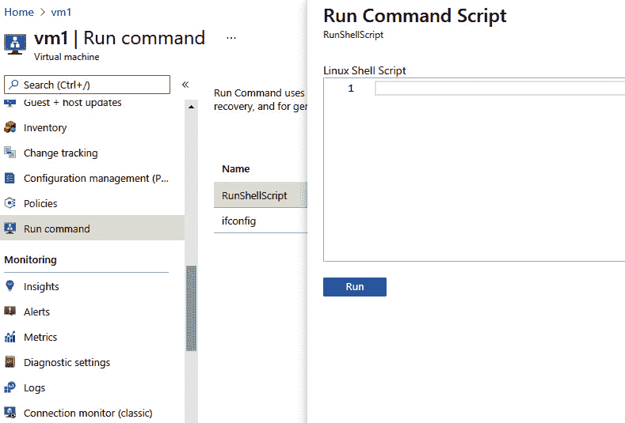
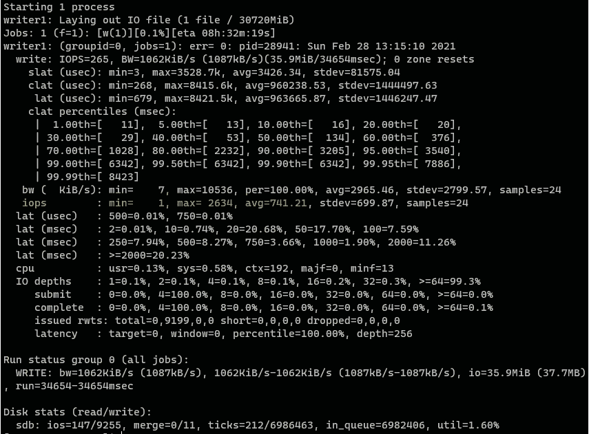
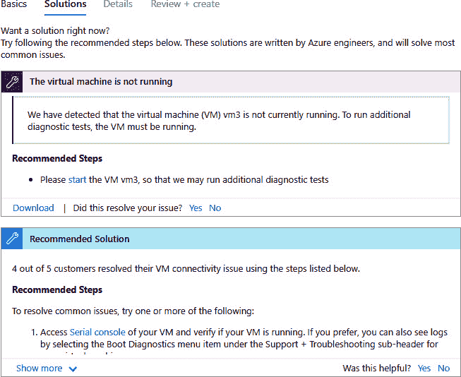

# 六、故障排除和问题解决

我们的迁移之旅从 *第三章**评估和迁移规划*开始，在这里我们看到了评估的重要性及其对整体迁移之旅的贡献。

在 *第 4 章**执行到 Azure* 的迁移中，我们见证了 Linux 工作负载到微软 Azure 虚拟机以及托管服务的实际迁移。 *第 5 章**在 Azure 上操作 Linux*更多的是关于在 Azure 中优化和保护工作负载的迁移后策略和工具。

至此，我们的**虚拟机** ( **VM** )成功迁移到 Azure。是时候收拾行李，考虑一下工作是否做得好了。然而，有时候事情并没有按照他们应该的方式进行。您的日志文件中可能会出现奇怪的错误，或者您的客户端可能会抱怨迁移的应用运行不正确。您甚至可以发现您的虚拟机根本无法启动。

能够自己分析问题并调试受影响的系统非常重要。您不希望仅仅因为不知道如何弄清楚为什么有些东西不起作用，就被困在您的迁移项目中。

本章将帮助您学习和理解如何评估、调试和修复 Linux 到 Azure 迁移项目中最常见的问题。这些主题对于在 Azure 上新创建的 Linux 虚拟机也很有用。

在本章中，您将了解以下内容:

*   远程连接和虚拟机启动问题
*   常见的 Linux 运行时挑战
*   Azure 诊断工具-总结
*   打开支持请求

为了充分利用本章，您应该熟悉本地或托管 Linux 服务器的典型调试方法。在 Azure 上，调试的某些方面与内部调试有些不同。

让我们从讨论最不想要的问题开始——您无法连接到的虚拟机。

## 远程连接和虚拟机启动问题

在本节中，我们将了解一些可能导致您的虚拟机无法通过网络访问的常见问题，并提供一些方法来解决这些问题。

我们看到的最常见的问题就是使用 **ssh** 无法到达 VM，如图*图 6.1* :

图 6.1: SSH 连接失败

在这种情况下，用户试图直接从他们的笔记本电脑连接到 Azure 虚拟机的私有 IP 地址 **10.0.0.1** 。这将失败，因为 Azure 上的私有 IP 地址总是在私有 IP 范围内，不能通过公共互联网直接访问。这与典型的内部环境不同，在这种环境中，您可能能够直接连接到数据中心的任何虚拟机。根据您的操作系统和连接失败的实际原因，实际的错误消息可能会有所不同。

Azure 虚拟机通常有两个 IP 地址:私有内部 IP 和公共外部 IP。您可以从 Azure 门户或命令行获得虚拟机的所有 IP 地址列表。使用 Azure 命令行界面，您可以使用 **az vm 列表-ip 地址**命令，如*图 6.2* 所示:

图 6.2:虚拟机 IP 地址列表

如果在使用公共 IP 地址时连接仍然不起作用，原因可能是以下之一:

*   Azure 网络安全组正在阻止连接。
*   SSH 服务没有在虚拟机上运行。
*   Linux 防火墙正在阻止连接。

这些是我们见过的最常见的问题。如果您的问题不是这些问题之一，您将在本章后面的 *Azure 诊断工具–概述*部分找到更多分析指导。

网络连接问题可以使用 Azure 门户上的 Azure 连接疑难解答工具进行分析，如图*图 6.3* :

图 6.3:连接故障排除实用程序

在本例中，我们可以看到 Azure 网络连接工作正常，问题不在网络安全组设置中。

### 在没有网络连接的情况下运行命令

为了解决 Linux 虚拟机内部的问题，您可以使用 Azure 扩展。要以这种方式启动 **sshd** ，首先需要创建一个本地 **custom.json** 文件，其内容如下:

{

" commandtoexec ":" sudo system CTL start sshd "

}

然后使用以下命令调用自定义扩展:

az 虚拟机扩展集-资源-组 vm1_group -虚拟机-名称 vm1 \

-名称 customScript -发布者 Microsoft。Azure.Extensions \

-设置。/custom.json

结果应该是成功的，如图*图 6.4* :

图 6.4:运行自定义扩展

您可以使用相同的方法远程运行任何命令，例如，如果您怀疑 Linux 防火墙可能会阻止您的 SSH 连接，请关闭它。

Azure 门户还提供了一个简单的用户界面来远程运行命令和简单的脚本，如*图 6.5* 所示:

图 6.5:在 Azure 门户中运行命令功能

为了使扩展能够工作，您需要在虚拟机上安装并运行 Azure Linux 代理，因为 Azure 扩展使用它在虚拟机上执行命令。

如果远程 SSH 连接仍然不起作用，原因可能更严重:您的虚拟机可能实际上无法正常启动，并且不可能使用脚本工具来修复这个问题。

### 启动诊断和串行控制台访问

如果您怀疑虚拟机无法正常引导，可以使用 Azure 门户中的引导诊断工具查看引导日志来轻松确认，如图 6.6*所示:*

图 6.6:引导诊断实用程序

系统日志是从虚拟串行终端捕获的，并且是只读的。您可以使用引导日志来查找和诊断问题。

如果需要登录系统修复问题，可以使用 Azure Serial 控制台功能，也可以在 Azure 门户的 VM Support +疑难解答部分找到，如图*图 6.7* :

图 6.7:使用串行控制台访问

在这个例子中，我们可以看到 Ubuntu 服务器卡在 GRUB 引导加载程序屏幕上，等待用户的交互。此时，您可以像在任何内部物理或虚拟 Linux 服务器上一样继续修复问题。我们将不详细讨论修复这个特定问题，因为它可能由许多问题引起，从内核升级失败到分区配置错误。相反，让我们看一下典型引导失败原因的概述。

### 常见开机问题

有时候你的 Linux 虚拟机根本不能在 Azure 上启动。对于从 Azure Linux 映像创建的虚拟机来说，这是一个非常罕见的问题，但是如果您将虚拟机从内部迁移到 Azure，这种问题可能会非常常见。

虚拟机无法启动可能有各种原因。微软发布了以下关于 Azure 上 Linux 的说明:

*   不支持 Hyper-V **虚拟硬盘** ( **VHDX** )格式。请改用固定 VHD。
*   不支持 VirtualBox 动态分配的磁盘。请改用固定尺寸。
*   最大 VHD 大小为 1，023 GB。
*   在系统磁盘上使用**逻辑卷管理器** **(LVM** )可能会导致名称冲突。建议系统磁盘使用标准分区，数据磁盘仅使用 LVM 分区。
*   UDF 文件系统支持是强制性的，所以不要禁用它。它由 Azure Linux 代理使用。
*   2.6.37 之前的内核版本和 2.6.32-504 之前的红帽内核版本不支持**非均匀内存访问** ( **NUMA** )。使用 **grub.conf** 中的 **numa=off** 参数将其禁用。
*   不要将系统磁盘用于交换文件。让 Azure Linux 代理在临时资源磁盘上设置交换。

从 **Linux 内核虚拟机** ( **KVM** )或 VMware 虚拟化迁移到 Azure 时，在 Azure 上引导 Linux 会出现一些非常常见的问题。默认情况下，Linux 发行版不会在内存磁盘映像中包含 Hyper-V 驱动程序。由于 Azure 在 Hyper-V 虚拟机管理程序上运行， **hv_vmbus** 和 **hv_storvsc** 内核模块是 Linux 在 Azure 上启动所必需的。

如果遇到此问题，正确的解决方法是在将虚拟机迁移到 Azure 之前在 Linux 上运行以下命令:

sudo mkinitrd-preload = HV _ storvsc-preload = HV _ vmbus-v \

-f initrd-uname-r。img 'uname -r '

请注意，直接使用此虚拟机无法在 Azure 上修复此问题。通常，最好修复源图像，并将其再次移动到 Azure。但是，在 Azure 端修复这种情况的方法是将磁盘装载到工作的虚拟机上，并以这种方式应用修复。

有时，由于虚拟磁盘的大小，您可能会遇到引导问题，尤其是如果您已经在源系统上手动创建了磁盘，并且将原始磁盘转换为 VHD 磁盘。Azure 上的所有虚拟驱动器必须使用 1 MB 大小对齐。这可以在将图像上传到 Azure 之前修复，例如使用 **qemu-img** 转换图像:

rawdisk= " mylinuxvm . raw "

vhddisk="MyLinuxVM.vhd "

MB=$((1024*1024))

size = $(QEMU-img info-f raw--JSON 输出$ $ rawdisk“|”

gawk 'match($0，/“virtual-size”:([0-9]+)，/，val) {print val[1]} ')

rounded _ size = $(((($ size+$ MB-1)/$ MB)* $ MB))

回显“圆角大小= $圆角 _ 大小”

qemu-img 调整 MyLinuxVM.raw $rounded_size 的大小

qemu-img convert -f raw -o 子格式=固定，force_size \

vpc mylinuxvm . raw mylinuxvm . vhd

在您的图像被正确转换后，您可以再次将其上传到 Azure 并启动它。一旦您的服务器正确启动，我们就可以关注可能的运行时问题。

## 常见的 Linux 运行时挑战

在本节中，我们将演示如何分析和修复一些常见的运行时问题。Linux 上应用最常见的问题之一是与 SELinux 设置不兼容，尤其是当您将应用从一个虚拟机迁移到另一个虚拟机时。

此外，磁盘空间不足的问题或其他存储问题(如存储加密和迁移)可能会很麻烦。最后，当您将工作负载从内部转移到 Azure 时，可能会出现一些意想不到的性能问题。让我们从看看 SELinux 在 Azure 中是如何工作的开始。

### SELinux

安全性增强的 Linux(通常称为 SELinux)是 Linux 内核的一个安全模块，它提供了一种机制来支持对操作系统的各种访问控制策略。有一些 SELinux 的替代品，比如 AppArmor，但是它们目前并不常用。SELinux 可以被认为是保护 Linux 安装的标准方式。

要检查 Linux 虚拟机上 SELinux 的状态，您可以运行 **sestatus** 命令。它打印出许多变量，如*图 6.8* 所示:

图 6.8:sestatus 命令的输出

在本例中，您可以看到 SELinux 状态为**启用**，运行模式为**执行**。*图 6.8* 取自从 Azure Marketplace 安装的 CentOS 8.2.2004 虚拟机。

SELinux 适用于所有常见的 Linux 发行版。但是，默认情况下它可能不是**使能**，或者默认情况下它可能被配置为许可模式。SELinux 的三种操作模式是:

*   **执行**:执行 SELinux 安全策略。
*   **许可** : SELinux 打印警告，而不是强制执行策略。
*   **禁用**:未加载 SELinux 策略。

最常见的 SELinux 相关问题之一是:*如何禁用 SELinux？*正确答案应该永远是:*你没有*。出于实际原因，推荐的运行模式为**许可**。在强制模式下，来自**独立软件厂商** ( **ISV** )的许多应用很可能会停止工作或出现一些意外的运行时错误。但是，如果您正在运行内部开发的应用，或者确定应用在**强制**模式下与 SELinux 兼容，那么自然推荐使用**强制**模式。

通过在**许可**模式下运行 SELinux，您可以确保您的应用将会运行，并且您可以通过审核安全日志来发现可能的安全问题。开发新应用时，建议使用**强制**模式。这样，您可以确保您的应用将在任何生产系统中运行。

在这本由*丹·沃什*创作，由*马丁·达菲*:[https://github.com/mairin/selinux-coloring-book](https://github.com/mairin/selinux-coloring-book)插图的令人惊叹的 SELinux 着色书中，你可以了解到更多关于 SELinux 的信息以及不应该禁用它的原因。

在 Azure 上，您可以在**强制**或**许可**模式下使用 SELinux，大多数情况下不会出现问题。唯一需要完全关闭 SELinux 的时候，就是你想在 Azure 上开始加密一个 Linux 操作系统磁盘的时候。加密完成后，您可以再次启用 SELinux。

如果您让 SELinux 完全**禁用**或先在**许可**模式下运行，然后决定打开**强制**模式，您可能需要修复文件安全标签。最简单的方法是告诉 SELinux 在下次重新启动时重新标记文件系统，然后重新启动服务器，如下所示:

sudo touch /.自动标签：sudo 重新启动

服务器再次启动后，SELinux 将标记整个文件系统，并且文件的安全上下文应该再次更新。

#### 注意

如果系统没有安装 **selinux-policy** 包，您需要确保 selinux 在系统启动时已初始化。必须运行 dracut 实用程序来设置 **initramfs** 文件系统的 SELinux 感知。

不这样做将导致 SELinux 在系统引导期间无法启动。

关于 SELinux 相关问题的有用参考可以通过红帽:[https://access . RedHat . com/documentation/Red _ Hat _ enterprise _ Linux/6/html/security-enhanced _ Linux/section-security-enhanced _ Linux-work _ with _ SELinux-changing _ SELinux _ modes](https://access.redhat.com/documentation/red_hat_enterprise_linux/6/html/security-enhanced_linux/sect-security-enhanced_linux-working_with_selinux-changing_selinux_modes)找到。

接下来，让我们看看典型的存储问题以及如何解决这些问题。

### 存储配置问题

在本节中，我们将介绍一些在添加磁盘时可能出错的事情。存储问题很敏感，因为它们会导致无法启动的情况——这些错误主要是由于 **/etc/fstab** 文件中的配置问题。Linux 管理员知道此文件的重要性，纠正此文件的错误配置可以解决与磁盘和存储相关的无法启动的情况。

以下是一些常见的场景和相应的日志，您可以在与 **fstab** 相关的串行控制台中看到。如果您在控制台中看到这些日志中的任何一个，您可以很容易地确定根本原因:

*   **A disk mounted using SCSI ID in lieu of UUID**

    等待设备开发超时-不正确。设备。

    /数据的相关性失败。

    本地文件系统依赖失败。

*   **An unattached device is missing**

    正在检查文件系统…

    来自 util-linux 2.19.1 的 fsck

    检查所有文件系统。

    /dev/sdc1:不存在的设备(“no fail”fstab 选项可用于跳过此设备)

*   **Fstab misconfiguration or the disk is no longer attached**

    /var/lib/mysql 的磁盘驱动器尚未准备好或不存在。

    继续等待，或按下 S 键跳过安装，或按下 M 键手动恢复

*   **A serial log entry shows an incorrect UUID**

    [/sbin/fsck . ext 4(1)—/data drive]fsck . ext 4-a UUID = "<uuid>"</uuid>

    fsck.ext4:无法解析 UUID=" <uuid>"</uuid>

    [失败

其他常见原因包括:

*   系统崩溃
*   硬件或软件故障
*   童车司机
*   NFS 写错误
*   文件系统没有正确关闭

这些其他常见原因有时可以通过重新启动或手动修复文件系统来修复。为此，您可以使用本章前面介绍的串行控制台访问，也可以像在任何内部系统中一样，将损坏的虚拟操作系统磁盘连接到另一个虚拟机。

Azure 命令行界面提供了一个名为**虚拟机修复**的扩展，可以轻松创建一个修复虚拟机并将损坏的虚拟机磁盘连接到其上。你可以从这里找到更多关于这个扩展的信息:[https://docs . Microsoft . com/CLI/azure/ext/VM-repair/VM/repair](https://docs.microsoft.com/cli/azure/ext/vm-repair/vm/repair)。请注意，此扩展需要 Azure CLI 版本 2.0.67 或更高版本。

### 磁盘加密问题

在 Linux 上遇到磁盘加密问题并不少见。这些问题也可能出现在 Azure 上。以下是您在使用定制虚拟机映像时可能面临的一些典型问题:

*   文件系统或分区与定制的虚拟机映像不匹配。
*   某些第三方软件，如 SAP、MongoDB、Apache Cassandra 和 Docker，如果在加密磁盘之前安装，可能不受支持或无法正常工作。安装前请仔细检查安装说明！
*   当磁盘处于加密初始化过程中时，Azure 资源管理器启动的某些脚本可能无法正常工作。序列化加密和磁盘加密将有助于解决这些问题。
*   在开始加密磁盘之前，需要禁用 SELinux，否则文件系统卸载可能会失败。以后记得再启用！
*   使用 LVM 的系统磁盘无法加密。系统磁盘始终使用普通分区，数据磁盘仅使用 LVM 分区。
*   Disk encryption consumes lots of memory. You should have more than 7 GB RAM if you enable encryption.

    #### 注意

    Linux 系统磁盘加密过程会在运行磁盘加密过程之前尝试卸载系统驱动器。如果无法卸载驱动器，很可能会出现… 后**卸载失败的错误信息。**

### 调整磁盘大小

万一您的虚拟机系统或数据磁盘上的存储空间不足，Azure 允许您非常轻松地上下扩展虚拟机，但是 Linux 操作系统中有一些任务需要完成，以确保虚拟机在更改后仍然存在。

#### 注意

为了测试这些命令，我们建议您在 Azure 上创建一个新的 Linux 虚拟机。在下面的截图中，我们使用了基于 CentOS 7.9 的虚拟机映像。

首先，我们需要找出当前虚拟机磁盘的大小。 **az** 命令是查询虚拟机各个方面的非常强大的工具:

az vm show -g vm1_group -n vm3 \

-查询“[storageprofile . osdisk . disksizegb，\

storageprofile . osdisk . name，硬件文件. vmSize "

该命令列出了操作系统磁盘大小、唯一名称和虚拟机大小参数，如图 6.9*所示:*

 *

图 6.9:az 虚拟机显示命令的输出

如果出现错误，很可能是虚拟机没有运行。启动它，然后重试。

在我们的示例中，磁盘大小为 30 GB，虚拟机为 **Standard_A1** 类型。磁盘名称为**vm3 _ OsDisk _ 1 _ b 728 EFD 7 b 94 e 41d 6 beef 4a 1 E8 a 35 f 15**。

要修改磁盘，需要取消分配虚拟机—仅仅停止是不够的。虚拟机解除分配后，我们可以继续增加系统磁盘大小。

#### 注意

目前，您不能在 Azure 中收缩磁盘。增加磁盘大小时，只添加您需要的空间。

要将新大小设置为 50 GB，请执行以下操作:

az 磁盘更新-g vm1_group \

-n vm3 _ OsDisk _ 1 _ b 728 EFD 7 b 94 e 41d 6 beef 4a 1 e 8 a 35 f 15-大小-gb 50

这样修改成功后应该会输出磁盘的新参数，如图*图 6.10* :

图 6.10:成功调整磁盘大小

如果您想验证更改是否已实施，您可以如下所示显示实际磁盘大小，即使虚拟机未运行也是如此:

az 磁盘显示-g vm1_group \

-n VM 3 _ osdba _ 1 _ b728 EFD 7b94 和 41d6 beefe 4a 1 和 8a35f15 \

--查询 "diskSizeGb"

这将以千兆字节为单位打印出尺寸，在这种情况下应显示 **50** 。现在我们已经成功地在存储系统端调整了磁盘的大小，但此时 Linux 认为磁盘大小为 **30** 千兆字节。

接下来，您将需要启动虚拟机并使用 SSH 登录到 Linux。现在，在 Linux 终端中，您可以继续检查是否需要像在任何其他 Linux 服务器上一样手动增加卷大小和文件系统大小。

由于有许多不同的方法来完成这些任务，我们不会一一解决。Azure 没有对如何在 Linux 操作系统中管理磁盘设置任何限制。

在我们的测试系统 CentOS 7.9 中， **sda2** 设备上的虚拟磁盘大小变化似乎是在引导时被操作系统自动识别的，如*图 6.11* 所示。

您可以运行 **lsblk** 命令来查看虚拟机上的块设备大小:

图 6.11:阻止设备列表

要查看文件系统是否也注意到块设备大小的增加，您可以运行 **df -hT** 命令。我们的系统演示了 **sda2** 磁盘上的 XFS 文件系统是自动调整大小的:

图 6.12:文件系统列表

多年来，Linux 管理员不得不在物理或虚拟存储大小改变后手动调整块设备和文件系统的大小。如今，一些 Linux 发行版可以在引导时甚至运行时自动为您调整系统磁盘的大小。数据磁盘仍然需要您手动增加分区或卷的大小以及文件系统的大小。

对于数据磁盘，过程非常相似。最大的区别在于，您可以在虚拟机运行时执行此操作。为此，在修改虚拟磁盘大小之前，您实际上需要卸载磁盘并将其从虚拟机中分离出来。考虑在手动修改分区、卷或文件系统之前进行备份—如果您在此过程中犯了一个小错误，就有数据丢失的风险。

### 性能问题和分析

Linux 中的性能计数器有助于深入了解硬件组件、操作系统和应用的性能。借助 Azure Monitor，您可以频繁地从日志分析代理收集性能计数器，以进行**近实时** ( **NRT** )分析。您还可以获得用于长期分析和报告的汇总性能数据。

要设置性能计数器，您可以使用 Azure 日志分析工作区用户界面或命令行。

由于我们可以从一个 Linux 虚拟机中收集大量的指标，所以我们现在不做详细介绍。但是，值得一提的是，典型的数据源有:

*   **系统日志**
*   收集
*   性能计数器
*   自定义日志

您可以在这里找到日志分析代理支持的数据收集的详细信息:[https://docs . Microsoft . com/azure/azure-monitor/agent/agent-data-sources](https://docs.microsoft.com/azure/azure-monitor/agents/agent-data-sources)。

本文档将为您提供一套很好的工具，您可以使用它们来分析虚拟机的性能。

在内部环境中，通常使用 **dd** 等工具来查看存储的运行情况。然而，在 Azure 中，您不应该依赖这个命令的结果。相反，您应该使用一个名为 **fio** 的工具，它可以从大多数 Linux 发行版存储库中获得。它在分析实际磁盘性能时给出了可靠的结果，以**每秒输入/输出操作数** ( **IOPS** )来衡量。

要使用 fio，首先需要创建一个名为 **fiowrite.ini** 的新文件，其内容如下:

[全球]

尺寸= 30 克

直接=1

碘化物=256

ioengine=libaio 黎巴嫩

bs=4k

numjobs=1

[writer1]

rw =随机写入

目录=/

最后一个参数告诉我们要使用哪个目录或挂载点进行测试。在本例中，我们使用的是安装在根目录下的系统磁盘。

要开始测试，请运行以下命令，该命令将启动运行 30 秒的测试:

sudo wire--运行时 30 fiowrite.ini

您应该会得到类似于*图 6.13* 中的输出:

图 6.13:磁盘性能输出

我们用黄色突出显示了 IOPS 线。在这种情况下，平均 IOPS 数为 741.21。我们使用了标准固态硬盘和带有 1 个 vCPU 和 1.72 千兆字节内存的**标准 A1** 虚拟机类型。系统磁盘为 30 GB，标称最大 IOPS 为 500。

此服务器上的存储加密使用带有平台管理密钥的服务器端加密。

有多种指南可用于优化 Azure 用户的 Linux 存储性能。一个非常好的(虽然有点老)指南是这篇博文:[https://docs . Microsoft . com/archive/blogs/igorpag/azure-storage-secrets-and-Linux-io-optimization](https://docs.microsoft.com/archive/blogs/igorpag/azure-storage-secrets-and-linux-io-optimizations)。

这篇博文涵盖了许多关于性能调优的细节，即使您目前没有性能问题，也值得一读。优化性能总是值得的。

接下来，让我们看看 Azure 提供了哪些工具来分析和调试虚拟机问题。

## Azure 诊断工具–总结

在 Azure 门户中，在虚拟机的“诊断和解决问题”屏幕上，您可以找到所有官方指南和工具，以了解有关排查各种虚拟机相关问题的更多信息。*图 6.14* 显示了记录的常见场景的部分列表:

图 6.14:常见场景列表

这些指南应该为您提供合适的工具来分析和修复您将 Linux 虚拟机迁移到 Azure 后可能遇到的大多数问题情况。这些也适用于直接在 Azure 上创建的所有虚拟机。

我们不要忘记，如果您在使用 Azure 时遇到问题，也可以通过各种方式向微软寻求帮助。

## 开启支持请求

就像 Azure 的任何其他问题一样，您也可以在 Azure 上打开对 Linux 的支持请求。只有在一定程度上，尝试自己分析或解决问题才有意义。最好的部分是红帽和 SUSE 都提供集成的同地支持。这有利于客户，因为他们不必打开多个案例—打开一个有支持的案例就足够了。事实上，红帽和 SUSE 支持工程师与微软支持团队坐在同一个办公室，这确保了更快的解决方案。

Azure 门户上的新增支持请求功能(如*图 6.15* 所示)易于使用，可以指导您打开包含所有相关信息的请求。这有助于支持人员从一开始就清楚地了解问题。

您可以在左侧菜单中找到您遇到问题的虚拟机的请求工具，如下所示:

图 6.15:新的支持请求

在这个例子中，我们的问题被描述为我不能 SSH 到这个虚拟机，并且新的支持请求工具能够提出一些可能的问题类型。对于“问题类型”选项，我们选择了“无法连接到我的虚拟机”，而“我的配置更改”影响了“问题子类型”选项的连接。

在“解决方案”选项卡中，我们将找到问题的可能解决方案:

图 6.16:可能的解决方案列表

在许多情况下，这些自动建议可以指导您解决问题。如您在此示例中所见，虚拟机似乎没有运行，这可能是因为无法访问 Azure Linux 代理。系统建议您使用前面提到的串行控制台方法连接到服务器。

有时，您可能需要微软技术支持的帮助，或者您可能在 Azure 或支持的 Linux 发行版中发现了实际的错误。在这种情况下，您将可以选择打开支持票证或向 Azure 社区寻求帮助。

微软技术支持的可用性取决于您与微软的合同:

图 6.17:支持选项

在我们的示例中，我们使用了不包括技术支持的订阅。点击【查看计划】(如图*)图 6.17* ，可以看到各种技术支持计划:

图 6.18:微软技术支持计划

哪个计划最适合你取决于很多因素。如果您不确定如何选择计划，微软销售代表可以为您提供进一步的指导。

此外，Linux 供应商通过 Azure 市场提供支持。如*图 6.19* 所示，通过点击市场选项卡，您可以看到对该特定虚拟机有效的所有可用的 Linux 支持计划:

图 6.19:市场支持计划

在这个例子中，安装在这个虚拟机上的 Linux 发行版是 Ubuntu。出版 Ubuntu 的公司 Canonical 提供了名为 **Ubuntu 优势基础设施支持**的支持计划，如图*图 6.19* 所示。如您在本案例中所见，我们没有购买该计划。

所有商业 Linux 供应商都有自己的支持包可供购买，或者已经捆绑在企业订阅中提供。

## 总结

完成本章后，您应该能够在 Azure 上调试和修复一些最常见的 Linux 问题。在本章中，我们讨论了远程连接问题，以及如果您的虚拟机不允许您登录，如何解决这些问题。我们还讨论了典型的引导问题，并发现了有助于解决这些情况的 Azure 工具。与 SELinux 和存储相关的问题是非常常见的运行时问题，这也在本章中进行了介绍。我们还讨论了基于 Azure 性能分析的 Linux。最后，我们解释了如何从微软技术支持和 Azure 市场合作伙伴那里找到对 Azure 上 Linux 的支持。

这本书采用了一种整体的方法将 Linux 工作负载从内部基础架构迁移到 Azure。从规划、评估、服务依赖关系构建、复制和测试迁移，到从内部到 Azure 的完整转换，我们为您开发的实践实验室应该为您的第一个真正的迁移项目提供了一个快速的开始。我们分享了将 Linux 工作负载迁移到 Azure 时需要整合的一些最佳实践和要点。考虑这些建议，并在您的迁移项目中采用它们。这将加速它们，并有助于迁移的成功，同时节省大量时间。

在这一点上，我们要祝贺你学习了许多新的有用的技能。我们花了相当长的时间来研究 Azure、Linux 和许多其他开源技术，其中许多已经在本书的页面上讨论过了。我们希望你和我们一样喜欢读这本书。某些你不能通过阅读书籍或文件，甚至通过参加官方培训课程来学习的东西。那些东西只有自己去尝试去做才能学会。

为了进一步阅读，我们推荐您阅读关于 Azure 的微软**云采用框架**(**CAF**):[https://docs.microsoft.com/azure/cloud-adoption-framework/](https://docs.microsoft.com/azure/cloud-adoption-framework/)。它是微软提供的最佳实践、工具、文档和其他有用的经验证的指南的集合，旨在加速您的云采用之旅。

现在轮到你做好事了——把你学到的东西教给别人。从本书中获取信息，在您的 Linux 到 Azure 的迁移项目中取得成功，不要忘记与他人分享您的知识！

## Azure 中 Linux 的新视野

在这本书里，我们从微软首席执行官萨提亚·纳德拉宣布的口号“微软♡ Linux”开始。这确实是微软历史上的一个里程碑。在早期，微软 Azure 被称为 Windows Azure，这给人的印象是 Azure 是为 Windows 工作负载设计的，并没有针对运行 Linux 工作负载进行优化。在塞特亚·纳德拉的领导下，微软开始拥抱 Linux，并为其他开源项目做出贡献，2016 年，他们加入了 Linux 基金会。

这一变化不仅仅是关于 Linux。微软还发布了 Edge 浏览器、Visual Studio Code 和面向 Linux 的微软团队，这些行动表明他们已经准备好欢迎并完全接受 Linux。2018 年，微软开发了自己的 Linux 风味，名为 **Azure Sphere** ，用于 IoT 设备。随着最近 Windows 10 的更新，微软发布了完整的 Linux 内核，这为从事 Linux 开发和跨平台工作的开发人员打开了大门。很快，Linux 的使用量增加了，并且在微软 Azure 中超过了 Windows 的使用量。Linux 用户中存在的反微软意识形态早已不复存在。看了所有的进展，很明显微软是真的爱 Linux。微软对社区的所有开源贡献可以在[https://opensource.microsoft.com/](https://opensource.microsoft.com/)找到。

许多组织现在使用 Linux 来运行各种工作负载，从工作站到 SAP 集群都有，Azure 上的 Linux 提供的功能和支持欢迎他们享受云带来的好处。管理员可以管理他们的 Linux 工作负载，就像他们通常管理内部部署的 Linux 计算机一样。Azure 现在提供了 Azure Migrate、Azure 站点恢复和 Azure 数据库迁移服务等工具，这些工具加速了工作负载向 Azure 的迁移。

最初认为云计算昂贵的组织现在已经开始探索 Azure 云的优势、节约和功能。由于这些组织拥有热门供应商(如 RedHat 和 SUSE)的许可证订阅，因此他们也很容易在 Azure 中重用相同的许可证订阅，而无需在云中花费额外的许可费用。从成本的角度来看，扩展和高可用性远远优于组织在其内部基础架构中所能实现的。此外，值得一提的是 Azure 为运行 Linux 工作负载提供的安全性和治理特性。如果出于法规遵从性原因，您的工作负载在 Azure 之外的内部托管，那么支持 Azure Arc 的服务器为您提供了从 Azure 门户本地管理它们的能力。

就在我们说话的时候，微软正在开发新的 Azure 功能，将更新推送到预览版，并将更新推广到通用版。如果您查看 Azure Updates 页面([https://azure.microsoft.com/updates/?query=Linux](https://azure.microsoft.com/updates/?query=Linux))，您将能够看到所有新的与 Linux 相关的更新来到 Azure。更新是按时间顺序排列的，看看进来的更新数量，你会意识到 Linux 在微软 Azure 上的主导地位。现在是 2021 年，今天，即使有些人听起来有点荒谬，但事实是微软真的是一个开源组织。*