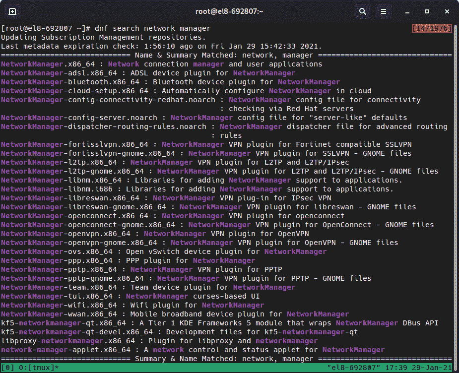
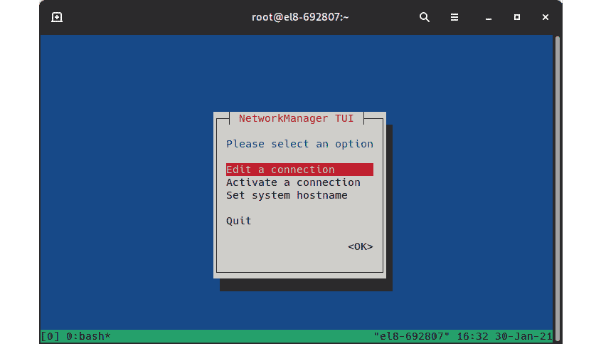
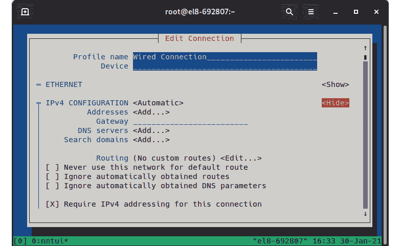
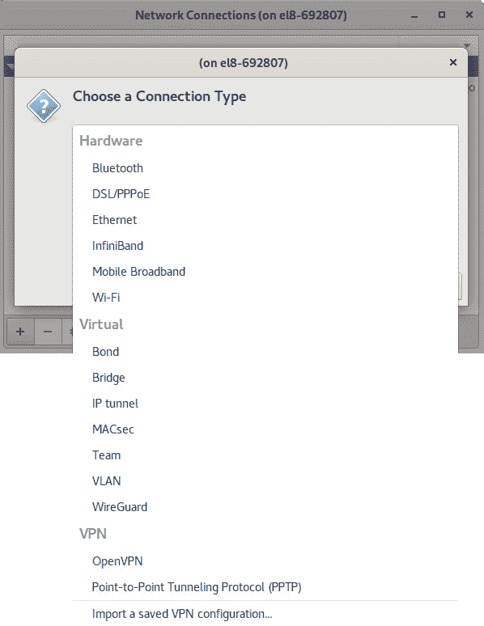
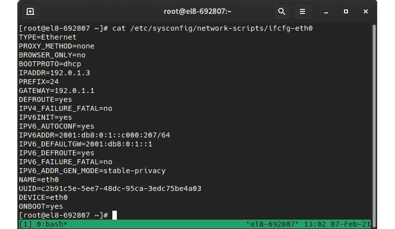
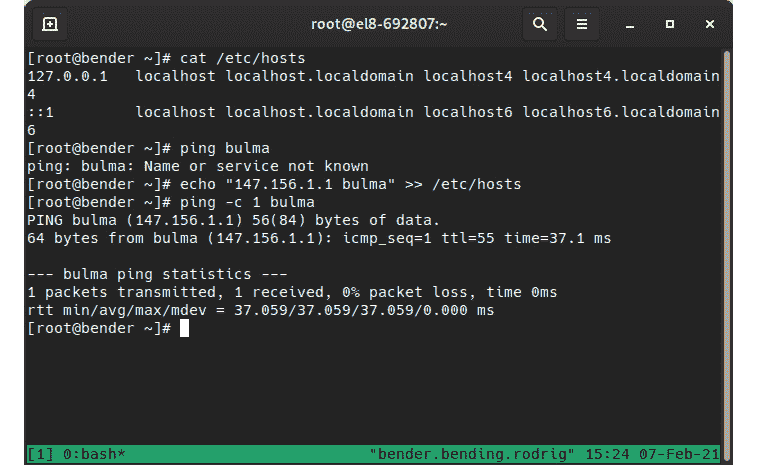

# 六、启用网络连接

在第一章安装系统时，我们启用了网络接口。 然而，网络配置是，或者可以是，甚至不止于此。

连接到网络的服务器可能需要额外的接口来配置其他网络; 例如,对于达到备份服务器,执行内部服务从其他服务器,甚至直接访问存储,不是通过存储阵列网络(SAN)作为本地驱动器,而是作为,例如,**互联网小型计算机系统接口**(**iSCSI)驱动器。**

 **此外，服务器可以使用冗余网络功能，以确保在其中一个卡、交换机等出现故障时，仍然可以访问服务器并正常执行。

在本章中，我们将学习如何使用不同的方法定义 RHEL 机器的网络配置，并执行一些基本的网络故障排除。

这些知识将是关键，因为服务器通常用于向其他系统提供服务，为此我们需要网络。

在本章中，我们将涵盖以下主题:

*   探索 RHEL 中的网络配置
*   配置文件和 NetworkManager
*   配置 IPv4 和 IPv6 网络接口
*   配置主机名和主机名解析(DNS)
*   防火墙配置概述
*   测试连接

让我们动手建立网络吧!

# 技术要求

您可以在[*第一章*](01.html#_idTextAnchor014)，*安装 RHEL8*中继续使用我们在本书开头创建的虚拟机。 此外,测试网络通信,它可能是有用的创建第二个虚拟机或重用我们在前面章节中创建用于测试**网络时间协议**(【显示】国家结核控制规划)配置,我们将使用它来检查连接。 所需要的任何其他软件包将在文本中说明。 本章所需的其他文件可从[https://github.com/PacktPublishing/Red-Hat-Enterprise-Linux-8-Administration](https://github.com/PacktPublishing/Red-Hat-Enterprise-Linux-8-Administration)下载。

# 在 RHEL 中探索网络配置

一个网络由组成，这些不同的设备被连接在一起，这样信息和资源就可以在它们之间共享; 例如，Internet 访问、打印机、文件等等。

网络从计算开始就存在了。 最初，最常见的是非基于 IP 的网络，它通常用于在局域网内的计算机之间共享数据，但随着 internet 服务的扩展和应用或远程服务的需求，IP 网络得到了扩展，intranet 的概念被引入。 **的传输控制协议/互联网协议**(**TCP / IP****)被用来运输,和应用开始更像互联网服务(甚至是基于他们)。**

基于 ip 网络的迁移也适应其他协议如**网络基本输入/输出系统**(**NetBIOS),这样他们就可以在其上运行(这是工作上的**NetBIOS 扩展用户界面**(【显示】NetBEUI**), 甚至如果其他网络如【病人】InfiniBand 或**远程直接内存访问**(【t16.1】RDMA)仍在使用,他们不是一样普遍 TCP / IP)。

当然，TCP/IP 是建立在其他协议之上的。 您可以在[https://www.redhat.com/sysadmin/osi-model-bean-dip](https://www.redhat.com/sysadmin/osi-model-bean-dip)查看 OSI 层定义。 然而，仍然涉及到一些概念。 当我们熟悉 TCP/IP 和网络时，我们将讨论这些。

在我们进入实际细节之前，我们需要澄清一些常见的 TCP/IP 和网络关键字，我们将从现在开始使用:

*   **IP 地址**:用于与网络上的其他设备交互的地址。
*   **网络掩码**:用于确定哪些设备在邻居中。 它可以通过掩码或网络大小来表示，如`255.255.255.0`或`/24`。
*   **网关**:这个设备的 IP 地址，当目标设备在我们的网络掩码之外时，它将获取我们的所有流量，因此我们不能直接到达它。
*   **DNS**:这是一个或多个服务器的 IP 地址，它将**域名**转换为 IP 地址，以便主机能够连接到它们。
*   **MAC 地址**:物理接口地址。 它对每张卡片都是唯一的，并帮助识别网络中的卡片，以便向它发送适当的流量。
*   **网络接口卡(NIC)**:此卡允许我们的设备连接到网络。 它可能是无线的，有线的，等等。
*   **ESSID (Extended Service Set Identification)**:这是无线网络的命名方式。
*   **Virtual Private Network (VPN)**:此是在客户端和服务器之间创建的虚拟网络。 一旦建立，它允许您直接连接到服务，就好像它们是本地的一样，即使客户机和服务器在不同的地方。 例如，VPN 网络允许远程工作人员使用他们的私有 internet 连接到他们的公司网络。
*   **Virtual Local Area Network (VLAN)**:这允许我们在实际连接之上的上定义虚拟网络。 然后，我们可以使用特定的报头字段让网络设备正确地理解和处理它们。
*   **IPv6**:这是**IPv4**的替代协议，而**IPv4**仍然是当今网络中的主要协议。

在接下来的章节中，我们将使用其中的一些术语来解释网络是如何建立的，以及在**Red Hat Enterprise Linux**(**RHEL**)系统中如何定义。

一般情况下，当系统连接时，网络上的设备之间会建立一些关系。 有时，一些主机是服务的提供者，通常被称为服务器，而消费者被称为客户端。 当网络中的系统执行角色时，这些网络称为**点对点**(**点对点**)网络。

在下一节中，我们将熟悉配置文件和在系统中配置网络的不同方法。

# 了解配置文件和 NetworkManager

既然我们已经学习了一些联网的关键字和概念，现在是时候看看我们可以在哪里使用它们使我们的系统联网了。

传统上，网络接口是通过系统中的`/etc/sysconfig/network-scripts/`文件夹下的文本文件配置的。 这些脚本是通过`network-scripts`包提供的实用程序处理的，这些实用程序负责使用定义的配置启动网络堆栈并运行。

重要提示

虽然`network-scripts`包是可用的和可以安装,它被认为是**弃用**,,这意味着提供的包和可用但可能消失在未来主要版本的操作系统,所以他们只会提供给缓解过渡向更新的方法。

*NetworkManager*是一个创建于 2004 年的实用程序，它让桌面用户更容易地配置和使用网络。 在那个时候，所有的配置都是通过文本文件完成的，它或多或少是静态的。 一旦一个系统被连接到网络上，信息几乎不会改变。 随着无线网络的采用，需要更多的灵活性来自动化和简化通过不同配置文件、vpn 等连接到不同网络的过程。

使填补预算缺口,旨在创建一个组件,用于许多发行版,但从一个新的角度来看,例如,它查询**硬件抽象层(HAL**)在启动时了解可用网络设备及其变化。****

 **想象一个笔记本电脑系统; 它可以连接到有线电缆上，当你把它移到另一个位置或隔间时，它可以断开，可以连接到无线网络，等等。 所有这些事件都中继到 NetworkManager，而 NetworkManager 负责重新配置网络接口、路由、使用无线网络进行身份验证，并使用户的生活比传统的轻松得多。

提示

连接到系统的硬件可以通过几个命令查询，这取决于硬件是如何连接的; 例如，通过`lsusb`、`lspci`或`lshw`等实用程序(分别通过安装`usbutils`、`pciutils`和`lshw`包提供)。

在下面的截图中，我们可以看到与 NetworkManager 相关的可用包，通过`dnf search network manager`命令获取:



图 6.1 -安装在 Red Hat Enterprise Linux 8 系统中的 networkmanagermanager 相关软件包

`NetworkManagermanager`被配置为`/etc/NetworkManager`文件夹中的文件，特别是`NetworkManager.conf`以及该文件夹中可用的文件:

*   `conf.d`
*   `dispatcher.d`
*   `dnsmasq-shared.d`
*   `dnsmasq.d`
*   `system-connections`

不记得调度员是什么? 记住使用`man networkmanager`来获取详细信息!

NetworkManager 的手册页解释说，这些脚本是根据网络事件的字母顺序执行的，并且会收到两个参数:事件的设备名和动作。

您可以执行以下几个操作:

*   `pre-up`:接口已连接到网络，但尚未激活。 该脚本必须在连接被通知为激活之前执行。
*   `up`:接口已被激活。
*   `pre-down`:接口正处于去激活状态，但尚未断开网络连接。 在强制断开的情况下(丢失无线连接或丢失运营商)，这将不会执行。
*   `down`:接口已去激活。
*   `vpn-up`/`vpn-down`/`vpn-pre-up`/`vpn-pre-down`:与上述接口类似，但用于 VPN 连接。
*   `hostname`:主机名已更改。
*   `dhcp4-change`/`dhcp6-change`:DHCP 租期发生了变化(更新、反弹等)。
*   `connectivity-change`:连接过渡，如无连接、系统上线等。

现在，我们已经学习了一点关于 NetworkManager 的知识，以及它是如何工作和设计的，让我们学习如何配置网络接口。

# 配置 IPv4 和 IPv6 网络接口

有几种方法来配置网络接口和几种网络配置。 这些将帮助我们确定需要做什么以及所需的参数和设置。

让我们来看一些例子:

*   一个服务器可能有两个或多个**网络接口卡**(**网卡**)用于冗余，但一次只有一个是活动的。
*   服务器可能使用中继网络，并要求我们在其上定义 vlan 来访问或提供网络中的不同服务。
*   可以通过组合两个或更多的 nic 来提供更多的输出和冗余。

配置也可以通过几种方式执行:

*   `nmtui`:基于文本的接口，配置网络
*   `nmcli`:用于 NetworkManager 的命令行界面
*   `nm-connection-editor`:可用于图形环境的图形工具
*   Via text configuration files

    重要提示

    在编辑网络配置之前，请确保您可以通过其他方式访问正在配置的系统。 对于服务器，这可以通过远程管理卡或物理控制台访问来完成。 配置中的错误可能会导致系统无法访问。

在我们继续之前，让我们了解一下 IPv4 和 IPv6

## IPv4 和 IPv6… 这是什么意思?

IPv4 是在 1983 年创建的，使用 32 位地址空间，它提供了 2³²唯一的地址(`4,294,967,296`)，但从这些可能的地址中，大块被保留用于特殊用途。 IPv6，在 2017 年被批准为互联网标准，是撰写本文时的最新版本，使用 128 位地址空间代替; 即 2¹²会被⁸(3.4 x 10³)。**** 

**长话短说,IPv4 地址的数量似乎还是很大的,但是今天,在手机、平板电脑、电脑、笔记本电脑、服务器、灯泡、智能插座上,和所有其他的**物联网**(**物联网)设备需要一个 IP 地址,这个数字已经的公共 IP 地址, 这意味着不可能分配更多。 这引起了一些**互联网服务提供商【显示】(****ISP)使用电信等级网络地址转换技术,如**【病人】(**CGNAT**),类似于私人网络做什么,导致一些设备出现的所有流量来自只有一个 IP, 以及让设备在两个网络(路由器)上交互，以便从传出和传入包进行正确的路由到原始请求者。********

那么为什么没有 IPv6 呢? 主要的问题是 IPv4 和 IPv6 是不可互操作的，即使 IPv6 在 1998 年是一个草案，并不是所有的网络设备都兼容它，可能还没有经过测试。 查看[https://www.ripe.net/support/training/videos/ipv6/transition-mechanisms](https://www.ripe.net/support/training/videos/ipv6/transition-mechanisms)了解更多细节。

在下一节中，我们将学习如何使用一个基于文本的用户界面来配置名为`nmtui`的 NetworkManager 网络接口。

## 配置 nmtui 接口

`nmtui`提供文本配置界面。 这是你在终端上运行`nmtui`时看到的初始屏幕:



图 6.2 - nmtui 欢迎屏幕显示一个包含可能执行的操作的菜单

让我们研究一下接口可用的选项。 在本例中，我们选择**Edit a connection**。 在出现的屏幕上，向下移动并编辑我们系统中的**有线连接**选项，以到达以下屏幕:



图 6.3 -编辑连接页面与 IPv4 选项展开

将很难显示每个步骤的截图，因为文本界面的优点之一是我们可以将许多选项压缩到一个简单的屏幕中。 然而，前面的截图让我们很容易理解每个必需的参数:

*   IP 地址
*   子网掩码
*   网关
*   搜索域
*   路由

如您所见，有一些复选框用于忽略在将连接设置为`Automatic`时获得的路由或 DNS 参数。 此外，接口还有其他选项:`Disabled`、`Link-Local`、`Manual`和`Shared`。

让我们讨论一下`Automatic`选项，这意味着接口将被设置为自动配置。 这是配置中最常见的设置之一。 但这并不意味着一切都是神奇的。 让我们再深入研究一下。

在一个网络(公司网络、私有网络和其他网络)中，通常有一个特殊的服务或服务器执行**动态主机路由协议**(**DHCP**)。 DHCP 是一种运行在 TCP/IP 之上的协议，它允许您动态地配置主机，使用以前由网络管理员或某些设备及其默认设置进行的配置。

DHCP 允许您(从客户端)自动配置网络配置的许多方面，例如 IP、子网掩码、网关、DNS、搜索域、时间服务器等等。 接收到的配置被赋予一个在一段时间内有效的租约。 在此之后，系统尝试更新租期，或者如果系统正在断电或断开连接，租期将被释放。

DHCP 配置通常被认为是与动态 ip,但请记住,DHCP 服务器可以使用两种不同的方法:一个 IPs 池,可以重用的不同系统连接和固定映射静态 ip 的 MAC 地址。

让我们以为例，考虑一个**Small Office - Home Office**(**SOHO**)网络，在`192.168.1.0/24`子网中有一个私有 IP 范围。

由于子网(`/24`)，我们可以定义 ISP 路由器在 IP`192.168.1.1`上，这意味着 IPv4 地址的最后一部分可以从 0 到 255。

使用该 IP 范围，我们可以设置主机来获得动态配置，并从最近 100 个 IP 池中获取动态 IP，将最开始的 IP 留给固定设备(即使它们动态获得配置)，比如打印机、存储设备等等。

正如前面提到的，我们可以为服务器创建预订，但通常，对于始终拥有相同地址的设备，配置静态地址也是常见的做法。 这样，如果 DHCP 服务器不可用，这些服务器将仍然可以从其他服务与有效租约或其他服务器/设备配置静态地址。

提示

为了熟悉这个概念，IP 地址在 IPv4 中用点表示法表示，用四组数字分隔，例如`192.168.2.12`，而在 IPv6 中，数字用`:`分隔; 例如`2001:db8:0:1::c000:207`。

## 使用 nm-connection-editor 配置接口

如果我们的系统安装了图形环境，而我们的测试系统没有这样做，我们可以使用图形配置工具。 如果没有安装，继续在图形会话内的 shell 控制台中执行`dnf install nm-connection-editor`。

提示

如果需要安装图形界面，可以运行`dnf groupinstall "Server with GUI" -y`命令或在安装过程中选择`dnf groupinstall "Server with GUI" -y`命令。

在下面的截图中，我们可以看到通过执行`nm-connection-editor`打开的窗口。 它类似于本章前面`nmtui`所示的文本界面:


图 6.4 - nm-connection-editor 的初始屏幕

在这里，我们可以看到**+**、**-**和*齿轮*按钮，它们分别用于添加/删除或配置突出显示的连接。

点击**连线**选项，然后点击**齿轮**图标，打开详细信息:


图 6.5 -编辑网络连接的对话框

在对话框中，我们可以看到在更简单的命令行配置工具中拥有的字段，以及额外的字段和针对每组选项的不同选项卡。

需要记住的重要字段是那些在**General**选项卡中以优先级自动连接的字段。 这使我们的系统能够在连接可用时自动启用该网卡。

通过检查不同的选项卡，您可以发现有很多选择，比如标记要测量的连接。 这意味着，例如，如果通过移动电话连接，如果网络使用不受控制，可能会指定额外的费用。

当我们创建额外的网络,我们可以定义物理或虚拟设备基于包我们已经安装在我们的系统(如果你还记得我们看到包的列表时,寻找使我们包了不同的 vpn, wi - fi,和其他人),我们可以看到下面的截图:



图 6.6 - nm-connection-editor 与插件 Wi-Fi, OpenVPN, PPTP，蓝牙，和更多安装

服务器环境,最常见的网络类型是**债券**,**,和**(【显示】以太网**的一部分),而对于台式机,最常见的网络类型是**以太网**,【病人】wi - fi、和**宽带。****

 **每种类型的连接都有一些要求。 例如，对于绑定、桥梁和团队，我们需要不止一个可以组合的网络接口。

现在，让我们在下一节中回顾一下`nmcli`的用法。

## 配置 nmcli 接口

`nmcli`是 NetworkManager 的命令行界面。 它不仅允许我们检查系统中的网络接口，而且还允许我们配置系统中的网络接口，即使使用它可能需要比`nmtui`所需的更多的内存技能，它也允许用户和管理员使用脚本功能来自动化系统的网络设置。

提示

大多数命令允许我们使用自动补全; 也就是说，按下*Tab*键将使用命令行上的自动补全列表来建议语法。 例如，在命令行上输入`nmcli dev`，然后按*Tab*将自动完成命令到`nmcli device`。 在这种情况下，它可能不那么关键，因为`nmcli`将两个参数都视为有效，但对于其他参数，必须正确地拼写它，才能使代码正常工作。

让我们用`nmcli dev`开始检查系统中可用的连接，然后使用`nmcli con show`检查其详细信息:


输入 n nmcli 和 nmcli 歌剧院

当控制一个网络连接时，例如，当使用`nmcli con up "Wired Connection"`或使用`nmcli con down ens3`禁用它时，我们应该记住我们对 NetworkManager 的解释: 如果该连接在系统中可用，NetworkManager 可能会在断开连接后重新激活该连接，因为所需的连接和设备在我们的系统中可用。

现在，让我们创建一个新的接口来演示通过 IPv4 添加一个新连接的过程:

```sh
nmcli con add con-name eth0 type ethernet \
 ifname eth0 ipv4.address 192.168.1.2/24 \
 ipv4.gateway 192.168.1.254
```

我们可以在 IPv6 上做同样的事情:

```sh
nmcli con add con-name eth0 type ethernet \
 ifname eth0 ipv6.address 2001:db8:0:1::c000:207/64 \
 ipv6.gateway 2001:db8:0:1::1 ipv4.address \
 192.0.1.3/24 ipv4.gateway 192.0.1.1
```

一旦前命令被执行,我们可以检查已定义的网络连接`nmcli connection show eth0`和验证适当的设置(当然,通过`nmtui`、`nm-connection-editor`,或磁盘上创建的文本文件中存储的信息共享和系统)。

当我们回顾`nmcli connection show interface`的输出时，输出包含了一些用点分隔的键，如下所示:

*   `ipv4.address`
*   `ipv4.gateway`
*   `ipv6.address`
*   `ipv6.gateway`
*   `connection.id`

我们可以使用这些键通过`nmcli con mod $key $value`定义新值，如下例所示:


图 6.8 -修改网络连接以更改连接 ID 和 IP 地址的名称的示例

当然，在完成上述测试后，我们也可以将连接移除，以避免我们的系统与`nmcli con del datacenter`出现问题。

可以使用以下命令修改`nmcli`工具的连接:

*   `nmcli con show`:显示连接状态。
*   `nmcli con show NAME`:显示名为`NAME`的连接的详细信息。
*   `nmcli dev status`:显示系统中设备的状态。 注意，这意味着**设备**，而不是可能正在使用这些设备的连接。
*   `nmcli con add con-NAME`:添加新连接。
*   `nmci con mod NAME`:修改连接。
*   `nmcli con up NAME`:连接。
*   `nmcli con down NAME`:关闭一个连接(该连接仍然可以被 NetworkManager 重新启用)。
*   `nmcli con del NAME`: Removes a connection definition from the system.

    提示

    检查`man nmcli-examples`到，找到系统文档中包含的更多示例。

## 配置文本文件接口

在前面的小节中，我们探讨了如何使用不同的方法配置网络，但是最后，所有这些配置最终都作为接口定义文件写入磁盘(这也提供了与前面提到的`network-scripts`的向后兼容性)。

与其从头开始创建接口定义，不如让我们看看在使用以下命令创建接口时`nmcli`做了什么:

```sh
nmcli con add con-name eth0 type ethernet ifname eth0 ipv6.address 2001:db8:0:1::c000:207/64 ipv6.gateway 2001:db8:0:1::1 ipv4.address 192.0.1.3/24 ipv4.gateway 192.0.1.1
```

前面的命令将生成`/etc/sysconfig/network-scripts/ifcfg-eth0`文件，我们可以在下面的截图中看到:



图 6.9 - /etc/sysconfig/network-scripts/ifcfg-eth0 连接定义的内容

可以看到，在默认情况下，我们使用`eth0`设备指定了`Ethernet`(`TYPE`)类型的网络接口，并提供了用于 IPv4 和 IPv6 寻址和网关的值。 键的名称与用`nmcli`定义的键的名称不同，原因是我们具有向后兼容性。

注意，在上面的示例中，`ONBOOT`字段已经设置为`yes`，这意味着该接口将在系统启动时自动启用。 如果我们使用`nmcli`，我们可以通过`connection.autoconnect`配置键检查状态，默认情况下，这也将使连接在引导时自动启用。

我们可以直接编辑这些文件，但是为了让 NetworkManager 知道将要引入的更改，必须执行`nmcli con reload`。 这将同步对单个文件所做的更改。

例如，我们可以更正前面文件中的一个设置，因为对于静态定义的 ip，定义`BOOTPROTO=none`是一种常见的做法。 使用您喜欢的方法修改`/etc/sysconfig/network-scripts/ifcfg-eth0`文件(`vim`、`nano`、`sed`或其他)。 我们可以通过`nmcli`查看其他细节，也可以修改 IP 地址。

注意，在下面的截图中，在我们发出`reload`命令之前，这些更改不会出现在`nmcli`中:


图 6.10 -编辑接口定义的过程在 nmcli 中没有显示出来，直到我们重新加载连接

当然，我们也可以从零开始创建网络定义，在 NetworkManager 出现并传播之前，这种方法被用于脚本，包括通过 kickstart 文件自动安装的 Anaconda。

让我们在 IPv4 中创建一个简单的网络定义，如下截图所示:


图 6.11 -使用配置文件(可以是脚本的一部分)创建连接

在这里，您可以不仅可以看到连接的创建，还可以看到之前的状态、接口定义、系统的 NetworkManager 视图，以及重新加载的配置文件的比较。 请注意，设备列是空的，因为我们为该连接定义了一个接口，而这个接口在我们的系统中不存在。

重要提示

网络接口定义可能成为一个噩梦，因为接口名称本身受制于几个规则，例如接口在总线中的位置、是否之前看到过它等等。 通常，一旦在系统中检测到网卡，就会编写一个自定义规则，将接口的 MAC 地址与自定义命名约定相匹配。 这样它就不会在重新启动或新软件更新改变我们必须枚举卡片的方式时发生改变。 你可以阅读更多关于这个主题通过查看官方 RHEL8 手册[https://access.redhat.com/documentation/en-us/red_hat_enterprise_linux/8/html/configuring_and_managing_networking/consistent-network-interface-device-naming_configuring-and-managing-networking](https://access.redhat.com/documentation/en-us/red_hat_enterprise_linux/8/html/configuring_and_managing_networking/consistent-network-interface-device-naming_configuring-and-managing-networking)。

现在我们已经回顾了在系统中配置网络的不同方法，让我们了解一下命名分辨率。

# 配置主机名和主机名解析(DNS)

记住 IP 地址，无论它们是 IPv4 地址还是 IPv6 地址，都可能成为一场噩梦。 为了使事情更简单，对主机名和 DNS 使用了更人性化的方法，因为我们可以将那些更容易记住的名称转换为系统用于连接的 IP 地址。

主机名是我们分配给主机以识别它们的名称，但是当它们被用于 DNS 服务器之外时，我们必须有其他主机能够*将*解析为它们可以连接到的 IP 地址。

我们可以使用`hostname`命令查看或临时修改当前主机名，如下图所示:


图 6.12 -查询和更改主机的主机名

记住，这种变化只是暂时的; 只要我们重启服务器，它就会使用配置好的服务器。

要定义一个新的配置主机名，我们将使用`hostnamectl set-hostname`命令，如下面的截图所示:


图 6.13 -检查前面配置的主机名和通过 hostnamectl 定义的新主机名

注意在前面的示例中，我们有`Transient hostname`和`Static hostname`，这指的是用`hostname`而不是`hostnamectl`定义的名称的临时状态。

当涉及到名称解析时，我们可以采用几种方法。 当然，一种是使用 DNS 服务器，我们稍后将在本节中解释，但还有其他方式。

通常，系统有几个解析器，它们在`/etc/nsswitch.conf`配置文件中定义。 这些解析器不仅用于网络命名，而且还用于解析用户，例如，企业**LDAP**服务器可能用于定义用户、密码等。 默认情况下，`nsswitch.conf`指示我们的系统使用`hosts: files dns myhostname`来解析这个条目。

这意味着我们使用`/etc/`目录中的文件作为我们的第一个源文件。 在主机名的情况下，这指的是`/etc/hosts`文件。 如果在该文件中定义了一个条目，则将使用指定的值; 如果不是，则`/etc/resolv.conf`文件将决定如何继续其决议。 这些文件，特别是`resolv.conf`，是在部署系统和激活连接时配置的。 如果使用自动配置，NetworkManager 会负责更新通过 DHCP 获取的值，如果使用手动配置，则会负责更新指定的 DNS 服务器。

在以下截图中,我们可以看到定义的条目已经在我们的`/etc/hosts`文件,如何 ping 主机失败,因为名字不存在,以及如何,后手动`/etc/hosts`将一个条目添加到文件中,我们的系统是能够达到:



图 6.14 -向本地系统添加一个静态主机条目

正如前面提到的，DNS 解析是通过配置`/etc/resolv.conf`完成的，默认情况下，该配置包含一个`search`参数和一个`nameserver`参数。 查看`resolv.conf`的手册页，可以得到常见参数的描述:

*   `nameserver`:包含要使用的命名服务器的 IP。 目前，系统中的`resolv`库最多只能使用三个条目(每个条目在自己的行上)。 解析每次按顺序执行，所以如果一个服务器失败，它将超时，然后尝试下一个服务器，以此类推。
*   `domain`:本地域名。 它允许我们对主机使用相对于本地域的简短名称。 如果没有列出，则根据系统的主机名(第一个“`.`”之后的所有内容)计算它。
*   `search`: By default, this contains the local domain name, and it's the list of domains we can attempt to use to resolve the short name that's provided. It's limited to 6 domains and 256 characters. Domain and search are mutually exclusive, since the last one in the file is the one to be used.

    提示

    DNS 解析通过向特定的服务器(DNS)请求域的相关数据来工作。 这是以分层的方式进行的，最顶端的通用服务器被称为**根服务器**。 DNS 服务器不仅包含用于将主机名转换为 ip 的注册表或条目，而且还包含关于发送电子邮件时使用的邮件服务器、安全性验证细节、反向条目等信息。 此外，DNS 服务器可以通过返回一些域的无效 ip 来阻止对服务的访问，或者通过使用比 ISP 提供的更快的 DNS 服务器来加速互联网导航。 当注册域名时，在根表中创建一个新的条目，指向 DNS 服务器。 这将处理域解析，稍后，这些条目将被填充和缓存在互联网上以更快的解析。

如果我们想修改为一个连接定义的 DNS 服务器，记住使用`nmcli con mod NAME ipv4.dns IP`(或 IPv6 等效)，并预先使用`+`符号，如`+ipv4.dns`，向 DNS 服务器列表添加一个新条目。 对`resolv.conf`的任何手动更改都可能被覆盖。

现在我们已经了解了 DNS 的工作原理以及系统如何使用它，接下来让我们看看如何保护系统网络访问。

# 防火墙配置概述

当一个系统连接到网络时，许多正在运行的服务可以从其他系统到达。 这就是连接系统的目的。 然而，我们也希望保持系统的安全，远离未经授权的使用。

防火墙**是位于网卡和服务之间的软件层，它允许我们微调什么是允许的，什么是不允许的。**

 **我们不能像往常一样完全阻塞所有进入系统的连接，进入的连接是系统请求的响应。

连接通过一个名为**netfilter**的内核框架被阻止，该框架被防火墙软件用来修改数据包的处理方式。 **Nftables【显示】是新过滤器和包分类器子系统,提高 netfilter 代码的部分,但保留了建筑和提供更快的处理在其他功能只使用一个接口(**【病人】非功能性测试),因此不以为然的旧框架如`iptables`、`ip6tables`,`ebtables`和`arptables`。****

重要提示

如前所述，关于网络配置，防火墙中的错误配置可能会将您锁定在系统之外，因此在设置一些限制性规则时要非常小心，以便在远程访问系统时可以再次登录系统。

防火墙**是 nftables 框架的前端，在它被采用之前，通过 iptables 与 netfilter 接口。 在绝大多数情况下，防火墙应该能够处理过滤的需求，所以它是编辑规则的推荐前端。 可以通过安装`firewalld`包在系统上安装它，该包应该包含在基本安装中。 一旦安装，它将提供`firewall-cmd`命令与服务交互。**

 **Firewalld 使用了区域的概念，这允许我们为每个区域预定义一组规则。 这些也可以分配给网络连接。 这是更相关的，例如，对于可能在连接中漫游的笔记本电脑，当您使用家庭或公司连接时，它们可能有一些默认设置。 然而，当你在自助餐厅使用 Wi-Fi 时，它们会默认设置为更安全的。

Firewalld 还使用预定义的服务，因此防火墙知道应该根据服务和已启用的区域启用哪些端口和协议。

让我们来看看可用的区域和一些关于 home zone 的更多细节:


图 6.15 -可用区域和区域主的配置

可以看到，已经定义了几个区域:

*   `public`:新增接口的缺省区域。 它允许我们座舱 SSH 和 DHCP 客户端，并拒绝所有传入的流量与传出的流量无关。
*   `block`:拒绝所有传入的流量，除非它与传出的流量相关。
*   `dmz`:拒绝所有传入的流量，除非是与传出或 SSH 连接相关的。
*   `drop`:丢弃所有与出包无关的入包(甚至 ping 也不例外)。
*   `external`:阻断所有流入的流量，除了与流出相关的流量。 它还允许 SSH，并将流量伪装成来自这个接口。
*   `home`:除 public 外，还允许`smb`、`mdns`。
*   `internal`:基于 home zone。
*   `trusted`:允许所有传入流量。
*   `work`:阻断所有入方向的流量，除了与出方向、SSH/座舱/DHCP 相关的流量。

接下来，我们将学习在配置防火墙时如何使用这些区域。

## 配置防火墙

所示的介绍这一节中,可以配置防火墙通过`firewall-cmd`命令(以及驾驶舱 web 界面,在这本书所述第四章[*【4】【5】,*工具,常规操作*)。 最常用的命令选项如下:*](04.html#_idTextAnchor059)

*   `firewall-cmd --get-zones`:列出可用分区。
*   `firewall-cmd --get-active-zones`:列出已分配的活动区域和接口。
*   `firewall-cmd --list-all`:转储当前配置。
*   `firewall-cmd --add-service`:向当前分区添加服务。
*   `firewall-cmd --add-port`:添加端口/协议到当前 zone。
*   `firewall-cmd --remove-service`:从当前区域移除服务。
*   `firewall-cmd --remove-port`: Removes the port/protocol from the current zone.

    重要提示

    注意，在前面的命令之后，需要提到端口号和服务名称来添加或删除服务/端口。

*   `firewall-cmd --reload`:从保存的数据重新加载配置，从而丢弃运行时配置。
*   `firewall-cmd –get-default-zone`:获取默认区域。
*   `firewall-cmd --set-default-zone`:定义要使用的默认区域。

例如，当我们在系统中安装一个 HTTP 服务器(用于服务网页)时，TCP 上的端口`80`必须启用。

让我们在示例系统中通过安装、运行和打开 HTTP 端口来尝试一下:

```sh
dnf –y install httpd
systemctl enable httpd
systemctl start httpd
firewall-cmd –add-service=http
curl localhost
```

最后一个命令将向本地`http`服务器发起请求以获取结果。 如果您可以访问其他系统，您可以尝试连接到服务器的 IP，我们一直在使用该服务器来监视系统提供的默认 web 页面。

在下面的屏幕截图中，我们可以看到`curl localhost`命令的输出:


图 6.16 -请求由系统托管的 web 页面时 curl 的输出

至此，我们已经回顾了如何配置一些基本的防火墙规则，因此我们准备检查网络的连通性。

# 测试网络连接

在前面的部分中，我们与定义、限制或允许连接到系统的网络接口、地址和防火墙规则进行了交互。 在本节中，我们将回顾一些基本工具，这些工具可用于验证网络连接是否存在。

请注意，以下命令假设防火墙没有设置为严格模式，并且我们可以使用**Internet 控制消息协议**(**ICMP**)到达承载该服务的服务器。 在安全的网络中，服务可能正在工作，但不响应 ping -它可能只响应服务查询本身。

这里有几个我们可以使用的命令，因此考虑以下诊断问题的建议:

*   检查本地接口的 IP 地址、子网掩码和网关。
*   使用网关 IP 地址的`ping`命令验证网络配置是否正确。
*   使用`ping`命令 ping`/etc/resolv.conf`中的 DNS 服务器，查看是否可达。 也可以使用`host`或`dig`命令查询 DNS 服务器。
*   如果假设有外部网络连接，尝试连接外部 DNS 服务器，如`8.8.8.8`或`1.1.1.1`，或者使用`curl`或`wget`请求一些已知服务的网页; 如`curl nasa.gov`。

这将根据您对测试的深入程度，大致了解问题可能在哪里。 请记住，还有其他工具，如`tracepath`，可以显示 TCP 包到达目的地之前的跳数。 每个命令的手册页将为您提供使用提示和示例。

在下面的截图中，你可以看到`tracepath`在一个 web 服务器上的输出:


图 6.17 - tracepath 命令对西班牙瓦伦西亚大学 web 服务器的输出

正如我们所看到的，在数据包到达目标主机之前，共有 11 个步骤在不同服务器上执行。 这使我们能够了解包如何通过 internet 到达目标系统。

# 总结

在本章中，我们学习了如何使用不同的方法配置网络接口，这些方法可以是手动交互，也可以是通过脚本或自动化配置的方法。

还介绍了一些网络问题的故障排除，以帮助我们找到可能发生的一些基本错误。

正如我们在本章导言中提到的，网络是我们的系统到达其他服务并向其他系统提供服务的基础。 我们还介绍了更复杂的网络设置的想法，这不在 RHCSA 级别的范围内，但至少熟悉我们将在我们的职业生涯中使用的关键字是有趣的。

在下一章中，我们将讨论一些与安全相关的重要主题，如添加、打补丁和管理系统中的软件。******