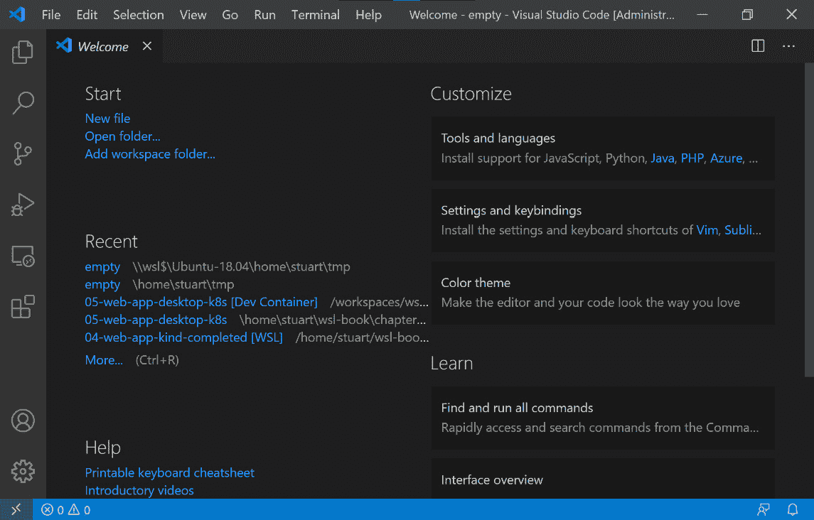
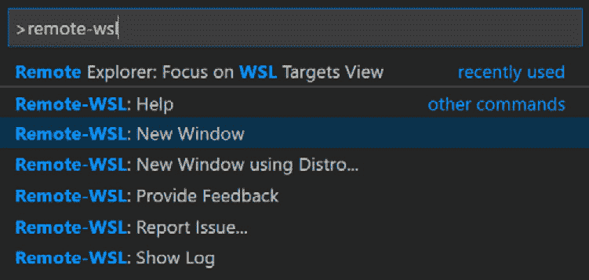

# 九、Visual Studio Code 和 WSL

到目前为止，本书的重点一直放在 wsdl 和直接使用 wsdl 上。 在本章中，我们将进一步讨论如何在开发应用时使用 WSL。 特别地，在本章中，我们将探索来自微软的免费编辑器 Visual Studio Code。

我们已经看到了 WSL 互操作性如何允许我们从 Windows 访问 WSL 发行版中的文件。 Visual Studio Code 通过在 Windows 中连接到运行在我们的 WSL 发行版中的支持编辑器服务的图形化编辑体验，使我们能够进一步深入。 通过这种方式，Visual Studio Code 为我们提供了一些功能，比如在 WSL 中运行的 Linux 应用的图形化调试体验。 这使我们能够使用 WSL 中的工具和依赖项，同时在 Visual Studio Code 中保持丰富的基于 windows 的编辑体验。

在本章中，我们将涵盖以下主要主题:

*   Visual Studio Code 简介
*   介绍 Visual Studio Code 远程
*   使用 remote - wsdl 的技巧

本章一开始我们将介绍 Visual Studio Code 并安装它。

# 介绍 Visual Studio Code

**Visual Studio Code**是微软的一个免费的、跨平台的、开放源代码的代码编辑器。 它提供了对 JavaScript(和 TypeScript)应用的即时支持，但也可以作为扩展来支持广泛的语言(包括 c++、Java、PHP、Python、Go、c#和 SQL)。 让我们从安装 Visual Studio Code 开始。

要安装 VisualStudio Code，请转到[https://code.visualstudio.com/](https://code.visualstudio.com/)，点击下载链接，并在下载完成后运行安装程序。 安装过程相当简单，但如果您想了解更多细节(包括如何安装内部版本，它提供每晚的构建)，请参见[https://code.visualstudio.com/docs/setup/setup-overview](https://code.visualstudio.com/docs/setup/setup-overview)。

安装完成后，启动 Visual Studio Code 会出现这样的窗口:



图 9.1 - Visual Studio Code 的截图

在这个截图中，你可以看到 Visual Studio Code 中的**欢迎**页面。 这个页面提供了一些常见操作(例如打开一个文件夹)、最近打开的文件夹(第一次安装时不会有这些)和各种方便的帮助页面的链接。

一般来说，Visual Studio Code 的基本用法对其他图形编辑器来说很熟悉。 文档中有一些伟大的介绍性视频([https://code.visualstudio.com/docs/getstarted/introvideos)以及书面提示和技巧(https://code.visualstudio.com/docs/getstarted/tips-and-tricks](https://code.visualstudio.com/docs/getstarted/introvideos))。 这些链接提供了许多方便的技术来帮助您最大限度地利用 Visual Studio Code，并推荐您提高工作效率。

有各种各样的选项打开一个文件夹开始:

*   在**欢迎**页面上使用**Open folder…**链接，如图 9.1*所示。 【5】*
*   使用**File**菜单中的**Open folder…**项。
*   使用命令面板中的**File: Open folder…**项目。

这里的最后一个选项是使用命令面板，这是一个功能强大的选项，因为它提供了在 Visual Studio Code 中搜索任何命令的快速方法。 您可以通过按*Ctrl*+*Shift*+*P*来访问命令面板:


图 9.2 -显示命令面板的屏幕截图

这个屏幕截图显示了打开的命令面板。 命令面板提供了对 Visual Studio Code 中的所有命令的访问(包括来自已安装扩展的操作)。 当您在命令面板中输入时，操作列表将被向下过滤。 在这张截图中，你可以看到我已经过滤了`file open`，这可以快速访问**文件:打开文件夹…**操作。 同样值得注意的是，命令面板还显示了命令的键盘快捷键，为学习常用命令的快捷键提供了一种简单的方法。

正如前面提到的,有一个广泛的扩展 Visual Studio Code,而这些可以浏览 https://marketplace.visualstudio.com/vscode 或者你可以选择**扩展:安装扩展**从命令面板直接浏览并安装在 Visual Studio Code。 扩展可以向 Visual Studio Code 添加特性，包括对新语言的支持、提供新的编辑器主题或添加新功能。 在本章的例子中，我们将使用 Python 应用，但这些原则适用于其他语言。 要了解更多关于添加语言支持的信息，请参见[https://code.visualstudio.com/docs/languages/overview](https://code.visualstudio.com/docs/languages/overview)。

在我们开始看样例应用之前，让我们先看一个扩展，它为 Visual Studio Code 添加了丰富的 WSL 支持。

# Visual Studio Code 远程的介绍

一种工作从 WSL 发行版的文件系统是文件打开使用`\\wsl$`分享 WSL 提供(详见[*第四章*](04.html#_idTextAnchor047)、【显示】Windows, Linux 互操作性,在*访问 Linux 文件从 Windows*部分)。 例如，我可以通过`\\wsl$\Ubuntu-20.04\home\stuart\wsl-book`访问发行版**Ubuntu-20.04**的主目录下的`wsl-book`文件夹。 然而，尽管这样做可以工作，但它增加了 Windows-to-Linux 文件互操作的成本，并且不能为我提供一个集成的环境。

在 Windows 上，如果我们将 Python 与 Visual Studio Code 的 Python 扩展一起安装，那么我们将获得运行和调试代码的集成体验。 如果我们通过`\\wsl$`共享打开代码，那么 Visual Studio code 仍然会给我们 Windows 的体验，而不是使用安装 Python 及其依赖项和来自 WSL 的工具。 然而，通过微软的**Remote-WSL 扩展**，我们可以解决这个问题!

通过远程开发扩展，Visual Studio Code 现在将体验分离到 Visual Studio Code 用户界面和 Visual Studio Code 服务器中。 服务器部分负责加载源代码、启动应用、运行调试器、启动终端进程以及类似的其他活动。 用户界面部分通过与服务器通信提供 Windows 用户界面功能。

有各种各样的远程扩展:

*   Remote-WSL，它在 WSL 中运行服务器
*   remote -SSH，它允许您通过 SSH 连接到远程机器来运行服务器
*   Remote-Containers，它允许您使用容器来运行服务器

我们将用本章剩下的时间来研究 Remote-WSL，下一章将讨论 remote - container。 有关 Remote-Development 扩展(包括 Remote-SSH)的更多信息，请参见 https://code.visualstudio.com/docs/remote/remote-overview。 让我们从 remote - wsdl 开始。

# 开始 Remote-WSL

的 Remote-WSL 扩展包括在远程开发扩展包(https://marketplace.visualstudio.com/items?itemName=ms-vscode-remote.vscode-remote-extensionpack),它提供了一个简单的方法来安装 Remote-WSL,远程 ssh, Remote-Containers 在一个单一的步骤。 如果您更喜欢只安装 Remote-WSL，那么在这里执行:[https://marketplace.visualstudio.com/items?itemName=ms-vscode-remote.remote-wsl](https://marketplace.visualstudio.com/items?itemName=ms-vscode-remote.remote-wsl)。

要遵循这一点，请确保您在 Linux 发行版中克隆了这本书的代码。 您可以在[https://github.com/PacktPublishing/Windows-Subsystem-for-Linux-2-WSL-2-Tips-Tricks-and-Techniques](https://github.com/PacktPublishing/Windows-Subsystem-for-Linux-2-WSL-2-Tips-Tricks-and-Techniques)找到代码。

示例代码使用 Python 3，如果您使用的是最新版本的 Ubuntu，那么应该已经安装了 Python 3。 您可以通过在您的 Linux 发行版中运行`python3 -c 'print("hello")'`来测试是否安装了 Python 3。 如果命令成功完成，则一切就绪。 如果没有，请参考 Python 文档中关于安装的说明:[https://wiki.python.org/moin/BeginnersGuide/Download](https://wiki.python.org/moin/BeginnersGuide/Download)。

现在让我们在 Visual Studio code 中打开示例代码。

## 用 Remote-WSL 打开一个文件夹

Remote-WSL 安装后,打开 Visual Studio Code,选择**Remote-WSL:从命令面板新窗口**(*Ctrl +*+【T7 转变】【显示】页):**

 *

图 9.3 -在命令面板中显示 remote - wsdl 命令的屏幕截图

这个屏幕截图显示了 Remote-WSL 扩展添加的新命令，选中了**Remote-WSL: new Window**。 这将打开一个新的 Visual Studio Code 窗口，在默认的 WSL 发行版中启动 Visual Studio Code 服务器并连接到它。 如果你想选择要连接到哪个发行版，选择**Remote-WSL: New Window using distro…**选项。

一旦新的 Visual Studio Code 窗口打开，窗口的最左下角将显示**WSL: Ubuntu-18.04**(或任何你打开的发行版)，表明这个 Visual Studio Code 实例通过 Remote-WSL 连接。

现在我们可以从命令面板中选择**File: Open Folder…**来打开示例代码。 在不通过 Remote-WSL 连接的情况下在 Visual Studio Code 中执行此操作时，这个将打开标准 Windows 文件对话框。 然而，由于我们连接了 Remote-WSL，这个命令现在会提示我们在我们连接的发行版中选择一个文件夹:


图 9.4 -显示 remote - wsdl 文件夹选择器的屏幕截图

这个屏幕截图显示了从 WSL 分发文件系统中选择要打开的文件夹。 注意，我将这本书的代码克隆到我的`home`文件夹中的`wsl-book`中。 根据您保存代码的位置，您可能有一个如`/home/<your-user>/WSL-2-Tips-Tricks-and-Techniques/chapter-09/web-app`这样的路径。 一旦你打开文件夹，Visual Studio 就会开始处理内容，如果你还没有安装 Python 扩展，Visual Studio 会提示你安装推荐的扩展:


图 9.5 -显示推荐扩展提示的屏幕截图

出现此屏幕截图中的提示是因为您刚刚打开的文件夹包含一个列出 Python 扩展名的`.vscode/extensions.json`文件。 出现提示时，可以单击**Install All**来安装扩展，也可以单击**Show Recommendations**在安装前检查扩展。 注意，即使你在使用 Remote-WSL 之前已经在 Visual Studio Code 中安装了 Python 扩展，你也可能会被提示:


图 9.6 -显示 Python 安装在 Windows 而不是 WSL 上的截图

这个截图显示了 Visual Studio Code 中的**EXTENSIONS**视图，表明 Python 扩展已经安装在 Windows 中，并提示我们为加载当前项目的发行版安装 Remote-WSL。 如果看到这种情况，请单击**Install**按钮将其安装到 WSL 中。

现在，我们已经有了运行在 Windows 上的 Visual Studio Code 用户界面，并连接到在我们的 WSL 发行版中运行的服务器组件。 服务器已经加载了 web 应用的代码，我们已经安装了 Python 扩展，它现在正在服务器中运行。

设置好之后，让我们看看如何在调试器下运行代码。

## 运行 app

运行应用,我们首先需要确保正确版本的 Python 扩展使用 Python(我们希望 Python 3)。要做到这一点,看在状态栏底部的 Visual Studio Code 窗口,直到你看到说**Python 2.7.18 64 位**或类似。 单击此部分会弹出 Python 版本选择器:


图 9.7 -显示 Python 版本选择器的截图

如图所示，版本选择器显示它检测到的任何 Python 版本，并允许您选择您想要的版本(这里，我们选择了 Python 3 版本)。 注意，这个列表中显示的路径都是 Linux 路径，这确认了 Python 扩展是，它以 WSL 的形式在 Visual Studio Code 服务器中运行。 如果您喜欢使用 Python 虚拟环境([https://docs.python.org/3/library/venv.html](https://docs.python.org/3/library/venv.html))并已为项目创建了一个虚拟环境，这些虚拟环境也将显示在此列表中供您选择。

在运行应用之前，我们需要安装依赖项。 在命令面板中，选择**视图:切换集成终端**。 这将在 Visual Studio Code 窗口中打开一个终端视图，并将工作目录设置为项目文件夹。 从终端运行`pip3 install -r requirements.txt`来安装依赖项。

提示

如果没有安装 pip3，请运行`sudo apt-update && sudo apt install python3-pip`进行安装。

或者，按照下面的说明:[https://packaging.python.org/guides/installing-using-linux-tools/](https://packaging.python.org/guides/installing-using-linux-tools/)。

接下来，在**EXPLORER**栏中打开`app.py`(如果不显示，使用*Ctrl*+*Shift*+*E*打开浏览器)。 这将显示一个使用 Flask web 框架的简单 Python 应用的相对较短的代码，它输出 web 应用运行的机器的一些基本信息。 当`app.py`打开时，我们可以通过按*F5*来启动调试器，这将提示您选择要使用的配置:


图 9.8 -显示 Python 配置选择器的屏幕截图

这个截图显示了 Python 扩展允许您从中选择的一组通用调试选项。 稍后我们将看到如何配置它以获得充分的灵活性，但现在，选择**Flask**。 这个将使用 Flask 框架启动应用并附加调试器:


图 9.9 -显示在调试器下运行的应用的屏幕截图

在前面的屏幕截图中，您可以看到集成终端窗口已经打开，Visual Studio Code 已经启动了 Flask 应用。 当应用启动时，它输出正在侦听的 URL(在本例中为`http://127.0.0.1:5000`)。 将鼠标悬停在此链接上，按*Ctrl*+*单击*以打开该链接。 这样做会在默认浏览器中打开 URL:


图 9.10 -在浏览器中显示 web 应用的截图

这个截图显示了浏览器中 web 应用的输出，其中包括操作系统名称和 web 应用服务器所运行的内核版本。 这再次说明，虽然 Visual Studio Code 用户界面在 Windows 中运行，但所有代码都在我们的 WSL 发行版中被处理并运行。 Visual Studio Code 的 Remote-WSL 和本地主机地址的 WSL 流量转发的组合为我们提供了跨越 Windows 和 Linux 的丰富而自然的体验。

到目前为止，我们只是使用调试器作为一种方便的方式来启动我们的应用。接下来，让我们看看如何使用调试器来逐步遍历我们的代码。

## 调试应用

在这一节中，我们将看看如何在调试器中逐步调试项目中的代码。 同样，这允许我们使用 Windows 中的 Visual Studio Code 用户界面来连接和调试在我们的 WSL 发行版中运行的应用。

在上一节中，我们看到了如何使用*F5*来运行我们的 Python 应用，它会提示我们使用一个配置(我们选择了*Flask*)。 因为我们还没有为项目配置调试器，所以每次都会提示我们选择环境。 在深入了解调试器之前，让我们先设置配置，以便*F5*能够自动正确地启动应用。 要做到这一点,打开**运行视图或者按【显示】*Ctrl + Shift+【病人】D 或**选择运行:关注运行视图**命令从命令面板:***

 ***

图 9.11 -在 Visual Studio Code 中显示 Run 视图的截图

这个屏幕截图显示了**RUN**视图，该视图有一个链接到**创建一个启动。 json 文件**，因为一个文件当前不存在于打开的文件夹中-单击此链接创建一个`launch.json`文件。 您将看到与图 9.7*中相同的一组选项，并且应该再次选择**Flask**。 这一次，Visual Studio Code 将在我们打开的文件夹中创建一个`.vscode/launch.json`文件:*

```sh
{
    // Use IntelliSense to learn about possible attributes.
    // Hover to view descriptions of existing attributes.
    // For more information, visit: https://go.microsoft.com/fwlink/?linkid=830387
    "version": "0.2.0",
    "configurations": [
        {
            "name": "Python: Flask",
            "type": "python",
            "request": "launch",
            "module": "flask",
            "env": {
                "FLASK_APP": "app.py",
                "FLASK_ENV": "development",
                "FLASK_DEBUG": "0"
            },
            "args": [
                "run",
                "--no-debugger",
                "--no-reload"
            ],
            "jinja": true
        }
    ]
}
```

正如内容所示，`launch.json`包含一个**JSON**(**JavaScript 对象标记**)定义，用于运行和调试应用。 这个定义描述我们之前运行应用,但现在紧迫的【显示】F5 这样会自动运行,使我们工作的流应用。在这个定义也意味着运行和调试应用配置为其他人工作的应用。此外, 它为我们提供了一种更改配置的方法，例如，通过向`env`属性添加环境变量。

在配置了调试选项之后，让我们切换回`app.py`文件并设置断点。 在`app.py`中，我们有一个`home`方法，它返回一些 HTML 并包含`get_os_info`函数的输出。 导航到该函数中的`return`语句并按*F9*添加断点(还有其他方法可以完成此操作—参见 https://code.visualstudio.com/docs/editor/debugging)。 现在我们可以按*F5*来运行我们的应用，当它处理请求时，它将在调试器中暂停。 要触发断点，请像之前一样打开浏览器并切换回 Visual Studio Code:


图 9.12 - Visual Studio Code 在 WSL 中调试 Python 应用的截图

这张截图显示了 Visual Studio Code 调试我们的应用。在左边，我们可以看到局部变量(例如，`sysname`变量的内容)和调用堆栈。 我们可以使用窗口顶部的控件(或其键盘快捷键)来继续执行或步进代码。 窗口的底部显示了用于运行应用的终端，我们可以将其切换到**调试控制台**视图。 通过这样做，我们可以执行表达式，包括查看或设置变量。 为了测试这一点，尝试运行`sysname="Hello"`，然后按*F5*来恢复应用。切换回浏览器，你会看到浏览器的输出`Hello`，表明我们在调试器中更新了变量的值。

在这里，我们看到了 Visual Studio Code 为使用多种语言提供的丰富支持(通过通过扩展安装语言支持)。 通过安装和使用*Remote-WSL*扩展，我们可以获得 Visual Studio Code 的丰富特性，以及在 Windows 中的用户体验和在 WSL 中执行的所有代码服务。 在这个示例中，我们浏览了在 wsdl 中运行的所有代码服务:Python 解释器、用于支持重构的语言服务、调试器和正在调试的应用。 所有这些执行都发生在 WSL 中，因此我们能够在 Linux 中设置环境，然后在开发应用时在其之上拥有丰富的 UI。

现在我们已经了解了核心体验，接下来我们将探讨一些技巧来最大限度地利用 Remote-WSL。

# 使用 Remote-WSL 的技巧

本节将介绍一些技巧，这些技巧可以帮助您在使用 Visual Studio Code 和 Remote-WSL 时进一步完善您的体验。

## 从终端加载 Visual Studio Code

在 Windows 中，您可以使用`code <path>`命令从终端启动 Visual Studio Code 来打开指定的路径。 例如，您可以使用`code .`在 Visual Studio Code 中打开当前文件夹(`.`)。 这实际上使用了一个`code.cmd`脚本文件，但是 Windows 允许您删除扩展名。

在使用 WSL 时，通常会打开一个终端，而使用 Remote-WSL，您还会得到一个`code`命令。 因此，您可以在 WSL 中导航到终端中的项目文件夹并运行`code .`，它将启动 Visual Studio Code 并使用 Remote-WSL 扩展打开指定的文件夹(在本例中是当前文件夹)。 这种集成是一种很好的选择，可以在 Windows 和 WSL 环境之间保持一种对等感和集成。

在这里，我们看到了如何从终端获取 Visual Studio Code。 接下来，我们来看看相反的情况。

## 在 Windows 终端中打开外部终端

有时你在 Visual Studio Code 工作在你的应用，你想要一个新的终端来运行一些命令。 Visual Studio Code 有**Terminal: Create New Integrated Terminal**命令，该命令将在 Visual Studio Code 中打开一个新的终端视图，正如你在*图 9.11*的屏幕截图底部所看到的那样。 很多时候，集成终端工作得很好，但有时您可能需要一个外部终端窗口，以便在终端中提供更多的空间或更容易地管理窗口(特别是在多个监视器的情况下)。 在这些情况下，您可以手动打开 Windows Terminal 并导航到您的项目文件夹，但还有另一种选择。 **Windows 终端集成**扩展为 Visual Studio Code 添加了新的命令来启动 Windows 终端。 要安装，请在 Visual Studio Code 扩展视图中搜索`Windows Terminal Integration`或打开 https://marketplace.visualstudio.com/items?itemName=Tyriar.windows-terminal。 一旦安装，有许多新的命令可用:


图 9.13 -显示新的 Windows 终端命令的屏幕截图

这个屏幕截图显示了命令面板中可用的新命令。 **Open**命令使用 Windows 终端中的默认配置文件将 Windows 终端打开到 Visual Studio Code 工作区文件夹。 **Open Active File's Folder**命令打开包含默认配置文件中当前打开的文件的文件夹。 使用配置文件添加**的两个附加命令与前面的命令相对应，但允许您选择使用哪个 Windows Terminal 配置文件来打开路径。**

除了从命令面板访问的命令，这个扩展还添加了新的项目，右键菜单中的文件和文件夹在 Explorer 视图:


图 9.14 -右键菜单命令的截图

在这张截图中，我在 Explorer 视图中单击了一个文件夹，扩展添加了两个菜单项，用于在 Windows Terminal 中打开路径。 第一个在默认配置文件中打开路径，第二个提示打开路径。

这个扩展使它快速和容易得到一个 Windows 终端实例打开的上下文您的 Visual Studio Code 项目，以保持您在流程和生产力。

接下来，我们将研究使用 Git 的一些技巧。

## 使用 Visual Studio Code 作为 Git 编辑器

Visual StudioCode 提供了集成的可视化工具来处理 Git 存储库。 根据您的个人偏好，您可以在部分或全部 Git 交互中使用`git`命令行工具。 对于某些操作，Git 打开一个临时文件来收集进一步的输入，例如，在合并提交中获取提交消息或确定对交互式 rebase 采取什么操作。

除非您已经配置了替代选项，否则 Git 将使用`vi`作为其默认编辑器。 如果你喜欢`vi`，那就太好了，但是如果你更喜欢使用 Visual Studio Code，那么我们可以利用本章前面看到的`code`命令。

要配置 Git 使用 Visual Studio Code，我们可以运行`git config --global core.editor "code --wait"`。 `--global`开关为所有存储库设置配置值(除非它们覆盖它)，我们正在设置`core.editor`值，该值控制`git`使用的编辑器。 我们为该设置赋值的值是`code --wait`，它使用我们在上一节中看到的`code`命令。 在没有`--wait`开关的情况下运行`code`命令会启动 Visual Studio Code，然后退出(让 Visual Studio Code 继续运行)，这通常是在使用它打开文件或文件夹时所需要的。 然而，当`git`启动编辑器时，它期望进程阻塞直到文件关闭，并且`--wait`开关给我们这样的行为:


图 9.15 -显示 Visual Studio Code 作为 WSL 的 Git 编辑器的截图

在这个截图中，您可以看到在终端的底部有一个交互式`git rebase`命令，以及`git-rebase-todo`文件，Git 在配置了 Git 编辑器后，用来捕获 Visual Studio Code 中加载的操作。

接下来，我们将继续研究 Git，探索查看 Git 历史的方法。

## 查看 Git 历史

当使用 Git 处理版本控件的项目时，您可能会希望在某个时刻查看提交历史。 有各种各样的方法来实现这一点，您可能有自己喜欢的工具。 尽管有基本的用户界面样式，但我经常使用`gitk`，因为它无处不在，因为它包含在 Git 安装中。 在 Windows 上工作时，您可以简单地从带有 Git 存储库的文件夹中运行`gitk`。 在 WSL 中，我们需要运行`gitk.exe`来启动 Windows 应用(注意，这需要在 Windows 上安装 Git):


图 9.16 -显示从 WSL 运行 gitk.exe 的截图

在这个屏幕截图中，您可以看到`gitk`Windows 应用从 WSL Git 存储库运行，通过文件系统映射访问内容。 如果您有另一个 Windows 应用，您更喜欢查看 Git 历史，那么这种方法也应该有效，只要应用在您的路径中。 如果你发现自己忘记添加`.exe`运行这些命令时,您可能希望看在[*第五章*](05.html#_idTextAnchor054)、【显示】Linux, Windows 互操作性,在*创建别名为 Windows 应用部分。*

 *由于 Windows 应用通过使用`\\wsl$`共享的 Windows 到 linux 文件映射，您可能会注意到，由于这种映射的开销，对于大型 Git 存储库，应用的加载速度会更慢。 另一种方法是在 Visual Studio Code 中使用一个扩展，比如**Git Graph**(https://marketplace.visualstudio.com/items?itemName=mhutchie.git-graph):


图 9.17 -在 Visual Studio Code 中显示 Git Graph 扩展的截图

这个截图显示了使用**Git Graph**扩展的 Git 历史。 通过使用 Visual Studio Code 扩展来呈现 Git 历史，该扩展可以由在 WSL 中运行的服务器组件运行。 这允许直接访问文件以查询 Git 历史，并避免 Windows 应用的性能开销。

# 总结

在本章中，您已经对 Visual Studio Code 有了一个概述，并看到了它是一个灵活的编辑器，拥有丰富的扩展生态系统，可以支持多种语言，并为编辑器添加额外的功能。

其中一个扩展是 Remote-WSL，它允许编辑器被一分为二，用户界面部分在 Windows 中运行，其他功能在 WSL 中运行(包括文件访问、语言服务和调试器)。

这种功能使您能够无缝地使用 Visual Studio Code 的丰富功能(包括扩展)，但源代码和应用都是在 WSL 中运行的。 通过这种方式，您可以充分利用 wsdl 发行版可用的工具和库。

在下一章中，我们将探索 Visual Studio Code Remote 的另一个扩展，这一次将着眼于在容器中运行服务来自动化开发环境并提供依赖隔离。******