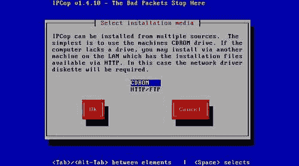
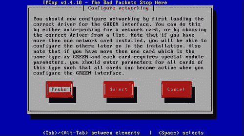
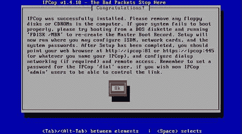
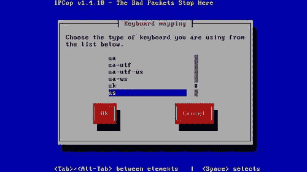
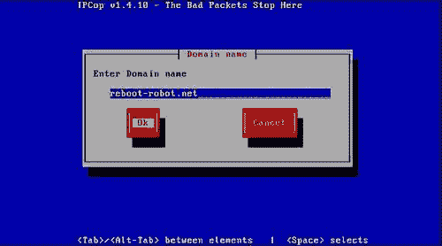
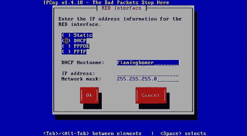
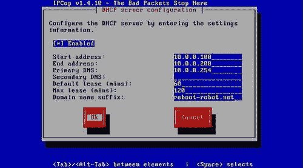

# 四、安装 IPCop

现在我们已经介绍了一些基本的网络和防火墙原理，并且了解了 IPCop 允许我们利用的功能，接下来我们来看看如何安装防火墙。 IPCop 可以通过多种方式安装，但使用 CDROM(有时附带软盘)是最简单、最常见的方法。 因此，我们将详细介绍此安装方法，并在后面的章节中讨论更高级安装的选项，例如通过网络安装和调试安装过程。

# 硬件要求

IPCop 具有非常低的最低硬件要求，设计用于普通 PC 硬件。 我们的主要问题通常不是“*这台机器是否足够支持 IPCop*”，而是“*这台机器是否足够强大，能够处理通过它的带宽*”。

IPCop 的最低系统要求为：

*   基于**386**的**PC**或更好(这意味着您可以使用非常旧的 PC 作为防火墙)

*   **32MB**内存**内存**

*   **200MB 硬盘**(或紧凑型闪存驱动器)

*   **每个接口有一个网卡**(**网卡**)(最多四个)。 每个卡都有一个唯一的硬件或 MAC 地址，在这一点上值得注意，以便以后识别卡时使用。

*   Red 接口的连接设备(如果不是以太网)

# 其他硬件注意事项

尽管由于对 IPCop 的最低要求，人们很容易将其放在旧工作站或过时的 PC 上，但值得后退一步来考虑如何使用它。 在家庭环境或非常小的办公室中，旧 PC 可能会提供所需级别的可靠性，但如果互联网接入非常关键，尤其是如果我们在 IPCop 中使用更复杂的功能(如 VPN 或更难复制的复杂防火墙规则)，那么即使我们有备份，硬件故障造成的损害也可能是严重的。

因此，更可靠、更新的主机可能值得考虑。 此外，还需要根据防火墙所处的环境进行考虑。 在防火墙可能不在服务器机房或通信机柜中的家庭或小型办公室环境中，较旧的 PSU 的噪音虽然很小，但可能会令人讨厌。 这样的服务器的功耗也可能是一个考虑因素-移除一些不必要的组件或将 PSU 降级到更新、更高效、功率更低的型号可能会解决噪音和电源问题。

硬件设置也值得考虑--应该考虑服务器的位置，这样重新布线就不成问题，机箱也不需要重新定位或被绊倒。 正如我们之前提到的，我们还应该在 BIOS 中启用某些设置，例如禁用“出错时停止”功能(这样，如果键盘被移除或组件损坏，我们的框就不会在提示时冻结，除非我们希望发生这种情况)。 另一个常见的 BIOS 选项是“重新开机”选项--使我们的服务器在停电的情况下自动重新开机。

# 安装程序

在我们开始安装 IPCop 之前，我们必须确保我们做好了充分的准备并拥有所有必要的设备。 以下是简短的核对表，以确保我们在开始之前拥有所需的一切；所有特定于 IPCop 的内容(如 CD 和软盘介质)将在安装演练过程中详细介绍。

*   我们有能满足最低系统要求的机器吗？

*   我们的机器中是否有足够的资源来处理我们预计的带宽使用情况？

*   我们是否拥有所有必需的网卡及其驱动程序(如有必要)，并且是否检查了它们是否与 IPCop 兼容？

*   围绕 IPCop 机器的所有必需设备是否都已就位？ 测试配置的示例包括布线、交换机和客户端计算机。

*   我们的互联网连接是否正常？

一旦我们确定所有必备的硬件和连接都可用，我们就可以开始安装了。 我们必须下载 IPCop 安装 ISO 并将其刻录到 CD。 最新版本可以在 IPCop[http://sourceforge.net/project/showfiles.php?group_id=40604](http://sourceforge.net/project/showfiles.php?group_id=40604)的 SourceForge 项目页面上找到。撰写本文时，最新版本是 1.4.10：[http://prdownloads.sourceforge.net/ipcop/ipcop-install-1.4.10.i386.iso?download](http://prdownloads.sourceforge.net/ipcop/ipcop-install-1.4.10.i386.iso?download)

下载 ISO 并将其刻录到 CD 后，使用您选择的 CD 刻录包，我们可以开始安装。

### 备注

**使用软盘安装**

如果您的 IPCop 计算机不是从 CD 启动，您可以在 CD 的 `images`文件夹(例如 `boot-1.4.0.img`)中找到软盘映像，可以使用 Linux 上的 `dd`命令或使用 IPCop 磁盘上提供的 `rawwritewin.exe`将其复制到软盘。

现在，我们可以通过将 IPCop 磁盘插入 CD 驱动器来引导机器，然后我们应该会看到以下屏幕：


如您所见，有一条非常突出的消息，即安装 IPCop 将销毁系统上的所有数据。 这意味着 IPCop 遇到的第一个磁盘将被擦除、重新分区和格式化，以便 IPCop 系统安装。 为了我们的数据安全，我们必须确认系统中只有一个磁盘，并且确保没有任何有价值的东西存储在那里，这一点非常重要。 一旦我们确定了这一点，我们就可以开始安装，而不用担心数据丢失。

此时按*Enter*将引导我们进入安装系统，但我们还可以向内核提供其他参数。 如果在按下*Enter*后系统无法正常启动，我们应该重新启动机器并尝试上面的选项之一。 如果我们的机器没有 PCMCIA(通常在笔记本电脑上可以找到)，我们通常可以使用 `nopcmcia`选项，USB 也是如此。 许多 IPCop 系统在旧硬件上运行，USB 在这方面不太常见。

在我们点击*Enter*之后，我们将看到语言选择屏幕。 假设我们想要英语 IPCop 系统，我们可以选择默认选项，否则选择我们的首选语言。 您可以使用箭头键导航菜单项。 然后，我们将看到 IPCop 欢迎消息，其中包含随时点击 Cancel 以导致重新启动的说明，以防我们改变安装主意。

## 安装介质

如下图所示，安装过程的下一阶段是安装介质的选择。



对于没有 CDROM 驱动器的计算机，可以通过 FTP 或 HTTP 安装 IPCop。 在这种情况下，我们将从软盘启动机器，然后让主机下载来自 Internet 的内容通常包含在 CDROM 上。 因为盒子里有 CDROM，所以我们可以选择**CDROM**选项。 然后，我们将看到一条消息提示我们：**请将 IPCop CDROM****插入 CDROM 驱动器**。 这并不意味着安装过程没有拿起 CD。 到目前为止，我们可以从 CD 或软盘启动，安装过程允许这样做，如果我们点击**OK**安装应该可以正常继续。

## 硬盘分区和格式化

然后我们会收到警告，系统即将对硬盘进行分区和格式化。


这是不能返回的点，在这里按*Enter*会完全擦除磁盘，并且我们会丢失驱动器上的所有数据。 如前所述，只要我们已经确保系统中只有一个驱动器，并且该驱动器是我们不介意擦除的驱动器，我们就可以继续。 按*Enter*将开始分区和格式化过程。 如果我们有一个大磁盘，这可能需要一两分钟。 通常，在 IPCop 中放置一个较小的磁盘是个好主意，因为它不会占用大量空间，这取决于我们预计 IPCop 会有多少日志文件。 但是，我们必须确保满足最低要求，大约为 200MB，而任何超过 10 GB 左右的内容都不太可能被使用，除非您最终使用需要更多空间的附加组件-这些附加组件可能会满足您的磁盘空间要求。

## 从软盘备份恢复配置

在此阶段，我们可以选择恢复保存在软盘上的早期配置，这是备份 IPCop 配置的理想方式。


因为这是我们第一次安装 IPCop，所以不太可能有软盘。 但是，如果我们这样做了，我们可以选择**恢复**，并且系统配置的其余部分将根据我们以前的安装选项自动运行。 目前，我们将选择**跳过**，继续手动安装。

# 绿色接口配置

正如我们在前几章中所讨论的，IPCop 有一个配色方案，用于引用系统中安装的网卡。 这是我们在安装过程中遇到的第一个点。



绿色接口对应于我们的本地网络，我们现在可以选择此接口。 最简单的方法是允许 IPCop 对网卡进行**探测**，它可以非常可靠地完成。 但是，如果我们确切知道要使用哪种牌子和型号的卡，我们可以选择**手动选择**，这将为我们提供一个已知卡列表以供选择。 此屏幕还引用了**特殊模块参数**，如果需要，我们可以将这些选项传递给内核中的网络驱动程序。 一旦配置了此阶段，我们就可以远程完成其余的安装，稍后会要求我们配置其他卡。

此阶段的一个小问题是，如果我们让 IPCop 探测网卡，IPCop 发现的第一个卡将用作 Green 网络接口。 我们为特定接口选择特定的卡可能是有原因的：例如，我们可能有 10Mbit 和 100Mbit 的卡，并且希望使用 10Mbit 的卡来连接互联网。 在这种情况下，我们可以采用以下两种技术之一-或者自己为我们想要的特定卡选择驱动程序作为绿色接口，或者将卡按顺序放入机器，使绿卡位于编号最低的 PCI 或 ISA 插槽中。 还请注意，IPCop 赋予卡的名称可能不是卡的制造商或型号的名称，因为它与正在使用的**芯片组**相关，例如，许多普通卡将被标识为**Digital 21x4x Tulip PCI…。** 。

有时这可能需要一些工作，特别是如果两个完全相同的网卡共享同一个盒子，可能会导致混淆，不知道哪个网卡分配给了哪个接口。 当主机中有多个卡时，某些卡(如较旧的 3Com Etherlink 卡)可能很难使用。 在大多数情况下，可以通过 IPCop 社区找到针对该问题的特别帮助。

## 完成了吗？

哇，这太容易了！ 看来我们已经安装完毕了。



不过，不要太得意忘形；这条消息意味着基本系统文件已经就位，我们最基本的配置已经完成。 现在，我们必须根据特定需求设置 IPCop，方法是选择要使用的接口类型以及寻址系统的工作方式。 在此处按*Enter*将进入 IPCop 的配置。

## _

我们从键盘布局选项开始。



我们应该选择我们想要使用的键盘布局。 对于使用标准美国键盘的用户，选择**US**，对于使用 UK 布局的用户，选择**UK**。 在这里选择错误的布局可能会使菜单导航和命令稍后变得有点困难，因此请确保选择正确的选项。 如果您不确定，请检查您的桌面系统是如何配置的。

系统还会提示我们选择我们的**时区**，如**GMT**或**EST**；请再次小心选择正确的选项，并咨询您的桌面系统以了解其配置情况。

## 主机名

现在，我们必须为 IPCop 机器命名。


如果网络上已经有了命名方案，我们可以使用该方案；其他选项可能是**Firewall**或默认的**ipcop**。 如果我们使用 IPCop 盒作为 DNS 服务器，它将使用此名称的自己的 IP 地址进行回复，因此可以方便地寻址 IPCop 的 Web 前端。

## DNS 域

我们的本地网络上 IPCop 的默认域名如下图所示：



如果我们没有域名，我们可以使用默认域名，尽管作为企业网络，我们可能已经在本地网段上使用了域；我们应该在此处输入域名，注意不要与内部和外部 DNS 重叠。 例如，如果我们在外部使用**reboot-robot.net**，那么在内部使用**lan.reboot-robot.net**可能是一个更好的主意，允许内部客户端使用 DNS 引用内部和外部计算机。 错误配置此域名或使用不属于您的域名可能会导致网络内的客户端无法访问该域。 如果我们把**aol.com**放在这里作为例子，那么我们可能很难访问 AOL 的网站和其他服务。

## ISDN 配置

如果我们有 ISDN 调制解调器，现在可以在这里进行配置：


我们需要诸如正在使用的协议和要使用的电话号码等参数，所有这些都可以由 ISDN ISP 提供。 如果您必须拨 9 才能拨打外线，那么也应该包括在内，并且可以在必要时通过插入逗号来添加停顿。 如果我们没有 ISDN，我们应该选择禁用它；然后我们可以在后面的步骤中设置其他连接方法，如 DSL。

## 网络配置

现在，我们应该看到**Network Configuration(网络配置)菜单**。


这是设置过程的重要部分，与我们在上一章中讨论的网络拓扑直接相关。

我们首先确定我们的**网络配置类型**。 有很多可供选择的，在上一章中，我们对其中的几个进行了概述。 在本例中，我们将运行**Green+red**拓扑的安装过程。

当我们根据上一章中确定的拓扑选择适当的选项时，我们可以转到网络配置菜单中的第二项。

### 驱动程序和卡分配

对于在系统中找到的每个网络接口卡，我们将看到一个菜单提示，如下图所示：


如果我们选择具有更多接口的拓扑，例如使用 Orange 或 Blue，我们可以将卡分配给我们希望将其指定为的接口。 在上面显示的示例中，我们有一个卡，并将其分配给**red**接口；这将使它成为我们的 Internet 连接。

### 地址设置

网络配置菜单中的下一个选项是**地址设置**。 在这里，我们可以定义要在服务器上使用的地址。



我们始终希望 Green、Orange 和 Blue 接口保持静态，每个接口具有不同的子网。 Red 接口将取决于我们的 ISP，他们将提供配置信息。 对于静态、PPPOE 和 PPTP，地址和配置信息应按照您的 ISP 说明进行配置。 但是，如果我们使用的是 DHCP，则只需单击**DHCP**选项，并保留所有其他设置的默认值(除非您的 ISP 另有指示)。 大多数电缆连接将使用 DHCP，而 ADSL 连接将根据使用的 ADSL 路由器、调制解调器或接口卡的类型而有所不同。

## DNS 和默认网关

我们还应该提供 DNS 和默认网关服务器以供使用。


如前所述，这对于 DHCP 并不总是必需的，通常不是一个好主意，因为它会覆盖您的 ISP 在 DHCP 中提供的设置。

## DHCP 服务器

如果我们决定对 DHCP 使用 IPCop，则必须配置各种 DHCP 选项。



如果我们有一个包含几个客户端的简单网络，我们可能希望我们的 IPCop 来处理 DHCP。 在较大的网络中，我们可能已经在使用专用的 DHCP 服务器；如果是这样，我们应该禁用该 DHCP 服务器。

DHCP 需要将一系列地址分配给客户端。 我们首先提供该范围，该范围由**起始地址**和**结束地址**定义。 在上例中，我们选择了**10.0.0.100**到**10.0.0.200。 默认租用**和**最大租用**时间是允许 DHCP 客户端*租用*IP 地址的持续时间。 除非您的网络对特定时间的租赁有特定要求，否则通常没有真正的理由更改这些设置。

通常，正如我们前面所讨论的，我们可以选择任何想要的内部寻址方案(只要我们使用内部地址)。 只要我们在使用上保持一致，并合理地配置所有内容，这一切都会正常工作，此示例安装中的默认设置(除了我们前面提到的域名后缀)也会正常工作。 同样，正如我们之前讨论过的，唯一的小例外是如果我们有一家使用这些(RFC1918)地址的 ISP-此信息可以从您的 ISP 处获得。

域名后缀应该预先填充我们先前在配置中提供的信息，通常后缀应该与网络上的其他客户端一起使用，以确保所有客户端都配置了相同的设置，这些设置也与 IPCop 机器匹配。

## 完成！

现在我们可以兴奋起来了！ 我们已经完成了 IPCop 的安装过程。


在此按下*Enter*后，系统将首次重新引导至我们的 IPCop 安装。

# 第一次引导

当 IPCop 系统启动时，我们将看到以下屏幕，这是作为 IPCop(GRUB)的一部分安装的引导加载程序。 现在，我们可以选择要使用的引导选项，并可以选择在引导之前向内核添加任何参数。 几秒钟后，默认条目应该会启动。


### 备注

==同步，由 Elderman 更正==@ELDER_MAN

GRUB 是 Linux 常用的引导加载程序之一，它本质上介于计算机的 BIOS 和操作系统之间，允许我们选择多个操作系统，或者只为其中一个指定选项(例如选择 SMP 或 ACPI 支持，而不是标准内核，如上一个屏幕截图中的菜单所示)。

关于 GRUB 的更多信息可以在 FSF 网站上找到。

[http：//www.gnu.org/software/grub/](http://www.gnu.org/software/grub/)

然后，我们应该在屏幕上看到一些引导信息输出，这应该会持续几秒钟，然后是一组令人满意的蜂鸣音，最后是以下输出：

```sh
 IPCop v1.4.10 - The Bad Packets Stop Here
flaminghomer login: 

```

这是 Linux 登录提示符，表示我们现在已经安装并成功引导了 IPCop 系统。 IPCop 现在将充当我们的基本 NAT 防火墙，无需进一步配置。

# 摘要

在本章中，我们介绍了如何使用前面介绍的配置和拓扑设置和运行 IPCop 系统。 我们还看到，NAT 应该可以通过防火墙；客户端应该能够获取 IP 地址、使用 DNS 和访问 Internet。 现在，我们可以继续自定义系统并启用默认情况下不可用的功能和服务。 在接下来的几章中，我们将介绍基本配置，然后查看更高级的选项，如入侵检测和 VPN。