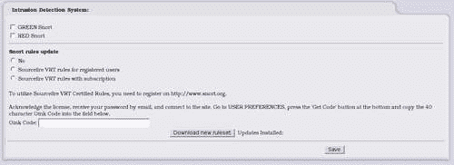

# 六、将 IPCop 用于入侵检测

现在我们有了一个可以正常工作的防火墙，大部分基本功能都设置好了，我们感觉很安全。 当然，任何恶意入侵者都无法通过我们网络上的这些防御。 但如果他们这么做了呢？ 我们怎么知道呢？ 我们该怎么办？

这些都是**入侵检测系统**(**IDS**)试图回答的问题；当网络安全方面的事情没有完全按计划进行时，它会检测到这些问题，并记录它识别的任何可疑活动，以便我们可以有效地处理安全事件。

# IDS 简介

市场上有各种各样的入侵检测系统，从企业级托管网络监控解决方案到简单的主机日志记录系统，应有尽有。 **入侵防御系统**(**IPS**)和 IDS 之间也有区别。 IPS 比 IDS 更有效，它会尝试拦截正在进行的攻击，而 IDS 会尝试记录攻击，并通知责任方(可选)采用事件响应计划。

IDS 还可以进一步分类为**NIDS**或**HID**，不同之处在于前者监视*网络*，而后者监视*主机*。 在选择 IDS 时，这一点很重要，因为我们必须确定我们到底在监视什么。

例如，许多管理员不会在 Windows 或 Unix 机器上使用 HID，因为它们具有广泛记录(事件日志/系统日志)的内置能力，因此更喜欢监控网络上的流量，以发现恶意行为的迹象。 这也可能比主机监视更可靠，因为很难信任受损主机的日志。

在使用 IPCop 的情况下，我们在防火墙上有一个内置的 NIDS，它是预先配置好的，可以用绝对最低配置使用，即**Snort**入侵检测系统。

# Snort 简介

Snort 是 IPCop 附带的 IDS，是目前可用的最知名、最常用的**嗅探器**之一，世界各地的大大小小的网络都在使用它。 它不断更新针对大量漏洞的签名、庞大的用户基础、商业支持以及在线和印刷版本的优秀文档。 Snort 最初是由 Martin Roesch 在 20 世纪 90 年代末开发的，注定是一个嗅探器，可能还会更多一点，因此得名 Snort。

最初，作为嗅探器，Snort 相当不错，并且链接到稍微老一点的相关 tcpdump。 最终，Snort 得到了扩展，更像是一个 NIDS 而不是嗅探器(Snort 的许多用户没有意识到它的嗅探功能，只是将其作为 IDS 使用)。

随着 Snort 变得非常流行，Martin Roesch 决定创办一家基于 Snort 的公司，提供基于他作为 Snort 开发人员的专业知识的安全服务。 这导致了 SourceFire([http://www.sourcefire.com](http://www.sourcefire.com))的创建。 Sourcefire 现在提供基于 Snort 的商业支持和其他服务。 尽管它也雇佣了 Snort 的全职开发人员，但它仍然是一个开源产品，因此可以随 IPCop 一起提供。 IPCop 开发人员在此基础上添加了一个预配置的 Snort 系统，该系统在 IPCop 界面中具有非常易于使用和简单的管理选项。

# 我们需要 IDS 吗？

IDS 的需求完全取决于网络和我们想要做的事情。 一般来说，我会说我们需要它，除非我们能想出一个很好的理由不拥有它。

IDS 的另一个好处是，我们可以看到通过我们的网络的是什么，并尝试隔离任何似乎是恶意的通信量。 这一点很重要，因为这是许多防火墙所缺乏的功能(除了那些具有第七层支持的防火墙，这些支持被称为应用层防火墙)。 由于防火墙工作在网络通信的较低层，因此它们的过滤规则通常仅限于 IP 地址、端口、一天中的时间以及少数其他标准。 如果我们有一个防火墙，它不检查数据包的有效负载，只根据数据包报头做出决定，那么说这些设备可能允许一些恶意流量通过也不是不可能的。 我们的 IDS 的作用是对这些数据包进行深入检查，查看其中包含的数据，并做出决定，例如：“这看起来像红色代码蠕虫吗？”、“这是不是试图在我们的 Sendmail 服务器中发生缓冲区溢出？”或者“我们的某个用户是否刚刚被最新的 0 天 WMF 漏洞利用？” 对于管理员来说，收到 IDS 中抛出这些警告信号的任何数据包的通知是非常有价值的，因为我们可以使用此信息进一步查看我们的网络状态，以确定是否存在需要解决的重大问题，尽管这些警告通常是错误的警报。？ 我们可以把 IDS 想象成一个预警系统，告诉我们可能正在发生需要我们关注的事情。 为了保护我们的网络，这是非常有价值的信息！

### 备注

**第七层过滤(应用层)**

IPCop 提供了在该层提供过滤的选项，但默认情况下不提供这些选项，需要安装第三方加载项。

# IDS 是如何工作的？

一般来说，尤其是 Snort，在能够监控尽可能多的网络的设备上运行，通常在网关设备上或附近(如 IPCop)，或者在交换机上的某种监控端口(SPAN/Mirror 端口)上运行。 然后，NIDS 将设备上的一个或多个网卡设置为在**混杂模式**下工作，这意味着它们将通过网络堆栈向上传递数据包，而不管它们是否发往机器。 这一点很重要，因为 NIDS 通常会监视机器本身以外的其他机器。 然后，主机上的 NIDS 将获取这些数据包，并查看数据有效负载(有时也包括报头)，以查看是否发现任何恶意行为。 这听起来可能像人工智能，因为 NIDS 只是坐在那里思考经过的数据包；实际上要简单得多！

每天利用漏洞进行攻击时，病毒、蠕虫、间谍软件和其他恶意软件都会生成网络流量，这些流量通常具有特定于正在使用的软件的模式、漏洞利用中的特定字符串、其联系的特定主机以及 TCP/IP 报头中的特定选项。 有很多人在关注他们的社交网络，当他们注意到一些看起来奇怪的事情时，他们会记录下来，通常会向他们的同龄人寻求建议，看看是否有人注意到了类似的事情。 不久之后，如果检测到恶意活动，就会有人为他们喜欢的 IDS 写签名，在很多情况下还会一次为几个 IDS 写签名。 根据这些签名，IDS 检测引擎将决定是否将数据包标记为可能是恶意的。 这些方法很少是 100%准确的，因为它们可以并将提供假阳性或假阴性。 此检测旨在作为额外的防御层，不能确定网络是否受到危害。 可以做的是提醒管理员有问题。 IPCop 盒上的 Snort 处于一个很好的位置，可以对试图通过防火墙到达受保护接口(甚至在受保护接口之间)的任何恶意行为发出警报。

# 结合使用 Snort 和 IPCop

使用 IPCop 设置 Snort 是一个非常简单的过程。 如果用户想要下载更新的签名，Sourcefire 要求用户注册。 我们确实希望有更新的规则，所以我们应该确保我们注册了 SourceFire。 这可以按照下面屏幕上的说明注册到 Snort 网站并生成 Oink 代码来完成。

注册后，我们填写上一个屏幕上的表格。 我们通过选中相应的复选框来选择要监控的每个接口。 作者倾向于在此时监视所有接口，并在以后监视日志时进行过滤。 我们还应该为注册用户选择**SourceFire VRT 规则**，除非我们有允许我们访问订阅规则的付费订阅。 然后，我们输入从 Snort 网站获得的**Oink Code**。 我们现在可以下载最新的规则。 就这样!。 现在，我们只需填写一张非常简单的表格，就可以为我们的网络配置一个 NIDS。 现在我们肯定安全了！

# 监控日志

入侵检测系统本身没有任何好处；它需要一双眼睛来检查日志并采取行动，或者某种自动通知系统。 IPCop 的 Web 界面提供了对网络中正在发生的事情的初步了解。

这可以在**Logs IDS Logs**菜单选项下找到，如下图所示：

日志屏幕默认为今天的日期，并为我们提供了一些有趣的信息。 今天 12 月 20 日381 个规则被激活，这意味着 Snort 注意到 381 个可能的网络攻击。 这个数字高得不正常，因为数据是作者人工生成的，但通常情况下，根据您的网络大小，您可能每天都会看到一些规则被激活。 例如，家庭用户应该会看到大量端口扫描和自动蠕虫攻击。 如果我们仔细查看其中一条规则，我们可以看到 Snort 在日志中向我们显示了什么。

**日期：12/20 12：51：41 名称：SNMP 请求 UDP**

**优先级：2 类型：信息泄露未遂**

发帖主题：Re：Колибрипрограммированияпрограмма。

**参考：未找到 SID：1417**

我们可以看到，IP 地址为**10.0.0.102**的计算机上有人试图从攻击者的端口**32833**向**10.0.0.200**上的端口**161**发送基于**udp**的**SNMP**请求，以获取有关我们网络的信息。 我们还有一个**SID**值**1417**。 这是很好的基本信息，可以让我们知道发生了什么。 我们可以看到谁、什么、地点和时间对入侵检测非常重要。 我们在这里没有明显解释的唯一值是 SID。

SID 是 Snort 签名 ID，数字本身是指向 SID 在线数据库的链接，该数据库包含有关此事件的更多信息。

这给了我们很多信息，让我们缩小了在这个案例中到底发生了什么。 在误报部分，我们可以看到，当安全扫描软件扫描系统时会发生此事件，在本例中是完全正确的，因为作者使用开源漏洞扫描程序 OpenVAS([http://www.openvas.org](http://www.openvas.org))扫描了 IPCop 盒。

### 备注

**OpenVAS**

OpenVAS 是 Nessus 安全扫描程序的一个分支，现在正在作为一个单独的项目进行开发，目的是为最新的非 GPL 版本的 Nessus 提供一个替代方案。

## 优先级

另一个非常重要的字段是优先级，在本例中是**2**。 默认情况下，Snort 有以下三个级别：

*   级别 1：

    *   检测到可执行代码

    *   获得管理特权的尝试或成功

    *   特洛伊木马签名

*   第 2 级：

    *   尝试/成功拒绝服务

    *   信息泄露未遂/成功

    *   异常的客户端端口连接

*   第 3 级：

    *   端口扫描

    *   可疑字符串检测

每当检测到攻击时，它所匹配的规则都会引用一个优先级，以便为事件指定其优先级号。 这些数字是规则的一部分，如有必要，可以通过手动更改 Snort 规则进行修改。 这里不讨论手动更改 Snort 的配置；但是，有很多关于 Snort 主题的书籍和在线文档。

# 日志分析选项

Snort 是一个使用得很好的项目，它提供了各种分析产品。 我们将快速了解一些最常用的产品及其提供的功能。 IPCop 日志记录系统不能完全满足大多数分析，而且肯定不能用来提供报告，而只要有入侵企图，通常都需要提供报告。 为了分析和报告这些日志，已经创建了许多项目。 要使用这些工具，您可能需要配置 IPCop 以记录到远程 syslog 服务器，或者在某些情况下，您可以安装并添加到 IPCop。

## Perl 脚本

用于 Snort 日志分析的最容易安装和使用的产品之一是出色的 SnortALog。 它提供了一些出色的功能，其中最有用的是它的报告生成能力--您可以使用 ASCII、PDF 或 HTML 格式的报告，其中的图像表示为 GIF、PNG 或 JPEG。 这有助于提供出色的报告，因为您可以获得各种图表和统计数据，然后可以在演示文稿或其他网络安全状态报告中使用这些图表和统计数据。 SnortALog 可以使用 Snort 提供的所有输出选项，并且有一个易于使用的 GUI 来生成报告。 还有一种选择是 SnortSnarf，它提供了与 SnortALog 类似的特性；但是 SnortALog 非常容易使用，显然 SnortSnarf 已经不再被开发了。 SnortALog 还提供了更多的报告选项，外观也更加美观。

## 酸碱

还有一些功能更全、更复杂的系统可用于监视和分析 Snort 日志。 **例如，ACID**是基于 PHP 的，需要使用 Web 服务器，并提供对 Snort 日志的实时监控和统计。 此外，使用上面的 Perl 脚本生成的统计数据，您可以使用非常强大的选项进行进一步分析。 例如，您可以进行相当广泛的查询，以便仅提供当前分析中最感兴趣的事件，您可以查看生成该事件的数据包内容，并仔细分析数据包数据以全面确定攻击的程度和是否为误报。 **BASE**是 ACID 的替代产品(派生自 ACID)，提供相似的功能，值得对两者进行比较，以找到我们监控入侵检测系统的首选产品。

# 下一步做什么？

一旦您确定事件已经发生，重要的是迅速对该事件采取行动。 尽管 Snort 本身只提供了一些关于进一步查看特定事件的想法，但决定如何处理事件是管理员的责任。

在较小的网络中，正式的事件响应计划并不总是必要的，但如果我们知道如果受到特定攻击该怎么办，它确实有助于维护系统安全。 端口扫描、拒绝服务和攻击尝试就是很好的例子。 然后我们可以决定这样的事情：

*   我们要报告这些吗？

*   如果发生这种情况，我们还想分析其他保护系统吗？

*   我们需要通知别人吗？

在设置 IDS 时回答几个类似的基本问题会给 IDS 带来更大的价值，因为它将成为有效的网络保护计划的一部分。

# 摘要

在本章中，我们已经介绍了什么是 IDS、它是如何工作的、如何将 Snort 与 IPCop 一起使用以及与 Snort 一起使用的其他工具的基础知识。

在这一点上，我们已经了解了网络保护和网络监控，并且至少对发生攻击企图时我们应该做什么有了一个基本的概念。 这使我们的网络处于良好状态，并确保我们完全了解正在发生的情况。 正如在本章的引言中提到的，IDS 应该让我们对网络的安全状态有一个基本的概述-我们是否受到攻击，攻击来自哪里，攻击的目标是什么。

有了这些信息，我们可以有效地提高我们网络的安全性。 使用像这样的自动化工具意味着我们更容易每天监控这些活动，并确保我们始终意识到我们的周围环境。 了解我们的网络是如何运行的，以及每天都有哪些数据通过它，这是发现网络入侵的重要手段。 如果我们没有基线来进行比较，我们就无法意识到出了什么问题；不断地监视我们的 IDS 会给我们提供这个基线。