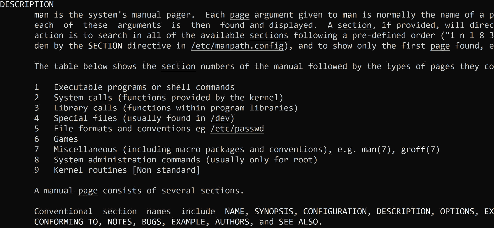
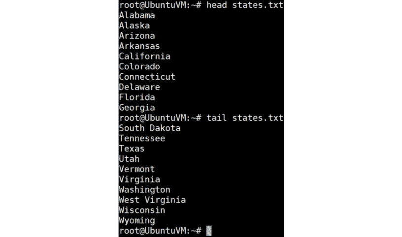
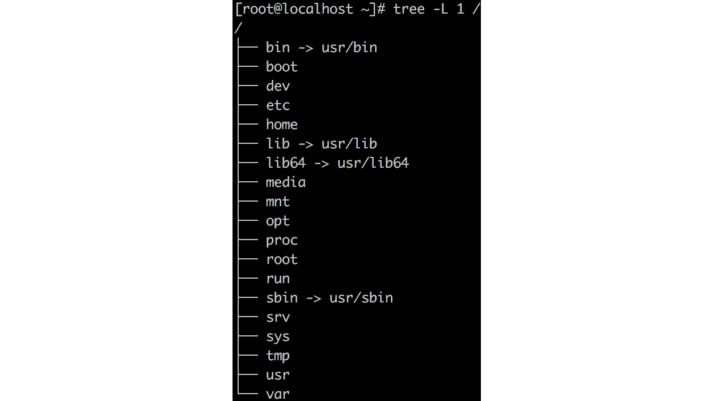
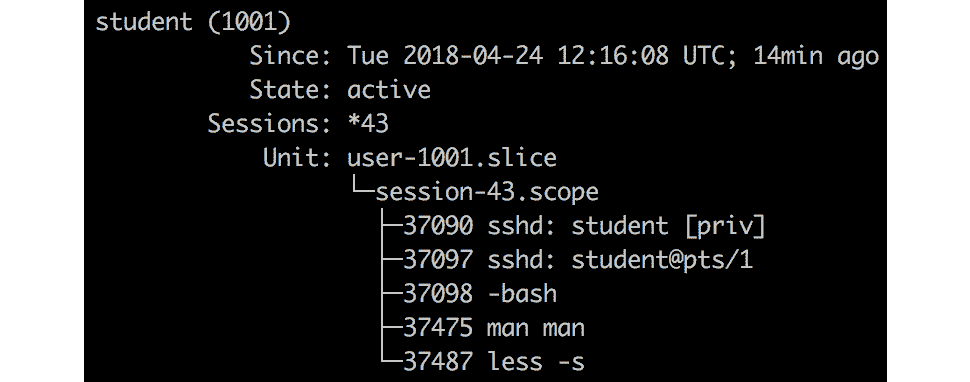

# 三、Linux 基础管理

在部署了您的第一个 Linux**虚拟机**(**VM**)之后，让我们登录，讨论一些基本的 Linux 命令，并学习如何在 Linux 环境中找到出路。 本章是关于基本的 Linux 管理，从用于与 Linux 系统交互的 Linux shell 开始。 我们将讨论如何使用 shell 来完成我们的日常管理任务，比如访问文件系统、管理进程(比如启动和终止程序)以及许多其他事情。

在本章的最后部分,我们将讨论**的自主访问控制**(**DAC)模型以及如何创建、管理和验证用户和组在 Linux 和获得的文件和目录的权限,基于用户名和组成员关系。 我们还将讨论更改用户/组的文件所有权，以及更改和验证基本权限和访问控制列表。**

以下是本章的主要主题:

*   与 shell 交互并配置 shell
*   使用手册页获得帮助
*   通过 shell 处理和编辑文本文件
*   理解文件层次结构，管理文件系统，并安装新的文件系统
*   管理流程
*   用户和组管理

## Linux Shell

在上一章中，我们创建了 VM 并使用 SSH 登录，但是我们如何与 Linux 机器交互并指示它执行任务呢? 正如我们在本章开始时提到的，我们将使用 shell。

我们将研究广泛使用的 Bash shell、Bash shell 的配置以及如何使用它。 shell 是一个用户界面，在其中你可以做以下事情:

*   与内核、文件系统和进程交互
*   执行程序、别名和内置外壳

shell 提供如下特性:

*   脚本
*   自动完成
*   历史和混叠

有许多不同的 shell 可用，如 KornShell、Bash 和**Z shell**(**Zsh**)。 Bash 几乎是每个 Linux 系统上的默认 shell。 它的开发始于 1988 年，作为最古老的 shell 之一:Bourne shell 的替代品。 Bash 基于 Bourne shell 以及从 KornShell 和 C shell 等其他 shell 中学到的经验教训。 Bash 已经成为最流行的 shell，可以在许多不同的操作系统上使用，包括 Windows 10、FreeBSD、macOS 和 Linux。

以下是 Bash 2.05a(2001 年发布)中添加的一些最重要的特性，它们使 Bash 成为最突出的 shell:

*   命令行编辑
*   历史上的支持
*   自动完成
*   整数的计算
*   函数声明
*   这里是文档(将文本输入放入单独文件的一种方法)
*   新增变量，如**$RANDOM**和**$PPID**

最近，Z 壳变得越来越受欢迎; 该 shell 的开发始于 1990 年，可以将其视为 Bash 的扩展。 还有一个与 Bash 的兼容模式。 它提供了更好的自动补全支持，包括自动校正和更高级的路径名扩展。 它的功能可以通过模块进行扩展，例如，通过命令获得更多帮助。 [Oh-My-ZSH (https://github.com/robbyrussell/oh-my-zsh)和 Prezto](https://github.com/robbyrussell/oh-my-zsh)([https://github.com/sorin-ionescu/prezto)项目是值得一提的:它们提供了主题,高级配置和插件管理 Z shell 非常友好。 所有这些出色的特性都是有代价的:Z shell 肯定比 Bash 更需要资源。](https://github.com/sorin-ionescu/prezto)

### 执行命令

shell 最重要的特性之一是可以执行命令。 命令可以是以下命令之一:

*   Shell 内置(由相关 Shell 提供的命令)
*   文件系统上的可执行文件
*   别名

要找出正在执行的命令类型，可以使用**type**命令:

类型呼应

添加**-a**参数将显示包含**echo**可执行文件的所有位置。 在下面的截图中，我们可以看到，当我们添加**-a**参数时，由于可执行文件的存在，shell 也引用了**/usr/bin/echo**目录:

###### 图 3.1:包含可执行回显的位置

让我们对**ls**做同样的处理:

type ls

因此，您将得到类似的输出**类型 ls**:

###### 图 3.2:包含可执行 ls 的位置

在这里，我们可以看到**ls**是**ls——color=auto**命令添加了一些参数的别名。 别名可以代替已有的命令，也可以创建新的命令。 不带参数的**alias**命令将为您提供已经配置的别名:

###### 图 3.3:使用 alias 命令

**ll**别名是一个新创建命令的示例。 **mv**命令就是一个替换的例子。 创建一个新的别名如下:

alias<command></command>='命令执行'

例如，要将**grep**命令替换为**search**，执行以下命令:

alias search=grep

您正在创建的别名将被添加到**.bashrc**文件中。 如果要删除已创建的别名，可以使用**unalias**命令:

unalias <alias name>

如果要删除所有已定义的别名，可以使用**取消别名-a**。

命令标识程序在**$PATH**变量中的位置。 这个变量包含一个目录列表? 用于查找可执行文件。 这样，你就不需要提供完整的路径:

这密码

输出告诉你它在**/usr/bin**目录中可用:

###### 图 3.4:程序在$PATH 变量中的目录位置

### 命令行编辑

在许多方面，在 Bash shell 中输入命令与在文本编辑器中工作是一样的。 这可能就是为什么操作会有快捷方式(比如到一行的开始)，以及为什么快捷方式与两个最著名、最常用的文本编辑器(Emacs 和 vi)相同的原因。

默认情况下，Bash 被配置为 Emacs 编辑模式。 如果需要查看当前的编辑模式，请执行**set -o**。 输出将说明在上 Emacs 或 vi 是否被设置为**。 以下是一些非常重要的快捷方式:**

###### 图 3.5:Bash shell 快捷键列表

如果使用 vi 模式，请执行以下操作:

设置- o 六世

使用如下命令切换回 Emacs 模式:

设置- o emacs

#### 请注意

vi 编辑器将在本章后面的章节*Working with Text Files*中介绍。 目前，您可以在命令模式下使用几乎所有命令，包括**导航**、**扬**和**放**。

**set**命令是 Bash 内置的命令，用于切换特定于 Bash 的属性。 如果没有参数，它将转储环境变量。

### 与历史一起工作

Bash shell 提供了命令行工具，您可以使用这些工具处理用户的命令历史记录。 您执行的每个命令都注册在主目录的历史文件中:**~/。 bash_history**。 要查看历史记录的内容，请执行以下命令:

历史

输出显示了先前使用的命令的编号列表; 你可以简单地使用以下命令重做一个命令:

*   **! <number>**:根据历史列表号执行命令。
*   **! <-number>**:例如**!-2**执行的命令比历史上的最后一条命令早 2 条。
*   **! <命令>的第一个字符:**这将执行以该字符开头的最后一项。
*   **!! :**重做最后一条命令。 您可以将此命令与其他命令组合使用。 例如，**sudo !!** 。

可以使用*Ctrl*+*R*(Emacs 模式)或正斜杠(vi 命令模式)向后搜索历史记录。 使用方向键可以浏览网页。

历史文件不是在执行命令之后直接写入的，而是在登录会话结束时写入的。 如果您在多个会话中工作，那么直接编写历史记录可能是个好主意。 为此，执行以下操作:

——历史

要在另一个会话中读取刚刚保存的历史记录，执行以下操作:

历史- r

要清除当前会话的历史记录，使用此命令。

历史- c

如果你想保存历史记录到一个文件中，你可以执行以下操作:

历史-w<filename></filename>

因此，通过保存清除的历史，您清空了历史文件。

使用历史记录的另一个很好的特性是您可以编辑它。 假设您执行了**ls -alh**命令，但是您需要**ls -ltr**。 类型:

^alh^ltr

这实际上和下面的是一样的:

!! :劳动法第 s / 2001 /《福

当然，你可以对历史上的每一个条目都这样做; 例如，对于历史列表中的数字**6**，使用:

6 弦:s - - newstring !

有时您需要更大的灵活性，您希望编辑包含大量打字错误的大行。 输入**fc**命令。 使用以下方法修复该命令:

fc

这将打开一个文本编辑器(默认为 vi)，在保存修改后，它将执行修改后的命令。

### 自动完成

每个人都会犯错误; 没有人能记住每一个参数。 自动补全可以防止许多错误，并在输入命令时以多种方式帮助您。

自动补全适用于以下情况:

*   可执行文件
*   别名
*   外壳的内
*   文件系统上的程序
*   文件名
*   参数，如果实用程序支持它，并且安装了**bash-completion**包
*   变量

如果 shell 配置为 Emacs 模式，使用*Ctrl*+*I*激活自动补全; 如果 shell 配置为 vi 模式，也可以使用*Ctrl*+*P*。

#### 请注意

如果有多个选项，你必须按*Ctrl*+*I*或*Ctrl*+*P*两次。

### 球状

Globbing 是将一个包含通配符的非特定文件名扩展为 Linux shell 中的一个或多个特定文件名。 通配符的另一个常见名称是路径名展开。

以下通配符在 Bash shell 中被识别:

*   **?** :单个字符。
*   *****:多个字符。 请注意，如果您使用这个通配符作为第一个字符，以点开头的文件名将不匹配。 当然，你也可以用**.***。
*   **[a-z]， [abc]**:一个字符。
*   **{a,b,c}: a or b or c**

下面是一些使用通配符的好例子:

*   **echo ***:列出当前工作目录中的文件或目录。
*   **cd /usr/share/doc/wget***:将目录更改为以**wget**开头的目录名，该目录位于**/usr/share/doc**。
*   **ls /etc/*/*conf**:列出**/etc**下所有目录中的**.conf**文件。 下面是这个命令的示例:

###### 图 3.6:列出所有目录中的所有.conf 文件

*   **mkdir - p /电脑/ www / {html、目录、日志}**:这将创建 html**,**目录**,**和**日志目录内【显示】/电脑/ www**一个命令。

### 重定向

在 Unix 的早期，开发人员之一 Ken Thompson 定义了一种*Unix 哲学*，一种基于经验的方法，使一切都尽可能地模块化，并尽可能地重用代码和程序。 特别是在那些日子里，出于性能的原因，可重用性非常重要，它提供了一种方法，可以方便地维护代码。

在这个由 Peter H Salus 修改的*Unix 哲学*版本中，重定向的目标如下:

*   编写能做一件事的程序并把它做好。
*   编写程序一起工作。
*   编写程序来处理文本流，因为这是一个通用接口。

为了使这一理念成为可能，开发了支持文件描述符的程序，或者，用现代的说法，通信通道。 每个节目至少有三个沟通渠道:

*   标准输入(0)
*   标准输出(1)
*   标准错误(2)

这个实现的一个很好的特性是您可以重定向通道。

要将标准输出重定向到一个文件，使用以下方法:

命令>文件名

要重定向标准输出并追加到现有文件，请使用:

命令> >文件名

将标准错误重定向并输出到如下文件:

命令与>文件名

首先将标准输出重定向到一个文件，然后将标准错误也重定向到那里，使用:

命令 2 > & 1 文件名

要重定向标准输入，请使用以下方法:

文件名

让我们做一个活动来帮助我们理解重定向的概念。 请先运行命令，验证输出，然后使用以下方法重定向到文件。 例如，运行**ls**并验证输出，然后使用**>**将输出重定向到**/tmp/test。 列出**。 您总是可以使用**cat /tmp/test 检查该文件。 列表**:

ls > /tmp/test.list

Echo hello > /tmp/echotest

echo hallo again >> /tmp/echotest

ls -R /proc 2> /tmp/proc-error.test

ls -R /proc &> /tmp/proc-all.test

< / etc / services 排序

输入重定向的一个特殊版本是**heredoc.txt**:

> /tmp/heredoc.txt

这是一条直线

这是另一条线

EOF

**cat**命令连接标准输出并将其附加到**/tmp/heredoc.txt**文件中。 没有办法中断或中断命令，因为键盘在遇到标签(在本例中为**EOF**)之前不是标准输入。 这种方法通常用于从脚本创建配置文件。

另一种可能性是使用**|**符号将一个命令的标准输出重定向到另一个命令的标准输入:

|其他命令

例如:

ls |更多

使用**tee**命令，您可以结合重定向和管道功能。 有时，您需要确保将**命令 1**的输出写入一个文件以进行故障诊断或日志记录，同时，您还需要将其管道到另一个命令的标准输入:

| tee file.txt |命令 2

也可以使用**-a**参数附加到文件。

**tee**的另一个用例是:

<command></command>| sudo tee

这样，就可以在不使用困难的**su**结构的情况下写入文件。

### 处理变量

每个命令行界面，甚至那些没有高级脚本的界面，都有变量的概念。 在 Bash 中，有两种变量类型:

*   影响 Bash 行为或提供有关 Bash 信息的内置或内部变量。 例如:**BASH_VERSION**、**EDITOR**和**PATH**。
*   一个或多个应用程序已知的环境变量，包括内置变量和用户定义的变量。

要列出当前 shell 的环境变量，可以使用**env**或**printenv**命令。 **printenv**还可以显示特定变量的内容:

###### 图 3.7:使用 printenv 命令显示特定变量的内容

另一种查看变量内容的方法如下:

echo $VARNAME

要声明一个环境变量，执行**var=value**。 例如:

animal=cat

echo $动物

要向值中添加更多字符，请使用:

动物=美元,狗的动物

echo $动物

**动物**变量仅为当前 shell 所知。 如果你想把它导出到子进程，你需要导出变量:

出口动物

Bash 也能够做简单的计算:

a=$((4 + 2))

或者，你可以使用这个命令:

let a=4+2

echo $一个

另一个特性是将命令的输出放到一个变量中——这种技术称为嵌套:

MYDATE=$(date +"%F")

echo MYDATE 美元

当然，这只是对 Bash 能够实现的功能的初步了解，但是对于了解如何处理 Bash 配置文件并根据需要的环境修改它们以使它们按您希望的方式运行，这应该已经足够了。

### Bash 配置文件

Bash shell 有三个重要的系统级配置文件:**/etc/profile**、**/etc/bashrc**和**/etc/environment**。 这些文件的目的是存储有关 shell 的信息，例如颜色、别名和变量。 例如，在前一节中，我们添加了两个别名，它们存储在一个名为**bashrc**的文件中，这是一个配置文件。 每个文件都有自己的用途; 我们现在就来看看它们中的每一个。

**/etc/profile**是用户登录系统后执行的脚本。 修改这个文件不是一个好主意; 相反，使用管理单元**/etc/profile. d**目录。 该目录下的文件按字母顺序执行，文件扩展名必须为**.sh**。 附带说明一下，**/etc/profile**不仅被 Bash shell 使用，而且被所有 Linux shell 使用，除了 PowerShell。 您还可以在主目录**~/中创建一个特定于用户的配置文件脚本。 bash_profile**，它也是特定于 bash 的。

概要文件脚本的一些典型内容如下:

设置- o 六世

别名 man="pinfo -m"

别名 ll="ls -lv——group-directories-first"

shopt - u mailwarn

unset MAILCHECK

#### 请注意

如果你正在使用 Ubuntu 或类似的发行版，**pinfo**在默认情况下不会安装。 执行**apt install pinfo**进行安装。

**shopt**命令更改一些默认的 Bash 行为，例如检查邮件或通配符的行为。 **unset**命令与**set**命令相反。 在我们的示例中，默认情况下，Bash 每分钟检查一次邮件; 执行**unset MAILCHECK**命令后，**MAILCHECK**变量将被删除。

**/etc/bashrc**脚本在任何用户调用 shell 或 shell 脚本时启动。 出于性能方面的考虑，请将其最小化。 您可以使用特定于用户的**~/来代替**/etc/bashrc**文件。 . bashrc**文件，和**~/。 说明退出 shell 时会执行 bash_logout**脚本。 **bashrc**配置文件通常用于修改提示符(**PS1**变量):

DARKGRAY = ' \ e [1; 30m

绿色= ' \ e [32m '

黄= ' \ e[1; 33 米

PS1="\n$GREEN[\w] \n$DARKGRAY(\t$DARKGRAY)-(\u$DARKGRAY)-($YELLOW-> \e[m"

让我们看看变量**PS1**的参数:

*   颜色(如传递给 PS1 变量的绿色、深灰色)是在 ANSI 颜色代码中定义的。
*   **\e**:ANSI 中的转义字符。
*   **\n**:换行。
*   **\w**:当前工作目录。
*   **\t**:当前时间。
*   **\u**:用户名。

**/etc/environment**文件(在基于 Red hat 的发行版中默认为空)是登录时执行的第一个文件。 它包含每个进程的变量，而不仅仅是 shell。 它不是一个脚本，只是每行上有一个变量。

以下是**/etc/environment**的示例:

编辑= / usr / bin /我

浏览器= / usr / bin / elinks

LANG=en_US.utf-8

LC_ALL = en_US.utf-8

LESSCHARSET = utf-8

SYSTEMD_PAGER = / usr / bin /更多

**EDITOR**变量是一个重要的变量。 许多程序都可以调用编辑器; 有时候默认值是 vi，有时候不是。 设置默认值可以确保您总是可以使用您喜欢的编辑器。

#### 请注意

如果您不想注销并再次登录，可以使用**source**命令，例如**source /etc/environment**。 这样，变量将被读入当前 shell 中。

## 获取帮助

无论您是 Linux 新手还是长期用户，您都会时不时地需要帮助。 记住所有的命令及其参数是不可能的。 几乎每个命令都有一个**——help**参数，而且有时在**/usr/share/doc**目录中安装文档，但是最重要的信息来源是信息文档和手册页。

### 使用手册页

有句话说，**阅读《精细手册》**(**RTFM**)，有时人们会用另一个不太友好的单词替换*精细*。 几乎每个命令都有一个手册:手册页为您提供所需的所有信息。 是的，并不是所有的帮助手册页都容易阅读，特别是较旧的帮助手册页，但是如果您经常使用帮助手册页，您就会习惯它们，并且能够快速地找到所需的信息。 通常，手册页安装在您的系统上，并且可以在线使用:[http://man7.org/linux/man-pages](http://man7.org/linux/man-pages)。

请注意，用于 openSUSE Leap 和 SUSE Linux Enterprise Server 的 Azure 映像中已经删除了手册页。 你必须重新安装每个软件包，使它们再次可用:

sudo zypper 刷新

For package in $(rpm -qa);

do sudo zypper install—force—no-confirm $package;

完成

手册页安装在 GZIP 压缩文件的**/usr/share/man**目录下。 手册页是特殊格式化的文本文件，您可以通过**Man**命令或**pinfo**命令来读取。 pinfo 实用程序充当一个文本浏览器，非常类似于基于文本的 web 浏览器。 它增加了超链接支持以及使用箭头键在不同手册页之间导航的能力。

#### 请注意

如果您想用**pinfo**来替换**man**命令，那么最好使用**alias man="pinfo -m"**命令来创建一个别名。

所有的手册页都遵循类似的结构，并且它们总是格式化并分为几个部分:

*   **Name**:命令名称及简要说明。 通常一行程序; 详细信息可以在手册页的描述部分找到。
*   **概要**:包含所有可用参数的概览。
*   **Description**:命令的长描述，有时包括命令的状态。 例如，**ifconfig**命令的手册页明确声明该命令已过时。
*   **选项**:命令的所有可用参数，有时包括示例。
*   **示例**:如果示例不在 Options 部分，则可能有一个单独的部分。
*   **Files**:对该命令重要的文件和目录。
*   **参见**:指其他手册页、信息页和其他文档来源。 有些手册页包含其他部分，例如注释、bug、历史、作者和许可证。

手册页是分为几个部分的帮助页; 这些部分在手册页的描述部分进行了描述。 你可以使用**man**来了解更多的章节内容。 下面的截图显示了不同的部分:

###### 图 3.8:手册页的不同部分

了解这个部分是很重要的，特别是如果您想搜索文档。 为了能够搜索文档，你需要索引手册页:

sudo mandb

#### 请注意

通常情况下，安装包后，索引会自动更新。 有时，打包器将无法添加一个安装后脚本来执行**mandb**命令。 如果您找不到信息，并且非常确定应该有一个手册页，那么手动执行命令是一个好主意。

然后，您可以使用**适当的**或**man -k**命令来查找您需要的信息。 你选择哪一个并不重要; 语法是相同的:

Man -k -s 5“time”

在前面的命令中，我们搜索单词**time**，将搜索限制在手册页第 5 部分。

### 使用信息文档

信息文档是另一个重要的信息来源。 手册页和信息页之间的区别在于，信息页的格式更加自由，而手册页则是特定命令的一种指令手册。 大多数情况下，信息文档都是完整的手册。

信息文档与手册页一样，被压缩并安装在**/usr/share/info**目录中。 你可以用**info**或更现代的**pinfo**来阅读。 这两个命令都充当基于文本的浏览器。 如果您是 Emacs 编辑器的忠实粉丝，您可以使用 InfoMode([https://www.emacswiki.org/emacs/InfoMode](https://www.emacswiki.org/emacs/InfoMode))来阅读信息文档。

一个很好的特性是，你可以使用**pinfo**或**info**直接跳转到文档中的超链接:

pinfo '(pinfo) Keybindings'

#### 请注意

如果你正在使用 Ubuntu 或类似的发行版，**pinfo**在默认情况下不会安装。 执行**apt install pinfo**进行安装。

前面的示例打开**pinfo**的手册页，并直接跳转到**Keybindings**部分。

**pinfo**命令有一个搜索选项**-a**。 如果匹配，则自动打开相应的**信息**文档或手册页。 例如，如果您想了解**echo**命令，可以使用**pinfo -a echo**; 它将带您到**echo**命令的帮助部分。

**info**命令还有一个搜索选项:**-k**。 使用**-k**，**info**命令将在所有可用的手册中查找关键字。 例如，这里我们检查了**paste**关键字，它返回了所有可能的匹配:

###### 图 3.9:使用 info 命令检查 paste 关键字

### 其他文档

文档的另一个来源是 Linux 发行版供应商提供的文档。 Red Hat、SUSE、Canonical 和 Debian 的网站上都有有用的手册、wiki 等等。 它们非常有用，特别是对于特定于发行版的主题，比如软件管理。

有两个发行版不是微软支持的发行版，Gentoo 和 Arch Linux，它们的网站上有很好的 wiki。 当然，这些 wiki 中的一些信息是特定于这些发行版的，但是许多文章是有用的，并且将适用于每个发行版。

Linux 基金会主机 https://wiki.linuxfoundation.org wiki 在与文档有关的话题,例如网络、和标准如**Linux 标准基础**(**LSB),这将在本章后面介绍。 其他标准由 freedesktop.org([https://www.freedesktop.org](https://www.freedesktop.org))覆盖。 他们还负责 Linux**init**系统、systemd 和 Linux 防火墙(防火墙); 这些主题在*第 5 章，高级 Linux 管理*中讨论。**

最后，Linux 文档项目可以在[https://www.tldp.org](https://www.tldp.org)找到。 虽然你可以在那里找到很多非常古老的文档，但它仍然是一个很好的起点。

## 使用文本文件

Unix 的理念是由 Ken Thompson 创立的，旨在创建一个占用空间小、用户界面清晰的操作系统。 因为 Unix 哲学的一部分是*编写程序来处理文本流，因为这是一个通用接口*，程序、配置文件和许多其他东西之间的通信都是在纯文本中实现的。 本节主要讨论如何处理纯文本。

### 阅读文本

在最基本的层面上，以纯文本格式读取文件的内容意味着获取该文件的内容并将其重定向到标准输出。 **cat**命令是一个可以实现这一功能的实用程序——将一个或多个文件(或另一个输入通道)的内容连接到标准输出:

###### 图 3.10:使用 cat 命令生成标准输出

这个实用程序的一些不错的参数是:

*   **-A**:显示所有不可打印字符
*   **-b**:数字行，包括空行
*   **-n**:数字行，空行除外
*   **-s**:抑制重复(**!** )空空行

还有另一个类似于**cat**的实用工具，即**tac**实用工具。 这将以相反的顺序打印文件:

###### 图 3.11:使用 tac 实用程序以相反的顺序打印文件

**cat**命令的问题是，它只是将内容转储到标准输出，而没有对内容进行分页，而且终端的滚动功能不是很好。

**more**实用程序是用于分页的过滤器。 它一次显示一屏文本，并提供一个基本的搜索引擎，可以使用正斜杠激活。 在文件的末尾，**将退出更多的**，并提示**按空格继续**。

**less**效用比**more**效用更高级。 它具有以下特点:

*   能够向前、向后和水平滚动
*   先进的导航
*   高级搜索引擎
*   多个文件处理
*   能够显示有关文件的信息，如文件名和长度
*   调用 shell 命令的能力

在**多**和**少**中，**v**命令允许我们切换到一个编辑器，默认情况下是 vi 编辑器。

#### 请注意

每个发行版都有**更多**和**更少**; 然而，在一些分布中，**more**是**less**的别名。 使用**type**命令进行验证!

如果您只想查看文件顶部的特定行数，有一个名为**head**的实用程序。 默认情况下，它显示文件的前 10 行。 可以使用行数的**-n**参数和字节/千字节数的**-c**参数修改此行为。

**头**效用与**尾**效用相反; 默认情况下，它显示前 10 行。 例如，我们有一个名为**states.txt**的文件，其中包含按字母顺序排列的美国各州的名称。 如果我们使用**head**命令，它将打印文件的前 10 行，如果我们使用**tail**命令，它将打印文件的后 10 行。 让我们来看看这个:

###### 图 3.12:使用 head 和 tail 工具列出文件的前 10 个条目和后 10 个条目

它识别与**头**相同的参数来修改该行为。 但是有一个额外的参数使得这个实用程序对于日志记录非常有用。 **-f**在文件增长时附加输出; 它是一种跟踪和监控文件内容的方法。 一个非常著名的例子是:

Sudo tail -f /var/log/messages

### 文本文件搜索

您可能听说过 Linux 中的所有东西都是一个文件。 另外，Linux 中的许多东西都是由文本流和文本文件管理的。 您迟早会希望搜索文本以便进行修改。 这可以通过使用正则表达式来实现。 正则表达式(简称 regex)是一种特殊字符和文本的模式，用于在执行搜索时匹配字符串。 许多带有内置处理器的应用程序都使用正则表达式，例如 Emacs 和 vi 文本编辑器，以及**grep**、**awk**和**sed**等实用程序。 许多脚本语言和编程语言都支持正则表达式。

在本书中，我们将只讨论这个主题的基础知识—足够您在日常系统管理任务中使用它们。

每个正则表达式都是围绕一个原子构建的。 原子标识要匹配的文本以及在进行搜索时在何处找到该文本。 它可以是一个已知的单字符项(或者一个点，如果你不知道字符)，一个类，或者一个范围，例如:

###### 图 3.13:原子的例子

正则表达式也可以用速记类的形式表示。 以下是一些速记类的例子:

###### 图 3.14:速记类的例子

我们可以使用位置锚来确定在哪里找到下一个字符。 一些受欢迎的是:

###### 图 3.15 位置锚点列表

使用重复操作符，你可以指定一个字符应该出现多少次:

###### 图 3.16:重复操作符列表

以下是一些例子:

*   如果你搜索字符**b**，找到单词**boom**，它会匹配字母**b**。 如果您搜索**bo**，它将按照以下顺序匹配这些字符。
*   如果你搜索**bo{，2}m**，单词**bom**和**boom**将会匹配。 但是，如果**boom**这个词存在，它将不匹配。
*   如果搜索**^bo{，2}m**，只有当单词**boom**位于一行的开头时，才会有匹配。

正则表达式的引用可以使用:

人 7 正则表达式

我们已经提到的一个实用程序是**grep**实用程序，它用于在文本文件中进行搜索。 这个实用程序有多个版本; 现在，**egrep**是最常用的版本，因为它具有最完整的正则表达式支持，包括速记范围和 OR 转换操作符**|**。

**grep**和**grep**的常见选项有:

###### 图 3.17:grep 和 grep 选项

您还可以通过检查手册页查看其他选项。

下面是一个简单的例子**grep**:

###### 图 3.18:grep 示例

另一个非常有用的实用程序是**awk**。 现在，**awk**是由开发人员 Alfred Aho、Peter Weinberger 和 Brian Kernighan 创建的一个实用程序。 它是一种用于文本文件的脚本语言，用于生成和操作日志文件或报告。 awk 不需要任何编译，你可以在报告中提到需要的字段。

让我们看一个例子:

awk - f: ' / ^根/{打印“Homedir 根:“$ 6}" / etc / passwd

它扫描**/etc/passwd**文件，并使用字段分隔符冒号分隔内容。 它搜索以**根**字符串开头的行，并打印一些文本(根的**Homedir:**)和第六列。

### 编辑文本文件

因为文本文件在 Linux 中非常重要，所以文本编辑器非常重要。 每个发行版的存储库中都有一个或多个针对图形环境和非图形环境的编辑器。 可以肯定，至少 vim(一种现代 vi 实现)和 Emacs 是可用的。 vi 爱好者和 Emacs 爱好者之间有一场持续不断的战争——他们已经互相侮辱了几十年，而且在未来的几十年里还会继续这样做。

我们不会替你做决定; 相反，如果你已经熟悉其中一种，那就坚持下去。 如果您不知道 vi 或 Emacs，请尝试一下这两种方法，然后自行决定。

还有一些其他的编辑器:

*   **nano**，免费克隆的专利 Pico，文本编辑器组件的松树电子邮件客户端
*   **mcedit**，是**Midnight Commander**(**MC**)文件管理器的一部分，也可以独立运行
*   **joe**, which can emulate the keybindings of nano, Emacs, and a very old word processor called WordStar (note that, for CentOS, this editor is not available in the standard repository, but is in a third-party repository).

    #### 请注意

    如果您想了解 vi，请执行 vim 附带的教程**vimtutor**命令。 它是学习 vi 中导航、命令和文本编辑的所有基础知识的一个很好的起点。

    Emacs 提供了一个非常好的帮助功能，您可以通过*Ctrl*+*H*+*R*在 Emacs 中访问该功能。

另一种编辑文本流和文件的方法是使用非交互式文本编辑器 sed。 它不是在文本编辑器窗口中打开一个文件，而是在 shell 中处理一个文件或流。 它是一个方便的实用工具，如果你想做以下:

*   对文件进行自动编辑
*   对多个文件进行相同的编辑
*   编写一个转换程序——例如，在小写字母和大写字母之间进行转换，或者更复杂的转换

sed 编辑器的语法与 vi 编辑器的命令非常相似，可以编写脚本。

sed 的默认行为不是编辑文件本身，而是将更改转储到标准输出。 您可以将此输出重定向到另一个文件，或者使用**-i**参数，它代表**就地编辑**。 这种模式将改变文件的内容。 下面的命令是目前最有名的**sed**命令:

Sed -i 's/string/newstring/g' filename.txt

它将搜索一个字符串，替换它，并继续搜索和替换，直到文件结束。

再加上一点脚本，你可以用同样的方式编辑多个文件:

对于*conf 中的文件; 执行 sed -i 's/string/newstring/g' $files; 完成

你可以将搜索限制为一行:

sed -i '10 s/string/newstring/g'<filename></filename>

**sed**的**信息**页是所有命令的很好的参考资料，更重要的是，如果您想了解更多，它有一个示例部分。

## 在文件系统中找到你的方式

既然您已经知道了如何操作和编辑文本文件，现在就来看看这些文件是如何存储在系统中的。 作为系统管理员，您必须检查、挂载甚至卸载驱动器。 那么，现在让我们仔细看看 Linux 中的文件系统。 Linux 文件系统的布局与 Unix 家族的所有其他成员一样:与 Windows 非常不同。 没有驱动器号的概念。 相反，有一个根文件系统(**/**)，所有其他内容都在根文件系统上可用，包括其他已挂载的文件系统。

在本节中，您将了解在哪里可以找到文件，以及它们为什么存在。

### 文件系统层次结构标准

2001 年，Linux 基金会启动了 Linux 标准基础项目(**LSB**)。 基于 POSIX 规范，这个过程背后的想法是有一个标准化的系统，以便应用程序可以在任何兼容的 Linux 发行版上运行。

**文件系统层次结构标准**(**FHS**)是这个项目的一部分，它定义了目录结构和目录内容。 当然，在目录结构方面，各发行版之间仍然存在一些细微的差异，但即使在不愿意完全支持 LSB 的发行版上，比如 Debian，目录结构也遵循 FHS。

下面的屏幕截图取自 CentOS 系统，使用**树**实用程序显示目录结构。 如果您的系统上没有安装**树**，shell 将提示您安装命令。 请这样做。

根文件系统下有以下目录:

###### 图 3.19:使用树形实用程序显示目录结构

**tree**命令将文件系统布局为树状结构。 或者，您可以使用**ls -lah /**以列表格式查看结构。

下面的目录显示在截图中:

*   **/bin**:包含在最小系统上需要由非特权用户(如 shell)执行的程序。 在基于 Red hat 的系统上，这个目录是一个到**/usr/bin**的符号链接。 **ps**、**ls**和**ping**等命令存储在这里。
*   **/sbin**:包含特权用户(**root**)在最小系统上执行的程序，例如文件系统修复实用程序。 在 Red Hat Enterprise linux 系统上，这个目录是到**/usr/sbin**的符号链接。 例如:**iptables**，**reboot**，**fdisk**，**ifconfig**，以及**swap**。
*   **/dev**:设备被安装在一个叫做**devfs**的特殊文件系统上。 所有外围设备都在这里，比如串口、磁盘和 cpu——除了网络接口。 示例:**/dev/null**，**/dev/tty1**。
*   **/proc**:进程被安装在一个叫做**procfs**的特殊文件系统上。
*   **/sys**:**sysfs**文件系统上的硬件信息。
*   **/etc**:由所有程序所需的可编辑的文本配置文件组成。
*   **/lib**:驱动程序库和不可编辑的文本配置文件。 库文件名为**ld***或**lib*.so。** ，例如**libutil-2.27。 所以**，或者**libthread_db-1.0。 所以**。
*   **/lib64**:驱动程序的库，但是没有配置文件。
*   **/boot**:内核和引导加载程序。 例如:**initrd.img-2.6.32-24-generic**，**vmlinux -2.6.32-24-generic**。
*   **/root**:**root**用户的用户数据。 只有**root**用户对该目录有写入权限。 **/root**是**根**用户的主目录，与**/**不同。
*   **/home**:非特权用户的用户数据。 类似于 Windows 中的**C:\Users\username**文件夹。
*   **/媒体**:可移动媒体，如 CD-ROM 和 USB 驱动器。 至少对每个用户都是只读的。 例如:用于 CD- rom 的**/media/cdrom**，用于软驱的**/media/floppy**，用于 CD 写入器的**/media/cdrecorder**。
*   **/mnt**:不可移动媒体，包括远程存储。 至少对每个用户都是只读的。
*   **/run**:特定用户或进程的文件，例如特定用户可用的 USB 驱动程序，或者某个守护进程的运行时信息。
*   **/opt**:不属于分发版的可选软件，如第三方软件。
*   **/srv**:服务器静态数据。 它可以用于静态网站、文件服务器和编制软件，如 Salt 或 Puppet。
*   **/var**:动态数据。 范围从打印假脱机程序和日志到动态网站。
*   **/tmp**:临时文件，在重新启动时不是持久文件。 现在，它通常是挂载在这个目录上的 RAM 文件系统(**tmpfs**)。 从应用程序的角度来看，目录本身或多或少已被弃用，取而代之的是位于**/var**或**/run**的目录。
*   **/usr**:它包含所有与软件相关的额外二进制文件、文档和源代码。

再次使用**树**命令显示**/usr**目录结构:

###### 图 3.20:/usr 目录中的目录结构

**/usr**的目录结构与**/**非常相似。 添加了一些额外的目录:

*   **/usr/etc**:如果您重新编译的软件已经是发行版的一部分，那么配置文件应该在**/usr/etc**中，这样它们就不会与**/etc**中的文件冲突。
*   **/usr/games**:旧游戏如**fortune**，**figlet**，**cowsay**的数据。
*   **/usr/include**:开发头。
*   **/usr/libexec**:包装器脚本 假设您需要多个版本的 Java。 它们都需要不同的库、环境变量等等。 有一个包装器脚本用于调用具有正确设置的特定版本。
*   **/usr/share**:程序数据，如壁纸、菜单项、图标、文档等。
*   **/usr/src**:Linux 内核源代码和来自发行版中包含的软件的源代码。
*   **/usr/local**:您自己安装和编译的软件。

**/usr/local**的目录结构与**/usr**相同:

###### 图 3.21:/usr/local 目录结构

这个目录是用于软件开发的。 在生产环境中不需要有这个目录。

可选软件放在**/opt**中。 主目录结构为**/opt/<vendor>/<software>/**，例如**/opt/谷歌/chrome**。 列出可能的供应商/供应商名称是由**维护 Linux 的名称与数字地址分配机构**(【显示】LANANA)在其网站 http://www.lanana.org/lsbreg/providers/。 本地 Linux 软件的,结构是一样的【病人】/ usr 和**/usr/local**,但有一个例外:你可以选择【t16.1】和**/ / conf 等软件目录中的**或**/etc/opt**目录。 PowerShell 等非本机 Linux 软件可以在软件目录中使用自己的结构。

### 安装文件系统

更精确地定义根文件系统可能是一个好主意。 根文件系统是根目录**/**所在的文件系统。 所有其他文件系统都挂载在这个根文件系统上创建的目录上。 要找出哪些目录是根文件系统的本地目录，哪些目录是挂载点，请执行**findnt**命令:

###### 图 3.22:使用 findmnt 命令查找挂载点

添加**-D**参数将显示文件系统的大小和可用的空间量:

###### 图 3.23:使用 findmnt -D 命令列出文件大小和可用空间

**findmnt**命令是找到设备安装位置的一个很好的方法，例如:

findmnt /dev/sda1

如果目录不是挂载点，使用**-T**参数:

findmnt - t / usr

在*第 5 章，高级 Linux 管理*中，详细介绍了不同的文件系统，以及如何挂载和自动挂载本地和远程文件系统。

### 在文件系统中查找文件

可以使用**find**命令在文件系统上搜索文件。 不幸的是，如果您还不熟悉这个命令，那么手册页可能会让您不知所措，而且不太容易阅读。 但是，如果您理解了这个命令的基本知识，那么手册页将帮助您添加参数，以搜索文件或目录的每个属性，或者同时搜索这两个属性。

**find**命令的第一个可能的参数是选项。 这将影响**find**命令的行为，也就是说，它是否应该遵循符号链接以及调试和速度优化选项。 选项是可选的——大多数时候你不需要它们。

在选项之后，下一个参数告诉**find**命令从哪里开始搜索进程。 从根目录(**/**)开始不是一个好主意; 在大型文件系统上，它花费太多的时间和消耗太多的 CPU 活动。 记住 fhs -例如，如果你想搜索配置文件，在**/etc**目录中开始搜索:

找到/等

前面的命令将显示**/etc**中的所有文件。

位置之后，下一个参数是包含一个或多个测试的表达式。 要列出最常见的测试，请使用以下方法:

*   **类型**，**f**为文件，**d**为目录，**b**为块设备
*   **-name<pattern>**
*   **-user**and**-group**
*   **-烫发**
*   **-size**
*   **-exec**

您可以组合执行这些测试。 例如，要搜索文件名以**conf**结尾的文件，使用以下命令:

查找/etc -type f -name '*conf'

对于某些测试，例如**大小**和**atime**，可以添加一个与给定参数的所谓比较:

*   **+n**:大于**n**
*   **-n**:小于**n**
*   **n**:完全正确**n**

**find**命令搜索文件和目录，并将其与**n**的值进行比较:

找到/类型 d -size +100M

这个示例将搜索内容超过 100 MB 的目录。

最后一个参数是应该在找到的文件上执行的操作。 例子包括:

*   **-ls**，输出类似于**ls**命令。
*   **-print**打印文件名。
*   **-printf**格式化**-print**命令的输出。
*   **-fprintf**将格式化后的输出写入文件。

参数**-printf**非常有用。 例如，这个命令将搜索文件并以字节和文件名列出它们的大小。 在此之后，您可以使用**sort**命令按大小对文件进行排序:

找到/etc -name '*conf' -printf '%s，%p\n' |排序-rn

还有一些更危险的操作，如**-delete**以删除找到的文件，**-exec**以执行外部命令。 在使用这些参数之前，要非常确定您的搜索操作的结果。 在大多数情况下，就性能而言，最好还是使用**xargs**实用程序。 此实用程序获取结果并将其转换为参数到命令。 这样一个命令的例子如下: **grep**工具用于搜索结果的内容:

查找/etc/ name ` * ` -type f| xargs grep "127.0.0.1"

## 流程管理

在前一节中，我们讨论了 Linux 中的文件系统。 从系统管理员的角度来看，管理进程是至关重要的。 在某些情况下，您需要启动、停止甚至终止进程。 另外，为了避免限制您的机器，您需要小心系统上运行的进程。 让我们仔细看看 Linux 中的进程管理。

进程由 Linux 内核运行，由用户启动，或由其他进程创建。 所有的过程都是过程 1 的子过程，这将在下一章中讨论。 在本节中，我们将学习如何识别进程以及如何向进程发送信号。

### 查看进程

如果您启动一个程序，将一个**进程 ID**(**PID**)分配给该进程，并在**/proc**中创建一个相应的目录。

在 Bash 中，你可以找到当前 shell 的 PID:

echo $ $

你也可以找到父 shell 的 PID:

echo $ PPID

要查找文件系统中某个程序的 PID，使用**pidof**实用程序:

pidof sshd

您可能会看到 shell 返回的多个 pid。 如果你想只返回一个 PID，使用**-s**参数，它代表单次射击:

pidof - s sshd

让我们看看当前 shell 的**proc**目录:

###### 图 3.24:当前 shell 的 proc 目录

你可以看到这个过程的所有属性。 让我们来看看其中的一些:

*   **cmdline**:创建该进程所执行的命令
*   **environment**:进程可用的环境变量
*   **现状:文件的状态,在**UID**(**用户标识符**),和**GID**(【显示】组标识符)的用户/组拥有的过程**

 **如果执行**cat environ**，输出很难读取，因为行尾字符是**\0**而不是**\n**。 您可以使用**tr**命令将**\0**转换为**\n**:

cat / proc / $ $约| tr " 0 \ " \ n "

对于故障诊断来说，**proc**目录非常有趣，但是也有许多工具使用这些信息生成更人性化的输出。 其中一个实用程序是**ps**命令。 这个命令有些奇怪; 它支持三种不同类型的参数:

*   Unix 风格:前面有一个破折号。 命令可以分组。 **ps -ef**与**ps -e -f**相同。
*   **BSD 风格**:前面没有破折号。 命令可以分组。 **ps ax**与**ps ax**相同。
*   GNU 风格:前面有一个双破折号和一个长命名选项。 命令不能分组。

这三种样式的输出格式是不一样的，但是您可以使用选项修改行为。 比较如下:

###### 图 3.25:使用 ps 实用程序及其参数

方括号之间的进程是内核进程。

您可以查询特定的值，例如:

p -q $$ -o comm

这与:

cat / proc / $ $ / cmdline

另一个可以帮助您搜索进程的实用程序是**pgrep**。 它搜索诸如名称和用户等值，并在默认情况下显示 PID。 可以使用**-l**等参数对输出进行格式化，以列出进程名，或者**-o**将完整的命令添加到输出中。

一种监控进程的交互式方式是使用**top**命令:

###### 图 3.26:使用 top 命令监控进程

在顶部**中可见的进程列中的值与**ps**中的值相同。 在**顶部**的手册页中，您可以找到它们的含义的很好的解释。 其中一些将在后面的章节中介绍。**

 ****top**命令或更花哨的**htop**命令可以帮助您快速识别占用过多内存或 CPU 的进程，并向该进程发送信号。 如果您想要详细和高级的流程监控和故障排除，最好使用 Azure 中提供的工具。 这在*第 11 章，故障排除和监控工作负载*中有介绍。

### 向进程发送信号

在现实世界中，您可能会遇到某个特定进程占用大量内存的问题。 此时，您可能需要向进程发送一个终止信号。 同样，在处理流程时，您可能会遇到不同的场景。 在本节中，我们将探索可以发送到进程的不同信号。 在信号的手册页第 7 节中，您可以找到关于信号的更多信息。 信号是给进程的消息，例如，改变优先级或终止它。 本手册中描述了许多不同的信号，但只有少数是真正重要的:

*   **信号 1**:挂起进程; 它将重新加载附加到进程的所有内容。 通常用于重新读取已更改的配置文件。
*   **信号 2**:与*Ctrl*+*C*、*Ctrl*+*Break*相同。
*   **信号 3**:进程正常退出; 同*Ctrl*+*D*。
*   **信号 15**:默认信号，用于终止一个命令，给终端时间来很好地清理一切。
*   **信号 9**:在不清除的情况下杀死命令。 这是危险的，可能使您的系统不稳定，有时甚至是脆弱的。

如果你想查看可以发送到进程的信号列表，运行:

杀- l

要向进程发送信号，可以使用**top**(快捷键**k**)或**kill**命令:

kill -HUP

有一个很好的实用程序可以用来 grep 一个进程或一组进程; 它立即发送一个信号:**pkill**。 它类似于**pgrep**。 可以对**name**和**uid**等值进行选择。

## 自由访问控制

既然我们已经讨论了文件系统和进程管理，应该有一种方法可以限制您所创建文件的权限。 换句话说，您不应该授予每个人访问所有内容的权限，大多数组织都遵循授予最细粒度权限的原则。 **Discretionary Access Control**(**DAC**)是一种安全实现，它限制对文件和目录等对象的访问。 用户或用户组根据所有权和对象的权限获得访问权限。

在云环境中，用户和组管理可能不是您日常工作的一部分。 它通常被委托给身份管理系统，如**Active Directory**(**AD**)，并且您不需要很多用户帐户; 目前，应用程序级别的身份验证和授权更加重要。 但是，能够验证用户并知道底层系统是如何工作的仍然是一个好主意。

### 用户管理

如果你在 Azure 中部署一个虚拟机，在向导中你会指定一个用户，这个用户将由虚拟机中的 Azure Agent 用户管理创建——例如，如果你用 PowerShell 部署一个虚拟机:

###### 图 3.27:使用 PowerShell 部署虚拟机

您可以使用此帐号登录。 它是一个普通用户，也称为无特权用户，没有管理权限。 要获得管理权限，需要使用**sudo**命令; **sudo**表示超级用户执行(或作为超级用户执行)。 如果没有参数，**su**命令将把当前用户切换到另一个用户，即 Linux 中的管理员帐户 root。

#### 请注意

如果您想要根权限，在 Azure 中的一些 Linux 映像中，您不能使用**su**命令。 默认情况下是禁用的。 要获得根 shell，可以使用**sudo -s**。 默认情况下，**sudo**命令会询问您的密码。

要获取关于该用户帐户的更多信息，使用**getent**命令从存储用户信息的**passwd**数据库中获取一个实体。 这个**passwd**数据库可以是本地的,存储在/ etc / passwd**文件,或可以远程,远程服务器将授予授权通过检查用户数据库,【显示】轻量级目录访问协议(LDAP**)例如:****

 **sudo getent 密码<username></username>

获取**linvirt**用户的详细信息:

###### 图 3.28:使用 getent 获取 linvirt 的详细信息

该命令的输出是一个冒号分隔的列表:

*   用户帐户名
*   密码
*   用户 ID
*   组 ID
*   **通用电气综合操作系统**(**GECOS**)字段为额外账户信息
*   该用户的主目录
*   默认的 shell

在早期的 Unix 操作系统家族中，密码存储在**/etc/passwd**文件中，但出于安全原因，散列密码被移到**/etc/shadow**。 密码可以通过以下方式更改:

<username></username>

如果要修改当前用户的密码，不需要使用**sudo**，也不需要指定用户名。 可以使用**getent**查看**/etc/shadow**文件中的条目:

###### 图 3.29:使用 getent 命令检查密码条目

哈希密码后的列包含可通过**chage**命令查看(和更改)的老化信息。 影子数据库中的符号用 epoch (Unix 的虚拟生日:1970 年 1 月 1 日)以来的天数来表示。 **chage**命令将其翻译成更容易理解的形式:

###### 图 3.30:使用 chage 命令获取老化信息

让我们回到**passwd**数据库。 用户 ID 的编号在**/etc/login.defs**文件中定义。 ID**0**为 root 帐户保留。 id**1**到**200**被保留给在现代 Linux 系统中不再使用的**admin**帐户。 在基于 Red hat 的发行版中，范围 201-999 是为系统帐户保留的，守护进程在这些帐户下运行。 本地用户的非特权帐户范围为 1,000 ~ 60,000，远程用户(如 AD 或 LDAP 用户)的范围为>60,000。 Linux 发行版之间有一些细微的差别。 让我们总结一下这些价值观:

###### 图 3.31:用户 id 及其所服务的用户类型

许多发行版配置了所谓的**用户私有组****(UPG)**方案，这要归功于**/etc/login.defs**文件中的指令:

USERGROUPS_ENAB 是的

这意味着，如果创建一个用户，将自动创建一个与登录名相同的主组。 如果禁用此功能，新创建的用户将自动成为另一个组的成员，定义在**/etc/default/useradd**:

组= 100

GECOS 字段可以通过**chfn**命令更改:

###### 图 3.32:使用 chfn 命令更改 GECOS 字段

#### 注意:

**chfn**(change finger)命令指的是一个旧的实用程序**finger**，它在默认情况下没有安装，但在存储库中仍然可用。 还有一个使 GECOS 信息通过网络可用的**finger**守护进程，但它被认为存在安全风险。

创建用户时的默认 shell 在**/etc/default/useradd**中定义。 您可以使用**chsh**命令将默认 shell 更改为其他 shell。 shell 必须在**/etc/shell**文件中列出:

chsh -s /bin/tcsh linvirt

出于本书的目的，保留 Bash 作为默认 shell。

在本节中，您了解了如何验证和更改现有本地用户的属性。 当然，你也可以添加其他用户:

用户名:sudo useradd

**useradd**命令有很多定制选项。 你可以使用**man useradd**了解更多信息。 也可以使用**adduser**命令:

###### 图 3.33:使用 adduser 命令添加一个用户

### 群组管理

如前一章所述，用户将是主组的一部分。 当您创建一个用户时，如果您没有指定一个组，那么将创建一个与用户名同名的组。 如果您查看前面的截图，可以看到用户**john**的一个名为**john**的组。

除了作为主要组的成员之外，还可以添加其他组成员。 这对于在**sudo**配置中访问组目录/共享或委派特权是必要的。 您可以添加现有的附加组与**——组织参数****useradd 命令中创建一个用户,或之后**usermod**或【显示】groupmems**。

让我们创建一个新用户和一个新组，并验证结果:

sudo useradd 学生

sudo 密码学生

请输入密码，学生

sudo groupadd 员工

Sudo getent 集团员工

让**学生**用户成为**员工**组的一员:

Sudo groupmems -g 工作人员-一个学生

另外:

sudo usermod -aG 教职员学生

Sudo groupmems -g staff -l

Sudo getent 集团员工

您可以使用**切换组**(**sg**临时更改您的主组:

他的学生

id - g

sg 员工

#### 注意:

这不是很常见，但您可以使用**gpasswd**命令向组帐户添加密码。 这样，非该组成员的用户仍然可以使用**sg**并输入该组的密码。

一个非常特殊的组是**轮**组。 在**sudo**配置中，作为该组成员的用户能够执行需要管理权限的命令。 在 Ubuntu 中，这个组是不可用的; 相反，有一个名为**sudo**的组可以用于相同的目的。

### 登录管理

在企业环境中，管理员需要收集登录用户的数量、非法登录的数量、是否有授权用户试图登录等信息，以便进行安全审计。 在本章中，我们将讨论 Linux 中的登录管理，从安全性的角度来看，这是至关重要的。

Linux 系统的任何登录都由一个名为**systemd-logind**的服务和一个相应的命令:**loginctl**注册、跟踪和管理。 这个命令适用于所有 Linux 发行版; 然而，如果您正在使用**Windows 子系统用于 Linux**(**WSL**)，由于缺少 systemd，这将不可用。

该命令的参数分为用户、会话和座位三个部分。 要使用这些参数做一些练习，请使用学生帐户的凭据向 VM 打开第二个**ssh**会话。 执行第一个**ssh**会话中的命令。

首先，列出会话:

loginctl list-sessions

记录会话 ID 和特定会话的详细信息:

loginctl show-session

在我的例子中，会话 ID 是**27**，所以我们将使用**loginctl**检查会话详细信息:

###### 图 3.34:检查会话 ID 27 的会话详细信息

查看用户属性:

loginctl show-user<username></username>

切换到第二个 SSH 会话，执行**man**。

现在将登录管理切换回第一个 SSH 会话，并使用**user-status**参数查看学生的状态:

###### 图 3.35:使用用户状态参数

最后，终止会话:

还有一个**terminator -user**参数，如果一个会话中有多个用户，这个参数会很方便。

## 总结

本章是关于如何在不熟悉 Linux 操作系统的情况下在 Linux 中生存的速成课程。 本章不是关于如何成为一个高级 Linux 管理员。

在您作为 Azure 管理员的日常生活中，您可能不会用到本章中的所有内容。 例如，您可能不会在 VM 中创建用户。 但是您应该能够验证在 AD 等身份管理系统中配置的用户，并验证他们是否能够登录。

本章主要介绍 shell 的使用、文件系统的结构以及查找文件。 我们了解了文本文件在 Linux 中的作用以及如何处理和编辑它们。 我们与进程一起工作，了解如何查看和杀死它们。 最后，但同样重要的是，我们看了用户和组管理。

在下一章中，我们将讨论在 Azure 中管理资源。

## 问题

在本章中，我希望你们做一个练习，而不是回答一些问题:

1.  创建用户**Lisa**，**John**，**Karel**，和**Carola**。
2.  将这些用户的密码设置为**welc0meITG**。
3.  验证这些用户是否存在。
4.  创建**财务**和**员工**组。
5.  丽莎让用户**和**卡罗拉****财政**和**卡雷尔**和【显示】约翰**员工**的成员。**
***   创建/home/staff 和/home/finance 目录，并将这些目录的组所有权分别设置为 staff 和 home。*   给予职员组对财务目录的读访问权。*   确保新创建的文件获得正确的组所有权和权限。**

 **## 进一步阅读

有许多书籍是为刚接触 Linux 操作系统的用户出版的。 以下是我个人最喜欢的一些。

由 Petru Işfan 和 Bogdan Vaida 编写的*Working with Linux - Quick Hacks for the Command Line*(ISBN 978-1787129184)是一个很好的技巧和技巧的奇怪集合，有时这就是你所需要的全部。

如果您会读德语，那么您的书架上应该有 Michael Kofler([https://kofler.info](https://kofler.info))的所有书籍，即使您是一个经验丰富的 Linux 用户!

微软网站提供了关于正则表达式的非常好的文档:[https://docs.microsoft.com/en-us/dotnet/standard/base-types/regular-expressions](https://docs.microsoft.com/en-us/dotnet/standard/base-types/regular-expressions)。 如果你想练习使用正则表达式，我喜欢[http://regexone.com](http://regexone.com)。

**awk**实用程序附带了一个很大的手册([https://www.gnu.org/software/gawk/manual/gawk.html](https://www.gnu.org/software/gawk/manual/gawk.html))，但它可能不是最好的起点。 Shiwang Kalkhanda 在*学习 AWK 编程*(ISBN 978-1788391030)中做得非常好，是一本非常值得一读的书。 不要害怕本文中的*Programming*这个词，尤其是如果你不是开发人员; 你应该读读这本书。********