# 第五章:高级 Linux 管理

在*第三章，基本 Linux 管理*中，介绍了一些基本的 Linux 命令，并学习了如何在 Linux 环境中找到自己的方法。 在那之后，在*第 4 章，管理 Azure*中，我们深入探讨了 Azure 架构。

有了从这两章中获得的知识，我们现在准备好继续我们在 Linux 中的旅程。 让我们继续探讨以下主题:

*   软件管理，我们将看到如何将新包添加到 Linux 机器上，以及如何更新现有的包。
*   存储管理。 在前一章中，我们讨论了从 Azure 将数据磁盘连接到您的**虚拟机**(**VM**)，但现在我们将讨论在 Linux 中对这些磁盘的管理。
*   网络管理。 前面，我们讨论了将一个**网络接口卡**(**NIC**)添加到虚拟机，以及如何在 Azure 中管理网络资源。 在本章中，我们将讨论如何在 Linux 中管理这些资源。
*   系统管理，在这里我们将讨论如何管理服务和系统要素。

## 技术要求

出于本章的目的，你需要在 Azure 上部署一个 Linux VM，以及你所选择的发行版。

在大小方面，您将需要至少 2 GB 的临时存储，以及至少添加 3 个额外磁盘的能力。 例如，B2S VM 大小是一个很好的起点。 在本章中，我分享了 Ubuntu、Red Hat 和 SUSE 系统的操作步骤; 您可以选择遵循哪个发行版。

## 软件管理

在任何操作系统中，我们都需要安装一些软件来帮助我们完成日常工作。 例如，如果您正在编写脚本，那么操作系统附带的常规软件或应用程序可能不够用。 在这种情况下，您需要安装诸如 Visual Studio Code 之类的软件来简化您的工作。 同样，在企业环境中，您可能需要添加新的软件，甚至更新现有的软件来满足您的业务需求。

在过去，安装软件只是将归档文件解压到文件系统。 然而，这种方法存在几个问题:

*   如果文件被复制到其他软件也使用的目录中，则很难删除该软件。
*   软件升级很困难; 也许这些文件还在使用，或者出于某种原因被重命名了。
*   处理共享库很困难。

这就是为什么 Linux 发行版发明了软件管理器。 使用这些软件管理器，我们可以安装完成任务所需的软件包和应用程序。 以下是一些软件经理:

*   RPM
*   百胜
*   DNF
*   DPKG
*   恰当的
*   ZYpp

让我们仔细研究每一种方法，并了解如何使用它们来管理您的 Linux 系统中的软件。

### RPM 软件管理器

1997 年，Red Hat 发布了他们的包管理器 RPM 的第一个版本。 其他发行版，比如 SUSE，采用了这个包管理器。 RPM 是**RPM**实用程序的名称，以及格式和文件名扩展名的名称。

RPM 包包含以下内容:

*   打包的二进制文件和配置文件的一个**CPIO**(**Copy In, Copy Out**)存档。 CPIO 是一个用于组合多个文件并创建归档文件的实用程序。
*   包含有关软件的信息的元数据，例如描述和依赖关系。
*   用于安装前和安装后脚本的 scriptlet。

在过去，Linux 管理员使用**rpm**实用程序在 Linux 系统上安装、更新和删除软件。 如果存在依赖关系，则**rpm**命令可以准确地告诉您需要安装哪些其他包。 **rpm**实用程序无法修复软件包之间的依赖关系或可能的冲突。

现在，我们不再使用**rpm**实用程序来安装或删除软件，即使它是可用的; 相反，我们使用更高级的软件安装程序。 在用**yum**(Red Hat/CentOS)或**zypper**(SUSE)安装软件之后，所有元数据都进入数据库。 使用**rpm**命令查询这个**rpm**数据库非常方便。

以下是最常见的**rpm**查询参数列表:

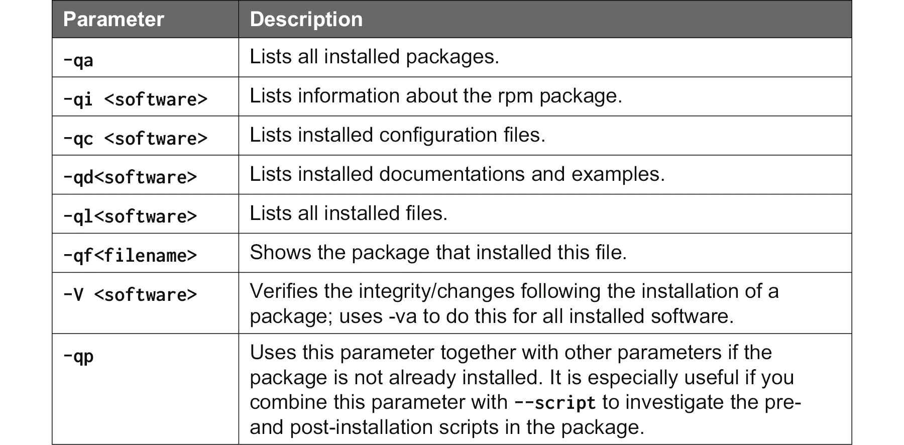

###### 图 5.1:常见的**rpm**查询参数

以下截图是获取已安装 SSH 服务器包信息的示例:

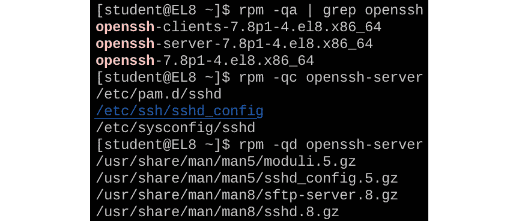

###### 图 5.2:SSH 服务器包信息

参数**-V**的输出可以告诉我们对已安装软件所做的更改。 让我们对**sshd_config**文件进行修改:

/etc/ssh/sshd_config /tmp

sudo sed -i 's/#端口 22/端口 22/' /etc/ssh/sshd_config

如果验证安装的包，会发现输出中增加了**S**和**T**，表明时间戳发生了变化，文件大小发生了变化:

###### 图 5.3:S 和 T 表示时间戳和文件大小的变化

输出中其他可能的字符如下:

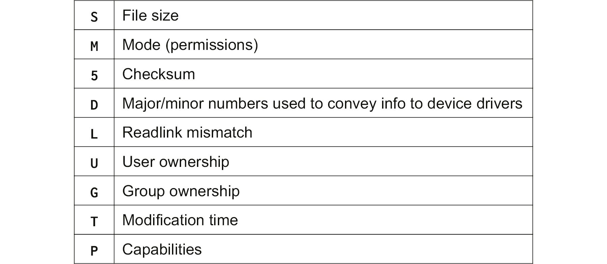

###### 图 5.4:可能的输出字符及其描述

对于文本文件，使用**diff**命令可以显示**/tmp**目录下的备份与**/etc/ssh**目录下的配置的差异:

/etc/ssh/sshd_config /tmp/sshd_config

恢复原文件如下:

/etc/ssh/sshd_config . conf /tmp/sshd_config . conf

### YUM 软件管理

**Yellowdog updatater Modified**(**YUM**)是 Red Hat 在 Enterprise Linux version 5 中引入的现代软件管理工具，取代了**up2date**实用程序。 它目前在所有基于 Red hat 的发行版中使用，但将被 Fedora 使用的**dnf**所取代。 好消息是**dnf**与**yum**语法兼容。

百胜负责以下工作:

*   安装软件，包括依赖项
*   更新软件
*   删除软件
*   列出和搜索软件

重要的基本参数如下:

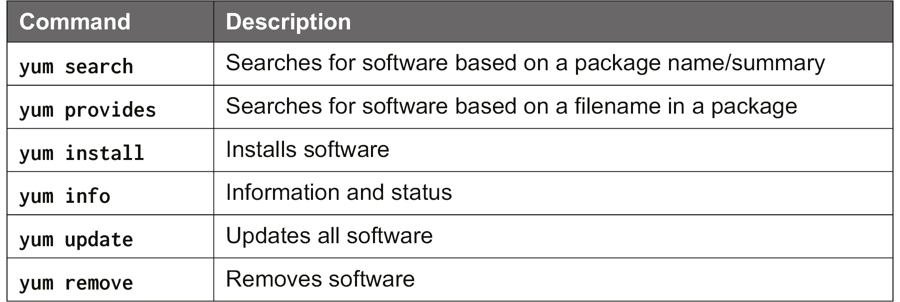

###### 图 5.5:基本的 YUM 参数

你也可以安装软件的模式; 例如,*文件和打印服务器模式或一组是一个非常方便的方式安装**网络文件分享**(**NFS)和 Samba 文件服务器和杯子一起打印服务器,而不是安装包:***

 *

###### 图 5.6:YUM 组命令及其描述

**yum**的另一个好特性是与历史一起工作:

###### 图 5.7:YUM 历史命令及其描述

**yum**命令使用存储库来完成所有的软件管理。 要列出当前配置的存储库，使用以下命令:

yum repolist

要添加另一个存储库，您需要**yum-config-manager**工具，该工具创建和修改**/etc/yum. reposit 中的配置文件。 d**。 例如，如果你想添加一个存储库来安装 Microsoft SQL Server，使用以下命令:

yum-config-manager——add-repo \

  https://packages.microsoft.com/config/rhel/7/\

该服务器- 2017.回购

可以通过插件来扩展**yum**功能，例如，可以选择最快的镜像，启用文件系统**/**LVM 快照，并将**yum**作为一个计划任务(cron)运行。

### 基于 DNF 的软件管理

在 Red Hat Enterprise Linux 8 以及基于该发行版的所有发行版以及 Fedora 上，**yum**命令被 DNF 取代。 语法是相同的，所以只需要替换三个字符。 **yum-config-manager**命令被替换为**dnf config-manager**。

它不是一个单独的实用程序，而是与**dnf**命令本身集成。

它还有新的功能。 RHEL 8 具有软件模块化，也称为**AppStreams**。 作为一个打包概念，它允许系统管理员从多个可用版本中选择所需的软件版本。 顺便说一下，目前可能只有一个版本可用，但更新的版本将会出现! 例如，一个可用的 AppStreams 是 Ruby 编程解释器。 让我们来看看这个模块:

Sudo DNF 模块列表 ruby

###### 图 5.8:Ruby 编程解释器模块

从前面的输出中，您可以看到在撰写本书时，只有 2.5 版本可用; 更多版本将会及时添加。 这是默认版本，但没有启用也没有安装。

要启用和安装 AppStreams，请执行以下命令:

Sudo DNF 模块启用 ruby:2.5

安装 ruby 的 Sudo DNF 模块

如果你再次列出 AppStreams，输出就会改变:

###### 图 5.9:安装并启用 Ruby 2.5

提示:要知道 AppStreams 安装了哪些包，你可以使用以下命令:

Sudo DNF 模块信息 ruby

#### 请注意

了解更多关于订阅管理器的信息，请访问[https://access.redhat.com/ecosystem/ccsp/microsoft-azure](https://access.redhat.com/ecosystem/ccsp/microsoft-azure)。

### DPKG 软件管理器

Debian 发行版不使用 RPM 格式; 相反，它使用了 1995 年发明的 DEB 格式。 该格式在所有基于 Debian 和 ubuntu 的发行版中都被使用。

一个 DEB 包包含以下内容:

*   一个包含软件包版本的文件**debian-binary**。
*   一个归档文件**control.tar**，包含元数据(包名、版本、依赖项和维护者)。
*   包含实际软件的存档文件**data.tar**。

DEB 包的管理可以用**dpkg**实用程序来完成。 与**rpm**一样，**dpkg**实用程序不再用于安装软件，尽管该功能可用。 相反，使用更高级的**apt**命令。 不过，最好了解 dpkg 命令的基本知识。

所有元数据都进入一个数据库，可以通过**dpkg**或**dpkg-query**进行查询。

**dpkg-query**的重要参数如下:

###### 图 5.10:重要的**dpkg-query 参数**

**dpkg -l**输出的第一列还显示了包是否安装，或未打包，或半安装，等等:

###### 图 5.11**dpkg -l**命令输出

第一列中的第一个字符是期望的操作，第二个字符是包的实际状态，可能的第三个字符表示错误标志(**R**)。 **ii**表示安装包。

可能的期望状态如下:

*   **u**:未知
*   **i**:安装
*   **h**:等待
*   **r**:移除
*   **p**:吹扫

重要的包状态如下:

*   **n**:not - the package is not installed。
*   **i**:install - the package is successfully installed。
*   **c**:cfg -files—配置文件已经存在。
*   **u**:未包装-包裹仍未包装。
*   **f**:Failed-cfg-failed to remove the configuration file .日志含义
*   **h**:half -in—软件包只是部分安装。

### 运用 apt 进行软件管理

在基于 Debian / ubuntu 的发行版中，软件管理是通过**apt**实用程序完成的，它是**apt-get**和**apt-cache**实用程序的最新替代品。

最常用的命令包括:

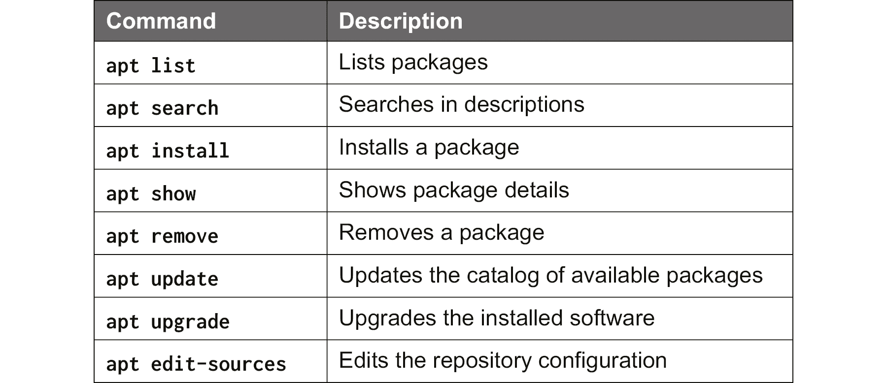

###### 图 5.12:常见的**apt 命令及其描述**

存储库是在**/etc/apt/sources.中配置的 在**/etc/apt/sources.list 中列出**目录和文件。 d/**目录。 或者，可以使用**apt-add-repository**命令:

apt-add-repository \

“黛比 http://myserver/path/to/repo 稳定”

**apt**存储库有发布类的概念，下面列出了其中一些:

*   **oldstable**:该软件在发行版的前一个版本中测试过，但在当前版本中没有再次测试。
*   **stable**:软件正式发布。
*   **测试**:软件还没有**稳定**，但是已经在开发中了。
*   **不稳定**:软件开发正在进行，主要由开发人员运行。

这些存储库也有组件的概念，也被称为主存储库:

*   **main**:测试并提供支持和更新
*   **contrib**:测试并提供支持和更新，但是有一些依赖项不在主系统中，而是在**非空闲**中
*   **非免费**:不符合 Debian 社会契约准则的软件([https://www.debian.org/social_contract#guidelines](https://www.debian.org/social_contract#guidelines))

Ubuntu 增加了几个额外的组件或存储库:

*   **Universe**:社区提供，不支持，可能更新
*   **受限**:专有设备驱动程序
*   **Multiverse**:受版权或法律问题限制的软件

### ZYpp 软件管理

SUSE 和 Red Hat 一样，使用 RPM 进行包管理。 但是他们并没有使用**yum**，而是使用了另一个带有 ZYpp(也称为 libzypp)的工具集作为后端。 软件管理可以使用图形化配置软件 YaST 或命令行界面工具 Zypper 来完成。

#### 请注意

YUM 和 DNF 也可以在 SUSE 软件存储库中使用。 您可以使用它们来管理本地系统上的软件(仅限于安装和删除)，但这不是它们可用的原因。 原因在于 Kiwi:一个用于构建操作系统映像和安装程序的应用程序。

重要的基本参数如下:

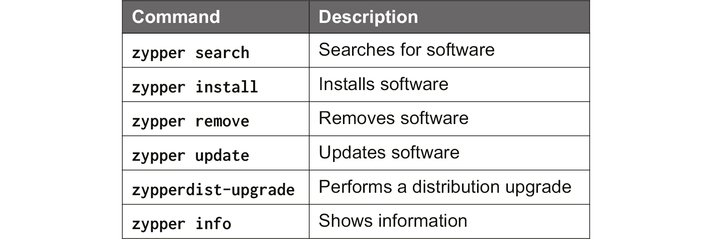

###### 图 5.13:重要的 Zypper 命令及其描述

有一个搜索选项可以搜索命令**what- provided**，但是这个选项非常有限。 如果您不知道包的名称，可以使用一个名为**cnf**的实用程序。 在您使用**cnf**之前，您需要安装**scout**; 这样，包属性就可以被搜索了:

Sudo zypper 安装侦察兵

之后，您可以使用**cnf**:

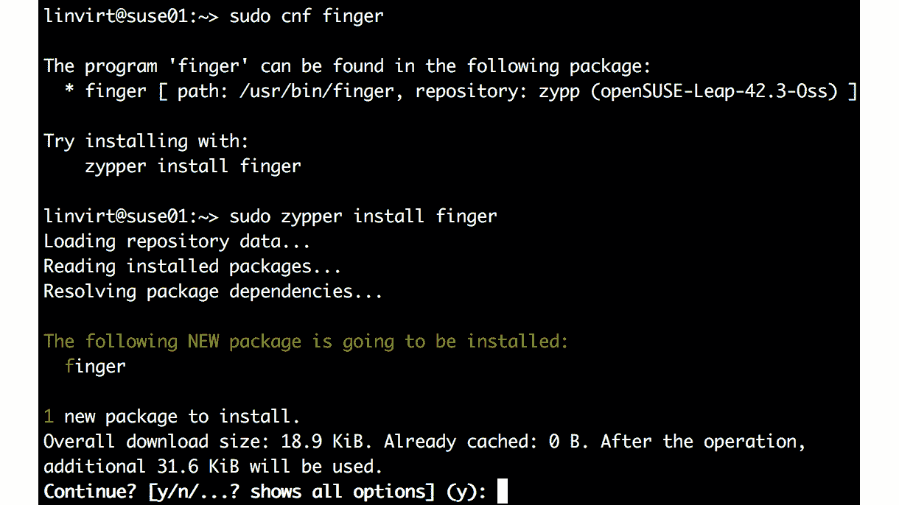

###### 图 5.14:使用 cnf 实用程序

如果您想将您的系统更新为一个新的发行版，您必须首先修改存储库。 例如,如果您想从 SUSE 42.3 飞跃,更新基于**SUSE Linux Enterprise Server**(**SLES**),到 15.0 版本,基于**SUSE Linux Enterprise**(**系统性红斑狼疮**),执行以下程序:

1.  First, install the available updates for your current version:

    sudo zypper 更新

2.  Update to the latest version in the 42.3.x releases:

    sudo zypper dist-upgrade

3.  Modify the repository configuration:

    /etc/zypp/repos.d/*.repo . /etc/zypp/repos.d/*.repo

4.  Initialize the new repositories:

    sudo zypper 刷新

5.  Install the new distribution:

    sudo zypper dist-upgrade

当然，您必须在发行版升级之后重新启动。

除了安装软件包外，还可以安装以下软件:

*   **模式**:一组包，例如，安装一个完整的 web 服务器，包括 PHP 和 MySQL(也称为 LAMP)
*   **patches**:一个包的增量更新
*   **产品**:附加产品的安装

要列出可用的模式，使用以下命令:

zypper patterns

使用以下命令安装它们:

sudo zypper 安装型式<pattern></pattern>

同样的过程也适用于补丁和产品。

Zypper 使用在线存储库查看当前配置的存储库:

我的朋友苏多

您可以使用**addrepo**参数添加存储库; 例如，要在 LEAP 15.0 上为最新的 PowerShell 版本添加一个社区存储库，执行以下命令:

苏珊

  https://download.opensuse.org/repositories\

/: / aaptel: / powershell-stuff / openSUSE_Leap_15.0 / \

  home:aaptel:powershell-stuff.repo

如果你添加一个存储库，你总是需要刷新存储库:

sudo zypper 刷新

#### 请注意

SUSE 有可信任或不信任存储库的概念。 如果不信任某个供应商，则需要在**install**命令中添加**——from**参数。 也可以在**/etc/vendors.目录下添加配置文件 d**，如:

**【主要】**

**vendors = suse,opensuse,obs://build.suse.de**

可以通过**zypper 信息**找到一个包的供应商。

现在您知道了如何管理您的发行版中的软件，让我们继续讨论网络。 在前一章中，我们讨论了 Azure 中的网络资源; 现在是学习 Linux 网络的时候了。

## 网络

在 Azure 中，网络设置，例如 IP 地址和 DNS 设置，是通过**动态主机配置协议**(**DHCP**)提供的。 该配置非常类似于运行在另一个平台上的物理机器或 vm 的配置。 区别在于，配置是由 Azure 提供的，通常不应该更改。

在本节中，您将学习如何识别 Linux 中的网络配置，以及如何将这些信息与前一章中介绍的 Azure 中的设置相匹配。

### 识别网络接口

在引导过程中和之后，Linux 内核负责硬件识别。 当内核识别硬件时，它将收集到的信息交给一个进程，一个运行的守护进程(后台进程)，名为**systemd-udevd**。 这个守护进程做以下工作:

*   如果需要，加载网络驱动程序。
*   它可以承担设备命名的责任。
*   更新**/sys**所有可用信息。

**udevadm**实用程序可以帮助您显示已识别的硬件。 可以使用**udevadm info**命令查询**udev**数据库中的设备信息:

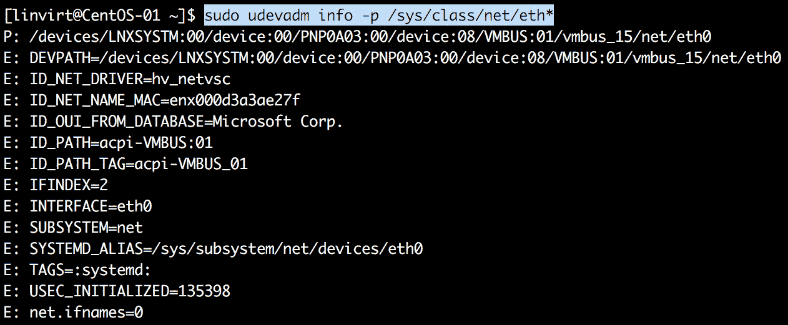

###### 图 5.15:使用**udevadm info**命令检索设备信息

而不是使用**udevadm**,你也可以到**/ sys /类/净**目录并查看**猫**命令可用的文件,但这并不是一个非常友好的方法,通常情况下,没有必要这样做,因为有实用程序解析所有可用的信息。

最重要的实用程序是**ip**命令。 让我们从列出可用的网络接口及其相关信息开始:

ip 链接显示

前面的命令应该会给出如下输出:

###### 图 5.16:使用 ip link show 列出可用的网络接口

一旦列出可用的网络接口，您可以更具体:

IP link show dev eth0

所有状态标志的含义，如**LOWER_UP**，可以在**man 7 网络设备**中找到。

### IP 地址识别

学习完网络接口的名称后，可以使用**ip**实用程序显示在网络接口上配置的 ip 地址，如下图所示:

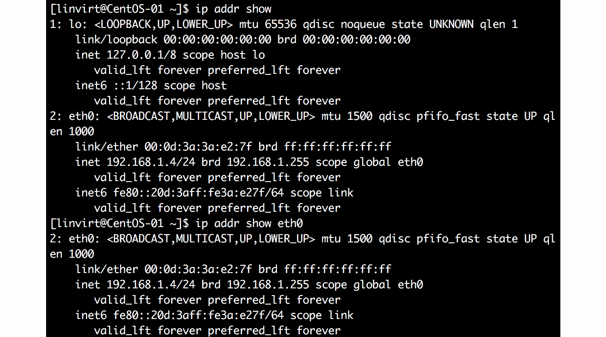

###### 图 5.17:使用 ip 实用程序检索已配置的 ip 地址

### 显示路由表

路由表是一种存储在 Linux 内核中的结构，其中包含关于如何路由数据包的信息。 通过配置路由表，使报文按照规则或条件走一条路由。 例如，你可以声明如果报文的目的地是 8.8.8.8，那么它应该被发送到网关。 路由表可以按设备或子网显示:

###### 图 5.18 显示路由表

另一个很好的特性是，你可以查询什么设备和网关被用来到达一个特定的 IP:

###### 图 5.19:查询特定 IP 使用的设备和网关

### 网络配置

现在我们知道了如何识别接口的 IP 地址和为接口定义的路由，让我们看看如何在 Linux 系统上配置这些 IP 地址和路由。

**ip**命令主要用于验证配置是否正确。 持久配置通常由另一个守护进程管理。 不同的发行版有不同的守护进程来管理网络:

*   RHEL 发行版使用**NetworkManager**。
*   在 SLE 和 OpenSUSE LEAP 中使用**wicked**。
*   在 Ubuntu 17.10 及以后版本中，使用了**systemd-networkd**和**systemd-resolved**，早期版本的 Ubuntu 完全依赖于在**/etc/network/interfaces 中配置的 DHCP 客户端。 d/*cfg**文件。

在 Ubuntu 中，Azure Linux Guest Agent 在**/run/system/network**目录下创建两个文件。 一个是名为**10-netplan-eth0 的链接文件。 链接**，根据 MAC 地址保存设备名称:

(比赛)

MACAddress = 00:……

(链接)

Name = eth0

WakeOnLan=off

另一个是**10-netplan-eth0.network**用于实际网络配置:

(比赛)

MACAddress = 00:……

Name = eth0

(网络)

DHCP=ipv4

(DHCP)

UseMTU = true

RouteMetric = 100

如果您有多个网络接口，就会创建多个文件集。

在 SUSE 操作系统中，Azure Linux Guest Agent 创建一个文件**/etc/sysconfig/network/ifcfg-eth0**，文件内容如下:

BOOTPROTO='dhcp'

DHCLIENT6_MODE = '管理'

=“能告诉我

REMOTE_IPADDR=''

STARTMODE='onboot'

CLOUD_NETCONFIG_MANAGE = '是的'

**wicked**守护进程读取这个文件并将其用于网络配置。 在 Ubuntu 中，如果你有多个网络接口，就会创建多个文件。 使用**wicked**命令可以查看配置的状态:

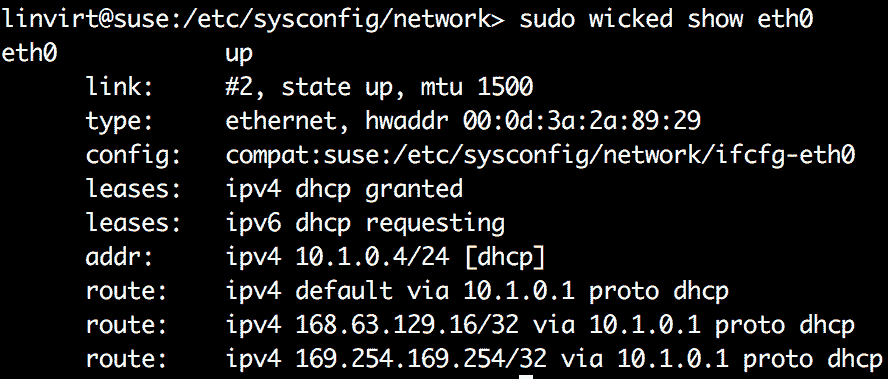

###### 图 5.20:使用 wicked show 命令检查配置状态

RHEL 和 CentOS 在**/etc/sysconfig/network-scripts**目录下创建**ifcfg-**文件:

设备= eth0

ONBOOT=yes

BOOTPROTO=dhcp

TYPE =以太网

USERCTL=no

PEERDNS = yes

IPV6INIT =不

NM_CONTROLLED =没有

DHCP_HOSTNAME =…

如果**NM_CONTROLLED**被设置为**no**，那么**NetworkManager**将无法控制连接。 大多数 Azure Linux 机器都将此设置为**yes**; 然而，你可以在**/etc/sysconfig/network-scripts**目录下的**ifcfg-**文件中验证它。 可以使用**nmcli**命令显示设备设置，但不能修改这些设置:

###### 图 5.21:使用**nmcli**命令显示设备设置

### 网络配置的变化

如前所述，每个网络设置都是由 Azure DHCP 服务器提供的。 到目前为止，我们所学的一切都是关于验证在 Azure 中配置的网络设置。

如果在 Azure 中更改了某些内容，则需要在 Linux 中重新启动网络。

在 SUSE 和 CentOS 操作系统中，可以使用如下命令:

重启网络

在最新版本的 Ubuntu Server 上，使用如下命令:

重启 systemd-networkd

Sudo systemctl restart systems-resolved .重启系统

### 主机名

虚拟机的当前主机名可以通过**hostnamectl**实用程序找到:

###### 图 5.22:使用**hostnamectl**实用程序获取主机名

主机名是由 Azure 中的 DHCP 服务器提供的; 要查看在 Azure 中配置的主机名，您可以使用 Azure 门户、Azure CLI 或 PowerShell。 以 PowerShell 为例，使用如下命令:

$myvm=Get-AzVM -Name CentOS-01 '

-ResourceGroupName MyResource1

$myvm.OSProfile.ComputerName

在 Linux 中，您可以使用**hostnamectl**实用程序更改主机名:

set-hostname(主机名)

sudo systemctl restart waagent #RedHat & SUSE

重启 walinuxagent #Ubuntu

这应该改变您的主机名。 如果不工作，检查 Azure Linux 虚拟机代理的配置文件**/etc/waagent.conf**:

供应。 MonitorHostName = y

如果仍然不能正常工作，请编辑**/var/lib/waagent/ovf-env.xml**文件，并更改**HostName**参数。 另一个可能的原因是**ifcfg-<interface>**文件中的**DHCP_HOSTNAME**行; 只需删除它并重新启动**NetworkManager**。

### DNS

DNS 设置也通过 Azure DHCP 服务器提供。 在 Azure 中，设置被附加到虚拟网络接口。 可以在 Azure portal、PowerShell(**Get-AZNetworkInterface**)或 Azure CLI(**az vm nic show**)中查看。

当然，您可以配置自己的 DNS 设置。 在 PowerShell 中，声明虚拟机并识别网络接口:

$myvm = Get-AzVM -Name<vm name="">'</vm>

-ResourceGroupName

$nicid = $myvm.NetworkProfile.NetworkInterfaces.Id

最后一个命令将为您提供所需网络接口的完整 ID; 该 ID 的最后一部分是接口名称。 现在让我们从输出中删除它并请求接口属性:

$nicname = $nicid.split("/")[-1]

$nic = Get-AzNetworkInterface '

  -ResourceGroupName <resource group> -Name $nicname

美元的网卡

如果你看一下变量**$nic**的值，你可以看到它包含了我们需要的所有信息:

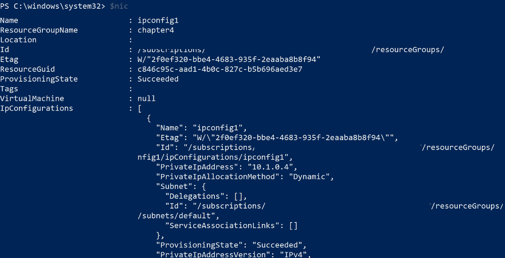

###### 图 5.23:使用$nic 变量获取接口属性

最后一步是更新 DNS 命名服务器设置。 在本书中，我们使用了**9.9.9.9**，这是一个公共的、免费的 DNS 服务，称为 Quad9。 您也可以使用谷歌(**8.8.8.8**和**8.8.4.4**的 DNS 服务:

$nic.DnsSettings.DnsServers.Add("9.9.9.9")

美元 nic | Set-AzNetworkInterface

$nic | Get-AzNetworkInterface | '

Select-Object -ExpandProperty DnsSettings

使用 Azure CLI 的方法与此类似，但涉及的步骤更少。 搜索网络接口名称:

nicname=$(az vm nic list \

——resource-group<resource group="">\</resource>

——vm-name<vm name="">——query '[]。 Id ' -o TSV | cut -d "/" -f9)</vm>

更新 DNS 设置:

az 网络网卡更新-g MyResource1——name $nicname \

——dns 服务器 9.9.9.9

然后验证新的 DNS 设置:

az network nic show -resource-group<resource group="">\</resource>

  --name $nicname --query "dnsSettings"

在 Linux 虚拟机中，需要更新 DHCP 租期才能接收新的设置。 为了做到这一点，你可以在 RHEL 中运行**systemctl restart NetworkManager**或者在 Ubuntu 中运行**dhclient -r**。 配置文件保存在**/etc/resolv.conf**文件中。

在 Linux 发行版使用的网络实现**systemd**,如 Ubuntu,**/etc/resolv.conf 文件是一个符号链接到一个文件在**/运行/ systemd /解析/**目录,和**sudo systemd-resolve——状态**命令显示您当前的设置:**

link 2 (eth0)

当前作用域:DNS

LLMNR 设置:是的

MulticastDNS 设置:没有

DNSSEC 设置:没有

DNSSEC 支持:不

DNS 服务器:9.9.9.9

           DNS 域:reddog.microsoft.com

要测试 DNS 配置，您可以使用**dig**，或者更简单的**主机**实用程序，如下所示:

dig www.google.com A

## 存储

在前一章中，我们讨论了如何创建磁盘并将其绑定到 VM，但我们的工作并没有结束。 我们必须将磁盘分区或挂载到 Linux 机器上。 在本节中，我们将讨论 Linux 中的存储管理。 在 Azure 中有两种类型的存储:绑定到 VM 的虚拟磁盘和 Azure 文件共享。 本章将介绍这两种类型。 我们将讨论以下议题:

*   为虚拟机添加单个虚拟磁盘
*   使用文件系统
*   使用**逻辑卷管理器**(**LVM**)和 RAID 软件处理多个虚拟磁盘

### 块设备提供的存储

本地存储和远端存储可以通过块设备下发。 在 Azure,几乎总是一个虚拟硬盘连接到 VM,但可以使用**互联网小型计算机系统接口**(**iSCSI)卷,由微软 Azure StorSimple 或第三方。**

 **连接到虚拟机的每个磁盘都由内核标识，在标识之后，内核将其交给一个名为**systemd-udevd**的守护进程。 这个守护进程负责在**/dev**目录中创建一个条目，更新**/sys/class/block**，并在必要时加载一个驱动程序来访问文件系统。

**/dev**中的设备文件提供了一个到块设备的简单接口，并被 SCSI 驱动程序访问。

有多种方法来识别可用的块设备。 一种可能是使用**lsscsi**命令:

###### 图 5.24:使用**lsscsi**命令识别块设备

第一个可用磁盘称为**sda**-SCSI 磁盘 a。该磁盘是由虚拟机发放过程中使用的映像磁盘创建的，也称为根磁盘。 您可以通过**/dev/sda**或**/dev/disk/azure/root**访问该磁盘。

另一种识别可用存储的方法是使用**lsblk**命令。 它可以提供关于磁盘内容的更多信息:

###### 图 5.25:使用 lsblk 命令识别可用存储

在本例中，在**/dev/sda, sda1**和**sda2**上创建了两个分区(或者**/dev/disk/azure/root-part1**和**root-part2**)。 第二列中的主要数字**8**表示这是一个 SCSI 设备; 次要的部分只是编号。 第三列告诉我们,设备不移动,由**0 表示**(这是一个【病人】1 如果是可移动),和第五列告诉我们,驱动器和分区不是只读:,**1 只读和读写**【t16.1】0。

还有一个磁盘可用，即资源磁盘**/dev/sdb**(**/dev/disk/azure/resource**)，这是一个临时磁盘。 这意味着数据不是持久的，在重新引导后就会消失，用于存储页面或交换文件等数据。 Swap 类似于 Windows 中的虚拟内存，它在物理 RAM 满时使用。

### 添加数据磁盘

在本节中，我们将回顾在前一章中所做的，以继续练习并帮助您熟悉这些命令。 如果已有添加数据磁盘的虚拟机，可跳过本节。

您可以使用 Azure 门户或通过 PowerShell 向 VM 添加一个额外的虚拟磁盘。 让我们添加一个磁盘:

1.  First, declare how we want to name our disk and where the disk should be created:

    美元 resourcegroup = '【工人】'

    $location = '<location>'</location>

    美元 diskname = '【工人】'

    $vm = Get-AzVM '

    -Name<vm name="">'</vm>

    -ResourceGroupName resourcegroup 美元

2.  Create the virtual disk configuration—an empty, standard managed disk of 2 GB in size:

    $diskConfig = New-AzDiskConfig

    -SkuName ' Standard_LRS ' '

    位置位置的美元

    -创造选择" empty "

       -DiskSizeGB 2

3.  Create the virtual disk using this configuration:

    $dataDisk1 = New-AzDisk '

      -DiskName $diskname '

      -Disk $diskConfig '

    -ResourceGroupName resourcegroup 美元

4.  Attach the disk to the VM:

    $vmdisk = Add-AzVMDataDisk '

    -VM $vm -Name $diskname '

    -CreateOption 附加的

    -ManagedDiskId dataDisk1 美元。 Id '

      -Lun 1

    Update-AzVM '

    vm 虚拟机的美元

    -ResourceGroupName resourcegroup 美元

5.  Of course, you can use the Azure CLI as well:

    Az 磁盘创建\

    ——resource-group<resource group="">\</resource>

    ——名称<disk name="">\</disk>

    ——location<location>\</location>

    ——size-gb 2 \

    ——sku Standard_LRS \

    Az 虚拟机磁盘挂载\

    —磁盘<disk name="">\</disk>

    ——vm-name<vm name="">\</vm>

    ——resource-group<resource group="">\</resource>

    ——伦

    #### 请注意

    LUN (Logical Unit Number)是逻辑单元号(Logical Unit Number)的缩写，是用来标识存储(在我们这里是虚拟存储)的一个数字或标识符，它可以帮助用户区分存储。 你可以从 0 开始编号。

创建完成后，虚拟机中可以看到虚拟磁盘为**/dev/sdc**(**/dev/disk/azure/scsi1/lun1**)。

提示:**如果无法使用**，则执行**rescan-scsi-bus**命令，该命令是**sg3_utils**包的一部分。

再看一下**lssci**的输出:

1.0 /dev/sdc[5:0:0:1]微软虚拟磁盘

第一列被格式化:

【t】:<channel id="">:<target id="">:</target></channel>

**主机总线适配器**是到存储的接口，由 Microsoft Hyper-V 虚拟存储驱动程序创建。 通道 ID 始终为**0**，除非您配置了多路径。 目标 ID 标识控制器上的 SCSI 目标; 对于 Azure 中直接连接的设备，这个值总是为零。

### 分区

在使用块设备之前，需要对其进行分区。 有多种可用的分区工具，有些发行版自带了创建和操作分区表的实用程序。 例如，SUSE 的 YaST 配置工具中就有一个。

在本书中，我们将使用**parted**实用程序。 这是在每个 Linux 发行版上默认安装的，可以处理所有已知的分区布局:**msdos**，**gpt**，**sun**，等等。

你可以在命令行中以脚本方式使用**parted**，但是，如果你是新手**parted**，使用交互式 shell 会更容易:

分开/dev/sdc

GNU Parted 3.1

使用/dev/sdc

欢迎来到 GNU Parted! 键入“help”查看命令列表。

1.  The first step is to show the information available regarding this device:

    (分开)打印

    错误:/dev/sdc:无法识别的磁盘标签

    型号:Msft 虚拟磁盘(scsi)

    磁盘/dev/sdc: 2147 mb

    扇区大小(逻辑/物理):512B/512B

    分区表:未知

    磁盘国旗:

    这里重要的一行是**未识别的磁盘标签**。 这意味着没有创建分区布局。 现在，最常见的布局是**GUID 分区表**(**GPT**)。

    #### 请注意

    **parted**支持问号后自动补全-按*Ctrl*+*I*两次。

2.  Change the partition label to **gpt**:

    (散开)mklabel

    新的磁盘标签类型? gpt

3.  Verify the result by printing the disk partition table again:

    (分开)打印

    型号:Msft 虚拟磁盘(scsi)

    磁盘/dev/sdc: 2147 mb

    扇区大小(逻辑/物理):512B/512B

    gpt 分区表:

    磁盘国旗:

    编号开始结束大小文件系统名称标志

4.  The next step is to create a partition:

    (parted) mkpart

    分区的名字吗? []吗? lun1_part1

    文件系统类型? (ext2) ? xfs

    开始的? 0％

    结束? 100％

    文件系统将在本章后面介绍。 对于大小调整，您可以使用百分比或固定大小。 一般来说，在 Azure 中，使用整个磁盘更有意义。

5.  Print the disk partition table again:

    (分开)打印

    型号:Msft 虚拟磁盘(scsi)

    磁盘/dev/sdc: 2147 mb

    扇区大小(逻辑/物理):512B/512B

    gpt 分区表:

    磁盘国旗:

    数量开始结束大小文件系统名称标志

    1 1049 kb 2146 mb 2145 mb                 lun1_part1

    请注意，文件系统列仍然是空的，因为该分区还没有格式化。

6.  按*Ctrl*+*D*，或**quit**，退出**parted**。

### Linux 中的文件系统

文件系统有它们组织数据的机制，这将因文件系统而异。 如果我们比较一下可用的文件系统，我们会发现一些更快，一些专为更大的存储设计，一些专为处理更小的数据块设计。 您对文件系统的选择应该取决于最终需求和存储的数据类型。 Linux 支持许多文件系统—本地 Linux 文件系统，如 ext4 和 XFS，以及第三方文件系统，如 FAT32。

每个发行版都支持本地文件系统，ext4 和 XFS; 最重要的是，SUSE 和 Ubuntu 支持一个非常现代的文件系统:BTRFS。 Ubuntu 是少数几个支持 ZFS 文件系统的发行版之一。

格式化完文件系统后，可以将其挂载到根文件系统。 **mount**命令的基本语法如下:

mount<partition></partition>

分区可以使用设备名称、标签或**通用唯一标识符**(**UUID**)进行命名。 可以使用**mount**命令或通过**ZFS**实用程序挂载 ZFS。

另一个重要的文件系统是交换文件系统。 除了普通的文件系统之外，还有其他特殊的文件系统:devfs、sysfs、procfs 和 tmpfs。

让我们从简短描述文件系统及其相关实用程序开始。

### **ext4 文件系统**

ext4 是一种本机 Linux 文件系统，是作为 ext3 的后继版本开发的，多年来它一直是(对于某些发行版来说仍然是)默认文件系统。 它提供了稳定性，高容量，可靠性和性能，同时需要最小的维护。 除此之外，您还可以毫无问题地调整(增加/减少)文件系统的大小。

好消息是，它可以以非常低的要求提供这种服务。 当然，也有坏消息:它非常可靠，但它不能完全保证数据的完整性。 如果数据在磁盘上已经损坏，ext4 无法检测或修复这种损坏。 幸运的是，由于 Azure 的底层架构，这种情况不会发生。

Ext4 不是最快的文件系统，但是，对于许多工作负载，Ext4 和竞争对手之间的差距非常小。

最重要的实用程序如下:

*   **mkfs。 ext4**:格式化文件系统
*   **e2label**:修改文件系统的标签
*   **tune2fs**:修改文件系统参数
*   **dump2fs**:显示文件系统参数
*   **resize2fs**:修改文件系统的大小
*   **fsck。 ext4**:检查和修复文件系统
*   **e2freefrag**:碎片整理报告
*   **e4defrag**:对文件系统进行碎片整理; 通常不需要

使用如下命令创建 ext4 文件系统:

sudo mkfs。 ext4 -L<label><partition></partition></label>

这个标签是可选的，但是它更容易识别文件系统。

### **XFS 文件系统**

XFS 是一个高度可伸缩的文件系统。 它可以缩放到 8 EiB (exbibyte = 2^60 字节)与在线调整; 只要有未分配的空间，文件系统就可以增长，它可以跨越多个分区和设备。

XFS 是最快的文件系统之一，尤其是与 RAID 卷结合使用时。 然而，这是有代价的:如果要使用 XFS, VM 中至少需要 1gb 的内存。 如果您希望能够修复文件系统，您至少需要 2 GB 的内存。

XFS 的另一个很好的特性是，您可以暂停文件系统的通信，从而为数据库服务器等创建一致的备份。

最重要的实用程序如下:

*   **mkfs。 xfs**:格式化文件系统
*   **xfs_admin**:修改文件系统参数
*   **xfs_growfs**:减小文件系统大小
*   **xfs_repair**:检查和修复文件系统
*   **xfs_freeze**:暂停对 XFS 文件系统的访问; 这使得一致备份更加容易
*   **xfs_copy**:快速复制 XFS 文件系统的内容

使用如下命令创建 XFS 文件系统:

sudo mkfs。 xfs -L<label><partition></partition></label>

这个标签是可选的，但是它更容易识别文件系统。

### **ZFS 文件系统**

ZFS 是一个由 SUN 开发的文件系统和逻辑卷管理器，自 2005 年以来由 Oracle 拥有。 它以其出色的性能和丰富的功能而闻名:

*   卷管理和 RAID
*   防止数据损坏
*   数据压缩和重复数据删除
*   可扩展到 16 艾字节
*   能够导出文件系统
*   快照支持

ZFS 可以通过用户空间驱动程序(FUSE)或 Linux 内核模块(OpenZFS)在 Linux 上实现。 在 Ubuntu 中，最好使用内核模块; 它的性能更好，并且没有 FUSE 实现的一些限制。 例如，如果使用 FUSE，就不能使用 NFS 导出文件系统。

OpenZFS 没有被广泛采用的主要原因是许可。 OpenZFS 的**Common Development and Distribution License**(**CDDL**)License 与 Linux 内核的 General Public License 不兼容。 另一个原因是 ZFS 可能是一个真正的内存消耗者; 您的虚拟机每 TB 的存储需要额外的 1gb 内存，这意味着 16tb 的存储需要 16gb 的 RAM 用于应用程序。 对于 ZFS，建议至少有 1gb 的内存。 但是越多越好，因为 ZFS 使用了大量内存。

最重要的实用程序如下:

*   **zfs**:配置 zfs 文件系统
*   **zpool**:配置 ZFS 存储池
*   **zfs。 fsck**:检查和修复 ZFS 文件系统

在本书中，只介绍了 ZFS 的基本功能。

Ubuntu 是唯一支持 ZFS 的发行版。 为了能够在 Ubuntu 中使用 ZFS，你必须安装 ZFS 实用程序:

安装 zfsutils-linux

安装之后，您可以开始使用 ZFS。 让我们假设您向 VM 添加了三个磁盘。 使用 RAID 0 是一个好主意，因为它提供了比单个磁盘更好的性能和吞吐量。

作为第一步，让我们创建一个包含两个磁盘的池:

sudo zpool create -f mydata /dev/sdc /dev/sdd

戴达

须藤戴达状态

现在让我们添加第三个磁盘，来展示如何扩展池:

sudo zpool add mydata /dev/sde

戴达

sudo zpool history mydata

你可以直接使用这个池，或者你可以在其中创建数据集来更细粒度地控制特性，比如配额:

Sudo ZFS 创建 mydata/finance

sudo zfs set quota=5G mydata/finance

sudo zfs 列表

最后但并非最不重要的，你需要挂载这个数据集才能使用它:

Sudo ZFS 设置 mountpoint=/home/finance mydata/finance

findmnt /home/finance

这个挂载在重新启动期间将是持久的。

**BTRFS 文件系统**

BTRFS 是一个相对较新的文件系统，主要由 Oracle 开发，但有 SUSE 和 Facebook 等公司的贡献。

就功能而言，它与 ZFS 非常相似，但它仍处于大量开发之中。 这意味着并不是所有的功能都被认为是稳定的。 在使用该文件系统之前，请访问[https://btrfs.wiki.kernel.org/index.php/Status](https://btrfs.wiki.kernel.org/index.php/Status)。

内存需求与 XFS 相同:VM 中有 1gb 的内存。 如果您想要修复文件系统，则不需要额外的内存。

在本书中，只介绍了 BTRFS 的基本功能。 您可以在所有发行版上使用 BTRFS，但是请注意，在 RHEL 和 CentOS 上，文件系统被标记为 deprecated，在 RHEL 8 中，它被删除了。 更多信息，请访问[https://access.redhat.com/solutions/197643](https://access.redhat.com/solutions/197643)。

最重要的实用程序如下:

*   **mkfs。 btrfs**:用该文件系统格式化设备
*   **btrfs**:管理文件系统

让我们假设您向 VM 添加了三个磁盘。 使用 RAID 0 来提高性能，与只使用单个磁盘相比，可以提高吞吐量，这是一个好主意。

作为第一步，让我们创建一个带有两个底层磁盘的 BTRFS 文件系统:

sudo mkfs。 btrfs -d raid0 -L mydata /dev/sdc /dev/sdd

当然，你可以用第三个磁盘来扩展文件系统，但是在你这样做之前，你必须先挂载文件系统:

sudo mkdir /电脑/ mydata

sudo mount LABEL=mydata /srv/mydata

Sudo BTRFS 文件系统 show /srv/mydata

现在，添加第三个磁盘:

sudo btrfs device add /dev/sde /srv/mydata

Sudo BTRFS 文件系统 show /srv/mydata

与 ZFS 一样，BTRFS 也有数据集的概念，但在 BTRFS 中，它们被称为**子卷**。 使用实例创建子卷。

BTRFS 子卷创建/srv/mydata/finance

sudo btrfs subvolume list /srv/mydata

可以独立于根卷挂载子卷:

sudo mkdir /home/finance

-o subvol=finance LABEL=mydata /home/finance

在**findnt**命令的输出中可以看到 ID**258**:

###### 图 5.26:创建子卷

**交换文件系统**

如果您的应用程序没有足够的内存可用，您可以使用交换。 使用交换总是一个好的做法，即使您的机器上有足够的 RAM。

空闲内存是应用程序以前使用过但当前不需要的内存。 如果在一段时间内没有使用此空闲内存，则将对其进行交换，以便为更频繁使用的应用程序提供更多内存。

为了提高整体性能，在 Linux 安装中添加一些交换空间是个好主意。 使用可用的最快存储是一个好主意，最好是在资源磁盘上。

#### 请注意

在 Linux 中，您可以使用交换文件和交换分区。 在性能上没有差别。 在 Azure 中，你不能使用交换分区; 这将使您的系统不稳定，这是由底层存储引起的。

Azure 中的交换由 Azure VM Agent 管理。 验证“**ResourceDisk. properties”是否正确。 将**y**设置为 EnableSwap**参数，以确认**/etc/waagent.conf**中是否启用交换。 此外，您可以在**ResourceDisk 中检查交换磁盘大小。 SwapSizeMB**:

#在资源磁盘上创建和使用 swapfile

ResourceDisk。 EnableSwap = y

#交换文件大小。

ResourceDisk.SwapSizeMB=2048

一般来说，一个 2048 MB 内存的**交换文件**足以提高整体性能。 如果交换未启用，要创建交换文件，可以通过设置以下三个参数来更新**/etc/waagent.conf**文件:

*   **ResourceDisk。 格式=y**
*   **ResourceDisk。 EnableSwap=y**
*   **ResourceDisk。 SwapSizeMB=xx**

为了重启 Azure VM Agent，对于 Debian/Ubuntu，执行以下命令:

威尔斯代理

redhat /CentOS 操作系统:

服务 waagent 重启

验证结果:

ls -lahR /mnt | grep -i swap

swapon –s

如果发现没有创建交换文件，可以继续并重新启动虚拟机。 要做到这一点，可以使用以下命令之一:

Shutdown -r now init 6

### Linux 软件 RAID

**独立磁盘冗余阵列(RAID**),最初被称为廉价磁盘冗余阵列,是一种冗余技术相同的数据存储在不同的磁盘,这将帮助您恢复数据在磁盘故障的情况下。 RAID 有不同的级别。 微软在[https://docs.microsoft.com/en-us/azure/virtual-machines/linux/configure-raid](https://docs.microsoft.com/en-us/azure/virtual-machines/linux/configure-raid)正式声明，您需要 RAID 0 才能获得最佳性能和吞吐量，但这不是一个强制实现。 如果当前的基础设施需要 RAID，那么可以实现它。****

 **如果您的文件系统不支持 RAID，您可以使用 Linux Software RAID 来创建 raid0 设备。 您需要安装**mdadm**实用程序; 它在每个 Linux 发行版中都可用，但在默认情况下可能不会安装。

让我们假设您向 VM 添加了三个磁盘。 让我们创建一个名为**/dev/md127**的 RAID 0 设备(只是一个尚未使用的随机数):

——创建/dev/md127——level 0 \

, raid 设备 3 /dev/sd {c, d, e}

验证配置的方法如下:

cat /proc/mdstat

sudo mdadm --detail /dev/md127

前面的命令应该会给你如下的输出:

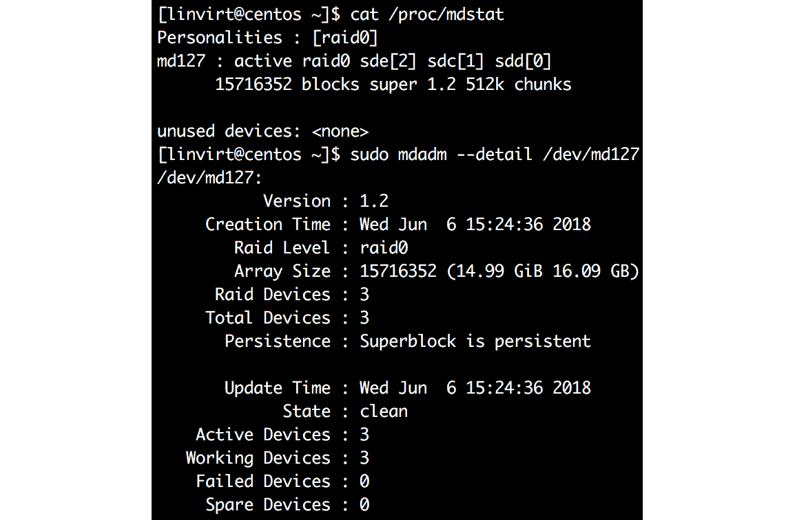

###### 图 5.27:验证 RAID 配置

使配置持久:

Mdadm——detail——scan——verbose >> /etc/mdadm.conf .conf

现在，你可以使用这个设备并使用文件系统来格式化它，如下所示:

mkfs.ext4 -L BIGDATA /dev/md127

### 【析构

Stratis 是 RHEL 8 中新引入的，用于创建一个多磁盘、多层存储池，方便地监控和管理池，并减少人工干预。 它不提供 RAID 支持，但它将多个块设备转换为一个池，池上有一个文件系统。 Stratis 使用已经存在的技术:LVM 和 XFS 文件系统。

如果在 RHEL 上没有安装 Stratis，可以通过执行以下命令轻松安装:

Sudo DNF 安装 stratis-cli

使用以下命令启用守护进程:

Sudo systemctl enable——现在 stratisd

让我们假设您向 VM 添加了两个数据磁盘:**/dev/sdc**和**/dev/sdd**。 创建连接池:

sudo stratis pool create stratis01 /dev/sdc /dev/sdd

使用这个命令验证:

Sudo 分层池列表

输出显示存储的总量; 在上面的例子中，是 64gb。 104 它的 MiB 已经被池管理所需的元数据占用:

###### 图 5.28 层池存储细节

需要获取池中磁盘的详细信息和使用情况，使用如下命令:

Sudo 分层 blockdev 列表

正如您在下面的屏幕截图中看到的，我们得到了相同的输出，但是提供了关于池中的磁盘和使用情况的更多细节。 在如下输出中，可以看到池的名称和状态:

###### 图 5.29:池名称和状态

这里，存储用于数据，因为也可以将磁盘配置为读/写缓存。 Stratis 在新创建的池上形成一个文件系统(默认是 xfs):

创建 stratis01 finance 文件系统

文件系统被标记为**finance**，可以通过设备名(**/stratis/stratis01/finance**)或 UUID 访问。

有了这些信息，您就可以像安装其他文件系统一样安装它，就像使用 systemd 安装一样，我们将在本章后面讨论。

创建文件系统后，可以创建快照，快照基本上是原始文件系统的副本。 可以通过执行该命令添加快照:

Sudo 分层文件系统快照 stratis01 finance finance_snap

要列出文件系统，我们可以执行以下命令:

sudo 层云文件系统

您必须将它作为一个普通文件系统来安装!

增加读写缓存可以提高性能，特别是当您使用的硬盘性能优于标准 SSD 盘(甚至非 SSD 盘)时。 假设这个磁盘是**/dev/sde**:

Sudo Sudo 分层池添加-cache stratis01 /dev/sde

和之前一样，用**blockdev**参数验证:

###### 图 5.30:添加缓存到**/dev/sde 磁盘**

最后，我们讨论了各种文件系统; 您的选择将取决于您的需求。 首先，您需要确保文件系统与您的发行版兼容; 例如，BTRFS 在 RHEL 8 中被删除。 所以，最好在选择之前检查一下兼容性。

## systemd

Linux 内核引导后，第一个 Linux 进程开始第一个进程。 这个进程被称为**init**进程。 在现代 Linux 系统中，这个进程称为**systemd**。 请看下面的截图，它以树格式显示了正在运行的进程:

###### 图 5.31:树形格式的运行过程视图

Systemd 负责在引导过程中并行启动所有进程，除了由内核创建的进程。 在此之后，它根据需要激活服务以及其他功能。 它还跟踪和管理挂载点，并管理系统范围的设置，如主机名。

Systemd 是一个事件驱动的系统。 它与内核和反应等事件的时间点或用户引入了一个新的设备或按**Ctrl + Alt*+*【5】。**

 *### 与单位一起工作

Systemd 与单元一起工作，单元是由 Systemd 管理的实体，封装关于与 Systemd 相关的每个对象的信息。

单元文件是包含配置指令的配置文件，描述了单元并定义了它的行为。 这些文件的存储方式如下:

###### 图 5.32:单元文件及其描述

单元可以通过**systemctl**实用程序进行管理。 如果需要查看所有可用类型，请执行以下命令:

systemctl——类型帮助

要列出所有安装的单元文件，使用以下命令:

sudo systemctl list-unit-files

要列出激活的单元，使用以下命令:

sudo systemctl list-units

**列表单元文件**和**列表单元**参数都可以与**—类型**结合使用。

### 服务

服务单元是用来管理脚本或守护进程的。 让我们来看看 SSH 服务:

#### 请注意

截图来自 Ubuntu 18.04。 服务的名称在其他发行版上可能有所不同。

###### 图 5.33:ssh 服务细节

使用**systemctl**的**状态**参数，可以看到单元已加载，在引导时启用，并且它是默认值。 如果它没有被启用，你可以用这个命令来启用它; 启用将把服务添加到自动启动链:

要查看服务状态，可以执行以下命令:

sudo systemctl status

在输出中，您可以看到 SSH 服务正在运行，并且显示了日志记录中的最后一个条目:

###### 图 5.34:服务状态和条目

要查看**单元**文件的内容，执行以下命令:

sudo systemctl cat

一个**单元**文件总是有两个或三个部分:

*   **【单位】**:描述和依赖处理
*   **[<Type>]**:类型配置
*   **[Install]**:可选部分，如果你想在启动时启用服务

要处理依赖关系，有几个可用的指令; 最重要的是:

*   **before**:指定的单元延迟到该单元启动。
*   **after**:指定的单元在该单元启动之前启动。
*   **要求**:如果这个单位被激活，这里列出的单位也会被激活。 如果指定的单元失败了，这个单元也会失败。
*   **wanted**: If this unit is activated, the unit listed here will be activated as well. There are no consequences if the specified unit fails.

    #### 请注意

    如果在之前没有指定**，在**之后没有指定**，则列出的单元(以逗号分隔)将在单元启动的同时启动。**

以**ssh**服务为例:

(单位)

描述= = network.target 后 OpenSSH 守护进程

(服务)

EnvironmentFile = - / etc / sysconfig / ssh

ExecStartPre = / usr / sbin / sshd-gen-keys-start

ExecStart=/usr/sbin/sshd -D $SSHD_OPTS

ExecReload=/bin/kill -HUP $MAINPID KillMode=进程

重启=总

(安装)

WantedBy=multi-user.target

**服务**部分的大多数选项都不言自明; 如果没有，请查看**systemd 的手册页。** 和**系统。** 。 对于**[Install]**部分，**WantedBy**指令声明，如果您启用此服务，它将成为**多用户的一部分。 目标**集合，该集合在引导时被激活。

在讨论目标之前，要讨论的最后一件事是如何创建覆盖。 Systemd 单元可以有许多不同的指令; 许多都是默认选项。 要显示所有可能的指令，执行以下命令:

sudo systemctl 显示

如果您想更改其中一个默认值，使用以下命令:

启动编辑器。 例如，添加如下条目:

(服务)

ProtectHome =只读

保存更改。 您需要重新加载 systemd 配置文件并重新启动服务:

sudo systemctl daemon-reload

重启 SSHD

回顾使用**systemctl cat sshd 进行的更改。** 。 再次登录并尝试在您的主目录中保存一些内容。

#### 请注意

如果你想另一个编辑器**systemctl 编辑**,添加一个变量,**SYSTEMD_EDITOR**,**/etc/environment 文件,例如,**SYSTEMD_EDITOR = / usr / bin / vim**。**

 **### 目标

目标是单元的集合。 有两类目标:

*   **非隔离**:正常的单元集合; 例如，**计时器。 目标**，包含所有计划任务。
*   **Isolatable**:如果执行**systemctl isolate<目标名。 目标>**，这将关闭不属于目标的所有进程，并启动属于目标的所有进程。 例子包括**救助。 目标**和**图形化。 目标**单位。

要查看目标的内容，使用以下命令:

systemctl list-dependencies<target name.target=""></target>

### 计划任务

Systemd 可以用来调度任务。 下面是一个计时器单元文件的例子:

(单位)

描述=计划备份任务

[计时器]

OnCalendar = * - * - * 10:00:00

(安装)

WantedBy=timers.target

如果将该文件的内容保存到**/etc/systemd/system/backup。 定时器**，你需要一个相应的文件**/etc/systemd/system/backup。 例如，服务**包含以下内容:

(单位)

说明=备份脚本

(服务)

类型=一次通过

ExecStart = /usr/local/bin/mybackup.sh

启用和激活定时器:

Sudo systemctl enable——now backup.timer

要了解计划的任务，使用以下命令:

sudo systemctl list-timers

#### 请注意

阅读**man 7 systemd。 时间**学习更多关于日历事件的语法。 在这个手册页上有一个专门的部分。

如果计划的任务不是循环任务，可以使用以下命令:

sudo system -run—on-calendar

例如，如果我们想在 2019 年 10 月 11 日中午 12 点回显**done**到一个文件**/tmp/done**，我们必须如下截图所示:

###### 图 5.35:通过提供事件时间运行计划任务

### 安装本地文件系统

挂载单元可用于挂载文件系统。 关于挂载单元的名称有一些特殊的东西:它必须对应于挂载点。 例如，如果你想挂载在**/home/finance**上，挂载单元文件变为**/etc/systemd/system/home-finance。 mount**:

(单位)

描述=财务目录

(山)

What = /dev/sdc1

在哪里= /home/finance

类型= xfs

选择=违约

(安装)

WantedBy = local-fs.target

使用**systemctl 启动住房金融。 mount**开始安装，并且**systemctl 启用家庭金融。 装入**在引导时装入。

### 安装远程文件系统

例如，如果一个文件系统不是本地的而是远程的，如果它是一个 NFS 共享，挂载它的最好方法是使用**automount**。 如果你没有使用 automount(**autofs**服务)，你必须手动挂载远程共享; 这样做的好处是，如果您已经访问了远程共享，autofs 将自动挂载。 它将挂载该共享，如果您失去与该共享的连接，它将尝试按需自动挂载该共享。

您必须创建两个文件。 让我们以在**/home/finance**上挂载 NFS 为例。 首先，创建**/etc/systemd/system/home-finance。 用以下内容装入**:

(单位)

说明= NFS 金融共享

(山)

什么= 192.168.122.100:/分享

在哪里= /home/finance

类型= nfs

选项=更= 4.2

创建名为**/etc/systemd/system/home-finance 的文件。 自动加载**:

(单位)

Description = Automount NFS 金融共享

(加载)

在哪里= /home/finance

(安装)

WantedBy = remote-fs.target

启动自动装载单元，而不是装载单元。 当然，您可以在引导时启用它。

## 总结

在本章中，我们深入了解了 Linux，解释了每个 Linux 系统管理员的基本任务:管理软件、网络、存储和服务。

当然，作为 Linux 系统管理员，这不是您每天都要做的事情。 最有可能的情况是，您不需要手动操作，而是将其自动化或编排。 但是为了能够编排它，您需要理解它是如何工作的，并能够验证配置并排除配置故障。 这将在*第八章，探索连续配置自动化*中讨论。

在下一章中，我们将探讨 Linux 中限制访问系统的选项:

*   强制访问控制
*   网络访问控制列表
*   防火墙

我们还将介绍如何使用 Azure Active Directory 域服务将 Linux 机器加入域。

## 问题

1.  硬件识别的责任是什么?
2.  设备命名的责任是什么?
3.  识别网络接口的方法有哪些?
4.  谁维护网络配置?
5.  识别本地附加存储的方法是什么?
6.  为什么我们在 Azure 中使用 raid0 ?
7.  在 Azure 中实现 RAID 0 有哪些选项?
8.  尝试使用三个磁盘实现 RAID 0 设备; 用 XFS 格式化它。 安装它，并确保它是在引导时安装的。

## 进一步阅读

在某种程度上，这一章是一个深入的探索，但有更多的东西要学习，与所有的主题涵盖在这一章。 我强烈建议您阅读所有使用的命令的手册页。

对于存储，除了 Azure 网站上的文档，一些文件系统还有自己的网站:

*   **XFS**:[https://xfs.org](https://xfs.org)
*   **BTRFS**:[https://btrfs.wiki.kernel.org](https://btrfs.wiki.kernel.org)
*   **ZFS**:[http://open-zfs.org](http://open-zfs.org)
*   **分层**:[https://stratis-storage.github.io](https://stratis-storage.github.io)

Lennart Poettering, systemd 的主要开发者之一，有一个很好的博客，里面有很多技巧和背景信息:[http://0pointer.net/blog](http://0pointer.net/blog)。 此外，文档可以在[https://www.freedesktop.org/wiki/Software/systemd](https://www.freedesktop.org/wiki/Software/systemd)找到。

由于**systemctl status**命令不能为您提供足够的信息，我们将在*第 11 章，故障诊断和监控工作负载*中讨论更多关于日志记录的内容。********