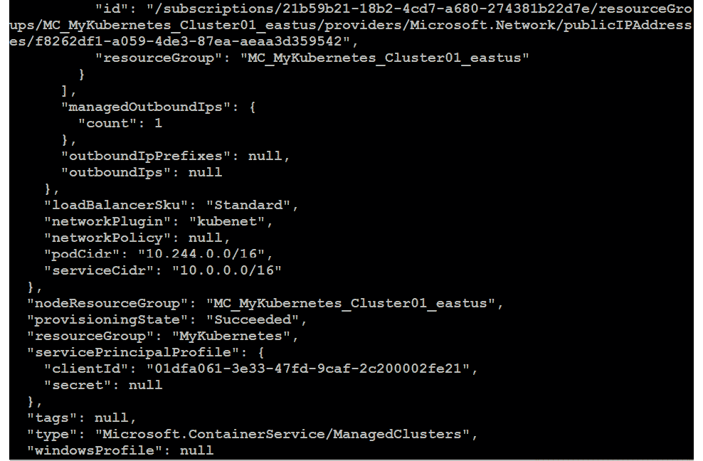
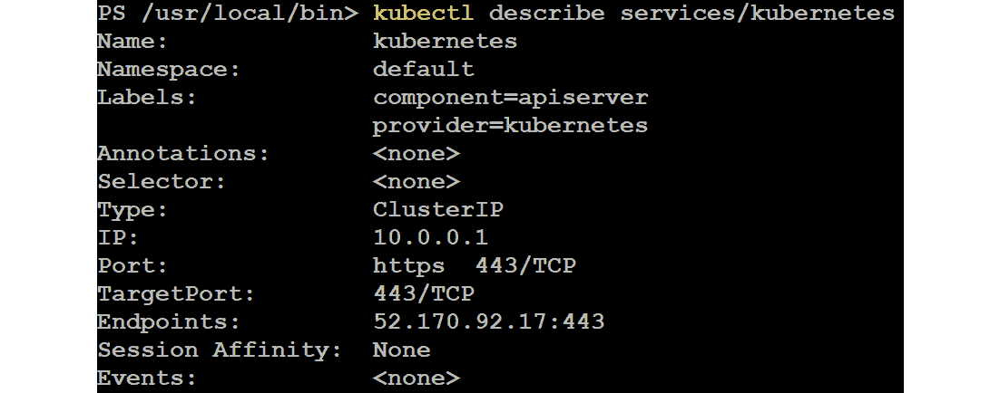
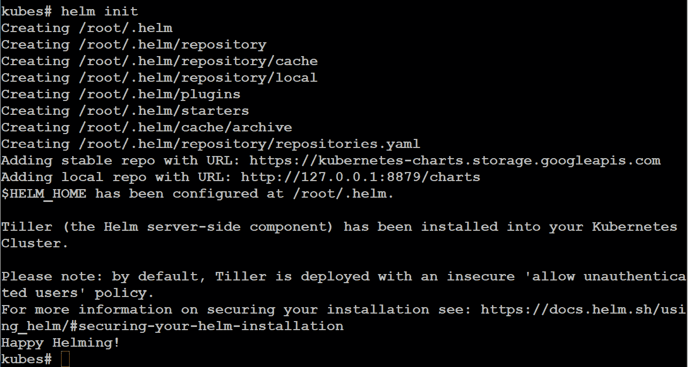

# 十、使用 Azure Kubernetes 服务

在前一章中，我们探讨了容器虚拟化的世界，特别是 Docker 容器。 本章是关于使用**Azure Kubernetes 服务**(**AKS**)管理容器化工作负载的。

这一章与这本书的其他章节不同。 到目前为止，每一章都是关于基础设施和提供一个平台:在云中工作的经典系统管理员。 甚至在*第 9 章*、*Azure 中的容器虚拟化*中也包含了诸如“我们如何安装 Docker?” 以及“我们如何让容器启动并运行?” 本章我们要回答的问题如下:

*   我们如何在开发阶段和之后部署和管理工作负载?
*   我们如何向上/向下缩放?
*   可用性选项有哪些?

Kubernetes 为所有这些问题提供了一个重要的答案。 它是一种用于自动化重要任务的解决方案，例如基于容器的应用的部署、管理、扩展、网络和可用性管理。

Kubernetes 最初由谷歌设计，现在由云本地计算基金会([https://www.cncf.io](https://www.cncf.io))维护。 微软是该基金会的重要合作伙伴，并且在资金和代码方面是 Kubernetes 项目的重要贡献者。 实际上，Kubernetes 的联合创始人之一 Brendan Burns 在微软工作，领导着微软内部的容器编排团队。 除此之外，微软还启动了几个开源项目，为 Kubernetes 提供额外的工具。

由于微软对 Kubernetes 的投入如此之多，它能够在 Azure 中实现一个完全与上游兼容的 Kubernetes 版本。 这对开发人员来说也很重要，这样他们就可以使用本地 Kubernetes 安装来开发软件，并且在开发完成后，将其发布到 Azure 云中。

AKS 为 Kubernetes 提供了一个完全管理的容器即服务解决方案。 这意味着您不必考虑 Kubernetes 软件的配置、管理和升级。 控制平面由 Azure 管理。

AKS 使得在 Azure 中部署和管理 Kubernetes 变得很容易:它可以处理完整的维护过程，从供应到保持应用的更新，并根据您的需求进行升级。

即使在没有停机的情况下升级 Kubernetes 集群，也可以使用 AKS 完成。

最后(但并非最不重要)，可以对 Kubernetes 集群的每个部分进行监控。

在本章结束时，你将能够:

*   解释一下 Kubernetes 和 AKS 是什么。
*   使用 AKS 部署和管理集群。
*   在 AKS 中维护应用的完整生命周期。

所以，让我们继续，首先了解我们真正开始使用 AKS 之前的技术要求是什么。

## 技术要求

如本章导言所述，本章不同于其他章节，这影响了技术要求。 到目前为止，技术要求很简单:您只需要一堆虚拟机。

本章需要一个 DevOps 环境，在这个环境中，开发人员和操作人员是在同一个团队中，密切合作，并且有人同时做开发和操作相关的任务。

我们必须做出另一个选择:我们在哪里发展? 本地还是在 Azure 云中? 这两种情况都有可能发生，不会有什么不同! 从成本上来说，在工作站上做可能会更好。 在本章中，我们假设你是在局部做的。 因此，您需要一个工作站(或虚拟机)。 我们需要以下几点:

*   Azure CLI。
*   Docker 和构建工具。
*   Kubernetes。
*   一些基本的开发工具，如 Git。
*   一些其他的工具，如 Helm，后来被覆盖。
*   一个良好的**集成开发环境**(**IDE**)。 我们更喜欢微软**Visual Studio**(**VS**)代码与微软 Docker 和 Kubernetes 扩展(只有当图形界面可用; 否则，使用 Nano 编辑器)。
*   可选地，可以使用像 Ansible 这样的编排工具。 请看 Ansible**azure_rm_aks**和**8ks_raw**模块。

### 使用 WSL 和 VS Code

您可以使用 Windows 子系统为 Linux**(**WSL)和 VS 代码连同 VS 代码远程 WSL 扩展得到 Linux 开发环境在你的 Windows 桌面或笔记本电脑没有拥有一个虚拟机的开销。 这将使您能够访问您的 Linux 文件从 PowerShell 或 CMD 和您的 Windows 文件从 Bash。 VS Code 是一个源代码编辑器，可以在各种平台上运行，支持多种语言。 您可以使用 wsdl 和 VS Code 在您喜欢的 Windows 平台上开发、运行和调试基于 linux 的应用。 可以使用 PowerShell 和从 Microsoft Store 安装 Linux 来启用 WSL 特性。 VS Code 适用于 Windows 和 Linux，可以从[https://code.visualstudio.com/](https://code.visualstudio.com/)下载。 由于 VS Code 的配置设置是在 Windows 和 Linux 平台上维护的，你可以很容易地在 Windows 和 Linux 之间来回切换。****

 **你可以找到 WSL 的一步一步的教程在 https://docs.microsoft.com/en-us/learn/modules/get-started-with-windows-subsystem-for-linux/和一个详细的安装指南 https://docs.microsoft.com/en-us/windows/wsl/install-win10。 您可以配置默认 shell，在 Windows 上运行时在 PowerShell 和 WSL 之间进行选择，在 Linux 上可以选择 Zsh 或 Bash。

### 安装依赖

我们将使用 Ubuntu 18.04 LTS 桌面版。 但是您也可以在 Azure 虚拟机中使用 Ubuntu 18.04 LTS 服务器。 有了你在其他章节中获得的所有知识，很容易将我们将要做的事情转移到其他 Linux 发行版，macOS，甚至 Windows:

1.  First, upgrade Ubuntu:

    Sudo apt 更新&&sudo apt 升级

2.  Install the developer tools, including some other dependencies and **openssh**:

    git curl openssh-server \

    ebtablesethtoolsocat

3.  First, we are going to install the Azure CLI.

    你可以通过运行一个命令来安装 Azure CLI:

    curl -sL https://aka.ms/InstallAzureCLIDeb | sudo bash

    或者，您也可以使用下面的说明进行手动安装。

    获得所需的软件包:

    curl apt-transport-https lsb-release gnupg

    获取并安装签名密钥:

    curl -sL https://packages.microsoft.com/keys/microsoft.asc | gpg—dearmor |

    sudo 三通/etc/apt/trusted.gpg.d / microsoft.asc。 gpg > / dev / null

    sudo apt-add-repository \

    https://packages.microsoft.com/repos/azure-cli

    curl -L https://packages.microsoft.com/keys/microsoft.asc \

    sudo apt-key add -

    sudo apt 更新

    安装 azure-cli

4.  To install PowerShell and VS Code, we are using snaps, universal software packages similar to portable apps for Windows:

    Sudo 快速安装-经典的 powershell

    Sudo 快速安装——经典的 vscode

    您也可以使用以下命令安装 PowerShell Core:

    Curl https://packages.microsoft.com/keys/microsoft.asc | sudo apt-key add -

    Curl https://packages.microsoft.com/config/ubuntu/18.04/prod.list | sudo tee /etc/apt/sources.list.d/microsoft.list

    sudo apt 更新

    安装-y powershell

5.  Type **pwsh** to start PowerShell Core:

    admin123@kubes:~$ pwsh

    如果 PowerShell Core 成功启动，您将得到如下输出:

    

    ###### 图 10.1:启动 PowerShell Core

6.  Install the Azure cmdlet for Azure:

    命令:Install-Module PowerShellGet -Force

    sudo pwsh -Command "Install-Module -Name AzureRM. " Netcore \

    -AllowClobber"

    sudo chown -R $USER ~/.local/

7.  Install Docker:

    curl -sSL https://get.docker.com/ | sudo sh

    sudo usermod -aG docker $USER

    Docker 版本的详细信息如下:

    

    ###### 图 10.2:Docker 版本详情

8.  Stop Docker for now:

    systemctl stop docker.service

### kubectl 安装

kubectl 是一个命令行界面，可用于管理 Kubernetes 集群。 它可以用于许多操作。 例如，使用**kubectl create**创建一个或多个文件，使用**kubectl delete**从一个文件中删除资源。 我们将使用 Azure CLI 安装**kubectl**，并以 root 用户身份执行以下命令以授予所需权限:

sudo -我

az login

印脑海

首先，您需要使用以下命令下载最新版本:

curl -LO https://storage.googleapis.com/kubernetes-release/release/v1.16.3/bin/linux/amd64/kubectl

接下来，让它可执行:

chmod +x ./kubectl

现在，移动到您的**PATH**:

Sudo mv ./kubectl /usr/local/bin/kubectl

通过询问版本信息来验证安装:

kubectl 版本

启用自动补全功能，这样可以节省大量输入。 对于**kubectl**中的 Bash 和 Zsh，执行以下操作:

kubectl completion bash > ~/.kube/completion.bash.inc

printf“

Kubectl shell 完井

源的$ HOME / .kube / completion.bash.inc

”> > $ HOME / . bash_profile

$ HOME / . bash_profile 来源

对于 Zsh，执行如下操作:

sudo -我

kubectl 完成 zsh>“$ [1]- _kubectl”

退出

Source

到目前为止，我们已经在 Linux 上安装了带有**curl**命令的最新版本的 kubectl 二进制文件，并为 kubectl 启用了 shell 自动完成功能。 我们现在可以使用 AKS 了。

#### 请注意

如果您使用的是 kubectl 得到错误消息类似于**错误从服务器(NotAcceptable):未知(得到节点)**,下调你的客户使用 https://dl.k8s.io/v1.10.6/kubernetes-client-linux-amd64.tar.gz**。**

 **虽然这完全超出了本书的范围，但我们个人喜欢使用 Zsh shell，并对其进行了很好的定制，称为太空船。 提示会让你更深入地了解你在哪里以及你在做什么。

以下是快速安装:

Sudo apt 安装 ZSHNPM 字体电力线

ZSH #并创建一个带有选项 0 的.zshrc 文件

npm 安装 spaceship-prompt

chsh -s /bin/zsh

## 开始使用 AKS

Azure AKS 使部署和管理容器应用变得很容易。 除了使用 Azure AKS 自动容器您的应用之外，您还可以快速定义、部署和调试 Kubernetes 应用。 您可以自动化监控、升级、修复和扩展，这减少了手动的基础设施维护。 安装了 kubectl 之后，是时候在 Azure 中设置和探索 Kubernetes 环境了:

1.  创建一个集群。
2.  查找集群信息。
3.  部署一个简单的工作负载。

### 使用 Azure CLI 创建集群

在 Kubernetes 中，我们将使用集群。 集群包含一个主节点或控制平面，它控制着所有内容和一个或多个工作节点。 在 Azure 中，我们不需要关心主服务器，只需要关心节点。

为了达到本章的目的，创建一个新的资源组是个好主意:

az group create——location eastus——name MyKubernetes

在这个资源组中，我们将部署我们的集群:

az aks create -resource-group MyKubernetes \

——名字 Cluster01 \

——节点数 1——generate-ssh-keys

该命令最多耗时 10 分钟。 一旦你得到你的提示，验证它与以下:

《复仇游戏》

在输出中，你会发现很多信息，比如完全限定域名，集群的名称，等等:

###### 图 10.3:部署的集群的详细信息

有一个 web 界面叫做 Kubernetes Dashboard，你可以使用它来访问集群。 要使其可用，请执行以下操作:

az aks browse——name Cluster01——resource-group MyKubernetes

将您的浏览器指向**http://127.0.0.1:8001**:

###### 图 10.4:Kubernetes 仪表板

**az**实用程序将门户隧道化到您的本地主机。 按*Ctrl*+*C*退出隧道。

为了能够使用**kubectl**实用程序，我们需要将配置合并到本地配置文件中:

az aks get-credentials—resource-group MyKubernetes \

——名字 Cluster01

命令回显信息如下:

###### 图 10.5:将配置合并到本地配置文件中

多亏了我们奇特的命令提示符，您可以看到我们从本地 Kubernetes 集群切换到了 Azure 中的集群。 要查看可用的集群，请执行以下操作:

kubectl 配置 get-contexts

命令回显信息如下:

###### 图 10.6:查看可用的集群

您可以使用**kubectl 配置 use-context<cluster>**切换到另一个集群。

您还可以使用**kubectl**查找集群的信息:

kubectl cluster-info

命令回显信息如下:

###### 图 10.7:关于集群的信息

我们在这里使用**az aks create**命令创建了一个名为**Cluster01**的 Kubernetes 集群。 现在让我们列出这些节点，它们是 Kubernetes 的工作机器，由一个主节点管理:

kubectl 得到节点

命令回显信息如下:

###### 图 10.8:列出节点

### AKS 首次部署

AKS 允许您构建应用并将其部署到托管 Kubernetes 集群中，该集群管理容器化应用的连接性和可用性。 你可以使用简单的**kubectl create**命令在 AKS 中部署 Docker 容器:

Kubectl createnginx—image=nginx—port=80

几秒钟内，就会出现一条消息:**部署。 应用/nginx 创建**。

使用以下方法验证部署:

kubectl 得到部署

命令回显信息如下:

###### 图 10.9:验证映像部署

当我们执行**run**命令时，Docker 容器部署在集群中。 或者，更具体地说，创建了一个包含运行容器的 pod。 pod 是一组具有共享资源(如存储和网络资源)的容器，它还包含如何运行容器的规范。 要查看创建的 pod，执行以下操作:

kubectl 得到豆荚

上述命令的输出返回 pod 名称、pod 状态(运行中、等待中、成功、失败或未知)、重启次数和正常运行时间列表，如下所示:

###### 图 10.10:吊舱的细节

豆荚来来去去; 它们是在向上/向下缩放时动态创建的。 使用**explain**命令，您可以找到关于 pod 的各种信息:

kubectl explain pods/nginx-57867cc648-dkv28

删除 pod:

kubectl delete pod nginx-57867cc648-dkv28

再次执行**kubectl 获得豆荚**; 你应该看到一个新的豆荚是可用的。

### 创建服务

但实际上，你不应该在乎豆荚:服务才是最重要的。 服务是使应用可以被外部世界访问的对象。 在服务的后面，有一个或多个豆荚。 服务跟踪豆荚及其 IP 地址，它是豆荚及其策略的逻辑集合的抽象。 可以使用如下命令列出命名空间中的所有服务:

kubectl 得到服务

命令回显信息如下:

###### 图 10.11:列出命名空间中的所有服务

只找到一个服务**CLUSTER-IP**。 使用以下命令可以找到更多详细信息:

kubectl describe 服务

###### 图 10.12:获取 Kubernetes 服务的描述

让我们去掉第一个部署:

kubectl 删除删除 nginx

###### 图 10.13:删除第一个部署

让我们创建一个新的:

kubectl 运行 nginx -图像=nginx

###### 图 10.14:创建一个新的 nginx 映像

请注意，我们没有暴露端口。 让我们列出使用**kubectl get pods**的豆荚。 为了使资源可访问，我们添加了负载均衡器**类型的服务:**

 **kubectl expose pod<pod name="">——port=80——target-port=80 \</pod>

——类型= loadbalance

输出应该类似如下:

###### 图 10.15:列出豆荚并添加 LoadBalancer 类型的服务

在浏览器中使用**EXTERNAL-IP**地址。 它会显示你的欢迎页面**nginx**。

### 多容器豆荚

pod 也是 Kubernetes 用来维护容器的抽象层。 有许多用例和真实场景可以让单个 pod 中的多个容器支持微服务容器应用彼此通信，如下图所示。 这个图中的持久存储显示了每个容器如何在 pod 的生命周期内进行读写操作，并且当您删除 pod 时，共享的持久存储数据将丢失:

###### 图 10.16:多集装箱吊舱的结构

但也有一些用例是基于一个荚为荚内的容器提供共享资源的事实，例如:

*   带有日志和监控等辅助应用的容器
*   反向代理

到目前为止，我们使用**-image**参数创建一个简单的 pod。 对于更复杂的 pod，我们需要制定 YAML 格式的规范。 创建一个名为**myweb 的文件。 yaml**包含以下内容:

apiVersion: v1

kind: Pod

元数据:

名字:myweb

规范:

restartPolicy:永远不要

卷:

  - name: logger

emptyDir: {}

容器:

-名字:nginx

形象:nginx

volumeMounts:

    - name: logger

mountPath: /var/log/nginx

只读的:假

——名称:logmachine

图片:ubuntu

volumeMounts:

    - name: logger

mountPath: /var/log/nginxmachine

在这个文件中，创建了一个共享卷，名为**journal**。 **emptydir**指令确保卷是在创建 pod 时创建的。

要验证，请执行以下操作:

kubectl exec myweb -c nginxfindmnt | grep logger

该命令在**nginx**容器上的**myweb**pod 中使用**findmnt**命令执行。 我们已经创建了容器、豆荚和共享存储。 现在让我们将焦点转移到 Helm，它是 Kubernetes 的包管理器。

#### 请注意

前面的选项不能作为集群解决方案使用，您可能应该使用**mountOptions**标志以只读方式挂载一个容器的文件系统。

## 与 Helm 一起工作

Helm([https://helm.sh](https://helm.sh)和[https://github.com/helm](https://github.com/helm))是 Kubernetes 的应用包管理器。 您可以将其与 Linux 的**apt**和**yum**进行比较。 它可以使用图表来帮助管理 Kubernetes，这些图表定义、安装和升级要在 Kubernetes 上部署的应用。

在 Helm 的 GitHub 存储库中有许多图表可用，微软是这个项目的最大贡献者之一，它也提供了一个包含示例的存储库。

### 安装 Helm

如果你使用的是 Ubuntu 系统，你有两个选择——你可以使用**snap**包安装 Helm，或者直接从[https://github.com/kubernetes/helm/releases](https://github.com/kubernetes/helm/releases)下载二进制文件。 对每个 Linux 发行版都使用二进制文件，并且**snap**存储库并不总是拥有最新版本的 Helm。 所以，让我们使用[https://github.com/helm/helm/releases](https://github.com/helm/helm/releases)找到 Helm 的最新版本，并修改**Helm -vx.x.x-linux-amd64.taz.gz**中的文件名**x**:

cd / tmp

wget https://storage.googleapis.com/kubernetes-helm/\

helm-v2.9.1-linux-amd64.tar.gz

sudo tar xf helm-v2.9.1-linux-amd64.tar.gz——strip=1 -C \

  /usr/local/bin linux-amd64/helm

总是检查网站上的最新版本，并相应地更改命令。

macOS 用户可以使用 Brew([https://brew.sh/](https://brew.sh/)):

酿造安装 kubernetes-helm

客户端已经安装好，有了这个客户端，我们可以将服务器部分 Tiller 部署到 Kubernetes 集群中:

执掌 init

###### 图 10.17:部署 Tiller 到 Kubernetes 集群

验证版本:

执掌版本

输出应该类似如下:

###### 图 10.18:验证 Helm 版本

为了允许 Helm 访问 Kubernetes 集群，必须创建一个服务帐户，并具有相应的角色:

Kubectl 创建服务帐户\

——名称空间 kube-system 舵柄

如下截图所示，我们使用**kubectl create**命令在**kube-system**命名空间中创建 Tiller 服务帐户:

###### 图 10.19:在 kube-system 命名空间中创建 Tiller 服务帐户

授予集群管理员对 Kubernetes 资源的访问权限，以执行管理任务:

Kubectl 创建 clusterrolebinding 分蘖-cluster-rule \

——clusterrole = cluster-admin \

——serviceaccount = kube-system:舵柄

如下图所示，您可以根据需要创建自定义角色:

###### 图 10.20:创建自定义角色

Helm 是安装在本地机器上的客户机，Tiller 是安装在 Kubernetes 上的服务器。 要重新配置 heller，也就是说，确保 Tiller 的版本与本地 heller 匹配，请执行:

Helm init—service-account tiller—upgrade

### Helm Repository Management

Helm 存储库是一个 HTTP 服务器，它可以提供 YAML 文件，由打包的图表和**索引组成。 yml**托管在同一个服务器上。 在安装过程中添加了两个存储库:

*   [https://kubernetes-charts.storage.googleapis.com/](https://kubernetes-charts.storage.googleapis.com/)
*   http://127.0.0.1:8879/charts

让我们添加来自微软的存储库:

Helm repo 添加 azure \

https://kubernetescharts.blob.core.windows.net/azure

###### 图 10.21:添加来自 Microsoft 的存储库

检查可用的储存库:

执掌回购列表

输出应该类似如下:

###### 图 10.22:检查可用的存储库

如果需要更新存储库信息，请执行以下操作:

执掌回购更新

您还可以使用**remove**参数移除存储库。

### 安装应用与 Helm

让我们看看存储库中有什么可用的:

执掌搜索 wordpress

命令回显信息如下:

###### 图 10.23:搜索 wordpress 存储库

如果您想要关于图表的信息、如何使用它、可用的参数等等，您可以使用**helm inspect**命令。 现在，我们只需要部署它:

舵安装稳定/ wordpress

上述命令的安装输出日志包含了访问**WordPress**实例所需的详细信息。

使用以下命令验证集群中的 Helm 图表的状态:

ls 头盔

上述命令的输出返回修订名称、更新时间戳、状态、图表及其命名空间，如下所示:

###### 图 10.24:验证舵轮图的状态

回顾安装过程之前的输出:

舵状态 contrasting-chicken

这个命令返回部署时间戳、名称空间和状态,除了资源等细节**v1 / PersistentVolumeClaim**,**v1 /服务**,**扩展/部署**,**v1 /秘密**,和【显示】连接数据库服务器的详细信息:

###### 图 10.25:查看头盔状态

当然，**kubectl**也会显示以下结果:

###### 图 10.26:使用 kubectl 获取部署细节

下面的屏幕截图显示了**kubectl get service**命令的输出:

###### 图 10.27:kubectl get 服务命令的输出

让我们删除我们的部署(名称可以使用**helm ls**找到):

转舵<name></name>

###### 图 10.28:使用 helm delete 命令删除部署

要自定义应用，请执行以下操作:

领导检查稳定/ wordpress

然后，搜索 WordPress 设置:

###### 图 10.29:搜索 WordPress 设置

创建一个 YAML 文件，例如，自定义**。 yaml**，内容如下:

图片:

注册中心:docker.io

存储库:bitnami 这样/ wordpress

一天:4-ol-7

wordpressUsername: linuxstar01

wordpressEmail: linuxstar01@example.com

wordpressFirstName: Kamesh

wordpressLastName: Ganesan

Azure 上的 Linux -第二版!

然后，部署 WordPress 应用:

Helm 安装稳定/wordpress -f custom.yaml

您可以使用**kubectl**命令验证结果。 首先，获取 Pod 的名称:

kubectl get pod

###### 图 10.30:验证 WordPress 应用的部署

之后，执行以下操作:

kubectl 描述 pod<podname></podname>

###### 图 10.31:获取 pod 描述

例如，在**Events**部分中，您将看到**docker。 4-ol-7**图像被拉出。

清理所有:

执掌删除稳定/ wordpress

Kubectl 规模 STS—所有—副本=0

Kubectl 删除 pod -所有

Kubectl 删除 STS——all——cascade=false

不要担心有状态集(**sts**); 它们是由这个应用创建的，具有有序的部署和共享的持久存储。

### 创建舵机图表

Helm 图表类似于 Linux 发行版中使用的软件包，您可以使用 Helm 客户端浏览包存储库(图表)目录结构。 有许多图表为您创建，也可以创建自己的图表。

首先，创建一个工作目录并准备好使用:

执掌创建 myhelm

cd myhelm

前面的命令应该会给你一个类似的输出:

###### 图 10.32:创建工作目录

创建了一些文件和目录:

*   **图表。 yaml**文件:该文件包含图表的基本信息。
*   **值。 yaml**文件:默认配置值。
*   **图表**目录:依赖性图表。
*   **模板**目录:用于为 Kubernetes 创建清单文件

此外，您可以添加一个**LICENSE**文件，一个**README。 md**文件，并有文件要求，**要求。 yaml**。

让我们修改**Chart。 yaml**a little bit:一点点

apiVersion: v1

appVersion: 1.15.2

描述:我的第一个 Nginx 头盔

名称:myhelm

版本:0.1.0

维护人员:

- name: Kamesh Ganesan

电子邮件:kameshg@example.com

url: http://packtpub.com

该文件或多或少是不言自明的:维护者是可选的。 **appVersion**表示 nginx 的版本。

通过以下操作验证配置是否正确:

执掌线头

花些时间研究**模板**目录中的文件和**值。 yaml**文件。 当然，我们以 nginx 为例是有原因的，因为**helm 创建**的文件也以 nginx 为例。

首先，执行一个演练:

Helm 安装-- -- -- -- --调试../我的 Helm

这样，您就可以看到将用于部署应用的清单。 在那之后，你准备安装它:

舵安装. . / myhelm

安装完成后，我们意识到在运行时，有一些问题:nginx 的版本是**nginx: stable**，版本是 1.14.0。 打开**值。 yaml**文件，改变**标签:稳定**到**标签:1.15.2**。

使用**helm ls**查找并更新名称:

头盔升级<name>../我的头盔</name>

一个新的豆荚将被创建; 旧的将被删除:

###### 图 10.33:更新 pod 版本

甚至有一个**回滚**选项，如果你想回到你的旧版本:

头盔回滚<release></release>

您只需要指定要恢复到的版本和修订。

## 使用草稿

作为一名开发人员，您通常会在应用上使用 Helm，这些应用或多或少都可以用于生产，并且应该加以维护。 很有可能你把代码托管在一个版本控制系统上，比如 GitHub。

这就是 Draft([https://github.com/Azure/draft](https://github.com/Azure/draft))的作用所在。 它试图在 Kubernetes 集群中从您的代码开始简化这个过程。

该工具正在大力开发中。 随着新语言和新特性的不断增加，Draft 变得越来越流行和稳定。

如果开发阶段变成了一些看起来可用的东西，您仍然可以使用 Draft，但是更有可能您也会切换到 Helm。

要了解 Draft 支持的编程语言，安装完成后可执行以下命令:

草案包列表

可用的包:

github.com/Azure/draft/clojure

github.com/Azure/draft/csharp

github.com/Azure/draft/erlang

github.com/Azure/draft/go

github.com/Azure/draft/gradle

github.com/Azure/draft/java

github.com/Azure/draft/javascript

github.com/Azure/draft/php

github.com/Azure/draft/python

github.com/Azure/draft/ruby

github.com/Azure/draft/rust

github.com/Azure/draft/swift

### 正在安装草稿

为了能够使用草案，头盔必须安装和配置。

从[https://github.com/Azure/draft/releases](https://github.com/Azure/draft/releases)获取您的副本:

cd / tmp

wget https://azuredraft.blob.core.windows.net/draft/\

draft-v0.15.0-linux-amd64.tar.gz

Sudo tar xf draft-v0.15.0-linux-amd64.tar.gz——strip=1 \

  -C /usr/local/bin linux-amd64/draft

总是检查网站上的最新版本，并相应地更改命令。

macOS 用户可以使用 Brew 安装:

Brew tap azure/draft && Brew install draft

您可以看到，在 Helm 上工作的开发人员也参与了 Draft 的开发。 在这两种情况下，许多人都是微软的开发人员。 与 Helm 类似，在安装客户端后，您必须初始化 Draft:

init 草案

这将安装一些默认插件，并设置可以在 Draft 中使用的存储库。

使用以下方法检查版本:

草案

在撰写本文时，它的版本是 0.16.0:

###### 图 10.34:检查 Draft 版本

最后一步涉及配置 Docker 存储库、Docker Hub 或 Azure。 出于本书的目的，我们使用的是 Azure。

创建**Azure 容器注册表**(**ACR**):

az acr create——resource-group MyKubernetes——name LinuxStarACR——sku Basic

登录**LinuxStarACR**

az acr login——命名为 LinuxStarACR

###### 图 10.35:登录到 LinuxStarACR

配置存储库:

草案配置设置注册表 LinuxStarACR

登录注册表:

az acr login——命名为 LinuxStarACR

在 Draft 和 ACR 之间建立信任:

export AKS_SP_ID=$(azaks show \

——resource-group<resource group="">\</resource>

——名称

——查询”servicePrincipalProfile。 clientId“- o tsv)

export ACR_RESOURCE_ID=$(azacr show \

——resource-group<resource group="">\</resource>

——name<acr name="">——query "id" -o tsv)</acr>

az 角色分配 create——assigned $AKS_SP_ID——scope $ACR_RESOURCE_ID——role contributor

我们已经成功地安装了 Draft v0.16.0 并创建了 ACR。 最后，我们在 Draft 和 ACR 之间建立了信任。 是时候开始使用 Draft 了。

### 使用 Draft

让我们开发一些简单的 Draft 代码。 为此，我们将创建一个目录并将其命名为**mynode**。 在这个目录下，我们将创建一个名为**mynode.js**的文件，代码如下:

var http = require('http');

var 服务器= http。 功能(req, res) (

res.writeHead(200);

res.end(“Hello World !”);

})；

server.listen(8080);

这是一个简单的 web 服务器，它提供的页面上写着**Hello World!** 。 我们正处于开发过程的早期阶段。 创建一个**包。 json**文件，执行如下命令:

npminit

填写信息:

名称:(mynode)

版本:0.0.1 (1.0.0)

描述:我的第一个 Node App

入口点(mynode.js):

测试命令:节点 mynode.js

git 存储库:

关键词:网络应用

author: Kamesh Ganesan

license: (ISC)

现在我们准备执行 Draft:

创建草案

###### 图 10.36:使用 draft create 命令创建 Dockerfile

这将为 Helm 创建一个 Dockerfile 和所有信息。

输出的最后一行，**Ready to sail**，实际上意味着您准备执行:

起草了

执行该命令后，系统显示如下:

###### 图 10.37:构建和推送 Docker 映像

这将构建映像并发布应用。

执行**helm ls**将显示**mynode**应用:

###### 图 10.38:获取 mynode 应用的详细信息

使用**kubectl get services**显示服务:

###### 图 10.39:使用 kubectl get 服务显示服务

一切似乎都 OK 在这里，但**kubectl 得到 pod**告诉我们，不然:

###### 图 10.40:检查吊舱状态

**draft logs**命令没有显示任何错误。 让我们来看看 Kubernetes 是怎么想的:

kubectl 日志

它说**npm ERR! 缺少脚本:启动**。 我们故意在**包装上犯了一个错误。 json**文件。 更改内容，按照以下示例修改值:

｛

"name": "mynode",

“版本”:“发布”,

"description": "My first Node App"，

“主要”:“mynode.js”,

"脚本":{

“开始”:“节点 mynode.js”,

"test": "echo \"错误:没有测试指定\"&退出 1"

  },

“关键词”:[

"webapp"

  ],

"author": "Kamesh Ganesan",

ISC”“许可协议”:

｝

再次执行以下操作来更新应用:

更新草案

连接到应用:

草案连接

###### 图 10.41:连接到应用

打开另一个终端:

旋度 localhost: 39053

输出必须是**Hello World!** 。

在终端按下*Ctrl*+*C*，运行**draft connect**，移除部署:

草案删除

如果需要的话，使用**kubectl 获取所有**并清理集群资源。

## 管理 Kubernetes

我们已经创建了 Kubernetes 集群，并且了解了**kubectl**实用程序，以及一些可用来在 Kubernetes 集群中开发和维护应用的工具。

所以，如果你回顾本章序言中我们的三个问题，我们已经回答了第一个问题。 在本节中，我们将回答另外两个问题，并讨论如何更新 Kubernetes 版本。

### 更新应用

早些时候，我们使用 Helm 和 Draft 来管理我们的应用，这意味着所有艰苦的工作都为我们完成了。 但是您也可以使用**kubectl**来更新工作负载。

通常情况下，我们的集群现在是空的，所以让我们再次快速部署我们的**nginx**pod:

kubectl 运行 nginx -图像=nginx

好好看看部署:

###### 图 10.42:部署 nginx pod

这实际上告诉我们，我们需要一个实例，有一个正在运行，它是最新的(为了匹配所需的容量而更新的实例的数量)，而且它是可用的。 运行的 nginx 版本不是最新的，所以我们想把它更新到 1.17.5 版本。 执行以下:

kubectl 编辑部署/ nginx

nginx:1.17.5:

###### 图 10.43:将图像更改为 nginx:1.17.5

可以使用**kubectl rollout**命令管理资源部署。 一些有效的 rollout 选项包括状态、历史记录、暂停、重启、恢复和撤销。 **kubectl rollout status**显示当前的 rollout 状态，**kubectl rollout history**显示以前的版本和配置。

发布状态部署 nginx

Kubectl 推出历史部署 nginx

或者，甚至更好的是，您可以使用**describe**命令，它提供的输出比前面两个命令的组合更详细:

kubectl 描述部署 nginx

###### 图 10.44:nginx 部署的详细信息

另一种更新部署的方法是使用**set image**命令将更新的 nginx 容器添加到新版本 1.17.5 中，如下所示:

Kubectl 设置镜像部署/nginxnginx=nginx:1.17.5—record

从前面的截图中可以看到，nginx 容器镜像已经成功升级到 1.17.5 版本。

### 伸缩应用

目前，只有一个 pod 正在运行，但是要处理所有传入的负载，您可能需要更多实例并对传入的流量进行负载平衡。 为此，您需要使用副本来定义在任何给定时间运行的特定数量的 pod 副本。

让我们回到**kubectl**，得到当前的部署:

###### 图 10.45:获取当前部署的状态

此时期望的(配置的)状态是**1**。 目前的情况是**1**，还有**1**可用。

要扩展到三个实例，请执行以下操作:

Kubectl 规模部署 nginx—replicas=3

再次运行**kubectl get 部署**; 在那之后，看看可用的豆荚:

库贝克特，把吊舱弄来

###### 图 10.46:在扩展后检查可用的豆荚

创建负载均衡器服务:

nginx——type=LoadBalancer \

——name = nginx-lb 端口 80

kubectl 得到服务

###### 图 10.47:创建负载平衡器服务

现在，每个 HTTP 请求都由负载均衡器处理，流量分布在实例上。

你也可以使用自动缩放。 首先，安装 Metrics 服务器:

git clone https://github.com/kubernetes-incubator/metrics-server.git

Kubectl 创建-f metrics-server/deploy/1.8+/

配置自动伸缩:如果负载超过**50**的百分比，将创建一个额外的实例，最多为**10**:

Kubectl 自动伸缩部署 nginx——cpu-percent=50——min=3——max=10

当然，在这种情况下，在你的集群中至少有两个节点是有意义的:

azaks scale -name Cluster01 \

——资源组 MyKubernetes \

——节点数 2

kubectl 得到节点

注意，这个过程大约需要 10 分钟。 如果需要查看自动缩放的状态，请执行以下命令:

kubectl 得到 hpa

###### 图 10.48:列出自动缩放器

### Kubernetes 升级

与任何软件或应用一样，您需要通过定期升级 Kubernetes 集群来保持它们的最新状态。 升级对于获得最新的 bug 修复和所有关键的安全特性以及最新的 Kubernetes 特性非常重要。 如果想在不停机的情况下升级 Kubernetes 控制平面，有多个可用节点也是必要的。 以下步骤将向您展示如何快速升级 Kubernetes 集群。

首先，查看当前版本:

az aks list --query "[].kubernetesVersion"

###### 图 10.49:查看 Kubernetes 的当前版本

询问在您的位置可用的版本:

Az aks get-versions——location eastus——output table | egrep "^1.13.12"

###### 图 10.50:美国东部位置的可用版本

我们可以升级到版本 1.14.8:

az aks upgrade --resource-group MyKubernetes

——名字 Cluster01 \

——kubernets -version 1.14.8——yes——no-wait

添加**——no-wait**参数的效果是，您几乎可以直接返回提示。

这样,大约 3 分钟后,你就可以开始玩**kubectl**节点的状态和豆荚(使用**-owide 参数,例如,**kubectl 得到豆荚- o 宽**),发现一个新节点用最新版本创建的。 在该节点上重新创建工作负载，并更新另一个节点。 在那之后，最后一个剩余的将被清空并升级。**

 **## 持久存储

在前一章中，我们说过在容器中有多种使用持久存储的方法，我们在本章中也提到了这一点。

Kubernetes 可以配置持久存储，但您必须提供它，例如，通过 NFS 容器或实现 StorSimple iSCSI Virtual Array(这在需要从多个容器进行读写访问时特别有用)。 即使您使用的是 Azure Storage，也有很多选择。 您想要使用磁盘还是 Azure Storage? 您想动态地(动态地)创建它们，还是使用现有的(静态地)? 这些问题的答案大多取决于成本和对复制、备份和快照等服务的需求。

在本节中，我们将讨论动态选项; 在编排方面，它是一个更好的选择，因为您可以在 Kubernetes 中完成所有工作(或者使用围绕它的工具)。

无论你是使用 Azure Storage 还是磁盘，你都需要一个和 Kubernetes 在同一个资源组中的存储帐户:

az 存储帐户 create——resource-group MyKubernetes \

——命名 mystorageest1 -sku Standard_LRS

请重温*第二章*，*开始使用 Azure 云*，了解前面命令的语法。 记住，名称必须是唯一的。

### Azure Disk for Kubernetes

您可以动态或静态地提供持久卷，以便在 AKS 集群中使用一个或多个 Kubernetes 豆荚。 有两种存储类:标准 Azure 磁盘(默认)和高级 Azure 磁盘，后者是一个托管的高级存储类:

1.  First, create a YAML file to create the storage class. This makes it possible to automatically provision the storage:

    :StorageClass

    apiVersion: storage.k8s.io/v1

    元数据:

    名称:storageforapp

    我/ azure-disk provisioner: kubernetes。

    参数:

    storageaccounttype: Standard_LRS

    地点:eastus

    类型:共享

2.  Apply it with the following:

    kubectlapply - f storageclass.yaml

    将文件名替换为您刚才创建的文件的名称。

3.  Another YAML file is needed to claim the persistent volume, or in other words, create it:

    金德:PersistentVolumeClaim

    apiVersion: v1

    元数据:

    名称:claim-storage-for-app

    注释:

    volume.beta.kubernetes。 io /存储类:storageforapp

    规范:

    accessModes:

      - ReadWriteOnce

    资源:

    请求:

    存储:5 胃肠道

4.  Please note that the match is made in the annotations. Apply this file as well:

    kubectlapply - f persistentvolume.yaml

5.  Verify the result with the following:

    kubectl 得到 sc

    

    ###### 图 10.51:验证存储类的创建

6.  To use the storage in a pod, you can use it in a similar way to the following example:

    kind: Pod

    apiVersion: v1

    元数据:

    名称:我的网络

    规范:

    容器:

    -名字:nginx

    形象:nginx

    volumeMounts:

          - mountPath: "/var/www/html"

    名称:体积

    卷:

    ——名称:体积

    persistentVolumeClaim:

    claimName: claim-storage-for-app

### Kubernetes 的 Azure 文件

当您使用访问模式类型**ReadWriteOnce**挂载 Azure 磁盘时，它将只对 AKS 中的单个 pod 可用。 因此，您需要使用 Azure Files 跨多个荚共享持久卷。 Azure Files 的配置与 Azure Disk 的配置没有什么不同，如前面部分所述。 创建存储类的 YAML 文件如下:

:StorageClass

apiVersion: storage.k8s.io/v1

元数据:

  name: azurefile

我/ azure-file provisioner: kubernetes。

mountOptions:

- dir_mode = 0888

——file_mode = 0888

- uid = 1000

  - gid=1000

  - mfsymlinks

  - nobrl

- = none 缓存

参数:

skuName: Standard_LRS

通过执行下面的 YAML 文件，使用持久卷声明来提供 Azure 文件共享:

apiVersion: v1

金德:PersistentVolumeClaim

元数据:

  name: azurefile

规范:

accessModes:

——ReadWriteMany

storageClassName: azurefile

资源:

请求:

存储:5 胃肠道

按如下方式应用这两个 YAML 文件:

．

###### 图 10.52:使用持久卷声明来创建 Azure 文件

执行 Azure 文件存储创建 YAML 和存储卷声明 YAML 的结果如下:

###### 图 10.53:验证 Azure 文件和 Azure 磁盘的创建

如您所见，pod 中的规格保持不变。 通过这些逐步实现，我们已经成功地为我们的持久存储需求创建了 Azure 磁盘和 Azure 文件。

## 总结

这一章是关于库伯内特的。 本章一开始，我们描述了一个开发人员可能的工作环境:一个好的工作站，带有工具，可以开始本地开发，甚至在本地安装 Kubernetes。 我们以 Ubuntu Desktop 为例，但事实上，只要你对自己的开发环境满意，这并不重要。

在本地设置好一切之后，我们介绍了如何使用 Azure CLI 和 PowerShell 在 Azure 中配置 Kubernetes 集群。

在 Azure 中部署工作负载可以像执行**kubectl run**一样简单，但我们还探索了更复杂的场景，例如多容器应用。

作为开发人员，有两个工具可以帮助简化开发过程:Draft 和 Helm。 草稿用于初始开发阶段，然后使用 Helm 安装和维护应用。

Kubernetes 是一个管理容器的工具，使其易于部署、维护和更新工作负载。 可扩展性是使用 Kubernetes 的优势之一; 甚至可以根据所需的 CPU 和内存资源自动伸缩。

本章的最后一节介绍了 Kubernetes 中持久存储的使用，实际上为您提供了一种比在容器中存储数据或直接将存储连接到容器更好的方法。

在下一章中，我们将回到 DevOps 的 Ops 部分——即故障排除和监控您的工作负载，这里的工作负载指的是安装了 Linux 的虚拟机、容器和 AKS。

## 问题

1.  什么是豆荚?
2.  创建一个多集装箱吊舱的理由是什么?
3.  您可以使用哪些方法在 Kubernetes 中部署应用?
4.  您可以使用哪些方法来更新 Kubernetes 中的应用?
5.  如果要升级控制平面，是否需要在 Kubernetes 中创建额外的节点?
6.  你能想到任何你想要 iSCSI 解决方案的原因吗?
7.  作为练习，使用持久存储重新创建多容器吊舱。

## 进一步阅读

本章的目标是提供一种实用的方法来让您的工作负载在 Azure 云中运行。 我们希望这是你进入 Kubernetes 世界之旅的开始。 还有很多东西等着你去发现!

Nigel Poulton，一位已经写了一本关于 Docker 的好书的作家，也写了一本关于 Kubernetes 的书*The Kubernetes book*。 如果你对 Kubernetes 很陌生，这是一个很好的起点。 Gigi Sayfan 写了*掌握 Kubernetes*。 一定要买第二版! 不仅仅是因为第一版不是很好，而是因为它是必备的，提供了比第一版更多的信息。

作为一名开发人员，你应该尝试一下*Kubernetes for Developers*:Joseph Heck 可以通过 Node.js 和 Python 中的例子告诉你更多关于 Kubernetes 开发生命周期的信息。 在书的最后一章中，他提到了诸如 Helm 和 Brigade 这样的新兴项目。 我们希望这将在以后的版本中更详细地探讨，或者甚至在另一本书中。

谈论旅,https://brigade.sh在自己的网站上的描述是“*的工具运行脚本,自动执行的任务在云中——Kubernetes 集群*的一部分。”这是远远超出了本书的范围,或多或少地在开发的早期阶段。 作为一名开发人员，你应该花些时间阅读并尝试它。

最后但并非最不重要的，另一个值得一提的重要来源是 Azure 的开放服务代理(OSBA:[https://osba.sh](https://osba.sh))。 它没有出现在本章中，因为在写作时它还没有完全准备好。 OSBA 是一个用于与外部服务(如数据库和存储)通信的开放标准。 它是向容器提供数据和从容器存储数据的另一种解决方案。********