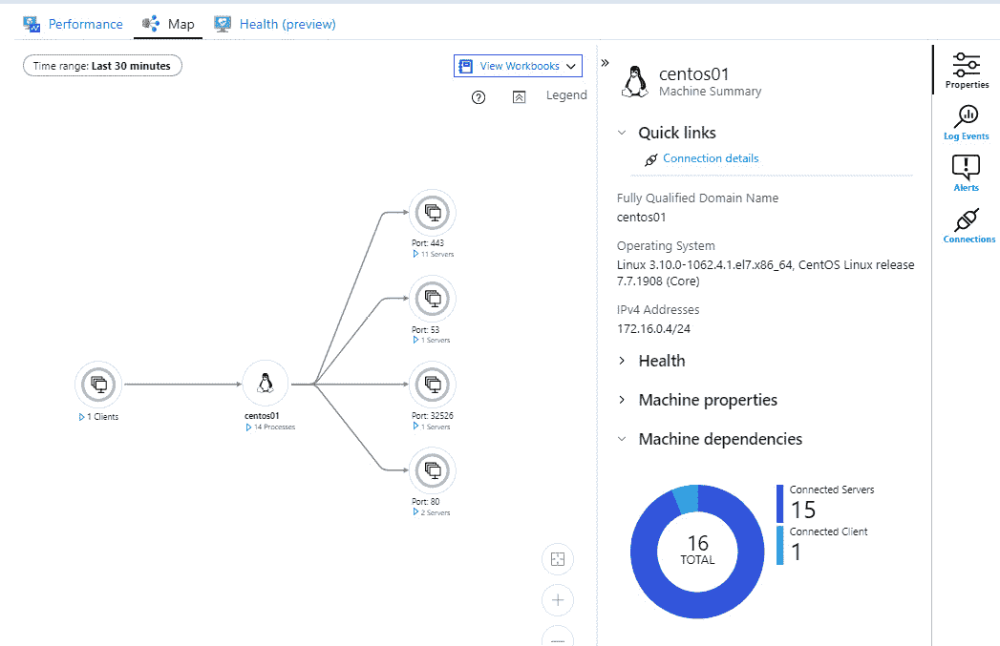
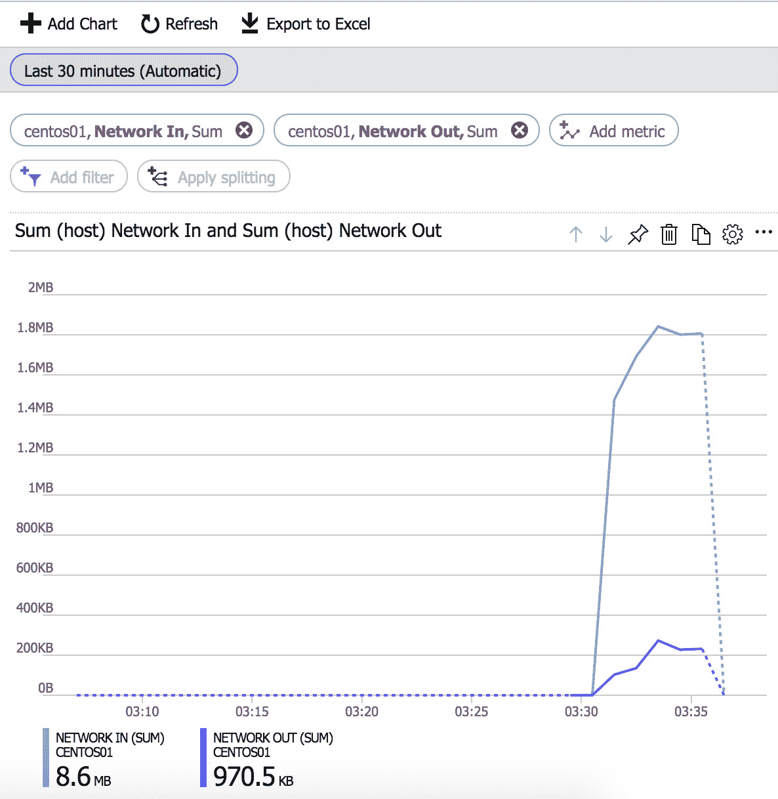
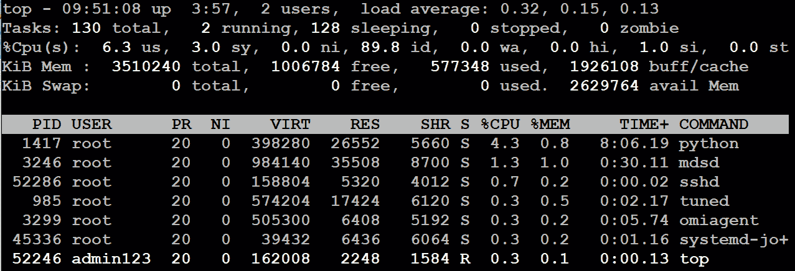
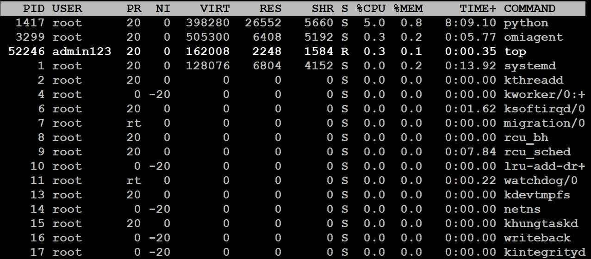
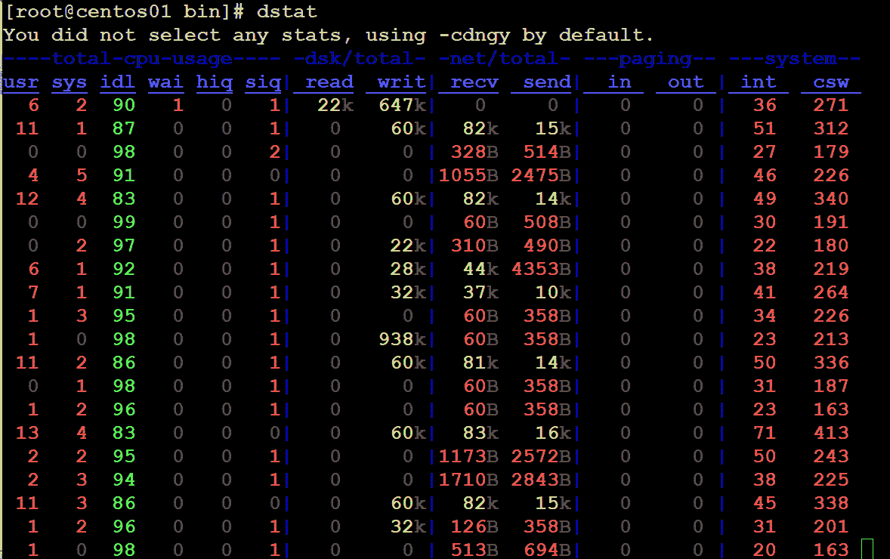

# 十一、故障排除和监控您的工作负载

故障诊断和日志记录是密切相关的; 当您遇到问题时，您将开始分析事件、服务和系统日志。

故障排除和修复在云环境中发现的问题与更经典的部署中的故障排除不同。 本章解释了在 Azure 环境中对 Linux 工作负载进行故障排除的区别、挑战和新的可能性。

在本章结束时，你将能够:

*   使用不同的工具在 Linux 系统中实现性能分析。
*   监控指标，如 CPU、内存、存储和网络细节。
*   使用 Azure 工具来识别和修复问题。
*   使用 Linux 工具来识别和修复问题。

## 技术要求

对于本章，您将需要一个或两个运行 Linux 发行版的 vm。 如果你愿意，你可以用最小的尺寸。 必须安装**审计**守护进程，为了分析和理解审计系统日志，安装 Apache 和 MySQL/MariaDB 服务器是一个好主意。

这里是一个例子在 CentOS:

安装“Basic Web Server”

安装 mariadbmariadb-server

Sudo yum install se 排除故障

Sudosystemctl enable—now apache2

Sudosystemctl enable——现在 mariadb

audit**auditd**通过使用可以根据需要修改的审计规则，提供关于服务器性能和活动的详细信息。 要安装**审计**守护进程，请使用以下命令:

Sudo yum list audit audit-libs

在执行前面的命令时，您将得到以下输出:

###### 图 11.1:安装审计守护进程

如果您可以看到前面显示的已安装审计包列表，那么它已经安装; 如果不是，则执行如下命令:

安装 audit audit-libs

**auditd**安装成功后，需要启动**auditd**服务，开始收集并存储审计日志:

Sudo systemctl 启动 auditd

如果你想在启动时启动**auditd**，那么你必须使用以下命令:

Sudo systemctl 启用 auditd

现在让我们验证**auditd**是否安装成功，并使用以下命令开始收集日志:

tail - f /var/log/audit/audit.log

###### 图 11.2:验证 auditd 的成功安装和日志收集

在本章中，我们将介绍一般的 Azure 管理和 Azure Monitor。 并非每个 Linux 发行版都支持用于从 VM 收集信息的 Log Analytics 代理; 请访问[https://docs.microsoft.com/en-us/azure/virtual-machines/extensions/oms-linux](https://docs.microsoft.com/en-us/azure/virtual-machines/extensions/oms-linux)在决定您想在本章中使用哪个发行版之前。

#### 请注意

**运营管理套件**(**OMS**)已经退役并转移到 Azure 中，除了在一些变量名中，“OMS”这个名称不再在任何地方使用。 它现在被称为 Azure Monitor。 命名和术语变化的更多信息,请参阅 https://docs.microsoft.com/en-gb/azure/azure-monitor/terminology,或者你也可以转换的详细信息在 https://docs.microsoft.com/en-us/azure/azure-monitor/platform/oms-portal-transition。

## 访问您的系统

学会解决你的工作负担会对你的日常工作有帮助。 在 Azure 中进行故障排除与在其他环境中进行故障排除没有什么不同。 在这一部分中，我们将看到一些在日常工作中对你有帮助的提示和技巧。

### 不允许远程访问

当您无法通过 SSH 访问 Azure VM 时，您可以通过 Azure 门户运行命令。

要从 Azure 门户在您的 Azure VM 上运行命令，请登录到您的 Azure 门户，导航到您的 VM 并选择**运行命令**:

###### 图 11.3:导航到 Azure 门户内的 VM 部分

或者，您可以使用命令行，如下所示:

az vm run-command invoke——name<vm name="">\</vm>

——命令 id RunShellScript \

——脚本 hostnamectl \

——资源集团

可以使用**az vm run**命令在 vm 中运行 shell 脚本，进行一般的机器或应用程序管理，并诊断问题。

无论您是通过命令行还是通过 Azure 门户执行此操作，**az vm**命令仅在 Microsoft Azure Linux 代理仍在运行且可访问的情况下有效。

#### 请注意

您可以在[https://github.com/Azure/azure-powershell](https://github.com/Azure/azure-powershell)获得最新的 Microsoft Azure PowerShell 存储库，其中包含安装步骤和用法。 **az**正在取代 AzureRM，所有新的 Azure PowerShell 特性将只在**az**中可用。

根据安全最佳实践，您需要登录 Azure 帐户，使用**az 虚拟机用户**修改密码，如下所示:

Az 虚拟机用户更新\

——资源组 myResourceGroup \

  --name myVM \

  --username linuxstar \

——密码 myP@88w@rd

这只在您的用户配置了密码时有效。 如果您使用 SSH 密钥部署 VM，那么您很幸运:同一节中的**重置密码**选项将完成这项工作。

该选项使用 VMAccess 扩展([https://github.com/Azure/azure-linux-extensions/tree/master/VMAccess](https://github.com/Azure/azure-linux-extensions/tree/master/VMAccess))。 与前面讨论的**运行命令**选项一样，它需要 Azure VM Agent。

### 正在端口上工作

您不能远程访问的原因可能与网络有关。 在*第五章*、*高级 Linux 管理*中，*网络*部分简要介绍了**ip**命令。 可以使用该命令对 IP 地址和路由表进行验证。

在 Azure 站点上，必须检查网络和网络安全组，如在*第 3 章*、*基础 Linux 管理*中所述。 在 VM 中,您可以使用**ss**命令,如 ip**,这是一个的一部分【显示】iproute2**包列出《乌利希期刊指南(**- u)和 TCP(【病人】**页)端口处于监听状态,加上进程 ID(**- p),打开了端口:**

 **

###### 图 11.4:使用 ss -tulpn 命令检查端口

快速检查防火墙规则可以用**firewall-cmd——list-all——zone=public**; 如果有多个区域和接口，则需要对每个区域执行此操作。 **iptables-save**可以帮助我们将加入到 Azure Service Fabric 创建的规则中:

###### 图 11.5:包括 Azure Service Fabric 创建的规则

不幸的是，没有评论可以查看在**systemd**单元级别配置的所有访问规则。 不要忘记验证它们，正如在*第 6 章*、*管理 Linux 安全性和身份*中讨论的那样。

### 使用 nftables

**nftables**比**iptables**更容易使用，它用简单的语法组合了整个**iptables**框架。 **nftables**是在一个内核**netfilter**子系统上构建的，这个子系统可以用来创建分组的、复杂的过滤规则。 与**iptables**相比，nftables 有许多优点。 例如，它允许您使用一个规则执行多个操作。 它使用了**nft**命令行工具，也可以通过**nft -i**命令在交互模式下使用:

1.  Install **nftables** using the following command:

    安装 nftables

2.  Then install **compat**, which loads the compatibility with the **nftables** kernel subsystem:

    apt 安装 iptables-nftables-compat

3.  Finally, enable the **nftables** service using the following command:

    启用 nftables.service

4.  You can view the current **nft** configuration using this:

    非功能性测试列表规则集

5.  Also, you can log into **nft** interactive mode using the following command:

    nft 的—

6.  Now you can list the existing ruleset by using the following **list** command:

    非功能性测试>列表规则集

7.  Let's create a new table, **rule_table1**:

    Nft >添加表 inet rule_table1

8.  Now we will need to add the chain command to accept inbound/outbound traffic as follows:

    Nft >add chain inet rule_table1 input {type filter hook input priority 0; 政策接受; ｝

    Nft >add chain inet rule_table1 output {type filter hook input priority 0; 政策接受; ｝

9.  You can use the following command to add rules to accept TCP (Transmission Control Protocol) ports:

    Nft >add rule inet rule_table1 input tcpdport {ssh, telnet, https, HTTP} accept

    Nft >添加规则 inet rule_table1 输出 tcpdport {https, HTTP} accept

10.  Here is the output of our new **nftables** configuration:

    非功能性测试>列表规则集

    表 inet rule_table1 {

    链输入{

                     优先级类型过滤钩子输入 0; 政策接受;

    Tcpdport {ssh, telnet, http, HTTPS}接受

            }

    链输出{

                     优先级类型过滤钩子输入 0; 政策接受;

    Tcpdport {http, HTTPS} accept

            }

    ｝

### 引导诊断

假设您已经创建了自己的 VM，很可能是精心安排的，而且很可能是您自己的 VM，但是它没有启动。

在 vm 上启用启动诊断之前，您需要一个存储帐户来存储数据。 您可以在**az 存储帐户列表**中列出当前可用的存储帐户，如果需要，还可以使用**az 存储帐户 create**命令创建一个可用的存储帐户。

现在让我们通过在 Azure CLI 中输入以下命令来启用启动诊断:

az vm boot-diagnostics enable——name<vm name="">\</vm>

——resource-group<resource group="">\</resource>

——存储

不同之处在于，您不需要存储帐户的名称，而需要存储 blob 的名称，可以通过**az 存储帐户列表**命令作为存储帐户的属性找到该存储 blob。

在 Azure CLI 中执行以下命令来接收引导日志:

Az vm boot-diagnostics get-boot-log \

——名称<virtual machine="">\</virtual>

——资源集团

输出也会自动存储在一个文件中; 在 Azure CLI 中，通过**或**管道将其重定向到一个文件是一个好主意。

### Linux 登录

许多进程、服务和应用程序运行在典型的 Linux 系统上，这些系统会产生不同的日志，例如应用程序、事件、服务和系统日志，这些日志可用于审核和故障排除。 在前面的章节中，我们遇到了**journalctl**命令，它用于查询和显示日志。 在本章中，我们将更详细地讨论这个命令，并看看如何使用**journalctl**实用程序对日志进行切片和切片。

在 Linux 发行版中，例如最新版本的 RHEL/CentOS、Debian、Ubuntu 和 SUSE，它们使用 systemd 作为它们的**init**系统，**system - log**守护进程用于日志记录。 这个守护进程收集一个单元的标准输出，一条 syslog 消息，并且(如果应用程序支持它的话)将消息从应用程序定向到 systemd。

日志收集在一个可以通过**journalctl**查询的数据库中。

**Working with journalctl**

如果执行**systemctl status<unit>**，可以看到日志的最后一条记录。 要查看完整的日志，您需要的工具是**journalctl**。 与**systemctl**不同，可以通过**-H**参数查看其他主机的状态。 您不能使用**journalctl**连接到其他主机。 这两个实用程序都有**-M**参数来连接**systemd-nspawn**和**Rkt**容器。

要查看日志数据库中的条目，执行以下操作:

Sudo journalctl—unit

###### 图 11.6:查看日志数据库中的条目

默认情况下，日志的分页值为**减去**。 如果您想要另一个分页，比如**更多的**，那么您可以通过**/etc/environment**文件配置它。 添加以下一行:

SYSTEMD_PAGER = / usr / bin /更多

下面是输出的一个例子:

###### 图 11.7:使用 journalctl 命令获取进程的日志条目

让我们检查一下输出:

*   第一列是时间戳。 在数据库中，它是在 EPOCH 时间内定义的，因此，如果更改时区，没有问题:它将被翻译。
*   第二列是主机名，如**hostnamectl**命令所示。
*   第三列包含一个标识符和进程 ID。
*   第四列是信息。

您可以添加以下参数来过滤日志:

*   **——dmesg**:内核消息，替换旧的**dmesg**命令
*   **——identifier**:标识符字符串
*   **——boot**:当前引导过程中的消息; 如果数据库在重新引导期间是持久的，也可以选择以前的引导

**过滤器**

当然，您可以在标准输出上**grep**，但是**journalctl**有一些参数可以真正帮助过滤出您想要的信息:

*   **——优先级**:过滤**警告**,**暴击**,**调试**,【显示】紧急情况,**犯错**,【病人】信息、**注意**,和【t16.1】警告。 这些优先级的分类与 syslog 协议规范相同。
*   **-since**and**-until**:过滤时间戳。 参考**人工系统。 the time**to see all the possibilities.看到所有的可能性。
*   **——行**:行数，类似于**尾**。
*   **—遵循**:类似于**tail -f**。
*   **—反向**:把最后一行放在前面。
*   **——output**:将输出格式改为 JSON 等格式，或者增加输出的冗长程度。
*   目录**——catalog**:添加消息的解释(如果有的话)。

所有的过滤器都可以组合在一起，如下所示:

Sudo journalctl -u SSHD -从昨天开始-直到 10:00 \

——优先犯错

###### 图 11.8:通过使用多个过滤器和 journalctl 过滤日志条目

**基于字段的过滤**

我们还可以对字段进行过滤。 类型:

sudojournactl _

现在按*Ctrl*+*I*两次; 您将看到所有可用字段。 同样的原理也适用于这些过滤器; 也就是说，你可以把它们结合起来:

sudo journalctl _UID=1000 _PID=1850

你甚至可以将它们与普通过滤器结合:

sudo journalctl _KERNEL_DEVICE=+scsi:5:0:0:0 -o verbose

**数据库持久性**

现在，出于遵从性原因或审计需求，您可能需要将日志存储一段时间。 因此，您可以使用 Azure Log Analytics 代理从不同的来源收集日志。 默认情况下，日志数据库不是持久的。 为了使其持久，出于审计或遵从性相关的原因(尽管将日志存储在本地不是最佳实践)，您必须编辑配置文件**/etc/systemd/journal .conf**。

将**#Storage=auto**行更改为:

存储=持续

使用**强制**重启**system -journal**守护进程:

强制重新加载 systemctl -日志

使用此查看已记录的启动:

sudo journalctl——list-boots

###### 图 11.9:查看记录的引导

您可以使用**——boot**参数添加引导 ID 作为筛选器:

journalctl—priority err—boot

通过这种方式，**hostnamectl**的输出显示了当前的引导 ID。

日志数据库不依赖于守护进程。 您可以使用**——目录**和**——文件**参数查看它。

**Syslog 协议**

日志含义 syslog 协议实现时，启用了登录 Linux 和其他 Unix 家族成员。 它仍然用于将日志发送到远程服务。

重要的是要理解该协议使用的设施和严重性。 两者都在 RFC 5424([https://tools.ietf.org/html/rfc5424](https://tools.ietf.org/html/rfc5424))中标准化。 这里，一个工具指定记录消息的程序类型; 例如，内核或 cron。 严重性标签是用来描述影响的，比如信息性的或关键性的。

编程人员的 syslog 手册页(**man 3 syslog**)也可以很好地了解这些功能和严重性，并显示程序如何使用该协议。 关于 syslog 的坏消息是，它只有在应用程序支持它并且应用程序运行足够长的时间来提供这种功能时才能工作。 日志**能够得到关于程序输出的所有信息。**

**新增日志**

您可以手动将条目添加到日志中。 对于 syslog 日志，可以使用**logger**命令:

日志记录器-p<facility.severity>"Message"</facility.severity>

对于**日志**，有**systemd-cat**:

systemd-cat——identifier<identifier>——priority<severity><command></command></severity></identifier>

让我们看一个例子:

systemd-cat——identifier CHANGE——priority info

echo“开始修改配置”

作为标识符，您可以使用自由字符串或 syslog 工具。 **记录器**和**systemd-cat**都可以用来在日志中生成条目。 如果应用程序不支持 syslog，可以使用此选项; 例如，在 Apache 配置中，你可以使用这个指令:

Errorlog "tee -a /var/log/www/error/log | logger -p local6.info"错误日志

您还可以将其作为变更管理的一部分。

日志与 RSYSLOG 集成

 **要为您自己的监控服务收集数据，您的监控服务需要 syslog 支持。 这些监控服务的好例子可以在 Azure 中作为一个现成的 VM:**Splunk**和**Elastic Stack**。

RSYSLOG 是目前最常用的 syslog 协议实现。 它已经默认安装在 Ubuntu、SUSE 和 Red hat 发行版中。

使用**imjournal**模块，RSYSLOG 可以很好地与日志数据库一起工作。 在基于 SUSE 和 Red hat 的发行版中，这已经配置好了; 在 Ubuntu 中，你需要对**/etc/rsyslog.conf**文件进行修改:

# module(load="imuxsock")

module(load="imjournal")

修改完成后，重启 RSYSLOG:

重启 rsyslog

使用**/etc/rsyslog.d/50-default.conf**中的设置，将日志记录到纯文本文件中。

要将本地 syslog 发送到远程 syslog 服务器，你必须将以下内容添加到该文件:

*． * @<remote server="">:514</remote>

#### 请注意

这是 Ubuntu 中文件的名称。 在其他发行版中，使用**/etc/rsyslog.conf**。

使用**@@**如果你想要 TCP 而不是 UDP 协议。

**其他日志**

您可以在**/var/log**目录结构中找到不支持 syslog 或**system - log**的应用程序日志文件。 需要注意的一个重要文件是**/var/log/waagent.log**文件，其中包含来自 Azure Linux VM 代理的日志记录。 还有**/var/log/azure**目录，其中包含来自其他 Azure 代理(如 Azure Monitor)和 VM 扩展的日志记录。

## Azure 日志分析

Azure Log Analytics 是 Azure Monitor 的一部分，它收集和分析日志数据并采取适当的操作。 它是 Azure 中的一个服务，它在一个中心位置的单个数据存储中收集来自多个系统的日志数据。 它包括两个重要的组成部分:

*   Azure Log Analytics 门户，具有警报、报告和分析功能
*   Azure Monitor 代理，需要安装在 VM 上

如果你想在路上查看你的工作负载状态，还有一个移动应用程序可用(在 iOS 和 Android 商店中，你可以在名称*微软 Azure*下找到它)。

### 配置日志分析服务

在 Azure 门户中，从左侧栏中选择**All Services**并搜索**Log Analytics**。 选择**Add**并创建一个新的 Log Analytics 工作区。 在撰写本文时，并不是所有地区都可以使用它。 使用本服务不限于本地区; 当虚拟机位于其他区域时，仍然可以对其进行监控。

#### 请注意

这是没有前期成本的服务，你支付什么，你使用! 详情请阅读[http://aka.ms/PricingTierWarning](http://aka.ms/PricingTierWarning)。

另一种创建服务的方法是使用 Azure CLI:

Az 扩展添加-n application-insights

创建服务之后，会有一个弹出窗口，允许您导航到新创建的资源。 您也可以在**所有服务**中再次搜索。

请注意，在资源窗格的右上角，有 Azure Monitor 和工作区 ID; 你以后会需要这些信息的。 导航到**高级设置**以找到工作空间键。

在 Azure CLI 中，你可以通过以下方式收集这些信息:

Az 监控应用洞察组件创建——app myapp

…地方 westus1

——资源组 my-resource-grp

要列出你的 Azure 订阅的所有工作区，你可以使用下面的 Azure CLI 命令:

Az ml 工作空间列表

你可以使用下面的 Azure CLI 命令获取 JSON 格式的工作空间的详细信息:

Az ml 工作空间显示-w my-workspace -g my-resource-grp

### 安装 Azure Log Analytics Agent

在安装 Azure Monitor 代理之前，确保安装了**审计**包(在**auditd**中)。

要在 Linux 虚拟机中安装 Azure Monitor 代理，您有两种可能:启用虚拟机扩展**OMSAgentforLinux**，或者在 Linux 中下载并安装 Log Analytics 代理。

首先，设置一些变量使脚本更容易:

$rg = "<resource group="">"</resource>

loc =<vm location="">“美元</vm>

omsName 美元=<oms name="">”</oms>

$vm = "

您需要工作区 ID 和密钥。 **Set-AzureVMExtension**cmdlet 需要 JSON 格式的键，所以需要进行转换:

(get - azoperationingsworkspace)

-ResourceGroupName $rg -Name $omsName.CustomerId)

$omsKey = $(get - azoperationingsworkspacesharedkeys)

-ResourceGroupName $rg -Name $omsName)。 PrimarySharedKey

$PublicSettings = New-Object psobject |添加成员'

-PassThruNotePropertyworkspaceId $omsId |转换到 json

$ privatsettings = New-Object psobject |添加成员'

-PassThruNotePropertyworkspaceKey $omsKey |转换到 json

现在您可以将扩展添加到虚拟机:

seazurevmextension -扩展名称“who”

-ResourceGroupName $rg -VMName $vm '

出版商“Microsoft.EnterpriseCloud.Monitoring”

  -ExtensionType "OmsAgentForLinux" -TypeHandlerVersion 1.0 '

  -SettingString $PublicSettings

-ProtectedSettingString $ privatsettings -Location $loc

前面的程序相当复杂，需要一段时间。 下载方法更简单，但是您必须以来宾身份通过 SSH 登录 VM。 当然，这两种方法都可以自动化/编排:

cd / tmp

wget \

https://github.com/microsoft/OMS-Agent-for-Linux \

/blob/master/installer/scripts/onboard_agent.sh

sudo - s

sh onboard_agent.sh -w<oms id="">-s<oms key="">-d \ .sh</oms></oms>

opinsights.azure.com

如果在安装代理过程中遇到问题，请查看**/var/log/waagent.log**和**/var/log/azure/ microsoft . enterprisecloud . monitor . omsagentforlinux /*/extension.log**配置文件。

扩展名的安装还会为**rsyslog，/etc/rsyslog .d/95-omsagent.conf**创建一个配置文件:

kern.warning @127.0.0.1:25224

user.warning @127.0.0.1:25224

daemon.warning @127.0.0.1:25224

auth.warning @127.0.0.1:25224

syslog.warning @127.0.0.1:25224

uucp.warning @127.0.0.1:25224

authpriv.warning @127.0.0.1:25224

ftp.warning @127.0.0.1:25224

cron.warning @127.0.0.1:25224

local0.warning @127.0.0.1:25224

local1.warning @127.0.0.1:25224

local2.warning @127.0.0.1:25224

local3.warning @127.0.0.1:25224

local4.warning @127.0.0.1:25224

local5.warning @127.0.0.1:25224

local6.warning @127.0.0.1:25224

local7.warning @127.0.0.1:25224

它基本上意味着 syslog 消息(**功能。 优先级**)被发送到 Azure Monitor 代理。

在新资源的底部窗格中，有一个题为**开始使用日志分析**的部分:

###### 图 11.10:开始使用 Azure Portal 中的 Log Analytics 部分

点击**Azure 虚拟机(vm)**。 你会在这个工作空间中看到可用的虚拟机:

###### 图 11.11:工作区中的可用虚拟机

上图为工作空间中可用的虚拟机。 它还显示我们已经连接到数据源。

### 获取数据

在该资源的“**高级设置**”区域，您可以添加性能数据源和 syslog 数据源。 您可以使用一种特殊的查询语言通过日志搜索访问所有数据。 如果你是这门语言的新手，你应该访问[https://docs.loganalytics.io/docs/Learn/Getting-Started/Getting-started-with-queries](https://docs.loganalytics.io/docs/Learn/Getting-Started/Getting-started-with-queries)和[https://docs.loganalytics.io/index](https://docs.loganalytics.io/index)。

现在，只执行这个查询:

搜索*

若要查看是否有可用数据，请将搜索限制在一个虚拟机:

搜索* | where Computer == "centos01"

或者，为了获得所有的 syslog 消息，作为测试，你可以重新启动你的虚拟机，或者使用以下方法:

日志-t<facility>。 <priority>“信息”</priority></facility>

请在 syslog 日志中执行如下查询，查看结果:

Syslog |排序

如果您单击**保存的搜索**按钮，也有许多可用的示例。

监控解决方案提供了一个非常有趣的附加组件，使这个过程更加容易。 在**资源**窗格中，单击**查看解决方案**:

###### 图 11.12:导航到监控解决方案选项

选择想要的选项，点击**添加**:

###### 图 11.13:日志分析中的管理解决方案

**服务映射**是一个重要的服务。 它很好地概述了您的资源，并为日志、性能计数器等提供了一个简单的接口。 安装**Service Map**后，您必须在 Linux 机器上安装代理，或者您可以登录 portal 导航到 VM, VM 会自动为您安装代理:

cd / tmp

Wget -content-disposition https://aka.ms/dependencyagentlinux \

- o InstallDependencyAgent-Linux64.bin

sudo sh InstallDependencyAgent-Linux64.bin -s .bin 说明

安装完成后，选择**Virtual Machines**>**Monitoring**>**Insights**>**Service Map**。

现在，点击

 **

###### 图 11.14:Service Map 的 Summary 部分

你可以监控你的应用程序，查看日志文件，等等:

###### 图 11.15:服务映射概述

### 日志分析和 Kubernetes

为了管理容器，您需要详细了解 CPU、内存、存储和网络使用情况以及性能信息。 Azure Monitor 可用于查看 Kubernetes 日志、事件和指标，允许从单个位置监控容器。 您可以使用 Azure CLI、Azure PowerShell、Azure 门户或 Terraform 为新的或现有 AKS 部署的容器启用 Azure Monitor。

创建一个新的**AKS**(**Azure Kubernetes Service**)集群，使用**az AKS create**命令:

az aks create——resource-group MyKubernetes——name myAKS——node-count 1——enable-addons monitoring——generate-ssh-keys

要在现有的 AKS 集群中启用 Azure Monitor，请使用**az AKS**命令并修改如下:

az aks enable-addons -a monitoring -n myAKS -g MyKubernetes

通过选择**Monitor**，然后选择**Containers**，您可以从 Azure 门户启用对 AKS 集群的监控。 在这里，选择**不受监控的集群**，然后选择容器，并单击**启用**:

###### 图 11.16:从 Azure 门户监控 AKS 集群

### 网络日志分析

Azure Log Analytics 的另一个解决方案是流量分析。 它可以可视化进出工作负载的网络流量，包括开放的端口。 它能够针对安全威胁生成警报，例如，如果应用程序试图访问不允许访问的网络。 此外，它还通过日志导出选项提供了详细的监控选项。

如果你想使用流量分析，首先你必须为你想分析的每个地区创建一个网络观察者:

New-AzNetworkWatcher -Name<name>'</name>

-ResourceGroupName<resource group="">-Location<location></location></resource>

之后，你必须重新注册网络提供商，并添加 Microsoft Insights，以便网络观察者可以连接到它:

Register-AzResourceProvider -ProviderNamespace”

"Microsoft.Network"

Register-AzResourceProvider -ProviderNamespaceMicrosoft。 的见解

您不能在其他提供商(如**Microsoft)中使用此解决方案。 经典网络**。

下一步是使用**网络安全组****(NSG)**，通过允许或拒绝进入的流量来控制日志流量。 在撰写本文时，这只可能使用 Azure 门户。 在 Azure 门户的左侧栏中，选择**Monitor**>**Network watchdog**，然后选择**NSG 流量日志**。 现在您可以选择要启用**NSG 流日志**的 NSG。

启用它，选择一个存储帐户，并选择您的 Log Analytics 工作区。

在信息输入和收集之前需要一些时间。 大约 30 分钟后，第一个信息应该可以看到。 选择 Azure 门户左侧栏中的**Monitor**，转到**网络监控器**，然后转到**流量分析**。 或者，从日志分析工作区开始:

###### 图 11.17:使用 traffic Analytics 查看网络流量分布

## 性能监控

在 Azure Monitor 中，有许多可用于监控的选项。 例如，性能计数器可以让您深入了解工作负载。 还有一些特定于应用程序的选项。

即使您不使用 Azure Monitor, Azure 也可以为每个 VM 提供所有类型的指标，但不是在一个中心位置。 只需导航到您的 VM。 在“**概述**”区域框中，可以查看 CPU、内存和存储的性能数据。 在**Monitoring**下的**Metrics**部分可以获得详细信息。 各种数据可用，如 CPU 数据、存储数据、网络数据:

###### 图 11.18:查看虚拟机的性能数据

其中许多解决方案的问题是，它们是特定于应用程序的，或者您只看到最终结果，而不知道原因是什么。 如果您需要关于虚拟机所使用的资源的一般性能的信息，请使用 Azure 提供的信息。 如果你需要你正在运行的 web 服务器或数据库的信息，看看是否有 Azure 解决方案。 但在许多场景中，如果能够在 VM 中进行性能故障排除，将非常有帮助。 在某种程度上，我们将从*第 3 章*、*基础 Linux 管理*中的*进程管理*部分开始。

在开始之前，有多种方法和方法可以进行性能故障排除。 这本书能提供您应该使用的唯一方法吗?还是告诉您您需要的唯一工具? 不,不幸的是不! 但它能做的是让您了解可用的工具，并至少涵盖它们的基本用法。 对于更具体的需求，您可以查看手册页。 在本节中，我们将特别研究负载是什么以及是什么导致了它。

最后一件事:这个部分称为*性能监控*，但这可能不是一个完美的标题。 它是平衡监控、故障排除和分析。 然而，在每个系统工程师的日常生活中，不都是这样吗?

在 Red Hat/CentOS 存储库中，并不是所有提到的工具都是默认可用的。 您需要配置**epel**存储库:**yum install epel-release**。

### 使用 top 显示 Linux 进程

如果您研究诸如性能监控和 Linux 这样的主题，总是会提到**top**。 它是快速了解系统上运行内容的首选命令。

您可以使用**顶部**显示许多内容，并且它附带了一个解释所有选项的良好手册页。 让我们着眼于最重要的内容，从屏幕顶部开始:

###### 图 11.19:使用 top 命令显示资源使用情况

让我们看看前面截图中提到的选项:

*   **Wait IO**(**wa**):如果该值持续高于 10%，这意味着底层存储降低了服务器的速度。 该参数表示 I/O 进程的 CPU 等待时间。 Azure vm 使用 hdd 而不是 ssd，在 RAID 配置中使用多个 hdd 可能有所帮助，但最好是迁移到 ssd。 如果这还不够，还有高级 SSD 解决方案可供选择。
*   **用户空间 CPU**(**us**):应用程序的 CPU 利用率; 请注意，CPU 利用率是所有 CPU 的总和。
*   **System CPU**(**sy**):CPU 在内核任务上花费的时间。
*   **Swap**:由于应用程序没有足够的内存而导致内存被换出。 大多数时候它应该是零。

**屏幕底部也有一些有趣的栏目:**

 **

###### 图 11.20:top 命令获得的输出的底部条目

就个人而言，我们不建议现在担心优先级和好的值。 对性能的影响很小。 第一个有趣的字段是**VIRT**(虚拟内存)。 这是指程序目前可以访问的内存容量。 它包括与其他应用程序共享的内存、视频内存、应用程序读入内存的文件等等。 它还包括空闲内存、交换内存和驻留内存。 驻留内存是这个进程在物理上使用的内存。 SHR 是应用程序之间共享的内存量。 这些信息可以给你一个想法的交换**你应该在您的系统上配置:五大过程,**VIRT**加起来,再减去【显示】RES 和**月**。 这并不完美，但这是一个很好的指标。**

 **上图中的**S**栏为机器状态:

*   **D**是不可中断睡眠，大部分时间是由等待存储或网络 I/O 造成的。
*   **R**正在消耗 CPU。
*   **S**在 I/O 上休眠等待，没有 CPU 占用。 等待用户或其他进程的触发。
*   **T**被作业控制信号停止，大部分时间是由于用户按了*Ctrl*+*Z*。
*   **Z**是僵尸-父进程已经死亡。 当内核忙于清理时，它被内核标记为僵尸。 在物理机器上，它也可以表示 cpu 出现故障(由温度或劣质 bios 引起); 在这种情况下，你可能会看到很多僵尸。 在 Azure 中，这不会发生。 僵尸不会伤人，所以不要杀他们; 内核会处理它们。

### 首选

有许多类似于**top**的实用程序，例如**htop**，它们看起来更漂亮，也更容易配置。

非常相似但更有趣的是**在**之上。 它包含所有进程及其资源使用情况，甚至包括在顶部的**屏幕更新之间死亡的进程。 这种全面的说明对于理解单个短期进程的问题非常有帮助。** 之上的**还能够收集关于运行容器、网络和存储的信息。**

另一个是**nmon**，类似于之上的**，但更侧重于统计，提供更详细的信息，特别是在内存和存储方面:**

###### 图 11.21:内存、CPU 和存储的性能细节

**nmon**也可用于采集数据:

Nmon -f -s 60 -c 30

前面的命令以逗号分隔的文件格式每分钟收集 30 轮信息，这种格式很容易在电子表格中解析。 在 IBM 的开发人员网站[http://nmon.sourceforge.net/pmwiki.php?n=Site.Nmon-Analyser](http://nmon.sourceforge.net/pmwiki.php?n=Site.Nmon-Analyser)上，您可以找到一个 Excel 电子表格，它使这项工作变得非常简单。 它甚至提供了一些额外的数据分析选项。

**瞟**最近也广受欢迎。 它是基于 python 的，并提供关于系统、运行时间、CPU、内存、交换、网络和存储(磁盘 I/O 和文件)的当前信息:

###### 图 11.22:使用 glances 实用程序查看性能

**glance**是**top**的最高级选择。 它提供了替代方案的所有特性，而且最重要的是，您可以远程使用它。 您需要提供您的服务器的用户名和密码来启动**浏览**:

glance—用户名<username>—密码<password>—服务器</password></username>

在客户端也执行以下操作:

——客户@

系统默认使用**61209**端口。 如果您使用**-webserver**参数而不是**——server**，您甚至不需要客户机。 在端口**61208**上有一个完整的 web 界面!

**glances**能够以多种格式导出日志，并可以使用 API 进行查询。 **SNMP**(**简单网络管理协议**)协议的实验支持也在进行中。

### Sysstat -一个性能监控工具的集合

**sysstat**包包含用于性能监控的实用程序。 Azure 中最重要的是**sar**，**iostat**和**pidstat**。 如果你也在使用 Azure 文件，**cifsiostat**也可以非常方便。

**sar**是主要的效用。 主要语法是这样的:

sar -<resource>间隔计数</resource>

例如，使用该命令报告 CPU 统计信息 5 次，间隔为 1 秒:

sar -u 1 5

要监控核心**1**和**2**，使用以下方法:

sar -P 1 2 1 5

(如果希望单独监控所有内核，可以使用**all**关键字。)

这里有一些其他重要的资源:

*   **-r**:内存
*   **-S**:交换
*   **-d**:磁盘
*   **-n <type>**: Network types, such as these:

    **DEV**:显示网络设备统计信息

    **EDEV**:显示网络设备故障(错误)统计信息

    **NFS**:显示**NFS**(**网络文件系统**)客户端活动

    **SOCK**:显示 IPv4 使用的 socket

    **IP**:显示 IPv4 网络流量

    **TCP**:显示 TCPv4 的网络流量

    **UDP**:显示 UDPv4 网络流量

    **ALL**:显示上述所有信息

**pidstat**可以通过进程 ID 从一个指定的ic 进程中收集 CPU 数据。 在下一个屏幕截图中，您可以看到每 5 秒显示 2 个示例。 **pidstat**可以对内存和磁盘执行同样的操作:

###### 图 11.23:使用 pidstat 显示 CPU 统计信息

**iostat**是一个实用程序，顾名思义，它可以测量 I/O，但也可以创建 CPU 使用的报告:

###### 图 11.24:使用 iostat 获取 CPU 和设备报告和统计数据

**tps**表示每秒发送到设备的传输次数。 **kb_read/s**和**kB_wrtn/s**是 1 秒内测量的千字节数; 前面截图中的**avg-cpu**列是自 Linux 系统启动以来的统计总数。

在安装**sysstat**包的过程中，在**/etc/cron 中安装了 cron 作业。 d/sysstat**文件。

#### 请注意

在现代 Linux 系统中，可以使用**系统计时器**和使用**cron**的旧方法。 **sysstat**仍然使用**cron**。 要查看**cron**是否可用并正在运行，请执行**systemctl | grep cron**。

**cron**每 10 分钟运行一次**sa1**命令。 它收集系统活动并将其存储在二进制数据库中。 每天执行一次**sa2**命令生成报告。 数据保存在**/var/log/sa**目录下。 您可以使用**sadf**查询该数据库:

###### 图 11.25:使用 sadf 查询数据库以获取系统活动

这个截图显示了 11 月 6 日的数据，在**09:00:00**和**10:10:00**之间。 默认情况下，它显示 CPU 统计信息，但是你可以使用与**sar**相同的参数来定制它:

sadf /var/log/sa/sa03——-n DEV

这将显示 11 月 6 日每个网络接口的网络统计信息。

### dstat

**sysstat**用于历史报表，**dstat**用于实时报表。 **top**是**ps**的监控版本，**dstat**是**sar**的监控版本:

###### 图 11.26:使用 dstat 获取实时报告

如果你不想一次看到所有内容，你可以使用以下参数:

*   **c**:CPU
*   **d**:硬盘
*   **n**:网络
*   **g**:分页
*   **s**:交换
*   **m**:内存

### 网络统计与 iproute2

在本章前面，我们讨论了**ip**。 这个命令还提供了一个选项来获取网络工作接口的统计信息:

IP -s link show dev eth0

###### 图 11.27:获取网络接口的统计信息

它解析来自**/proc/net**目录的信息。 另一个可以解析此信息的实用程序是**ss**。 一个简单的总结可以与此要求:

ss - s

使用**-t**参数不仅可以显示处于监听状态的端口，还可以显示该特定接口的进出流量。

如果您需要更多的细节，**iproute2**包提供了另一个实用程序:**nstat**。 使用**-d**参数，您甚至可以以间隔模式运行它:

###### 图 11.28:获取关于处于侦听状态的端口的详细报告

这已经远远超过了**ss**的简单总结。 但是**iproute2**套餐有更多的功能:**lnstat**。

该命令提供网络统计信息，如路由缓存统计信息:

lnstat––d

###### 图 11.29:使用 lnstat -d 获取网络统计信息

这显示了它可以显示或监控的一切。 它是相当低级的，但是我们已经使用**lnstat -f/proc/net/stat/nf_conntrack**解决了一些防火墙性能相关的问题，同时监控**drop**计数器。

### 基于 IPTraf-NG 的网络监控

您可以从**nmon**等工具中获得网络详细信息，但是如果您想要更多的详细信息，那么 IPTraf-NG 对于基于控制台的实时网络监控解决方案来说是一个非常好的工具。 它是一个基于控制台的网络监控实用程序，它收集所有网络 IP、TCP、UDP 和 ICMP 数据，并能够根据 TCP/UDP 的大小分解信息。 一些基本的过滤器也包括在内。

所有的一切都是在菜单驱动的界面中，所以没有参数你必须记住:

###### 图 11.30 IPTraf-NG 菜单窗口

### tcpdump

当然，**tcpdump**不是性能监控解决方案。 这个实用工具是监控、捕获和分析网络流量的好工具。

执行以下命令查看所有网口的网络流量:

tcpdump -我任何

对于特定的接口，尝试以下操作:

tcpdump -i eth0

一般来说，不解析主机名是一个好主意:

tcpdump -n -i eth0

通过重复**v**参数，您可以添加不同的详细级别，最多可以添加三个详细级别:

tcpdump -n -i eth0 -vvv

您可以根据主机对流量进行过滤:

tcpdump 主机<ip address="">-n -i eth0</ip>

也可以根据源 IP 或目的 IP 进行过滤:

tcpdump src<source ip="" address="">-n -i eth0 . xml

tcpdump dst <destination ip address> -n -i eth0

过滤特定端口也是可能的:

tcpdump 端口 22

tcpdumpsrc port 22

Tcpdump 不是端口 22

所有参数可以组合:

tcpdump -n dst net<subnet>and not port ssh -c 5</subnet>

增加**-c**参数，只捕获 5 个报文。 您可以将捕获的数据保存到一个文件:

tcpdump -v -x -XX -w /tmp/capture.log

增加了两个参数，以增加与其他能够读取**tcpdump**格式的分析仪的兼容性:

*   **-XX**:以十六进制和 ASCII 格式输出每个报文的数据
*   **-x**:为每个报文添加报头

要以人类可读的格式读取完整的时间戳数据，使用以下命令:

tcpdump -tttt -r /tmp/capture.log

#### 请注意

另一个伟大的网络分析器是 Wireshark。 它是一种可用于许多操作系统的图形化工具。 该分析器可以从**tcpdump**导入捕获的数据。 它为许多不同的网络协议和服务提供了一个伟大的搜索过滤器和分析工具。

为了在 Wireshark 中进一步分析数据，在 VM 中进行捕获并将其下载到工作站上是有意义的。

我们相信，您现在能够在 Linux 系统中使用不同的工具来监控 CPU、内存、存储和网络细节等指标，从而实现良好的性能分析。

## 总结

在本章中，我们讨论了关于故障排除、日志记录、监控甚至分析的几个主题。 从访问 VM 开始，我们研究了 Linux 中的本地和远程日志记录。

性能监控和性能故障排除之间只有一线之隔。 有很多很多不同的实用程序可以用来找出导致性能问题的原因。 每一个都有不同的目标，但也有大量的重叠。 我们已经介绍了 Linux 中最流行的实用程序和一些可用的选项。

在第一章中，我们看到 Azure 是一个非常友好的开源环境，微软也在努力使 Azure 成为一个考虑到互操作性的开放、标准的云解决方案。 在本章中，我们看到微软不仅在部署应用程序时投入了大量精力来支持 Linux，而且还在 Azure Monitor 中支持 Linux。

## 问题

1.  为什么 VM 中至少要有一个用户具有密码?
2.  **system -journal**守护进程的目的是什么?
3.  什么是 syslog 功能?
4.  syslog 中有哪些优先级可用?
5.  如何向日志中添加条目，为什么要这样做?
6.  在 Azure 中有哪些服务可以用来查看指标?
7.  为什么**top**只在查看与性能相关的问题时才有用?哪些实用程序或实用程序可以解决这个问题?
8.  **sysstat**和**dstat**实用程序有什么区别?
9.  为什么要在工作站上安装 Wireshark ?

## 进一步阅读

一个很大的信息来源是 Brendan D Gregg([http://www.brendangregg.com](http://www.brendangregg.com))的网站，在那里他分享了一长串的 Linux 性能文档、幻灯片、视频等。 除此之外，还有一些不错的设施! 是他在 2015 年教我正确识别问题的重要性:

*   是什么让你觉得有问题?
*   有没有什么时候不存在问题?
*   最近有什么变化吗?
*   尝试查找技术描述，例如延迟、运行时错误等等。
*   仅仅是应用程序，还是其他资源也受到影响?
*   想出一个准确的环境描述。

你还必须考虑以下几点:

*   是什么导致了负载(哪个进程、IP 地址等等)?
*   为什么要调用装载?
*   负载使用了哪些资源?
*   负载改变了吗? 如果是，它是如何随时间变化的?

最后，但并非最不重要的，有本杰明·凯恩的《红帽企业 Linux 故障排除指南》*。 我知道，这本书的一些部分已经过时了，因为它是 2015 年出版的。 当然，我当然希望有第二版，但是，特别是如果您是 Linux 新手，请购买这本书。***********