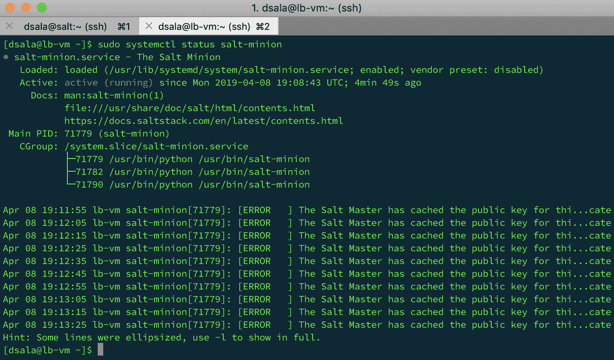
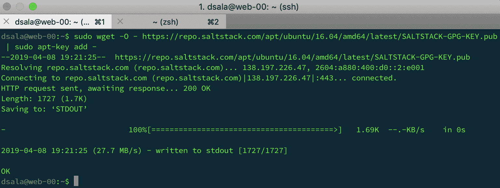
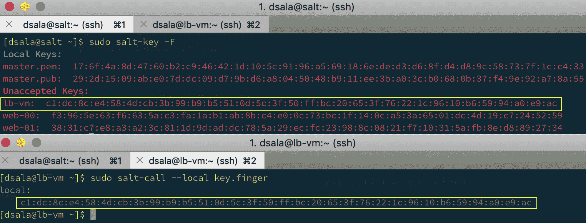
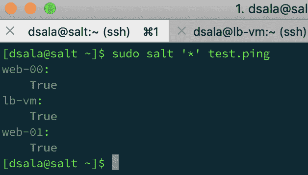
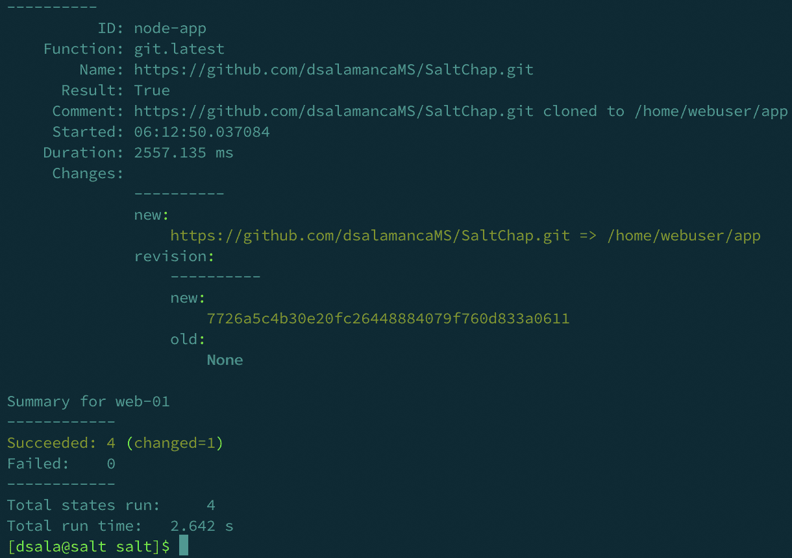
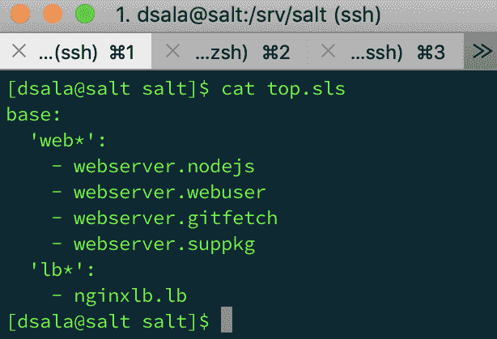
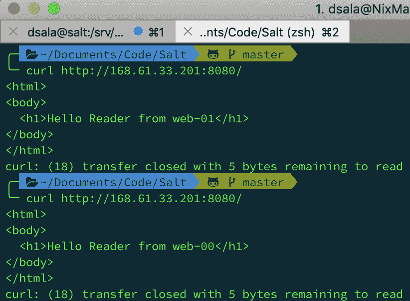

# 十四、设计 Salt 解决方案和安装软件

在了解了 **Salt** 的基本概念之后，我们将在这一章中最终接触到 Salt。我们将有机会在真实场景中工作，并为我们的潜在客户设计和安装概念验证基础架构。我们将做如下事情:

*   通过 Terraform 调配云基础架构
*   安装和配置 Salt 主服务器
*   安装和配置奴才
*   为奴才创建状态和公式
*   通过 Salt 配置负载平衡器

完成这些任务后，您应该具备基础知识和动手经验，开始更深入地学习 Salt。

# 用盐动手

我们已经了解了该软件的不同 Salt 组件和功能，以及它如何帮助我们实现对基础架构的控制。但是我们没有使用任何组件来实际维护任何系统，甚至没有安装 Salt。所以，让我们用盐弄脏我们的手，开始利用我们新获得的知识。

在开始之前，我们将设置一个场景来更好地理解我们将在本章中做什么，它将与现实生活中的场景相关联。

# 方案

唐·高先生聘请你为他的公司设计系统的管理平台。他想在 Azure **虚拟机** ( **虚拟机**)上运行自己的网络服务器工作负载，采用**基础架构即服务** ( **IaaS** )模式。

他的设置相当简单:他想让两个运行网站的虚拟机在 nginx 负载平衡器前写入`Node.js`，以将流量路由到网站的虚拟机中。他的所有基础架构都必须通过配置管理解决方案进行管理，这样，每次他们调配新虚拟机时，应用都会与网站运行所需的任何配置一起加载。

还有一点他跟大家提到的是，公司的工作人员还没有在 Azure 中部署任何资源，他们想看看**基础设施 as Code** ( **IaC** )如何在云中进行部署，这样他们的开发人员以后就可以使用了。

# 改造我们最初的基础设施

我们在上一章中提到了 **Terraform** ，我们想利用我们的客户要求我们通过 IaC 软件部署他的基础设施这一事实，所以这是使用这一伟大工具的绝佳机会。

在执行之前，我们将简要解释每一步，但是如果您想了解更多，我们将在*进一步阅读*部分建议更多的书籍，这些书籍将更深入地讨论 Terraform。

# 设置地形

我们假设您将从类似 Unix 的工作站执行以下步骤。安装 Terraform 相当简单。Terraform 只是一个二进制文件，可以从`terraform.io`网站下载。

[https://www.terraform.io/downloads.html](https://www.terraform.io/downloads.html)

就我而言，我将使用一个苹果操作系统终端来安装地形:


下载后，您可以在路径的目录部分解压缩二进制文件:


通过运行`terraform version`检查地形版本:


安装 Terraform 后，我们要求安装 Azure CLI 来配置对客户 Azure 订阅的访问。您可以在我们的*安装 Kubernetes* 章节中找到安装 Azure CLI 和设置订阅的步骤。

安装 Azure 命令行界面和您的默认帐户设置后，我们可以配置 Terraform 使用适当的凭据，以便它能够部署基础架构。

首先，我们将创建一个目录来存储地形文件:

```sh
dsala@NixMachine: ~ $ mkdir terrafiles
```

接下来，我们将通过 Azure 命令行界面创建一个服务主体标识，该标识将用于通过我们的订阅对 Terraform 进行身份验证。

将该命令输出的订阅标识保存到`$SUB_ID`变量中:

```sh
dsala@NixMachine: ~ $ az account show --query "{subscriptionId:id}"

dsala@NixMachine: ~ $ SUB_ID=<subscription id>
```

现在，运行以下命令来创建服务主体:

```sh
dsala@NixMachine: ~ $ az ad sp create-for-rbac \
--role="Contributor" \
--scopes="/subscriptions/${SUB_ID}"
```

记下从上一个命令返回的`appId`、`password`和`tenant`的返回值。

现在，在`terrafiles`目录内，创建一个名为`terraform.tfvars`的文件。

This file is special because Terraform will automatically load by default any file with this name if any is present in the directory when we execute Terraform.

该文件应包含以下信息:

```sh
subscription_id = "azure-subscription-id"
tenant_id = "tenant-from-service-principal"
client_id = "appId-from-service-principal"
client_secret = "password-from-service-principal"
```

当您准备好文件后，创建另一个名为`az_creds.tf`的文件，如下所示:

```sh
variable subscription_id {}
variable tenant_id {}
variable client_id {}
variable client_secret {}

provider "azurerm" {
 subscription_id = "${var.subscription_id}"
 tenant_id = "${var.tenant_id}"
 client_id = "${var.client_id}"
 client_secret = "${var.client_secret}"
}
```

This file will be our variables file, and it will load the credential variables into the Azure Resource Manager Terraform provider.

# 创建 IaC

现在我们准备开始创建我们的 IaC 声明文件。Terraform 使用自己的语言 **Hashicorp 配置语言** ( **HCL** )。您可以通过以下链接了解更多信息:[https://www.terraform.io/docs/configuration/index.html](https://www.terraform.io/docs/configuration/index.html)。

让我们开始定义我们的资源。创建一个名为`main.tf` *的文件。*这将是我们的主要模块文件。模块是共享一个共同目标的一组资源，或者都是同一个应用的一部分。

The name `main.tf`is the recommended name by Hashicorp, the company owner of the Terraform Open Source project, for a minimal module.
You can find out more about modules in the Terraform documentation here: [https://www.terraform.io/docs/modules/index.html](https://www.terraform.io/docs/modules/index.html).

我们的文件应该包含我们接下来将要声明的所有以下资源。

下面是包含我们的 Azure 资源的资源组:

```sh
resource "azurerm_resource_group" "salt" {
name     = "Salt"
location = "East US"
}
```

这是我们子网的虚拟网络:

```sh
resource "azurerm_virtual_network" "salt" {
name                = "saltnet"
address_space       = ["10.0.0.0/16"]
location            = "${azurerm_resource_group.salt.location}"
resource_group_name = "${azurerm_resource_group.salt.name}"
}
```

请注意，我们正在从以前的资源中获取值，方法是使用以下语法调用它们:

```sh
"resource_type.local_name.value".
```

以下是为我们的虚拟机提供地址空间的子网:

```sh
resource "azurerm_subnet" "salt" {
name                 = "saltsubnet"
resource_group_name  = "${azurerm_resource_group.salt.name}"
virtual_network_name = "${azurerm_virtual_network.salt.name}"
address_prefix       = "10.0.0.0/24"
}
```

在这里，我们只创建了一个子网，该子网将包含我们的主子网和从子网，但是您可以始终创建单独的子网，只要它们在 VNET 地址空间内，以便主子网和从子网进行网络分离。

创建虚拟网络和子网后，我们需要为虚拟机创建防火墙规则。Azure 中的防火墙被称为**网络安全组**，我们将继续使用网络安全组提供商来创建防火墙及其规则。

以下是负载平衡器的网络安全组:

```sh
resource "azurerm_network_security_group" "saltlb" {
 name                = "lb-nsg"
 location            = "${azurerm_resource_group.salt.location}"
 resource_group_name = "${azurerm_resource_group.salt.name}"
}
```

以下是访问负载平衡器虚拟机的网络安全组规则。

`https`端口:

```sh
resource "azurerm_network_security_rule" "httpslb" {
 name = "https"
 priority = 100
 direction = "inbound"
 access = "Allow"
 protocol = "Tcp"
 source_port_range = "*"
 destination_port_range = "8443"
 source_address_prefix = "*"
 destination_address_prefix = "*"
 resource_group_name = "${azurerm_resource_group.salt.name}"
 network_security_group_name = "${azurerm_network_security_group.saltlb.name}"
}
```

`http`端口:

```sh
resource "azurerm_network_security_rule" "httplb" {
 name                        = "http"
 priority                    = 101
 direction                   = "inbound"
 access                      = "Allow"
 protocol                    = "Tcp"
 source_port_range           = "*"
 destination_port_range      = "8080"
 source_address_prefix       = "*"
 destination_address_prefix  = "*"
 resource_group_name         = "${azurerm_resource_group.salt.name}"
 network_security_group_name = "${azurerm_network_security_group.saltlb.name}"
}
```

SSH 端口`access`:

```sh
resource "azurerm_network_security_rule" "sshlb" {
 name                        = "sshlb"
 priority                    = 103 direction                   = "inbound"
 access                      = "Allow"
 protocol                    = "Tcp"
 source_port_range           = "*" destination_port_range = "22"
 source_address_prefix       = "*"
 destination_address_prefix  = "*"
 resource_group_name         = "${azurerm_resource_group.salt.name}"
 network_security_group_name = "${azurerm_network_security_group.saltlb.name}"
}
```

主虚拟机的第二个网络安全组如下:

```sh
resource "azurerm_network_security_group" "saltMaster" {
 name                = "masternsg"
 location            = "${azurerm_resource_group.salt.location}"
 resource_group_name = "${azurerm_resource_group.salt.name}"
}
```

以下是主虚拟机的网络安全组规则。

以下是盐`publisher`港口:

```sh
resource "azurerm_network_security_rule" "publisher" {
 name                        = "publisher"
 priority                    = 100
 direction                   = "inbound"
 access                      = "Allow"
 protocol                    = "Tcp"
 source_port_range           = "*"
 destination_port_range      = "4505"
 source_address_prefix       = "*"
 destination_address_prefix  = "*"
 resource_group_name         = "${azurerm_resource_group.salt.name}"
 network_security_group_name = "${azurerm_network_security_group.saltMaster.name}"
}
```

以下是 Salt 的请求服务器端口:

```sh
resource "azurerm_network_security_rule" "requestsrv" {
 name                        = "requestsrv"
 priority                    = 101
 direction                   = "inbound"
 access                      = "Allow"
 protocol                    = "Tcp"
 source_port_range           = "*"
 destination_port_range      = "4506"
 source_address_prefix       = "*"
 destination_address_prefix  = "*"
 resource_group_name         = "${azurerm_resource_group.salt.name}"
 network_security_group_name = "${azurerm_network_security_group.saltMaster.name}"
}
```

主设备的`ssh`端口如下:

```sh
resource "azurerm_network_security_rule" "sshmaster" {
 name                        = "ssh"
 priority                    = 103
 direction                   = "inbound"
 access                      = "Allow"
 protocol                    = "Tcp"
 source_port_range           = "*"
 destination_port_range      = "22"
 source_address_prefix       = "*"
 destination_address_prefix  = "*"
 resource_group_name         = "${azurerm_resource_group.salt.name}"
 network_security_group_name = "${azurerm_network_security_group.saltMaster.name}"
}
```

爪牙的网络安全组如下:

```sh
resource "azurerm_network_security_group" "saltMinions" {
 name                = "saltminions"
 location            = "${azurerm_resource_group.salt.location}"
 resource_group_name = "${azurerm_resource_group.salt.name}"
}
```

最后一个网络安全组是特殊的，因为我们不会为它创建任何规则。Azure 提供的默认规则只允许虚拟机与 Azure 资源进行对话，这正是我们希望这些虚拟机做到的。

我们的 Nginx 负载平衡器虚拟机的公共 IP 地址如下:

```sh

resource "azurerm_public_ip" "saltnginxpip" {
 name                         = "lbpip"
 location                     = "${azurerm_resource_group.salt.location}"
 resource_group_name          = "${azurerm_resource_group.salt.name}"
 public_ip_address_allocation = "static"
}
```

负载平衡器的虚拟网络接口如下:

```sh
resource "azurerm_network_interface" "saltlb" {
 name                = "lbnic"
 location            = "${azurerm_resource_group.salt.location}"
 resource_group_name = "${azurerm_resource_group.salt.name}"
 network_security_group_id  = "${azurerm_network_security_group.saltlb.id}"

 ip_configuration {
 name                          = "lbip"
 subnet_id                     = "${azurerm_subnet.salt.id}"
 private_ip_address_allocation = "dynamic"
 public_ip_address_id          = "${azurerm_public_ip.saltnginxpip.id}"
 }
}
```

我们的网络服务器虚拟机的虚拟网络接口如下:

```sh
resource "azurerm_network_interface" "saltminions" {
 count               = 2
 name                = "webnic${count.index}"
 location            = "${azurerm_resource_group.salt.location}"
 resource_group_name = "${azurerm_resource_group.salt.name}"
 network_security_group_id  = "${azurerm_network_security_group.saltMinions.id}"

 ip_configuration {
 name                          = "web${count.index}"
 subnet_id                     = "${azurerm_subnet.salt.id}"
 private_ip_address_allocation = "dynamic"
 }
}
```

以下是我们的主虚拟机的公共 IP 地址:

```sh
resource "azurerm_public_ip" "saltmasterpip" {
 name                    = "masterpip"
 location                = "${azurerm_resource_group.salt.location}"
 resource_group_name     = "${azurerm_resource_group.salt.name}"
 allocation_method       = "Dynamic"
}
```

这个公共 IP 地址将用于我们 SSH 到主虚拟机；这就是我们动态分配它的原因。

主虚拟机的虚拟网络接口如下:

```sh
resource "azurerm_network_interface" "saltmaster" {
 name                = "masternic"
 location            = "${azurerm_resource_group.salt.location}"
 resource_group_name = "${azurerm_resource_group.salt.name}"
 network_security_group_id     = "${azurerm_network_security_group.saltMaster.id}"

 ip_configuration {
 name                          = "masterip"
 subnet_id                     = "${azurerm_subnet.salt.id}"
 private_ip_address_allocation = "static"
 private_ip_address            = "10.0.0.10"
 public_ip_address_id          = "${azurerm_public_ip.saltmasterpip.id}"
 }
}
```

以下是网络服务器虚拟机:

```sh
resource "azurerm_virtual_machine" "saltminions" {
count                 = 2
name                  = "web-0${count.index}"
location              = "${azurerm_resource_group.salt.location}"
resource_group_name   = "${azurerm_resource_group.salt.name}"
network_interface_ids = ["${element(azurerm_network_interface.saltminions.*.id, count.index)}"]
vm_size               = "Standard_B1s"
storage_image_reference {
 publisher = "Canonical"
 offer     = "UbuntuServer"
 sku       = "16.04-LTS"
 version   = "latest"
}
storage_os_disk {
 name              = "webosdisk${count.index}"
 caching           = "ReadWrite"
 create_option     = "FromImage"
 managed_disk_type = "Standard_LRS"
}
os_profile {
 computer_name  = "web-0${count.index}"
 admin_username = "dsala"
}
os_profile_linux_config {
 disable_password_authentication = true
 ssh_keys = {
 path   = "/home/dsala/.ssh/authorized_keys"
 key_data = "${file("~/.ssh/id_rsa.pub")}"
 }
 }
}
```

用自己的信息替换`os_profile.admin_username`和`os_profile_linux_config.key_data`。

主虚拟机如下所示:

```sh
resource "azurerm_virtual_machine" "saltmaster" {
name                  = "salt"
location              = "${azurerm_resource_group.salt.location}"
resource_group_name   = "${azurerm_resource_group.salt.name}"
network_interface_ids = ["${azurerm_network_interface.saltmaster.id}"]
vm_size               = "Standard_B1ms"

storage_image_reference {
 publisher = "OpenLogic"
 offer     = "CentOS"
 sku       = "7.5"
 version   = "latest"
}

storage_os_disk {
 name              = "saltos"
 caching           = "ReadWrite"
 create_option     = "FromImage"
 managed_disk_type = "Standard_LRS"
}

os_profile {
 computer_name  = "salt"
 admin_username = "dsala"
}

os_profile_linux_config {
 disable_password_authentication = true
 ssh_keys = {
 path   = "/home/dsala/.ssh/authorized_keys"
 key_data = "${file("~/.ssh/id_rsa.pub")}"
 }
 }
}
```

以下是 Nginx 负载平衡器虚拟机:

```sh
resource "azurerm_virtual_machine" "saltlb" {
name                  = "lb-vm"
location              = "${azurerm_resource_group.salt.location}"
resource_group_name   = "${azurerm_resource_group.salt.name}"
network_interface_ids = ["${azurerm_network_interface.saltlb.id}"]
vm_size               = "Standard_B1ms"

storage_image_reference {
 publisher = "OpenLogic"
 offer     = "CentOS"
 sku       = "7.5"
 version   = "latest"
}

storage_os_disk {
 name              = "lbos"
 caching           = "ReadWrite"
 create_option     = "FromImage"
 managed_disk_type = "Standard_LRS"
}

os_profile {
 computer_name  = "lb-vm"
 admin_username = "dsala"
}

os_profile_linux_config {
 disable_password_authentication = true
 ssh_keys = {
 path   = "/home/dsala/.ssh/authorized_keys"
 key_data = "${file("~/.ssh/id_rsa.pub")}"
 }
 }
}
```

一旦保存了包含所有先前创建的资源的文件，运行`terraform init`命令；这将使用地形文件初始化当前目录，并下载 Azure 资源管理器插件:


If you want to learn more about the `init` command, you can go to [https://www.terraform.io/docs/commands/init.html](https://www.terraform.io/docs/commands/init.html).

运行`init`命令后，我们将继续运行`terraform plan`命令，该命令将计算实现我们在`tf`文件中定义的期望状态所需的所有更改。

在我们运行`terraform` `apply`命令之前，这不会对现有基础设施进行任何更改:


For more information about the `plan` command, visit [https://www.terraform.io/docs/commands/plan.html](https://www.terraform.io/docs/commands/plan.html).

完成`plan`命令后，您可以立即运行`terraform apply`，系统将提示您确认应用更改:


完成后，您应该能够看到以下消息:

```sh
Apply complete! Resources: 18 added, 0 changed, 0 destroyed.
 Installing, Configuring and Managing Salt
```

安装 Salt 有两种方法:您可以使用引导脚本安装主服务器和从属服务器，也可以通过 Salt 存储库手动安装和配置它们。

为了熟悉安装过程，我们将介绍这两种方法。

# 使用包管理器安装 Salt

在我们目前的基础设施中，我们有一个主人和三个跟班。我们的主系统和一个小系统运行的是 CentOS 7.5，其余的虚拟机运行的是 Ubuntu 16.04。这个过程在两个发行版上都有所不同，但是在两个发行版上有些步骤是相同的。

# 安装 CentOS yum

以前，盐只能通过 EPEL 仓库获得。但是现在 SaltStack 有了自己的存储库，我们可以从那里导入并执行安装。

首先，将 SSH 安装到主虚拟机中，并运行以下命令来导入 SaltStack 存储库:

```sh
[dsala@salt ~]$ sudo yum install \
https://repo.saltstack.com/yum/redhat/salt-repo-latest.el7.noarch.rpm
```

Optionally, you can run `yum clean expire-cache`, but as this is a new VM, this is not necessary.

一旦完成，我们将继续安装`salt-master`包:

```sh
[dsala@salt ~]$ sudo yum install salt-master -y
```

继续启用`systemd`盐主服务单元:

```sh
[dsala@salt ~]$ sudo systemctl enable salt-master --now
```

检查服务是否正在运行:


服务启动并运行后，通过运行以下命令，检查虚拟机的私有 IP 是否是我们在地形定义中配置的 IP:

```sh
[dsala@salt ~]$ ifconfig eth0 | grep inet | head -1 | awk '{print $2}'
```

一旦你确认了 IP 地址，打开另一个终端，把 SSH 接入负载均衡器的 minion。像在主虚拟机中一样，重复添加存储库的过程。

添加存储库后，运行以下命令安装`salt-minion`包:

```sh
[dsala@lb-vm ~]$ sudo yum install salt-minion -y
```

运行以下命令，启用并启动`systemd`服务单元:

```sh
[dsala@lb-vm ~]$ sudo systemctl enable salt-minion --now
```

在实施任何更改之前，让我们检查服务是否成功启动:



我们可以看到，我们在服务上得到错误，说主服务器已经更改了公钥，我们并不是不能连接到 Salt 主服务器。我们现在需要配置小主人与主人交谈。但是首先，让我们安装剩下的两个 Ubuntu 奴才，因为注册奴才的过程在两个发行版上都是一样的。

# 乌班图容易得到盐

唯一复杂的是，由于我们的网络服务器没有分配公共的 IP 地址，您必须从主虚拟机或负载均衡器虚拟机 SSH 到它们。为此，您可以从这两个虚拟机中的任何一个为奴才设置 SSH 密钥身份验证。如果你正在读这本书，你会熟悉如何执行这样的任务。

当您登录到 web 服务器虚拟机时，请在这两个虚拟机中执行以下任务。

导入盐库的`gpg`键:



运行以下命令创建存储库:

```sh
dsala@web-00:~$ echo "deb http://repo.saltstack.com/apt/ubuntu/16.04/amd64/latest xenial main" \
| sudo tee /etc/apt/sources.list.d/saltstack.list
```

添加存储库后，运行`apt update`，您应该可以看到存储库列表:


继续安装`salt-minion`包:

```sh
dsala@web-00:~$ sudo apt install salt-minion -y
```

通过运行以下程序启用并检查`salt-minion`服务的状态:

```sh
dsala@web-00:~$ sudo systemctl enable salt-minion --now && systemctl status salt-minion
```

您应该会看到与我们在 CentOS LB 虚拟机中看到的相同的消息。

# 通过引导脚本安装 Salt

安装 Salt 的第二种方式是通过一个**引导脚本**。该脚本会自动检测我们的分发并下载定义的包。脚本还为我们提供了`-A`标志，将主人的地址添加到我们的爪牙中。

要获取脚本，可以使用`wget`或`curl`；官方盐栈使用`curl`:

```sh
user@master:~$ curl -L https://bootstrap.saltstack.com -o install_salt.sh
```

这个剧本适用于主子和奴才；不同之处在于运行脚本时使用的标志。

要安装主组件，请运行带有主组件`-M`标志和`-P`标志的脚本，以允许安装任何 Python `pip`包。我们也可以用`-A`指定主地址，用`-N`标志告诉脚本不要在主中安装宠臣服务:

```sh
user@master:~$ sudo sh install_salt.sh -P -M
```

要安装 minion，只需运行以下命令:

```sh
user@master:~$ sudo sh install_salt.sh -P -A <salt master IP>
```

# 主人和仆人握手

在安装的这个阶段，我们将允许我们的爪牙与主人交谈，验证他们的指纹，并设置配置文件。

首先，我们将 SSH 到主虚拟机中，并编辑主虚拟机的配置文件，以告诉 salt-master 守护进程我们希望它绑定到哪个 IP。

编辑`/etc/salt/master`文件，查找`interface:`行，添加主人的 IP 地址:


修改文件后，运行`daemon-reload`和`restart`命令，以便服务确认更改:

```sh
[dsala@salt ~]$ sudo systemctl daemon-reload && sudo systemctl restart  salt-master
```

您可以通过运行`ss`命令来验证 Salt 主机是否正在侦听正确的 IP 地址:


现在我们的主人正在监听我们需要的 IP 地址，是时候配置我们的爪牙了。

让我们从修改小主人的配置文件开始。请记住，这些步骤将在所有的奴才身上执行，无论他们的分布如何。

查找`/etc/salt/minion`文件，通过在`master:`下添加注明的主机 IP 地址进行编辑。我们会发现一个已经配置好的值:`master: salt`*；*这是因为默认情况下，Salt 通过对主机名`salt`的 DNS 查询来查找主机，但是由于我们将来打算拥有多个主机，因此我们将使用主机虚拟机的静态 IP 地址来设置该文件:


在我们的喽啰可以交换密钥之前，我们需要将主人的指纹添加到我们喽啰的配置文件中。

SSH 回到主服务器，并运行以下命令来获取主服务器的公共指纹:


复制`master.pub`的值，返回编辑宠臣的配置文件。在奴隶主的配置文件中，使用在上一步中获得的主公钥编辑`master_finger: ' '`行:


完成最后一项任务后，重新加载并重新启动迷你守护程序:

```sh
[dsala@web-00 ~]$ sudo systemctl daemon-reload && sudo systemctl restart salt-master
```

在退出每个小伙伴之前，运行以下命令并记下小伙伴的指纹:

```sh
[dsala@web-00 ~]$ sudo salt-call --local key.finger
```

一旦你记下了所有爪牙的指纹，就可以登录主人了。

在主人中，我们将比较主人看到的指纹和我们在每个宠臣身上看到的本地指纹。通过这种方式，我们将确定我们将要接受的奴才确实是我们的奴才。

为此，在主程序中运行以下命令:`salt-key -F`。这将打印所有按键，因此您不必单独打印每个按键:



确保钥匙是相同的，然后我们将继续接受钥匙。

在`salt-key -F`命令下，我们看到验证后有未接受的密钥要接受；我们将运行`salt-key -A`来接受所有待定的密钥，您可以运行`salt-key -L`来验证密钥是否被接受:


现在我们的爪牙已经通过了认证，我们可以从主人那里发出命令了。

为了测试我们的爪牙，我们将从测试模块调用`ping`功能:



所有爪牙都应该响应`True`，这意味着 Salt 的仆从守护进程正在响应，我们准备开始管理我们的基础设施。

# 与盐合作

随着我们的 SaltStack 的启动和运行，我们准备开始为我们的虚拟机创建公式和定制配置。

# 创建 WeB 服务器公式

我们现在将创建必要的状态文件来创建安装和配置我们的网络服务器的公式。

在开始之前，我们需要首先创建状态树，它将包含我们所有的状态文件:

```sh
[dsala@salt ~]$ sudo mkdir /srv/salt
```

在这个目录中，我们将创建一个名为`top.sls`的文件。这个文件告诉绍特哪些状态适用于哪些爪牙。对于 Salt 中的每个定义，`top.sls`是一个基于 YAML 的文件，它将包含要瞄准的奴才以及应该应用于这些奴才的状态文件。

在`/srv/salt`目录下创建一个名为`top.sls`的文件，内容如下:

```sh
base:
    'web*':
       - webserver.nodejs
```

`base:`表示我们正在工作的环境；由于这是一个简单的环境，我们只需要基础环境；对于在多种环境下工作，您可以参考我们将在*进一步阅读*一节中建议的书籍之一。

接下来，我们有`web*` 词条；这个条目告诉 Salt 哪些迷你 id 将成为应用的状态。如您所见，您可以使用 globbing 来定位迷你身份证。

最后，`- webserver.nodejs`是我们指示应用哪些状态的地方；`webserver` 表示`nodejs.sls`文件所在的文件夹。当 Python 解释器读取 YAML 时，我们需要用句点(.)定义路径。)而不是斜线(`/`)。最后一个词是要加载的`.sls`文件的名称。

因为我们将`Node.js`文件定义在名为`webserver`的目录中，这是我们将存储所有 web 服务器状态文件的目录，所以我们需要创建这样一个目录:

```sh
[dsala@salt ~]$ sudo mkdir /srv/salt/webserver
```

现在我们有了存储状态定义的目录，让我们创建第一个安装`node.js`包和`npm`的状态定义。在`/srv/salt/webserver/`目录下创建一个名为`nodejs.sls`的文件，内容如下:

```sh
nodejs:
    pkg.installed

npm:
    pkg.installed
```

`nodejs`字段是要安装的包，后面是要调用的`pkg.installed`函数。

创建`state`文件后，将`state`文件应用到网络服务器从属端:

```sh
[dsala@salt ~]$ sudo salt 'web*' state.apply
```

过一会儿，您将收到带有应用的更改和持续时间的输出:


The output of the following example has been truncated for readability.

带节点。安装了 JS，我们现在需要为节点创建用户。要运行的 JS 网站。

我们将创建另一个状态文件来定义用户配置。

在`/srv/salt/webserver/`目录下创建另一个名为`webuser.sls`的文件，声明如下:

```sh
webuser:
  user.present:
    - name: webuser
    - uid: 4000
    - home: /home/webuser
```

在执行状态之前，修改`top.sls`文件，以反映新添加的状态文件:

```sh
base:
   'web*':
     - webserver.nodejs
     - webserver.webuser   
```

再次执行`salt '*' state.apply`命令，应该会收到用户创建的输出:


现在我们有了运行网站的用户，是时候将网站文件复制到我们的网站服务器中了。为此，我们将创建另一个状态文件，它将使用 Git 下载网站文件并将其加载到虚拟机中。

修改您的`top.sls`文件，并在同一个 web 服务器目录下添加另一个名为`gitfetch`的状态，如下所示:

```sh
base:
   'web*':
     - webserver.nodejs
     - webserver.webuser
     - webserver.gitfetch
```

现在，使用`git.latest`函数创建`gitfetch.sls` 文件，从 Git 存储库中下载代码，并在每次下载存储库时安装`Node.js`依赖项:

```sh
node-app:
     git.latest:
       - name: https://github.com/dsalamancaMS/SaltChap.git
       - target: /home/webuser/app
       - user: webuser

dep-install:
     cmd.wait:
       - cwd: /home/webuser/app
       - runas: webuser
       - name: npm install
       - watch:
         - git: node-app
```

继续运行`state.apply` 功能，在两台网络服务器上下载应用。运行以下命令后，您应该能够看到类似如下的输出:



有了网络服务器中的代码，我们几乎完成了 Ubuntu 喽啰的配置。

我们现在需要我们的节点。作为守护进程运行的 JS 应用。

For this, we will be using the Supervisor Open Source Project: [https://github.com/Supervisor/supervisor](https://github.com/Supervisor/supervisor).

现在，让我们配置绍特，让`Supervisor`观看我们的节点。JS 网络应用。用下面一行编辑`top.sls`文件，就像我们之前做的那样:

```sh
- webserver.suppkg
```

在创建`supervisor`状态文件之前，我们首先需要创建`supervisor`的配置文件，我们将把它推给我们的爪牙。在 web 服务器目录中创建一个名为`supervisor.conf`的文件，内容如下:

```sh
[program:node-app]
command=nodejs .
directory=/home/webuser/app
user=webuser
```

现在在 web 服务器文件夹下创建`suppkg.sls`状态文件，它将负责管理之前的配置文件:

```sh
supervisor:
  pkg.installed:
    - only_upgrade: False
  service.running:
    - watch:
       - file: /etc/supervisor/conf.d/node-app.conf

/etc/supervisor/conf.d/node-app.conf:
 file.managed:
  - source: salt://webserver/supervisor.conf
```

文件创建后，运行`salt 'web*' state.apply`命令应用最新状态。

应用最后一个状态后，我们的 web 应用应该可以启动并运行了。您可以尝试通过`curl`命令访问它:


现在我们的网络服务器已经准备好了，我们将把它们标记为这样。记得上一章我们谈到谷物的时候。这就是我们接下来要做的。

让我们继续用适当的角色标签来标记我们的`web-00`和`web-01`服务器。

为此，请为每台服务器运行以下命令:


您可以通过运行以下`grep`来检查角色是否成功应用:


# 创建负载平衡公式

现在我们的两个网络服务器都设置正确了，我们可以配置最后一个小伙伴了。这个小工具将运行 Nginx，以便在负载平衡器后面平衡和代理对我们的网络服务器的请求。

让我们创建一个目录，在其中存储负载平衡器的所有状态:

```sh
[dsala@salt ~]$ sudo mkdir /srv/salt/nginxlb
```

创建目录后，让我们继续最后一次编辑我们的`top.sls`文件，以包含`load balancer`状态文件。`top.sls`文件应该是这样的:



在我们创建`load balancer`状态文件之前，我们将创建 Nginx 配置文件，并将其推送到我们的`load balancer`虚拟机。创建一个名为`nginx.conf`的文件，内容如下:

```sh
events { }
http {
 upstream webapp {
   server web-00:8080;
   server web-01:8080;
 }
 server {
   listen 8080;
   location / {
     proxy_pass http://webapp;
   }
 }
}
```

现在，让我们继续创建我们的最终状态文件。在`/srv/salt/`的`nginxlb`目录下创建一个名为`lb.sls`的文件，内容如下:

```sh
epel-release:
 pkg.installed

nginx:
 pkg.installed:
 - only_upgrade: False
 service.running:
 - watch:
    - file: /etc/nginx/nginx.conf

/etc/nginx/nginx.conf:
 file.managed:
  - source: salt://nginxlb/nginx.conf
```

要应用最终更改，您可以运行`state.apply`命令。

完成后，您可以继续测试运行 cURL 到其公共 IP 地址的负载平衡器:



有了这个最终的配置，我们已经为唐·高先生完成了概念验证。需要注意的一个非常重要的事实是，这个例子远远没有准备好投入生产；这只是一个例子，向您展示了 Salt Stack 的基本功能和可能实现的功能。

# 摘要

在这一章中，我们通过 IaC 部署基础设施，最终获得了与 Salt 的实际交互。我们使用 Terraform 来设置我们的初始环境，并开始使用 Terraform，我们只是从`terraform.io`下载了二进制文件。地形的版本可以通过`terraform version`命令进行检查。安装 Terraform 后，我们获得了正确的详细信息，可以使用 AZ CLI 连接到我们的 Azure 订阅。

一旦 Terraform 能够连接到 Azure，我们就开始创建 IaC 声明文件，其中包含必要的信息，以便按照我们想要的方式在 Azure 中正确部署我们想要的资源。

随着部署的启动和 Terraform 的运行，我们开始安装 Salt。这可以通过两种不同的方式完成，通过操作系统的包管理器(`yum`和`apt`)或者通过引导脚本。

当通过包管理器安装时，我们需要添加 Salt 存储库，因为它在 base repos 中不可用；我们通过从`saltstack`网站下载`rpm`来做到这一点。

装大师，我们跑`sudo yum install salt-master`，装爪牙，我们跑`sudo yum install salt-minion -y`。对于 Ubuntu，除了使用`apt`包管理器之外，过程是相似的。

Salt 完成安装后，我们启用了`systemctl`单元。一旦盐跑了，我们就需要允许爪牙和主人说话；这是通过 SSH 指纹完成的。

此时，Salt 正在运行，喽啰正在与主服务器通信，因此我们开始创建 web 服务器公式，该公式运行部署应用所需的定义。

在本书的下一章，也就是最后一章，我们将介绍设计解决方案时的一些最佳实践。