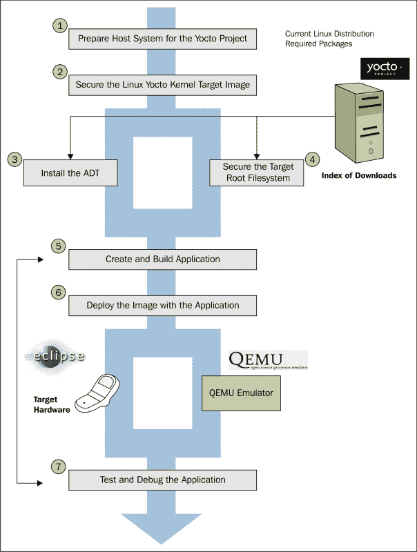

# 第六章 Yocto 项目的组成

在本章中，我们将向您简要介绍 Yocto 项目生态系统的一些组成部分。 本章旨在介绍所有这些内容，以便在接下来的章节中能够更详细地介绍它们。 它还试图引导读者阅读额外的内容。 对于所展示的每个工具、功能或有趣的事实，我们都提供了链接来帮助感兴趣的读者搜索他们自己对本书中的问题以及本章未涉及的问题的答案。

本章充满了涉及特定 Yocto 项目工具的嵌入式开发过程的指导和相关示例。 工具的选择是以纯粹主观的方式进行的。 只选择了在开发过程中被认为有帮助的工具。 我们还考虑到这样一个事实，即它们中的一些可以为嵌入式世界和嵌入式系统的总体开发提供新的见解。

# ==同步，由 Elderman 更正==@ELDER_MAN

POKY表示 Yocto 项目的元数据和工具的参考构建系统，任何对与 Yocto 项目交互感兴趣的人都可以使用它们作为起点。 它是独立于平台的，并提供了构建和定制最终结果的工具和机制，这实际上是一个 Linux 软件堆栈。 POKY 被用作与 Yocto 项目交互的中心部分。

作为开发人员使用 Yocto 项目时，了解有关邮寄列表和**Internet Relay Chat**(**IRC**)通道的信息非常重要。 此外，就可用的 bug 和特性列表而言，Bugzilla 项目可以作为灵感的来源。 所有这些元素都需要一个简短的介绍，所以最好的起点将是约克托项目布格齐拉(Yocto Project Bugzilla)。 它为 Yocto 项目的用户提供了一个错误跟踪应用程序，也是报告问题的地方。 下一个组件由 IRC 的可用通道表示。 Freenode 上有两个可用组件，一个用于 POKY，另一个用于与 Yocto 项目相关的讨论，例如**#POKY**和**#Yocto**。 第三个元素由Yocto Project 邮件列表表示，用于订阅Yocto 项目的这些邮件列表：

*   [http://lists.yoctoproject.org/listinfo/yocto](http://lists.yoctoproject.org/listinfo/yocto)：这是指进行 yocto 项目讨论的邮件列表
*   [http://lists.yoctoproject.org/listinfo/poky](http://lists.yoctoproject.org/listinfo/poky)：这是指关于 Yocto 项目系统的 POKY 构建进行讨论的邮件列表
*   [http://lists.yoctoproject.org/listinfo/yocto-announce](http://lists.yoctoproject.org/listinfo/yocto-announce)：这是指发布 Yocto 项目正式公告的邮件列表，以及展示 Yocto 项目里程碑的邮件列表

借助[http://lists.yoctoproject.org/listinfo](http://lists.yoctoproject.org/listinfo)的帮助，可以收集有关一般邮件列表和特定于项目的邮件列表的更多信息。 它包含在[https://www.yoctoproject.org/tools-resources/community/mailing-lists](https://www.yoctoproject.org/tools-resources/community/mailing-lists)上可用的所有邮件列表的列表。

为了启动使用 Yocto 项目的开发，特别是 POKY，您不应该只使用前面提到的组件；还应该提供关于这些通行费的一些信息。 在他们的文档页面[https://www.yoctoproject.org/documentation](https://www.yoctoproject.org/documentation)上可以很好地解释 Yocto 项目。 如果您有兴趣阅读简短的介绍，可能值得查看*Embedded Linux Development with Yocto Project*，*Otavio 萨尔瓦多*和*Daiane Anangini*，作者是*Packt Publishing*。

要使用 Yocto 项目，需要满足一些具体要求：

*   **主机系统**：让我们假设这是一个基于 Linux 的主机系统。 然而，它不是普通的主机系统；Yocto 有特定的要求。 支持的操作系统在`poky.conf`文件中可用，在目录`meta-yocto/conf/distro`中可用。 支持的操作系统在`SANITY_TESTED_DISTROS`变量中定义，其中一些系统如下所示：
    *   Ubuntu-12.04
    *   Ubuntu-13.10
    *   Ubuntu-14.04
    *   Fedora-19 Fedora 19
    *   Fedora-20 Fedora 20
    *   CentOS-6.4
    *   CentOS-6.5
    *   Debian-7.0
    *   Debian-7.1
    *   Debian-7.2
    *   Debian-7.3
    *   Debian-7.4
    *   Debian-7.5
    *   Debian-7.6
    *   SUSE-LINUX-12.2
    *   OpenSUSE-project-12.3
    *   OpenSUSE-project-13.1
*   **Required Packages**：此包含主机系统上可用的软件包的最低要求列表，除了已经可用的软件包。 当然，这在不同的主机系统之间是不同的，并且系统会根据它们的用途而不同。 但是，对于 Ubuntu 主机，我们需要满足以下要求：
    *   **要点**：指`sudo apt-get install gawk wget git-core diffstat unzip texinfo gcc-multilib build-essential chrpath socat`
    *   **图形和 Eclipse 插件附加**：这指的是`sudo apt-get install libsdl1.2-dev xterm`
    *   **文档**：指`sudo apt-get install make xsltproc docbook-utils fop dblatex xmlto`
    *   **ADT Installer Extras**：这指的是`sudo apt-get install autoconf automake libtool libglib2.0-dev`
*   **Yocto 项目版本**：在开始任何工作之前，应该选择一个可用的 POKY 版本。 这本书是基于 DIZZY 分支的，它是 POKY 1.7 版本，但是开发人员可以选择最适合他或她的任何东西。 当然，由于与项目的交互是使用`git`版本控制系统完成的，因此用户首先需要克隆 POKY 存储库，并且对项目的任何贡献都应该作为补丁提交给开放源码社区。 也有可能获得 TAR 存档，但是这种方法有一些限制，因为对源代码所做的任何更改都更难跟踪，而且它还限制了与项目中涉及的社区的交互。

如果需要特殊要求，还应注意其他额外的可选要求，如下所示：

*   **自定义 Yocto Project 内核交互**：如果开发人员决定维护内核源 Yocto 项目，并且不适合他们的需要，他们可以在 Yocto Linux 内核部分下的[http://git.yoctoproject.org/cgit.cgi](http://git.yoctoproject.org/cgit.cgi)处获得内核版本支持的 Yocto 项目的本地副本之一，并根据他们的需要进行修改。 当然，这些更改以及其他内核源代码将需要驻留在单独的存储库中，最好是`git`，并且它将通过内核配方引入 Yocto 世界。
*   **meta-yocto-kernel-Extras git 存储库**：在这里，在构建和修改内核映像时收集所需的元数据。 它包含一组个`bbappend`文件，可以对这些文件进行编辑，以向本地表明源代码已更改，这是开发 Linux 内核功能时使用的更有效的方法。 它位于[http://git.yoctoproject.org/cgit.cgi](http://git.yoctoproject.org/cgit.cgi)的**Yocto 元数据层**部分下。
*   **支持的电路板支持包(BSP)**：Yocto 项目提供和支持大量 BSP 层。 每个 BSP 层的命名非常简单，`meta-<bsp-name>`，可以在**Yocto Metadata Layers**部分下的[http://git.yoctoproject.org/cgit.cgi](http://git.yoctoproject.org/cgit.cgi)找到。 实际上，每个 BSP 层都是定义 BSP 提供者提供的行为和最低要求的食谱的集合。 有关战略规划编制的更多信息，请参阅[http://www.yoctoproject.org/docs/1.7/dev-manual/dev-manual.html#developing-a-board-support-package-bsp](http://www.yoctoproject.org/docs/1.7/dev-manual/dev-manual.html#developing-a-board-support-package-bsp)。
*   **Eclipse Yocto 插件**：对于对编写应用程序感兴趣的开发人员，Eclipse**集成开发环境**(**IDE**)随特定于 Yocto 的插件一起提供。 您可以在[http://www.yoctoproject.org/docs/1.7/dev-manual/dev-manual.html#setting-up-the-eclipse-ide](http://www.yoctoproject.org/docs/1.7/dev-manual/dev-manual.html#setting-up-the-eclipse-ide)上找到有关这方面的更多信息。

约克托项目内部的发展过程具有多方面的意义。 它可以引用 Yocto Project Bugzilla 中提供的各种错误和功能。 开发者可以将其中一个分配到他或她的帐户并解决它。 各种菜谱可以升级，这一过程也需要开发人员的参与；还可以添加新功能，需要开发人员编写各种菜谱。 所有这些任务都需要有一个定义良好的流程，该流程还涉及`git`交互。

要将食谱中添加的更改发送回社区，可以使用可用的创建-拉-请求和发送-拉请求脚本。 这些脚本位于 poky 存储库中的脚本目录中。 此外，在本节中，还提供了许多其他有趣的脚本，例如`create-recipe`脚本，以及我将让您自己发现的其他脚本。 向上游发送更改的另一种首选方法是使用手动方法，该方法涉及与`git`命令(如`git add`、`git commit –s`、`git format-patch`、`git send-email`等)的交互。

在继续描述本章中介绍的其他组件之前，我们将回顾一下现有的 Yocto 项目开发模型。 此过程涉及 Yocto 项目提供的以下工具：

*   **系统开发**：这包括 BSP 的开发、内核开发和它的配置。 它们中的每一个在 Yocto 项目文档中都有描述各自开发过程的部分，如[http://www.yoctoproject.org/docs/1.7/bsp-guide/bsp-guide.html#creating-a-new-bsp-layer-using-the-yocto-bsp-script](http://www.yoctoproject.org/docs/1.7/bsp-guide/bsp-guide.html#creating-a-new-bsp-layer-using-the-yocto-bsp-script)和[http://www.yoctoproject.org/docs/1.7/kernel-dev/kernel-dev.html](http://www.yoctoproject.org/docs/1.7/kernel-dev/kernel-dev.html)所示。
*   **用户应用程序开发**：这包括针对目标硬件设备的应用程序开发。 有关主机系统上应用程序开发的必要设置的信息，请参阅[http://www.yoctoproject.org/docs/1.7/adt-manual/adt-manual.html](http://www.yoctoproject.org/docs/1.7/adt-manual/adt-manual.html)。 本章的*Eclipse ADT 插件*部分也将讨论该组件。
*   **源代码临时修改**：这涵盖了开发过程中出现的临时修改。 这涉及到针对项目源代码中提供的各种实现问题的解决方案。 问题解决后，更改需要在上游可用并相应地应用。
*   **HOB 映像的开发**：HOB 构建系统可用于操作和自定义系统映像。 它是一个用 Python 开发的图形界面，作为与 Bitbake 构建系统的更有效的界面。
*   **Devshell 开发**：这是一种使用 Bitbake 构建系统任务的确切环境的开发方法。 它是用于调试或包编辑的最有效的方法之一。 在编写项目的各种组件时，这也是设置构建环境的最快方法之一。

对于提供的组件太旧而不能满足 Yocto 项目要求的操作系统，建议使用 buildtools 工具链来提供所需的软件版本。 安装`buildtools`tarball 有两种方法。 第一种方法意味着使用已有的预先构建的 tarball，第二种方法涉及使用 Bitbake 构建系统构建它。 有关此选项的更多信息可以在 Yocto 文档巨型手册[http://www.yoctoproject.org/docs/1.7/mega-manual/mega-manual.html#required-git-tar-and-python-versions](http://www.yoctoproject.org/docs/1.7/mega-manual/mega-manual.html#required-git-tar-and-python-versions)的**Required Git，tar，and Python versions**部分下的小节中找到。

# Eclipse ADT 插件

**应用程序开发工具包**，也称为 ADT，提供了一个适用于定制构建和以用户为目标的应用程序的交叉开发平台。 它是由以下元素组成的：

*   **交叉工具链**：它与`sysroot`相关联，两者都是使用 Bitbake 自动生成的，目标硬件供应商提供目标特定的元数据。
*   **Quick Emulator 环境(QEMU)**：it用于模拟目标硬件。
*   **用户空间工具**：它改进了应用程序开发的整体体验
*   **Eclipse IDE**：它包含个特定于 Yocto 项目的插件

在本节中，我们将讨论前面的每一个元素，我们将从交叉开发工具链开始。 它由用于目标应用程序开发的交叉链接器、交叉调试器和交叉编译器组成。 它还需要关联的目标`sysroot`，因为在构建将在目标设备上运行的应用程序时需要必要的头和库。 生成的`sysroot`与生成`root`文件系统的配置相同；这指的是*映像*配方。

工具链可以使用多种方法生成。 最常见的方法是从[http://downloads.yoctoproject.org/releases/yocto/yocto-1.7/toolchain/](http://downloads.yoctoproject.org/releases/yocto/yocto-1.7/toolchain/)下载工具链，并为您的主机和目标获取适当的工具链安装程序。 `poky-glibc-x86_64-core-image-sato-armv7a-vfp-neon-toolchain-1.7.sh`脚本就是一个这样的例子，当执行该脚本时，它会将工具链安装在`/opt/poky/1.7/`目录的默认位置。 如果在开始执行脚本之前在脚本中提供了适当的参数，则可以更改此位置。

在生成工具链时，我更喜欢使用的另一种方法是使用 Bitbake 构建系统。 这里，我指的是`meta-ide-support`。 运行`bitbake meta-ide-support`时，会生成跨工具链，并填充构建目录。 在完成此任务后，将获得与前面提到的解决方案相同的结果，但在本例中，将使用已经可用的构建目录。 这两个解决方案剩下的唯一任务是使用包含`environment-setup`字符串的脚本设置环境并开始使用它。

QEMU 仿真器提供了在一个硬件设备不可用时模拟该硬件设备的可能性。 有多种方法可以使其在开发过程中可用：

*   使用 ADT-Installer 生成的脚本安装 ADT。 此脚本中提供的步骤之一提供了在开发过程中启用或禁用 QEMU 的可能性。
*   下载了 Yocto Project 版本，并在开发过程中默认设置了环境。 然后，QEMU 安装完毕并可供使用。
*   将创建 POKY 存储库的`git`克隆，并设置环境。 在这种情况下，QEMU 也已安装并可用。
*   下载、安装了`cross-toolchain`tarball，并设置了环境。 默认情况下，这还会启用 QEMU 并安装它以供以后使用。

用户空间工具包含在发行版中，并在开发过程中使用。 它们在 Linux 平台上非常常见，可以包括以下内容：

*   **Perf**：它是一个Linux 性能计数器，用于测量特定的硬件和软件事件。 有关这方面的更多信息，请参见[https://perf.wiki.kernel.org/](https://perf.wiki.kernel.org/)，以及 Yocto 的剖析和跟踪手册，其中有整整一节专门介绍了该工具。
*   **PowerTop**：它是一种功率测量工具，用于确定软件消耗的电量。 有关它的更多信息可在[https://01.org/powertop/](https://01.org/powertop/)获得。
*   **LatencyTop**：它是一个与 PowerTop 类似的工具，不同之处在于这个工具侧重于从桌面上的音频跳跃和卡顿到服务器过载的延迟测量；它有针对这类场景的测量，并针对延迟问题提供了解决方案。 虽然自 2009 年以来这个项目似乎没有提交过，但由于非常有用的事实，它至今仍在使用。
*   **OProfile**：它表示用于 Linux 生态系统的系统范围的分析器，开销很低。 有关它的更多信息，请访问[http://oprofile.sourceforge.net/about/](http://oprofile.sourceforge.net/about/)。 在 Yocto 的剖析和跟踪手册中也有一节可用。
*   **SystemTap**：它提供关于正在运行的 Linux 系统的基础设施的信息，以及系统的性能和功能问题。 虽然它不能作为 Eclipse 扩展使用，但只能作为 Linux 发行版中的一个工具。 有关it的更多信息，请参见[http://sourceware.org/systemtap](http://sourceware.org/systemtap)。 它还在 Yocto 的剖析和跟踪手册中定义了一个部分。
*   **Ltd-ust**：它是项目的用户空间跟踪器，提供与用户空间活动相关的信息。 更多信息可在[http://lttng.org/](http://lttng.org/)获得。

ADT 平台的最后一个元素由 Eclipse IDE 表示。 事实上，它是最流行的开发环境，它为 Yocto 项目的开发提供了全力支持。 在 Eclipse IDE 中安装 Yocto Project Eclipse 插件后，Yocto Project 体验就完整了。 这些插件提供了在 QEMU 仿真环境中交叉编译、开发、部署和执行生成的二进制文件的可能性。 交叉调试、跟踪、远程分析和电力数据收集等活动也是可能的。 有关使用 Yocto 项目的 Eclipse 插件的活动的更多信息，可以在[http://www.yoctoproject.org/docs/1.7/mega-manual/mega-manual.html#adt-eclipse](http://www.yoctoproject.org/docs/1.7/mega-manual/mega-manual.html#adt-eclipse)中找到。

为了更好地了解 ADT 工具包平台和 Eclipse 的应用程序开发工作流程，下图中提供了整个过程的概述：

应用程序开发过程也可以使用与已提供的工具不同的其他工具来完成。 然而，所有这些选项都涉及到 Yocto Project 组件的使用，最引人注目的是 Poby 参考系统。 因此，ADT 是开源社区建议、测试和推荐的选项。

# 滚刀和烤面包机

该项目-**Hob**-表示Bitbake 构建系统的图形用户界面。 它的目的是简化与 Yocto 项目的交互，并为该项目创建更精简的学习曲线，允许用户以更简单的方式执行日常任务。 它的主要关注点是 Linux 操作系统映像的生成。 随着时间的推移，它不断发展，现在可以认为它既适合有经验的用户，也适合没有经验的用户。 虽然我更喜欢使用命令行交互，但这句话并不适用于所有 Yocto Project 用户。

然而，随着 Daisy1.6 的发布，Hob 的开发似乎停止了。 开发活动稍微转移到了新项目-**Toaster**-，稍后将对其进行解释；Hob 项目今天仍在使用，应该提到它的功能。 因此，当前可用的 HOB 版本能够执行以下操作：

*   自定义可用的基本图像配方
*   创建完全自定义的图像
*   构建任何给定的映像
*   使用 QEMU 运行映像
*   在 U 盘上部署映像，以便在目标上进行实时引导

可以使用与执行 Bitbake 相同的方式启动 Hob 项目。 创建环境源和构建目录后，可以调用`hob`命令并为用户显示图形界面。 这样做的缺点是该工具不能替代命令行交互。 如果需要创建新食谱，则此工具将无法为任务提供任何帮助。

下一个项目叫烤面包机。 它是一个应用程序编程接口，也是 Yocto 项目构建的 Web 接口。 在其当前状态下，它只能通过 Web 浏览器收集和显示与构建过程相关的信息。 以下是其部分功能：

*   生成过程中执行和重用的任务的可见性
*   构建组件的可见性，例如一个映像的食谱和包-这是以类似于 Hob 的方式完成的
*   提供有关食谱的信息，如依赖项、许可证等
*   提供与性能相关的信息，如磁盘 I/O、CPU 使用率等
*   为调试目的提供错误、警告和跟踪报告

虽然看起来可能不多，但这个项目承诺提供构建和定制构建的可能性，就像 Hob 做的那样，以及许多其他好东西。 您可以在[https://wiki.yoctoproject.org/wiki/Toaster](https://wiki.yoctoproject.org/wiki/Toaster)找到关于此工具的有用信息。

# 自动生成器

**Autobuilder**是一个促进构建测试自动化并进行质量保证的项目。 通过这个内部项目，Yocto 社区试图设置一条路径，让嵌入式开发人员能够发布他们的 QA 测试和测试计划，开发用于自动测试、持续集成的新工具，并开发 QA 过程来演示和展示它们，以使所有相关方受益。

通过使用 Autobuilder平台(可从[http://autobuilder.yoctoproject.org/](http://autobuilder.yoctoproject.org/)获得)发布其当前状态的项目已经实现了这些点。 每个人都可以访问此链接，并对与 Yocto 项目相关的所有更改以及所有支持的硬件平台的夜间构建进行测试。 虽然从 Buildbot 项目开始，它从该项目借用组件进行持续集成，但该项目承诺继续前进，并提供执行运行时测试和其他必备功能的可能性。

您可以在[https://wiki.yoctoproject.org/wiki/AutoBuilder](https://wiki.yoctoproject.org/wiki/AutoBuilder)和[https://wiki.yoctoproject.org/wiki/QA](https://wiki.yoctoproject.org/wiki/QA)上找到有关此项目的一些有用信息，其中提供了对每个版本所做的 QA 过程的访问，以及一些额外信息。

# ►T0®熔岩

Lava 项目不是 Yocto 项目的内部工作，而是由 Linaro 开发的项目，Linaro 是一个自动化验证架构，旨在测试 Linux 系统在设备上的部署。 虽然它的主要关注点是 ARM 架构，但它是开源的这一事实并不会阻碍它的发展。 它的实际名称是**Linaro Automation and Validation Architecture**(**LAVA**)。

该项目提供了在硬件或虚拟平台上部署操作系统、在项目中定义、测试和执行操作系统的可能性。 这些测试可以是各种复杂的，它们可以合并成更大、更有说服力的测试，并及时跟踪结果，然后导出结果数据进行分析。

这是基于持续发展的架构的思想开发的，该架构允许测试执行与自动化和质量控制一起进行。 同时，它还为收集的数据提供验证。 测试可以是任何东西，从编译引导测试到对内核调度程序的更改(可能降低功耗，也可能没有降低功耗)。

虽然它还很年轻，但这个项目已经获得了相当多的观众，所以对这个项目进行一些调查不会伤害到任何人。

### 备注

熔岩手册可在[https://validation.linaro.org/static/docs/](https://validation.linaro.org/static/docs/)获得

# WIC

**WIC**更多的是的功能，而不是项目本身。 它是文档最少的，如果搜索它，您可能找不到任何结果。 我之所以决定在这里提及它，是因为在开发过程中可能会出现一些特殊需求，比如从可用的包(如`.deb`、`.rpm`或`.ipk`)生成自定义的`root`文件系统。 这份工作是最适合 WIC 工具的工作。

该工具试图解决设备或引导加载程序的一些特殊要求，例如`root`文件系统的特殊格式化或分区。 这是一个高度定制的工具，提供了扩展其功能的可能性。 它是从另一个名为**Oeic**的工具开发而来的，该工具用于为硬件创建特定的专有格式化图像，并被导入到 Yocto 项目中，以便为那些不想接触食谱、已经打包源代码或需要对其可交付的 Linux 图像进行特殊格式化的开发人员提供更广泛的服务。

不幸的是，没有关于该工具的文档，但我可以将感兴趣的人带到它在 Yocto 项目中的位置。 它驻留在脚本目录中名为 WIC 的 POKY 存储库中。 WIC 可以用作任何脚本，并且它提供了一个帮助界面，您可以在其中查找更多信息。 此外，它的功能将在接下来的章节中以扩展的方式介绍。

关于围绕 Yocto 项目开发的所有个可用项目的列表可以在[https://www.yoctoproject.org/tools-resources/projects](https://www.yoctoproject.org/tools-resources/projects)找到。 有一些可用的项目没有在本章的上下文中讨论，但我会让您了解其中的每一个。 还有其他外部项目没有上榜。 我鼓励您自己去发现和了解它们。

# 摘要

在本章中，我们向您介绍了本书下一步将讨论的元素。 在下一章中，前面提到的每一节都将在不同的章节中介绍，信息将以更深入和更实用的方式介绍。

在下一章中，前面提到的过程将从应用程序开发工具包平台开始。 我们将介绍搭建平台所需的步骤，并向您介绍一些使用场景。 这些包括交叉开发、使用 QEMU 进行调试以及特定工具之间的交互。