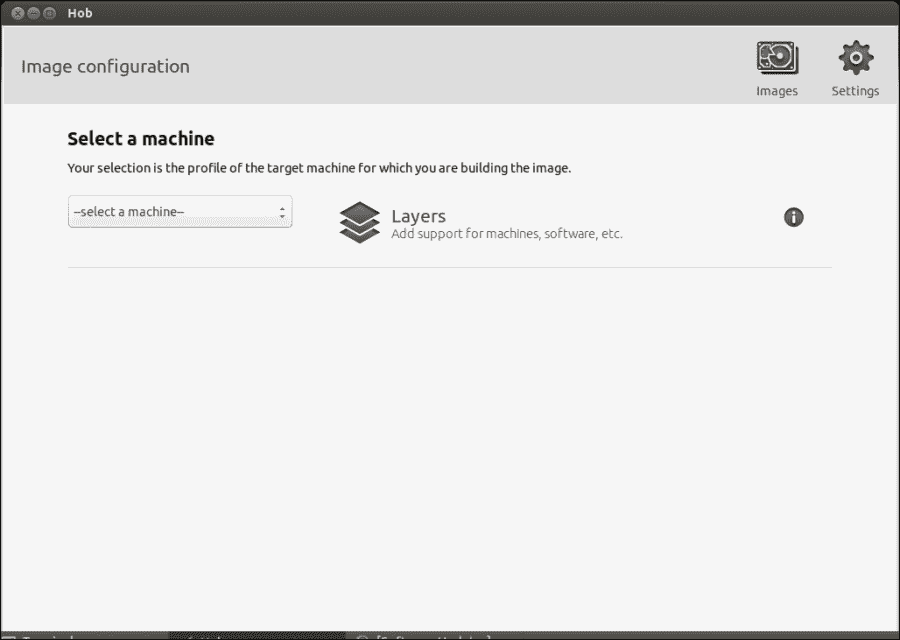
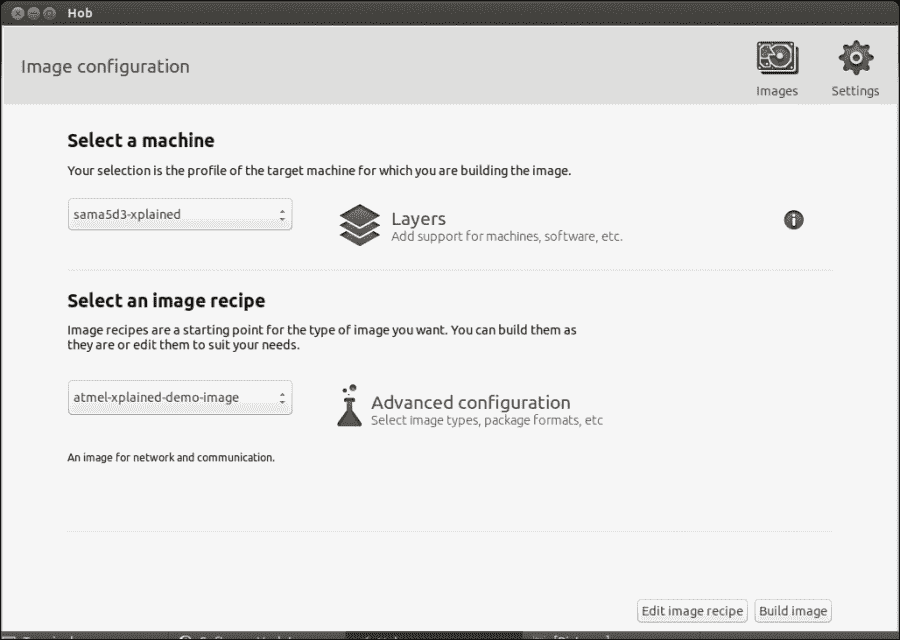
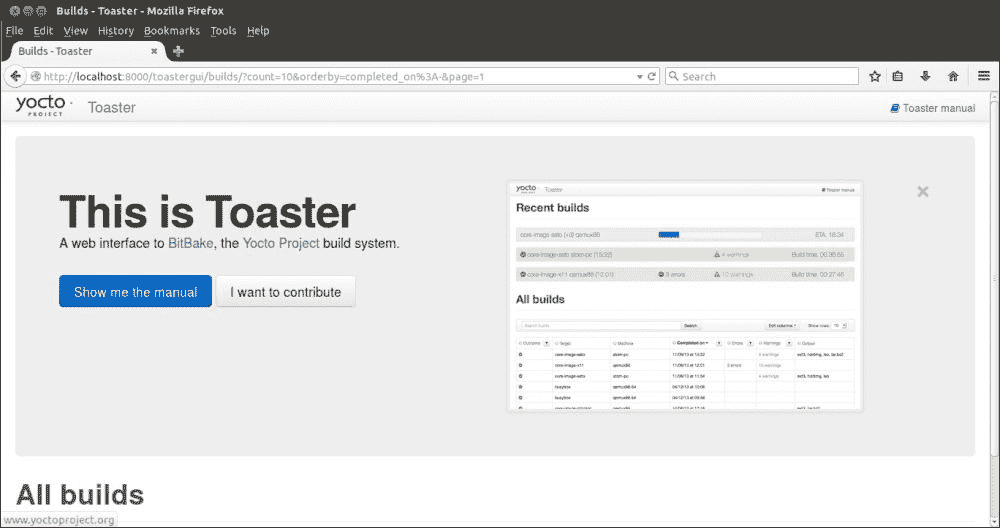
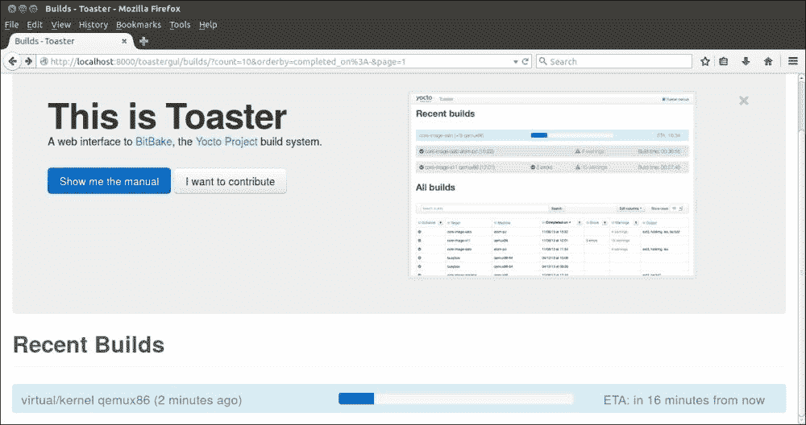
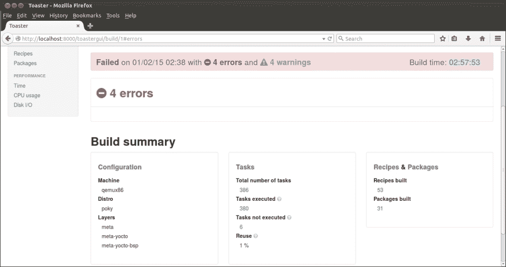
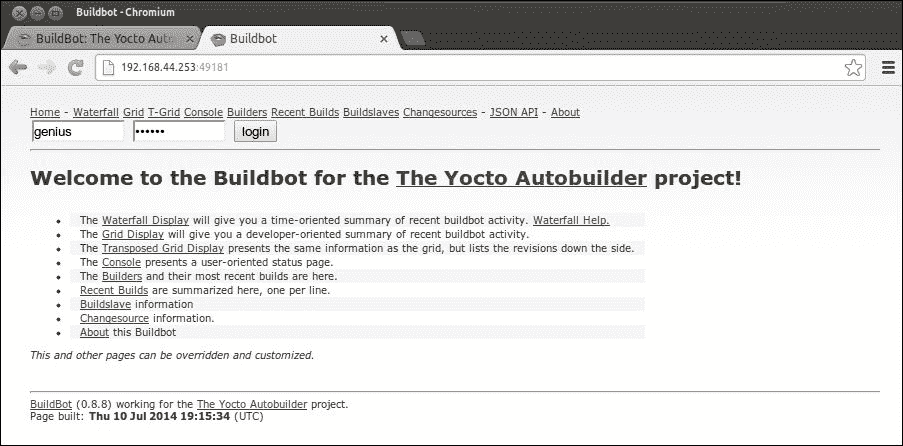

# 第八章滚刀、烤面包机和汽车建造机

在本章中，您将了解 Yocto 社区中使用的新工具和组件。 正如标题所示，本章专门介绍另一类工具。 我将从**Hob**开始，它是一个正在慢慢消亡的图形界面，随着时间的推移，它将被一个名为**Toaster**的新 Web 界面所取代。 本章还将介绍一个新的讨论点。 在这里，我指的是 QA 和测试组件，在大多数情况下，这些组件在大多数项目中都没有或缺少。 Yocto 非常认真地对待这个问题，并提供了解决方案。 本章的最后一节将介绍此解决方案。

还将为您提供更详细的组件演示，如滚刀、烤面包机和 AutoBuilder。 这些组件中的每一个都将单独进行评估，并详细介绍它们的优点和用例。 对于前两个组件(即 Hob 和 Toaster)，有关构建过程的信息将与各种安装场景一起提供。 HOB 类似于 BitBake，并与 POKY 和 Build Directory 紧密集成。 另一方面，Toaster 是一种更宽松的选择，它提供了多种配置选择和设置，以及一个性能部分，对于任何对改进构建系统的整体性能感兴趣的开发人员来说，性能部分都非常有用。 本章以有关 AutoBuilder 的部分结束。 这个项目是 Yocto 项目的基石，该项目致力于使嵌入式开发和开放源码总体上更加用户友好，但也提供了更安全和无错误的项目。 我希望您喜欢这一章；让我们继续第一节。

# 滚刀

Hob 项目代表了 BitBake 构建系统的 GUI 替代方案。 它的目的是以更容易、更快的方式执行个最常见的任务，但不会使命令行交互消失。 这是因为配方和配置的大部分仍需要手动完成。 在上一章中，BitBake 指挥官扩展作为菜谱编辑的替代解决方案被介绍，但在本项目中，它有其局限性。

HOB 的主要目的是允许用户更容易地与构建系统进行交互。 当然，有些用户不喜欢图形用户界面替代方案而不是命令行选项，我有点同意他们的观点，但这完全是另一种讨论。 HOB 也可以是他们的一种选择；它不仅对于那些喜欢在他们面前有一个界面的人来说是一种选择，而且对于那些依赖于他们的命令行交互的人来说也是一种选择。

除了最常见的任务之外，HOB 可能无法执行许多任务，例如构建映像、修改其现有配方、通过 QEMU 仿真器运行映像，甚至将其部署到 USB 设备上以在目标设备上执行一些实时引导操作。 拥有所有这些功能不是很多，但却很有趣。 您在 Yocto Project 中使用工具的经验在这里并不重要。 前面提到的任务可以非常容易、直观地完成，这也是 Hob 最有趣的地方。 它以一种非常简单的方式为用户提供他们需要的东西。 与它互动的人可以从它提供的课程中学到东西，无论他们是图形界面爱好者还是精通命令行的人。

在本章中，I将向您展示如何使用 Hob 项目来构建 Linux 操作系统映像。 为了演示这一点，我将使用 Atmel SAMA5D3 XPlaed 机器，这也是我在前面章节中用于其他演示的机器。

首先，让我们来看看第一次启动时 HOB 是什么样子的。 结果如下图所示：



要检索图形界面，用户需要执行 BitBake 命令行交互所需的给定步骤。 首先，它需要创建一个构建目录，并且从该构建目录中，用户需要使用 HOB 命令启动 HOB 图形界面，如下所示：

```sh
source poky/oe-init-build-env ../build-test
hob

```

下一步是建立构建所需的层。 您可以通过在**Layers**窗口中选择它们来完成此操作。 对`meta-atmel`层要做的第一件事是将其添加到构建中。 尽管您可以在已经存在的构建目录中开始工作，但是 HOB 将无法检索现有配置，并将在`bblayers.conf`和`local.conf`配置文件上创建新的配置。 它将使用下一条`#added by hob`消息标记添加的行。


将对应的`meta-atmel`层添加到 Build 目录后，所有支持的机器都会出现在**Select a Machine**下拉列表中，包括由`meta-atmel`层添加的机器。 从可用选项中，需要选择**SAMA5D3-XPlaed**机器：


选择Atmel**SAMA5D3-XPlaed**机器时，会出现错误，如以下屏幕截图所示：


将`meta-qt5`层添加到 Layers 部分后，此错误消失，构建过程可以继续。 要检索`meta-qt5`层，需要使用以下`git`命令：

```sh
git clone -b dizzy https://github.com/meta-qt5/meta-qt5.git

```

由于所有可用的配置文件和配方都已解析，解析过程需要一段时间，在此之后，您将看到一个错误，如以下屏幕截图所示：


在再次快速检查之后，您将看到以下代码：

```sh
find ../ -name "qt4-embedded*"
./meta/recipes-qt/qt4/qt4-embedded_4.8.6.bb
./meta/recipes-qt/qt4/qt4-embedded.inc
./meta-atmel/recipes-qt/qt4/qt4-embedded-4.8.5
./meta-atmel/recipes-qt/qt4/qt4-embedded_4.8.5.bbappend

```

唯一的解释是`meta-atmel`层不更新它的食谱，而是附加它们。 这可以通过两种方式克服。 最简单的方法是更新`.bbappend`文件中的食谱，并确保将新的可用食谱转换为上游社区的补丁。 在`meta-atmel`层中包含所需更改的补丁程序将很快向您解释，但首先，我将介绍解决构建过程中存在的问题所需的可用选项和必要更改。

另一种解决方案是包括`meta-atmel`构建过程所需的配方。 它最好的可用位置也是在`meta-atmel`。 然而，在这种情况下，应该将`.bbappend`配置文件与配方合并，因为将配方及其附加文件放在同一位置没有多大意义。

修复此问题后，用户将可以使用新的选项，如以下屏幕截图所示：


现在，用户有机会选择需要构建的映像，以及需要添加的额外配置。 这些配置包括：

*   分配类型的选择
*   图像类型的选择
*   一种包装格式
*   围绕根文件系统的其他小调整

下面的屏幕截图描述了其中的一些内容：


我已经选择将分发类型从**poky-iny**更改为**poky**，生成的根文件系统输出格式在以下屏幕截图中可见：


进行调整后，将重新解析食谱，当此过程完成时，可以选择结果图像，以便开始构建过程。 为本演示选择的图像是**Atmel-XPlaed-demo-image**图像，它对应于同名的食谱。 此信息还显示在以下屏幕截图中：



通过单击**构建映像**按钮开始构建过程。 构建开始后不久，将出现一个错误，它告诉我们**meta-Atmel**BSP 层需要更多需要我们定义的依赖项：


此信息从`iperf`配方收集，该配方在包含的层中不可用；它在`meta-openembedded/meta-oe`层中可用。 在更详细的搜索和更新过程之后，有了一些启示。 有比`meta-atmel`BSP 层所需的更多的层依赖关系，如下所示：

*   `meta-openembedded/meta-oe`层
*   `meta-openembedded/meta-networking`层
*   `meta-openembedded/meta-ruby`层
*   `meta-openembedded/meta-python`层
*   `meta-qt5`层

最终结果在`bblayers.conf`文件中的`BBLAYERS`变量中可用，如下所示：

```sh
#added by hob
BBFILES += "${TOPDIR}/recipimg/custom/*.bb"
#added by hob
BBFILES += "${TOPDIR}/recipimg/*.bb"

#added by hob
BBLAYERS = "/home/alex/workspace/book/poky/meta /home/alex/workspace/book/poky/meta-yocto /home/alex/workspace/book/poky/meta-yocto-bsp /home/alex/workspace/book/poky/meta-atmel /home/alex/workspace/book/poky/meta-qt5 /home/alex/workspace/book/poky/meta-openembedded/meta-oe /home/alex/workspace/book/poky/meta-openembedded/meta-networking /home/alex/workspace/book/poky/meta-openembedded/meta-ruby /home/alex/workspace/book/poky/meta-openembedded/meta-python"
```

在开始完整的构建之前，需要对`meta-atmel`层进行一些必要的更改，如下所示：

*   将`packagegroup-core-basic`替换为`packagegroup-core-full-cmdline`，因为最新的 POKY 已更新了`packagegroup`名称。
*   删除`python-setuptools`，因为它在`meta-openembedded/meta-oe`层以及新的`meta-openembedded/meta-python`层中不再可用，新的`meta-openembedded/meta-python`层是所有与 Python 相关的食谱的新占位符。 删除了`python-setuptools`工具，因为它能够下载、构建、安装、升级和卸载额外的 Python 包，并且不是 Yocto 的强制要求。 这就是它的一般目的。
*   前面关于`qt4-embedded-4.8.5`的`qt4-embedded-4.8.6`更新的更改(如前面所示)显示了错误。

以下补丁提供了对`meta-atmel`层所做的所有更改：

```sh
From 35ccf73396da33a641f307f85e6b92d5451dc255 Mon Sep 17 00:00:00 2001
From: "Alexandru.Vaduva" <vaduva.jan.alexandru@gmail.com>
Date: Sat, 31 Jan 2015 23:07:49 +0200
Subject: [meta-atmel][PATCH] Update suppport for atmel-xplained-demo-image
 image.

The latest poky contains updates regarding the qt4 version support
and also the packagegroup naming.
Removed packages which are no longer available.

Signed-off-by: Alexandru.Vaduva <vaduva.jan.alexandru@gmail.com>
---
 recipes-coimg/atmel-demo-image.inc           |  3 +--
 ...qt-embedded-linux-4.8.4-phonon-colors-fix.patch | 26 ----------------------
 ...qt-embedded-linux-4.8.4-phonon-colors-fix.patch | 26 ++++++++++++++++++++++
 recipes-qt/qt4/qt4-embedded_4.8.5.bbappend         |  2 --
 recipes-qt/qt4/qt4-embedded_4.8.6.bbappend         |  2 ++
 5 files changed, 29 insertions(+), 30 deletions(-)
 delete mode 100644 recipes-qt/qt4/qt4-embedded-4.8.5/qt-embedded-linux-4.8.4-phonon-colors-fix.patch
 create mode 100644 recipes-qt/qt4/qt4-embedded-4.8.6/qt-embedded-linux-4.8.4-phonon-colors-fix.patch
 delete mode 100644 recipes-qt/qt4/qt4-embedded_4.8.5.bbappend
 create mode 100644 recipes-qt/qt4/qt4-embedded_4.8.6.bbappend

diff --git a/recipes-coimg/atmel-demo-image.inc b/recipes-coimg/atmel-demo-image.inc
index fe13303..a019586 100644
--- a/recipes-coimg/atmel-demo-image.inc
+++ b/recipes-coimg/atmel-demo-image.inc
@@ -2,7 +2,7 @@ IMAGE_FEATURES += "ssh-server-openssh package-management"

 IMAGE_INSTALL = "\
     packagegroup-core-boot \
-    packagegroup-core-basic \
+    packagegroup-core-full-cmdline \
     packagegroup-base-wifi \
     packagegroup-base-bluetooth \
     packagegroup-base-usbgadget \
@@ -23,7 +23,6 @@ IMAGE_INSTALL = "\
     python-smbus \
     python-ctypes \
     python-pip \
-    python-setuptools \
     python-pycurl \
     gdbserver \
     usbutils \
diff --git a/recipes-qt/qt4/qt4-embedded-4.8.5/qt-embedded-linux-4.8.4-phonon-colors-fix.patch b/recipes-qt/qt4/qt4-embedded-4.8.5/qt-embedded-linux-4.8.4-phonon-colors-fix.patch
deleted file mode 100644
index 0624eef..0000000
--- a/recipes-qt/qt4/qt4-embedded-4.8.5/qt-embedded-linux-4.8.4-phonon-colors-fix.patch
+++ /dev/null
@@ -1,26 +0,0 @@
-diff --git a/src/3rdparty/phonon/gstreamer/qwidgetvideosink.cpp b/src/3rdparty/phonon/gstreamer/qwidgetvideosink.cpp
-index 89d5a9d..8508001 100644
---- a/src/3rdparty/phonon/gstreamer/qwidgetvideosink.cpp
-+++ b/src/3rdparty/phonon/gstreamer/qwidgetvideosink.cpp
-@@ -18,6 +18,7 @@
- #include <QApplication>
- #include "videowidget.h"
- #include "qwidgetvideosink.h"
-+#include <gst/video/video.h>
-
- QT_BEGIN_NAMESPACE
-
-@@ -106,11 +107,7 @@ static GstStaticPadTemplate template_factory_rgb =-     GST_STATIC_PAD_TEMPLATE("sink",- GST_PAD_SINK,
-                             GST_PAD_ALWAYS,
--                            GST_STATIC_CAPS("video/x-raw-rgb, "
--                                            "framerate = (fraction) [ 0, MAX ], "
--                                            "width = (int) [ 1, MAX ], "
--                                            "height = (int) [ 1, MAX ],"
--                                            "bpp = (int) 32"));
-+                            GST_STATIC_CAPS(GST_VIDEO_CAPS_xRGB_HOST_ENDIAN));
-
- template <VideoFormat FMT>
- struct template_factory;
-
diff --git a/recipes-qt/qt4/qt4-embedded-4.8.6/qt-embedded-linux-4.8.4-phonon-colors-fix.patch b/recipes-qt/qt4/qt4-embedded-4.8.6/qt-embedded-linux-4.8.4-phonon-colors-fix.patch
new file mode 100644
index 0000000..0624eef
--- /dev/null
+++ b/recipes-qt/qt4/qt4-embedded-4.8.6/qt-embedded-linux-4.8.4-phonon-colors-fix.patch
@@ -0,0 +1,26 @@
+diff --git a/src/3rdparty/phonon/gstreamer/qwidgetvideosink.cpp b/src/3rdparty/phonon/gstreamer/qwidgetvideosink.cpp
+index 89d5a9d..8508001 100644
+--- a/src/3rdparty/phonon/gstreamer/qwidgetvideosink.cpp
++++ b/src/3rdparty/phonon/gstreamer/qwidgetvideosink.cpp
+@@ -18,6 +18,7 @@
+ #include <QApplication>
+ #include "videowidget.h"
+ #include "qwidgetvideosink.h"
++#include <gst/video/video.h>
+
+ QT_BEGIN_NAMESPACE
+
+@@ -106,11 +107,7 @@ static GstStaticPadTemplate template_factory_rgb =+     GST_STATIC_PAD_TEMPLATE("sink",+ GST_PAD_SINK,+ GST_PAD_ALWAYS,+- GST_STATIC_CAPS("video/x-raw-rgb, "+-                                            "framerate = (fraction) [ 0, MAX ], "
+-                                            "width = (int) [ 1, MAX ], "
+-                                            "height = (int) [ 1, MAX ],"
+-                                            "bpp = (int) 32"));
++                            GST_STATIC_CAPS(GST_VIDEO_CAPS_xRGB_HOST_ENDIAN));
+
+ template <VideoFormat FMT>
+ struct template_factory;
+
diff --git a/recipes-qt/qt4/qt4-embedded_4.8.5.bbappend b/recipes-qt/qt4/qt4-embedded_4.8.5.bbappend
deleted file mode 100644
index bbb4d26..0000000
--- a/recipes-qt/qt4/qt4-embedded_4.8.5.bbappend
+++ /dev/null
@@ -1,2 +0,0 @@
-FILESEXTRAPATHS_prepend := "${THISDIR}/${PN}-${PV}:"
-SRC_URI += "file://qt-embedded-linux-4.8.4-phonon-colors-fix.patch"
diff --git a/recipes-qt/qt4/qt4-embedded_4.8.6.bbappend b/recipes-qt/qt4/qt4-embedded_4.8.6.bbappend
new file mode 100644
index 0000000..bbb4d26
--- /dev/null
+++ b/recipes-qt/qt4/qt4-embedded_4.8.6.bbappend
@@ -0,0 +1,2 @@
+FILESEXTRAPATHS_prepend := "${THISDIR}/${PN}-${PV}:"
+SRC_URI += "file://qt-embedded-linux-4.8.4-phonon-colors-fix.patch"
-- 
1.9.1
```

本章给出了这个补丁，作为 Git 交互的示例，它是创建社区上游补丁时的必备补丁。 在撰写本章时，这个补丁还没有发布到上游社区，所以对于任何有兴趣为 meta-atmel 社区和一般的 Yocto 社区增加贡献的人来说，这可能是一份礼物。

下面将简要介绍在进行更改后获取此修补程序所需的步骤。 它们定义了生成补丁所需的步骤，如以下命令所示，为`0001-Update-suppport-for-atmel-xplained-demo-image-image.patch`。 它可以位于社区的上游，也可以使用`README`文件和`git send-email`命令中提供的信息直接到达`meta-atmel`层的维护人员：

```sh
git status 
git add --all .
git commit -s
git fetch -a
git rebase -i origin/master 
git format-patch -s --subject-prefix='meta-atmel][PATCH' origin/master
vim 0001-Update-suppport-for-atmel-xplained-demo-image-image.patch

```

# 烤面包机

烤面包机代表一种 HOB 的替代品，在给定的时间点，它将完全取代它。 它也是 BitBake 命令行的基于 Web 的界面。 此工具比 HOB 有效得多；它不仅能够以与 HOB 类似的方式完成最常见的任务，而且还集成了一个构建分析组件，该组件收集有关构建过程和结果的数据。 这些结果以非常容易掌握的方式呈现，提供了搜索、浏览和查询信息的机会。

从收集到的资料中，我们可以提到以下几点：

*   图像目录的结构
*   可用的生成配置
*   生成的结果以及错误和注册的警告
*   图像菜谱中显示的包裹
*   构建的食谱和包
*   执行的任务
*   有关已执行任务的性能数据，如 CPU 使用率、时间和磁盘 I/O 使用率
*   配方的依赖关系和反向依赖关系

HOB 解决方案也有一些缺点。 Toaster 还不提供配置和启动构建的功能。 然而，已经采取了一些举措来包括 Hob 在 Toaster 中拥有的这些功能，这些功能将在不久的将来实现。

烤面包机项目的当前状态允许在各种设置和运行模式下执行。 将介绍其中的每一项，并相应地定义如下：

*   **交互模式**：这是随 Yocto Project 1.6 Release版本提供和发布的模式。 它基于`toasterui`构建记录组件和`toastergui`构建检查和统计用户界面。
*   **托管模式**：除了 Yocto Project 1.6 发布版本之外，这是一种处理从 Web 界面触发的构建配置、调度和执行的模式。
    *   **远程管理模式**：这是一种托管 Toaster 模式，定义用于生产，因为它提供对多用户和自定义安装的支持。
    *   **本地托管模式或****_LOCAL_IS**：这是在临时签出后可用的模式，允许使用本地机器代码和构建目录运行构建。 它也被任何第一次与烤面包机项目交互的人使用。
*   对于**交互模式**，使用 AutoBuilder、BuildBot 或 Jenkins 等工具进行构建，需要与运行 Yocto Project 构建的硬件分离的设置。 在一个普通的烤面包机实例背后，有三件事发生：
    *   BitBake 服务器已启动
    *   Toaster UI 将启动并连接到 BitBake 服务器和 SQL 数据库
    *   启动网络服务器以读取与数据库相关的信息并将其显示在网络界面上

有些情况下，多个 Toaster 实例在多台远程计算机上运行，或者单个 Toaster 实例在多个用户和构建服务器之间共享。 所有这些问题都可以通过修改 Toaster 的启动模式并相应地更改 SQL 数据库和 Web 服务器的位置来解决。 通过拥有一个通用的 SQL 数据库、一个 Web 服务器和多个 BitBake 服务器(每个单独的构建目录都有 Toaster 用户界面)，您可以解决前面提到的场景中涉及的问题。 因此，Toaster 实例中的每个组件都可以在不同的计算机上运行，只要进行了适当的通信，并且组件之间相互了解。

要在 Ubuntu 机器上设置SQL 服务器，需要使用以下命令安装一个软件包：

```sh
apt-get install mysgl-server

```

仅有必要的包是不够的，还需要设置它们。 因此，访问 Web 服务器的正确用户名和密码以及 MySQL 帐户的正确管理权限是必需的。 此外，Web 服务器需要克隆 Toaster 主分支，并且在源可用后，请确保在`bitbake/lib/toaster/toastermain/settings.py`文件中，`DATABASES`变量指示数据库的先前设置。 确保使用为其定义的用户名和密码。

设置完成后，可以通过以下方式开始数据库同步：

```sh
python bitbake/lib/toaster/manage.py syncdb
python bitbake/lib/toaster/manage.py migrate orm
python bitbake/lib/toaster/manage.py migrate bldcontrol

```

现在，可以使用`python bitbake/lib/toaster/manage.py runserver`命令启动 Web 服务器。 对于后台执行，可以使用`nohup python bitbake/lib/toaster/manage.py runserver 2>toaster_web.log >toaster_web.log &`命令。

对于初学者来说，这可能已经足够了，但由于构建需要案例日志，因此需要一些额外的设置。 在`bitbake/lib/toaster/toastermain/settings.py`文件中，`DATABASES`变量表示日志服务器的 SQL 数据库。 在 build 目录内，调用`source toaster start`命令并确保`conf/toaster.conf`文件可用。 在此文件中，确保启用 Toaster 和构建历史记录`bbclasses`来记录有关包的信息：

```sh
INHERIT += "toaster"
INHERIT += "buildhistory"
BUILDHISTORY_COMMIT = "1"

```

在此设置可用后，使用以下命令启动 BitBake 服务器和日志记录界面：

```sh
bitbake --postread conf/toaster.conf --server-only -t xmlrpc -B localhost:0 && export BBSERVER=localhost:-1
nohup bitbake --observe-only -u toasterui >toaster_ui.log &

```

在此之后，可以开始正常的构建过程，并且构建可以开始，同时构建在 Web 界面日志和数据中运行以供检查。 不过，有一点要提一下：使用 `bitbake –m`命令在 build 目录内完成工作后，不要忘记终止 BitBake 服务器。

当地的建筑与到目前为止展示的 Yocto 项目的建筑非常相似。 这是个人使用和学习与工具交互的最佳模式。 在开始安装过程之前，需要使用以下命令行安装几个软件包：

```sh
sudo apt-get install python-pip python-dev build-essential 
sudo pip install --upgrade pip 
sudo pip install --upgrade virtualenv

```

安装这些软件包后，请确保安装 Toaster 所需的组件；在这里，我指的是 Django 和 South 软件包：

```sh
sudo pip install django==1.6
sudo pip install South==0.8.4

```

对于与 Web 服务器的交互，`8000`和`8200`端口是必需的，因此请确保它们尚未保留用于其他交互。 考虑到这一点，我们可以开始与 Toaster 的互动。 使用前几章下载中提供的 POKY 构建目录，调用`oe-init-build-env script`来创建新的构建目录。 这可以在现有的构建目录上完成，但是拥有一个新的构建目录将有助于识别可用于与 Toaster 交互的额外配置文件。

在根据您的需要设置了构建目录之后，应该调用`source toaster start`命令(如前所述)来启动 Toaster。 在`http://localhost:8000`处，如果未执行任何构建，您将看到以下屏幕截图：



在控制台运行 Build，web 界面会自动更新，如下图所示：



构建完成后，Web 界面将相应更新。 我关闭了标题图像和信息，以确保只有构建在网页中可见。


如前面的示例所示，在前面的屏幕截图中已经完成了两个构建。 它们都是内核构建。 第一个成功完成，而第二个有一些错误和警告。 我这样做是为了向用户展示他们构建的替代输出。

构建失败的原因是主机上的内存和空间不足，如以下屏幕截图所示：


对于失败的构建，提供了详细的失败报告，如以下屏幕截图所示：



成功完成的构建提供了访问大量信息的途径。 下面的屏幕截图显示了构建应该具备的有趣功能。 对于内核构建，它显示了使用的所有 BitBake 变量、它们的值、它们的位置以及简短的描述。 此信息对所有开发人员都非常有用，不仅因为它在单个位置提供了所有这些功能，还因为它提供了一个搜索选项，可以将查找麻烦的变量所花费的搜索时间减少到最少：


要停止烤面包机，可以在执行活动完成后使用`source toaster stop`命令。

在 build 目录中，Toaster 创建了许多文件；它们的命名和用途如下所示：

*   `bitbake-cookerdaemon.log`：此日志文件是 BitBake 服务器所必需的
*   `.toastermain.pid`：这是包含 Web 服务器的`pid`的文件
*   `.toasterui.pid`：它包含 DSI 数据网桥`pid`
*   `toaster.sqlite`：这是数据库文件
*   `toaster_web.log`：这是 Web 服务器日志文件
*   `toaster_ui.log`：这是用于用户界面组件的日志文件

提到所有这些因素后，让我们转到下一个组件，但在提供一些关于烤面包机的有趣视频的链接之前。

### 备注

有关烤面包机手册 1.7 的信息可在[https://www.yoctoproject.org/documentation/toaster-manual-17](https://www.yoctoproject.org/documentation/toaster-manual-17)访问。

# 自动生成器

Autobuilder是负责 QA 的项目，在 Yocto 项目中提供了测试版本。 它基于 BuildBot 项目。 虽然本书没有讨论这个主题，但是对于那些对 BuildBot 项目感兴趣的人，您可以在下面的信息框中找到关于它的更多信息。

### 备注

可通过[http://trac.buildbot.net/](http://trac.buildbot.net/)访问 Buildbot 的起始页面。 您可以在[http://docs.buildbot.net/0.8.5/tutorial/tour.html](http://docs.buildbot.net/0.8.5/tutorial/tour.html)找到关于快速入门 BuildBot 的指南，它的概念可以在[http://docs.buildbot.net/latest/manual/concepts.html](http://docs.buildbot.net/latest/manual/concepts.html)找到。

我们现在要解决的是一个开发人员普遍对待得很差的软件领域。 这里，我指的是开发过程的测试和质量保证。 事实上，这是一个需要我们更多关注的领域，包括我在内。 Yocto 项目通过 AutoBuilder 计划试图引起人们对这一领域的更多关注。 此外，在过去的几年中，个可用的开放源码项目已经转向 QA 和**持续集成**(**CI**)，这主要体现在 Linux Foundation 伞形项目中。

作为 AutoBuilder 项目的一部分，Yocto 项目积极参与以下活动：

*   使用 Bugzilla 测试用例和计划([https://bugzilla.yoctoproject.org](https://bugzilla.yoctoproject.org))发布测试和 QA 计划。
*   展示这些计划，并让每个人都能看到。 当然，要实现这一点，您需要一个相应的帐户。
*   开发供每个人使用的工具、测试和 QA 程序。

以上述活动为基础，它们提供了对公共 AutoBuilder 的访问，该 AutoBuilder 显示 POKY 主分支的当前状态。 夜间构建和测试集针对所有受支持的目标和体系结构执行，并且在[http://autobuilder.yoctoproject.org/](http://autobuilder.yoctoproject.org/)对每个人都可用。

### 备注

如果您没有 Bugzilla 帐户来访问约克托项目内完成的 QA 活动，请参考至[https://wiki.yoctoproject.org/wiki/QA](https://wiki.yoctoproject.org/wiki/QA)。

要与AutoBuilder 项目交互，设置在`README-QUICKSTART`文件中定义为四个步骤：

```sh
cat README-QUICKSTART 
Setting up yocto-autobuilder in four easy steps:
------------------------------------------------
git clone git://git.yoctoproject.org/yocto-autobuilder
cd yocto-autobuilder
. ./yocto-autobuilder-setup
yocto-start-autobuilder both
```

此项目的配置文件位于`config`目录中。 `autobuilder.conf`文件用于定义项目的参数，如`DL_DIR`、`SSTATE_DIR`，而其他构建构件对于生产设置非常有用，尽管对于本地设置不是很有用。 下一个要检查的配置文件是`yoctoABConfig.py`，它位于定义已执行构建的属性的`yocto-controller`目录中。

此时，AutoBuilder 应该正在运行。 如果在 Web 界面内启动，结果应该类似于以下屏幕截图：



因为可以从网页的页眉看到它，所以不仅对于已执行的构建，而且对于它们的不同视图和视角，都有多个选项可用。 以下是可视化透视图中的一个：


这个项目可以为用户提供更多的东西，但我将通过反复试验和阅读自述文件来发现剩下的部分。 请记住，此项目是使用 Buildbot 构建的，因此工作流程与它非常相似。

# 摘要

在本章中，我们向您介绍了 Yocto 项目中提供的一组新组件。 这里，我指的是 Hob、Toaster 和 AutoBuilder 项目。 本章首先介绍了 Hob 作为 BitBake 的替代品。 紧随其后的是 Hob 的 Toaster Alternative，它也有很多有趣的功能，虽然现在还不是最好的，但随着时间的推移，它将成为对学习新技术不感兴趣的开发人员的真正解决方案。 取而代之的是，他们只与工具交互，以快速、轻松的方式获得他们想要的东西。 本章最后介绍了 AutoBuilder 项目，该项目为 Yocto 项目社区提供了一个 QA 和测试平台，并且可以转换为持续集成工具。

在下一章中，我们将介绍一些其他的工具，但这一次，焦点将稍微转移到社区的外部以及它的小工具上。 我们还将介绍项目和工具，例如 Swabber，这是一个持续处于开发阶段的项目。 我们还将看看 WIC，一个很有个性的小工具，以及来自 Linaro 的名为 Lava 的新感觉。 我希望你们都喜欢学习它们。