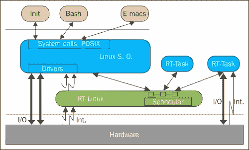
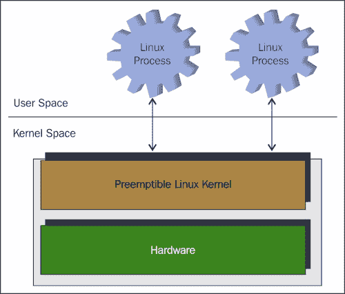

# 第 10 章：实时

在本章中，您将看到关于 Yocto 项目的实时组件的信息。 此外，在相同的上下文中，将解释关于操作系统和实时操作系统的一般用途的简短讨论。 然后，我们将介绍 PREMPT_RT 补丁，这些补丁试图将普通 Linux 更改为功能强大的实时操作系统；我们将尝试从更多角度来看待它，最后进行总结并得出结论。 这还不是全部，任何实时操作都需要其应用程序，因此还将简要介绍适用于实时操作系统环境的应用程序编写的注意事项。 记住所有这些，我相信现在是开始学习本章内容的时候了；我希望您喜欢它。

您将在本章中找到实时组件的更详细说明。 此外，还将向您展示 Linux 与实时性的关系。 众所周知，Linux 操作系统被设计成与现有的 UNIX 非常相似的通用操作系统。 很容易看出这样一个事实，即多用户系统(如 Linux)和实时系统在某种程度上是冲突的。 其主要原因是，出于一般目的，多个用户操作系统(如 Linux)被配置为获得最大平均吞吐量。 这牺牲了提供与实时操作系统完全相反的要求的延迟。

实时的定义相当容易理解。 它在计算领域的主要思想是，一台计算机或任何嵌入式设备都能够及时向其环境提供反馈。 这与快速有很大的不同；事实上，在一个系统的背景下，它已经足够快了，而对于汽车工业或核电站来说，足够快是不同的。 此外，这种系统将提供可靠的响应，以做出不影响任何外部系统的决策。 例如，在核电站，它应该检测和防止任何异常情况，以确保避免灾难。

# 了解 GPO 和 RTOS

当提到 Linux 时，通常**通用操作系统**(**GPO**)与之相关，但随着时间的推移，对于Linux 的**实时操作系统**(**RTOS**)具有相同优势的需求变得更加严格。 无论随机异步事件的数量和类型如何，任何实时系统都面临的挑战是满足给定的定时约束。 这并不是一项简单的任务，人们对实时系统的理论进行了大量的论文和研究。 实时系统面临的另一个挑战是对延迟设置上限，称为调度截止日期。 根据系统应对这一挑战的方式，它们可以分为硬、硬和软：

*   **硬实时系统**：此表示错过截止日期将导致整个系统故障的系统。
*   **稳固实时系统**：此表示可接受错过截止日期但系统质量可能降低的系统。 此外，错过最后期限后，提供的结果也不再有用。
*   **软实时系统**：这表示个系统，对于这些系统，错过个截止日期会降低接收结果的有用性，从而降低系统的质量。 在这类系统中，最后期限的满足被视为一个目标，而不是一个严格的要求。

Linux 不适合作为实时操作系统的原因有很多：

*   **分页**：通过虚拟内存的分页交换进程是没有限制的。 没有现成的方法可以知道在从磁盘获取页面之前将经过多长时间，这意味着页面中的错误导致的延迟没有上限。
*   **粗粒度同步**：这里，Linux 内核的定义是不可抢占的。 这意味着进程一旦进入内核上下文，就不能被抢占，直到它退出上下文。 在事件发生时，新事件需要等待调度，直到已经可用的事件退出内核上下文。
*   **批处理**：可以对操作进行批处理，以便更有效地使用资源。 最简单的例子就是页面释放过程。 Linux 可以传递多个页面并清除尽可能多的页面，而不是释放每个单独的页面。
*   **请求重新排序**：可以对进程的I/O 请求进行重新排序，使使用硬件的过程更加高效。
*   **调度公平性**：这是UNIX 的传统，指的是调度器试图公平对待所有正在运行的进程。 此属性提供了在调度较高优先级进程之前等待很长时间的较低优先级进程的可能性。

所有上述特征构成了为什么不能对任务或进程的延迟应用上限的原因，也是为什么 Linux 不能成为硬实时操作系统的原因。 让我们看一下下图，它说明了 Linux 操作系统提供实时特性的方法：


要改善标准 Linux 操作系统的延迟，任何人都可以做的第一件事就是尝试更改调度策略。 默认的 Linux 分时调度策略称为**SCHED_OTHER**，它们使用公平算法，为所有进程提供零优先级，即可用的最低优先级。 其他这样的调度策略是**SCHED_BATCH**用于进程的批调度，以及**SCHED_IDLE**，它适合于极低优先级作业的调度。 该调度策略的替代方案是**SCHED_FIFO**和**SCHED_RR**。 它们都是实时策略，都是时间关键型应用程序，需要精确控制流程及其延迟。

为了给 Linux 操作系统提供更多的实时特性，还可以提供另外两种方法。 第一个是指 Linux 内核更抢先的实现。 这种方法可以利用已有的用于 SMP 支持的自旋锁机制，确保防止多个进程同时执行，尽管在单个处理器的上下文中，自旋锁不是操作。 中断处理还需要修改此重新调度，以便在出现另一个优先级更高的进程时成为可能；在这种情况下，可能还需要新的调度程序。 这种方法的优点是不会改变用户空间的交互，而且还具有使用 API(如 POSIX 或其他 API)的优点。 这样做的缺点是内核更改非常严重，每次内核版本更改时，都需要相应地调整这些更改。 如果这项工作还不够，最终的结果不是完全实时的操作系统，而是一个可以减少操作系统延迟的操作系统。

另一个可用的实现是中断抽象。 这种方法基于这样一个事实，即并不是所有的系统都需要硬实时确定性，并且大多数系统只需要在实时上下文中执行其任务的一部分。 这种方法背后的思想是在实时内核下以空闲任务的优先级运行 Linux，并让非实时任务继续像往常一样执行它们。 此实现伪装成禁用实时内核的中断，但实际上，它被传递给实时内核。 对于此类实施，有三种可用的解决方案：

*   **RTLinux**：它代表中断抽象方法的原始实现，由新墨西哥州矿业与技术研究所开发。 尽管它仍然有一个开放源码的实现，但现在大多数开发都是通过 FSMLabs 工程师完成的，这是后来商业版本的 Wind River 系统所要求的。 RTLinux 的商业支持于 2011 年 8 月结束。
*   **RTAI**：它是对米兰理工大学航空航天工程系开发的 RTLinux 解决方案的增强。 该项目是一个非常活跃的开发人员数量很多，目前有可用的版本。
*   **Xenomai**：它代表第三个实现。 它的历史有点曲折：它出现在 2001 年 8 月，但在 2013 年与 RTAI 合并，生成了一个适合生产的实时操作系统。 然而，聚变在 2005 年被分散，它再次成为一个独立的项目。

下图显示了基本的 RTLinux 体系结构。



类似的架构(如上图所示)适用于另外两个解决方案，因为它们都诞生于 RTLinux 实现。 它们之间的区别是在实现层面上，并且每个都提供了不同的好处。

# PROMPT_RT

当需要实时解决方案时，PREMPT_RT 补丁是每个开发人员的首选。 对于一些开发人员来说，preempt_rt 补丁将 Linux 转换为适合他们需求的实时解决方案。 这种解决方案不能替代实时操作系统，但实际上适用于大量的系统。

与其他 Linux 实时解决方案相比，preempt_rt 最大的优势在于它实际上将 Linux 转变为实时操作系统。 所有其他替代方案通常创建一个作为系统管理程序执行的微内核，而 Linux 只作为其中的一个任务执行，因此实时任务与非实时任务的通信是通过该微内核完成的。 对于 preempt_rt 补丁，这个问题就不存在了。

Linux 内核的标准版本只能提供软实时要求，例如不保证截止日期的基本 POSIX 用户空间操作。 添加补丁，比如 Ingo Molnar 的 PREMPT_RT 补丁，以及 Thomas Gheixner 关于提供高分辨率支持的通用时钟事件层的补丁，您可以说您拥有了一个提供高实时能力的 Linux 内核。

随着实时抢占补丁在行业中的出现，出现了许多有趣的机会，使其成为工业控制或专业音频等领域坚定和硬实时应用的选择。 这主要是因为 preempt_rt 补丁的设计以及它的目标是集成到主线内核中。 我们将在本章进一步了解它的用法。 下图显示了可抢占 Linux 内核的工作原理：



Preempt_rt 补丁程序使用以下技巧将 Linux 从通用操作系统转换为可抢占操作系统：

*   用可抢占的`rwlock_t preemptible`和`spinlock_t`保护关键部分。 使用与`spinlock_t`相同的 API 的`raw_spinlock_t`仍然可以使用旧的解决方案。
*   使用`rtmutexes`抢占内核锁定机制。
*   针对`mutexes`、`spinlocks`和`rw_semaphores`实现了优先级反转和优先级继承机制。
*   将可用的 Linux 计时器 API 转换为具有高分辨率计时器的 API，从而提供超时的可能性。
*   实现中断处理程序的内核线程的使用。 对于每个用户空间进程，实时抢占补丁使用类似于`task_struct`的结构将软中断处理程序处理到内核线程上下文中。 还可以将 IRQ 注册到内核上下文中。

### 备注

有关优先级反转的更多信息，[http://www.embedded.com/electronics-blogs/beginner-s-corner/4023947/Introduction-to-Priority-Inversion](http://www.embedded.com/electronics-blogs/beginner-s-corner/4023947/Introduction-to-Priority-Inversion)是一个很好的起点。

## 应用 PREMPT_RT 补丁

在进入实际配置部分之前，您应该下载适合内核的版本。 最好的灵感来源是[https://www.kernel.org/](https://www.kernel.org/)，它应该是起点，因为它不包含任何额外的补丁。 收到源代码后，可以从[https://www.kernel.org/pub/linux/kernel/projects/rt/](https://www.kernel.org/pub/linux/kernel/projects/rt/)下载对应的`rt`补丁版本。 本演示选择的内核版本是 3.12 内核版本，但如果需要任何其他内核版本，则可以执行相同的步骤，最终结果相似。 实时抢占补丁的开发非常活跃，因此任何缺失的版本支持都会很快被覆盖。 此外，对于其他子级别版本，可以在该特定内核版本的`incr`或更老的子目录中找到补丁。 以下是子级别版本的示例：

```sh
wget https://www.kernel.org/pub/linux/kernel/v3.x/linux-3.12.38.tar.xz
wget https://www.kernel.org/pub/linux/kernel/projects/rt/3.12/patch-3.12.38-rt52.patch.gz
```

收到源代码后，需要解压源代码并应用补丁：

```sh
tar xf linux-3.12.38.tar.xz
cd linux-3.12.38/
gzip -cd ../patch-3.12.38-rt52.patch.gz | patch -p1

```

下一步涉及内核源代码的配置。 不同架构的配置有所不同，但总体思路保持不变。 POKY 内部支持的 QEMU ARM 机器需要以下配置。 要启用对计算机的 PREMPT_RT 支持，有多个选项可用。 您可以实现低延迟支持版本，该版本最适合使用如下内核配置片段的台式计算机：

```sh
CONFIG_GENERIC_LOCKBREAK=y
CONFIG_TREE_PREEMPT_RCU=y
CONFIG_PREEMPT_RCU=y
CONFIG_UNINLINE_SPIN_UNLOCK=y
CONFIG_PREEMPT=y
CONFIG_PREEMPT__LL=y
CONFIG_PREEMPT_COUNT=y
CONFIG_DEBUG_PREEMPT=y
CONFIG_RCU_CPU_STALL_VERBOSE=y
```

此选项是最常用的选项之一，也是 PREMPT_RT 补丁的主要使用来源。 另一种方法是使用类似如下的配置启用对 PROMPT_RT 补丁程序的完全抢占式支持：

```sh
CONFIG_PREEMPT_RT_FULL=y
CONFIG_HZ_1000=y
CONFIG_HZ=1000
```

如果您对手动配置内核感兴趣，它可以使用`menuconfig`选项。 以下`CONFIG_PREEMPT*`配置可用于更轻松地访问所需选项。 第一个镜像主要包含`CONFIG_PREEMPT`和`CONFIG_PREEMPT_COUNT`变量，它们应该是第一个启用的变量。 还有一个名为`CONFIG_PREEMPT_NONE`的配置选项，用于不执行强制抢占操作。


在下图中，`CONFIG_PREEMPT_RCU`和`CONFIG_PREEMPT_RT_FULL`配置为可用。 有关`RCU`的更多信息，请访问[https://lwn.net/Articles/262464/](https://lwn.net/Articles/262464/)获取。


第三个映像包含`CONFIG_PREEMPT__LL`配置。 另一个有趣的配置是`CONFIG_PREEMPT_VOLUNTARY`，它也减少了台式计算机的延迟以及`CONFIG_PREEMPT__LL`配置。

[https://sevencapitalsins.wordpress.com/2007/08/10/low-latency-kernel-wtf/](https://sevencapitalsins.wordpress.com/2007/08/10/low-latency-kernel-wtf/)提供了一个反对*低延迟桌面*选项的有趣论点。


最后一个包含用于更改`RCU`实现的`CONFIG_TREE_PREEMPT_RCU`配置。 可以使用相同的过程搜索和启用名称中不包含搜索词的其他配置。


有关 PREMPT_RT 补丁的详细信息，请参阅至[http://varun-anand.com/preempt.html](http://varun-anand.com/preempt.html)和[http://www.versalogic.com/mediacenter/whitepapers/wp_linux_rt.asp](http://www.versalogic.com/mediacenter/whitepapers/wp_linux_rt.asp)。

在使用新应用和配置的实时可抢占内核补丁获得内核镜像后，需要启动它以确保活动执行得当，以确保最终结果可用。 使用`uname –a`命令，`patch rt*`修订版号是可见的，应该应用于内核版本。 当然，还有其他方法可以用来识别此信息。 `uname –a`命令的另一种选择是在其输出上使用`dmesg`命令。字符串实时抢占支持应该是可见的，但只有一种方法应该足够。 下图显示了`uname –a`命令输出的外观：


查看进程列表，可以看到，如前所述，IRQ 处理程序是使用内核线程处理的。 由于该信息放在方括号中，因此在下一个`ps`命令输出中可以看到该信息。 单个 IRQ 处理程序由类似于用户空间处理程序的`task_struct`结构表示，使得它们很容易从用户空间控制：

```sh
ps ax 
PID TTY      STAT   TIME COMMAND 
1 ?        S      0:00 init [2] 
2 ?        S      0:00 [softirq-high/0] 
3 ?        S      0:00 [softirq-timer/0] 
4 ?        S      0:00 [softirq-net-tx/] 
5 ?        S      0:00 [softirq-net-rx/] 
6 ?        S      0:00 [softirq-block/0] 
7 ?        S      0:00 [softirq-tasklet] 
8 ?        S      0:00 [softirq-hrtreal] 
9 ?        S      0:00 [softirq-hrtmono] 
10 ?        S<     0:00 [desched/0] 
11 ?        S<     0:00 [events/0] 
12 ?        S<     0:00 [khelper] 
13 ?        S<     0:00 [kthread] 
15 ?        S<     0:00 [kblockd/0] 
58 ?        S      0:00 [pdflush] 
59 ?        S      0:00 [pdflush] 
61 ?        S<     0:00 [aio/0] 
60 ?        S      0:00 [kswapd0] 
647 ?        S<     0:00 [IRQ 7] 
648 ?        S<     0:00 [kseriod] 
651 ?        S<     0:00 [IRQ 12] 
654 ?        S<     0:00 [IRQ 6] 
675 ?        S<     0:09 [IRQ 14] 
687 ?        S<     0:00 [kpsmoused] 
689 ?        S      0:00 [kjournald] 
691 ?        S<     0:00 [IRQ 1] 
769 ?        S<s    0:00 udevd --daemon 
871 ?        S<     0:00 [khubd] 
882 ?        S<     0:00 [IRQ 10] 
2433 ?        S<     0:00 [IRQ 11] 
[...] 

```

下一步需要收集的信息涉及中断进程条目的格式化，这些条目与用于普通内核的条目略有不同。 通过检查`/proc/interrupts`文件可以看到此输出：

```sh
cat /proc/interrupts 
CPU0 
0:     497464  XT-PIC         [........N/  0]  pit 
2:          0  XT-PIC         [........N/  0]  cascade 
7:          0  XT-PIC         [........N/  0]  lpptest 
10:          0  XT-PIC         [........./  0]  uhci_hcd:usb1 
11:      12069  XT-PIC         [........./  0]  eth0 
14:       4754  XT-PIC         [........./  0]  ide0 
NMI:          0 
LOC:       1701 
ERR:          0 
MIS:          0 

```

然后，第四列中的可用信息提供 IRQ 线路通知，例如：`[........N/ 0]`。 这里，每个点代表一个属性，每个属性都是一个值，如以下几点所述。 下面是他们出现的顺序：

*   `I (IRQ_INPROGRESS)`：这是指处于活动状态的 IRQ 处理程序
*   `D (IRQ_DISABLED)`：表示 IRQ 被禁用
*   `P (IRQ_PENDING)`：此处的 IRQ 显示为挂起状态
*   `R (IRQ_REPLAY)`：在此状态下，已回复 IRQ，但尚未收到 ACK
*   `A (IRQ_AUTODETECT)`：这表示 IRQ 处于自动检测状态
*   `W (IRQ_WAITING)`：这是指 IRQ 处于自动检测状态，但尚未看到
*   `L (IRQ_LEVEL)`：IRQ 处于电平触发状态
*   `M (IRQ_MASKED)`：这表示 IRQ 在屏蔽后不可见的状态
*   `N (IRQ_NODELAY)`：这是 IRQ 必须立即执行的状态

在前面的示例中，您可以看到在内核上下文中运行的多个 IRQ 被标记为可见的硬 IRQ。 当 IRQ 状态被标记为`IRQ_NODELAY`时，它向用户显示 IRQ 的处理程序是内核线程，它将作为一个线程执行。 IRQ 的描述可以手动更改，但这不是这里将描述的活动。

### 备注

有关如何更改进程的实时属性的更多信息，一个很好的起点是`chrt`工具，可从[http://linux.die.net/man/1/chrt](http://linux.die.net/man/1/chrt)获得。

## Yocto 项目-RT 内核

在 Yocto 内部，应用了带有 PREMPT_RT 补丁的内核配方。 就而言，只有两种方法集成了 preempt_rt 补丁；这两种方法都在元层中可用。 涉及内核版本 3.10 和 3.14 及其命名的配方是`linux-yocto-rt_3.10.bb`和`linux-yocto-rt_3.14.bb`。 以命名结尾的`–rt`表示这些配方获取由 Yocto 社区维护的 Linux 内核版本的 preempt_rt 分支。

3.14 内核配方的格式如下所示：

```sh
cat ./meta/recipes-kernel/linux/linux-yocto-rt_3.14.bb
KBRANCH ?= "standard/preempt-rt/base"
KBRANCH_qemuppc ?= "standard/preempt-rt/qemuppc"

require recipes-kernel/linux/linux-yocto.inc

SRCREV_machine ?= "0a875ce52aa7a42ddabdb87038074381bb268e77"
SRCREV_machine_qemuppc ?= "b993661d41f08846daa28b14f89c8ae3e94225bd"
SRCREV_meta ?= "fb6271a942b57bdc40c6e49f0203be153699f81c"

SRC_URI = "git://git.yoctoproject.org/linux-yocto-3.14.git;bareclone=1;branch=${KBRANCH},meta;name=machine,meta"

LINUX_VERSION ?= "3.14.19"

PV = "${LINUX_VERSION}+git${SRCPV}"

KMETA = "meta"

LINUX_KERNEL_TYPE = "preempt-rt"

COMPATIBLE_MACHINE = "(qemux86|qemux86-64|qemuarm|qemuppc|qemumips)"

# Functionality flags
KERNEL_EXTRA_FEATURES ?= "features/netfilter/netfilter.scc features/taskstats/taskstats.scc"
KERNEL_FEATURES_append = " ${KERNEL_EXTRA_FEATURES}"
KERNEL_FEATURES_append_qemux86=" cfg/sound.scc cfg/paravirt_kvm.scc"
KERNEL_FEATURES_append_qemux86=" cfg/sound.scc cfg/paravirt_kvm.scc"
KERNEL_FEATURES_append_qemux86-64=" cfg/sound.scc"
```

如图所示，其中一个配方似乎有一个重复的行，需要一个补丁来删除它：

```sh
commit e799588ba389ad3f319afd1a61e14c43fb78a845
Author: Alexandru.Vaduva <Alexandru.Vaduva@enea.com>
Date:   Wed Mar 11 10:47:00 2015 +0100

    linux-yocto-rt: removed duplicated line

    Seemed that the recipe contained redundant information.

    Signed-off-by: Alexandru.Vaduva <Alexandru.Vaduva@enea.com>

diff --git a/meta/recipes-kernel/linux/linux-yocto-rt_3.14.bb b/meta/recipes-kernel/linux/linux-yocto-rt_3.14.bb
index 7dbf82c..bcfd754 100644
--- a/meta/recipes-kernel/linux/linux-yocto-rt_3.14.bb
+++ b/meta/recipes-kernel/linux/linux-yocto-rt_3.14.bb
@@ -23,5 +23,4 @@ COMPATIBLE_MACHINE = "(qemux86|qemux86-64|qemuarm|qemuppc|qemumips)"
 KERNEL_EXTRA_FEATURES ?= "features/netfilter/netfilter.scc features/taskstats/taskstats.scc"
 KERNEL_FEATURES_append = " ${KERNEL_EXTRA_FEATURES}"
 KERNEL_FEATURES_append_qemux86=" cfg/sound.scc cfg/paravirt_kvm.scc"
-KERNEL_FEATURES_append_qemux86=" cfg/sound.scc cfg/paravirt_kvm.scc"
 KERNEL_FEATURES_append_qemux86-64=" cfg/sound.scc"
```

前面的食谱与基本食谱非常相似。 这里，我指的是`linux-yocto_3.14.bb`；它们是已应用 PROMPT_RT 补丁的配方。 它们之间的不同之处在于，每个版本都取自其特定的分支，到目前为止，没有一个带有 PREMPT_RT 补丁的 Linux 内核版本支持`qemumips64`兼容的机器。

## PREMPT_RT 补丁的缺点

Linux 是一个针对吞吐量进行了优化的通用操作系统，它与实时操作系统的意义完全相反。 当然，它通过使用大型多层缓存提供了高吞吐量，这对于硬实时操作过程来说是一场噩梦。

为了拥有实时 Linux，有两个可用选项：

*   第一个涉及到 PREMPT_RT 补丁的使用，它通过最小化延迟并在线程上下文中执行所有活动来提供抢占。
*   第二种解决方案涉及使用实时扩展，这些扩展充当 Linux 和用于管理实时任务的硬件之间的层。 第二个解决方案包括前面提到的 RTLinux、RTAI 和 XENOMAI 解决方案，以及其他涉及移动层并将其分成多个组件的商业解决方案和变体。

第二个选项的变化意味着不同的解决方案，从隔离实时活动的核心到为此类任务分配一个核心。 还有许多解决方案涉及使用 Linux 内核下面的管理程序或挂钩来为 RTOS 提供大量中断。 这些替代方案的存在不仅通过其他选项提供给读者，而且还因为 PREMPT_RT 补丁有其缺点。

一个明显的缺点是，延迟的减少是通过在出现优先级更高的任务时强制内核抢占任务来实现的。 当然，这会降低系统的吞吐量，因为它不仅会在进程中添加大量上下文切换，而且会使较低优先级的任务比正常的 Linux 内核等待的时间更长。

`preempt-rt`补丁的另一个缺点是，它们需要从一个内核版本移植到另一个内核版本，并从一个架构或软件供应商移植到另一个架构或软件供应商。 这只意味着 Linux 内核的知识应该由特定的供应商在内部获得，并且应该针对其每个可用的内核调整解决方案。 这一事实本身就让 BSP 或 Linux 操作系统提供商不那么喜欢它了。

### 备注

下面的链接提供了一个关于 Linux 抢占的有趣演示文稿。 有关 linux 实时解决方案的更多信息，可以参考它，并可在[http://www.slideshare.net/jserv/realtime-linux](http://www.slideshare.net/jserv/realtime-linux)上获得。

# Linux 实时应用

拥有实时操作系统可能并不总是对每个人都足够。 有些人还需要在操作系统上运行实时优化的应用程序。 为了确保 RT 应用程序能够被设计并与之交互，操作系统和硬件上需要所需的确定性。 关于硬件配置，要求涉及低延迟中断处理。 导致 ISR 延迟的机制应记录数十微秒左右的值。

对于实时应用所需的内核配置，需要配置如下：

*   **按需 CPU 伸缩**：使用此配置有助于在 CPU 处于低功耗模式时创建长延迟事件。
*   **NOHZ**：此配置禁用 CPU 接收的定时器中断。 启用此选项后，CPU 唤醒所花费的延迟将缩短。

要编写应用程序，需要注意一些事情，例如确保禁用交换以减少页面错误导致的延迟。 应尽量减少全局变量或数组的使用。 99 优先级数字没有配置为运行应用程序，也没有实现其他自旋锁，它使用优先级继承 Futex。 还要避免应用程序之间的输入/输出操作和数据共享。

对于设备驱动程序，建议略有不同。 前面我们提到过，实时内核的中断处理是在线程上下文中完成的，但是硬件中断上下文在这里仍然可以发挥作用。 要识别来自中断处理程序的硬件中断上下文，可以使用`IRQF_NODELAY`标志。 如果使用`IRQF_NODELAY`上下文，请确保避免使用`wake_up()`、`up()`或`complete()`等函数。

# 标杆

Linux 操作系统在很长一段时间内被视为 GPO，但最近几年，一些项目试图通过将 Linux 内核修改为 RTOS 来改变这一点。 其中一个这样的项目就是前面提到的 preempt_rt 补丁。

在本章的这一节中，我将讨论在应用或不应用 PREMPT_RT 补丁的情况下，可以在两个版本的 Linux 操作系统上执行的一系列测试。 我要指出的是，对于那些对一些实际结果感兴趣的人，有很多文章试图调查 PREMPT_RT 的延迟影响或其优缺点。 在[http://www.versalogic.com/downloads/whitepapers/real-time_linux_benchmark.pdf](http://www.versalogic.com/downloads/whitepapers/real-time_linux_benchmark.pdf)提供了一个这样的例子。

在继续下一步之前，我认为我有责任定义一些正确理解某些信息所必需的技术术语：

*   **中断延迟**：此表示从生成中断到在中断处理程序中开始执行所经过的时间。
*   **调度延迟**：此表示事件的唤醒信号与有机会为其调度线程的调度器之间的时间。 它也称为**调度延迟**。
*   **最坏情况延迟**：此表示从发出需求到收到对该需求的响应所经过的时间。
*   **上下文切换**：此表示 CPU 从一个进程或线程切换到另一个进程或线程。 它只出现在内核模式下。

**LPPTest**包含在 PREMPT_RT 补丁中，它包含一个 Linux 驱动程序，该驱动程序只更改并行端口上的位值来标识响应时间。 另一个驱动程序响应位值的改变和测量结果的用户空间应用程序。 要查找的文件是`drivers/char/lpptest.c`和`scripts/testlpp.c`。 要执行此测试，需要两台机器：一台用于发送信号，另一台用于接收和发送响应。 这一要求很严格，因为使用环回电缆可能会影响测量。

**RealFeel**是对中断处理的测试。 该程序使用`/dev/rtc`触发周期性中断，测量一个中断与另一个中断之间的持续时间，并将其与期望值进行比较。 最后，它会无限期地打印期望值的变化，以便可以将变化导出到日志文件中，以便稍后进行处理。

**Linux 实时基准框架**(**LRTB**)代表一组脚本和驱动程序，这些脚本和驱动程序用于评估具有实时添加功能的 Linux 内核的各种性能计数器。 它测量实时补丁施加的负载，以及它们获得对中断的更确定响应的能力。

对于基准测试阶段，可以使用`hackbench`、`lmbench`甚至`Ingo Molnar dohell`脚本之类的程序。 当然，还有许多其他工具既可以用于测试(`cyclictest`、`hourglass`等)，也可以用于基准测试(`unixbench`、`cache-calibrator`或任何其他将实时性能发挥到极限的压力测试)，但我会让用户测试它们并应用最适合他们需要的工具。

Preempt_rt 补丁提高了 Linux 内核的抢占性，但这并不意味着它是最好的解决方案。 如果应用程序域的各个方面发生变化，PREMPT_RT 修补程序的用处可能会有所不同。 关于 preempt_rt 补丁，它已经准备好用于硬实时系统。 不能得出一个结论，但我必须承认，如果它被用于维持生命或关键任务的系统，它可以被认为是硬实时材料。 这是每个人都要做的决定，这项测试是必需的。 支持这一观点的一个观点来自 Steven Rostedt，他是 Linux 内核开发人员，也是 Red Hat 实时 Linux 内核补丁稳定版本的维护者。 它在[http://www.linux.com/news/featured-blogs/200-libby-clark/710319-intro-to-real-time-linux-for-embedded-developers](http://www.linux.com/news/featured-blogs/200-libby-clark/710319-intro-to-real-time-linux-for-embedded-developers)上提供。

### 备注

关于这个问题的一些有趣的信息可以在[http://elinux.org/Realtime_Testing_Best_Practices](http://elinux.org/Realtime_Testing_Best_Practices)上访问。

# 元实时

`meta-realtime`层是由 WinDriver 的 Bruce Ashfield 维护的一项计划，它计划创建一个与 Linux 内核或系统开发相关的实时活动的场所。 它被创建为占位符，用于通用操作系统和实时操作系统的 PREMPT_RT、SCHED_Deadline、POSIX 实时和替代配对，无论这涉及用户空间 RTOS、虚拟机管理程序还是 AMP 解决方案。 此外，这也是系统分区、CPU 隔离和其他相关应用程序所在的位置。 当然，如果没有适用于整个 Linux 操作系统的性能分析和基准测试应用程序，所有这些都不会被认为是完整的。

虽然这一层描述一开始听起来真的很刺激，但它的内容真的很糟糕。 它只能集成许多测试工具，更准确地说，是其中两个：`schedtool-dl`和`rt-app`，以及尝试在目标计算机上远程运行`rt-app`并收集结果数据的额外脚本。

第一个`schedtool-dl`应用程序是用于截止日期调度的调度器测试工具。 这似乎是因为需要更改或查询 Linux 下可用的 CPU 调度策略甚至进程级别。 它还可用于锁定 SMP/NUMA 系统的各种 CPU 上的进程，以避免在音频/视频应用程序中跳过，并且一般情况下，即使在高负载下也能保持高水平的交互和响应能力。

### 备注

有关`schedtool-dl`应用程序的更多信息，请参阅[https://github.com/jlelli/schedtool-dl](https://github.com/jlelli/schedtool-dl)。

下一个也是最后一个可用的应用程序是`rt-app`，它用作模拟系统实时负载的测试应用程序。 它通过在给定的时间段启动多个线程来实现这一点。 它支持 SCHED_FIFO、SCHED_OTHER、SCHED_RR、SCHED_Deadline 以及**自适应服务质量体系结构**(**AQuoSA**)框架，该框架是一个开源项目，试图为 Linux 内核提供自适应的**服务质量**(**QoS**)。

### 备注

有关`rt-app`应用程序和 AQuoSa 框架的更多信息，请参阅[https://github.com/scheduler-tools/rt-app](https://github.com/scheduler-tools/rt-app)和[http://aquosa.sourceforge.net/](http://aquosa.sourceforge.net/)。

除了包含的包之外，该层还包含一个包含这些包的图像，但这远远不足以使该层包含大量内容。 虽然它包含的信息不是很多，但这一层之所以在本章中介绍，是因为它包含了起点，并提供了到目前为止所呈现的所有信息的发展观点。 当然，许多应该驻留在该层中的应用程序已经跨多个其他层分布，例如`meta-linaro`中提供的`idlestat`包。 然而，这并不构成这一解释的中心点。 我只是想指出可以包含任何实时相关活动的最合适的地方，在我看来，`meta-realtime`就是这个地方。

# 摘要

在本章中，我们向您简要介绍了 PREMPT_RT 和其他针对 Linux 内核实时问题的替代解决方案。 我们还探索了一些可用于相关实时活动的工具和应用程序。 然而，如果不提及 Yocto 项目，本演示将不完整，不仅涉及 preempt_rt Linux 内核的配方，还涉及`meta-realtime`层应用程序。 开发适用于新上下文的应用程序也是一个问题，因此这个问题在*Linux 实时应用程序*一节中得到了解决。 最后，我希望我能够通过整章提供的链接来呈现这个主题的完整图景，以激发读者的好奇心。

在下一章中，我们将简要介绍`meta-security`和`meta-selinux`层，并全面介绍 Linux 生态系统的总体安全需求，特别是 Yocto 项目的安全需求。 我们还将介绍一些试图保护 Linux 系统的工具和应用程序的相关信息，但这还不是全部。 看下一章，我相信你会喜欢的。