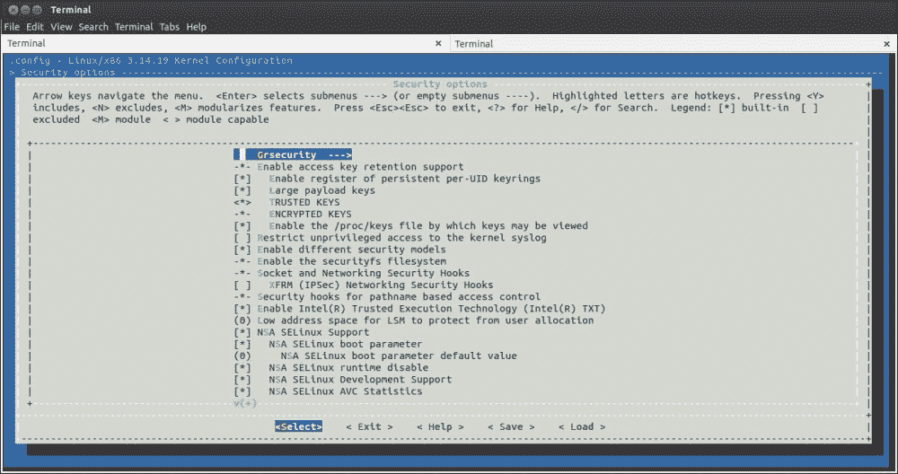
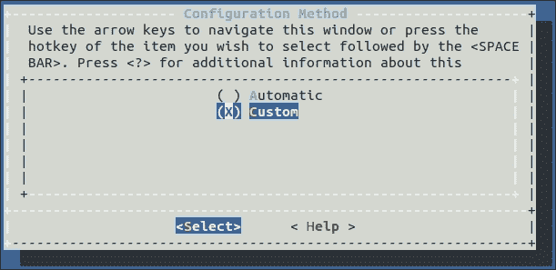
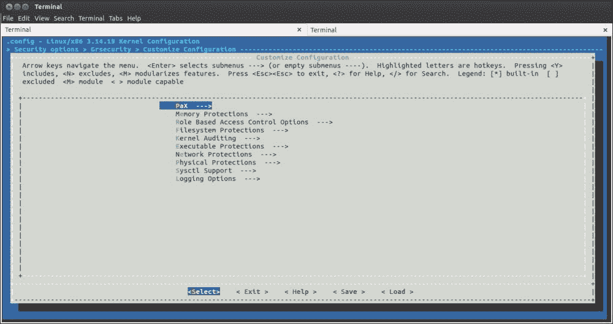

# 第 11 章安全

在本章中，将向您介绍各种安全增强工具。 我们的第一站是 Linux 内核，这里有两个工具，SELinux 和 Grsecurity，这两个工具既有趣又必要。 接下来，还将解释 Yocto 项目的特定于安全的层。 其中包括 meta-security 和 meta-selinux，它们包含大量工具，可用于保护或审计 Linux 系统的各种组件。 由于这个主题很广泛，我还将让您研究各种其他解决方案，这些解决方案既在 Linux 内核中实现，也在外部实现。 我希望您喜欢这一章，并希望您觉得本信息有趣和有用。

在任何操作系统中，安全性都是用户和开发人员非常关心的问题。 没过多久，开发人员就开始用各种方法解决这些安全问题。 这为可用的操作系统带来了许多安全方法和改进。 在本章中，我们将介绍一些安全增强工具以及一些策略和验证例程，这些策略和验证例程用于确保各种组件(如 Linux 内核或 Yocto 项目)足够安全，可以使用。 我们还将了解在本章中出现的各种威胁或问题是如何处理的。

SELinux 和 Grsecurity是试图强制 Linux 的 Linux 内核中的两个值得注意的安全改进。 SELinux是一种**强制访问控制**(**MAC**)机制，它提供基于身份和角色的访问控制以及域类型实施。 第二个选项 Grsecurity 更类似于 ACL，实际上更适合支持远程连接的 Web 服务器和其他系统。 关于如何为 Linux 实现安全性以及 Yocto 项目如何处理该域，这些方面将在下一节中介绍。 我必须承认的一件事是，在撰写本章时，Yocto 项目中的安全处理仍然是一个年轻的项目，但我正在热情地等待，看看迭代的数量将如何随着时间的推移而增加。

# Linux 的安全性

每个Linux 系统的核心是 Linux 内核。 任何能够破坏或控制系统的恶意代码也会影响 Linux 内核。 因此，它只会让用户明白，拥有一个安全的内核也是等式的重要组成部分。 幸运的是，Linux 内核是安全的，并且有许多安全特性和程序。 这一切背后的幕后黑手是詹姆斯·莫里斯(James Morris)，他是 Linux 内核安全子系统的维护者。 甚至还有一个单独的linux 存储库，可以在[http://git.kernel.org/?p=linux/kernel/git/jmorris/linux-security.git；a=summary](http://git.kernel.org/?p=linux/kernel/git/jmorris/linux-security.git;a=summary)上访问。 此外，通过查看[http://kernsec.org/wiki/index.php/Main_Page](http://kernsec.org/wiki/index.php/Main_Page)(它是Linux 内核安全子系统的主页)，您可以看到在该子系统中管理的确切项目，如果您感兴趣，还可以帮助它们。

还有一个工作组为 Linux 内核提供安全增强和验证，以确保它是安全的，并对 Linux 生态系统的安全性保持一定程度的信任。 他们的活动包括，但当然不限于，验证和测试关键子系统的各种漏洞，或开发工具来协助安全的 Linux 内核。 工作组还包括指导和维护添加到各种项目或构建工具的安全子系统或安全改进。

所有其他 Linux 软件组件都有自己的安全团队。 当然，有些人没有很好地定义这些团队，或者有一些与此主题相关的内部规则，但他们仍然意识到发生在其组件周围的安全威胁，并尝试修复这些漏洞。 Yocto 项目试图帮助解决这些问题，并在某种程度上统一了这些软件组件。 我希望多年来在这方面有所改善。

# SELinux

SELinux 是 Linux 内核的安全增强，由美国国家安全局信息保障办公室开发。 它具有基于策略的体系结构，是构建在**Linux 安全模块**(**LSM**)接口上的 Linux 安全模块之一，旨在实现军事级别的安全。

目前，它附带了大量发行版，包括最知名和最常用的发行版，如 Debian、SuSE、Fedora、Red Hat 和 Gentoo。 它基于 MAC，管理员可以在 MAC 上控制与系统用户空间组件的所有交互。 它使用最少特权的概念：在这里，默认情况下，用户和应用程序没有访问系统资源的权限，因为所有这些资源都是由管理员实体授予的。 这是系统安全策略的组成部分，其重点如下图所示：


在 MAC 实现的帮助下，SELinux 内部的基本功能被沙箱保护起来。 在沙箱中，每个应用程序只能执行安全策略中定义的设计执行的任务。 当然，系统仍然可以使用标准的 Linux 权限，当需要尝试访问时，会在制定策略之前咨询这些权限。 如果没有可用权限，SELinux 将无法以任何方式影响系统。 但是，如果权限允许访问，则应咨询 SELinux 策略，以对访问是允许还是拒绝做出最终裁决。

在 SELinux 上下文中，访问决策是基于主体的安全上下文做出的。 这很可能是与与实际尝试的动作(例如文件读取动作)相比较的特定用户上下文以及可用对象(可以是文件)的安全上下文相关联的过程。

在继续之前，我们将看看如何在 Ubuntu 机器上启用 SELinux 支持。 我将首先介绍一些与 SELinux 相关的基本概念：

*   **用户**：在SELinux 上下文中，用户与 UNIX 上下文中的用户不同。 它们之间的主要区别在于，在 SELinux 上下文中，用户在用户会话期间不会更改，并且有可能有更多的 UNIX 用户在相同的 SELinux 用户上下文中操作。 但是，也可以在 1：1 用户映射中操作，例如 Linux root 用户和 SELinux root 用户。 通常，SELinux 用户的命名会添加`_u`后缀。
*   **角色**：SELinux 用户可以有一个或多个角色。 角色的含义在策略中定义。 对象通常具有`object_r`角色，并且该角色通常带有`_r`字符串后缀。
*   **类型**：它是应用于进行授权决策的主要方法。 它也可以称为域，通常以`_t`作为后缀。
*   **上下文**：每个进程和对象都有其上下文。 事实上，它是决定是否允许对象和进程之间访问的属性。 SELinux 上下文表示为三个必填字段和一个可选字段，例如`user:role:type:range`。 前三个字段表示 SELinux 用户、角色和类型。 最后一条代表了 MLS 的范围，稍后会给出。 有关 MLS的更多信息，请访问[http://web.mit.edu/rhel-doc/5/RHEL-5-manual/Deployment_Guide-en-US/sec-mls-ov.html](http://web.mit.edu/rhel-doc/5/RHEL-5-manual/Deployment_Guide-en-US/sec-mls-ov.html)。
*   **对象类**：SELinux 对象类表示可用对象的类别。 类别(如目录的`dir`和文件的`file`)也有一组与其相关联的权限。
*   **规则**：这些是SELinux 的安全机制。 它们用作一种强制类型，并使用对象和进程的类型进行指定。 规则通常声明是否允许某个类型执行各种操作。

正如前面提到的，SELinux 是如此广为人知和赞赏，以至于它包含在大多数可用的 Linux 发行版中。 它的成功还体现在这样一个事实上，即大量的书籍都是关于这个主题的。 有关它的更多信息，请参考[http://www.amazon.com/s/ref=nb_ss_gw/102-2417346-0244921?url=search-alias%3Daps&FIELD-KEYES=SELINUX&go.x=12&Go.y=8&go=go](http://www.amazon.com/s/ref=nb_ss_gw/102-2417346-0244921?url=search-alias%3Daps&field-keywords=SELinux&Go.x=12&Go.y=8&Go=Go)。 话虽如此，让我们来看看在 Ubuntu 主机上安装 SELinux 所需的步骤。 第一步是 SELinux 包安装：

```sh
sudo apt-get install selinux

```

安装软件包后，需要将 SELinux 模式从禁用(不强制执行或记录 SELinux 策略的模式)更改为其他两个可用选项之一：

*   `Enforcing`：这在生产系统中最有用：

    ```sh
    sudo sed -i 's/SELINUX=.*/SELINUX=enforcing/' /etc/selinux/config 

    ```

*   `Permissive`：在此模式下，不强制执行策略。 但是，任何拒绝都会被记录下来，并且主要用于调试活动和开发新策略时：

    ```sh
    sudo sed -i 's/SELINUX=.*/SELINUX=permissive/' /etc/selinux/config

    ```

实施配置后，系统需要重新启动，以确保相应地标记系统文件。

关于SELinux 的更多信息也可以在 Yocto 项目中获得。 有一整层专门用于 SELinux 支持。 此外，有关此工具的更多信息，建议您阅读专门介绍此问题的书籍之一。 如果您不喜欢这种方法，那么还有其他手册提供与SELinux 相关的信息，这些手册可以在各种发行版中找到，比如 Fedora([https://docs.fedoraproject.org/en-US/Fedora/19/html/Security_Guide/ch09.html](https://docs.fedoraproject.org/en-US/Fedora/19/html/Security_Guide/ch09.html))、RedHat([https://access.redhat.com/documentation/en-US/Red_Hat_Enterprise_Linux/4/html/SELinux_Guide/index.html](https://access.redhat.com/documentation/en-US/Red_Hat_Enterprise_Linux/4/html/SELinux_Guide/index.html))等等。

# 授权安全

Grsecurity是根据 GNU 通用公共许可证发布的一套补丁，可用于 Linux 内核，有助于增强 Linux 的安全性。 这套补丁程序提供四个主要好处：

*   免配置操作
*   针对各种地址空间更改错误提供保护
*   它包括一个访问控制列表系统和一些审计系统，这些系统非常全面，可以满足各种需求
*   它能够与多个操作系统和处理器体系结构交互

Grsecurity 软件是免费的，它的开发始于 2001 年，最初是从 Openwall Project 移植了一些安全增强补丁。 它最初是针对 2.4.1 Linux 内核版本发布的，从那时起，开发就一直在继续。 随着时间的推移，它包含了一个 Pax 补丁包，可以提供保护内存页的可能性。 这是通过使用最小特权方法来完成的，这意味着对于程序的执行，应该在额外或更少的步骤的帮助下采取不超过必要的操作。

### 备注

如果您有兴趣查找有关PAX 的更多信息，可以访问[http://en.wikipedia.org/wiki/PaX](http://en.wikipedia.org/wiki/PaX)和[https://pax.grsecurity.net/](https://pax.grsecurity.net/)。

Grsecurity 有个主要适用于 Web 服务器或接受来自不可信用户的外壳访问的服务器的功能。 其中一个主要特性是**基于角色的访问控制**(**RBAC**)，它可以替代已有的 UNIX**自主访问控制**(**DAC**)，甚至可以替代由 SMACK 或 SELinux 提供的强制访问控制(MAC)。 RBAC 的目标是提供一个最低权限系统，在该系统中，进程和用户只拥有归档其任务所需的最低权限。 Grsecurity 拥有的另一个特性与加强`chroot()`系统调用有关，以确保消除权限提升。 除此之外，还有许多其他功能，如审核和`/proc`限制。

我擅自将 Grsecurity 的功能分组定义，就像 Grsecurity 网站上显示的那样。 之所以在本章中介绍它们，是因为我认为当用户和开发人员的活动需要安全解决方案时，了解它的功能将有助于他们做出正确的决策。 下面是包含所有 GrSecurity 功能的列表：

*   内存损坏防御：
    *   对暴力攻击的自动响应
    *   针对喷雾攻击的强化 BPF JIT
    *   强化的用户端内存权限
    *   线程堆栈之间的随机填充
    *   阻止内核直接访问用户区域
    *   行业领先的 ASLR
    *   绑定检查发往/来自用户区域的内核副本
*   文件系统强化：
    *   叶绿素硬化
    *   消除针对管理员终端的旁路攻击
    *   防止用户欺骗 Apache 访问其他用户文件
    *   向非特权用户隐藏其他用户的进程
    *   提供可信路径执行
*   其他保护措施：
    *   基于 ptrace 的防止进程监听
    *   防止转储不可读的二进制文件
    *   防止攻击者自动加载易受攻击的内核模块
    *   拒绝访问权限过大的 IPC 对象
    *   强制执行一致的多线程权限
*   RBAC：
    *   直观的设计
    *   自动全系统策略学习
    *   自动策略分析
    *   人类可读的策略和日志
    *   可使用 LSM 堆叠
    *   非常规特征
*   GCC 插件：
    *   防止大小参数中的整数溢出
    *   防止从以前的系统调用泄露堆栈数据
    *   在早期引导和运行时增加熵
    *   随机化内核结构布局
    *   创建只读敏感内核结构
    *   确保所有内核函数指针都指向内核

记住 Grsecurity 的特性，我们现在可以进入 Grsecurity 及其管理员名为`gradm`的安装阶段。

需要做的第一件事是获得相应的包和补丁。 如以下命令行所示，启用 Grsecurity 的内核版本为`3.14.19`：

```sh
wget https://www.kernel.org/pub/linux/kernel/v3.x/linux-3.14.19.tar.gz
wget https://www.kernel.org/pub/linux/kernel/v3.x/linux-3.14.19.tar.sign
wget http://grsecurity.net/stable/gradm-3.1-201502222102.tar.gz
wget http://grsecurity.net/stable/gradm-3.1-201502222102.tar.gz.sig
wget http://grsecurity.net/stable/grsecurity-3.1-3.14.36-201503182218.patch
wget http://grsecurity.net/stable/grsecurity-3.1-3.14.36-201503182218.patch.sig

```

包可用后，需要检查其签名。 Linux 内核的签名检查过程很大，与其他系统不同，如下所示：

```sh
wget http://grsecurity.net/spender-gpg-key.asc
sudo gpg --import spender-gpg-key.asc
sudo gpg --verify gradm-3.1-201502222102.tar.gz.sig
sudo gpg --verify grsecurity-3.1-3.14.35-201503092203.patch.sig
gzip -d linux-3.14.19.tar.gz
sudo gpg --verify linux-3.14.19.tar.sign

```

第一次调用此命令时，不会验证签名，但会使 ID 字段可供以后使用。 它用于标识来自 PGP 密钥服务器的公钥：

```sh
gpg: Signature made Mi 17 sep 2014 20:20:53 +0300 EEST using RSA key ID 6092693E
sudo gpg --keyserver hkp://keys.gnupg.net --recv-keys 6092693E
sudo gpg --verify linux-3.14.19.tar.sign

```

在所有包都可用并正确验证之后，我们现在可以进入内核配置阶段。 第一步是打补丁，这是使用 Grsecurity 补丁完成的，但这需要首先访问 Linux 内核源代码：

```sh
tar xf linux-3.14.19.tar 
cd linux-3.14.19/
patch -p1 < ../grsecurity-3.1-3.14.35-201503092203.patch

```

在打补丁的过程中，源代码中缺少`include/linux/compiler-gcc5.h`，因此需要跳过补丁的这一部分。 但是，在此之后，修补过程就完成了，没有出现任何问题。 完成此步骤后，配置阶段可以继续。 有一些通用配置不需要任何额外修改就可以工作，但对于每个发行版，总会有一些特定的配置可用。 要检查它们并确保每一个都与您的硬件匹配，可以使用以下命令：

```sh
make menuconfig

```

如果您是第一次调用该命令，则前面的命令会显示一条警告消息，提示您以下内容：

```sh
HOSTCC  scripts/basic/fixdep
HOSTCC  scripts/kconfig/conf.o
 *** Unable to find the ncurses libraries or the
 *** required header files.
 *** 'make menuconfig' requires the ncurses libraries.
 *** 
 *** Install ncurses (ncurses-devel) and try again.
 *** 
make[1]: *** [scripts/kconfig/dochecklxdialog] Error 1
make: *** [menuconfig] Error 2

```

安装`libncurses5-dev`包即可解决，命令如下：

```sh
sudo apt-get install libncurses5-dev

```

解决了这些问题后，配置过程可以继续。 安全选项子部分提供了`grsecurity`选项，如以下屏幕截图所示：



在`grsecurity`选项内，还有另外两个子菜单选项。 有关这方面的更多详细信息，可以在下面的屏幕截图中看到：


第一个选项是指配置方法，可以是**自定义**或**自动**：



第二个选项指的是实际可用的配置选项：



### 备注

有关GRAS 安全性和 PAX 配置选项的更多信息，请参见[http://en.wikibooks.org/wiki/Grsecurity/Appendix/Grsecurity_and_PaX_Configuration_Options](http://en.wikibooks.org/wiki/Grsecurity/Appendix/Grsecurity_and_PaX_Configuration_Options)。

我想提供的一条建议是，首先启用**自动**配置方法，然后继续进行自定义配置，以便在必要时微调 GrSecurity 和 Pax 设置。 另一个技巧是启用**Grsecurity**|**Customize Configuration**|**Sysctl support**选项，因为它提供了无需重新编译内核即可更改 Grsecurity 选项的可能性。 当然，如果选择了**自动**配置方法，则默认情况下该选项是启用的。 审核选项会生成大量日志，因此要防止日志泛滥，请确保还启用了**Grsecurity**|**自定义配置**|**日志记录选项**。

Grsecurity 系列的下一个工具是`gradm`管理员，它是一个强大的 ACL 解析器，也可以对它们进行优化。 为确保可以安装此实用程序，安装过程要求`gradm`的主机操作系统提供 Grsecurity 支持，否则编译过程将失败。 在安装`gradm`之前，还需要许多其他软件包：`lex`、`flex`、`byacc`、`bison`，如果需要，甚至还需要安装`pam`。

一旦满足所有依赖项，安装过程就可以开始了。 我想给您的最后一点信息是，如果您使用的发行版附带了支持 Grsecurity 补丁的内核，那么您可能首先要检查一下，因为补丁也可以预装`gradm`实用程序。

### 备注

有关GrSecurity 管理的更多信息，请访问以下链接：

[http：//en.wikibooks.org/wiki/Grsecurity/The_Administration_Utility](http://en.wikibooks.org/wiki/Grsecurity/The_Administration_Utility)

[http：//en.wikibooks.org/wiki/Grsecurity/Additional_Utilities](http://en.wikibooks.org/wiki/Grsecurity/Additional_Utilities)

[http：//en.wikibooks.org/wiki/Grsecurity/Runtime_Configuration](http://en.wikibooks.org/wiki/Grsecurity/Runtime_Configuration)

在 Yocto 层内部，支持`meta-oe`层内的`gradm`配方。 它在主分支上的`recipes-support/gradm/gradm_3.0.bb`可用。 此外，在`meta-accel`层的主分支上提供了 Grsecurity 内核配置；配置片段的确切位置是`recipes-kernel/linux/linux-yocto-iio/grsec.cfg`。 对于任何有兴趣了解 Yocto 提供的混凝土 Grsecurity 支持的人来说，我相信这条路对您来说是畅通无阻的，您可以开始着手做这样的事情了。 不过，有一条建议，你应该先问问 Yocto Project 社区，是否有人已经开始这么做了。

# Yocto 项目的安全保障

在 Yocto 项目中，安全问题还很年轻。 由于这个项目是在不到五年前宣布的，关于安全的讨论在去年左右就开始了，这是很正常的。 当然，安全团队有一个专门的邮件列表，其中包括来自不同公司的大量个人，但他们的工作程序还没有完全完成，因为目前工作正在进行中。

安全团队成员主要实现的活动包括了解最新和最危险的安全威胁，并确保他们找到修复程序，即使这包括自我修复和应用 Yocto 可用层中的更改。

目前，最耗时的安全活动围绕着狭小的参考系统，但也有许多公司采取行动，试图将一系列补丁推向各种 BSP 维护器层或其他第三方层。 对于那些感兴趣的人，与安全相关的讨论的邮件列表是`<[yocto-security@yoctoproject.org](mailto:yocto-security@yoctoproject.org)>`。 此外，在小组成立之前，可以在[http://webchat.freenode.net/?channels=#yocto](http://webchat.freenode.net/?channels=#yocto)提供的`#yocto`IRC中找到它们，甚至可以在每两周召开一次的 Yocto 技术团队会议上找到它们。

### 备注

有关安全团队的更多信息可以在他们的 Wiki 页面上找到。 我鼓励每个对这个主题感兴趣的人在[https://wiki.yoctoproject.org/wiki/Security](https://wiki.yoctoproject.org/wiki/Security)上至少访问一次。

# 元安全和元 selinux

在此部分中，介绍了与 Linux 安全工具相关的层计划。 在本章中，为 Linux 内核及其库提供了两个同时提供安全和强化工具的层。 它们的目的是简化模式嵌入式设备，确保它们的安全，并可能提供类似于台式机的安全级别。

由于嵌入式设备已经变得越来越强大，与安全相关的担忧也就自然而然了。 Yocto 项目的启动层，在这里，我指的是元安全和元 selinux，在简化过程方面又迈出了一步，以确保安全、强化和受保护的 Linux 系统。 它们与检测和修复漏洞系统一起在安全团队内部实施，有助于实现在嵌入式设备上拥有与台式机相同级别的安全性这一理想，并将这一想法推向更深一步。 说到这里，让我们继续进行层的实际解释。

## 元安全性

在元安全层中，有一些工具用于保护、加强和保护嵌入式设备，这些设备可能提供对各种实体的外部访问。 如果设备连接到互联网，或者容易受到任何形式的攻击或劫持，那么元安全层可能是您的第一站。 通过这一层和 meta-selinux 层，Yocto 项目试图提供适用于大多数社区或嵌入式用户设备的安全级别。 当然，增强对各种工具的支持或添加新工具并不是被禁止的，所以如果您觉得需要或迫切需要这样做，请毫不犹豫地添加您对增强工具的贡献。 欢迎任何新的提交者或提交者--我们的社区非常友好。

正如您已经习惯的，提供的工具是适用于嵌入式设备的开源软件包。 在元安全层中有许多可用组件，每个组件都试图不仅提供系统强化，而且还提供针对各种安全级别的安全检查、安全、端口扫描和其他有用的功能。 其中包括以下软件包：

*   巴士底狱 （一座 14 世纪建于法国巴黎的堡垒，17—18 世纪用作国家监狱）
*   RedHat-安全
*   Pax-Utils
*   降压-安全
*   Libseccomp
*   检查安全
*   尼克托
*   Nmap
*   ♪ClamAV♪
*   ISIC
*   冬节 / 夏末节
*   ♪猫鼬♪
*   绊网 / 引爆线 / 警报拉发线 / 前哨试探性部队

除了这些包，还有许多库和**Tomoyo**，这是一个用于 MAC 实现的内核安全模块，作为系统分析工具也非常有用。 它于 2003 年 3 月首次发布，由日本 NTT 数据公司赞助，一直持续到 2012 年 3 月。

Tomoyo 的主要关注点是系统行为。 为此，系统创建过程中涉及的每个进程都声明其行为和实现目标所需的资源。 它由两个组件组成：一个是内核组件 linux-ccs，另一个是用户空间组件 ccs-tools；这两个组件都是正常运行所必需的。 Tomoyo 试图提供既实用又易于使用的 MAC 实现。 最后，它喜欢让系统对大多数用户可用，对普通用户和系统管理员来说是完美的。 它不同于 SELinux，因为它具有由**学习模式**提供的自动策略配置机制；而且它的策略语言非常容易掌握。

在启用保护之后，Tomoyo Linux 充当监视器，限制进程使用超出它们最初声明的内容。 它的主要特点包括以下几个方面：

*   系统分析
*   在政策制定过程中提供帮助的工具
*   易于使用和理解的语法
*   易用
*   通过 MAC 实施提高了系统的安全性
*   包含少量依赖项(嵌入式 GNU C 库、libncurses 和 GNU readline 库)
*   不修改根文件系统中已有的二进制文件
*   从 2.6.30 版本开始，Linux 内核与 Tomoyo 内核模块合并，只需要在配置阶段启用该模块。 它最初是一个提供 MAC 支持的补丁，在主线内核内部的移植需要重新设计，使用钩子连接到**LSM**(**Linux Security Modules**)，其中还包括 SELinux、AppArmor 和 SMACK。 但是，由于集成其余 MAC 功能需要更多挂钩，因此该项目还有另外两条并行开发路线，如下所示：
*   **Tomoyo Linux 1.x**：这是的原始代码版本：
    *   它使用非标准的特定挂钩
    *   它提供了所有 MAC 功能
    *   它作为内核的补丁发布，因为它不依赖于 LSM
    *   它的最新版本是 1.7.1
*   **Tomoyo Linux 2.x**：这是主线源代码版本：
    *   它使用标准 LSM 挂钩
    *   它包含的要素子集较少
    *   它是 2.6.30 Linux 内核版本不可或缺的组成部分
    *   最新版本是 2.5.0，支持 Linux 内核版本 3.2
*   **Akari 和 Tomoyo 1.x 叉子版本**：
    *   它还使用标准LSM 挂钩
    *   与 Tomoyo 1.x 相比，它的特点是功能集更少，但与 Tomoyo 2.x 不同
    *   它以 LSM 的形式发布；不需要重新编译内核

### 备注

如果您对三个版本之间的比较感兴趣，请参考[http://akari.sourceforge.jp/comparison.html.en](http://akari.sourceforge.jp/comparison.html.en)。

下一个包是`samhain`，这是一个系统完整性监视和报告工具，供怀疑其系统上的更改或活动的系统管理员使用。 它的运行基于客户端/服务器环境，能够监控多台主机，同时提供集中的维护和日志记录系统。 除了已经宣传过的功能之外，它还能够提供端口监控、恶意 SUID 检测、rootkit 检测以及隐藏进程，这些都增加了它支持多个平台的事实；它是一个非常有趣的工具。

这里的下一个元素与`samhain`属于同一类别，称为`tripwire`。 它是另一个完整性工具，但这个工具尝试检测文件系统对象的更改，并作为主机入侵检测系统工作。 信息在每次文件扫描后存储在数据库中，并将结果与已有的结果进行比较。 所做的任何更改都会报告给用户。

**Bastille**是一个强化程序，用于保护 Unix 主机的环境和系统。 它使用规则来实现其目标，并通过首先调用`bastille –c`命令来实现这一点，该命令会让您通过一长串问题。 回答这些问题后，将创建并执行一个配置文件，这表示您的操作系统现在已根据您的需要进行了强化。 如果通过调用`bastille –b`在系统上已经有配置文件可用，则可以将其设置为系统强化。

下一个工具是`redhat-security`，它是用于解决与安全扫描相关的各种问题的脚本集合。 以下是运行`redhat-security`脚本以简单地调用终端中的一个脚本所需的工具集合：

*   `find-chroot.sh`：此工具扫描整个系统以查找调用`chroot`的 ELF 文件，并包含对`chdir`的调用。 未通过此测试的程序在`chroot`中不包含`cwd`，它们不受保护，不能安全使用。
*   `find-chroot-py.sh`：此工具类似于前面的点，但只测试 Python 脚本。
*   `rpm-chksec.sh`：此工具获取 rpm 文件并检查其内容的编译标志。 它这么做是出于安全原因。 如果结果是绿色的，则一切正常，黄色表示可以，红色需要用户注意。
*   `find-nodrop-groups.sh`：此工具扫描整个系统以查找更改 UID 或 GID 的程序，而不调用`setgroups`和`initgroups`调用。
*   `rpm-drop-groups.sh`：此工具扫描整个系统，与前面的工具类似，但此工具使用可用的 RPM 文件。
*   `find-execstack.sh`：此工具扫描整个系统，查找将堆栈标记为可执行的 ELF 文件。 它用于识别易受堆栈缓冲区溢出影响的程序。
*   `find-sh4errors.sh`：此工具扫描整个系统以查找 shell 脚本，并使用`sh –n`命令检查其正确性。
*   `find-hidden-exec.sh`：此工具扫描系统以查找隐藏的可执行文件，并将结果报告给用户以供调查。
*   `selinux-ls-unconfined.sh`：此工具用于扫描所有正在运行的进程，并查找其上的`initrc_t`标签或`inetd`(这意味着它们是无限制运行的守护进程)。 这些问题应报告为 SELinux 策略问题。
*   `selinux-check-devides.sh`：此工具检查所有可用的设备，看它们的标签是否正确。 它还被标记为 SELinux 策略问题，需要解决。
*   `find-elf4tmp.sh`：此工具扫描整个系统，并检查使用的`tmp`文件是众所周知的、是用`mktemp`创建的，还是具有某种模糊的格式。
*   `find-sh3tm.sh`：该工具还扫描文件系统，尽管只在`/tmp`内部，并在那里查找 ELF 文件。 当它找到它们时，它会通过检查符号表来检查是否对它们调用了任何随机名称生成器函数。 如果结果是肯定的，它将输出字符串值。
*   `lib-bin-check.sh`：此工具检查库的软件包及其包含的软件包。 它基于这样的理念：系统上可用的二进制文件越少，它就越安全。

另一个包含的工具是`pax-utils`。 它还包括一些主要扫描 ELF 二进制文件以确保一致性的脚本，但这还不是全部。 让我们来看看其中的一些：

*   `scanelf`：此工具用于查找有关二进制文件 ELF 结构的预信息
*   `dumpelf`：此工具是一个用户空间实用程序，用于将内部 ELF 结构转储为等效的 C 结构，以供调试或引用
*   `pspax`：此工具用于扫描`/proc`并列出各种可用的 ELF 类型及其对应的 PAX 标志、属性和文件名

现在，下一个将要展示的工具是一个不同于已经展示的巴士底狱的安全扫描仪。 与`redhat-security`命令类似，此命令还执行许多脚本，并且可以配置为确认用户的需求。 它适合 Debian 和 Ubuntu 用户，在调用 buck-security 可执行文件之前，需要完成一些配置。 使用`export GPG_TTY=`tty``确保降压安全的所有功能都已启用，并在执行该工具之前检查`conf/buck-security.conf`配置文件内部，以检查您的需求是否得到满足。

**Suricata**是用于网络的高性能 IDS/IPS 和安全监控引擎。 它由**OISF**(**开放信息安全基金会**)及其支持者拥有和维护。 它使用**HTP**库，这是一个非常强大的 HTTP 解析器和规范器，并提供了一些很好的特性，比如协议标识、MD5 校验和、文件标识，甚至提取。

**另一方面，ISIC**顾名思义，就是 IP 堆栈完整性检查器(IP Stack Integrity Checker)。 事实上，它是一套用于 IP 堆栈和其他堆栈的实用程序，例如 TCP、ICMP、UDP 和其他测试防火墙或协议本身的实用程序。

对于任何 Web 服务器，**nikto**是要在您的设备上执行的工具。 它是一个扫描仪，用于运行一套测试，识别危险的 CGI 或其他文件。 它还提供了超过 1250 台服务器的过时版本，以及每个版本的各种漏洞列表。

列表中的下一个是**libseccomp**库，它为 Linux 内核提供了一个易于使用的抽象接口`syscall`，过滤了一种称为`seccomp`的机制。 它通过抽象 BPF`syscall`过滤器语言并将其呈现给一般的应用程序开发人员一种更加用户友好的格式来实现这一点。

**Checksecurity**是该行上的下一个包，它使用一组 shell 脚本和其他插件来测试对`setuid`程序的各种更改。 使用`/etc/checksecurity.conf`中定义的筛选器，它扫描已安装的文件系统，将已有的`setuid`程序列表与新扫描的程序列表进行比较，并打印更改以供用户查看。 它还提供了有关这些不安全挂载的文件系统的信息。

**ClamAV**是一种从命令行运行的 Unix 防病毒软件。 它是一个非常好的引擎，用于跟踪特洛伊木马程序、恶意软件、病毒和检测其他恶意威胁。 它可以做各种各样的事情，从电子邮件扫描到网络扫描和终端安全。 它还有一个非常通用且可伸缩的守护进程、命令行扫描程序和数据库交互工具。

列表中的最后一个是**网络映射器**(**nmap**)。 它是最广为人知的，用于安全审计，也是网络和系统管理员的网络发现工具。 它用于管理服务升级计划、网络库存、监控各种服务，甚至主机正常运行时间。

这些是元安全层内部支持和提供的工具。 我冒昧地用简明扼要的方式介绍了它们中的大多数，目的是让您可以轻松地获得它们。 我的观点是，对于安全问题，不应该过于复杂化，只保留最适合自己需要的解决方案。 通过展示大量的工具和软件组件，我试图做两件事：让更多的工具可供公众使用，并帮助您做出有关工具的决策，这些工具可能有助于您寻求提供甚至维护安全的系统。 当然，好奇心也是鼓励的，所以一定要检查任何其他工具，这些工具可能会帮助您更多地了解安全性，以及为什么它们不应该集成到元安全层中。

## Meta-selinux

另一个可用的安全层由 meta-selinux 层表示。 这与元安全不同，因为它只支持一种工具，但正如前面的工具所提到的，它是如此庞大，以至于它在整个系统中展开了翅膀。

该层的目的是启用对 SELinux 的支持，并在需要时通过 POKY 将其提供给 Yocto Project 社区中的任何人使用。 如前所述，由于它影响整个 Linux 系统，因此这一层的大部分工作都在 bbappend 文件中完成。 我希望您喜欢使用这一层中可用的功能，如果您认为合适的话，甚至可以对其作出贡献。

这一层不仅包含许多令人印象深刻的 bbappend 文件，还提供了一个包列表，这些包不仅可以用作 SELinux 扩展。 这些软件包还可以用于其他自包含的目的。 Meta-selinx 层内的可用包如下所示：

*   对...进行财务审查 / 旁听 / 审计
*   Libcap-ng
*   刚玉
*   大口喝 / 痛饮
*   美国贸易代表办公室

我将从**audit**用户空间工具开始介绍这一层，顾名思义，它是一个可用于审计的工具，更具体地说是用于内核审计。 它使用许多实用程序和库来搜索和存储记录的数据。 数据是通过 Linux 内核中提供的审计子系统生成的。 它旨在作为独立组件工作，但如果没有第二个安全组件可用，则无法提供**Common Criteria**(**CC**)或**FIPS 140-2**功能。

列表中的下一个元素是**libcap-ng**，它是一个替代库，具有简化的 POSIX 功能，可以与传统的 libcap 解决方案进行比较。 它提供的实用程序可以分析正在运行的应用程序并打印出它们的功能，或者如果它们有一个开放的边界集。 对于缺少`securebit`、`NOROOT`标志的开放边界集，只允许使用`execve()`调用为保留`0`UID 的应用程序保留全部功能。 通过使用 libcap-ng 库，这些拥有最大特权的应用程序非常容易发现和处理工具。 交互及其检测是使用其他工具完成的，例如**netCap**、**pscap**或**filecap**。

**SETools**是策略分析工具。 实际上，它是 SELinux 的扩展，包含一系列试图简单分析 SELinux 策略的库、图形工具和命令行。 这个开源项目的主要工具如下：

*   `apol`：这是用于分析 SELinux 策略的工具
*   `sediff`：这将作为 SELinux 策略之间的语义区分
*   `seaudit`：这是一个工具，用于分析 SELinux 的审核消息
*   `seaudit-report`：这是，用于根据可用的审计日志生成高度可定制的审计报告
*   `sechecker`：这是一个命令行工具，用于对 SELinux 策略进行模块化检查
*   `secmds`：这是另一个命令行工具，用于访问和分析 SELinux 策略

接下来是**SWIG**(**Simpled Wrapper and Interface Generator**)，这是一个软件开发工具，可与各种目标语言配合使用，以创建高级编程环境、用户界面以及任何其他必要的东西。 它通常用于快速测试或原型设计，因为它生成目标语言可以在 C 或 C++代码内部调用的粘合剂。

最后一个要介绍的组件是用于名为**USTR**的 C 语言的微字符串 API，它的好处是与可用的 API 相比开销更小。 它在 C 代码中非常容易使用，因为它只包含一个头文件，可以随时使用。 对于字符串，它比`strdup()`的开销从 1-9 字节字符串的 85.45 到 1-198 字节字符串的 23.85 不等。 举一个更简单的例子，如果一个 8 字节的存储 USTR 使用 2 个字节，则`strdup()`函数使用 3 个字节。

这就是除了 SELinux 功能之外还可以使用其他工具和库的地方，尽管其中一些工具和库可以作为单独的组件使用，也可以与这里介绍的其他可用的软件组件一起使用。 这将为 SELinux 产品增加更多价值，因此将它们放在同一位置似乎才是公平的。

如果您有兴趣获得 SELinux 增强版，您可以选择使用 meta-selinux 层中的两个可用映像之一：`core-image-selinux-minimal.bb`或`core-image-selinux.bb`。 另一种方法是根据开发人员的需要将可用的特定于 SELinux 的已定义包组`packagegroup-selinux-minimal`或`packagegroup-core-selinux`合并到新定义的映像中。 在做出这个选择并相应地完成配置之后，剩下的唯一事情就是为所选的映像调用`bitbake`，在构建过程结束时，一个自定义的 Linux 发行版将启用 SELinux 支持，并可以在必要时进行更多调整。

# 摘要

在本章中，我们向您介绍了特定于内核的安全项目以及外部项目的信息。 其中大多数都是以不好的方式呈现的。 您还获得了有关各种安全子系统和子组如何应对各种安全威胁和安全项目实施的信息。

在下一章中，我们将继续讨论另一个有趣的话题。 这里，我指的是虚拟化领域。 稍后，您将在各种虚拟化实现(如 KVM)中找到更多关于元虚拟化方面的信息，KVM 在过去几年中发展很快，并已成为一种标准。 我会让下一章介绍的其他元素成为秘密。 现在让我们进一步探究这本书的内容。