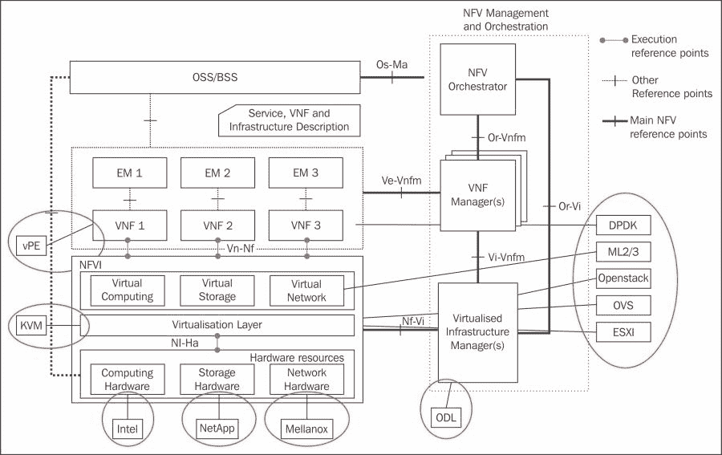
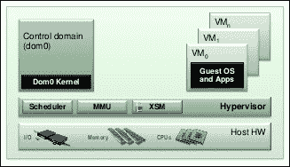
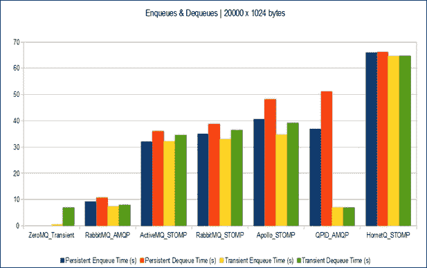
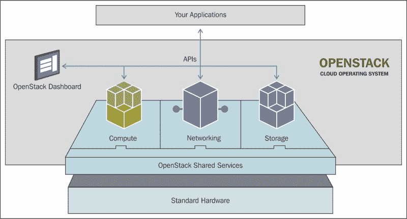
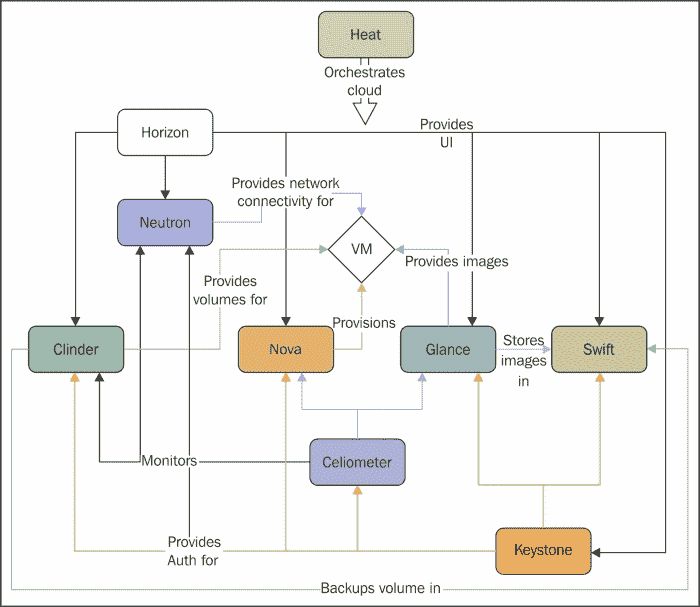

# 十二、虚拟化

在本章中，您将看到有关 Linux 虚拟化部分中出现的各种概念的信息。 正如你们中的一些人可能知道的那样，这个主题相当广泛，只选择几个组件来解释也是一个挑战。 我希望我的决定能让你们大多数对这一领域感兴趣的人满意。 本章中提供的信息可能不适合每个人的需要。 为此，我附上了多个链接，以获得更详细的描述和文档。 像往常一样，我鼓励你开始阅读，如果有必要的话，找到更多的东西。 我知道我不能用三言两语说出所有必要的信息。

在当今的任何 Linux 环境中，Linux 虚拟化都不是什么新鲜事。 它已经推出十多年了，并以一种非常迅速和有趣的方式发展起来。 现在的问题不是将虚拟化作为我的解决方案，而是更多地涉及部署什么虚拟化解决方案以及虚拟化什么。

当然，在某些情况下，虚拟化不是解决方案。 在嵌入式 Linux 中，有一大类域不适用虚拟化，主要是因为某些工作负载更适合于硬件。 但是，对于其他没有这类需求的人来说，使用虚拟化有很多好处。 本章将讨论有关各种虚拟化策略、云计算和其他相关主题的更多信息，让我们来看看。

# Linux 虚拟化

当考虑虚拟化时，每个人看到的第一个好处是服务器利用率的提高和能源成本的降低。 使用虚拟化可以最大化服务器上可用的工作负载，这与硬件只使用一小部分计算能力的情况有很大不同。 它可以降低与各种环境交互的复杂性，并提供更易于使用的管理系统。 今天，使用大量虚拟机并不像与少数虚拟机交互那样复杂，因为大多数工具都提供了可伸缩性。 此外，部署时间也确实减少了。 只需几分钟，您就可以取消配置和部署操作系统模板，或为虚拟设备部署创建虚拟环境。

虚拟化带来的另一个好处是灵活性。 当工作负载对于分配的资源而言太大时，可以很容易地在相同硬件或更强大的服务器上复制或移动到更适合其需求的另一个环境中。 对于这个问题的基于云的解决方案，这里没有限制。 云类型可以基于是否有可用于主机操作系统的工具来施加该限制。

随着时间的推移，Linux 能够为每个需求和组织提供许多很好的选择。 无论您的任务涉及企业数据中心的服务器整合，还是改进小型非营利性基础设施，Linux 都应该有一个满足您需求的虚拟化平台。 你只需要弄清楚你应该在哪里选择哪个项目。

虚拟化是广泛的，主要是因为它包含了广泛的技术，也因为很大一部分术语没有很好地定义。 在本章中，您将只看到与 Yocto 项目相关的组件，以及我个人感兴趣的一项新计划。 这一倡议试图使**网络功能虚拟化**(**NFV**)和**软件定义联网**(**SDN**)成为现实，被称为**NFV**(**OPNFV**)。 这里将作简要说明。

## SDN 和 NFV

我决定从这个话题开始，因为我相信在这一领域所做的所有研究都开始受到来自各个领域和行业的许多开源倡议的推动，这一点非常重要。 这两个概念并不新鲜。 自从它们第一次被描述以来，它们已经存在了 20 年，但在过去的几年里，它们作为真实的和非常可能的实现重新浮出水面成为可能。 本节的重点将放在*NFV*部分，因为它受到的关注最多，而且还包含各种实施建议。

## 帖子主题：Re：Колибри

NFV是一种网络架构概念，用于将整个类别的网络节点功能虚拟化为可互连以创建通信服务的块。 它与已知的虚拟化技术不同。 它使用**虚拟网络功能**(**VNF**)，这些功能可以包含在一个或多个虚拟机中，这些虚拟机执行服务器、交换机甚至云基础设施上可用的不同进程和软件组件。 几个例子包括虚拟化负载均衡器、入侵检测设备、防火墙等。

电信行业的开发产品周期非常严格和漫长，因为各种标准和协议需要很长时间才能得到遵守和质量会议。 这使得快速发展的组织有可能成为竞争对手，并促使他们改变方法。

2013 年，一个行业规范小组发布了一份关于软件定义网络和 OpenFlow 的白皮书。 该组织是**欧洲电信标准协会**(**ETSI**)的一部分，被称为网络功能虚拟化。 本白皮书发布后，发表了更深入的研究论文，解释了从术语定义到各种使用案例的各种内容，并参考了可能考虑使用 NFV 实施的供应商。

## КолибриETSI NFV

ETSI NFV工作组似乎有助于电信行业创建更灵活的开发周期，并使其能够及时响应动态和快速变化的环境中的任何需求。 SDN 和 NFV 是两个互补的概念，是这方面的关键使能技术，也包含电信和 IT 行业开发的技术的主要组成部分。

NFV 框架由六个组件组成：

*   **NFV Infrastructure (NFVI)**: It is required to offer support to a variety of use cases and applications. It comprises of the totality of software and hardware components that create the environment for which VNF is deployed. It is a multitenant infrastructure that is responsible for the leveraging of multiple standard virtualization technologies use cases at the same time. It is described in the following **NFV Industry Specification Groups** (**NFV ISG**) documents:
    *   NFV 基础架构概述
    *   NFV 计算 NFV 计算
    *   NFV 虚拟机管理程序域
    *   NFV 基础设施网络域

    下图显示了 NFV 基础架构的各种使用情形和应用领域的可视化图表。

    

*   **NFV 管理和协调(MANO)**：它是负责在虚拟化层的帮助下将计算、网络和存储组件与软件实施分离的组件。 它需要管理新元素并编排它们之间的新依赖关系，这需要一定的互操作性标准和一定的映射。
*   **NFV 软件体系结构**：它与已经实现的网络功能(如专有硬件设备)的虚拟化有关。 它意味着对硬件实现的理解和从硬件实现到软件实现的过渡。 转换基于可在流程中使用的各种定义模式。
*   **NFV 可靠性和可用性**：这些是真正的挑战和这些组件所涉及的工作从各种问题、用例、需求和原则的定义开始，它已经提出要提供与遗留系统相同级别的可用性。 它与可靠性组件有关，文档只是为未来的工作做准备。 它只识别各种问题，并指出在设计弹性 NFV 系统时使用的最佳实践。
*   **NFV 性能和可移植性**：NFV 的目的通常是改变其与未来网络的工作方式。 为此，它需要证明自己是行业标准的冗长解决方案。 本节介绍如何在常规 VNF 部署中应用与性能和可移植性相关的最佳实践。
*   **NFV 安全**：由于是行业的重要组成部分，它关注并依赖于网络和云计算的安全，这使得 NFV 的安全保障变得至关重要。 安全专家组将重点放在这些关切上。

这些组件的架构如下所示：


在所有文档就位之后，需要执行一些概念证明，以测试这些组件的限制，并相应地调整理论组件。 它们似乎也鼓励了 NFV 生态系统的发展。

### 备注

有关 NFV 的可用概念和规范的更多信息，请参考这些链接：[http://www.etsi.org/technologies-clusters/technologies/nfv/nfv-poc?tab=2](http://www.etsi.org/technologies-clusters/technologies/nfv/nfv-poc?tab=2)和[http://www.etsi.org/technologies-clusters/technologies/nfv](http://www.etsi.org/technologies-clusters/technologies/nfv)。

## SDN

**软件定义的联网**(**SDN**)是一种联网方法，它为管理员提供了使用可用功能的抽象来管理各种服务的可能性。 这是通过将系统解耦到控制平面和数据平面并根据发送的网络流量做出决策来实现的；这代表控制平面领域，流量转发到哪里由数据平面表示。 当然，控制平面和数据平面之间需要某种通信方法，因此 OpenFlow 机制首先进入方程式；不过，其他组件也可以取代它。

SDN 的目的是提供一个可管理、经济高效、适应性强、动态的体系结构，并适合当今可用的动态和高带宽场景。 OpenFlow 组件是 SDN 解决方案的基础。 SDN 架构允许以下功能：

*   **直接编程**：控制平面是直接可编程的，因为它与数据平面完全分离。
*   **以编程方式配置**：sdn允许通过程序管理、配置和优化资源。 这些程序也可以由任何人编写，因为它们不依赖于任何专有组件。
*   **敏捷性**：两个组件之间的抽象允许根据开发人员的需要调整网络流。
*   **集中管理**：逻辑组件可以集中在控制平面上，这为其他应用、引擎等提供了网络视图。
*   **开放标准和供应商中立**：它是使用开放标准实施的，由于提供给控制器的指令数量较多，这些标准简化了 SDN 设计和操作。 与应处理多个特定于供应商的协议和设备的其他场景相比，这要小一些。

此外，考虑到移动设备通信、物联网(IoT)、机器对机器(M2M)、Industry 4.0 等新兴市场都需要网络支持，使用传统解决方案满足市场需求是不可能的。 考虑到各个 IT 部门可用于进一步开发的预算，都面临着做出决定的问题。 移动设备通信市场似乎都决定走向开源，希望这项投资能证明其真正的能力，也能带来更光明的未来。

## OPNFV

NFV 项目的开放平台试图提供一个运营商级的、紧密集成的开源参考平台，以促进业界同行帮助改进和推动 NFV 概念向前发展。 其目的是在众多已经存在的块和项目之间提供一致性、互操作性和性能。 该平台还将尝试与各种开源项目密切合作，不断帮助集成，同时填补任何一个项目留下的开发空白。

该项目预计将提高性能、可靠性、适用性、可用性和能效，但同时也为仪器提供了广泛的平台。 它将从开发 NFV 基础设施和虚拟化基础设施管理系统开始，在那里它将结合一些已经可用的项目。 它的参考系统架构由 x86 架构表示。

项目最初的重点和建议的实现可以在下图中参考。 从这张图中可以很容易看出，该项目自 2014 年 11 月启动以来，虽然非常年轻，但已经加速启动，已经有了几个实施主张。 已经有许多大公司和组织开始制作他们的特定演示。 OPNFV 没有等待他们完成，已经在讨论一些拟议的项目和倡议。 这些目的既是为了满足其成员的需求，也是为了保证他们对各种组件(如持续集成、故障管理、试验台基础设施等)的可靠性。 下图描述了 OPNFV 的结构：



项目一直在利用尽可能多的开源项目。 对这些项目进行的所有修改都可以在两个地方完成。 首先，如果不需要进行可能导致偏离其目的和路线图的重大功能更改，则可以在项目内部进行这些更改。 第二个选项是对第一个选项的补充，对于不属于第一类的更改是必要的；它们应该包含在 OPNFV 项目的代码库中的某个位置。 在 OPNFV 的开发周期内，如果没有适当的测试，所做的任何更改都不应上行。

需要提到的另一个重要因素是 OPNFV 不使用任何特定或额外的硬件。 只要支持 VI-Ha 参考点，它就只使用可用的硬件资源。 在上图中，可以看到这已经是由供应商完成的，例如提供计算硬件的 Intel、提供存储硬件的 NetApp 和提供网络硬件组件的 Mellanox。

OPNFV 董事会和技术指导委员会有相当多的开源项目。 它们从**基础架构即服务**(**IaaS**)和虚拟机管理程序到 SDN 控制器，并继续列出。 这只是为大量的贡献者提供了一种可能性，让他们尝试一些可能没有时间学习的技能，或者想学习但没有机会学习的技能。 此外，一个更多元化的社区为同一主题提供了更广阔的视野。

OPNFV 项目有种类繁多的家用电器。 对于使用移动网关(如服务网关(SGW)、分组数据网络网关(PGW)等)和相关功能(移动管理实体(MME)和网关)、防火墙或应用层网关和过滤器(Web 和电子邮件流量过滤器)来测试诊断设备(服务级别协议(SLA)监控)的移动部署，虚拟网络功能是多样的。 这些 VNF 部署需要易于操作、扩展和独立于所部署的 VNF 类型发展。 OPNFV 着手创建一个必须支持一组质量和用例的平台，如下所示：

*   VNF 的生命周期管理需要一个通用机制，包括部署、实例化、配置、启动和停止、升级/降级和最终退役
*   使用一致的机制来指定和互连 VNF、VNFC 和 PNF；这些独立于物理网络基础架构、网络覆盖等，即虚拟链路
*   通常使用一种机制来动态实例化新的 VNF 实例或停用足够的 VNF 实例，以满足当前的性能、规模和网络带宽需求
*   一种机制用于检测 NFVI、VIM 和基础架构的其他组件中的故障和故障，并从这些故障中恢复
*   一种机制用于从物理网络功能到虚拟网络功能/从虚拟网络功能向物理网络功能发送业务/将业务从物理网络功能接收到物理网络功能
*   NFVI 即服务用于在同一基础架构上托管来自不同供应商的不同 VNF 实例

这里应该提到一些值得注意且易于掌握的用例示例。 它们被组织成四个类别。 让我们从第一个类别开始：住宅/通道类别。 它可用于虚拟化家庭环境，但也提供对 NFV 的固定访问。 第二个是数据中心：它拥有 CDN 的虚拟化，并提供了应对的用例。 移动类别包括移动核心网和 IMS 的虚拟化以及移动基站的虚拟化。 最后是云类别，包括 NFVIaaS、VNFaaS、VNF 转发图(服务链)和 VNPaaS 的用例。

### 备注

有关此项目和各种实施组件的更多信息，请访问[https://www.opnfv.org/](https://www.opnfv.org/)。 有关遗漏术语的定义，请参考[http://www.etsi.org/deliver/etsi_gs/NFV/001_099/003/01.02.01_60/gs_NFV003v010201p.pdf](http://www.etsi.org/deliver/etsi_gs/NFV/001_099/003/01.02.01_60/gs_NFV003v010201p.pdf)。

# Yocto 项目的虚拟化支持

`meta-virtualization`层尝试创建专门用于嵌入式虚拟化的中长期生产层。 这些角色包括：

*   简化使用 KVM/LXC 虚拟化等工具进行协作基准测试和研究的方式，并结合高级核心隔离和其他技术
*   与 OpenFlow、OpenvSwitch、LXC、dmtcp、CRIU 等项目进行集成和贡献，这些项目可以与 OpenStack 或运营商级 Linux 等其他组件一起使用。

简而言之，这一层试图在构建基于 OpenEmbedded 和 Yocto Project 的虚拟化解决方案时提供支持。

这一层中提供的包(我将简要介绍一下)如下所示：

*   `CRIU`
*   `Docker`
*   `LXC`
*   `Irqbalance`
*   `Libvirt`
*   `Xen`
*   `Open vSwitch`

这一层可以与为各种基于云的解决方案提供云代理和 API 支持的`meta-cloud-services`层结合使用。 在本节中，我指的是这两个层，因为我认为将这两个组件放在一起介绍是合适的。 在`meta-cloud-services`层内部，还将讨论和简要介绍几个包，如下所示：

*   `openLDAP`
*   `SPICE`
*   `Qpid`
*   `RabbitMQ`
*   `Tempest`
*   `Cyrus-SASL`
*   `Puppet`
*   `oVirt`
*   `OpenStack`

提到这些组件之后，我现在将继续解释这些工具中的每一个。 让我们从元虚拟化层的内容开始，更确切地说是`CRIU`包，这是一个在 Linux 的 Userspace中实现**检查点/恢复的项目。 它可用于冻结已在运行的应用，并将其作为文件集合检查点到硬盘驱动器。 这些检查点可用于从该点恢复和执行应用。 它可以作为许多用例的一部分使用，如下所示：**

*   **容器的实时迁移**：这是项目的主要用例。 容器被选中，生成的图像被移到另一个框中并在那里恢复，使得用户几乎看不到整个体验。
*   **升级无缝内核**：无需停止活动即可完成内核更换活动。 可以设置检查点，调用 kexec 进行替换，之后可以恢复所有服务。
*   **加速慢启动服务**：它是一种启动过程慢的服务，可以在第一次启动完成后进行检查，并且对于连续启动，可以从该点恢复。
*   **网络负载均衡**：它是`TCP_REPAIR`套接字选项的一部分，在特殊状态下切换套接字。 在操作结束时，套接字实际上会进入预期的状态。 例如，如果调用`connect()`，套接字将根据请求进入`ESTABLISHED`状态，而不检查来自另一端的通信确认，因此可以在应用级别进行卸载。
*   **桌面环境挂起/恢复**：它基于屏幕会话或`X`应用的挂起/恢复操作比关闭/打开操作快得多的事实。
*   **高性能和计算问题**：它既可用于集群上任务的负载平衡，也可用于在发生崩溃时保存集群节点状态。 拥有多个应用快照不会伤害任何人。
*   **流程复制**：类似于远程`fork()`操作。
*   **应用快照**：可以保存一系列应用状态并在必要时将其还原。 它既可以用作应用所需状态的重做，也可以用于调试目的。
*   **在没有此选项的应用中保存能力**：这类应用的一个示例可以是游戏，在游戏中，在达到特定级别后，您需要建立检查点。
*   **将忘记的应用迁移到屏幕上**：如果您忘记将应用包括在屏幕上，而您已经在屏幕上了，CRIU 可以帮助您完成迁移过程。
*   **已挂起**的应用调试：对于因`git`和需要快速重启而卡住的服务，可以使用服务副本进行恢复。 还可以使用转储进程，并通过调试找到问题的原因。
*   **不同机器上的应用行为分析**：对于那些在不同机器上的行为可能不同的应用，可以使用相关应用的快照并将其传输到另一台机器上。 在这里，调试过程也可以是一种选择。
*   **干运行更新**：在对系统进行系统或内核更新之前，可以将其服务和关键应用复制到虚拟机上，在系统更新和所有测试用例通过之后，可以进行真正的更新。
*   **容错系统**：它可以成功地用于其他机器上的进程复制。

下一个元素是`irqbalance`，这是一个可跨多处理器和多处理器系统使用的分布式硬件中断系统。 实际上，它是一个用于跨多个 CPU 平衡中断的守护进程，其目的是在 SMP 系统上提供更好的性能以及更好的 IO 操作平衡。 它有其他选择，如`smp_affinity`，理论上可以实现最高性能，但缺乏`irqbalance`提供的灵活性。

`libvirt`工具包可用于连接最近的 Linux 内核版本中提供的虚拟化功能，这些版本已根据 GNU Lesser General Public License 获得许可。 它提供了对大量软件包的支持，如下所示：

*   KVM/QEMU Linux 管理程序
*   Supervisor Xen
*   LXC Linux 容器系统
*   OpenVZ Linux 容器系统
*   开放模式 Linux--半虚拟化内核
*   虚拟机管理程序，包括 VirtualBox、VMware ESX、GSX、Workstation 和 Player、IBM PowerVM、Microsoft Hyper-V、Parallels 和 Bhyve

除了这些软件包，它还支持多种文件系统上的存储，如 IDE、SCSI 或 USB 磁盘、光纤通道、LVM 和 iSCSI 或 NFS，以及对虚拟网络的支持。 它是专注于节点虚拟化的其他高级应用和工具的构建块，并且以安全的方式实现这一点。 它还提供远程连接的可能性。

### 备注

有关`libvirt`的更多信息，请访问[http://libvirt.org/goals.html](http://libvirt.org/goals.html)查看其项目目标和术语。

接下来是`Open vSwitch`，这是一个多层虚拟交换机的产品级实现。 该软件组件在 Apache2.0 下获得许可，旨在通过各种编程扩展实现大规模网络自动化。 `Open vSwitch`包也缩写为**OVS**，它为硬件虚拟化提供了一个双堆栈层，并且还支持计算机网络中可用的大量标准和协议，例如 sFlow、NetFlow、SPAN、CLI、RSPAN、802.1ag、LACP 等。

Xen 是一个具有微内核设计的管理程序，它提供的服务提供在同一架构上执行的多个计算机操作系统。 该软件于 2003 年在剑桥大学首次开发，并在 GNU 通用公共许可证版本 2 下开发。该软件在特权更高的状态下运行，可用于 ARM、IA-32 和 x86-64 指令集。

管理程序是一款与各个域的 CPU 调度和内存管理相关的软件。 它从**域 0**(**dom0**)执行此操作，该域控制名为**Domu**的所有其他非特权域；Xen 从引导加载程序引导，通常加载到 dom0 主域，这是一个半虚拟化的操作系统。 此处提供了 Xen 项目体系结构的简要介绍：



**Linux 容器**(**lxc**)是元虚拟化层中的下一个可用元素。 它是一组众所周知的工具和库，通过在 Linux 控制主机上提供隔离容器来提供操作系统级别的虚拟化。 它将内核**控制组**(**cgroups**)的功能与对隔离名称空间的支持结合起来，以提供隔离环境。 它受到了相当多的关注，主要是由于 Docker，稍后将简要介绍这一点。 此外，它还被认为是完全机器虚拟化的轻量级替代方案。

这两个选项(容器和机器虚拟化)都有相当多的优点和缺点。 如果是第一种选择，容器通过共享某些组件来提供较低的开销，结果可能是它没有很好的隔离性。 机器虚拟化正好相反，它以更大的开销为代价提供了很好的隔离解决方案。 这两种解决方案也可以看作是相辅相成的，但这只是我个人对这两种解决方案的看法。 实际上，它们都有自己独特的优势和劣势，而这些优势和劣势有时也可能是互不相辅相成的。

### 备注

有关 linux 容器的更多信息，请访问[https://linuxcontainers.org/](https://linuxcontainers.org/)。

将讨论的`meta-virtualization`层的最后一个组件是**Docker**，这是一个开源软件，它试图自动化在 Linux 容器内部署应用的方法。 它通过在 LXC 上提供抽象层来实现这一点。 下图更好地描述了它的架构：


正如您在上图中看到的，此软件包能够使用操作系统的资源。 这里，我指的是 Linux 内核的功能，并将其他应用与操作系统隔离开来。 它可以通过 LXC 或其他替代方案(如被视为间接实现的`libvirt`和`systemd-nspawn`)做到这一点。 它还可以直接通过`libcontainer`库来实现这一点，该库从 0.9 版的 Docker 开始就存在了。

如果您想要实现分布式系统的自动化，例如大规模 Web 部署、面向服务的架构、持续部署系统、数据库集群、私有 PaaS 等，Docker 是一个很棒的组件。 有关其用例的更多信息，请访问[https://www.docker.com/resources/usecases/](https://www.docker.com/resources/usecases/)获取。 一定要看一下这个网站，这里经常有有趣的信息。

### 备注

有关 Docker 项目的更多信息，请访问他们的网站。 请访问[https://www.docker.com/whatisdocker/](https://www.docker.com/whatisdocker/)查看**什么是 Docker？**部分。

完成`meta-virtualization`层之后，我将转到包含各种元素的`meta-cloud-services`层。 我将从**独立计算环境的简单协议**(**SPICE**)开始。 这可以转化为虚拟桌面设备的远程显示系统。

它最初是一个封闭源代码的软件，两年后决定将其开源。 然后，它成为了与设备交互的开放标准，无论它们是否虚拟化，而不是虚拟化。 它构建在客户端-服务器架构之上，使其能够同时处理物理设备和虚拟设备。 后台和前端的交互通过**VD-Interfaces**(**VDI**)实现，如下图所示，目前的重点是远程访问 QEMU/KVM 虚拟机：


名单上的下一个是**oVirt**，这是一个提供 Web 界面的虚拟化平台。 它易于使用，并有助于管理虚拟机、虚拟化网络和存储。 它的架构由一个 oVirt 引擎和多个节点组成。 该引擎是配备了用户友好界面的组件，用于管理逻辑和物理资源。 它还运行可以是 oVirt 节点、Fedora 或 CentOS 主机的虚拟机。 使用 oVirt 的唯一缺点是它只支持有限数量的主机，如下所示：

*   软呢帽 20 20
*   CentOS 6.6、7.0
*   Red Hat Enterprise Linux 6.6、7.0
*   Science Linux 6.6、7.0

作为一种工具，它非常强大。 它为**虚拟桌面和服务器管理器**(**VDSM**)与虚拟机的通信提供了与`libvirt`的集成，并且还支持支持远程桌面共享的 SPICE 通信协议。 这是一个由 Red Hat 启动并主要由其维护的解决方案。 它是他们的**Red Hat Enterprise Virtualization**(**RHEV**)的基础元素，但有一件事很有趣，需要注意的是，Red Hat 现在不仅是 oVirt 和 Aeolus 等项目的支持者，而且自 2012 年以来一直是 OpenStack 基金会的白金成员。

### 备注

有关项目(如oVirt、Aeolus 和RHEV)的更多信息，请访问以下链接：[http://www.redhat.com/promo/rhev3/?sc_cid=70160000000Ty5wAAC&Offer_id=70160000000Ty5NAAS http://www.aeolusproject.org/](http://www.redhat.com/promo/rhev3/?sc_cid=70160000000Ty5wAAC&offer_id=70160000000Ty5NAAS%20http://www.aeolusproject.org/)和[http://www.ovirt.org/Home](http://www.ovirt.org/Home)。

现在我将转到另一个组件。 这里，我指的是轻量级目录访问协议的开源实现，简称为**OpenLDAP**。 尽管它有一个名为**OpenLDAP Public License**的许可证，本质上类似于 BSD 许可证，但它并没有记录在 opensource.org 上，这使得它没有得到**Open Source Initiative**(**OSI**)的认证。

此软件组件以一套元素的形式提供，如下所示：

*   一个独立的 LDAP 守护进程，它充当名为**slapd**的服务器的角色
*   许多实现 LDAP 协议的库
*   最后但并非最不重要的一点是，一系列工具和实用程序之间还包含几个客户端示例

还有许多其他功能需要提及，比如 ldapc++和用 C++、JLDAP 编写的库以及用 Java 编写的库；内存映射数据库 LMDB；基于角色的身份管理软件堡垒；同样用 Java 编写的 SDK；以及用 Java 编写的 JDBC-LDAP 桥驱动程序**jdbc-ldap**。

**Cyrus SASL**是用于**简单身份验证和安全层**(**SASL**)身份验证的通用客户端-服务器库实现。 它是一种用于添加对基于连接的协议的身份验证支持的方法。 基于连接的协议向所请求的服务器添加用于标识和验证用户的命令，如果需要协商，则出于安全目的在协议和连接之间添加额外的安全层。 有关 SASL 的更多信息可在 RFC2222 中获得，可从[http://www.ietf.org/rfc/rfc2222.txt](http://www.ietf.org/rfc/rfc2222.txt)获得。

### 备注

有关Cyrus SASL 的详细说明，请参阅[http://www.sendmail.org/~ca/email/cyrus/sysadmin.html](http://www.sendmail.org/~ca/email/cyrus/sysadmin.html)。

**QPID**是 Apache 开发的消息传递工具，理解**高级消息队列协议**(**AMQP**)，支持多种语言和平台。 AMQP 是一种开源协议，旨在以可靠的方式通过网络进行高性能消息传递。 有关AMQP 的更多信息，请访问[http://www.amqp.org/specification/1.0/amqp-org-download](http://www.amqp.org/specification/1.0/amqp-org-download)。 在这里，您可以找到有关协议规范的更多信息，以及有关该项目的一般信息。

QPID 项目推动了 AMQP 生态系统的开发，这是通过提供消息代理和 API 来实现的，这些消息代理和 API 可用于任何打算使用其产品的 AMQP 消息传递部分的开发应用。 为此，可以执行以下操作：

*   让源代码开源。
*   使 AMQP 可用于各种计算环境和编程语言。
*   提供必要的工具来简化应用的开发过程。
*   创建消息传递基础设施，以确保其他服务可以与 AMQP 网络很好地集成。
*   创建一种消息传递产品，使与 AMQP 的集成在任何编程语言或计算环境中都变得轻而易举。 请务必在[http://qpid.apache.org/proton/overview.html](http://qpid.apache.org/proton/overview.html)查看 QPIDProton以了解这一点。

### 备注

有关上述功能的更多信息，请参见[http://qpid.apache.org/components/index.html#messaging-apis](http://qpid.apache.org/components/index.html#messaging-apis)。

**RabbitMQ**是另一个实现 AMQP 的 Message Broker 软件组件，它也是开源的。 它有许多组件，如下所示：

*   RabbitMQ 交换服务器
*   HTTP、**面向流文本的消息协议**(**STOMP**)和**消息队列遥测传输**(**MQTT**)的网关
*   适用于各种编程语言的 AMQP 客户端库，最著名的是 Java、Erlang 和.Net Framework
*   用于许多自定义组件的插件平台，这些组件还提供一组预定义的组件：
    *   **Shovel**：它是执行代理之间消息复制/移动操作的插件
    *   **管理**：它实现对经纪人和经纪人集群的控制和监控
    *   **Federation**: It enables sharing at the exchange level of messages between brokers

        ### 备注

        您可以通过参考[http://www.rabbitmq.com/documentation.html](http://www.rabbitmq.com/documentation.html)上的 RabbitMQ文档部分找到有关 RabbitMQ 的更多信息。

比较 QPID 和 RabbitMQ，可以得出结论，RabbitMQ 更好，而且它有非常棒的文档。 这使得它成为 OpenStack Foundation 以及对这些框架以外的信息感兴趣的读者的首选。 它也可以在[http://blog.x-aeon.com/2013/04/10/a-quick-message-queue-benchmark-activemq-rabbitmq-hornetq-qpid-apollo/](http://blog.x-aeon.com/2013/04/10/a-quick-message-queue-benchmark-activemq-rabbitmq-hornetq-qpid-apollo/)上获得。 此图中还提供了一个这样的结果，以供比较：



下一个元素是**PUPETE**，这是一个开源的源代码配置管理系统，它允许 IT 基础设施定义特定的状态并强制执行这些状态。 通过这样做，它为系统管理员提供了一个很好的自动化系统。 该项目由 Puptet Labs 开发，在 2.7.0 版本之前是在 GNU 通用公共许可证(GNU General Public License)下发布的。 在此之后，它转移到了 Apache License 2.0，现在有两种版本可用：

*   **开源傀儡版本**：它与前面的工具非常相似，并且能够提供配置管理解决方案，允许定义和自动化状态。 它既可用于 Linux 和 UNIX，也可用于 Max OS X 和 Windows。
*   **傀儡企业版**：它是一个商业版本，超越了开源傀儡的能力，并允许配置和管理过程的自动化。

它是一种定义声明性语言以供以后用于系统配置的工具。 它可以直接应用于系统，甚至可以编译为目录并使用客户端-服务器范例(通常是 rest API)部署在目标上。 另一个组件是强制执行清单中可用资源的代理。 当然，资源抽象是通过抽象层完成的，抽象层通过与特定于操作系统的命令非常不同的更高级别的术语来定义配置。

### 备注

如果您访问[http://docs.puppetlabs.com/](http://docs.puppetlabs.com/)，您会找到更多与 PupPet 和其他 PupPet Lab工具相关的文档。

有了这些，我认为是时候展示元云服务层的主要组件了，称为**OpenStack**。 它是一个基于控制大量组件的云操作系统，它共同提供计算、存储和网络资源池。 所有这些都是通过仪表板进行管理的，当然，仪表板是由另一个组件提供的，并且让管理员可以控制。 它为用户提供了从同一 Web 界面提供资源的可能性。 这里有一张描述开源云操作系统的图片，它实际上是 OpenStack：



它主要用作 IaaS 解决方案，其组件由 OpenStack Foundation 维护，采用 Apache License Version 2。目前，在该基金会中，有 200 多家公司为该软件的源代码以及一般开发和维护做出贡献。 在它的核心，所有组件也都保留了它的组件，每个组件都有一个 Python 模块，用于简单的交互和自动化：

*   **Compute(Nova)**：用于托管和管理云计算系统。 它管理环境的计算实例的生命周期。 它负责按需产生、停用和调度各种虚拟机。 关于虚拟机管理程序，KVM 是首选选项，但 Xen 和 VMware 等其他选项也是可行的。
*   **对象存储(SWIFT)**：它用于通过 RESTful 和 HTTP API 进行存储和数据结构检索。 它是一个可扩展的容错系统，允许使用多个磁盘驱动器上可用的对象和文件进行数据复制。 它主要是由一家名为**SwiftStack**的对象存储软件公司开发的。
*   **块存储(Cinder)**：它为 OpenStack 实例提供个持久块存储。 它管理数据块设备的创建以及连接和分离操作。 在云中，用户管理自己的设备，因此应该支持绝大多数存储平台和场景。 为此，它提供了一个可插拔的体系结构，方便了这一过程。
*   **网络(中子)**：它是负责网络相关服务的组件，也称为**网络连接即服务**。 它为网络管理提供 API，并确保防止某些限制。 它还具有基于可插拔模块的架构，以确保支持尽可能多的网络供应商和技术。
*   **Dashboard(Horizon)**：它提供基于 Web 的管理员和用户图形界面，用于与所有其他组件提供的其他资源进行交互。 它的设计还考虑到了可扩展性，因为它能够与负责监视和计费的其他组件以及其他管理工具交互。 它还提供了根据商业供应商的需求进行品牌重塑的可能性。
*   **身份服务(Keystone)**：它是一种身份验证和授权服务，它支持多种形式的身份验证，也支持现有的后端目录服务，如 LDAP。 它为用户及其可以访问的资源提供目录。
*   **镜像服务(Glance)**：它是，用于发现、存储、注册和检索虚拟机的镜像。 许多已经存储的图像可以用作模板。 OpenStack 还提供了用于测试目的的操作系统映像。 Glance 是唯一能够在各种服务器和虚拟机之间添加、删除、复制和共享 OpenStack 映像的模块。 所有其他模块都使用可用的 API of Glance 与图像交互。
*   **遥测(Ceileter)**：它是一个模块，它借助许多允许扩展的计数器，为 OpenStack 的所有当前和未来组件提供计费、基准测试和统计结果。 这使得它成为一个非常可伸缩的模块。
*   **Orchestrator(HEAT)**：它是一项服务，借助各种模板格式(如 HEAT)或 AWS CloudForment 管理多个复合云应用。 通信是在兼容 CloudForment 的查询 API 和 Open Stack rest API 上完成的。
*   **数据库(Trove)**：提供云数据库即服务功能，既可靠又可扩展。 它使用关系和非关系数据库引擎。
*   **裸机配置(Ironic)**：它是一个组件，提供虚拟机支持，而不是裸机支持。 它最初是 Nova BareMetal 驱动程序的一个分支，后来发展成为裸机虚拟机管理程序的最佳解决方案。 它还提供了一组插件，用于与各种裸机虚拟机管理程序进行交互。 默认情况下，它与 PXE 和 IPMI 一起使用，但当然，在可用插件的帮助下，它可以为各种特定于供应商的功能提供扩展支持。
*   **多租户云消息服务(Multiple Tenant Cloud Messaging，Zaqar)**：顾名思义，它是一个面向对**软件即服务**(**SaaS**)感兴趣的 Web 开发人员的多租户云消息服务。 他们可以使用它通过多种通信模式在各种组件之间发送消息。 但是，它也可以与其他组件一起使用，用于向最终用户呈现事件以及云层上的通信。 它的前身是**Marconi**，它还提供了可伸缩和安全的消息传递的可能性。
*   **Elastic Map Reduce(Sahara)**：它是一个试图自动化方法的模块，提供 Hadoop集群的功能。 它只需要定义各种字段，如 Hadoop 版本、各种拓扑节点、硬件详细信息等。 在此之后，几分钟后，Hadoop 群集即已部署完毕，并准备好进行交互。 它还提供了在部署后进行各种配置的可能性。

提到所有这些之后，您可能不会介意在下图中呈现一个概念体系结构，向您展示与上述组件交互的方式。 要在生产环境中自动部署这样的环境，可以使用自动化工具，例如前面提到的 Puppert 工具。 请看这张图：



现在，让我们继续，看看如何使用 Yocto 项目的功能部署这样的系统。 要开始本练习，应将所有必需的元数据层放在一起。 除了已有的 POKY 储存库外，还需要其他的储存库，它们在 OpenEmbedded 网站的层索引中定义，因为这次`README`文件是不完整的：

```sh
git clone –b dizzy git://git.openembedded.org/meta-openembedded
git clone –b dizzy git://git.yoctoproject.org/meta-virtualization
git clone –b icehouse git://git.yoctoproject.org/meta-cloud-services
source oe-init-build-env ../build-controller
```

创建适当的控制器构建后，需要对其进行配置。 在`conf/layer.conf`文件中，添加相应的机器配置，比如 qemux86-64，在`conf/bblayers.conf`文件中，应该相应地定义`BBLAYERS`变量。 除了已有的元数据层之外，还有额外的元数据层。 应在此变量中定义的变量包括：

*   `meta-cloud-services`
*   `meta-cloud-services/meta-openstack-controller-deploy`
*   `meta-cloud-services/meta-openstack`
*   `meta-cloud-services/meta-openstack-qemu`
*   `meta-openembedded/meta-oe`
*   `meta-openembedded/meta-networking`
*   `meta-openembedded/meta-python`
*   `meta-openembedded/meta-filesystem`
*   `meta-openembedded/meta-webserver`
*   `meta-openembedded/meta-ruby`

使用`bitbake openstack-image-controller`命令完成配置后，即可构建控制器映像。 可以使用`runqemu qemux86-64 openstack-image-controller kvm nographic qemuparams="-m 4096"`命令启动控制器。 完成本练习后，可以通过以下方式开始部署计算：

```sh
source oe-init-build-env ../build-compute

```

创建了新的构建目录后，而且由于构建过程的大部分工作已经通过控制器完成，因此构建目录(如`downloads`和`sstate-cache`)可以在它们之间共享。 此信息应通过`DL_DIR`和`SSTATE_DIR`表示。 这两个`conf/bblayers.conf`文件的不同之处在于，`build-compute`构建目录的第二个文件替换了`meta-cloud-services/meta-openstack-controller-deploy with meta-cloud-services/meta-openstack-compute-deploy`。

这一次使用`bitbake openstack-image-compute`完成了构建，应该可以更快地完成。 构建完成后，还可以使用`runqemu qemux86-64 openstack-image-compute kvm nographic qemuparams="-m 4096 –smp 4"`命令引导计算节点。 此步骤表示 OpenStack Cirros 的图像加载如下：

```sh
wget download.cirros-cloud.net/0.3.2/cirros-0.3.2-x86_64-disk.img 
scp cirros-0.3.2-x86_64-disk.img  root@<compute_ip_address>:~
ssh root@<compute_ip_address>
./etc/nova/openrc
glance image-create –name "TestImage" –is=public true –container-format bare –disk-format qcow2 –file /home/root/cirros-0.3.2-x86_64-disk.img

```

完成所有这些操作后，用户可以使用`http://<compute_ip_address>:8080/`自由访问 Horizon Web 浏览器。登录信息为 admin，密码为 password。 在这里，您可以玩和创建新实例、与它们交互，通常还可以做您脑海中浮现的任何事情。 如果您对实例做了错误的操作，请不要担心；您可以将其删除并重新开始。

`meta-cloud-services`层的最后一个元素是 OpenStack 的**Tempest 集成测试套件**。 它通过在 OpenStack 主干上执行的一组测试来表示，以确保一切正常工作。 它对于任何 OpenStack 部署都非常有用。

### 备注

有关 TEMPEST的更多信息，请访问[https://github.com/openstack/tempest](https://github.com/openstack/tempest)。

# 摘要

在本章中，不仅向您介绍了许多虚拟化概念(如 NFV、SDN、VNF 等)的信息，还向您介绍了许多有助于日常虚拟化解决方案的开源组件。 我给你举了一些例子，甚至还做了一个小练习，以确保即使在读完这本书之后，这些信息也会留在你的脑海里。 我希望我能让你们中的一些人对某些事情感到好奇。 我还希望你们中的一些人记录了这里没有介绍的项目，例如**OpenDaylight**(**ODL**)计划，它只是在图片中提到的一个实现建议。 如果是这样的话，我可以说我实现了我的目标。 如果没有，也许这个摘要会让您重新阅读前几页。

在下一章中，我们将访问一个新的、真正的载体分级载体。 这将是本书的最后一章，我将以一个对我个人非常重要的主题来结束它。 我将讨论名为**META-CGL**的 Yocto Shy 倡议及其目的。 我将介绍**运营商级 Linux**(**CGL**)的各种规范和更改，以及**Linux Standard Base**(**LSB**)的要求。 我希望你喜欢读它，就像我喜欢写它一样。