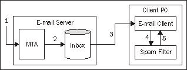
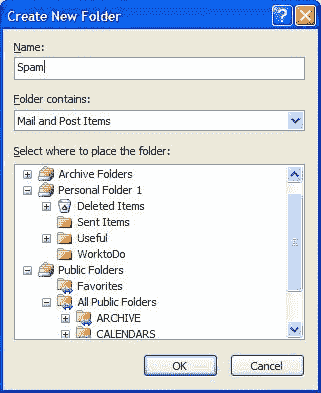
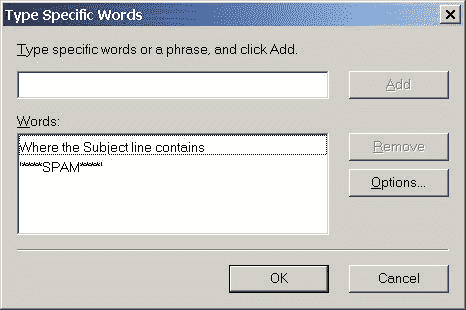
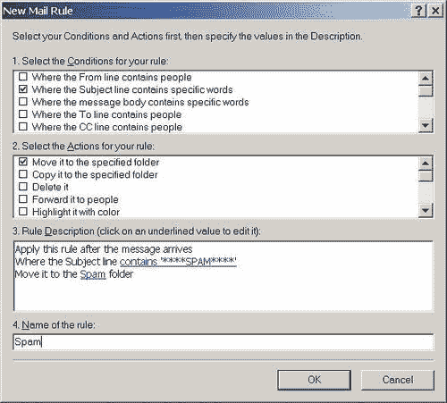
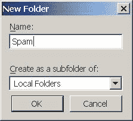

# 八、使用SpamAssassin摧毁垃圾邮件

垃圾邮件，或有时被称为不请自来的商业电子邮件(UCE)，是互联网的祸害。 垃圾邮件在过去的十年中不断增加，现在占据了所有互联网带宽的一半以上。 六分之一的用户对垃圾邮件采取过行动，因此，将垃圾邮件从用户的收件箱中清除出去是一个强有力的商业案例。 有许多不同的垃圾邮件解决方案，从完全外包你的垃圾邮件到不采取任何行动。 但是，如果您有自己的电子邮件服务器，您可以非常容易地添加垃圾邮件过滤。

SpamAssassin 是一个非常流行的开源反垃圾邮件工具。 它获得了 2006 年 Linux 新媒体奖“最佳基于 Linux 的反垃圾邮件解决方案”，被许多人认为是最好的免费、开源的反垃圾邮件工具，比许多商业产品都要好。 事实上，许多商业产品和服务都是基于 SpamAssassin 或其以前的版本。

在本章中，你将学到:

*   为什么垃圾邮件很难处理，为什么垃圾邮件过滤器需要定期更新
*   如何下载、安装和配置 SpamAssassin
*   如何用 SpamAssassin 过滤传入的电子邮件。
*   如何配置 SpamAssassin 工作在每个用户或每个服务器的基础上
*   如何配置流行的电子邮件客户机来识别 SpamAssassin 在电子邮件中放置的标记
*   如何自定义 SpamAssassin 来自动更新新规则集，以保持您的系统的垃圾邮件检测良好。
*   如何整合垃圾邮件过滤与病毒识别使用 amavisd

# 为什么要过滤邮件

如果您没有收到任何垃圾邮件，可能没有必要过滤垃圾邮件。 然而，一旦收到一条垃圾邮件，就必然会收到更多垃圾邮件。 垃圾邮件发送者有时可以使用 Web bug(从 Web 服务器获取的 HTML 电子邮件中的小图像)等技术检测垃圾邮件是否被查看，然后知道该电子邮件地址是有效的且易受攻击的。 如果对垃圾邮件进行了过滤，那么最初的电子邮件可能永远不会被看到，因此垃圾邮件发送者可能就不会以该电子邮件地址为目标，继续发送垃圾邮件。

尽管针对垃圾邮件采取了法律措施，但实际上垃圾邮件的数量仍在增加。 在欧洲及美国，最近针对滥发讯息的法例(指示 2002/58/EC 及条例草案编号 S.877)收效甚微，而滥发讯息在两地仍呈上升趋势。

主要原因是垃圾邮件是一种非常好的商业模式。 发送垃圾邮件是非常便宜的，每封邮件只有千分之一美分，而且在盈利之前，它需要非常低的点击率。 垃圾邮件发送者只需要将十万份左右的垃圾邮件中的一份转化为销售就能获利。 因此，有许多垃圾邮件和垃圾邮件是用来推广广泛的商品。 垃圾邮件的成本也可以忽略，由于使用恶意软件，使用无辜的电脑发送垃圾邮件的代表。

相比之下，垃圾邮件的成本对接收者来说是非常高的。 估计各不相同，从收到每封垃圾邮件 10 美分到每个员工每年 1000 美元，到 2007 年全球总共花费 1400 亿美元。 这种成本主要是劳动力——堵塞收件箱，迫使人们处理许多额外的电子邮件，从而分散了人们的工作注意力。 垃圾邮件干扰日常工作，可能包括冒犯大多数人的内容。 公司有责任保护员工不受此类内容的影响。 垃圾邮件过滤是一种非常廉价的方法，可以最大限度地降低成本并保护员工。

## 垃圾邮件是一个移动的目标

垃圾邮件不是静态的。 随着垃圾邮件发送者添加新方法，反垃圾邮件发送者开发对策，它每天都在变化。 因此，最有效的反垃圾邮件工具是那些经常更新的工具。 这与反病毒软件的困境相似——病毒定义需要定期更新，否则就无法检测到新的病毒。

SpamAssassin 定期更新。 除了新发布的软件，还有一个活跃的社区创建、批评和测试新的反垃圾邮件规则。 这些规则可以自动下载，以防止垃圾邮件的最新保护。

让我们来讨论 SpamAssassin 打击垃圾邮件的一些措施:

*   **开放中继:**这些是允许垃圾邮件发送者发送电子邮件的电子邮件服务器，即使它们没有以任何方式连接到服务器的所有者。 为了解决这个问题，反垃圾邮件社区开发了**黑名单**，也称为**黑名单**，反垃圾邮件软件可以使用这些黑名单来检测垃圾邮件。 这些在第 5 章中提到，你的电子邮件服务器不应该出现在这个列表中，因为它可能会限制合法的电子邮件流量。 任何通过黑名单服务器的电子邮件都会比未通过黑名单服务器的电子邮件受到更大的怀疑。 SpamAssassin 使用许多黑名单来测试电子邮件。
*   **关键字过滤器:**这些是对付垃圾邮件的有用工具。 垃圾邮件发送者倾向于一遍又一遍地重复相同的单词和短语。 SpamAssassin 广泛使用检测这些短语的规则。 这些组成了测试的大部分，前面提到的用户社区规则通常是这种形式的。 它们允许检测特定的单词、短语或字母、数字和标点序列。
*   **黑名单和白名单:**它们分别用于列出已知的垃圾邮件发送者和良好电子邮件来源。 来自黑名单上地址的电子邮件很可能是垃圾邮件，并相应地得到处理，而来自白名单上地址的电子邮件不太可能被视为垃圾邮件。 SpamAssassin 允许用户手动输入黑名单和白名单，并根据它处理的电子邮件构建自动白名单和黑名单。
*   **统计过滤器:**这些是自动系统，可以给出电子邮件是垃圾邮件的可能性。 这种过滤是基于过滤器以前所看到的垃圾邮件和非垃圾邮件。 它们的工作方式通常是找到一种类型的电子邮件中存在的单词，而不是另一种类型的，并使用这种知识来确定新电子邮件是哪种类型的。 SpamAssassin 有一个被称为**贝叶斯过滤器**的统计过滤器，可以非常有效地提高检出率。
*   **内容数据库:**这些是海量电子邮件检测系统。 许多电子邮件服务器向中央服务器接收和提交电子邮件。 如果同样的电子邮件被发送给成千上万的收件人，它可能是垃圾邮件。 内容数据库通过使用一种称为**散列**的技术防止机密电子邮件被发送到服务器，这种技术还降低了发送到服务器的数据量。 SpamAssassin 可以与多个内容数据库集成,特别是 Vipul 的剃须刀(http://razor.sourceforge.net/),Pyzor (http://sourceforge.net/apps/trac/pyzor/),和分布式校验和清算所【显示】,,**DCC (http://www.rhyolite.com/dcc/【病人】)。**
*   **URL 阻止列表:**这些类似于开放中继阻止列表，但列出了垃圾邮件发送者使用的网站。 在几乎所有的垃圾邮件中，都会给出一个网址。 建立了这些数据库，以便能够快速检测到垃圾邮件。 这是一个对付垃圾邮件非常有效的工具。 默认情况下，SpamAssassin 使用**垃圾邮件 URI 实时阻断列表**(**SURBLs**)，不需要任何进一步配置。

## 垃圾邮件过滤选项

垃圾邮件可以在服务器或客户端进行过滤。 下面解释这两种方法。 在第一个场景中，垃圾邮件在客户机上被过滤。



1.  邮件由 MTA 处理。
2.  然后将电子邮件放在适当用户的收件箱中。
3.  电子邮件客户机从收件箱读取所有新电子邮件。
4.  然后，电子邮件客户机将电子邮件传递给过滤器。
5.  当过滤器返回结果时，客户端可以显示有效的电子邮件并丢弃垃圾邮件或将其归档到一个单独的文件夹中。

在这种方法中，垃圾邮件过滤总是由客户端完成，并且总是在处理新电子邮件时完成。 通常是当用户可能在场时，因此他或她可能会在电子邮件可见之前经历一段延迟，或者在客户端软件从视图中过滤垃圾邮件之前，垃圾邮件在收件箱中存在一段时间。 可以在客户端上执行的垃圾邮件过滤数量可能是有限的。 特别是，网络测试(如开放中继阻止列表或 SURBLs)可能太耗时或太复杂，无法在用户的 PC 上执行。 由于垃圾邮件是一个移动的目标，更新许多客户端 pc 可能成为一个困难的管理任务。

在第二个场景中，垃圾邮件过滤是在电子邮件服务器上执行的。


1.  收到的电子邮件由 MTA 接收。
2.  然后，它被传递给垃圾邮件过滤器。
3.  然后，结果被发送回 MTA。
4.  根据结果，MTA 将电子邮件放在适当用户的收件箱(**4a**)中，或者放在单独的垃圾邮件文件夹(**4b**)中。
5.  电子邮件客户机访问用户收件箱中的电子邮件，如果需要，它还可以访问垃圾邮件文件夹。

这种方法有几个优点:

*   垃圾邮件过滤是在收到电子邮件时完成的，这可能是一天中的任何时间。 用户不太可能因为延迟而感到不便。
*   服务器可以专门处理垃圾邮件过滤。 它可能使用外部服务，如开放中继阻止列表、在线内容数据库和 SURBLs。
*   配置是集中式的，这将简化设置(例如，可能需要将防火墙配置为使用在线垃圾邮件测试)和维护(更新规则或软件)。

另一方面，缺点包括:

*   现在存在一个单点故障。 但是，小心一点，可以对坏掉的垃圾邮件过滤服务进行配置。 如果该服务不可用，电子邮件仍将被发送，但垃圾邮件将不会被过滤。
*   所有垃圾邮件必须由一个服务处理。 如果此服务不可伸缩，大量电子邮件可能会影响邮件交付时间，导致过滤效果差或断断续续，甚至可能导致电子邮件服务丢失。

# SpamAssassin 简介

垃圾邮件过滤实际上涉及两个阶段:检测垃圾邮件，然后对其进行处理。 SpamAssassin 是一个垃圾邮件检测器，它通过放入标头来标记是否为垃圾邮件来修改它处理的电子邮件。 由 MTA 或电子邮件系统中的邮件传递代理来响应 SpamAssassin 在电子邮件中创建的邮件头，并将其过滤掉。 但是，电子邮件系统的另一部分也可能执行此任务。


前面的图给出了 SpamAssassin 的示意图。 SpamAssassin 的核心是它的**规则引擎**，它决定调用哪些规则。 规则触发是否使用各种测试，包括贝叶斯过滤器、网络测试和自动白名单。

SpamAssassin 使用各种数据库来完成工作，下面也展示了这些数据库。 规则和分数是文本文件。 默认规则和分数包含在 SpamAssassin 发行版中，我们将看到，系统管理员和用户都可以添加规则或通过将现有规则添加到特定位置的文件中来更改它们的分数。 Bayesian 过滤器(这是 SpamAssassin 的主要部分，稍后将介绍)使用一个基于以前的垃圾邮件和非垃圾邮件的统计数据数据库。 **自动黑名单/白名单**也创建自己的数据库。

# 下载安装 SpamAssassin

SpamAssassin 与本书中使用的大多数软件略有不同。 它是用一种名为**Perl**的语言编写的，它有自己的分发方法**CPAN**(**综合 Perl 档案网络)**。 CPAN 是 Perl 软件(通常是 Perl 模块)的大型网站，CPAN 这个术语也是用于下载和安装这些模块的软件的名称。 尽管 SpamAssassin 是由许多 Linux 发行版作为包提供的，但我们强烈建议您从源代码安装它，而不是使用一个包。 这样，您将得到 SpamAssassin 的最新版本，而不是您的 Linux 分发程序创建其发行版时的当前版本。

大多数 Perl 用户将使用 CPAN 构建 Perl 模块，不会遇到任何困难。 CPAN 可以自动定位和安装任何依赖项(使所需组件正常工作所需的其他组件)。 从 Perl 的角度来看，使用 CPAN 安装 Perl 模块类似于在 Linux 中使用 `rpm`或 `apt-get`命令。 基本原理非常简单，一旦系统配置好，它通常每次都能工作。

然而，学习和配置一种安装软件的新方法可能会让一些人望而却步。 SpamAssassin 释放在源代码形式分布,但管理员**Red Hat 包管理器**(**RPM)基于系统可以很容易地最新 SpamAssassin 版本转换成 RPM 格式,然后定期 `rpm`命令可以用来安装包。 当 SpamAssassin 被更新时，Debian 存储库更新得相当快，并且可以使用常规的 `apt-get`命令来安装 SpamAssassin。 我们强烈建议您通过 `apt-get`、CPAN 或使用 `rpmbuild`命令进行安装，而不是使用发行商提供的 RPM。 【显示】**

由于 SpamAssassin 是一个 Perl 模块，所以它首先出现在 CPAN 上。 事实上，它只有在到达 CPAN 时才被释放。 CPAN 的用户可以在 SpamAssassin 发布几分钟后下载其最新版本。

如果 SpamAssassin 是基于源代码构建的，那么它也更容易获得支持。 一些分销商在创建 SpamAssassin 的 RPM 时做出了不同寻常的决定，或者可能会修改某些默认值。 这些使得获得支持更加困难。

rpm 交付也需要时间。 发行商在发布新版本的软件之前需要时间来构建和测试它们，而且大多数软件包的更新速度都不如 SpamAssassin 快。 因此，Linux 发行版可能不提供最新的软件，所提供的可能是几个过期的版本。

## 使用 CPAN

使用 CPAN 安装 SpamAssassin 3.2.5 的前提条件如下:

*   **Perl 版本 5.6.1 或更高版本:**大多数现代 Linux 发行版都将此作为基本包的一部分。
*   当前版本的 SpamAssassin 需要摘要::SHA1、HTML::Parser 和 Net::DNS 模块。 如果您将 CPAN 配置为遵循依赖关系，那么它将安装这些模块，但是还有许多额外的 Perl 模块是可选的，应该安装它们以获得最好的垃圾邮件检测。 CPAN 将发出带有模块名称的警告，这将使您能够识别和安装它们。
*   **C 编译器:**默认情况下可能不安装，可能需要使用 `rpm`命令添加。 所使用的编译器通常称为 `gcc`。
*   **互联网连接:**CPAN 将尝试使用 `HTTP`或 `FTP`下载模块，因此网络应该配置为允许此操作。

### 配置 CPAN

如果您以前使用过 CPAN，您可以跳到下一节:*使用 CPAN*安装 SpamAssassin。

如果 Internet 通信需要代理服务器，CPAN(以及其他 Perl 模块和脚本)将使用 `http_proxy`环境变量。 如果代理需要用户名和密码，则需要使用环境变量指定这些用户名和密码。 由于 CPAN 通常以 `root`的形式运行，所以这些命令应该输入为 `root:`

```sh
# HTTP_proxy=http://proxy.name:80
# export HTTP_proxy
# HTTP_proxy_user=username
# export HTTP_proxy_user
# HTTP_proxy_pass=password
# export HTTP_proxy_pass

```

接下来，输入以下命令:

```sh
# perl -MCPAN -e shell

```

如果输出类似于以下内容，则表明 CPAN 模块已经安装和配置，您可以跳到下一节:*使用 CPAN 安装 SpamAssassin*。

```sh
cpan shell -- CPAN exploration and modules installation (v1.7601)
ReadLine support enabled

```

如果输出提示手动配置，如下所示，则表示安装了 CPAN 模块，但没有配置。

```sh
Are you ready for manual configuration? [yes]

```

在配置期间，CPAN Perl 模块提示回答大约 30 个问题。 对于大多数问题，选择默认值是最好的回答。 在使用 CPAN Perl 模块之前，必须完成这个初始配置。 这些问题主要是关于各种实用程序的位置，可以通过按 Enter 选择默认值。 我们应该更改默认值的唯一问题是关于构建先决条件模块的问题。 如果我们将 CPAN 配置为遵循依赖关系，它将在没有提示的情况下安装所需的模块。

```sh
Policy on building prerequisites (follow, ask or ignore)? [ask] follow

```

配置完 CPAN 后，输入 `exit`并按*Enter*退出 shell。 我们现在准备使用 CPAN 来安装 SpamAssassin。

## 使用 CPAN 安装 SpamAssassin

要安装 SpamAssassin，输入以下命令进入 CPAN shell:

```sh
# cpan

```

如果 CPAN 模块配置正确，将出现以下输出(或类似的内容):

```sh
cpan shell -- CPAN exploration and modules installation (v1.7601)
ReadLine support enabled

```

现在，在 `cpan`提示符下，输入以下命令:

```sh
cpan> install Mail::SpamAssassin

```

CPAN 模块将查询在线数据库，查找 SpamAssassin 的最新版本及其依赖项，然后安装它们。 依赖将在 SpamAssassin 之前安装。 下面是示例输出:

```sh
cpan> install Mail::SpamAssassin
CPAN: Storable loaded ok (v2.18)
Going to read '/root/.cpan/Metadata'
Database was generated on Mon, 03 Aug 2009 04:27:49 GMT
Running install for module 'Mail::SpamAssassin'
CPAN: Data::Dumper loaded ok (v2.121_14)
'YAML' not installed, falling back to Data::Dumper and Storable to read prefs '/root/.cpan/prefs'
Running make for J/JM/JMASON/Mail-SpamAssassin-3.2.5.tar.gz
CPAN: Digest::SHA loaded ok (v5.45)
CPAN: Compress::Zlib loaded ok (v2.015)
Checksum for /root/.cpan/sources/authors/id/J/JM/JMASON/Mail-SpamAssassin-3.2.5.tar.gz ok
Scanning cache /root/.cpan/build for sizes
............................................................................DONE
CPAN: Archive::Tar loaded ok (v1.38)
Will not use Archive::Tar, need 1.00
Mail-SpamAssassin-3.2.5
Mail-SpamAssassin-3.2.5/t
Mail-SpamAssassin-3.2.5/sql
Mail-SpamAssassin-3.2.5/lib
....
CPAN.pm: Going to build F/FE/FELICITY/Mail-SpamAssassin-3.00.tar.gz

```

SpamAssassin 可能要求用户回答一些问题。 提供的响应可能会影响模块配置，或者只是安装前执行的测试的一部分。

```sh
CPAN.pm: Going to build J/JM/JMASON/Mail-SpamAssassin-3
What e-mail address or URL should be used in the suspected-spam report
text for users who want more information on your filter installation?
(In particular, ISPs should change this to a local Postmaster contact)
default text: [the administrator of that system] postmaster@myfomain.com
NOTE: settings for "make test" are now controlled using "t/config.dist".
See that file if you wish to customise what tests are run, and how.
checking module dependencies and their versions...

```

与许多 Perl 模块一样，SpamAssassin 非常灵活。 它可以利用可用的特性，即使没有可用的特性也可以工作。 当使用 CPAN 时，你可能会看到如下消息:

```sh
optional module missing: Mail::SPF
optional module missing: Mail::SPF::Query
optional module missing: IP::Country
optional module missing: Razor2
optional module missing: Net::Ident
optional module missing: IO::Socket::INET6
optional module missing: IO::Socket::SSL
optional module missing: Mail::DomainKeys
optional module missing: Mail::DKIM
optional module missing: DBI
optional module missing: Encode::Detect

```

如果您安装了上述模块，SpamAssassin 将利用它们，这将改进电子邮件过滤。 您可以中止 SpamAssassin 的安装，并使用 cpan `install Module::Name`命令安装模块。

如果您让构建过程完成，它将测试 C 编译器的功能、配置和构建模块、创建文档并测试 SpamAssassin。 在构建结束时，输出应该类似如下:

```sh
chmod 755 /usr/share/spamassassin
/usr/bin/make install -- OK
cpan>

```

这表明 SpamAssassin 已被正确安装。 如果 SpamAssassin 安装成功，则可以跳到*测试安装*一节。

如果安装失败，输出可能如下所示:

```sh
Failed 17/68 test scripts, 75.00% okay. 50/1482 subtests
failed, 96.63% okay.
make: *** [test_dynamic] Error 29
/usr/bin/make test -- NOT OK
Running make install
make test had returned bad status, won't install without force
cpan>

```

如果输出没有以 `/usr/bin/make install -- OK`消息结束，则表示发生了错误。 首先，您应该检查所有输出，以发现可能的警告和错误消息，特别是对于先决条件包。 如果没有帮助，则在*测试安装*部分描述支持途径。

## 使用 rpmbuild 工具

如果使用 Red Hat Package Manager 格式的 Linux 操作系统，则可以通过 `rpmbuild`命令安装 SpamAssassin。 将 SpamAssassin 源代码从[http://www.cpan.org/modules/01modules.index.html](http://www.cpan.org/modules/01modules.index.html)下载到一个工作目录中，然后发出以下命令来构建 SpamAssassin:

```sh
# rpmbuild -tb Mail-SpamAssassin-3.2.5.tar.gz
```

```sh
Executing(%prep): /bin/sh -e /var/tmp/rpm-tmp.ORksvX
+ umask 022
+ cd /root/rpmbuild/BUILD
+ cd /root/rpmbuild/BUILD
+ rm -rf Mail-SpamAssassin-3.2.5
+ /usr/bin/gzip -dc /root/Mail-SpamAssassin-3.2.5.tar.gz
+ /bin/tar -xf -
+ STATUS=0
+ '[' 0 -ne 0 ']'
+ cd Mail-SpamAssassin-3.2.5
+ /bin/chmod -Rf a+rX,u+w,g-w,o-w .
+ exit 0
Executing(%build): /bin/sh -e /var/tmp/rpm-tmp.zgpcdd
...
... (output continues)
...
Wrote: /usr/src/redhat/RPMS/i386/spamassassin-3.0.4-1.i386.rpm Wrote: /usr/src/redhat/RPMS/i386/spamassassin-tools-3.0.4-1.i386.rpm Wrote: /usr/src/redhat/RPMS/i386/perl-Mail-SpamAssassin-3.0.4-1.i386.rpm Executing(%clean): /bin/sh -e /var/tmp/rpm-tmp.65065 + umask 022 + cd /usr/src/redhat/BUILD + cd Mail-SpamAssassin-3.0.4 + '[' /var/tmp/spamassassin-root '!=' / ']' + rm -rf /var/tmp/spamassassin-root + exit 0

```

由于缺少依赖项，安装可能会失败。 这些是 SpamAssassin 使用的 Perl 模块，它们是单独安装的。 错误消息通常会提示依赖项的名称，如下所示:

```sh
# rpmbuild -tb Mail-SpamAssassin-3.2.5.tar.gz
```

```sh
error: Failed build dependencies:
perl(Digest::SHA1) is needed by spamassassin-3.2.5-1.i386
perl(HTML::Parser) is needed by spamassassin-3.2.5-1.i386
perl(Net::DNS) is needed by spamassassin-3.2.5-1.i386

```

在这种情况下，需要 Perl 模块 `Digest::SHA1, HTML::Parser`和 `Net::DNS`。 解决方案是使用 CPAN 安装它。 在某些情况下，SpamAssassin 可能需要特定版本的包，这可能需要升级已安装的版本。

当使用 CPAN 安装 SpamAssassin 时，所有依赖项都会自动安装。 但是，在使用 `rpmbuild`命令时，需要手动安装依赖项。 使用 CPAN 通常比 `rpmbuild`更少麻烦。

## 使用预构建 rpm

SpamAssassin 与许多 Linux 发行版一起打包，SpamAssassin 的新发行版通常可以从其他来源获得。 正如前面提到的，rpm 不是安装 SpamAssassin 的推荐方法，但比在不同寻常的平台上从源代码构建要可靠得多。

要安装 RPM，只需下载或在发行版 CD 上找到它，然后使用 `rpm`命令安装它。 以下命令可以用来安装 SpamAssassin 的 RPM:

```sh
# rpm -ivh /path/to/rpmfile-9.99.rpm

```

图形安装程序也可以用于安装 SpamAssassin rpm。 SpamAssassin 网站上列出的 rpm 通常是 SpamAssassin 的最新版本，并且是完整的。 如果不能安装这些组件，则应该安装 Linux 发行版提供的 RPM。

## 测试安装

有必要执行一些测试来确保 SpamAssassin 被正确安装，并且环境已经完成。 如果您想测试一个特定的用户帐户，您应该登录到该帐户以执行测试。

SpamAssassin 包含一个垃圾邮件示例和一个非垃圾邮件示例。 可以通过处理样本电子邮件来测试它。 这些电子邮件位于 SpamAssassin 分发目录的根目录中。 如果您使用 `root`用户使用 CPAN 安装 SpamAssassin，那么到该目录的路径可能类似于 `~root/.cpan/build/Mail-SpamAssassin-3.2.5/`，其中 `3.2.5`是安装 SpamAssassin 的版本。 如果找不到文件，请从[http://www.cpan.org/modules/01modules.index.html](http://www.cpan.org/modules/01modules.index.html)下载 SpamAssassin 源文件，并将源文件解压缩到一个临时目录中。 示例电子邮件位于未打包源的根目录中。 【5】

要测试 SpamAssassin，请切换到包含 `sample-spam.txt`的目录，并使用以下命令。 在每个命令之后显示示例结果。

```sh
$ spamassassin -t < sample-nonspam.txt | grep X-Spam

```

```sh
[22674] warn: config: created user preferences file: /home/user/.spamassassin/user_prefs
X-Spam-Checker-Version: SpamAssassin 3.2.5 (2008-06-10) on
X-Spam-Level:
X-Spam-Status: No, score=0.0 required=5.0 tests=none autolearn=haX-

```

```sh
$ spamassassin -t < sample-spam.txt | grep X-Spam

```

```sh
X-Spam-Flag: YES
X-Spam-Checker-Version: SpamAssassin 3.2.5 (2008-06-10) on
X-Spam-Level: **************************************************
X-Spam-Status: Yes, score=1000.0 required=5.0 tests=GTUBE,NO_RECEIVED,
X-Spam-Report:
X-Spam-Prev-Subject: Test spam mail (GTUBE)

```

使用 `sample-nonspam.txt`的命令输出应该有 `X-Spam-Status: No`，使用 `sample-spam.txt`的命令输出应该有 `X-Spam-Flag: YES`和 `X-Spam-Status: Yes`。

SpamAssassin 可以使用 `--lint`标志验证其配置文件，并报告任何错误。 默认情况下，一个干净的安装 SpamAssassin 不应该有任何错误，但一旦一个站点被定制，一些规则可能会失败。 在下面的示例中，条目 `score`不匹配规则:

```sh
$ spamassassin --lint

```

```sh
warning: score set for non-existent rule RULE_NAME
lint: 1 issues detected. please run with debug enabled for more
information

```

如果输出包含警告，则说明出了问题。 在继续使用 SpamAssassin 之前，有必要先修复它。 最好的地方去 SpamAssassin Wiki (http://wiki.apache.org/spamassassin/),SpamAssassin 邮件列表的档案(http://wiki.apache.org/spamassassin/MailingLists),和你最喜欢的搜索引擎。 与大多数开源项目一样，开发人员都是志愿者，并且感谢那些在发布请求帮助之前搜索问题解决方案的用户，因为大多数问题之前已经遇到过很多次了。

### 修改邮件

除了上面提到的电子邮件头之外，如果电子邮件被认为是垃圾邮件，SpamAssassin 还会修改它。 它获取原始电子邮件，并将其转换为电子邮件附件，其中包含一个简单的电子邮件。 如果 SpamAssassin 检测到潜在的病毒或其他危险内容，它总是对电子邮件进行封装。 在其默认配置中，它将在垃圾邮件周围添加一个信封电子邮件，但如果需要，可以关闭此功能。 请参阅 SpamAssassin 文档中有关 `report_safe`指令的内容。 信封电子邮件看起来像这样:


# 使用 SpamAssassin

现在安装了 SpamAssassin，我们需要配置系统以使用它。 SpamAssassin 可以以多种方式使用。 它可以集成到 MTA 的最大性能; 它可以作为守护进程或简单的脚本运行，以避免复杂性; 它可以为每个用户使用单独的设置，也可以为所有用户使用单一的一组设置; 它可以用于所有账户，也可以只用于选定的账户。 在本书中，我们将讨论三种使用 SpamAssassin 的方式。

第一种方法是使用 Procmail。 这是最简单的配置方法，适用于小容量站点，例如，每天少于 10,000 封电子邮件。

第二种方法是使用 SpamAssassin 作为守护进程。 这更有效，如果需要的话，仍然可以与 Procmail 一起使用。

第三种方法是将 SpamAssassin 与 amavisd 这样的内容过滤器集成在一起。 这提供了性能优势，但有时内容过滤器不能与 SpamAssassin 的最新版本一起工作。 如果有问题，通常很快就会得到解决。

### 注意事项

为了帮助您最大程度地利用 SpamAssassin, Packt Publishing 发布了 SpamAssassin:集成和配置实用指南(ISBN 1-904811-12-4)，作者是 Alistair McDonald。

## 在 Procmail 中使用 SpamAssassin

Procmail 在第 6 章和第 7 章中介绍过。 如果您至少对 Procmail 有一个基本的了解，那么下面的内容应该很容易理解。 如果你在阅读这一章的时候还不了解 Procmail，那么你有必要阅读第 6 章，它在继续本文之前讨论了 Procmail 的基础知识。

在配置系统以使用 SpamAssassin 之前，让我们先考虑 SpamAssassin 是做什么的。 SpamAssassin 是*而不是*电子邮件过滤器。 过滤器是改变电子邮件目的地的东西。 SpamAssassin 将电子邮件头添加到电子邮件中，以指示它是否是垃圾邮件。

考虑这样的邮件标题:

```sh
Return-Path: <user@domain.com>
X-Original-To: jdoe@localhost
Delivered-To: jdoe@host.domain.com
Received: from localhost (localhost [127.0.0.1])
by domain.com (Postfix) with ESMTP id 52A2CF2948
for <jdoe@localhost>; Thu, 11 Nov 2004 03:39:42 +0000 (GMT)
Received: from pop.ntlworld.com [62.253.162.50]
by localhost with POP3 (fetchmail-6.2.5)
for jdoe@localhost (single-drop); Thu, 11 Nov 2004 03:39:42 +0000 (GMT)
Message-ID: <D8F7B41C.4DDAFE7@anotherdomain.com>
Date: Wed, 10 Nov 2004 17:54:14 -0800
From: "stephen mellors" <gregory@anotherdomain.com>
User-Agent: MIME-tools 5.503 (Entity 5.501)
X-Accept-Language: en-us
MIME-Version: 1.0
To: "Jane Doe" <jdoe@domain.com>
Subject: nearest pharmacy online
Content-Type: text/plain;
charset="us-ascii"
Content-Transfer-Encoding: 7bit

```

SpamAssassin 将添加标题行。

```sh
X-Spam-Flag: YES
X-Spam-Checker-Version: SpamAssassin 3.1.0-r54722 (2004-10-13) on
host.domain.com
X-Spam-Level: *****
X-Spam-Status: Yes, score=5.8 required=5.0 tests=BAYES_05,HTML_00_10,
HTML_MESSAGE,MPART_ALT_DIFF autolearn=no
version=3.1.0-r54722

```

SpamAssassin 并不改变电子邮件的目的地，它所做的只是添加一些头，以使其他东西能够改变电子邮件的目的地。

表明电子邮件是垃圾邮件的最佳标志是 `X-Spam-Flag`。 如果这是 `YES`，SpamAssassin 认为该邮件是垃圾邮件，可以通过 Procmail 对其进行过滤。

SpamAssassin 还为每个电子邮件分配一个分数，分数越高，该电子邮件越有可能是垃圾邮件。 可以在系统范围或每个用户基础上配置确定电子邮件是否是垃圾邮件的阈值。 如果您使用未经修改的 SpamAssassin 安装，没有任何自定义规则集，那么默认的 `5.0`是一个合理的默认值。

### 全局 procmailrc 文件

让我们假设我们想要使用 SpamAssassin 检查所有收到的电子邮件是否有垃圾邮件。 `/etc/procmailrc`文件中的命令是针对所有用户运行的，因此在这里执行 SpamAssassin 是最理想的。

下面的简单配方将在 `/etc/procmailrc:`中为所有用户运行 SpamAssassin

```sh
:0fw
| /usr/bin/spamassassin

```

要将所有垃圾邮件放在单个垃圾邮件文件夹中，请确保 `global/etc/procmailrc`文件中有一行指定默认目标。 例如:

```sh
DEFAULT=$HOME/.maildir/

```

如果不是，则添加指定 `DEFAULT`的行。 要过滤垃圾邮件到一个文件夹中，添加类似以下的配方:

```sh
* ^X-Spam-Flag: Yes
.SPAM/new

```

这假定每个用户都已经配置了一个名为 `SPAM`的文件夹。

要把所有的垃圾邮件放在一个单一的，中央文件夹，使用一个绝对路径的目的在配方:

```sh
* ^X-Spam-Flag: Yes
/var/spool/poss_spam

```

这将把所有垃圾邮件放在一个文件夹中，系统管理员可以查看该文件夹。 由于常规电子邮件可能偶尔被错误地检测为垃圾邮件，因此该文件夹不应该是全球可读的，这导致了更一般化的声明。

### 注意事项

SpamAssassin 将在 Postfix 使用的系统帐户下运行。 这意味着贝叶斯数据库以及自动白名单和黑名单将由所有用户共享。 从安全性的角度来看，SpamAssassin 创建的各种数据库不具有世界可写性是很重要的。

SpamAssassin 将用户特定的文件存储在 `~/.spamassassin/`目录中。 下面是一个文件列表，*可能*为用户提供:

<colgroup><col style="text-align: left"> <col style="text-align: left"></colgroup> 
| 

文件

 | 

内容

 |
| --- | --- |
| `auto-whitelist``aauto-whitelist.db``aauto-whitelist.dir``aauto-whitelist.pag` | SpamAssassin 创建发送垃圾邮件(非垃圾邮件)的用户数据库，并使用它来预测来自特定发件人的电子邮件是垃圾邮件还是垃圾邮件。 这些文件用于跟踪用户。 |
| `bayes_journal``bayes_seen``bayes_toks` | SpamAssassin 使用了一种叫做贝叶斯分析的统计技术。 这些文件用于此特性。 |
| `user_prefs` | 该文件允许覆盖特定用户的全局设置。 该文件可以包含配置设置、规则和分数。 |

其中一些可能包含机密数据，例如，常规联系人将出现在自动白名单文件中。 谨慎使用权限将确保普通用户帐户无法读取文件。

### 基于每个用户使用 SpamAssassin

也许有些用户没有收到垃圾邮件，或者用户共享白名单和贝叶斯数据库可能存在问题。 通过将菜谱移动到特定用户的 `~/.procmailrc`中，SpamAssassin 可以单独运行。 这应该会提高每个用户的过滤性能，但是会增加每个用户的磁盘空间使用量，并且需要通过修改其 `~/.procmailrc`来设置每个单独的用户帐户。

一个典型的用户的 `.procmailrc`可能看起来像这样:

```sh
MAILDIR=$HOME/.maildir
:0fw
| /usr/bin/spamassassin
:0
* ^X-Spam-Flag: Yes
.SPAM/cur

```

正如建议的那样，电子邮件有时可能被错误地检测为垃圾邮件。 检查垃圾邮件以确保合法电子邮件没有被错误分类是值得的。 如果用户收到大量的垃圾邮件，那么费力地处理这些邮件将是非常耗时、乏味且容易出错的。 Procmail 可以通过检查 SpamAssassin 在电子邮件头中写入的垃圾邮件分数来过滤垃圾邮件。

得分较低的垃圾邮件(例如得分高达 9)可以放在一个名为 `Probable_Spam`的文件夹中，而得分较高的电子邮件(更有可能是垃圾邮件)可以放在一个名为 `Certain_Spam`的文件夹中。

为此，我们使用 SpamAssassin 创建的 `X-Spam-Level`头。 这只是与 `X-Spam-Level`值相关的星号的数量。 通过将带有超过一定数量星号的电子邮件移动到 `Certain_Spam`文件夹，剩下的垃圾邮件是“可能的垃圾邮件”。 带有 `X-Spam-Flag: NO`标记的电子邮件显然不是垃圾邮件。

下面的 `.procmailrc`文件将从评分低的垃圾邮件和非垃圾邮件中分别过滤高分垃圾邮件:

```sh
MAILDIR=$HOME/.maildir
:0fw
| /usr/bin/spamassassin
:0
* ^X-Spam-Level: \*\*\*\*\*\*\*\*\*\*\*\*\*\*
.Certain_Spam/cur
:0
* ^X-Spam-FLAG: YES
.Probable_Spam/cur

```

## 使用 SpamAssassin 作为 Postfix 的后台进程

守护进程是一个后台进程; 一个等待工作，处理它，然后等待更多的工作。 使用这种方法实际上提高了性能(只要有足够的内存)，因为响应性得到了改进——程序总是准备好并等待，而不必每次需要垃圾邮件标记时都加载。

要使用 SpamAssassin 作为守护进程，需要添加一个用户帐户——将任何服务作为 `root`运行都是危险的。 输入以下命令，将一个用户和一个组称为垃圾邮件:

```sh
# groupadd spam
# useradd -m -d /home/spam -g spam -s /bin/false spam
# chmod 0700 /home/spam

```

要配置 Postfix 来运行 SpamAssassin，请使用 SpamAssassin 作为守护进程。 必须更改后缀 `master.cf`文件。 编辑文件并找到以`'smtp inet'`开头的行。 修改这一行，在末尾加上 `-o content_filter=spamd`。

```sh
smtp inet n - n - - smtpd -o content_filter=spamd

```

将以下几行添加到文件末尾:

```sh
spamd unix - n n - - pipe
flags=R user=spam argv=/usr/bin/spamc
-e /usr/sbin/sendmail -oi -f ${sender} ${recipient}

```

如果文本分散在几行中，任何连续行都必须以空格开头，如图所示。 对文件的更改定义了一个名为 `spamd`的过滤器，该过滤器为每条消息运行 `spamc`客户端，并指定当通过 SMTP 接收到电子邮件时应该运行该过滤器。

在这一行中， `spamd`是筛选器的名称，与 `content_filter`行中使用的名称相匹配。 `user=`部分指定了应该用于运行该命令的用户上下文。 `argv=`部分描述了应该运行的程序。 其他标志由 Procmail 使用，它们的存在很重要。

## 用 amavisd-new 使用 SpamAssassin

**amavisd-new**是 mta 和内容检查器之间的接口。 尽管叫 amavisd-new，但它是一个完善的、维护良好的开源包。 内容检查器扫描电子邮件中的病毒和/或垃圾邮件。 Amavisd-new 略有不同。 就像 `spamd`一样，它是用 Perl 编写的，并作为一个守护进程运行，但它不是通过 `spamc`或 `spamassassin`客户端访问 SpamAssassin，而是将 SpamAssassin 加载到内存中并直接访问 SpamAssassin 函数。 因此，它与 SpamAssassin 紧密耦合，可能需要与 SpamAssassin 同时升级。 【5】

与其他基于 perl 的应用和实用程序不同，amavisd-new 不能从 CPAN 中获得。 然而，对于许多 Linux 发行版来说，它以源代码和 RPM 形式提供，并且也可以用于基于 debian 的存储库。 可用版本的详细信息列在[http://www.ijs.si/software/amavisd/#download](http://www.ijs.si/software/amavisd/#download)上。 我们建议，如果您的分销商提供的 SpamAssassin 版本是最新的，那么您应该使用他们的 SpamAssassin 和 amavisd 包。

### 安装 amavisd-new

要从包中安装 amavisd-new，对基于 rpm 的发行版使用 `rpm`命令。 amavisd-new 有许多依赖项，它们都是 Perl 模块。 每个版本可能有不同的依赖项，这些依赖项在作为软件包一部分的安装文件中列出。 版本 2.6.2 的 Perl 先决条件如下:

```sh
Archive::Zip
BerkeleyDB
Convert::BinHex
Convert::TNEF
Convert::UUlib
Crypt::OpenSSL::Bignum
Crypt::OpenSSL::RSA
Digest::HMAC
Digest::Sha1
IO::Multiplex
IO::Stringy
MIME::Tools
Mail::DKIM
Net::CIDR
Net::DNS
Net::IP
Net::Server
Unix::Syslog

```

要查看某个特定版本的 amavisd-new 的先决条件，请下载源代码并解包，如下所示，然后读取安装文件。

```sh
$ cd /some/dir
$ wget http://www.ijs.si/software/amavisd/amavisd-new-2.6.2.tar.gz
$ tar xfz amavisd-new-2.6.2.tar.gz
$ cd amavisd-new-2.6.2
$ vi INSTALL

```

可能已经安装了几个依赖项，因为 SpamAssassin 也使用了它们。

### 安装前提条件

一些基于 rpm 的 Linux 发行版可能会自动将先决条件作为依赖项安装。 对于其他发行版，所有的先决条件都必须从 CPAN 下载并安装。 这最容易通过 `cpan`命令完成。 另一种方法是分别下载每个先决条件的源代码，并使用以下命令安装它:

```sh
$ cd /some/directory
$ gunzip -c source-nn.tar.gz | tar xf -
$ cd source-nn
$ perl Makefile.pl
$ make test
$ su
# make install

```

### 从源代码安装

Amavisd-new 没有生成文件、配置脚本或安装例程。 为了安装它，将唯一的可执行脚本复制到 `/usr/local/bin`，并修改其属性以确保非 root 用户不能修改它:

```sh
# cp amavisd /usr/local/sbin/
# chown root /usr/local/sbin/amavisd
# chmod 755 /usr/local/sbin/amavisd

```

应该将示例 `amavisd.conf`文件复制到 `/etc`，并修改其属性。

```sh
# cp amavisd.conf /etc/
# chown root /etc/amavisd.conf
# chmod 644 /etc/amavisd.conf

```

amavisd-new 必须配置为作为守护进程运行，因此应该将示例 `init`脚本复制到适当的目录中。

```sh
# cp amavisd_init.sh /etc/init.d/amavisd-new

```

还应该将 `init`脚本添加到系统启动中。 大多数 Linux 发行版使用 `chkconfig`命令来执行此操作。

```sh
# chkconfig --add amavisd-new

```

### 为 amavisd-new 创建一个用户帐户

要创建用户帐户，首先使用 `groupadd`命令创建专用组，然后使用 `useradd`命令添加用户。

```sh
# groupadd amavis
# useradd -m -d /home/amavis -g amavis -s /bin/false amavis

```

### 配置 amavisd-new

需要对 `/etc/amavisd.conf`文件进行几处更改。 该文件将作为 Perl 源文件进行解析，语法非常重要。 每一行都应该以分号结束，并且分号的大小写很重要。 以下变量声明行应该更改为包含以下值:

```sh
$MYHOME = '/home/amavis';
$mydomain = 'domain.com';
$daemon_user = 'amavis';
$daemon_group = 'amavis';
$max_servers = 5; # number of pre-forked children (default 2)

```

确保为 `$mydomain`指定了正确的域。 为 `$max_servers`指定的数量 `5`是将并发运行的守护进程的数量。 如果您有一定数量的电子邮件，例如每秒少于 10 条消息，那么默认值就足够了。

在 `/etc/amavisd.conf`中，有一个关于 spamassassin 相关配置设置的部分:

```sh
$sa_tag_level_deflt = 2.0;
$sa_tag2_level_deflt = 6.2;
$sa_kill_level_deflt = 6.9;

```

这三种设置用于与正在处理的电子邮件相关联的 SpamAssassin 得分级别。 `$sa_tag_level_deflt`设置是将垃圾邮件与垃圾邮件分开并将 `X-Spam-Status`和 `X-Spam-Level`标题添加到电子邮件中的阈值。

得分低于此阈值的电子邮件不添加标题，而得分高于此阈值的电子邮件将添加标题。 `$sa_kill_level_deflt`设置是拒绝垃圾邮件的阈值。

默认配置是拒绝垃圾邮件。 要将垃圾邮件转发到另一个电子邮件地址，请找到指定 `$final_spam_destiny`的行，如果不存在，则添加一个，并使其如下所示:

```sh
$final_spam_destiny = D_PASS; # (defaults to D_REJECT)

```

必须定义垃圾邮件的收件人。 找到指定 `$spam_quarantine_to`的行，修改它或添加一行以包含电子邮件地址。 在本步骤前面配置的 `$mydomain`变量可用于引用域—记住在 `@`符号前加一个反斜杠。

```sh
$spam_quarantine_to = "spam-quarantine\@$mydomain";

```

现在，amavisd-new 应该开始了。 大多数 Linux 发行版使用以下命令:

```sh
# /etc/init.d/amavisd-new start

```

### 配置后缀来运行 amavisd-new

编辑 `/etc/postfix/master.cf`并定位这一行:

```sh
smtp inet n - n - - smtpd

```

在它后面添加以下几行:

```sh
smtp-amavis unix y - 5 smtp
-o smtp_data_done_timeout=1200
-o disable_dns_lookups=yes
127.0.0.1:10025 inet n y-- smtpd
-o content_filter=
-o local_recipient_maps=
-o relay_recipient_maps=
-o smtpd_restriction_classes=
-o smtpd_recipient_restrictions=permit_mynetworks,reject
-o mynetworks=127.0.0.0/8
-o strict_rfc821_envelopes=yes

```

在 `smtp-amavis`行中，编号 `5`指定可以同时使用的实例数。 这应该对应于 `amavisd.conf`文件中指定的 `$max_servers`项。

编辑 `/etc/postfix/main.cf`并在文件末尾添加如下一行:

```sh
content_filter = smtp-amavis:[localhost]:10024

```

使用 `postfix reload`命令重新启动 Postfix:

```sh
# postfix reload

```

# 配置电子邮件客户端

这可以由电子邮件客户机执行，而不是使用 Procmail 将垃圾邮件放置在单独的文件夹中。 大多数电子邮件客户机允许创建规则或过滤器。 这些通常在阅读新电子邮件或打开文件夹时起作用。

电子邮件客户机中的规则基于电子邮件头的值运行。 最好使用 `X‑Spam-Flag`并搜索值 `YES`。 将带标记的消息移动到单独的文件夹的过程概述如下:

1.  创建用于保存垃圾邮件的文件夹或邮箱。 文件夹名称应该直观，例如 `Spam`。
2.  创建一个在电子邮件到达时运行的规则。 该规则应该在消息头中查找文本 `X‑Spam-Flag`。
3.  规则的操作应该是将电子邮件移动到在第一步中创建的 `Spam`文件夹中。
4.  创建过滤器后，发送测试邮件，包括垃圾邮件和非垃圾邮件，以检查过滤器是否正常工作。

## Microsoft Outlook

Microsoft Outlook 在大型组织中很流行。 它与 IMAP 服务器集成得很好。 按照以下步骤配置 Outlook 以过滤垃圾邮件，基于电子邮件标题中的 `X‑Spam‑Flag`:

### 注意事项

这些说明基于 Microsoft Office XP 附带的 Outlook; 其他版本有类似的配置细节。

1.  Create a folder to store the spam. Click on the **Inbox** in the folder list to select it, right-click and select **New Folder** from the menu. Choose Spam, or another meaningful name and then click **OK**.

    

2.  点击**Tools**菜单，选择**Rules and Alerts**。 单击**New Rule**创建新规则。


1.  从空白规则中选择**检查消息到达时**。 点击**Next**。
2.  检查消息头中的特定单词。 这将允许 Outlook 检查 X-Spam-Flag 电子邮件头。 点击特定的单词来选择正确的短语。


1.  在下一个对话框中，小心地输入**X-Spam-Flag: YES**，然后点击**添加**。 然后按**OK**，再按**Next**。


1.  下一个窗口提供操作选择。 选择**将其移动到指定的文件夹**，点击**指定的**，将显示文件夹列表。


1.  选择之前创建的文件夹，然后按**OK**。 点击**完成**。 没有例外，所以再次单击**Next**。
2.  规则向导允许在收件箱中的任何现有邮件上立即运行该规则。 要做到这一点，请确保选中**旁边的复选框**。
3.  最后，单击**Finish**，规则将被创建并在 Inbox 中的所有邮件上运行。

## Microsoft Outlook Express

Outlook Express 与大多数 Windows 版本一起提供，包括 Windows XP。 它提供 POP3 连接和许多特性，比如 HTML 电子邮件。 一些电子邮件客户端，包括 Outlook Express，不允许对每个电子邮件标头进行过滤，但只允许对某些特定标头进行过滤，如 `From:`和 `Subject:`标头。 默认情况下，SpamAssassin 只写入额外的标头，但可以将其配置为更改电子邮件的 `Subject, From`或 `To`标头。 为此，应该修改 `/etc/spamassassin/local.cf`文件。 通过编辑 `~user/.spamassassin/user_prefs`，也可以在每个用户的基础上进行这种更改。

在文件中添加以下一行:

```sh
rewrite_header Subject *****SPAM*****

```

这将把电子邮件的标题更改为 `*****SPAM*****`。 如果需要，可以修改标签。

现在 SpamAssassin 配置已经完成，可以将 Outlook Express 配置为对修改的消息主题进行操作。 遵循以下步骤:

1.  为垃圾邮件创建一个文件夹。 为此，选择**文件**菜单，单击**文件夹**，然后单击**新建**。 键入**垃圾邮件**或其他描述性名称作为文件夹名称，然后单击**确定**。
2.  选择**Tools**菜单，然后选择**Message Rules**，再选择**New**。 在下一个窗口中，确保条件包括**，其中 Subject 行包含特定的单词**，并且操作包括**将其移动到指定的文件夹**。


1.  点击包含特定单词的**，输入*******SPAM*******，或配置 SpamAssassin 时选择的备选短语。 点击**OK**。**



1.  Click on **specified** in the next line of the **Rule Description**. Select the folder created and click **OK**.

    

2.  对规则进行了总结。 给它起一个有意义的名字，比如 Spam，然后单击**OK**保存它。

## Mozilla 雷鸟

Mozilla Thunderbird 是一个免费的、开源的电子邮件客户端，具有 Microsoft Outlook 的大部分功能。 可通过[www.mozilla.org/products/thunderbird/](http://www.mozilla.org/products/thunderbird/)免费获取。 它有完整的过滤能力。 要配置它，请遵循以下步骤:

1.  创建一个文件夹来存储垃圾邮件。 点击**File**菜单，选择**New**|**Folder**。 选择一个地址(收件箱应该没问题)和一个名称，例如**垃圾邮件**。 点击**OK**。



1.  点击**Tools**菜单，选择**Message Filters**。 单击**New**按钮创建一个新的过滤器。


1.  In the next dialog, choose a name for the filter such as **Spam**. Then select the **Match any of the following** button. In the left list, type **X-Spam-Status**, in the middle list select **is**, and in the right select **Yes**. In the box below, click on **Move Message to**, and select the folder created in the first step.

    

2.  单击**OK**，规则摘要将显示该规则。 按**Run Now**测试规则。


# 自定义 SpamAssassin

SpamAssassin 是非常可配置的。 几乎每个设置都可以在系统范围内或特定于用户的基础上进行配置。

## 自定义原因

如果 SpamAssassin 这么好，为什么要配置它呢? 好吧，有几个原因说明为什么值得用 SpamAssassin 改进垃圾邮件过滤。

*   SpamAssassin 在默认情况下(即在安装但不是自定义的情况下)通常能够检测到超过 80%的垃圾邮件。 添加一些定制后，检出率可以超过 95%。
*   每个人的垃圾邮件都是不同的，一个用户的垃圾邮件可能看起来像另一个用户的火腿。 通过尝试一般化，SpamAssassin 可能无法为每个用户过滤垃圾邮件。
*   SpamAssassin 的一些功能在默认情况下是禁用的。 通过启用它们，可以提高垃圾邮件的识别率。

本章将讨论以下配置选项:

*   **改变规则的分数:**这允许禁用规则，给予较差的规则较少的权重，给予较好的规则较高的权重。
*   **获取和使用新规则:**这可以提高垃圾邮件检测。
*   **将电子邮件地址添加到白名单和黑名单:**这允许来自指定发件人的电子邮件始终被视为火腿，无论其内容是什么，或相反。
*   **启用 SpamAssassin 的贝叶斯过滤器:**这可以将过滤精度从 80%提高到 95%或更多。

## 规则与得分

标准、站点范围和用户特定设置的配置文件保存在不同的目录中，如下所示:

*   标准配置设置存储在 `/usr/share/spamassassin`中。
*   站点范围的自定义和设置存储在 `/etc/mail/spamassassin/`中。 SpamAssassin 检查所有匹配 `*.cf`的文件。
*   特定于用户的设置存储在 `~/.spamassassin/local.cf`中。

大部分的标准配置文件用于描述简单的规则和它们的分数。

规则通常是字母、数字或其他打印字符的匹配。 规则是使用一种叫做正则表达式(regex)的技术编写的。 这是一种简写方法，用于指定某些字符组合将触发该规则。 一个规则可能会尝试检测一个特定的单词，比如“Rolex”，或者它可能会以特定的顺序查找特定的单词，比如“在线购买 Rolex”。 规则存储在文本文件中。

默认文件存储在 `/usr/share/spamassassin`中。 这些是 SpamAssassin 附带的文件，可能随着每个版本的发布而改变。 最好不要修改这些文件或在这个目录中放置新文件，因为升级到 SpamAssassin 会覆盖这些文件。 SpamAssassin 使用的大多数规则以及应用于每个规则的分数都在这个目录中的文件中定义。

缺省值可以被站点范围的配置文件覆盖。 这些放在 `/etc/mail/spamassassin`中。 SpamAssassin 将读取此目录中匹配 `*.cf`的所有文件。 此处所做的设置可以否决默认文件中的设置。 它们可以包括定义新规则和新规则得分。

用户特定的自定义可以放在 `~/.spamassassin/local.cf`文件中。 此处的设置可以覆盖 `/etc/mail/spamassassin`中定义的站点范围设置和 `/usr/share/spamassassin/`中的默认设置。 可以在这里定义新的规则，并且可以覆盖现有规则的分数。

SpamAssassin 首先按字母数字顺序读取 `/usr/share/spamassassin`中的所有文件; `10_misc.cf`将在 `23_bayes.cf`之前阅读。 然后 SpamAssassin 再按照字母数字顺序读取 `/etc/mail/spamassassin/`中的所有 `.cf`文件。 最后，SpamAssassin 读到了 `~user/.spamassassin/user_prefs`。 如果在两个文件中定义了一个规则或分数，则使用最后读取的文件中的设置。 这允许管理员覆盖缺省值，用户覆盖站点范围的设置。

规则文件中的每一行可以是空的，也可以包含注释或命令。 散列或#符号用于注释。 规则通常有三个部分:规则定义、文本描述和分数或一系列分数。 惯例规定 SpamAssassin 提供的规则的所有规则得分都应该放在一个单独的文件中。 那个文件是 `/usr/share/spamassassin/50_scores.cf`。

## 改变规则分数

最简单的配置更改是更改规则得分。 有两个原因:

*   一个规则非常擅长检测垃圾邮件，但是该规则的得分很低。 触发该规则的电子邮件不会被检测为垃圾邮件。
*   一个规则是针对非垃圾邮件的。 因此，触发该规则的电子邮件会被错误地检测为垃圾邮件。

在运行 SpamAssassin 时给出积极结果的规则在电子邮件的标题 `X-Spam-Status:`中列出:

```sh
X-Spam-Status: Yes, score=5.8 required=5.0 tests=BAYES_05,HTML_00_10,
HTML_MESSAGE,MPART_ALT_DIFF autolearn=no
version=3.1.0-r54722

```

应用于电子邮件的规则列在 `tests=`之后。 如果在电子邮件中不断出现一个应该被标记为垃圾邮件的内容，但实际上不是，那么该规则的得分应该提高。 如果一条规则经常在被错误分类为垃圾邮件的电子邮件中触发，则应该降低分数。

要查找当前分数，请在所有可以定义分数的位置使用 `grep`实用程序。

```sh
grep score.*RULE_NAME
$ grep score.*BAYES /usr/share/spamassassin/* /etc/mail/spamassassin/* ~/.spamassassin/local.cf

```

```sh
/etc/mail/spamassassin/local_scores.cf:score RULE_NAME 0 0 1.665 2.599
/etc/mail/spamassassin/local_scores.cf: 4.34

```

在前面的示例中，该规则有一个默认分数，在 `/etc/mail/spamassassin/local_scores.cf`中被覆盖。

规则的原始分数有四个值。 SpamAssassin 根据是否使用网络测试(例如，测试开放中继的测试)和是否使用贝叶斯过滤器改变其使用的评分。 列出了四个分数，分别用于以下情况:

<colgroup><col style="text-align: left"> <col style="text-align: left"> <col style="text-align: left"></colgroup> 
|   | **贝叶斯过滤器未使用** | **贝叶斯过滤器的使用** |
| **未使用的外部试验** | 1 分 | 3 分 |
| **外用试验** | 2 分 | 4 分 |

如果只给出一个分数，就像在 `/etc/mail/spamassassin/ local_scores.cf`中覆盖的那样，它将在所有情况下使用。

在前面的示例中，系统管理员使用 `/etc/mail/spamassassin/local_scores.cf`中的单个值覆盖了 `/etc/mail/spamassassin/local_scores.cf`中的默认评分。 要为特定用户更改此值，其 `~/.spamassassin/local.cf`可能为:

```sh
score RULE_NAME 1.2

```

这会将使用的评分从 `/etc/mail/spamassassin/ local_scores.cf`中设置的 `4.34`更改为 `1.2`。 要完全禁用该规则，分数可以设置为零。

```sh
score RULE_NAME 0

```

配置规则分数可能需要花费大量的时间。 SpamAssassin 包含通过检查现有电子邮件(包括垃圾邮件和非垃圾邮件)来重新计算最优规则分数的工具。 它们在 Packt 出版的书*SpamAssassin*中有详细介绍。

## 使用其他规则集

SpamAssassin 拥有大量的追随者，而 SpamAssassin 的设计使添加新规则集变得很容易，这些规则集包括规则集和这些规则的默认分数。 有许多不同的规则集可用。 大多数是基于一个特定的主题，例如查找经常与垃圾邮件或垃圾邮件中的电话号码一起出售的毒品名称。 大多数自定义规则集都在 SpamAssassin Wiki 的自定义规则集页面[http://wiki.apache.org/spamassassin/CustomRulesets](http://wiki.apache.org/spamassassin/CustomRulesets)中列出。

由于与垃圾邮件的战斗是如此激烈，已经开发出了可能每天都要上传的规则集。 SpamAssassin 通过 `sa-update`实用程序提供了此功能。 您可以选择定期使用 `sa-update`，或者下载特定的规则集并保存它，或者手动更新您所选择的规则集。 为了获得最佳的垃圾邮件过滤效果，建议使用 `sa-update`。

如果您希望手动安装规则集，Wiki 页面提供了每个规则集的一般描述和下载它的 URL。 一旦选择了规则集，我们将按照如下方式安装它:

1.  在浏览器中，点击 SpamAssassin Wiki 页面上的链接。 在大多数情况下，链接将指向一个名称匹配 `*.cf`的文件，浏览器将以文本文件的形式打开该文件。
2.  使用浏览器保存文件(通常，**file**菜单有**另存为**选项)。
3.  将文件复制到 `/etc/mail/spamassassin`—如果文件放在此位置，规则将自动运行。
4.  检查文件中是否有分数，否则规则将不会被使用。
5.  监视垃圾邮件性能，以确保合法电子邮件不会被检测为垃圾邮件。

向 SpamAssassin 添加规则将增加 SpamAssassin 使用的内存和处理电子邮件所需的时间。 最好是谨慎地逐步添加新的规则集，以确保了解对机器的影响。

您可以手动监视规则集，并使用相同的过程在系统上更新它。

如果您选择使用 `sa-update`，您应该计划如何使用它。 Sa-update 可以使用几个通道，这些通道基本上是规则集的来源。 默认情况下，使用通道 updates.spamassassin.org; 另一个流行的通道是 OpenProtect 通道，称为[saupdates.openprotect.com](http://saupdates.openprotect.com)。

要启用 `sa-update`，必须定期运行它，例如通过 cron。 向系统中添加一个 cron 条目，调用以下命令来更新基本规则集:

```sh
sa-update

```

如果你使用一个额外的通道，命令可能看起来像:

```sh
sa-update –channel saupdates.openprotect.com

```

### 提示

为了防止 DNS 中毒和假冒，SpamAssassin 允许对规则集进行数字签名。 要使用带符号的规则集，请使用`—gpgkey`-参数到`sa-update`。 与`—gpgkey`参数一起使用的正确值将在规则集的 SpamAssassin wiki 页面中描述。

## 白名单和黑名单

SpamAssassin 非常擅长检测垃圾邮件，但总是存在出错的风险。 通过使用已知垃圾邮件制造者的电子邮件地址列表(黑名单)，可以过滤掉来自始终使用相同电子邮件地址或域的垃圾邮件制造者的电子邮件。 通过合法电子邮件发送者的电子邮件地址列表(白名单)，来自普通或重要通信者的电子邮件保证被过滤为 ham。 这防止了可能被标记为垃圾邮件的重要电子邮件的延迟或无法交付。

列出单个电子邮件地址的黑名单用途有限，垃圾邮件发送者通常对每次垃圾邮件运行使用不同或随机的电子邮件地址。 然而，有些垃圾邮件发送者使用同一个域进行多次运行。 由于 SpamAssassin 允许在其黑名单中使用通配符，因此可以将整个域列入黑名单。 这对于过滤垃圾邮件更有用。

手动白名单和黑名单涉及到在全局配置文件 `/etc/mail/spamassassin/local.cf`和/或 `~/.spamassassin/user_prefs`中添加配置指令。

白名单表项支持 `?`字符匹配，黑名单表项支持 `*`字符匹配，白名单表项支持单个字符匹配，黑名单表项支持多个字符匹配。 因此，如果白名单条目为 `*@domain.com`，则 `joe@domain.com`和 `bill@domain.com`都匹配。 对于读 `*@yahoo?.com, joe@yahoo1.com`和 `bill@yahoo2.com`会匹配，但 `billy@yahoo22.com`不匹配的条目。 `*@yahoo*.com`将匹配所有三个例子。

白名单和黑名单规则不会立即导致电子邮件被标记为垃圾邮件或垃圾邮件，即使分数的权重很高。 `USER_IN_WHITELIST`规则的默认评分为 `-100.0`。 从技术上讲，电子邮件可能匹配白名单条目，但仍然触发足够多的其他测试，从而将其标记为垃圾邮件。 尽管在实践中，这不大可能发生，除非分数从默认值更改。

要将一个电子邮件地址或整个域列入黑名单，请使用 `blacklist_from`指令。

```sh
blacklist_from user@spammer.com
blacklist_from *@spamdomain.com

```

要将电子邮件地址或域列入白名单，请使用 `whitelist_from`指令。

```sh
whitelist_from user@mycompany.com
whitelist_from *@mytradingpartner.com

```

SpamAssassin 有更复杂的规则来管理白名单和黑名单，以及自动白名单/黑名单。 黑名单和白名单都可以指定为离散的项目 `(blacklist joe@domain.com`和 `bill@another.com)`，也可以指定为通配符(将每个 `joe`列入黑名单，将 `domain.com`中的每个人列入黑名单)。 通配符特别强大，应该小心确保合法电子邮件不会被拒绝。

## 贝叶斯过滤

它使用一种统计技术，根据以前的这两种类型的电子邮件来确定电子邮件是否是垃圾邮件。 在它工作之前，需要使用已知的垃圾电子邮件和已知的非垃圾电子邮件对其进行培训。 正确地对电子邮件进行分类是很重要的，否则过滤器的有效性将会降低。 学习过程是在电子邮件服务器上完成的，示例电子邮件应该存储在一个可访问的位置。

`sa-learn`命令用于使用已知的垃圾邮件或垃圾邮件训练 Bayesian 过滤器。 SpamAssassin 安装例程将在路径中放置 `sa-learn`，通常在 `/usr/bin/sa-learn`中。

它在命令行中使用，并传递一个目录、文件或一系列文件。 要做到这一点，电子邮件必须存储在服务器上，或者以合适的格式从客户端导出。 SpamAssassin 可以识别 `mbox`格式，而且许多电子邮件客户机都使用一种兼容的格式。 要使用 `sa-learn`，可以将一个目录或一系列目录传递给命令:

```sh
$ sa-learn --ham ~/.maildir/.Trash/cur/ ~/.maildir/cur

```

```sh
Learned from 75 message(s) (175 message(s) examined).

```

如果使用了 `mbox`格式，则应该使用 `mbox`标志，以便 SpamAssassin 在文件中搜索多个电子邮件。

```sh
$ sa-learn -mbox --spam ~/mbox/spam ~/mbox/bad-spam

```

```sh
Learned from 75 message(s) (175 message(s) examined).

```

如果 SpamAssassin 已经从电子邮件中获得了信息，那么 `sa-learn`会检测到这一点，并且不会处理两次。 在上面的例子中，175 封电子邮件中的 100 封已经被处理，在这次运行中被忽略了。 剩下的 75 封邮件之前没有处理过。

如果 `sa-learn`传递了许多消息，可能会有一段时间没有反馈。 在处理电子邮件时， `--showdots`标志以点(.)的形式提供反馈。

```sh
$ sa-learn --spam --showdots ~/.SPAM/cur ~/.SPAM/new
.........................

```

```sh
Learned from 20 message(s) (25 message(s) examined).

```

一旦 SpamAssassin 掌握了足够多的电子邮件，它将开始自动使用贝叶斯过滤器。 它可以通过使用自动学习功能来保持最新。

自动学习不应该在没有额外用户输入的情况下使用。 这样做有两个原因。

*   SpamAssassin 偶尔会错误地进行垃圾邮件检测，因此可以将垃圾邮件作为非垃圾邮件的一个例子来学习。 自动学习会混淆贝叶斯滤波器，降低其有效性。
*   电子邮件自动学习的分数阈值高于检测为垃圾邮件的分数阈值。 换句话说，电子邮件可能被检测为垃圾邮件，但不是自动学习的。 在本例中，SpamAssassin 的其余部分在检测边界垃圾邮件(那些得分接近垃圾邮件阈值的垃圾邮件)方面做得相当好，但是 Bayesian 过滤器没有被告知电子邮件。

要使用自动学习，请将 `bayes_auto_learn`标志设置为 `1`。 这可以在站点范围内的 `/etc/mail/spamassassin/local.cf`文件中配置，也可以在用户的 `~/.spamassassin/user_prefs`文件中覆盖。 另外两个配置标志也会影响自动学习，它们是学习 ham 和 spam 的阈值。 这些值的单位与 SpamAssassin 对每封电子邮件的得分相同。

```sh
bayes_auto_learn 1
bayes_auto_learn_threshold_nonspam 0.1
bayes_auto_learn_threshold_spam 12.0

```

当启用自动学习时，任何分配的分数小于 `bayes_auto_learn_threshold_nonspam`的电子邮件都被学习为 ham。 任何分配值大于 `bayes_auto_learn_threshold_spam`的电子邮件都被视为垃圾邮件。

建议将 `bayes_auto_learn_threshold_nonspam`阈值设置为较低(接近或低于零)。 这将避免将逃避检测的垃圾邮件用作训练贝叶斯过滤器的示例。 保持 `bayes_auto_learn_threshold_spam`阈值高在某种程度上是一个选择问题; 然而，它应该高于过去被错误归类为垃圾邮件的任何电子邮件的分数。 对于默认垃圾邮件阈值 `5`，这可能发生在 `10`得分之前。 因此，对垃圾邮件使用小于 `10`的自动学习阈值可能会导致非垃圾邮件意外地被学习为垃圾邮件。 如果发生这种情况，贝叶斯数据库将开始失去效力，未来的贝叶斯结果将受到影响。

SpamAssassin 将 Bayesian 数据库保存在用户主目录中的 `.spamassassin`目录中的三个文件中。 使用的格式通常是 Berkeley DB 格式，文件命名如下:

```sh
bayes_journal
bayes_seen
bayes_toks

```

`bayes_journal`文件用作临时存储区域。 有时它并不存在。 这个文件通常比较小，大约为 10 KB。 `bayes_seen`和 `bayes_toks`文件的大小可以分别为几兆字节。

# SpamAssassin 的其他功能

本章只是触及了 SpamAssassin 能力的表面。 如果垃圾邮件是一个组织的问题，SpamAssassin 将奖励进一步的研究。 它包含的其他一些特性如下:

*   **网络测试:**SpamAssassin 可以与 Open Relay 数据库集成。 (3。 X 发行版包含超过 30 个数据库的测试，尽管在默认情况下并不是所有数据库都是启用的。) 开路继电器测试不需要快速的机器或大量 RAM，因此使用起来相对便宜。 他们有相当成功的检出率。
*   **外部内容数据库:**SpamAssassin 可以与外部内容数据库集成。 这些工作在一个参与网络中进行。 所有参与者将他们收到的所有电子邮件的详细信息发送到中央服务器。 如果电子邮件之前已经发送过多次，那么该电子邮件可能是已经发送给许多用户的垃圾邮件。 这些服务的设计是为了不发送机密数据。
*   **白名单和黑名单:**SpamAssassin 包含一个自动白名单和黑名单，其工作方式类似于前面描述的手动列表。 这对于防止常规通信者的电子邮件被错误地检测为垃圾邮件特别有效。
*   **创建新规则:**可以编写和开发新规则。 创建规则并不是特别困难，只要有一点想象力和合适的垃圾邮件来源。 系统管理员可以通过缺省的 SpamAssassin 规则清除无法检测到的任何持久垃圾邮件。
*   **可自定义标题:**SpamAssassin 添加到电子邮件中的标题可以自定义，并且可以写入新的标题。 SpamAssassin 还将尝试检测病毒和木马软件，并将一个电子邮件地址封装在一个特殊的信封电子邮件中。
*   **多个安装:**SpamAssassin 可以安装在多台机器上，服务于一个或多个电子邮件服务器。 在大量电子邮件系统中，可能会运行许多垃圾邮件服务器，每个服务器只处理垃圾邮件。 这将导致高吞吐量、高可用性服务。
*   **可自定义的规则得分:**SpamAssassin 包含一些工具，可以根据组织收到的垃圾邮件和合法电子邮件的样本来定制规则得分。 这有助于提高过滤速率。 在 spamassassin 3.0 中，这些工具得到了显著的改进，执行此操作的过程比在早期版本中花费的时间要少得多。

# 总结

在本章中，您已经看到了如何获取和安装 SpamAssassin。 本文介绍了使用 SpamAssassin 的三种不同方法，并建议针对特定安装选择哪种选项。

还介绍了流行的电子邮件客户机的配置，即 Microsoft Outlook、Microsoft Outlook Express 和 Mozilla Thunderbird。