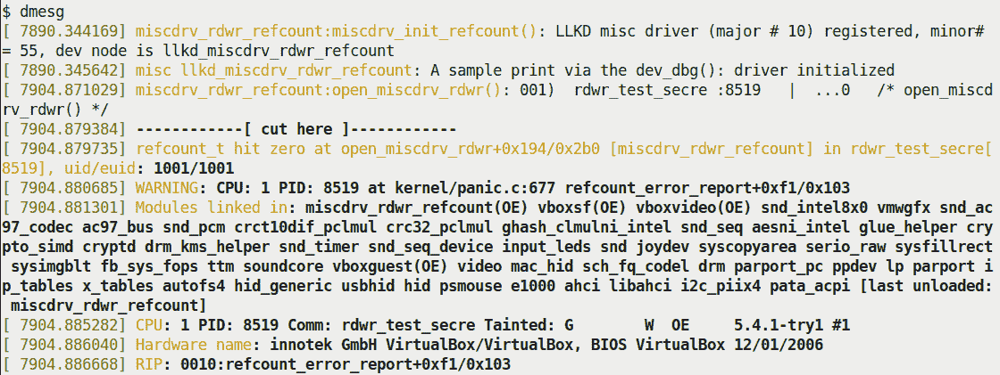
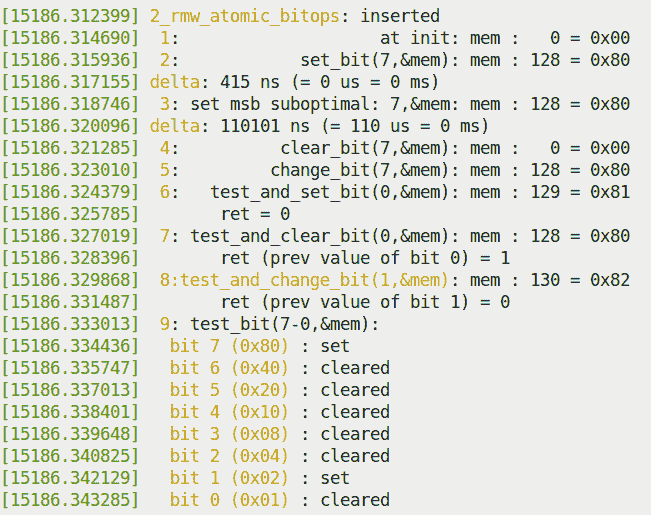
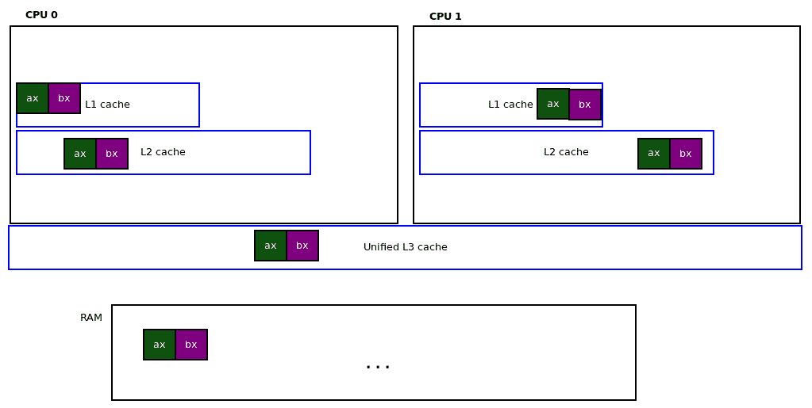
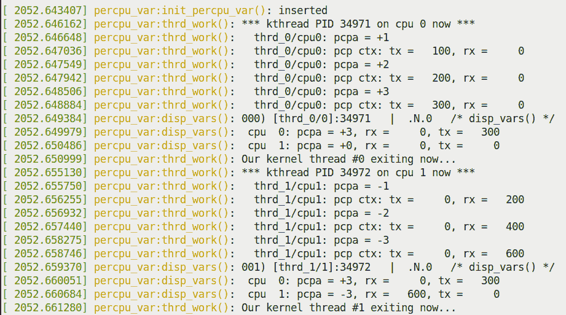
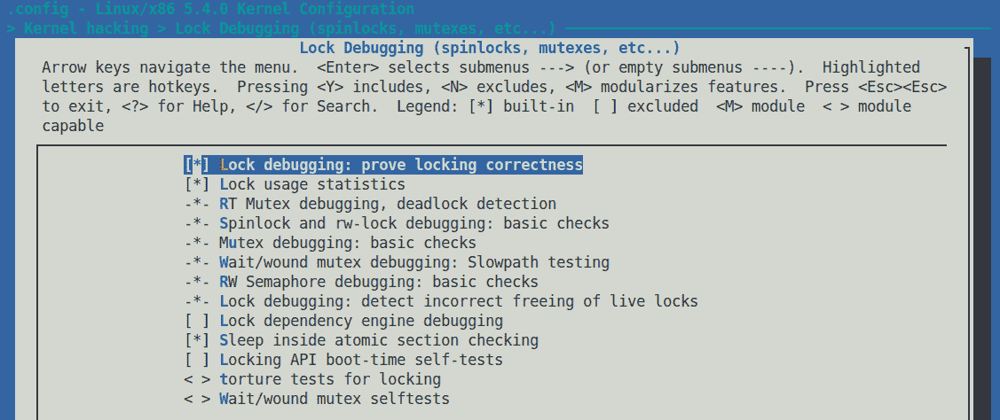
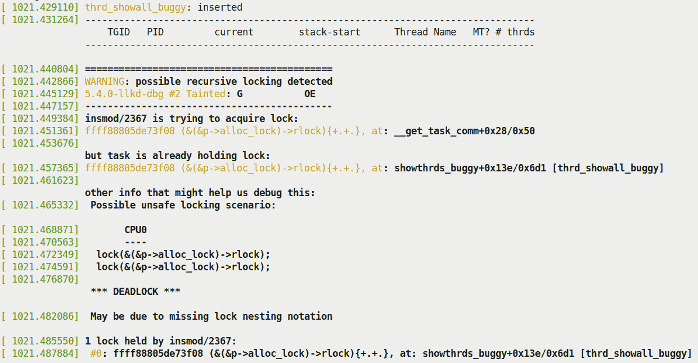

# 七、内核同步——第二部分

本章继续上一章的讨论，主题是内核同步和处理内核中的并发性。我建议，如果你还没有，先读上一章，然后继续读这一章。

在这里，我们将继续学习关于内核同步和在内核空间中处理并发性的广泛主题。和以前一样，该材料面向内核和/或设备驱动程序开发人员。在本章中，我们将涵盖以下内容:

*   使用 atomic_t 和 refcount_t 接口
*   使用 RMW 原子算符
*   使用读取器-写入器自旋锁
*   缓存效应和虚假共享
*   每 CPU 变量的无锁编程
*   锁定内核内的调试
*   记忆障碍-简介

# 使用 atomic_t 和 refcount_t 接口

在我们简单的演示杂项字符设备驱动程序的(`miscdrv_rdwr/miscdrv_rdwr.c` ) `open`方法(以及其他地方)中，我们定义并操作了两个静态全局整数，`ga`和`gb`:

```sh
static int ga, gb = 1;
[...]
ga++; gb--;
```

到目前为止，对您来说应该很明显的是，这个——我们对这些整数进行操作的地方——如果保持原样，是一个潜在的错误:它是共享的可写数据(处于共享状态)，因此*是一个关键部分，因此需要针对* *并发访问*进行保护。你懂的。所以，我们逐步改进了这一点。在前一章，了解了这个问题，在我们的`ch12/1_miscdrv_rdwr_mutexlock/1_miscdrv_rdwr_mutexlock.c`程序中，我们首先使用了一个*互斥锁*来保护临界区。后来，您了解到，使用*自旋锁*来保护像这样的非阻塞关键部分在性能上(远远)优于使用互斥锁；因此，在下一个驱动程序`ch12/2_miscdrv_rdwr_spinlock/2_miscdrv_rdwr_spinlock.c`中，我们使用了自旋锁来代替:

```sh
spin_lock(&lock1);
ga++; gb--;
spin_unlock(&lock1);
```

很好，但是我们还可以做得更好！对全局整数进行操作在内核中非常常见(想想引用或资源计数器的递增和递减等等)，以至于内核提供了一类称为 **refcount** 和**原子整数运算符**或接口的运算符；这些都是非常特别的设计，以原子(安全和不可分割的)操作**只有整数**。

## 较新的 refcount_t 与较旧的 atomic_t 接口相比

在这个主题区域的开始，重要的是要提到这一点:从 4.11 内核开始，有一组更新更好的接口被命名为`refcount_t`API，用于内核空间对象的引用计数器。它极大地改善了内核的安全态势(通过改进了很多的**整数溢出** ( **IoF** )和**免费使用后** ( **UAF** )保护以及内存排序保证，这些都是旧的`atomic_t`API 所缺乏的)。像 Linux 上使用的其他几项安全技术一样，`refcount_t`接口起源于 PaX 团队的工作——https://pax.grsecurity.net/[(它被称为`PAX_REFCOUNT`)。](https://pax.grsecurity.net/)

话虽如此，现实情况是(在撰写本文时)旧的`atomic_t`接口仍然在内核和驱动程序中大量使用(它们正在慢慢转换，旧的`atomic_t`接口正在转移到新的`refcount_t`模型和 API 集)。因此，在本主题中，我们将两者都包括在内，指出不同之处，并在适用的情况下提及哪个`refcount_t`应用编程接口取代了`atomic_t`应用编程接口。将`refcount_t`接口视为(较旧的)`atomic_t`接口的变体，该接口专门用于引用计数。

`atomic_t`操作符和`refcount_t`操作符之间的一个关键区别在于，前者对有符号整数起作用，而后者本质上被设计成只对一个`unsigned int`量起作用；更具体地说，这一点很重要，它只在严格规定的范围内起作用:`1`到 **`UINT_MAX-1`** (或`[1..INT_MAX]`当`!CONFIG_REFCOUNT_FULL`)。内核有一个名为`CONFIG_REFCOUNT_FULL`的配置选项；如果设置，它将执行(更慢和更彻底的)“完全”引用计数验证。这有利于安全性，但可能会导致性能略微下降(典型的默认值是保持此配置关闭；我们的 x86_64 Ubuntu 来宾就是这种情况)。

试图将`refcount_t`变量设置为`0`或负值，或设置为`[U]INT_MAX`或以上，是不可能的；这有利于防止整数下溢/溢出问题，从而在许多情况下防止自由使用类错误！(嗯，也不是不可能；这会导致通过`WARN()`宏发出(嘈杂的)警告。)想一想，`refcount_t`变量的本意是*只用于内核对象引用计数，没有别的*。

由此可见，这确实是需要的行为；引用计数器必须从正值开始(当对象新实例化时通常为`1`)，每当代码获取或接受引用时递增(或相加)，每当代码在对象上放置或离开引用时递减(或相减)。您需要小心操作引用计数器(匹配您的获取和放置)，始终将其值保持在合法范围内。

非常不直观的是，至少对于通用的独立于 arch 的 refcount 实现来说，`refcount_t`API 是通过`atomic_t` API 集在内部实现的。例如，`refcount_set()`应用编程接口——自动将 refcount 的值设置为传递的参数——在内核中是这样实现的:

```sh
// include/linux/refcount.h
/**
 * refcount_set - set a refcount's value
 * @r: the refcount
 * @n: value to which the refcount will be set
 */
static inline void refcount_set(refcount_t *r, unsigned int n)
{
    atomic_set(&r->refs, n); 
}
```

这是一个薄薄的包装纸(我们将很快介绍)。这里显而易见的常见问题是:为什么要使用 refcount API？有几个原因:

*   计数器在`REFCOUNT_SATURATED`值饱和(默认设置为`UINT_MAX`)，并且一旦达到该值就不会移动。这一点至关重要:它避免了包装计数器，这可能会导致奇怪和虚假的 UAF 错误；这甚至被认为是一个关键的安全修复。
*   一些较新的 refcount APIs 确实提供了**内存排序**保证；特别是`refcount_t`API——与它们更老的`atomic_t`表亲相比——以及它们提供的内存排序保证在[https://www . kernel . org/doc/html/latest/core-API/refcount-vs-atomic . html # refcount-t-API-与 atomic-t 相比](https://www.kernel.org/doc/html/latest/core-api/refcount-vs-atomic.html#refcount-t-api-compared-to-atomic-t)中有明确的记录(如果您对低级别的细节感兴趣，请查看)。
*   此外，实现依赖于 arch 的 refcount 实现(当它们存在时；例如，x86 确实有，而 ARM 没有)可以不同于前面提到的通用版本。

What exactly is *memory ordering* and how does it affect us? The fact is, it's a complex topic and, unfortunately, the inner details on this are beyond the scope of this book. It's worth knowing the basics: I suggest you read up on the **Linux-Kernel Memory Model** (**LKMM**), which includes coverage on processor memory ordering and more. We refer you to good documentation on this here: *Explanation of the Linux-Kernel Memory Model* ([https://github.com/torvalds/linux/blob/master/tools/memory-model/Documentation/explanation.txt](https://github.com/torvalds/linux/blob/master/tools/memory-model/Documentation/explanation.txt)).

## 更简单的原子 t 和 ref count t 接口

关于`atomic_t`接口，我们应该提到以下所有`atomic_t`构造仅用于 32 位整数；当然，随着 64 位整数现在变得普遍，64 位原子整数运算符也是可用的。通常，它们在语义上与 32 位的对应项相同，不同之处在于名称(`atomic_foo()`变成了`atomic64_foo()`)。所以 64 位原子整数的主要数据类型叫做`atomic64_t`(又名`atomic_long_t`)。另一方面，`refcount_t`接口同时满足 32 位和 64 位整数。

下表显示了如何并排声明和初始化`atomic_t`和`refcount_t`变量，以便您可以比较和对比它们:

|  | **(旧)原子 _t(仅 32 位)** | **(较新)refcount _ t(32 位和 64 位)** |
| 要包含的头文件 | `<linux/atomic.h>` | `<linux/refcount.h>` |
| 声明并初始化变量 | `static atomic_t gb = ATOMIC_INIT(1);` | `static refcount_t gb = REFCOUNT_INIT(1);` |

Table 17.1 – The older atomic_t versus the newer refcount_t interfaces for reference counting: header and init

内核中所有可用的`atomic_t`和`refcount_t`API 的完整集合相当大；为了使本节内容简单明了，我们仅在下表中列出一些更常用的(原子 32 位)和`refcount_t`接口(它们对通用`atomic_t`或`refcount_t`变量`v`进行操作):

| **操作** | **(旧)原子 _t 界面** | **(较新)refcount_t 接口[范围:0 至[U]INT_MAX]** |
| 要包含的头文件 | `<linux/atomic.h>` | `<linux/refcount.h>` |
| 声明并初始化变量 | `static atomic_t v = ATOMIC_INIT(1);` | `static refcount_t v = REFCOUNT_INIT(1);` |
| 自动读取`v`的当前值 | `int atomic_read(atomic_t *v)` | `unsigned int refcount_read(const refcount_t *v)` |
| 自动将`v`设置为数值`i` | `void atomic_set(atomic_t *v, i)` | `void refcount_set(refcount_t *v, int i)` |
| 自动将`v`值增加`1`
 | `void atomic_inc(atomic_t *v)` | `void refcount_inc(refcount_t *v)` |
| 将`v`值自动递减`1`
 | `void atomic_dec(atomic_t *v)` | `void refcount_dec(refcount_t *v)` |
| 自动将`i`的值加到`v`上 | `void atomic_add(i, atomic_t *v)` | `void refcount_add(int i, refcount_t *v)` |
| 从`v`中自动减去`i`的值 | `void atomic_sub(i, atomic_t *v)` | `void refcount_sub(int i, refcount_t *v)` |
| 自动将`i`的值加到`v`上并返回结果 | `int atomic_add_return(i, atomic_t *v)` | `bool refcount_add_not_zero(int i, refcount_t *v)`(不是精确匹配；将`i`添加到`v`，除非是`0`。) |
| 从`v`中自动减去`i`的值并返回结果 | `int atomic_sub_return(i, atomic_t *v)` | `bool refcount_sub_and_test(int i, refcount_t *r)`(不是精确匹配；从`v`中减去`i`并测试；如果结果重新计数为`0`，则返回`true`，否则返回`false`。) |

Table 17.2 – The older atomic_t versus the newer refcount_t interfaces for reference counting: APIs

您现在已经看到了几个`atomic_t`和`refcount_t`宏和 APIs 让我们快速查看几个在内核中使用它们的例子。

### 在内核代码库中使用 refcount_t 的示例

在我们关于内核线程的一个演示内核模块中(在`ch15/kthread_simple/kthread_simple.c`中)，我们创建了一个内核线程，然后使用`get_task_struct()`内联函数将内核线程的任务结构标记为正在使用。正如您现在可以猜到的那样，`get_task_struct()`例程通过`refcount_inc()` API 递增任务结构的引用计数器——一个名为`usage`的`refcount_t`变量:

```sh
// include/linux/sched/task.h
static inline struct task_struct *get_task_struct(struct task_struct *t) 
{
    refcount_inc(&t->usage);
    return t;
}
```

相反的例程`put_task_struct()`对参考计数器执行后续递减。其内部使用的实际例程`refcount_dec_and_test()`测试新的 refcount 值是否已降至`0`；如果是，则返回`true`，如果是这种情况，则表示任务结构没有被任何人引用。`__put_task_struct()`的召唤解放了它:

```sh
static inline void put_task_struct(struct task_struct *t) 
{
    if (refcount_dec_and_test(&t->usage))
        __put_task_struct(t);
}
```

内核中使用的重新计数 API 的另一个例子在`kernel/user.c`中找到(它有助于跟踪用户通过每用户结构声明的进程、文件等的数量):


Figure 7.1 – Screenshot showing the usage of the refcount_t interfaces in kernel/user.c Look up the `refcount_t` API interface documentation ([https://www.kernel.org/doc/html/latest/driver-api/basics.html#reference-counting](https://www.kernel.org/doc/html/latest/driver-api/basics.html#reference-counting)); `refcount_dec_and_lock_irqsave()` returns `true` and withholds the spinlock with interrupts disabled if able to decrement the reference counter to `0`, and `false` otherwise.

作为对您的练习，将我们早期的`ch16/2_miscdrv_rdwr_spinlock/miscdrv_rdwr_spinlock.c`驱动程序代码转换为使用 refcount 它具有整数`ga`和`gb`，当被读取或写入时，它们通过自旋锁受到保护。现在，让它们重新计数变量，并在处理它们时使用适当的`refcount_t`API。

小心点！不允许他们的值超出允许范围，`[0..[U]INT_MAX]`！(回想一下，完全重新计数验证的范围是`[1..UINT_MAX-1]`(`CONFIG_REFCOUNT_FULL`开启)和不完全验证时的`[1..INT_MAX]`(默认))。这样做通常会导致调用`WARN()`宏(图 7.1*中的演示代码不包含在我们的 GitHub 存储库中):*



Figure 7.2 – (Partial) screenshot showing the WARN() macro firing when we wrongly attempt to set a refcount_t variable to <= 0 The kernel has an interesting and useful test infrastructure called the **Linux Kernel Dump Test Module** (**LKDTM**); see `drivers/misc/lkdtm/refcount.c` for many test cases being run on the refcount interfaces, which you can learn from... FYI, you can also use LKDTM via the kernel's fault injection framework to test and evaluate the kernel's reaction to faulty scenarios (see the documentation here: *Provoking crashes with Linux Kernel Dump Test Module (LKDTM)* – [https://www.kernel.org/doc/html/latest/fault-injection/provoke-crashes.html#provoking-crashes-with-linux-kernel-dump-test-module-lkdtm](https://www.kernel.org/doc/html/latest/fault-injection/provoke-crashes.html#provoking-crashes-with-linux-kernel-dump-test-module-lkdtm)).

到目前为止涵盖的原子接口都是在 32 位整数上运行的；在 64 位上呢？接下来就是这样。

## 64 位原子整数运算符

如本主题开头所述，我们到目前为止所处理的`atomic_t`整数运算符集合都是在传统的 32 位整数上运行的(这个讨论不适用于较新的`refcount_t`接口；无论如何，它们对 32 位和 64 位的量都起作用)。显然，随着 64 位系统成为现在的常态而不是例外，内核社区为 64 位整数提供了一组相同的原子整数运算符。区别如下:

*   将 64 位原子整数声明为类型为`atomic64_t`(即`atomic_long_t`)的变量。
*   对于所有操作员，使用`atomic64_`前缀代替`atomic_`前缀。

举以下例子:

*   用`ATOMIC64_INIT()`代替`ATOMIC_INIT()`。
*   用`atomic64_read()`代替`atomic_read()`。
*   用`atomic64_dec_if_positive()`代替`atomic64_dec_if_positive()`。

Recent C and C++ language standards – C11 and C++11 – provide an atomic operations library that helps developers implement atomicity in an easier fashion due to the implicit language support; we won't delve into this aspect here. A reference can be found here (C11 also has pretty much the same equivalents): [https://en.cppreference.com/w/c/atomic](https://en.cppreference.com/w/c/atomic).

请注意，所有这些例程——32 位和 64 位原子`_operators`——都是**独立的**。值得重复的一个要点是，对原子整数执行的任何和所有操作都必须通过将变量声明为`atomic_t`并通过提供的方法来完成。这包括初始化，甚至是(整数)读取操作。

就内部实现而言，`foo()`原子整数运算符通常是一个宏，它会变成一个内联函数，而内联函数又会调用特定于 arch 的`arch_foo()`函数。像往常一样，浏览关于原子操作符的官方内核文档总是一个好主意(在内核源代码树中，它在这里:`Documentation/atomic_t.txt`；前往[https://www.kernel.org/doc/Documentation/atomic_t.txt](https://www.kernel.org/doc/Documentation/atomic_t.txt)。它将众多的原子整数 API 巧妙地归类到不同的集合中。仅供参考，arch 特有的*内存排序问题*确实会影响内部实现。在这里，我们将不深究其内部。如果感兴趣，请参考[官方内核文档网站上的本页，网址为 https://www . kernel . org/doc/html/v 4 . 16/core-API/ref count-vs-atomic . html # ref count-t-API-对比 atomic-t](https://www.kernel.org/doc/html/v4.16/core-api/refcount-vs-atomic.html#refcount-t-api-compared-to-atomic-t) (另外，内存排序的细节超出了本书的范围；查看[的内核文档。](https://www.kernel.org/doc/Documentation/memory-barriers.txt)

我们还没有尝试在这里展示所有的原子和 refcount APIs(这真的没有必要)；官方内核文档介绍了它:

*   `atomic_t`界面:
    *   S *原子和位掩码操作的语义和行为*([https://www . kernel . org/doc/html/v 5 . 4/core-API/Atomic _ ops . html #原子和位掩码操作的语义和行为](https://www.kernel.org/doc/html/v5.4/core-api/atomic_ops.html#semantics-and-behavior-of-atomic-and-bitmask-operations))
    *   API ref:Atomics([https://www . kernel . org/doc/html/latest/driver-API/basic . html # Atomics](https://www.kernel.org/doc/html/latest/driver-api/basics.html#atomics))

*   (较新)`refcount_t`内核对象引用计数接口:
    *   `refcount_t` API 对比`atomic_t`([https://www . kernel . org/doc/html/latest/core-API/refcount-vs-atomic . html # refcount-t-API-对比 atomic-t](https://www.kernel.org/doc/html/latest/core-api/refcount-vs-atomic.html#refcount-t-api-compared-to-atomic-t) )
    *   API 引用:引用计数([https://www . kernel . org/doc/html/latest/driver-API/basic . html #引用-计数](https://www.kernel.org/doc/html/latest/driver-api/basics.html#reference-counting))

让我们继续讨论在处理驱动程序时典型构造的用法–**读取修改写入** ( **RMW** )。继续读！

# 使用 RMW 原子算符

还有一组更高级的原子操作符叫做 RMW API。它的许多用途(我们将在下一节中列出)包括对位执行原子 RMW 操作，换句话说，原子地(安全地、不可分割地)执行位操作。作为在设备或外设上操作的设备驱动程序作者*注册*，这确实是你会发现自己正在使用的东西。

The material in this section assumes you have at least a basic understanding of accessing peripheral device (chip) memory and registers; we have covered this in detail in [Chapter 3](3.html), *Working with Hardware I/O Memory*. Please ensure you understand it before moving further.

通常，您需要对寄存器执行位操作(按位`AND &`和按位`OR |`是最常见的运算符)；这样做是为了修改其值，设置和/或清除其中的一些位。问题是，仅仅执行一些 C 操作来查询或设置设备寄存器是不够的。不，先生:不要忘记并发问题！请继续阅读完整的故事。

## RMW 原子操作–在设备寄存器上操作

让我们先快速复习一些基础知识:一个字节由 8 位组成，编号从位`0`、**最低有效位** ( **LSB** )到位`7`、**最高有效位** ( **MSB** )。(这实际上被正式定义为`include/linux/bits.h`中的`BITS_PER_BYTE`宏，还有一些其他有趣的定义。)

一个**寄存器**基本上是外围设备内的一小块内存；通常，其大小(寄存器位宽)为 8、16 或 32 位之一。器件寄存器提供控制、状态和其他信息，通常是可编程的。事实上，这很大程度上是您作为驱动程序作者将要做的事情——对设备寄存器进行适当的编程，让设备做一些事情，并对其进行查询。

为了充实这一讨论，让我们考虑一个假设的器件，它有两个寄存器:一个状态寄存器和一个控制寄存器，每个 8 位宽。(在现实世界中，每个设备或芯片都有一个*数据表*，它将提供芯片和寄存器级硬件的详细规格；这成为驱动程序作者的必要文档)。硬件人员通常以这样一种方式设计设备，即几个寄存器按顺序组合在一块更大的内存中；这叫做注册银行业务。通过获得第一个寄存器的基址和后面每个寄存器的偏移量，可以很容易地寻址任何给定的寄存器(这里，我们不会深入研究寄存器是如何“映射”到 Linux 等操作系统上的虚拟地址空间的)。例如，(纯粹假设的)寄存器可以在头文件中这样描述:

```sh
#define REG_BASE        0x5a00
#define STATUS_REG      (REG_BASE+0x0)
#define CTRL_REG        (REG_BASE+0x1)
```

现在，假设为了打开我们虚构的设备，数据表通知我们可以通过将控制寄存器的位`7`(MSB)设置为`1`来实现。每个驱动程序作者都会很快了解到，修改寄存器有一个神圣的顺序:

1.  **将**寄存器的当前值读入临时变量。
2.  **将**变量修改为所需值。
3.  **将**变量写回寄存器。

这就是常说的**RMW**T2 序列；太好了，我们这样写(伪)代码:

```sh
turn_on_dev()
{
    u8 tmp;

    tmp = ioread8(CTRL_REG);  /* read: current register value into tmp */
    tmp |= 0x80;              /* modify: set bit 7 (MSB) */
    iowrite8(tmp, CTRL_REG);  /* write: new tmp value into register */
}
```

(仅供参考，Linux**MMIO**–**内存映射 I/O**–上使用的实际例程是`ioread[8|16|32]()`和`iowrite[8|16|32]()`。)

这里有一个重点:*这还不够好*；原因是**并发，数据赛跑！**想一想:一个寄存器(包括 CPU 和设备寄存器)其实就是一个*全局共享可写内存位置*；因此，访问它*构成了一个关键部分*，你必须小心防止并发访问！该有多容易；我们可以使用自旋锁(至少目前是这样)。修改前面的伪代码以在关键部分——RMW 序列中插入`spin_[un]lock()`API 是微不足道的。

然而，在处理整数等小数量时，有一种更好的方法来实现数据安全；我们已经介绍过了:*原子操作符*！然而，Linux 更进一步，为以下两者提供了一组原子 API:

*   **原子非 RMW 操作**(我们之前在*中看到的使用原子 _t 和 refcount_t 接口*的操作)
*   **原子 RMW 作战**；这些操作符包括几种类型的操作符，可以分为几个不同的类别:算术、按位、交换(交换)、引用计数、杂项和障碍

我们不要重新发明轮子；内核文档([https://www.kernel.org/doc/Documentation/atomic_t.txt](https://www.kernel.org/doc/Documentation/atomic_t.txt))包含了所有需要的信息。我们将直接引用`Documentation/atomic_t.txt`内核代码库，只显示本文的相关部分如下:

```sh
// Documentation/atomic_t.txt
[ ... ]
Non-RMW ops:
  atomic_read(), atomic_set()
  atomic_read_acquire(), atomic_set_release()

RMW atomic operations:

Arithmetic:
  atomic_{add,sub,inc,dec}()
  atomic_{add,sub,inc,dec}_return{,_relaxed,_acquire,_release}()
  atomic_fetch_{add,sub,inc,dec}{,_relaxed,_acquire,_release}()

Bitwise:
  atomic_{and,or,xor,andnot}()
  atomic_fetch_{and,or,xor,andnot}{,_relaxed,_acquire,_release}()

Swap:
  atomic_xchg{,_relaxed,_acquire,_release}()
  atomic_cmpxchg{,_relaxed,_acquire,_release}()
  atomic_try_cmpxchg{,_relaxed,_acquire,_release}()

Reference count (but please see refcount_t):
  atomic_add_unless(), atomic_inc_not_zero()
  atomic_sub_and_test(), atomic_dec_and_test()

Misc:
  atomic_inc_and_test(), atomic_add_negative()
  atomic_dec_unless_positive(), atomic_inc_unless_negative()
[ ... ]
```

好；现在，您已经了解了这些 RMW(和非 RMW)运算符，让我们开始实际操作——接下来，我们将了解如何使用 RMW 运算符进行位操作。

### 使用 RMW 逐位运算符

这里，我们将重点关注使用 RMW 按位运算符；我们将让您来探索其他的(参考提到的内核文档)。因此，让我们再次思考如何更有效地编码我们的伪代码示例。我们可以使用`set_bit()`应用编程接口设置(至`1`)任何寄存器或存储器项目中的任何给定位:

```sh
void set_bit(unsigned int nr, volatile unsigned long *p);
```

这自动地——安全地和不可分割地——将`p`的第`nr`位设置为`1`。(实际情况是，设备寄存器(可能还有设备内存)被映射到内核虚拟地址空间，因此看起来就像是内存位置一样可见——比如这里的地址`p`。这被称为 MMIO，是驱动程序作者映射和使用设备内存的常用方式。)

因此，有了 RMW 原子操作符，我们可以用一行代码安全地实现我们之前(错误地)尝试的目标——打开我们(虚构的)设备:

```sh
set_bit(7, CTRL_REG);
```

下表总结了常见的 RMW 逐位原子 API:

| **RMW 逐位原子 API** | comment |
| `void set_bit(unsigned int nr, volatile unsigned long *p);` | 自动设置(设置为`1`)T2 的第`nr`位。 |
| `void clear_bit(unsigned int nr, volatile unsigned long *p)` | 自动清除(设置为`0`)第`nr`位的`p`。 |
| `void change_bit(unsigned int nr, volatile unsigned long *p)` | 自动切换`p`的第`nr`位。 |
| *以下应用编程接口返回被操作位的前一个值(nr)* |  |
| `int test_and_set_bit(unsigned int nr, volatile unsigned long *p)` | 自动设置`p`返回前一个值的第`nr`位(内核 API 文档位于[https://www . kernel . org/doc/html docs/kernel-API/API-测试和设置位. html](https://www.kernel.org/doc/htmldocs/kernel-api/API-test-and-set-bit.html) )。 |
| `int test_and_clear_bit(unsigned int nr, volatile unsigned long *p)` | 自动清除`p`的第`nr`位，返回前一个值。 |
| `int test_and_change_bit(unsigned int nr, volatile unsigned long *p)` | 自动切换`p`的第`nr`位，返回前一个值。 |

Table 17.3 – Common RMW bitwise atomic APIs Careful: these atomic APIs are not just atomic with respect to the CPU core they're running upon, but now with respect to all/other cores. In practice, this implies that if you're performing atomic operations in parallel on multiple CPUs, that is, if they (can) race, then it's a critical section and you must protect it with a lock (typically a spinlock)!

尝试一些 RMW 原子 API 将有助于建立你使用它们的信心；我们将在接下来的章节中介绍。

### 使用按位原子运算符–示例

让我们来看看一个快速内核模块，它演示了 Linux 内核的 RMW 原子位操作符(`ch13/1_rmw_atomic_bitops`)的用法。你应该意识到这些操作员可以在*任何内存*上工作，无论是(中央处理器或设备)寄存器还是内存；在这里，我们对示例 LKM 中的一个简单的静态全局变量(名为`mem`)进行操作。很简单；让我们来看看:

```sh
// ch13/1_rmw_atomic_bitops/rmw_atomic_bitops.c
[ ... ]
#include <linux/spinlock.h>
#include <linux/atomic.h>
#include <linux/bitops.h>
#include "../../convenient.h"
[ ... ]
static unsigned long mem;
static u64 t1, t2; 
static int MSB = BITS_PER_BYTE - 1;
DEFINE_SPINLOCK(slock);
```

我们包括所需的头，并声明和初始化一些全局变量(注意我们的`MSB`变量如何使用`BIT_PER_BYTE`)。我们使用一个简单的宏`SHOW()`，用 printk 显示格式化的输出。`init`代码路径是实际工作完成的地方:

```sh
[ ... ]
#define SHOW(n, p, msg) do {                                   \
    pr_info("%2d:%27s: mem : %3ld = 0x%02lx\n", n, msg, p, p); \
} while (0)
[ ... ]
static int __init atomic_rmw_bitops_init(void)
{
    int i = 1, ret;

    pr_info("%s: inserted\n", OURMODNAME);
    SHOW(i++, mem, "at init");

    setmsb_optimal(i++);
    setmsb_suboptimal(i++);

    clear_bit(MSB, &mem);
    SHOW(i++, mem, "clear_bit(7,&mem)");

    change_bit(MSB, &mem);
    SHOW(i++, mem, "change_bit(7,&mem)");

    ret = test_and_set_bit(0, &mem);
    SHOW(i++, mem, "test_and_set_bit(0,&mem)");
    pr_info(" ret = %d\n", ret);

    ret = test_and_clear_bit(0, &mem);
    SHOW(i++, mem, "test_and_clear_bit(0,&mem)");
    pr_info(" ret (prev value of bit 0) = %d\n", ret);

    ret = test_and_change_bit(1, &mem);
    SHOW(i++, mem, "test_and_change_bit(1,&mem)");
    pr_info(" ret (prev value of bit 1) = %d\n", ret);

    pr_info("%2d: test_bit(%d-0,&mem):\n", i, MSB);
    for (i = MSB; i >= 0; i--)
        pr_info(" bit %d (0x%02lx) : %s\n", i, BIT(i), test_bit(i, &mem)?"set":"cleared");

    return 0; /* success */
}
```

我们在这里使用的 RMW 原子操作符以粗体突出显示。这个演示的一个关键部分是展示使用 RMW 逐位原子操作符不仅比使用传统方法容易得多，而且也快得多，在传统方法中，我们在自旋锁的范围内手动执行 RMW 操作。以下是这两种方法的两个功能:

```sh
/* Set the MSB; optimally, with the set_bit() RMW atomic API */
static inline void setmsb_optimal(int i)
{
    t1 = ktime_get_real_ns();
    set_bit(MSB, &mem);
    t2 = ktime_get_real_ns();
    SHOW(i, mem, "set_bit(7,&mem)");
    SHOW_DELTA(t2, t1);
}
/* Set the MSB; the traditional way, using a spinlock to protect the RMW
 * critical section */
static inline void setmsb_suboptimal(int i)
{
    u8 tmp;

    t1 = ktime_get_real_ns();
    spin_lock(&slock);
 /* critical section: RMW : read, modify, write */
    tmp = mem;
    tmp |= 0x80; // 0x80 = 1000 0000 binary
    mem = tmp;
    spin_unlock(&slock);
    t2 = ktime_get_real_ns();

    SHOW(i, mem, "set msb suboptimal: 7,&mem");
    SHOW_DELTA(t2, t1);
}
```

我们在`init`方法中很早就调用了这些函数；请注意，我们(通过`ktime_get_real_ns()`例程)获取时间戳，并通过我们的`SHOW_DELTA()`宏(在我们的`convenient.h`标题中定义)显示时间。好的，这是输出:



Figure 7.3 – Screenshot of output from our ch13/1_rmw_atomic_bitops LKM, showing off some of the atomic RMW operators at work

(我在 x86_64 Ubuntu 20.04 来宾虚拟机上运行了这个演示 LKM。)现代方法——通过`set_bit()` RMW 原子逐位 API——在这个示例运行中，执行时间仅为 415 纳秒；传统方法要慢 265 倍！代码(通过`set_bit()`)也简单多了...

关于原子按位运算符的一点相关说明，下面的部分非常简要地介绍了内核中用于搜索位掩码的高效 APIs 事实证明，这是内核中相当常见的操作。

## 高效搜索位掩码

有几种算法依赖于对位掩码进行真正快速的搜索；您在配套指南 *Linux 内核编程-* *第 10 章*、*CPU 调度器–第 1 部分*、*第 11 章*、*CPU 调度器–第 2 部分*中了解到的几种调度算法(如`SCHED_FIFO`和`SCHED_RR`)内部经常需要这样做。高效地实现这一点变得很重要(尤其是对于操作系统级的性能敏感代码路径)。因此，内核提供了一些 API 来扫描给定的位掩码(这些原型可以在`include/asm-generic/bitops/find.h`找到):

*   `unsigned long find_first_bit(const unsigned long *addr, unsigned long size)`:查找存储区域中的第一个设置位；返回第一个设置位的位数，否则(没有设置位)返回`@size`。
*   `unsigned long find_first_zero_bit(const unsigned long *addr, unsigned long size)`:查找存储区域中第一个被清除的位；返回第一个清除位的位数，否则(没有位被清除)返回`@size`。
*   其他套路包括`find_next_bit()`、`find_next_and_bit()`、`find_last_bit()`。

浏览<`linux/bitops.h>`标题还会发现其他非常有趣的宏，例如`for_each_{clear,set}_bit{_from}()`。

# 使用读取器-写入器自旋锁

可视化一段内核(或驱动程序)代码，其中正在搜索一个大的、全局的、双向链接的循环列表(有几千个节点)。现在，由于数据结构是全局的(共享的和可写的)，访问它构成了需要保护的关键部分。

假设搜索列表是一个非阻塞操作，您通常会使用自旋锁来保护关键部分。一个天真的方法可能会建议根本不使用锁，因为我们只是读取列表中的数据，而不是更新它。但是，当然(如您所知)，即使是对共享可写数据的读取也必须受到保护，以防止无意中同时发生的写入，从而导致脏读或破读。

因此，我们得出结论，我们需要自旋锁；我们想象伪代码可能是这样的:

```sh
spin_lock(mylist_lock);
for (p = &listhead; (p = next_node(p)) != &listhead; ) {
    << ... search for something ... 
         found? break out ... >>
}
spin_unlock(mylist_lock);
```

那么，有什么问题吗？当然是表演！想象一下，多核系统上的几个线程或多或少地同时出现在这个代码片段上；每个线程都将尝试获取 spinlock，但只有一个 winner 线程会获得它，遍历整个列表，然后执行解锁，允许下一个线程继续。换句话说，不出所料，执行现在*连载*，大大减缓了事情的发展。但是没办法；或者可以？

进入**读写器自旋锁**。使用这种锁定结构，要求所有对受保护数据执行读取的线程都需要一个**读锁**，而任何需要对列表进行写访问的线程都需要一个**独占写锁**。只要当前没有写锁在运行，任何发出请求的线程都会立即被授予读锁。实际上，这种构造*允许所有读者同时访问数据，这意味着实际上根本没有真正的锁定*。这个没问题，只要有读者就行。当一个写线程出现时，它会请求写锁。现在，正常的锁定语义适用:编写器**将不得不等待**所有读者解锁。一旦发生这种情况，写入程序将获得独占写锁并继续。所以现在，如果任何读者或作者试图访问，他们将被迫等待作家的解锁。

Thus, for those situations where the access pattern to data is such that reads are performed very often and writes are rare, and the critical section is a fairly long one, the reader-writer spinlock is a performance-enhancing one.

## 读写器自旋锁接口

使用了自旋锁之后，使用读取器-写入器变体就变得简单了；锁数据类型抽象为`rwlock_t`结构(代替`spinlock_t`)，在 API 名称方面，简单替换`read`或`write`代替`spin`:

```sh
#include <linux/rwlock.h>
rwlock_t mylist_lock;
```

读写器自旋锁最基本的 API 如下:

```sh
void read_lock(rwlock_t *lock);
void write_lock(rwlock_t *lock);
```

举个例子，内核的`tty`层有代码来处理一个**安全注意键**(**SAK**)；SAK 是一项安全功能，通过杀死与 TTY 设备相关的所有进程来防止特洛伊木马类型的凭据黑客攻击。这将在用户按下 SAK([https://www.kernel.org/doc/html/latest/security/sak.html](https://www.kernel.org/doc/html/latest/security/sak.html))时发生。当这种情况实际发生时(也就是说，当用户按下 SAK 时，默认映射到`Alt-SysRq-k`序列)，在其代码路径内，它必须迭代所有任务，杀死整个会话和所有打开 TTY 设备的线程。要做到这一点，在阅读模式下，必须有一个叫做`tasklist_lock`的读者-作家自旋锁。(截断的)相关代码如下，突出显示`tasklist_lock`上的`read_[un]lock()`:

```sh
// drivers/tty/tty_io.c
void __do_SAK(struct tty_struct *tty)
{
    [...]
    read_lock(&tasklist_lock);
    /* Kill the entire session */
    do_each_pid_task(session, PIDTYPE_SID, p) {
        tty_notice(tty, "SAK: killed process %d (%s): by session\n", task_pid_nr(p), p->comm);
        group_send_sig_info(SIGKILL, SEND_SIG_PRIV, p, PIDTYPE_SID);
    } while_each_pid_task(session, PIDTYPE_SID, p);
    [...]
    /* Now kill any processes that happen to have the tty open */
    do_each_thread(g, p) {
        [...]
    } while_each_thread(g, p);
    read_unlock(&tasklist_lock);
```

另外，在配套指南 *Linux 内核编程-第 6 章，内核内部要素*部分*进程和线程* *迭代任务列表*中，我们做了一些类似的事情:我们编写了一个内核模块([https://github . com/PacktPublishing/Linux-内核-编程/blob/master/ch6/foreach/thrd _ showall/thrd _ showall . c](https://github.com/PacktPublishing/Linux-Kernel-Programming/blob/master/ch6/foreach/thrd_showall/thrd_showall.c))迭代任务列表中的所有线程，喷涌那么，既然我们已经理解了关于并发性的交易，难道我们不应该使用这个锁–`tasklist_lock`–保护任务列表的读-写自旋锁吗？是的，但是没用(`insmod(8)`失败并显示消息`thrd_showall: Unknown symbol tasklist_lock (err -2)`)。原因当然是这个`tasklist_lock`变量是*而不是*导出的，因此对我们的内核模块不可用。

作为内核代码库中读写自旋锁的另一个例子，`ext4`文件系统在处理其范围状态树时使用了一个。我们不打算在这里深究细节；我们将简单地提到这样一个事实，读-写自旋锁(在索引节点结构中，`inode->i_es_lock`)在这里被大量使用，以保护扩展区状态树免受数据竞争的影响(`fs/ext4/extents_status.c`)。

内核源代码树中有很多这样的例子；网络堆栈中的许多地方包括 ping 代码(`net/ipv4/ping.c`)使用`rwlock_t`、路由表查找、邻居、PPP 代码、文件系统等等。

就像普通的自旋锁一样，我们有读写自旋锁 API 的典型变体:`{read,write}_lock_irq{save}()`与相应的`{read,write}_unlock_irq{restore}()`以及`{read,write}_{un}lock_bh()`接口配对。请注意，即使读取 IRQ 锁也会禁用内核抢占。

## 一句警告

读取器-写入器自旋锁确实存在问题。一个典型的问题是，不幸的是，**作者在封锁几个读者时会饿死**。想想看:假设目前有三个读者线程拥有读者-作者锁。现在，一个作家想要锁。它必须等到所有三个读取器执行解锁。但如果在此期间，有更多的读者出现(这是完全可能的)呢？这对作家来说是一场灾难，他现在不得不等待更长的时间——实际上是挨饿。(仔细检测或分析所涉及的代码路径可能是必要的，以弄清楚是否确实如此。)

不仅如此，*缓存效应*——被称为缓存乒乓——在不同 CPU 内核上的多个读取器线程并行读取相同的共享状态时(同时持有读取器-写入器锁)可以而且确实经常发生；我们实际上在*缓存效果和虚假共享*部分讨论了这一点。关于自旋锁的内核文档(T4)说的也差不多。这里直接引用一下:“*注意！读写锁比简单的自旋锁需要更多的原子内存操作。除非读者批评部分很长，否则你最好用自旋锁关闭事实上，内核社区正在努力尽可能地移除读写自旋锁，将它们转移到更高级的无锁技术上(例如 **RCU -读取拷贝更新**，一种高级的无锁技术)。因此，无端使用读者-作者自旋锁是不明智的。*

The neat and simple kernel documentation on the usage of spinlocks (written by Linus Torvalds himself), which is well worth reading, is available here: [https://www.kernel.org/doc/Documentation/locking/spinlocks.txt](https://www.kernel.org/doc/Documentation/locking/spinlocks.txt).

## 读写器信号量

我们前面提到了信号量对象([第 6 章](6.html)、*内核同步–第 1 部分*，在*信号量和互斥量*部分)，将其与互斥量进行了对比。在这里，您明白了简单地使用互斥体更好。在这里，我们指出，在内核中，正如存在读-写自旋锁一样，也存在*读-写信号量*。用例和语义类似于读写器 spinlock。相关宏/API 为(在`<linux/rwsem.h>` ) `{down,up}_{read,write}_{trylock,killable}()`内。`struct mm_struct`结构中的一个常见例子(它本身也在任务结构中)是其中一个成员是读写器信号量:`struct rw_semaphore mmap_sem;`。

结束这个讨论，我们将只提到内核中的其他一些相关的同步机制。用户空间应用开发中大量使用的同步机制(我们特别想到了 Linux 用户空间中的 Pthreads 框架)是**条件变量** ( **CV** )。简而言之，它为两个或多个线程提供了基于数据项的值或某些特定状态相互同步的能力。它在 Linux 内核中的等价物叫做*完成机制*。请在[https://www . kernel . org/doc/html/latest/scheduler/completion . html # completes-等待完成-barrier-API](https://www.kernel.org/doc/html/latest/scheduler/completion.html#completions-wait-for-completion-barrier-apis)的内核文档中找到其用法的详细信息。

*序列锁*用于大部分写入情况(与读写自旋锁/信号量锁相反，后者适用于大部分读取情况)，其中写入远远超过受保护变量的读取。可以想象，这并不是一件很常见的事情；使用序列锁的一个很好的例子是`jiffies_64`全局的更新。

For the curious, the `jiffies_64` global's update code begins here: `kernel/time/tick-sched.c:tick_do_update_jiffies64()`. This function figures out whether an update to jiffies is required, and if so, calls `do_timer(++ticks);` to actually update it. All the while, the `write_seq[un]lock(&jiffies_lock);` APIs provide protection over the mostly write-critical section.

# 缓存效应和虚假共享

现代处理器利用其内部的多级并行高速缓存，以便在处理内存时提供非常显著的加速(我们在配套指南 *Linux 内核编程-* *第 8 章**模块作者的内核内存分配–第 1 部分**分配平板内存*一节中简要介绍了这一点)。我们意识到现代的 CPU 确实是*而不是*直接读写 RAM 不，当软件指示从某个地址开始读取一个字节的内存时，CPU 实际上读取了几个字节——从起始地址到所有 CPU 缓存(比如 L1、L2 和 L3:级别 1、2 和 3)的整个**缓存行**字节(通常为 64 字节)。这样，访问顺序内存的接下来几个元素会导致巨大的加速，因为它首先在缓存中被检查(首先在 L1，然后是 L2，然后是 L3，缓存命中变得可能)。它(快得多)的原因很简单:访问 CPU 缓存通常需要一到几(个位数)纳秒，而访问 RAM 可能需要 50 到 100 纳秒(当然，这取决于所讨论的硬件系统和您愿意支付的金额！).

软件开发人员通过做以下事情来利用这种现象:

*   将数据结构的重要成员放在一起(希望在单个缓存行内)并放在结构的顶部
*   填充一个结构成员，这样我们就不会从缓存线上掉下来(同样，这些要点已经在配套指南 *Linux 内核编程-* *第 8 章*、*模块作者的内核内存分配–第 1 部分*、在*数据结构–一些设计技巧*部分中介绍过)

然而，风险是存在的，事情确实会出错。例如，考虑两个这样声明的变量:`u16 ax = 1, bx = 2;` ( `u16`表示无符号的 16 位整数值)。

现在，由于它们已经被声明为彼此相邻，它们很可能会在运行时占用相同的 CPU 缓存行。为了了解问题所在，让我们举个例子:考虑一个具有两个 CPU 内核的多核系统，每个内核都有两个 CPU 缓存，L1 和 L2，以及一个通用或统一的 L3 缓存。现在，一个线程 *T1* 正在处理变量`ax`，另一个线程 *T2* 同时(在另一个中央处理器内核上)处理变量`bx`。所以，想想看:当运行在 CPU `0`上的线程 *T1* 从主内存(RAM)访问`ax`时，它的 CPU 缓存将被填充为`ax`和`bx`的当前值(因为它们属于同一个缓存行！).类似地，当运行在例如中央处理器`1`上的线程 *T2* 从内存访问`bx`时，其中央处理器缓存也将填充两个变量的当前值。*图 7.4* 概念性地描绘了这种情况:



Figure 7.4 – Conceptual depiction of the CPU cache memory when threads T1 and T2 work in parallel on two adjacent variables, each on a distinct one

目前还好；但是如果 *T1* 执行一个操作，比如说`ax ++`，同时 *T2* 执行`bx ++`呢？那又怎样？(顺便说一句，你可能会想:他们为什么不用锁？有趣的是，这与讨论完全无关；没有数据竞争，因为每个线程都在访问不同的变量。问题是它们在同一个中央处理器缓存行中。)

问题是:**缓存一致性**。处理器和/或操作系统以及处理器(这都是非常依赖内存的东西)必须保持缓存和内存彼此同步或一致。因此，在 *T1* 修改`ax`的时刻，CPU `0`的特定高速缓存线将不得不被无效，也就是说，CPU 高速缓存线的 CPU `0`高速缓存到 RAM 刷新将发生，以将 RAM 更新到新值，然后立即，RAM 到 CPU `1`高速缓存更新也必须发生，以保持一切一致！

但是缓存线也包含`bx`，并且，正如我们所说的，`bx`也被 *T2 在中央处理器`1`上修改了。*因此，大约在同一时间，中央处理器`1`高速缓存线将被刷新到具有新值`bx`的随机存取存储器，并随后被更新到中央处理器`0`的高速缓存(同时，统一的 L3 高速缓存也将被读取/更新)。可以想象，对这些变量的任何更新都会导致缓存和内存上的大量流量；它们会反弹。其实这就是常说的**缓存乒乓**！这种影响非常有害，会显著降低处理速度。这种现象被称为**虚假分享**。

识别虚假分享是最难的部分；我们必须寻找存在于共享缓存线上的变量，这些变量由不同的上下文(线程或其他任何东西)同时更新。

Interestingly, an earlier implementation of a key data structure in the memory management layer, `include/linux/mmzone.h:struct zone`, suffered from this very same false sharing issue: two spinlocks that were declared adjacent to each other! This has long been fixed (we briefly discussed *memory zones* in the companion guide *Linux Kernel Programming -* *Chapter 7*, *Memory Management Internals – Essentials*, in the *Physical RAM organization/zones* section).

如何修复这种虚假分享？简单:只需确保变量之间的间隔足够远，以保证它们*不共享同一个缓存行*(为此，通常在变量之间插入虚拟填充字节)。请务必参考*进一步阅读*部分中对虚假分享的引用。

# 每 CPU 变量的无锁编程

如您所知，当对共享的可写数据进行操作时，必须以某种方式保护关键部分。锁定可能是实现这种保护最常用的技术。不过，这并不全是乐观的，因为业绩可能会受到影响。想知道为什么，考虑几个类似于锁的东西:一个是漏斗，漏斗的主干足够宽，一次只能让一根线穿过，不能再多了。另一种是繁忙高速公路上的单一收费站或繁忙十字路口的红绿灯。这些类比有助于我们可视化和理解为什么锁定会导致瓶颈，在某些极端情况下会降低性能。更糟糕的是，这些不利影响在拥有几百个内核的高端多核系统上可能会成倍增加；实际上，锁定不能很好地扩展。

另一个问题是*锁争用*；获取特定锁的频率是多少？增加系统中锁的数量有利于降低两个或多个进程(或线程)之间对特定锁的争用。这叫**锁定熟练度**。然而，同样，这在很大程度上是不可扩展的:过了一段时间，在一个系统上拥有数千个锁(实际上是 Linux 内核的情况)并不是一个好消息——出现微妙死锁情况的机会会大大增加。

因此，存在许多挑战——性能问题、死锁、优先级反转风险、卷积(由于锁排序，快速代码路径可能需要等待第一个较慢的路径，该路径获得了较快路径也需要的锁)等等。以可扩展的方式发展内核，一个完整的层次进一步要求使用*无锁算法*及其在内核中的实现。这些导致了几种创新技术，其中包括每 CPU(五氯苯酚)数据、无锁数据结构(根据设计)和 RCU。

然而，在这本书里，我们选择只详细介绍每 CPU 作为一种无锁编程技术。关于 RCU 的细节(及其相关的无锁数据结构)超出了本书的范围。请参考本章的*进一步阅读*部分，了解关于 RCU 的一些有用的资源，它的含义，以及它在 Linux 内核中的用法。

## 每 CPU 变量

顾名思义，**每 CPU 变量**的工作原理是保存*变量的副本*，即分配给系统上每个(活动的)CPU 的有问题的数据项。实际上，我们通过避免线程之间的数据共享，摆脱了并发的问题区域，即关键部分。使用每 CPU 数据技术，由于每个 CPU 都引用自己的数据副本，因此在该处理器上运行的线程可以操作它，而不用担心争用。(这大致类似于局部变量；由于局部变量位于每个线程的私有堆栈上，它们不会在线程之间共享，因此没有关键部分，也不需要锁定。)在这里，也消除了对锁定的需求——使其成为*无锁定*技术！

所以，想想看:如果你运行在一个有四个活动的中央处理器内核的系统上，那么该系统上的每个中央处理器变量本质上是一个由四个元素组成的数组:元素`0`代表第一个中央处理器内核上的数据值，元素`1`代表第二个中央处理器内核上的数据值，依此类推。了解了这一点，您会意识到每 CPU 变量也大致类似于用户空间 Pthreads **线程本地存储** ( **TLS** )实现，其中每个线程自动获得一个标有`__thread`关键字的(TLS)变量的副本。在这里，对于每个 CPU 的变量，应该很明显:只对小数据项使用每个 CPU 的变量。这是因为每个中央处理器内核用一个实例来再现(复制)数据项(在具有几百个内核的高端系统上，开销确实会攀升)。我们在内核代码库中提到了一些每 CPU 使用的例子(在内核中的*每 CPU 使用部分)。*

现在，当使用每 CPU 变量时，您必须使用内核提供的助手方法(宏和 API)，并且不要试图直接访问它们(很像我们在 refcount 和 atomic 操作符中看到的)。

### 使用每个中央处理器

让我们通过将讨论分成两部分来接近每 CPU 数据的助手 API 和宏(方法)。首先，您将学习如何分配、初始化以及随后释放每个 CPU 的数据项。然后，你将学习如何使用它(读/写)。

#### 分配、初始化和释放每 CPU 变量

每个 CPU 的变量大致有两种类型:静态分配的和动态分配的。静态分配的每 CPU 变量是在编译时分配的，通常是通过以下宏之一:`DEFINE_PER_CPU`或`DECLARE_PER_CPU`。使用`DEFINE`可以分配和初始化变量。下面是一个分配单个整数作为每个 CPU 变量的例子:

```sh
#include <linux/percpu.h>
DEFINE_PER_CPU(int, pcpa);      // signature: DEFINE_PER_CPU(type, name)
```

现在，在一个有四个 CPU 内核的系统上，它在初始化时在概念上是这样的:


Figure 7.5 – Conceptual representation of a per-CPU data item on a system with four live CPUs

(实际实现当然比这个复杂不少；有关内部实现的更多信息，请参考本章*进一步阅读*部分。)

简而言之，在对时间敏感的代码路径上使用每 CPU 变量有利于性能增强，原因如下:

*   我们避免使用昂贵的、破坏性能的锁。
*   每 CPU 变量的访问和操作保证保留在一个特定的 CPU 内核上；这消除了昂贵的缓存效果，如缓存乒乓和错误共享(在*缓存效果和错误共享*部分中介绍)。

通过`alloc_percpu()`或`alloc_percpu_gfp()`包装宏可以实现动态分配每个 CPU 的数据，只需将对象的数据类型作为每个 CPU 进行分配，对于后者，还可以传递`gfp`分配标志:

```sh
alloc_percpu[_gfp](type [,gfp]);
```

底层的`__alloc_per_cpu[_gfp]()`例程通过`EXPORT_SYMBOL_GPL()`导出(因此只有当 LKM 在兼容 GPL 的许可下发布时才能使用)。

As you've learned, the resource-managed `devm_*()` API variants allow you (typically when writing drivers) to conveniently use these routines to allocate memory; the kernel will take care of freeing it, helping prevent leakage scenarios. The `devm_alloc_percpu(dev, type)` macro allows you to use this as a resource-managed version of `__alloc_percpu()`.

通过前面的例程分配的内存必须随后使用`void free_percpu(void __percpu *__pdata)`应用编程接口释放。

#### 对每 CPU 变量执行输入/输出(读和写)

当然，一个关键的问题是，如何才能访问(读取)和更新(写入)每个 CPU 的变量？内核为此提供了几个助手例程；让我们举一个简单的例子来理解。我们为每个 CPU 定义一个整数变量，在稍后的时间点，我们希望访问并打印它的当前值。您应该意识到，在每个 CPU 上，检索到的值将根据代码当前在上运行的 CPU 内核自动计算*；换句话说，如果下面的代码在内核`1`上运行，那么实际上`pcpa[1]`值被获取(它不是这样做的；这只是概念上的):*

```sh
DEFINE_PER_CPU(int, pcpa);
int val;
[ ... ]
val = get_cpu_var(pcpa);
pr_info("cpu0: pcpa = %+d\n", val);
put_cpu_var(pcpa);
```

这对`{get,put}_cpu_var()`宏允许我们安全地检索或修改给定的每 CPU 变量(其参数)的每 CPU 值。重要的是要理解`get_cpu_var()`和`put_cpu_var()`之间的代码(或等效代码)实际上是一个关键部分—一个原子上下文—*，其中内核抢占被禁用，任何类型的阻塞(或休眠)都不被允许*。如果你在这里做任何以任何方式阻塞(休眠)的事情，那就是一个内核错误。例如，看看如果您试图通过`get_cpu_var()` / `put_cpu_var()`宏对中的`vmalloc()`分配内存会发生什么:

```sh
void *p;
val = get_cpu_var(pcpa);
p = vmalloc(20000);
pr_info("cpu1: pcpa = %+d\n", val);
put_cpu_var(pcpa);
vfree(p);
[ ... ]

$ sudo insmod <whatever>.ko
$ dmesg
[ ... ]
BUG: sleeping function called from invalid context at mm/slab.h:421
[67641.443225] in_atomic(): 1, irqs_disabled(): 0, pid: 12085, name:
thrd_1/1
[ ... ]
$
```

(顺便说一下，像我们在临界区中做的那样调用`printk()`(或`pr_<foo>()`)包装器是可以的，因为它们是非阻塞的。)这里的问题是`vmalloc()`原料药可能是阻断药；它可能会休眠(我们在配套指南 *Linux 内核编程-* *第 9 章*、*模块作者的内核内存分配–第 2 部分*、*理解和使用内核 vmalloc() API* 一节中详细讨论过)，并且`get_cpu_var()` / `put_cpu_var()`对之间的代码必须是原子的和非阻塞的。

在内部，`get_cpu_var()`宏调用`preempt_disable()`，禁用内核抢占，`put_cpu_var()`通过调用`preempt_enable()`撤销这一操作。如前所述(在配套指南 *Linux 内核编程*关于*中央处理器调度*的章节中)，这可以嵌套，内核维护一个`preempt_count`变量来计算内核抢占实际上是被启用还是被禁用。

这一切的结果就是，你在使用`{get,put}_cpu_var()`宏的时候一定要仔细匹配(比如我们调用`get`宏两次，也一定要调用对应的`put`宏两次)。

`get_cpu_var()`是*左值*，因此可以操作；例如，要增加每 CPU `pcpa`变量，只需执行以下操作:

```sh
get_cpu_var(pcpa) ++;
put_cpu_var(pcpa);
```

您还可以(安全地)通过宏检索当前的每 CPU 值:

```sh
per_cpu(var, cpu);
```

因此，要检索系统上每个 CPU 核心的每 CPU `pcpa`变量，请使用以下命令:

```sh
for_each_online_cpu(i) {
 val = per_cpu(pcpa, i);
    pr_info(" cpu %2d: pcpa = %+d\n", i, val);
}
```

FYI, you can always use the `smp_processor_id()` macro to figure out which CPU core you're currently running upon; in fact, this is precisely how our `convenient.h:PRINT_CTX()` macro does it.

以类似的方式，内核提供例程来处理指向需要每个 CPU 的变量的指针，`{get,put}_cpu_ptr()`和`per_cpu_ptr()`宏。这些宏在处理每 CPU 数据结构时被大量使用(与简单的整数相反)；我们安全地检索指向我们当前运行的 CPU 结构的指针，并使用它(`per_cpu_ptr()`)。

### 每个中央处理器——一个示例内核模块

使用我们的每 CPU 示例演示内核模块的实践会话肯定会有助于使用这个强大的功能(这里的代码:`ch13/2_percpu`)。这里，我们定义并使用两个每 CPU 变量:

*   每 CPU 静态分配和初始化的整数
*   动态分配的每 CPU 数据结构

作为帮助演示每 CPU 变量的一种有趣的方式，让我们这样做:我们将安排我们的演示内核模块产生几个内核线程。我们称之为`thrd_0`和`thrd_1`。此外，一旦创建，我们将使用 CPU 掩码(和 API)来仿射 CPU `0`上的`thrd_0`内核线程和 CPU `1`上的`thrd_1`内核线程(因此，它们将被调度为仅在这些内核上运行；当然，我们必须在至少有两个 CPU 内核的 VM 上测试这段代码)。

下面的代码片段说明了我们如何定义和使用每 CPU 变量(我们省略了创建内核线程并设置其 CPU 相似性掩码的代码，因为它们与本章的内容无关；尽管如此，浏览完整的代码并尝试它还是很关键的！):

```sh
// ch13/2_percpu/percpu_var.c
[ ... ]
/*--- The per-cpu variables, an integer 'pcpa' and a data structure --- */
/* This per-cpu integer 'pcpa' is statically allocated and initialized to 0 */
DEFINE_PER_CPU(int, pcpa);

/* This per-cpu structure will be dynamically allocated via alloc_percpu() */
static struct drv_ctx {
    int tx, rx; /* here, as a demo, we just use these two members,
                   ignoring the rest */
    [ ... ]
} *pcp_ctx;
[ ... ]

static int __init init_percpu_var(void)
{
    [ ... ]
    /* Dynamically allocate the per-cpu structures */
    ret = -ENOMEM;
 pcp_ctx = (struct drv_ctx __percpu *) alloc_percpu(struct drv_ctx);
    if (!pcp_ctx) {
        [ ... ]
}
```

为什么不用资源管理的`devm_alloc_percpu()`代替呢？是的，你应该在适当的时候；然而，在这里，由于我们没有编写一个合适的驱动程序，我们手边没有一个`struct device *dev`指针，这是`devm_alloc_percpu()`必需的第一个参数。

By the way, I faced an issue when coding this kernel module; to set the CPU mask (to change the CPU affinity for each of our kernel threads), the kernel API is the `sched_setaffinity()` function, which, unfortunately for us, is *not exported*, thus preventing us from using it. So, we perform what is definitely considered a hack: obtain the address of the uncooperative function via `kallsyms_lookup_name()` (which works when `CONFIG_KALLSYMS` is defined) and then invoke it as a function pointer. It works, but is most certainly not the right way to code.

我们的设计思想是创建两个内核线程，并让每个线程以不同的方式操作每个 CPU 的数据变量。如果这些是普通的全局变量，这肯定会构成一个关键部分，我们当然需要一个锁；但是在这里，正是因为它们是每 CPU*，并且因为我们保证我们的线程在不同的内核上运行，我们可以用不同的数据同时更新它们！我们的内核线程工作程序如下；它的参数是线程号(`0`或`1`)。我们相应地分支并处理每个 CPU 的数据(我们的第一个内核线程将整数增加三倍，而我们的第二个内核线程将其减少三倍):*

```sh
/* Our kernel thread worker routine */
static int thrd_work(void *arg)
{
    int i, val;
    long thrd = (long)arg;
    struct drv_ctx *ctx;
    [ ... ]

    /* Set CPU affinity mask to 'thrd', which is either 0 or 1 */
    if (set_cpuaffinity(thrd) < 0) {
        [ ... ]
    SHOW_CPU_CTX();

    if (thrd == 0) { /* our kthread #0 runs on CPU 0 */
        for (i=0; i<THRD0_ITERS; i++) {
            /* Operate on our perpcu integer */
 val = ++ get_cpu_var(pcpa);
            pr_info(" thrd_0/cpu0: pcpa = %+d\n", val);
            put_cpu_var(pcpa);

            /* Operate on our perpcu structure */
 ctx = get_cpu_ptr(pcp_ctx);
            ctx->tx += 100;
            pr_info(" thrd_0/cpu0: pcp ctx: tx = %5d, rx = %5d\n",
                ctx->tx, ctx->rx);
            put_cpu_ptr(pcp_ctx);
        }
    } else if (thrd == 1) { /* our kthread #1 runs on CPU 1 */
        for (i=0; i<THRD1_ITERS; i++) {
            /* Operate on our perpcu integer */
 val = -- get_cpu_var(pcpa);
            pr_info(" thrd_1/cpu1: pcpa = %+d\n", val);
           put_cpu_var(pcpa);

            /* Operate on our perpcu structure */
            ctx = get_cpu_ptr(pcp_ctx); ctx->rx += 200;
            pr_info(" thrd_1/cpu1: pcp ctx: tx = %5d, rx = %5d\n",
                ctx->tx, ctx->rx); put_cpu_ptr(pcp_ctx);        }}
    disp_vars();
    pr_info("Our kernel thread #%ld exiting now...\n", thrd);
    return 0;
}
```

运行时的效果很有趣；请参见以下内核日志:



Figure 7.6 – Screenshot showing the kernel log when our ch13/2_percpu/percpu_var LKM runs

在*图 7.6* 的最后三行输出中，可以看到我们的每 CPU 数据变量在 CPU `0`和 CPU `1`上的值的汇总(我们通过`disp_vars()`函数显示)。很明显，对于每 CPU `pcpa`整数(以及`pcp_ctx`数据结构)，值与预期的*不同*，*没有显式锁定*。

The kernel module just demonstrated uses the `for_each_online_cpu(i)` macro to display the value of our per-CPU variables on each online CPU. Next, what if you have, say, six CPUs on your VM but want only two of them to be "live" at runtime? There are several ways to arrange this; one is to pass the `maxcpus=n` parameter to the VM's kernel at boot – you can see if it's there by looking up `/proc/cmdline`:
`$ cat /proc/cmdline` `BOOT_IMAGE=/boot/vmlinuz-5.4.0-llkd-dbg root=UUID=1c4<...> ro console=ttyS0,115200n8 console=tty0 quiet splash 3 **maxcpus=2**` Also notice that we're running on our custom `5.4.0-llkd-dbg` debug kernel.

### 内核中的每 CPU 使用率

每 CPU 变量在 Linux 内核中被大量使用；一个有趣的案例是在 x86 体系结构上实现`current`宏(我们在配套指南 *Linux 内核编程-* *第 6 章*、*内核内部要素–进程和线程*中的*使用当前*访问任务结构一节中介绍了使用`current`宏)。事实是`current`经常被查(和设置)；保持它作为一个每 CPU 确保我们保持它的访问锁自由！下面是实现它的代码:

```sh
// arch/x86/include/asm/current.h
[ ... ]
DECLARE_PER_CPU(struct task_struct *, current_task);
static __always_inline struct task_struct *get_current(void)
{
    return this_cpu_read_stable(current_task);
}
#define current get_current()
```

`DECLARE_PER_CPU()`宏将名为`current_task`的变量声明为类型为`struct task_struct *`的每 CPU 变量。`get_current()`内联函数在这个每 CPU 变量上调用`this_cpu_read_stable()`助手，从而读取当前运行的 CPU 核上的`current`的值(阅读[https://酏. boot in . com/Linux/v 5.4/source/arch/x86/include/ASM/percpu . h # L383](https://elixir.bootlin.com/linux/v5.4/source/arch/x86/include/asm/percpu.h#L383)处的注释，了解这个例程是关于什么的)。好吧，那很好，但是一个常见问题:这个每 CPU 的`current_task`变量在哪里更新？想想看:每当内核的上下文切换到另一个任务时，内核必须改变(更新)`current` *。*

事实确实如此；确实在上下文切换码(`arch/x86/kernel/process_64.c:__switch_to()`)内更新；在[https://酏. bootin . com/Linux/v 5.4/source/arch/x86/kernel/process _ 64 . c # L504](https://elixir.bootlin.com/linux/v5.4/source/arch/x86/kernel/process_64.c#L504)):

```sh
__visible __notrace_funcgraph struct task_struct *
__switch_to(struct task_struct *prev_p, struct task_struct *next_p)
{
    [ ... ]
 this_cpu_write(current_task, next_p);
    [ ... ]
}
```

接下来，通过`__alloc_percpu()`进行一个显示内核代码库中每 CPU 使用情况的快速实验:在内核源代码树的根中运行`cscope -d`(这假设您已经通过`make cscope`构建了`cscope`索引)。在`cscope`菜单中的`Find functions calling this function:`提示下，输入`__alloc_percpu`。结果如下:


Figure 7.7 – (Partial) screenshot of the output of cscope -d showing kernel code that calls the __alloc_percpu() API

当然，这只是内核代码库中每个 CPU 使用情况的部分列表，仅通过`__alloc_percpu()`底层应用编程接口跟踪使用情况。搜索调用`alloc_percpu[_gfp]()`(包装`__alloc_percpu[_gfp]()`)的函数揭示了更多的点击。

至此，我们已经完成了对内核同步技术和 API 的讨论，让我们通过了解一个关键领域来结束这一章:调试内核代码中的锁定问题时的工具和提示！

# 锁定内核内的调试

内核有几种方法来帮助调试内核级锁定问题的困难情况，*死锁*是主要的一种。

Just in case you haven't already, do ensure you've first read the basics on synchronization, locking, and deadlock guidelines from the previous chapter ([Chapter 6](6.html), *Kernel Synchronization – Part 1*, especially the *Exclusive execution and atomicity* and *Concurrency concerns within the Linux kernel* sections).

对于任何调试场景，都有不同的调试点，因此可能会使用不同的工具和技术。非常宽泛地说，一个 bug 可能会在几个不同的时间点(在**软件开发生命周期** ( **SDLC** )被注意到，从而被调试，真的:

*   在开发过程中
*   开发后但发布前(测试、**质量保证** ( **QA** )等等)
*   内部发布后
*   释放后，在现场

一个众所周知且不幸的真理说教:一个 bug 从开发中暴露得越“远”，修复它的成本就越高！所以你真的想尽早找到并修复它们！

由于这本书直接关注内核开发，我们将在这里关注一些在开发时调试锁定问题的工具和技术。

**Important**: We expect that by now, you're running on a debug kernel, that is, a kernel deliberately configured for development/debug purposes. Performance will take a hit, but that's okay – we're out bug hunting now! We covered the configuration of a typical debug kernel in the companion guide *Linux Kernel Programming* *-* Chapter 5, *Writing Your First Kernel Module – LKMs Part 2*, in the *Configuring a debug kernel* section, and have even provided a sample kernel configuration file for debugging here: [https://github.com/PacktPublishing/Linux-Kernel-Programming/blob/master/ch5/kconfigs/sample_kconfig_llkd_dbg.config](https://github.com/PacktPublishing/Linux-Kernel-Programming/blob/master/ch5/kconfigs/sample_kconfig_llkd_dbg.config). Specifics on configuring the debug kernel for lock debugging are in fact covered next.

## 为锁调试配置调试内核

由于其与锁定调试的相关性和重要性，我们将快速查看 *Linux 内核补丁提交清单*文档([https://www . Kernel . org/doc/html/v 5 . 4/process/submit-checkles . html](https://www.kernel.org/doc/html/v5.4/process/submit-checklist.html))中与我们在此讨论最相关的一个关键点，关于启用调试内核(尤其是锁定调试):

```sh
// https://www.kernel.org/doc/html/v5.4/process/submit-checklist.html
[...]
12\. Has been tested with CONFIG_PREEMPT, CONFIG_DEBUG_PREEMPT, CONFIG_DEBUG_SLAB, CONFIG_DEBUG_PAGEALLOC, CONFIG_DEBUG_MUTEXES, CONFIG_DEBUG_SPINLOCK, CONFIG_DEBUG_ATOMIC_SLEEP, CONFIG_PROVE_RCU and CONFIG_DEBUG_OBJECTS_RCU_HEAD all simultaneously enabled. 
13\. Has been build- and runtime tested with and without CONFIG_SMP and CONFIG_PREEMPT.

16\. All codepaths have been exercised with all lockdep features enabled.
[ ... ]
```

Though not covered in this book, I cannot fail to mention a very powerful dynamic memory error detector called **Kernel Address SANitizer** (**KASAN**). In a nutshell, it uses compile-time instrumentation-based dynamic analysis to catch common memory-related bugs (it works with both GCC and Clang). **ASan** (**Address Sanitizer**), contributed by Google engineers, is used to monitor and detect memory issues in user space apps (covered in some detail and compared with valgrind in the *Hands-On System Programming for Linux* book). The kernel equivalent, KASAN, has been available since the 4.0 kernel for both x86_64 and AArch64 (ARM64, from 4.4 Linux). Details (on enabling and using it) can be found within the kernel documentation ([https://www.kernel.org/doc/html/v5.4/dev-tools/kasan.html#the-kernel-address-sanitizer-kasan](https://www.kernel.org/doc/html/v5.4/dev-tools/kasan.html#the-kernel-address-sanitizer-kasan)); I highly recommend you enable it in your debug kernel.

正如配套指南 *Linux 内核编程-* 第 2 章*从源代码构建 5.x Linux 内核–第 1 部分*中所述，我们可以根据自己的需求专门配置我们的 Linux 内核。在这里(在 5.4.0 内核源代码树的根中)，我们执行`make menuconfig`并导航到`Kernel hacking / Lock Debugging (spinlocks, mutexes, etc...)`菜单(参见在我们的 x86_64 Ubuntu 20.04 LTS 来宾 VM 上拍摄的*图 7.8* ):



Figure 7.8 – (Truncated) screenshot of the kernel hacking / Lock Debugging (spinlocks, mutexes, etc...) menu with required items enabled for our debug kernel

*图 7.8* 是 `<Kernel hacking > Lock Debugging (spinlocks, mutexes, etc...)`菜单的截屏，其中为我们的调试内核启用了必需的项目。

Instead of interactively having to go through each menu item and selecting the `<Help>` button to see what it's about, a much simpler way to gain the same help information is to peek inside the relevant Kconfig file (that describes the menu). Here, it's `lib/Kconfig.debug`, as all debug-related menus are there. For our particular case, search for the `menu "Lock Debugging (spinlocks, mutexes, etc...)"` string, where the `Lock Debugging` section begins (see the following table).

下表总结了每个内核锁调试配置选项有助于调试的内容(我们没有显示所有选项，对于其中一些选项，我们直接引用了`lib/Kconfig.debug`文件):

| **锁定调试菜单标题** | **它做什么** |
| 锁调试:证明锁定正确性(`CONFIG_PROVE_LOCKING`) | 这是`lockdep`内核选项——打开它可以随时获得锁正确性的滚动证明。锁定相关死锁*的任何可能性甚至在它实际发生之前就被报告了*；非常有用！(稍后将详细解释。) |
| 锁使用统计(`CONFIG_LOCK_STAT`) | 跟踪锁争用点(稍后将详细解释)。 |
| RT 互斥调试，死锁检测(`CONFIG_DEBUG_RT_MUTEXES`) | "*这允许自动检测和报告 rt 互斥语义违规和 rt 互斥相关死锁(锁定)*。" |
| 自旋锁和`rw-lock`调试:基本检查(`CONFIG_DEBUG_SPINLOCK`) | 打开此选项(与`CONFIG_SMP`一起)有助于捕捉丢失的自旋锁初始化和其他常见的自旋锁错误。 |
| 互斥调试:基本检查(`CONFIG_DEBUG_MUTEXES`) | "*该特性允许检测和报告互斥语义违规*。" |
| RW 信号量调试:基本检查(`CONFIG_DEBUG_RWSEMS`) | 允许检测和报告不匹配的读写信号量锁定和解锁。 |
| 锁调试:检测活动锁的不正确释放(`CONFIG_DEBUG_LOCK_ALLOC`) | ”*该功能将通过任何释放内存例程* ( `kfree(), kmem_cache_free(), free_pages(), vfree()` *等)检查内核是否错误地释放了任何持有的锁(自旋锁、rwlock、互斥锁或 rwsem)。)，活动锁是否通过* `spin_lock_init()/mutex_init()` *等被错误地重新初始化。，或者在任务退出*期间是否有任何锁定。 |
| 在原子部分检查中休眠(`CONFIG_DEBUG_ATOMIC_SLEEP`) | "*如果你在这里说 Y，各种可能休眠的例程如果在原子部分内部调用就会变得非常嘈杂:当持有自旋锁时，在 rcu 读取侧临界部分内部，在抢占禁用部分内部，在中断内部，等等...*” |
| 锁定 API 启动时自检(`CONFIG_DEBUG_LOCKING_API_SELFTESTS`) | "*如果你想让内核在启动时运行一个简短的自测，在这里说 Y。自检检查调试机制是否检测到常见类型的锁定错误。(如果您禁用锁调试，那么这些 bug 当然不会被检测到。)涵盖了以下锁定 API:自旋锁、rwlocks、*
*互斥体和 rwsems* |
| 锁定的酷刑测试(`CONFIG_LOCK_TORTURE_TEST`) | ”*这个选项提供了一个内核模块，在内核锁定原语上运行折磨测试。如果需要，内核模块可以在要测试的运行内核上的事实之后构建。”(可以内置于“`Y`”中，也可以外部作为模块内置于“*`M`*”)*。" |

Table 17.4 – Typical kernel lock debugging configuration options and their meaning

如前所述，在开发和测试期间使用的调试内核中打开所有或大部分这些锁调试选项是一个好主意。当然，正如预期的那样，这样做可能会大大降低执行速度(并使用更多内存)；就像在生活中一样，这是一个你必须决定的权衡:你以速度为代价获得对常见锁定问题、错误和死锁的检测。这是一个你应该非常愿意做出的权衡，尤其是在开发(或重构)代码的时候。

## 锁验证器 lock dep——及早捕捉锁定问题

Linux 内核有一个非常有用的特性，需要内核开发人员来利用:运行时锁定正确性或锁定依赖性验证器；简而言之，**锁定**。基本思想是这样的:`lockdep`运行时在内核中发生任何锁定活动时发挥作用——获取或释放*任何*内核级锁，或者任何涉及多个锁的锁定序列。

这是跟踪或映射的(有关性能影响及其缓解方式的更多信息，请参见下一段)。通过应用众所周知的正确锁定规则(您在上一章的*锁定指南和死锁*一节中得到这方面的提示)，`lockdep`然后对所做工作的正确性的有效性做出结论。

其妙处在于`lockdep`实现了锁序列正确与否的 100%数学证明(或闭包)。以下是对该主题内核文档的直接引用(https://www . kernel . org/doc/html/V5 . 4/locking/lock dep-design . html):

"*The validator achieves perfect, mathematical ‘closure’ (proof of locking correctness) in the sense that for every simple, standalone single-task locking sequence that occurred at least once during the lifetime of the kernel, the validator proves it with a 100% certainty that no combination and timing of these locking sequences can cause any class of lock related deadlock.*"

此外，`lockdep`警告您(通过发布`WARN*()`宏)任何违反以下类别锁定错误的行为:死锁/锁反转场景、循环锁依赖和硬 IRQ/软 IRQ 安全/不安全锁定错误。这些信息是珍贵的；通过及早发现锁定问题，用`lockdep`验证您的代码可以节省数百个浪费的工作时间。(仅供参考，`lockdep`跟踪所有锁及其锁定顺序或“锁链”；这些可以通过`/proc/lockdep_chains`查看。

关于*性能缓解*的一句话:你很可能会想象，随着成千上万或更多的锁实例四处浮动，验证每一个锁序列的速度会慢得离谱(是的，事实上，这是一个有序的任务`O(N^2)`算法时间复杂度！).这是行不通的；因此，`lockdep`通过验证任何锁定场景来工作(比如，在某个代码路径上，取锁 A，然后取锁 B——这被称为一个*锁定序列*或*锁定链* ) **只有一次**，第一次发生。(它通过为遇到的每个锁链维护一个 64 位散列来了解这一点。)

Primitive user space approaches: A very primitive – and certainly not guaranteed – way to try and detect deadlocks is via user space by simply using GNU `ps(1)`; doing `ps -LA -o state,pid,cmd | grep "^D"` prints any threads in the `D` – *uninterruptible sleep* (`TASK_UNINTERRUPTIBLE`) – state. This could – but may not – be due to a deadlock; if it persists for a long while, chances are higher that it is a deadlock. Give it a try! Of course, `lockdep` is a far superior solution. (Note that this only works with GNU `ps`, not the lightweight ones such as `busybox ps`.)Other useful user space tools are `strace(1)` and `ltrace(1)` – they provide a detailed trace of every system and library call, respectively, issued by a process (or thread); you might be able to catch a hung process/thread and see where it got stuck (using `strace -p PID` might be especially useful on a hung process).

另一点你需要清楚的是:`lockdep` *将会*发出关于(数学上)不正确锁定的警告*，即使在运行时*实际上没有发生死锁！`lockdep`提供了证据，证明如果不采取纠正措施，确实存在可能在未来某个时候导致错误(死锁、不安全的锁定等)的问题；它通常是完全正确的；认真对待并解决问题。(话说回来，通常情况下，软件世界中没有什么是 100%正确的:如果一个 bug 潜入了`lockdep`代码本身呢？甚至还有`CONFIG_DEBUG_LOCKDEP`配置选项。底线是我们，人类开发者，必须仔细评估情况，检查假阳性。)

接下来，`lockdep`作用于一个*锁类*；这只是一个“逻辑”锁，而不是该锁的“物理”实例。例如，内核的开放文件数据结构`struct file`有两个锁——一个互斥锁和一个自旋锁，每个锁都被`lockdep`视为一个锁类。即使运行时内存中存在几千个`struct file`实例，`lockdep`也只会将其作为一个类进行跟踪。关于`lockdep`的内部设计的更多细节，我们可以参考它的官方内核文档([https://www . kernel . org/doc/html/v 5 . 4/locking/lock dep-design . html](https://www.kernel.org/doc/html/v5.4/locking/lockdep-design.html))。

## 示例–使用 lockdep 捕获死锁错误

在这里，我们将假设您已经构建并运行了一个启用了`lockdep`的调试内核(如*为锁定调试配置调试内核*一节中所详细描述的)。验证它确实已启用:

```sh
$ uname -r
5.4.0-llkd-dbg
$ grep PROVE_LOCKING /boot/config-5.4.0-llkd-dbg
CONFIG_PROVE_LOCKING=y
$
```

好的，很好！现在，让我们动手处理一些死锁，看看`lockdep`将如何帮助您抓住它们。继续读！

### 示例 1–使用 lockdep 捕获自死锁错误

作为第一个例子，让我们从配套指南 *Linux 内核编程-* *第 6 章*、*内核内部要素–进程和线程*回到我们的一个内核模块，在*迭代任务列表*部分，这里:[https://github . com/packt publishing/Linux-内核-编程/blob/master/ch6/foreach/thrd _ showall/thrd _ showall . c](https://github.com/PacktPublishing/Linux-Kernel-Programming/blob/master/ch6/foreach/thrd_showall/thrd_showall.c)。在这里，我们遍历每个线程，从它的任务结构中打印一些细节；关于这一点，这里有一个代码片段，我们在其中获得线程的名称(回想一下，它位于名为`comm`的任务结构的成员中):

```sh
// ch6/foreach/thrd_showall/thrd_showall.c
static int showthrds(void)
{
    struct task_struct *g = NULL, *t = NULL; /* 'g' : process ptr; 't': thread ptr */
    [ ... ]
    do_each_thread(g, t) { /* 'g' : process ptr; 't': thread ptr */
        task_lock(t);
        [ ... ]
        if (!g->mm) {    // kernel thread
            snprintf(tmp, TMPMAX-1, " [%16s]", t->comm);
        } else {
            snprintf(tmp, TMPMAX-1, " %16s ", t->comm);
        }
        snprintf(buf, BUFMAX-1, "%s%s", buf, tmp);
        [ ... ]
```

这是可行的，但是似乎有一种更好的方法:内核提供`{get,set}_task_comm()`助手例程来获取和设置任务的名称，而不是直接用`t->comm`查找线程的名称(就像我们在这里做的那样)。因此，我们重写代码以使用`get_task_comm()`助手宏；它的第一个参数是放置名称的缓冲区(预计您已经为它分配了内存)，第二个参数是指向您正在查询其名称的线程的任务结构的指针(下面的代码片段来自这里:`ch13/3_lockdep/buggy_thrdshow_eg/thrd_showall_buggy.c`):

```sh
// ch13/3_lockdep/buggy_lockdep/thrd_showall_buggy.c
static int showthrds_buggy(void)
{
    struct task_struct *g, *t; /* 'g' : process ptr; 't': thread ptr */
    [ ... ]
    char buf[BUFMAX], tmp[TMPMAX], tasknm[TASK_COMM_LEN];
    [ ... ]
    do_each_thread(g, t) { /* 'g' : process ptr; 't': thread ptr */
        task_lock(t);
        [ ... ]
        get_task_comm(tasknm, t);
        if (!g->mm) // kernel thread
            snprintf(tmp, sizeof(tasknm)+3, " [%16s]", tasknm);
        else
            snprintf(tmp, sizeof(tasknm)+3, " %16s ", tasknm);
        [ ... ]
```

当在我们的测试系统(一个虚拟机，谢天谢地)上编译并插入内核时，它会变得奇怪，甚至只是简单地挂起！(当我这样做的时候，我能够在系统完全无响应之前通过`dmesg(1)`检索内核日志。).

What if your system just hangs upon insertion of this LKM? Well, that's a taste of the difficulty of kernel debugging! One thing you can try (which worked for me when trying this very example on a x86_64 Fedora 29 VM) is to reboot the hung VM and look up the kernel log by leveraging systemd's powerful `journalctl(1)` utility with the `journalctl --since="1 hour ago"` command; you should be able to see the printks from `lockdep` now. Again, unfortunately, it's not guaranteed that the key portion of the kernel log is saved to disk (at the time it hung) for `journalctl` to be able to retrieve. This is why using the kernel's **kdump** feature – and then performing postmortem analysis of the kernel dump image file with `crash(8)` – can be a lifesaver (see resources on using `kdump` and crash in the *Further reading* section for this chapter).

浏览内核日志，很明显:`lockdep`已经陷入了(自我)死锁(我们在截图中显示了输出的相关部分):



Figure 7.9 – (Partial) screenshot showing the kernel log after our buggy module is loaded; lockdep catches the self deadlock!

尽管接下来有更多的细节(包括`insmod(8)`内核堆栈的堆栈回溯——因为它是进程上下文，在这种情况下是寄存器值，等等)，我们在上图中看到的足以推断发生了什么。很明显，`lockdep`告诉我们`insmod/2367 is trying to acquire lock:`，其次是`but task is already holding lock:`。接下来(仔细看*图 7.9* )，T4 拿着的锁是`(p->alloc_lock)`(目前先不管后面的；我们稍后会解释)，实际尝试获取它的例程(显示在`at:`之后)是`__get_task_comm+0x28/0x50`。现在，我们有所进展:让我们弄清楚当我们调用`get_task_comm()`时到底发生了什么；我们发现它是一个宏，一个实际工作者例程的包装器，`__get_task_comm()`。其代码如下:

```sh
// fs/exec.c
char *__get_task_comm(char *buf, size_t buf_size, struct task_struct *tsk)
{
    task_lock(tsk);
    strncpy(buf, tsk->comm, buf_size);
    task_unlock(tsk);
    return buf; 
}
EXPORT_SYMBOL_GPL(__get_task_comm);
```

啊，问题来了:`__get_task_comm()`函数*试图重新获取我们已经持有的锁，导致(自身)死锁*！我们从哪里获得的？回想一下，我们(有问题的)内核模块中进入循环后的第一行代码就是我们调用`task_lock(t)`的地方，然后仅仅几行之后，我们调用`get_task_comm()`，它在内部试图重新获取完全相同的锁:结果是*自死锁*:

```sh
do_each_thread(g, t) {   /* 'g' : process ptr; 't': thread ptr */
    task_lock(t);
    [ ... ]
    get_task_comm(tasknm, t);
```

此外，找到特定的锁很容易；查找`task_lock()`程序的代码:

```sh
// include/linux/sched/task.h */
static inline void task_lock(struct task_struct *p)
{
    spin_lock(&p->alloc_lock);
}
```

所以，现在一切都说得通了；它是名为`alloc_lock`的任务结构中的一个自旋锁，就像`lockdep`告诉我们的那样。
`lockdep`的报告中有一些令人费解的注释。请遵循以下几行:

```sh
[ 1021.449384] insmod/2367 is trying to acquire lock:
[ 1021.451361] ffff88805de73f08 (&(&p->alloc_lock)->rlock){+.+.}, at: __get_task_comm+0x28/0x50
[ 1021.453676]
               but task is already holding lock:
[ 1021.457365] ffff88805de73f08 (&(&p->alloc_lock)->rlock){+.+.}, at: showthrds_buggy+0x13e/0x6d1 [thrd_showall_buggy]
```

忽略时间戳，在前面的代码块中看到的第二行最左边一列中的数字是用于标识该特定锁序列的 64 位轻量级哈希值。请注意，它与下面一行中的哈希完全相同；所以，我们知道这是同一把锁！`{+.+.}`是 lockdep 表示获取锁的状态的符号(意思是:`+`表示启用 IRQs 时获取的锁，`.`表示禁用 IRQs 时获取的锁，不在 IRQ 上下文中，以此类推)。这些在内核文档([https://www . kernel . org/doc/Documentation/lock dep-design . txt](https://www.kernel.org/doc/Documentation/locking/lockdep-design.txt))中有说明；我们就到此为止吧。

A detailed presentation on interpreting `lockdep` output was given by Steve Rostedt at a Linux Plumber's Conference (back in 2011); the relevant slides are informative, exploring both simple and complex deadlock scenarios and how `lockdep` can detect them:
*Lockdep: How to read its cryptic output* ([https://blog.linuxplumbersconf.org/2011/ocw/sessions/153](https://blog.linuxplumbersconf.org/2011/ocw/sessions/153)).

#### 修好它

既然我们理解了这里的问题，我们如何解决它？看到 lockdep 的报告(*图 7.9* )并进行解读，就很简单了:(如前所述)由于名为`alloc_lock`的任务结构 spinlock 已经在`do-while`循环开始时(通过`task_lock(t)`)被取用，所以确保在调用`get_task_comm()`例程之前(该例程在内部取用并释放同一个锁)，先解锁，然后执行`get_task_comm()`，然后再次锁定。

下面的截图(*图 7.10* )显示了旧的 bug 版本(`ch13/3_lockdep/buggy_thrdshow_eg/thrd_showall_buggy.c`)和我们的代码的新的固定版本(`ch13/3_lockdep/fixed_lockdep/thrd_showall_fixed.c`)之间的差异(通过`diff(1)`实用程序):


Figure 7.10 – (Partial) screenshot showing the key part of the difference between the buggy and fixed versions of our demo thrdshow LKM

太好了；接下来是另一个例子——捕捉 AB-BA 死锁！

### 示例 2–使用 lockdep 捕获 AB-BA 死锁

再举一个例子，让我们来看看一个(演示)内核模块，它故意创建了一个**循环依赖**，这最终会导致死锁。代码在这里:`ch13/3_lockdep/deadlock_eg_AB-BA`。我们在之前的模块(`ch13/2_percpu`)的基础上开发了这个模块；大家还记得，我们创建了两个内核线程，并确保(通过使用黑客攻击的`sched_setaffinity()`)每个内核线程运行在唯一的 CPU 内核上(第一个内核线程在 CPU 内核`0`上，第二个在内核`1`)。

这样，我们就有了并发性。现在，在线程中，我们让它们使用两个自旋锁`lockA`和`lockB`。了解到我们有一个包含两个或更多锁的流程上下文，我们记录并遵循一个锁排序规则:*首先获取锁 a，然后获取锁 B* 。太好了；所以，应该这样做*而不是*的一个方法是:

```sh
kthread 0 on CPU #0                kthread 1 on CPU #1
  Take lockA                           Take lockB
     <perform work>                       <perform work>
                                          (Try and) take lockA
                                          < ... spins forever :
                                                DEADLOCK ... >
(Try and) take lockB
< ... spins forever : 
      DEADLOCK ... >
```

这当然是经典的 AB-BA 僵局！因为程序(*内核线程 1* ，实际上)忽略了锁排序规则(当`lock_ooo`模块参数设置为`1`时)，所以死锁。下面是相关的代码(我们没有在这里展示整个程序；请在[https://github.com/PacktPublishing/Linux-Kernel-Programming](https://github.com/PacktPublishing/Linux-Kernel-Programming)克隆本书的 GitHub 资源库，自己尝试一下:

```sh
// ch13/3_lockdep/deadlock_eg_AB-BA/deadlock_eg_AB-BA.c
[ ... ]
/* Our kernel thread worker routine */
static int thrd_work(void *arg)
{
    [ ... ]
   if (thrd == 0) { /* our kthread #0 runs on CPU 0 */
        pr_info(" Thread #%ld: locking: we do:"
            " lockA --> lockB\n", thrd);
        for (i = 0; i < THRD0_ITERS; i ++) {
            /* In this thread, perform the locking per the lock ordering 'rule';
 * first take lockA, then lockB */
            pr_info(" iteration #%d on cpu #%ld\n", i, thrd);
            spin_lock(&lockA);
            DELAY_LOOP('A', 3); 
            spin_lock(&lockB);
            DELAY_LOOP('B', 2); 
            spin_unlock(&lockB);
            spin_unlock(&lockA);
        }
```

我们的内核线程`0`按照锁排序规则正确地做到了这一点；与我们的内核线程`1`相关的代码(续前一个代码)如下:

```sh
   [ ... ]
   } else if (thrd == 1) { /* our kthread #1 runs on CPU 1 */
        for (i = 0; i < THRD1_ITERS; i ++) {
            /* In this thread, if the parameter lock_ooo is 1, *violate* the
 * lock ordering 'rule'; first (attempt to) take lockB, then lockA */
            pr_info(" iteration #%d on cpu #%ld\n", i, thrd);
            if (lock_ooo == 1) {        // violate the rule, naughty boy!
                pr_info(" Thread #%ld: locking: we do: lockB --> lockA\n",thrd);
                spin_lock(&lockB);
                DELAY_LOOP('B', 2);
                spin_lock(&lockA);
                DELAY_LOOP('A', 3);
                spin_unlock(&lockA);
                spin_unlock(&lockB);
            } else if (lock_ooo == 0) { // follow the rule, good boy!
                pr_info(" Thread #%ld: locking: we do: lockA --> lockB\n",thrd);
                spin_lock(&lockA);
                DELAY_LOOP('B', 2);
                spin_lock(&lockB);
                DELAY_LOOP('A', 3);
                spin_unlock(&lockB);
                spin_unlock(&lockA);
            }
    [ ... ]
```

用设置为`0`(默认)的`lock_ooo`内核模块参数构建并运行它；我们发现，遵循锁排序规则，一切都很好:

```sh
$ sudo insmod ./deadlock_eg_AB-BA.ko
$ dmesg
[10234.023746] deadlock_eg_AB-BA: inserted (param: lock_ooo=0)
[10234.026753] thrd_work():115: *** thread PID 6666 on cpu 0 now ***
[10234.028299] Thread #0: locking: we do: lockA --> lockB
[10234.029606] iteration #0 on cpu #0
[10234.030765] A
[10234.030766] A
[10234.030847] thrd_work():115: *** thread PID 6667 on cpu 1 now ***
[10234.031861] A
[10234.031916] B
[10234.032850] iteration #0 on cpu #1
[10234.032853] Thread #1: locking: we do: lockA --> lockB
[10234.038831] B
[10234.038836] Our kernel thread #0 exiting now...
[10234.038869] B
[10234.038870] B
[10234.042347] A
[10234.043363] A
[10234.044490] A
[10234.045551] Our kernel thread #1 exiting now...
$ 
```

现在我们在`lock_ooo`内核模块参数设置为`1`的情况下运行，发现不出所料，系统锁死了！我们违反了锁排序规则，我们付出了系统死锁的代价！这一次，重启虚拟机并执行`journalctl --since="10 min ago"`让我得到了 lockdep 的报告:

```sh
======================================================
WARNING: possible circular locking dependency detected
5.4.0-llkd-dbg #2 Tainted: G OE
------------------------------------------------------
thrd_0/0/6734 is trying to acquire lock:
ffffffffc0fb2518 (lockB){+.+.}, at: thrd_work.cold+0x188/0x24c [deadlock_eg_AB_BA]

but task is already holding lock:
ffffffffc0fb2598 (lockA){+.+.}, at: thrd_work.cold+0x149/0x24c [deadlock_eg_AB_BA]

which lock already depends on the new lock.
[ ... ]
other info that might help us debug this:

 Possible unsafe locking scenario:

       CPU0                    CPU1
       ----                    ----
  lock(lockA);
                               lock(lockB);
                               lock(lockA);
  lock(lockB);

 *** DEADLOCK ***

[ ... lots more output follows ... ]
```

`lockdep`报告相当惊人。检查句子`Possible unsafe locking scenario:`后面的行；它非常精确地显示了运行时实际发生的情况——在`CPU1 : lock(lockB); --> lock(lockA);`上的**无序** ( **ooo** )锁定序列！由于`lockA`已经被 CPU `0`上的内核线程占用，因此 CPU `1`上的内核线程会永远旋转——这是造成 AB-BA 死锁的根本原因。

此外，非常有趣的是，在模块插入后不久(将`lock_ooo`设置为`1`，内核也检测到了一个软锁定错误。printk 指向我们的控制台日志级别`KERN_EMERG`，允许我们看到这一点，即使系统似乎被挂起。它甚至显示了问题起源的相关内核线程(同样，这个输出在我运行定制 5.4.0 调试内核的 x86_64 Ubuntu 20.04 LTS 虚拟机上):

```sh
Message from syslogd@seawolf-VirtualBox at Dec 24 11:01:51 ...
kernel:[10939.279524] watchdog: BUG: soft lockup - CPU#0 stuck for 22s! [thrd_0/0:6734]
Message from syslogd@seawolf-VirtualBox at Dec 24 11:01:51 ...
kernel:[10939.287525] watchdog: BUG: soft lockup - CPU#1 stuck for 23s! [thrd_1/1:6735]
```

(仅供参考，检测到这一点并喷出前面消息的代码在这里:`kernel/watchdog.c:watchdog_timer_fn()`)。

另一个注意事项:`/proc/lockdep_chains`输出还“证明”采取了(或存在)不正确的锁定顺序:

```sh
$ sudo cat /proc/lockdep_chains
[ ... ]
irq_context: 0
[000000005c6094ba] lockA
[000000009746aa1e] lockB
[ ... ]
irq_context: 0
[000000009746aa1e] lockB
[000000005c6094ba] lockA
```

此外，请记住`lockdep`只报告一次——第一次——违反了任何内核锁的锁规则。

## lock dep–注释和问题

让我们用强大的`lockdep`基础设施的更多要点来结束这次报道。

### lockdep 注释

在用户空间，你会熟悉使用非常有用的`assert()`宏。在这里，您断言一个布尔表达式，一个条件(例如，`assert(p == 5);`)。如果断言在运行时为真，则不发生任何事情，执行继续；当断言为假时，该过程被中止，并且嘈杂的`printf()`到`stderr`指示哪个断言以及它在哪里失败。这允许开发人员检查他们期望的运行时条件。因此，断言可能非常有价值——它们有助于捕捉 bug！

以类似的方式，`lockdep`允许内核开发人员通过`lockdep_assert_held()`宏断言在特定点持有锁。这叫做**锁定点注释**。此处显示宏定义:

```sh
// include/linux/lockdep.h
#define lockdep_assert_held(l) do { \
        WARN_ON(debug_locks && !lockdep_is_held(l)); \
    } while (0)
```

断言失败会导致警告(通过`WARN_ON()`)。这是非常有价值的，因为它暗示了虽然锁`l`现在应该被持有，但它真的没有。还要注意，这些断言只有在启用锁调试时才会起作用(这是内核中启用锁调试时的默认值；只有当`lockdep`或其他内核锁定基础设施中出现错误时，它才会被关闭。内核代码库实际上到处都在使用`lockdep`注释，无论是在内核中还是在驱动程序代码中。(表单`lockdep_assert_held*()`的`lockdep`声明以及很少使用的`lockdep_*pin_lock()`宏有一些变化。)

### lockdep 问题

使用`lockdep`时可能会出现一些问题:

*   重复的模块加载和卸载会导致超过`lockdep`的内部锁类限制(原因，正如内核文档中所解释的，是加载一个`x.ko`内核模块会为其所有锁创建一组新的锁类，而卸载`x.ko`不会移除它们；它实际上被重复使用)。实际上，要么不要重复加载/卸载模块，要么重置系统。
*   尤其是在数据结构有大量锁的情况下(如结构数组)，不能正确初始化每个锁会导致锁类溢出。

每当锁定调试被禁用时`debug_locks`整数被设置为`0`(即使在调试内核上)；这会导致显示以下消息:`*WARNING* lock debugging disabled!! - possibly due to a lockdep warning`。由于`lockdep`提前发出警告，这种情况甚至可能发生。重新启动系统，然后重试。

Though this book is based on the 5.4 LTS kernel, a powerful feature was (very recently as of the time of writing) merged into the 5.8 kernel: the **Kernel Concurrency Sanitizer** (**KCSAN**). It's a data race detector for the Linux kernel that works via compile-time instrumentation. You can find more details in these LWN articles: *Finding race conditions with KCSAN*, LWN, October 2019 ([https://lwn.net/Articles/802128/](https://lwn.net/Articles/802128/)) and *Concurrency bugs should fear the big bad data-race detector (part 1)*, LWN, April 2020 ([https://lwn.net/Articles/816850/](https://lwn.net/Articles/816850/)).

Also, FYI, several tools do exist for catching locking bugs and deadlocks in *user space apps*. Among them are the well-known `helgrind` (from the Valgrind suite), **TSan** (**Thread Sanitizer**), which provides compile-time instrumentation to check for data races in multithreaded applications, and lockdep itself; lockdep can be made to work in user space as well (as a library)! Moreover, the modern [e]BPF framework provides the `deadlock-bpfcc(8)` frontend. It's designed specifically to find potential deadlocks (lock order inversions) in a given running process (or thread).

## 锁定统计信息

一个锁可以被*争夺*，也就是当一个上下文想要获取锁，但是它已经被占用了，所以它必须等待解锁发生。严重的争用会造成严重的性能瓶颈；内核通过视图*提供锁统计信息，以便轻松识别竞争激烈的锁*。通过打开`CONFIG_LOCK_STAT`内核配置选项来启用锁统计(如果没有这个选项，`/proc/lock_stat`条目将不存在，这是大多数发行版内核的典型情况)。

锁定统计代码利用了这样一个事实，即`lockdep`将钩子插入到锁定代码路径中(`__contended`、`__acquired`和`__released`钩子)，以在这些关键点收集统计数据。关于锁统计的简洁的内核文档([https://www . kernel . org/doc/html/latest/lockstat . html # lock-statistics](https://www.kernel.org/doc/html/latest/locking/lockstat.html#lock-statistics))用一个有用的状态图传达了这个信息(以及更多的信息)；一定要查一下。

### 查看锁定状态

查看锁统计信息的几个快速提示和基本命令如下(当然，这假设`CONFIG_LOCK_STAT`打开):

| **做什么？** | **命令** |
| 清除锁定状态 | `sudo sh -c "echo 0 > /proc/lock_stat"` |
| 启用锁定状态 | `sudo sh -c "echo 1 > /proc/sys/kernel/lock_stat"` |
| 禁用锁定统计信息 | `sudo sh -c "echo 0 > /proc/sys/kernel/lock_stat"` |

接下来，一个查看锁定统计数据的简单演示:我们编写了一个非常简单的 Bash 脚本，`ch13/3_lockdep/lock_stats_demo.sh`(在本书的 GitHub repo 中查看它的代码)。它清除并启用锁定统计，然后简单地运行`cat /proc/self/cmdline`命令。这实际上会触发一系列代码深入内核(主要在`fs/proc`内部)；需要查找几个全局共享的可写数据结构。这将构成一个关键部分，因此将获得锁。我们的脚本将禁用锁统计信息，然后对锁统计信息进行 grep 以查看一些锁，过滤掉其余的锁:

```sh
egrep "alloc_lock|task|mm" /proc/lock_stat                                                                        
```

在运行它时，我们获得的输出如下(同样，在运行我们定制的 5.4.0 调试内核的 x86_64 Ubuntu 20.04 LTS 虚拟机上):


Figure 7.11 – Screenshot showing our lock_stats_demo.sh script running, displaying some of the lock statistics

(图 7.11 中*的输出水平方向很长，因此会缠绕。)显示的时间以微秒为单位。`class name`字段是锁类；我们可以看到几个与任务和内存结构相关的锁(`task_struct`和`mm_struct`)！我们不再重复这些材料，而是让您参考关于锁统计的内核文档，它解释了前面的每个字段(`con-bounces`、`waittime*`等等；提示:`con`是争夺的简称)以及如何解读输出。不出所料，在*图 7.11* 中看到，在这个简单的情况下，如下:*

*   第一个字段`class_name`是锁类；锁的(符号)名称可以在这里看到。
*   锁(字段 2 和 3)确实没有争用。
*   等待时间(`waittime*`，字段 3 至 6)为 0。
*   `acquisitions`字段(#9)是获取(获取)锁的总次数；它是正的(mm_struct 信号量`&mm->mmap_sem*`甚至超过 300)。

*   最后四个字段，10 到 13，是累计锁保持时间统计(`holdtime-{min|max|total|avg}`)。同样，在这里，您可以看到 mm_struct `mmap_sem*`锁具有最长的平均保持时间。
*   (请注意，任务结构名为`alloc_lock`的自旋锁也被采用；我们在*示例 1 中遇到了这个问题——使用 lockdep* 部分捕获了一个自身死锁错误。

The most contended locks on the system can be looked up via `sudo grep ":" /proc/lock_stat | head`. Of course, you should realize that this is from when the locking statistics were last reset (cleared).

请注意，由于锁定调试被禁用，锁定统计信息可能被禁用；例如，您可能会遇到这种情况:

```sh
$ sudo cat /proc/lock_stat
lock_stat version 0.4
*WARNING* lock debugging disabled!! - possibly due to a lockdep warning
```

此警告可能需要您重新启动系统。

好了，你快到了！让我们以对记忆障碍的简单介绍来结束这一章。

# 记忆障碍-简介

最后但同样重要的是，让我们简要地解决另一个问题——记忆障碍。这是什么意思？有时，当微处理器、内存控制器和编译器*可以重新排序*内存读写时，程序流对于人类程序员变得未知。在大多数情况下，这些“技巧”保持良性和优化。但是在某些情况下——通常跨越硬件边界，例如多核系统上的 CPU 内核、CPU 到外围设备，以及在**单处理器** ( **UP** )上反之亦然——这种重新排序*不应该发生*；必须遵守原始和预期的内存加载和存储顺序。*内存屏障*(通常是嵌入在`*mb*()`宏中的机器级指令)是抑制这种重新排序的一种手段；这是一种强制 CPU/内存控制器和编译器按照所需顺序对指令/数据进行排序的方法。

可以使用以下宏将内存屏障置于代码路径中:`#include <asm/barrier.h>`:

*   `rmb()`:在指令流中插入读取(或加载)内存屏障
*   `wmb()`:在指令流中插入写(或存储)内存屏障
*   `mb()`:一般记忆障碍；直接引用内存屏障的内核文档([https://www . kernel . org/doc/Documentation/memory-barrier . txt](https://www.kernel.org/doc/Documentation/memory-barriers.txt))，“*一般的内存屏障保证屏障之前指定的所有 LOAD 和 STORE 操作都将出现在屏障之后指定的所有 LOAD 和 STORE 操作之前，相对于系统的其他组件*”

内存屏障确保除非前面的指令或数据访问执行，否则后面的指令或数据访问不会执行，从而保持顺序。在一些(罕见的)情况下，DMA 是可能的，驱动程序作者使用内存障碍。使用 DMA 时，阅读内核文档([https://www.kernel.org/doc/Documentation/DMA-API-HOWTO.txt](https://www.kernel.org/doc/Documentation/DMA-API-HOWTO.txt))很重要。它提到了在哪里使用记忆障碍，以及不使用它们的危险；有关这方面的更多信息，请参见下面的示例。

对于我们许多人来说，内存屏障的放置通常是一件相当复杂的事情，因此我们敦促您参考相关的技术参考手册，了解更多详细信息。比如在树莓 Pi 上，SoC 是博通 BCM2835 系列；参考其外设手册-*BCM 2835 ARM 外设*手册([https://www . raspberrypi . org/app/uploads/2012/02/BCM 2835-ARM-外设. pdf](https://www.raspberrypi.org/app/uploads/2012/02/BCM2835-ARM-Peripherals.pdf) )，第 1.3 节，*正确内存排序的外设访问注意事项*-有助于理清何时以及何时不使用内存屏障。

## 在设备驱动程序中使用内存屏障的示例

以 Realtek 8139“快速以太网”网络驱动程序为例。为了通过 DMA 传输网络数据包，必须首先设置一个 DMA(传输)描述符对象。对于这个特定的硬件(网卡芯片)，DMA 描述符对象定义如下:

```sh
//​ drivers/net/ethernet/realtek/8139cp.c
struct cp_desc {
    __le32 opts1;
    __le32 opts2;
    __le64 addr;
};
```

DMA 描述符对象，命名为`struct cp_desc`，有三个“字”每个都必须初始化。现在，为了确保描述符被直接存储器存取控制器正确解释，对直接存储器存取描述符的写入按照驱动程序作者想要的顺序来看通常是至关重要的。为了保证这一点，使用了内存屏障。事实上，相关的内核文档-*动态 DMA 映射指南*([https://www.kernel.org/doc/Documentation/DMA-API-HOWTO.txt](https://www.kernel.org/doc/Documentation/DMA-API-HOWTO.txt))告诉我们要确保确实如此。因此，例如，在设置 DMA 描述符时，您必须按如下方式进行编码，以在所有平台上获得正确的行为:

```sh
desc->word0 = address;
wmb();
desc->word1 = DESC_VALID;
```

因此，请查看 DMA 传输描述符实际上是如何设置的(通过 Realtek 8139 驱动程序代码，如下所示):

```sh
// drivers/net/ethernet/realtek/8139cp.c
[ ... ]
static netdev_tx_t cp_start_xmit([...])
{
    [ ... ]
    len = skb->len;
    mapping = dma_map_single(&cp->pdev->dev, skb->data, len, PCI_DMA_TODEVICE);
    [ ... ]
    struct cp_desc *txd;
    [ ... ]
    txd->opts2 = opts2;
    txd->addr = cpu_to_le64(mapping);
    wmb();
    opts1 |= eor | len | FirstFrag | LastFrag;
    txd->opts1 = cpu_to_le32(opts1);
    wmb();
    [...]
```

驱动程序根据芯片数据表的要求，要求将单词`txd->opts2`和`txd->addr`存储到内存中，然后存储`txd->opts1`单词。由于*这些写操作的顺序很重要*，驱动程序利用了`wmb()`写内存屏障。(另外，仅供参考，RCU 肯定是使用适当的内存屏障来强制内存排序的用户。)

此外，在单个变量*上使用`READ_ONCE()`和`WRITE_ONCE()`宏绝对保证编译器和中央处理器会按照你的意思做*。它将根据需要排除编译器优化，根据需要使用内存屏障，并在不同内核上的多个线程同时访问有问题的变量时保证缓存一致性。

有关详细信息，请参考内存屏障的内核文档([https://www.kernel.org/doc/Documentation/DMA-API-HOWTO.txt](https://www.kernel.org/doc/Documentation/DMA-API-HOWTO.txt))。它有一个名为*的详细章节，在那里需要记忆障碍？*。好消息是，大部分都是在幕后处理的；对于驱动程序作者来说，只有在执行设置 DMA 描述符或启动和结束 CPU 到外设(反之亦然)的通信等操作时，您才可能需要屏障。

最后一件事——一个(不幸的)常见问题:使用`volatile`关键字会神奇地让并发问题消失吗？当然不是。`volatile`关键字只是指示编译器禁用围绕该变量的常见优化(代码路径之外的东西也可以修改标记为`volatile`的变量)，仅此而已。在与 MMIO 合作时，这通常是必需且有用的。关于内存障碍，有趣的是，编译器不会对标记为`volatile`的变量相对于其他易失性变量的读写进行重新排序。尽管如此，原子性是一个独立的构造，而不是通过使用`volatile`关键字来保证的。

# 摘要

好吧，你知道什么！？恭喜你，你做到了，你完成了这本书！

在这一章中，我们继续上一章的探索，以了解更多关于内核同步的知识。在这里，您学习了如何通过`atomic_t`和更新的`refcount_t`接口更有效和安全地对整数执行锁定。在本课程中，您学习了如何在驱动程序作者的常见活动中自动安全地使用典型的 RMW 序列——更新设备的寄存器。读者-作者自旋锁，有趣和有用，尽管有几个警告，然后涵盖。您看到了错误地创建由不幸的缓存副作用引起的不利性能问题是多么容易，包括查看错误共享问题以及如何避免它。

对开发人员的一个好处——无锁算法和编程技术——随后被详细介绍，重点是 Linux 内核中的每 CPU 变量。仔细学习如何使用这些是很重要的(尤其是像 RCU 这样更高级的形式)。最后，您了解了什么是记忆障碍，以及它们通常在哪里使用。

您在 Linux 内核(以及相关领域，如设备驱动程序)中的漫长工作之旅现在已经认真开始了。但是，要意识到，如果没有持续的实践和对这些材料的实际操作，果实会很快消失...我敦促你与这些话题和其他话题保持联系。随着你知识和经验的增长，为 Linux 内核(或者任何开源项目)做贡献是一种高尚的努力，你最好去做。

# 问题

作为我们的总结，这里有一个问题列表，供您测试您对本章材料的知识:[https://github . com/packt publishing/Linux-Kernel-Programming/tree/master/questions](https://github.com/PacktPublishing/Linux-Kernel-Programming/tree/master/questions)。你会在这本书的 GitHub repo 中找到一些问题的答案:[https://GitHub . com/PacktPublishing/Linux-Kernel-Programming/tree/master/solutions _ to _ assgn](https://github.com/PacktPublishing/Linux-Kernel-Programming/tree/master/solutions_to_assgn)。

# 进一步阅读

为了帮助您用有用的材料更深入地研究这个主题，我们在本书的 GitHub 存储库中的进一步阅读文档中提供了一个相当详细的在线参考资料和链接列表(有时甚至是书籍)。*进一步阅读*文档可在此处获得:[https://github . com/packt publishing/Linux-Kernel-Programming/blob/master/进一步阅读. md](https://github.com/PacktPublishing/Linux-Kernel-Programming/blob/master/Further_Reading.md) 。*