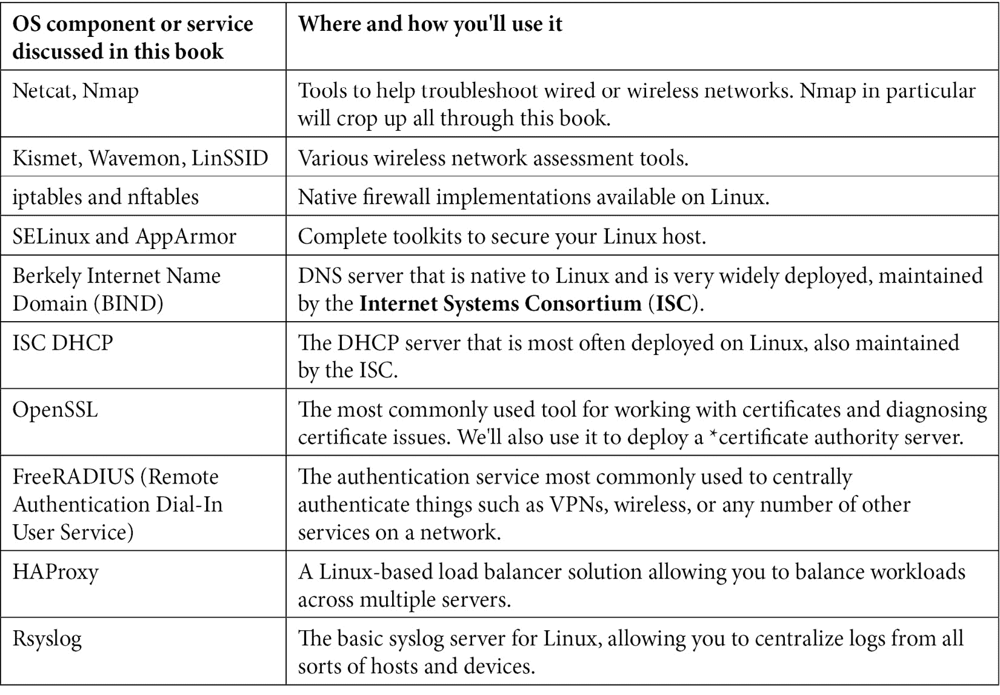

# 零、前言

欢迎来到*Linux 网络专业人员*! 如果您曾经想过如何降低支持您的网络的主机和服务的成本，那么您就来对地方了。 或者，如果您正在考虑如何开始保护 DNS、DHCP 或 RADIUS 等网络服务，我们也可以在这方面帮助您。

如果有一个服务可以帮助您支持您的网络，我们已经尝试介绍如何通过基本配置使其启动和运行，并帮助您开始保护该服务。 在此过程中，我们试图帮助您选择一个 Linux 发行版，向您展示如何使用 Linux 进行故障排除，并向您介绍一些您可能不知道自己需要的服务。

希望我们在本书中所经历的过程能够帮助您向您的网络添加新的服务，并可能帮助您更好地理解您的网络!

# 这本书是写给谁的

这本书适用于任何负责管理网络基础设施的人。 如果你对你的网络中事情如何运作的具体细节感兴趣，这本书就是为你准备的! 如果您经常想知道如何在您的网络上交付组织需要的各种服务，但可能没有预算支付商业产品，那么您也会发现我们的讨论很有趣。 我们将介绍所讨论的每一种 Linux 服务的工作方式，以及如何在典型环境中配置它们。

最后，如果您关心攻击者如何查看您的网络资产，您将会发现许多您感兴趣的东西! 我们将讨论攻击者和恶意软件通常如何攻击网络上的各种服务，以及如何保护这些服务。

由于本书的重点是 Linux，您将发现部署和捍卫我们所涵盖的服务的预算更多地是以您的热情和学习新有趣事物的时间来衡量的，而不是以美元和美分来衡量!

# 这本书的内容

[*第 1 章*](01.html#_idTextAnchor014)，*欢迎来到 Linux 家族*，包含了 Linux 的简短历史和各种 Linux 发行版的描述。 此外，我们还为您的组织选择 Linux 发行版提供一些建议。

[*第二章*](02.html#_idTextAnchor035),*基本的 Linux 网络配置和操作使用本地接口*,在 Linux 中,讨论了网络接口配置,许多管理员可以是一个真正的绊脚石,尤其是当决定了服务器不需要一个 GUI。 在本章中，我们将讨论如何从命令行配置各种网络接口参数，以及许多关于 IP 和 MAC 层的基础知识。

[*第三章*](03.html#_idTextAnchor053)，*使用 Linux 和 Linux 工具进行网络诊断*，涵盖了诊断和解决网络问题，几乎是所有网络管理员的日常工作。 在本章中，我们将继续探索，我们开始在前一章，TCP 和 UDP 基础层。 掌握了这些信息之后，我们将讨论使用本地 Linux 命令以及常见的附加组件进行本地和远程网络诊断。 我们将以评估无线网络的讨论结束本章。

第四章[](04.html#_idTextAnchor071)*,*Linux 防火墙*,解释说,Linux 防火墙对于许多管理员可以是一个真正的挑战,特别是有多个不同的“代”iptables / ipchains 防火墙的实现。 我们将讨论 Linux 防火墙的发展，并实现它来保护 Linux 上的特定服务。*

 *[*第五章*](05.html#_idTextAnchor085),*Linux 安全标准与现实生活中的例子*,覆盖保护您的 Linux 主机,这始终是一个移动的目标,这取决于服务上实现主机和环境的部署。 我们将讨论这些挑战，以及您可以用来告知您的安全决策的各种安全标准。 特别地，我们将讨论**Center for Internet Security**(**CIS**)关键控制，并通过 Linux 的 CIS 基准测试中的一些建议进行工作。

[*第六章*](06.html#_idTextAnchor100)，*Linux 上的 DNS 服务*，解释了 DNS 在不同的实例中如何工作，以及如何在 Linux 上实现 DNS 服务，包括内部的和面向 internet 的。 我们还将讨论针对 DNS 的各种攻击，以及如何保护您的服务器免受这些攻击。

[*第七章*](07.html#_idTextAnchor118),*DHCP 服务在 Linux 上*,包括 DHCP,用于客户机工作站 IP 地址问题,以及“推”无数的各种配置选项,客户端设备。 在本章中，我们将举例说明如何在传统工作站的 Linux 上实现这一点，并讨论你应该考虑的其他设备，如**Voice over IP**(**VoIP**)电话。

[*第 8 章*](08.html#_idTextAnchor133)、*Linux 上的证书服务*涵盖了在许多网络基础设施中经常被视为“魔鬼”的证书。 在这一章中，我们试图揭开它们是如何工作的，以及如何为您的组织在 Linux 上实现一个免费的证书颁发机构。

[*第 9 章*](09.html#_idTextAnchor153)，*RADIUS 服务 for Linux*，介绍了如何在 Linux 上使用 RADIUS 作为各种网络设备和服务的认证。

[*第十章*](10.html#_idTextAnchor170),*为 Linux*,负载均衡器服务解释说,Linux 是一个伟大的负载均衡器,允许“免费”负载平衡服务绑定到每个工作负载,而不是传统的,昂贵的,单片每数据中心负载均衡解决方案,我们经常看到。

[*第 11 章*](11.html#_idTextAnchor192)、*Linux 上的抓包分析*讨论了 Linux 作为抓包主机。 本章涵盖了如何使这种情况在网络上发生，以及探索各种过滤方法以获得解决问题所需的信息。 我们使用各种攻击 VoIP 系统来说明如何完成这项工作!

[*第十二章*](12.html#_idTextAnchor216)，*Linux 网络监控*，介绍了 Linux 通过 syslog 对流量进行集中日志记录，以及对日志中出现的关键字进行实时报警。 我们还讨论了使用 NetFlow 和相关协议记录网络流量流模式。

[*第 13 章*](13.html#_idTextAnchor236)，*Linux 上的入侵防御系统*，解释了 Linux 应用用于警告和阻止常见的攻击，以及在流量信息中添加重要的元数据。 我们在这方面探讨了两种不同的解决方案，并展示了如何应用各种过滤器来发现流量和攻击中的各种模式。

[*第 14 章*](14.html#_idTextAnchor252)，*Linux 上的蜜罐服务*，涵盖了使用蜜罐作为“欺骗主机”来分散和延迟你的攻击者，同时为防御者提供高保真度的警报。 我们也讨论使用蜜罐来研究公共互联网上恶意行为的趋势。

# 为了最大限度地了解这本书

在本书中，我们将以 Ubuntu Linux 的默认安装为基础，构建大多数示例。 当然，你可以在“裸金属”硬件上安装 Ubuntu，但你可能会发现，使用 VMware(工作站或 ESXi)、VirtualBox 或 Proxmox 等虚拟化解决方案确实有助于你的学习体验(除了 VMware 工作站外，所有这些都是免费的)。 使用虚拟化选项，您可以在已知的优点处对主机进行“快照”，这意味着如果您在试验某个工具或特性时遇到了问题，您可以很容易地回滚该更改并再次尝试。

此外，使用虚拟化允许您对主机进行多个拷贝，这样您就可以以一种逻辑的方式实现特性或服务，而不是试图将本书中讨论的所有服务放在同一台主机上。

在本书中，我们使用了几个 Linux 服务，大部分是在 Ubuntu Linux version 20(或更新版本)上实现的。 这些服务概述如下:



此外，我们使用或讨论了几个您可能不熟悉的“附加”Linux 工具:


随着本书的进展，所引用的大多数工具和服务都可以安装在单个 Linux 主机上。 这对于实验室设置很有效，但是在真实的网络中，您当然要将重要的服务器分散到不同的主机上。

我们将一些工具作为预构建或预打包发行版的一部分进行探索。 在这些情况下，您当然可以在您的管理程序中安装相同的发行版，但是您也可以按照本章的内容来理解本文所阐述的概念、方法和缺陷。

# 下载彩色图片

我们还提供了一个 PDF 文件，其中包含了本书中使用的屏幕截图/图表的彩色图像。 你可以在这里下载:[http://www.packtpub.com/sites/default/files/downloads/9781800202399_ColorImages.pdf](_ColorImages.pdf)。

# 下载示例代码文件

你可以从 GitHub 上的[https://github.com/PacktPublishing/Linux-for-Networking-Professionals](https://github.com/PacktPublishing/Linux-for-Networking-Professionals)下载这本书的示例代码文件。 如果代码有更新，它将在现有的 GitHub 存储库中更新。

我们还可以从丰富的图书和视频目录中获得其他代码包

[https://github.com/PacktPublishing/](https://github.com/PacktPublishing/)。 检查出来!

# 使用的约定

本书中使用了许多文本约定。

`Code in text`:表示文本中的代码字、数据库表名、文件夹名、文件名、文件扩展名、路径名、虚拟 url、用户输入和 Twitter 句柄。 这里有一个例子:“所有三个工具都是免费的，并且都可以通过标准`apt-get install <package name>`命令安装。”

任何命令行输入或输出都写如下:

```sh
$ sudo kismet –c <wireless interface name>
```

**粗体**:表示新词条、重要词汇或在屏幕上看到的词汇。 例如，菜单或对话框中的单词会像这样出现在文本中。 下面是一个例子:“在 Linux GUI 中，您可以通过单击顶部面板上的网络图标开始，然后为您的界面选择**设置**。”

小贴士或重要提示

出现这样的。

# 联系

我们欢迎读者的反馈。

**一般反馈**:如果您对本书的任何方面有疑问，请在邮件主题中提及书名，并发送电子邮件至[customercare@packtpub.com](mailto:customercare@packtpub.com)。

**Errata**:尽管我们已尽一切努力确保内容的准确性，但错误还是会发生。 如果您在这本书中发现了错误，请向我们报告，我们将不胜感激。 请访问[www.packtpub.com/support/errata](http://www.packtpub.com/support/errata)，选择您的图书，点击勘误表提交链接，并输入详细信息。

**盗版**:如果您在互联网上发现我们的作品以任何形式的非法拷贝，请提供我们的位置地址或网址。 请通过[copyright@packt.com](mailto:copyright@packt.com)与我们联系，并附上资料链接。

**如果你有兴趣成为一名作家**:如果你有一个你擅长的话题，并且你有兴趣写作或写一本书，请访问[authors.packtpub.com](http://authors.packtpub.com)。

# 分享你的想法

*   一旦您阅读了*Linux for Networking Professionals*，我们很乐意听到您的想法! 请[点击这里直接进入这本书的亚马逊评论页面](https://packt.link/r/1-800-20239-3)并分享你的反馈。
*   您的评论对我们和技术社区都很重要，并将帮助我们确保提供优质的内容。*