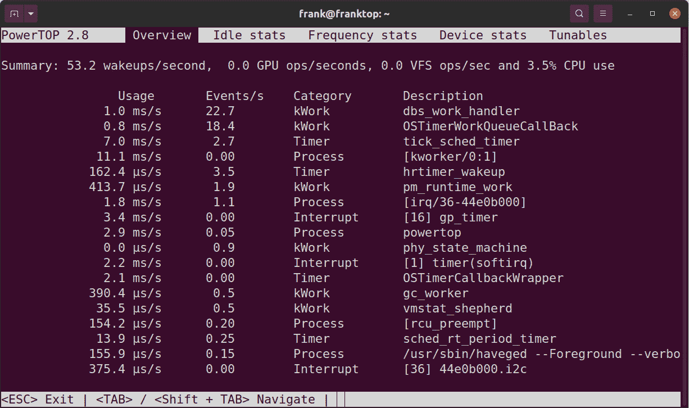
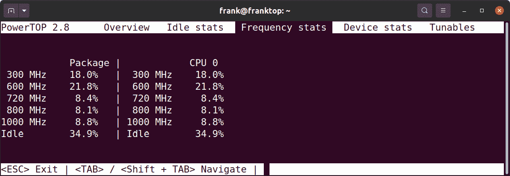

# *第 15 章*：管理电源

对于使用电池供电的设备来说，电源管理至关重要：我们能做的任何降低功耗的事情都会延长电池寿命。 即使对于使用市电运行的设备，降低功耗也有助于降低冷却需求和能源成本。 在本章中，我将介绍电源管理的四个原则：

*   如果没有必要，不要着急。
*   不要为无所事事而感到羞耻。
*   关掉你不用的东西。
*   无事可做的时候睡觉。

用更专业的术语来说，这些原则意味着电源管理系统应该努力降低 CPU 时钟频率。 在空闲期间，它应该选择尽可能深的睡眠状态；它应该通过关闭不使用的外围设备来减少负载，并且应该能够将整个系统置于挂起状态，同时确保电源状态转换迅速。

Linux 具有解决上述每一点的功能。 我将依次描述每一种方法，并举例说明如何将它们应用于嵌入式系统，以便最大限度地利用电源。

系统电源管理的一些术语取自**高级配置和电源接口**(**ACPI**)规范：术语，如**C 状态**和**P 状态**。 当我们谈到它们时，我会对它们进行描述。 本规范的完整参考见*进一步阅读*部分。

在本章中，我们将具体介绍以下主题：

*   测量用电量
*   调整时钟频率
*   选择最佳空闲状态
*   关闭外围设备电源
*   使系统进入休眠状态

# 技术要求

要按照示例操作，请确保您具备以下条件：

*   一个基于 Linux 的系统
*   适用于 Linux 的蚀刻器
*   一种 microSD 卡读卡器和卡
*   USB 转 TTL 3.3V 串行电缆
*   ♪Beaglebone Black♪
*   5V 1A 直流电源
*   用于网络连接的以太网电缆和端口

本章的所有代码都可以在本书的 GitHub 存储库的`Chapter15`文件夹中找到：[https://github.com/PacktPublishing/Mastering-Embedded-Linux-Programming-Third-Edition](https://github.com/PacktPublishing/Mastering-Embedded-Linux-Programming-Third-Edition)。

# 测量用电情况

对于本章中的示例，我们需要使用真实的硬件，而不是虚拟的。 这意味着我们需要一台具备工作电源管理功能的 Beaglebone Black。 不幸的是，`meta-yocto-bsp`层附带的 Beaglebone 的 BSP 不包括**电源管理 IC**(**PMIC**)所需的固件，因此我们将使用
预置的 Debian 映像。 丢失的固件可能存在于`meta-ti`层，但我没有对此进行调查。 除 Debian 版本外，在 Beaglebone Black 上安装 Debian 的步骤与我们在[*第 12 章*](12.html#_idTextAnchor356)，*使用分流板*原型中介绍的相同。

要下载 Beaglebone Black 的 Debian Stretch IoT microSD 卡映像，请发出以下命令：

```sh
$ wget https://debian.beagleboard.oimg/bone-debian-9.9-iot-armhf-2019-08-03-4gb.img.xz
```

10.3(又名 Buster)是撰写本文时基于 AM335x 的 BeagleBones 的最新 Debian 图像。 我们将在本章的练习中使用 Debian 9.9，因为 Debian 10.3 附带的 Linux 内核缺少一些电源管理功能。 将 Debian Stretch IoT 映像下载到 microSD 卡后，使用 Etcher 将其写入 microSD 卡。

重要音符

如果可能，在本章的练习中，请下载 Debian 9.9 版(又名 Stretch)，而不是从`BeagleBoard.org`下载最新的 Debian 映像。 Debian 10.3 版中缺少 CPUIdle 驱动程序，因此该发行版中缺少`menu`和`ladder`CPUIdle 调控器。 如果 9.9 版不再可用或不再受支持，请从`BeagleBoard.org`下载并尝试
比 10.3 更新的 Debian 版本。

现在，在 Beaglebone 板不通电的情况下，将 microSD 卡插入读卡器。 插入串行电缆。 串行端口在您的 PC 上应显示为`/dev/ttyUSB0`。 启动适当的终端程序，如`gtkterm`、`minicom`或`picocom`，并以`115200`bps(比特/秒)的速度连接到端口，不进行流量控制。 `gtkterm`可能是最容易设置和使用的：

```sh
$ gtkterm -p /dev/ttyUSB0 -s 115200
```

如果您收到权限错误，则可能需要将自己添加到`dialout`组并重新启动才能使用此端口。

按住 Beaglebone Black 上的 Boot Switch 按钮(距离 microSD 插槽最近)，使用外部 5V 电源接头接通主板电源，大约 5 秒钟后松开按钮。 您应该会看到 U-Boot 输出、内核日志输出，并最终在串行控制台上看到登录提示：

```sh
Debian GNU/Linux 9 beaglebone ttyS0
BeagleBoard.org Debian Image 2019-08-03
Support/FAQ: http://elinux.org/Beagleboard:BeagleBoneBlack_Debian
default username:password is [debian:temppwd]
beaglebone login: debian
Password:
```

以、`debian`用户身份登录。 密码为`temppwd`，如上图所示。

重要音符

许多 Beaglebone Black 在板载闪存上已经安装了 Debian，所以即使没有插入 microSD 卡，它们仍然可以引导。 如果在密码提示之前显示`BeagleBoard.org Debian Image 2019-08-03`消息，那么 Beaglebone Black 很可能是从 microSD 上的 Debian 9.9 映像启动的。 如果在密码提示之前显示不同的 Debian Release 消息，请验证 microSD 卡是否正确插入。

要检查哪个版本的 Debian 正在运行，请运行以下命令：

```sh
debian@beaglebone:~$ cat /etc/os-release 
PRETTY_NAME="Debian GNU/Linux 9 (stretch)"
NAME="Debian GNU/Linux"
VERSION_ID="9"
VERSION="9 (stretch)"
ID=debian
HOME_URL="https://www.debian.org/"
SUPPORT_URL="https://www.debian.org/support"
BUG_REPORT_URL="https://bugs.debian.org/"
```

现在检查电源管理是否正常工作：

```sh
debian@beaglebone:~$ cat /sys/power/state 
freeze standby mem disk
```

如果您看到所有四个状态，则一切运行正常。 如果只看到`freeze`，则电源管理子系统不工作。 返回并仔细检查前面的步骤。

现在，我们可以继续测量电源使用情况。 有两种方法：*外部*和*内部*。 从外部测量功率，从系统外部，我们只需要一个电流表测量电流，一个电压表测量电压，然后把这两个相乘得到瓦数。 你可以使用给出读数的基本仪表，然后记录下来。 或者，它们可以更加复杂，并结合数据记录，以便您可以在负载一毫秒一毫秒地变化时看到功率的变化。 出于本章的目的，我从迷你 USB 端口为 Beaglebone 供电，并使用了一台便宜的 USB 电源监视器
，这款显示器的价格只有几美元。

另一种方法是使用 Linux 内置的监控系统。 您会发现，通过`sysfs`向您报告了大量信息。 还有一个非常有用的程序，称为**PowerTOP**，它从各种来源收集信息并在一个地方显示。 PowerTOP 是一个同时适用于 Yocto 项目和 Buildroot 的软件包。 它也可以安装在 Debian 上。

要从 Debian Stretch IoT 在 Beaglebone Black 上安装 PowerTop，请运行以下命令：

```sh
debian@beaglebone:~$ sudo apt update
[…]
debian@beaglebone:~$ sudo apt install powertop
Reading package lists... Done
Building dependency tree       
Reading state information... Done
Suggested packages:
  laptop-mode-tools
The following NEW packages will be installed:
  powertop
0 upgraded, 1 newly installed, 0 to remove and 151 not upgraded.
Need to get 177 kB of archives.
After this operation, 441 kB of additional disk space will be used.
Get:1 http://deb.debian.org/debian stretch/main armhf powertop armhf 2.8-1+b1 [177 kB]
Fetched 177 kB in 0s (526 kB/s)
```

在安装 PowerTOP 之前，不要忘记将 Beaglebone Black 插入以太网，并更新可用的软件包列表。

下面是在 Beaglebone Black 上运行的 PowerTOP 示例：



图 15.1-PowerTOP 概述

在此屏幕截图中，我们可以看到系统处于静默状态，CPU 使用率仅为**3.5%**。
稍后我将在本章的*使用 CPUFreq*和*CPUIdle 驱动程序*小节中展示更多有趣的示例。

现在我们已经有了一种测量功耗的方法，让我们来看一下在嵌入式 Linux 系统中管理电源所必须的最大的旋钮之一：时钟频率。

# 调整时钟频率

跑步一公里比步行更消耗体力。 以类似的方式，也许以较低的频率运行 CPU 可以节省能源。 让我们看看。

CPU 在执行代码时的功耗是由栅极泄漏电流等引起的静态分量和由栅极切换引起的动态分量的总和：

*P**CPU*=*P**静态*+*P**DYN*

动态功率分量取决于被切换的逻辑门的总电容、时钟频率和电压的平方：

*P**dyn*=*CfV**2*

由此可以看出，改变频率本身不会节省任何电能，因为执行给定子例程必须完成相同数量的 CPU 周期。 如果我们将频率降低一半，完成计算的时间将增加一倍，但由于动态功率分量而消耗的总功率将是相同的。 事实上，降低频率实际上可能会增加功率预算，因为 CPU 需要更长的时间才能进入空闲状态。 因此，在这些情况下，最好使用尽可能高的频率，以便 CPU 可以快速返回空闲状态。 这种称为空闲的**竞赛**。

重要音符

还有另一个降低频率的动机：**热管理**。 为了将包装温度保持在一定范围内，可能需要以较低的频率操作。 但这不是我们在这里关注的重点。

因此，如果我们想要省电，我们必须能够改变 CPU 内核的工作电压。 但是对于任何给定的电压，存在一个最大频率，超过这个频率，门的开关就变得不可靠。 更高的频率需要更高的电压，因此两者需要一起调整。 许多 SoC实现了这样的功能：它被称为**动态电压和频率缩放**，或**DVFS**。 制造商计算核心频率和电压的最佳组合。 每个组合称为**运行性能点**，或**OPP**。 ACPI 规范将它们称为**P 状态**，其中`P0`是频率最高的 OPP。 虽然 OPP 是频率和电压的组合，但通常仅用频率系数来指代。

在 P 状态之间切换需要内核驱动程序。 接下来，我们将查看该驱动程序和控制它的州长。

## CPUFreq 驱动程序

Linux 有一个名为**CPUFreq**的组件，用于管理 OPP 之间的转换。 它是每个 SoC 封装的主板支持的一部分。 CPUFreq 由`drivers/cpufreq/`中的驱动程序(完成从一个 OPP 到另一个 OPP 的转换)和一组执行何时切换策略的调控器组成。 它是通过`/sys/devices/system/cpu/cpuN/cpufreq`目录按 CPU 进行控制的，其中`N`是 CPU 编号。 在那里，我们发现了一些文件，其中最有趣的如下：

*   `cpuinfo_cur_freq`、`cpuinfo_max_freq`和`cpuinfo_min_freq`：该 CPU 的当前频率，以及最大和最小频率，单位为 kHz。
*   `cpuinfo_transition_latency`：从一个 OPP 切换到另一个 OPP 的时间，以纳秒为单位。 如果该值未知，则将其设置为`-1`。
*   `scaling_available_frequencies`：此 CPU 上可用的 OPP 频率列表。
*   `scaling_available_governors`：此 CPU 上可用的调控器列表。
*   `scaling_governor`：当前使用的 CPUFreq 调控器。
*   `scaling_max_freq`和`scaling_min_freq`：调速器可用的频率范围，单位为 kHz。
*   `scaling_setspeed`：一个文件，允许您在调控器为`userspace`时手动设置频率，我将在本小节末尾介绍。

调速器将策略设置为更改 OPP。 它可以在`scaling_min_freq`和`scaling_max_freq`的
限值之间设置频率。 省长的名字
如下：

*   `powersave`：始终选择最低频率。
*   `performance`：始终选择最高频率。
*   `ondemand`：根据 CPU 利用率更改频率。 如果 CPU 空闲时间少于 20%，则将频率设置为最大值；如果 CPU 空闲时间超过 30%，则将频率递减 5%。
*   `conservative`：与`ondemand`相似，但以 5%的步长切换到更高的频率，而不是立即切换到最大频率。
*   `userspace`：频率由用户空间程序设置。

Debian 启动时的默认调控器为`performance`：

```sh
$ cd /sys/devices/system/cpu/cpu0/cpufreq
$ cat scaling_governor
performance
```

要切换到`ondemand`调控器，这是我们应该在本章的练习中使用的调控器，请运行以下命令：

```sh
$ sudo cpupower frequency-set -g ondemand
[sudo] password for debian: 
Setting cpu: 0
```

提示输入密码时，输入`temppwd`。

可以通过`/sys/devices/system/cpu/cpufreq/ondemand/`查看和修改`ondemand`调速器用来决定何时更改 OPP 的参数。 `ondemand`和`conservative`调速器都会考虑改变频率和电压所需的努力。 此参数在`cpuinfo_transition_latency`中。 这些计算是针对具有正常调度策略的线程进行的；如果线程是实时调度的，则它们都会立即选择最高的 OPP，以便线程能够满足其调度截止日期。

`userspace`调控器允许用户空间守护进程执行选择 OPP 的逻辑。 示例包括`cpudyn`和`powernowd`，尽管它们都面向基于 x86 的笔记本电脑，而不是嵌入式设备。

既然我们知道了有关 CPUFreq 驱动程序的运行时详细信息位于何处，让我们来看一下如何在编译时定义 opp。

## 使用 CPUFreq

查看Beaglebone Black，我们发现 OPP 编码在设备树中。 以下是`am33xx.dtsi`的摘录：

```sh
cpu0_opp_table: opp-table {
     compatible = "operating-points-v2-ti-cpu";
     syscon = <&scm_conf>;
     […]
     opp50-300000000 {
           opp-hz = /bits/ 64 <300000000>;
           opp-microvolt = <950000 931000 969000>;
           opp-supported-hw = <0x06 0x0010>;
           opp-suspend;
     };
     […]
     opp100-600000000 {
           opp-hz = /bits/ 64 <600000000>;
           opp-microvolt = <1100000 1078000 1122000>;
           opp-supported-hw = <0x06 0x0040>;
     };
     […]
     opp120-720000000 {
           opp-hz = /bits/ 64 <720000000>;
           opp-microvolt = <1200000 1176000 1224000>;
           opp-supported-hw = <0x06 0x0080>;
     };
     […]
     oppturbo-800000000 {
           opp-hz = /bits/ 64 <800000000>;
           opp-microvolt = <1260000 1234800 1285200>;
           opp-supported-hw = <0x06 0x0100>;
     };
     oppnitro-1000000000 {
           opp-hz = /bits/ 64 <1000000000>;
           opp-microvolt = <1325000 1298500 1351500>;
           opp-supported-hw = <0x04 0x0200>;
     };
};
```

我们可以通过查看可用的频率来确认这些是运行时使用的 OP：

```sh
$ cd /sys/devices/system/cpu/cpu0/cpufreq
$ cat scaling_available_frequencies
300000 600000 720000 800000 1000000
```

通过选择`userspace`调速器，我们可以通过写入`scaling_setspeed`来设置频率，因此我们可以测量每个 OPP 的功耗。 这些测量不是很准确，所以不要太当真。

首先，在系统空闲的情况下，结果是 70 mA@4.6V=320 mW。 这与频率无关，这是我们所期望的，因为这是此特定系统功耗的静态分量。

现在，我想知道通过运行如下计算绑定负载每个 OPP 消耗的最大功率：

```sh
# dd if=/dev/urandom of=/dev/null bs=1
```

下表显示了结果，其中**增量功率**是空闲系统之上的额外功耗：


这些测量结果显示了不同 OPPS 下的最大功率。 但这不是一个公平的测试，因为 CPU 正在 100%地运行，因此它以更高的频率执行更多的指令。 如果我们保持负载不变，但改变频率，那么我们会发现
如下：


这表明在最低频率下有明确的节电效果，大约为 15%。

使用 PowerTOP，我们可以看到在每个 OPP 中花费的时间百分比。 下面的屏幕截图显示 Beaglebone Black 使用`ondemand`调控器运行轻负载：



图 15.2-PowerTOP 频率统计信息

在大多数情况下，`ondemand`调控器是最好的调控器。 要选择特定的调控器，可以使用默认调控器(例如`CPU_FREQ_DEFAULT_GOV_ONDEMAND`)配置内核，也可以使用引导脚本在引导时更改调控器。 在`MELP/Chapter15/cpufrequtils`中有一个取自 Debian 的示例 system V`init`脚本。

有关 CPUFreq 驱动程序的更多信息，请查看 Linux 内核源代码树的`Documentation/cpu-freq`目录中的文件。

在本节中，我们关注的是 CPU 繁忙时使用的功率。 在下一节中，我们将了解如何在 CPU 空闲时节能。

# 选择最佳空闲状态

当处理器没有更多的工作要做时，它执行**停止指令**并进入
空闲状态。 在空闲时，CPU 消耗的电量较少。 当发生硬件中断等事件
时，它退出空闲状态。 大多数 CPU 都有多个空闲状态，使用的电量
各不相同。 通常，在功耗和退出状态所需的延迟或时间长度之间需要权衡。 在 ACPI 规范中，它们被称为**C 状态**。

在更深的 C 状态中，更多的电路被关闭，代价是失去一些状态，因此需要更长的时间才能恢复正常操作。 例如，在某些 C 状态下，CPU 缓存可能会断电，因此当 CPU 再次运行时，它可能必须从主存储器重新加载一些信息。 这样做的代价很高，因此只有在 CPU 很有可能保持这种状态一段时间的情况下才想这样做。 不同系统的状态数各不相同。 每个人都需要一些时间才能从睡眠恢复到完全活跃。

选择正确的空闲状态的关键是要很好地了解 CPU 将静止多长时间。 预测未来总是很棘手的，但有些事情可能会有所帮助。 一个是当前的 CPU 负载：如果现在的 CPU 负载很高，很可能在不久的将来还会继续如此，所以深度睡眠不会有好处。 即使负载很低，也值得查看是否有即将到期的计时器事件。 如果没有负载和计时器，则更深的空闲状态是合理的。

Linux 中选择最佳空闲状态的部分是 CPUIdle 驱动程序。 在 Linux 内核源代码树的`Documentation/cpuidle`目录中有大量关于它的信息。

## CPUIdle 驱动程序

与CPUFreq 子系统一样，**CPUIdle**由作为 BSP 一部分的驱动程序和确定策略的调控器组成。 然而，与 CPUFreq 不同的是，调控器不能在运行时更改，并且没有用于用户空间调控器的界面。

CPUIdle 公开了关于`/sys/devices/system/cpu/cpu0/cpuidle`目录中每个空闲状态的信息，在该目录中，每个休眠状态都有一个子目录，名为`state0`到`stateN`。 `state0`是最浅的睡眠，`stateN`是最深的睡眠。 请注意，编号与 C 状态的编号不匹配，并且 CPUIdle 没有与`C0`(运行)等效的状态。 对于每个州，都有以下文件：

*   `desc`：状态的简短描述
*   `disable`：通过将`1`写入此文件来禁用此状态的选项
*   `latency`：退出此状态时 CPU 内核恢复正常运行所需的时间，以微秒为单位
*   `name`：此状态的名称
*   `power`：在此空闲状态下消耗的功率，以毫瓦为单位
*   `time`：处于此空闲状态的总时间，以微秒为单位
*   `usage`：进入此状态的次数计数

对于 Beaglebone Black 上的 AM335x SoC，有两种空闲状态。 以下是第一条：

```sh
$ cd /sys/devices/system/cpu/cpu0/cpuidle
$ grep "" state0/*
state0/desc:ARM WFI
state0/disable:0
state0/latency:1
state0/name:WFI
state0/power:4294967295
state0/residency:1
state0/time:1023898
state0/usage:1426
```

该状态名为`WFI`，指的是 ARM 停止指令**等待中断**。 延迟是`1`微秒，因为它只是一条停止指令，并且所消耗的功率是`-1`，这意味着功率预算是未知的(至少 CPUIdle 是已知的)。 现在，这是第二个状态：

```sh
$ cd /sys/devices/system/cpu/cpu0/cpuidle
$ grep "" state1/*
state1/desc:mpu_gate
state1/disable:0
state1/latency:130
state1/name:mpu_gate
state1/power:0
state1/residency:300
state1/time:139156260
state1/usage:7560
```

这个名字叫`mpu_gate`。 它的延迟更高，为`130`微秒。 空闲状态可以硬编码到 CPUIle驱动程序中或呈现在设备树中。 以下是`am33xx.dtsi`的摘录：

```sh
cpus {
     cpu@0 {
           compatible = "arm,cortex-a8";
           enable-method = "ti,am3352";
           device_type = "cpu";
           reg = <0>;
.
.
.
           cpu-idle-states = <&mpu_gate>;
     };
     idle-states {
           mpu_gate: mpu_gate {
                compatible = "arm,idle-state";
                entry-latency-us = <40>;
                exit-latency-us = <90>;
                min-residency-us = <300>;
                ti,idle-wkup-m3;
           };
      };
}
```

CPUIdle 有两个调控器：

*   `ladder`：根据上一个空闲时间段的时间，这将使空闲状态下降或上升，一次一个。 它可以很好地与常规计时器滴答配合使用，但不能与
    动态滴答配合使用。
*   `menu`：这将根据预期空闲时间选择空闲状态。 它可以很好地与动态记号系统配合使用。

您应该根据您的`NO_HZ`配置选择其中之一，我将在本节末尾介绍。

同样，用户交互是通过`sysfs`文件系统进行的。 在`/sys/devices/system/cpu/cpuidle`目录中，您将找到两个文件：

*   `current_driver`：这是`cpuidle`驱动程序的名称。
*   `current_governor_ro`：这是州长的名字。

这些显示正在使用哪个驱动程序和哪个调控器。 空闲状态可以在 PowerTOP 的`Idle stats`选项卡上显示。 下面的屏幕截图显示了使用`menu`调控器的 Beaglebone Black：


图 15.3-PowerTOP 空闲统计信息

这表明当系统空闲时，它主要进入更深的`mpu_gate`空闲状态，这正是我们想要的。

即使在 CPU 完全空闲的情况下，大多数 Linux 系统仍配置为在收到系统计时器中断时定期唤醒。 为了节省更多电量，我们需要将 Linux 内核配置为无计时运行。

## 无卡作业

一个相关的主题是无勾选(或称`NO_HZ`)选项。 如果系统真正空闲，最有可能的中断来源将是系统计时器，它被编程为以每秒 HZ 的速率生成
常规时间滴答，其中 HZ 通常为 100。 在历史上，Linux 使用计时器滴答作为测量超时的主要时基。

然而，如果在特定时刻没有注册计时器事件，那么唤醒 CPU 来处理计时器中断显然是浪费的。 动态计时内核配置选项`CONFIG_NO_HZ_IDLE`在计时器处理例程结束时查看计时器队列，并在下一个事件发生时安排下一个中断，从而避免不必要的唤醒并允许 CPU 长时间空闲。 在任何对功率敏感的应用程序中，内核都应该配置为启用此选项。

虽然 CPU 消耗了嵌入式 Linux 系统中的大量电力，但系统的其他组件也可以关闭以节省能源。

# 关闭外围设备电源

到目前为止，的讨论一直是关于 CPU 以及如何在它们运行或空闲时降低功耗。 现在是时候关注系统外围设备的其他部分了，看看我们能否在这里实现节能。

在 Linux 内核中，这个由**运行时电源管理系统**或**运行时 PM**管理。 它与支持运行时 PM 的驱动程序协同工作，关闭那些不使用的驱动程序，并在下次需要它们时再次唤醒它们。 它是动态的，对用户空间应该是透明的。 硬件的管理由设备驱动程序来实现，但通常包括关闭子系统的时钟，也称为时钟门控，并在可能的情况下关闭核心电路。

运行时电源管理通过`sysfs`接口公开。 每个设备都有一个名为`power`的子目录
，您可以在其中找到以下文件：

*   `control`：这允许用户空间确定此设备上是否使用运行时 PM。 如果将其设置为`auto`，则会启用运行时 PM，但通过将其设置为`on`，设备将始终处于打开状态，并且不使用运行时 PM
*   `runtime_enabled`：报告运行时 pm 为`enabled`、`disabled`，或者，如果`control`为`on`，则报告`forbidden`。
*   `runtime_status`：它报告设备的当前状态。 它可以是`active`、`suspended`或`unsupported`。
*   `autosuspend_delay_ms`：这是设备挂起前的时间。 `-1`意味着永远等待。 如果挂起设备硬件的成本很高，因为它会阻止快速挂起/恢复周期，则一些驱动程序会实现这一点。

为了给出一个具体的例子，我将查看 Beaglebone Black 上的 MMC 驱动程序：

```sh
$ cd /sys/devices/platform/ocp/481d8000.mmc/mmc_host/mmc1/mmc1:0001/power
$ grep "" *
async:enabled
autosuspend_delay_ms:3000
control:auto
runtime_active_kids:0
runtime_active_time:14464
runtime_enabled:enabled
runtime_status:suspended
runtime_suspended_time:121208
runtime_usage:0
```

因此，运行时 PM 已启用，设备当前处于挂起状态，并且在上次使用之后有`3000`毫秒的延迟，然后才会再次挂起。 现在，我从设备中读取一个数据块，并查看它是否已更改：

```sh
$ sudo dd if=/dev/mmcblk1p3 of=/dev/null count=1
1+0 records in
1+0 records out
512 bytes copied, 0.00629126 s, 81.4 kB/s
$ grep "" *
async:enabled
autosuspend_delay_ms:3000
control:auto
runtime_active_kids:0
runtime_active_time:17120
runtime_enabled:enabled
runtime_status:active
runtime_suspended_time:178520
runtime_usage:0
```

现在，MMC 驱动器处于活动状态，电路板的功率从 320 mW 增加到 500 mW。 如果我在 3 秒后再重复一次，它将再次暂停，电源已恢复到 320 mW。

有关运行时 pm 的更多信息，请查看位于`Documentation/power/runtime_pm.txt`的 Linux 内核源代码。

现在我们已经了解了运行时 pm 是什么以及它做了什么，让我们来看看它的实际操作。

# 使系统进入休眠状态

还有一种电源管理技术需要考虑：将整个系统置于休眠模式，并期望它在一段时间内不会再次使用。 在 Linux 内核中，这称为，称为**系统休眠**。 它通常是由用户发起的：用户决定设备应该关闭一段时间。 例如，到了回家的时候，我会关上笔记本电脑的盖子，然后把它放进包里。 Linux 对系统睡眠的大部分支持来自对笔记本电脑的支持。 在笔记本电脑领域，通常有两种选择：

*   暂不实行 / 暂停 / 悬浮 / 延留
*   冬眠 / 过冬 / 避寒 / 蛰居

第一种模式也称为**挂起到 RAM**，它会关闭除系统内存之外的所有设备，因此机器仍在消耗一些电量。 当系统唤醒时，内存会保留所有以前的状态，而我的笔记本电脑在几秒钟内就可以运行了。

如果我选择**休眠**选项，内存中的内容将保存到硬盘上。 系统根本不消耗电量，因此它可以无限期地保持这种状态，但是在唤醒时，从磁盘恢复内存需要一些时间。 Hibernate 很少在嵌入式系统中使用，主要是因为闪存的读/写速度非常慢，但也因为它会干扰工作流。

有关更多信息，请查看`Documentation/power`目录中的内核源代码。

挂起到 RAM 和休眠选项映射到 Linux 支持的四种睡眠状态中的两种。 接下来，我们将研究这两种类型的系统休眠以及其余的 ACPI 电源状态。

## 电源状态

在 ACPI规范中，休眠状态被称为**S 状态**。 Linux 支持四种休眠状态(`freeze`、`standby`、`mem`和`disk`)，如下列表所示，以及相应的 ACPI S 状态([S0]、S1、S3、S4)：

*   `freeze` ([S0]): Stops (freezes) all activity in user space, but otherwise the CPU and memory are operating as normal.

    省电的原因是没有用户空间代码正在运行。 ACPI 没有等效状态，因此 S0 是最接近的匹配。 S0 是
    正在运行的系统的状态。

*   `standby`(S1)：与`freeze`类似，但另外会使除引导 CPU 之外的所有 CPU 脱机。
*   `mem`(S3)：关闭系统电源，并将存储器置于自刷新模式。 也称为挂起到 RAM。
*   `disk`(S4)：将内存保存到硬盘并关闭电源。 也称为**挂起到磁盘**。

并非所有系统都支持所有州。 要找出哪些可用，请阅读`/sys/power/state`文件，如下所示：

```sh
# cat /sys/power/state
freeze standby mem disk
```

要进入系统睡眠状态之一，只需将所需状态写入`/sys/power/state`。

对于嵌入式设备，最常见的需要是使用`mem`选项挂起到 RAM。 例如，我可以这样挂起 Beaglebone Black：

```sh
# echo mem > /sys/power/state
[ 1646.158274] PM: Syncing filesystems ...done.
[ 1646.178387] Freezing user space processes ... (elapsed 0.001 seconds) done.
[ 1646.188098] Freezing remaining freezable tasks ... (elapsed 0.001 seconds) done.
[ 1646.197017] Suspending console(s) (use no_console_suspend to debug)
[ 1646.338657] PM: suspend of devices complete after 134.322 msecs
[ 1646.343428] PM: late suspend of devices complete after 4.716 msecs
[ 1646.348234] PM: noirq suspend of devices complete after 4.755 msecs
[ 1646.348251] Disabling non-boot CPUs ...
[ 1646.348264] PM: Successfully put all powerdomains to target state
```

该设备在不到一秒的时间内关闭电源，然后功耗降至 10 毫瓦以下，这是我的简易万用表的测量极限。 但是我怎么才能再次唤醒它呢？ 这是下一个话题。

## 唤醒事件

在暂停设备之前，必须有再次唤醒它的方法。 内核试图在此帮助您：如果没有至少一个唤醒源，系统将拒绝挂起，并显示以下消息：

```sh
No sources enabled to wake-up! Sleep abort.
```

当然，这意味着即使在最深度睡眠期间，系统的某些部分也必须保持通电。 该通常包括**电源管理 IC**(**PMIC**)、**实时时钟**(**RTC**)，并且可以另外包括诸如 GPIO、UART、
和以太网等接口。

唤醒事件通过`sysfs`控制。 `/sys/device`中的每个设备都有一个名为`power`的子目录，其中包含一个`wakeup`文件，该文件将包含以下字符串之一：

*   `enabled`：此设备将生成唤醒事件。
*   `disabled`：此设备不会生成唤醒事件。
*   (空)：此设备无法生成唤醒事件。

要获取可以生成唤醒的设备列表，我们可以搜索`wakeup`包含`enabled`或`disabled`的所有设备：

```sh
$ find /sys/devices/ -name wakeup | xargs grep "abled"
```

在Beaglebone Black 的情况下，UART 是唤醒源，因此按下控制台上的某个键会唤醒 Beaglebone：

```sh
[ 1646.348264] PM: Wakeup source UART
[ 1646.368482] PM: noirq resume of devices complete after 19.963 msecs
[ 1646.372482] PM: early resume of devices complete after 3.192 msecs
[ 1646.795109] net eth0: initializing cpsw version 1.12 (0)
[ 1646.798229] net eth0: phy found : id is : 0x7c0f1
[ 1646.798447] libphy: PHY 4a101000.mdio:01 not found
[ 1646.798469] net eth0: phy 4a101000.mdio:01 not found on slave 1
[ 1646.927874] PM: resume of devices complete after 555.337 msecs
[ 1647.003829] Restarting tasks ... done.
```

我们已经了解了如何让设备进入睡眠状态，然后通过来自 UART 等外围接口的事件将其唤醒。 如果我们希望设备在没有任何外部交互的情况下唤醒自己，该怎么办？ 这就是 RTC 发挥作用的地方。

## 从实时时钟定时唤醒

大多数系统都有RTC，它可以在将来产生长达 24 小时的报警中断。 如果是，则`/sys/class/rtc/rtc0`目录将存在。 它应该包含`wakealarm`文件。 将数字写入`wakealarm`将导致在该秒数之后生成报警。 如果还从`rtc`启用`wakeup`事件，则 RTC 将恢复挂起的设备。

例如，此`rtcwake`命令将使系统进入`standby`，RTC 在 5 秒后将其唤醒：

```sh
$ sudo su –
# rtcwake -d /dev/rtc0 -m standby -s 5
  rtcwake: assuming RTC uses UTC ...
  rtcwake: wakeup from "standby" using /dev/rtc0 at Tue Dec  1 19:34:10 2020
[  187.345129] PM: suspend entry (shallow)
[  187.345148] PM: Syncing filesystems ... done.
[  187.346754] Freezing user space processes ... (elapsed 0.003 seconds) done.
[  187.350688] OOM killer disabled.
[  187.350789] Freezing remaining freezable tasks ... (elapsed 0.001 seconds) done.
[  187.352361] Suspending console(s) (use no_console_suspend to debug)
[  187.500906] Disabling non-boot CPUs ...
[  187.500941] pm33xx pm33xx: PM: Successfully put all powerdomains to target state
[  187.500941] PM: Wakeup source RTC Alarm
[  187.529729] net eth0: initializing cpsw version 1.12 (0)
[  187.605061] SMSC LAN8710/LAN8720 4a101000.mdio:00: attached PHY driver [SMSC LAN8710/LAN8720] (mii_bus:phy_addr=4a101000.mdio:00, irq=POLL)
[  187.731543] OOM killer enabled.
[  187.731563] Restarting tasks ... done.
[  187.756896] PM: suspend exit
```

由于 UART 也是唤醒源，按下控制台上的某个键将在 RTC`wakealarm`到期之前唤醒 BeagleboneBlack：

```sh
[  255.698873] PM: suspend entry (shallow)
[  255.698894] PM: Syncing filesystems ... done.
[  255.701946] Freezing user space processes ... (elapsed 0.003 seconds) done.
[  255.705249] OOM killer disabled.
[  255.705256] Freezing remaining freezable tasks ... (elapsed 0.002 seconds) done.
[  255.707827] Suspending console(s) (use no_console_suspend to debug)
[  255.860823] Disabling non-boot CPUs ...
[  255.860857] pm33xx pm33xx: PM: Successfully put all powerdomains to target state
[  255.860857] PM: Wakeup source UART
[  255.888064] net eth0: initializing cpsw version 1.12 (0)
[  255.965045] SMSC LAN8710/LAN8720 4a101000.mdio:00: attached PHY driver [SMSC LAN8710/LAN8720] (mii_bus:phy_addr=4a101000.mdio:00, irq=POLL)
[  256.093684] OOM killer enabled.
[  256.093704] Restarting tasks ... done.
[  256.118453] PM: suspend exit
```

Beaglebone Black 上的电源按钮也是一个唤醒源，因此您可以在没有串行控制台的情况下使用该按钮从`standby`恢复。 确保按下电源按钮，而不是旁边的重置按钮，否则主板将重新启动。

我们对四种 Linux 系统休眠模式的介绍到此结束。 我们了解了如何将设备挂起到`mem`或`standby`电源状态，然后通过 UART、RTC 或电源按钮的事件将其唤醒。 虽然 Linux 中的运行时 PM 主要是为笔记本电脑创建的，但我们也可以利用这一支持来支持同样使用电池供电的嵌入式系统。

# 摘要

Linux 具有复杂的电源管理功能。 我已经描述了四个
主要组件：

*   **CPUFreq**更改每个处理器内核的 OPP，以减少繁忙但有一些空闲带宽的处理器上的功率，从而允许缩减频率。 在 ACPI 规范中，OP 称为 P 状态。
*   **CPUIdle**在 CPU 预计一段时间内不会被唤醒时，选择更深的空闲状态。 空闲状态在 ACPI 规范中称为 C 状态。
*   **运行时 PM**将关闭不需要的外围设备。
*   **系统休眠**模式将使整个系统进入低功耗状态。 它们通常在最终用户的控制下，例如，通过按下待机按钮。 系统休眠状态在 ACPI 规范中称为 S 状态。

大部分电源管理由 BSP 为您完成。 您的主要任务是确保针对您的预期用例正确配置它。 只有最后一个组件(选择系统休眠状态)需要您编写一些代码，以允许最终用户进入和退出该状态。

本书的下一部分是关于编写嵌入式应用程序的。 我们将从打包和部署 Python 代码开始
，并更深入地研究我们在评估 Balena 时在[*第 10 章*](10.html#_idTextAnchor278)，*在现场更新软件*中介绍的集装化技术。

# 进一步阅读

*   *高级配置和电源接口规范*，UEFI 论坛，
    公司：[https://uefi.org/sites/default/files/resources/ACPI_Spec_6_4_Jan22.pdf](https://uefi.org/sites/default/files/resources/ACPI_Spec_6_4_Jan22.pdf)