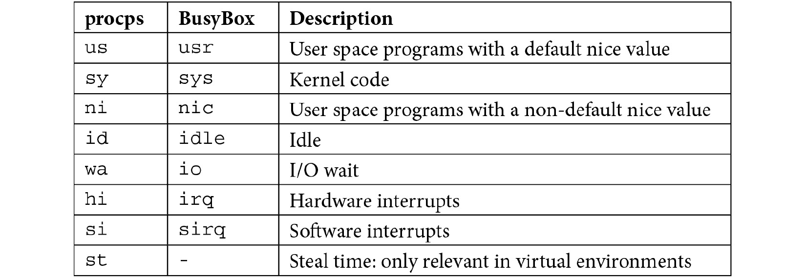
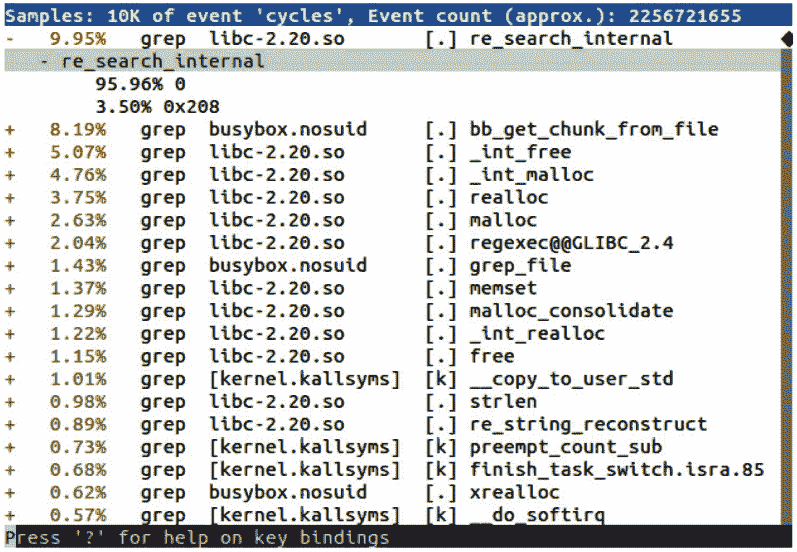
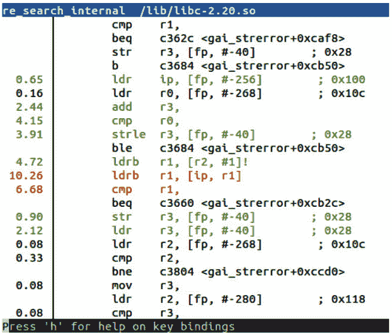
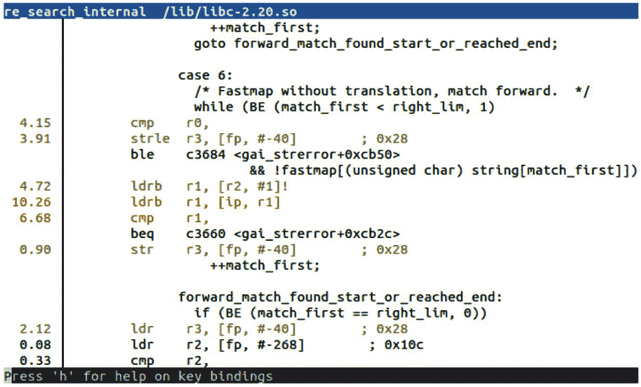
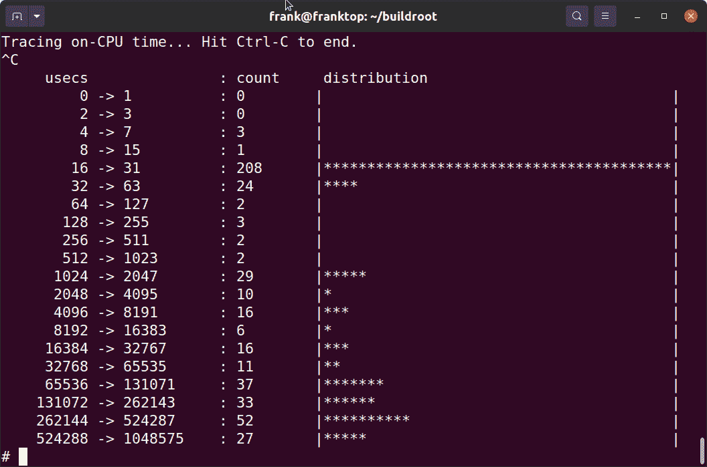
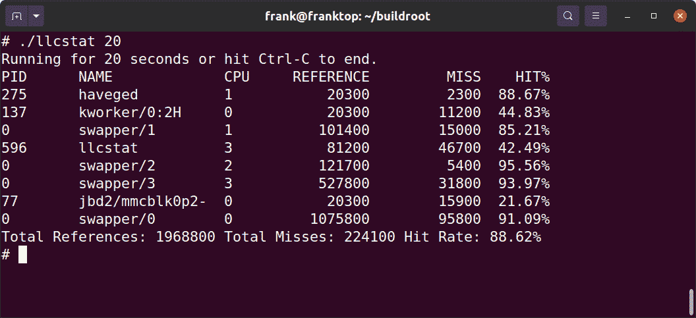
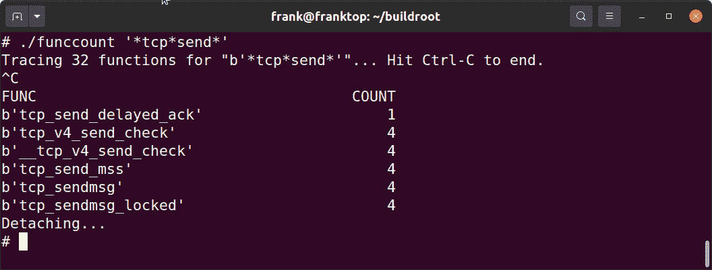

# 二十、分析和跟踪

如上一章所述，使用源代码级调试器进行交互式调试可以让您深入了解程序的工作方式，但它会将您的视图限制在一小部分代码中。 在本章中，我们将着眼于整体情况，看看系统是否按预期运行。

程序员和系统设计师出了名的不善于猜测瓶颈在哪里。 因此，如果您的系统有性能问题，明智的做法是从查看整个系统开始，然后使用更复杂的工具向下工作。 在本章中，我将从大家熟知的`top`命令开始，作为一种获得概述的方法。 通常，问题可以定位到单个程序，您可以使用 Linux 分析器`perf`对其进行分析。 如果问题并不局限于此，并且您希望了解更广泛的情况，`perf`也可以做到这一点。 为了诊断与内核相关的问题，我将描述一些跟踪工具，Ftrace、LTTng 和 BPF，作为收集详细信息的一种方式。

我还将介绍 Valgrind，由于其沙箱执行环境，它可以在程序运行时监视程序并报告代码。 我将用一个简单的跟踪工具`strace`来结束本章，该工具通过跟踪程序进行的系统调用来揭示程序的执行。

在本章中，我们将介绍以下主题：

*   观察者效应
*   开始配置文件
*   使用`top`评测
*   这个可怜人的侧写师
*   介绍`perf`
*   跟踪事件
*   介绍 Ftrace
*   使用 LTTng
*   使用 BPF
*   使用 Valgrind
*   使用`strace`

# 技术要求

要按照示例操作，请确保您具备以下条件：

*   一种基于 Linux 的主机系统
*   Buildroot 2020.02.9 LTS 版本
*   适用于 Linux 的蚀刻器
*   一种微型 SD 卡读卡器及读卡器
*   覆盆子派 4
*   一种 5V 3A USB-C 电源
*   用于网络连接的以太网电缆和端口

您应该已经为[*第 6 章*](06.html#_idTextAnchor164)，*选择构建系统*安装了 Buildroot 的 2020.02.9 LTS 版本。 如果没有，请参考*Buildroot 用户手册*([https://buildroot.org/downloads/manual/manual.html](https://buildroot.org/downloads/manual/manual.html))的*系统要求*部分，然后再按照[*第 6 章*](06.html#_idTextAnchor164)中的说明在您的 LINUX 主机上安装 Buildroot。

本章的所有代码都可以在本书的 GitHub 存储库的`Chapter20`文件夹中找到：[https://github.com/PacktPublishing/Mastering-Embedded-Linux-Programming-Third-Edition](https://github.com/PacktPublishing/Mastering-Embedded-Linux-Programming-Third-Edition)。

# 观察者效应

在深入了解这些工具之前，让我们先来讨论一下这些工具将向您展示什么。 与许多领域的情况一样，测量某个属性会影响观测本身。 测量电源线中的电流需要测量一个小电阻上的电压降。 然而，电阻器本身会影响电流。 性能分析也是如此：每个系统观察都有 CPU 周期的开销，并且该资源不再花费在应用上。 度量工具还会扰乱缓存行为、消耗内存空间和写入磁盘，所有这些都会使情况变得更糟。 没有没有开销的测量。

我经常听到工程师说，分析工作的结果完全是误导性的。 这通常是因为他们是在一些不接近真实情况的东西上进行测量。 始终尝试使用软件的发布版本、使用有效的数据集、使用尽可能少的额外服务在目标上进行测量。

发布版本通常意味着在没有调试符号的情况下构建完全优化的二进制文件。 这些生产要求严重限制了大多数分析工具的功能。

## 符号表和编译标志

一旦我们的系统启动并运行，我们将立即遇到问题。 虽然观察系统的自然状态很重要，但工具通常需要额外的信息才能理解事件。

有些工具需要特殊的内核选项。 对于我们在本章中研究的工具，这适用于`perf`、Ftrace、LTTng 和 BPF。 因此，您可能需要为这些测试构建和部署一个新内核。

调试符号在将原始程序地址转换为函数名和代码行时非常有用。 使用调试符号部署可执行文件不会更改代码的执行，但它确实要求您具有使用调试信息编译的二进制文件和内核的副本，至少对于要分析的组件是这样。 例如，如果您在目标系统上安装了以下工具：`perf`，则某些工具工作得最好。 这些技术与我在[*第 19 章*](19.html#_idTextAnchor529)，*使用 GDB*调试中讨论的常规调试技术相同。

如果要使用工具生成调用图，则可能必须在启用堆栈框架的情况下进行编译。 如果您希望该工具准确地将地址与代码行相关联，则可能需要使用较低级别的优化进行编译。

最后，有些工具需要将插装插入到程序中以捕获样本，因此您必须重新编译这些组件。 这适用于内核的 Ftrace 和 LTTng。

请注意，您对正在观察的系统进行的更改越多，就越难将您所做的测量与生产系统相关联。

给小费 / 翻倒 / 倾覆

最好采取观望的方式，只有在明确需要时才进行更改，并且要记住，每次这样做都会改变您正在测量的内容。

因为分析的结果可能非常模糊，所以在获得更复杂、更具侵入性的工具之前，先从简单易用的工具开始。

# 开始配置文件

查看整个系统时，一个很好的起点是使用一个简单的工具，如
`top`，它可以非常快速地为您提供概述。 它显示了使用了多少内存、哪些进程占用了 CPU 周期，以及这些 CPU 周期是如何跨不同的内核和时间分布的。

如果`top`显示单个应用正在耗尽用户空间中的所有 CPU 周期，则可以使用`perf`分析该应用。

如果两个或多个进程的 CPU 使用率很高，则可能有某种因素将它们耦合在一起，比如数据通信。 如果在系统调用或处理中断上花费了大量周期，则可能是内核配置或设备驱动程序有问题。 在任何一种情况下，您都需要从获取整个系统的配置文件
开始，再次使用`perf`。

如果您想了解更多关于内核和事件排序的信息，可以使用 Ftrace、LTTng 或 BPF。

可能还有`top`无法帮助您解决的其他问题。 如果您有多线程代码，并且存在锁定问题，或者如果您有随机的数据损坏，那么 Valgrind 加上 Helgrind 插件可能会有所帮助。 内存泄漏也属于这一类；我在[*第 18 章*](18.html#_idTextAnchor502)，*管理内存*中介绍了与内存相关的诊断。

在我们讨论这些更高级的性能分析工具之前，让我们先从大多数系统(包括生产系统)上发现的最基本的工具开始。

# 顶部评测

**top**程序是一个简单的工具，不需要任何特殊的内核选项或符号表。 BusyBox 中有一个基本版本，`procps`包中有一个功能更强大的版本，可以在 Yocto 项目和 Buildroot 中找到。 您可能还想考虑使用`htop`，它在功能上与`top`相似，但用户界面更好(有些人认为)。

首先，关注`top`的摘要行，如果您使用 BusyBox，这是第二行，如果您使用的是`procps`中的`top`，则是第三行。 下面是一个使用 BusyBox 的`top`的示例：

```sh
Mem: 57044K used, 446172K free, 40K shrd, 3352K buff, 34452K cached
CPU: 58% usr 4% sys 0% nic 0% idle 37% io 0% irq 0% sirq
Load average: 0.24 0.06 0.02 2/51 105
PID PPID USER STAT VSZ %VSZ %CPU COMMAND
105 104 root R 27912 6% 61% ffmpeg -i track2.wav
[…]
```

汇总行显示在各种状态下运行的时间百分比，如下表所示：



在前面的示例中，几乎所有的时间(58%)都花在用户模式中，少量时间(4%)花在系统模式中，因此这是一个在用户空间中受 CPU 限制的系统。 摘要后的第一行显示只有一个应用负责：`ffmpeg`。 任何降低 CPU 使用率的努力都应该指向那里。

下面是另一个例子：

```sh
Mem: 13128K used, 490088K free, 40K shrd, 0K buff, 2788K cached
CPU: 0% usr 99% sys 0% nic 0% idle 0% io 0% irq 0% sirq
Load average: 0.41 0.11 0.04 2/46 97
PID PPID USER STAT VSZ %VSZ %CPU COMMAND
92 82 root R 2152 0% 100% cat /dev/urandom
[…]
```

由于从`/dev/urandom`读取`cat`，该系统几乎所有的时间都在内核空间中(99%`sys`)。 在这种人为的情况下，分析`cat`本身不会有什么帮助，但是分析`cat`调用的内核函数可能会有所帮助。

`top`的默认视图仅显示进程，因此 CPU 使用率是进程中所有线程的总和。 按*H*查看每个线程的信息。 同样，它会汇总所有 CPU 的时间。 如果您使用的是`procps`版本的`top`，您可以通过按*1*键查看每个 CPU 的摘要。

一旦我们使用`top`挑出了问题进程，我们就可以将 gdb 附加到它。

# 穷人的侧写

只需使用**gdb**以任意的间隔停止应用，查看它正在做什么，就可以分析应用。 这是**穷人的侧写**。 它易于设置，也是收集配置文件数据的一种方式。

步骤很简单：

1.  使用`gdbserver`(用于远程调试)或 GDB(用于
    本机调试)附加到进程。 该过程将停止。
2.  观察它停止的功能。 您可以使用`backtrace`gdb 命令
    查看调用堆栈。
3.  键入`continue`，以便程序继续运行。
4.  一段时间后，按*Ctrl*+*C*再次停止，然后返回*步骤 2*。

如果您重复*步骤 2*到*4*几次，您很快就会知道它是在循环还是在进步，如果您足够频繁地重复这些步骤，您就会知道代码中的热点在哪里。

在[http://poormansprofiler.org](http://poormansprofiler.org)上有一个完整的网页专门介绍这个想法，还有一些脚本可以让它变得更容易一些。 多年来，我在各种操作系统和调试器中多次使用这种技术。

这是**统计分析**的一个示例，在该示例中，您每隔一段时间对程序状态进行采样。 在个样本之后，您开始了解正在执行的函数的统计可能性。 令人惊讶的是，你真正需要的东西如此之少。 其他统计分析器有`perf record`、OProfile 和`gprof`。

使用调试器进行采样是侵入性的，因为在您收集样本时，程序会在很长一段时间内停止。 其他工具可以用低得多的开销来实现这一点。 `perf`就是这样一个工具。

# 介绍 perf

**perf**是 Linux**性能事件计数器子系统**、
`perf_events`的缩写，也是用于与
`perf_events`交互的命令行工具的名称。 从 Linux2.6.31 开始，两者都是内核的一部分。 在`tools/perf/Documentation`和[https://perf.wiki.kernel.org](https://perf.wiki.kernel.org)中的 linux 源代码树中都有大量有用的信息。

开发`perf`的最初动力是提供访问**性能测量单元**(**PMU**)的寄存器的统一方式，该单元是大多数现代处理器内核的一部分。 一旦 API 被定义并集成到 Linux 中，扩展它以涵盖其他类型的性能计数器就变得顺理成章了。

`perf`的核心是一个事件计数器集合，其中包含有关它们何时主动收集数据的规则。 通过设置规则，您可以从整个系统捕获数据，只捕获内核，或者只捕获一个进程及其子进程，然后跨所有 CPU 或仅从一个 CPU 捕获数据。 它非常灵活。 使用这一工具，您可以从查看整个系统开始，然后将重点放在似乎导致问题的设备驱动程序、运行缓慢的应用或执行时间似乎比您想象的更长的库函数上。

`perf`命令行工具的代码是内核的一部分，位于`tools/perf`目录中。 该工具和内核子系统是携手开发的，这意味着它们必须来自相同版本的内核。 `perf`可以做很多事情。 在本章中，我将仅将其作为分析器进行研究。 有关其其他功能的描述，请阅读`perf`手册页，并参考本节开头提到的文档。

除了调试符号，我们还需要设置两个配置选项才能在内核中完全启用`perf`。

## 为 Perf 配置内核

您需要一个为`perf_events`配置的内核，并且需要交叉编译`perf`命令才能在目标系统上运行。 相关内核配置为`CONFIG_PERF_EVENTS`，位于**常规设置**|**内核性能事件和计数器**菜单中。

如果您想要使用跟踪点进行分析(稍后将详细介绍此主题)，还可以启用关于 Ftrace 一节中描述的选项。 在此期间，启用`CONFIG_DEBUG_INFO`也是值得的。

`perf`命令有许多依赖项，这使得交叉编译相当混乱。 然而，Yocto 项目和 Buildroot 都有针对它的目标包。

对于您有兴趣分析的二进制文件，您还需要在目标上使用调试符号；否则，`perf`将无法将地址解析为有意义的符号。 理想情况下，您需要整个系统(包括内核)的调试符号。 对于后者，请记住内核的调试符号位于`vmlinux`文件中。

## 与 Yocto 项目一起打造 Perf

如果您正在使用标准的`linux-yocto`内核，那么`perf_events`已经启用，因此不需要再做任何事情。

要构建`perf`工具，您可以将其显式添加到目标映像依赖项中，也可以添加`tools-profile`功能。 正如我前面提到的，您可能需要目标映像以及内核`vmlinux`映像上的调试符号。 总的来说，这是您在`conf/local.conf`中需要的：

```sh
EXTRA_IMAGE_FEATURES = "debug-tweaks dbg-pkgs tools-profile"
IMAGE_INSTALL_append = "kernel-vmlinux"
```

根据默认内核配置的来源，将`perf`添加到基于 Buildroot 的映像可能更加复杂。

## 使用 Buildroot 构建性能

许多 Buildroot 内核配置不包括`perf_events`，因此您应该从检查您的内核是否包含上一节提到的选项开始。

要交叉编译`perf`，请运行 Buildroot`menuconfig`并选择以下选项：

*   `BR2_LINUX_KERNEL_TOOL_PERF`在**内核**|**Linux 内核工具**中

要构建带有调试符号的程序包并在目标系统上未剥离地安装它们，请选择以下两个设置：

*   `BR2_ENABLE_DEBUG`在**生成选项**|**生成带有调试符号的包**菜单中
*   `BR2_STRIP = none`在**构建选项**|**目标菜单上二进制文件的**条命令中****

然后，运行`make clean`，然后运行`make`。

构建完所有内容后，您必须手动将`vmlinux`复制到目标
映像中。

## 使用 Perf 进行评测

您可以使用`perf`通过其中一个事件计数器对程序状态进行采样，并在一段时间内累计样本以创建配置文件。 这是统计分析的另一个例子。 默认事件计数器称为`cycles`，它是映射到 PMU 寄存器的通用硬件计数器，该寄存器表示内核时钟频率下的周期计数。

使用`perf`创建配置文件的过程分为两个阶段：`perf record`命令捕获样本并将其写入名为`perf.data`的文件(默认情况下)，然后`perf report`分析结果。 这两个命令都在目标系统上运行。 将为您指定的命令的进程和子命令过滤正在收集的样本。 以下是分析搜索`linux`字符串的 shell 脚本的示例：

```sh
# perf record sh -c "find /usr/share | xargs grep linux > /dev/null"
[ perf record: Woken up 2 times to write data ]
[ perf record: Captured and wrote 0.368 MB perf.data (~16057 samples) ]
# ls -l perf.data
-rw------- 1 root root 387360 Aug 25 2015 perf.data
```

现在，您可以使用`perf report`命令显示`perf.data`的结果。 您可以在命令行上选择三个用户界面：

*   `--stdio`：这是一个没有用户交互的纯文本界面。 您必须为跟踪的每个视图启动`perf report`和`annotate`。
*   `--tui`：这是一个简单的基于文本的菜单界面，可以在屏幕之间进行遍历。
*   `--gtk`：这是，这是一个图形界面，在其他方面与`--tui`的操作方式相同。

默认值为 TUI，如下例所示：


图 20.1-Perf 报告 TUI

`perf`能够记录代表进程执行的内核函数，因为它收集内核空间中的样本。

列表首先以最活跃的功能排序。 在此示例中，在`grep`运行时捕获了除一个以外的所有对象。 一些在库中，`libc-2.20`，一些在程序中，`busybox.nosuid`，还有一些在内核中。 我们有程序和库函数的符号名称，因为所有二进制文件都已安装在带有调试信息的目标上，并且内核符号正在从`/boot/vmlinux`中读取。 如果您在不同位置有`vmlinux`，请将`-k <path>`添加到`perf report`命令中。 您可以使用`perf record -o <file name>`将样本保存到不同的文件，并使用`perf report -i <file name>`对其进行分析，而不是将样本存储在`perf.data`中。

默认情况下，`perf record`使用`cycles`计数器以 1,000 Hz 的频率采样。

给小费 / 翻倒 / 倾覆

1,000 Hz 的采样频率可能高于您的实际需要，
可能是观察者效应的原因。 试着用较低的频率；根据我的经验，100 赫兹在大多数情况下就足够了。 您可以使用
`-F`选项设置采样频率。

这仍然不是很容易；列表顶部的函数大多是低级内存操作，您可以相当肯定它们已经过优化。 幸运的是，`perf record`还使我们能够在调用堆栈中爬行，并查看这些函数被调用的位置。

## 调用图

退一步看看这些代价高昂的函数的周围环境会很好。 您可以通过将`-g`选项传递给`perf record`来捕获每个样本的回溯，从而实现这一点。

现在，`perf report`显示一个加号(`+`)，其中函数是调用链的一部分。 您可以展开跟踪以查看链中较低的函数：



图 20.2-Perf 报告(调用图)

重要音符

生成调用图依赖于从堆栈中提取调用帧的能力，就像在 GDB 中进行回溯一样。 展开堆栈所需的信息编码在可执行文件的调试信息中，但并不是所有的体系结构和工具链组合都能够这样做。

回溯很好，但是
这些函数的汇编程序或者更好的源代码在哪里呢？

## 发信人：清华大学 2013 年 2 月 10 日晚上 10：00

现在您知道了要查看哪些函数，现在可以深入查看代码，并获得每条指令的命中计数。 这就是`perf annotate`所做的，方法是向下调用安装在目标上的`objdump`的副本。 您只需使用`perf annotate`代替`perf report`即可。

`perf annotate`需要可执行文件和`vmlinux`的符号表。 以下是带注释的函数的示例：



图 20.3-perf 注解(汇编程序)

如果您希望看到与汇编器交错的源代码，可以将相关的源文件复制到目标设备。 如果您正在使用 Yocto 项目并使用`dbg-pkgs`额外的映像功能进行构建，或者已经安装了单独的`-dbg`包，那么源代码将在`/usr/src/debug`中为您安装。 否则，您可以检查调试信息以查看源代码的位置：

```sh
$ arm-buildroot-linux-gnueabi-objdump --dwarf lib/libc-2.19.so | grep DW_AT_comp_dir
<3f> DW_AT_comp_dir : /home/chris/buildroot/output/build/hostgcc-initial-4.8.3/build/arm-buildroot-linux-gnueabi/libgcc
```

目标上的路径应该与您在
`DW_AT_comp_dir`中看到的路径完全相同。

下面是一个带有源代码和汇编器代码的注释示例：



图 20.4-perf 注释(源代码)

现在我们可以在`cmp r0`上方和`str r3, [fp, #-40]`指令下方看到相应的 C 源代码。

我们对`perf`的报道到此结束。 虽然还有早于`perf`的其他统计抽样分析器，如OProfile 和`gprof`，但这些工具在最近几年已经不再受欢迎，所以我选择省略它们。 接下来，我们来看看事件跟踪器。

# 跟踪事件

我们到目前为止看到的工具都是使用统计抽样的。 您通常希望更多地了解事件的顺序，以便您可以看到它们并使它们相互关联。 函数跟踪涉及使用跟踪点检测代码，这些跟踪点捕获有关事件的信息，并且可能包括以下部分或全部内容：

*   时间戳
*   上下文，如当前 PID
*   函数参数和返回值
*   调用堆栈

它比统计分析更具侵入性，而且可以生成大量数据。 后一个问题可以通过在捕获样本时应用过滤器以及稍后在查看跟踪时应用过滤器来缓解。

这里我将介绍三个跟踪工具：内核函数跟踪程序**Ftrace**、**LTTng**和**BPF**。

# 介绍 Ftrace

内核函数跟踪器**ftrace**是由 Steven Rostedt 和其他许多人在追踪实时应用中高调度延迟的原因时所做的工作发展而来的。 Ftrace 出现在 Linux2.6.27 中，此后一直在积极开发。 在`Documentation/trace`中有许多文档描述了内核源代码中的内核跟踪。

Ftrace 由许多跟踪程序组成，这些跟踪程序可以记录内核中的各种类型的活动。 在这里，我将讨论`function`和`function_graph`跟踪器以及事件跟踪点。 在[*第 21 章*](21.html#_idTextAnchor600)，*实时编程*中，我将重新访问 Ftrace 并使用它来显示实时延迟。

`function`跟踪器检测每个内核函数，以便可以记录调用并为其加时间戳。 有趣的是，它使用`-pg`开关编译内核以注入插装。 `function_graph`跟踪程序更进一步，记录函数的进入和退出，以便创建调用图。 事件跟踪点功能还记录与呼叫关联的参数。

Ftrace 有一个非常嵌入式友好的用户界面，它完全通过`debugfs`文件系统中的虚拟文件实现，这意味着您不必在目标系统上安装任何工具
就可以使其工作。 不过，如果您愿意，还可以使用其他用户界面：`trace-cmd`是记录和查看跟踪的命令行工具，在 Buildroot(`BR2_PACKAGE_TRACE_CMD`)和 Yocto Project(`trace-cmd`)中提供。 有一个名为**KernelShark**的图形跟踪查看器，作为 Yocto 项目的软件包提供。

与`perf`一样，启用 Ftrace 需要设置某些内核配置选项。

## 准备使用 Ftrace

在内核配置菜单中配置了 ftrace 及其各种选项。 您至少需要以下各项：

*   `CONFIG_FUNCTION_TRACER`从**Kernel Hacking**|**Tracers**|**Kernel Function Tracer**菜单

出于稍后将会清楚说明的原因，建议您也启用这些选项：

*   `CONFIG_FUNCTION_GRAPH_TRACER`在**Kernel Hacking**|**Tracers**|**Kernel Function Graph Tracer**菜单中
*   `CONFIG_DYNAMIC_FTRACE`在**Kernel Hacking**|**Tracers**|**Enable/Disable Function Tracers Dynamic**菜单中

由于整个过程都驻留在内核中，因此不需要进行
用户空间配置。

## 使用 Ftrace

在可以使用 Ftrace 之前，您必须挂载`debugfs`文件系统，按照惯例，该文件系统位于`/sys/kernel/debug`目录中：

```sh
# mount -t debugfs none /sys/kernel/debug
```

Ftrace 的所有控件都在`/sys/kernel/debug/tracing`目录中；在那里的`README`文件中甚至还有一个 mini`HOWTO`。

以下是内核中可用的跟踪程序列表：

```sh
# cat /sys/kernel/debug/tracing/available_tracers
blk function_graph function nop
```

活动示踪剂由`current_tracer`表示，最初将是空的
示踪剂`nop`。

要捕获跟踪，请通过将`available_tracers`之一的名称写入`current_tracer`来选择跟踪程序，然后短时间启用跟踪，如下所示：

```sh
# echo function > /sys/kernel/debug/tracing/current_tracer
# echo 1 > /sys/kernel/debug/tracing/tracing_on
# sleep 1
# echo 0 > /sys/kernel/debug/tracing/tracing_on
```

在这一秒内，跟踪缓冲区将被内核调用的每个函数的详细信息填满。 跟踪缓冲区的格式为纯文本，如`Documentation/trace/ftrace.txt`中所述。 您可以从`trace`文件中读取跟踪缓冲区：

```sh
# cat /sys/kernel/debug/tracing/trace
# tracer: function
#
# entries-in-buffer/entries-written: 40051/40051   #P:1
#
#                     _-----=> irqs-off
#                    / _----=> need-resched
#                   | / _---=> hardirq/softirq
#                   || / _--=> preempt-depth
#                   ||| /     delay
# TASK-PID   CPU#   ||||   TIMESTAMP   FUNCTION
#   | |       |     ||||       |          |
sh-361 [000] ...1 992.990646: mutex_unlock <-rb_simple_write
sh-361 [000] ...1 992.990658: __fsnotify_parent <-vfs_write
sh-361 [000] ...1 992.990661: fsnotify <-vfs_write
sh-361 [000] ...1 992.990663: __srcu_read_lock <-fsnotify
sh-361 [000] ...1 992.990666: preempt_count_add <-__srcu_read_lock
sh-361 [000] ...2 992.990668: preempt_count_sub <-__srcu_read_lock
sh-361 [000] ...1 992.990670: __srcu_read_unlock <-fsnotify
sh-361 [000] ...1 992.990672: __sb_end_write <-vfs_write
sh-361 [000] ...1 992.990674: preempt_count_add <-__sb_end_write
[…]
```

您可以在短短一秒内捕获大量数据点-在本例中，捕获的数据点超过 40,000 个。

与分析器一样，很难理解这样的平面函数列表。 如果选择`function_graph`跟踪程序，则 Ftrace 会捕获调用图，如下所示：

```sh
# tracer: function_graph
#
# CPU  DURATION            FUNCTION CALLS
# |     |   |               |   |   |   |
 0) + 63.167 us   |              } /* cpdma_ctlr_int_ctrl */
 0) + 73.417 us   |            } /* cpsw_intr_disable */
 0)               |            disable_irq_nosync() {
 0)               |              __disable_irq_nosync() {
 0)               |                __irq_get_desc_lock() {
 0)   0.541 us    |                  irq_to_desc();
 0)   0.500 us    |                  preempt_count_add();
 0) + 16.000 us   |                }
 0)               |                __disable_irq() {
 0)   0.500 us    |                  irq_disable();
 0)   8.208 us    |                }
 0)               |                __irq_put_desc_unlock() {
 0)   0.459 us    |                  preempt_count_sub();
 0)   8.000 us    |                }
 0) + 55.625 us   |              }
 0) + 63.375 us   |            }
```

现在您可以看到函数调用的嵌套，用大括号`{`和`}`分隔。 在终止大括号处，有一个函数所用时间的测量值，如果超过 10µs，则用加号(`+`)注释；如果超过 100µs，则用感叹号(`!`)注释。

您通常只对单个进程或线程引起的内核活动感兴趣，
在这种情况下，您可以通过将线程 ID 写入
`set_ftrace_pid`来将跟踪限制到一个线程。

## 动态 Ftrace 和跟踪过滤器

启用`CONFIG_DYNAMIC_FTRACE`允许 Ftrace 在运行时修改函数跟踪站点，这有几个好处。 首先，它触发跟踪函数探测器的额外构建时处理，这允许 Ftrace 子系统在引导时定位它们并用 NOP 指令覆盖它们，从而将函数跟踪代码的开销降低到几乎为零。 然后，您可以在生产或接近生产的内核中启用 Ftrace，而不会影响性能。

第二个优点是，您可以有选择地启用函数跟踪站点，而不是跟踪所有内容。 将函数列表放入`available_filter_functions`中；有数万个函数。 您可以根据需要有选择地启用函数跟踪，方法是将名称从`available_filter_functions`复制到`set_ftrace_filter`，然后将名称写入`set_ftrace_notrace`来停止跟踪该函数。 您还可以使用通配符并将名称附加到列表中。 例如，假设您对`tcp`处理感兴趣：

```sh
# cd /sys/kernel/debug/tracing
# echo "tcp*" > set_ftrace_filter
# echo function > current_tracer
# echo 1 > tracing_on
```

运行一些测试和，然后查看`trace`：

```sh
# cat trace
# tracer: function
#
# entries-in-buffer/entries-written: 590/590   #P:1
#
#                     _-----=> irqs-off
#                    / _----=> need-resched
#                   | / _---=> hardirq/softirq
#                   || / _--=> preempt-depth
#                   ||| /     delay
#  TASK-PID   CPU# ||||   TIMESTAMP  FUNCTION
#    | |       |   ||||       |         |
dropbear-375 [000] ...1 48545.022235: tcp_poll <-sock_poll
dropbear-375 [000] ...1 48545.022372: tcp_poll <-sock_poll
dropbear-375 [000] ...1 48545.022393: tcp_sendmsg <-inet_sendmsg
dropbear-375 [000] ...1 48545.022398: tcp_send_mss <-tcp_sendmsg
dropbear-375 [000] ...1 48545.022400: tcp_current_mss <-tcp_send_mss
[…]
```

`set_ftrace_filter`函数还可以包含命令，例如，在执行某些函数时开始和停止跟踪。 这里没有篇幅详细介绍这些细节，但是如果您想了解更多，请阅读`Documentation/trace/ftrace.txt`中的*过滤器命令*部分。

## 跟踪事件

上一节中描述的`function`和`function_graph`跟踪器只记录函数执行的时间。 跟踪事件功能还记录与调用相关的参数，使跟踪更具可读性和信息性。 例如，跟踪事件将记录请求的字节数和返回的指针，而不只是记录调用了`kmalloc`函数。 跟踪事件在`perf`和 LTTng 以及 Ftrace 中使用，但是跟踪事件子系统的开发是由 LTTng 项目推动的。

创建跟踪事件需要内核开发人员的努力，因为每个跟踪事件都是不同的。 它们是在源代码中使用`TRACE_EVENT`宏定义的；现在已经有一千多个了。 您可以在`/sys/kernel/debug/tracing/available_events`中看到运行时可用的事件列表。 它们被命名为`subsystem:function`，例如，`kmem:kmalloc`。 每个事件还由`tracing/events/[subsystem]/[function]`中的一个子目录表示，如下所示：

```sh
# ls events/kmem/kmalloc
enable filter format id trigger
```

这些文件如下所示：

*   `enable`：将`1`写入此文件以启用事件。
*   `filter`：对于要跟踪的事件，这是一个计算结果必须为`true`的表达式。
*   `format`：这是事件和参数的格式。
*   `id`：这是一个数字标识符。
*   `trigger`：这是使用`Documentation/trace/ftrace.txt`的*过滤命令*部分中定义的语法在事件发生时执行的命令。

我将向您展示一个涉及`kmalloc`和`kfree`的简单示例。 事件跟踪不依赖于函数跟踪程序，因此首先选择`nop`跟踪程序：

```sh
# echo nop > current_tracer
```

接下来，通过逐个启用每个事件来选择要跟踪的事件：

```sh
# echo 1 > events/kmem/kmalloc/enable
# echo 1 > events/kmem/kfree/enable
```

您也可以将事件名称写入`set_event`，如下所示：

```sh
# echo "kmem:kmalloc kmem:kfree" > set_event
```

现在，当您阅读跟踪时，您可以看到函数及其参数：

```sh
# tracer: nop
#
# entries-in-buffer/entries-written: 359/359   #P:1
#
#                      _-----=> irqs-off
#                     / _----=> need-resched
#                    | / _---=> hardirq/softirq
#                    || / _--=> preempt-depth
#                    ||| /     delay
#   TASK-PID   CPU#  ||||    TIMESTAMP  FUNCTION
#      | |       |   ||||       |         |
     cat-382   [000] ...1  2935.586706: kmalloc:call_site=c0554644 ptr=de515a00
        bytes_req=384 bytes_alloc=512
        gfp_flags=GFP_ATOMIC|GFP_NOWARN|GFP_NOMEMALLOC
     cat-382   [000] ...1  2935.586718: kfree: call_site=c059c2d8 ptr=(null)
```

在`perf`中可以看到与`tracepoint`事件完全相同的跟踪事件。

因为不需要构建臃肿的用户空间组件，所以 Ftrace 非常适合部署到大多数嵌入式目标。 接下来，我们将看看另一个流行的事件跟踪器，它的起源早于 Ftrace。

# 使用 LTTng

**Linux 跟踪工具包**(**LTT**)项目是由 Karim Yaghmour 发起的，作为跟踪内核活动的一种手段，它是 Linux 内核普遍可用的首批跟踪工具之一。 后来，Mathieu Desnoyers 采纳了这个想法，并将其重新实现为下一代跟踪工具**LTTng**。 然后，它被扩展到涵盖用户空间跟踪和内核。 项目网站位于[https://lttng.org/](https://lttng.org/)，包含全面的用户手册。

LTTng 由三个组成部分组成：

*   核心会话管理器
*   作为一组内核模块实现的内核跟踪器
*   作为库实现的用户空间跟踪器

除此之外，您还需要一个跟踪查看器，如**Babeltrace**([https://babeltrace.org](https://babeltrace.org))或**Eclipse Trace Compass**插件来显示并过滤主机或目标上的原始跟踪数据。

LTTng 需要配置了`CONFIG_TRACEPOINTS`的内核，当您选择**Kernel Hacking**|**Tracers**|**Kernel Function Tracer**时将启用该内核。

下面的描述指的是 LTTng 版本 2.5；其他版本可能不同。

## LTTNG 和 Yocto 项目

您需要将这些包添加到`conf/local.conf`的目标依赖项中：

```sh
IMAGE_INSTALL_append = " lttng-tools lttng-modules lttng-ust"
```

如果您想在目标系统上运行 Babeltrace，还需要追加`babeltrace`包。

## LTTng 和 Buildroot

您需要启用以下功能：

*   `BR2_PACKAGE_LTTNG_MODULES`在**目标包**|**调试、评测和基准测试**|**lttng-模块**菜单中
*   `BR2_PACKAGE_LTTNG_TOOLS`在**目标包**|**调试、性能分析和基准测试**|**lttng-Tools**菜单中

对于用户空间跟踪，请启用以下功能：

*   `BR2_PACKAGE_LTTNG_LIBUST`在**目标包**|**库**|**其他中，启用 lttng-libust**菜单

目标有一个名为`lttng-babletrace`的包。 Buildroot 自动构建`babeltrace`主机并将其放入`output/host/usr/bin/babeltrace`。

## 使用 LTTng 进行内核跟踪

LTTng 可以使用前面描述的一组`ftrace`事件作为潜在的跟踪点。 最初，它们被禁用。

LTTng 的控制接口是`lttng`命令。 您可以使用以下命令列出内核探测器：

```sh
# lttng list --kernel
Kernel events:
-------------
writeback_nothread (loglevel: TRACE_EMERG (0)) (type: tracepoint)
writeback_queue (loglevel: TRACE_EMERG (0)) (type: tracepoint)
writeback_exec (loglevel: TRACE_EMERG (0)) (type: tracepoint)
[…]
```

跟踪是在会话上下文中捕获的，在本例中称为`test`：

```sh
# lttng create test
Session test created.
Traces will be written in /home/root/lttng-traces/test-20150824-140942
# lttng list
Available tracing sessions:
1) test (/home/root/lttng-traces/test-20150824-140942) [inactive]
```

现在在当前会话中启用几个事件。 您可以使用`--all`选项启用所有内核跟踪点，但请记住有关生成过多跟踪数据的警告。 让我们从两个与调度程序相关的跟踪事件开始：

```sh
# lttng enable-event --kernel sched_switch,sched_process_fork
```

检查是否一切都已设置好：

```sh
# lttng list test
Tracing session test: [inactive]
    Trace path: /home/root/lttng-traces/test-20150824-140942
    Live timer interval (usec): 0
 === Domain: Kernel ===
 Channels:
-------------
- channel0: [enabled]
 Attributes:
      overwrite mode: 0
      subbufers size: 26214
      number of subbufers: 4
      switch timer interval: 0
      read timer interval: 200000
      trace file count: 0
      trace file size (bytes): 0
      output: splice()
 Events:
      sched_process_fork (loglevel: TRACE_EMERG (0)) (type: tracepoint) [enabled]
      sched_switch (loglevel: TRACE_EMERG (0)) (type: tracepoint) [enabled]
```

现在开始跟踪：

```sh
# lttng start
```

运行测试加载，然后停止跟踪：

```sh
# lttng stop
```

会话的轨迹被写入会话目录`lttng-traces/<session>/kernel`。

您可以使用 Babeltrace 查看器以文本格式转储原始跟踪数据。 在本例中，我在主机上运行它：

```sh
$ babeltrace lttng-traces/test-20150824-140942/kernel
```

输出过于冗长，无法显示在此页面上，因此我将把它作为练习，让您以这种方式捕获和显示跟踪。 Babeltrace 的文本输出确实有一个优点，即使用`grep`和类似命令可以很容易地搜索字符串。

图形跟踪查看器的一个很好的选择是 Eclipse 的**Trace Compass**插件，它现在是 C/C++开发人员捆绑包的 Eclipse IDE 的一部分。 将跟踪数据导入到 Eclipse 是一件非常麻烦的事。 简而言之，您需要遵循以下步骤：

1.  打开**Tracking**透视图。
2.  通过选择**文件**|**新建**|**跟踪项目**来创建新项目。
3.  输入项目名称，然后单击**Finish**。
4.  右击**项目浏览器**菜单中的**新建项目**选项，然后选择
    选择**导入**。
5.  展开**跟踪**，然后选择**跟踪导入**。
6.  浏览到包含跟踪的目录(例如，`test-20150824-140942`)，勾选框以指明需要哪些子目录(可能是**内核**)，然后单击**Finish**。
7.  展开项目，在其中展开**traces[1]**，然后在其中双击**kernel**。

现在，让我们放下 LTTng，一头扎进最新最棒的 Linux 事件跟踪器。

# 使用 BPF

**BPF(Berkeley Packet Filter)**是 1992 年首次引入的一项技术，用于捕获、过滤和分析网络流量。 2013 年，阿列克西·斯塔奥沃托夫(Alexi Starovoitov)在丹尼尔·博克曼(Daniel Borkmann)的帮助下重写了 BPF。 他们的工作，当时的称为**eBPF**(**扩展的 BPF**)，于 2014 年合并到内核中，从 Linux 3.15 开始就可以在内核中使用。 BPF 提供了沙箱执行环境，用于在 Linux 内核内运行程序。 BPF 程序是用 C 语言编写的，并且是**实时**(**JIT**)编译成本机代码。 在此之前，中间 BPF 字节码必须首先通过一系列安全检查，这样程序才不会使内核崩溃。

尽管 BPF 起源于网络，但现在它是在 Linux 内核中运行的通用虚拟机。 通过使在特定内核和应用事件上运行小程序变得容易，BPF 迅速成为 Linux 最强大的跟踪程序。 就像 Cgroup 为集装箱化部署所做的那样，BPF 有可能通过使用户能够完全测量生产系统来彻底改变可观测性。 Netflix 和 Facebook在其微服务和云基础设施中广泛使用 BPF 进行性能分析和挫败**分布式拒绝服务**(**DDoS**)攻击。

围绕 BPF 的工具正在发展，**BPF 编译器集合**(**bcc**)和**bpftrace**成为两个最突出的前端。 Brendan Gregg 深度参与了这两个项目，并在他的书*BPF Performance Tools：Linux System and Application Observability*，*Addison-Wesley*中写了大量关于 BPF 的文章。 有如此多的可能性覆盖了如此广阔的范围，像 BPF 这样的新技术似乎势不可挡。 但是就像 Cgroup 一样，我们不需要了解 BPF 是如何工作的，就可以开始使用它。 BCC 附带了几个现成的工具和示例，我们只需从命令行运行即可。

## 为 BPF 配置内核

密件抄送需要 4.1 或更高版本的 Linux 内核。 在撰写本文时，BCC 只支持几种 64 位 CPU 架构，严重限制了 BPF 在嵌入式系统中的使用。 幸运的是，其中一个 64 位架构是`aarch64`，因此我们仍然可以在 Raspberry PI 4 上运行 BCC。让我们首先为该映像配置一个支持 BPF 的内核：

```sh
$ cd buildroot
$ make clean
$ make raspberrypi4_64_defconfig
$ make menuconfig
```

BCC 使用 LLVM 编译 BPF 程序。 LLVM 是一个非常大的 C++项目，因此它需要一个包含 wchar、线程和其他特性的工具链来构建。

给小费 / 翻倒 / 倾覆

名为`ply`([https://github.com/iovisor/ply](https://github.com/iovisor/ply))的包于 2021 年 1 月 23 日合并到 Buildroot 中，应该包含在 Buildroot 的 2021.02 版 LTS 中。 `ply`是一个轻量级的 Linux 动态跟踪程序，它利用 BPF，可以将探测附加到内核中的任意点。 与 BCC 不同的是，`ply`不依赖于 LLVM，除了`libc`之外，没有其他必需的外部依赖项。 这使得移植到嵌入式 CPU 体系结构(如`arm`和`powerpc`)变得容易得多。

在为 BPF 配置内核之前，我们先选择一个外部工具链并修改`raspberrypi4_64_defconfig`以适应 bcc：

1.  通过导航到**工具链**|**工具链类型**|**外部工具链**并选择该选项，启用外部工具链的使用。
2.  退出**外部工具链**并打开**工具链**子菜单。 选择最新的 ARM AArch64 工具链作为外部工具链。
3.  退出**工具链**页面，深入到**系统配置**|**/开发管理**。 选择**Dynamic Using devtmpfs+eudev**。
4.  退出**/dev management**并选择**Enable root login with password**。 打开**Root Password**并在文本字段中输入非空密码。
5.  退出**System Configuration**页面的，深入到**文件系统映像**。 将**精确大小**值增加到`2G`，这样内核源代码就有足够的空间。
6.  退出**文件系统映像**并深入到**目标包**|**网络应用**。 选择**DropBear**包以启用对目标的`scp`和`ssh`访问。 请注意，`dropbear`不允许在没有密码的情况下访问`root``scp`和`ssh`。
7.  退出**网络应用**并深入到**其他**目标包。 选择**haveged**包，这样程序就不会阻塞等待目标上的
    `/dev/urandom`到 I初始化。
8.  保存更改并退出`menuconfig`。

现在，用您的`menuconfig`更改覆盖`configs/raspberrypi4_64_defconfig`，并准备 Linux 内核源文件进行配置：

```sh
$ make savedefconfig
$ make linux-configure
```

`make linux-configure`命令将下载并安装外部工具链，并在获取、解压和配置内核源代码之前构建一些主机工具。 在撰写本文时，来自 Buildroot 的 2020.02.9LTS 发行版的`raspberrypi4_64_defconfig`仍然指向来自 Raspberry Pi Foundation 的 GitHub 分支的自定义 4.19 内核源代码 tarball。 检查您的`raspberrypi4_64_defconfig`的内容，以确定您使用的是什么版本的内核。 一旦`make linux-configure`完成内核配置，我们就可以为 BPF 重新配置它：

```sh
$ make linux-menuconfig 
```

要从交互菜单中搜索特定的内核配置选项，请点击*/*并输入搜索字符串。 搜索应该返回一个有编号的匹配项列表。 输入给定数字可直接进入该配置选项。

至少，我们需要选择以下选项才能启用内核对 BPF 的支持：

```sh
CONFIG_BPF=y
CONFIG_BPF_SYSCALL=y
```

我们还需要为密件抄送添加以下内容：

```sh
CONFIG_NET_CLS_BPF=m
CONFIG_NET_ACT_BPF=m
CONFIG_BPF_JIT=y
```

Linux 内核版本 4.1 到 4.6 需要以下标志：

```sh
CONFIG_HAVE_BPF_JIT=y
```

Linux 内核版本 4.7 及更高版本需要此标志：

```sh
CONFIG_HAVE_EBPF_JIT=y
```

从 Linux 内核 4.7 版开始，添加以下内容，以便用户可以将 BPF 程序附加到`kprobe`、`uprobe`和 tracePoint 事件：

```sh
CONFIG_BPF_EVENTS=y
```

从 Linux 内核 5.2 版开始，为内核标头添加以下内容：

```sh
CONFIG_IKHEADERS=m
```

BCC 需要读取内核标头来编译 BPF 程序，因此选择
`CONFIG_IKHEADERS`可以通过加载`kheaders.ko`模块来访问它们。

要运行密件抄送网络示例，我们还需要以下模块：

```sh
CONFIG_NET_SCH_SFQ=m
CONFIG_NET_ACT_POLICE=m
CONFIG_NET_ACT_GACT=m
CONFIG_DUMMY=m
CONFIG_VXLAN=m
```

确保在退出`make linux-menuconfig`时保存您的更改，以便在构建启用 BPF 的内核之前将它们应用到`output/build/linux-custom/.config`。

## 使用 Buildroot 构建 BCC 工具包

现在已经具备了对 BPF 的必要内核支持，让我们将用户空间库和工具添加到我们的映像中。 在撰写本文时，Jugurtha Belkalem 和其他人一直在努力将 BCC 集成到 Buildroot 中，但他们的补丁尚未合并。 虽然 LLVM 包已经合并到 Buildroot 中，但是没有选择 BCC 编译所需的 BPF 后端的选项。 新的`bcc`和更新的`llvm`包配置文件可以在`MELP/Chapter20/`目录中找到。 要将它们复制到 Buildroot 的 2020.02.09 LTS 安装，请执行以下操作：

```sh
$ cp -a MELP/Chapter20/buildroot/* buildroot
```

现在，让我们将`bcc`和`llvm`包添加到`raspberrypi4_64_defconfig`：

```sh
$ cd buildroot
$ make menuconfig
```

如果您的 Buildroot 版本是 2020.02.09 LTS，并且您从`MELP/Chapter20`正确复制了`buildroot`覆盖，那么现在在**调试、评测和基准测试**下应该有一个`bcc`包可用。 要将`bcc`软件包添加到系统映像，请执行以下步骤：

1.  导航到**目标包**|**调试、分析和基准测试**和
    选择**BCC**。
2.  退出**调试、分析和基准测试**，深入到**库**|**其他**。 确认**clang**、**llvm**和 LLVM 的**bpf 后端**都已选中。
3.  退出**库**|**其他**，深入到**解释器语言和脚本编写**。 验证是否选择了**python3**，以便可以运行 BCC 附带的各种工具和示例。
4.  退出**解释器语言和脚本**，并从**Target Packages**页面中的 BusyBox 下选择**Show Packages That Alignment of BusyBox**。
5.  深入到**系统工具**，并验证是否选择了**tar**来提取
    内核头。
6.  保存更改并退出`menuconfig`。

再次使用您的`menuconfig`更改覆盖`configs/raspberrypi4_64_defconfig`，然后构建映像：

```sh
$ make savedefconfig
$ make
```

LLVM 和 Clang 需要很长时间才能编译。 映像构建完成后，使用 Etcher 将生成的`outpimg/sdcard.img`文件写入 Micro SD 卡。 最后，将内核源代码从`output/build/linux-custom`复制到 Micro SD 卡的`root`分区上的新`/lib/modules/<kernel version>/build`目录。 最后一步非常关键，因为 BCC 需要访问内核源代码来编译 BPF 程序。

将完成的 Micro SD 插入您的 Raspberry PI 4，用以太网线将其插入您的本地网络，然后打开设备电源。 使用`arp-scan`定位 Raspberry PI 4 的 IP 地址，并使用您在上一节中设置的密码以`root`的身份通过 SSH 连接到该地址。 在我的`MELP/Chapter20/buildroot`覆盖中包含的`configs/rpi4_64_bcc_defconfig`中，我使用了`temppwd`作为`root`密码。 现在，我们已经准备好获得一些体验 BPF 的第一手经验。

## 使用 BPF 跟踪工具

几乎使用 BPF 执行任何操作，包括运行密件抄送工具和示例，都需要`root`权限，这就是为什么我们启用了通过 SSH 的`root`登录。 另一个先决条件是安装`debugfs`，如下所示：

```sh
# mount -t debugfs none /sys/kernel/debug
```

密件抄送工具所在的目录不在`PATH`环境中，请导航到该目录以便于执行：

```sh
# cd /usr/share/bcc/tools
```

让我们从一个以直方图形式显示任务占用 CPU 时间的工具开始：

```sh
# ./cpudist
```

`cpudist`显示任务在取消调度前在 CPU 上花费的时间：



图 20.5-cpudist

如果您看到的不是直方图，而是以下错误，则说明您忘记将内核源代码复制到 microSD 卡：

```sh
modprobe: module kheaders not found in modules.dep
Unable to find kernel headers. Try rebuilding kernel with CONFIG_IKHEADERS=m (module) or installing the kernel development package for your running kernel version.
chdir(/lib/modules/4.19.97-v8/build): No such file or directory
[…]
Exception: Failed to compile BPF module <text>
```

另一个有用的系统范围工具是`llcstat`，它跟踪高速缓存引用和高速缓存未命中事件，并按 PID 和 CPU 汇总它们：



图 20.6-llcstat

并不是所有的密件抄送工具都要求我们点击*Ctrl*+*C*才能结束。 有些(如`llcstat`)将采样周期作为命令行参数。

我们可以使用`funccount`等工具获取更具体的内容并放大特定的功能，该工具将模式作为命令行参数：



图 20.7-功能计数

在本例中，我们跟踪名称中包含`tcp`后跟`send`的所有内核函数。 许多密件抄送工具也可用于跟踪用户空间中的函数。 这需要调试符号或使用**用户静态定义的跟踪点**(**USDT**)探针检测源代码。

嵌入式开发人员特别感兴趣的是`hardirqs`工具，它们测量内核为硬中断提供服务所花费的时间：


图 20.8-hardirqs

用 Python 编写您自己的通用或自定义 BCC 跟踪工具比您想象的要容易。 您可以在密件抄送附带的`/usr/share/bcc/examples/tracing`目录中找到几个可以阅读和摆弄的示例。

本文结束了我们对 Linux 事件跟踪工具的介绍：Ftrace、LTTng 和 BPF。 所有这些都需要至少一些内核配置才能工作。 Valgrind 提供了更多的分析工具，完全可以在舒适的用户空间中操作。

# 使用 Valgrind

我在[*第 18 章*](18.html#_idTextAnchor502)，*管理内存*中介绍了 Valgrind，作为使用`memcheck`工具识别内存问题的工具。 Valgrind 还有其他有用的应用评测工具。 这里我要看的两个是 Callgrind 和 Helgrind。 由于 Valgrind 通过在沙箱中运行代码来工作，因此它可以在运行时检查代码并报告某些行为，这是本地跟踪器和分析器无法做到的。

## 呼叫 GRIND

**Callgrind**是一个调用图形生成分析器，它还收集有关处理器缓存命中率和分支预测的信息。 仅当您的瓶颈受 CPU 限制时，Callgrind 才有用。 如果涉及繁重的 I/O 或多个进程，则此选项没有用处。

Valgrind 不需要内核配置，但它确实需要调试符号。
它在 Yocto 项目和 Buildroot
(`BR2_PACKAGE_VALGRIND`)中都是目标包。

您在目标上运行 Valgrind 中的 Callgrind，如下所示：

```sh
# valgrind --tool=callgrind <program>
```

这将生成一个名为`callgrind.out.<PID>`的文件，您可以将该文件复制到主机并使用`callgrind_annotate`进行分析。

默认情况下，将所有线程的数据一起捕获到单个文件中。 如果在捕获时添加`--separate-threads=yes`选项，则在名为`callgrind.out.<PID>-<thread id>`的文件(例如，`callgrind.out.122-01`和`callgrind.out.122-02`)中将有每个线程的配置文件。

Callgrind 可以模拟处理器 L1/L2 缓存并报告缓存未命中。 使用`--simulate-cache=yes`选项捕获跟踪。 L2 未命中比 L1 未命中要昂贵得多，因此要注意具有高`D2mr`或`D2mw`计数的代码。

Callgrind 的原始输出可能是压倒性的，并且很难解开。 像**KCachegrind**([https://kcachegrind.github.io/html/Home.html](https://kcachegrind.github.io/html/Home.html))这样的可视化工具可以帮助您浏览 Callgrind 收集的堆积如山的数据。

## Helgrind

**Helgrind**是一个线程错误检测器，用于检测包含 POSIX 线程的 C、C++和 Fortran 程序中的同步错误。

Helgrind 可以检测三类错误。 首先，它可以检测接口的错误使用。 例如，解锁已解锁的互斥体，解锁由不同线程锁定的互斥体，或者不检查某些`pthread`函数的返回值。 其次，它监视线程获取锁的顺序，以检测可能导致死锁的循环(也称为致命拥抱)。 最后，它检测数据竞争，当两个线程访问共享内存位置时，不使用适当的锁或其他同步来确保单线程访问，就可能发生数据竞争。

使用 Helgrind 很简单；您只需要使用以下命令：

```sh
# valgrind --tool=helgrind <program>
```

它会在发现问题和潜在问题时将其打印出来。 您可以通过添加`--log-file=<filename>`将这些消息定向到文件。

Callgrind 和 Helgrind 依靠 Valgrind 的虚拟化进行分析和死锁检测。 这种重量级方法减慢了程序的执行速度，增加了观察者效应的可能性。

有时，我们程序中的错误非常容易重现和隔离，以至于一个更简单、侵入性更小的工具就足以快速调试它们。 这个工具通常是`strace`。

# 使用 strace

我从一个简单而普遍的工具`top`开始了一章，我将用另一个工具结束：**strace**。 它是一个非常简单的跟踪程序，可以捕获程序以及它的子程序(可选)发出的系统调用。 您可以使用它执行以下操作：

*   了解程序执行哪些系统调用。
*   查找失败的系统调用以及错误代码。 如果程序无法启动但不打印错误消息，或者消息
    太笼统，我发现这很有用
    。
*   查找程序打开的文件。
*   例如，找出正在运行的程序正在生成哪个`syscalls`，以查看它是否陷入循环。

网上还有更多的例子；只需搜索*个 strace 提示和技巧*即可。 每个人(T2)都有自己喜欢的故事，例如，[https://alexbilson.dev/posts/strace-debug/](https://alexbilson.dev/posts/strace-debug/)。

`strace`使用`ptrace(2)`函数将调用从用户空间挂接到内核。 如果您想更多地了解`ptrace`是如何工作的，手册页面非常详细，可读性出人意料。

获取跟踪的最简单方法是将该命令作为`strace`的参数运行，如下所示(已对清单进行了编辑以使其更清晰)：

```sh
# strace ./helloworld
execve("./helloworld", ["./helloworld"], [/* 14 vars */]) = 0
brk(0)                                  = 0x11000
uname({sys="Linux", node="beaglebone", ...}) = 0
mmap2(NULL, 4096, PROT_READ|PROT_WRITE, MAP_PRIVATE|MAP_ANONYMOUS, -1, 0) = 0xb6f40000
access("/etc/ld.so.preload", R_OK)      = -1 ENOENT (No such file or directory)
open("/etc/ld.so.cache", O_RDONLY|O_CLOEXEC) = 3
fstat64(3, {st_mode=S_IFREG|0644, st_size=8100, ...}) = 0
mmap2(NULL, 8100, PROT_READ, MAP_PRIVATE, 3, 0) = 0xb6f3e000
close(3)                                = 0
open("/lib/tls/v7l/neon/vfp/libc.so.6", O_RDONLY|O_CLOEXEC) = -1 
 ENOENT (No such file or directory)
[...]
 open("/lib/libc.so.6", O_RDONLY|O_CLOEXEC) = 3
read(3,
 "\177ELF\1\1\1\0\0\0\0\0\0\0\0\0\3\0(\0\1\0\0\0$`\1\0004\0\0\0"..., 
 512) = 512
fstat64(3, {st_mode=S_IFREG|0755, st_size=1291884, ...}) = 0
mmap2(NULL, 1328520, PROT_READ|PROT_EXEC, MAP_PRIVATE|MAP_DENYWRITE,
 3, 0) = 0xb6df9000
mprotect(0xb6f30000, 32768, PROT_NONE)  = 0
mmap2(0xb6f38000, 12288, PROT_READ|PROT_WRITE,
 MAP_PRIVATE|MAP_FIXED|MAP_DENYWRITE, 3, 0x137000) = 0xb6f38000
mmap2(0xb6f3b000, 9608, PROT_READ|PROT_WRITE,
 MAP_PRIVATE|MAP_FIXED|MAP_ANONYMOUS, -1, 0) = 0xb6f3b000
close(3)
[...]
 write(1, "Hello, world!\n", 14Hello, world!
    )         = 14
exit_group(0)                           = ?
+++ exited with 0 +++
```

大部分跟踪显示了运行时环境是如何创建的。 特别是，您可以看到库加载器如何搜索`libc.so.6`，最终在`/lib`中找到它。 最后，它开始运行程序的`main()`函数，该函数打印其消息并退出。

如果希望`strace`跟随原始进程创建的任何子进程或线程，请添加`-f`选项。

给小费 / 翻倒 / 倾覆

如果使用`strace`跟踪创建线程的程序，几乎可以肯定要使用`-f`选项。 更好的做法是使用`-ff`和`-o <file name>`，这样每个子进程或线程的输出都会写到一个名为`<filename>.<PID | TID>`的单独文件中。

`strace`的一个常见用法是发现程序在启动时尝试打开哪些文件。 您可以限制通过`-e`选项跟踪的系统调用，并且可以使用`-o`选项将跟踪写入文件而不是`stdout`：

```sh
# strace -e open -o ssh-strace.txt ssh localhost
```

这显示了在设置
连接时打开的库和配置文件`ssh`。

您甚至可以使用`strace`作为基本的轮廓工具。 如果使用`-c`选项，它会累计系统调用所用的时间，并打印出如下摘要：

```sh
# strace -c grep linux /usr/lib/* > /dev/null
% time     seconds  usecs/call     calls    errors syscall
------ ----------- ----------- --------- --------- ----------
 78.68    0.012825         1       11098      18    read
 11.03    0.001798         1        3551            write
 10.02    0.001634         8         216      15    open
  0.26    0.000043         0         202            fstat64
  0.00    0.000000         0         201            close
  0.00    0.000000         0          1             execve
  0.00    0.000000         0          1       1     access
  0.00    0.000000         0          3             brk
  0.00    0.000000         0         199            munmap
  0.00    0.000000         0          1             uname
  0.00    0.000000         0          5             mprotect
  0.00    0.000000         0         207            mmap2
  0.00    0.000000         0         15       15    stat64
  0.00    0.000000         0          1             getuid32
  0.00    0.000000         0          1             set_tls
------ ----------- ----------- --------- --------- -----------
100.00    0.016300                 15702      49 total
```

`strace`是非常多才多艺的。 我们只触及了这个工具所能做的事情的皮毛。 我推荐使用 strace 下载ing*监视您的程序，这是 Julia Evans 在[https://wizardzines.com/zines/strace/](https://wizardzines.com/zines/strace/)上提供的免费杂志。*

# 摘要

没有人会抱怨 Linux 缺少分析和跟踪选项。 本章概述了一些最常见的问题。

当遇到性能不如您所愿的系统时，从`top`开始并尝试找出问题所在。 如果它被证明是单个应用，那么您可以使用`perf record`/`report`来分析它，记住您将不得不配置内核以启用`perf`，并且您将需要用于二进制文件和内核的调试符号。 如果问题没有很好地定位，请使用`perf`或密件抄送工具获得系统范围的视图。

当您对内核的行为有特定的问题时，Ftrace 就会发挥作用。 `function`和`function_graph`跟踪器提供函数调用关系和顺序的详细视图。 事件跟踪器允许您提取有关函数的更多信息，包括参数和返回值。 LTTng 利用事件跟踪机制执行类似的任务，并添加高速环形缓冲区以从内核提取大量数据。 Valgrind 的优点是可以在沙箱中运行代码，并且可以报告以其他方式很难追踪到的错误。 使用 Callgrind 工具，它可以生成调用图并报告处理器缓存使用情况，使用 Helgrind，它可以报告与线程相关的问题。

最后，不要忘记`strace`。 从跟踪文件打开调用到查找文件路径名，再到检查系统唤醒和传入信号，它是一个很好的备用工具，可以用来找出程序正在进行的系统调用。

始终要注意并尽量避免观察者效应；确保您正在进行的测量对生产系统有效。 在下一章中，I
将继续讨论这个主题，我们将深入研究延迟跟踪程序，这些跟踪程序可以帮助我们量化目标系统的实时性能。

# 进一步阅读

我强烈推荐 Brendan Gregg 所著的*Systems Performance：Enterprise and the Cloud*、*Second Edition*和*BPF Performance Tools：Linux System and Application Observability*。