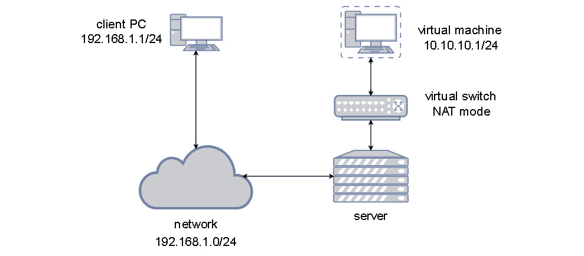
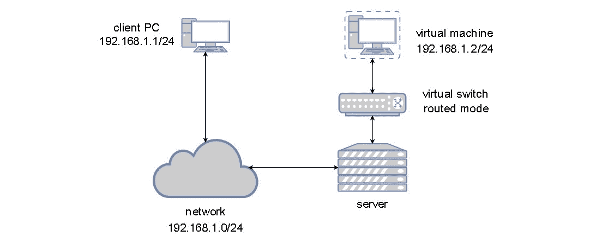
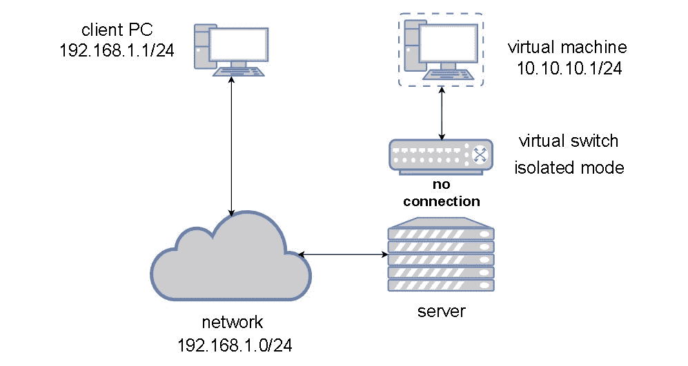
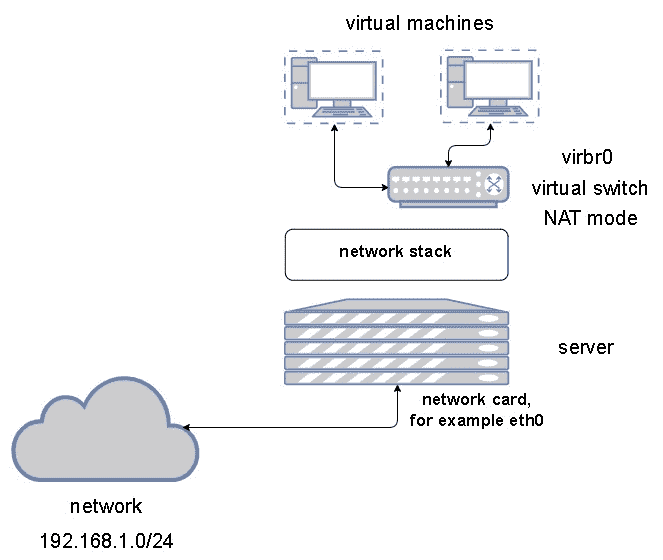
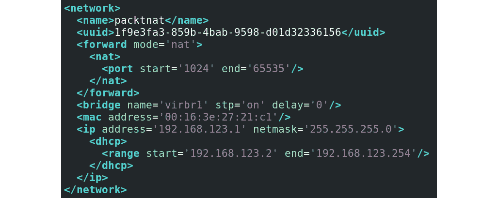
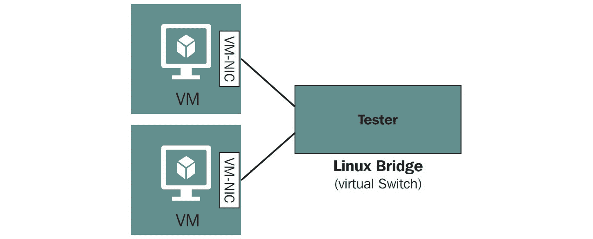
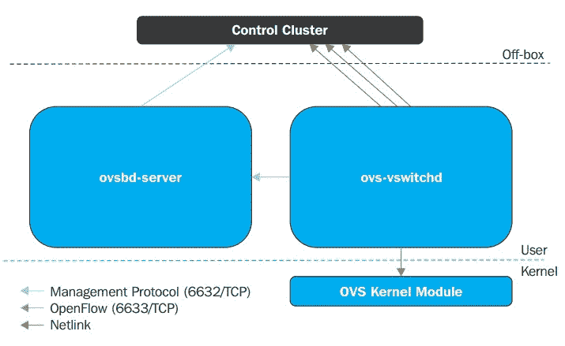
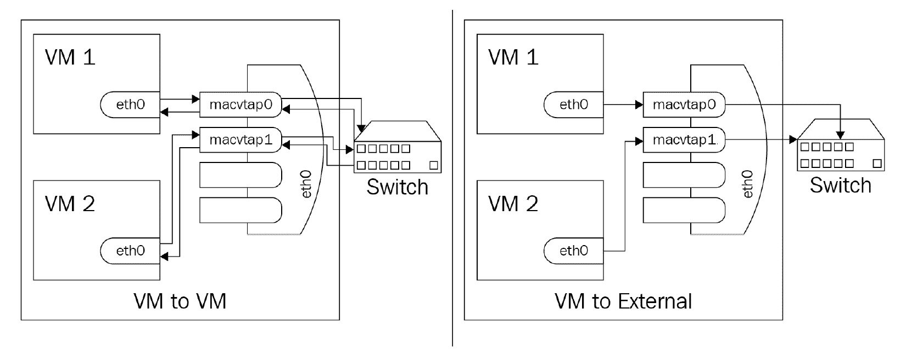
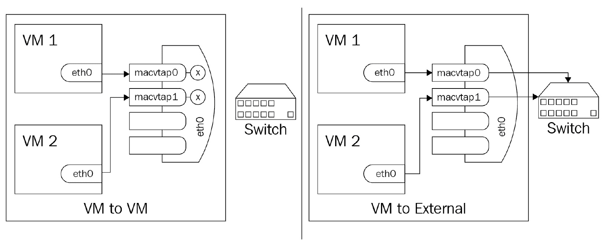

# *第 4 章*：Libvirt 网络

了解虚拟网络的工作原理对于虚拟化非常重要。 我们很难证明与没有虚拟网络的场景相关的成本是合理的。 想象一下，在一台虚拟化主机上有多台虚拟机，并购买网卡，这样每台虚拟机都可以拥有自己的专用物理网络端口。 通过实施虚拟网络，我们还在以一种更易于管理的方式整合网络，无论是从管理角度还是从成本角度都是如此。

本章让您深入了解虚拟化网络的总体概念和基于 Linux 的网络概念。 我们还将讨论物理网络和虚拟网络的概念，尝试对它们进行比较，找出它们之间的异同。 本章还介绍了针对每个主机的虚拟交换概念和跨主机概念，以及一些更高级的主题。 这些主题包括单根输入/输出虚拟化，它为某些场景提供了一种更直接的硬件方法。 当我们开始讨论云覆盖网络时，我们将在本书后面回到一些网络概念上。 这是因为基本的网络概念对于大型云环境的可扩展性不够。

在本章中，我们将介绍以下主题：

*   了解物理和虚拟网络
*   使用 TAP/TUN
*   实现 Linux 桥接
*   配置开放 vSwitch
*   了解和配置 SR-IOV
*   了解 MACVTAP
*   我们开始吧!

# 了解物理和虚拟网络

让我们花点时间考虑一下网络。 这是当今大多数系统管理员都非常了解的主题。 这可能没有达到我们许多人认为的水平，但如果我们试图找到一个系统管理领域，在那里我们可以找到最大的共同知识水平，那就是网络。

那么，这有什么问题呢？

实际上，没什么大不了的。 如果我们真正了解物理网络，虚拟网络对我们来说将是小菜一碟。 剧透警告：*这是一回事*。 如果我们不这样做，它很快就会暴露出来，因为我们别无选择。 随着时间的推移，问题会变得越来越大，因为环境在演变，而且通常会增长。 它们越大，它们产生的问题就越多，您在调试模式中花费的时间就越多。

也就是说，如果您完全在技术层面上牢牢掌握了 VMware 或基于 Microsoft 的虚拟网络，那么您在这里就可以了，因为所有这些概念都非常相似。

有了这些，关于虚拟网络的所有喧嚣又是什么呢？ 这实际上是关于理解事情在哪里发生，如何发生，以及为什么发生。 这是因为，从物理上讲，虚拟网络与物理网络完全相同。 从逻辑上讲，有一些差异更多地与事物的*拓扑*有关，而不是与事物的原理或工程方面有关。 这就是通常会让人有点反感的地方--有一些奇怪的、基于软件的对象，它们的功能与我们大多数人已经习惯于通过我们最喜欢的基于 CLI 或 GUI 的实用程序来管理的物理对象具有相同的功能。

首先，让我们介绍虚拟化网络的基本构建块-虚拟交换机。 虚拟交换机基本上是基于软件的第 2 层交换机，您可以使用它来做两件事：

*   将您的虚拟机连接到它。
*   使用其上行链路将它们连接到物理服务器卡，以便您可以将这些物理网卡连接到物理交换机。

那么，让我们从虚拟机的角度来说明我们为什么需要这些虚拟交换机。 如前所述，我们使用虚拟交换机将虚拟机连接到它。 为什么？ 嗯，如果我们的物理网卡和虚拟机之间没有某种软件对象，我们会有一个大问题-我们只能将有物理网络端口的虚拟机连接到我们的物理网络，这将是不可容忍的。 首先，它违背了虚拟化的一些基本原则，如效率和整合，其次，它的成本很高。 想象一下，您的服务器上有 20 台虚拟机。 这意味着，如果没有虚拟交换机，您必须至少有 20 个物理网络端口才能连接到物理网络。 最重要的是，您实际上还会在物理交换机上使用 20 个物理端口，这将是一场灾难。

因此，通过在虚拟机和物理网络端口之间引入虚拟交换机，我们同时解决了两个问题--减少了每台服务器所需的物理网络适配器数量，以及减少了将虚拟机连接到网络所需的物理交换机端口数量。 我们实际上可以说，我们正在解决第三个问题-效率-因为在许多情况下，一块物理网卡可以处理连接到虚拟交换机的 20 台虚拟机的上行链路。 具体地说，我们的环境中有很大一部分并不消耗大量的网络流量，对于这些场景，虚拟网络的效率令人惊叹。

# 虚拟网络

现在，为了使虚拟交换机能够连接到虚拟机上的某个东西，我们必须有一个要连接的对象-该对象称为虚拟网络接口卡，通常称为 vNIC。 每次使用虚拟网卡配置虚拟机时，都会使其能够连接到使用物理网卡作为物理交换机上行链路的虚拟交换机。

当然，这种方法也有一些潜在的缺点。 例如，如果您有 50 台虚拟机连接到使用相同物理网卡作为上行链路的同一虚拟交换机，但上行链路出现故障(由于网卡问题、电缆问题、交换机端口问题或交换机问题)，则您的 50 台虚拟机将无法访问物理网络。 我们如何绕过这个问题呢？ 通过实施更好的设计，并遵循我们在物理网络上也会使用的基本设计原则。 具体地说，我们将使用多条物理上行链路连接到同一虚拟交换机。

Linux 有许多不同类型的网络接口*，大约有 20 种不同的类型，其中一些如下所示：*

 **   **网桥**：(虚拟机)联网的第 2 层接口。
*   **绑定**：用于将个网络接口合并到单个接口(出于平衡和故障转移原因)为一个逻辑接口。
*   **团队**：与绑定不同，绑定不会创建一个逻辑接口，但仍然可以进行平衡和故障转移。
*   **MACVLAN**：在第 2 层的单个物理接口上创建个 MAC 地址(创建子接口)。
*   **IPVLAN**：与MACVLAN 不同，IPVLAN 使用相同的 MAC 地址并在第 3 层进行多路复用。
*   **MACVTAP/IPVTAP**：较新的驱动程序，通过将 TUN、TAP 和网桥组合为单个模块来简化虚拟网络。
*   **VXLAN**：一个常用的云覆盖网络概念，我们将在[*第 12 章*](12.html#_idTextAnchor209)，*使用 OpenStack 扩展 KVM*中详细描述。
*   **veth**：虚拟以太网接口，可通过多种方式用于本地隧道。
*   **IPOIB**：IP overInfiniband。 随着 Infiniband 在 HPC/低延迟网络中获得吸引力，Linux 内核也支持这种类型的网络。

还有一大堆其他的。 然后，在这些网络接口类型之上，还有大约 10 种隧道接口类型，其中一些类型如下：

*   **GRETAP**、**GRE**：分别用于封装第 2 层和第 3 层协议的通用路由封装协议。
*   **Geneve**：用于云覆盖网络的融合协议，旨在将 VXLAN、GRE 和其他协议融合为一个。 这就是 Open vSwitch、VMware NSX 和其他产品支持它的原因。
*   **IPIP**：IP over IP隧道，用于通过公网连接内部 IPv4 子网。
*   **SIT**：简单的 Internet转换，用于通过 IPv4 互连隔离的 IPv6 网络。
*   **ip6tnl**：IPv6 隧道接口上的 IPv4/6 隧道。
*   **IP6GRE**、**IP6GRETAP**和其他。

了解所有这些接口是一个相当复杂和乏味的过程，因此，在本书中，我们将只关注对我们来说对于虚拟化和(本书后面部分)云非常重要的接口类型。 这就是为什么我们将在[*第 12 章*](12.html#_idTextAnchor209)，*使用 OpenStack*横向扩展 KVM 中讨论 VXLAN 和 Geneve 覆盖网络的原因，因为我们还需要牢牢掌握**软件定义网络**(**SDN**)。

因此，具体地说，作为本章的一部分，我们将介绍 TAP/TUN、桥接、Open vSwitch 和 MacvTap 接口，因为这些都是 KVM 虚拟化最重要的网络概念。

但在我们深入研究这一点之前，让我们先解释几个适用于 KVM/libvirt 网络和其他虚拟化产品的基本虚拟网络概念(例如，VMware 的托管虚拟化产品，如 Workstation 或 Player 使用相同的概念)。 当您开始配置 libvirt 网络时，您可以选择三种基本类型：NAT、路由和隔离。 让我们讨论一下这些网络模式的作用。

## Libvirt NAT 网络

在**NAT**libvirt 网络中(为了确保我们提到这一点，*默认的*网络是这样配置的)，我们的虚拟机位于 NAT 模式下的 libvirt 交换机后面。 想想你的*我有一个互联网连接@home 方案*--这正是我们大多数人所拥有的：我们自己的*私有*网络在一个公共 IP 地址后面。 这意味着我们用于访问互联网的设备(例如，DSL 调制解调器)连接到公共网络(Internet)，并作为该过程的一部分获得公共 IP 地址。 在我们的网络一侧，我们有自己的子网(例如，`192.168.0.0/24`或类似的东西)，用于我们想要连接到互联网的所有设备。

现在，让我们将其转换为一个虚拟化网络示例。 在我们的虚拟机场景中，这意味着我们的虚拟机可以通过主机的 IP 地址与任何连接到物理网络的设备通信，但不能反之亦然。 为了与 NAT 交换机后面的虚拟机进行通信，我们的虚拟机必须启动该通信(或者我们必须设置某种端口转发，但这不是重点)。

下面的图表可能更好地解释了我们正在讨论的内容：



图 4.1-NAT 模式下的 libvirt 联网

从虚拟机的角度来看，它愉快地位于完全独立的网段(因此使用`192.168.122.210`和`220`IP 地址)，并使用虚拟网络交换机作为其访问外部网络的网关。 它不必考虑任何类型的额外路由，因为这是我们使用 NAT 来简化端点路由的原因之一。

## Libvirt 路由网络

第二种网络类型是路由网络，这基本上意味着我们的虚拟机通过虚拟交换机直接连接到物理网络。 这意味着我们的虚拟机与物理主机位于相同的第 2/3 层网络中。 这种类型的网络连接非常常用，因为通常不需要单独的 NAT 网络来访问您环境中的虚拟机。 在某种程度上，这只会让事情变得更加复杂，特别是因为您必须配置路由才能知道您正在为虚拟机使用的 NAT 网络。 使用路由模式时，虚拟机位于与下一个物理设备相同的网段中。 下图讲述了有关路由网络的千言万语：



图 4.2-路由模式下的 libvirt 网络

现在我们已经介绍了两种最常用的虚拟机联网场景，接下来是第三种场景，它看起来有点晦涩难懂。 如果我们配置的虚拟交换机没有任何*上行链路*(这意味着它没有连接物理网卡)，则该虚拟交换机根本无法向物理网络发送流量。 剩下的就是在该交换机本身的限制内进行通信，因此被命名为*Isolated*。 现在让我们创建难以捉摸的隔离网络。

## Libvirt 隔离网络

在此场景中，连接到同一隔离交换机的虚拟机可以相互通信，但它们不能与运行它们的主机之外的任何设备通信。 我们在前面使用了单词*模糊*来描述此场景，但实际上并非如此-在某些方面，它实际上是*隔离*特定类型流量的理想方式，因此它甚至不会到达物理网络。

这样想吧--假设您有一台托管 Web 服务器的虚拟机，例如，运行 WordPress 的虚拟机。 您将创建两个虚拟交换机：一个运行路由网络(直接连接到物理网络)，另一个是隔离的。 然后，您可以使用两个虚拟网卡配置您的 WordPress 虚拟机，第一个连接到路由的虚拟交换机，第二个连接到隔离的虚拟交换机。 WordPress 需要一个数据库，因此您可以创建另一个虚拟机，并将其配置为仅使用内部虚拟交换机。 然后，使用隔离的虚拟交换机*隔离 Web 服务器和数据库服务器之间的*流量，以便 WordPress 通过该交换机连接到数据库服务器。 通过这样配置虚拟机基础设施，您得到了什么？ 您有一个两层应用程序，并且该 Web 应用程序(数据库)的最重要部分无法从外部世界访问。 这主意看起来没那么糟，对吧？

隔离虚拟网络用于许多其他与安全相关的场景中，但这只是一个我们很容易理解的示例场景。

让我们用图来描述我们的隔离网络：



图 4.3-隔离模式下的 libvirt 联网

本书的上一章([*第 3 章*](03.html#_idTextAnchor049)，*安装 KVM Hypervisor、libvirt 和 ovirt*)提到了*默认的*网络，我们说我们稍后会讨论这个问题。 现在似乎是执行此操作的好时机，因为现在我们有足够的信息来描述默认网络配置是什么。

当我们像在[*第 3 章*](03.html#_idTextAnchor049)，*安装 KVM Hypervisor、libvirt 和 oVirt*中所做的那样安装所有必要的 KVM 库和实用程序时，就会配置一个默认的虚拟交换机。 这样做的原因很简单-预先配置一些东西，这样用户就可以开始创建虚拟机并将它们连接到默认网络，而不是预期用户也会进行配置，这样更方便用户。 VMware 的 vSphere 虚拟机管理程序执行相同的操作(默认交换机称为 vSwitch0)，Hyper-V 在部署过程中要求我们配置第一个虚拟交换机(我们可以稍后跳过并配置它)。 因此，这只是一个广为人知的标准化的既定方案，使我们能够更快地开始创建虚拟机。

默认虚拟交换机在 DHCP 服务器处于活动状态的情况下在 NAT 模式下工作，原因也很简单-默认情况下，来宾操作系统预先配置了 DHCP 网络配置，这意味着我们刚刚创建的虚拟机将轮询网络以获取必要的 IP 配置。 这样，虚拟机就可以获得所有必要的网络配置，我们可以立即开始使用它。

下图显示了默认 KVM 网络的功能：



图 4.4-NAT 模式下的 libvirt 默认网络

现在，让我们学习如何从 shell 和 GUI 配置这些类型的虚拟网络概念。 我们将此过程视为需要按顺序完成的过程：

1.  Let's start by exporting the default network configuration to XML so that we can use it as a template to create a new network:

    

    图 4.5-导出默认虚拟网络配置

2.  Now, let's copy that file to a new file called `packtnat.xml`, edit it, and then use it to create a new NAT virtual network. Before we do that, however, we need to generate two things – a new object UUID (for our new network) and a unique MAC address. A new UUID can be generated from the shell by using the `uuidgen` command, but generating a MAC address is a bit trickier. So, we can use the standard Red Hat-proposed method available on the Red Hat website: [https://access.redhat.com/documentation/en-us/red_hat_enterprise_linux/6/html/virtualization_administration_guide/sect-virtualization-tips_and_tricks-generating_a_new_unique_mac_address](https://access.redhat.com/documentation/en-us/red_hat_enterprise_linux/6/html/virtualization_administration_guide/sect-virtualization-tips_and_tricks-generating_a_new_unique_mac_address). By using the first snippet of code available at that URL, create a new MAC address (for example, `00:16:3e:27:21:c1`).

    使用`yum`命令安装 python2：

    ```sh
    yum -y install python2
    ```

    确保更改 XML 文件，使其反映我们正在配置新网桥(`virbr1`)的事实。 现在，我们可以完成新虚拟机网络 XML 文件的配置：

    

    图 4.6-新的 NAT 网络配置

    下一步是导入此配置。

3.  现在，我们可以使用`virsh`命令导入该配置并创建新的虚拟网络，启动该网络并使其永久可用，并检查是否正确加载了所有内容：

    ```sh
    virsh net-define packtnat.xml
    virsh net-start packtnat
    virsh net-autostart packtnat
    virsh net-list
    ```

鉴于我们没有删除默认虚拟网络，最后一个命令应该会给出以下输出：


图 4.7-使用 virsh net-list 检查 KVM 主机上有哪些虚拟网络

现在，让我们再创建两个虚拟网络-桥接网络和隔离网络。 同样，让我们使用文件作为模板来创建这两个网络。 请记住，为了能够创建桥接网络，我们将需要一个物理网络适配器，因此我们需要在服务器中有一个可用于该目的的物理适配器。 在我们的服务器上，该接口称为`ens224`，而默认的libvirt 网络正在使用名为`ens192`的接口。 因此，让我们创建名为`packtro.xml`(用于我们的路由网络)和`packtiso.xml`(用于我们的隔离网络)的两个配置文件：


图 4.8-libvirt 路由网络定义

在此特定配置中，我们使用`ens224`作为到路由虚拟网络的上行链路，该虚拟网络将使用与`ens224`所连接的物理网络相同的子网(`192.168.2.0/24`)：


图 4.9-libvirt 隔离网络定义

为了说明我们的基础，我们可以使用 Virtual Machine Manager GUI轻松地配置所有这些功能，因为该应用程序也有一个用于创建虚拟网络的向导。 但是，当我们讨论更大的环境时，导入 XML 的过程要简单得多，即使我们忘记了许多 KVM 虚拟化主机根本没有安装 GUI 这一事实。

到目前为止，我们已经从整体主机级别讨论了虚拟网络。 然而，对于这个主题还有一种不同的方法-使用虚拟机作为对象，我们可以在其中添加虚拟网卡并将其连接到虚拟网络。 为此，我们可以使用`virsh`。 因此，仅作为示例，我们可以将名为`MasteringKVM01`的虚拟机连接到隔离的虚拟网络：

```sh
virsh attach-interface --domain MasteringKVM01 --source isolated --type network --model virtio --config --live
```

还有其他允许虚拟机连接到物理网络的概念，其中一些我们将在本章后面讨论(例如 SR-IOV)。 但是，既然我们已经介绍了使用虚拟交换机/网桥将虚拟机连接到物理网络的基本方法，我们需要了解更多的技术知识。 问题是，将虚拟机连接到虚拟交换机涉及更多概念，例如 TAP 和 Tun，我们将在下一节中介绍它们。

# 通过 TAP 和 TUN 设备使用用户空间网络

在[*第 1 章*](01.html#_idTextAnchor016)，*了解 Linux 虚拟化*中，我们使用`virt-host-validate`命令根据主机对KVM 虚拟化的准备情况进行了一些飞行前检查。 作为该过程的一部分，一些检查包括检查是否存在以下设备：

*   `/dev/kvm`：KVM 驱动程序在主机上创建`/dev/kvm`字符设备，以方便虚拟机的直接硬件访问。 没有此设备意味着虚拟机将无法访问物理硬件，尽管它已在 BIOS 中启用，这将显著降低虚拟机的性能。
*   `/dev/vhost-net`：将在主机上创建`/dev/vhost-net`字符设备。 此设备用作配置`vhost-net`实例的接口。 没有此设备会显著降低虚拟机的网络性能。
*   `/dev/net/tun`：这是另一个字符特殊设备，用于创建 Tun/TAP 设备，以促进虚拟机的网络连接。 TUN/TAP 设备将在后续章节中详细说明。 现在，只需了解拥有一个字符设备对于 KVM 虚拟化正常工作非常重要。

让我们来关注最后一个设备，Tun 设备，它通常伴随着一个轻击设备。

到目前为止，我们讨论的所有概念都包括到物理网卡的某种连接，隔离虚拟网络是一个例外。 但即使是孤立的虚拟网络也只是我们的虚拟机的虚拟网络。 当我们需要在用户空间进行通信时(例如在服务器上运行的应用程序之间)，会发生什么情况？ 通过某种虚拟交换机概念或常规网桥来修补它们是没有用的，因为这只会带来额外的开销。 这就是 Tun/TAP 设备的用武之地，为用户空间程序提供数据包流。 很容易，应用程序可以打开`/dev/net/tun`并使用`ioctl()`函数在内核中注册网络设备，而内核又将其自身表示为 tunXX 或 tapXX 设备。 当应用程序关闭该文件时，由其创建的网络设备和路由将消失(如内核`tuntap.txt`文档中所述)。 因此，它只是 Linux 内核支持的 Linux 操作系统的一种虚拟网络接口-您可以添加一个 IP 地址并将其路由到该接口，以便来自应用程序的流量可以通过它路由，而不是通过常规的网络设备。

Tun 通过创建通信隧道(类似于点对点隧道)来模拟L3 设备。 当 TunTAP 驱动程序配置为 TUN 模式时，它会激活。 当您激活它时，您从描述符(配置它的应用程序)收到的任何数据都将是常规 IP 包形式的数据(作为最常用的情况)。 此外，当您发送数据时，它会作为常规 IP 包写入 Tun 设备。 这种类型的接口有时用于测试、开发和调试以进行模拟。

TAP 接口基本上模拟 L2 以太网设备。 当 TUNTAP 驱动程序配置为 TAP 模式时，它会被激活。 当您激活它时，与 Tun 接口(第 3 层)不同，您会得到第 2 层原始以太网数据包，包括 ARP/RARP 数据包和其他所有数据包。 基本上，我们谈论的是虚拟化的第 2 层以太网连接。

这些概念(特别是 TAP)也可以在 libvirt/QEMU 上使用，因为通过使用这些类型的配置，我们可以创建从主机到虚拟机的连接-作为示例，无需 libvirt 桥/交换机。 我们实际上可以配置 Tun/TAP 接口的所有必要细节，然后使用`kvm-qemu`选项开始部署直接连接到这些接口的虚拟机。 因此，这是一个相当有趣的概念，在虚拟化世界中也占有一席之地。 当我们开始创建 Linux 网桥时，这一点尤其有趣。

# 实现 Linux 桥接

让我们创建一个桥，然后向其添加一个分路设备。 在此之前，我们必须确保桥模块已加载到内核中。 让我们开始吧：

1.  If it is not loaded, use `modprobe bridge` to load the module:

    ```sh
    # lsmod | grep bridge
    ```

    运行以下命令创建名为`tester`的网桥：

    ```sh
    # brctl addbr tester
    ```

    让我们看看桥是否已创建：

    ```sh
    # brctl show
    bridge name bridge id STP enabled interfaces
    tester 8000.460a80dd627d no
    ```

    `# brctl show`命令将列出服务器上所有可用的网桥，以及一些基本信息，例如网桥 ID、**生成树协议**(**STP**)状态以及连接到它的接口。 这里，测试器桥没有任何接口连接到其虚拟端口。

2.  A Linux bridge will also be shown as a network device. To see the network details of the bridge tester, use the `ip` command:

    ```sh
    # ip link show tester
    6: tester: <BROADCAST,MULTICAST>mtu 1500 qdiscnoop state DOWN mode
    DEFAULT group default link/ether 26:84:f2:f8:09:e0 brdff:ff:ff:ff:ff:ff
    ```

    您还可以使用`ifconfig`检查和配置 Linux 网桥的网络设置；`ifconfig`相对容易阅读和理解，但功能不如`ip`命令丰富：

    ```sh
    # ifconfig tester
    tester: flags=4098<BROADCAST,MULTICAST>mtu 1500
    ether26:84:f2:f8:09:e0txqueuelen 1000 (Ethernet)
    RX packets 0 bytes 0 (0.0 B)
    RX errors 0 dropped 0 overruns 0 frame 0
    TX packets 0 bytes 0 (0.0 B)
    TX errors 0 dropped 0 overruns 0 carrier 0 collisions 0
    ```

    Linux 网桥测试仪现在已经准备好了。 让我们创建一个 TAP 设备并将其添加到其中。

3.  First, check if the TUN/TAP device module is loaded into the kernel. If not, you already know the drill:

    ```sh
    # lsmod | greptun
    tun 28672 1
    ```

    运行以下命令以创建名为`vm-vnic`的 TAP 设备：

    ```sh
    # ip tuntap add dev vm-vnic mode tap
    # ip link show vm-vnic
    7: vm-vnic: <BROADCAST,MULTICAST>mtu 1500 qdiscnoop state DOWN
    mode DEFAULT group default qlen 500 link/ether 46:0a:80:dd:62:7d
    brdff:ff:ff:ff:ff:ff
    ```

    现在我们有一个名为`tester`的网桥和一个名为`vm-vnic`的分路设备。 让我们将`vm-vnic`添加到`tester`：

    ```sh
    # brctl addif tester vm-vnic
    # brctl show
    bridge name bridge id STP enabled interfaces
    tester 8000.460a80dd627d no vm-vnic
    ```

在这里，您可以看到`vm-vnic`是添加到`tester`网桥的接口。 现在，`vm-vnic`可以充当您的虚拟机和`tester`网桥之间的接口，从而使虚拟机能够与添加到此网桥的其他虚拟机进行通信：



图 4.10-连接到虚拟交换机(网桥)的虚拟机

您可能还需要删除在上一步骤中创建的所有对象和配置。 让我们通过命令行逐步完成此操作：

1.  First, we need to remove the `vm-vnic` tap device from the `tester` bridge:

    ```sh
    # brctl delif tester vm-vnic
    # brctl show tester
    bridge name bridge id STP enabled interfaces
    tester 8000.460a80dd627d no
    ```

    从网桥上移除`vm-vnic`后，使用`ip`命令移除分接设备：

    ```sh
    # ip tuntap del dev vm-vnic mode tap
    ```

2.  然后，卸下测试仪桥接器：

    ```sh
    # brctl delbr tester
    ```

这些步骤与libvirt 在启用或禁用虚拟机联网时在后端执行的步骤相同。 我们希望您在继续之前彻底了解此过程。 既然我们已经介绍了 Linux 桥接，现在是时候转向一个更高级的概念，称为 Open vSwitch 了。

# 配置开放 vSwitch

想象一下，假设您在一家小公司工作，该公司有三到四台 KVM 主机、两台网络连接存储设备来托管其 15 台虚拟机，并且您从一开始就被该公司聘用。 因此，您已经看到了一切-公司购买了一些服务器、网络交换机、电缆和存储设备，而您是构建该环境的一个小团队中的一员。 经过两年的过程，你会意识到一切都很正常，维护起来也很简单，也不会给你带来太多的痛苦。

现在，想象一下您的一位朋友在一家规模更大的企业工作，该公司有 400 台 KVM 主机和近 2,000 台虚拟机需要管理，他的工作与您在小公司的办公室舒适的椅子上做的工作相同。

你认为你的朋友可以使用和你一样的工具来管理他或她的环境吗？ 网络交换机配置的 XML 文件，从可引导的 USB 驱动器部署服务器，手动配置所有内容，还有时间这样做吗？ 你觉得这有可能吗？

第二种情况有两个基本问题：

*   环境的规模：这一点更明显。 由于环境的大小，您需要某种集中管理的概念，而不是在每个主机级别上进行管理，比如我们到目前为止讨论的虚拟交换机。
*   公司政策：这些政策通常要求尽可能多地遵循配置标准化。 现在，我们可以同意我们可以通过 Ansible、Pupppet 或类似的东西编写一些配置更新脚本，但这有什么用呢？ 每次需要对 KVM 网络进行更改时，我们都必须创建新的配置文件、新的过程和新的工作簿。 而大公司对此不屑一顾。

因此，我们需要一个可以跨多台主机并提供配置一致性的集中式网络对象。 在这种情况下，配置一致性为我们提供了一个巨大的优势--我们在这类对象中引入的每个更改都将复制到作为此集中式网络对象成员的所有主机。 换句话说，我们需要的是**Open vSwitch**(**OVS**)。 对于那些更精通基于 VMware 的网络的人，我们可以用一个近似的比喻-Open vSwitch 适用于基于 KVM 的环境，类似于 vSphere Distributed Switch 适用于基于 VMware 的环境。

在技术方面，OVS 支持以下功能：

*   VLAN 隔离(IEEE 802.1Q)
*   流量过滤
*   使用或不使用 LACP 的 NIC 绑定
*   各种重叠网络-VXLAN、Geneve、GRE、STT 等
*   802.1ag 支持
*   NetFlow、sFlow 等
*   (R)跨度
*   OpenFlow
*   OVSDB
*   流量排队和整形
*   支持 Linux、FreeBSD、NetBSD、Windows 和 Citrix(以及许多其他产品)

现在我们已经列出了一些受支持的技术，让我们讨论Open vSwitch 的工作方式。

首先，让我们谈谈 Open vSwitch 架构。 Open vSwitch 的实现分为两部分：Open vSwitch 内核模块(数据平面)和用户空间工具(控制窗格)。 由于传入的数据包必须以最快的速度处理，Open vSwitch 的数据面被推送到内核空间：



图 4.11-Open vSwitch 体系结构

Data路径(OVS 内核模块)使用 NetLink 套接字与 vSwitchd 守护进程交互，该守护进程在本地系统上实现和管理任意数量的 OVS 交换机。

Open vSwitch 没有用于管理目的的特定 SDN 控制器，这与 VMware 的 vSphere 分布式交换机和 NSX 类似，后者具有 vCenter 和各种 NSX 组件来管理其功能。 在 OVS 中，重点是使用其他人的 SDN 控制器，然后该控制器使用 OpenFlow 协议与 ovs-vswitchd 交互。 Ovsdb-server 维护交换机表数据库，外部客户端可以使用 JSON-RPC 与 ovsdb-server 通信；JSON 是数据格式。 Ovsdb 数据库当前包含大约 13 个表，此数据库在重新启动后仍保持不变。

Open vSwitch 在两种模式下工作：正常模式和流模式。 本章将主要介绍如何在独立/正常模式下启动连接到 Open vSwitch 网桥的 KVM VM，并简要介绍使用 OpenDaylight 控制器的流模式：

*   **正常模式**：交换和转发由 OVS 网桥处理。 在此调制解调器中，OVS 充当 L2 学习开关。 当为目标配置多个覆盖网络而不是操作交换机的流量时，此模式特别有用。
*   **流模式**：在流模式下，OpenvSwitch 网桥流表用于确定接收数据包应转发到哪个端口。 所有流都由外部 SDN 控制器管理。 添加或删除控制流需要使用管理网桥的 SDN 控制器或使用`ctl`命令。 此模式允许更高级别的抽象和自动化；SDN 控制器公开 REST API。 我们的应用程序可以利用此 API 直接操作网桥的流量，以满足网络需求。

让我们转到实用方面，了解如何在 CentOS 8 上安装 Open vSwitch：

1.  我们必须做的第一件事是告诉我们的系统使用适当的存储库。 在本例中，我们需要启用名为`epel`和`centos-release-openstack-train`的存储库。 我们可以使用几个`yum`命令来实现这一点：

    ```sh
    yum -y install epel-release
    yum -y install centos-release-openstack-train
    ```

2.  下一步将是从 Red Hat 的存储库安装`openvswitch`：

    ```sh
    dnf install openvswitch -y
    ```

3.  After the installation process, we need to check if everything is working by starting and enabling the Open vSwitch service and running the `ovs-vsctl -V` command:

    ```sh
    systemctl start openvswitch
    systemctl enable openvswitch
    ovs-vsctl -V
    ```

    最后一个命令应该会抛出一些输出，指定 Open vSwitch 的版本及其 DB 模式。 在我们的例子中，它是 Open vSwitch`2.11.0`和 DB schema`7.16.1`。

4.  现在我们已经成功安装并启动了 Open vSwitch，是时候配置它了。 让我们选择一个部署场景，在该场景中，我们将使用 Open vSwitch 作为虚拟机的新虚拟交换机。 在我们的服务器中，我们有另一个名为`ens256`的物理接口，我们将使用它作为 Open vSwitch 虚拟交换机的上行链路。 我们还将清除 ens256 配置，为 OVS 配置 IP 地址，并使用以下命令启动 OVS：

    ```sh
    ovs-vsctl add-br ovs-br0
    ip addr flush dev ens256
    ip addr add 10.10.10.1/24 dev ovs-br0
    ovs-vsctl add-port ovs-br0 ens256
    ip link set dev ovs-br0 up
    ```

5.  Now that everything has been configured but not persistently, we need to make the configuration persistent. This means configuring some network interface configuration files. So, go to `/etc/sysconfig/network-scripts` and create two files. Call one of them `ifcfg-ens256` (for our uplink interface):

    ```sh
    DEVICE=ens256
    TYPE=OVSPort
    DEVICETYPE=ovs
    OVS_BRIDGE=ovs-br0
    ONBOOT=yes
    ```

    将另一个文件命名为`ifcfg-ovs-br0`(对于我们的 OVS)：

    ```sh
    DEVICE=ovs-br0
    DEVICETYPE=ovs
    TYPE=OVSBridge
    BOOTPROTO=static
    IPADDR=10.10.10.1
    NETMASK=255.255.255.0
    GATEWAY=10.10.10.254
    ONBOOT=yes
    ```

6.  我们配置所有这些并不是为了炫耀，所以我们需要确保我们的 KVM 虚拟机也能够使用它。 这再次意味着我们需要创建一个将使用 OVS 的 KVM 虚拟网络。 幸运的是，我们以前已经处理过 KVM 虚拟网络 XML 文件(查看*Libvirt Isolated Network*部分)，所以这个不会成为问题。 让我们调用我们的网络`packtovs`及其对应的 XML 文件`packtovs.xml`。 应包含以下内容：

    ```sh
    <network>
    <name>packtovs</name>
    <forward mode='bridge'/>
    <bridge name='ovs-br0'/>
    <virtualport type='openvswitch'/>
    </network>
    ```

因此，现在，当我们在 XML 文件中有一个虚拟网络定义时，我们可以执行我们通常的操作，即定义、启动和自动启动网络：

```sh
virsh net-define packtovs.xml
virsh net-start packtovs
virsh net-autostart packtovs
```

如果我们将所有内容保留为创建虚拟网络时的状态，则`virsh net-list`的输出应如下所示：


图 4.12-成功的 OVS 配置和 OVS+KVM 配置

所以，现在剩下的就是将一个 VM 连接到我们新定义的基于 OVS 的网络`packtovs`上，我们就可以自由回家了。 或者，我们也可以使用在[*第 3 章*](03.html#_idTextAnchor049)，*安装 KVM Hypervisor、libvirt 和 oVirt*中获得的知识，创建一个新接口并将其预连接到该特定接口。 因此，让我们发出以下命令，该命令只有两个更改的参数(`--name`和`--network`)：

```sh
virt-install --virt-type=kvm --name MasteringKVM03 --vcpus 2 --ram 4096 --os-variant=rhel8.0 --cdrom=/var/lib/libviimg/CentOS-8-x86_64-1905-dvd1.iso --network network:packtovs --graphics vnc --disk size=16
```

虚拟机安装完成后，我们连接到基于 OVS 的`packtovs`虚拟网络，我们的虚拟机可以使用它。 假设需要额外的配置，并且我们收到了使用`VLAN ID 5`标记来自该虚拟机的流量的请求。 启动虚拟机并使用以下命令集：

```sh
ovs-vsctl list-ports ovs-br0
ens256
vnet0
```

该命令告诉我们，我们正在使用`ens256`端口作为上行链路，我们的虚拟机`MasteringKVM03`正在使用虚拟的`vnet0`网络端口。 我们可以使用以下命令将 VLAN 标记应用到该端口：

```sh
ovs-vsctl set port vnet0 tag=5
```

我们需要注意一些与 OVS 管理相关的附加命令，因为这是通过 CLI 完成的。 下面是一些常用的 OVS CLI 管理命令：

*   `#ovs-vsctl show`：一个非常方便且经常使用的命令。 它告诉我们交换机的当前运行配置是什么。
*   `#ovs-vsctl list-br`：列出 Open vSwitch 上配置的网桥。
*   `#ovs-vsctl list-ports <bridge>`：显示`BRIDGE`上所有端口的名称。
*   `#ovs-vsctl list interface <bridge>`：显示`BRIDGE`上所有接口的名称。
*   `#ovs-vsctl add-br <bridge>`：在交换机数据库中创建网桥。
*   `#ovs-vsctl add-port <bridge> : <interface>`：将接口(物理或虚拟)绑定到 Open vSwitch 网桥。
*   `#ovs-ofctl and ovs-dpctl`：这两个命令用于管理和监控流条目。 您了解了 OVS 管理两种流：OpenFlow 和数据路径。 第一个是在控制平面中管理的，而第二个是基于内核的流。
*   `#ovs-ofctl`：这与 OpenFlow 模块对话，而`ovs-dpctl`与内核模块对话。

以下示例是每个命令最常用的选项：

*   `#ovs-ofctl show <BRIDGE>`：显示有关交换机的简要信息，包括端口号到端口名称的映射。
*   `#ovs-ofctl dump-flows <Bridge>`：检查 OpenFlow 表格。
*   `#ovs-dpctl show`：打印交换机上存在的所有逻辑数据路径(称为*网桥*)的基本信息。
*   `#ovs-dpctl dump-flows`：显示数据路径中缓存的流。
*   `ovs-appctl`：此命令提供了一种向正在运行的 Open vSwitch 发送命令的方法，并收集未直接暴露给`ovs-ofctl`命令的信息。 这是瑞士军刀 OpenFlow 的故障排除。
*   `#ovs-appctl bridge/dumpflows <br>`：检查流表并为相同主机上的虚拟机提供直接连接。
*   `#ovs-appctl fdb/show <br>`：列出获知的 MAC/VLAN 对。

此外，您始终可以使用`ovs-vsctl show`命令获取有关 OVS 交换机配置的信息：


图 4.13-ovs-vsctl 显示输出

我们将回到[*第 12 章*](12.html#_idTextAnchor209)*使用 OpenStack 扩展 KVM*中的 Open vSwitch 主题，深入讨论如何跨多台主机扩展 Open vSwitch，特别是要记住，我们希望能够跨多台主机和站点跨云覆盖网络(基于 Geneve、VXLAN、GRE 或类似协议)。

## 其他 Open vSwitch 使用情形

正如您可能想象的那样，Open vSwitch 不仅仅是 libvirt 或 OpenStack 的一个方便的概念--它还可以用于各种其他场景。 让我们来描述其中的一个，因为它对于研究 VMware NSX 或 NSX-T 集成的人来说可能很重要。

让我们在这里只描述几个基本的术语和关系。 VMware 的 NSX 是一项基于 SDN 的技术，可用于各种使用情形：

*   连接数据中心并跨数据中心边界扩展云覆盖网络。
*   各种灾难恢复方案。 NSX 可以为灾难恢复、多站点环境以及与方案(Palo Alto PANS)中可能包含的各种外部服务和设备集成提供很大帮助。
*   跨站点进行一致的微细分，在虚拟机网卡级别以正确的方式*完成*。
*   出于安全目的，从用于连接站点和最终用户的不同类型的受支持 VPN 技术，到分布式防火墙、来宾自检选项(防病毒和反恶意软件)、网络自检选项(IDS/IPS)等，应有尽有。
*   对于负载平衡，最高可达 7 层，具有 SSL 卸载、会话持久性、高可用性、应用程序规则等功能。

没错，VMware 对 SDN(NSX)和 Open vSwitch 的竞争在市场上看起来像是*竞争技术*，但实际上，有很多客户想要同时使用这两种技术。 这就是 VMware 与 OpenStack 的集成以及 NSX 与基于 Linux 的 KVM 主机的集成(通过使用 Open vSwitch 和其他代理)真正派上用场的地方。 仅进一步解释这些要点-NSX 所做的一些事情需要*广泛使用基于 Open vSwitch 的技术*-通过 Open vSwitch 数据库实现硬件 VTEP 集成，通过 Open vSwitch/NSX 集成将 Geneve 网络扩展到 KVM 主机，等等。

想象一下，您正在为一家服务提供商工作--一家云服务提供商，一家 ISP；基本上，任何类型的公司都拥有大量网络分段的大型网络。 有大量的服务提供商使用 VMware 的 vCloud Director 向最终用户和公司提供云服务。 但是，由于市场需求，这些环境通常需要扩展以包括 AWS(用于通过公共云实现额外的基础设施增长场景)或 OpenStack(用于创建混合云场景)。 如果我们不可能在这些解决方案之间实现互操作性，就不可能同时使用这两种产品。 但从网络的角度来看，其网络背景是 NSX 或 NSX-T(实际上*使用*Open vSwitch)。

多年来已经很清楚，未来完全是多云环境，这些类型的集成将带来更多客户；他们会希望在云服务设计中利用这些选项。 未来的开发还很可能包括(并且已经部分包括)与 Docker、Kubernetes 和/或 OpenShift 的集成，以便能够在同一环境中管理容器。

还有一些更极端的使用硬件的例子-在我们的例子中，我们谈论的是 PCI Express 总线上的网卡-以*分区*的方式。 目前，我们对这个概念(称为 SR-IOV)的解释将仅限于网卡，但我们将在[*第 6 章*](06.html#_idTextAnchor108)，*虚拟显示设备和协议*中扩展相同的概念，当我们开始讨论对 GPU 进行分区以在虚拟机中使用时。 因此，让我们讨论一个在支持 SR-IOV 的英特尔网卡上使用 SR-IOV 的实际示例。

# 了解和使用 SR-IOV

我们已经在[*第 2 章*](02.html#_idTextAnchor029)、*KVM 中提到了SR-IOV 概念作为虚拟化解决方案*。 通过利用 SR-IOV，我们可以将*个*个 PCI 资源(例如网卡)划分为虚拟 PCI 函数，并将它们注入到虚拟机中。 如果我们将这个概念用于网卡，我们这样做通常只有一个目的-这样我们就可以避免在从虚拟机访问网卡时使用操作系统内核和网络堆栈。 为了使我们能够做到这一点，我们需要硬件支持，因此我们需要检查我们的网卡是否真的支持它。 在物理服务器上，我们可以使用`lspci`命令提取有关 PCI 设备的属性信息，然后`grep`输出*Single Root I/O Virtualization*作为字符串，以尝试查看是否有兼容的设备。 下面是我们的服务器中的一个示例：


图 4.14-检查我们的系统是否与 SR-IOV 兼容

重要注

配置 SR-IOV 时要小心。 您需要有支持 SR-IOV 的服务器和设备，并且必须确保在 BIOS 中启用 SR-IOV 功能。 然后，您需要记住，有些服务器只为 SR-IOV 分配了特定插槽。 我们使用的服务器(HP ProLiant DL380p G8)有三个分配给 CPU1 的 PCI-Express 插槽，但 SR-IOV 只能在插槽#1 中工作。当我们将卡连接到插槽#2 或#3 时，我们收到一条 BIOS 消息，提示 SR-IOV 在该插槽中无法工作，我们应该将卡移动到支持 SR-IOV 的插槽。 因此，请确保您彻底阅读了服务器的文档，并将 SR-IOV 兼容设备连接到正确的 PCI-Express 插槽。

在本例中，它是一个带有两个端口的Intel 10 千兆网络适配器，我们可以用它来执行 SR-IOV。 这个过程并不是那么困难，它需要我们完成以下步骤：

1.  解除与上一个模块的绑定。
2.  将其注册到 vfio-pci 模块，该模块在 Linux kerNEL 堆栈中可用。
3.  配置要使用它的来宾。

因此，您需要做的是使用`modprobe -r`卸载网卡当前使用的模块。 然后，您可以再次加载它，但需要指定一个额外的参数。 在我们的特定服务器上，我们正在使用的 Intel 双端口适配器(x540-AT2)被分配给`ens1f0`和`ens1f1`网络设备。 因此，让我们使用`ens1f0`作为引导时 SR-IOV 配置的示例：

1.  The first thing that we need to do (as a general concept) is find out which kernel module our network card is using. To do that, we need to issue the following command:

    ```sh
    ethtool -i ens1f0 | grep ^driver
    ```

    在我们的示例中，以下是我们获得的输出：

    ```sh
    driver: ixgbe
    ```

    我们需要为该模块找到其他可用的选项。 为此，我们可以使用`modinfo`命令(我们只对输出的`parm`部分感兴趣)：

    ```sh
    modinfo ixgbe
    …..
    Parm:		max_vfs (Maximum number of virtual functions to allocate per physical function – default iz zero and maximum value is 63.
    ```

    例如，我们在这里使用`ixgbe`模块，我们可以执行以下操作：

    ```sh
    modprobe -r ixgbe
    modprobe ixgbe max_vfs=4
    ```

2.  然后，我们可以使用`modprobe`系统在`/etc/modprobe.d`中创建一个名为(例如)`ixgbe.conf`的文件，并向其中添加以下行，从而使这些更改在重新启动后保持不变：

    ```sh
    options ixgbe max_vfs=4
    ```

这将为我们提供最多四个可在虚拟机中使用的虚拟功能。 现在，我们需要解决的下一个问题是如何在引导时在 SR-IOV 处于活动状态的情况下引导我们的服务器。 这里涉及到相当多的步骤，所以，让我们开始吧：

1.  我们需要将`iommu`和`vfs`参数添加到缺省内核引导行和缺省内核配置中。 因此，首先，打开`/etc/default/grub`并编辑`GRUB_CMDLINE_LINUX`行，然后添加`intel_iommu=on`(如果您使用的是 AMD 系统，则添加`amd_iommu=on`)和`ixgbe.max_vfs=4`。
2.  我们需要重新配置`grub`以使用此更改，因此需要使用以下命令：

    ```sh
    grub2-mkconfig -o /boot/grub2/grub.cfg
    ```

3.  有时，即使这样还不够，所以我们需要配置必要的内核参数，比如要在服务器上使用的最大虚拟函数数和`iommu`参数。 这将我们引向以下命令：

    ```sh
    grubby --update-kernel=ALL --args="intel_iommu=on ixgbe.max_vfs=4"
    ```

重新启动后，我们应该能够看到我们的虚拟功能。 键入以下命令：

```sh
lspci -nn | grep "Virtual Function"
```

我们应该得到如下所示的输出：


图 4.15-检查虚拟函数可见性

我们应该能够从 libvirt 看到这些虚拟函数，并且可以通过`virsh`命令进行检查。 让我们试一试(我们使用`grep 04`，因为我们的设备 ID 以 04 开头，这在上图中是可见的；我们将把输出缩小到只有重要的条目)：

```sh
virsh nodedev-list | grep 04 
……
pci_0000_04_00_0
pci_0000_04_00_1
pci_0000_04_10_0
pci_0000_04_10_1
pci_0000_04_10_2
pci_0000_04_10_3
pci_0000_04_10_4
pci_0000_04_10_5
pci_0000_04_10_6
pci_0000_04_10_7
```

前两个设备是我们的物理功能。 其余 8 个设备(两个端口乘以四个功能)是我们的虚拟设备(从`pci_0000_04_10_0`到`pci_0000_04_10_7`)。 现在，让我们使用`virsh nodedev-dumpxml pci_0000_04_10_0`命令转储该设备的信息：


图 4.16-virsh 视角下的虚拟函数信息

因此，如果我们有一个正在运行的虚拟机，我们想要重新配置它以使用它，我们必须创建一个定义如下的 XML 文件(让我们称其为`packtsriov.xml`)：

```sh
<interface type='hostdev' managed='yes' >
    <source>
    <address type='pci' domain='0x0000' bus='0x04' slot='0x10' function='0x0'>
    </address>
    </source>
</interface>
```

当然，域、总线、插槽和函数需要精确指向我们的 VF。 然后，我们可以使用`virsh`命令将该设备连接到我们的虚拟机(例如，`MasteringKVM03`)：

```sh
virsh attach-device MasteringKVM03 packtsriov.xml --config
```

当我们使用`virsh dumpxml`时，我们现在应该看到以`<driver name='vfio'/>`开头的输出的一部分，以及我们在上一步中配置的所有信息(地址类型、域、总线、插槽、功能)。 我们的虚拟机将此虚拟功能用作网卡应该没有问题。

现在，我们来介绍另一个在 KVM 网络中非常有用的概念：macvap。 这是一个较新的驱动程序，可以通过单个模块完全删除 TUN/TAP 和桥接驱动程序，从而简化我们的虚拟化网络。

# 了解 MACVTAP

此模块的工作方式类似于分路器和 macvlan 模块的组合。 我们已经解释了分接模块的作用。 Macvlan 模块使我们能够创建固定到物理网络接口的虚拟网络(通常，我们将此接口称为*下*接口或设备)。 结合使用 TAP 和 Macvlan，我们可以在四种不同的操作模式(称为**虚拟以太网端口聚合器**(**VEPA**))、网桥、专用和通过模式之间进行选择。

如果我们使用的是VEPA 模式(默认模式)，物理交换机必须通过支持`hairpin`模式(也称为反射中继)来支持 VEPA。 当*较低*设备从 VEPA 模式 macvlan 接收数据时，此流量始终发送到上游设备，这意味着流量始终通过外部交换机。 此模式的优势在于，虚拟机之间的网络流量在外部网络上变得可见，这可能出于各种原因而有用。 您可以在以下顺序的图中检查网络流是如何工作的：



图 4.17-MACVTAP VEPA 模式，在该模式下，流量被强制传输到外部网络

在私有模式下，它类似于VEPA，因为所有内容都会到达外部交换机，但与 VEPA 不同的是，流量只有在通过外部路由器或交换机发送时才会被传送。 如果您希望将连接到端点的虚拟机彼此隔离，但不想将其与外部网络隔离，则可以使用此模式。 如果这听起来非常像私有 VLAN 场景，那么您完全正确：



图 4.18-专用模式下的 macvap，用于内部网络隔离

在网桥模式下，在您的 macvlan 上接收的数据本应发送到同一较低设备上的另一个 macvlan，但会直接发送到目标，而不是从外部发送，然后路由回来。 这非常类似于 VMware NSX 在不同 VXLAN 网络上但在同一主机上的虚拟机之间进行通信时所执行的操作：


图 4.19-网桥模式下的 MACVTAP，提供一种内部路由

在直通模式下，我们基本上是在谈论 SR-IOV 场景，在该场景中，我们使用 VF 或物理设备直接连接到 macvap 接口。 关键区别在于，单个网络接口只能传递给单个访客(1：1 关系)：


图 4.20-直通模式下的 MACVTAP

在[*第 12 章*](12.html#_idTextAnchor209)，*使用 OpenStack 横向扩展 KVM*和[*第 13 章*](13.html#_idTextAnchor238)，*使用 AWS 横向扩展 KVM，*我们将介绍为什么虚拟化和*覆盖*网络(VXLAN、GRE、Geneve)对于云网络更加重要，因为我们通过以下两种方式将基于 KVM 的本地环境扩展到云

# 摘要

在本章中，我们介绍了 KVM 中虚拟化网络的基础知识，并解释了为什么虚拟化网络在虚拟化中占如此大的比重。 我们深入研究了配置文件及其选项，因为这将是大型环境中管理的首选方法，尤其是在讨论虚拟化网络时。

请密切关注我们在本章中讨论的所有配置步骤，特别是与使用 virsh 命令操作网络配置以及配置 Open vSwitch 和 SR-IOV 相关的部分。 基于 SR-IOV 的概念在延迟敏感型环境中大量使用，以尽可能低的开销和延迟提供网络服务，这就是为什么这一原则对于与金融和银行部门相关的各种企业环境非常重要。

既然我们已经介绍了所有必要的联网场景(其中一些场景将在本书后面重新讨论)，是时候开始思考虚拟化世界的下一个大话题了。 我们已经讨论了 CPU 和内存，以及网络，这意味着我们只剩下虚拟化的第四个支柱：存储。 我们将在下一章解决这个问题。

# 问题

1.  为什么虚拟交换机同时接受来自多个虚拟机的连接很重要？
2.  虚拟交换机在 NAT 模式下如何工作？
3.  虚拟交换机如何在路由模式下工作？
4.  什么是 Open vSwitch？我们可以在虚拟化和云环境中将其用于什么目的？
5.  描述 TAP 接口和 TUN 接口之间的区别。

# 进一步阅读

有关本章内容的更多信息，请参阅以下链接：

*   Libvirt 网络：[https://wiki.libvirt.org/page/VirtualNetworking](https://wiki.libvirt.org/page/VirtualNetworking)
*   网络 xml 格式：[https://libvirt.org/formatnetwork.html](https://libvirt.org/formatnetwork.html)
*   打开 vSwitch：[HTTPS：//www.openvswitch.org/](https://www.openvswitch.org/)
*   打开 vSwitch 和 libvirt：[http://docs.openvswitch.org/en/latest/howto/libvirt/](http://docs.openvswitch.org/en/latest/howto/libvirt/)
*   打开 vSwitch 小抄：[https://adhioutlined.github.io/virtual/Openvswitch-Cheat-Sheet/](https://adhioutlined.github.io/virtual/Openvswitch-Cheat-Sheet/)*