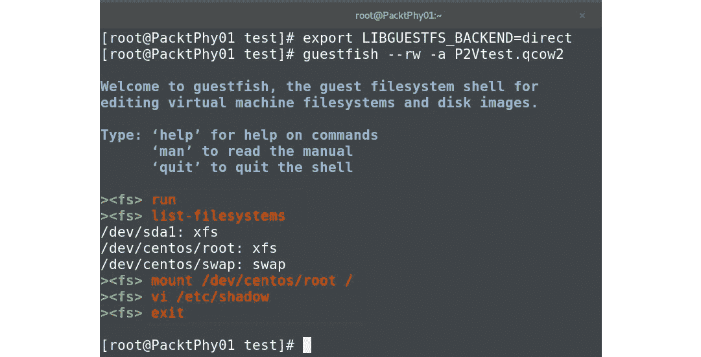
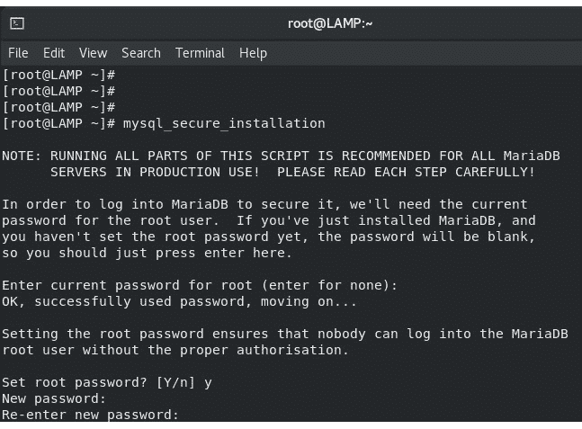
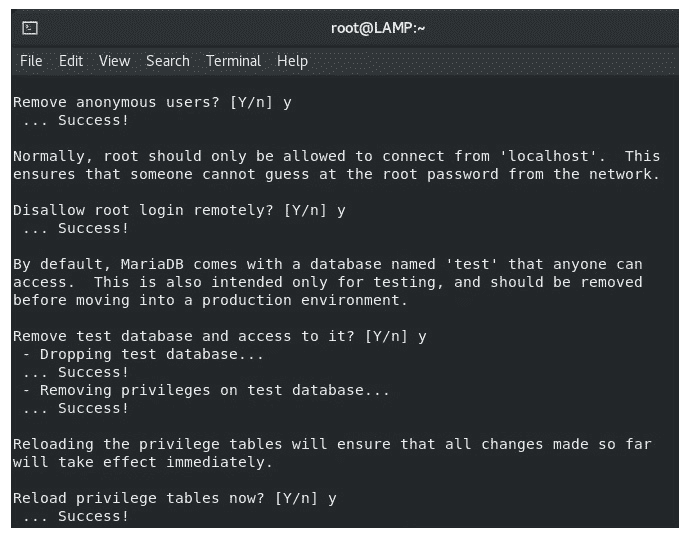
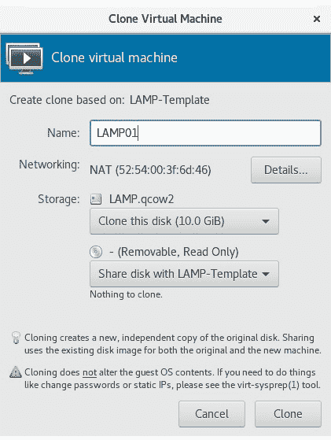
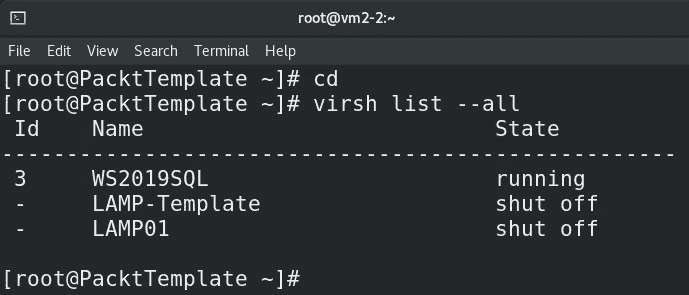
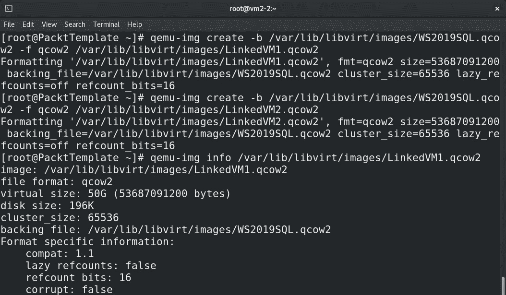
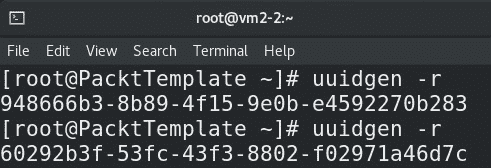
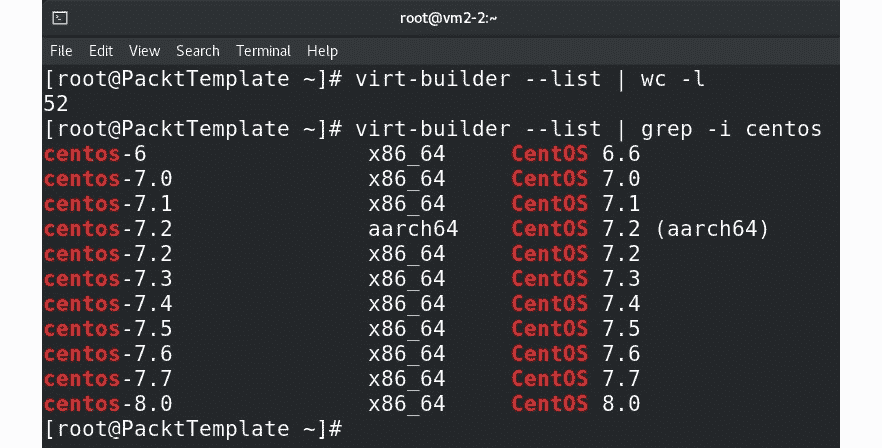
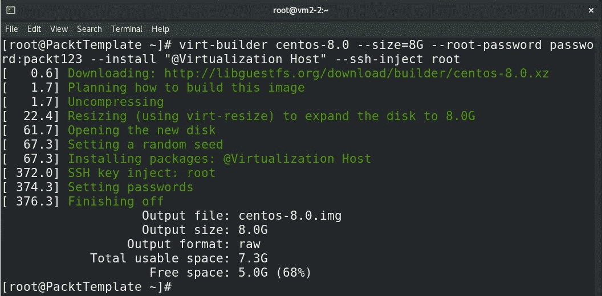
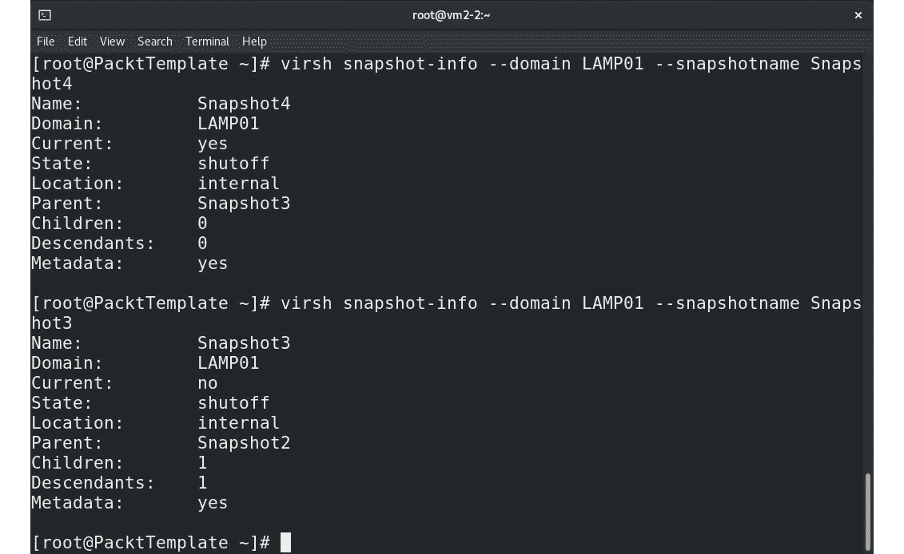

# *第 8 章*：创建和修改虚拟机磁盘、模板和快照

本章是本书第二部分的结尾，其中我们重点介绍了各种`libvirt`功能-安装**基于内核的虚拟机**(**KVM**)作为解决方案、`libvirt`网络和存储、虚拟设备和显示协议、安装**虚拟机**(**虚拟机**)并将其配置为…。 所有这些都是为本书下一部分将要介绍的内容做准备，下一部分是关于自动化、定制和编排的。 为了让我们能够了解这些概念，我们现在必须将重点转向 VM 及其高级操作-修改、模板化、使用快照等。 这些主题中的一些经常会在本书的后面被引用，并且由于生产环境中的各种业务原因，这些主题中的一些甚至会更有价值。 让我们潜入水中掩护他们吧。

在本章中，我们将介绍以下主题：

*   使用`libguestfs`工具修改虚拟机映像
*   VM 模板
*   `virt-builder`和`virt-builder`报告
*   快照
*   使用快照时的使用情形和最佳做法

# 使用 libguestfs 工具修改虚拟机映像

随着我们在本书中的重点更多地转向向外扩展，我们必须在本书的这一部分结束时介绍一系列在我们开始构建更大的环境时将派上用场的命令堆栈。 对于更大的环境，我们确实需要各种自动化、定制和编排工具，我们将在下一章开始讨论这些工具。 但首先，我们必须专注于我们已经拥有的各种定制实用程序。 这些命令行实用程序对于许多不同类型的操作非常有用，从`guestfish`(用于访问和修改 VM 文件)到`virt-p2v`(**物理到虚拟**(**P2V**)转换)和`virt-sysprep`(在模板化和克隆之前转换为*sysprep*VM)。 因此，让我们以一种工程的方式来探讨这些实用程序的主题--一步一步来。

`libguestfs`是用于处理 VM 磁盘的实用程序的命令行库。 该库由大约 30 个不同的命令组成，其中一些命令包含在下面的列表中：

*   `guestfish`
*   `virt-builder`
*   `virt-builder-repository`
*   `virt-copy-in`
*   `virt-copy-out`
*   `virt-customize`
*   `virt-df`
*   `virt-edit`
*   `virt-filesystems`
*   `virt-rescue`
*   `virt-sparsify`
*   `virt-sysprep`
*   `virt-v2v`
*   `virt-p2v`

我们将从五个最重要的命令开始-`virt-v2v`、`virt-p2v`、`virt-copy-in`、`virt-customize`和`guestfish`。 我们将在讨论 VM 模板时介绍`virt-sysprep`，本章中有专门介绍`virt-builder`的单独部分，因此我们暂时跳过这些命令。

## 帖子主题：Re：Колибри

假设您有一个基于 Hyper-V、Xen 或 VMware 的 VM，并且您希望将它们转换为 KVM、oVirt、Red Hat Enterprise虚拟化或 OpenStack。 在这里，我们只使用基于 VMware 的 VM 作为示例，并将其转换为将由`libvirt`实用程序管理的 KVM。 由于 VMware 平台的 6.0+版本中引入了一些更改(包括集成了**ESX 的**(**ESXi**)虚拟机管理程序端以及 vCenter 服务器端和插件端)，因此导出 VM 并将其转换为 KVM(使用 vCenter 服务器或 ESXi 主机作为源)将非常耗时。 因此，将 VMware 虚拟机转换为 KVM 的最简单方法如下：

1.  关闭 vCenter 或 ESXi 主机中的虚拟机。
2.  将 VM 导出为**Open Virtualization Format**(**OVF**)模板(将 VM 文件下载到您的`Downloads`目录)。
3.  从[https://code.vmware.com/web/tool/4.3.0/ovf](https://code.vmware.com/web/tool/4.3.0/ovf)安装 Vmware`OVFtool`实用程序。
4.  将导出的 VM 文件移动到`OVFtool`安装文件夹。
5.  将OVF 格式的 VM 转换为**Open Virtualization Appliance**(**OVA**)格式。

我们需要`OVFtool`进行此操作的原因相当令人失望-VMware 似乎取消了直接导出 OVA 文件的选项。 幸运的是，`OVFtool`适用于基于 Windows、Linux 和 OSX 的平台，因此使用它不会有问题。 以下是该过程的最后一步：


图 8.1-使用 OVFtool 将 OVF 转换为 OVA 模板格式

完成此操作后，我们可以轻松地将`v2v.ova`文件上传到我们的 KVM 主机，并在`ova`文件目录中键入以下命令：

```sh
virt-v2v -i ova v2v.ova -of qcow2 -o libvirt -n default
```

`-of`和`-o`选项指定输出格式(`qcow2`libvirt 映像)，`-n`确保 VM 连接到默认虚拟网络。

如果需要将Hyper-V VM 转换为 KVM，可以执行以下操作：

```sh
virt-v2v -i disk /location/of/virtualmachinedisk.vhdx -o local -of qcow2 -os /var/lib/libvirt/images
```

请确保正确指定 VM 磁盘位置。 `-o local`和`-os /var/lib/libvirt/images`选项确保转换后的磁盘映像保存在本地指定的目录(KVM 默认映像目录)中。

还有其他类型的 VM 转换过程，例如将物理机转换为虚拟机。 我们现在就来报道这一点。

## 加入时间：清华大学 2007 年 01 月 25 日下午 3：33

现在我们已经介绍了`virt-v2v`，让我们切换到`virt-p2v`。 基本上，`virt-v2v`和`virt-p2v`执行的任务与相似，但`virt-p2v`的目标是将*物理*计算机转换为*VM*。 从技术上讲，这是非常不同的，因为使用`virt-v2v`我们可以直接访问管理服务器和虚拟机管理程序，并动态转换虚拟机(或通过 OVA 模板)。 对于物理机，没有管理机可以提供某种支持或**应用程序编程接口**(**API**)来执行转换过程。 我们必须*直接攻击*物理机。 在真实的 IT 世界中，这通常是通过某种代理或其他应用程序来完成的。

举例来说，如果您想要将物理 Windows 计算机转换为基于 VMware 的 VM，则必须在需要转换的系统上安装独立的 VMware vCenter Converter。 然后，您必须选择正确的操作模式并*流式*将整个转换过程传输到 vCenter/ESXi。 它确实运行得相当好，但是--例如--RedHat 的方法有点不同。 它使用引导介质来转换物理服务器。 因此，在使用此转换过程之前，您必须登录客户门户(对于**Red Hat Enterprise Linux**(**https://access.redhat.com/downloads/content/479/ver=/rhel---8/8.0/x86_64/product-software**)8.0，您必须登录到客户门户(位于[RHEL](https://access.redhat.com/downloads/content/479/ver=/rhel---8/8.0/x86_64/product-software))，并且您可以从菜单中切换版本)。 然后，您必须下载正确的映像，并使用`virt-p2v`和`virt-p2v-make-disk`实用程序创建映像。 但是，请注意，`virt-p2v-make-disk`实用程序使用的是`virt-builder`，我们将在本章稍后的单独部分介绍它。 所以，让我们暂时搁置这个讨论，因为我们很快就会全力以赴地回到这个问题上来。

另外，在此命令支持的目的地列表中，我们可以使用 Red Hat Enterprise Virtualization、OpenStack 或 KVM/`libvirt`。 就支持的体系结构而言，`virt-p2v`仅在基于 x86_64 的平台上受支持，并且仅当它在 RHEL/CentOS 7 和 8 上使用时才受支持。计划执行 P2V 转换时请牢记这一点。

## 客鱼

在本章的这一介绍部分中，我们要讨论的最后一个实用程序称为`guestfish`。 这是一个非常、非常重要的实用程序，它使您能够使用实际的 VM 文件系统执行各种高级操作。 我们还可以使用它执行不同类型的转换-例如，将**国际标准化组织**(**ISO**)映像转换为`tar.gz`；将虚拟磁盘映像从`ext4`文件系统转换为**逻辑卷管理**(**LVM**)支持的`ext4`文件系统；等等。 我们将向您展示几个示例，说明如何使用它打开一个 VM 镜像文件并查找一些内容。

第一个示例非常常见-您已经准备了一个带有完整 VM 的`qcow2`映像；安装了来宾操作系统；一切都已配置好；您已经准备好将该 VM 文件复制到要重用的地方；以及……。 您还记得您没有根据某些规范配置 root 密码。 假设这是您必须为客户端执行的操作，并且该客户端对初始根密码有特定的根密码要求。 这使得客户端更容易-他们不需要您在电子邮件中发送密码；他们只需要记住一个密码；并且，在收到映像后，它将用于创建 VM。 在创建并运行虚拟机之后，根密码将根据安全实践更改为客户端使用的密码。

因此，基本上，第一个示例说明了作为*人*意味着什么-忘记做某事，然后想要修复它，但是(在本例中)没有实际运行 VM，因为这可能会更改相当多的设置，特别是如果您的`qcow2`映像是在考虑到 VM 模板的情况下创建的，在这种情况下，您*肯定不想启动那个 VM 来修复一些东西。 有关这一点的更多信息，请参阅本章的下一部分。*

这是`guestfish`的理想用例。 假设我们的`qcow2`图像称为`template.qcow2`。 让我们将 root 密码更改为其他密码-例如，`packt123`。 首先，我们需要该密码的散列。 最简单的方法是使用带有`-6`选项的`openssl`(相当于 SHA512 加密)，如以下屏幕截图所示：


图 8.2-使用 OpenSSL 创建基于 SHA512 的密码散列

现在我们有了散列，我们可以挂载和编辑映像了，如下所示：



图 8.3-使用 Guestfish 在我们的 qco2VM 映像中编辑超级用户密码

我们键入的 shell 命令用于直接访问映像(无需`libvirt`参与)，并以读写模式挂载映像。 然后，我们启动会话(`guestfish run`命令)，检查映像中存在哪些文件系统(`list-filesystems`)，并将文件系统挂载到根文件夹。 在倒数第二步中，我们将 root 的密码散列更改为`openssl`创建的散列。 命令`exit`关闭我们的`guestfish`会话并保存更改。

例如，您可以使用类似的原理从`/etc/ssh`目录中删除忘记的`sshd`键，删除 USER`ssh`目录，等等。 这个过程可以在下面的屏幕截图中看到：


图 8.4-使用 virt-Customize 在 qcot2 镜像中执行命令

第二个示例也非常有用，因为它涉及下一章(`cloud-init`)中介绍的一个主题，该主题通常用于通过操作 VM 实例的早期初始化来配置云 VM。 此外，从更广泛的角度来看，您可以使用此`guestfish`示例来操作 VM 映像中的服务配置*。 因此，假设我们的虚拟机映像被配置为自动启动`cloud-init`服务。 无论出于什么原因，我们都希望禁用该服务-例如，调试`cloud-init`配置中的错误。 如果我们没有能力操作`qcow`映像内容，我们将不得不启动该 VM，使用`systemctl`禁用*服务，如果这是一个 VM 模板，则可能执行整个过程来重新密封该 VM。 因此，让我们使用`guestfish`实现相同的目的，如下所示：


图 8.5-在虚拟机启动时使用 Guestfish 禁用 cloud-init 服务

重要音符

在本例中要小心，因为通常我们会在命令和选项之间使用空格字符`ln -sf`。 在我们的`guestfish`示例中并非如此-它需要使用*而不带*空格。

最后，假设我们需要将一个文件复制到我们的映像中。 例如，我们需要将本地`/etc/resolv.conf`文件复制到镜像中，因为我们忘记正确配置我们的**域名系统**(**DNS**)服务器。 为此，我们可以使用`virt-copy-in`命令，如以下屏幕截图所示：


图 8.6-使用 virt-copy-in 将文件复制到我们的映像

我们在本章的这部分中涵盖的主题对于接下来的讨论非常重要，下一部分是关于创建 VM 模板的讨论。

# VM 模板

VM 最常见的用例之一是创建 VM*模板*。 因此，假设我们需要创建一个要用作模板的 VM。 我们在这里按字面意思使用术语*模板*，与在中使用 Word、Excel、PowerPoint 等模板的方式相同，因为 VM 模板的存在是出于完全相同的原因--为我们预配置一个熟悉的*工作环境，这样我们就不需要从头开始了。 在 VM 模板的情况下，我们讨论的是*不从头开始安装 VM 客户操作系统*，这是一个巨大的时间节约。 想象一下，有一项任务需要为某种测试环境部署 500 台虚拟机，以测试横向扩展时的工作情况。 即使考虑到可以并行安装的事实，从头开始做这件事也会耗费数周时间。*

 *VM 需要被视为*对象*，并且它们具有某些*属性*或*属性*。 从之外的*角度看(从`libvirt`角度看)，VM 具有名称、虚拟磁盘、虚拟**中央处理单元**(**CPU**)和内存配置、到虚拟交换机的连接性等。 我们在[*第 7 章*](07.html#_idTextAnchor125)，*VM：安装、配置和生命周期管理*中讨论了此主题。 话虽如此，我们并没有触及*虚拟机内部的*主题。 从这个角度(基本上，从来宾操作系统角度来看)，VM 还具有某些属性-已安装的来宾操作系统系统版本、**网际协议**(**IP**)配置、**虚拟局域网**(**VLAN**)配置…。 在此之后，它取决于该系列 VM 基于哪种操作系统。 因此，我们需要考虑以下几点：*

*   如果我们谈论的是基于 Microsoft Windows 的 VM，我们必须考虑服务和软件配置、注册表配置和许可证配置。
*   如果我们谈论的是基于 Linux 的 VM，我们必须考虑服务和软件配置、**安全外壳**(**SSH**)密钥配置、许可证配置等等。

它可以比这更具体。 例如，为基于 Ubuntu 的 VM 准备模板与为基于 CentOS 8 的 VM 准备模板是不同的。 要正确创建这些模板，我们需要学习一些基本步骤，然后我们可以在每次创建 VM 模板时重复使用这些步骤。

考虑这个示例：假设您希望创建四个 Apache Web 服务器来托管您的 Web 应用程序。 通常情况下，使用传统的手动安装方法，您必须首先创建四个具有特定硬件配置的虚拟机，在每个虚拟机上逐个安装操作系统，然后使用`yum`或其他软件安装方法下载并安装所需的 Apache 包。 这是一项耗时的工作，因为你将主要做重复性的工作。 但是使用模板方法，它可以在时间内完成。 多么?。 因为您将绕过操作系统安装和其他配置任务，直接从模板中派生虚拟机，该模板由预配置的操作系统映像组成，其中包含可供使用的所有必需的 Web 服务器软件包。

下面的屏幕截图显示了手动安装方法中涉及的步骤。 您可以清楚地看到，*步骤 2-5*只是在所有四个虚拟机上执行的重复性任务，它们将占用准备好 Apache Web 服务器所需的大部分时间：


图 8.7-在没有 VM 模板的情况下安装四台 Apache Web 服务器

现在，只需遵循*步 1-5*一次，创建一个模板，然后使用它部署四个相同的虚拟机，就可以显著减少步骤数。 这会为你节省很多时间。 您可以在下图中看到不同之处：


图 8.8-使用虚拟机模板安装四台 Apache Web 服务器

不过，这并不是故事的全部。 实际从*步骤 3*转到*步骤 4*(从**创建模板**到部署 VM1-4)有不同的方式，包括完整克隆过程或链接克隆过程，详情如下：

*   **完整克隆**：使用完全克隆机制部署的虚拟机创建虚拟机的完整副本，问题是它将使用与原始虚拟机相同的容量。
*   **链接克隆**：使用精简克隆机制部署的虚拟机以只读模式使用模板映像作为基础映像，并链接额外的**写入时复制*****(COW)**映像来存储新生成的数据。 此资源调配方法在云和**虚拟桌面基础架构**(**VDI**)环境中大量使用*，因为它节省了大量磁盘空间。 请记住，快速存储容量是非常昂贵的，因此在这方面进行任何形式的优化都将是一大笔钱。 链接克隆也会对性能产生影响，正如我们稍后将讨论的。**

 **现在，让我们看看模板是如何工作的。

## 使用模板

在本节中，您将了解如何使用`virt-manager`中提供的`virt-clone`选项创建 Windows 和 Linux VM 的模板。 虽然`virt-clone`实用程序最初不是用于创建模板，但当与`virt-sysprep`和其他操作系统密封实用程序一起使用时，它可以满足这一目的。 请注意，克隆映像和主映像之间是有区别的。 克隆映像只是一个 VM，而主映像是可用于部署成百上千个新 VM 的 VM 副本。

### 正在创建模板

模板是通过将VM 转换为模板来创建的。 这实际上是一个由三个步骤组成的过程，包括以下内容：

1.  使用所有需要的软件安装和自定义虚拟机，这些软件将成为模板或基本映像。
2.  删除所有系统特定属性以确保 VM 唯一性-我们需要注意 SSH 主机密钥、网络配置、用户帐户、**媒体访问控制**(**MAC**)地址、许可证信息等。
3.  通过使用模板作为前缀对虚拟机进行重命名，将其标记为模板。 某些虚拟化技术为此提供了特殊的 VM 文件类型(例如，VMware`.vmtx`文件)，这实际上意味着您不必重命名 VM 即可将其标记为模板。

为了理解实际过程，让我们创建两个模板并从它们部署一个 VM。 我们的两个模板如下：

*   CentOS 8 虚拟机，具有完整的**Linux、Apache、MySQL 和 PHP**(**LAMP**)堆栈
*   装有 SQL Server Express 的 Windows SServer 2019 虚拟机

让我们继续并创建这些模板。

#### 示例 1-准备带有完整灯堆的 CentOS8 模板

到目前为止，CentOS 的安装对我们来说应该是一个熟悉的主题，所以我们将只关注灯堆的*AMP*部分和模板部分。 因此，我们的程序将如下所示：

1.  创建一个 VM 并使用您喜欢的安装方法在其上安装 CentOS 8。 保持最小值，因为此 VM 将用作为本例创建的模板的基础。
2.  SSH into or take control of the VM and install the LAMP stack. Here's a script for you to install everything needed for a LAMP stack on CentOS 8, after the operating system installation has been done. Let's start with the package installation, as follows:

    ```sh
    yum -y update
    yum -y install httpd httpd-tools mod_ssl
    systemctl start httpd
    systemctl enable httpd
    yum -y install mariadb-server mariadb
    yum install -y php php-fpm php-mysqlnd php-opcache php-gd php-xml php-mbstring libguestfs*
    ```

    软件安装完成后，让我们进行一些服务配置-启动所有必要的服务并启用它们，然后重新配置防火墙以允许连接，如下所示：

    ```sh
    systemctl start mariadb
    systemctl enable mariadb
    systemctl start php-fpm
    systemctl enable php-fpm
    firewall-cmd --permanent --zone=public --add-service=http
    firewall-cmd --permanent --zone=public --add-service=https
    systemctl reload firewalld
    ```

    我们还需要配置一些与目录所有权相关的安全设置-例如，Apache Web 服务器的**安全增强型 Linux**(**SELinux**)配置。 接下来让我们这样做，就像这样：

    ```sh
    chown apache:apache /var/www/html -R
    semanage fcontext -a -t httpd_sys_content_t "/var/www/html(/.*)?"
    restorecon -vvFR /var/www/html
    setsebool -P httpd_execmem 1
    ```

3.  After this has been done, we need to configure MariaDB, as we have to set some kind of MariaDB root password for the database administrative user and configure basic settings. This is usually done via a `mysql_secure_installation` script provided by MariaDB packages. So, that is our next step, as illustrated in the following code snippet:

    ```sh
    mysql_secure_installation
    ```

    启动`mysql_secure_installation`脚本后，它将询问我们一系列问题，如以下屏幕截图所示：

    

    图 8.9-MariaDB 安装的第一部分：在安装后分配一个空的 root 密码

    为 MariaDB 数据库分配 root密码后，接下来的步骤与内务管理更相关-删除匿名用户、禁止远程登录等。 以下是向导的这一部分的外观：

    

    图 8.10-内务：匿名用户、root 登录设置、测试数据库数据删除

    我们安装了所有必要的服务-Apache、MariaDB-以及所有必要的附加包(PHP、**FastCGI Process Manager**(**FPM**))，因此该 VM 已准备好进行模板化。 我们还可以向 Apache web 服务器引入某种内容(创建一个`sample index.html`文件并将其放入`/var/www/html`)，但我们现在不打算这样做。 在生产环境中，我们只需将网页内容复制到该目录即可完成。

4.  现在已经按照我们想要的方式配置了所需的灯设置，关闭 VM 并运行`virt-sysprep`命令将其密封。 如果要*使超级用户密码*过期(转换-在下次登录时强制更改超级用户密码)，请键入以下命令：

    ```sh
    passwd --expire root
    ```

我们的测试 VM 名为 LAMP，主机名为`PacktTemplate`，因此以下是通过一行命令提供的必要步骤：

```sh
virsh shutdown LAMP; sleep 10; virsh list
```

我们的 LAMP VM 现在可以重新配置为模板。 为此，我们将使用`virt-sysprep`命令。

#### Virt-sysprep 是什么？

这是`libguestfs-tools-c`包提供的命令行实用程序，用于简化 Linux VM 的密封和泛化过程。 它通过自动删除特定于系统的信息使 Linux VM 准备成为模板或克隆，以便可以从它创建克隆。 `virt-sysprep`可用于添加一些额外的配置信息，如用户、组、SSH 密钥等。

有两种方法可以针对 Linux VM 调用`virt-sysprep`：使用`-d`或`-a`选项。 第一个选项使用客户的名称或**通用唯一标识符**(**UUID**)指向目标客户，第二个选项指向特定的磁盘映像。 这为我们提供了使用`virt-sysprep`命令的灵活性，即使在`libvirt`中没有定义来宾。

一旦执行了`virt-sysprep`命令，它就会执行一系列`sysprep`操作，通过从其中删除系统特定的信息来清除 VM 映像。 如果您有兴趣了解此命令在后台的工作方式，请将`--verbose`选项添加到该命令。 这个过程可以在下面的屏幕截图中看到：


图 8.11-virt-sysprep 在虚拟机上发挥其魔力

默认情况下，`virt-sysprep`执行 30 多个操作。 您还可以选择要使用的特定 sysprep 操作。 要获取所有可用操作的列表，请运行`virt-sysprep --list-operation`命令。 默认操作用星号标记。 您可以使用`--operations`开关更改默认操作，后跟逗号分隔的要使用的操作列表。 请参见以下示例：


图 8.12-使用 virt-sysprep 自定义要在模板虚拟机上执行的操作

注意，这一次，它只执行`ssh-hostkeys`和`udev-persistentnet`操作，而不是典型的操作。 您希望在模板中进行多少清理由您决定。

现在，我们可以通过在其名称中添加单词*Template*作为前缀来将此 VM 标记为模板。 您甚至可以在备份 VM 的**可扩展标记语言**(**XML**)文件后，从`libvirt`取消定义 VM。

重要音符

确保从此永远不启动此 VM；否则，它将丢失所有 sysprep 操作，甚至可能导致使用精简方法部署的 VM 出现问题。

要重命名虚拟机，请使用`virsh domrename`作为根，如下所示：

```sh
# virsh domrename LAMP LAMP-Template
```

我们的模板`LAMP-Template`现在已准备好用于未来的克隆过程。 您可以使用以下命令检查其设置：

```sh
# virsh dominfo LAMP-Template
```

最终结果应该是这样的：


图 8.13-模板虚拟机上的 virsh dominfo

下一个示例将介绍如何使用预装的 Microsoft**结构化查询语言**(**SQL**)数据库准备 Windows Server 2019模板-这是我们中的许多人需要在我们的环境中使用的常见用例。 让我们看看怎样才能做到这一点。

#### 示例 2-使用 Microsoft SQL 数据库准备 Windows Server 2019 模板

`virt-sysprep`不适用于 Windows 来宾，而且近期添加支持的可能性很小。 因此，为了推广 Windows 计算机，我们必须访问 Windows 系统并直接运行`sysprep`。

**系统准备**(`sysprep`)工具是用于从 Windows 映像中删除系统特定数据的本机 Windows 实用程序。 要了解有关该实用程序的更多信息，请参阅本文：[https://docs.microsoft.com/en-us/windows-hardware/manufacture/desktop/sysprep--generalize--a-windows-installation](https://docs.microsoft.com/en-us/windows-hardware/manufacture/desktop/sysprep--generalize--a-windows-installation)。

我们的模板准备过程如下所示：

1.  创建一个 VM 并在其上安装Windows Server 2019 操作系统。 我们的虚拟机将被命名为`WS2019SQL`。
2.  安装 Microsoft SQL Express 软件，按照您希望的方式进行配置后，重新启动 VM 并启动`sysprep`应用程序。 `sysprep`的`.exe`文件位于`C:\Windows\System32\sysprep`目录中。 通过在 Run 框中输入`sysprep`并双击`sysprep.exe`来导航到该位置。
3.  Under **System Cleanup Action**, select **Enter System Out-of-Box Experience (OOBE)** and click on the **Generalize** checkbox if you want to do **system identification number** (**SID**) regeneration, as illustrated in the following screenshot:

    

    图 8.14-小心使用 sysprep 选项；强烈建议使用 OOBE、GENERIZE 和 SHUTDOWN 选项

4.  在**关闭选项**下，选择**关闭**，然后单击**确定**按钮。 在此之后，`sysprep`进程将启动，当它完成时，它将被关闭。
5.  使用我们在 LAMP 模板上使用的相同过程重命名 VM，如下所示：

    ```sh
    # virsh domrename WS2019SQL WS2019SQL-Template
    ```

同样，我们可以使用`dominfo`选项检查有关新创建的模板的基本信息，如下所示：

```sh
# virsh dominfo WS2019SQL-Template
```

重要音符

以后更新模板时要小心-您需要运行它们、更新它们并重新密封它们。 对于 Linux 发行版，这样做不会有太多问题。 但是，序列化 Microsoft Windows`sysprep`(启动模板 VM、UPDATE、`sysprep`，并在将来重复该操作)会导致`sysprep`抛出错误。 所以，你可以在这里使用另一种思想流派。 您可以像我们在本章的这一部分那样完成整个过程，但不要`sysprep`。 这样，您就可以轻松地更新 VM，然后克隆它，然后`sysprep`它。 这会为你节省很多时间。

接下来，我们将了解如何从模板部署虚拟机。

## 从模板部署虚拟机

在上一节中，我们创建了两个模板图像；第一个模板图像在`libvirt`中仍被定义为`VM`并命名为`LAMP-Template`，第二个模板图像称为`WS2019SQL-Template`。 现在，我们将使用这两个 VM 模板从它们部署新的 VM。

### 使用完整克隆部署虚拟机

执行以下步骤以使用克隆资源调配部署虚拟机：

1.  Open the VM Manager (`virt-manager`), and then select the `LAMP-Template` VM. Right-click on it and select the **Clone** option, which will open the **Clone Virtual Machine** window, as illustrated in the following screenshot:

    

    图 8.15-从虚拟机管理器克隆虚拟机

2.  为生成的虚拟机提供名称并跳过所有其他选项。 单击**克隆**按钮开始部署。 等待克隆操作完成。
3.  一旦完成，新部署的 VM 就可以使用了，您可以开始使用它了。 您可以在以下屏幕截图中看到该过程的输出：



图 8.16-已创建完整克隆(LAMP01)

作为我们之前操作的结果，`LAMP01`VM 是从`LAMP-Template`部署的，但由于我们使用的是完全克隆方法，它们是独立的，即使您删除`LAMP-Template`，它们也可以正常运行。

我们还可以使用链接克隆，通过创建锚定到基本映像的 VM，将为我们节省大量磁盘空间。 接下来我们来做这件事。

### 使用链接克隆部署虚拟机

执行以下步骤以开始使用链接克隆方法进行虚拟机部署：

1.  使用`/var/lib/libviimg/WS2019SQL.qcow2`作为备份文件创建两个新的`qcow2`镜像，如下所示：

    ```sh
    # qemu-img create -b /var/lib/libviimg/WS2019SQL.qcow2 -f qcow2 /var/lib/libviimg/LinkedVM1.qcow2
    # qemu-img create -b /var/lib/libviimg/WS2019SQL.qcow2 -f qcow2 /var/lib/libviimg/LinkedVM2.qcow2
    ```

2.  Verify that the backing file attribute for the newly created `qcow2` images is pointing correctly to the `/var/lib/libviimg/WS2019SQL.qcow2` image, using the `qemu-img` command. The end result of these three procedures should look like this:

    

    图 8.17-创建链接克隆映像

3.  现在，让我们使用`virsh`命令将模板 VM配置转储到两个 XML 文件。 我们这样做了两次，这样我们就有了两个 VM 定义。 更改几个参数后，我们将把它们作为两个新虚拟机导入，如下所示：

    ```sh
    virsh dumpxml WS2019SQL-Template > /root/SQL1.xml
    virsh dumpxml WS2019SQL-Template > /root/SQL2.xml
    ```

4.  By using the `uuidgen -r` command, generate two random UUIDs. We will need them for our VMs. The process can be seen in the following screenshot:

    

    图 8.18-为我们的虚拟机生成两个新的 UUID

5.  Edit the `SQL1.xml` and `SQL2.xml` files by assigning them new VM names and UUIDs. This step is mandatory as VMs have to have unique names and UUIDs. Let's change the name in the first XML file to `SQL1`, and the name in the second XML file to `SQL2`. We can achieve that by changing the `<name></name>` statement. Then, copy and paste the UUIDs that we created with the `uuidgen` command in the `SQL1.xml` and `SQL2.xml` `<uuid></uuid>` statement. So, relevant entries for those two lines in our configuration files should look like this:

    

    图 8.19-在各自的 XML 配置文件中更改 VM 名称和 UUID

6.  We need to change the virtual disk location in our `SQL1` and `SQL2` image files. Find entries for `.qcow2` files later in these configuration files and change them so that they use the absolute path of files that we created in *Step 1*, as follows:

    

    图 8.20-更改虚拟机映像位置，使其指向新创建的链接克隆映像

7.  Now, import these two XML files as VM definitions by using the `virsh` create command, as follows:

    

    图 8.21-从 XML 定义文件创建两个新虚拟机

8.  Use the `virsh` command to verify if they are defined and running, as follows:

    

    图 8.22-两个已启动并正在运行的新虚拟机

9.  虚拟机已经启动，因此我们现在可以检查链接克隆过程的最终结果。 这两个 VM 的两个虚拟磁盘应该相当小，因为它们都使用相同的基本映像。 让我们检查一下来宾磁盘镜像大小-请注意，在下面的屏幕截图中，`LinkedVM1.qcow`和`LinkedVM2.qcow`文件大约都比它们的基本镜像小 50 倍：


图 8.23-链接克隆部署的结果：基本映像、小增量映像

这将提供大量有关使用链接克隆过程的示例和信息。 不要看得太远(单个基础映像上有许多链接的克隆)，您应该没问题。 但是现在，是时候转到我们的下一个话题了，它是关于`virt-builder`的。 如果您希望快速部署虚拟机，即无需实际安装它们，`virt-builder`概念非常重要。 为此，我们可以使用`virt-builder`repos。 接下来让我们学习如何做到这一点。

# virt-builder 和 virt-builder 报告

`libguestfs`包中最基本的工具之一是`virt-builder`。 假设您*真的*不想从头开始构建一个 VM，要么是因为您没有时间，要么就是不想麻烦您。 在本例中，我们将使用 CentOS 8，尽管现在支持的发行版列表大约为 50 个(发行版及其子版本)，如以下截图所示：



图 8.24-virt-builder 支持的操作系统和 CentOS 发行版

在我们的测试场景中，我们需要尽快创建一个 CentOS8 映像，并从该映像创建一个 VM。 到目前为止，所有部署 VM 的方法都是基于从头开始安装、克隆或模板化的想法。 这些是*从零开始*或*deploy-first-template-or-template-second-provision-later*类型的机构。 如果还有其他办法呢？

`virt-builder`为我们提供了一种实现这一目标的方法。 通过发出几个简单的命令，我们可以导入 CentOS8 映像，将其导入 KVM 并启动它。 让我们继续，如下所示：

1.  First, let's use `virt-builder` to download a CentOS 8 image with specified parameters, as follows:

    

    图 8.25-使用 virt-builder 抓取 CentOS 8.0 映像并检查其大小

2.  A logical next step is to do `virt-install`—so, here we go:

    

    图 8.26-配置、部署新虚拟机并将其添加到本地 KVM 虚拟机管理程序

3.  如果您觉得这很酷，让我们来扩展一下。 假设我们想要获取一个`virt-builder`映像，将名为`Virtualization Host`的`yum`包组添加到该映像中，然后在此过程中添加根的 SSH 密钥。 这就是我们要做的：



图 8.27-添加虚拟化主机

实际上，这真的非常非常酷--它让我们的生活变得更轻松，为我们做了相当多的工作，并且以一种非常简单的方式完成了它，而且它也可以在 Microsoft Windows 操作系统上运行。 此外，我们还可以使用自定义的`virt-builder`存储库来下载特定的 VM，这些 VM 是根据我们自己的需求量身定做的，我们接下来将学习这一点。

## Virt-Builder 存储库

显然，有一些预定义的`virt-builder`存储库([http://libguestfs.org/](http://libguestfs.org/)就是其中之一)，但我们也可以创建自己的存储库。 如果我们转到`/etc/virt-builder/repos.d`目录，我们将在那里看到几个文件(`libguestfs.conf`及其密钥，依此类推)。 我们可以轻松地创建自己的附加配置文件，以反映本地或远程`virt-builder`存储库。 假设我们想要创建一个本地`virt-builder`存储库。 让我们在`/etc/virt-builder/repos.d`目录中创建一个名为`local.conf`的配置文件，内容如下：

```sh
[local]
uri=file:///root/virt-builder/index
```

然后，将镜像复制或移动到`/root/virt-builder` 目录(我们将使用上一步创建的`centos-8.0.img`文件，我们将使用`xz`命令将其转换为`xz`格式)，并在该目录中创建一个名为`index`的文件，其内容如下：

```sh
[Packt01]
name=PacktCentOS8
osinfo=centos8.0
arch=x86_64
file=centos-8.0.img.xz
checksum=ccb4d840f5eb77d7d0ffbc4241fbf4d21fcc1acdd3679 c13174194810b17dc472566f6a29dba3a8992c1958b4698b6197e6a1689882 b67c1bc4d7de6738e947f
format=raw
size=8589934592
compressed_size=1220175252
notes=CentOS8 with KVM and SSH
```

我有几个解释。 `checksum`是通过在`centos-8.0.img.xz`上使用`sha512sum`命令计算的。 `size`和`compressed_size`是原始文件和 XZD 文件的实际大小。 在此之后，如果我们发出`virt-builder --list |more`命令，我们应该会得到如下内容：


图 8.28-我们成功地将映像添加到本地 virt-builder 存储库中

您可以清楚地看到，我们的`Packt01`映像位于我们列表的首位，我们可以轻松地使用它来部署新的虚拟机。 通过使用其他存储库，我们可以极大地增强我们的工作流程，并重用现有的虚拟机和模板来部署任意数量的虚拟机。 想象一下，与`virt-builder`的定制选项相结合，这对 OpenStack、**Amazon Web Services**(**AWS**)上的云服务会产生什么影响。

我们列表中的下一个主题与快照有关，这是一个非常有价值且被误用的 VM 概念。 有时，IT 中的概念可能是好的，也可能是坏的，在这方面快照通常是可疑的。 让我们来解释一下快照的全部内容。

# 快照

VM 快照是特定时间点的系统状态的基于文件的表示。 快照包括配置和磁盘数据。 使用快照，您可以将虚拟机恢复到某个时间点，这意味着通过拍摄虚拟机的快照，您可以保留其状态，并在将来需要时轻松恢复到该状态。

快照有许多使用情形，例如在潜在破坏性操作之前保存虚拟机的状态。 例如，假设您想要对当前运行正常的现有 Web 服务器 VM 进行一些更改，但您不确定计划进行的更改是否会奏效或会破坏某些东西。 在这种情况下，您可以在进行预期的配置更改之前拍摄 VM 的快照，如果出现问题，您可以通过恢复快照轻松地恢复到 VM 以前的工作状态。

`libvirt`支持拍摄实时快照。 您可以在来宾运行时拍摄 VM 的快照。 但是，如果 VM 上有任何**输入/输出**(**I/O**)密集型应用程序在运行，建议首先关闭或挂起来宾系统以保证干净的快照。

针对`libvirt`个来宾的快照主要有两类：内部快照和外部快照；每种快照都有各自的优点和局限性，具体如下：

*   **Internal snapshot**: Internal snapshots are based on `qcow2` files. Before-snapshot and after-snapshot bits are stored in a single disk, allowing greater flexibility. `virt-manager` provides a graphical management utility to manage internal snapshots. The following are the limitations of an internal snapshot:

    A)仅支持`qcow2`格式

    B)拍摄快照时虚拟机暂停

    C)不适用于 LVM 存储池

*   **外部快照**：外部快照是基于 COW 概念的。 拍摄快照时，原始磁盘映像将变为只读，并创建新的覆盖磁盘映像以适应来宾写入，如下图所示：


图 8.29-快照概念

覆盖盘图像最初被创建为长度为`0`字节，并且它可以增长到原始盘的大小。 覆盖磁盘映像始终为`qcow2`。 但是，外部快照适用于任何基本磁盘映像。 您可以拍摄原始磁盘映像、`qcow2`或任何其他`libvirt`支持的磁盘映像格式的外部快照。 但是，还没有**图形用户界面**(**GUI**)可用于外部快照，因此与内部快照相比，它们的管理成本更高。

## 使用内部快照

在本节中，您将学习如何创建、删除和恢复 VM 的内部快照(离线/在线)。 您还将学习如何使用`virt-manager`管理内部快照。

内部快照仅适用于`qcow2`个磁盘映像，因此首先确保要为其拍摄快照的虚拟机使用`qcow2`格式作为基本磁盘映像。 如果没有，使用`qemu-img`命令将其转换为`qcow2`格式。 内部快照是磁盘快照和虚拟机内存状态的组合-它是一种检查点，您可以在需要时轻松恢复到该检查点。

我在这里使用`LAMP01`个虚拟机作为示例来演示内部快照。 `LAMP01`VM 驻留在本地文件系统支持的存储池中，并且有一个`qcow2`映像充当虚拟磁盘。 以下命令会列出与 VM 关联的快照：

```sh
# virsh snapshot-list LAMP01
Name Creation Time State
-------------------------------------------------
```

可以看到，当前没有与 VM 相关联的现有快照；`LAMP01``virsh snapshot-list`命令列出了给定 VM 的所有可用快照。 默认信息包括快照名称、创建时间和域状态。 通过向`snapshot-list`命令传递附加选项，可以列出许多其他与快照相关的信息。

### 创建第一个内部快照

为 KVM 主机上的 VM 创建内部快照的最简单且首选的方法是通过`virsh`命令。 `virsh`具有一系列用于创建和管理快照的选项，如下所示：

*   `snapshot-create`：使用 XML 文件创建快照
*   `snapshot-create-as`：使用参数列表创建快照
*   `snapshot-current`：获取或设置当前快照
*   _：删除到虚拟机快照
*   `snapshot-dumpxml`：以 XML 格式转储快照配置
*   `snapshot-edit`：编辑快照的 XML
*   `snapshot-info`：获取快照信息
*   `snapshot-list`：列出虚拟机快照
*   `snapshot-parent`：获取快照父名称
*   帖子主题：Re：Колибриобработаетсяпрограмма

以下是创建快照的简单示例。 运行以下命令将为`LAMP01`VM 创建内部快照：

```sh
# virsh snapshot-create LAMP01
Domain snapshot 1439949985 created
```

默认情况下，新创建的快照的名称为唯一编号。 要使用自定义名称和描述创建快照，请使用`snapshot-create-as`命令。 这两个命令的不同之处在于，后一个命令允许将配置参数作为参数传递，而前一个命令不允许。 它只接受 XML 文件作为输入。 我们在本章中使用`snapshot-create-as`，因为它更方便、更容易使用。

### 使用自定义名称和描述创建内部快照

要使用名称`Snapshot 1`和描述`First snapshot`为`LAMP01`VM 创建内部快照，请键入以下命令：

```sh
# virsh snapshot-create-as LAMP01 --name "Snapshot 1" --description "First snapshot" --atomic
```

通过指定`--atomic`选项，`libvirt`将确保快照操作成功或失败时不会发生任何更改。 始终建议使用`--atomic`选项，以避免在拍摄快照时损坏。 现在，检查此处的`snapshot-list`输出：

```sh
# virsh snapshot-list LAMP01
Name Creation Time State
----------------------------------------------------
Snapshot1 2020-02-05 09:00:13 +0230 running
```

我们的第一个快照可以使用了，如果将来出现问题，我们现在可以使用它来恢复 VM 的状态。 此快照是在虚拟机处于运行状态时拍摄的。 完成快照创建的时间取决于虚拟机拥有多少内存，以及来宾此时修改该内存的活跃程度。

请注意，在创建快照的过程中，虚拟机将进入暂停模式；因此，始终建议您在虚拟机未运行时拍摄快照。 从关闭的个来宾拍摄快照可确保数据完整性。

### 创建多个快照

我们可以根据需要继续创建更多个快照。 例如，如果我们再创建两个快照，总共有三个快照，`snapshot-list`的输出将如下所示：

```sh
# virsh snapshot-list LAMP01 --parent
Name Creation Time State Parent
--------------------------------------------------------------------
Snapshot1 2020-02-05 09:00:13 +0230 running (null)
Snapshot2 2020-02-05 09:00:43 +0230 running Snapshot1
Snapshot3 2020-02-05 09:01:00 +0230 shutoff Snapshot2
```

这里，我们使用了`--parent`开关，它打印快照的父子关系。 第一个快照的父项是`(null)`，这意味着它是直接在磁盘映像上创建的，`Snapshot1`是`Snapshot2`的父项，`Snapshot2`是`Snapshot3`的父项。 这有助于我们了解快照的顺序。 还可以使用`--tree`选项获取快照的树状视图，如下所示：

```sh
# virsh snapshot-list LAMP01 --tree
Snapshot1
   |
  +- Snapshot2
       |
      +- Snapshot3
```

现在，检查`state`列，它告诉我们特定快照是实时的还是离线的。 在前面的示例中，第一个和第二个快照是在虚拟机运行时拍摄的，而第三个快照是在虚拟机关闭时拍摄的。

恢复到关闭状态快照将导致虚拟机关闭。 您还可以使用`qemu-img`命令实用程序获取有关内部快照的更多信息-例如，快照大小、快照标记等。 在下面的示例输出中，您可以看到名为`LAMP01.qcow2`的磁盘有三个不同标签的快照。 这还会向您显示拍摄特定快照的时间及其日期和时间：

```sh
# qemu-img info /var/lib/libvirt/qemu/LAMP01.qcow2
image: /var/lib/libvirt/qemu/LAMP01.qcow2
file format: qcow2
virtual size: 8.0G (8589934592 bytes)
disk size: 1.6G
cluster_size: 65536
Snapshot list:
ID TAG VM SIZE DATE VM CLOCK
1 1439951249 220M 2020-02-05 09:57:29 00:09:36.885
2 Snapshot1 204M 2020-02-05 09:00:13 00:01:21.284
3 Snapshot2 204M 2020-02-05 09:00:43 00:01:47.308
4 Snapshot3 0 2020-02-05 09:01:00 00:00:00.000
```

这也可用于使用`check`开关检查`qcow2`映像的完整性，如下所示：

```sh
# qemu-img check /var/lib/libvirt/qemu/LAMP01.qcow2
No errors were found on the image.
```

如果映像中发生任何损坏，前面的命令将抛出错误。 一旦在`qcow2`映像中检测到错误，应立即从虚拟机进行备份。

### 恢复到内部快照

拍摄快照的主要目的是在需要时恢复到 VM 的干净/工作状态。 让我们举个例子。 假设在获取 VM 的`Snapshot3`之后，您安装了一个应用程序，该应用程序扰乱了系统的整个配置。 在这种情况下，VM 可以很容易地恢复到创建`Snapshot3`时的状态。 要恢复到快照，请使用`snapshot-revert`命令，如下所示：

```sh
# virsh snapshot-revert <vm-name> --snapshotname "Snapshot1"
```

如果要将关闭的快照恢复到，则必须手动启动虚拟机。 将`--running`开关与`virsh snapshot-revert`配合使用可自动启动。

### 删除内部快照

一旦您确定您不再需要快照，您可以(也应该)删除它以节省空间。 要删除 VM 的快照，请使用`snapshot-delete`命令。 从上一个示例中，让我们删除第二个快照，如下所示：

```sh
# virsh snapshot-list LAMP01
Name Creation Time State
------------------------------------------------------
Snapshot1 2020-02-05 09:00:13 +0230 running
Snapshot2 2020-02-05 09:00:43 +0230 running
Snapshot3 2020-02-05 09:01:00 +0230 shutoff
Snapshot4 2020-02-18 03:28:36 +0230 shutoff
# virsh snapshot-delete LAMP01 Snapshot 2
Domain snapshot Snapshot2 deleted
# virsh snapshot-list LAMP01
Name Creation Time State
------------------------------------------------------
Snapshot1 2020-02-05 09:00:13 +0230 running
Snapshot3 2020-02-05 09:00:43 +0230 running
Snapshot4 2020-02-05 10:17:00 +0230 shutoff
```

现在让我们检查一下如何使用`virt-manager`(我们用于虚拟机管理的 GUI 实用程序)执行这些过程。

## 使用 virt-manager 管理快照

如您所料，`virt-manager`有一个用于创建和管理 VM 快照的用户界面。 目前，它只支持`qcow2`个图像，但很快就会支持个原始图像。 使用`virt-manager`拍摄快照实际上非常简单；要开始使用，请打开 VM Manager 并单击要为其拍摄快照的 VM。

工具栏上显示快照用户界面按钮(在下面的屏幕截图上用红色标记)；此按钮仅在 VM 使用`qcow2`磁盘时激活：


图 8.30-使用 virt-manager 中的快照

然后，如果我们想要拍摄快照，只需使用**+**按钮，这将打开一个简单的向导，以便我们可以为快照指定名称和描述，如以下屏幕截图所示：


图 8.31-创建快照向导

接下来让我们看看如何使用外部磁盘快照，这是一种更快、更现代(尽管不是很成熟)的 KVM/VM 快照概念。 请记住，外部快照将继续存在，因为它们具有对现代生产环境非常重要的更多功能。

## 使用外部磁盘快照

在上一节中，您了解了关于内部快照的知识。 内部快照的创建和管理非常简单。 现在，让我们研究一下外部快照。 外部快照都是关于`overlay_image`和`backing_file`的。 基本上，它将`backing_file`变为只读状态，并在`overlay_image`上开始写入。 这两个镜像的描述如下：

*   `backing_file`：虚拟机的原始磁盘镜像(只读)
*   `overlay_image`：快照图像(可写)

如果出现问题，您只需丢弃`overlay_image`图像，即可返回到原始状态。

对于外部磁盘快照，`backing_file`映像可以是任何磁盘映像(`raw`；`qcow`；甚至`vmdk`)，这与仅支持`qcow2`映像格式的内部快照不同。

### 创建外部磁盘快照

我们在这里使用`WS2019SQL-Template`VM作为示例来演示外部快照。 此 VM 驻留在名为`vmstore1`的文件系统存储池中，并具有充当虚拟磁盘的原始映像。 以下代码片段提供了此 VM 的详细信息：

```sh
# virsh domblklist WS2019SQL-Template --details
Type Device Target Source
------------------------------------------------
file disk vda /var/lib/libviimg/WS2019SQL-Template.img
```

让我们看看如何创建此虚拟机的外部快照，如下所示：

1.  Check if the VM you want to take a snapshot of is running, by executing the following code:

    ```sh
    # virsh list
    Id Name State
    -----------------------------------------
    4 WS2019SQL-Template running
    ```

    您可以在虚拟机运行或关闭时拍摄外部快照。 支持实时和离线快照方法。

2.  Create a VM snapshot via `virsh`, as follows:

    ```sh
    # virsh snapshot-create-as WS2019SQL-Template snapshot1 "My First Snapshot" --disk-only --atomic
    ```

    参数`--disk-only`创建磁盘快照。 这是为了诚信和避免任何可能的腐败。

3.  现在，检查`snapshot-list`输出，如下所示：

    ```sh
    # virsh snapshot-list WS2019SQL-Template
    Name Creation Time State
    ----------------------------------------------------------
    snapshot1 2020-02-10 10:21:38 +0230 disk-snapshot
    ```

4.  现在，快照已经拍摄了，但它只是磁盘状态的快照；内存的内容还没有存储，如下面的屏幕截图所示：

    ```sh
    # virsh snapshot-info WS2019SQL-Template snapshot1
    Name: snapshot1
    Domain: WS2019SQL-Template
    Current: no
    State: disk-snapshot
    Location: external <<
    Parent: -
    Children: 1
    Descendants: 1
    Metadata: yes
    ```

5.  Now, list all the block devices associated with the VM once again, as follows:

    ```sh
    # virsh domblklist WS2019SQL-Template
    Target Source
    ------------------------------------
    vda /var/lib/libviimg/WS2019SQL-Template.snapshot1
    ```

    请注意，在拍摄快照后，源发生了更改。 让我们收集有关这个新的`image /var/lib/libviimg/WS2019SQL-Template.snapshot1`快照的更多信息，如下所示：

    ```sh
    # qemu-img info /var/lib/libviimg/WS2019SQL-Template.snapshot1
    image: /var/lib/libviimg/WS2019SQL-Template.snapshot1
    file format: qcow2
    virtual size: 19G (20401094656 bytes)
    disk size: 1.6M
    cluster_size: 65536
    backing file: /var/lib/libviimg/WS2019SQL-Template.img
    backing file format: raw
    ```

    请注意，备份文件字段指向`/var/lib/libviimg/WS2019SQL-Template.img`。

6.  This indicates that the new `image /var/lib/libviimg/WS2019SQL-Template.snapshot1` snapshot is now a read/write snapshot of the original image, `/var/lib/libviimg/WS2019SQL-Template.img`; any changes made to `WS2019SQL-Template.snapshot1` will not be reflected in `WS2019SQL-Template.img`.

    重要音符

    `/var/lib/libviimg/WS2019SQL-Template.img`是备份文件(原盘)。

    `/var/lib/libviimg/WS2019SQL-Template.snapshot1`是新创建的覆盖映像，所有写入现在都在这里进行。

7.  现在，让我们再创建一个快照：

    ```sh
    # virsh snapshot-create-as WS2019SQL-Template snapshot2 --description "Second Snapshot" --disk-only --atomic
    Domain snapshot snapshot2 created
    # virsh domblklist WS2019SQL-Template --details
    Type Device Target Source
    ------------------------------------------------
    file disk vda /snapshot_store/WS2019SQL-Template.snapshot2
    ```

在这里，我们使用`--diskspec`选项在所需位置创建快照。 该选项需要以`disk[,snapshot=type][,driver=type][,file=name]`格式进行格式化。 以下是使用的参数所表示的含义：

*   `disk`：`virsh domblklist <vm_name>`中显示的目标磁盘。
*   `snapshot`：内部或外部。
*   `driver`：`libvirt`。
*   `file`：要在其中创建结果快照磁盘的位置的路径。 您可以使用任何位置；只需确保设置了适当的权限即可。

让我们再创建一个快照，如下所示：

```sh
# virsh snapshot-create-as WS2019SQL-Template snapshot3 --description "Third Snapshot" --disk-only --quiesce
Domain snapshot snapshot3 created
```

请注意，这一次，我又添加了一个选项：`--quiesce`。 让我们在下一节讨论这个问题。

### 什么是静默？

Quiesce 是一种文件系统冻结(`fsfreeze`/`fsthaw`)机制。 这会使来宾文件系统处于一致状态。 如果不执行此步骤，则任何等待写入磁盘的内容都不会包括在快照中。 此外，在快照过程中所做的任何更改都可能损坏映像。 要解决此问题，需要在来宾上安装`qemu-guest`代理并在其内部运行。 快照创建将失败，并显示错误，如下所示：

```sh
error: Guest agent is not responding: Guest agent not available for now
```

为安全起见，在拍摄快照时始终使用此选项。 来宾工具安装将在[*章*](05.html#_idTextAnchor079)，*Libvirt Storage*中介绍；如果虚拟机中尚未安装来宾代理，您可能希望重新了解这一点并将其安装到您的 VM 中。

到目前为止，我们已经创建了三个快照。 让我们看看它们是如何相互连接的，以了解外部快照链是如何形成的，如下所示：

1.  列出与虚拟机关联的所有快照，如下所示：

    ```sh
    # virsh snapshot-list WS2019SQL-Template
    Name Creation Time State
    ----------------------------------------------------------
    snapshot1 2020-02-10 10:21:38 +0230 disk-snapshot
    snapshot2 2020-02-10 11:51:04 +0230 disk-snapshot
    snapshot3 2020-02-10 11:55:23 +0230 disk-snapshot
    ```

2.  通过运行以下代码检查哪个是虚拟机的当前活动(读/写)磁盘/快照：

    ```sh
    # virsh domblklist WS2019SQL-Template
    Target Source
    ------------------------------------------------
    vda /snapshot_store/WS2019SQL-Template.snapshot3
    ```

3.  您可以使用`qemu-img`提供的`--backing-chain`选项枚举当前活动(读/写)快照的备份文件链。 `--backing-chain`将向我们展示磁盘映像链中的整个父子关系树。 有关详细说明，请参阅以下代码片段：

    ```sh
    # qemu-img info --backing-chain /snapshot_store/WS2019SQL-Template.snapshot3|grep backing
    backing file: /snapshot_store/WS2019SQL-Template.snapshot2
    backing file format: qcow2
    backing file: /var/lib/libviimg/WS2019SQL-Template.snapshot1
    backing file format: qcow2
    backing file: /var/lib/libviimg/WS2019SQL-Template.img
    backing file format: raw
    ```

从上面的细节可以看出，链条是以如下方式形成的：


图 8.32-我们示例虚拟机的快照链

因此，必须按照的方式读取：`snapshot3`将`snapshot2`作为其备份文件；`snapshot2`将`snapshot1`作为其备份文件；以及`snapshot1`将基本映像作为其备份文件。 当前，`snapshot3`是当前的活动快照，实时来宾写入发生在该快照中。

### 恢复到外部快照

在某些较旧的 RHEL/CentOS 版本中，`libvirt` 中的外部快照支持不完整，甚至在最近的 RHEL/CentOS 7.5 版本中也是如此。 快照可以在线或离线创建，在 RHEL/CentOS 8.0 中，快照的传输方式发生了重大变化。 对于初学者，Red Hat 建议现在使用外部快照。 此外，引用红帽的话：

RHEL 8 中不支持创建或加载正在运行的 VM 的快照(也称为实时快照)。此外，请注意，RHEL 8 中不建议使用非实时 VM 快照。因此，支持创建或加载关闭的 VM 的快照，但 Red Hat 建议不要使用它。

需要注意的是，`virt-manager`仍然不支持外部快照，如下面的屏幕截图所示，而且当我们在几页前创建这些快照时，我们从未获得选择外部快照作为快照类型的选项：



图 8.33-从 virt-manager 和 libvirt 命令创建的所有快照(没有附加选项)都是内部快照

现在，我们还使用了`WS2019SQL-Template`个 VM，并在其上创建了*个外部*个快照，因此情况有所不同。 我们来检查一下，如下所示：


图 8.34-WS2019SQL-模板有外部快照

我们可以采取的下一步是恢复到以前的状态-例如，`snapshot3`。 通过使用`virsh snapshot-revert`命令，我们可以很容易地从 shell 执行操作，如下所示：

```sh
# virsh snapshot-revert WS2019SQL-Template --snapshotname "snapshot3"
error: unsupported configuration: revert to external snapshot not supported yet
```

这是否意味着，一旦为虚拟机拍摄了外部磁盘快照，就无法恢复到该快照？ 不-不是这样的；您绝对可以恢复到快照，但是没有 `libvirt`支持来实现这一点。 您必须通过操作域 XML 文件手动恢复。

以具有三个关联快照的`WS2019SQL-Template`虚拟机为例，如下所示：

```sh
virsh snapshot-list WS2019SQL-Template
Name Creation Time State
------------------------------------------------------------
snapshot1 2020-02-10 10:21:38 +0230 disk-snapshot
snapshot2 2020-02-10 11:51:04 +0230 disk-snapshot
snapshot3 2020-02-10 11:55:23 +0230 disk-snapshot
```

假设您想恢复到`snapshot2`。 解决方案是关闭虚拟机(是-强制关闭/关机)，并编辑其 XML 文件以指向作为引导映像的`snapshot2`磁盘映像，如下所示：

1.  找到与`snapshot2`关联的磁盘映像。 我们需要图像的绝对路径。 您可以简单地查看存储池并获得路径，但最好的选择是检查快照 XML 文件。 多么?。 从`virsh`命令获取帮助，如下所示：

    ```sh
    # virsh snapshot-dumpxml WS2019SQL-Template --snapshotname snapshot2 | grep
    'source file' | head -1
    <source file='/snapshot_store/WS2019SQL-Template.snapshot2'/>
    ```

2.  `/snapshot_store/WS2019SQL-Template.snapshot2` is the file associated with `snapshot2`. Verify that it's intact and properly connected to the `backing_file`, as follows:

    ```sh
    # qemu-img check /snapshot_store/WS2019SQL-Template.snapshot2
    No errors were found on the image.
    46/311296 = 0.01% allocated, 32.61% fragmented, 0.00% compressed
    clusters
    Image end offset: 3670016
    ```

    如果对照图像没有产生错误，这意味着`backing_file`正确地指向了`snapshot1`磁盘。 都很好。 如果在`qcow2`图像中检测到错误，请使用`-r leaks/all`参数。 它可能有助于修复不一致，但不能保证这一点。 请查看`qemu-img`手册页中的以下摘录：

3.  将-r 开关与 qemu-img 配合使用时，会尝试修复发现的任何不一致
4.  在检查过程中。 -r leakes 仅修复群集泄漏，而-r all 修复所有
5.  各种错误，选择错误修复或隐藏的风险更高
6.  Corruption that has already occurred.

    让我们来看看关于这个快照的信息，如下所示：

    ```sh
    # qemu-img info /snapshot_store/WS2019SQL-Template.snapshot2 | grep backing
    backing file: /var/lib/libviimg/WS2019SQL-Template.snapshot1
    backing file format: qcow2
    ```

7.  It is time to manipulate the XML file. You can remove the currently attached disk from the VM and `add /snapshot_store/WS2019SQL-Template.snapshot2`. Alternatively, edit the VM's XML file by hand and modify the disk path. One of the better options is to use the `virt-xml` command, as follows:

    ```sh
    # virt-xml WS2019SQL-Template --remove-device --disk target=vda
    # virt-xml --add-device --disk /snapshot_store/WS2019SQL-Template.snapshot2,fo
    rmat=qcow2,bus=virtio
    ```

    这将添加`WS2019SQL-Template.snapshot2`作为虚拟机的引导磁盘；您可以通过执行以下命令进行验证：

    ```sh
    # virsh domblklist WS2019SQL-Template
    Target Source
    ------------------------------------------------
    vda /snapshot_store/WS2019SQL-Template.snapshot2
    ```

    有许多选项可以使用`virt-xml`命令操作 VM XML 文件。 请参考它的手册页来熟悉它。 它还可以在脚本中使用。

8.  启动 VM，您将返回到获取`snapshot2`时的状态。 同样，您可以在需要时恢复到`snapshot1`或基本图像。

我们列表中的下一个主题是关于删除外部磁盘快照的，正如我们所提到的，这有点复杂。 让我们看看下一步如何做到这一点。

### 删除外部磁盘快照

删除外部快照有点棘手。 与内部快照不同，外部快照不能直接删除。 首先需要手动将其与基本层或朝向活动层合并，然后才能将其移除。 有两种活动数据块操作可用于合并在线快照，如下所示：

*   `blockcommit`：将数据与基本层合并。 使用此合并机制，您可以将叠加图像合并到备份文件中。 这是最快的快照合并方法，因为覆盖图像可能比背景图像小。
*   `blockpull`：向活动层合并数据。 使用此合并机制，您可以合并来自`backing_file`的数据以覆盖图像。 生成的文件将始终为`qcow2`格式。

接下来，我们将阅读有关使用`blockcommit`合并外部快照的内容。

#### 使用块提交合并外部快照

我们创建了一个名为`VM1`的新 VM，它有一个名为`vm1.img`的基本映像(RAW)，其中包含四个外部快照链。 `/var/lib/libviimg/vm1.snap4`是发生实时写入的活动快照映像；其余为只读模式。 我们的目标是删除与此虚拟机关联的所有快照，如下所示：

1.  List the current active disk image in use, like this:

    ```sh
    # virsh domblklist VM1
    Target Source
    ----------------------------
    hda /var/lib/libviimg/vm1.snap4
    ```

    在这里，我们可以验证`the /var/lib/libviimg/vm1.snap4`映像是否为所有写入都发生在其上的当前活动映像。

2.  现在枚举`/var/lib/libviimg/vm1.snap4`的备份文件链，如下所示：

    ```sh
    # qemu-img info --backing-chain /var/lib/libviimg/vm1.snap4 | grep backing
    backing file: /var/lib/libviimg/vm1.snap3
    backing file format: qcow2
    backing file: /var/lib/libviimg/vm1.snap2
    backing file format: qcow2
    backing file: /var/lib/libviimg/vm1.snap1
    backing file format: qcow2
    backing file: /var/lib/libviimg/vm1.img
    backing file format: raw
    ```

3.  将所有快照图像合并到基本图像中的时间，如下所示：

    ```sh
    # virsh blockcommit VM1 hda --verbose --pivot --active
    Block Commit: [100 %]
    Successfully pivoted
    4\. Now, check the current active block device in use:
    # virsh domblklist VM1
    Target Source
    --------------------------
    hda /var/lib/libviimg/vm1.img
    ```

请注意，现在，当前的活动块设备是基本映像，所有写入都切换到它，这意味着我们成功地将快照映像合并到基本映像中。 但以下代码片段中的`snapshot-list`输出显示仍有与 VM 关联的快照：

```sh
# virsh snapshot-list VM1
Name Creation Time State
-----------------------------------------------------
snap1 2020-02-12 09:10:56 +0230 shutoff
snap2 2020-02-12 09:11:03 +0230 shutoff
snap3 2020-02-12 09:11:09 +0230 shutoff
snap4 2020-02-12 09:11:17 +0230 shutoff
```

如果您想要消除这一点，则需要删除相应的元数据并删除快照图像。 如前所述，`libvirt`并不完全支持外部快照。 目前，它只能合并图像，但不支持自动删除快照元数据和覆盖图像文件。 这必须手动完成。 要删除快照元数据，请运行以下代码：

```sh
# virsh snapshot-delete VM1 snap1 --children --metadata
# virsh snapshot-list VM1
Name Creation Time State
```

在本例中，我们学习了如何使用`blockcommit`方法合并外部快照。 接下来，让我们学习如何使用`blockpull`方法合并外部快照。

#### 使用数据块拉取合并外部快照

我们创建了一个名为`VM2`的新 VM，它有一个名为`vm2.img`的基本映像(RAW)，只有一个外部快照。 快照磁盘是活动映像，其中发生实时写入，基本映像处于只读模式。 我们的目标是删除与此 VM 关联的快照。 请按以下步骤进行操作：

1.  List the current active disk image in use, like this:

    ```sh
    # virsh domblklist VM2
    Target Source
    ----------------------------
    hda /var/lib/libviimg/vm2.snap1
    ```

    在这里，我们可以验证`/var/lib/libviimg/vm2.snap1`映像是否是所有写入都发生在其上的当前活动映像。

2.  现在枚举`/var/lib/libvirt/imagesvar/lib/libviimg/vm2.snap1`的备份文件链，如下所示：

    ```sh
    # qemu-img info --backing-chain /var/lib/libviimg/vm2.snap1 | grep backing
    backing file: /var/lib/libviimg/vm1.img
    backing file format: raw
    ```

3.  Merge the base image into the snapshot image (base to overlay image merging), like this:

    ```sh
    # virsh blockpull VM2 --path /var/lib/libviimg/vm2.snap1 --wait --verbose
    Block Pull: [100 %]
    Pull complete
    ```

    现在，检查`/var/lib/libviimg/vm2.snap1`的大小。 它变得相当大，因为我们提取了`base_image`并将其合并到快照映像中以获得单个文件。

4.  现在，您可以删除`base_image`和快照元数据，如下所示：

    ```sh
    # virsh snapshot-delete VM2 snap1 --metadata
    ```

我们在虚拟机处于运行状态时运行了合并和快照删除任务，没有任何停机时间。 `blockcommit`和`blockpull`还可用于从快照链中移除特定快照。 请参阅`virsh`的手册页以获取更多信息并亲自尝试。 您还可以在本章的*进一步阅读*一节中找到一些其他链接，因此请务必仔细阅读它们。

# 使用快照时的使用情形和最佳做法

我们提到，在 IT 世界中，关于快照存在着一种爱恨交加的关系。 让我们讨论一下使用快照时的原因和一些常识最佳实践，如下所示：

*   拍摄 VM 快照时，您将创建 VM 磁盘`qemu2`或原始文件的新增量副本，然后写入该增量。 因此，您写入的数据越多，提交并将其合并回父级所需的时间就越长。 可以-您最终将需要提交快照，但不建议您在投入生产时将快照连接到虚拟机。
*   快照不是备份；它们只是在特定时间点拍摄的状态图片，您可以在需要时恢复到该状态。 因此，不要依赖它作为直接备份过程。 为此，您应该实施备份基础架构和战略。
*   不要长时间保留与快照相关联的虚拟机。 一旦您确认不再需要恢复到拍摄快照时的状态，请立即合并并删除快照。
*   尽可能使用外部快照。 与内部快照相比，外部快照中损坏的可能性要低得多。
*   限制快照计数。 在不进行任何清理的情况下连续拍摄多个快照可能会影响虚拟机和主机性能，因为`qemu`必须遍历快照链中的每个映像才能从`base_image`读取新文件。
*   在拍摄快照之前，请在虚拟机中安装来宾代理。 快照过程中的某些操作可以通过来宾内部的支持进行改进。
*   拍摄快照时始终使用`--quiesce`和`--atomic`选项。

如果您正在使用这些最佳实践，我们很乐意推荐您使用快照。 它们会让你的生活变得容易得多，并给你一个可以回头看的点，而不会带来所有的问题和喧嚣。

# 摘要

在本章中，您学习了如何使用`libguestfs`实用程序修改 VM 磁盘、创建模板和管理快照。 我们还研究了虚拟机的`virt-builder`和各种配置方法，因为这些都是现实世界中最常见的场景。 在关于`cloud-init`的下一章中，我们将进一步了解大量部署 VM 的概念(提示：云服务)。

# 问题

1.  我们为什么需要修改虚拟机磁盘？
2.  我们如何将 VM 转换为 KVM？
3.  我们为什么要使用 VM 模板？
4.  我们如何创建基于 Linux 的模板？
5.  如何创建基于 Microsoft Windows 的模板？
6.  您知道哪些用于从模板部署的克隆机制？ 它们之间有什么不同？
7.  为什么我们使用`virt-builder`？
8.  我们为什么要使用快照？
9.  使用快照的最佳做法是什么？

# 进一步阅读

有关本章内容的更多信息，请参阅以下链接：

*   `libguesfs`文档：[http：//libguestfs.org/](http://libguestfs.org/)
*   `virt-builder`：[http：//libguestfs.org/virt-builder.1.html](http://libguestfs.org/virt-builder.1.html)
*   管理快照：[https://access.redhat.com/documentation/en-us/red_hat_enterprise_linux/7/html/virtualization_deployment_and_administration_guide/sect-managing_guests_with_the_virtual_machine_manager_virt_manager-managing_snapshots](https://access.redhat.com/documentation/en-us/red_hat_enterprise_linux/7/html/virtualization_deployment_and_administration_guide/sect-managing_guests_with_the_virtual_machine_manager_virt_manager-managing_snapshots)
*   使用`virt-builder`：[http://www.admin-magazine.com/Articles/Generate-VM-Images-with-virt-builder](http://www.admin-magazine.com/Articles/Generate-VM-Images-with-virt-builder)生成虚拟机映像
*   动车组快照文档：[http://wiki.qemu.org/Features/Snapshots](http://wiki.qemu.org/Features/Snapshots)
*   `libvirt`-快照 xml 格式：[https://libvirt.org/formatsnapshot.html](https://libvirt.org/formatsnapshot.html)***