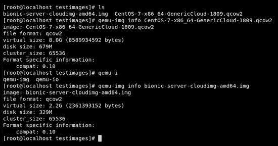
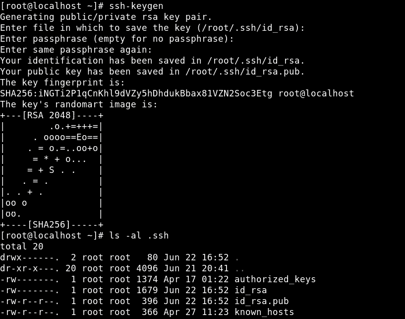
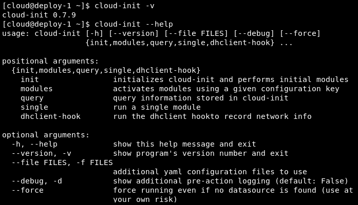
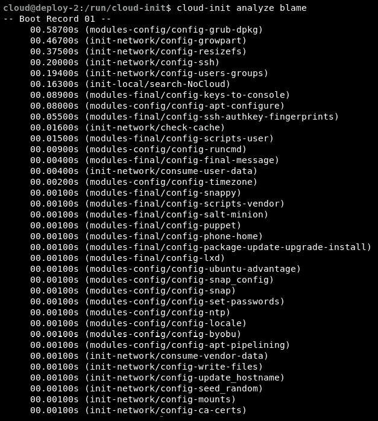
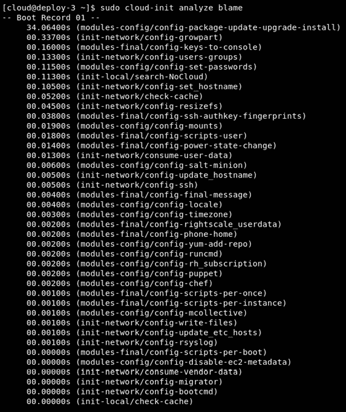
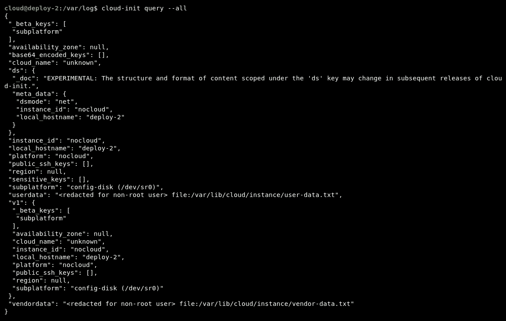

# 九、使用 cloud-init 定制虚拟机

自定义虚拟机通常看起来很简单-从模板克隆它；开始；单击几个**下一步**按钮(或文本选项卡)；创建一些用户、密码和组；配置网络设置……。 这可能适用于一两台虚拟机。 但是，如果我们必须部署两三百台虚拟机并对其进行配置，会发生什么情况呢？ 突然之间，我们面临着一项艰巨的任务-如果我们每件事都是手工完成的，这项任务很容易出错。 我们这样做是在浪费宝贵的时间，而不是以一种更精简、更自动化的方式配置它们。 这就是 cloud-init 派上用场的地方，因为它可以定制我们的虚拟机，在虚拟机上安装软件，并且可以在第一次和随后的虚拟机引导时执行此操作。 因此，让我们讨论 cloud-init 以及它如何为您的大规模配置梦魇带来价值。

在本章中，我们将介绍以下主题：

*   虚拟机定制的需求是什么？
*   了解 Cloud-Init
*   云初始架构
*   如何在引导时安装和配置 cloud-init
*   云初始图像
*   云初始化数据源
*   将元数据和用户数据传递给 cloud-init
*   有关如何将 cloud-config 脚本与 cloud-init 一起使用的示例

# 虚拟机定制的需求是什么？

一旦你真正开始使用虚拟机并学习如何掌握它们，你就会注意到有一件事似乎经常发生：虚拟机部署。 因为一切都很容易配置和部署，所以您将开始为几乎任何东西创建虚拟机的新实例，有时甚至是，以检查特定的应用是否在特定版本的操作系统上运行。 这使您作为开发人员和系统管理员的工作变得容易得多，但也带来了一系列问题。 最困难的问题之一是模板管理。 即使您只有一小部分不同的服务器和相对较少的不同配置，事情也会开始增加，如果您决定通过 KVM 以正常方式管理模板，那么组合的数量很快就会太多。

您很快就会面临的另一个问题是兼容性。 当您退出您选择的 Linux 发行版，并且您必须部署另一个拥有自己的规则和部署策略的 Linux 发行版时，事情将开始变得复杂起来。 通常，最大的问题是系统定制。 在网络设置和主机名方面，网络上的每台计算机都应该有自己唯一的身份。 拥有使用 DHCP 网络配置的模板可以解决其中一个问题，但这远远不足以使事情变得更简单。 例如，我们可以将 Kickstart 用于 CentOS/RHEL 和兼容的 Linux 发行版。 KickStart 是在部署系统时配置系统的一种方式，如果您使用这些特定的发行版，这可能是快速部署物理机或虚拟机的最佳方式。 另一方面，KickStart 会使您的部署变得比应有的速度慢，因为它使用一个配置文件，使我们能够将软件和配置添加到全新的安装中。

基本上，它*使用我们之前定义的设置填充*个附加配置提示。 这意味着每次需要部署新的虚拟机时，我们基本上都是在进行完全安装，并从头开始创建一个完整的系统。

主要问题是*其他发行版不使用 Kickstart*。 还有一些类似的系统可以实现无人值守安装。 Debian 和 Ubuntu 使用名为*Presseed*的工具/系统，并且能够在某些部分支持 Kickstart，SuSE 使用 AutoYaST，甚至还有几个工具提供某种跨平台功能。 其中一个叫做**Fully Automated Install**(**FAI**)能够自动安装甚至在线重新配置不同的 Linux 发行版。 但这仍然不能解决我们面临的所有问题。 在虚拟化的动态世界中，主要目标是尽可能快地部署和尽可能多地自动化，因为在从生产中移除虚拟机时，我们倾向于使用相同的敏捷性。

想象一下：您需要创建一个应用部署来使用不同的 Linux 发行版测试您的新应用。 所有未来的虚拟机都需要一个主机名形式的唯一标识符，一个部署的 SSH 标识，它将支持通过 Ansible 进行远程管理，当然，还有您的应用。 您的应用有三个依赖项--两个是可以通过 Ansible 部署的包的形式，另一个依赖于所使用的 Linux 发行版，并且必须针对该特定的 Linux 发行版进行定制。 为了让事情变得更加现实，您预计必须定期重复此测试，并且每次都需要重新构建依赖项。

有几种方法可以创建此环境。 一种是只需手动安装所有服务器并从中创建模板。 这意味着手动配置所有内容，然后创建要部署的虚拟机模板。 如果我们打算部署到两个以上的 Linux 发行版，这将是大量的工作。 一旦发行版升级，工作就会变得更加繁重，因为我们要部署的所有模板都必须升级，通常是在不同的时间点。 这意味着我们可以手动更新所有虚拟机模板，也可以对每个虚拟机模板执行安装后升级。 这是大量的工作，而且非常慢。 此外，这样的测试可能会涉及在新旧版本的虚拟机模板上运行测试应用。 除此之外，我们还需要解决为我们正在部署的每个 Linux 发行版定制网络设置的问题。 当然，这也意味着我们的虚拟机模板远不是通用的。 一段时间后，我们将为每个测试周期提供数十个虚拟机模板。

解决这个问题的另一种方法是使用像 Ansible 这样的系统--我们从虚拟机模板部署所有系统，然后从 Ansible 进行定制。 这更好--Ansible 是为类似的场景设计的，但这意味着我们必须首先创建能够支持 Ansible 部署的虚拟机模板，并实现 SSH 密钥和 Ansible 所需的所有其他功能。

这两种方法都不能解决一个问题，那就是大规模部署机器。 这就是为什么要设计一个名为 cloud-init 的框架。

# 了解 cloud-init

我们需要更多地了解一下技术，以便了解什么是 cloud-init，以及它的局限性是什么。 由于我们谈论的是一种使用简单的配置文件完全自动重新配置系统的方法，这意味着需要提前准备一些东西，以使这个复杂的过程变得用户友好。

我们已经在[*章*](08.html#_idTextAnchor143)，*创建和修改 VM 磁盘、模板和快照*中提到了虚拟机模板。 在这里，我们谈论的是一个特殊配置的模板，它包含读取、理解和部署我们将在文件中提供的配置所需的所有元素。 这意味着这个特殊的图像必须事先准备好，并且是整个系统中最复杂的部分。

幸运的是，云初始化镜像可以预先配置好下载，我们唯一需要知道的就是我们想要使用哪个发行版。 我们在本书中提到的所有发行版(CentOS7 或 8、Debian、Ubuntu 和 Red Hat Enterprise Linux7 和 8)都有我们可以使用的映像。 他们中的一些人甚至有不同版本的基本操作系统可用，所以如果我们需要的话，我们可以使用这些版本。 请注意，安装的 cloud-init 版本之间可能存在差异，尤其是在较旧的映像上。

为什么这个形象很重要？ 因为它做好了准备，以便可以检测到它在其下运行的云系统，所以它确定是应该使用 cloud-init 还是应该禁用 cloud-init，然后，它读取并执行系统本身的配置。

# 了解云初始架构

Cloud-init 使用引导阶段的概念，因为它需要对引导期间系统发生的事情进行精细而精细的控制。 当然，cloud-init 的先决条件是一个 cloud-init 映像。 从[https://cloudinit.readthedocs.io](https://cloudinit.readthedocs.io)提供的文档中，我们可以了解到云初始化引导有五个阶段：

*   **生成器**是第一个生成器，也是最简单的生成器：它将确定我们是否正在尝试运行 cloud-init，并基于此确定它应该启用还是禁用数据文件的处理。 如果有内核命令行指令来禁用 cloud-init，或者如果存在名为`/etc/cloud/cloud-init.diabled`的文件，则不会运行 cloud-init。 有关这一点以及本章中所有其他内容的更多信息，请阅读文档(从[https://cloudinit.readthedocs.io/en/latest/topics/boot.html](https://cloudinit.readthedocs.io/en/latest/topics/boot.html)开始)，因为它包含了更多关于 Cloud-init 支持的开关和不同选项的详细信息，并使其发挥作用。
*   **本地**阶段尝试查找我们为引导本身包含的数据，然后然后尝试创建运行的网络配置。 这是一个相对简单的任务，由名为`cloud-init-local.service`的`systemd`服务执行，该服务将尽快运行并阻塞网络，直到完成为止。 在 Cloud-init 初始化中经常使用阻塞服务和目标的概念；原因很简单-确保系统稳定性。 由于 cloud-init 过程会修改系统的许多核心设置，因此我们不能让通常的启动脚本运行并创建可能会超过 cloud-init 创建的配置的并行配置。
*   **网络**阶段是下一个阶段，它使用名为`cloud-init.service`的单独服务。 这是主要服务，它将启动先前配置的网络，并尝试配置我们在数据文件中安排的所有内容。 这通常包括抓取我们的配置中指定的所有文件、提取它们以及执行其他准备任务。 如果指定了此类配置更改，也将在此阶段对磁盘进行格式化和分区。 还将创建挂载点，包括那些动态的、特定于特定云平台的挂载点。
*   接下来是**配置**阶段，它将配置系统的其余部分，应用配置的不同部分。 它使用 cloud-init 模块进一步配置我们的模板。 现在网络已经配置好了，可以用它来添加存储库(`yum_repos`或`apt`模块)，添加 SSH 密钥(`ssh-import-id`模块)，并执行类似的任务来为下一阶段做准备，在下一阶段，我们可以实际使用在此阶段中完成的配置。
*   **最后**阶段是系统引导的部分，它运行可能属于用户领域的东西-安装软件包、配置管理插件部署和执行可能的用户脚本。

所有这些完成后，系统将完全配置并启动并运行。

虽然这种方法看起来很复杂，但它的主要优点是在云中只存储一个映像，然后创建简单的配置文件，该文件只涵盖*vanilla*默认配置和我们需要的配置之间的差异。 图像也可以相对较小，因为它们不包含太多面向最终用户的包。

Cloud-init 通常被用作部署大量机器的第一阶段，这些机器将由 Puppet 或 Ansible 等编排系统管理，因为它提供了一种创建工作配置的方法，其中包括单独连接到每个实例的方法。 每个阶段都使用 YAML 作为其主要数据语法，几乎所有内容都只是转换为配置信息的不同选项和变量的列表。 因为我们正在配置一个系统，所以我们还可以在配置中包括几乎任何其他类型的文件-一旦我们可以在配置系统的同时运行 shell 脚本，一切都是可能的。

*为什么这一切如此重要？*

Cloud-init 源于一个简单的想法：创建单个模板来定义您计划使用的操作系统的基本内容。 然后，我们创建一个单独的、特殊格式化的数据文件来保存定制数据，然后在运行时将这两个文件结合起来，以便在需要时创建一个新实例。 您甚至可以通过使用模板作为基本映像，然后创建不同的系统作为差异映像，从而使情况有所改善。 以这种方式以速度换取便利可能意味着在几分钟而不是几个小时内部署。

Cloud-init 的构思方式是尽可能多平台，并合理地包含尽可能多的操作系统。 目前，它支持以下功能：

*   人的本质 / 人性 / 同情心
*   SLES/OpenSUSE
*   RHEL/CentOS
*   费多拉帽 / 一种男式软呢帽
*   Gentoo Linux
*   Debian
*   ARCH Linux
*   自由 BSD

我们列举了所有的发行版，但是 cloud-init，顾名思义，也是*云感知的*，这意味着 cloud-init 能够自动检测和使用几乎任何云环境。 即使没有像 cloud-init 这样的东西，在任何硬件或云上运行任何发行版都是可能的，但由于我们的想法是创建独立于平台的配置，无需任何重新配置即可部署在任何云上，因此我们的系统需要自动考虑不同云基础架构之间的任何差异。 最重要的是，cloud-init 可以用于裸机部署，即使它不是专门为它设计的，或者更准确地说，即使它的设计目的远远不止于此。

重要音符

支持云意味着 cloud-init 为我们提供了进行部署后检查和配置更改的工具，这是另一个非常有用的选择。

这一切听起来都比实际情况更具理论性。 在实践中，一旦您开始使用 cloud-init 并了解如何配置它，您将开始创建一个几乎完全独立于您正在使用的云基础架构的虚拟机基础架构。 在本书中，我们使用 KVM 作为主要的虚拟化基础设施，但是 cloud-init 可以与任何其他云环境一起使用，通常无需任何修改。 Cloud-init 最初设计用于在 Amazon AWS 上轻松部署，但它早已超越了这一限制。

此外，cloud-init 知道不同发行版之间的所有细微差别，因此您放入配置文件中的所有内容都将被转换为特定发行版用来完成特定任务的任何内容。 从这个意义上说，cloud-init 的行为很像 Ansible-本质上，您定义需要做什么，而不是如何做，cloud-init 接受并实现它。

# 在引导时安装和配置 cloud-init

本章讨论的主要内容是如何让 cloud-init 运行，以及如何在部署机器时将其所有部分放在正确的位置，但这只触及了 cloud-init 实际工作方式的皮毛。 您需要了解的是，cloud-init 作为服务运行，配置系统，并遵循我们告诉它以某种方式执行的操作。 系统引导后，我们可以连接到它，查看做了什么、如何做以及分析日志。 这看起来可能与完全自动部署的想法相反，但它的存在是有原因的-无论我们做什么，总是有可能需要调试系统或执行一些也可以自动执行的安装后任务。

使用 cloud-init 不仅限于调试。 在系统引导之后，系统会创建大量数据，这些数据涉及引导是如何完成的、系统在什么实际云配置上运行，以及在自定义方面做了什么。 然后，您的任何应用和脚本都可以依赖于此数据，并使用它来运行和检测某些配置和部署参数。 请看这个示例，取自 Microsoft Azure 中运行 Ubuntu 的虚拟机：


图 9.1-引导时的一部分 cloud-init 输出

Cloud-init 实际上会在引导时显示这些内容(根据 cloud-init 配置文件，还会显示更多内容)，然后将所有这些输出也放入它的日志文件中。 因此，就它所产生的额外信息而言，我们已经做得很好了。

我们的 cloud-init 之旅的下一步是讨论 cloud-init 映像，因为我们需要这些映像才能使 cloud-init 正常工作。 我们现在就开始吧。

## 云初始化镜像

为了在引导时使用 cloud-init，我们首先需要一个云映像。 就其核心而言，它基本上是一个半安装的系统，其中包含支持 Cloud-init 安装的专门设计的脚本。 在所有发行版中，这些脚本都是一个名为 cloud-init 的包的一部分，但是镜像通常比这个包准备得更充分，因为它们试图在大小和安装方便性之间进行权衡。

在我们的示例中，我们将使用以下 URL 中提供的 URL：

*   [https：//cloud.centos.org/](https://cloud.centos.org/)
*   [https：//cloud-images.ubuntu.com/](https://cloud-images.ubuntu.com/)

在我们将要使用的所有示例中，主要目的是展示系统如何在两种完全不同的体系结构上工作，只需极少的修改或无需修改。

在正常情况下，运行 cloud-init 只需获得镜像即可。 其他一切都由数据文件处理。

例如，以下是 CentOS 分发版的一些可用映像：


图 9.2-CentOS 的大量可用云初始镜像

请注意，图像覆盖了几乎所有发行版，因此我们不仅可以在最新版本上测试我们的系统，还可以在所有其他可用的版本上测试我们的系统。 我们可以自由地使用所有这些图像，这正是我们稍后开始示例时要做的事情。

## 云初始化数据源

让我们来讨论一下数据文件。 到目前为止，我们只是泛指它们，我们有很大的理由这样做。 使 cloud-init 从其他实用程序中脱颖而出的一件事是，它能够支持不同的方式来获取关于安装什么以及如何安装的信息。 我们将这些配置文件称为数据源，它们可以分为两大类-**用户数据**和**元数据**。 我们将在本章中详细讨论其中的每一个，但作为早期的介绍，我们假设用户创建的所有内容都是配置的一部分，包括 YAML 文件、脚本、配置文件以及可能放在系统上的其他文件，例如作为用户数据一部分的应用和依赖项。 元数据通常直接来自云提供商，或者用于识别机器。

它包含实例数据、主机名、网络名称和其他特定于云的详细信息，这些信息在部署时会很有用。 我们可以在引导期间使用这两种类型的数据，并将这样做。 我们放入的所有内容都将在运行时存储在`/run/cloud-init/instance-data.json`中的大型 JSON 存储中，或者作为实际机器配置的一部分。 主机名就是一个很好的例子，它是元数据的一部分，最终将成为单个计算机上的实际主机名。 该文件由 cloud-init 填充，可以通过命令行或直接访问。

在配置中创建任何文件时，我们可以使用任何可用的文件格式，并且可以根据需要压缩文件-cloud-init 会在运行之前将其解压缩。 如果我们需要将实际文件传递到配置中，则有一个限制-文件需要编码为文本并放入 YAML 文件中的变量中，以便稍后在我们正在配置的系统上使用和编写。 就像 cloud-init 一样，YAML 语法是声明性的-这是需要记住的一件重要事情。

现在，让我们学习如何将元数据和用户数据传递给 cloud-init。

# 将元数据和用户数据传递给 cloud-init

在我们的示例中，我们将创建一个文件，该文件本质上将是一个`.iso`映像，其行为类似于连接到引导机器的 CD-ROM。 Cloud-init 知道如何处理这样的情况，并将挂载文件、提取所有脚本并以预定的顺序运行它们，正如我们在解释引导序列如何工作时已经提到的那样(请参阅本章前面的*了解 cloud-init 体系结构*部分)。

本质上，我们需要做的就是创建一个将连接到云模板的映像，并将所有数据文件提供给模板内的云初始化脚本。 这是一个分三步走的过程：

1.  我们必须创建保存配置信息的文件。
2.  我们必须在正确的位置创建包含文件数据的图像。
3.  我们需要在引导时将映像与模板相关联。

最复杂的部分是定义引导时如何配置以及需要配置什么。 所有这些都是在运行给定发行版的 cloud-utils 包的机器上完成的。

此时，我们需要指出在所有发行版中使用的两个不同的包，以启用 Cloud-init 支持：

*   `cloud-init`-包含在计算机遇到 Cloud-init 配置时，使其能够在引导期间重新配置自身所需的所有内容
*   `cloud-utils`-用于创建要应用于云映像的配置

这些软件包之间的主要区别在于我们安装它们的计算机。 `cloud-init`将安装在我们正在配置的计算机上，并且是部署映像的一部分。 `cloud-utils`是要在将创建配置的计算机上使用的软件包。

在本章的所有示例和所有配置步骤中，我们实际上指的是两台不同的计算机/服务器：一台可以被视为主要计算机，除非另有说明，否则我们在本章中使用的计算机是我们用来创建云初始化部署配置的计算机。 这不是要使用此配置配置的计算机，而是我们用作准备文件的工作站的计算机。

在这个简化的环境中，这是运行整个 KVM 虚拟化并用于创建和部署虚拟机的同一台计算机。 在正常设置中，我们可能会在工作站上创建我们的配置，然后将其部署到某种基于 KVM 的主机或集群上。 在这种情况下，我们在本章中介绍的每个步骤基本上保持不变；唯一的区别是我们部署到的位置以及第一次引导时调用虚拟机的方式。

我们还将注意到，一些虚拟化环境，如 OpenStack、oVirt 或 RHEV-M，有种直接方式与支持云初始化的模板通信。 其中一些甚至允许您在第一次引导时从GUI 直接重新配置机器，但这远远超出了本书的讨论范围。

我们列表中的下一个主题是 cloud-init 模块。 Cloud-init 使用模块是有原因的--扩展它在虚拟机引导阶段可以采取的可用操作的范围。 有几十个可用的 Cloud-init 模块-`SSH`、`yum`、`apt`、设置`hostname`、`password`、`locale`，以及创建用户和组，仅举几例。 让我们检查一下如何使用它们。

## 使用 Cloud-init 模块

在 cloud-init 中创建配置文件时，就像在任何其他软件抽象层中一样，我们要处理的模块将或多或少地转换我们的通用配置需求，例如*这个包需要在特定系统上安装*成实际的 shell 命令。 实现这一点的方法是通过**模块**。 模块是逻辑单元，它们将不同的功能分解为更小的组，使我们能够使用不同的命令。 您可以通过以下链接查看所有可用模块的列表：[https://cloudinit.readthedocs.io/en/latest/topics/modules.html](https://cloudinit.readthedocs.io/en/latest/topics/modules.html)。 这是一个相当长的列表，它将进一步向您展示 cloud-init 开发得有多好。

正如我们从列表中看到的，有些模块(例如，`Disk setup`或`Locale`)是完全独立于平台的，而有些模块(例如，`Puppet`)被设计为与特定的软件解决方案及其配置一起使用，而有些模块则特定于特定的发行版或一组发行版，如`Yum Add Repo`或`Apt Configure`。

这似乎打破了完全与发行版无关的方法来部署一切的想法，但您必须记住两件事-Cloud-init 首先是与云无关的，而不是发行版不可知的，而且发行版有时会有太多不同的东西，不是任何简单的解决方案都能解决的。 因此，cloud-init解决了足够多的有用问题，同时又尽量不创建新的问题，而不是试图一次完成所有任务。

重要音符

我们不打算逐个处理特定的模块，因为这会使本章太长，而且可能会把它自己变成一本书。 如果您计划使用 cloud-init，请参考模块文档，因为它将提供您需要的所有最新信息。

# 有关如何将 cloud-config 脚本与 cloud-init 一起使用的示例

首先，您需要下载云映像并调整它们的大小，以确保安装所有内容后的磁盘大小足以容纳您计划放入您创建的机器中的所有文件。 在这些示例中，我们将使用两个镜像，一个用于 CentOS，另一个用于 Ubuntu Server。 我们可以看到，我们使用的 CentOS 镜像是 8 GB，我们会将其放大到 10 GB。 请注意，磁盘上的实际大小不会是 10 GB；我们只是允许映像增长到这个大小。

在我们从互联网上得到 Ubuntu 镜像后，我们也会对它做同样的事情。 Ubuntu 还每天发布其发行版的云版本，适用于所有受支持的版本。 主要区别在于，Ubuntu 创建的镜像设计为满时为 2.2 GB。 我们从[https://cloud.centos.org](https://cloud.centos.org)下载了一个镜像；现在让我们获取一些有关它的信息：



图 9.3-Cloud-Init 映像大小

请注意，磁盘上的实际大小不同-`qemu-img`提供 679 MB 和 2.2 GB，而实际磁盘使用量约为 330 MB 和 680 MB：


图 9.4-QEMU-IMG 的映像大小与实际虚拟映像大小不同

现在，我们可以对这些映像执行几项日常管理任务-增长映像，将其移动到 KVM 的正确目录，将其用作基本映像，然后通过 cloud-init 对其进行自定义：

1.  Let's make these images bigger, just so that we can have them ready for future capacity needs (and practice):

    

    图 9.5-通过 qemu-img 将 Ubuntu 和 CentOS 最大镜像大小增加到 10 GB

    在增长我们的映像之后，请注意磁盘上的大小没有太大变化：

    

    图 9.6-实际磁盘使用率只有很小的变化

    下一步是为云映像过程准备我们的环境，这样我们就可以让 cloud-init 发挥它的魔力了。

2.  The images that we are going to use are going to be stored in `/var/lib/libvirt/images`:

    

    图 9.7-将图像移动到 KVM 默认系统目录

    我们将以最简单的方式创建我们的第一个支持云的部署，只需重新分区磁盘并使用单个 SSH 密钥创建单个用户。 密钥属于宿主机的根，所以我们可以在 cloud-init 完成后直接登录部署的机器。

    此外，通过运行以下命令，我们将使用我们的映像作为基本映像：

    

    图 9.8-创建用于部署的镜像磁盘

    图像现在已经准备好了。 下一步是启动 cloud-init 配置。

3.  首先，创建一个本地元数据文件，并将新的虚拟机名放入其中。
4.  The file will be named `meta-data` and we are going to use `local-hostname` to set the name:

    

    图 9.9-只有一个选项的简单元数据文件

    这个文件是以我们想要的方式命名机器所需的全部内容，并且是用普通的 YAML 表示法编写的。 我们不需要任何其他东西，所以这个文件基本上变成了一行程序。 然后，我们需要一个 SSH 密钥对，并且需要将其添加到配置中。 我们需要创建一个名为`user-data`的文件，如下所示：

    ```sh
    #cloud-config
    users:
      - name: cloud
        ssh-authorized-keys:
          - ssh-rsa AAAAB3NzaC1yc2EAAAADAQABAAABAQCZh6 6Gf1lNuMeenGywifUSW1T16uKW0IXnucNwoIynhymSm1fkTCqyxLk ImWbyd/tDFkbgTlei3qa245Xwt//5ny2fGitcSa7jWvkKvTLiPvxLP 0CvcvGR4aiV/2TuxA1em3JweqpNppyuapH7u9q0SdxaG2gh3uViYl /+8uuzJLJJbxb/a8EK+szpdZq7bpLOvigOTgMan+LGNlsZc6lqE VDlj40tG3YNtk5lxfKBLxwLpFq7JPfAv8DTMcdYqqqc5PhRnnKLak SUQ6OW0nv4fpa0MKuha1nrO72Zyur7FRf9XFvD+Uc7ABNpeyUTZVI j2dr5hjjFTPfZWUC96FEh root@localhost.localdomain
        sudo: ['ALL=(ALL) NOPASSWD:ALL']
        groups: users
        shell: /bin/bash
    runcmd:
      - echo "AllowUsers cloud" >> /etc/ssh/sshd_config
      - restart ssh
    ```

    请注意，该文件必须遵循 YAML 定义所有内容(包括变量)的方式。 请注意空格和换行符，因为部署的最大问题是配置中换行符放错了位置。

    这里有很多需要解析的内容。 我们正在创建一个使用用户名`cloud`的用户。 该用户将不能使用密码登录，因为我们没有创建密码，但我们将使用与本地 root 帐户相关联的 SSH 密钥(我们将使用`ssh-keygen`命令创建)来启用登录。 这只是一个示例 SSH 密钥，您将要使用的 SSH 密钥可能不同。 因此，作为 root 用户，请执行以下步骤：

    

    图 9.10-SSH 密钥生成过程完成，SSH 密钥存在并被考虑

    密钥存储在本地`.ssh`目录中，因此我们只需要复制它们。 当我们进行云部署时，我们通常使用这种身份验证方法，但是 cloud-init 允许我们定义任何用户身份验证方法。 这完全取决于我们要做什么，以及是否存在强制使用一种身份验证方法而不是另一种身份验证方法的安全策略。

    在云环境中，我们很少定义能够使用密码登录的用户，但例如，如果我们为工作站部署裸机，我们可能会创建使用普通密码的用户。 当我们创建这样的配置文件时，标准做法是使用密码的散列而不是文字明文密码。 您要查找的指令可能是`passwd:`，后跟一个包含密码散列的字符串。

    接下来，我们配置`sudo`。 我们的用户需要具有 root 权限，因为没有为此计算机定义其他用户。 这意味着他们需要是`sudo`组的成员，并且必须拥有在`sudoers`文件中定义的正确权限。 因为这是一个常见的设置，所以我们只需要声明变量，cloud-init 将把设置放在正确的文件中。 我们还将定义一个用户外壳。

    在此文件中，我们还可以定义 Linux 上可用的所有其他用户设置，该功能旨在帮助部署用户计算机。 如果您需要这些功能中的任何一个，请查看此处提供的文档：[https://cloudinit.readthedocs.io/en/latest/topics/modules.html#users-and-groups](https://cloudinit.readthedocs.io/en/latest/topics/modules.html#users-and-groups)。 支持所有扩展的用户信息字段。

    我们要做的最后一件事是在最后阶段使用`runcmd`指令定义安装完成后会发生什么。 为了允许用户登录，我们需要将他们放在`sshd`的允许用户列表中，并且需要重新启动服务。

    现在我们已经为第一次部署做好了准备。

5.  We have three files in our directory: a hard disk that uses a base file with the cloud template, a `meta-data` file that contains just minimal information that is essential for our deployment, and `user-data`, which contains our definitions for our user. We didn't even try to install or copy anything; this install is as minimal as it gets, but in a normal environment this is a regular starting point, as a lot of deployments are intended only to bring our machine online, and then do the rest of the installation by using other tools. Let's move to the next step.

    我们需要一种方法来连接我们刚刚创建的文件、配置和虚拟机。 通常，这可以通过几种方式完成。 最简单的方法通常是生成一个包含这些文件的`.iso`文件。 然后，我们只需在创建机器时将该文件挂载为虚拟 CD-ROM 即可。 在引导时，cloud-init 将自动查找文件。

    另一种方法是将文件存放在网络上的某个位置，并在需要时获取它们。 将这两种策略结合起来也是可能的。 我们稍后会讨论这个问题，但让我们先完成部署。 本地`.iso`映像是我们进行此部署的方式。 有一个名为`genisoimage`的工具(由同名软件包提供)对此非常有用(以下命令是一行命令)：

    ```sh
    genisoimage -output deploy-1-cidata.iso -volid cidata -joliet -rock user-data meta-data
    ```

    我们在这里做的是创建一个模拟的 CD-ROM 映像，它将遵循带有 Rock Ridge Extensions 的 ISO9660/Joliet 标准。 如果您不知道我们刚才说的是什么，请忽略所有这些，这样想-我们正在创建一个文件，该文件将保存我们的元数据和用户数据，并以 CD-ROM 的形式呈现：


图 9.11-创建 ISO 映像

最后，我们会得到这样的结果：


图 9.12-ISO 已创建，我们准备开始云初始化部署

请注意，镜像是在部署后拍摄的，因此磁盘大小可能会根据您的配置而变化很大。 这就是准备工作所需要的一切。 剩下的就是启动我们的虚拟机了。

现在，让我们从我们的部署开始。

## 第一次部署

我们将使用命令行部署我们的虚拟机：

```sh
virt-install --connect qemu:///system --virt-type kvm --name deploy-1 --ram 2048 --vcpus=1 --os-type linux --os-variant generic --disk path=/var/lib/libviimg/deploy-1/centos1.qcow2,format=qcow2 --disk /var/lib/libviimg/deploy-1/deploy-1-cidata.iso,device=cdrom --import --network network=default --noautoconsole
```

虽然它看起来可能很复杂，但如果你在读完书的前几章后来到这一部分，应该没有什么是你还没有看过的。 我们使用 KVM，为域(虚拟机)创建一个名称，我们将为其分配 1 个 CPU 和 2 GB RAM。 我们还告诉 KVM，我们正在安装一个通用的 Linux 系统。 我们已经创建了硬盘，因此我们正在将其挂载为主驱动器，并且我们还将挂载我们的`.iso`文件作为CD-ROM。 最后，我们将虚拟机连接到默认网络：


图 9.13-部署和测试 Cloud-init 定制虚拟机

部署可能需要一两分钟。 一旦机器启动，它就会获得 IP 地址，我们可以使用预定义的密钥通过 SSH 连接到它。 唯一没有实现自动化的是自动接受新启动机器的指纹。

现在，是时候看看我们启动机器时会发生什么了。 Cloud-init 在`/var/log`处生成了名为`cloud-init.log`的日志。 该文件将相当大，您首先会注意到，日志设置为提供调试信息，因此几乎所有内容都将被记录：


图 9.14-cloud-init.log 文件，用于检查 cloud-init 对操作系统做了什么

另一件事是表面下到底有多少是完全自动发生的。 由于这是 CentOS，cloud-init 必须实时处理 SELinux 安全上下文，所以很多信息就是这样。 还有很多探测和测试正在进行。 Cloud-init 必须确定运行环境是什么，以及它在什么类型的云下运行。 如果在引导过程中发生了一些事情，并且以任何方式涉及 cloud-init，这是第一个要查看的地方。

现在，让我们使用第二个(Ubuntu)镜像部署我们的第二个虚拟机。 这才是 cloud-init 真正闪亮的地方--它可以与各种 Linux(和*BSD)发行版协同工作，无论它们是什么。 我们现在可以把这一点付诸实践了。

## 第二次部署

下一个明显的步骤是创建另一个虚拟机，但为了证明这一点，我们将使用 Ubuntu Server(Bionic)作为我们的映像：


图 9.15-为另一个基于云初始化的虚拟机部署准备我们的环境

我们需要做些什么呢？ 我们需要将`meta-data`和`user-data`都复制到新文件夹。 我们需要编辑元数据文件，因为它里面有主机名，并且我们希望我们的新机器有一个不同的主机名。 至于`user-data`，它将与我们的第一台虚拟机完全相同。 然后，我们需要创建一个新磁盘并调整其大小：


图 9.16-出于部署目的扩展我们的虚拟机映像

我们正在从下载的映像创建虚拟机，并在映像运行时留出更多空间。 最后一步是启动机器：


图 9.17-使用 cloud-init 部署第二台虚拟机

命令行几乎完全相同，只是名称有所不同：

```sh
virt-install --connect qemu:///system --virt-type kvm --name deploy-2 --ram 2048 --vcpus=1 --os-type linux --os-variant generic --disk path=/var/lib/libviimg/deploy-2/bionic.qcow2,format=qcow2 --disk /var/lib/libviimg/deploy-2/deploy-2-cidata.iso,device=cdrom --import --network network=default –noautoconsole
```

现在让我们检查 IP地址：


图 9.18-检查虚拟机 IP 地址

我们可以看到两台机器都已启动并运行。 现在是大考了--我们能联系上吗？ 让我们使用`SSH`命令来尝试：


图 9.19-使用 SSH 验证我们是否可以连接到虚拟机

正如我们所看到的，与我们的虚拟机的连接工作正常，没有任何问题。

还有一件事是检查部署日志。 请注意，这里没有提到配置 SELinux，因为我们在 Ubuntu 上运行：


图 9.20-Ubuntu cloud-init 日志文件没有提到 SELinux

为了好玩，让我们来做另一个部署--让我们使用一个模块来部署一个软件包。

## 第三次部署

让我们部署另一个映像。 在本例中，我们将创建另一个 CentOS 7，但这一次我们将*安装*(而不是从开始的*)`httpd`，以显示这种类型的配置是如何工作的。 同样，步骤也很简单：创建目录、复制元数据和用户数据文件、修改文件、创建`.iso`文件、创建磁盘和运行机器。*

这一次，我们将向配置添加另一个部分(`packages`)，这样我们就可以*告诉*cloud-init 我们需要安装一个软件包(`httpd`)：


图 9.21-第三个虚拟机部署的 Cloud-init 配置文件

由于所有步骤都大致相同，因此我们得到相同的结果-成功：


图 9.22-重复第三台虚拟机的部署过程

我们应该等待一段时间，以便部署虚拟机。 之后，我们登录查看镜像部署是否正确。 我们要求在部署期间安装`httpd`。 是吗？


图 9.23-检查是否已安装但未启动 httpd

我们可以看到，一切都是按预期进行的。 我们没有要求启动该服务，因此它是使用默认设置安装的，默认情况下是禁用和停止的。

### 安装后

Cloud-init的预期用途是配置机器并创建一个环境，以支持进一步配置或直接部署到生产中。 但要实现这一点，cloud-init 有很多我们甚至还没有提到的选择。 因为我们有一个正在运行的实例，所以我们可以了解在新引导的虚拟机中可以找到的最重要、最有用的东西。

首先要检查的是`/run/cloud-init`文件夹：


图 9.24-/run/cloud-init 文件夹内容

在运行时创建的所有内容都写在这里，并可供用户使用。 我们的演示机器是在本地 KVM 虚拟机管理器下运行的，因此 cloud-init 没有检测到云，因此无法提供更多关于云的数据，但是我们可以看到一些有趣的细节。 第一个是名为`enabled`和`network-config-ready`的两个文件。 它们都是空的，但都很重要。 它们的存在表示 Cloud-init 已启用，并且网络已经配置好并且正在工作。 如果文件不在那里，则说明出了问题，我们需要返回并进行调试。 有关调试的更多信息，请参见[https://cloudinit.readthedocs.io/en/latest/topics/debugging.html](https://cloudinit.readthedocs.io/en/latest/topics/debugging.html)。

`results.json`文件保存这个特定的实例元数据。 `status.json`更集中于整个进程运行时发生的情况，它提供了有关可能的错误、配置系统不同部分所需的时间以及是否已完成所有操作的信息。

这两个文件都旨在帮助配置和编排，虽然这些文件中的一些内容只对 Cloud-init 很重要，但是其他编排工具可以使用检测不同云环境并与之交互的能力。 文件只是其中的一部分。

该方案的另一个重要部分是名为`cloud-init`的命令行实用程序。 要从其中获取信息，我们首先需要登录到我们创建的计算机。 我们将展示由同一文件创建的计算机之间的差异，同时演示发行版之间的相似和不同之处。

在我们开始讨论这个之前，请注意 cloud-init 和所有 Linux 软件一样，有不同的版本。 CentOS 7 镜像使用旧版本 0.7.9：


图 9.25-CentOS cloud-init 版本-相当旧

Ubuntu 提供了一个更新鲜的版本，19.3：


图 9.26-Ubuntu cloud-init 版本-最新

在你惊慌失措之前，这并不像看起来那么糟糕。 Cloud-init 在几年前决定改变它的版本控制系统，所以在 0.7.9 之后是 17.1。 有很多更改，其中大多数都直接连接到 cloud-init 命令和配置文件。 这意味着部署会起作用，但我们部署后的很多事情就不会了。 最明显的区别可能是当我们运行`cloud-init --help`时。 对于 Ubuntu，它看起来是这样的：


图 2.27-Ubuntu 上的 Cloud-init 功能

实际上，CentOS 缺少很多东西，其中一些是完全缺少的：



图 9.28-CentOS 上的 Cloud-init 功能

由于我们的示例总共有个正在运行的实例-一个 Ubuntu 和两个 CentOS 虚拟机-让我们尝试手动升级到 CentOS 上可用的最新稳定版本 cloud-init。 我们可以使用常规的`yum update`命令来实现这一点，结果如下所示：


图 9.29-在进行了一些 yum 更新之后，列出了最新的 cloud-init 特性列表

正如我们所看到的，这将使操作变得容易得多。

我们不打算深入讨论云初始化 CLI 工具的太多细节，因为对于这样一本书来说，可用的信息实在太多了，而且正如我们所看到的，新功能正在迅速添加。 您可以通过浏览[https://cloudinit.readthedocs.io/en/latest/topics/cli.html](https://cloudinit.readthedocs.io/en/latest/topics/cli.html)来自由检查其他选项。 事实上，它们的添加速度如此之快，以至于有一个`devel`选项可以在它们处于活跃开发阶段时保留新特性。 一旦完成，它们就变成了自己的命令。

您需要了解两个命令，这两个命令都提供了有关引导过程和引导系统状态的大量信息。 第一个是`cloud-init analyze`。 它有两个非常有用的子命令：`blame`和`show`。

名为`blame`的工具实际上是一个工具，它返回在启动期间 Cloud-init 执行的不同过程中发生的事情上花费了多少时间。 例如，我们可以看到在 Ubuntu 上配置`grub`和使用文件系统是最慢的操作：



图 9.30-检查 Cloud-init 过程的时间消耗

我们部署的第三个虚拟机使用 CentOS 镜像，并向其中添加了`httpd`。 推而广之，这是迄今为止在 Cloud-init 过程中发生的最慢的事情：



图 9.31-检查时间消耗-cloud-init 部署必要的 httpd 包花费了相当长的时间

这样的工具使优化部署变得更容易。 在我们的特定情况下，这几乎没有任何意义，因为我们部署的简单机器几乎没有更改默认配置，但是能够理解部署缓慢的原因即使不是必要的，也是非常有用的。

另一件有用的事情是能够查看实际启动虚拟机所需的时间：


图 9.32-检查引导时间

我们将以一个查询结束本部分-`cloud-init query`使您能够从服务请求信息，并以一种可用的结构化格式获取信息，然后您可以对其进行解析：



图 9.33-查询 cloud-init 以获取信息

在使用它几个小时之后，cloud-init 就成为系统管理员必不可少的工具之一。 当然，它的本质意味着它将更适合我们这些必须在云环境中工作的人，因为它做得最好的是从脚本快速、无痛地部署机器。 但是，即使您没有使用云技术，快速创建可用于测试的实例，然后毫不费力地将其删除的能力，也是每个管理员都需要的。

# 摘要

在本章中，我们介绍了 cloud-init、其架构，以及在配置一致性和敏捷性至关重要的大型部署场景中的好处。 这与我们不需要手动完成所有工作的范式变化相结合--我们有一个工具可以为我们完成--这对我们的部署流程来说是一个极好的补充。 确保您尝试使用它，因为它将使您的生活变得容易得多，同时让您为使用云虚拟机做好准备，在云虚拟机中，cloud-init 被广泛使用。

在下一章中，我们将学习如何通过使用 cloudbase-init 将此使用模型扩展到 Windows 虚拟机。

# 问题

1.  使用 CentOS7 和 Ubuntu 基础云初始化映像重新创建我们的设置。
2.  使用相同的基础镜像创建一个 Ubuntu 实例和两个 CentOS 实例。
3.  使用 Ubuntu 添加第四台虚拟机作为基础映像。
4.  尝试在不更改任何配置文件的情况下使用其他发行版本作为基本映像。 试一试 FreeBSD。
5.  不使用 SSH 密钥，而使用预定义的密码。 这是更安全还是更不安全？
6.  创建一个脚本，该脚本将使用 cloud-init 和一个基本映像创建 10 个相同的机器实例。
7.  您能找到为什么使用发行版原生方式安装计算机比使用 cloud-init 更有利的原因吗？

# 进一步阅读

有关本章内容的更多信息，请参阅以下链接：

*   云初始化文档中心：[https://cloudinit.readthedocs.io/en/latest/](https://cloudinit.readthedocs.io/en/latest/)
*   Cloud-init 的项目主页：[https://cloud-init.io/](https://cloud-init.io/)
*   源代码：[HTTPS：//code.Launchpad.net/cloud-init](https://code.launchpad.net/cloud-init)
*   特别好的配置文件示例：[https://cloudinit.readthedocs.io/en/latest/topics/examples.html](https://cloudinit.readthedocs.io/en/latest/topics/examples.html)