# *第 12 章*：使用 OpenStack 横向扩展 KVM

能够虚拟化一台机器是一件很重要的事情，但有时仅仅虚拟化是不够的。 问题是如何为个人用户提供工具，以便他们可以在需要的时候虚拟化任何他们需要的东西。 如果我们将这种以用户为中心的方法与虚拟化相结合，我们最终将得到一个需要能够做两件事的系统：它应该能够作为虚拟化机制连接到 KVM(而不仅仅是 KVM)，并使用户能够在可通过 Web 浏览器访问的自我配置环境中运行和自动配置其虚拟机。 OpenStack 又增加了一件事，因为它完全免费且完全基于开放源码技术。 由于系统的复杂性，配置这样的系统是一个很大的问题，在本章中，我们将向您展示-或者更准确地说，为您指明正确的方向-关于您是否需要这样的系统。

在本章中，我们将介绍以下主题：

*   OpenStack 简介
*   软件定义的网络
*   OpenStack 组件
*   其他 OpenStack 使用案例
*   调配 OpenStack 环境
*   将 OpenStack 与 Sensitive 集成
*   我们开始吧!

# OpenStack 简介

简而言之，**OpenStack**是一个云操作系统，用于控制大量不同的资源，以便为**基础设施即服务**(**IaaS**)和**编排**提供所有基本服务。

但这意味着什么呢？ OpenStack 旨在完全控制数据中心中的所有资源，并对可用于部署其自身和第三方服务的任何内容提供集中管理和直接控制。 基本上，对于我们在本书中提到的每一项服务，在整个 OpenStack 环境中都有一个可以或可以使用该服务的位置。

OpenStack 本身由几个不同的互连服务或服务部分组成，每个服务或服务部分都有自己的一组功能，并且每个服务都有自己的 API 来实现对服务的完全控制。 在这本书的这一部分，我们将尝试解释 OpenStack 的不同部分做什么，它们如何互连，它们提供什么服务，以及如何利用这些服务来发挥我们的优势。

OpenStack 之所以存在，是因为需要一个开源云计算平台，能够创建独立于任何商业云平台的公共云和私有云。 OpenStack 的所有部分都是开源的，并且是在 Apache License 2.0 下发布的。 该软件是由一大群个人和大型云提供商创建的。 有趣的是，第一次重大发布是 NASA(美国政府机构)和 Rackspace Technology(一家美国大型托管公司)加入他们的内部存储和计算基础设施解决方案的结果。 这些版本后来被命名为 Nova 和 Swift，我们稍后将更详细地介绍它们。

关于 OpenStack，您首先会注意到它的服务，因为没有单个*OpenStack*服务，而是一个实际的服务堆栈。 名称*OpenStack*直接来自于这个概念，因为它正确地将 OpenStack 标识为作为服务的开放源码组件，而这些服务又被分组为功能集。

一旦我们理解了自主服务，我们还需要理解 OpenStack 中的服务是按其功能分组的，并且某些功能下有多个专门的服务。 我们将在本章中尽可能多地介绍不同的服务，但是这些服务实在太多了，以至于无法在这里一一列举。 所有文档和所有白皮书都可以在[http://openstack.org](http://openstack.org)中找到，我们强烈建议您查阅此处未提及的内容，甚至是我们提到但在阅读本文时可能已经更改的内容。

我们需要澄清的最后一件事是命名-OpenStack 中的每个服务都有其项目名称，并且在文档中使用该名称来引用。 乍一看，这可能会让人感到困惑，因为有些名称与特定服务在整个项目中拥有的特定功能完全无关，但一旦开始使用 OpenStack，使用名称而不是正式的函数指示符要容易得多。 以 SWIFT 为例。 SWIFT 的全称是*OpenStack Object Store*，但文档或其实现中很少提到这一点。 OpenStack 下的其他服务或*项目*也是如此，比如 Nova、Ironic、Neighon、Keystone 和其他 20 多种不同的服务。

如果你暂时离开 OpenStack，那么你需要考虑云服务到底是什么。 无论在计算资源、存储、网络、API 等方面，云都是可扩展的。 但是，一如既往地，当你给东西做规模时，你会遇到问题。 和这些问题有它们自己的*名称*和*解*。 那么，让我们来讨论一下这些问题。

云提供商可扩展性的基本问题可以分为三组需要规模化解决的问题：

*   **计算问题**(计算=CPU+内存能力)：这些问题很容易解决-如果您需要更多的 CPU 和内存能力，您就会购买更多的服务器，这在设计上意味着更多的 CPU 和内存。 如果您需要服务质量/**服务级别协议**(**SLA**)类型的概念，我们可以引入概念，例如计算资源池，这样我们就可以根据需要分割计算*饼*，并在我们的客户之间分配这些资源。 无论我们的客户是个人还是购买云服务的公司，这都无关紧要。 在云技术中，我们称我们的客户为*租户*。
*   **存储问题**：当您扩展云环境时，在存储容量、管理、监控以及(尤其是)性能方面会变得非常混乱。 问题性能方面有几个最常用的变量-读写吞吐量和读写 IOPS。 当您的环境从 100 台主机增加到 1000 台或更多时，性能瓶颈将成为一个主要问题，如果没有正确的概念，将很难解决这个问题。 因此，可以通过添加额外的存储设备和容量来解决存储问题，但它比计算问题复杂得多，因为它需要更多的配置和资金。 请记住，每个虚拟机都会对其他虚拟机的性能产生统计影响，您拥有的台虚拟机越多，这种熵就越大。 这是存储基础架构中最难管理的流程。
*   **网络问题**：随着云基础设施的发展，您需要成千上万的隔离网络，以便 Tenant`A`的网络流量无法与 Tenant`B`的网络流量通信。 同时，您仍然需要提供这样一种功能，即您可以为每个租户提供多个网络(通常通过非云基础设施中的 VLAN 实现)，并在这些网络之间进行路由(如果租户需要的话)。

此网络问题是基于技术的可扩展性问题，因为 VLAN 背后的技术在 VLAN 数量可能成为可扩展性问题之前多年就已标准化。

让我们继续我们的 OpenStack 之旅，解释云环境的最基本主题，即通过**软件定义的网络**(**SDN**)扩展云网络。 原因非常简单--如果没有 SDN 概念，云就不会真正具有足够的可伸缩性，让客户满意，而这将是一个完全的卖点。 所以，系好安全带，让我们来做一次 SDN 入门。

# 软件定义的网络

关于云的一个直截了当的故事--至少从表面上看--应该是关于云网络的故事。 为了理解这个故事应该有多简单，我们只需要看一个数字，这个数字就是**虚拟 LAN**(**VLANID**)。 您可能已经知道，通过使用 VLAN，网络管理员有机会将物理网络划分为独立的逻辑网络。 请记住，以太网报头的 VLAN 部分最多可以有 12 位，这些逻辑隔离网络的最大数量为 4,096 个。 通常，第一个和最后一个 VLAN 是保留的(0 和 4095)，就像`VLAN 1`一样。

因此，基本上，我们在现实生活场景中只剩下 4093 个独立的逻辑网络，这可能足以满足任何给定公司的内部基础设施。 然而，对于公共云提供商来说，这远远不够。 同样的问题也适用于使用混合云类型服务的公共云提供商，例如，将其计算能力扩展到云。

那么，让我们先来关注一下这个网络问题。 现实地说，如果我们从云用户的角度来看这个问题，数据隐私对我们来说是最重要的。 如果我们从云提供商的角度来看待这个问题，那么我们希望我们的网络隔离问题对我们的租户来说不是问题。 这就是云服务在更基本的层面上的意义--无论技术的背景复杂性如何，用户都必须能够以尽可能友好的方式访问所有必要的服务。 让我们用一个例子来解释这一点。

如果我们的公共云环境中有 5,000 个不同的客户端(租户)，会发生什么情况？ 如果每个租户都需要五个或更多逻辑网络，会发生什么情况？ 我们很快意识到我们遇到了一个大问题，因为云环境需要隔离、隔离和隔离。 出于安全和隐私原因，它们需要在网络级别相互隔离。 但是，如果租户需要这种服务，它们也需要可路由。 最重要的是，我们需要扩展能力，这样我们需要 5000 或 50,000 个以上隔离网络的情况才不会困扰我们。 回到我们之前的观点--大约 4000 个 VLAN 并不能解决问题。

我们说这应该是一个直截了当的故事是有原因的。 我们当中的工程师黑白分明地看到了这些情况--我们专注于一个问题，并试图找到解决方案。 而且解决方案似乎相当简单-我们需要扩展 12 位 VLAN ID 字段，以便拥有更多可用逻辑网络。 这能有多难呢？

事实证明，这非常困难。 如果说历史告诉我们什么的话，那就是各种不同的利益、公司和技术为争夺 IT 技术领域任何领域的*领头羊*地位而竞争多年。 只要想想 DVD+R、DVD-R、DVD+RW、DVD-RW、DVD-RAM 等昔日的美好时光就知道了。 简而言之，在引入云网络的初始标准时，同样的事情也发生在这里。 我们通常将这些网络技术称为云覆盖网络技术。 这些技术是 SDN 的基础，SDN 是描述云网络在全球集中管理级别的工作方式的原则。 市场上有多种标准可以解决此问题-VXLAN、GRE、STT、NVGRE、NVO3 等。

实事求是地说，没有必要把它们一一分解。 我们将采取一条更简单的路线--我们将描述其中一个在今天的上下文中对我们最有价值的(**VXLAN**)，然后继续讨论被认为是明天的*统一*标准(**Geneve**)。

首先，让我们定义一下覆盖网络是什么。 当我们谈论覆盖网络时，我们谈论的是建立在同一基础设施中的另一个网络之上的网络。 重叠网络背后的想法很简单-我们需要将网络的物理部分与网络的逻辑部分分开。 如果我们想要绝对地做到这一点(配置所有内容，而不需要花费大量时间在 CLI 中配置物理交换机、路由器等)，我们也可以做到这一点。 如果我们不想这样做，并且仍然希望直接使用我们的物理网络环境，那么我们需要在整个方案中增加一层可编程性。 然后，如果我们愿意，我们可以与我们的物理设备交互，并将网络配置推送给它们，以实现更自上而下的方法。 如果我们这样做，我们将需要我们的硬件设备在功能和兼容性方面提供更多的支持。

现在我们已经描述了什么是网络覆盖，让我们来谈谈 VXLAN，它是最重要的覆盖网络标准之一。 它也是开发其他一些网络覆盖标准(如 Geneve)的基础，因此，正如您可能想象的那样，理解它的工作原理非常重要。

## 了解 VXLAN

让我们从令人困惑的部分开始。 VXLAN(IETF RFC 7348)是一种可扩展的重叠网络标准，使我们能够通过第 3 层网络聚合和隧道传输多个第 2 层网络。 它是如何做到这一点的？ 通过将第 2 层数据包封装在第 3 层数据包中。 在传输协议方面，它使用 UDP，在端口`4789`上默认使用 UDP(稍后将详细介绍)。 对于 VXLAN 实施的特殊要求-只要您的物理网络支持 MTU 1600，您就可以轻松地将 VXLAN 实施为云覆盖解决方案。 几乎所有你能买到的交换机(除了便宜的家用交换机，但我们在这里谈论的是企业)都支持巨型帧，这意味着我们可以使用 MTU 9000 并完成它。

从封装的角度来说，让我们看看它是什么样子的：


图 12.1-VXLAN 帧封装

更简单地说，VXLAN 在两个 VXLAN 端点(称为 VTEP；即 VXLAN隧道端点)之间使用隧道，这两个端点检查**VXLAN 网络标识符**(**VNI**)，以便它们可以决定哪些数据包发往何处。

如果这看起来很复杂，那么不要担心-我们可以简化它。 从 VXLAN 的角度来看，VNI 与 VLAN ID 的作用与 VLAN 的作用相同。 它是唯一的网络标识符。 区别只在于大小--VNI 字段有 24 位，而 VLAN 只有 12 位。这意味着我们有 2^24 个 VNI，而 VLAN 只有 2^12。因此，VXLAN-就网络隔离而言-是 VLAN 的平方。

为什么 VXLAN 使用 UDP？

在设计覆盖网络时，您通常想要做的是尽可能减少延迟。 此外，您也不想引入任何形式的开销。 当您考虑这两个基本设计原则并将其与 VXLAN 在第 3 层内通过第 2 层流量(无论流量是什么-单播、组播、广播)相结合时，字面上就意味着我们应该使用 UDP。 TCP 的两种方法--三次握手和重新传输--会妨碍这些基本设计原则，这一事实是无法回避的。 最简单地说，TCP 对于 VXLAN 来说太复杂了，因为它在规模上意味着太多的开销和延迟。

就 VTEP 而言，只需将其想象为两个接口(以软件或硬件实现)，即可封装和解封基于 VNI 的流量。 从技术角度来看，VTEP将各种租户的虚拟机机器和设备映射到 VXLAN 网段(VXLAN 支持的隔离网络)，执行包检查，并基于 VNI 封装/解封装网络流量。 让我们借助下图来描述此通信：


图 12.2-单播模式下的 VTEP

在我们基于开源的云基础设施中，我们将使用 OpenStack 中子或 Open vSwitch 来实施云覆盖网络，Open vSwitch 是一种免费、开源的分布式交换机，几乎支持您能想到的所有网络协议，包括已经提到的 VXLAN、STT、GENEVE 和 GRE 覆盖网络。

此外，在云网络中有一种君子协定，关于在大多数使用情况下不使用`1-4999`的 VXLAN。 原因很简单--因为我们仍然希望以一种简单且不容易出错的方式使用保留范围为`0-4095`的 VLAN。 换句话说，根据设计，我们将网络 ID`0-4095`保留为 VLAN，并使用 VNI 5000 启动VxLAN，这样就很容易区分两者。 在 1670 万个 VXLAN 支持的网络中，没有使用 5000 个 VXLAN 支持的网络并不是对良好的工程实践的牺牲。

VXLAN 的简单性、可扩展性和可扩展性还意味着更有用的使用模式，如下所示：

*   **跨站点扩展第 2 层**：这是关于云网络最常见的问题之一，我们稍后将对此进行描述。
*   **第 2 层桥接**：将 VLAN 桥接到云覆盖网络(如 VXLAN)在让我们的用户加入我们的云服务时*非常有用，因为他们可以直接连接到我们的云网络。 此外，当我们想要将硬件设备(例如，物理数据库服务器或物理设备)物理插入 VXLAN 时，会大量使用此使用模式。 如果我们没有第 2 层桥接，想象一下我们会有多痛苦。 我们所有运行 Oracle Database Appliance 的客户都无法将其物理服务器连接到我们基于云的基础架构。*
*   **各种卸载技术**：包括负载平衡、防病毒、漏洞和反恶意软件扫描、防火墙、IDS、IPS 集成等。 所有这些技术都使我们能够使用简单的管理概念获得有用的、安全的环境。

我们提到，跨站点扩展第 2 层是一个基本问题，因此很明显，我们需要讨论这个问题。 我们下一步就这么做。 如果没有这个问题的解决方案，您几乎没有机会高效地创建多个数据中心云基础设施。

### 跨站点延伸第 2 层

云提供商面临的最常见问题之一是如何跨站点或跨洲扩展其环境。 过去，当我们没有 VXLAN 这样的概念时，我们被迫使用某种第 2 层 VPN 或基于 MPLS 的技术。 这些类型的服务非常昂贵，有时我们的服务提供商对我们的*Get MPLS*或*Get Me Layer 2 Access*请求不太满意。 如果我们在同一句话中提到*多播*这个词，他们会更不高兴，这是一套过去经常使用的*技术标准。 因此，能够通过第 3 层提供第 2 层从根本上改变了这种对话。 基本上，如果您有能力在站点之间创建基于第 3 层的 VPN(您几乎总是可以做到的)，那么您根本不必为这个讨论而烦恼。 此外，这还大大降低了这些类型的基础设施连接的价格。*

 *请考虑以下基于组播的示例：


图 12.3-在组播模式下跨站点扩展 VXLAN 网段

假设这个图的左边是第一个站点，这个图的右边是第二个站点。 从`VM1`的角度来看，`VM4`在其他远程站点并不重要，因为它的网段(VXLAN 5001)*跨越那些站点*。 多么?。 只要底层主机可以通过 VXLAN 传输网络相互通信(通常也通过管理网络)，来自第一站点的 VTEP 就可以*与来自第二站点的 VTEP 进行*对话。 这意味着，一个站点中由 VXLAN 网段支持的虚拟机可以使用前述的第 2 层到第 3 层封装与另一个站点中的相同 VXLAN 网段通信。 这是一个非常简单而优雅的方法来解决一个复杂而昂贵的问题。

我们提到，VXLAN 作为一种技术，是开发其他一些标准的基础，其中最重要的是 Geneve。 随着大多数制造商朝着与 Geneve 兼容的方向努力，VXLAN 将缓慢但肯定地消失。 让我们讨论 GENEVE 协议的目的是什么，以及它的目标是如何成为云覆盖网络的标准*。*

 *## 了解 Geneve

我们之前提到的基本问题是，历史在云覆盖网络中重演，就像以前的很多次一样。 不同的标准、不同的固件和不同的制造商支持一种标准而不是另一种标准，其中所有的标准都非常相似，但仍然彼此不兼容。 这就是为什么 VMware、Microsoft、Red Hat 和 Intel 提出了 Geneve，这是一种新的云覆盖标准，它只定义了封装数据格式，而不会干扰这些技术的控制平面，因为它们是根本不同的。 例如，VXLAN 对 VNI 使用 24 位字段宽度，而 STT 使用 64 位字段宽度。 因此，Geneve 标准建议没有固定的字段大小，因为您不可能知道未来会发生什么。 此外，看看现有的用户群，我们仍然可以愉快地使用我们的 VXLAN，因为我们不相信它们会受到未来 Geneve 部署的影响。

让我们看看 Geneve 标头是什么样子：


图 12.4-Geneve Cloud Overlay 网络接头

Geneve的作者借鉴了一些其他标准(BGP、IS-IS 和 LLDP)，并认为正确处理问题的关键是可扩展性。 这就是为什么它在 Open vSwitch 中受到 Linux 社区的欢迎，在 NSX-T 中受到 VMware 社区的欢迎。 自 Windows Server 2016 起，VXLAN 也被支持作为**Hyper-V 网络虚拟化**(**HNV**)的网络覆盖技术。 总体而言，Geneve 和 VXLAN 似乎是两种肯定会继续存在的技术-从 OpenStack 的角度来看，这两种技术都得到了很好的支持。

既然我们已经讨论了关于云的最基本的问题-云网络-我们可以回到并讨论 OpenStack。 具体地说，我们的下一个主题与 OpenStack 组件相关-从 Nova 到 Glance，再到 SWIFT 等。 那么，让我们开始吧。

# OpenStack 组件

当 OpenStack作为一个项目首次形成时，它是从两个不同的服务设计的：

*   一种旨在管理和运行虚拟机本身的计算服务
*   专为大规模对象存储设计的存储服务

这些服务现在称为OpenStack Compute 或*Nova*，以及 OpenStack Object Store 或*SWIFT*。 后来，*Glance*或 OpenStack Image 服务加入了这些服务，后者旨在简化磁盘映像的使用。 此外，在 SDN 入门之后，我们还需要讨论 OpenStack 的**网络即服务组件**(**NAAS**)。

下图显示了 OpenStack 的组件：


图 12.5-OpenStack 的概念架构(来源：https://docs.openstack.org/)

我们将不按特定顺序介绍这些服务，并将包括其他重要的服务。 让我们从**SWIFT**开始。

## 斯威夫特

我们需要讨论的第一个服务是 SWIFT。 为此，我们将从 OpenStack 官方文档中获取该项目自己的定义，并对其进行解析，以尝试并解释该项目[实现了哪些服务，以及它有什么用途。 SWIFT Webs](https://docs.openstack.org/swift/latest/)ite([https://docs.openstack.org/swift/latest/](https://docs.openstack.org/swift/latest/))说明以下内容：

*“SWIFT 是一个高度可用的、分布式的、最终保持一致的对象/BLOB 存储。组织可以使用 SWIFT 高效、安全、廉价地存储大量数据。它专为扩展而构建，并针对整个数据集的持久性、可用性和并发性进行了优化。SWIFT 是存储可以无限增长的非结构化数据的理想选择。”*

读过之后，我们需要指出一些对你来说可能是全新的东西。 首先，也是最重要的，我们谈论的是以一种在计算中不常见的特定方式存储数据，除非您使用过非结构化数据存储。 非结构化并不意味着这种存储数据的方式缺乏结构；在这个上下文中，它意味着定义数据结构的人是我们，但是服务本身并不关心我们的结构，而是依赖对象的概念来存储我们的数据。 这种情况的一个结果是，乍听起来可能也不寻常，即我们存储在 SWIFT 中的数据不能通过任何文件系统直接访问，也不能通过我们习惯于通过机器操作文件的任何其他方式直接访问。 相反，我们将数据作为对象进行操作，我们必须使用 SWIFT 提供的 API 来获取数据对象。 我们的数据存储在*BLOB*或对象中，系统本身只是对这些对象进行标记和存储，以考虑可用性和访问速度。 我们应该知道数据的内部结构是什么，以及如何解析它。 另一方面，由于这种方法，SWIFT 可以惊人地快速处理任何数量的数据，并以使用普通传统数据库几乎不可能实现的方式进行水平扩展。

另外值得一提的是，该服务提供高可用性、分布式和*最终一致的*存储。 这意味着，首先也是最重要的是，优先考虑的是数据的分布性和高可用性，这是云中重要的两件事。 一致性是在那之后出现的，但最终是实现的。 一旦你开始使用这项服务，你就会明白这意味着什么。 在几乎所有读取和很少写入数据的常见场景中，根本不用考虑这一点，但在某些情况下，这可能会改变我们需要考虑交付服务的方式。 文档说明如下：

*“由于对象存储中的每个副本都独立运行，并且客户端通常只需要简单多数节点响应即可认为操作成功，因此网络分区等暂时性故障可能会迅速导致副本分歧。这些差异最终会由异步对等复制程序进程协调。复制程序进程遍历其本地文件系统，并以平衡物理磁盘上的负载的方式并发执行操作。”*

我们可以粗略地翻译一下。 假设您有一个三节点的 SWIFT 群集。 在这种情况下，在确认已在至少两个节点上完成`PUT`操作后，SWIFT 对象将可供客户端使用。 因此，如果您的目标是使用 SWIFT 创建低延迟同步存储复制，还有其他解决方案可供选择。

撇开关于 SWIFT 提供的所有抽象承诺不谈，让我们来探讨更多细节。 高可用性和分布性是使用*个区域*概念并将同一数据的多个副本写入多个存储服务器的直接结果。 分区只是一种简单的方式，用于对我们拥有的存储资源进行逻辑划分，并决定我们准备提供哪种隔离，以及我们需要哪种冗余。 我们可以按服务器本身、按机架、跨数据中心的服务器组、跨不同数据中心的组以及这些组合对服务器进行分组。 一切实际上都取决于可用资源的数量以及我们需要和想要的数据冗余和可用性，当然，还有伴随我们配置的成本。

根据我们拥有的资源，我们应该根据存储系统将容纳的拷贝数和准备使用的分区数来配置存储系统。 SWIFT 中特定数据对象的副本称为，称为*副本*，目前，最佳实践要求至少在五个区域中创建三个副本。

区域可以是一台服务器或一组服务器，如果我们正确配置了所有内容，则丢失任何一个区域都不会影响数据的可用性或分发。 由于区域可以小到一台服务器，也可以大到任何数量的数据中心，因此我们构建区域的方式对系统对任何故障和更改的反应方式都有很大影响。 复制品也是如此。 在推荐的方案中，配置的副本数量少于区域数量，因此只有部分区域将保存其中的一些副本。 这意味着系统必须平衡写入数据的方式，以便均匀分配数据和负载，包括数据的写入负载和读取负载。 同时，我们构建区域的方式将对成本产生巨大影响-冗余在服务器和存储硬件方面会带来实际成本，而复制副本和区域的倍增会增加我们需要为 OpenStack 安装分配多少存储和计算能力的额外需求。 能够正确地做到这一点是数据中心架构师必须解决的最大问题。

现在，我们需要回到最终一致性的概念上来。 此上下文中的最终一致性意味着数据将被写入 SWIFT 商店，对象将被更新，但系统将无法完全同时将个数据写入所有区域中数据的所有副本(副本)。 SWIFT 将试图尽快调和这些差异，并将意识到这些变化，因此它将为试图读取这些对象的新版本提供服务。 存在由于系统的某些部分故障而导致数据不一致的情况，但这些情况应被视为系统的异常状态，需要修复，而不是设计为忽略这些情况的系统。

### SWIFT 守护程序

接下来，我们需要讨论关于 SWIFT 架构的设计方式。 数据通过三个独立的逻辑守护程序进行管理：

*   **SWIFT-Account**用于管理包含 Object存储服务定义的所有帐户的 SQL 数据库。 它的主要任务是读取和写入所有其他服务所需的数据，主要是为了验证和查找适当的身份验证和其他数据。
*   **SWIFT-CONTAINER**是另一个数据库进程，但它严格用于将数据映射到容器中，这是一个类似于 AWS*存储桶*的逻辑结构。 这可以包括分组在一起的任意数量的对象。
*   **SWIFT-Object**管理到实际对象的映射，并跟踪对象本身的位置和可用性。

所有这些守护进程都只是负责数据，并确保所有内容都被正确映射和复制。 数据由体系结构中的另一层使用：表示层。

当用户想要使用任何数据对象时，首先需要通过令牌进行身份验证，令牌可以由外部提供，也可以由 SWIFT 内部的身份验证系统创建。 在此之后，协调数据检索的主要进程是 SWIFT-Proxy，它处理与三个处理数据的守护进程的通信。 只要用户提供了有效的令牌，它就会获得交付给用户请求的数据对象。

这只是关于 SWIFT 如何工作的最简短的概述。 为了理解这一点，您不仅需要阅读文档，还需要使用某种系统来执行低级对象检索并将其存储到 SWIFT 中和从 SWIFT 中存储出来。

如果我们没有编排服务，云服务就无法扩展或高效使用，这就是为什么我们需要讨论列表中的下一个服务-**Nova**。

## _ 新建

另一个重要的服务或项目是 Nova，这是一种编排服务，用于为大规模计算实例提供配置和管理。 它主要做的是允许我们使用 API 结构直接分配、创建、重新配置和删除或*销毁*虚拟服务器。 以下是一个逻辑 Nova 服务结构图：


图 12.6-Nova 服务的逻辑结构(openstack.org)

Nova 的大部分是一个非常复杂的分布式系统，几乎完全用 Python 编写，它由个执行编排部分的工作脚本和一个接收和传递 API 调用的网关服务组成。 API 也是基于 Python 的；它是一个与**Web Server Gateway Interface**(**WSGI**)兼容的应用程序，可以处理调用。 反过来，WSGI 是定义 Web 应用程序和服务器应该如何交换数据和命令的标准。 这意味着，从理论上讲，任何能够使用 WSGI 标准的系统也可以与该服务建立通信。

除了这个多方面的编排解决方案之外，NOVA 的核心还有两个服务--数据库和消息队列。 这两个都不是基于 Python 的。 我们将首先讨论消息传递和数据库。

几乎所有分布式系统都必须依赖队列才能执行其任务。 消息需要转发到一个中心位置，使所有守护进程都能执行其任务，而使用正确的消息传递和排队系统对于系统速度和可靠性至关重要。 Nova 目前使用 RabbitMQ，这是一个高度可扩展且可独立使用的系统。 使用这样的生产就绪系统意味着不仅有工具来调试系统本身，而且有很多报告工具可用于直接查询消息队列。

使用消息队列的主要目的是将任何客户端与服务器完全分离，并在不同客户端之间提供异步通信。 关于消息传递的实际工作方式有很多要说的，但对于本章，我们将只参考[https://docs.openstack.org/nova/latest/](https://docs.openstack.org/nova/latest/)的官方文档，因为我们谈论的不是服务器上的几个函数，而是一个完全独立的软件堆栈。

数据库负责保存当前正在执行的任务的所有状态数据，并使 API 能够返回有关 Nova 不同部分的当前状态的信息。

总而言之，该系统由以下几个部分组成：

*   **nova-api**: The daemon that is directly facing the user and is responsible for accepting, parsing, and working through all the user API requests. Almost all the documentation that refers to `nova-api` is actually referring to this daemon, sometimes calling it just *API*, *controller*, or *cloud controller*. We need to explain a little bit more about Nova in order to understand that calling nova-api a controller is wrong, but since there exists a class inside a daemon named `CloudController`, a lot of users confuse this daemon for the whole distributed system.

    Nova-API 是一个强大的系统，因为它本身可以处理和整理一些 API 调用，从数据库中获取数据，并计算出需要做什么。 在更常见的情况下，nova-api 只是启动一个任务，并以消息的形式将其转发给 nova 内部的其他守护进程。

*   Another important daemon is the **scheduler**. Its main function is to go through the queue and determine when and where a particular request should run. This sounds simple enough, but given the possible complexity of the system, this *where and when* can lead to extreme gains or losses in performance. In order to solve this, we can choose how the scheduler makes decisions regarding choosing the right place to perform requests. Users can choose either to write their own request or to use one of the predetermined ones.

    如果我们选择 Nova 提供的产品，我们有三个选择：

    A)**Simple Scheduler**根据主机上的负载确定请求的运行位置-它将监视所有主机，并尝试分配特定时间段内负载最小的主机。

    B)**机会**是默认的调度方式。 顾名思义，这是最简单的算法--从列表中随机选择一个主机，然后给出请求。

    C)**区域调度**也将随机选择主机，但将从区域内执行此操作。

现在，我们将查看*个工作器*，它们是实际执行请求的守护进程。 有三种类型-网络、卷和计算：

*   **nova-network**负责网络。 它将执行队列中与网络上的任何内容相关的提供给它的任何内容，并将根据需要创建接口和规则。 它还负责 IP 地址分配；它将分配固定和动态分配的地址，并负责外部和内部网络。 实例通常使用一个或多个固定 IP 来实现管理和连接，这些 IP 通常是本地地址。 也有浮动地址可实现从外部连接。 自 2016 年 OpenStack Newton 发布以来，这项服务已经过时，尽管您仍然可以在一些传统配置中使用它。
*   **nova-volume**处理存储卷，或者更准确地说，处理数据存储可以连接到任何实例的所有方式。 这包括 iSCSI 和 AOE 等标准(目标是封装已知的常见协议)，以及 Sheepdog、LeftHand 和 RBD 等提供程序，它们涵盖到 CEPH 或 HP LeftHand 等开源和封闭源存储系统的连接。
*   **NOVA-COMPUTE**可能是最容易描述的-它用于创建和销毁虚拟机的新实例，以及更新数据库中有关它们的信息。 由于这是一个高度分布式的系统，这也意味着`nova-compute`必须适应使用不同的虚拟化技术和完全不同的平台。 它还需要能够动态分配和释放资源。 它主要使用 libvirt 进行虚拟机管理，直接支持 KVM 创建和删除新实例。 这就是本章存在的原因，因为 nova-computer 使用 libvirt 启动 KVM 机器是迄今为止最常见的配置 OpenStack 的方式，但是对不同技术的支持有很大的扩展。 Libvirt 接口还支持 Xen、QEMU、LXC 和**用户模式 Linux**(**UML**)，通过不同的 API，nova-computer 可以支持 Citrix、xCP、VMware ESX/ESXi vSphere 和 Microsoft Hyper-V。 这使得 Nova 能够从一个中央 API 控制当前使用的所有企业虚拟化解决方案。

另外，**nova-conductor**是用来处理请求的，这些请求需要关于对象、大小调整和数据库/代理访问的任何转换。

我们列表中的下一项服务是**Glance**-这项服务对于虚拟机部署非常重要，因为我们希望通过映像来实现这一点。 现在让我们来讨论一下“扫视”。

## 扫视

起初，为云硬盘镜像管理单独提供服务意义不大，但在扩展任何基础设施时，镜像管理将成为一个需要 API 解决的问题。 Glance 基本上有这个双重身份--它可以用来直接操作 VM 镜像，并将它们存储在数据块中，但同时它也可以用来在处理海量镜像时完全自动编排很多任务。

就内部结构而言，Glance 相对简单，因为它包括一个图像信息数据库，一个使用 SWIFT(或类似服务)的图像商店，以及一个将所有东西粘合在一起的 API。 数据库有时称为注册表，它基本上提供有关给定图像的信息。 图像本身可以存储在不同类型的存储上，既可以从 HTTP 服务器上的 SWIFT(作为 BLOB)存储，也可以存储在文件系统(如 NFS)上。

Glance 对其使用的图像存储类型完全没有具体说明，因此 NFS 完全可以，并使 OpenStack 的实施变得更容易一些，但在扩展 OpenStack 时，SWIFT 和 Amazon S3 都可以使用。

当考虑到 Glance 所属的 OpenStack 大谜题中的位置时，我们可以将其描述为 Nova 用来查找和实例化图像的服务。 Glance 本身使用 SWIFT(或任何其他存储)来存储图像。 因为我们处理的是多个架构，所以我们需要很多不同的图像支持文件格式，而 Glance 不会让人失望。 Glance 支持不同虚拟化引擎支持的每种磁盘格式。 这包括非结构化格式(如`raw`)和结构化格式(如 VHD、VMDK、`qcow2`、VDI ISO 和 AMI)。 还支持 OVF(作为图像容器的一个示例)。

Glance 的 API 可能是所有 API 中最简单的，即使在命令行中也可以使用它，使用 cURL 查询服务器，使用 JSON 作为消息格式。

我们将直接用 Nova 文档中的一个小注释来结束这一节：它明确地指出，OpenStack 中的所有东西都被设计为水平可伸缩的，但是在任何时候，都应该有比任何其他类型都多得多的计算节点。 这实际上很有意义-计算节点负责实际接受和处理请求。 您需要的存储节点数量将取决于您的使用方案，而 Glance 将不可避免地取决于 SWIFT 可用的功能和资源。

下一个服务是**Horizon**--OpenStack 的一个*人类可读的*GUI 仪表板，我们*在这里消费*大量的 OpenStack 可视信息。

## 地平线

在详细解释了使 OpenStack 能够以其方式工作的核心服务之后，我们需要解决用户交互问题。 在本章的几乎每一段中，我们都将 API 和脚本接口作为一种通信和编排 OpenStack 的方式。 虽然这是完全正确的，也是管理大规模部署的常见方式，但 OpenStack 也有一个非常有用的界面，可以在浏览器中作为 Web 服务使用。 该项目的名称是 Horizon，其唯一目的是为用户提供一种从一个地方(称为仪表板)与所有服务交互的方式。 用户还可以重新配置 OpenStack 安装中的大部分内容(如果不是全部的话)，包括安全性、网络、访问权限、用户、容器、卷以及 OpenStack 安装中存在的其他所有内容。

Horizon 还支持插件和*可插拔面板*。 Horizon 有一个活跃的插件市场，旨在进一步扩展其功能。 如果这仍然不足以满足您的特定场景，您可以创建自己的角度插件，并让它们在 Horizon 中运行。

可插拔面板也是一个好主意--在不更改任何默认设置的情况下，一个用户或一组用户可以更改仪表板的外观，并获得更多(或更少)的信息呈现给他们。 所有这些都需要一些编码；需要在配置文件中进行更改，但最主要的是 Horizon 系统本身支持这样的定制模型。 当我们在*提供 OpenStack 环境*一节中介绍安装 OpenStack 和创建 OpenStack 实例时，您可以找到有关接口本身和用户可用功能的更多信息。

正如您所知道的，如果没有名称解析，网络就不会真正工作得很好，这就是 OpenStack 有名为**指定**的服务的原因。 接下来我们将简要讨论一下指定。

## _

使用任何类型的网络的每个系统必须至少具有某种本地或远程 DNS 或类似机制形式的名称解析服务。

Designate 是一项服务，它试图在一个地方集成 OpenStack 中的*DNSaaS*概念。 当连接到新星和中子时，它将努力保持关于所有主机和基础设施细节的最新记录。

云的另一个非常重要的方面是我们如何管理身份。 为此，OpenStack提供了一项名为**Keystone**的服务。 我们将讨论它的下一步功能。

## ©T0\\Keystone

身份管理是云计算中的一件大事，很简单，因为在部署大规模的基础设施时，您不仅需要一种方法来扩展资源，还需要一种方法来扩展用户管理。 可以访问资源的简单用户列表不再是一个选项，主要是因为我们不再谈论简单用户。 相反，我们谈论的是包含按组和角色分隔的数千用户的域-我们谈论的是登录和提供身份验证和授权的多种方式。 当然，这也可以跨越多个身份验证标准，以及多个专用系统。

出于这些原因，用户管理在 OpenStack 中是一个单独的项目/服务，名为 Keystone。

Keystone 支持简单的用户管理和用户、组和角色的创建，但它还支持 LDAP、OAuth、OpenID Connect、SAML 和 SQL 数据库身份验证，并拥有自己的 API，可以支持所有可能的用户管理方案。 Keystone 是一个独立的世界，在这本书中，我们将把它当作一个简单的用户提供者。 但是，根据具体情况，它可能更多，并且可能需要大量配置。 好消息是，一旦安装，您将很少需要考虑 OpenStack 的这一部分。

我们名单上的下一个服务是**中子**，OpenStack 中(云)联网的 API/后端。

## 中子

OpenStack Neighon 是一项基于 API 的服务，旨在提供一个简单且可扩展的云网络概念，作为 OpenStack 旧版本中过去称为*Quantum*服务的开发。 在这项服务之前，网络是由 nova-network 管理的，正如我们提到的，这是一个过时的解决方案，中子是原因。 中子集成了我们已经讨论过的一些服务--Nova、Horizon 和 Keystone。 作为一个独立的概念，我们可以将中子部署到单独的服务器，这将使我们能够使用中子 API。 这让人想起 VMware 在 NSX 中使用 NSX 控制器概念所做的事情。

当我们部署中子服务器时，托管 API 的基于 Web 的服务会在后台连接到中子插件，这样我们就可以将网络更改引入到由中子管理的云网络中。 在架构方面，它有以下服务：

*   用于持久存储的数据库
*   中子
*   外部代理(插件)和驱动程序

就插件而言，它有*个*个插件，但这里有一个简短的列表：

*   打开 vSwitch
*   Cisco UCS/Nexus
*   织锦中子插件
*   IBM SDN-VE
*   VMware NSX VMware
*   Juniper OpenConran
*   Linux 桥接
*   ML2
*   其他许多人

这些插件名称大多是逻辑的，因此理解它们的功能不会有任何问题。 但是我们想特别提到其中一个插件，它就是**模块化第 2 层**(**ML2**)插件。

通过使用 ML2 插件，OpenStack 中子可以连接到各种第 2 层后端-VLAN、GRE、VXLAN 等。 它还使 Neighon 能够摆脱 Open vSwitch 和 Linux 桥接插件作为其基本插件(这些插件现在已经过时)。 这些插件被认为对于中子的模块化架构来说过于单一，自 2013 年哈瓦那发布以来，ML2 已经完全取代了它们。 如今，ML2 有许多基于供应商的插件可用于集成。 如前面的列表所示，Arista、Cisco、Avaya、HP、IBM、Mellanox 和 VMware 都有用于 OpenStack 的基于 ML2 的插件。

在网络类别方面，中子支持两种：

*   **提供商网络**：由 OpenStack 管理员创建，用于物理层的外部连接，通常由平面(无标记)或 VLAN(802.1q 标记)概念支持。 这些网络之所以共享，是因为租户使用它们在混合云模型中访问其私有基础设施或访问互联网。 此外，这些网络还描述了底图和覆盖网络的交互方式以及它们的映射。
*   **Tenant networks**, **self-service networks**, **project networks**: These networks are created by users/tenants and their administrators so that they can connect their virtual resources and networks in whatever shape or form they need. These networks are isolated and usually backed by a network overlay such as GRE or VXLAN, as that's the whole purpose of tenant networks.

    租户网络通常使用某种 SNAT 机制来访问外部网络，并且该服务通常通过虚拟路由器实现。 其他云技术(如 VMware NSX-v 和 NSX-t)以及由 Network Controller 支持的 Microsoft Hyper-V SDN 技术也使用了相同的概念。

在网络类型方面，中子支持多种类型：

*   **本地**：允许我们在同一主机内通信。
*   **平面**：未标记的虚拟网络。
*   **VLAN**：802.1Q VLAN标记的虚拟网络。
*   **GRE**、VXLAN、Geneve：根据网络覆盖技术，我们选择这些网络后端。

既然我们已经介绍了 OpenStack 的使用模型、思想和服务，让我们讨论一下OpenStack 的其他使用方式。 正如您可能想象的那样，OpenStack--它本身就是这样--在许多非标准场景中都有很高的使用能力。 接下来我们将讨论这些不明显的场景。

# 其他 OpenStack 使用案例

OpenStack 在[https://docs.openstack.org](https://docs.openstack.org)上有很多非常详细的文档。 其中一个更有用的主题是体系结构和设计示例，它们都解释了使用场景和如何使用 OpenStack 基础设施解决特定场景背后的思想。 在部署我们的测试 OpenStack 时，我们将讨论两种不同的边缘情况，但是关于配置和运行 OpenStack 安装，需要说明一些事情。

OpenStack 是一个复杂的系统，不仅包括计算和存储，还包括大量的网络和支持基础设施。 当您意识到即使是文档也被整齐地划分为管理、体系结构、操作、安全和虚拟机映像指南时，您会首先注意到这一点。 这些主题中的每一个实际上都是一本书的主题，指南涵盖的很多内容都是部分经验、部分最佳实践建议和部分基于最佳猜测的假设。

所有这些用例或多或少都有一些共同之处。 首先，在设计云时，您必须尝试尽快获取有关可能的负载和客户端的所有信息，甚至在启动第一台服务器之前也是如此。 这样，您不仅可以规划需要多少台服务器，还可以规划它们的位置、计算与存储节点的比率、网络拓扑、能源需求以及创建有效解决方案所需考虑的所有其他事项。

部署 OpenStack 时，我们谈论的是通常出于以下三个原因之一部署的大规模企业解决方案：

*   *测试和学习*：也许我们需要学习如何配置新的安装，或者我们甚至需要在接近生产系统之前测试新的计算节点。 出于这个原因，我们需要一个小型 OpenStack 环境，也许只需要一台服务器，如果需要的话，我们可以扩展它。 在实践中，该系统应该能够通过几个实例支持一个用户。 这些实例通常不是您关注的焦点；它们的存在只是为了让您能够探索系统的所有其他功能。 部署这样的系统通常是按照我们在本章中描述的方式完成的-使用现成的脚本来安装和配置一切，这样我们就可以专注于我们实际正在工作的部分。
*   *We have a need for a staging or pre-production environment*: Usually, this means that we need to either support the production team so they have a safe environment to work in, or we are trying to keep a separate test environment for storing and running instances before they are pushed into production.

    明确建议您拥有这样的环境，即使您还没有这样的环境，因为它使您和您的团队能够进行实验，而不必担心破坏生产环境。 缺点是，此安装需要一个环境，该环境必须有一些资源可供用户及其实例使用。 这意味着我们无法使用单一服务器。 取而代之的是，我们将不得不创建一个云，它将至少在某些方面与生产环境一样强大。 部署这样的安装基本上与生产部署相同，因为一旦上线，从您的角度来看，这个环境将只是生产中的另一个系统。 即使我们称之为试生产或测试，如果系统出现故障，您的用户也不可避免地会打电话抱怨。 这与生产环境中发生的情况相同；您必须计划停机时间、安排升级，并尽可能使其保持最佳运行状态。

*   *对于生产*：这是另一种要求-维护。 在创建实际的生产云环境时，您需要对其进行良好的设计，然后仔细监视系统以便能够响应问题。 从用户的角度来看，云是一种灵活的东西，因为它们提供了可伸缩性和简单的配置，但是作为云管理员意味着您需要通过准备好备用资源来启用这些配置更改。 同时，您需要注意您的设备、服务器、存储、网络和其他一切，以便能够在用户发现问题之前发现问题。 交换机是否已故障转移？ 计算节点是否都运行正常？ 磁盘是否因故障而性能下降？ 在一个精心配置的系统中，所有这些事情对用户的影响都很小，甚至没有影响，但如果我们在方法上不积极主动，复合错误会迅速导致系统崩溃。

在区分了两种不同场景中的单个服务器和完全安装之后，我们将同时了解这两种情况。 单一服务器将使用脚本手动完成，而多服务器将使用 Ansible 攻略完成。

现在我们已经详细介绍了 OpenStack，是时候开始使用它了。 让我们从一些小事情(要测试的小环境)开始，以便为生产提供常规的 OpenStack 环境，然后讨论将 OpenStack 与 Ansible 集成。 当我们开始讨论向 Amazon AWS 扩展 KVM 时，我们将在下一章重新讨论 OpenStack。

## 为 OpenStack 创建 Packstack 演示环境

如果您只需要**概念证明**(**POC**)，那么安装 OpenStack 有一个非常简单的方法。 我们将使用**PackStack**，因为这是完成此操作的最简单方法。 通过在 CentOS7 上使用 PackStack安装，您可以在大约 15 分钟内配置 OpenStack。 这一切都从一系列简单的命令开始：

```sh
yum update -y
yum install -y centos-release-openstack-train
yum update -y
yum install -y openstack-packstack
packstack --allinone
```

在该过程的各个阶段中，您将看到各种消息，如下所示，当您能够以适当的冗长级别实时查看正在发生的事情时，这些消息非常不错：

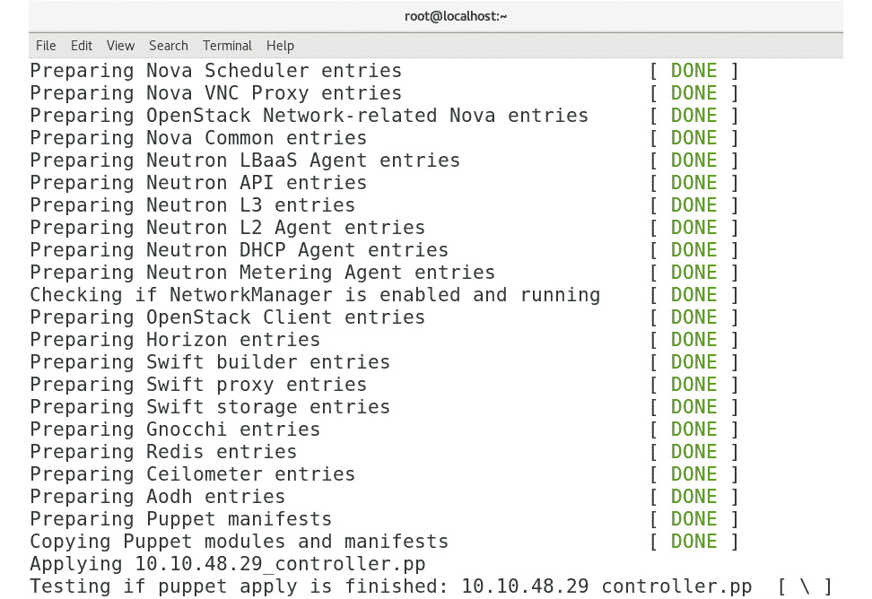

图 12.7-欣赏 PackStack 的安装详细程度

安装完成后，您将看到如下所示的报告屏幕：


图 12.8-成功安装 PackStack

安装程序已成功完成，并向我们发出关于`NetworkManager`和内核更新的警告，这意味着我们需要重新启动系统。 重新启动并检查`/root/keystonerc_admin`文件中的用户名和密码后，Packstack 就可以正常工作了，我们可以使用上一屏幕输出(`http://IP_or_hostname_where_PackStack_is_deployed/dashboard`)中提到的 URL 登录：

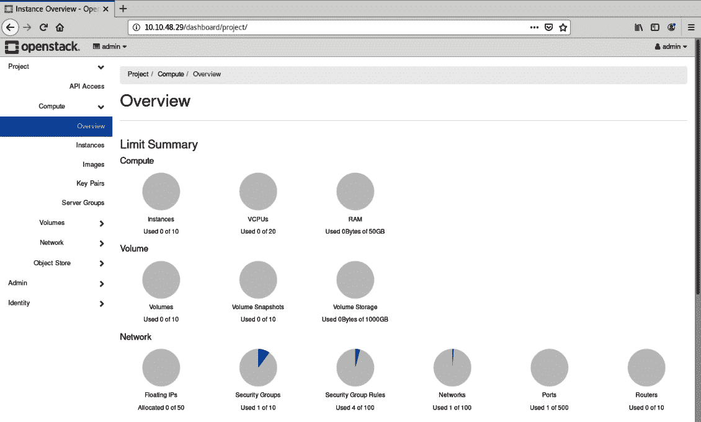

图 12.9-Packstack UI

还有一些额外的配置需要完成，正如在[https://wiki.openstack.org/wiki/Packstack](https://wiki.openstack.org/wiki/Packstack)的 Packstack 文档中指出的那样。 如果您要使用外部网络，则需要一个不带`NetworkManager`的静态 IP 地址，并且您可能希望配置`firewalld`或完全停止它。 除此之外，您可以开始使用它作为演示环境。

# 调配 OpenStack 环境

当您需要创建第一个 OpenStack 配置时，最简单但同时也是最困难的任务之一将是配置。 基本上有两种方法：一种是在精心准备的硬件配置中一次安装一个服务，另一种是只使用 OpenStack 站点上的*单个服务器安装*指南，并创建一台机器作为您的测试台。 在本章中，我们所做的一切都是在这样一个实例中创建的，但是在我们学习如何安装系统之前，我们需要了解其中的区别。

OpenStack 是一个云操作系统，其主要思想是使我们能够使用多个服务器和其他设备来创建一个连贯的、易于配置的云，该云可以通过 API 或 Web 服务器从中心点进行管理。 OpenStack 部署的规模和类型可以是运行一切的一台服务器，也可以是跨多个数据中心集成的数千台服务器和存储单元。 OpenStack 在大规模部署方面没有问题；唯一真正的限制因素通常是我们试图创建的环境的成本和其他要求。

我们多次提到可伸缩性，这就是 OpenStack 在这两个方面的亮点。 令人惊讶的是，它不仅可以很容易地放大，而且还可以缩小。 完全适合单个用户的安装可以在一台机器上完成-甚至可以在一台机器内的单个虚拟机上完成-因此您将能够在笔记本电脑的虚拟环境中拥有自己的云。 这对测试东西很有用，但不适用于其他东西。

裸机安装将遵循特定角色和服务的指导原则和推荐配置要求，这是创建可工作的、可扩展的云的唯一方法，显然，如果您需要创建生产环境，这显然是可行的方法。 话虽如此，在安装一台机器和安装一千台服务器之间，有很多方法可以调整和重新设计您的基础设施，以支持您的特定用例场景。

让我们首先快速完成在另一台虚拟机中的安装，这项任务在速度更快的主机上不到 10 分钟就可以完成。 对于我们的平台，我们决定安装 Ubuntu18.04.3LTS，以便能够将主机系统保持在最低限度。 有关我们正在尝试做什么的整个 Ubuntu 指南可以在[https://docs.openstack.org/devstack/latest/guides/single-machine.html](https://docs.openstack.org/devstack/latest/guides/single-machine.html)上找到。

我们必须指出的一件事是，OpenStack 站点为许多不同的安装场景提供了指南，包括在虚拟硬件和裸机硬件上的安装场景，而且这些场景都非常容易理解，原因很简单，因为文档非常切中要害。 还有一个简单的安装脚本，只要您手动完成几个步骤，它就会处理所有事情。

请注意硬件要求。 有一些很好的资源可以用来报道这个主题。 从这里开始：[https://docs.openstack.org/newton/install-guide-rdo/overview.html#figure-hwreqs](https://docs.openstack.org/newton/install-guide-rdo/overview.html#figure-hwreqs)。

## 分步安装 OpenStack

我们需要做的第一件事是创建一个要安装整个系统的用户。 该用户需要才能拥有`sudo`权限，因为很多事情都需要系统范围的权限。

以超级用户身份或通过`sudo`创建用户：

```sh
useradd -s /bin/bash -d /opt/stack -m stack
chmod 755 /opt/stack
```

我们需要做的下一件事是允许该用户使用`sudo`：

```sh
echo "stack ALL=(ALL) NOPASSWD: ALL" >> /etc/sudoers
```

我们还需要安装`git`并切换到新创建的用户：


图 12.10-安装 git，部署 OpenStack 的第一步

现在是有趣的部分。 我们将克隆(复制的最新版本)`devstack`，该安装脚本将提供在此计算机上运行和使用 OpenStack 所需的一切：


图 12.11-使用 git 克隆 devstack

现在需要进行一些配置。 在`samples`目录中，在我们刚刚克隆的目录中，有一个名为`local.conf`的文件。 使用它可以配置安装程序需要的所有内容。 网络是一件必须手动配置的事情--不仅是本地网络(连接您与互联网其余部分的网络)，还包括内部网络地址空间，它将用于 OpenStack 在实例之间执行的所有操作。 还需要为不同的服务设置不同的密码。 所有这些都可以在示例文件中读取。 有关如何准确配置它的说明，可以在我们之前给出的 Web 地址上找到，也可以在文件本身中找到：


图 12.12-安装程序配置

此安装过程会出现一些问题，因此，由于以下原因，安装可能会中断两次：

*   `/opt/stack/.cache`的所有权是`root:root`，而不是`stack:stack`。 请在运行安装程序之前更正此所有权；
*   安装程序问题(已知的问题)，因为它无法安装组件，然后失败。 解决方案相当简单--Inc.目录中的文件中有一行需要更改，名为 python。 在写入时，该文件的第 192 行需要从`$cmd_pip $upgrade \`更改为`$cmd_pip $upgrade --ignore-installed \`

最后，在我们收集了所有数据并修改了文件之后，我们确定了这个配置：


图 12.13-示例配置

这些参数中的大多数都是可以理解的，但让我们首先介绍其中的两个参数：`FLOATING_RANGE`和`FIXED_RANGE`。 参数`FLOATING_RANGE`告诉我们的 OpenStack 安装哪个网络作用域将用于*专用*网络。 另一方面，`FIXED_RANGE`是 OpenStack 配置的虚拟机将使用的网络范围。 基本上，OpenStack 环境中配置的虚拟机将从`FIXED_RANGE`获得内部地址。 如果虚拟机也需要从外部世界获得，我们将从`FLOATING_RANGE`分配一个网络地址。 请小心使用`FIXED_RANGE`，因为它不应该与您环境中的现有网络范围匹配。

与指南中给出的不同之处在于，我们将 SWIFT 安装中的副本数量减少到一个。 这不会给我们带来冗余，但会减少用于存储的空间，并略微加快速度。 请勿在生产环境中执行此操作。

根据您的配置，您可能还需要在文件中设置`HOST_IP`地址变量。 在这里，将其设置为您当前的 IP 地址。

然后，运行`./stack.sh`。

运行脚本后，真正冗长的安装应该会启动，并在屏幕上转储很多行。 等待它完成-这将需要一段时间，并从互联网下载大量文件。 最后，它将为您提供如下所示的安装摘要：


图 12.14-安装摘要

完成此操作后，如果一切正常，您的本地计算机上应该有一个完整的 OpenStack 运行版本。 要验证这一点，请使用 Web 浏览器连接到您的计算机；应显示欢迎屏幕：

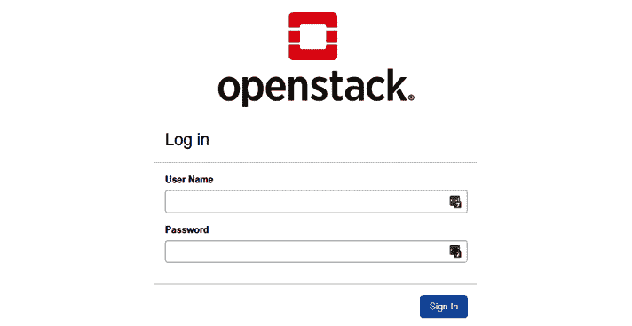

图 12.15-OpenStack 登录屏幕

使用写在您机器上的凭据登录后，在安装之后(默认管理员名称为`admin`，密码是您在`local.conf`中设置的安装服务时设置的密码)，您将看到一个屏幕，向您显示云的统计信息。 您现在看到的屏幕实际上是 Horizon 仪表板，它是主屏幕，可让您一目了然地了解您的云。

## OpenStack 管理

查看 Horizon 的左上角，我们可以看到默认配置的有三个截然不同的部分。 第一个项目-**Project**-涵盖了关于我们的默认实例及其性能的所有内容。 在这里，您可以创建新实例、管理映像和处理服务器组。 我们的云只是一个核心安装，所以我们只有一台服务器和两个定义的区域，这意味着我们没有安装服务器组：

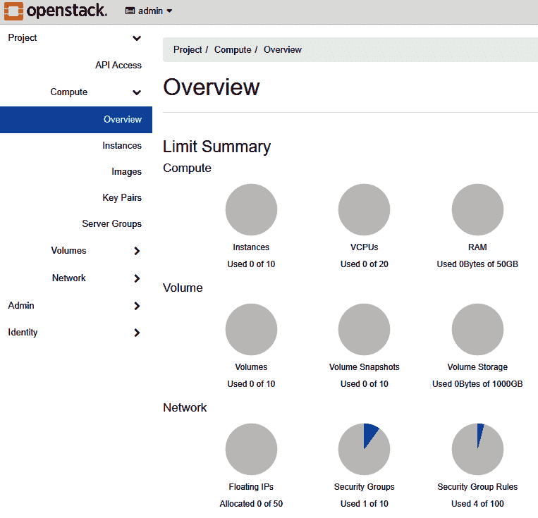

图 12.16-Basic Horizon 控制面板

首先，让我们创建一个快速实例来展示如何做到这一点：


图 12.17-创建实例

按照以下步骤创建实例：

1.  Go to **Launch Instance** in the far-right part of the screen. A window will open that will enable you to give OpenStack all the information it needs to create a new VM instance:

    

    图 12.18-启动实例向导

2.  On the next screen, you need to supply the system with the image source. We already mentioned glances – these images are taken from the Glance store and can be either an image snapshot, a ready-made volume, or a volume snapshot. We can also create a persistent image if we want to. One thing that you'll notice is that there are two differences when comparing this process to almost any other deployment. The first is that we are using a ready-made image by default as one was provided for us. Another big thing is the ability to create a new persistent volume to store our data in, or to have it deleted when we are done with the image, or have it not be created at all.

    选择您在公共存储库中分配的一个映像；它的名称应该类似于下面的屏幕截图中所示的名称。 CirrOS 是 OpenStack 提供的测试映像。 它是一个最小的 Linux 发行版，设计得尽可能小，能够轻松地测试整个云基础设施，但又尽可能不引人注目。 CirrOS 基本上是一个操作系统占位符。 当然，我们需要点击**Launch Instance**按钮进入下一步：

    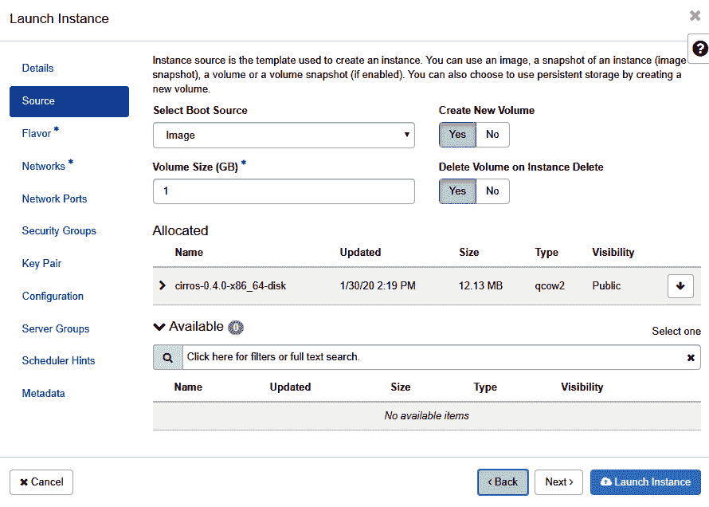

    图 12.19-选择实例源

3.  The next important part of creating a new image is choosing a flavor. This is another one of those peculiarly named things in OpenStack. A flavor is a combination of certain resources that basically creates a computing, memory, and storage template for new instances. We can choose from instances that have as little as 64 MB of RAM and 1 vCPU and go as far as our infrastructure can provide:

    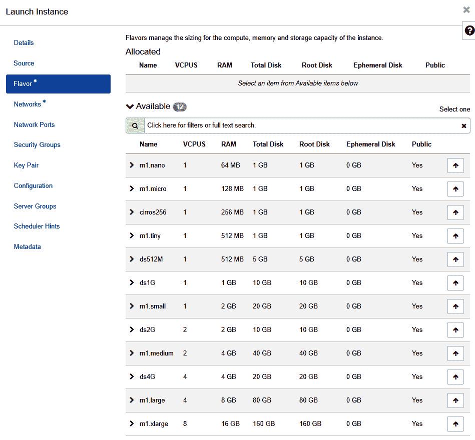

    图 12.20-选择实例风格

    在这个特定的示例中，我们将选择`cirros256`，这是一种基本上旨在为我们的测试系统提供尽可能少的资源的风格。

4.  我们实际上需要选择的最后一件事是网络连接。 我们需要设置我们的实例在运行时能够使用的所有适配器。 由于这是一个简单的测试，我们将使用我们拥有的两个适配器，包括内部适配器和外部适配器。 它们被称为`public`和`shared`：

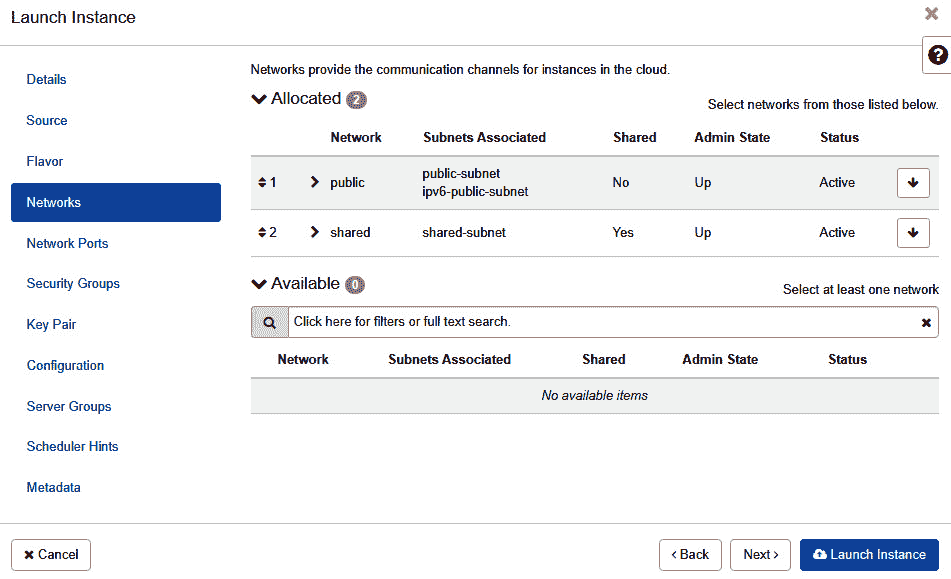

图 12.21-实例网络配置

现在，我们可以启动我们的实例，它将能够引导。 单击**Launch Instance**按钮后，创建一个新实例可能需要不到一分钟的时间。 在部署实例时，显示其当前进度和实例状态的屏幕将自动更新。

完成此操作后，我们的实例将准备就绪：


图 12.22-实例已就绪

我们将快速创建另一个实例，然后创建一个快照，以便向您展示映像管理是如何工作的。 如果您单击实例列表右侧的**Create Snapshot**按钮，Horizon 将创建一个快照，并立即将您置于映像管理界面：

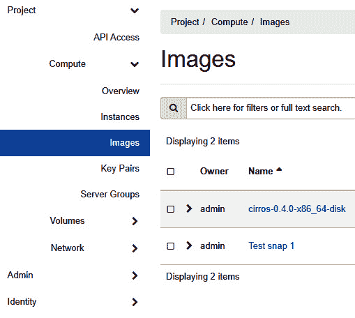

图 12.23-图像

现在，我们有两个个不同的快照：一个是开始映像，另一个是正在运行的映像的实际快照。 到目前为止，一切都很简单。 从快照创建实例怎么样？ 只需点击一下即可到达！ 您需要做的只是单击右侧的**Launch Instance**按钮，然后完成创建新实例的向导。

我们创建实例的简短示例的最终结果应该如下所示：


图 12.24-新实例创建完成

我们可以看到的是关于我们的实例所需的所有信息、它们的 IP 地址是什么、它们的风格(转换为为特定实例分配了多少资源)、运行映像的可用区以及有关当前实例状态的信息。 我们要检查的下一件事是左侧的**卷**选项卡。 当我们创建实例时，我们告诉 OpenStack 为第一个实例创建一个永久卷。 如果我们现在单击**卷**，我们应该会在数字名称下看到该卷：

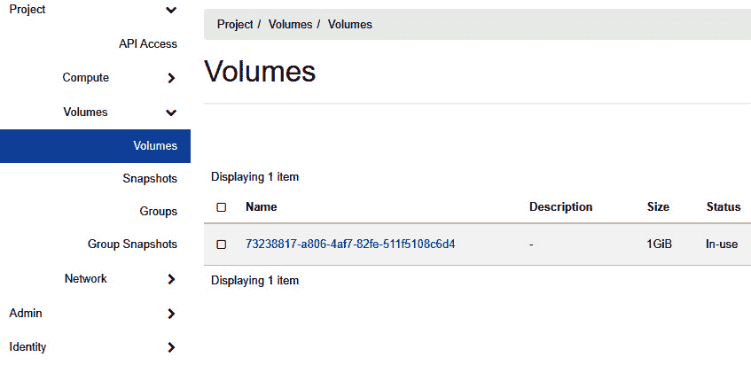

图 12.25-卷

在此屏幕上，我们现在可以为卷创建快照，将其重新连接到不同的实例，甚至可以将其作为映像上传到存储库。

左侧的第三个选项卡，名为**Network**，包含有关我们当前配置的设置的更多信息。

如果我们单击**Network Topology**选项卡，我们将获得当前正在运行的网络的整个网络拓扑，显示在一个简单的图形显示中。 我们可以从**拓扑**和**图**中选择，两者基本上代表同一事物：


图 12.26-网络拓扑

如果我们需要创建另一个网络或更改网络矩阵中的任何内容，可以在此处进行。 我们认为这不仅对文档友好，而且对管理员非常友好。 这两点都使我们的下一个话题-日常管理-变得容易得多。

## 日常管理

我们或多或少已经完成了与**项目**数据中心日常任务的管理相关的最重要的选项。 如果我们单击名为**Admin**的选项卡，我们会注意到我们打开的菜单结构与**Project**下的菜单结构非常相似。 这是因为，现在，我们关注的管理任务与云的基础设施有关，而不是与我们特定逻辑数据中心的基础设施有关，但这两者都存在相同的构建块。 但是，如果我们(例如)打开**Compute**，则存在一组完全不同的选项：


图 12.27-不同的可用配置选项

界面的这一部分用于完全管理构成我们基础架构的部分，以及定义我们在*数据中心*中工作时可以使用的不同内容的部分。 以用户身份登录时，我们可以添加和删除虚拟机、配置网络和使用资源，但要将资源联机、添加新的虚拟机管理程序、定义口味以及执行这些彻底改变基础架构的任务，我们需要被分配管理角色。 有些功能重叠，例如界面的管理部分和用户特定的部分，它们都可以控制实例。 但是，管理部分具有所有这些功能，用户可以调整他们的命令集，例如，他们不能删除或创建新实例。

管理视图使我们能够更直接地监视我们的节点，不仅通过它们提供的服务，而且还通过有关特定主机及其上使用的资源的原始数据：

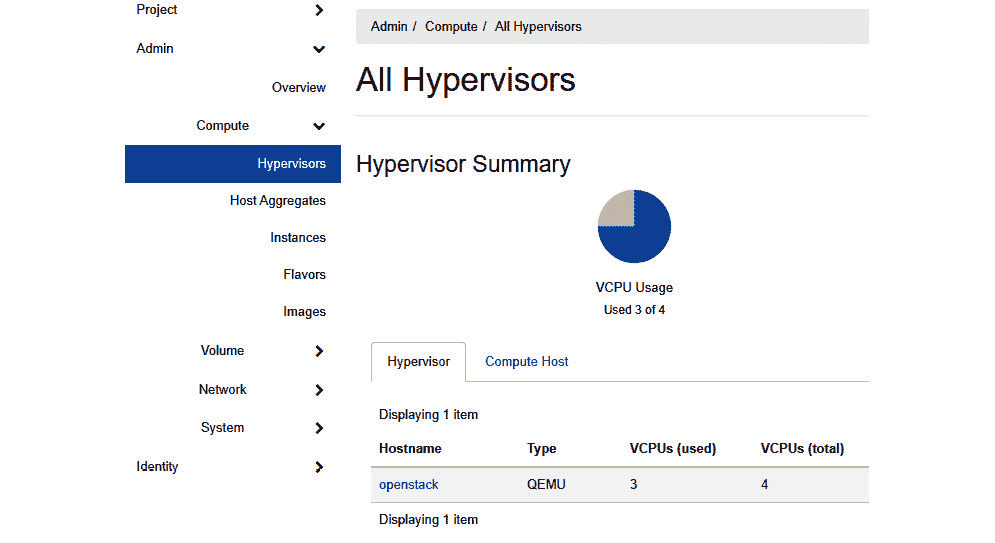

图 12.28-我们的数据中心中可用的虚拟机管理程序

我们的数据中心只有一个虚拟机管理程序，但我们可以看到它上实际可用的资源量，以及当前设置在此特定时刻使用的资源份额。

风格也是 OpenStack 整体的一个重要部分。 我们已经提到它们是一组预定义的资源预设，它们构成了实例将要在其上运行的平台。 我们的测试设置已经定义了其中的几个，但是我们可以删除此设置中附带的设置，并根据我们的需要创建新的设置。

因为云的目的是优化资源管理，所以口味在这个概念中扮演着重要的角色。 从规划和设计的角度来说，创造风味并不是一件容易的事情。 首先，也是最重要的是，它需要深入了解给定硬件平台上的可能性、存在多少计算资源和哪些计算资源，以及如何最大限度地利用这些资源。 因此，我们必须妥善规划和设计事物。 另一件事是，我们实际上需要了解我们正在为什么样的负载做准备。 它是否占用大量内存？ 我们是否有很多小型服务需要大量简单配置的节点？ 我们是否需要大量的计算能力和/或大量的存储空间？ 这些问题的答案不仅使我们能够创造客户想要的东西，而且还能创造出让用户充分利用我们的基础设施的味道。

基本的想法是创造一些特色，为个人用户提供足够的资源，让他们以令人满意的方式完成他们的工作。 这在有 10 个实例的部署中并不明显，但一旦我们将运行到数千个，总有 10%的存储闲置的情况会迅速侵蚀我们的资源，限制我们为更多用户提供服务的能力。 在我们的环境规划和设计中，在我们拥有的东西和我们提供给用户以特定方式使用的东西之间取得平衡可能是最困难的任务：

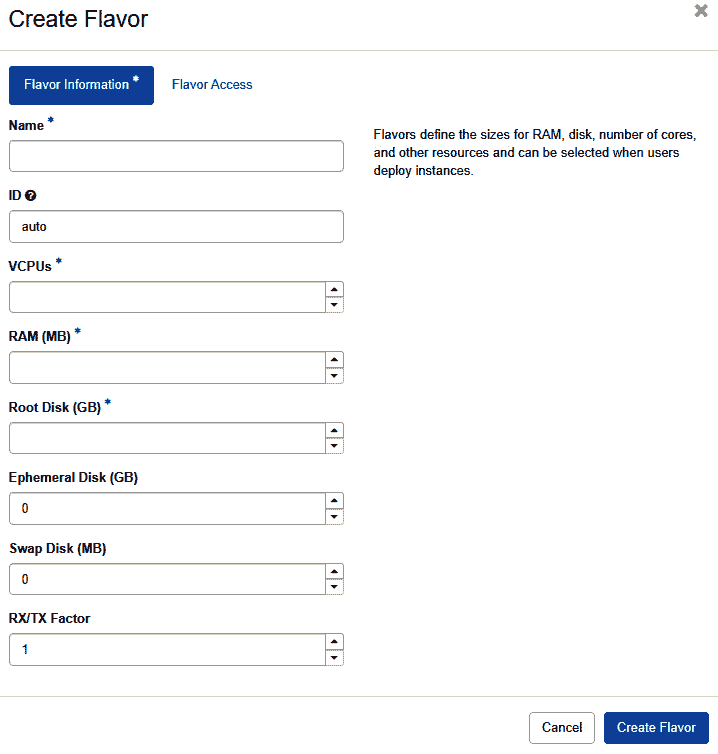

图 12.29-创建风味向导

创建口味是一项简单的任务。 我们需要做以下工作：

1.  为其命名；系统将自动分配 ID。
2.  根据我们的口味设置 vCPU 和 RAM 的数量。
3.  选择基本磁盘的大小，以及不包含在任何快照中并在虚拟机终止时被删除的临时磁盘。
4.  选择交换空间量。
5.  选择 RX/TX 因子，以便我们可以在网络级别创建一些 QoS。 某些版本需要比其他版本具有更高的网络流量优先级。

OpenStack 允许一个特定的项目具有多种风格，并且一种风格可以属于个不同的项目。 现在我们已经了解了这一点，让我们使用我们的用户标识并为他们分配一些对象。

## 身份管理

左侧的最后一个选项卡是**Identity**，它负责处理用户、角色和项目。 这是，我们不仅要在其中配置用户名，还要配置特定用户可以使用的用户角色、组和项目：

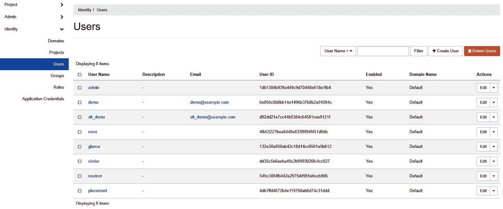

图 12.30-用户、组和角色管理

我们不会过多地讨论用户是如何管理和安装的，只会介绍用户管理的基础知识。 一如既往，OpenStack 站点上的原始文档是了解更多信息的地方。 确保您查看此链接：[https://docs.openstack.org/keystone/pike/admin/cli-manage-projects-users-and-roles.html](https://docs.openstack.org/keystone/pike/admin/cli-manage-projects-users-and-roles.html)。

简而言之，创建项目后，您需要定义哪些用户将能够查看和处理特定项目。 为了简化管理，用户也可以成为组的一部分，然后您可以将整个组分配到一个项目。

此结构的目的是使管理员不仅可以限制用户可以管理的内容，还可以限制特定项目有多少可用资源。 让我们用一个例子来说明这一点。 如果我们转到**Projects**并编辑现有项目(或创建新项目)，我们将在 Configuration 菜单中看到一个名为**Quota**的选项卡，如下所示：


图 12.31-默认项目的配额

一旦您创建了一个项目，您就可以以配额的形式分配所有资源。 此分配限制特定实例组的最大可用资源。 用户不了解整个系统；他们只能*查看*并利用项目中可用的资源。 如果用户是多个项目的一部分，则他们可以根据其在项目中的角色创建、删除和管理实例，并且他们可以使用的资源特定于项目。

接下来我们将讨论 OpenStack/Ansible 集成，以及这两个概念协同工作的一些潜在用例。 请记住，OpenStack 环境越大，我们为其找到的用例就越多。

# 集成 OpenStack 和 Sensitive

处理任何大规模的应用程序都不容易，没有合适的工具可能会使其无法实现。 OpenStack 为我们提供了许多方法来直接编排和管理巨大的水平部署，但有时这是不够的。 幸运的是，在我们的工具库中，我们还有另一个工具-**Ansible**。 在[*第 11 章*](11.html#_idTextAnchor191)，*Ansible for Orcheation and Automation*中，我们介绍了使用 Ansible 部署和配置单个计算机的其他一些较小的方法，所以我们不打算回到那个位置。 相反，我们将关注 Ansible 在 OpenStack 环境中的优势。

不过，我们必须明确的一件事是，在 OpenStack 环境中使用 Ansible 可以基于两种截然不同的场景。 一种是使用 Ansible 来处理已部署的实例，其方式在所有其他云或裸机部署中看起来基本相同。 作为大量实例的管理员，您创建的管理节点只不过是一个启用了 Python 的服务器，其中添加了 Ansible Packages 和攻略。 在此之后，您可以整理部署的库存，并准备好管理您的实例。 本章的这一部分不是关于此场景的。

我们在这里谈论的是使用 Ansible 来管理云本身。 这意味着我们不是在 OpenStack 云中部署实例；我们是在为 OpenStack 本身部署计算和存储节点。

我们谈论的环境有时被称为**OpenStack-Ansible**(**osa**)，它非常常见，有自己的部署指南，位于以下网址：[https://docs.openstack.org/project-deploy-guide/openstack-ansible/latest/](https://docs.openstack.org/project-deploy-guide/openstack-ansible/latest/)。

在 OpenStack-Ansible 中进行最小安装的要求比在单个 VM 或单个机器上安装的要求要高得多。 这样做的原因不仅仅是系统需要所有的资源，而是需要使用的工具和所有这些工具背后的理念。

让我们快速了解一下 Ansible 在 OpenStack 中的含义：

*   配置后，它可以快速部署任何类型的资源，无论是存储资源还是计算资源。
*   它可以确保您在此过程中不会忘记配置某些内容。 在部署单个服务器时，您必须确保一切正常，并且配置中的错误很容易发现，但是在部署多个节点时，错误可能会悄悄出现，并且会在没有人注意到的情况下降低部分系统的性能。 避免这种情况的正常部署做法是安装清单，但 Ansible 是一个比这好得多的解决方案。
*   更简化的配置更改。 有时，我们需要在整个系统或部分系统上应用配置更改。 如果没有脚本化，这可能会令人沮丧。

话虽如此，让我们快速浏览一下[https://docs.openstack.org/openstack-ansible/latest/](https://docs.openstack.org/openstack-ansible/latest/)，看看官方文档中关于如何部署和使用 Ansible 和 OpenStack 的内容。

关于 Ansible，OpenStack 到底为管理员提供了什么？ 最简单的答案是剧本和角色。

要使用 Ansible 部署 OpenStack，基本上需要创建一个部署主机，然后使用 Ansible 部署整个 OpenStack 系统。 整个工作流程大致如下：

1.  准备部署主机
2.  准备目标主机
3.  为部署配置可用
4.  运行攻略并让它们安装所有内容
5.  检查 OpenStack 是否安装正确

当我们谈论部署主机和目标主机时，我们需要明确区分：部署主机是一个单一实体，它拥有 Ansible、脚本、剧本、角色和所有支持部分。 目标主机是将成为 OpenStack 云一部分的实际服务器。

安装要求很简单：

*   操作系统应该是 Debian、Ubuntu CentOS 或 openSUSE(实验性)的最小安装，并应用最新内核和完整更新。
*   系统还应运行 Python2.7，使用公钥身份验证启用 SSH 访问，并启用 NTP 时间同步。 这包括部署主机。
*   对于不同类型的节点也有常用的建议。 计算节点必须支持硬件辅助虚拟化，但这是一个明显的要求。
*   有一个要求是不言而喻的，那就是使用多核处理器，使用尽可能多的内核，以使某些服务运行得更快。

磁盘要求真的由您决定。 OpenStack 建议尽可能使用快速磁盘，建议使用 RAID 中的 SSD 驱动器，以及可用于数据块存储的大型磁盘池。

*   基础架构节点的要求与其他类型的节点不同，因为它们运行的是几个随时间增长且至少需要 100 GB 空间的数据库。 基础设施还将其服务作为容器运行，因此它将以与其他计算节点不同的特定方式使用资源。

部署指南还建议运行日志记录主机，因为所有服务都会创建日志。 建议的日志磁盘空间至少为 50 GB，但在生产中，这将以数量级快速增长。

OpenStack需要一个快速、稳定的网络来配合工作。 由于 OpenStack 中的所有内容都将依赖于网络，因此建议使用每种种可能的解决方案来加快网络访问速度，包括使用 10G 和绑定接口。 安装部署服务器是整个过程的第一步，这就是我们下一步要做的原因。

## 安装 Ansible 部署服务器

我们的部署服务器需要更新所有升级，并安装 Python、`git`、`ntp`、`sudo`和`ssh`支持。 在安装了所需的软件包之后，您需要配置`ssh`键才能登录到目标主机。 这是一个可行的要求，也是利用安全性和易用性的最佳实践。

网络很简单-我们的部署主机必须连接到所有其他主机。 部署主机还应该安装在专为容器管理而设计的网络的 L2 上。

然后，应该克隆存储库：

```sh
# git clone -b 20.0.0 https://opendev.org/openstack/openstack-ansible /opt/openstack-ansible
```

接下来，需要运行 Ansible 引导脚本：

```sh
# scripts/bootstrap-ansible.sh
```

这就结束了对 Ansible 部署服务器的准备。 现在，我们需要准备要用于 OpenStack 的目标计算机。 目标计算机目前在 Ubuntu Server(18.04)LTS、CentOS7 和 openSUSE 42.x 上受支持(在撰写本文时，仍然不支持 CentOS8)。 您可以使用这些系统中的任何一个。 对于它们中的每一个，都有一个有用的指南可以帮助您快速上手：[https://docs.openstack.org/project-deploy-guide/openstack-ansible/latest/deploymenthost.html](https://docs.openstack.org/project-deploy-guide/openstack-ansible/latest/deploymenthost.html)。 我们将只解释使您轻松安装它的一般步骤，但实际上，只需从[https://www.openstack.org/](https://www.openstack.org/)复制并粘贴为您的操作系统发布的命令即可。

无论您决定在哪个系统上运行，您都必须完全了解最新的系统更新。 之后，安装`linux-image-extra`包(如果您的内核存在的话)，并安装`bridge-utils`、`debootstrap`、`ifenslave`、`lsof`、`lvm2`、`chrony`、`openssh-server`、`sudo`、`tcpdump`、`vlan`和 Python 包。 此外，还要启用绑定和 VLAN 接口。 所有这些都可能对您的系统可用，也可能不可用，因此如果已经安装或配置了某些内容，请跳过它。

在`chrony.conf`中配置 NTP 时间同步以在整个部署中同步时间。 您可以使用您喜欢的任何时间源，但要使系统正常工作，时间必须同步。

现在，配置`ssh`键。 Ansible 将使用`ssh`和基于密钥的身份验证进行部署。 只需将公钥从部署计算机上的适当用户复制到`/root/.ssh/authorized_keys`。 只需从部署主机登录到目标计算机，即可测试此设置。 如果一切正常，您应该可以在没有任何密码或任何其他提示的情况下登录。 另外，请注意，部署主机上的 root 用户是管理所有内容的默认用户，并且他们必须提前生成`ssh`密钥，因为它们不仅在目标主机上使用，而且还在整个系统中运行的不同服务的所有容器中使用。 开始配置系统时，这些密钥必须存在。

请注意，对于存储节点，将在本地磁盘上创建 LVM 卷，从而覆盖任何现有配置。 网络配置将自动完成；您只需确保 Ansible 能够连接到目标计算机。

下一步是配置我们的 Ansible 库存，以便我们可以使用它。 我们现在就开始吧。

## 配置可拆分库存

在我们可以运行 Ansible 攻略之前，我们需要完成 Ansible 清单的配置，以便它将系统指向它应该安装的主机。 我们将逐字引用，可在[https://docs.openstack.org/project-deploy-guide/openstack-ansible/queens/configure.html](https://docs.openstack.org/project-deploy-guide/openstack-ansible/queens/configure.html)上找到：

1.将/opt/OpenStack-Ansible/etc/OpenStack_Deploy 目录的内容复制到

/etc/OpenStack_Deploy 目录。

2.切换到/etc/OpenStack_Deploy 目录。

3.将 OpenStack_user_config.yml.example 文件复制到

/etc/openstack_deploy/openstack_user_config.yml.

4.查看 OpenStack_user_config.yml 文件并更改部署

您的 OpenStack 环境的。

进入配置文件后，查看所有选项。 `Openstack_user_config.yml`定义哪些主机运行哪些服务和节点。 在承诺安装之前，请查看上一段中提到的文档。

在网络上脱颖而出的一件事是`install_method`。 您可以选择来源或发行版。 每种方式都有其利弊：

*   源代码是最简单的安装，因为它是直接从 OpenStack 官方网站上的源代码完成的，并且包含一个与所有系统兼容的环境。
*   发行版方法是针对您要安装的特定发行版进行定制的，方法是使用已知有效的、称为稳定的特定软件包。 这样做的主要缺点是更新速度会慢得多，因为不仅需要部署 OpenStack，还需要部署有关发行版上所有包的信息，并且需要验证设置。 因此，在升级到达*源*和进入*发行版*安装之间，Expect 会等待很长时间。 安装后，您必须使用您的主要选择；没有从一个切换到另一个的机制。

您需要做的最后一件事是打开`user_secrets.yml`文件并为所有服务分配密码。 您可以创建自己的密码，也可以使用专门为此目的提供的脚本。

## 运行 Ansible 攻略

在我们完成部署过程时，我们需要开始几本 Ansible 攻略。 我们需要按以下顺序使用提供的这三本攻略：

*   `setup-hosts.yml`：我们用来在 OpenStack 主机上调配必要服务的初始 Ansible 攻略。
*   `setup-infrastructure.yml`：部署更多服务(如 RabbitMQ、存储库服务器、memcached 等)的 Ansible 攻略。
*   `setup-openstack.yml`：部署其余服务的 Ansible 攻略--扫视、灰烬、新星、拱心石、热能、中子、地平线等。

所有这些 Ansible 攻略都需要成功完成，这样我们才能将 Ansible 与 OpenStack 集成。 因此，剩下的唯一一件事就是运行 Ansible 攻略。 我们需要从以下命令开始：

```sh
# openstack-ansible setup-hosts.yml
```

您可以在`/opt/openstack-ansible/playbooks`中找到相应的文件。 现在，运行其余设置：

```sh
# openstack-ansible setup-infrastructure.yml
# openstack-ansible setup-openstack.yml
```

所有的剧本在结束时都应该没有不可及或失败的剧本。 有了这些-祝贺你！ 您刚刚安装了 OpenStack。

# 摘要

在本章中，我们花了大量时间描述 OpenStack 的架构和内部工作方式。 我们讨论了软件定义的网络及其挑战，以及不同的 OpenStack 服务，如 Nova、SWIFT、Glance 等。 然后，我们继续讨论实际问题，比如部署 PackStack(为了验证概念，我们就称其为 OpenStack)和完整的 OpenStack。 在本章的最后部分，我们讨论了 OpenStack-Ansible 集成，以及在更大的环境中它可能对我们意味着什么。

现在我们已经讨论了*私有*云方面，是时候扩大我们的环境并将其扩展到更加基于*公共*或*混合*的方法了。 在基于 KVM 的基础设施中，这通常意味着连接到 AWS 以转换您的工作负载并将其传输到那里(公共云)。 如果我们要讨论混合类型的云功能，那么我们必须引入一个名为 Eucalyptus 的应用程序。 关于方法和原因，请查看下一章。

# 问题

1.  VLAN 作为云覆盖技术的主要问题是什么？
2.  目前云市场上正在使用哪些类型的云覆盖网络？
3.  VXLAN 是如何工作的？
4.  跨多个站点扩展第 2 层网络最常见的问题是什么？
5.  什么是 OpenStack？
6.  OpenStack 有哪些架构组件？
7.  什么是 OpenStack Nova？
8.  什么是 OpenStack SWIFT？
9.  什么是 OpenStack Glance？
10.  什么是 OpenStack Horizon？
11.  什么是 OpenStack 风格？
12.  什么是 OpenStack 中子？

# 进一步阅读

有关本章内容的更多信息，请参阅以下链接：

*   OpenStack 文档：[https://docs.openstack.org](https://docs.openstack.org)
*   Arista VxLAN 概述：[https://www.arista.com/img/data/pdf/Whitepapers/Arista_Networks_VXLAN_White_Paper.pdf](https://www.arista.com/img/data/pdf/Whitepapers/Arista_Networks_VXLAN_White_Paper.pdf)
*   红帽-什么是 Geneve？：[https://www.redhat.com/en/blog/what-geneve](https://www.redhat.com/en/blog/what-geneve)
*   思科-使用 OpenStack 配置虚拟网络：[https://www.cisco.com/c/en/us/td/docs/switches/datacenter/nexus1000/kvm/config_guide/network/5x/b_Cisco_N1KV_KVM_Virtual_Network_Config_5x/configuring_virtual_networks_using_openstack.pdf](https://www.cisco.com/c/en/us/td/docs/switches/datacenter/nexus1000/kvm/config_guide/network/5x/b_Cisco_N1KV_KVM_Virtual_Network_Config_5x/configuring_virtual_networks_using_openstack.pdf)
*   程序包堆栈：[http://rdoproject.org](http://rdoproject.org)**