# *第 13 章*：使用 AWS 横向扩展 KVM

如果你仔细观察，虚拟化是一个很难解决的问题--为了能够在计算机上运行操作系统，要模拟完整的计算机是很复杂的。 由于显而易见的原因，将这些虚拟机放入云中更加困难。 在那之后，事情真的开始变得一团糟。 从概念上讲，基于必须同时运行的计算机的绝对数量，创建可以按需运行的计算机集群甚至更加复杂。 此外，不仅需要创建仿真计算机，还需要创建所有网络和基础设施来支持更大规模的部署。 创建全球云-一种不仅可以运行数百万台机器，甚至在全球最偏远地区几乎无处不在的云-是一项很少有公司尝试过的任务，只有几家公司成功了。 本章将大体上介绍那些大型云提供商，然后是亚马逊，它们都是最大的云提供商。 我们的主要想法是展示亚马逊的成功之处，它与本书涵盖的其他主题有何关联，以及如何在真实的机器上使用亚马逊在现实世界中启用的服务。

**Amazon Web Services**(**AWS**)是一套独特的工具、服务和基础设施，可实现真正大规模的云服务，其规模如此之大以至于难以理解。 当我们谈论数以千计的站点使用数百万台服务器运行数十亿个应用程序时，即使列举这些内容也会成为一个大问题，而管理不仅可以轻松跨越单个章节，而且很可能跨越多本书。 我们将尝试向您介绍 AWS 云中最重要的服务和部分，并尝试解释它们可以用于什么以及何时使用。

在本章中，我们将介绍以下主题：

*   AWS 简介
*   为 AWS 准备和转换虚拟机
*   使用 Eucalyptus 构建混合 KVM 云

# AWS 简介

在谈论云服务时，AWS 几乎不需要介绍，尽管很少有人真正了解整个亚马逊云是多么庞大和复杂的系统。 完全可以肯定的是，在这个时候，它无疑是地球上规模最大、使用量最大的服务。

在我们做任何其他事情之前，我们需要讨论 AWS 如何以及为什么如此重要，不仅是关于它对互联网的影响，而且对于任何甚至远程尝试提供某种扩展的任务都是如此。

正如我们在本书中已经做了几次的那样，我们将从 AWS 云的基本前提开始-提供可广泛扩展的分布式解决方案，该解决方案将涵盖在互联网上执行任何类型工作负载的所有可能方案。

在本书中我们提到云的几乎所有其他地方，我们都谈到了扩展，但当我们试图将 AWS 描述为能够扩展时，我们谈论的可能是地球上最大的容量和可扩展性提供商之一。

目前，互联网上或多或少有四家真正的云提供商：AWS、Microsoft Azure、Google Cloud Platform 和阿里巴巴。 由于出于商业原因，所有数据都是保密的，因此服务器的数量和它们能提供的绝对容量是分析师试图估计的，或者更多的是猜测，但它必须以数百万计。

## 走近云端

虽然从表面上看，他们现在正在争夺同一个云市场，但所有的参与者都来自不同的背景，即使是现在，他们使用基础设施的方式也截然不同。 在这个市场上，亚马逊是第一个，它在 IT 领域领先了一步，这似乎令人难以置信-大约 6*年*。 亚马逊在 2006 年推出了亚马逊网络服务(Amazon Web Services)，但它在几年前就开始了这项服务的开发。 甚至有一篇博客文章提到了早在 2004 年发布的这项服务。 当亚马逊意识到它拥有市场上无与伦比的庞大基础设施，并通过扩大它并将其作为一项服务提供时，它就基本上就有了创建 AWS 的想法，它可以盈利。 在那个时间点上，他们拥有的基础设施被用来提供 Amazon.com 服务。

这个想法与市场上的任何东西都不同。 人们习惯于将计算机并置在数据中心，并且能够在*云*中租用服务器，但是只租用他们需要的堆栈部分而不是整个硬件基础设施的概念是新的。 AWS 提供的第一个大服务很简单，甚至命名为**简单存储服务**(**S3**)，还有**弹性计算云**(**EC2**)。 S3 基本上是云支持的存储，它为那些能够支付的人提供了几乎无限的存储资源，就像今天一样。 EC2 提供计算资源。

产品扩展到**内容交付网络**(**CDN**)，并在接下来的 6 年里扩展到更多，而竞争对手仍在努力理解云的实际含义。

我们稍后会回到 AWS 提供的服务上，但只有在我们提到他们最终在这个每年价值数千亿美元的市场上获得的竞争之后，我们才会回到 AWS 提供的服务上来。

微软在本世纪头十年末的某个时候意识到，它需要建立一个基础设施来支持自己和客户。 微软有自己的业务支持基础设施来运营公司，但当时没有向普通公众提供公共服务。 在 2010 年引入**Microsoft Azure**之后，就改变了。 最初，它被称为**Windows Azure**，创建它主要是为了同时为微软及其合作伙伴运行服务，主要是在 Windows 上。 很快，微软意识到，仅仅在云中提供一个微软操作系统会让他们失去很多客户，所以 Linux 也是作为一个可以安装和使用的操作系统提供的。

Azure 现在作为一个公开可用的云运行，但是很大一部分仍然被微软及其服务所使用，最引人注目的是**Office 365**和无数的微软培训和营销解决方案。

另一方面，谷歌以一种不同的方式进入市场。 他们也意识到了云产品的需求，但在 2008 年，他们与云的第一次接触仅限于提供名为**App Engine**的单一服务。 这是一项面向网络开发人员社区的服务，谷歌甚至以有限的方式免费发放了 1 万份使用该服务的许可证。 就其核心而言，这项服务以及它之后出现的几乎所有服务的前提是，Web 需要能够使开发人员能够快速部署可扩展或不可扩展、可工作或不工作的服务。 因此，免费提供意味着很多开发人员倾向于只使用该服务进行简单测试。

谷歌现在也提供了大量的服务，但当你从外部看一看实际的服务和定价时，你会发现谷歌创建云似乎是为了出租其数据中心的额外容量。

## 多云

回顾几年前，Azure 和 Google Cloud Platform 都有可行的云服务，但与 AWS 提供的服务相比，他们的服务根本达不到标准。 无论是在市场份额方面，还是在人们的心目中，AWS 都是最大的参与者。 Azure 被认为更面向微软，尽管在其上运行的一半以上的服务器都是基于 Linux 的，而且谷歌并不被视为竞争对手；他们的云看起来更像是一项副业，而不是一个可行的运行云的方案。

然后出现了**多云**。 想法很简单-不使用单个云来部署您的服务；使用多个云提供商来提供*数据冗余*、*可用性*和*故障转移*，最重要的是*降低成本和灵活性*。 这听起来可能很奇怪，但使用云服务时最大的成本之一就是从云服务中获取数据。 通常，将数据放入云中，无论是用户上传数据，还是您在服务器上部署数据，要么是免费的，要么成本极低，这是有道理的，因为如果您有大量的在线数据，您就更有可能在这个特定的云上使用更多的服务。 一旦需要提取数据，它就会变得昂贵。 这是故意的，它将用户锁定在云提供商中。 一旦您上传了数据，只将其保存在服务器上而不尝试离线使用要便宜得多。 但在讨论多云时，数据并不是唯一需要考虑的因素；服务也是方程式的一部分。

### 为什么选择多云？

许多公司(我们必须强调的是，由于涉及的成本，多云用户大多是大公司)害怕被限制在特定的平台或技术中。 最大的问题之一是，如果一个平台发生了如此大的变化，以至于公司不得不重做部分基础设施，会发生什么？ 想象一下，您是一家价值数十亿美元的公司，正在为您自己的数十万用户运行一个企业应用程序。 您选择云的原因很常见--降低资本支出，并能够扩展您的服务。 你决定和一家大供应商合作。 突然间，您的提供商决定要更改技术，并将逐步淘汰部分基础设施。 当涉及到这样的轮班时，通常意味着您当前的设置将慢慢变得更加昂贵，或者您将失去部分可用的功能。 值得庆幸的是，这些事情通常也会持续数年，因为任何理智的云提供商都不会在一夜之间经历战略变化。

但改变就是改变，作为一家公司，你可以选择-留在供应商那里，面临系统价格高得多的后果-或者重新设计系统，这也会耗资，可能需要数年甚至几十年的时间才能完成。

因此，许多公司决定采取非常保守的策略--设计一个可以在任何云上运行的系统，这意味着使用所有可用技术中最小的公分母。 这也意味着系统可以在几天内从云迁移到云。 他们中的一些人甚至决定在同一时间在不同的云上运行该系统。 这是一种极其保守的方法，但它是有效的。

使用多云策略的另一个重要原因与我们刚才提到的完全相反。 有时，我们的想法是使用一个或多个特定的云服务，这些服务在非常专门的任务中是最好的。 这意味着选择来自不同提供商的不同服务来执行不同的任务，但要尽可能高效地完成任务。 从长远来看，这也意味着必须不时更换供应商和系统，但如果公司使用的核心系统在设计时考虑到了这一点，这种方法可能会有其好处。

## 隐藏它

还有另一种方式，一家公司甚至可以在不知情的情况下成为多云环境，这通常被称为**影子 IT**。 如果公司没有严格的安全策略和规则，一些员工可能会开始使用不属于公司提供的服务的服务。 它可以是云存储容器、视频会议系统或邮件列表提供商。 在更大的公司中，甚至可能是整个部门开始使用来自不同云提供商的东西，甚至都没有意识到这一点。 突然之间，一台服务器上的公司数据超出了公司 IT 覆盖或能够覆盖的范围。

这一特殊现象的一个较好的例子是在新冠肺炎病毒全球流行期间视频会议服务的使用情况发生了怎样的变化。 几乎所有的公司都有一个既定的通信系统，通常是一个覆盖整个公司的消息系统。 然后，几乎在一夜之间，大流行让所有的工人都呆在家里。 由于沟通是运营公司的关键，每个人都决定在一周内在全球范围内切换到视频和音频会议。 接下来发生的事情有一天可能会成为畅销书的主题。 大多数公司试图坚持他们的解决方案，但几乎所有公司的尝试在第一天都失败了，要么是因为这项服务太基础，要么太过时，不能同时用作音频和视频会议解决方案，要么因为这项服务不是为巨大的呼叫量和请求量而设计的，结果崩溃了。

人们想要协调，所以突然之间没有什么是不可能的。 每一个视频会议解决方案都突然成为候选解决方案。 公司、部门和团队开始试验不同的会议系统，云提供商很快意识到了这一机遇-几乎所有的服务都可以立即免费提供给即使是规模较大的部门，在某些情况下，允许多达 150 人参加会议。

由于需求，许多服务都崩溃了，但大型提供商大多能够扩大到保持一切正常运行所需的数量。

由于疫情是全球性的，许多人认为他们也需要一种与家人交谈的方式。 因此，个人用户开始在家里使用不同的服务，当他们决定某项服务有效时，他们会在工作中使用。 在短短几天内，公司变成了一个多云环境，人们使用一个提供商进行通信，另一个提供商用于电子邮件，第三个提供商用于存储，第四个提供商用于备份。 变化如此之快，以至于有时 IT 部门会在系统上线后几天就被告知这一变化，而人们已经在使用它们了。

这种变化是如此巨大，以至于在我们写这本书的时候，我们甚至无法预测，一旦用户意识到有一些服务比公司提供的软件工作得更好，将有多少服务将成为公司工具包的常规组成部分。 这些服务能够在这样的重大灾难中持续工作，进一步证明了这一点，因此公司范围内的软件使用政策只能做这么多来阻止这种混乱的多云方法。

## 市场份额

每个人一提到云计算公司和服务就会提到的第一件事就是它们各自拥有的市场份额。 我们也需要解决这一点，因为我们说过我们谈论的是*最大的*或*第二个*。 在多云成为一件事之前，市场份额基本上被 AWS 瓜分，市场份额最大；Azure 远远次之；其次是谷歌和一大群*小*提供商，如阿里巴巴、甲骨文、IBM 等。

一旦多云成为现实，最大的问题就是如何确定谁拥有最大的实际市场份额。 所有的大公司都开始使用不同的云提供商，仅仅试图增加提供商的市场份额已经变得困难。 从不同的民意调查中可以明显看出，亚马逊仍是领先的提供商，但企业正慢慢开始与亚马逊服务一起使用其他提供商。

这意味着，到目前为止，AWS 仍然是云提供商的首选，但选择本身不再与单一提供商有关。 人们也在使用其他提供商。

## 基础设施庞大但没有服务

有时候，试图瓜分市场份额还有另一个必须考虑的观点。 如果我们谈论的是云提供商，我们通常认为我们谈论的是那些拥有最大基础设施来支持云服务的公司。 有时候，在现实中，我们实际上是在比较那些拥有市场上最大服务组合的公司。 这是什么意思？

有一家截然不同的公司，它拥有庞大的云业务，但几乎完全使用自己的基础设施来提供自己的内容-Facebook。 虽然很难用服务器、数据中心或任何其他指标来比较基础设施的规模，但由于这些数字是一个严密保密的秘密，Facebook 的基础设施的规模与 AWS 的规模相同。 真正的不同之处在于，这个基础设施不会为第三方提供服务，实际上，它从来都不打算这样做；Facebook 创建的一切都是为支持自己而量身定做的，包括为数据中心选择位置、配置和部署硬件以及创建软件。 Facebook 不会突然变成另一个 AWS；它太大了，不能这么做。 可用的基础设施并不总是与云市场份额相关。

## 定价

我们必须讨论的另一个话题，如果只是提一下的话，就是定价问题。 本书中几乎每一次提到云都是技术性的。 我们比较了从**IOPS**，到**GHz**，再到网络端的**PPS**，所有可能有意义的指标，但云不仅仅是一个技术问题--当您必须将其投入使用时，必须有人为其买单。

由于竞争激烈，定价是云计算领域的热门话题。 所有云提供商都有自己的定价策略，回扣和特惠几乎是常态，这一切都让理解定价变成了一场噩梦，特别是如果你对所有不同的模式都是新手的话。 有一件事是肯定的，所有的供应商都会说，他们只对你使用的东西收费，但定义他们的实际意思可能是一个很大的问题。

在开始规划部署成本时，您应该首先停下来，并尝试定义您需要什么、需要多少，以及您是否正在以应该使用的方式使用云。 到目前为止，最常见的错误是认为云在任何形式上都类似于使用普通服务器。 人们首先注意到的是在特定数据中心运行特定配置的特定实例的价格。 价格通常是实例的月度成本，并且通常是按比例计算的，因此您只需为您使用的部分付费，或者为不同的时间单位(每天、每小时，甚至可能是每秒)提供价格。 这应该是您的第一个提示：您为使用实例付费，因此为了降低成本，不要让实例一直运行。 这还意味着，您的实例必须设计为按需快速启动和关闭，因此使用*标准*方法(安装单个或多个服务器并始终运行它们)在这里不一定是一个好的选择。

在选择实例时，选择的选项实在太多了，在此不胜枚举。 所有的云提供商都对人们的需求有自己的想法，所以你不仅可以选择处理器数量或内存大小等简单的东西，还可以预装操作系统，并获得种类繁多的存储和网络选项。 存储是一个特别复杂的主题，我们只会快速触及这里的皮毛，稍后才会提到。 所有的云提供商都提供两样东西--某种类型的存储用于连接到实例，以及某种类型的存储用于服务。 给定提供商提供的内容可能取决于您尝试请求的实例、您尝试请求的数据中心以及许多其他因素。 预计您将不得不平衡三件事：容量、定价和速度。 当然，这里我们谈论的是实例存储。 存储即服务甚至更加复杂，因此，您不仅要考虑定价和容量，还要考虑延迟、带宽等其他因素。

例如，AWS 使您能够从各种服务中进行选择，从数据库存储、文件存储和长期备份存储，到不同类型的数据块和对象存储。 为了以最佳方式使用这些服务，您需要首先了解所提供的服务是什么、如何提供、涉及的不同成本是什么，以及如何将它们用于您的优势。

你很快就会注意到的另一件事是，当云提供商说一切都是服务时，他们真的是真心实意的。 完全可以在没有单个服务器实例的情况下运行应用程序。 任务可以通过将不同的服务缝合在一起来完成，这是通过设计实现的。 这创建了一个非常灵活的基础设施，可以快速轻松地进行扩展，但在设计所需的解决方案时，不仅需要不同的代码编写方式，而且需要完全不同的思维方式。 如果你没有经验，那就找个专家，因为这是你解决方案的根本问题。 它必须在云上运行，而不是在碰巧在云中的虚拟机上运行。

我们给你的建议很简单-*阅读大量文档*。 所有的提供商都有优秀的资源，可以让您了解他们的服务提供了什么以及如何提供，但数千页不会告诉您的是，与竞争对手相比如何，更重要的是，将服务连接在一起的最佳方式是什么。 在为云服务付费时，要预料到你会偶尔犯错误并为此买单。 这就是在部署服务时使用现收现付选项非常有用的原因--如果您犯了错误，您不会产生巨额账单；您的基础设施只会停止运行。

谈到定价时要提到的另一件事是，所有东西都要花一点钱，但给定配置的综合价格可能会很高。 任何额外的资源都是要花钱的。 服务器之间的*内部链接*、*外部 IP 地址*、*防火墙*、*负载均衡器*、*虚拟交换机*，这些都是我们在设计基础设施时通常不会考虑的事情，但一旦我们在云中需要它们，它们就会变得昂贵。 另一件可以预料到的事情是，某些服务具有不同的上下文-例如，如果您在实例之间或向外部传输数据，则网络带宽可能具有不同的价格。 同样的道理也适用于存储--正如我们在本章前面提到的，大多数提供商在存储和从云中获取数据时会向您收取不同的价格。

## 数据中心

在本章中，我们提到了几次**数据中心**，重要的是我们稍微谈一下它们。 数据中心是云基础设施的核心，其方式比您想象的要多。 当我们谈到很多服务器时，我们提到我们通常将它们组合到机架中，然后将这些机架放入数据中心。 正如您可能知道的那样，数据中心本质上是一组机架，其中包含服务器以最佳方式运行所需的所有基础设施，无论是在电源和数据方面，还是在冷却、保护和保持服务器运行所需的所有其他方面。 它们还需要在逻辑上划分为我们通常称为**故障域**的**风险区**，以便我们可以避免与*我们在一个机架*或*上部署所有东西在一台物理服务器上*场景相关的各种风险。

数据中心在任何情况下都是一个复杂的基础设施元素，因为它需要高效、安全和冗余的组合。 将一组服务器放入机架非常容易，但提供*冷却*和*电源*并非易事。 此外，如果您希望您的服务器正常工作，冷却、电源和数据都必须是*冗余的*，而且所有这些都需要安全，无论是火灾、洪水、地震还是人员，而且运营一个真正的数据中心的成本可能很高。 当然，一个运行数百台服务器的数据中心并不像运行数千台甚至数万台服务器的数据中心那么复杂，而且价格也会随着设施的规模而上涨。 此外，拥有多个数据中心会在连接这些数据中心时带来额外的基础设施挑战，因此成本会增加。

现在将成本乘以 100，因为这是每个云提供商在世界各地保留的数据中心数量。 有些中心很小，有些很大，但游戏的名字很简单-*Networking*。 为了成为真正的全球供应商，所有这些公司都必须拥有一个数据中心，或至少几台服务器，尽可能靠近你。 如果你在世界上几乎任何一个大国的大城市中阅读这篇文章，很可能在你方圆 100 英里的范围内有一台 AWS、微软或谷歌拥有的服务器。 自以来，所有提供商都试图在每个国家的每个大城市至少拥有一个数据中心，以使他们能够以极快的速度提供一系列服务。 这个概念被称为**联系点**(**POC**)，意思是当您连接到提供商的云时，您只需要到达最近的服务器，之后，云将确保您的服务尽可能快。

但当我们谈论的是真正属于亚马逊或其他公司的数据中心时，我们仍然在处理一项大规模的运营。 在这里，数字数以百计，他们的位置也是一个秘密，主要是出于的安全原因。 他们都有一些共同之处。 它们是一个高度自动化的操作，位于一个主要电源、一个主要冷却源或一个主要数据中心附近的某个地方。 理想情况下，它们会被放置在一个拥有这三样东西的地方，但这通常是不可能的。

## 安置是关键

不同的公司有不同的战略，因为选择一个好的地方来建设数据中心可以意味着大量的成本节约。 有些人甚至走向极端。 例如，微软有一个完全淹没在海洋中的数据中心，以便于冷却。

在为特定用户提供服务时，您主要关心的通常是速度和延迟，而这又意味着您希望您的服务器或服务在离用户最近的数据中心运行。 为此，所有云提供商都按地理位置划分其数据中心，从而使管理员能够在互联网的最佳位置部署他们的服务。 但与此同时，这也造成了一个典型的资源问题--地球上有些地方只有少量可用数据中心，但人口稠密，有些地方恰恰相反。 这反过来又对资源价格产生直接影响。 当我们谈到定价时，我们提到了不同的标准；现在我们可以添加另一个位置。 数据中心的位置通常给出为**区域**。 这意味着 AWS 或任何其他提供商不会向您提供其数据中心的位置，而是会说该地区的*用户最好由这组服务器*提供服务。 作为用户，您不知道特定的服务器在哪里，相反，您只关心提供商提供给您的区域。 您可以在这里找到服务区域的名称及其代码：


图 13.1-使用配置中使用的名称的 AWS 上的服务区域

选择需求旺盛的地区提供的服务可能很昂贵，如果您选择其他地方的服务器，同样的服务可能会便宜得多。 这就是云的美妙之处--您可以使用适合您和您的预算的服务。

有时价格和速度并不是最重要的。 例如，欧洲关于个人数据收集、处理和移动的法规**GDPR**等法律框架基本上规定，来自欧洲的公司必须使用欧洲的数据中心，因为它们受该法规的保护。 在这种情况下，使用美国地区可能意味着公司要承担法律责任(除非运行此云服务的公司是允许此操作的其他框架的一部分，例如**Privacy Shield**)。

## AWS 服务

我们需要稍微谈谈 AWS 在服务方面提供了什么，因为了解服务是让您能够正确使用云的一件事。 在 AWS 上，所有可用的服务都按其用途分类。 由于 AWS 有数百项服务，因此您登录后看到的第一个页面--AWS 管理控制台--一开始会让人望而生畏。

您可能会出于学习目的使用 AWS Free Tier，因此第一步是实际开立 AWS 免费账户。 就我个人而言，我使用了我自己的个人账户。 对于免费的帐户，我们需要使用以下网址：[https://aws.amazon.com/free/](https://aws.amazon.com/free/)，并按照步骤操作。 它只需要几条信息，比如电子邮件地址、密码和 AWS 帐户名。 它还会询问您的信用卡信息，以确保您不会滥用 AWS 帐户。

注册后，我们可以登录并进入 AWS 控制面板。 看看这张截图：

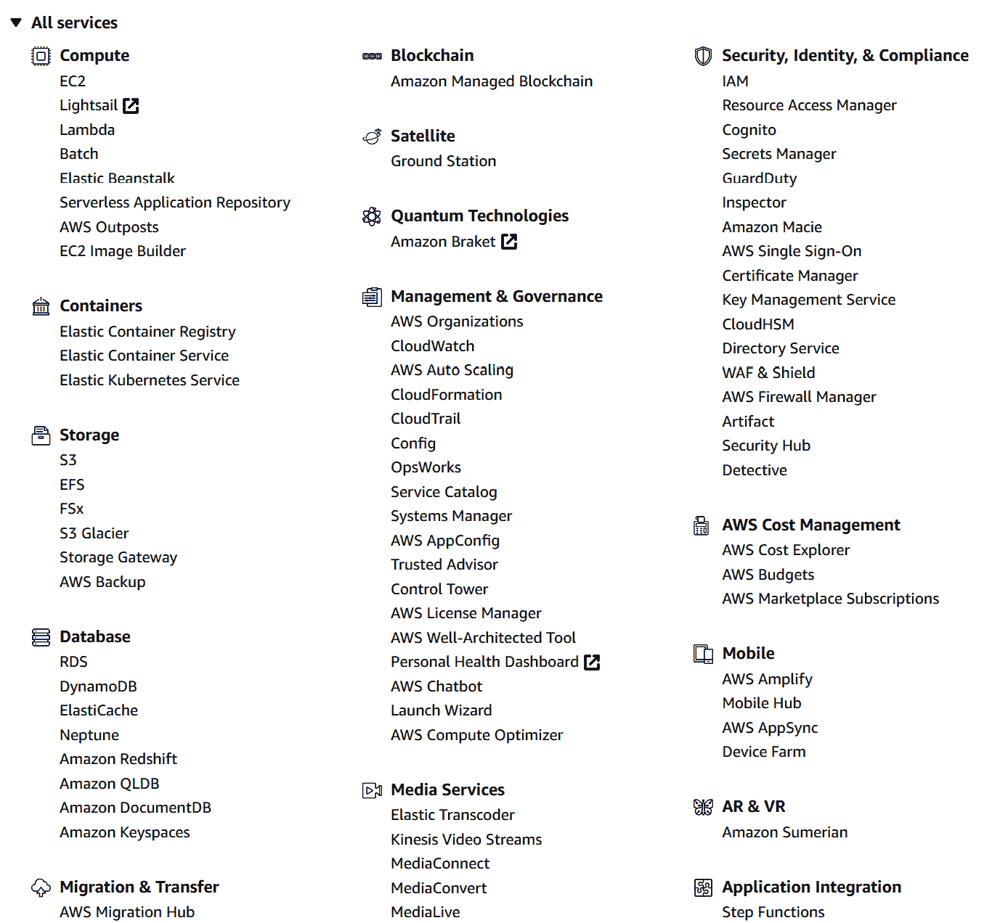

图 13.2-亚马逊服务

这里的每一件事都是一个链接，它们都指向不同的服务或包含子服务的页面。 此外，该屏幕截图仅显示了所有可用服务的三分之一左右。 在本书中全面介绍它们没有任何意义；我们只使用其中的三个来展示 AWS 如何连接到我们的 KVM 基础设施，但是一旦掌握了诀窍，您就会慢慢开始了解所有东西是如何连接的，以及在特定时刻要使用什么。 真正有帮助的是，AWS 有很棒的文档，而且所有不同的服务都有帮助您找到您要找的东西的配置向导。

在本特定章节中，我们将使用这三个服务：**IAM**、**EC2**和**S3**。

当然，所有这些都是缩写，但其他服务只使用项目名称，如**CloudFront**或**Global Accelerator**。 在任何情况下，您的首要任务都应该是开始使用它们，而不仅仅是阅读它们；一旦您很好地使用了结构，理解它就会容易得多。

在本章中，我们使用的是免费帐户，而且我们所做的几乎所有操作都是免费的，因此您没有理由不尝试自己使用 AWS 基础设施。 AWS 会尽其所能为您提供帮助，因此，如果您在控制台页面上向下滚动，您会发现这些有用的图标：


图 13.3-一些 AWS 向导、文档和视频-都非常有用

所有这些都是简单的场景，可以让您在几分钟内免费启动并运行。 亚马逊意识到第一次使用云的用户被所有的选择压得喘不过气来，所以他们会试着在几分钟内让你的第一台机器运行起来，向你展示这是多么容易。

让我们让您熟悉我们将要使用的服务，我们将使用一个场景来实现这一点。 我们希望将在本地 KVM 安装中运行的计算机迁移到 Amazon AWS。 我们将一步一步地完成整个过程，但我们首先需要了解我们需要什么。 显然，第一件事是在云中运行虚拟机的能力。 在 AWS 领域，这就是 EC2 或 Amazon Elastic Compute Cloud。

### EC2

EC2 是少数几个真正的核心服务之一，这些服务基本上可以运行 AWS 云中的所有功能。 它是整个基础设施的可扩展计算能力提供商。 它支持使用各种存储、内存、CPU 和网络配置运行不同的实例或虚拟计算环境，还提供这些实例所需的所有其他功能，包括安全性、存储卷、区域、IP 地址和虚拟网络。 如果您需要更复杂的场景，例如，存在许多不同的存储选项，但实例的核心功能由 EC2 提供，则这些服务中的一些服务也可以单独提供。

### S3

此服务的全称实际上是 Amazon Simple Storage Service，因此命名为*Amazon S3*。 我们的想法是让您能够使用所提供的一种或多种方法，在需要的任何时间存储和检索任意数量的数据。 我们将使用的最重要的概念是*S3 桶*。 存储桶是一种逻辑存储元素，使您可以对存储的对象进行分组。 可以把它想象成一个存储容器的名称，您稍后将用它来存储东西，不管这些东西是什么。 您可以随心所欲地命名存储桶，但有一件事我们必须指出-存储桶的名称必须是*全局唯一的*。 这意味着当您命名存储桶时，它的名称必须不能在任何区域的其他任何地方重复。 这将确保您的存储桶有一个唯一的名称，但这也意味着尝试创建一个听起来像`bucket1`或`storage`的通用名称可能行不通。

创建存储桶后，您可以使用 Web、CLI 或 API 从其中上传和下载数据。 因为我们谈论的是一个全局系统，所以我们还必须指出，数据存储在您在创建存储桶时指定的区域中，并且一直保存在那里，除非您指定需要某种形式的多区域冗余。 在部署存储桶时请记住这一点，因为一旦您开始使用存储桶中的数据，您的用户或实例就需要获取数据，延迟可能会成为一个问题。 出于法律和隐私方面的考虑，除非您另有明确规定，否则数据永远不会离开您的专用区域。

一个存储桶可以存储任意数量的对象，但每个帐户有 100 个存储桶的限制。 如果这还不够，您可以请求(并支付)将该限制提高到 1000 个桶。

此外，请仔细查看存储和移动数据的其他不同选项-不同类型的存储可能满足也可能不符合您的需求和预算，例如 S3 Glacier，它为存储大量数据提供了便宜得多的选项，但如果您需要将数据取出，则价格昂贵。

### IAM

AWS**Identity****和 Access Management**(**IAM**)是我们需要使用的服务，因为它启用了所有对象和服务的访问管理和权限。 在我们的示例中，我们将使用它来创建完成任务所需的策略、用户和角色。

### 其他服务

无法以简单的形式提及 AWS 提供的所有服务。 我们只提到了一些必要的内容，并试图为您指明正确的方向。 您可以尝试查看您的使用场景，以及如何配置满足您特定需求的内容。

到目前为止，我们已经解释了 AWS 是什么以及它可以变得多么复杂。 我们还提到了该平台最常用的部分，并开始解释它们的功能是什么。 我们将在将本地环境中的计算机实际迁移到 AWS 时对此进行扩展。 这将是我们的下一个任务。

# 为 AWS 准备和转换虚拟机

如果您在 Google 上搜索，将计算机从 KVM 迁移到 AWS 非常容易，只需按照此链接上的说明进行操作：[https://docs.amazonaws.cn/en_us/vm-import/latest/userguide/vm-import-ug.pdf](https://docs.amazonaws.cn/en_us/vm-import/latest/userguide/vm-import-ug.pdf)

如果您实际尝试这样做，很快就会明白，鉴于*对 AWS 工作方式的基本*知识，您将无法按照说明进行操作。 这就是为什么我们选择执行这项简单的任务，作为使用 AWS 在云中快速创建工作虚拟机的示例。

## 我们想做什么？

让我们定义一下我们在做什么--我们决定将我们的一台机器迁移到 AWS 云中。 目前，我们的计算机在本地 KVM 服务器上运行，我们希望它尽快在 AWS 上运行。

我们必须强调的第一件事是，这方面没有实时迁移选项。 没有简单的工具可以让您指向 KVM 计算机并将其移动到 AWS。 我们需要一步一步来，机器需要关掉。 在快速查阅文档后，我们制定了一个计划。 基本上，我们要做的是：

1.  停止我们的虚拟机。
2.  将计算机转换为与 AWS 中使用的导入工具兼容的格式。
3.  安装所需的 AWS 工具。
4.  创建能够执行迁移的帐户。
5.  检查一下我们的工具是否正常工作。
6.  创建一个 S3 存储桶。
7.  将包含我们机器的文件上传到存储桶中。
8.  将机器导入 EC2。
9.  等待转换完成。
10.  准备好机器启动。
11.  在云中启动机器。

因此，让我们开始工作：

1.  A good place to start is by taking a look at our machines on our workstation. We will be migrating the machine named `deploy-1` to test our AWS migration. It's a core installation of CentOS 7 and is running on a host using the same Linux distribution. For that, we obviously need to have privileges:

    

    图 13.4-为我们的迁移过程选择虚拟机

    接下来要做的是停止机器-我们不能迁移正在运行的机器，因为我们需要转换机器正在使用的卷，以便使其与 EC2 上的导入工具兼容。

2.  The documentation available at [https://docs.aws.amazon.com/vm-import/latest/userguide/vmimport-image-import.html](https://docs.aws.amazon.com/vm-import/latest/userguide/vmimport-image-import.html) states that:

    将 VM 作为映像导入时，您可以导入以下格式的磁盘：开放式虚拟化归档(OVA)、虚拟机磁盘(VMDK)、虚拟硬盘(VHD/VHDX)和 RAW。对于某些虚拟化环境，您可以导出为开放式虚拟化格式(OVF)(通常包括一个或多个 VMDK、VHD 或 VHDX 文件)，然后将这些文件打包到 OVA 文件中。

    在我们的特殊情况下，我们将使用`.raw`格式，因为它与导入工具兼容，并且从 KVM 使用的`.qcow2`格式转换为此格式相当简单。

    一旦我们的机器停止，我们需要进行转换。 在磁盘上找到图像并使用`qemu-img`进行转换。 唯一的参数是文件；转换器通过检测扩展名来了解它需要做什么：

    

    图 13.5-将 qco2 图像转换为原始图像格式

    我们只需要转换映像文件，该文件包含系统的磁盘映像；VM 的安装过程中没有包含其他数据。 我们需要记住，我们正在转换为无压缩的格式，因此您的文件大小可能会显著增加：

    

    图 13.6-转换过程和相应的容量更改

    我们可以看到，我们的文件从 42MB 增加到 8 GB，这仅仅是因为我们不得不删除`qcow2`提供的用于数据存储的高级功能。 空闲层仅提供 5 GB 的存储空间，请务必相应配置原始镜像大小。

    我们的下一个明显的步骤是将该图像上传到云中，因为转换是在那里完成的。 在这里，您可以使用不同的方法，GUI 或 CLI(API 也是可能的，但是对于这个简单的任务来说太复杂了)。

3.  AWS has a CLI tool that facilitates working with services. It's a simple command-line tool compatible with most, if not all, the operating systems you can think of:

    

    图 13.7-下载并解压缩 AWS CLI

    我们使用`curl`下载一个文件，并使用它的`-o`选项说明输出文件的名称。 显然，我们需要解压缩 ZIP 文件才能使用它。 文档中还参考了该工具的安装过程。 我们讨论的是一个简单的下载，之后我们必须解压该工具。 因为没有安装程序，所以工具不会在我们的路径中，所以从现在开始，我们需要通过绝对路径引用它。

    在使用 AWS CLI 之前，我们需要对其进行配置。 该工具必须知道它将如何连接到云，它将使用哪个用户，并且必须授予所有权限，以便该工具能够将数据上传到 AWS，然后导入并转换为 EC2 映像。 因为我们还没有进行配置，所以让我们切换到 AWS 上的 GUI 并配置我们需要的东西。

    重要音符

    从现在开始，如果屏幕截图中的某些内容看起来经过了编辑，那么它很可能就是经过编辑的。 为了让一切能够无缝运行，AWS 在屏幕上显示了大量的个人和账户数据。

4.  We will go into **Identity and Access Management** or IAM, which looks like the following screenshot. Go to **Services** | **Security**, click on **Identity & Compliance**, and click on **IAM**. This is what you should see:

    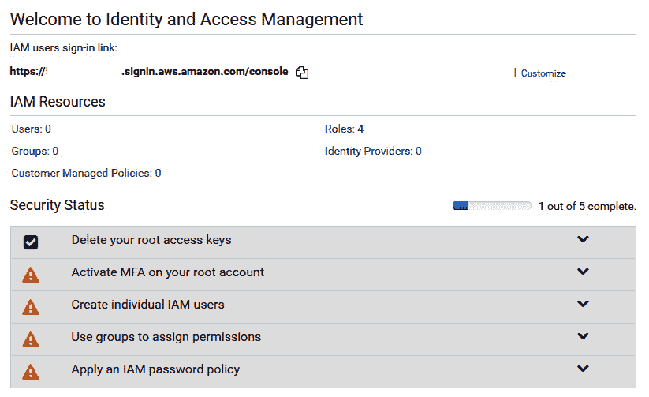

    图 13.8↓iam 控制台

    我们需要在屏幕左侧选择用户。 这将使我们能够访问用户控制台。 我们将创建名为`Administrator`的用户和名为`administrators`的组，并对其应用适当的权限。 然后，我们将该用户加入到组中。 在第一个屏幕上，您可以选择两个选项：**编程访问***和***AWS 管理控制台访问**。 第一个允许您使用 AWS CLI，第二个允许用户在需要此帐户进行配置时登录到管理控制台。 我们只选择第一个，但稍后会添加 API 密钥：

    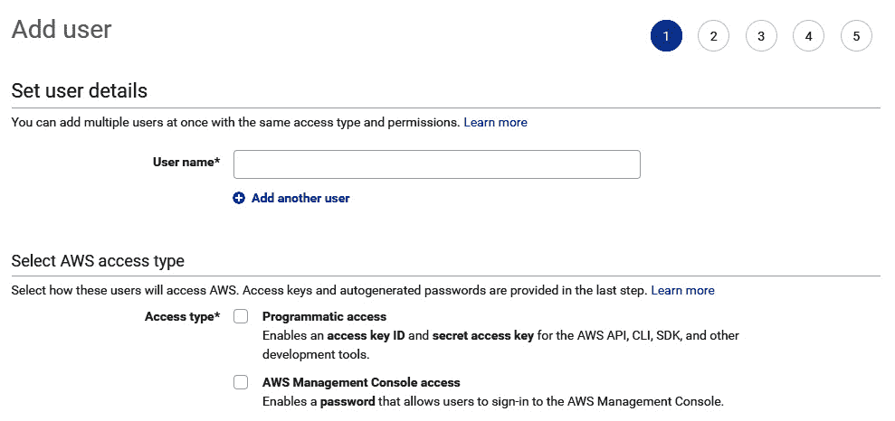

    图 13.9-配置用户权限

    单击相应选项后，我们可以设置用户的初始密码。 此用户必须在登录后立即进行更改：

    

    图 13.10-设置稍后要更改的初始密码

    我们还将为该用户创建一个组。 选择屏幕上部的相应按钮即可完成此操作：

    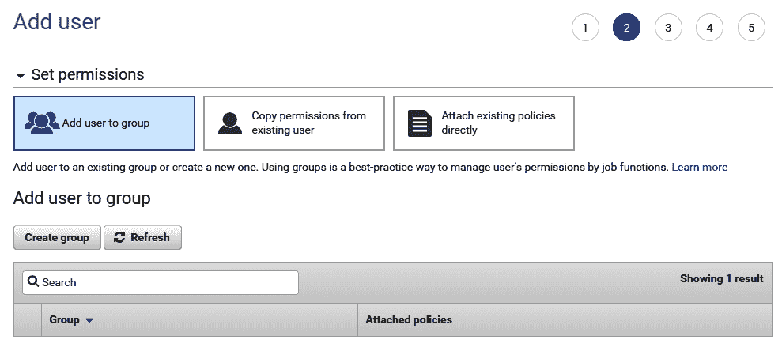

    图 13.11-为我们的用户创建组

    我们可以直接向用户分配适当的策略，但将策略分配给组，然后将用户分配到适当的组是更好的选择，这样可以在需要删除用户的某些权限时节省大量时间。 单击左侧的**创建组**按钮后，即可命名和创建组。 名称框下面是许多预定义的策略，我们可以使用它们来配置严格的用户策略。 我们还可以创建自定义策略，但我们不会这样做：

    

    图 13.12-创建组向导和策略

    要使其正常工作，我们将创建一个组，其权限远远超过此任务的权限。 我们实际上是在向用户授予整个云的所有权限。 按**AWS 托管作业功能**过滤策略：

    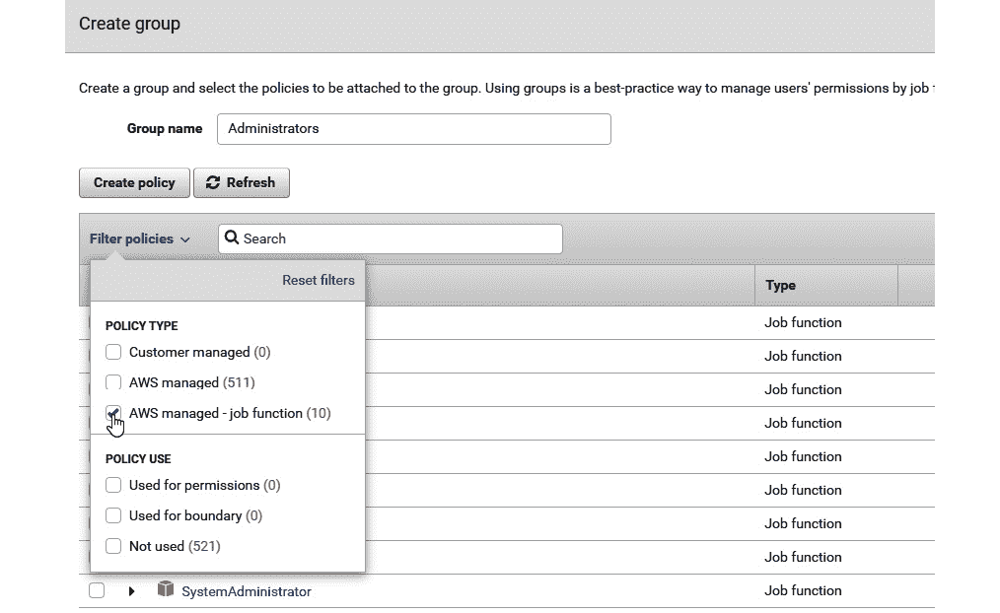

    图 13.13-过滤策略

    在本例中，我们将使用策略`AdministratorAccess`。 此策略非常重要，因为它允许我们将所有可用权限授予我们正在创建的`Administrators`组。 现在选择**AdministratorAccess**，然后单击屏幕右下角的**Create GROUP**：

    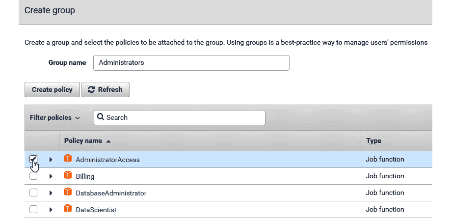

    图 13.14-为我们的组选择策略

    下一步是标记：您可以创建稍后用于身份管理的不同属性或`tags`。

5.  给添加标签几乎可以使用任何东西--姓名、电子邮件、职称或您需要的任何东西。 我们将此留空：


图 13.15-添加标签

让我们回顾一下到目前为止我们已经配置了什么。 我们的用户是我们刚刚创建的组的成员，他们必须在登录后立即重置密码：

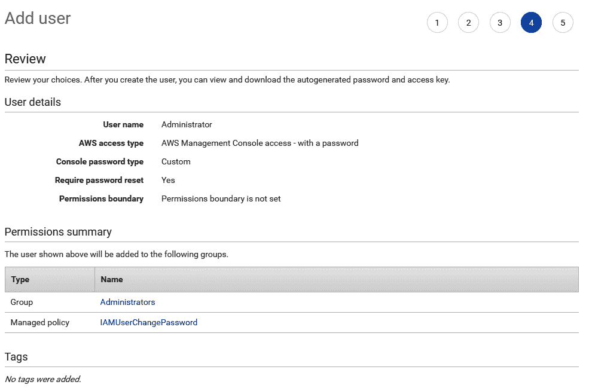

图 13.16-使用组、策略和标记选项检查用户配置

接受这些并添加用户。 迎接你的应该是一个令人放心的绿色消息框，它会给你所有关于刚刚发生的事情的相关细节。 还有一个直接链接到控制台以进行管理访问，因此您可以与您的新用户共享：


图 13.17-用户创建成功

创建用户后，我们需要启用其`Access Key`。 这是中使用不同命令行实用程序的正常概念。 它使我们能够提供一种方法，让应用程序以给定用户的身份执行某些操作，而不是向应用程序提供用户名或密码。 同时，我们可以为每个应用程序提供自己的密钥，因此当我们想要撤销访问权限时，只需禁用该密钥即可。

单击屏幕中间的**创建访问密钥**：


图 13.18-创建访问密钥

关于这把钥匙，有几件事需要说明。 有两个字段-一个是密钥本身，即`Access key ID`，另一个是密钥的秘密部分，即`Secret access key`。 在安全性方面，这与拥有特定用户的用户名和密码完全相同。 您只有一次机会查看和下载密钥，在此之后，密钥就消失了。 这是因为我们在这里处理散列信息，而 AWS*不是*存储您的密钥，而是它们的散列。 这意味着如果您没有保存密钥，则无法检索密钥。 这还意味着，如果有人抓取了一个密钥，比如说通过从屏幕截图上读取它，他们就可以将自己标识为分配了该密钥的用户。 好的一面是，您可以创建任意多个密钥，在这里撤销它们只是一个删除它们的问题。 所以，把钥匙保存在安全的地方：

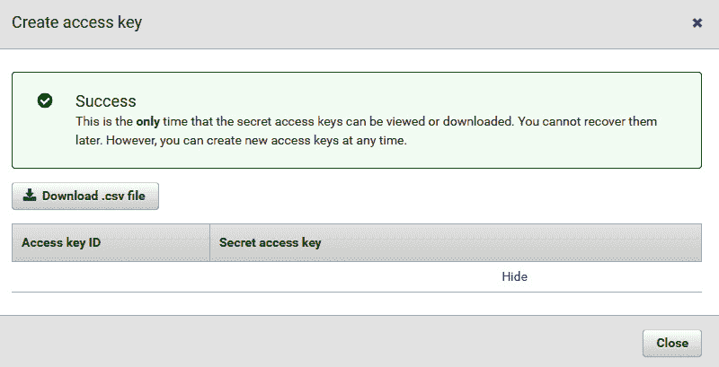

图 13.19-已成功创建访问密钥

我们现在已经完成了 GUI。 让我们返回并安装 AWS CLI：

1.  We just need to start the installation script and let it finish its job. This is done by starting the file called `install` in the `aws` directory:

    

    图 13.20-安装 AWS CLI

    还记得我们说过的绝对路径吗？ `aws`命令不在用户路径中；我们需要直接调用它。 使用`configure`作为参数。 然后，使用我们在上一步中保存的密钥的两个部分。 从现在开始，我们使用 AWS CLI 发出的每个命令都被解释为以我们刚刚在云上创建的用户`Administrator`身份运行。

    下一步是在 S3 上创建一个存储桶。 这可以通过以下两种方式之一来完成。 我们可以通过新配置的 CLI 执行此操作，也可以使用 GUI。 我们将采用“漂亮”的方式，并使用 GUI 来显示它的外观和行为。

2.  在控制台中选择 S3 作为服务。 右上角有一个标记为**创建存储桶**的按钮-单击它。 将出现以下屏幕。 现在创建一个存储桶，该存储桶将以其原始格式存储您的虚拟机。 在我们的示例中，我们标记了存储桶`importkvm`，但选择了一个不同的名称。 请务必注意`region`下拉菜单-这是将创建您的资源的 AWS 位置。 记住，名字必须是唯一的；如果每个买了这本书的人都试着使用这个名字，那么只有第一个人会成功。 有趣的事实：如果你们读到这篇文章的时候，我们还没有删除这个存储桶，那么就没有人能够创建另一个同名的存储桶了，只有那些读到这句话的人才会明白其中的原因。 就屏幕面积而言，该向导相当大，可能不适合个图书页面，因此让我们将其分成两个部分：


图 13.21-创建 S3 存储桶向导-选择存储桶名称和区域

此向导的第二部分与设置相关：


图 13.22-铲斗设置

不要将访问权限更改为 public-真的没有必要这样做；除了您以外，任何人都不需要访问这个特定的存储桶和其中的文件。 默认情况下，此选项是预选的，我们应该让它保持原样。 这应该是最终结果：


图 13.23-S3 存储桶创建成功

好了，做完了，现在是一些人等待下一个命令完成的时候了。 在下一步中，我们将使用我们的 AWS CLI 将`.raw`文件复制到 S3。

重要音符

根据帐户类型的不同，从现在开始，我们可能需要为我们创建的某些服务付费，因为它们可能会透支您帐户上启用的*免费级别*。 如果您没有启用任何昂贵的功能，您应该没有问题，但请始终查看您的**成本管理**控制面板，并检查您是否仍处于盈利状态。

## 将图像上传到 EC2

下一步是将映像上传到 EC2，这样我们就可以将该映像实际作为虚拟机运行。 让我们开始上传流程-这就是我们首先安装 AWS CLI 实用程序的原因：

1.  Use the AWS CLI with the following parameters:

    

    图 13.24-使用 AWS CLI 将虚拟机原始映像复制到 S3 存储桶

    这就是最终的结果。 由于我们讨论的是 8 GB 的数据，您将不得不等待一段时间，这取决于您的上传速度。 AWS CLI 的语法非常简单。 您可以使用您知道的大多数 Unix 命令，`ls`和`cp`都在执行它们的工作。 唯一需要记住的是以以下格式给出您的存储桶名称作为目的地：`s3://<bucketname>`。

2.  After that, we do an `ls` – it will return the bucket names, but we can list their contents by using the bucket name. In this example, you can also see it took us something like 15 minutes to transfer the file from the moment we created the bucket:

    

    图 13.25-传输文件

    现在开始有趣的部分。 我们需要将机器导入 EC2。 要做到这一点，我们需要做一些事情，然后才能进行转换。 问题与权限有关-默认情况下，AWS 服务无法相互通信。 因此，您必须为它们中的每一个提供显式权限才能执行导入。 本质上，您必须让 EC2 与 S3 对话并从存储桶中获取文件。

3.  For upload purposes, we will introduce another AWS concept – `.json` files. A lot of things in AWS are stored in `.json` format, including all the settings. Since the GUI is rarely used, this is the quickest way to communicate data and settings, so we must also use it. The first file we need is `trust-policy.json`, which we are using to create a role that will enable the data to be read from the S3 bucket:

    ```sh
    { 
    "Version":"2012-10-17", 
    "Statement":[ 
    { 
    "Effect":"Allow", 
    "Principal":{ 
    "Service":"vmie.amazonaws.com" 
    }, 
    "Action":"sts:AssumeRole", 
    "Condition":{ 
    "StringEquals":{ 
    "sts:ExternalId":"vmimport" 
    } 
    } 
    } 
    ] 
    }
    ```

    只需创建一个名为`trust-policy.json`的文件，然后输入前面的代码即可。 不要改变任何事情。 下一个是名为`role-policy.json`的文件。 这个有一些你必须做的改变。 仔细查看文件内部，找到提到存储桶名称(`importkvm`)的行。 删除我们的名字，代之以您的水桶名称：

    ```sh
    { 
    "Version":"2012-10-17", 
    "Statement":[ 
    { 
    "Effect":"Allow", 
    "Action":[ 
    "s3:GetBucketLocation", 
                     "s3:ListBucket",
                     "s3:GetObject"
    ], 
    "Resource":[ 
    "arn:aws:s3:::importkvm" 
    "arn:aws:s3:::importkvm/*" 
    ], 
    }, 
    { 
    "Effect":"Allow", 
    "Action":[ 
    "s3:GetObject", 
    "s3:GetBucketLocation", 
                     "s3:ListBucket",
    "s3:GetBucketAcl", 
                     "s3:PutObject"
    ], 
    "Resource":[ 
    "arn:aws:s3:::importkvm" 
    "arn:aws:s3:::importkvm/*" 
    ], 
    }, 
    { 
    "Effect":"Allow", 
    "Action":[ 
    "ec2:ModifySnapshotAttribute", 
    "ec2:CopySnapshot", 
    "ec2:RegisterImage", 
    "ec2:Describe*" 
    ], 
    "Resource":"*" 
    } 
    ] 
    }
    ```

    现在是时候把它们整合在一起，最终将我们的虚拟机上传到 AWS 了。

4.  Execute these two commands, disregard whatever happens in the formatting – both of them are one-liners, and the filename is the last part of the command:

    ```sh
    /usr/local/bin/aws iam create-role --role-name vmimport --assume-role-policy-document  file://trust-policy.json
    /usr/local/bin/aws iam put-role-policy --role-name vmimport --policy-name vmimport --policy-document file://role-policy.json
    ```

    您应该会得到类似如下的结果：

    

    图 13.26-肌酸激酶的结果

    这确认该角色已获得其所需的权限。 第二个命令不应返回任何输出。

    我们快完成了。 最后一步是创建另一个`.json`文件，该文件将向 EC2 描述我们实际导入的内容以及如何处理它。

5.  The file we're creating needs to look like this:

    ```sh
    [
     {
     "Description": "Test deployment", 
     "Format": "raw", 
     "Userbucket": {
     "S3Bucket": "importkvm",
     "S3Key": "deploy1.raw"
     }
    ]
    ```

    如您所见，该文件没有什么特殊之处，但在创建您自己的版本时，请注意使用您的名称作为存储桶以及存储在存储桶内的磁盘映像。 任意命名文件，并使用该名称调用导入过程：


图 13.27-最后一步-将虚拟机部署到 AWS

现在，您可以等待该过程完成。 在这一步中发生的是导入和转换镜像和您上传的操作系统。 AWS 不会按原样运行您的映像；系统将更改相当多的内容，以确保您的映像可以在基础架构上运行。 一些用户也会收到一些更改，但稍后会有更多信息。

该任务将在后台运行，并且在完成时不会通知您；检查它取决于您。 幸运的是，AWS CLI 中有一个名为`describe-import-image-tasks`的命令，其输出如下所示：


图 13.28-检查上传过程的状态

这意味着我们成功地导入了我们的机器。 太棒了！ 但机器仍未运行。 现在它已经变成了一个叫做**Amazon Machine Image**(**AMI**)的东西。 让我们来看看如何使用它：

1.  Go to your EC2 console. You should be able to find the image under **AMIs** on the left side:

    

    图 13.29-我们的 AMI 已成功上传，我们可以在 EC2 控制台中看到它

    现在单击蓝色的大**启动**按钮。 在您的实例运行之前，您需要完成几个步骤，但我们已经差不多完成了。 首先，您需要选择您的实例类型。 这意味着根据您需要的所有资源(CPU、内存和存储)的大小，选择适合您需求的配置。

2.  If you are using a region that is not overcrowded, you should be able to spin a *free tier* instance type that is usually called `t2.micro` and is clearly marked. In your free part of the account, you have enough processing credits to enable you to run this machine completely free:

    

    图 13.30-选择实例类型

    现在是，为了安全起见。 Amazon 更改了您的计算机，并使用密钥对实现了管理员帐户的无密码登录。 因为我们还没有密钥，所以我们还需要创建密钥对。

3.  EC2 将把这个密钥放入您正在创建的计算机上的相应帐户(所有帐户)中，这样您就可以在不使用密码的情况下登录。 如果您选择这样做，则会生成密钥对，但 Amazon 不会存储它-您必须这样做：


图 13.31-选择现有密钥或创建新密钥

就是这样，您的VM 现在应该需要几分钟才能启动。 只需等待确认窗口。 一旦它准备好，使用上下文菜单连接到它。 您将通过单击右下角的**查看实例**进入实例列表。

要连接，您需要使用提供给您的密钥对，并且您需要一个`ssh`客户端。 或者，您也可以使用 AWS 提供的嵌入式`ssh`。 在任何情况下，您都需要机器的外部地址，AWS 还提供该地址以及简单的说明：

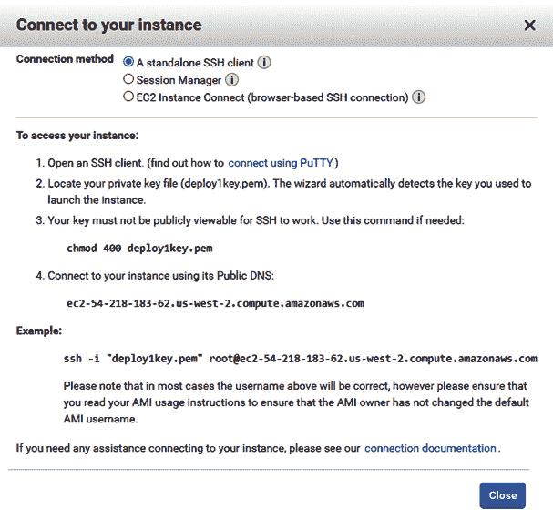

图 13.32-连接到您的实例说明

因此，回到我们的工作站，我们可以使用前面屏幕截图中提到的`ssh`命令连接到我们新启动的实例：


图 13.33-通过 SSH 连接到我们的实例

就这样。 您已成功连接到您的计算机。 你甚至可以让它保持运转。 但要注意，如果你有默认开启或没有密码的账户或服务-毕竟，你已经从你的保险箱、家庭沙箱中取出了一个虚拟机，并将其放在了大而坏的互联网上。 最后一件事是：在您的 VM 运行之后，删除存储桶中的文件以节省一些资源(和金钱)。 转换后，不再需要此文件。

我们列表中的下一个主题是如何通过使用一个名为 Eucalyptus 的应用程序将本地云环境扩展到混合云环境。 这是一个非常受欢迎的过程，许多企业在将其基础设施扩展到本地基础设施之外时都会经历这一过程。 此外，这在需要时提供了可伸缩性方面的好处-例如，当公司需要扩展其测试环境以便其员工正在开发的应用程序可以进行负载测试时。 让我们看看如何通过桉树和 AWS 来做到这一点。

# 使用 Eucalyptus 构建混合 KVM 云

**桉树**是一种怪兽，我们这里指的不是植物。 Eucalyptus是一个旨在弥合私有云服务和 AWS 之间差距的项目，它试图在本地环境中重新创建几乎所有的 AWS 功能。 运行它几乎就像拥有一个与 AWS 兼容的小型本地云，而后者又使用与 AWS 几乎相同的命令。 它甚至使用与 AWS 相同的名称来表示事物，因此它可以使用存储桶之类的东西。 这是故意的，并得到了亚马逊的同意。 拥有这样的环境对每个人来说都是一件好事，因为它为开发人员和公司部署和测试他们的实例创建了一个安全的空间。

桉树由几个部分组成：

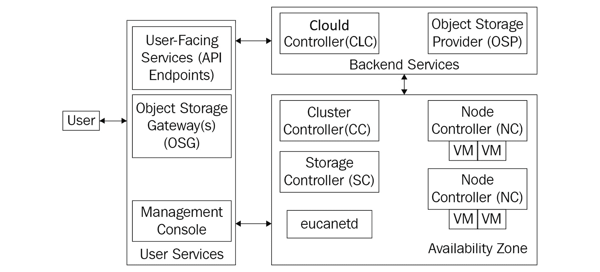

图 13.34-桉树体系结构(http://eucalyptus.cloud，官方文档)

从图中可以看出，Eucalyptus具有很高的可伸缩性。

**可用区**是一个段，它可以容纳由群集控制器控制的多个节点。 **然后将区域**合并到云本身中，该由**云控制器**控制。 与所有这些相关的是用户服务部分，它支持用户和整个 Eucalyptus 堆栈之间的交互。

总而言之，Eucalyptus 使用了五个组件，这些组件有时按图中的名称引用，有时按项目名称引用，这与 OpenStack 非常相似：

*   **云控制器**(**CLC**)是系统的中心点。 它同时提供 EC2 和Web 接口，并将每个任务路由到自己。 它的作用是提供日程安排、资源分配和记账。 每个云都有一个这样的服务器。
*   **群集控制器**(**cc**)是管理每个单独节点并控制 VM 及其执行的部分。 每个可用区中都有一个正在运行。
*   **存储控制器**(**SC**)的作用是提供块级存储，并为群集内的实例和快照提供支持。 它类似于 AWS 的 EBS 存储。
*   **节点控制器**(**nc**)托管个实例及其端点。 每个节点都运行一个。
*   **eucanetd**是Eucalyptus 用来管理云网络的服务，因为我们讨论的是在一天结束时将您的本地网络扩展到 AWS 云。

当您了解 Eucalyptus 时，您会注意到它具有大量的功能。 它可以执行以下操作：

*   使用卷、实例、密钥对、快照、存储桶、图像、网络对象、标记和 IAM。
*   使用负载平衡器。
*   将 AWS 作为 AWS 集成工具使用。

这些只是你的桉树之旅开始时值得一提的一些特点。 Eucalyptus 有一个额外的命令行界面，称为**Euca2ools**，可以作为一个包用于所有主要的 Linux 发行版。 Euca2ools 是一个附加工具，可在 AWS 和 Eucalyptus 之间提供完全的 API 和 CLI 兼容性。 这意味着您可以使用单个工具来管理和执行*混合云*迁移。 该工具是用 Python 编写的，因此它或多或少是独立于平台的。 如果您想了解有关此界面的更多信息，请确保访问[https://wiki.debian.org/euca2ools](https://wiki.debian.org/euca2ools)。

## 您是如何安装的？

安装 Eucalyptus很容易，如果您正在安装一台测试机，并且*遵循说明*，正如我们将在本书的最后一章[*第 16 章*](16.html#_idTextAnchor302)，*KVM 平台故障排除指南*中描述的那样，安装 Eucalyptus是很容易的。 我们要做的就是安装一台机器来容纳所有节点和整个云的一部分。 当然，这与生产环境所需的条件相差甚远，因此在 Eucalyptus 网站上，有针对这种单机万能情况和安装生产级云的单独指南。 确保选中以下链接：[https://docs.eucalyptus.cloud/eucalyptus/4.4.5/install-guide-4.4.5.pdf](https://docs.eucalyptus.cloud/eucalyptus/4.4.5/install-guide-4.4.5.pdf)。

安装很简单-只需提供一个安装最少的 CentOS7 系统，该系统至少有 120 GB 的磁盘空间和 16 GB 的 RAM。 这些是最低要求。 如果你低于他们，你会遇到两种问题：

*   如果您尝试在 RAM 小于 16 GB 的计算机上安装，安装可能会失败。
*   但是，在磁盘大小小于建议的最小磁盘大小的计算机上安装将会成功，但是一旦开始安装展开映像，磁盘空间几乎会立即用完。

对于生产，一切都会改变-存储的最低要求是 160 GB，或者要运行 Walrus 和 SC 服务的节点的最低存储空间是 500 GB。 节点必须在裸机上运行；不支持嵌套虚拟化。 或者，更准确地说，它会起作用，但会否定云所能提供的任何积极影响。

话虽如此，在您开始安装之前，我们还有另外一点要说明--检查新版本的可用性，并且要记住，很有可能会有比我们在本书中正在开发的版本更新的版本。

重要音符

在撰写本文时，当前版本是 4.4.5，版本 5 正在积极开发中，即将发布。

安装了您的基本操作系统之后--它必须是一个没有 GUI 的核心系统，是时候进行实际的 Eucalyptus 安装了。 整个系统是使用**FastStart**安装的，因此我们唯一需要做的就是从 Internet 运行安装程序。 该链接位于该项目的以下网址的首页-[https://eucalyptus.cloud](https://eucalyptus.cloud)。

成功安装 Eucalyptus 有个前提条件：

*   你必须连接到互联网上。 没有办法以这种方式进行本地安装，因为所有内容都是动态下载的。
*   您还必须有一些 IP 地址可供系统在安装时使用。 最低为 10 个，它们将与云一起安装。 安装程序将要求提供范围，并将尝试在不干预的情况下执行所有操作。
*   唯一的其他先决条件是正常工作的 DNS 和一段时间。

让我们使用以下命令开始安装：

```sh
# bash <(curl -Ls https://eucalyptus.cloud/install) 
```

如果你是第一次看到，这个装置看起来很奇怪。 这让我们想起了我们在 20 世纪 90 年代使用的一些基于文本的游戏和服务(MUD，IRC)：

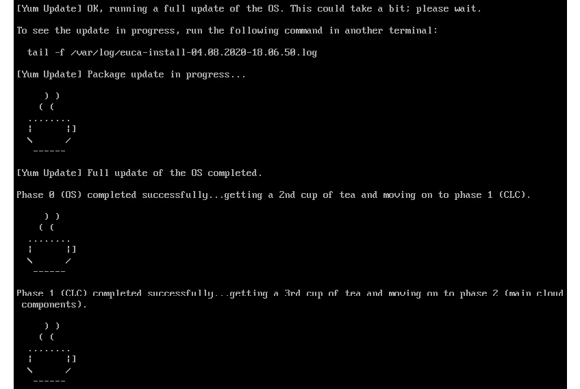

图 13.35-Eucalyptus 文本模式安装

屏幕上的信息将告诉您，如果您想要查看实际发生的情况，应该遵循哪个日志；否则，您可以查看安装程序，等待屏幕上的茶变凉。 老实说，在一台像样的机器上，安装可能需要大约 15 分钟，如果您安装了所有软件包，则可能需要 10 分钟以上。

安装后，Eucalyptus 将为您提供一组默认凭据：

*   **帐户名称**：`eucalyptus`
*   **用户名**：`admin`
*   **Password**: `password`

    重要音符

    如果当前的安装程序损坏，后续问题的解决方案可以在 CIA 的视频中找到：<video_url>。 有一些已知的漏洞，在这本书上市之前，这些漏洞可能会得到解决，也可能不会得到解决。 请确保在安装之前检查了[https://eucalyptus.cloud](https://eucalyptus.cloud)和文档。</video_url>

该信息区分大小写。 安装完成后，您可以使用 Web 浏览器连接到计算机并登录。 您要使用的 IP 地址是刚安装的计算机的 IP 地址：


图 13.36-桉树登录屏幕

一旦系统安装完毕，在新安装系统的控制台上，您将看到一条指令，指示您运行系统中包含的主教程。 本教程本身是了解系统外观、关键概念以及如何使用命令行的好方法。 您可能遇到的唯一问题是，本教程是一组脚本，其中包含一些硬编码的信息。 你马上就会注意到的一件事是，除非你修复它们，否则指向云版本图像模板的链接将不起作用-这些链接指向过期的地址。 这很容易解决，但会让你措手不及。

另一方面，当你读到这篇文章的时候，问题可能已经解决了。 在 Eucalyptus 运行的机器上，以纯文本模式提供了有关如何执行此操作的教程及其所有部分。 它在 GUI 中不可用：


图 13.37-启动文本模式 Eucalyptus 主教程

教程在外观上非常简陋，但我们喜欢它，因为它为我们提供了一个简短但重要的概述，介绍了 Eucalyptus 提供的一切：


图 13.38-使用主教程了解如何配置 Eucalyptus

如您所见，的所有内容都有详细的解释，因此您可以在很短的时间内真正学习关键概念。 把教程读一遍--这是非常值得的。 启动系统后，您可以从命令行立即执行的另一件事是下载两个新的模板映像。 这个脚本也是从网络开始的，在官方网站上用大写字母写成，字面上写在位于以下网址的登录页面上(请确保向下滚动一点)-[https://www.eucalyptus.cloud/](https://www.eucalyptus.cloud/)：


图 13.39-将图像下载到我们的 Eucalyptus 云

复制-将此粘贴到根提示符中，很快就会出现一个菜单，您可以通过该菜单下载您可能使用的图像。 这是我们所见过的最简单、最防弹的模板安装之一，除非它们包含在初始下载中：

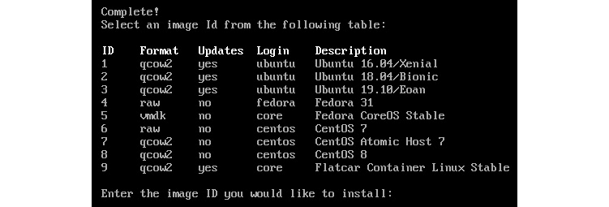

图 13.40-要求我们选择要安装的映像的简单菜单

一次选择一个，它们将包含在图像列表中。

现在让我们切换到 Web 界面，看看它是如何工作的。 使用上面写入的凭据登录。 您将看到一个设计精良的仪表盘。 在右侧，有几组最常用的功能。 左侧保留给菜单保存所有服务的链接。 一旦您将鼠标从菜单上移开，菜单就会自动隐藏，只留下最重要的图标：

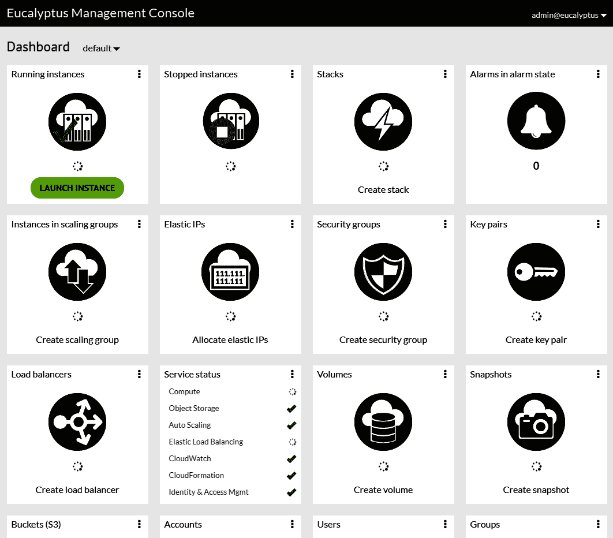

图 13.41-Eucalyptus 管理控制台

我们已经讨论了本页面上的大部分内容-只需查看本章中与 AWS 相关的内容，您就会非常熟悉。 让我们试着使用这个控制台。 我们将推出一个新的实例，只是为了了解桉树是如何工作的：

1.  In the left part of the stack of services, there is an inviting green button labeled **Launch instance** – click on it. A list of the images that are available on the system will appear. We already used the script to grab some cloud images, so we have something to choose from:

    

    图 13.42-选择要在 Eucalyptus 云中运行的映像

    我们选择从云映像运行 Ubuntu。 选择所需图像后，从下拉菜单中选择**启动**。 将打开一个新窗口，允许您创建虚拟机。 在下拉列表或实例类型中，我们选择了一台看起来足够强大的机器来运行我们的 Ubuntu，但基本上，任何内存超过 1 GB 的实例都可以运行得很好。 由于我们只准备了一个实例，因此没有太多需要更改的地方：

    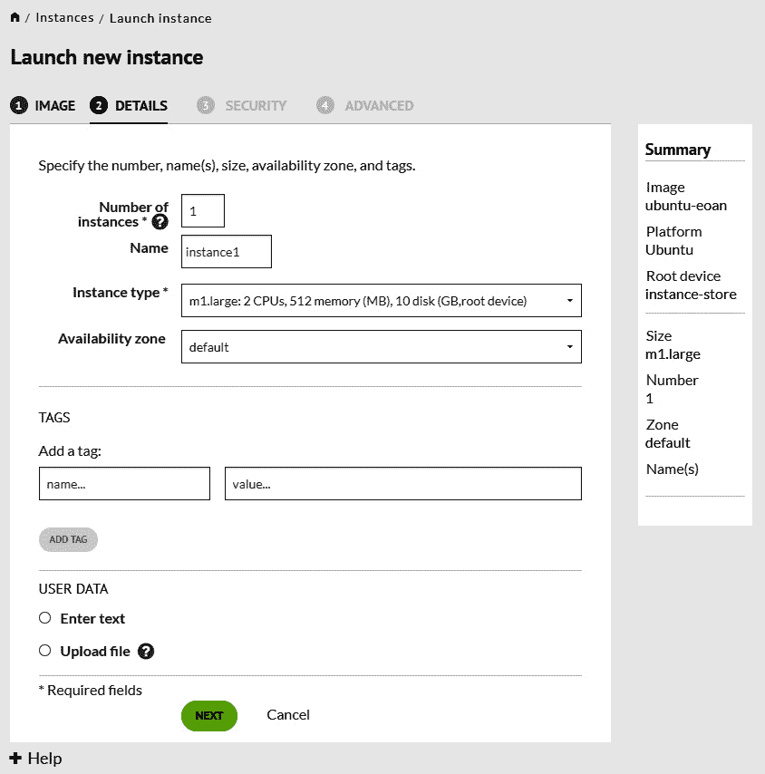

    图 13.43-启动新实例向导

    下一个配置屏幕与安全性相关。

2.  We have a choice of using the default key pair that was created on the Eucalyptus cloud or creating a new one. Only the public part of the key is stored in Eucalyptus, so we can use this key pair for authentication only if we downloaded the keys when we installed them. The process of creating keys is completely identical to the one used for AWS:

    

    图 13.44-安全配置-选择密钥和 IAM 角色

    单击**Launch Instance**按钮后，您的计算机应该会启动。 出于测试的目的，我们之前已经启动了另一台机器，所以现在我们有两台机器在运行：

    

    图 13.45-Eucalyptus 云中的几个启动实例

    下一步是尝试创建存储桶。

3.  创建存储存储桶非常简单，看起来与 AWS 的功能非常相似，因为 Eucalyptus 会尽量与 AWS 相似：

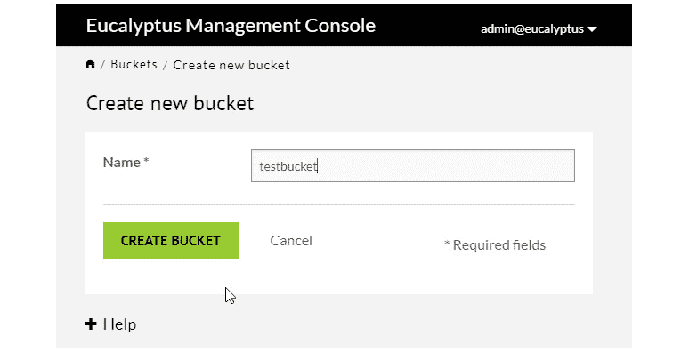

图 13.46-创建存储桶

由于 Eucalyptus不像 AWS 那样复杂，特别是在策略和安全方面，存储桶的安全选项卡较小，但有一些非常强大的工具，如您在以下屏幕截图中所示：

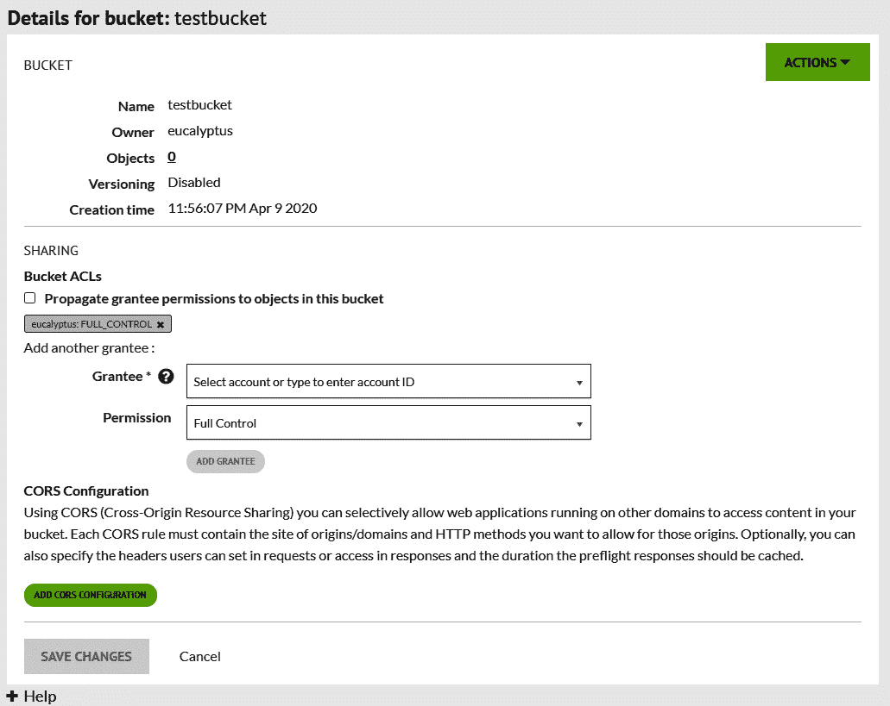

图 13.47-存储桶安全配置

现在，我们已经安装、配置并使用了 Eucalyptus，接下来是我们这一章的下一个主题，即向 AWS 扩展我们基于 Eucalyptus 的云。

## 使用桉树进行 AWS 控制

您还记得向您显示登录凭据的初始屏幕吗？我们提到您也可以登录 AWS。 从 Eucalyptus 控制台注销并进入登录屏幕。 这次点击**登录 AWS**：


图 13.48-通过 Eucalyptus 登录 AWS

尝试并使用我们在*将图像上传到 EC2*部分中创建的身份验证密钥，或在 AWS IAM 中为`Administrator`用户创建一个新密钥。 将其复制并粘贴到 AWS 凭据中，您将有一个完全正常工作的界面连接到您的 AWS 帐户。 您的控制面板外观几乎相同，但会显示您的 AWS 帐户的状态：

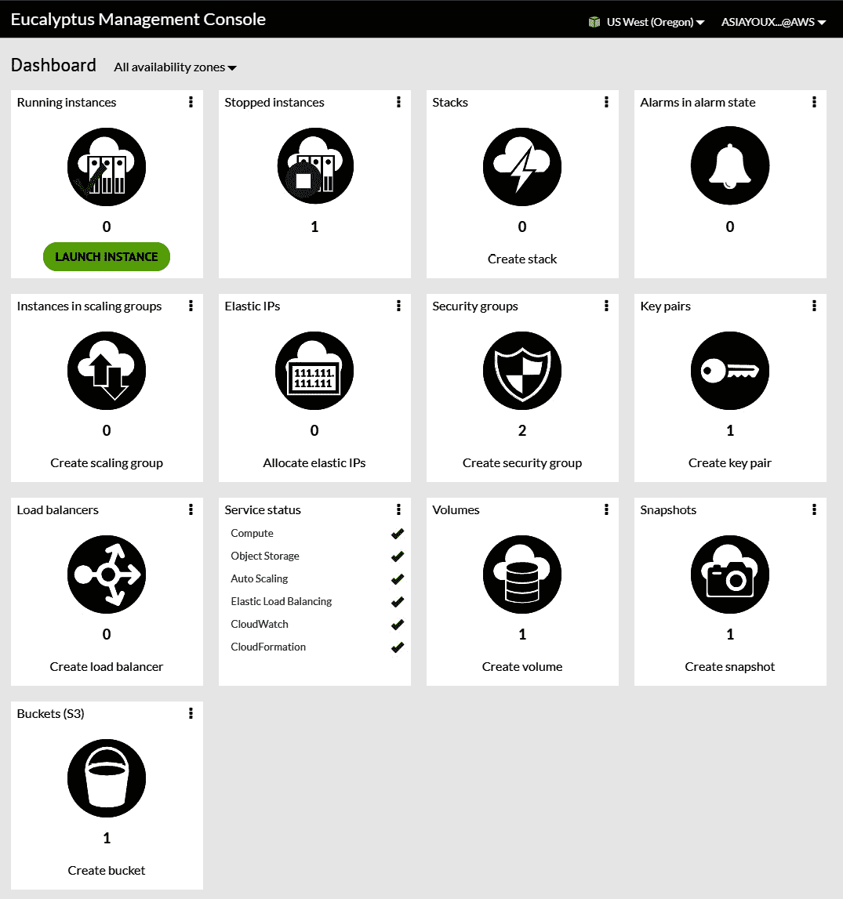

图 13.49-AWS 的 Eucalyptus 管理控制台

让我们检查我们是否可以看到我们的存储桶：


图 13.50-检查我们的 AWS 存储桶

请注意，我们不仅可以看到用于测试 AWS KVM 导入的存储桶，还可以在右上角看到我们正在运行的区域。 您的帐户是由其密钥名称提供的，而不是实际的用户；这很简单，因为我们实际上是以编程方式登录*的。 我们单击的所有内容都将转换为 API 调用，然后返回的数据将被解析并显示给用户。*

 *我们当前停止的实例也在这里，但请记住，只有在选择最初将实例导入到的区域时才会看到它。 在我们的示例中，它是`US West`，所以我们的实例在那里：

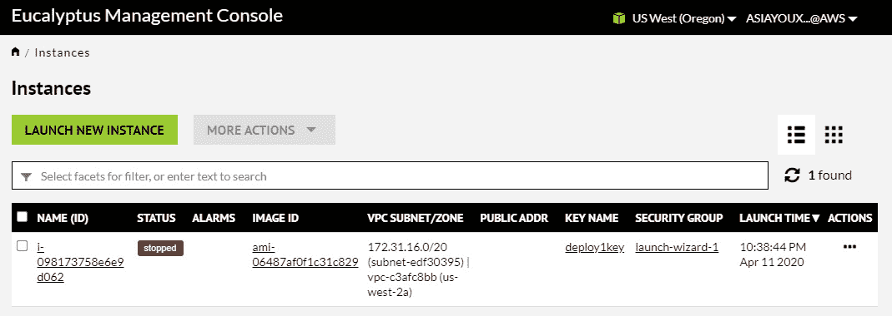

图 13.51-检查我们的 AWS 实例

正如您可能已经注意到的，Eucalyptus 是一个多方面的工具，能够为我们提供混合云服务。 基本上，Eucalyptus 的关键点之一是它可以让您达到与 AWS 兼容的级别。 因此，如果您开始将其作为私人解决方案使用，并在未来某个时候开始考虑迁移到 AWS，Eucalyptus 将为您提供支持。 为此，它实际上是基于 KVM 的虚拟机的标准解决方案。

我们将就 AWS 集成到此为止。 毕竟，本章的重点是让您了解 Eucalyptus 是如何连接到 AWS 的。 您可能会看到，此界面缺乏 AWS 所具有的功能，但同时足以从一个位置控制基本的中型基础设施-存储桶、映像和实例。 在测试了 5.0 Beta 1 版本之后，我们可以肯定地告诉您，完整的 5.0 版本出来后应该会是一个相当大的升级。 测试版已经有了很多额外的选项，我们非常期待看到完整版本的发布。

# 摘要

在本章中，我们涵盖了很多主题。 我们引入了 AWS 作为云解决方案，并用它做了一些很酷的事情--我们转换了我们的虚拟机，这样我们就可以在它上面运行了，并确保一切都能正常工作。 然后我们转到 Eucalyptus，检查如何将其用作本地云环境的管理应用程序，以及如何使用它将现有环境扩展到 AWS。

下一章将带我们进入使用 ELK 堆栈监控 KVM 虚拟化的世界。 这是一个非常重要的话题，特别是在公司和基础设施规模不断扩大的情况下-您无法通过手动监控所有可能的服务来跟上 IT 服务的有机增长。 麋鹿堆栈将帮助您做到这一点--具体有多少，您将在下一章中了解到。

# 问题

1.  什么是 AWS？
2.  什么是 EC2、S3 和 IAM？
3.  什么是 S3 存储桶？
4.  我们如何将虚拟机迁移到 AWS？
5.  我们使用哪个工具将原始图像上传到 AWS？
6.  作为用户，我们如何向 AWS 验证自己的身份？
7.  什么是桉树？
8.  桉树的主要服务有哪些？
9.  什么是可用区？ 什么是故障域？
10.  为虚拟化、云和 HPC 环境提供第 0 层存储服务的基本问题是什么？

# 进一步阅读

有关本章内容的更多信息，请参阅以下链接：

*   Amazon AWS 文档：[https://docs.aws.amazon.com/](https://docs.aws.amazon.com/)
*   AmazonEC2 文档：[https://docs.aws.amazon.com/ec2/?id=docs_gateway](https://docs.aws.amazon.com/ec2/?id=docs_gateway)
*   亚马逊 S3 文档：[https://docs.aws.amazon.com/s3/?id=docs_gateway](https://docs.aws.amazon.com/s3/?id=docs_gateway)
*   Amazon IAM 文档：[https://docs.aws.amazon.com/iam/?id=docs_gateway](https://docs.aws.amazon.com/iam/?id=docs_gateway)
*   桉树安装指南：[https://docs.eucalyptus.cloud/eucalyptus/4.4.5/install-guide/index.html](https://docs.eucalyptus.cloud/eucalyptus/4.4.5/install-guide/index.html)
*   桉树管理指南：[https://docs.eucalyptus.cloud/eucalyptus/4.4.5/admin-guide/index.html](https://docs.eucalyptus.cloud/eucalyptus/4.4.5/admin-guide/index.html)
*   桉树控制台指南：[https://docs.eucalyptus.cloud/eucalyptus/4.4.5/console-guide/index.html](https://docs.eucalyptus.cloud/eucalyptus/4.4.5/console-guide/index.html)
*   Euca2ools 指南：[https://docs.eucalyptus.cloud/eucalyptus/4.4.5/euca2ools-guide/index.html](https://docs.eucalyptus.cloud/eucalyptus/4.4.5/euca2ools-guide/index.html)*