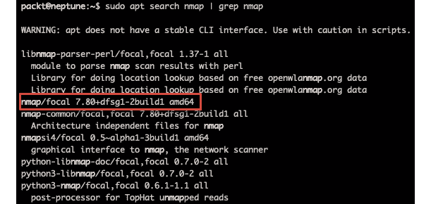
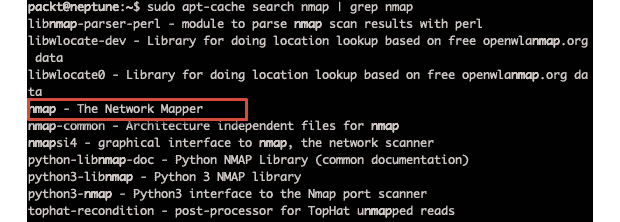
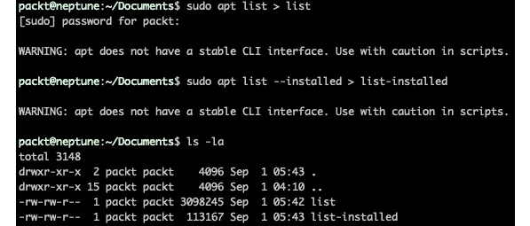
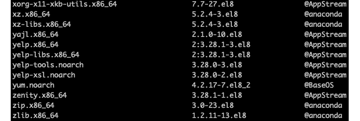
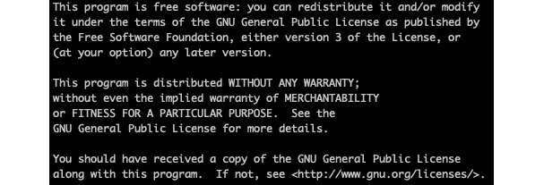

# 三、Linux 软件管理

软件管理是 Linux 系统管理的一个重要方面。 了解如何使用软件包是您在完成本章后将掌握的一项资产。

在本章中，您将学习如何使用特定的软件管理命令，以及软件包如何根据您所选择的发行版工作。 您将了解最新的 snap 和 flatpak 包类型，以及如何在现代 Ubuntu 和 CentOS 发行版上使用它们。 在本章结束时，您还将了解如何构建自己的包。

在本章中，我们将涵盖以下主要主题:

*   Linux 软件包类型
*   管理软件包
*   从源代码构建一个包

# 技术要求

不需要特殊的技术要求，只需要在您的系统上安装一个可以工作的 Linux。 Ubuntu 和 CentOS 同样适合本章的练习，因为我们将介绍这两种类型的包管理器。

# Linux 软件包类型

正如您现在已经了解到的，Linux 发行版附带了一个内核及其上的应用。 尽管默认情况下已经安装了很多应用，但在某些情况下，您肯定会需要安装一些新的应用，或者删除一些不需要的应用。

在 Linux 中，应用被捆绑到**存储库**中。 存储库是由开发人员维护的软件包组成的集中管理的位置。 这些包可以包含单独的应用或与操作系统相关的文件。 每个 Linux 发行版都带有几个官方存储库，但是在这些存储库之上，您可以添加一些新的存储库。 添加它们的方法是针对每个发行版的，稍后我们将详细介绍。

Linux 有几种类型的包，但由于我们只介绍 Ubuntu 和 CentOS，我们将主要提到这两个发行版使用的那些包。 Ubuntu 使用`deb`包，因为它是基于 Debian 的;CentOS 使用`rpm`包，因为它是基于 Red Hat Enterprise Linux 的。 除此之外，最近还引入了两种新的包类型，一种是 Ubuntu 开发的 snap 包，另一种是 flatpak 包，由开发人员和组织的大型社区开发，包括 GNOME、Red Hat 和 Endless。

## DEB 和 RPM 包类型

DEB 和RPM 是最古老的软件包类型，分别被 Ubuntu 和CentOS 使用。 它们仍然被广泛使用，尽管前面提到的两种新类型开始在桌面 Linux 中占据一席之地。

这两种包都符合**Linux Standard Base**(**LSB**)规范。 LSB 的最后一个迭代版本是 5.0，于 2015 年发布。 你可以在以下地址找到更多的信息:[https://refspecs.linuxfoundation.org/lsb.shtml#PACKAGEFMT](https://refspecs.linuxfoundation.org/lsb.shtml#PACKAGEFMT)。

### DEB 包剖析

DEB 早在 1993 年就在 Debian 发行版中被引入，并且一直在 Debian 和 Ubuntu 派生版本中使用。 deb 包是一个二进制包。 这意味着它包含程序本身的文件，以及它的依赖项和元信息文件，所有这些都包含在一个归档文件中。

要查看二进制 deb 包的内容，可以使用`ar`命令。 它不是默认安装在 Ubuntu 20.04.1 LTS，所以你必须自己使用以下命令安装它:

```sh
$ sudo apt install binutils
```

安装`ar`后，您可以检查任何 deb 包的内容。 在本练习中，我们下载了 Slack deb 包并检查其内容。 要下载软件包，请执行以下步骤:

1.  使用以下`wget`命令，文件将在当前工作目录中下载:

    ```sh
    $ wget https://downloads.slack-edge.com/linux_releases/slack-desktop-4.8.0-amd64.deb
    ```

2.  After that, use the `ar t slack-desktop-4.8.0-amd64.deb` command to view the contents of the binary package. The `t` option will display a table of contents for the archive:

    

    图 3.1 -使用 ar 命令查看 deb 文件的内容

    正如您在这里看到的，输出列出了四个文件，其中两个是归档文件。 您还可以使用`ar`命令研究这个包。

3.  使用`ar x slack-desktop-4.8.0-amd64.deb`命令将包的内容解压到当前的工作目录:

    ```sh
    $ ar x slack-desktop-4.8.0-amd64.deb
    ```

4.  使用`ls`命令列出目录的内容。 这四个文件现在已经被提取出来，可以检查了。 `debian-binary`文件是一个文本文件，它包含包文件格式的版本，在我们的示例中是 2.0。 在以下命令的帮助下，可以连接该文件以在包上验证:

    ```sh
    $ cat debian-binary
    ```

5.  `control.tar.gz`存档包含在安装期间或安装前后运行的元信息包和脚本，这取决于具体情况。 `data.tar.xz`归档文件包含程序的可执行文件和库，这些文件将在安装过程中被提取。 您可以使用以下命令检查内容:

    ```sh
    $ tar tJf data.tar.xz | head
    ```

6.  最后一个文件为`gpg`签名文件。

每个包的元信息是程序运行所必需的文件集合。 它们包含关于某些包的先决条件、所有它们的依赖关系、冲突和建议的信息。 只要使用与打包相关的命令，您就可以随意探索包的所有组成部分。

### RPM 包解剖

RPM 包由 Red Hat 公司开发，主要应用于 Fedora、CentOS、RHEL、SUSE 等操作系统。 该名称是 Red Hat Package Manager 的首字母缩略词。 RPM 二进制包类似于 DEB 二进制包。 它们也被打包成存档文件。

我们将测试 Slack 的 rpm 包，就像我们在前一节中测试 deb 包一样。 使用以下命令下载`rpm`包:

```sh
# wget https://downloads.slack-edge.com/linux_releases/slack-4.8.0-0.1.fc21.x86_64.rpm
```

如果您想使用相同的`ar`命令，您将看到在`rpms`的情况下，归档工具将无法识别文件格式。 然而，还有其他更强大的工具可以使用。 我们将使用`rpm`命令，即为`rpms`指定的低级包管理器。 我们将使用`-q`(查询)、`-p`(包名)和`-l`(列表)选项:

```sh
# rpm -qpl slack-4.8.0-0.1.fc21.x86_64.rpm
```

与`deb`包相反的输出将是与应用相关的所有文件的列表，以及系统的安装位置。

要查看包的元信息，请运行带有`-q`、`-p`和`-i`(install)选项的`rpm`命令。 例如，在松弛包上使用它:

```sh
rpm -qpi slack-4.8.0-0.1.fc21.x86_64.rpm
```

输出将包含有关应用名称、版本、发布、架构、安装日期、组、大小、许可、签名、源 RPM、构建日期和主机、URL、重定位和摘要的信息。

要查看包在安装时还需要哪些其他依赖项，可以使用`-q`、`-p`和`–requires`选项运行相同的`rpm`命令:

```sh
$ rpm -qp - -requires slack-4.8.8-0.1.fc21.x86_64.rpm
```

DEB 和RPM 包并不是唯一的。 如前所述，有一些新的包可以用于跨平台的 Linux 发行版。 这些包是 flatpaks 和 snaps，我们将在下一节详细介绍它们。

## snap and flatpak package 类型

Snap 和 flatpak 是相对较新的软件包类型，它们被认为是 Linux 应用的未来。 它们都在隔离的容器中构建和运行应用，以获得更多的安全性和可移植性。 两者的创建都是为了克服对桌面应用易于安装和可移植性的需求。

即使主要的 Linux 发行版有大型应用存储库,分发软件对于很多类型的 Linux 发行版,每个都有自己的包类型,可以成为一个严重的问题**独立软件供应商**(**isv)或社区的维护者。 这就是 snaps 和 flatpaks 的救命之处，它们的目的是减轻分发软件的重量。**

让我们假设我们是独立的软件开发人员，目标是在 Linux 上开发我们的产品。 一旦我们的软件的新版本可用，我们需要创建至少两种类型的包，可以直接从我们的网站下载-一个用于 Debian/Ubuntu 的`.deb`包，和一个用于 Fedora/RHEL/SUSE 的`.rpm`包。

但是，如果我们想克服这个问题，并让我们的应用在大多数现有的 Linux 发行版中可以交叉发行，我们可以将它作为 flatpak 或 snap 发行。 flatpak 可以通过集中式 flatpak 存储库`flathub`使用，snap 可以通过集中式 snap 存储库`snapcraft`使用。 任何一种都同样适合我们的目标，即以最小的资源消耗和集中的工作将应用分发到所有主要的 Linux 发行版。

这种情况的寓意是，为 Linux 分发软件的努力要高于为 Windows 或 macOS 打包的相同应用的情况。 希望在不久的将来，将只有一个通用的软件包用于发布 Linux 软件，这对用户和开发人员都有好处。

### 快速封装解剖

快照文件实际上是一个`SquashFS`文件。 这意味着它有自己的文件系统封装在一个不可变容器中。 它有一个非常严格的环境，有具体的隔离和禁闭规则。 每个 snap 文件都有一个元信息目录，用于存储控制其行为的文件。

与平板电脑不同，快照不仅用于桌面应用，还用于更广泛的服务器和嵌入式应用。 这是因为 snap 起源于 Ubuntu 物联网和手机的 Snappy，这个发行版是 Ubuntu 开发人员 Canonical 努力融合的灯塔。

### 扁平包解剖

Flatpak 基于一种名为 OSTree 的技术。 这项技术是由 GNOME 和 Red Hat 的开发人员发起的，现在在 Fedora Silverblue 中以`rpm-ostree`的形式大量使用。 它是一个新的 Linux 升级系统，旨在与现有的包管理系统一起工作。 它的灵感来自 Git，因为它以类似的方式运行。 可以把它看作是操作系统级别的版本控制系统。 它使用内容地址对象存储，允许共享分支，并为操作系统提供事务升级、回滚和快照选项。

目前，该项目已更名为`libostree`，以顺利聚焦于已经使用该技术的项目。 在许多使用它的项目中，我们只将两个项目带入讨论:flatpak 和`rpm-ostree`。 `rpm-ostree`项目被认为是用于 Fedora 和 CentOS/RHEL 等发行版的下一代混合包系统。 它们基于 Fedora 和 Red Hat 团队开发的 Atomic 项目，该项目为服务器和桌面等带来了不变的基础设施。 openSUSE 开发人员开发了一种类似的技术，称为 Snapper，这是其`btrfs`文件系统的一个操作系统快照工具。

Flatpak 像使用`rpm-ostree`一样使用`libostree`，但仅用于桌面应用容器，没有引导加载程序管理。 Flatpak 基于一个名为`Bubblewrap`的项目使用沙箱，它允许无特权的用户访问用户名称空间并使用容器特性。

snaps 和 flatpaks 都完全支持图形化安装，而且还提供命令以方便从 shell 进行安装和设置。 在下面几节中，我们将只关注这两种包类型的命令操作。

# 软件包管理

每个发行版都有自己的包管理器。 每个发行版都有两种类型的包管理器，一种用于低级包管理，另一种用于高级包管理。 对于 CentOS 或 Fedora 等基于 rpm 的发行版，低级工具是`rpm`命令，高级工具是`yum`和`dnf`命令。 对于 openSUSE(另一个主要的基于 rpm 的发行版)，低级工具是相同的`rpm`命令，而对于高级工具，则有`zypper`命令。 对于基于 deb 的发行版，低级命令是`dpkg`，高级命令是`apt`(或者现在已弃用的`apt-get`)。

Linux 中低级包管理器和高级包管理器之间的区别是什么? 低级包管理器负责任何包操作的后端，能够解包、运行脚本和安装应用。 高级管理人员负责依赖性解析、安装和下载包(以及包组)以及元数据搜索。

## 管理 DEB 包

通常，对于任何发行版，包管理由管理员或具有根权限的用户(`sudo`)处理。 包管理意味着任何类型的包操作，例如安装、搜索、下载和删除。 对于所有这些类型的操作，都有特定的 Linux 命令，我们将在下面几节中展示如何使用它们。

### 存储库

Ubuntu 官方软件库由大约 60000 个软件包组成。 它们采用二进制`.deb`包或快照包的形式。 系统存储库的配置存储在一个文件`/etc/apt/sources.list`中。 Ubuntu 有四个主要的软件库，你可以在`sources.list`文件中看到它们的详细信息。 这些储存库如下:

*   `Main`-包含 Canonical 支持的免费和开源软件
*   `Universe`-包含社区支持的免费和开源软件
*   包含专有软件
*   -包含受版权限制的软件

所有存储库在`sources.list`文件中默认是启用的。 如果您想禁用其中一些，请随意编辑该文件。

### APT-related 命令

直到 4 年前，任何基于 debian 的发行版中的包都是使用`apt-get`命令实现的。 从那时起，一个新的改进的命令`apt`(来自 Advanced Packaging Tool)被用作高级包管理器。 新的指挥系统比 T2 更精简和结构更好，因此提供了更完整的体验。

在使用`apt`命令进行任何工作之前，您应该更新所有可用包的列表。 这是通过以下命令完成的:

```sh
$ sudo apt update
```

该命令的输出将显示是否有可用的更新。 需要更新的包的数量将会显示出来，同时还会显示一个命令，如果您想了解它们的更多细节，可以运行该命令。

在进一步讨论之前，我们鼓励您使用`apt - -help`命令，因为这将显示最常用的`apt`相关命令。

让我们在下一小节中更详细地讨论一些最常用的命令。

#### 安装和删除软件包

基本的系统管理任务包括安装和删除软件包。 在本章中，我们将向您展示如何使用 apt 命令安装和删除。

要安装一个新包，您将使用`apt install`命令。 我们在这本书里已经用过这个了。 请记住，我们必须安装`ar`命令作为检查`.deb`包的替代命令。 然后我们使用以下命令:

```sh
$ sudo apt install binutils
```

这个命令在系统上安装了几个包，其中一个是我们完成操作所需的包。 `apt`命令也会自动安装任何必需的依赖项。

要删除包，可以使用`apt remove`和`apt purge`命令。 第一种方法删除已安装的包及其通过`apt install`命令安装的所有依赖项。 后者将执行卸载，就像`apt remove`一样，但它也删除应用创建的任何配置文件。

在下面的例子中，我们将删除之前安装的`binutils`应用:

```sh
$ sudo apt remove binutils
```

输出将显示一个不再需要的包列表，这些包将从系统中删除，并要求您确认是否继续。 这是一个非常好的安全措施，让您有机会查看将要删除的文件。 如果您对操作有信心，可以在命令末尾添加一个`-y`选项参数，它告诉 shell 命令提供的任何问题的答案将自动为*Yes*。

下面是`apt purge`命令:

```sh
$ sudo apt purge binutils
```

输出类似于`apt remove`命令，显示将删除哪些包，磁盘上将释放多少空间，以及确认是否继续操作。

因此，如前所述，只有通过使用`apt remove`命令，才会留下一些配置文件，以防操作发生意外，并且用户希望恢复到以前的配置。 没有被`remove`命令删除的文件是可以很容易恢复的小型用户配置文件。 如果操作不是偶然的，并且您仍然想要删除所有文件，您仍然可以使用`apt purge`命令来完成此操作，方法是使用与已经删除的包相同的名称。

#### 升级系统

每隔一段时间和，您都需要执行一次系统升级，以确保安装了所有最新的安全更新和补丁。 执行此操作的命令如下:

```sh
$ sudo apt upgrade
```

它的前面应该总是这样的命令:

```sh
$ sudo apt update 
```

这样做是为了确保更新所有的包列表和存储库信息。 `update`命令有时会显示哪些包不再需要了，其消息如下所示:

```sh
The following packages were automatically installed and are no longer required:
  libfprint-2-tod1 libllvm9
Use 'sudo apt autoremove' to remove them.
```

升级完成后，可以使用`sudo apt autoremove`命令删除不需要的软件包。 `autoremove`命令的输出将显示哪些包将被删除，以及磁盘上将释放多少空间，并将请求您的批准以继续操作。

假设在我们使用 Ubuntu 的过程中，发布了一个新的发行版，我们希望使用它，因为它有我们使用的软件的更新包。 使用命令行，我们可以进行一个完整的发行版升级。 此操作的命令如下:

```sh
$ sudo apt dist-upgrade
```

与此类似，我们也可以使用以下命令:

```sh
$ sudo apt full-upgrade
```

升级到一个新的发行版应该是一个简单的过程，但这并不总是一个保证。 这完全取决于您的自定义配置。 无论如何，我们建议您在升级到新版本之前做一个完整的系统备份。

#### 管理包信息

使用包有时意味着使用信息收集工具。 仅仅安装和删除包是不够的。 您将需要搜索特定的包，显示关于它们的详细信息，根据特定的条件创建列表，等等。

使用`apt search`命令搜索特定的包。 它将为您列出在其名称中包含搜索字符串的所有包，以及以各种方式使用该字符串的其他包。 例如，让我们搜索名为`nmap`的包:

```sh
$ sudo apt search nmap
```

输出将显示一个相当长的包列表，这些包以各种方式使用了`nmap`字符串。 你仍然需要在列表中上下滚动才能找到你想要的包裹。 为了获得更好的结果，您可以将输出通过管道传递到`grep`命令，但是您会注意到一个警告，就像下面的截图:



图 3.2 - apt 搜索命令的输出

在警告之后，输出显示了包含字符串`nmap`的包的简短列表，其中就是我们要查找的实际包，在*图 3.5*中突出显示。

要克服该警告，可以使用称为`apt-cache search`的遗留命令。 通过运行它，您将得到一个包列表作为输出，但不像`apt search`命令的输出那样详细:



图 3.3 - apt-cache 命令的输出

现在我们知道了`nmap`包存在于 Ubuntu 软件库中，我们可以通过使用`apt show`命令来进一步研究它:

```sh
$ apt show nmap
```

输出将显示详细的描述，包括包名、版本、优先级、起源和节、维护程序、大小、依赖关系、建议的额外包、下载大小、APT 源和描述。

Apt 还有一个有用的`list`命令，它可以根据特定的标准列出包。 例如，如果我们单独使用`apt list`命令，它将列出所有可用的包。 但如果我们使用不同的选项，输出将是个性化的。

为了显示已安装的包，我们将使用`-- installed`选项:

```sh
$ sudo apt list --installed
```

要列出所有的包，使用以下命令:

```sh
$ sudo apt list
```

出于比较的原因，我们将每个输出重定向到不同的文件，然后比较两个文件。 这是一项比较容易完成的任务，以便查看两个输出之间的差异，因为列表相当大。 现在我们将运行具体的命令，如下所示:



图 3.4 -安装包的比较

还有其他方法可以比较这两种输出，我们希望让你自己去发现它们，作为本章的练习。 您可以随意使用任何其他与 apt 相关的命令，并进行充分的练习以熟悉它们的使用。 APT 是一个功能强大的工具，任何系统管理员都必须知道如何使用它，才能维持一个可用的、维护良好的 Linux 系统。 可用性与所使用的应用及其系统优化密切相关。

## 管理 RPM 包

RPM 包是相当于 Fedora、CentOS、RHEL 和 openSUSE/SLES 等 Linux 发行版的软件包。 它们有专门的高级工具，包括`dnf`、`yum`和`zypper`。 低级工具是`rpm`命令。

在 CentOS 8 中，默认的包管理器是 yum(来自 Yellow Dog updatater, Modified)，它实际上是基于`dnf`(Dandified yum)， Fedora 中的默认包管理器。 如果您同时使用 Fedora 和 CentOS，为了方便使用，您只能使用其中一个，因为它们基本上是相同的命令。 为了保持一致性，我们将在本章的所有例子中使用 YUM 名称。

Yum 是默认的高级管理器。 它管理安装、删除、更新和包查询，并解决依赖关系。 Yum 既可以管理从存储库安装的包，也可以管理从本地`.rpm`包安装的包。

### 存储库

存储库都是在`/etc/yum.repos.d/`目录中管理的，配置在`/etc/yum.conf`文件中可用。 如果你用`ls -l`命令列出`repos`目录，输出将显示所有存储库文件的列表:

```sh
ls -l /etc/yum.repos.d/
```

这里列出的所有文件都包含与存储库有关的重要信息，例如名称、镜像列表、gpg 密钥位置和启用状态。 所有列出的都是官方存储库。

### YUM-related 命令

Yum 有许多命令和选项，但最常用的是与包安装、删除、搜索、信息查询、系统更新和存储库列表相关的命令和选项。

#### 安装和删除软件包

要从 CentOS 8 的存储库中安装包，只需运行`yum install`命令。 在下面的例子中，我们将通过命令行安装 GIMP 应用:

```sh
$ sudo yum install gimp
```

如果已经下载了一个包并想安装它，可以使用`yum localinstall`命令。 要安装之前下载的 Slack`.rpm`包，使用以下命令(以 root 用户登录):

```sh
yum localinstall slack-4.8.0-0.1.fc21.x86_64.rpm
```

一旦运行该命令，您将看到它自动解析所需的依赖项，并显示每个依赖项的源(存储库)(在我们的示例中，它是 AppStream 存储库)。 一个显著的区别是本地包的存储库，它看起来是`@commandline`。

这是一个非常强大的命令，在某些情况下，`rpm`命令本身的使用几乎是多余的。 `yum install`和`yum localinstall`命令之间的主要区别在于，后者能够解决本地下载包的依赖关系。 第一个命令在活动存储库中查找包，而第二个命令在当前工作目录中查找要安装的包。

使用`yum remove`命令从系统中删除包。 我们将使用以下命令(以 root 用户登录)删除新安装的 Slack 包:

```sh
yum remove slack.x86_64
```

运行该命令后，系统将询问您是否要删除这些包及其依赖项。 在这方面，请考虑下一个重要注意事项。

重要提示

默认动作按下*进入*或*返回键在 CentOS 是*N 命令对话框*(不,或消极的),而在 Ubuntu, Y 默认操作设置为*(是的)。 这是一种预防性的安全措施，需要额外的关注和干预。**

 **输出非常类似于安装命令的输出，将显示如果继续执行该命令，将删除哪些包和依赖项。

如您所见，使用`yum localinstall`命令安装在包中的所有依赖项将使用`yum remove`命令删除。 如果要求继续操作，键入`y`并继续操作。

#### 升级系统

要升级 CentOS 8 系统，我们将使用`yum upgrade`命令。 还有一个`yum update`命令，它通过更新已安装的包具有相同的效果:

```sh
$ sudo yum upgrade
```

您可以使用`-y`选项自动响应命令的问题。

还有一个`upgrade-minimal`命令，它只安装包的最新安全更新。

#### 管理包信息

使用`yum`管理文件与使用`apt`管理文件非常相似。 有很多命令可以使用，我们将详细介绍其中一些，我们认为是最常用的。 要查找关于这些命令及其使用的更多信息，请运行`yum - -help`。

要查看 yum 命令历史和哪个包被管理的概述，使用以下命令:

```sh
$ sudo yum history
```

这将给你一个输出，显示每一个 yum 命令的运行，有多少包被更改，以及执行操作的时间和日期，如下面的示例所示:


图 3.5 -使用 yum history 命令

要显示关于某个包的详细信息，可以使用`yum info`命令。 我们将查询`nmap`包，就像我们在 Ubuntu 中做的一样:

```sh
yum info nmap
```

输出将显示名称、版本、发行版、源代码、存储库和描述，这与我们在`.deb`包中看到的非常相似。

要列出所有已安装的包，或者所有的包，我们使用`yum list`命令:

```sh
# yum list
# yum list installed
```

如果我们将每个命令的输出重定向到特定的文件，然后比较两个文件，我们将看到它们之间的差异，类似于我们在 Ubuntu 中所做的。 输出显示包的名称、版本和发布号，以及安装它的存储库。 这里有一个简短的摘录:



图 3.6 -安装 yum list 命令的摘录

由于我们已经介绍了 deb 和 rpm 文件最常用的命令，让我们看看如何在您的 Linux 机器上管理 flatpaks 和 snaps。

## 使用 snap 和 flatpak 包装

Snaps 和flatpaks 是在各种 Linux 发行版中使用的相对较新的包类型。 在本节中，我们将向您展示如何管理这些类型的包。 对于快照，我们将使用 Ubuntu 作为我们的测试发行版，对于平板包，我们将使用 CentOS，尽管经过一些工作，两种包类型都可以在任何一个发行版上工作。

### 管理 Ubuntu 上的 snap 包

Snap 默认安装在Ubuntu 20.04.1 LTS 中。 因此，您不需要做任何事情来安装它。 只需开始搜索您想要的包，并将其安装到您的系统上。 我们将使用 Slack 应用向您展示如何使用快照。

#### 寻找拍摄

Slack 在`snapcraft`存储中有可用，所以您可以安装它。 为了确保这一点，您可以使用`snap find`命令搜索它，如下例所示:

```sh
snap find "slack"
```

在命令的输出中，您将看到更多包含字符串`slack`或与 Slack 应用相关的包，但我们对这些不感兴趣。 我们只对显示 Slack 应用的那个感兴趣。

重要提示

在任何 Linux 发行版中，两个来自不同包并安装了不同包管理器的应用可以共存。 例如，Slack 可以使用从网站提供的 deb 文件安装，也可以使用从 snap store 安装的文件。

输出表明包是可用的，所以我们可以继续并在系统上安装它。

#### 安装快速封装

要为 Slack 安装快照包，我们将使用`snap install`命令。 在我们的例子中，这可能与您的情况一致，第一次尝试安装 Slack 包以一个警告结束。 它说我们将要安装的包将在常规快照的沙盒之外执行，只有在我们了解风险的情况下，我们才应该继续:


图 3.7 -试图安装 Slack snap 包时的输出错误

我们理解的风险，并决定继续进行，但如果您认为风险可能太高，您可以不这样做。 安装 snap 包的命令如下:


图 3.8 -成功安装 Slack

接下来，让我们看看如何找到更多关于 snap 包的信息。

#### Snap 包信息

如果你想了解更多关于这个包的，你可以使用`snap info`命令:

```sh
$ snap info slack
```

输出将显示有关包名称、摘要、发布者、描述和 ID 的相关信息。 最后显示的信息将是关于可用的渠道，以下是我们 Slack 包的情况:


图 3.9 - Slack 应用显示的 Snap 通道

每个频道都有关于特定版本的信息，所以知道选择哪个频道是很重要的。 默认情况下，稳定通道将由`install`命令选择，但是如果您希望使用不同的版本，则可以在安装期间使用`--channel`选项。 在前面的示例中，我们使用默认选项。

#### 显示已安装的快照包

如果您想查看系统上已安装扣的列表，请使用`snap list`命令。 尽管我们只在系统上安装了 Slack，但在输出中，你会看到安装了更多的应用。 有些，如`core`和`snapd`，是在发行版的安装中默认安装的，并且是系统所需要的:


图 3.10 - snap list 命令的输出

现在我们将学习如何更新快照包。

#### 更新快照包

快照自动更新。 因此，你不需要自己做任何事情。 您至少可以检查一个更新是否可用，并使用`snap refresh command`加速其安装，如下所示:

```sh
$ sudo snap refresh slack
```

在更新之后，如果你想回到以前使用的应用版本，你可以使用`snap revert`命令，如下所示:

```sh
$ sudo snap revert slack
```

在下一节中，我们将看到如何启用和禁用 snap 包。

#### 启用或禁用快照包

如果我们决定暂时不使用某个应用，我们可以使用`snap disable`命令禁用该应用。 如果我们决定重用这个应用，我们可以使用`snap enable`命令再次启用它:


图 3.11 -启用和禁用 snap 应用

如果禁用不是您想要的，您可以完全删除 snap。

#### 移除单元包

在删除快照应用时，关联的配置文件、用户和数据也会被删除。 要使用的命令是`snap remove`，如下面的例子所示，我们将在这里删除之前安装的 Slack 包:

```sh
sudo snap remove slack
```

应用的内部用户、配置和系统数据会保存 31 天。 文件被称为快照,归档和保存在`/var/lib/snapd/snapshots`,并包含以下类型的文件:`.json`文件包含一个描述的快照,`.tgz`文件包含系统数据和特定`.tgz`文件系统的用户详细信息。 上述目录的简短列表将显示自动创建的 Slack 快照:

```sh
sudo ls /var/lib/snapd/snapshots/
```

如果不希望创建快照，可以使用`snap remove`命令的`--purge`选项。 对于使用大量数据的应用，这些快照的大小可能很大，并影响可用磁盘空间。 要查看保存在系统上的快照，使用`snap saved`命令:


图 3.12 -显示保存的快照

输出显示列表，在我们的例子中，只有一个应用被删除，第一列表示快照的 ID(`set`)。 如果需要删除快照，可以使用`snap forget`命令。 在我们的例子中，要删除 Slack 应用的快照，我们可以使用以下命令:


图 3.13 -使用 snap forget 命令删除快照

为了验证快照已被删除，我们再次使用`snap saved`命令，如图*图 3.23*所示。

快照是真正多功能的软件包，易于使用。 这种包类型是 Ubuntu 开发人员的选择，但在其他发行版中并不常用。 如果您想在 Ubuntu 以外的发行版上安装快照，请使用[https://snapcraft.io/docs/installing-snapd](https://snapcraft.io/docs/installing-snapd)中的说明并测试其全部功能。

现在我们去测试另一个新成员，*flatpaks*。 我们的测试发行版将是 CentOS 8，但请记住，平板电脑在安装后，在基于 ubuntu 的发行版(如 Linux Mint 和基本操作系统)、基于 debian 的发行版(如 PureOS 和 Endless OS)以及 Fedora 上是默认支持的。

### 在 CentOS 上管理 flatpak 包

与快照相同的，flatpaks 是运行在沙箱中的独立应用。 每个 flatpak 都包含应用所需的运行时和库。 Flatpaks 提供了对图形用户界面管理工具的全面支持，以及从**命令行接口**(**CLI**)中可以使用的全套命令。 主命令称为`flatpak`，它有几个其他内置命令可以用于包管理。 要查看所有这些，使用以下命令:

```sh
$ flatpak - -help
```

下面，我们将详细介绍 flatpak 包管理的一些常用命令。 但在此之前，我们将讲几行关于 flatpak 应用如何命名以及它们如何在命令行上显示的内容。 每个应用都有一个类似于`com.company.App`的标识符。 这其中的每一部分都是为了方便识别应用及其开发者。 最后一部分标识应用的名称，就像前面标识开发应用的实体一样。这是开发者发布和交付多个应用的一种简单方法。

#### 添加存储库

为了安装应用，必须设置存储库。 flatpak 将存储库称为远程存储库，因此我们将使用这个术语来指代它们。 扁平包的主要存储库称为`flathub`。

在我们的 CentOS 8 机器上，flatpak 已经安装，但是我们需要添加`flathub`存储库。 我们将使用 flatpak`remote-add`命令添加，如下例所示:

```sh
$ sudo flatpak remote-add --if-not-exists flathub https://dl.flathub.org/repo/flathub.flatpakrepo
```

我们使用了`- -if-not-exists`参数，如果存储库已经存在，该参数将停止命令，而不会显示错误。 一旦添加了存储库，我们就可以开始从它安装包了。

#### 安装平板包应用

要安装一个包，我们需要知道它的名称。 我们可以访问网站[https://flathub.org/home](https://flathub.org/home)并在那里搜索应用，或者我们可以使用`flatpak search`命令进行搜索。 我们将使用与快照相同的应用 Slack。 我们将搜索 Slack 如下:


图 3.14 -使用 flatpak search 命令搜索应用

该命令的输出显示 Slack 在`flathub`上可用。 因此，我们可以继续并安装它。 第一行显示了我们正在寻找的 Slack。 要安装它，我们将使用`flatpak install`命令。 在前面的命令中，存储库的名称(`remote`)被指定为`flathub`，后面是应用的全名。 安装将要求您批准安装应用所需的运行时，然后继续这个过程。 使用以下命令从`flathub`安装 Slack，并遵循屏幕上的消息:

```sh
sudo flatpak install flathub com.slack.Slack
```

在 flatpak 的最新版本(从 1.2 版本开始)上，安装可以用一个简单得多的命令来执行。 在这种情况下，您只需要应用的名称，如下所示:

```sh
$ sudo flatpak install slack
```

结果与前面显示的第一个`install`命令相同。

#### 运行、更新、删除和列出扁平包应用

安装应用后，您可以使用命令行，使用以下命令运行它:

```sh
$ flatpak run com.slack.Slack
```

如果你想更新所有的应用和运行时，使用这个命令:

```sh
$ sudo flatpak update
```

要删除一个扁平包，只需运行`flatpak uninstall`命令:

```sh
$ sudo flatpak uninstall com.slack.Slack
```

要列出所有已安装的平板包应用和运行时，请使用`flatpak list`命令:

```sh
[packt@jupiter ~]$ flatpak list
```

为了只查看已安装的应用，我们将使用`--app`参数:

```sh
[packt@jupiter ~]$ flatpak list --app
```

上面显示的命令是 flatpak 包管理中最常用的命令。 不用说，还有许多其他的命令我们不会在这里讨论，但是您可以自由地在您的系统上查找和测试它们。

## CentOS 8 的应用流

从RHEL 8 和 CentOS 8 开始，有两个主要的存储库可用:`BaseOS`和`AppStream`存储库。 这是针对 RHEL 和 CentOS 发行版长期以来所面临的一个老问题找到的解决方案:操作系统(`Kernel`和`glibc`库等)和所安装的应用(工具、语言等)的生命周期不同。 RHEL 和 CentOS 发行版被支持了 10 年，但是这种情况很少发生在任何其他受支持的应用上。 一些已安装的应用每隔几个月左右就会以更快的速度更新版本。

在引入应用流之前，CentOS 和 RHEL 使用软件集合的概念。 它与 AppStreams 的相似之处在于，它允许用户在同一系统上安装和使用不同应用的多个版本。 应用流由组件组成，这些组件可以是模块或 rpm 包。 默认情况下，它们通过`AppStream`存储库交付，不需要用户执行任何特定操作。 正如官方 RHEL 文档所描述的，模块是表示逻辑单元的包的集合。 逻辑单元可以用应用、语言包、数据库或工具来表示。

AppStreams 是 CentOS 默认存储库的一个很好的补充。 它们解决了应用生命周期的一个长期问题，在我们看来，它们可能代表了系统稳定性和经过良好测试的应用交付的最好的未来防护解决方案。

# 从源构建包

从来源构建是一项越来越不需要的活动。 大多数发行版已经为任何任务提供了最必要的包。 从源代码构建应用的时代早已过去。 存储库提供了数以万计的包，您可以轻松地安装它们。

你需要从源代码构建的两种情况是:(1)如果你需要的遗留应用不再与当前发行版一起维护和交付; (2)当你需要使用内部开发的应用时。 如果这些场景适用，您可能需要从源代码进行构建。

编译源代码包需要在系统上安装适当的开发工具。 在下面的示例中，我们将使用 bash 编写的简单脚本，该脚本显示到标准输出的 IP 和网络接口。 这将是我们内部开发的应用。 请记住，下面只是对构建包的一个温和的介绍。

在本章中，我们将打包应用作为 RPM 为我们的 CentOS 8 发行版，留下 DEB 打包作为练习，让你寻找和尝试。 由于 Ubuntu 和 Debian 拥有更大的存储库，因此从这些发行版的源代码进行构建的需求是最小的。 你也可以为 Ubuntu 构建一个快照包，因为这是现在的趋势。 详见*进一步阅读*部分。

## 源代码文件

内部的应用是一个 bash 脚本，它有一些简单的代码行来显示工作系统的 IP 地址。 查找、提取和使用 IP 地址是任何系统管理员的常见任务。 首先，你需要知道有几种方法可以找到、提取和使用 IP; 这只是其中之一。 在现代 Linux 发行版中显示 IP 地址的默认命令称为`ip`。

`ip`是一个强大的命令，我们不打算在这里详细讨论它。 我们将只关注在内部构建的小型 bash 脚本中显示 IP 地址所需的工具。 通常，要找到我们本地机器的 IP 地址，我们会使用以下命令:

```sh
ip addr show
```

`ip addr show`命令的输出非常大，很难快速找到 IP 地址。 要使其自动化，您将需要分离 IP，这可能很困难。 我们可以使用的另一个命令是`ip route`。

因为这不是谈论网络,我们只会给你一个简短的一瞥为了理解我们将使用的脚本作为我们内部构建应用。默认情况下,`ip route`命令显示系统的 IP 路由表,如下截图所示:


图 3.15 -使用 IP route 命令显示 IP 路由表

要获取路由信息，我们将使用`ip route get`命令。 为了简单起见，我们将使用它来显示到达谷歌的默认 DNS`8.8.8.8`的路由。 请记住，如果您使用不同的子网，您可以用您网络中的任何 IP 替换来自命令的谷歌的 DNS。 此外，我们将使用`awk`命令只提取相关的 IP 地址。 我们将使用 awk 的`-F`选项来确定字段分隔符，并使用 NR 变量来显示正在处理的记录总数。

`ip route get`命令的输出如下:


图 3.16 - ip 路由得到输出

通过分析输出，我们看到 IP 显示在`src`字符串之后。 首先显示 DNS 地址、默认网关 IP、接口名称(以`dev`字符串开头)和系统的 IP 地址，然后是 UID。

现在，我们将在本地保存的文件中创建脚本。 我们将进入`/Documents`目录并创建一个名为`ip-script`的新文件，使用以下命令:


图 3.17 -创建 ip-script 文件

如前所述，我们将使用`awk`来提取 IP 和接口名称。 bash 脚本的代码看起来类似于下面的截图:


图 3.18 -在我们的应用中使用的脚本代码是内部构建的

当然需要对前面的代码进行简短的解释，因为这是您在本书中第一次接触 bash 脚本。 每个 bash 脚本的第一行定义了运行脚本的环境。 第一行总是以`#`字符开头，然后是`!`(shebang)和环境的路径。 因为这将是一个 bash 脚本，到`/bin/bash``#!/bin/bash`的路径。 这将确保命令行解释器知道用于读取文件的语言。

第二行调用`printf`命令，该命令直接打印到标准输出(屏幕)。 屏幕上显示的信息写在引号之间:`"your IP is: \n"`。 `\n`表示换行符。 在显示消息之后，它将把命令行光标移到一个新行。

第三行是真正显示`ip route get`命令中的 IP 的行。 这将把`ip route get`命令的输出重定向到`awk`命令，而`awk`命令只从中提取 IP 地址。 我们已经在[*第 2 章*](02.html#_idTextAnchor036)，*the Linux Filesystem*中向您展示了`awk`的强大功能，我们希望您已经对它有了一定的了解。

在我们自己开发的应用中，`awk`的使用选项如下:

*   选项`-F`用于确定`awk`将首先在命令的输出中查找的字段分隔符。 我们注意到，在`ip route get`命令的输出中，IP 显示在`src`字符串之后，我们将使用`src`作为字段分隔符，后跟一个空格:`-F"src "`
*   然后我们将使用内置变量`NR`，它显示正在处理的记录总数。 因为我们只有一行，所以我们分配了`NR==1`，然后是提取命令
*   为了提取 IP，我们使用了`awk`的 split 函数。 其语法如下:`split(SOURCE, DESTINATION, DELIMITER)`。 在本例中，源是`$2`，它表示第二列。 您可能已经知道，`awk`将文件视为由行和列组成。 列定义为由空格包围的字符。 因此，从字段分隔符开始，第二列是表示 IP 地址的空格之间的字符串。 目的地是我们称为`ip`的变量，分隔符是一个空格:

    ```sh
    'NR==1{split($2,ip," ");print ip[1]}'
    ```

*   最后，我们使用`print ip[1]`命令打印目的地。 由于`NR`变量被限制为一条记录，因为只有一行，命令将引用它。 因此，整行代码如下:

    ```sh
    ip route get 8.8.8.8 | awk -F"src " 'NR==1{split($2,ip," ");print ip[1]}'
    ```

通过在本地运行脚本，您将得到以下输出，这正是我们所寻找的。 要运行这个脚本，我们首先需要使它可执行，然后运行它:


图 3.19 -使脚本可执行后运行脚本

现在源代码可以根据我们的需要工作了，我们可以开始打包它并为发布做好准备。 在下面的文章中，我们将添加一个开源许可证并将其打包为 RPM。

## 准备源代码

作为一个常见的规则，软件应该总是与软件许可证一起发布。 该许可证是在软件附带的`LICENSE`文件中编写的。 对于我们的内部应用，我们将使用 GPLv3 许可证。 我们将创建一个包含以下文本的`LICENSE`文件:



图 3.20 -我们应用的 GPLv3 许可

在下面，我们需要将所有的文件放在一个目录中，并将它们归档:

1.  Move all the files to a single directory and archive the app for distribution:

    

    图 3.21 -将所有文件移动到一个目录

2.  现在所有的文件都在同一个目录中，你可以将它们归档到一个 tar 包中:


图 3.22 -将应用存档到一个 tar 包中

接下来，我们需要准备和设置用于构建 RPM 的 CentOS 环境。 我们需要确保所有的附加工具都安装好了。

## 设置环境

首先，我们需要确保`rpm build`安装在系统上。 要检查它是否安装，可以使用`rpmbuild - -showrc`命令。 输出将是包含构建环境细节的大量数据。 如果你得到一个错误说*命令未找到*，你将必须使用以下命令安装它:

```sh
$ sudo yum install rpm-build
```

在构建 RPM 之前，请考虑以下几点。

重要提示

构建 rpm 应该总是由普通的、无特权的用户来完成。 它不应该使用根用户完成!

接下来，我们将创建 RPM 构建目录。

### 创建 RPM 构建目录

在安装`rpmbuild`之后，您需要在主目录中创建文件和目录结构。 然后，您必须创建`.rpmmacros`文件来覆盖任何默认位置设置。 要自动执行此操作，请安装`rpmdevtools`包，然后运行`rpmdev-setuptree`命令:


图 3.23 -安装 rpdevtools 并运行 rpmdev-setuptree

如果运行`ls -la`命令，您将看到`.rpmmacros`文件是在您的主目录中自动创建的。 另外，`rpmbuild`目录的结构已经创建:


图 3.24 - rpmbuild 目录的结构

我们前面安装的包为 RPM 打包提供了一些有用的工具。 这些实用程序可以用下面的命令列出:

```sh
rpm -ql rpmdevtools | grep bin
```

如前所述，RPM 打包工作区由五个目录组成，每个目录都有特定的用途:

*   `BUILD`-`%buildroot`目录是在构建包时创建的。
*   包含包含二进制 rpm 的不同架构的子目录。
*   `SOURCES`-包含压缩源代码存档。
*   `SPECS`-存储`SPEC`文件的位置。
*   `SRPMS`-当创建 SRPM 而不是二进制 RPM 时，文件被存储在这里。

下面，我们将详细介绍如何编辑应用的`SPEC`文件。

### 定义 SPEC 文件

`SPEC`文件是`rpmbuild`工具用于创建 RPM 的配方的一种。 它包含了定义为*序言*和*正文*的几个部分的说明。 要创建一个新的`SPEC`文件，使用`rpmdev-newspec`命令:


图 3.25 -使用 rpmdev-newspec 命令创建一个新的 SPEC 文件

如果我们使用`cat`命令检查该文件，我们将看到它包含几个指令。 现在你可以根据你的应用编辑`SPEC`文件。下面是我们应用使用的详细信息。这些详细信息可以在 GitHub 知识库中找到。

接下来要做的是使用下面的命令将之前创建的 tarball 复制到您的`~/rpmbuild/SOURCES/`目录中:

```sh
$ cp ~/Documents/ip-app-0.1.tar.gz ~/rpmbuild/SOURCES/
```

在前面的示例中，我们使用了文件的绝对路径，您应该根据文件的目的地更改这些路径。

下一步是构建应用，以便在任何基于 rpm 的发行版上使用，比如 Fedora、CentOS 或 RHEL。

### 从 SPEC 文件构建源 RPM 和二进制 RPM

现在`SPEC`文件已经创建，我们可以使用`rpmbuild`命令使用`-bs` 和`-bb`选项构建 RPM文件。 `-bs`选项代表*构建源*的，`-bb`选项代表*构建二进制*。

要构建一个源 RPM，使用以下命令:


图 3.26 -构建源 RPM

要构建二进制 RPM，有两种不同的场景。 一种是从 SRPM(源 RPM)重新构建它，第二种是从`SPEC`文件构建它。 要从源 RPM 重新编译，使用以下命令:

```sh
$ rpmbuild -bs ip-app.spec
```

要从`SPEC`文件构建一个包，使用以下命令:

```sh
$ rpmbuild -bb ip-app.spec
```

现在已经构建了 RPM。 位置为`/home/packt/rpmbuild/RPMS/noarch`:


图 3.27 -新建 RPM 的位置

构建 RPM 是一项复杂的任务。 我们向您展示的是一种非常简单的逐步方法，可以为显示 IP 和接口名称的 bash shell 脚本创建 RPM 文件。 如果您想构建具有特定依赖项的特定 C 或 Python 应用，那么这个任务将会稍微复杂一些。

# 总结

在本章中，您学习了如何在 Ubuntu 和 CentOS 中使用包，但是学到的技能将帮助您在任何 Linux 发行版中管理包。 您已经学习了如何使用`.deb`和`.rpm`包，以及诸如 flatpaks 和 snaps 等较新的包。 您将在本书的每一章以及作为系统管理员的日常工作中使用这些技能。

此外，我们还介绍了从一个简单的 bash 脚本创建`rpm`文件的过程，介绍了构建 RPM 包的过程。

在下一章中，我们将向您展示如何管理用户帐户和权限，并向您介绍一般概念和特定工具。

# 问题

现在你已经对如何管理软件包有了一个清晰的概念，这里有一些练习将进一步帮助你的学习。

1.  列出系统上安装的所有软件包。
2.  找到您喜欢的开源程序的源代码，并从源代码构建它。
3.  在你的 Ubuntu 系统中添加对平板电脑的支持。
4.  在您的 CentOS 系统上添加对快照的支持。
5.  测试其他发行版并使用它们的包管理器。 我们建议您尝试 openSUSE，如果您有信心，可以尝试 Arch Linux。

这次没有提示，因为我们希望您了解 Linux 上包管理的所有起伏。

# 进一步阅读

有关本章内容的更多资料，请浏览以下连结:

*   Red Hat 8 文档:[https://access.redhat.com/documentation/en-us/red_hat_enterprise_linux/8/html/installing_managing_and_removing_user-space_components/index](https://access.redhat.com/documentation/en-us/red_hat_enterprise_linux/8/html/installing_managing_and_removing_user-space_components/index)
*   Snapcraft。 io 官方文档:[https://snapcraft.io/docs](https://snapcraft.io/docs)
*   Flatpak 文档:[https://docs.flatpak.org/en/latest/](https://docs.flatpak.org/en/latest/)**