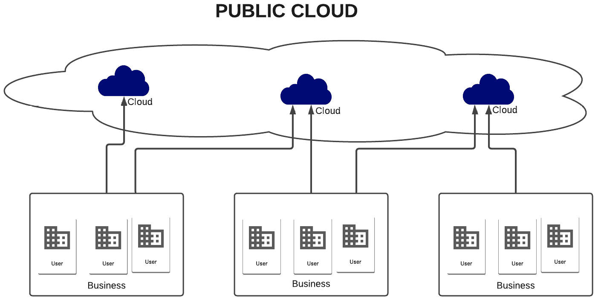
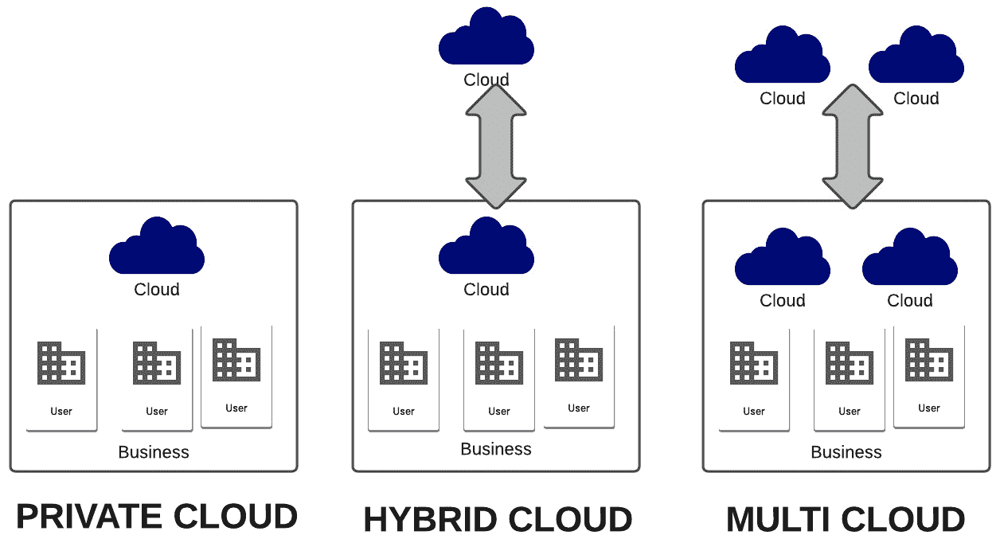
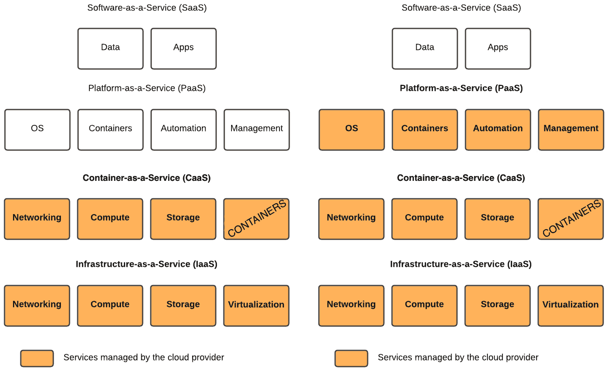
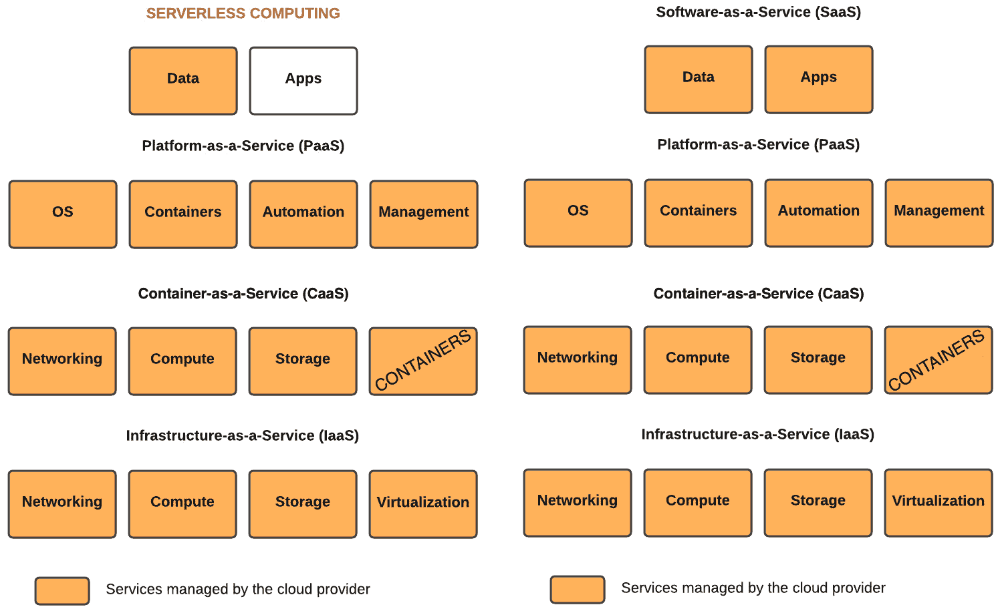
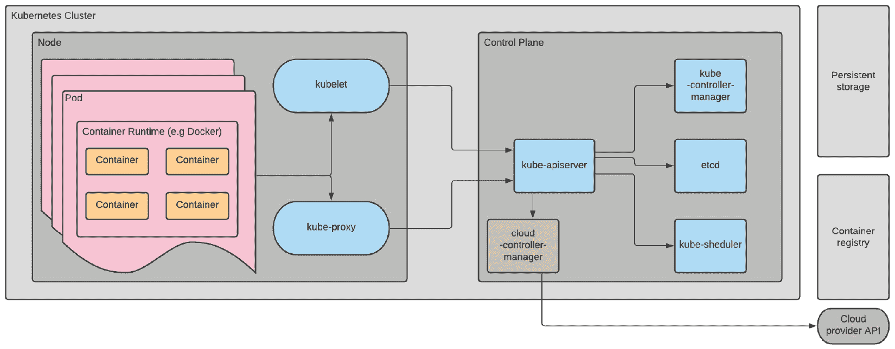
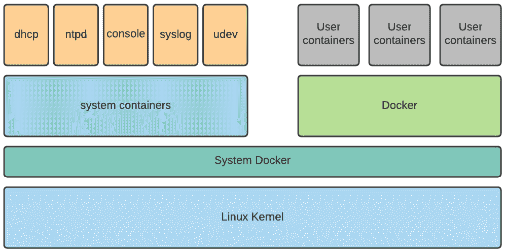
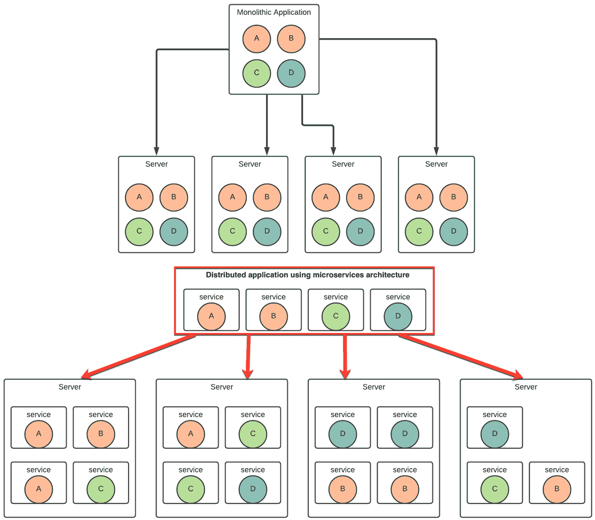
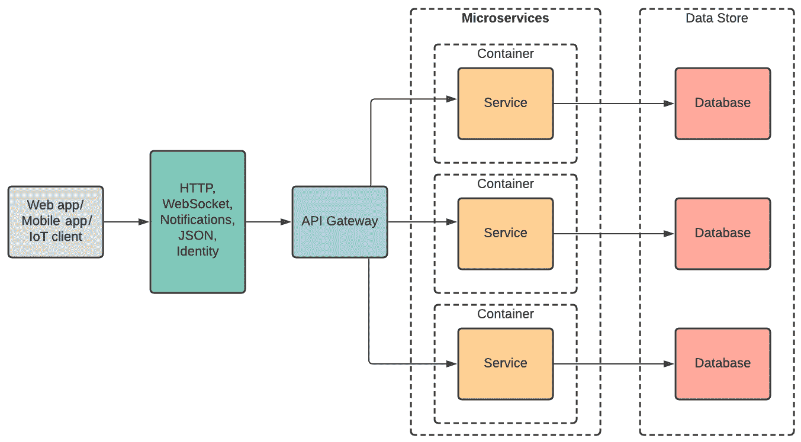

# 十二、云计算基础

在本章中，您将学习云计算的基础知识，并将介绍云基础设施技术的核心基础。 您将了解*作为服务解决方案,比如**基础设施即服务(IaaS**),**平台即服务**(【显示】PaaS),**软件即服务(SaaS【病人】),和**容器作为服务**(【t16.1】中国农科院的)。 您将看到云标准的基本知识,开发和操作**(**DevOps**),**持续集成/持续部署**(**CI / CD),和 microservices。 云的基础知识意味着至少对 OpenStack、**Amazon Web Services**(**AWS**)、Azure 和其他云解决方案有一个基本的介绍。 在本章结束时，我们将向您介绍诸如 Ansible 和 Kubernetes 之类的技术。 本章将提供一个简短而简明的理论介绍，这将是接下来三个与云相关章节的基础，这三个章节将为您提供关于这里提出的许多解决方案的重要实践知识。***********

 ***在本章中，我们将涵盖以下主要主题:

*   云技术简介
*   OpenStack 简介
*   IaaS 解决方案介绍
*   PaaS 解决方案介绍
*   介绍中国农科院的解决方案
*   引入 DevOps
*   介绍云管理工具

# 技术要求

本章是纯理论的，不需要特别的技术要求。 您所需要的只是渴望了解云技术。

本章的代码可通过以下链接获得:[https://github.com/PacktPublishing/Mastering-Linux-Administration](https://github.com/PacktPublishing/Mastering-Linux-Administration)。

# 云技术简介

*项云计算*,或简单的替代云*,不缺少任何科技爱好者或信息技术**(**【显示】)专业的词汇。 您甚至不需要参与 IT 工作，就可以相对频繁地听到(甚至使用)术语*云*。 今天的计算领域正在快速变化，而这种变化的顶峰是云及其背后的技术。 根据文献，术语*云计算*于 1996 年首次使用，出现在康柏的一个商业计划中([https://www.technologyreview.com/2011/10/31/257406/who-coined-cloud-computing/](https://www.technologyreview.com/2011/10/31/257406/who-coined-cloud-computing/))。*****

 **云计算**是一个相对较旧的概念，尽管它从一开始就没有被称为这个术语。 云计算是一种从早期计算时代就开始使用的计算模型。 例如，在 20 世纪 50 年代，有一些大型计算机可以从不同的终端访问。 这种模式与现代云计算类似，服务通过互联网托管并交付到不同的终端，从台式电脑到智能手机、平板电脑或笔记本电脑。 这个模型所基于的技术极其复杂，对于任何想要掌握它们的人来说都是必不可少的。**

 **为什么在一个标题*精通 Linux*中有一整节专门讨论云计算和技术? 因为 Linux 在过去的十年里已经占领了云计算领域，就像 Linux 占领了互联网和高性能计算领域一样。 根据*TOP500*协会，世界 500 强超级计算机都运行在 Linux 上([https://top500.org/lists/top500/2020/11/](https://top500.org/lists/top500/2020/11/))。 云需要有一个操作系统来操作，但不一定非得是 Linux。 然而，Linux 运行在几乎 90%的公共云上([https://www.redhat.com/en/resources/state-of-linux-in-public-cloud-for-enterprises](https://www.redhat.com/en/resources/state-of-linux-in-public-cloud-for-enterprises))，主要是因为它的开源特性吸引了公共和私营部门的 IT 专业人员。

在下一节中，我们将讨论云标准的主题，以及为什么在计划部署或管理云实例时最好了解这些标准。

## 理解云计算标准的需求

在讨论云计算的更多细节之前，让我们先简要介绍一下什么是云标准，以及它们在整个当代云环境中的重要性。 您可能知道，在更宽的**信息和通信技术**(**ICT**)范围内，几乎每一项活动都受到某种标准或法规的约束。

云计算并不是荒地，您会惊讶地发现，有多少协会、监管委员会和组织参与了云计算标准和法规的开发。 涵盖所有这些机构和标准超出了本书和本章的范围，但我们将描述一些最重要和相关的(在我们看来)，以便您能够了解它们在保持云在一起和 web 应用运行方面的重要性。

### 国际标准化组织/国际电工委员会

两个最广为人知的标准实体是**国际标准化组织(ISO**)和**国际电工委员会**(**【显示】IEC), 他们目前在云计算和分布式平台上有 28 已经发布和未开发的标准。 他们有一个联合工作组，为特定的云核心基础设施、消费者应用平台和服务开发标准。 这些标准被发现在**联合技术委员会的职责 1**(【t16.1】**JTC 1)**小组委员会 38**(**SC38**),或*ISO / IEC JTC 1 / SC 38*。****

 **从 ISO / IEC 标准的例子包括但并不局限云计算**服务水平协议(SLA**)框架(*ISO / IEC 19086 - 1:2016*,*ISO / IEC 19086 - 2:2018【显示】,*ISO / IEC 19086 - 3:2017*); 云计算【病人】面向服务的体系结构(SOA**)框架(【t16.1】ISO / IEC 18384 - 1:2016*****,*ISO / IEC 18384 - 2:2016*,*ISO / IEC 18384 - 3:2016*); **开放虚拟化格式**(**OVF**)规范(*ISO/IEC 17203:2017*); 云计算**数据共享协议**(**DSA**)框架*ISO/IEC CD 23751*; **分布式应用平台与服务**(**DAPS**)技术原理*ISO/IEC TR 30102:2012*); 和其他人。 仔细查看标准，请访问[https://www.iso.org/committee/601355/x/catalogue/](https://www.iso.org/committee/601355/x/catalogue/)。 我们名单上的下一个标准的发展实体是一个叫做**云标准的计划协调**(**CSC),由欧洲委员会**(****EC),与专业机构在一起。**********

 ****### CSC 倡议

早在 2012 年,欧盟委员会,连同**欧洲电信标准协会**(**ETSI**),推出了 CSC 制定标准和政策对于云安全、互操作性和可移植性。 该计划分为两个阶段，第一阶段于 2012 年开始，第二阶段于 2015 年开始。 第二阶段(版本 2.1.1)最终报告公开如下:云计算用户需求(*ETSI SR 003 381*); 标准与开源(*ETSI SR 003 382*); *ETSI SR 003 391*; 标准成熟度评估(*ETSI SR 003 392*)。 有关这些标准的详细信息，请访问以下链接:[http://csc.etsi.org/](http://csc.etsi.org/)。 继续列表最广为人知的实体标准发展:美国【t16.1】(**美国**)**国家标准与技术研究院(NIST**)。****

 ****### NIST

这将不是你第一次在这本书中读到 NIST。 NIST 是美国商务部内部的标准开发机构。 NIST 的主要目标是在美国政府机构内部实现安全性和互操作性的标准化，因此任何有兴趣为这些实体开发的人都应该看看 NIST 的云文档。 规范云计算的 NIST 文档名为*NIST SP 500-291r2*，可以在[http://csrc.nist.gov/publications/nistpubs/800-145/SP800-145.pdf](http://csrc.nist.gov/publications/nistpubs/800-145/SP800-145.pdf)中找到。 我们将关闭短清单的 oldest-if oldest-standards 发展机构,联合国的一部分【显示】(**联合国)组织:国际电信联盟【病人】**(**ITU**)。

### The ITU

国际电联是联合国内部的一个机构，其主要工作重点是制定通信、网络和发展标准。 该机构成立于 1865 年，主要负责全球无线电频谱和卫星轨道分配。 它还负责使用莫尔斯电码作为标准的通信手段。 当谈到全球信息基础设施、网络协议、下一代网络、**物联网**(**物联网),和智能城市,国际电信联盟有很多可用的标准和建议。 想要一探究竟，请点击以下链接:[https://www.itu.int/rec/T-REC-Y/en](https://www.itu.int/rec/T-REC-Y/en)。 为了缩小上述链接的文档列表，可以使用文档代码找到一些特定的云计算文档，从*Y.3505*到*Y.3531*。 云计算**研究小组开发的标准 13**(【t16.1】SG13)**云计算联合协调活动**(**JCA-Cloud)在国际电联。****

 ****除了实体描述在这一节中,有很多人,如**云标准客户委员会**(**CSCC**),**分布式管理任务组**(**【显示】DMTF),和**结构化信息标准促进组织**(**【病人】绿洲) 只是为了说出一些。 在云计算中采用标准的主要原因是在涉及**云服务提供商**(**CSP**)或客户端时，易于使用。 这两种类型都需要方便地访问数据，对于 csp 和应用开发人员更是如此，因为方便地访问数据转化为敏捷性和互操作性。 应用框架、网络协议和**应用编程接口**(**api**)的标准化保证了的成功。****

### 通过 api 理解云

标准除了在技术上正确外，还需要保持一致和持久性。 根据文献，主要有两组标准:一组是实践中建立的标准，另一组是正在被规范的标准。 云标准的一个重要部分，来自第二类，是 API。 api 是协议、过程和函数的集合:这些都是构建分布式网络应用所需的基础。 现代 api 是在 21 世纪初出现的，最初是 Roy Fielding 博士论文中的一个理论。 在现代 api 之前,有 SOA 标准和**简单对象访问协议(SOAP**),基于**【显示】可扩展标记语言(XML****)。 现代 api 基于一种新的应用架构风格，称为**REpresentational State Transfer**(**REST**)。******

REST api 基于一系列体系结构风格、元素、连接器和视图，Roy Fielding 在他的论文中清楚地描述了这些。 API 要实现 RESTful 有六个指导约束，它们是:统一的用户界面、客户机-服务器清晰的描述、无状态操作、可缓存的资源、分层的服务器系统和按需执行代码。 尽管如此，遵循这些指导原则还远远不能遵循标准，但是 REST 将它们作为高级抽象层提供给开发人员。 除非它们是标准化的，否则它们将永远是在开发人员中产生困惑和挫折的伟大原则。

唯一的组织,管理标准化云是 DMTF REST api,通过**云基础设施管理界面**(**CIMI)模型和 RESTful**超文本传输协议(HTTP【显示】**)的协议,在文档编码*DSP0263v2*, 可从以下链接下载:[https://www.dmtf.org/standards/cloud](https://www.dmtf.org/standards/cloud)******

 **将来开发人员在设计 REST api 时可能会使用其他规范作为标准。 其中,**OpenAPI 规范**(**美洲国家组织),一个行业标准,它提供了一个 API 开发语言无关描述(文档可以在[http://spec.openapis.org/oas/v3.0.3](http://spec.openapis.org/oas/v3.0.3)),**GraphQL【显示】,查询语言和服务器端运行时, 支持多种编程语言，如 Python、JavaScript、Scala、Ruby 和**PHP: Hypertext Preprocessor**(**PHP**)。****

REST 之所以成为首选 API，是因为它更容易理解、更轻量级、更容易编写。 它更高效，使用更少的带宽，支持多种数据格式，并使用**JavaScript 对象表示法**(**JSON**)作为首选数据格式。 JSON 易于读写，并且在使用不同语言(如 JavaScript、Ruby、Python、Java 等)编写的应用之间提供更好的互操作性。 通过使用 JSON 作为 API 的默认数据格式，使其变得友好、可伸缩且与平台无关。

在 web 和云计算中，api 无处不在，是 SOA 和微服务的基础。 例如，微服务通过为云分布式资源提供优化的架构，使用 RESTful api 在服务之间进行通信。

因此，如果您想掌握云计算技术，您应该开放地接受云标准。 在下一节中，我们将讨论云类型和架构。

## 了解云的架构

云的建筑设计类似于建筑的建筑设计。 有一种设计范例支配着云——在这种范例中，设计从一个空白、干净的绘图板开始，建筑师将不同的标准化组件放在一起，以实现建筑设计。 最终的结果是基于一定的建筑风格。 设计云架构时也是如此。

云基于客户机-服务器、分层、无状态的基于网络的架构风格。 REST api、SOA、微服务和 web 技术都是构成云的基础的基本组件。 云的架构已经由美国 NIST 定义，它是美国商务部的一部分([https://www.nist.gov/publications/nist-cloud-computing-reference-architecture](https://www.nist.gov/publications/nist-cloud-computing-reference-architecture))。

云背后的一些技术已经在[*第 11 章*](11.html#_idTextAnchor192)、*与容器和虚拟机一起工作*中讨论过。 实际上，虚拟化和容器都是云计算的基础技术。

让我们设想这样一种情况，您希望有多个 Linux 系统来部署您的应用。 您首先要做的是访问 CSP 并请求您需要的系统。 CSP 将根据您的需要在其基础架构上创建**虚拟机**(**虚拟机**)，并将所有这些虚拟机放在同一个网络中，并与您共享访问它们的凭据。 通过这种方式，您可以访问您想要的系统，但需要支付按日、月或年计费的订阅费用，或者根据资源消耗情况计费。 大多数时候，这些 CSP 请求是通过一个特定的 web 界面来完成的，该界面是由提供商开发的，以最适合其用户的需求。

云所使用的一切技术都基于虚拟机和容器。 在云中，一切都是抽象和自动化的。

### 描述云类型

无论哪种类型，每个云都有一个特定的**架构**，就像我们在前一节中展示的那样。 它为云计算的基础提供了*蓝图*。 云架构是云基础设施的基础，而基础设施是云服务的基础。 看到一切是如何联系在一起的了吗? 现在让我们看看与云相关的基础设施和服务。

云基础设施主要有四种类型，如下:

*   **公共云**:这些运行在提供商拥有的基础设施上，主要在外部可用; 最大的公共云提供商是 AWS、微软 Azure 和谷歌 cloud。 公有云基础设施类型如下图所示:

图 12.1 -显示公共云类型的图

*   **私有云**:这些专门为具有隔离访问权限的个人和组运行; 它们可在本地或外部硬件基础设施中使用。 有可用的托管私有云或专用私有云。
*   **混合云**:这些云是私有云和公共云，运行在连接的环境中，具有可用于潜在按需伸缩的资源。
*   **多云**:这些是多个云运行于多个提供商。

不同的云类型如下图所示:

图 12.2 -显示私有云、混合云和多云类型的图

上面的图显示了私有云、混合云和多云类型在理论上是如何工作的。 为了更好地理解私有云的概念，我们展示了在本地运行的云，在业务之外有限制访问。 为同时使用私有云和公共云的企业展示了混合云类型，而多云类型展示了企业如何运行多个私有云、公共云或混合云。

除此之外，主要有三种云服务类型:

*   **IaaS**:通过 IaaS 云服务类型，云提供商管理所有硬件基础设施，如服务器和网络，以及虚拟化和数据存储。 基础设施由供应商拥有，由用户租用; 在这种情况下，用户需要管理操作系统、运行时、自动化、管理解决方案和容器，以及数据和应用。 IaaS 是每个云计算服务的支柱，因为它提供所有的资源。
*   **CaaS**:认为是 IaaS 的一个*子集; 它与 IaaS 具有相同的优势，只是基础由容器组成，而不是 vm，而且它更适合部署分布式系统和微服务体系结构。*
*   **PaaS**:采用 PaaS 云服务类型，由云提供商管理硬件基础设施、网络、软件平台; 用户管理和拥有数据和应用——因此 DevOps。 下图显示了 IaaS、CaaS 和 PaaS 模型:

图 12.3 - IaaS、CaaS 和 PaaS 图

*   **SaaS**:SaaS 云服务类型，由云提供商管理和拥有硬件、网络、软件平台、管理和软件应用。 这种类型的服务也以提供网页应用或移动应用而闻名。
*   除了这些类型的服务，我们还应该讨论另一种服务::**无服务器计算**服务。 与名称所暗示的不同，无服务器计算仍然意味着使用服务器，但运行服务器的基础设施对用户是不可见的，而用户在大多数情况下是开发人员。 无服务器类似于 SaaS; 实际上，它正好适合 PaaS 和 SaaS 之间。 它没有基础设施管理，具有可伸缩性，为应用开发人员提供了更快的营销方式，并且在资源使用方面非常高效。 下面的图表显示了 SaaS 和无服务器类型的组件:

图 12.4 -显示 SaaS 和无服务器类型的图

现在您已经了解了云基础设施和服务的类型，您可能想知道为什么您、您的企业或您认识的任何人都应该迁移到云服务。 首先，云计算基于对由 CSP 托管和管理的各种资源的按需访问。 这意味着基础设施由 CSP 拥有或管理，用户将能够基于订阅费用访问资源。 应该迁移到云吗? 我们将在下一节中讨论迁移到云的优点和缺点。

## 了解云计算的关键特性

在决定将迁移到云是否是一个好的决定之前，您需要知道这样做的优点和缺点。 云计算确实提供了一些基本特性，例如下面列出的:

*   **成本节约**:基础设施建设产生的成本降低，现在由 CSP 管理; 这将用户的注意力放在应用开发和业务运行上。
*   **速度**、**敏捷性**和**资源访问**:所有资源在任何时间、任何地点都可以使用，只需点击几下鼠标即可(取决于互联网连接和速度)。
*   **可靠性**:资源托管在不同的位置，通过提供良好的质量控制、**灾难恢复**(**DR**)策略和损失预防; 维护是由 CSP 完成的，这意味着终端用户不需要浪费时间和金钱来做这些。

除了前面列出的优点(关键特性)之外，也可能存在缺点，例如**性能变化**、**停机时间**和**缺乏可预测性**。 然而，对于那些想要迁移到云上的人来说，这些并不是阻碍。

根据您选择的 CSP，性能可能有所不同，但没有任何大型 CSP 存在显著的性能问题。 在大多数情况下，性能是由用户的本地网速决定的，所以它毕竟不是 CSP 问题。 停机可能是一个问题，但所有主要供应商都努力提供 99.9%的正常运行时间。 如果灾难发生，问题在几分钟内就能解决——或者在最坏的情况下，在几小时内就能解决。 关于 CSP 及其在市场上的存在缺乏可预测性，但可以肯定的是，没有一个大的玩家会很快消失。

在下一节中，我们将向您介绍 OpenStack 平台。

# OpenStack 简介

**OpenStack**一直由**开放基础设施基础**(**OpenInfra 基金会)2020 年 10 月以来,提供一组开源工具,用于构建和管理云基础设施。 OpenStack 支持创建公有云和私有云。**

OpenStack 是一组用于创建和管理云基础设施的工具，它将所需的组件作为粒度模型提供给特定于云计算的服务。 OpenStack 最初是在 2010 年作为 Rackspace 和**美国国家航空航天局**(**NASA**)的一个联合项目发布的，是用 Python 编写的，并在 Apache 2.0 许可证下授权。

与虚拟化技术类似，OpenStack 采用基于特定 api 的软件层对虚拟资源进行抽象。

OpenStack 最新版本名为“Victoria”，于 2020 年 10 月发布。 它为裸金属虚拟机和容器提供了基础云基础设施。 OpenStack 具有模块化结构，在添加特性和功能方面提供了极大的灵活性。 模块化是由它提供的组件提供的，每个组件都具有用于访问基础设施资源的特定 api。 下面是一些 OpenStack 组件的列表，按类别分类:

*   **Web interface**:

    a)**Horizon**:一个仪表板，用于管理所有 OpenStack 服务

*   **Compute**

    a)**Nova**:按需提供资源的计算服务

    b)**Zun**:一个容器服务，它使用不同的容器技术提供创建和管理容器的 API

*   **Storage**:

    a)**Swift**:面向可扩展性、高可用性和并发性的对象存储服务。

    b)**Cinder**:提供资源管理自助 API 的块存储服务; 它可以与**逻辑卷管理器**(**LVM**)一起使用。

    c)**Manila**:一个服务，提供对共享文件系统的访问。

*   **Networking**:

    a)**Neutron**:为虚拟计算环境提供**软件定义组网**(**SDN**)解决方案的组件

    b)**Octavia**:一个组件，为裸金属服务器、容器或虚拟机提供随需应变的负载均衡解决方案

    c)**指定**:一个组件，提供**域名系统**(**DNS**)服务

*   **Shared services**:

    a)**楔石**: 组件提供 api 客户机身份验证、支持**轻量级目录访问协议(LDAP【显示】),**开放授权**(【病人】OAuth),OpenID 连接,**【t16.1】安全性断言标记语言(SAML****),** (**SQL**)**

    **b)**巴比肯**:一个密钥管理服务，用于安全存储、密码、证书和加密密钥管理**

    **c)**Glance**:存储和检索虚拟机镜像的镜像服务**

***   **Orchestration**:

    a)**Heat**:基础设施资源调度的组件

    b)**Senlin**:一种集群服务，旨在方便 OpenStack 内部类似对象的编排

    c)**Zaqar**:为 web 和移动开发人员提供云消息服务的组件

    *   **Workload provisioning**:

    a)**Magnum**:使得 Docker Swarm、Kubernetes、Apache Mesos 等容器编排引擎在 OpenStack 上可用。

    b)**Trove**:这个提供了关系和非关系数据库引擎。

    c)**Sahara**:此提供 OpenStack 上的 Hadoop、Spark、Storm 等数据处理工具。** 

 **之前提供的列表并不全面。 我们只列出了我们认为那些新加入 OpenStack 的人会感兴趣的组件。 关于每个模块的详细信息可以在[https://www.openstack.org/software/project-navigator/openstack-components#openstack-services](https://www.openstack.org/software/project-navigator/openstack-components#openstack-services)找到。 下图展示了 OpenStack 的各个组件以及它们之间的连接:

图 12.5 - OpenStack 映射(镜像来源:https://www.openstack.org/software/)

在上图中，可以看到基金会提供的 OpenStack 服务的映射图。 这是一种直观的方式，可以查看整个 OpenStack 服务的情况，以及所提供服务之间的所有关系，并查看它们是如何组合在一起的。

因此，让我们总结一下 OpenStack 是如何工作的。 它使用 Linux 基础操作系统来运行一系列名为*的组件*的项目。 这些项目具有发送到操作系统的脚本，用于在虚拟化资源之上创建云环境。 OpenStack 主要用于创建 IaaS 解决方案。 您可以将其视为由创建整个堆栈的组件生成的 it 基础设施的软件版本。 在下一节中，我们将介绍一些 IaaS 解决方案。

# 介绍 IaaS 解决方案

IaaS 是云计算的骨干。 它提供对资源(如计算、存储、网络等)的随需应变访问。 CSP 使用管理程序提供 IaaS 解决方案。 在本节中，我们将为您提供一些最广泛使用的 IaaS 解决方案的信息。 我们将给你供应商的详细信息,如**Amazon Elastic Compute Cloud**(**Amazon EC2),微软 Azure 虚拟机,和**谷歌计算引擎**(【显示】**GCE)大玩家,和 DigitalOcean 作为一个可行的解决方案。****

## Amazon EC2

AWS 提供的 IaaS 解决方案被称为 Amazon EC2。 它为任何人提供了一个良好的基础架构解决方案，从低成本的计算实例到用于机器学习的高性能**图形处理单元**(**GPU**)。 12 年前，AWS 是 IaaS 解决方案的第一家提供商，即使在 COVID-19 大流行之后，AWS 的表现也比以往任何时候都好([https://www.zdnet.com/article/the-top-cloud-providers-of-2021-aws-microsoft-azure-google-cloud-hybrid-saas/](https://www.zdnet.com/article/the-top-cloud-providers-of-2021-aws-microsoft-azure-google-cloud-hybrid-saas/))。

当开始使用 Amazon EC2 时，需要完成几个步骤。 首先是选择您的**Amazon Machine Image**(**AMI**)，它基本上是 Linux 或 Windows 的预配置映像。 当涉及到 Linux，你可以选择以下两种:

*   Amazon Linux 2(基于 CentOS/**Red Hat Enterprise Linux**(**RHEL**)
*   RHEL 8
*   **SUSE Linux Enterprise Server**(**SLES**)15 SP2
*   Ubuntu Server 20.04**长期支持**(**LTS**)

您将需要从非常广泛的种类中选择您的实例类型。 要了解更多关于 EC2 实例的信息，请访问[https://aws.amazon.com/ec2/instance-types/](https://aws.amazon.com/ec2/instance-types/)并了解每个实例的详细信息。 EC2,举例来说,是唯一的供应商,提供 Mac 实例,基于 Mac mini 与英特尔 i7 台**中央处理单元(cpu**【显示】),**超线程和 32 GB**(【病人】**GB)**随机存取存储器(RAM**【t16.1】)。 要使用 Linux，您可以根据需要从低端实例到高性能实例进行选择。**********

Amazon 提供一个**弹性块存储**(**EBS**)选项，同时**固态驱动器**(**SSD**)和磁性介质可用。 您可以根据需要选择一个自定义值。 与其他选项相比，EC2 是一种灵活的解决方案。 它有一个易于使用和直观的界面，你只需要为你所使用的时间和资源付费。 在[*第 13 章*](13.html#_idTextAnchor239)，*通过 AWS 和 Azure 部署到云*中，将提供一个如何在 EC2 上部署的示例。

## Microsoft Azure 虚拟机

微软是云市场的第二大玩家，仅次于亚马逊。 Azure 是他们云计算产品的名字。 尽管 Linux 是由 Microsoft 提供的，但它是 Azure 上使用最广泛的操作系统([https://www.zdnet.com/article/microsoft-developer-reveals-linux-is-now-more-used-on-azure-than-windows-server/](https://www.zdnet.com/article/microsoft-developer-reveals-linux-is-now-more-used-on-azure-than-windows-server/))。

Azure 的 IaaS 产品被称为虚拟机(Virtual Machines)，与亚马逊的产品类似; 您可以在许多层之间进行选择。 微软产品的不同之处在于定价模式。 他们有一个量入为出的模型，或者一个基于预订的实例，使用时间为 1 到 3 年。 微软的界面与亚马逊的完全不同，在我们看来，它可能没有竞争对手的那么直接，但你会在一段时间后了解它。

微软提供了几种类型的虚拟机，从经济的易崩溃虚拟机到功能强大的内存优化实例。 现收现付模式提供每小时的费用，这可能会增加这些服务的最终账单，所以要根据自己的需要谨慎选择。 当涉及到 Linux 发行版时，您可以从以下版本中选择:CentOS 6、7 和 8; Debian 8、9 和 10; RHEL 6、7 和 8; SLES 用于 SAP 11、12 和 15; openSUSE 飞跃 15; 以及 Ubuntu Server 16、18 和 20。

Azure 也有一个非常强大的 SaaS 产品，如果您使用其他 Azure 服务，这个将是一个很好的选择。 在[*第 13 章*](13.html#_idTextAnchor239)，*通过 AWS 和 Azure*部署到云中，将提供一个如何部署到 Azure 的例子。

## 其他强大的 IaaS 产品

**DigitalOcean**是云市场上另一个重要的参与者，提供强大的 IaaS 解决方案。 DigitalOcean 有一个非常简单直观的界面，它可以帮助你在很短的时间内创建一个云。 他们将 vm**液滴**和 y 液滴在几秒钟内产生。 您所要做的就是选择映像(Linux 发行版); 计划(基于您的**虚拟 CPU**(**vCPU**)、内存和磁盘空间需求); 添加存储块; 选择您的数据中心区域、身份验证方法(密码或**Secure Shell**(**SSH**)密钥)和主机名。 您还可以将液滴分配给您管理的某些项目。

与其他竞争对手相比，DigitalOcean 的界面更好看，用户友好得多。 以 DigitalOcean 为例，其他 IaaS 提供商(如 Linode 和 Hetzner 等)为创建虚拟服务器提供了一个苗条而友好的界面。

**Linode**是云市场上另一个强大的竞争对手，提供强大的解决方案。 它们的虚拟机称为 Linodes。 就易用性和外观而言，其界面介于 DigitalOcean 和 Azure 之间。

另一个强大的竞争者，至少在欧洲的市场，是**Hetzner**，一家总部位于德国的云服务提供商。 它们在资源和成本之间提供了很大的平衡，并提供了与本节中提到的其他解决方案类似的解决方案。 他们提供了一个类似于 DigitalOcean 的界面，非常容易探索，云实例将在几秒钟内部署。

与 DigitalOcean、Linode 和 Hetzner 的产品类似，亚马逊也推出了一款相对较新的产品(从 2017 年开始)，名为**光帆**。 引入此服务的目的是为客户提供一种简单的方式，在云中部署**虚拟私有服务器**(**vps**)或虚拟机。 它的界面与竞争对手的界面相似，但是它的基础设施具有完全的可靠性。

Lightsail 提供了几个发行版，以及应用包。 在 AWS 上部署，使用 Lightsail，变得更加简单和直观。 它是一个有用的工具来吸引那些想要快速和安全的解决方案来交付他们的 web 应用的新用户。

还有其他可用的解决方案，如谷歌的解决方案，称为 GCE，它是来自**谷歌云平台**(**GCP**)的 IaaS 解决方案。 GCP 接口非常类似于 Azure 平台上的接口。

重要提示

使用 GCP 的一个有趣的方面是，当您想要删除一个项目时，操作不是立即进行的，并且删除计划在一个月的时间内进行。 如果删除不是有意的，并且您需要回滚项目，那么这可以被视为一个安全网。

如果你不喜欢主流厂商提供的 IaaS 平台，你可以使用**OpenStack**创建你自己的 IaaS。 在下一节中，我们将详细介绍一些 PaaS 解决方案。

# 介绍 PaaS 解决方案

PaaS 是云计算的另一种形式。 与 IaaS 相比，PaaS 提供了硬件层和应用层。 硬件和软件由 CSP 托管，不需要从客户端管理它们。 在大多数情况下，PaaS 解决方案的客户是应用开发人员。

提供 PaaS 解决方案的 csp 与提供 IaaS 解决方案的 csp 基本相同。 我们有亚马逊、微软和谷歌作为主要的 PaaS 提供商。

## 亚马逊弹力豆茎

Amazon 提供**Elastic Beanstalk**服务，其接口简单直观。 您可以创建一个示例应用或上传自己的应用，而 Beanstalk 将负责从部署细节到负载平衡、扩展和监视的其余工作。 选择要在其上部署的 AWS EC2 硬件实例。 接下来，我们将讨论另一个主要玩家的产品:谷歌 App Engine。

## 谷歌 App Engine

谷歌的 PaaS 解决方案是**谷歌 App Engine**，这是一个完全管理的无服务器环境，使用起来相对容易，支持大量的编程语言。 谷歌 App Engine 是一个可伸缩的解决方案，具有自动安全更新、托管基础设施和监控功能。 云存储解决方案和支持所有主要的 web 编程语言，如 Go, Node.js, Python， . net，或 Java。 谷歌提供了有竞争力的价格和一个类似于我们在他们的 IaaS 产品中看到的界面。 另一个提供可靠产品的主要公司是 DigitalOcean，我们接下来会讨论这个问题。

## 数字海洋应用平台

DigitalOcean 以**App Platform**的形式提供 PaaS 解决方案。 它提供了一个直观的接口，一个与 GitHub 或 GitLab 存储库的直接连接，以及一个完全管理的基础设施。 DigitalOcean 与 Amazon 和谷歌等大公司处于同一级别，通过应用平台，它管理基础设施、供应、数据库、应用运行时和依赖关系，以及底层操作系统。 它支持流行的编程语言和框架，如 Python、Node.js、Django、Go、React、Ruby 等。 DigitalOcean 应用平台使用开放的云原生标准，具有自动代码分析、容器创建和编排功能。 这个解决方案的一个独特的能力是免费起始层，用于部署最多三个静态网站。 对于原型化动态 web 应用，有一个基本层，对于在市场上部署专业应用，有一个专业层可用。 DigitalOcean 的界面令人愉快，可能会吸引新来者。 他们的定价也是一个优势。

除了现成的解决方案提供商上市之前,有开源 PaaS 解决方案**提供云计算**,**Red Hat OpenShift**,**Heroku**,别人,在这一节中我们将不会细节。 然而，前面提到的中的三个至少值得做一个简短的介绍，所以在这里，它们将在下一节中详细介绍。

## Red Hat OpenShift

**Red Hat OpenShift**是用于应用部署的容器平台。 它的基础是一个 Linux 发行版(RHEL)，配有一个容器运行时和用于网络、注册、身份验证和监视的解决方案。 OpenShift 设计是可行的,混合 PaaS 解决方案总 Kubernetes 集成(Kubernetes 将简单地覆盖在下一节中,*引入中国农科院的解决方案,和更详细的[*第 14 章【显示】*](14.html#_idTextAnchor252),*与 Kubernetes*部署应用)。 OpenShift 利用收购 CoreOS 的机会，推出了一些独特的解决方案。 新的 CoreOS 构造容器平台将与 OpenShift 合并，为用户带来最好的两个世界。*

## 云铸造

**Cloud Foundry**是一个云平台，设计为企业专用的 PaaS 解决方案。 它是开源的，可以部署在不同的基础设施上，从本地到 IaaS 提供商，如谷歌 GCP、Amazon AWS、Azure 或 OpenStack。 它提供了各种开发框架和云铸造认证平台的选择，如 Atos 云铸造、IBM 云铸造、SAP 云平台、SUSE 云应用平台和 VMware Tanzu。

## Heroku 平台

**Heroku**是一家 Salesforce 公司，该平台是作为创新的 PaaS 开发的。 它基于名为 Dynos 的容器系统，Dynos 使用由容器管理系统运行的基于 linux 的容器，设计初衷是为了可伸缩性和灵活性。 它提供了完全管理的数据服务，支持 Postgres、Redis、Apache Kafka 和 Heroku Runtime，后者是一个负责容器编排、伸缩和配置管理的组件。 Heroku 还支持大量的编程语言，如 Node.js、Ruby、Python、Go、Scala、Clojure 和 Java。

PaaS 为开发人员提供了许多解决方案，通过减轻管理基础设施的负担，帮助他们创建和部署应用。 到目前为止，您可能已经了解到，本节描述的许多解决方案都依赖于容器的使用。 这就是为什么在下一节中，我们将详细介绍 IaaS 的一个子集，称为 CaaS，在这里我们将向您介绍容器编排和专用于容器的操作系统。

# 介绍 CaaS 解决方案

CaaS 是 IaaS 云服务模型的一个子集。 它允许客户在提供者管理的基础设施之上使用单独的容器、集群和应用。 根据客户的需要，CaaS 既可以在本地使用，也可以在云中使用。 在 CaaS 模型中，容器引擎和业务流程由 CSP 提供和管理。 用户与容器的交互可以通过 API 或 web 界面来完成。 供应商使用的容器编排平台——主要是**Kubernetes**和**Docker**——非常重要，是不同解决方案之间的关键区别。

我们在[*第 11 章*](11.html#_idTextAnchor192)，*中讨论了容器(和虚拟机)*中使用容器和虚拟机，没有给出任何关于编配或容器专用的微操作系统的详细信息。 现在我们将为您提供更多关于这些主题的细节。

## 介绍 Kubernetes 容器编排解决方案

Kubernetes 是谷歌开发的一个开源项目，用于容器化应用的自动部署和扩展。 它是用 Go 编程语言编写的。 Kubernetes*这个名字来自希腊语，它代表一艘船的舵手或船长。 Kubernetes 是一个自动化容器管理、基础设施抽象和服务监视的工具。*

许多新来者将 Kubernetes 与 Docker 混淆，或者将 Docker 与 Kubernetes 混淆。 它们是互补的工具，每个都用于特定的目的。 Docker 创建了一个容器(就像一个盒子)，你想在其中部署你的应用，Kubernetes 负责容器(或盒子)，一旦应用被打包和部署。 Kubernetes 提供了一系列对运行容器至关重要的服务，例如服务发现和负载平衡、存储编排、自动备份和自修复以及隐私。 Kubernetes 体系结构由几个组件组成，任何管理员都必须了解这些组件。 我们将在下一节为您详细介绍它们。

### 介绍 Kubernetes 组件

当您运行 Kubernetes 时，您主要管理主机集群，这些主机通常是运行 Linux 的容器。 简而言之，这意味着当您运行 Kubernetes 时，您运行的是集群。 以下是 Kubernetes 中发现的基本组件列表:

*   一个集群是 Kubernetes 的核心，因为它的唯一目的是管理大量的集群。 每个集群至少由一个控制平面和一个或多个节点组成，每个节点在 pods 中运行容器。
*   *控制平面*由控制节点的进程组成。 控制平面的组件列在这里:`kube-apiserver`是 API 服务器作为控制平面的前端; `etcd`是集群内所有数据的后备存储; `kube-scheduler`寻找没有指定节点的 pod，并将其连接到一个节点运行; `kube-controller-manager`运行控制器进程，包括节点控制器、复制控制器、端点控制器和令牌控制器; `cloud-controller-manager`是一个允许您将集群链接到云提供商 API 的工具; 它包括节点控制器、路由控制器和业务控制器。
*   *节点*是一个 VM 或者运行服务的物理机器，这些服务是豆荚所需要的。 节点组件在每个节点上运行，并负责维护运行的 pod。 这些组件是:`kube-proxy`，负责每个节点上的网络规则;`kubelet`，确保每个容器都在一个 Pod 中运行。
*   *Pods*是运行在集群中的不同容器的集合。 它们是工作负载的组件。

Kubernetes 集群非常复杂，难以掌握。 理解它的概念需要大量的实践和奉献。 不管它有多复杂，Kubernetes 不会为你做所有的事情。 您仍然需要选择容器运行时(支持的运行时是 Docker、`containerd`和**容器运行时接口**(**CRI-O**)、CI/CD 工具、存储解决方案、访问控制和应用服务。 下面是 Kubernetes 集群架构的示意图:

图 12.6 - Kubernetes 集群架构

管理 Kubernetes 集群超出了本章的范围，但您将在[*第 14 章*](14.html#_idTextAnchor252)，*使用 Kubernetes 部署应用*中了解这一点。 这篇简短的介绍有助于您理解 Kubernetes 使用的概念和工具。

除了 Kubernetes，还有其他一些容器编排工具，如**Docker Swarm**，**Apache Mesos**，或者 HashiCorp 的**Nomad**。 他们是非常强大的工具，被世界各地的许多人使用。 我们不会在这里详细讨论这些，但是我们认为至少在容器编排部分的末尾列出它们会很有用。 在下一节中，我们将为您提供一些关于云中的容器解决方案的信息。

## 部署云容器****** 

### 亚马逊 ECS

Amazon ECS 是一个用于编排容器的完全托管服务。 它提供了一个可选的、无服务器的解决方案(**AWS Fargate**)，并由 Amazon 的一些关键服务在内部运行，这确保了工具经过测试，并且足够安全，任何人都可以使用。 它使用的容器运行时是 Docker。 Amazon 还提供了一个用于编排 Kubernetes 应用的 EKS 服务。

### Amazon EKS

AmazonEKS 是一个用于容器编排的工具。 它基于**Amazon EKS 发行版**(**EKS- d**)，是 Amazon 开发的 Kubernetes 发行版，基于原来的开源 Kubernetes。 通过使用 EKS-D，您可以在本地或 Amazon 自己的 EC2 实例上运行 Kubernetes，也可以在 VMware vSphere vm 上运行。 谷歌提供了另一个强大的解决方案，其 GKE 服务将在下一节中详细介绍。

### GKE

GKE 提供了预构建的部署模板，可以根据 CPU 和内存的使用情况自动伸缩 Pod。 通过 GKE Sandbox 提供的增强的安全性，可以跨多个池进行扩展。 GKE 沙箱通过保护主机内核和运行的应用，提供了额外的安全层。 除了谷歌和 Amazon，微软还提供了一个强大的容器编排解决方案，即 AKS。 我们将在下一节中介绍它。

### Microsoft AKS

AKS 是一个用于部署容器化应用集群的托管服务。 与其他提供商一样，微软通过处理资源维护和运行状况监视提供了一个完全管理的解决方案。 AKS 节点使用 Azure vm 运行和支持不同的操作系统，例如 Microsoft Windows Server 映像。 它还提供免费升级到最新的 Kubernetes 图像。 在其他解决方案中，AKS 提供了支持 gpu 的节点、存储容量支持，以及与微软自己的**Visual Studio Code**(**VS Code**)的特殊开发工具集成。

在了解了一些可用于在云中部署 Kubernetes 的解决方案并学习了 Kubernetes 的主要组件及其工作方式之后，在下一节中，我们将讨论专门用于云的最小操作系统。 Kubernetes 是其中一些操作系统的重要组成部分，因此在下一节中，我们将向您介绍微操作系统。

## 微操作系统的兴起

当使用容器将应用部署给用户时，我们需要底层操作系统尽可能精简。 在第 11 章**Working with Containers and Virtual Machines*中使用 Docker 时，你可能还记得 Ubuntu 操作系统的小尺寸。 对精简主机的需求促进了以容器为中心的、专门的和极简的操作系统的兴起。 这些被称为**微操作系统**。 最著名的专用微操作系统是 CoreOS、Atomic Host(过时的)、RancherOS 和 Ubuntu Core(以前叫 Ubuntu Snappy)。 CoreOS 被红帽收购，并逐步将 Atomic Host 从市场上淘汰。 最初，Atomic Host 是由 Fedora 开发的。 RancherOS 最近被 SUSE 收购，现在仍然保留其名称和结构。 这些最小化的和专门的操作系统中的每一个都被认为是操作系统的未来，具有新的不可变的体系结构和事务更新。*

 *### CoreOS (Fedora 和 RHEL)简介

**CoreOS**是第一个引入容器专用的 Linux 发行版，占用空间小，可以自动更新。 在红帽收购之后，一个新的专门版本的容器 Linux 出现了，名称为**红帽 CoreOS**。 这个新的发行版基于 Fedora 和 RHEL。 Red Hat CoreOS 现在是**Red Hat OpenShift 容器平台**的基础。 该平台的下一代是基于**CoreOS 构造**的，这是一个基于 Kubernetes 的全新全自动集装箱平台。 随着**Fedora CoreOS**和**Red Hat CoreOS**的兴起和构造的引入，CoreOS 的集群结构发生了变化，现在完全基于 Kubernetes。

Fedora CoreOS 两原子提供了什么是最好的主机和 Linux 容器,通过结合自动更新和提供工具支持**甲骨文云基础设施**(**OCI)和码头工人和**安全增强型 Linux**(**【显示】SELinux)安全。

### 简短概述 RancherOS

**RancherOS**是生产中运行 Docker 容器的专用操作系统。 RancherOS 中的每个进程都是一个 Docker 容器，这使得系统非常轻量级，资源也很容易使用。 当系统初始化时，会启动两个主要的 Docker 实例。 一个叫做 System Docker，用于运行包含其他系统服务的专用 Docker 容器。 另一个实例叫做 Docker，运行在 System Docker 之上; 这被认为是一个管理用户容器的守护进程，它非常简单和直观。 一切都以 Linux 内核为基础运行。 下图展示了 RancherOS 的建筑结构:

图 12.7 - RancherOS 架构

**Fedora CoreOS**(**Red Hat CoreOS**)和 RancherOS 都是值得用于容器的专用操作系统。 还有一个孩子在 block 中:Ubuntu Core(以前称为 Snappy)，我们将在下一节简要讨论。

### 简短概述 Ubuntu Core

与之前提到的其他两个解决方案相比，**Ubuntu Core**是一个不同的怪兽。 它不是基于特定的基于容器的架构(例如 Docker)，因为它最初是为了在物联网上运行而开发的，是基于 Canonical 内部开发的快照包。 它是一个精简版的 Ubuntu，使用只读文件系统、事务性更新和快照包。 由于 snaps 是自包含的，并且包含每个依赖项甚至文件系统，所以底层操作系统只需要运行最少的包。 它被设计成以一种安全可靠的方式部署和运行应用，这就是为什么整个操作系统是围绕 snaps 开发的。 甚至内核也被封装起来，并被视为一个快照。 除了内核快照，Ubuntu Core 中还有其他类型的快照。 有一个 gadget snap，用来管理系统属性; core snap，它提供执行环境; 应用快照，即运行在 Ubuntu Core 上的打包应用、守护程序和工具。

在本节中，专门讨论容器的专用最小操作系统，我们向您展示了三种不同的解决方案，每一种解决方案下面使用了不同的技术。 这三种产品都是非常强大的工具，非常适合它们的预期目的。 在下一节中，我们将讨论微服务在云计算中的重要性。

## 介绍微服务

**微服务**是应用交付中使用的架构风格。 随着时间的推移，应用交付从单一模型向分散模型发展，这都归功于云技术的发展。 从 2006 年 AWS 的历史性发布开始，接着是 2007 年 Heroku 和 2010 年 Vagrant 的发布，为了利用新的云产品，应用部署也开始发生变化。 应用从拥有单一的、大型的、单一的代码库转变为每个应用都能从不同的服务集中获益的模型。 这将使代码库更加轻量级，并且依赖于不同的服务。 例如，在下面的图中，我们比较了两个模型，一个单一应用和一个微服务架构:

图 12.8 -应用部署的整体与微服务模型

上部一侧前面的图是一个单一的应用模型,拥有所有的功能(圆【T1 的来信】,**D**)在一个过程中,代表整个应用。它是部署在多个服务器上通过简单的复制。 相比之下，在较低的一侧，我们有一个应用，它的功能(由从**A**到**D**的字母表示)被分为不同的服务。 然后，根据用户的需求，这些服务在不同的服务器上分布和扩展。

微服务体系结构具有基于模块的方法。 每个模块将对应于一个特定的服务。 服务彼此独立工作，并通过基于 HTTP 协议的 REST api 进行连接。 这意味着每个应用的功能都可以用不同的语言开发，这取决于哪一种语言更适合。 这种模块化基础还可以利用新的容器技术。 下面是另一张图，展示了微服务架构是如何工作的:

图 12.9 -微服务架构图

微服务体系结构以快速交付复杂应用而闻名。 它没有技术或语言局限; 对每个服务和组件提供独立的扩展和更新，不干扰其他正在运行的服务; 它有一个防故障的架构。

微服务模型可以通过将它们分解为独立的、模块化的服务来适应现有的单块应用。 不需要重写整个应用，只需要将整个代码库分成更小的部分。

微服务针对 DevOps 和 CI/CD 实践进行了优化，这要归功于它们的模块化方法。 在下一节中，我们将向您介绍 DevOps 实践和工具。

# DevOps 简介

**DevOps**是培养。 它的名字来自于开发和操作的结合，它设想了用于快速交付的实践和工具。 DevOps 是关于速度、敏捷性和时间的。 我们都知道“时间就是金钱”这句话，这在 IT 行业非常适用。 高速交付服务和应用的能力可以决定一个企业是否成功，还是在市场上无足轻重。

DevOps 是参与交付服务和应用的不同团队之间合作的模型。 这意味着整个生命周期，从开发和测试，到部署和管理，都是由在每个阶段都平等参与的团队完成的。 DevOps 模型假设没有团队是在一个封闭的环境中运行的，而是以一种透明的方式运行，以实现成功所需的敏捷性。 还有一种不同的 DevOps 模型，在这种模型中，安全性和质量保证团队同样参与到开发周期中。 它被称为 DevSecOps。

DevOps 模型的关键是使用特定工具创建的自动化流程。 这种敏捷和速度的观念决定了一个与 DevOps 相关的新名称的兴起，那就是 CI/CD。 CI/CD 模式确保每个开发步骤都是连续的，没有中断。 为了支持这种心态，出现了新的自动化工具。 也许最广为人知的是詹金斯。

Jenkins**可能是最流行的开源自动化工具。 它是一个模块化的工具，可以通过使用插件进行扩展。 围绕应用的生态系统相当大，有数百个插件可供选择。 Jenkins 是用 Java 编写的，旨在自动化软件开发过程，从构建、测试到交付。 Jenkins 的资产之一是通过使用专门的插件创建管道的能力。 管道是一种将 CD 支持作为自动化流程添加到应用生命周期的工具。 Jenkins 既可以在本地使用，也可以在云中使用。 它也是一个可用作 SaaS 产品的可行解决方案。**

 **DevOps 的理念不仅与应用部署有关。 健康的 CD 和 CI 与基础设施的状态密切相关。 这就是为什么基础设施级别的配置和管理是极其重要的。 在下一节中，您将了解云基础设施管理以及 IaaC 是什么。

# 云管理工具介绍

当今的软件的开发和部署依赖于大量的物理系统和虚拟机。 管理开发、测试和生产的所有相关环境是一项乏味的任务，涉及到自动化工具的使用。 最广泛使用的云基础设施管理解决方案是 Ansible、Puppet 和 Chef Infra 等工具。 所有这些配置管理工具都是强大的和可靠的,我们将保留[*第 15 章*](15.html#_idTextAnchor268),*基础设施和自动化 Ansible*,教你如何只使用其中的一个:Ansible。 尽管如此，我们将在本节简要介绍所有这些方法。** 

**Ansible 是一个开放源代码的项目，目前由 Red Hat 所有。 它被认为是一种简单的自动化工具，用于各种操作，如应用部署、配置管理、云供应和服务编排。 它是在 Python 和开发使用的概念**节点定义类别的系统,与**控制节点【显示】主机运行 Ansible,**和不同的托管节点【病人】其他机器,由主控制。 所有节点都通过 SSH 连接，并通过一个名为**Ansible 模块**的应用进行控制。 每个模块在托管节点上都有一个特定的任务要执行，当任务完成时，它们将从该节点中删除。 模块的使用方式由**Ansible 剧本**决定。 剧本是用**YAML**(**YAML Ain’t Markup Language**的递归缩写)编写的，这是一种主要用于配置文件的语言。 Ansible 还使用了**库存**的概念，其中保存了被管理节点的列表。 在节点上运行命令时，您可以基于库存中的列表，基于**模式**应用它们。 Ansible 将在特定模式下可用的每个节点或节点组上应用这些命令。 Ansible 被认为是最简单的自动化工具之一。 它支持 Linux/Unix 和客户机的 Windows，但主机必须是 Linux/Unix。********

Puppet 是可用的最古老的自动化工具之一。 Puppet 的架构与 Ansible 不同。 它使用了**主服务器**和**代理**的概念。 Puppet 与专用于 Puppet 的基础架构代码一起工作，这些代码使用**领域特定语言**(**DSL**)代码编写，基于 Ruby 编程语言。 代码是在主服务器上编写的，然后传输给代理，然后转换成在您想要管理的系统上执行的命令。 Puppet 还有一个名为**Facter**的库存工具，该工具存储关于代理的数据，如主机名、IP 地址和操作系统。 存储的信息以**清单**的形式发送回主服务器，然后将被转换为一个名为**目录**的 JSON 文档。 所有清单都保存在**模块**中，这些模块是用于特定任务的工具。 每个模块都包含代码和数据形式的信息。 这些数据由一个名为**Hiera**的工具集中管理。 Puppet 生成的所有数据都存储在数据库中，并由需要管理它的每个应用通过 api 进行管理。 与 Ansible 相比，Puppet 似乎要复杂得多。 Puppet 的主服务器只支持 Linux/Unix。

**Chef Infra**是另一个自动化工具。 它使用客户机-服务器架构。 主要的组件是**Chef Server**、**Chef Client**和**Chef Workstation**。 它使用了的概念**烹饪书**和**食谱**。 Chef 工作站管理用于基础设施管理的烹饪书。 Chef Server 类似于处理所有配置数据的集线器。 它主要用于将烹饪书上传到 Chef Client, Chef Client 是一个应用，它安装在您管理的基础设施中的每个节点上。 Chef Infra 使用与 Puppet 相似的基于 ruby 的代码，称为 DSL。 服务器需要安装在 Linux/Unix 上，客户端也支持 Windows。

本节中介绍的所有自动化和配置工具都使用不同的体系结构，但都做相同的事情，即提供一个抽象层来定义所需的基础设施状态。 每种工具都是不同的野兽，有自己的优点和缺点。 Chef Infra 和 Puppet 的基于 Ruby/ dsl 的代码学习曲线可能更陡峭，而 Ansible 可能更容易接近，因为它的架构更简单，使用的是 Python 编程语言。 尽管如此，使用任何一种都不会出错。

# 总结

在本章中，我们通过向您展示一些最重要的概念、工具和使用的解决方案向您介绍了云计算。 这应该足以让您开始学习云技术。 这门学科非常庞大，复杂，令人生畏。

我们讨论了云标准，这是一个很重要但却常常被忽视的话题，还讨论了主要的云类型和服务。 现在，您已经了解了每种服务解决方案的含义以及它们之间的主要区别。 您知道最重要的解决方案是什么，以及该领域的主要参与者:Amazon、谷歌和 Microsoft 是如何提供这些解决方案的。 我们向您介绍了使用 Kubernetes 进行容器编排，您知道什么是 OpenStack 以及它是如何工作的。 您了解了 api 和最小容器专用操作系统，以及 DevOps 文化、微服务和基础设施自动化工具。 您在本章中学到了很多东西，但请记住，所有这些主题只是云计算的皮毛。 在下一章中，我们将向您介绍云部署的更实际的一面。 您将学习如何在 AWS 和 Azure 等主要云上部署 Linux。

# 进一步阅读

如果你想了解更多关于云技术的内容，请查看以下标题:

*   *OpenStack 建筑师-第二版*,*本·西尔弗曼*,*迈克尔•索伯格**Packt 出版*(【显示】https://www.packtpub.com/product/openstack-for-architects-second-edition/9781788624510)
*   *Learning DevOps*，*Mikael krif*，*Packt Publishing*([https://www.packtpub.com/product/learning-devops/9781838642730](https://www.packtpub.com/product/learning-devops/9781838642730))
*   *Kubernetes 手操作微服务*，*Gigi Sayfan*，*Packt Publishing*([https://www.packtpub.com/product/hands-on-microservices-with-kubernetes/9781789805468](https://www.packtpub.com/product/hands-on-microservices-with-kubernetes/9781789805468))*************** 

**可以在云中使用集装箱编配解决方案,和产品,如亚马逊弹性容器服务**(****ECS),**亚马逊弹性 Kubernetes 服务**(**的【显示】),**谷歌 Kubernetes 引擎**(**GKE【病人】), 和**Azure Kubernetes 服务**(**AKS**)是必不可少的。*************