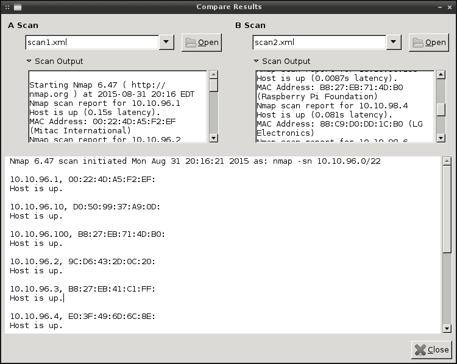

# 十、故障诊断网络问题

没有一个网络是完美的。 无论我们如何规划和实施我们的基础设施，问题都会发生。 要成为一名成功的网络管理员，您需要的最重要的技能是排除故障的能力。 当问题发生时，你理性思考的能力和通过排除过程缩小问题的范围的能力将帮助你度过难关。 当事情变得混乱时，网络管理员当然会感到压力，但是他们享受工作的安全性。 在本章中，我们将解决 Linux 网络中可能出现的一些常见问题的故障排除。 在我们旅程的最后一章，我们将讨论:

*   跟踪路由问题
*   故障排除 DHCP 问题
*   故障排除 DNS 问题
*   使用 netstat 显示连接统计信息
*   使用 nmap 和 Zenmap 扫描您的网络
*   在 Debian 系统上安装丢失的固件
*   排除网络管理器的问题

# 跟踪路由问题

网络的全部目的是将数据从 a 点传送到 b 点。如果由于某些原因，我们无法在需要的地方获得数据，有时就很难准确地指出问题在哪里出现。 但是通过消除过程，确定路由问题在哪里出现应该不会太难。

每当我遇到节点无法与特定服务器或网络通信的问题时，我喜欢从它们的工作站返回交换机堆栈，直到我发现问题。 首先，我检查一些显而易见的东西，比如 IP 地址是什么(或者机器是否有 IP 地址)，然后我还检查路由表。 如果问题是间歇性的，您可能需要测试电缆。 由于某些原因，我遇到过很多由于错误的电缆而导致问题的例子。 我不知道为什么，但我认识的其他管理人员似乎没有这种运气。 但为了以防万一，用电缆测试器检查一下网络电缆也无妨。

假设您已经尝试了简单的内容，接下来您将想要确定是否可以到达默认网关。 如果您知道本地默认网关的 IP 地址，只需 ping 它，看看是否可以到达它，并注意结果。 你的尝试暂停了吗，还是顺利完成了? 如果你不知道网关的 IP 地址，在你的终端模拟器中运行`route -n`来找出答案。 如果您可以通过 IP 访问默认网关，那么请尝试通过主机名以及您最初试图连接的目标节点的 IP 地址访问它。 如果您能够通过 IP 而不是其主机名访问资源，这很可能是 DNS 问题。 我们将在本章后面讨论 DNS 故障排除。 但是现在，决定你是否可以到达你的 DNS 服务器和/或网关将是很好的第一步。 如果你做不到，你可能有一个资源被占用了，一群愤怒的同事在你的办公桌前等着你。

如果问题是间歇性的，我们可以通过询问本地机器来进行故障排除。 `ip address show`命令将为我们提供关于本机 IP 地址的一些详细信息。 实际上，我们可以将这个命令缩写为`ip addr show`，或者如果您真的不喜欢输入，可以进一步简化为`ip a`。 下面是一个示例系统中`ip addr show`的输出:


调查本地机器上的 IP 地址

在本书的这一点上，对于`ip a`的输出不应该有任何太令人惊讶的事情。 但是，我的机器输出的结果可能与您在野外看到的结果不同，因此值得一试。 首先，您可以看到我用于测试的 Debian 机器上有五个网络接口。 第一个是本地环回适配器`lo`; 第二个是`eth0`。 由于这台机器目前使用的是 Wi-Fi，所以`eth0`没有 IP 地址也就不足为奇了。 下一个接口`wlan0`的 IP 地址为`192.168.1.106`。 最后两个接口是唯一的; 它们作为 Docker 和 KVM 虚拟化的桥梁，能够执行它们自己的网络。 尽管码头工人和 KVM 不是这本书的范围内,我把他们做他们自己的网络之一,因为当这些服务安装,您可能会看到您的 Linux 桌面环境报告,你连接到网络,即使技术上你不是。 在我的机器上，如果我断开`wlan0`，它仍然会显示我是连接的。 这是因为大多数图形化发行版附带的 Network Manager GUI 版本在报告与连接有关的准确状态方面做得很糟糕，这可能会混淆情况。

现在您已经确定了机器有一个 IP 地址，可以采取的另一个步骤是使用`traceroute`命令。 那些使用过 Windows 的人，可能已经熟悉这个概念，因为 Windows 实用程序`tracert`的工作方式基本相同。 当您设置 Linux 发行版时，`traceroute`实用程序并不总是默认安装的，因此您可能需要安装`traceroute`包。 从这里开始，您应该能够使用`traceroute`以及资源的主机名或 IP 来查看进程从哪里退出。 如果问题是您的工作站无法访问公共 Internet，您也可以对网站的 URL 使用`traceroute`。 下面的截图显示了`traceroute`和`google.com`的对比:


运行 traceroute 来解决访问公共 Internet 的问题

在前面的截图中，我运行了`traceroute`到[www.google.com](http://www.google.com)。 从输出中，我们可以马上看出几件事。 首先，我们可以看到我们的命令试图到达的第一个`hop`是 IP 地址为`192.168.1.1`的名为`m0n0wall.local`的设备。 如果我运行`route -n`，我看到这是我当前使用的网络的默认网关。 `m0n0wall`是 FreeBSD 的防火墙发行版，它在这个网络上使用。 我在运行该命令时发现了这一点。 接下来，我们可以看到，我们通过`m0n0wall`设备到达了`172.21.0.1`和`198.111.175.120`的另一个专用网络，但是当我的请求到达`198.108.22.150`时，输出停止。 在那之后，我们只看到星号，但我们不会超越它。 假设我的机器无法访问 Internet，我可能想要调查位于`198.108.22.150`的设备，并找出为什么它不允许我的流量通过。 但是，在我的例子中，这个设备正在丢弃 ICMP 包，这将导致`traceroute`命令本身失败。

在排除路由问题时，一定要检查路由表。 我们在[第八章](08.html "Chapter 8. Understanding Advanced Networking Concepts")、*理解高级网络概念*中介绍了路由，并介绍了路由表和添加路由。 但是作为复习，您可以使用`route -n`将路由表打印到 shell 上。 如果正在进行故障排除的机器没有到它需要访问的网络的路由，那么根本原因很容易看出。 然后，您需要添加一个默认网关，以允许机器到达该网络。


查看本地路由表信息

# 处理 DHCP 问题

如果由于的原因，您的机器拒绝获取 IP 地址，那么这一节就是为您准备的。 DHCP 问题并不常见，值得庆幸的是，解决它并不太难。

我在 DHCP 服务器上看到的最常见的问题之一是服务器或客户端的日期和时间错误。 在 Linux 世界中，NTP 是至关重要的，并且应该一直工作。 在 DHCP 的情况下，它只在服务超时之前等待一个 IP 地址的请求。 如果时钟关闭了一个小时，而传入请求的时间戳是一小时前的，那么服务器和客户端将不会收到一个地址。 始终确保 NTP 在您的所有客户机和服务器上工作。 DHCP 并不是唯一一个两端时间都不正确的服务。 这种情况下会发生很多奇怪的事情。

失败的一个原因是缺少可用的 IP 地址。 这可能听起来很明显，但你会惊讶于这种情况发生的频率有多高。 即使是一个由`254`可用 IP 地址组成的`/24`网络现在也会迅速饱和，因为现在从移动设备到冰箱(是的，冰箱)的所有东西都想要声明一个 IP 地址。 一般人在没有注意到的情况下使用三个 IP 地址是很常见的。 如果您将 DHCP 租期设置为超过一天的时间，那么这样的问题就会变得越来越烦人。 在大多数情况下，24 小时的租赁时间对大多数网络来说是足够的。 需要访问的设备将在时间到来时续签租约，而临时设备将不会尝试续签他们被颁发的 IP，这将导致它返回池。

我希望我有一个神奇的命令，你可以运行，给你一个打印输出，你有多少 IP 地址可用。 不幸的是，除了可能构造一个笨重的 Bash 或 Python 脚本之外，我从未能够找到一个。 当遇到 DHCP 问题时，最好的方法是查看日志文件，并让客户端再次尝试连接。


工作中的 DHCP 服务器的输出信息

在 Debian 中，您可以通过运行`cat /var/log/syslog |grep dhcp`来调查与 DHCP 服务器相关的消息。 在 CentOS 上，您可以使用`journalctl -u dhcpd`查看这些消息。 更好的方法是在客户机尝试连接时实时跟踪这些日志，这样您就可以看到输出。 要做到这一点，可以使用 Debian 中的`tail -f /var/log/syslog`或 CentOS 中的`journalctl -f -u dhcpd`。 来自 DHCP 服务器的错误应该很容易跟踪，因为服务器通常是特定的，它正在做什么。 您可能会看到它向客户端提供地址，或者抱怨没有足够的可用 IP 地址。 如果您看到服务器提供一个 IP 地址给客户端，但客户端似乎没有完成连接，那么一定要检查客户端上的 NTP 服务器。

# DNS 故障处理

DNS 问题通常很少出现，除非是无效配置的情况。 在大多数情况下，任何故障排除都是在本地 DNS 服务器上完成的，因为 Internet 上的公共 DNS 服务器不在您的控制范围之内。 在外部 DNS 服务器失败的情况下，例如来自 ISP 的 DNS 服务器，您惟一的办法可能是使用不同的 DNS 提供商，例如利用谷歌的公共 DNS 地址`8.8.8.8`和`8.8.4.4`。 但在本地 DNS 服务器失败的情况下，您有更多的控制权。

与往常一样，您将通过检查是否能够访问 DNS 服务器来开始排除 DNS 问题。 首先，检查`/etc/resolv.conf`，看看您的机器正在使用哪个 DNS 服务器。 它是正确的服务器吗? 如果不是，请在网络脚本中更正此错误并重新启动网络。 如果它是正确的服务器，你能到达它吗? 尝试一个简单的 ping，只要将服务器配置为响应 ICMP echo 请求，您应该会看到响应。 如果可以访问服务器，请通过 SSH 进入服务器并检查其日志。 也许守护进程(Debian 中的`bind`和 CentOS 中的`named`)没有运行。

除了简单的事情，我们还可以使用一个特定的实用程序来帮助解决绑定特定的问题，这个实用程序就是`nslookup`。 将`nslookup`命令与要查找的资源的名称一起使用，例如主机名或网站的 URL。


工作中的 DHCP 服务器的输出信息

`nslookup`的输出告诉我们一些有用的东西，可以用来进一步排除故障。 首先，它将提供响应我们请求的服务器的 IP 地址。 在我的例子中，`10.10.96.1`通过端口 53 应答。 然后，我可以看到我对`packtpub.com`的查询结果，它给我一个外部 IP 地址`83.166.169.231`。 到目前为止，一切顺利。 如果您的 DNS 服务器是可达的，守护进程正在运行，并且您的本地工作站被配置为指向它，一个非常常见的问题是您的域记录中的序列号。 如果您已经向 DNS 服务器添加了资源，但忘记增加序列号，即使您为该主机添加了配置，也可能导致查找失败。 这似乎是常识，但你会惊讶于它是多么容易忘记。

在`nslookup`没有返回记录的事件中，检查是否已经将该记录添加到服务器。 如果它确实响应了一个记录，那么只要您配置了本地工作站来指向正确的服务器，那么一切都应该运行得很顺利。

# 使用 netstat 显示连接统计信息

`netstat`命令是一个有用的实用工具，它允许您查看有关当前连接的一些统计信息。 我们在上一章略微谈到了这一点。 这个命令允许您显示有用的网络信息，比如显示正在监听网卡上的连接的服务，以及打印路由表等。

在上一章中，我给出了`netstat -tulpn`的例子，让您可以查看当前连接和侦听的服务。 该命令显示正在侦听的所有内容，以及正在侦听的端口。 我们将这个命令分解，并传递一些参数。 第一个，`-t`，表示我们想要查看与 TCP 有关的信息，`-u`表示 UDP，`-l`请求侦听套接字，`-p`试图显示程序的名称，`-n`还显示数值。 综上所述，我们得到`netstat -tulpn`。 在业内，这是我见过的`netstat`最常见的用法。

`netstat`的其他用法包括显示您的路由表(`netstat -r`)，它将提供与`route -n`相似的输出。 使用`netstat -s`查看连接统计信息。 最后，您还可以使用`netstat -i`查看系统上的网络接口列表。 不过，在大多数情况下，您最常使用这个命令将网络信息打印到终端，在尝试排除问题或锁定节点时，可以使用该命令进行进一步分析。

# 使用 Nmap 和 Zenmap 扫描您的网络

`nmap`实用程序是一个网络扫描仪，它可以为提供大量关于网络资源的信息。 您所要做的就是安装`nmap`包。 一旦在您的工具库中有了这个实用程序，您就可以在您的网络上做一些非常整洁的事情。 在大多数情况下，`nmap`用于询问系统和提取信息。 虽然`nmap`本身不能解决任何实际问题，但它可以帮助您发现可以使用的信息，以便了解您的网络在任何给定时间发生的情况。

它也需要非常小心地使用，因为`nmap`能够披露关于一个可能是私人的网络的信息，除非您有明确的许可使用它，否则您应该谨慎行事。 由于`nmap`可以用于黑客攻击，如果网络管理员(如果那个人不是您)在网络上看到这种类型的活动，这无疑是一个危险信号。 但在现实场景中，`nmap`可以真正起到拯救生命的作用。 根据我的经验，我发现它在追踪和询问网络上承载恶意软件的机器时非常有用，奇怪的是，这些机器似乎总是运行 Windows(去想吧)。 如果漏洞报告只显示了受感染机器的 IP 地址，那么可能很难跟踪这是谁的机器。 但是，使用`nmap`，我可以找到一些东西，比如该主机上运行的是哪个操作系统、机器的主机名(甚至可能包括用户名)，以及该机器网卡的 MAC 地址。

`nmap`有很多用法，但我将从一些我最喜欢的开始。 首先，正如我刚才提到的，您可以使用`nmap`来尝试确定特定主机正在使用的操作系统。 这将允许您进一步调优命令，以特定地针对机器，因为您调查节点的方式会根据它们运行的操作系统而有所不同。 要使用`nmap`尝试查找此信息，请将其与`-O`参数和主机的 IP 地址一起使用。 基本上，执行以下命令:

```sh
nmap -O 10.10.98.124

```

`nmap`的另一个有用的用例是扫描整个子网以确定连接的主机。 如果你试图看到哪些 IP 地址是空闲的，这是一种方法(假设没有节点有任何防火墙阻止扫描):

```sh
nmap -sP 10.10.96.0/22

```

在前面的例子中，如果希望某个特定的 IP 地址不被扫描或包含，我们也可以使用`--exclude`选项:

```sh
nmap -sP 10.10.96.0/22 --exclude 10.10.98.223

```

如果一台机器在防火墙后面，我们可以尝试扫描它:

```sh
nmap -PN 10.10.98.104

```

如果我们还没有足够的实用程序来显示本地机器的路由和接口信息，`nmap`也可以做到这一点:

```sh
nmap --iflist

```

除了在终端中使用`nmap`命令之外，还有 Z**enmap**命令，它或多或少相当于 GUI。 使用它，我们可以做与`nmap`几乎相同的事情，但除此之外，它允许您保存您的扫描，打开先前保存的扫描，比较两个保存的扫描之间的结果，甚至保存命令配置文件以供以后使用。 如果您发现自己在通常的基础上使用`nmap`，那么从 Zenmap 添加的特性中获益可能对您很有用。


扫描本地网络的 Zenmap

从开始测试 Zenmap 的一个简单方法是使用我在本章中给出的例子进行尝试。 您应该能够将这些命令中的任何一个粘贴到窗口顶部的第三个文本框中，该文本框为**Command**。 从这里点击**Scan**开始扫描。 一旦完成，您可以通过点击**扫描**，然后**保存扫描**来保存结果。 正如前面提到的，您还可以相互比较扫描结果。 如果您想知道哪些新设备已添加到您的网络中，那么这将非常有用。 您可以在某一天运行子网扫描(使用前面给出的`nmap -sP 10.10.98.0/24`示例)，然后在第二天再次运行扫描。 如果您每次保存结果，您可以比较它们，然后立即确定是否有新设备添加到您的网络。 无论如何，这是一个定期执行的好习惯(特别是如果你是被指定审批新设备的人)，以确定是否有任何流氓或未经授权的设备存在。



在 Zenmap 中比较网络扫描

在使用`nmap`和 Zenmap 之间做出选择只是一个偏好问题。 Zenmap 的特性非常好，但它提供的唯一功能就是易于使用。 例如，在`nmap`中，您可以自己简单地将结果管道到一个文本文件中，然后您可以针对两个输出文件的结果运行`diff`命令，而无需使用 GUI 应用来执行此任务。

```sh
nmap -sP 10.10.98.0/24 > scan1.txt
nmap -sP 10.10.98.0/24 > scan2.txt
diff scan1.txt scan2.txt

```

在一个典型的网络管理员的桌面上，您将使用 Linux 或 Windows 安装和图形化用户界面; 在这种情况下，Zenmap可能非常适合添加到您的工具集中。

# 在 Debian 系统上安装丢失的固件

许多 Linux 的发行版在默认情况下倾向于只包含自由软件和驱动程序，Debian 就属于这一类。 其原因可能是由于道德决定或许可限制，但结果可能是特定的网卡或硬件设备不再正常工作。 通常，这是非常典型的无线卡。 其中一个例子就是英特尔无线网卡。 当涉及到最终用户发行版(Ubuntu、Linux Mint 等)时，这些通常不需要任何修改就可以工作，而企业发行版(如 Debian)通常不包括这些，并强迫您跳过额外的障碍。 原因是这些卡运行所需的软件不是开源的，所以决定不把它包含在默认存储库中。 值得庆幸的是，如果你知道这些步骤，这通常并不太难纠正。

在 Debian 系统上，有一个非自由参数可以添加到您的 APT 源代码中，告诉发行版您希望在搜索和安装软件时包含这样的软件包。 但是在您这样做之前，请确保您确实需要额外的固件。 一个致命的漏洞是，如果 Debian 在启动时抱怨缺少固件。 如果不重新启动，您可能会在日志中看到抱怨硬件设备缺少固件的错误。 要查看系统上可能抱怨缺少固件的任何输出，请尝试以下命令:

```sh
dmesg |grep firmware

```

要在 Debian 中添加 APT 源代码中的非免费组件，首先要备份原始的`sources.list`文件:

```sh
# cp /etc/apt/sources.list /etc/apt/sources.list.bak

```

然后，将非自由参数添加到主存储库中。 在我的 Debian Jessie 系统中，这条线是这样的:

```sh
deb http://ftp.us.debian.org/debian/ jessie main contrib non-free

```

一旦完成，用下面的命令刷新你的源代码:

```sh
# apt-get update

```

从现在开始，您应该可以使用非免费的二进制包。 您可以通过搜索并列出系统上可用的固件包来确认这一点。 输出应该包含几个`nonfree`包。 要执行此搜索，请尝试以下命令:

```sh
aptitude search firmware

```

例如，如果`firmware-linux-nonfree`显示在可用包的列表中，那么您已经正确地执行了这些步骤。

不幸的是，详细列出Debian 硬件兼容性的完整列表以及每种软件所需的固件超出了本书的范围。 然而，日志应该给您一个关于固件丢失了什么的大致概念，允许您搜索包数据库以找到特定的包。 通常，从`dmesg`复制一行关于加载固件失败的输出，然后执行谷歌搜索，就可以找到解决这种情况所需要的包。 在我的例子中，我遇到的最常用的固件包是`firmware-iwlwifi`。 此外，`firmware-atheros`和`firmware-b43-installer`也很常见。

# 网络管理器故障排除

**网络管理器**是Linux 系统中用于管理网络连接的工具。 它包括一个在后台运行的守护进程，以及一个可选的图形实用程序，大多数桌面发行版都包含该实用程序，用于在任何给定时间显示您的连接状态。 无论如何都不需要 Network Manager，但是它简化了网络接口及其配置的管理。 在许多真实的网络中，通常禁用 Network Manager，而使用静态 IP 地址。 到目前为止，我已经多次提到，比起静态 ip，我更喜欢静态租约。 使用静态 IP 时，您没有中心点进行管理，并且需要手动跟踪和更改服务器的 IP 地址。 正是出于这个原因，我建议您继续运行网络管理器。 它将观察连接，激活你的 DHCP 客户端，然后从你的 DHCP 服务器收到一个 IP 地址租约。 如果您已经设置了一个静态租约(预订)，那么在 Network Manager 启动您的连接时，您就已经准备好了。

如果您已经将网络问题排除为网络管理器本身的局部问题，那么您可以做几件事来查明问题。

首先，在 CentOS 系统上，确保您的网络接口配置为在启动时启动。 由于某些原因，我不能理解，CentOS 实际上默认关闭网络接口在安装期间。 除非您在运行安装程序时打开它，否则在启动后默认也将禁用它。 如果该接口没有启用，那么网络管理器将无法管理它。 要纠正这个错误，只需编辑接口的初始化脚本。 你可以在 CentOS 中找到网络接口卡的初始化脚本:`/etc/sysconfig/network-scripts`。 在我的系统上，我在`/etc/sysconfig/network-scripts/ifcfg-enp0s3`找到了接口卡的`init`脚本，不过接口的名称当然会有所不同。

看最后一行，你应该看到`ONBOOT="yes"`。 如果你没有看到，修改这一行，然后重新启动网络:

```sh
# systemctl restart network

```

其次，在 Debian 和 CentOS 系统上，检查以确保 Network Manager 正在运行。 这是在两个发行版中执行某些操作的命令相同的罕见情况之一。 使用下面的命令，我们可以检查 NetworkManager 守护进程的状态:

```sh
# systemctl status NetworkManager

```

虽然故障诊断问题,`systemctl`可以是非常有用的,因为它不仅告诉你服务是否启动,它也给你一把线从日志,可以点你在正确的方向上如果你遇到一个问题。

要完整地阅读 Network Manager 日志，可以使用`journalctl`:

```sh
journalctl -u NetworkManager

```

您还可以使用`-f`标志来跟踪日志，这样就可以在新条目出现时看到它们。 这在诊断为什么机器不能连接到无线网络时特别有用。 当用户试图连接时将出现错误。 下面的示例展示了如何跟踪写入日志的 NetworkManager 输出。

```sh
journalctl -f -u NetworkManager

```

与大多数 systemd 单元一样，我们可以用一个简单的命令重启 Network Manager:

```sh
# systemctl restart NetworkManager

```

前面的命令看起来很简单，但是由于某些原因，我不得不多次重启 Network Manager。 在将机器从一个网络切换到另一个网络时，或者从挂起状态恢复时尤其如此(尽管这些问题主要只出现在终端用户工作站上)。

在大多数情况下，Network Manager 的问题很少出现，并且故障排除相对简单。 使用 systemd 的`journalctl`，我们可以观察 Network Manager 的输出并确定根本原因。 在大多数情况下，问题会归结为网卡配置错误。

# 总结

在本章中，我们介绍了一些在基于 linux 的网络中可能出现的故障排除方法。 虽然不可能详细描述每一件可能出错的事情，但本章可以作为你可能面临的常见问题的起点。 我们首先研究路由问题以及 DHCP 和 DNS 故障排除。 此外，我们还介绍了一些有用的故障诊断工具，如`nmap`，并概述了如何安装在 Debian 中设置网卡时可能需要的固件。 最后，我们介绍了排除网络管理器故障的相关信息。

至此，这本书结束了。 感谢你们和我一起踏上了 Linux 网络管理的旅程。 我希望这本书能引起你的共鸣，帮助你更好地理解。 与 Linux 打交道是我所做过的最好的职业选择，我要感谢我所有的读者和同事，是他们让我有了如此美妙的经历。 对你们所有人，我祝愿你们成功，我希望你们通过 Linux 的旅程能够像我一样受益。