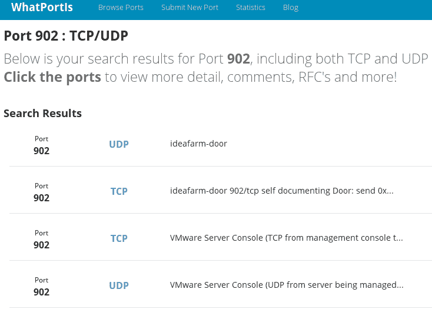
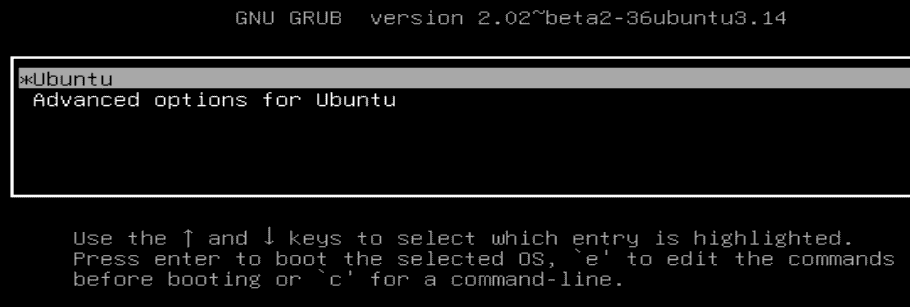
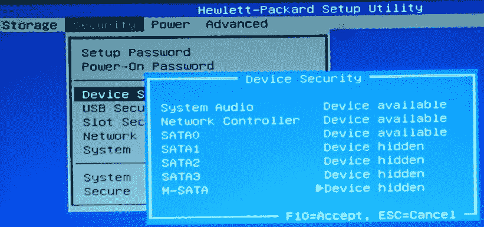
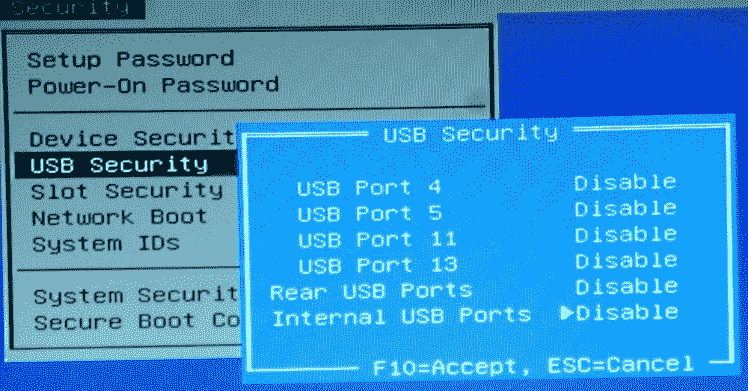
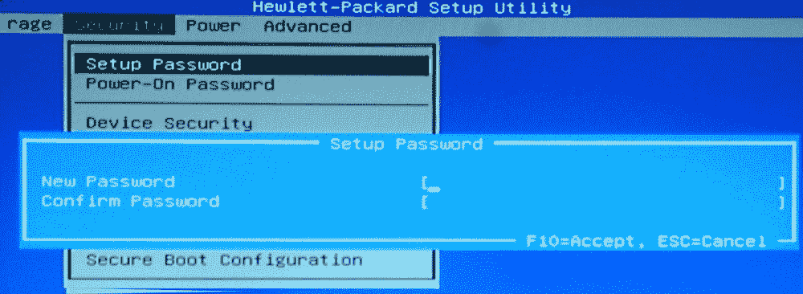
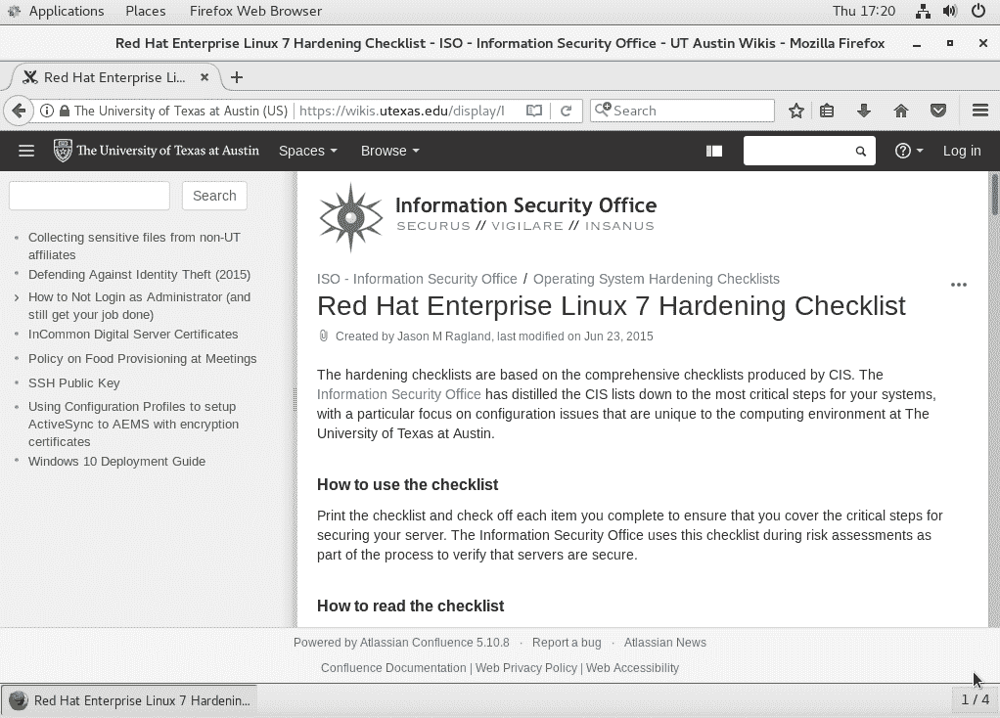

# 忙碌蜜蜂的安全提示和技巧

在这最后一章中，我想总结一些不一定适合前面章节的快速提示和技巧。对于忙碌的管理员来说，这些提示可以节省时间。首先，您将了解一些快速查看哪些系统服务正在运行的方法，以确保没有不需要的东西在运行。然后，我们将了解如何对 GRUB 2 引导加载程序进行密码保护，如何安全地配置 BIOS/UEFI 以帮助防止对物理可访问机器的攻击，以及如何使用核对表来执行安全的初始系统设置。

在本章中，我们将涵盖以下主题:

*   审计系统服务
*   保护 GRUB2 配置的密码
*   安全配置和密码保护 UEFI/BIOS
*   设置系统时使用安全清单

# 技术要求

本章的代码文件可以在这里找到:[https://github . com/packt publishing/Mastering-Linux-Security-and-Harding-第二版](https://github.com/PacktPublishing/Mastering-Linux-Security-and-Hardening-Second-Edition)。

# 审计系统服务

不管我们谈论的是哪种操作系统，服务器管理的一个基本原则是，永远不要在服务器上安装任何不绝对需要的东西。你特别不希望任何不必要的网络服务运行，因为那会给坏人额外的方法进入你的系统。而且，总有可能是某个邪恶的黑客植入了某种充当网络服务的东西，你肯定想知道这一点。在本节中，我们将研究几种不同的方法来审核您的系统，以确保没有不必要的网络服务在其上运行。

# 使用 systemctl 审核系统服务

在 systemd 附带的 Linux 系统上，`systemctl`命令几乎是一个通用命令，可以为您做很多事情。除了控制系统的服务，它还可以向您显示这些服务的状态，如下所示:

```sh
donnie@linux-0ro8:~> sudo systemctl -t service --state=active
```

下面是前面命令的分解:

*   `-t service`:我们想查看系统上服务的信息——或者说，过去被称为守护进程的信息。
*   `--state=active`:这指定我们要查看所有实际运行的系统服务的信息。

该命令的部分输出如下所示:

```sh
UNIT                                                  LOAD   ACTIVE SUB     DESCRIPTION
accounts-daemon.service                               loaded active running Accounts Service
after-local.service                                   loaded active exited  /etc/init.d/after.local Compatibility
alsa-restore.service                                  loaded active exited  Save/Restore Sound Card State
apparmor.service                                      loaded active exited  Load AppArmor profiles
auditd.service                                        loaded active running Security Auditing Service
avahi-daemon.service                                  loaded active running Avahi mDNS/DNS-SD Stack
cron.service                                          loaded active running Command Scheduler
. . .
. . .

```

一般来说，你不会想看到这么多信息，尽管你有时可能会。此命令显示系统上运行的每个服务的状态。我们现在真正感兴趣的是允许某人连接到您的系统的网络服务。那么，让我们看看如何缩小范围。

# 使用 netstat 审核网络服务

以下是您希望跟踪系统上运行的网络服务的两个原因:

*   确保没有您不需要的合法网络服务正在运行
*   为了确保您没有任何恶意软件正在监听其主机的网络连接

`netstat`命令既方便又好用。首先，假设您希望看到正在侦听的网络服务列表，等待有人连接到它们(由于格式限制，我只能在此显示部分输出。我们将看一些我不能马上展示的台词。另外，您可以从 Packt 出版网站下载完整输出的文本文件):

```sh
donnie@linux-0ro8:~> netstat -lp -A inet
(Not all processes could be identified, non-owned process info
 will not be shown, you would have to be root to see it all.)
Active Internet connections (only servers)
Proto Recv-Q Send-Q Local Address Foreign Address State PID/Program name
tcp 0 0 *:ideafarm-door *:* LISTEN -
tcp 0 0 localhost:40432 *:* LISTEN 3296/SpiderOakONE
tcp 0 0 *:ssh *:* LISTEN -
tcp 0 0 localhost:ipp *:* LISTEN -
tcp 0 0 localhost:smtp *:* LISTEN -
tcp 0 0 *:db-lsp *:* LISTEN 3246/dropbox
tcp 0 0 *:37468 *:* LISTEN 3296/SpiderOakONE
tcp 0 0 localhost:17600 *:* LISTEN 3246/dropbox
. . .
. . . 
```

细分如下:

*   `-lp`:`l`表示我们想看哪些网络端口在监听。换句话说，我们希望看到哪些网络端口正在等待有人连接到它们。`p`表示我们想看到在每个端口监听的程序或服务的名称和进程标识号。
*   `-A inet`:这意味着我们只希望看到属于`inet`家族成员的网络协议的信息。换句话说，我们想看到关于`raw`、`tcp`和`udp`网络套接字的信息，但是我们不想看到任何关于只处理操作系统内进程间通信的 Unix 套接字的信息。

由于这个输出来自于我目前正在使用的 openSUSE 工作站，所以您在这里看不到任何常见的服务器类型的服务。但是，您将看到一些您可能不希望在服务器上看到的东西。例如，让我们看看第一项:

```sh
Proto Recv-Q Send-Q Local Address      Foreign Address         State       PID/Program name
tcp        0      0 *:ideafarm-door    *:*                     LISTEN      -
```

`Local Address`列指定该监听套接字的本地地址和端口。星号表示该套接字在本地网络上，而`ideafarm-door`是正在侦听的网络端口的名称。(默认情况下，`netstat`将尽可能通过从`/etc/services`文件中提取端口信息来显示端口名称。)

现在因为不知道`ideafarm-door`服务是什么，就用我最喜欢的搜索引擎找了出来。通过将术语`ideafarm-door`插入 DuckDuckGo，我找到了答案:



顶部的搜索结果把我带到了一个名为 WhatPortIs 的网站。据此，`ideafarm-door`实际上是端口`902`，属于 VMware Server Console。好吧，这是有道理的，因为我确实在这台机器上安装了 VMware Player。所以，这都很好。

You can check out the WhatPortIs site here: [http://whatportis.com/](http://whatportis.com/).

名单上的下一个是:

```sh
tcp        0      0 localhost:40432    *:*       LISTEN      3296/SpiderOakONE
```

此项显示本地地址为`localhost`，监听端口为端口`40432`。这一次，`PID/Program Name`专栏实际上告诉了我们这是什么。`SpiderOak ONE`是一种基于云的备份服务，您可能希望也可能不希望看到它在您的服务器上运行。

现在，让我们再看几个项目:

```sh
tcp 0      0 *:db-lsp                   *:*      LISTEN      3246/dropbox
tcp 0      0 *:37468                    *:*      LISTEN      3296/SpiderOakONE
tcp 0      0 localhost:17600            *:*      LISTEN      3246/dropbox
tcp 0      0 localhost:17603            *:*      LISTEN      3246/dropbox
```

在这里，我们可以看到`dropbox`和`SpiderOakONE`都是用星号列出的本地地址。所以，他们都使用本地网络地址。`dropbox`的端口名为`db-lsp`，代表 Dropbox 局域网同步协议。`SpiderOakONE`港没有正式名称，所以只列为`37468`港。下面两行显示`dropbox`也使用本地机器的地址，在端口`17600`和`17603`上。

到目前为止，我们只看到了 TCP 网络套接字。让我们看看它们与 UDP 套接字有何不同:

```sh
udp        0      0 192.168.204.1:ntp       *:*                                 -
udp        0      0 172.16.249.1:ntp        *:*                                 -
udp        0      0 linux-0ro8:ntp          *:*                                 -
```

首先要注意的是`State`栏下什么都没有。那是因为，有了 UDP，就没有状态了。他们实际上正在监听数据包的进入，并准备好发送数据包。但是由于这是 UDP 套接字能做的所有事情，所以为它们定义不同的状态真的没有意义。

在前两行中，我们可以看到一些奇怪的本地地址。那是因为我在这个工作站上同时安装了 VMware Player 和 VirtualBox。这两个套接字的本地地址用于 VMware 和 VirtualBox 虚拟网络适配器。最后一行显示我的 OpenSUSE 工作站的主机名作为本地地址。在这三种情况下，端口都是网络时间协议端口，用于时间同步。

现在，让我们看看最后一组 UDP 项目:

```sh
udp        0      0 *:58102         *:*                                 5598/chromium --pas
udp        0      0 *:db-lsp-disc   *:*                                 3246/dropbox
udp        0      0 *:43782         *:*                                 5598/chromium --pas
udp        0      0 *:36764         *:*                                 

udp        0      0 *:21327         *:*                                 3296/SpiderOakONE
udp        0      0 *:mdns          *:*                                 5598/chromium --pas
```

在这里，我们可以看到我的 Chromium 网络浏览器已经准备好接受几个不同端口上的网络数据包。我们还可以看到 Dropbox 使用 UDP 来接受来自安装了 Dropbox 的其他本地机器的发现请求。我假设端口`21327`为 SpiderOak ONE 执行相同的功能。

当然，由于这台机器是我的老黄牛工作站，Dropbox 和 SpiderOak ONE 对我来说几乎是不可或缺的。我自己安装的，所以我一直知道它们在那里。但是，如果您在服务器上看到类似这样的情况，您需要调查一下服务器管理员是否知道安装了这些程序，然后找出安装它们的原因。可能是他们在执行合法的功能，也可能不是。

A difference between Dropbox and SpiderOak ONE is that with Dropbox, your files don't get encrypted until they've been uploaded to the Dropbox servers. So, the Dropbox folk have the encryption keys to your files. On the other hand, SpiderOak ONE encrypts your files on your local machine, and the encryption keys never leave your possession. So, if you really do need a cloud-based backup service and you're dealing with sensitive files, something such as SpiderOak ONE would definitely be better than Dropbox. (And no, the SpiderOak ONE folk aren't paying me to say that.)

如果您想查看端口号和 IP 地址而不是网络名称，请添加`n`选项。和以前一样，这里是部分输出:

```sh
donnie@linux-0ro8:~> netstat -lpn -A inet
(Not all processes could be identified, non-owned process info
 will not be shown, you would have to be root to see it all.)
Active Internet connections (only servers)
Proto Recv-Q Send-Q Local Address      Foreign Address     State       PID/Program name
tcp        0      0 0.0.0.0:902        0.0.0.0:*           LISTEN      -
tcp        0      0 127.0.0.1:40432    0.0.0.0:*           LISTEN      3296/SpiderOakONE
tcp        0      0 0.0.0.0:22         0.0.0.0:*           LISTEN      -
tcp        0      0 127.0.0.1:631      0.0.0.0:*           LISTEN      -
tcp        0      0 127.0.0.1:25       0.0.0.0:*           LISTEN      -
tcp        0      0 0.0.0.0:17500      0.0.0.0:*           LISTEN      3246/dropbox
tcp        0      0 0.0.0.0:37468      0.0.0.0:*           LISTEN      3296/SpiderOakONE
tcp        0      0 127.0.0.1:17600    0.0.0.0:*           LISTEN      3246/dropbox
. . .
. . . 
```

要查看已建立的 TCP 连接，只需省略`l`选项。在我的工作站上，这是一个很长的列表，所以我将只显示几个项目:

```sh
donnie@linux-0ro8:~> netstat -p -A inet
(Not all processes could be identified, non-owned process info
 will not be shown, you would have to be root to see it all.)
Active Internet connections (w/o servers)
Proto Recv-Q Send-Q Local Address      Foreign Address         State       PID/Program name
tcp        1      0 linux-0ro8:41670   ec2-54-88-208-223:https CLOSE_WAIT  3246/dropbox
tcp        0      0 linux-0ro8:59810   74-126-144-106.wa:https ESTABLISHED 3296/SpiderOakONE
tcp        0      0 linux-0ro8:58712   74-126-144-105.wa:https ESTABLISHED 3296/SpiderOakONE
tcp        0      0 linux-0ro8:caerpc  atl14s78-in-f2.1e:https ESTABLISHED 10098/firefox
. . .
. . .
```

`Foreign Address`列显示连接远端机器的地址和端口号。第一项显示与 Dropbox 服务器的连接处于`CLOSE_WAIT`状态。这意味着 Dropbox 服务器已经关闭了连接，我们现在正在等待本地机器关闭套接字。

因为那些国外地址的名字没有太大的意义，让我们添加`n`选项来查看 IP 地址:

```sh
donnie@linux-0ro8:~> netstat -np -A inet
(Not all processes could be identified, non-owned process info
 will not be shown, you would have to be root to see it all.)
Active Internet connections (w/o servers)
Proto Recv-Q Send-Q Local Address         Foreign Address      State        PID/Program name
tcp        0      1 192.168.0.222:59594   37.187.24.170:443    SYN_SENT     10098/firefox
tcp        0      0 192.168.0.222:59810   74.126.144.106:443   ESTABLISHED  3296/SpiderOakONE
tcp        0      0 192.168.0.222:58712   74.126.144.105:443   ESTABLISHED  3296/SpiderOakONE
tcp        0      0 192.168.0.222:38606   34.240.121.144:443   ESTABLISHED  10098/firefox
. . .
. . .
```

这一次，我们可以看到一些新的东西。第一项显示了火狐连接的`SYN_SENT`状态。这意味着本地机器正试图建立到外部 IP 地址的连接。同样，在`Local Address`下，我们可以看到我的 openSUSE 工作站的静态 IP 地址。

如果我有空间在这里显示整个`netstat`输出，你只会在`Proto`栏下看到`tcp`。这是因为 UDP 协议不像 TCP 协议那样建立连接。

Something to keep in mind is that rootkits can replace legitimate Linux utilities with their own trojaned versions. For example, a rootkit could have its own trojaned version of `netstat` that would show all network processes except for those that are associated with the rootkit. That's why you want something such as Rootkit Hunter in your toolbox.

如果您需要更多关于`netstat`的信息，请参见`netstat`手册页。

# 动手实验–使用 netstat 查看网络服务

在本实验中，您将练习刚刚学到的`netstat`。在有桌面界面的虚拟机上这样做，这样你就可以使用火狐访问网站。请遵循以下步骤:

1.  查看正在侦听连接的网络服务列表:

```sh
netstat -lp -A inet
netstat -lpn -A inet
```

2.  查看已建立连接的列表:

```sh
netstat -p -A inet
netstat -pn -A inet
```

3.  打开 Firefox 并导航到任何网站。然后，重复*步骤 2* 。
4.  从您的主机，通过 SSH 登录到虚拟机。然后，重复*步骤 2* 。

您已经到达了实验室的终点–祝贺您！

您刚刚看到了如何使用`netstat`审核网络服务。现在，让我们学习如何使用 Nmap 实现这一点。

# 使用 Nmap 审核网络服务

`netstat`工具非常好，它可以给你很多关于你的网络服务的好信息。稍微不利的一面是，您必须登录到网络上的每台主机才能使用它。

如果您想远程审计您的网络，查看每台计算机上运行的服务，而不必登录每台计算机，那么您需要一个工具，如 Nmap。它适用于所有主要的操作系统，所以即使你不得不在工作站上使用 Windows，你也是幸运的。如果你正在使用的话，Kali Linux 内置了一个最新版本。它也存在于每个主要 Linux 发行版的存储库中，但是 Linux 存储库中的版本通常很旧。所以，如果你用的不是 Kali，你最好的选择就是从它的创建者网站下载 Nmap。

You can download Nmap for all of the major operating systems from [https://nmap.org/download.html](https://nmap.org/download.html).

在所有情况下，您还会找到安装说明。

您将在所有操作系统上以相同的方式使用 Nmap，只有一个例外。在 Linux 和 macOS 机器上，你会在某些 Nmap 命令前加上`sudo`，而在 Windows 机器上，你不会。(尽管在 Windows 10 上，您可能必须以管理员身份打开 command.exe 终端。)由于我刚好在我值得信赖的 openSUSE 工作站上工作，我将向您展示它在 Linux 上是如何工作的。让我们从进行 SYN 数据包扫描开始:

```sh
donnie@linux-0ro8:~> sudo nmap -sS 192.168.0.37

Starting Nmap 6.47 ( http://nmap.org ) at 2017-12-24 19:32 EST
Nmap scan report for 192.168.0.37
Host is up (0.00016s latency).
Not shown: 996 closed ports
PORT STATE SERVICE
22/tcp open ssh
515/tcp open printer
631/tcp open ipp
5900/tcp open vnc
MAC Address: 00:0A:95:8B:E0:C0 (Apple)

Nmap done: 1 IP address (1 host up) scanned in 57.41 seconds
donnie@linux-0ro8:~>
```

细分如下:

*   `-sS`:小写的`s`表示我们要执行的扫描类型。大写的`S`表示我们正在进行同步数据包扫描。(稍后详细介绍。)
*   `192.168.0.37`:这种情况下，我只是扫描单台机器。但是，我也可以扫描一组机器或整个网络。
*   `Not shown: 996 closed ports`:它显示的是所有这些关闭的端口而不是`filtered`端口，这个事实告诉我这台机器上没有防火墙。(一会儿会有更多内容。)

接下来，我们可以看到打开的端口列表。(稍后详细介绍。)

这台机器的媒体访问控制地址表明它是某种苹果产品。稍后，我将向您展示如何获得更多关于它可能是哪种苹果产品的详细信息。

现在，让我们更详细地看看这个。

# 港口国

Nmap 扫描将显示目标计算机处于三种状态之一的端口:

*   `filtered`:这表示端口被防火墙封锁了。
*   `open`:这意味着该端口没有被防火墙阻止，并且与该端口相关联的服务正在运行。
*   `closed`:这意味着该端口没有被防火墙阻止，并且与该端口相关联的服务没有运行。

因此，在我们对苹果机器的扫描中，我们可以看到安全外壳服务已经准备好接受端口`22`上的连接，打印服务已经准备好接受端口`515`和`631`上的连接，并且**虚拟网络计算** ( **VNC** )服务已经准备好接受端口`5900`上的连接。所有这些端口都会引起具有安全意识的管理员的兴趣。如果安全外壳正在运行，了解它的配置是否安全会很有趣。打印服务正在运行的事实意味着这将使用**互联网打印协议** ( **IPP** )。知道我们为什么使用 IPP 而不仅仅是常规的网络打印会很有意思，知道这个版本的 IPP 是否有任何安全问题也会很有意思。当然，我们已经知道 VNC 不是一个安全的协议，所以我们想知道它为什么运行。我们还看到没有端口被列为`filtered`，所以我们也想知道为什么这台机器上没有防火墙。

我最后要透露的一个小秘密是，这台机器和我在 OpenVAS 扫描演示中使用的是同一台机器。所以，我们已经有了一些需要的信息。OpenVAS 扫描告诉我们，这台机器上的 Secure Shell 使用了弱加密算法，打印服务存在安全漏洞。稍后，我将向您展示如何使用 Nmap 获取一些信息。

# 扫描类型

有许多不同的扫描选项，每个选项都有自己的用途。我们在这里使用的 SYN 数据包扫描被认为是一种隐蔽的扫描类型，因为它比某些其他类型的扫描产生更少的网络流量和更少的系统日志条目。通过这种类型的扫描，Nmap 向目标机器上的一个端口发送一个 SYN 数据包，就好像它试图创建一个到该机器的 TCP 连接。如果目标机器以 SYN/ACK 数据包响应，则意味着端口处于`open`状态，准备创建 TCP 连接。如果目标机器响应 RST 数据包，则意味着端口处于`closed`状态。如果完全没有反应，就说明端口是`filtered`，被防火墙封锁了。作为一名普通的 Linux 管理员，这是您通常会做的扫描类型之一。

`-sS`扫描显示的是 TCP 端口的状态，但没有显示 UDP 端口的状态。要查看 UDP 端口，请使用`-sU`选项:

```sh
donnie@linux-0ro8:~> sudo nmap -sU 192.168.0.37

Starting Nmap 6.47 ( http://nmap.org ) at 2017-12-28 12:41 EST
Nmap scan report for 192.168.0.37
Host is up (0.00018s latency).
Not shown: 996 closed ports
PORT     STATE         SERVICE
123/udp  open          ntp
631/udp  open|filtered ipp
3283/udp open|filtered netassistant
5353/udp open          zeroconf
MAC Address: 00:0A:95:8B:E0:C0 (Apple)

Nmap done: 1 IP address (1 host up) scanned in 119.91 seconds
donnie@linux-0ro8:~>
```

在这里，你可以看到一些有点不同的东西:两个端口被列为`open|filtered`。这是因为，由于 UDP 端口对 Nmap 扫描的响应方式，Nmap 不能总是分辨一个 UDP 端口是`open`还是`filtered`。在这种情况下，我们知道这两个端口可能是开放的，因为我们已经看到它们对应的 TCP 端口是开放的。

确认包扫描也很有用，但不能查看目标机器的网络服务状态。相反，当您需要查看您和目标机器之间是否有防火墙阻挡时，这是一个很好的选择。确认扫描命令如下所示:

```sh
sudo nmap -sA 192.168.0.37
```

你不局限于一次只扫描一台机器。您可以一次扫描一组计算机或整个子网:

```sh
sudo nmap -sS 192.168.0.1-128
sudo nmap -sS 192.168.0.0/24
```

The first command scans only the first 128 hosts on this network segment. The second command scans all 254 hosts on a subnet that's using a 24-bit netmask.

当您只需要查看网络上的设备时，发现扫描非常有用:

```sh
sudo nmap -sn 192.168.0.0/24
```

通过`-sn`选项，Nmap 将检测您是在扫描本地子网还是远程子网。如果子网是本地的，Nmap 将发出**地址解析协议** ( **ARP** )广播，请求子网中每台设备的 IPv4 地址。这是发现设备的可靠方法，因为 ARP 不会被设备的防火墙阻止。(我的意思是，如果没有 ARP，网络将停止运行。)但是，ARP 广播不能通过路由器，这意味着您不能使用 ARP 来发现远程子网中的主机。因此，如果 Nmap 检测到您正在远程子网进行发现扫描，它将发送 ping 数据包，而不是 ARP 广播。使用 ping 数据包进行发现不如使用 ARP 可靠，因为一些网络设备可以配置为忽略 ping 数据包。总之，这里有一个来自我自己家庭网络的例子:

```sh
donnie@linux-0ro8:~> sudo nmap -sn 192.168.0.0/24

Starting Nmap 6.47 ( http://nmap.org ) at 2017-12-25 14:48 EST
Nmap scan report for 192.168.0.1
Host is up (0.00043s latency).
MAC Address: 00:18:01:02:3A:57 (Actiontec Electronics)
Nmap scan report for 192.168.0.3
Host is up (0.0044s latency).
MAC Address: 44:E4:D9:34:34:80 (Cisco Systems)
Nmap scan report for 192.168.0.5
Host is up (0.00026s latency).
MAC Address: 1C:1B:0D:0A:2A:76 (Unknown)
. . .
. . .
```

在这个片段中，我们可以看到三个主机，每个主机有三行输出。第一行显示 IP 地址，第二行显示主机是否启动，第三行显示主机网络适配器的 MAC 地址。每个媒体访问控制地址中的前三对字符表示该网络适配器的制造商。(郑重声明，该未知网络适配器位于最新型号的千兆位主板上。我不知道为什么它不在 Nmap 数据库里。)

我们将看到的最后一次扫描为我们做了四件事:

*   它标识`open`、`closed`和`filtered` TCP 端口。
*   它标识正在运行的服务的版本。
*   它运行 Nmap 附带的一组漏洞扫描脚本。
*   它试图识别目标主机的操作系统。

执行所有这些操作的扫描命令如下所示:

```sh
sudo nmap -A 192.168.0.37
```

我想你可以把`-A`选项想象成全部选项，因为它真的做到了全部。(嗯，几乎所有，因为它不扫描 UDP 端口。)首先，下面是我运行进行扫描的命令:

```sh
donnie@linux-0ro8:~> sudo nmap -A 192.168.0.37
```

以下是结果，为便于格式化，将结果分成几个部分:

```sh
Starting Nmap 6.47 ( http://nmap.org ) at 2017-12-24 19:33 EST
Nmap scan report for 192.168.0.37
Host is up (0.00016s latency).
Not shown: 996 closed ports
```

马上，我们可以看到这台机器上没有活动的防火墙，因为没有端口处于`filtered`状态。默认情况下，Nmap 只扫描 1000 个最受欢迎的端口。由于 996 个端口处于`closed`状态，我们显然只有四个活动网络服务可以监听这 1000 个端口中的任何一个:

```sh
PORT STATE SERVICE VERSION
22/tcp open ssh OpenSSH 5.1 (protocol 1.99)
|_ssh-hostkey: ERROR: Script execution failed (use -d to debug)
|_sshv1: Server supports SSHv1
515/tcp open printer?
```

端口`22`对安全外壳访问开放，这是我们通常期望的。但是，看看 SSH 版本。5.1 版本是 OpenSSH 真正的老版本。(撰写本文时，当前版本为 8.1 版。)更糟糕的是，这个 OpenSSH 服务器支持 Secure Shell 协议的版本 1。版本 1 有严重的缺陷，很容易被利用，所以你永远不想在你的网络上看到这个。

接下来，我们放大了通过 OpenVAS 扫描发现的打印服务漏洞的信息:

```sh
631/tcp open ipp CUPS 1.1
| http-methods: Potentially risky methods: PUT
|_See http://nmap.org/nsedoc/scripts/http-methods.html
| http-robots.txt: 1 disallowed entry
|_/
|_http-title: Common UNIX Printing System
```

在`631/tcp`行，我们可以看到关联的服务是`ipp`。该协议基于我们用来查看网页的相同 HTTP。HTTP 用来将数据从客户端发送到服务器的两种方法是`POST`和`PUT`。我们真正想要的是每个 HTTP 服务器都使用`POST`方法，因为`PUT`方法使得某人很容易通过操纵 URL 来危害服务器。因此，如果你扫描一个服务器，发现它允许使用`PUT`方法进行任何类型的 HTTP 通信，你就有一个潜在的问题。在这种情况下，解决方案是更新操作系统，并希望更新能够解决问题。如果这是一个网络服务器，你会想与网络服务器管理员聊天，让他们知道你发现了什么。

接下来，我们可以看到 VNC 服务正在这台机器上运行:

```sh
5900/tcp open vnc Apple remote desktop vnc
| vnc-info:
| Protocol version: 3.889
| Security types:
|_ Mac OS X security type (30)
1 service unrecognized despite returning data. If you know the service/version, please submit the following fingerprint at http://www.insecure.org/cgi-bin/servicefp-submit.cgi :
SF-Port515-TCP:V=6.47%I=7%D=12/24%Time=5A40479E%P=x86_64-suse-linux-gnu%r(
SF:GetRequest,1,"\x01");
MAC Address: 00:0A:95:8B:E0:C0 (Apple)
Device type: general purpose
```

VNC 有时很方便。这就像微软的 Windows 远程桌面服务，只是它是免费的开源软件。但这也是一个安全问题，因为这是一个未加密的协议。因此，您的所有信息都以纯文本形式在网络上传播。如果你必须使用 VNC，通过 SSH 隧道运行它。

接下来，让我们看看 Nmap 对我们目标机器的操作系统发现了什么:

```sh

Running: Apple Mac OS X 10.4.X
OS CPE: cpe:/o:apple:mac_os_x:10.4.10
OS details: Apple Mac OS X 10.4.10 - 10.4.11 (Tiger) (Darwin 8.10.0 - 8.11.1)
Network Distance: 1 hop
Service Info: OS: Mac OS X; CPE: cpe:/o:apple:mac_os_x
```

等等什么？macOS X 10.4？那真的，真的很古老吗？嗯，是的，它是。在过去的几章中，我一直在保守的秘密是，我的 OpenVAS 和 Nmap 扫描演示的目标机器是我从 2003 年开始收集的古老的苹果 eMac。我想扫描它会给我们一些有趣的结果，看起来我是对的。(而且没错，那是 eMac，不是 iMac。)

最后我们能看到的是`TRACEROUTE`信息。不过，这不是很有趣，因为目标机器就在我旁边，我们之间只有一台思科交换机:

```sh
TRACEROUTE
HOP RTT ADDRESS
1 0.16 ms 192.168.0.37

OS and Service detection performed. Please report any incorrect results at http://nmap.org/submit/ .
Nmap done: 1 IP address (1 host up) scanned in 213.92 seconds
donnie@linux-0ro8:~>
```

Let's say that the target machine has had its SSH service changed to some alternate port, instead of having it run on the default port, `22`. If you scan the machine with a normal `-sS` or `-sT` scan, Nmap won't correctly identify the SSH service on that alternate port. However, a `-A` scan will correctly identify the SSH service, regardless of which port it's using.

好吧。让我们看看实验室。

# 动手实验室–使用 Nmap 扫描

在本实验中，您将看到扫描启用或禁用各种服务的机器的结果。您将从禁用防火墙的虚拟机开始。让我们开始吧:

1.  使用以下命令简要阅读 Nmap 帮助屏幕:

```sh
nmap
```

2.  从您的主机或另一台虚拟机，对防火墙已禁用的虚拟机执行这些扫描(用您自己的 IP 地址替换我在此使用的地址):

```sh
sudo nmap -sS 192.168.0.252
sudo nmap -sT 192.168.0.252
sudo nmap -SU 192.168.0.252
sudo nmap -A 192.168.0.252
sudo nmap -sA 192.168.0.252
```

3.  在 Ubuntu 上停止目标机器上的 SSH 服务:

```sh
sudo systemctl stop ssh
```

在 CentOS 上，使用以下命令:

```sh
sudo systemctl stop sshd
```

4.  重复步骤 2 。

您已经完成了本实验，祝贺您！

既然您已经看到了如何扫描系统，让我们看看 GRUB2 引导加载程序。

# 保护 GRUB 2 引导加载程序的密码

人们有时会忘记密码，即使他们是管理员。有时候，人们买二手电脑却忘了问卖家密码是什么。(是的，我做到了。)不过没关系，因为所有主要的操作系统都有办法让您重置或恢复丢失的管理员密码。这很方便，除了当某人可以物理访问机器时，它确实使拥有登录密码的整个想法变得相当没有意义。假设你的笔记本电脑刚刚被偷了。如果你没有加密硬盘，小偷只需要几分钟就可以重置密码并窃取你的数据。如果您已经加密了驱动器，保护级别将取决于您运行的操作系统。使用标准的 Windows 文件夹加密，小偷只需重置密码就能访问加密的文件夹。使用 Linux 机器上的 LUKS 全磁盘加密，小偷将无法通过必须输入加密密码的点。

有了 Linux，我们有办法防止未经授权的密码重置，即使我们没有使用全磁盘加密。我们所要做的就是对**大统一引导加载程序** ( **GRUB** )进行密码保护，这样可以防止小偷进入紧急模式进行密码重置。

Whether or not you need the advice in this section depends on your organization's physical security setup. That's because booting a Linux machine into emergency mode requires physical access to the machine. It's not something that you can do remotely. In an organization with proper physical security, servers – especially ones that hold sensitive data – are locked away in a room that's locked within another room. Only a very few trusted personnel are allowed to enter, and they have to present their credentials at both access points. So, setting a password on the bootloader of those servers would be rather pointless, unless you're dealing with a regulatory agency that dictates otherwise.

On the other hand, password protecting the bootloaders of workstations and laptops that are out in the open could be quite useful. However, that alone won't protect your data. Someone could still boot the machine from a live disk or a USB memory stick, mount the machine's hard drive, and obtain the sensitive data. That's why you also want to encrypt your sensitive data, as I showed you in [Chapter 5](05.html), *Encryption Technologies*.

要重置密码，您所要做的就是在启动菜单出现时中断启动过程，并更改几个内核参数。然而，重置密码并不是您在引导菜单中唯一能做的事情。如果您的机器上安装了多个操作系统，例如，一个分区上的 Windows 和另一个分区上的 Linux，引导菜单允许您选择要引导的操作系统。使用老式的旧式 GRUB，您可以阻止人们编辑内核参数，但是您不能阻止他们在多引导机器上选择替代操作系统。借助新版 Linux 中的新 GRUB 2，您可以选择希望能够从任何特定操作系统引导的用户。

现在，为了让您知道我在说什么，当我说您可以从 GRUB 2 引导菜单编辑内核参数时，让我向您展示如何执行密码重置。

# 动手实验–重置红帽/CentOS 的密码

除了一个非常小的例外，这个过程在 CentOS 7 和 CentOS 8 上完全相同。让我们开始吧:

1.  启动虚拟机。当启动菜单出现时，按一下*向下*箭头键，中断启动过程。然后，点击*向上*箭头键一次，选择默认启动选项:


2.  点击 *E* 键编辑内核参数。当 GRUB 2 配置出现时，向下移动光标，直到您看到这一行:


Note that on CentOS 7, the line begins with `linux16`, as shown here. On CentOS 8, the line begins with `linux`.

3.  删除这一行的`rhgb quiet`字样，然后在行尾加上`rd.break enforcing=0`。以下是这两个新选项对您的帮助:

*   `rd.break`:这将导致机器启动进入紧急模式，这将为您提供 root 用户权限，而无需您输入 root 用户密码。即使没有设置根用户密码，这仍然有效。
*   `enforcing=0`:在启用 SELinux 的系统上进行密码重置时，`/etc/shadow`文件的安全上下文将更改为错误的类型。如果您这样做时系统处于强制模式，SELinux 将阻止您登录，直到`shadow`文件被重新标记。但是，在引导过程中重新标记可能会花费很长时间，尤其是对于大型驱动器。通过将 SELinux 设置为许可模式，您可以等到重新启动后，仅在`shadow`文件上恢复适当的安全上下文。

4.  编辑完内核参数后，点击 *Ctrl* + *X* 继续启动过程。这将通过`switch_root`命令提示符进入紧急模式:


5.  在紧急模式下，文件系统以只读方式装载。您需要将其重新安装为读写模式并进入`chroot`模式，然后才能重置密码:

```sh
mount -o remount,rw /sysroot
chroot /sysroot
```

输入这两个命令后，命令提示符将变为普通 bash shell 的提示符:


现在您已经达到了这个阶段，您终于准备好重置密码了。

6.  如果您想重置根用户密码，或者即使您想创建一个以前不存在的根密码，只需输入以下内容:

```sh
passwd
```

然后，输入新的所需密码。

7.  如果系统从未有过根用户密码，并且您仍然不希望它有根用户密码，您可以为具有完全 sudo 权限的帐户重置密码。例如，在我的系统上，命令如下所示:

```sh
passwd donnie
```

8.  接下来，以只读方式重新装载文件系统。然后，输入`exit`两次恢复重启:

```sh
mount -o remount,ro /
exit
exit
```

9.  重启后需要做的第一件事就是在`/etc/shadow`文件上恢复合适的 SELinux 安全上下文。然后，让 SELinux 回到强制模式:

```sh
sudo restorecon /etc/shadow
sudo setenforce 1
```

下面是我的`shadow`文件前后的上下文设置截图:


这里可以看到重置密码将文件的类型改为`unlabeled_t`。运行`restorecon`命令将类型改回`shadow_t`。

您已经完成了本实验，祝贺您！

现在，我们将看看 Ubuntu 的相同过程。

# 动手实验-重置 Ubuntu 的密码

在 Ubuntu 系统上重置密码的过程有很大的不同，也很简单。然而，在 Ubuntu 16.04 和 Ubuntu 18.04 上这样做有一个细微的区别。也就是说，要在 Ubuntu 16.04 上看到引导菜单，你什么都不用做。在 Ubuntu 18.04 上，您必须按下 *Shift* 键(在基于 BIOS 的系统上)或 *Esc* 键(在基于 UEFI 的系统上)才能看到引导菜单。让我们开始吧:

1.  启动虚拟机。在 Ubuntu 18.04 上，根据情况按下 *Shift* 键或 *Esc* 键，调出启动菜单。按一次向下箭头键以中断引导过程。然后，按一次向上箭头键选择默认引导选项。
2.  点击 *E* 键编辑内核参数:



3.  当 GRUB 2 配置出现时，光标向下，直到您看到`linux`行:


4.  将`ro`改为`rw`，增加`init=/bin/bash`:


5.  按 *Ctrl* + *X* 继续开机。这将把你带到一个根外壳:


6.  由于 Ubuntu 通常不会为根用户分配密码，因此您很可能只需重置拥有完全 sudo 权限的用户的密码，如下所示:

```sh
passwd donnie
```

7.  当您处于这种模式时，正常的重启命令将不起作用。因此，完成密码重置操作后，请通过输入以下内容重新启动:

```sh
exec /sbin/init
```

机器现在将启动正常运行。

您已经完成了本实验，祝贺您！

当然，我们不希望每个人和他的兄弟都能在启动机器时编辑内核参数。让我们解决这个问题。

# 防止在红帽/中央操作系统上编辑内核参数

自从红帽/CentOS 7.2 推出以来，设置 GRUB 2 密码以防止内核参数编辑变得很容易。您所要做的就是运行一个命令并选择一个密码:

```sh
[donnie@localhost ~]$ sudo grub2-setpassword

[sudo] password for donnie:
Enter password:
Confirm password:
[donnie@localhost ~]$
```

仅此而已。密码哈希将存储在`/boot/grub2/user.cfg`文件中。

现在，当您重新启动机器并尝试编辑内核参数时，系统会提示您输入用户名和密码:


请注意，您将输入`root`作为用户名，即使系统上没有设置根用户的密码。`root`用户，在这种情况下，只是 GRUB 2 的超级用户。

# 防止 Ubuntu 上的内核参数编辑

Ubuntu 没有 Red Hat 和 CentOS 那样酷的实用程序，所以你必须通过手动编辑配置文件来设置 GRUB 2 密码。

在`/etc/grub.d/`目录中，您将看到组成 GRUB 2 配置的文件:

```sh
donnie@ubuntu3:/etc/grub.d$ ls -l
total 76
-rwxr-xr-x 1 root root  9791 Oct 12 16:48 00_header
-rwxr-xr-x 1 root root  6258 Mar 15  2016 05_debian_theme
-rwxr-xr-x 1 root root 12512 Oct 12 16:48 10_linux
-rwxr-xr-x 1 root root 11082 Oct 12 16:48 20_linux_xen
-rwxr-xr-x 1 root root 11692 Oct 12 16:48 30_os-prober
-rwxr-xr-x 1 root root  1418 Oct 12 16:48 30_uefi-firmware
-rwxr-xr-x 1 root root   214 Oct 12 16:48 40_custom
-rwxr-xr-x 1 root root   216 Oct 12 16:48 41_custom
-rw-r--r-- 1 root root   483 Oct 12 16:48 README
donnie@ubuntu3:/etc/grub.d$
```

您要编辑的文件是`40_custom`文件。但是，在编辑文件之前，您需要创建密码哈希。使用`grub-mkpasswd-pbkdf2`实用程序进行操作:

```sh
donnie@ubuntu3:/etc/grub.d$ grub-mkpasswd-pbkdf2
Enter password:
Reenter password:
PBKDF2 hash of your password is grub.pbkdf2.sha512.10000.F1BA16B2799CBF6A6DFBA537D43222A0D5006124ECFEB29F5C81C9769C6C3A66BF53C2B3AB71BEA784D4386E86C991F7B5D33CB6C29EB6AA12C8D11E0FFA0D40.371648A84CC4131C3CFFB53604ECCBA46DA75AF196E970C98483385B0BE026590C63A1BAC23691517BC4A5D3EDF89D026B599A0D3C49F2FB666F9C12B56DB35D
donnie@ubuntu3:/etc/grub.d$
```

在您最喜欢的编辑器中打开`40_custom`文件，并添加一行定义谁是超级用户。为密码哈希添加另一行。在我的例子中，文件现在看起来像这样:

```sh
#!/bin/sh
exec tail -n +3 $0
# This file provides an easy way to add custom menu entries. Simply type the
# menu entries you want to add after this comment. Be careful not to change
# the 'exec tail' line above.

set superusers="donnie"

password_pbkdf2 donnie grub.pbkdf2.sha512.10000.F1BA16B2799CBF6A6DFBA537D43222A0D5006124ECFEB29F5C81C9769C6C3A66BF53C2B3AB71BEA784D4386E86C991F7B5D33CB6C29EB6AA12C8D11E0FFA0D40.371648A84CC4131C3CFFB53604ECCBA46DA75AF196E970C98483385B0BE026590C63A1BAC23691517BC4A5D3EDF89D026B599A0D3C49F2FB666F9C12B56DB35D

```

The string of text that begins with `password_pbkdf2` is all one line that wraps around on the printed page.

保存文件后，最后一步是生成新的`grub.cfg`文件:

```sh
donnie@ubuntu3:/etc/grub.d$ sudo update-grub

Generating grub configuration file ...
Found linux image: /boot/vmlinuz-4.4.0-104-generic
Found initrd image: /boot/initrd.img-4.4.0-104-generic
Found linux image: /boot/vmlinuz-4.4.0-101-generic
Found initrd image: /boot/initrd.img-4.4.0-101-generic
Found linux image: /boot/vmlinuz-4.4.0-98-generic
Found initrd image: /boot/initrd.img-4.4.0-98-generic
done
donnie@ubuntu3:/etc/grub.d$
```

现在，当我重新启动这台机器时，我必须在编辑内核参数之前输入密码:


这只有一个问题。这不仅会阻止除超级用户以外的任何人编辑内核参数，还会阻止除超级用户以外的任何人正常启动。是的，没错。即使是正常启动，Ubuntu 现在也需要您输入授权超级用户的用户名和密码。修复很容易，尽管一点也不优雅。

修复需要在`/boot/grub/grub.cfg`文件中插入一个单词。很简单，对吧？然而，这不是一个优雅的解决方案，因为你不应该手工编辑`grub.cfg`文件。在文件的顶部，我们可以看到:

```sh
# DO NOT EDIT THIS FILE
#
# It is automatically generated by grub-mkconfig using templates
# from /etc/grub.d and settings from /etc/default/grub
#
```

这意味着每次我们做一些更新`grub.cfg`文件的事情时，我们对文件所做的任何手工编辑都将丢失。这包括当我们进行安装新内核的系统更新时，或者当我们进行删除不再需要的旧内核的`sudo apt autoremove`时。然而，最具讽刺意味的是，官方 GRUB 2 文档告诉我们手工编辑`grub.cfg`文件来处理这些问题。

不管怎么说，要把事情弄好，让你不再需要输入密码就能正常开机，就在你喜欢的文本编辑器中打开`/boot/grub/grub.cfg`文件。寻找以`menuentry`开头的第一行，应该是这样的:

```sh
menuentry 'Ubuntu' --class ubuntu --class gnu-linux --class gnu --class os $menuentry_id_option 'gnulinux-simple-f0f002e8-16b2-45a1-bebc-41e518ab9497' {
```

在行尾的左大括号前，添加`--unrestricted`作为文本字符串。`menuentry`现在应该是这样的:

```sh
menuentry 'Ubuntu' --class ubuntu --class gnu-linux --class gnu --class os $menuentry_id_option 'gnulinux-simple-f0f002e8-16b2-45a1-bebc-41e518ab9497' --unrestricted {
```

保存文件并通过重启机器进行测试。您应该会看到，机器现在在默认启动选项下正常启动。但是，您还会看到，访问 Ubuntu 子菜单的高级选项仍然需要密码。我们会尽快解决这个问题。

# 密码保护启动选项

对于任何给定的 Linux 系统，您至少有两个引导选项。您可以选择正常启动，也可以选择进入恢复模式。红帽型和 Ubuntu 型操作系统是独一无二的，因为当你更新操作系统时，它们不会覆盖旧的内核。相反，他们在安装旧内核的同时安装新内核，所有安装的内核都有自己的引导菜单条目。在红帽类型的系统上，安装的内核永远不会超过五个，因为一旦安装了五个内核，最旧的内核将在下次系统更新中有新内核可用时自动删除。对于 Ubuntu 类型的系统，您需要通过运行`sudo apt autoremove`手动删除旧内核。

您也可能有双引导或多引导配置，并且您可能只希望某些用户使用某些引导选项。假设您有一个同时安装了 Windows 和 Linux 的系统，并且您希望防止某些用户启动到其中一个系统。您可以通过配置 GRUB 2 来做到这一点，但您可能不会。我的意思是，无论如何登录操作系统都需要密码和用户帐户，所以为什么要这么麻烦呢？

我能想到的最现实的情况是，如果你有一台安装在公共信息亭的电脑，这将是非常有用的。您不会希望普通公众将机器引导到恢复模式，这种技术将有助于防止这种情况。

这种技术在红帽型和 Ubuntu 型发行版上的工作原理基本相同，只有少数例外。最主要的是我们需要禁用 Ubuntu 机器上的子菜单。

# 禁用 Ubuntu 的子菜单

理论上，您可以通过将`GRUB_DISABLE_SUBMENU=true`放入`/etc/default/grub`文件，然后运行`sudo update-grub`来禁用 Ubuntu 子菜单。然而，我无法让它发挥作用，根据我的 DuckGo 搜索结果，其他人也是如此。因此，我们将手动编辑`/boot/grub/grub.cfg`文件来解决这个问题。

寻找出现在第一个`menuentry`项之后的`submenu`行。应该是这样的:

```sh
submenu 'Advanced options for Ubuntu' $menuentry_id_option 'gnulinux-advanced-f0f002e8-16b2-45a1-bebc-41e518ab9497' {
```

注释掉那一行，使它看起来像这样:

```sh
# submenu 'Advanced options for Ubuntu' $menuentry_id_option 'gnulinux-advanced-f0f002e8-16b2-45a1-bebc-41e518ab9497' {
```

向下滚动，直到看到下面一行:

```sh
### END /etc/grub.d/10_linux ###
```

就在这条线上，你会看到`submenu`小节的右花括号。注释掉大括号，使它看起来像这样:

```sh
# }
```

现在，当您重新启动机器时，您将看到引导选项的完整列表，而不仅仅是默认的引导选项和子菜单。然而，就目前的情况来看，除了默认选项之外，只有指定的超级用户才能启动任何东西。

# Ubuntu 和红帽的密码保护引导选项步骤

从现在开始，CentOS 和 Ubuntu 虚拟机的步骤都是相同的，除了以下几点:

*   在你的 Ubuntu 机器上，`grub.cfg`文件在`/boot/grub/`目录下。在你的电脑上，它在`/boot/grub2/`目录中。
*   在 Ubuntu 上，`/boot/grub/`和`/etc/grub.d/`目录是世界可读的。这意味着你可以以普通用户的身份`cd`进入他们。
*   在 CentOS 上，`/boot/grub2/`和`/etc/grub.d/`目录仅限于根用户。所以，要想让`cd`进入它们，你需要登录到根用户的外壳。或者，您可以使用`sudo ls -l`从您的普通用户外壳中列出内容，并且可以使用`sudo vim /boot/grub2/grub.cfg`或`sudo vim /etc/grub.d/40_custom`编辑您需要编辑的文件。(用你喜欢的编辑器代替`vim`。)
*   在 Ubuntu 上，创建密码哈希的命令是`grub-mkpasswd-pbkdf2`。在 CentOS 上，命令是`grub2-mkpasswd-pbkdf2`。

考虑到这些细微的差别，让我们开始吧。

If you're working with a server that's just running with a text-mode interface, you'll definitely want to log in remotely from a workstation that has a GUI-type interface. If your workstation is running Windows, you can use Cygwin, as I showed you in [Chapter 1](01.html), *Running Linux in a Virtual Environment*. The reason for this is that you'll want a way to copy and paste the password hashes into the two files that you need to edit.

您要做的第一件事是为新用户创建密码哈希:

*   在 Ubuntu 上，使用以下命令:

```sh
grub-mkpasswd-pbkdf2
```

*   在 CentOS 上，使用以下命令:

```sh
grub2-mkpasswd-pbkdf2
```

接下来，在文本编辑器中打开`/etc/grub.d/40_custom`文件，为新用户添加一行，以及您刚刚创建的密码哈希。该行应该如下所示:

```sh
password_pbkdf2 goldie grub.pbkdf2.sha512.10000.225205CBA2584240624D077ACB84E86C70349BBC00DF40A219F88E5691FB222DD6E2F7765E96C63C4A8FA3B41BDBF62DA1F3B07C700D78BC5DE524DCAD9DD88B.9655985015C3BEF29A7B8E0A6EA42599B1152580251FF99AA61FE68C1C1209ACDCBBBDAA7A97D4FC4DA6984504923E1449253024619A82A57CECB1DCDEE53C06
```

请注意，这是打印页面上环绕的一行。

接下来你应该做的是运行一个实用程序，它将读取`/etc/grub.d/`目录中的所有文件以及`/etc/default/grub`文件。这将重建`grub.cfg`文件。但是，在 CentOS 上，该实用程序无法正常工作。在 Ubuntu 上，它确实可以正常工作，但是它会覆盖您可能已经对`grub.cfg`文件所做的任何更改。所以，我们要作弊。

在文本编辑器中打开`grub.cfg`文件:

*   在 Ubuntu 上，使用以下命令:

```sh
sudo vim /boot/grub/grub.cfg
```

*   在 CentOS 上，使用以下命令:

```sh
sudo vim /boot/grub2/grub.cfg
```

向下滚动，直到看到`### BEGIN /etc/grub.d/40_custom ###`部分。在本节中，复制并粘贴您刚刚添加到`40_custom`文件中的行。这一部分现在应该如下所示:

```sh
### BEGIN /etc/grub.d/40_custom ###
# This file provides an easy way to add custom menu entries.  Simply type the
# menu entries you want to add after this comment.  Be careful not to change
# the 'exec tail' line above.
password_pbkdf2 "goldie" grub.pbkdf2.sha512.10000.225205CBA2584240624D077ACB84E86C70349BBC00DF40A219F88E5691FB222DD6E2F7765E96C63C4A8FA3B41BDBF62DA1F3B07C700D78BC5DE524DCAD9DD88B.9655985015C3BEF29A7B8E0A6EA42599B1152580251FF99AA61FE68C1C1209ACDCBBBDAA7A97D4FC4DA6984504923E1449253024619A82A57CECB1DCDEE53C06
### END /etc/grub.d/40_custom ###
```

最后，您可以用密码保护单个菜单项了。在这里，我发现了 Ubuntu 和 CentOS 之间的另一个区别。

在 CentOS 的所有菜单项中，您会看到`--unrestricted`选项已经存在于所有菜单项中。这意味着，默认情况下，所有用户都可以启动每个菜单选项，即使您已经设置了超级用户密码:

```sh
menuentry 'CentOS Linux (3.10.0-693.11.1.el7.x86_64) 7 (Core)' --class centos --class gnu-linux --class gnu --class os --unrestricted $menuentry_id_option 'gnulinux-3.10.0-693.el7.x86_64-advanced-f338b70d-ff57-404e-a349-6fd84ad1b692' {
```

因此，在 CentOS 上，如果您希望所有用户都能够使用所有可用的引导选项，那么您不必做任何事情。

现在，假设你有一个`menuentry`，你希望每个人都可以接触到它。在 CentOS 上，正如我刚才指出的，你什么都不用做。在 Ubuntu 上，将`--unrestricted`添加到`menuentry`，就像您之前所做的那样:

```sh
menuentry 'Ubuntu' --class ubuntu --class gnu-linux --class gnu --class os $menuentry_id_option 'gnulinux-simple-f0f002e8-16b2-45a1-bebc-41e518ab9497' --unrestricted {
```

如果您希望除了超级用户之外没有人从特定选项启动，请添加`--users ""`(在 CentOS 上，请确保首先删除`--unrestricted`选项):

```sh
menuentry 'Ubuntu, with Linux 4.4.0-98-generic (recovery mode)' --class ubuntu --class gnu-linux --class gnu --class os $menuentry_id_option 'gnulinux-4.4.0-98-generic-recovery-f0f002e8-16b2-45a1-bebc-41e518ab9497' --users "" {
```

如果您只希望超级用户和其他特定用户从某个选项启动，请添加`--users`，然后是用户名(同样，在 CentOS 上，首先删除`--unrestricted`选项):

```sh
menuentry 'Ubuntu, with Linux 4.4.0-97-generic' --class ubuntu --class gnu-linux --class gnu --class os $menuentry_id_option 'gnulinux-4.4.0-97-generic-advanced-f0f002e8-16b2-45a1-bebc-41e518ab9497' --users goldie {
```

如果您有多个用户想要访问引导选项，请在`### BEGIN /etc/grub.d/40_custom ###`部分为新用户添加一个条目。然后，将新用户添加到您希望他或她访问的`menuentry`中。用逗号分隔用户名:

```sh
menuentry 'Ubuntu, with Linux 4.4.0-97-generic' --class ubuntu --class gnu-linux --class gnu --class os $menuentry_id_option 'gnulinux-4.4.0-97-generic-advanced-f0f002e8-16b2-45a1-bebc-41e518ab9497' --users goldie,frank {
```

保存文件并重新启动以尝试不同的选项。

现在我们已经完成了所有这些工作，我需要再次提醒您，您对`grub.cfg`文件所做的任何手动编辑都将在新的`grub.cfg`文件生成时丢失。因此，每当您进行系统更新，包括安装或删除内核时，您都需要再次手动编辑该文件以添加密码保护。(事实上，我让你将用户及其密码添加到`/etc/grub.d/40_custom`文件中的唯一真正原因是，这样你就可以随时将这些信息复制并粘贴到`grub.cfg`中。)我希望有一种更优雅的方式来做到这一点，但是根据官方的 GRUB 2 文档，没有。

You'll find the security section of the official GRUB 2 documentation at [http://www.gnu.org/software/grub/manual/grub/grub.html#Security](http://www.gnu.org/software/grub/manual/grub/grub.html#Security).

在我们离开这个话题之前，我想分享一下我对 GRUB 2 的个人想法。

有必要创建一个新版本的 GRUB，因为旧的遗留版本不能与新的基于 UEFI 的主板一起工作。然而，关于 GRUB 2 有一些事情非常令人失望。

首先，与传统的 GRUB 不同，GRUB 2 并不是在所有的 Linux 发行版中都一致实现的。事实上，我们刚刚在演示中看到，当我们从 CentOS 转向 Ubuntu 时，我们必须以不同的方式做事情。

接下来的事实是，GRUB 2 开发人员给了我们一些好的安全选项，但是他们没有给我们一个优雅的方法来实现它们。我是说，真的。告诉我们通过手动编辑一个每次更新操作系统时都会被覆盖的文件来实现安全特性的想法似乎并不正确。

最后，还有 GRUB 2 文档的糟糕状态。我不想听起来像是在自吹自擂，因为我知道那不合适。然而，我认为可以肯定地说，这是您在任何地方都能找到的使用 GRUB 2 密码保护功能的唯一一篇全面的文章。

现在，你可能比你认识的大多数人都更了解 GRUB 2。接下来，我们将讨论锁定 BIOS/UEFI 设置。

# 安全配置 BIOS/UEFI

这个主题不同于我们到目前为止看到的任何内容，因为它与操作系统无关。相反，我们现在要谈的是计算机硬件。

每个计算机主板都有一个基本输入输出系统或一个 UEFI 芯片，它存储计算机的硬件配置和开机后启动引导过程所需的引导指令。UEFI 已经取代了新主板上的老式 BIOS，它比旧 BIOS 具有更多的安全功能。

我不能给你任何关于 BIOS/UEFI 设置的具体信息，因为每个型号的主板都有不同的做事方式。我能给你的是一些更一般化的信息。

当您考虑 BIOS/UEFI 安全性时，您可能会考虑禁用从正常系统驱动器以外的任何设备启动的功能。在下面的截图中，您可以看到我已经禁用了除系统驱动器连接的端口之外的所有 SATA 驱动器端口:



当电脑在公众可以轻松接触到的地方时，这可能是一个考虑因素。对于被锁在自己的安全房间里且访问受限的服务器，没有真正的理由担心这一点，除非某些监管机构的安全要求另有规定。对于在户外的机器，加密整个磁盘可以防止有人在从光盘或 USB 设备启动后窃取数据。但是，您可能仍有其他理由阻止任何人从这些备用启动设备启动机器。

另一个考虑因素可能是，您是否在处理超敏感数据的安全环境中工作。如果您担心敏感数据未经授权的泄露，您可以考虑禁用向 USB 设备写入的功能。这也将防止人们从 USB 设备启动机器:



然而，BIOS/UEFI 安全不仅仅是这样。当今的现代服务器 CPU 具有多种安全功能，有助于防止数据泄露。例如，让我们看一下在英特尔至强处理器中实现的安全特性列表:

*   身份保护技术
*   高级加密标准新说明
*   可信执行技术
*   硬件辅助虚拟化技术

AMD，CPU 市场上勇敢失败者，在他们新的 EPYC 服务器 CPU 系列中有他们自己新的安全特性。这些功能包括以下内容:

*   安全内存加密
*   安全加密虚拟化

在任何情况下，您都可以在服务器的 UEFI 设置实用程序中配置这些 CPU 安全选项。

You can read about Intel Xeon security features at [https://www.intel.com/content/www/us/en/data-security/security-overview-general-technology.html](https://www.intel.com/content/www/us/en/data-security/security-overview-general-technology.html).

您可以在[https://semi accurate . com/2017/06/22/amds-epyc-major-advance-security/](https://semiaccurate.com/2017/06/22/amds-epyc-major-advance-security/)上了解 AMD EPYC 的安全功能。

当然，对于任何公开的机器，对 BIOS 或 UEFI 进行密码保护是个好主意:



如果没有其他原因，就不要让别人乱搞你的设置。

现在您已经对锁定 BIOS/UEFI 有所了解，让我们来谈谈安全清单。

# 使用安全清单进行系统设置

之前，我告诉过你 OpenSCAP，它是一个非常有用的工具，只需要很少的努力就可以锁定你的系统。OpenSCAP 附带了各种配置文件，您可以应用它们来帮助您的系统符合不同监管机构的标准。然而，有些事情是 OpenSCAP 不能为你做的。例如，某些管理机构要求以某种方式对服务器的硬盘进行分区，将某些目录划分到它们自己的分区中。如果您已经将服务器设置为所有东西都在一个大分区下，那么仅仅通过使用 OpenSCAP 执行修复程序是无法解决这个问题的。锁定服务器以确保其符合任何适用的安全法规的过程必须在您安装操作系统之前开始。为此，您需要适当的清单。

有几个不同的地方，你可以获得一个通用的安全清单，如果这就是你所需要的。德克萨斯大学奥斯汀分校发布了红帽企业版 Linux 7 的通用清单，如果需要与 CentOS 7、Oracle Linux 7 或 Scientific Linux 7 一起使用，可以对清单进行调整。

您可能会发现有些清单项目不适合您的情况，您可以根据需要进行调整:



对于特定的业务领域，您需要从适用的监管机构获得一份清单。如果您在金融部门或接受信用卡支付的企业工作，您将需要支付卡行业安全标准委员会的清单:


对于美国的医疗保健组织来说，HIPAA 有其要求。对于美国这里的上市公司，有萨班斯-奥克斯利法案及其要求。

You can get the University of Texas checklist at [https://wikis.utexas.edu/display/ISO/Operating+System+Hardening+Checklists](https://wikis.utexas.edu/display/ISO/Operating+System+Hardening+Checklists).

您可以在[https://www.pcisecuritystandards.org/](https://www.pcisecuritystandards.org/)获得 PCI-DSS 检查表。

您可以在[https://www . hhs . gov/HIPAA/for-professional/security/guidelines/cyber security/index . html](https://www.hhs.gov/hipaa/for-professionals/security/guidance/cybersecurity/index.html)获得一份 HIPAA 清单

您可以在[http://www . Sarbanes-Oxley-101 . com/Sarbanes-Oxley-checklist . htm](http://www.sarbanes-oxley-101.com/sarbanes-oxley-checklist.htm)上获得一份 Sarbanes-Oxley 核对表。

其他监管机构可能也有自己的清单。如果你知道你必须处理其中的任何一个，一定要拿到合适的清单。

# 摘要

我们又一次得出了另一章的结论，涵盖了很多很酷的话题。我们从查看各种审计系统上运行的服务的方法开始，我们看到了一些您可能不想看到的例子。然后我们看到了如何使用 GRUB 2 的密码保护功能，我们还看到了使用这些功能时必须处理的一些小怪癖。接下来，我们改变了节奏，研究如何通过正确设置系统的基本输入输出系统/用户界面来进一步锁定系统。最后，我们研究了为什么我们需要通过获取和遵循适当的清单来开始准备建立一个强化的系统。

这不仅结束了另一章，也结束了这本书。然而，这并不能结束你进入*掌握 Linux 安全性和强化*的旅程。哦，不。当你继续这个旅程时，你会发现还有更多要学的，还有更多不适合仅仅一本书的限制。您将从这里走向何方主要取决于您所从事的特定信息技术管理领域。不同类型的 Linux 服务器，无论是 web 服务器、DNS 服务器还是其他什么，都有自己特殊的安全要求，您会希望遵循最适合您需求的学习路径。

我很享受能陪你旅行的那部分。我希望你和我一样喜欢它。

# 问题

1.  您需要查看正在侦听传入连接的网络服务列表。您会使用以下哪个命令？
    a .`sudo systemctl -t service --state=active`T5】b .`netstat -i`T6】c .`netstat -lp -A inet`T7】d .`sudo systemctl -t service --state=listening`
2.  您会使用以下哪个命令来仅查看已建立的 TCP 连接列表？
    a .`netstat -p -A inet`T5】b .`netstat -lp -A inet`T6】c .`sudo systemctl -t service --state=connected`T7】d .`sudo systemctl -t service --state=active`

3.  当 Nmap 告诉您某个端口处于打开状态时，这意味着什么？
    A .防火墙上端口打开。
    B .防火墙上的端口是打开的，并且与该端口相关联的服务正在运行。
    C .该港口可通过互联网进入。
    D .端口的访问控制列表设置为打开。
4.  您最有可能使用这些 Nmap 扫描选项中的哪一个来扫描打开的 TCP 端口？
    a .`-sn`T5】b .`-sU`T6】c .`-sS`T7】d .`-sA`
5.  在 CentOS 机器上重置根用户密码时，您想做什么？
    答:确保设备处于强制模式。
    B .确保 SELinux 处于强制模式。
    C .确保 AppArmor 处于投诉模式。
    D .确保 SELinux 处于许可模式。
6.  发现模式在 Nmap 中是如何工作的？
    A .它通过向网络的广播地址发送 ping 数据包来发现网络设备。
    B .它通过向网络的广播地址发送 SYN 数据包来发现网络设备。
    C .它为本地网络发送 ARP 数据包，为远程网络发送 ping 数据包。
    D .它向本地网络发送 ping 数据包，向远程网络发送 ARP 数据包。
7.  您希望使用 Nmap 对整个子网执行 UDP 端口扫描。您会使用以下哪个命令？
    a .`sudo nmap -sU 192.168.0.0`T5】b .`sudo nmap -U 192.168.0.0`T6】c .`sudo nmap -U 192.168.0.0/24`T7】d .`sudo nmap -sU 192.168.0.0/24`

8.  在带有 GRUB2 的机器上，为了设置密码保护选项，您会编辑以下哪些文件？
    a .`menu.lst`T6】b .`grub.conf`T7】c .`grub.cfg`T8】d .`grub2.cfg`T9】e .`grub2.conf`
9.  你将如何开始强化一个新的计算机系统的过程？
    A .安装操作系统时应用 OpenSCAP 配置文件。
    B .按照清单开始初始设置。
    C .安装操作系统，然后应用 OpenSCAP 配置文件。
    D .安装操作系统，然后遵循强化清单。
10.  在 CentOS 服务器上，在启动期间编辑内核参数之前，您最有可能做什么来强制用户输入密码？
    A .进入`sudo grub2-password`命令。
    B .手动编辑 grub 配置文件。
    C .进入`sudo grub2-setpassword`命令。
    D .进入`sudo grub-setpassword`命令。
    E .进入`sudo grub-password`命令。

# 进一步阅读

*   netstat–简单教程:[https://openmaniak.com/netstat.php](https://openmaniak.com/netstat.php)
*   找到哪个进程正在监听特定端口的四种方法:[https://www.putorius.net/process-listening-on-port.html](https://www.putorius.net/process-listening-on-port.html)
*   Nmap 官方网站:[https://nmap.org/](https://nmap.org/)
*   GNU GRUB 手册:[https://www.gnu.org/software/grub/manual/grub/grub.html](https://www.gnu.org/software/grub/manual/grub/grub.html)
*   如何引导 Ubuntu 18.04 进入应急救援模式:[https://linuxconfig . org/如何引导-Ubuntu-18-04-进入应急救援模式](https://linuxconfig.org/how-to-boot-ubuntu-18-04-into-emergency-and-rescue-mode)
*   如何在 Ubuntu 18.04 上查看 grub 引导菜单:[https://askubuntu . com/questions/16042/引导时如何进入 GRUB 菜单](https://askubuntu.com/questions/16042/how-to-get-to-the-grub-menu-at-boot-time)