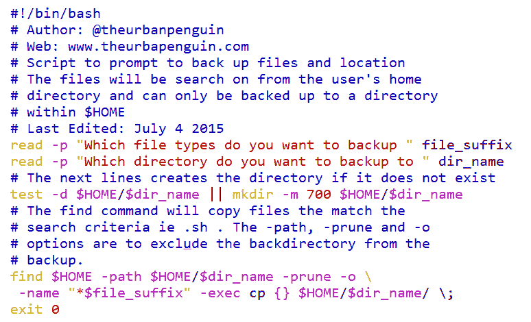
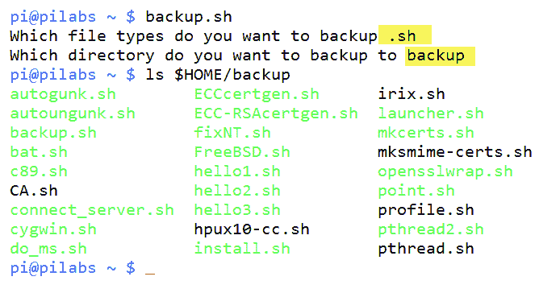

# 创建交互式脚本

在[第一章](01.html)、*Bash 脚本的内容和原因*中，我们学习了如何创建脚本并使用其一些基本元素。 这些参数包括可选参数，我们可以在脚本执行时传递给它。 在本章中，我们将通过使用 shell 内置的`read`命令来扩展它，允许使用交互式脚本。 交互式脚本是在脚本执行期间提示信息的脚本。

在本章中，我们将涵盖以下主题:

*   与选项一起使用`echo`
*   基本脚本使用`read`
*   脚本的评论
*   使用`read`提示增强阅读脚本
*   限制输入字符的数量
*   控制输入文本的可见性
*   通过选择
*   读取选项的值
*   努力成为标准
*   用简单的脚本加强学习

# 技术要求

本章的源代码可以从这里下载:

[https://github.com/PacktPublishing/Mastering-Linux-Shell-Scripting-Second-Edition/tree/master/Chapter02](https://github.com/PacktPublishing/Mastering-Linux-Shell-Scripting-Second-Edition/tree/master/Chapter02)

# 使用带有选项的 echo

到目前为止，在本书中，我们已经看到了`echo`命令非常有用，并且将在我们的许多脚本中使用(如果不是全部的话)。 在运行`echo`命令时，将使用内置命令，除非我们声明文件的完整路径。 我们可以用下面的命令来测试:

```sh
$ which echo
```

为了获得内置命令的帮助，我们可以使用 man bash 并搜索`echo`; 但是，`echo`命令与内部命令相同，所以我们建议在大多数情况下使用 man echo 来显示命令选项。

到目前为止，我们看到的`echo`的基本用法将产生一个文本输出和一个新行。 这通常是期望的响应，所以我们不需要担心下一个提示将附加到回显文本的末尾。 新行将脚本输出与下一个 shell 提示符分隔开。 如果不提供任何要打印的文本字符串，`echo`将只打印到`STDOUT`的新行。 我们可以直接从命令行使用下面的命令进行测试。 我们不需要运行`echo`，实际上，也不需要运行脚本中的任何其他命令。 要从命令行运行`echo`，只需输入如下所示的命令:

```sh
$ echo
```

输出将在我们发出的命令和随后的提示符之间显示一个清晰的新行。 我们可以在下面的截图中看到这一点:


如果我们想抑制新行，这在提示用户时特别有用，我们可以通过以下两种方式来实现，借助`echo`:

```sh
$ echo -n "Which directory do you want to use? "
$ echo -e "Which directory do you want to use? \c"
```

其结果将是抑制换行。 在最初的示例中，选项`-n`用于抑制换行。 第二个示例使用更通用的`-e`选项，该选项允许将转义序列添加到文本字符串中。 要继续在同一行上，我们使用`\c`作为转义序列。

作为脚本的最后一部分，或者从命令行运行时，这看起来不太好，因为命令提示符将紧随其后。 下面的截图说明了这一点:


# 使用 read 的基本脚本

当用作提示用户输入的脚本的一部分时，抑制换行正是我们想要的。 我们首先将现有的`hello2.sh`脚本复制到`hello3.sh`并构建一个交互式脚本。 最初，我们将使用`echo`作为提示机制，但是，随着我们逐渐增强脚本，我们将直接从 shell 内置的`read`命令中生成提示:

```sh
$ cp $HOME/bin/hello2.sh $HOME/bin/hello3.sh
$ chmod +x $HOME/bin/hello3.sh
```

编辑`$HOME/bin/hello3.sh`脚本，使其如下所示:

```sh
#!/bin/bash
echo -n "Hello $(basename $0)! May I ask your name: "
read
echo "Hello $REPLY"
exit 0
```

当我们执行脚本时，将会看到输入的任何内容。 这在 echo 语句中使用`$REPLY`变量进行回显。 由于我们还没有为 read 内置命令提供变量名，所以使用默认的`$REPLY`变量。 脚本执行和输出如下截图所示。 花些时间在您自己的系统上练习这个脚本。


这一小步让我们走了很长一段路，像这样的脚本有很多用途; 在运行安装过程中，我们都使用了提示选项和目录的安装脚本。 我们承认它仍然是相当琐碎的，但是，随着我们深入研究本章，我们将更接近一些更有用的脚本。

# 脚本的评论

我们应该在文章的开头引入注释脚本。 脚本注释以`#`符号开头。 #符号之后的任何内容都是注释，脚本不会对其进行计算。 shebang`#!/bin/bash`主要是一个注释，因此不由 shell 计算。 运行脚本的 shell 读取整个程序，因此它知道将脚本交给哪个命令解释器。 注释可以在行首，也可以在行中。 Shell 脚本没有多行注释的概念。

如果您还不熟悉注释，那么请注意它们被添加到脚本中，以描述谁编写了脚本、何时编写和最后更新脚本以及脚本的功能。 它们是脚本的元数据。

下面是脚本中注释的示例:

```sh
#!/bin/bash
# Welcome to bash scripting
# Author: Mokhtar
# Date: 1/5/2018
```

注释和添加注释来解释代码在做什么以及为什么这样做是一个很好的做法。 这将帮助您和稍后需要编辑脚本的同事。

# 使用阅读提示增强脚本

我们已经了解了如何使用内置读取来填充变量。 到目前为止，我们使用 echo 来产生提示符，但是可以使用`-p`选项将其传递给读取本身。 `read`命令将超过额外的换行，因此我们在一定程度上减少了行数和复杂性。

我们可以在命令行本身进行测试。 尝试输入以下命令查看`read`的工作情况:

```sh
$ read -p "Enter your name: " name
```

我们使用`read`命令和`-p`选项。 选项后面的参数是提示符中出现的文本。 通常，我们会确保在文本的末尾有一个空格，以确保我们可以清楚地看到我们输入的内容。 这里提供的最后一个参数是我们想要填充的变量; 我们简单地叫它名字。 变量也是区分大小写的。 即使我们不提供最后一个参数，我们仍然可以存储用户的响应，但这一次是在`REPLY`变量中。

When we return the value of a variable, we use `$`, but not when we write it. In simple terms, when reading a variable we refer to `$VAR` and when setting a variable we refer to `VAR=value`.

使用`-p`选项的`read`命令如下所示:

```sh
read -p <prompt> <variable name>
```

我们可以编辑脚本，使其看起来类似于以下摘录`hello3.sh`:

```sh
#!/bin/bash
read -p "May I ask your name: " name
echo "Hello $name"
exit 0
```

提示符不能计算消息字符串中的命令，例如我们之前使用的那些。

# 限制输入字符的数量

到目前为止，我们在使用的脚本中不需要这个功能，但是我们可能需要让用户按任意键来继续。 目前，我们已经将其设置为在按*Enter*键之前不会填充变量。 用户必须按*回车*才能继续。 如果我们使用`-n`选项后跟一个整数，我们可以指定在继续之前接受的字符数; 我们将在本例中设置`1`。 看看下面的代码摘录:

```sh
#!/bin/bash
read -p "May I ask your name: " name
echo "Hello $name"
read -n1 -p "Press any key to exit"
echo
exit 0
```

现在脚本将在显示名称后暂停，直到我们按下任何键; 我们可以在继续之前按任何键，因为我们只接受一次击键，而之前我们被要求保留默认行为，因为我们不知道输入的名称有多长。 我们必须等待用户点击*进入*。

We add an additional echo here to ensure that a new line is issued before the script ends. This ensures that the shell prompt starts on a new line.

# 控制输入文本的可见性

即使我们将输入限制为单个字符，我们仍然可以在屏幕上看到文本。 同样，如果我们输入名称，我们将在点击*Enter*之前看到所输入的文本。 在这种情况下，它只是不整洁，但如果我们正在输入敏感数据，如 PIN 或密码，我们应该隐藏文本。 我们可以使用静默选项`-s`来实现这一点。 在脚本中进行一个简单的编辑就可以将其设置到位:

```sh
#!/bin/bash
read -p "May I ask your name: " name
echo "Hello $name"
read -sn1 -p "Press any key to exit"
echo
exit 0
```

现在，当我们使用一个键来继续时，它将不会显示在屏幕上。 我们可以在下面的截图中看到脚本的行为:


# 通过选择

到目前为止，我们已经在第一章中看到了如何从用户那里读取参数。 此外，您还可以传递选项。 那么，有哪些选择呢? 它们与参数有何不同?

选项是前面有一个破折号的字符。

看看这个例子:

```sh
$ ./script1.sh -a
```

`-a`是一个选择。 你可以在你的脚本中检查用户是否输入了这个选项; 如果是这样，那么您的脚本可以以某种方式运行。

你可以传递多个选项:

```sh
$ ./script1.sh -a -b -c
```

要打印这些选项，可以使用`$1`、`$2`和`$3`变量:

```sh
#!/bin/bash
echo $1
echo $2
echo $3
```


我们应该检查这些选项，但是，由于我们还没有讨论条件语句，所以我们暂时保持简单。

选项可以传递一个值，像这样:

```sh
$ ./script1.sh -a -b 20 -c
```

这里传递的`-b`选项的值为`20`。


可以看到，变量`$3=20`是传递的值。

这对你来说可能无法接受。 你需要`$2=-b`和`$3=-c`。

我们将使用一些条件语句使这些选项正确。

```sh
#!/bin/bash
while [ -n "$1" ]
do
case "$1" in
-a) echo "-a option used" ;;
-b) echo "-b option used" ;;
-c) echo "-c option used" ;;
*) echo "Option $1 not an option" ;;
esac
shift
done
```

如果你不知道 while 循环，这不是问题; 我们将在接下来的章节中详细讨论条件语句。

`shift`命令将选项向左移动一步。

因此，如果我们有三个选项或参数，并使用`shift`命令:

*   `$3`变成`$2`
*   `$2`变成`$1`
*   `$1`被删除

这就像一个在使用 while 循环遍历选项时向前移动的操作。

因此，在第一个循环中，`$1`将是第一个选项。 移动选项后，`$1`将是第二个选项，以此类推。

如果您尝试前面的代码，您将注意到它仍然不能正确地识别选项的值。 别担心，解决办法就在眼前; 再等一会儿。

# 带选项传递参数

要同时传递参数和选项，你必须用双破折号分隔它们，像这样:

```sh
$ ./script1.sh -a -b -c -- p1 p2 p3
```

使用前面的技术，我们可以遍历选项，直到到达双破折号，然后遍历参数:

```sh
#!/bin/bash
while [ -n "$1" ]
do
case "$1" in
-a) echo "-a option found" ;;
-b) echo "-b option found";;
-c) echo "-c option found" ;;
--) shift
break ;;
*) echo "Option $1 not an option";;
esac
shift
done
#iteration over options is finished here.
#iteration over parameters started.
num=1
for param in $@
do
echo "#$num: $param"
num=$(( $num + 1 ))
done
```

现在，如果我们结合参数和选项运行它，我们应该看到一个选项列表和另一个参数列表:

```sh
$ ./script1.sh -a -b -c -- p1 p2 p3
```


如您所见，在双破折号之后传递的任何内容都被视为参数。

# 读取选项的值

我们已经了解了如何识别选项和参数，但是我们仍然需要一种正确读取选项值的方法。

您可能需要为特定选项传递一个值。 如何读取这个值?

当迭代遍历期望值的选项时，我们将检查`$2`变量。

检查以下代码:

```sh
#!/bin/bash
while [ -n "$1" ]
do
case "$1" in
-a) echo "-a option passed";;
-b) param="$2"
echo "-b option passed, with value $param"
shift ;;
-c) echo "-c option passed";;
--) shift
break ;;
*) echo "Option $1 not an option";;
esac
shift
done
num=1
for param in "$@"
do
echo "#$num: $param"
num=$(( $num + 1 ))
done
```


现在看起来不错; 您的脚本标识了选项和第二个选项的传入值。

有一个内置选项用于从用户那里获取选项，该选项使用了`getopt`函数。

不幸的是，`getopt`不支持多个字符的选项。

有一个名为`getopt`的非内置程序，它支持大于一个字符的选项，但是，同样，macOS X 版本不支持长选项。

无论如何，如果你想了解更多关于`getopt`的用法，请参考本章之后提供的进一步阅读资料。

# 努力成为标准

您可以使用 GitHub 中的 bash 脚本，并且您可能注意到后面有一个标准的选项方案。 这不是必须的，但它更可取。

以下是一些常用的选项:

*   :列出所有项目
*   `-c`:获得所有项目的计数
*   `-d`:输出目录
*   `-e`:展开物品
*   `-f`:指定文件
*   `-h`:显示帮助页面
*   `-i`:忽略字符大小写
*   `-l`:列出课文
*   `-o`:发送输出到文件
*   `-q`:沉默; 不要问用户
*   `-r`:递归处理
*   `-s`:使用隐身模式
*   `-v`:使用详细模式
*   `-x`:指定可执行文件
*   :不用提示我就接受

# 用简单的脚本加强学习

我们的脚本仍然有点小，我们还没有研究条件语句，所以我们可以测试是否正确输入，但是让我们看看一些简单的脚本，我们可以用一些功能来构建它们。

# 倒车和脚本

现在我们已经创建了一些脚本，我们可能需要将它们备份到不同的位置。 如果我们创建一个脚本来提示我们，我们可以选择要备份的文件的位置和类型。

请考虑以下脚本作为您的第一个练习。 创建脚本并将其命名为`$HOME/backup.sh`:

```sh
#!/bin/bash
# Author: @theurbanpenguin
# Web: www.theurbapenguin.com
# Script to prompt to back up files and location
# The files will be search on from the user's home
# directory and can only be backed up to a directory
# within $HOME
# Last Edited: July 4 2015
read -p "Which file types do you want to backup " file_suffix
read -p "Which directory do you want to backup to " dir_name
# The next lines creates the directory if it does not exist
test -d $HOME/$dir_name || mkdir -m 700 $HOME/$dir_name
# The find command will copy files the match the
# search criteria ie .sh . The -path, -prune and -o
# options are to exclude the backdirectory from the
# backup.
find $HOME -path $HOME/$dir_name -prune -o \
-name "*$file_suffix" -exec cp {} $HOME/$dir_name/ \;
exit 0
```

你会看到文件被注释了; 虽然，在黑白，可读性有点困难。 如果你有这本书的电子版，你应该会看到以下截图中的颜色:



当脚本运行时，您可以为要备份的文件选择`.sh`，并将其备份为目录。 下面的截图显示了脚本的执行，以及目录的列表:



现在您可以看到，我们可以开始使用简单的脚本来创建有意义的脚本; 尽管我们强烈建议，如果这个脚本不是用于个人使用，那么应该添加用户输入的错误检查。 在本书中，我们将讨论这个问题。

# 连接到服务器

让我们看看一些可以用来连接到服务器的实用脚本。 首先，我们将研究 ping，在第二个脚本中，我们将研究 SSH 凭据的提示。

# 版本 1 - ping

这是我们都可以做的事情，因为不需要特别的服务。 这将为控制台用户简化`ping`命令，因为他们可能不知道该命令的详细信息。 这将只 ping 服务器三个计数，而不是正常的无限数量。 如果服务器处于活动状态，则没有输出，但失败的服务器报告`sever dead`。 创建以下脚本`$HOME/bin/ping_server.sh`:

```sh
#!/bin/bash
# Author: @theurbanpenguin
# Web: www.theurbapenguin.com
# Script to ping a server
# Last Edited: July 4 2015
read -p "Which server should be pinged " server_addr
ping -c3 $server_addr 2>1 > /dev/null || echo "Server Dead"
```

下面的截图显示了成功和失败的输出:


# 版本 2 - SSH

通常 SSH 是在服务器上安装并运行的，所以如果您的系统正在运行 SSH 或者您可以访问 SSH 服务器，那么您可以运行此脚本。 在这个脚本中，我们提示输入服务器地址和用户名，并将它们传递给 SSH 客户机。 创建以下脚本为`$HOME/bin/connect_server.sh`:

```sh
#!/bin/bash
# Author: @theurbanpenguin
# Web: www.theurbapenguin.com
# Script to prompt fossh connection
# Last Edited: July 4 2015
read -p "Which server do you want to connect to: " server_name
read -p "Which username do you want to use: " user_name
ssh ${user_name}@$server_name
```

Use of the brace bracket is to delimit the variable from the `@` symbol in the last line of the script.

# 3 版本 MySQL/MariaDB

在下一个脚本中，我们将提供数据库连接的详细信息以及要执行的 SQL 查询。 如果您的系统上有 MariaDB 或 MySQL 数据库服务器，或者您可以连接到某个数据库服务器，那么您将能够运行此功能。 在这个演示中，我们将使用 Linux Mint 18.3 和 MariaDB 版本 10; 然而，这应该适用于任何 MySQL 服务器或 MariaDB，从版本 5 起。 该脚本收集用户和密码信息以及要执行的 SQL 命令。 创建以下脚本为`$HOME/bin/run_mysql.sh`:

```sh
#!/bin/bash
# Author: @theurbanpenguin
# Web: www.theurbapenguin.com
# Script to prompt for MYSQL user password and command
# Last Edited: July 4 2015
read -p "MySQL User: " user_name
read -sp "MySQL Password: " mysql_pwd
echo
read -p "MySQL Command: " mysql_cmd
read -p "MySQL Database: " mysql_db
mysql -u"$user_name" -p$mysql_pwd $mysql_db -Be"$mysql_cmd"
```

在这个脚本中，我们可以看到，当我们使用`-s`选项将 MySQL 密码输入`read`命令时，我们禁止显示 MySQL 密码。 同样，我们直接使用`echo`来确保下一个提示符在新行上开始。

脚本输入如下截图所示:


现在，我们可以很容易地看到密码抑制的工作原理，以及向 MySQL 命令添加密码的便利性。

# 阅读文件

`read`命令不仅用于读取用户的输入; 您可以使用`read`命令读取文件以进行进一步处理。

```sh
#!/bin/bash
while read line
do
echo $line
done < yourfile.txt
```

我们将文件内容重定向到`while`命令，使用`read`命令逐行读取内容。

最后，我们使用`echo`命令打印该行。

# 总结

感到自豪的是，您现在有了您的*，我可以阅读*的外壳脚本徽章。 我们将脚本开发为交互式的，并在脚本执行期间提示用户输入。 这些提示可以用来简化用户在命令行上的操作。 这样，它们就不需要记住命令行选项，也不需要拥有最终存储在命令行历史中的密码。 在使用密码时，我们可以使用 read`-sp`选项简单地存储值。

此外，我们还了解了如何传递带值和不带值的选项，以及如何正确识别值。 多亏了双破折号，我们看到了如何同时传递选项和参数。

在下一章中，我们将花时间研究 bash 中的条件语句。

# 问题

1.  下面的代码中有多少条注释?

```sh
#!/bin/bash
# Welcome to shell scripting
# Author: Mokhtar
```

2.  如果我们有以下代码:

```sh
#!/bin/bash
echo $1
echo $2
echo $3
```

我们用以下选项运行脚本:

```sh
$ ./script1.sh -a -b50 -c
```

运行这段代码的结果是什么?

3.  检查以下代码:

```sh
#!/bin/bash
shift
echo $#
```

如果我们使用以下选项运行它:

```sh
$ ./script1.sh Mokhtar -n -a 35 -p
```

# 进一步的阅读

请参阅以下有关本章的资料:

*   [http://tldp.org/LDP/Bash-Beginners-Guide/html/sect_08_02.html](http://tldp.org/LDP/Bash-Beginners-Guide/html/sect_08_02.html)
*   [https://ss64.com/bash/read.html](https://ss64.com/bash/read.html)
*   [http://www.manpagez.com/man/1/getopt/](http://www.manpagez.com/man/1/getopt/)
*   [https://ss64.com/bash/getopts.html](https://ss64.com/bash/getopts.html)