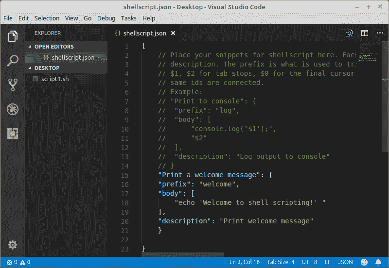
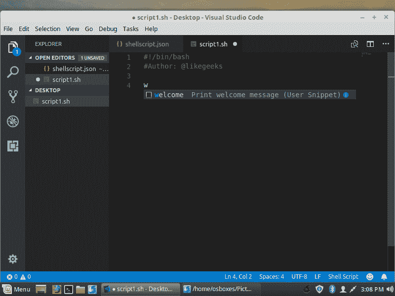
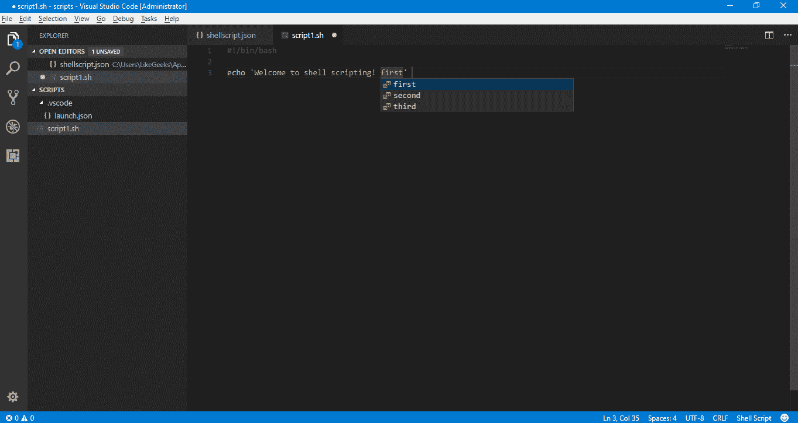

# 创建代码片段

现在我们可以编写条件测试来做决定。 在您的手在编码方面变得更快之后，您将需要保存一些代码片段以供以后使用，那么如何在编写脚本时节省时间和精力呢?

如果您喜欢使用命令行，但也喜欢与使用图形化的**集成开发环境**(**IDEs**)相关的一些特性，那么本章可能会向您揭示一些新的思想。 我们可以在命令行中使用 vi 或 vim 文本编辑器为常用脚本元素创建快捷方式。

在本章中，我们将涵盖以下主题:

*   缩写
*   使用代码片段
*   使用 VS Code 创建代码片段

# 技术要求

本章的源代码可以从这里下载:

[https://github.com/PacktPublishing/Mastering-Linux-Shell-Scripting-Second-Edition/tree/master/Chapter04](https://github.com/PacktPublishing/Mastering-Linux-Shell-Scripting-Second-Edition/tree/master/Chapter04)

# 缩写

我们已经在`~/.vimrc`文件中短暂停留了一段时间，现在我们将重新访问该文件来查看缩写或`abbr`控件。 该文件充当 vim 文本编辑器的运行控制机制，该编辑器可能安装在您的 Linux 发行版上。 旧的发行版或 Unix 变体可能有原始的 vi 文本编辑器，并将使用`~/.exrc`文件。 如果您不确定您的 vi 版本的标识和要使用的正确运行控制文件，只需输入`vi`命令。 如果打开一个空白页面，它确实是 vi。但是，如果一个新的空白文档随着 vim 启动屏幕打开，那么您使用的是改进的 vim 或 vi。

缩写允许使用快捷字符串来代替较长的字符串。 这些缩写可以在 vim 会话的最后一行模式中设置，但通常是在控制文件中设置。 shebang 可以很容易地用一个缩写表示，如下所示:

```sh
abbr _sh #!/bin/bash

```

缩写的基本语法如下所示:

```sh
abbr <shortcut><string> 
```

使用这个缩写，我们只需要在编辑模式下键入`_sh`。 在按下快捷码后的*Enter*键，将打印 shebang 的全文。 在现实中，按下`abbr`代码后的任何键都将展开快捷键，而不仅仅是按下*Enter*键。 像这样的简单元素可以大大增加使用 vim 作为文本编辑器的体验。 以下截图显示了更新后的`~/.vimrc`文件:


我们不局限于单个缩写代码，因为我们可以添加更多的`abbr`条目，例如，在行中支持 Perl 脚本的 shebang:

```sh
abbr _pl #!/usr/bin/perl 
```

下划线的使用不是必需的，但其目的是保持快捷方式代码的唯一性，避免出现键入错误。 我们也不局限于一行，尽管这是缩写最常用的地方。 考虑以下一个`if`语句的缩写:

```sh
abbr _if if [-z $1];then<CR>echo "> $0 <name><CR>exit 2<CR>fi
```

虽然这样做是有效的，但是`if`语句的格式不是完美的，多行缩写也远非理想。 在这种情况下，我们可以考虑使用预先准备好的代码片段。

# 使用代码片段

我们所说的术语*代码片段*是指我们可以读入当前脚本的预先准备的代码。 这是特别容易与 vim 能够读取其他文本文件的内容在编辑:

```sh
ESC
:r <path-and-filename>
```

例如，如果我们需要读取位于`$HOME/snippets`中名为`if`的文件的内容，我们将在 vim 中使用以下键序列:

```sh
ESC
:r $HOME/snippets/if
```

该文件的内容被读入当前光标位置下方的当前文档。 通过这种方式，我们可以根据需要使代码片段变得非常复杂，并维护正确的缩进以提高可读性和一致性。

因此，我们的职责是在`home`目录中创建一个 snippets 目录:

```sh
$ mkdir -m 700 $HOME/snippets
```

不需要共享目录，因此最好在创建目录时将模式设置为`700`或将模式设置为用户私有。

在创建代码片段时，您可以选择使用伪代码或实际示例。 我倾向于使用经过编辑的真实示例，以反映接收脚本的需求。 一个简单的`if`片段的内容如下:

```sh
if [ -z $1 ] ; then
   echo "Usage: $0 <name>"
   exit 2
fi
```

这为我们提供了通过实际示例创建`if`语句的布局。 在本例中，我们检查`$1`是否未设置，并在退出脚本之前向用户发送一个错误。 关键是保持代码片段简短，以限制需要进行的更改，但要使其易于理解和根据需要进行扩展。

# 为终端带来颜色

如果我们要向执行脚本的用户和操作符显示文本消息，我们可以提供颜色来帮助解释消息。 使用红色表示错误，使用绿色表示成功，这样可以更容易地向脚本添加功能。 不是所有的，但肯定绝大多数的 Linux 终端支持颜色。 内置的命令`echo`，当与`-e`选项一起使用时，可以向用户显示颜色。

要显示红色文本，可以使用以下命令`echo`:

```sh
$ echo -e "\033[31mError\033[0m"
```

下面的截图显示了代码和输出:


红色文本将立即引起对文本和脚本执行的潜在失败的注意。 以这种方式使用颜色符合应用设计的基本原则。 如果您发现代码很麻烦，那么只需使用友好的变量来表示颜色和重置代码。

在前面的代码中，我们使用红色和最终的重置代码将文本设置回 shell 默认值。 我们可以轻松地为这些颜色代码和其他代码创建变量:

```sh
RED="\033[31m"
GREEN="\033[32m"
BLUE="\033[34m"
RESET="\033[0m"
```

值`\033`是转义字符，`[31m`是红色的颜色代码。

在使用变量时，我们需要小心，以确保它们与文本正确分隔。 修改前面的例子，我们可以看到这是如何轻松实现的:

```sh
$ echo -e ${RED}Error$RESET"
```

我们使用大括号来确保识别`RED`变量并将其与`Error`单词分隔开。

将变量定义保存到`$HOME/snippets/color`文件将允许在其他脚本中使用它们。 有趣的是，我们不需要编辑这个脚本; 我们可以使用`source`命令在运行时将这些变量定义读入脚本。 在接收方脚本中，我们需要添加以下一行:

```sh
source $HOME/snippets/color
```

使用 shell 内置的`source`命令将把颜色变量读入在运行时执行的脚本中。 下面的截图显示了`hello5.sh`脚本的修改版本，我们现在将其称为`hello7.sh`，它使用了以下颜色:


我们可以看到这在执行脚本时所产生的效果。 在下面的截图中，你会看到有和没有参数的执行和输出:


我们可以通过彩色编码的输出轻松地识别脚本的成功和失败; 绿色的`Hello fred`提供参数，红色的`Usage`没有提供所需的名称。

# 使用 VS Code 创建代码片段

对于那些喜欢图形化 ide 的人，你可以使用 VS Code 作为你的 shell 脚本的编辑器。 我们在[第一章](01.html)，*Bash 脚本的内容和原因*中使用了它作为调试器。 现在我们将看到它作为编辑器的功能之一。

你可以在 VS Code 中创建自己的代码片段，如下所示。

导航到文件|首选项|用户片段。

然后键入`shell`。 这将打开`shellscript.json`文件。

该文件有两个括号，准备在它们之间输入你的代码片段:


要创建代码段，请在文件的方括号之间键入以下内容:

```sh
"Print a welcome message": {
   "prefix": "welcome",
   "body": [
         "echo 'Welcome to shell scripting!' "
   ],
   "description": "Print welcome message"
  }
```



您可以使用以下模板并根据需要进行修改。

尽量使用与 shell 脚本关键字不同的前缀，以避免混淆。

当你打开任何`.sh`文件并开始键入`welcome`时，自动补全将显示我们刚刚创建的代码片段:



你可以使用任何你想要的前缀; 在我们的例子中，我们使用了`welcome`，因此自动补全从它开始。

你可以在你的代码片段主体中添加很多行:

```sh
"Print to a welcome message": {
    "prefix": "welcome",
    "body": [
      "echo 'Welcome to shell scripting!' ",
      "echo 'This is a second message'"
    ],
    "description": "Print welcome message"
  }
```

可以在代码片段主体中使用占位符来简化代码编辑。

占位符是这样写的:

```sh
$1, $2, etc,
```

修改前面的代码片段，并添加一个占位符，如下所示:

```sh
"Print a welcome message": {
  "prefix": "welcome",
  "body": [
    "echo 'Welcome to shell scripting! $1' "
  ],
  "description": "Print welcome message"
  }
```

当您开始键入`welcome`并选择代码片段后，您将注意到光标将停在等待您输入的占位符的确切位置。

如果你忘记在这些可编辑的地方输入什么，你可以使用选项:

```sh
  "Print to a welcome message": {
    "prefix": "welcome",
    "body": [
      "echo 'Welcome to shell scripting! ${1|first,second,third|}' "
    ],
    "description": "Print welcome message"
  }
```

当你在你的代码中选择这个片段并点击*Enter*，你应该会看到光标在等待你的输入和你的选择:



这是非常有用的!

同样，你可以为占位符添加一个默认值，这样如果你按*Tab*，这个值就会被写入:

```sh
"Print a welcome message": {
  "prefix": "welcome",
  "body": [
    "echo 'Welcome to shell scripting! ${1:book}' "
  ],
  "description": "Print welcome message"
  }
```

# 总结

对任何管理员来说，脚本重用都是追求效率的首要任务。 在命令行中使用 vim 可以非常快速和有效地编辑脚本，我们可以节省使用缩写的打字时间。 它们最好在用户的个人`.vimrc`文件中设置，并使用`abbr`控件定义。 除了缩略语，我们还可以看到使用代码片段的意义。 这些是预先准备好的代码块，可以读取到当前脚本中。

此外，我们还了解了在脚本提供反馈的命令行中使用颜色的价值。 乍一看，这些颜色代码并不是最友好的，但我们可以通过使用变量来简化这个过程。 我们创建了带有颜色代码的变量，并将它们保存到一个文件中，通过使用 source 命令，这些变量将可用于当前环境。

最后，我们了解了如何使用 VS code 创建代码片段，以及如何添加占位符来简化代码编辑。

在下一章中，我们将看看其他机制，我们可以用它们来编写测试表达式，简化整数和变量的使用。

# 问题

1.  下面的代码创建了打印一行的代码片段。 如何制作带有选项的代码片段?

```sh
"Hello message": {
  "prefix": "hello",
  "body": [
    "echo 'Hello $1' "
  ],
  "description": "Hello message"
  }
```

2.  您应该使用哪个命令使您的代码片段可以在 shell 中使用?

# 进一步的阅读

请参阅以下有关本章的资料:

*   [https://code.visualstudio.com/docs/editor/userdefinedsnippets](https://code.visualstudio.com/docs/editor/userdefinedsnippets)
*   [https://brigade.engineering/sharpen-your-vim-with-snippets-767b693886db](https://brigade.engineering/sharpen-your-vim-with-snippets-767b693886db)