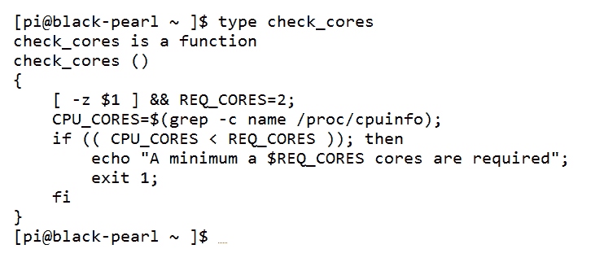
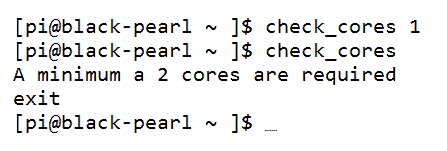
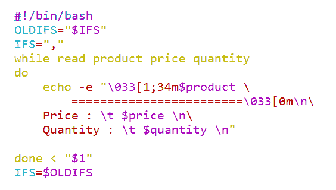
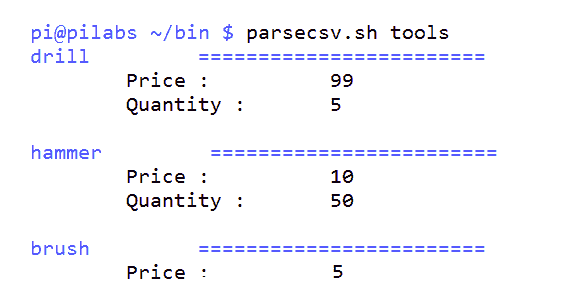
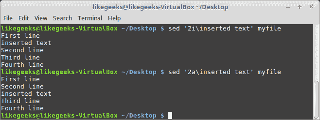

# 流编辑器介绍

在前一章中，我们看到可以使用`sed`在脚本中编辑文件。 `sed`命令是**流编辑器**(**sed**)，并逐行打开文件以搜索或编辑文件内容。 从历史上看，这可以追溯到 Unix，在 Unix 中，系统可能没有足够的 RAM 来打开非常大的文件。 使用`sed`进行编辑是绝对需要的。 即使在今天，我们仍将使用`sed`对包含成百上千个条目的文件进行更改和显示。 它比人类尝试做同样的事情更简单、更容易、更可靠。 最重要的是，如我们所见，我们可以在脚本中使用`sed`来自动编辑文件; 不需要人机交互。

我们将首先查看`grep`并搜索文件中的文本。 `grep`命令中的`re`是**正则表达式**的缩写。 尽管在本章中我们不讨论脚本，但我们将介绍一些可以用于脚本的非常重要的工具。 在下一章中，我们将看到`sed`在脚本中的实际实现。

但目前，我们有足够的内容要处理，我们将在本章中涵盖以下主题:

*   使用`grep`显示文本
*   了解`sed`的基本知识
*   其他`sed`命令
*   多个`sed`命令

# 技术要求

本章的源代码可在此下载:

[https://github.com/PacktPublishing/Mastering-Linux-Shell-Scripting-Second-Edition/tree/master/Chapter08](https://github.com/PacktPublishing/Mastering-Linux-Shell-Scripting-Second-Edition/tree/master/Chapter08)

# 使用 grep 显示文本

我们将从观察`grep`命令开始这一旅程。 这将使我们在转向更复杂的正则表达式和使用`sed`编辑文件之前，掌握一些在文本中搜索的简单概念。

全球正则表达式打印**(****grep),或者我们通常称之为`grep`命令,是一种命令行工具,用于搜索全球(所有文件中的代码行)并打印结果`STDOUT`。 搜索字符串是一个正则表达式。**

`grep`命令是一种非常常见的工具，它有许多简单的例子和许多我们每天都可以使用它的场合。 在下面几节中，我们包含了一些简单而有用的示例，并进行了解释。

# 在接口上显示接收到的数据

在本例中，我们只打印从`eth0`接口接收到的数据。

This is the interface that is my primary network connection. If you are uncertain of your interface name, you can use the `ifconfig -a` command to display all the interfaces and choose the correct interface name on your system. If `ifconfig` is not found, try typing the full path, `/sbin/ifconfig`.

只需使用`ifconfig eth0`命令，就可以将一堆数据打印到屏幕上。 为了只显示接收到的数据包，我们可以隔离包含`RX packets`(接收到的`RX`)的行。 这就是`grep`发挥作用的地方:

```sh
$ ifconfig eth0 | grep "RX packets"  
```

使用管道或竖条，我们可以获得`ifconfig`命令的输出，并将其发送到`grep`命令的输入。 在本例中，`grep`正在搜索一个非常简单的字符串`RX packets`。 搜索字符串是区分大小写的，所以我们需要正确使用`grep`的`-i`选项以不区分大小写的方式运行搜索，如下面的示例所示:

```sh
$ ifconfig eth0 | grep -i "rx packets"  
```

A case-insensitive search is especially useful when searching for options in a configuration file, which often have mixed cases.

我们可以在下面的截图中看到初始命令的结果，确认我们已经能够隔离输出的单行，如下所示:


# 显示用户帐户数据

Linux 中的本地用户帐户数据库是`/etc/passwd`文件，所有用户帐户都可以读取该文件。 如果我们想搜索包含我们自己数据的行，我们可以在搜索中使用我们自己的登录名，或者使用参数展开和`$USER`变量。 我们可以在下面的命令示例中看到这一点:

```sh
$ grep "$USER" /etc/passwd 
```

在本例中，`grep`的输入来自`/etc/passwd`文件，我们搜索`$USER`变量的值。 同样，在本例中，它是一个简单的文本，但它仍然是正则表达式，只是没有任何操作符。

为了完整起见，我们在下面的截图中包含了输出:


我们可以在脚本中使用这种类型的查询作为条件进行一点扩展。 在尝试创建一个新帐户之前，我们可以使用它来检查用户帐户是否存在。 为了使脚本尽可能简单，并确保不需要管理权限，创建帐户将只显示以下命令行示例中的提示和条件测试:

```sh
$ bash
$ read -p "Enter a user name: "
$ if (grep "$REPLY" /etc/passwd > /dev/null) ; then
> echo "The user $REPLY exists"
> exit 1
> fi
```

`grep`搜索现在使用`read`填充的`$REPLY`变量。 如果我输入名称`pi`，将显示一条消息，我们将退出，因为我的用户帐户也被称为`pi`。 不需要显示来自`grep`的结果; 我们只是在寻找一个返回码，要么是`true`要么是`false`。 为了确保如果用户在文件中，我们不会看到任何不必要的输出，我们将输出从`grep`重定向到特殊的设备文件`/dev/null`。

如果您想从命令行运行它，您应该首先启动一个新的 bash shell。 只需输入`bash`即可。 这样，当`exit`命令运行时，它不会注销您，而是关闭新打开的 shell。 在下面的截图中，我们可以看到这种情况的发生以及指定现有用户时的结果:


# 列出系统中 cpu 的数量

另一个真正有用的特性是`grep`可以计算匹配的行数而不显示它们。 我们可以使用它来计算系统上拥有的 CPU 或 CPU 核的数量。 在`/proc/cpuinfo`文件中，每个核心或 CPU 都有一个名称。 然后我们可以搜索文本`name`并计算输出; 使用的`-c`选项如下例所示:

```sh
$ grep -c name /proc/cpuinfo 
```

我的 CPU 有 4 核，如下图所示:


如果我们在另一台拥有单核的 PC Model B 上使用相同的代码，我们将看到以下输出:


在运行 cpu 密集型任务之前，我们可以再次在脚本中使用它来验证是否有足够的内核可用。 为了从命令行中测试这一点，我们可以使用以下代码，我们在只有单个核心的 PC 上执行:

```sh
$ bash
$ CPU_CORES=$(grep -c name /proc/cpuinfo)
$ if (( CPU_CORES < 4 )) ; then
> echo "A minimum of 4 cores are required"
> exit 1
> fi  
```

我们只在开始时运行`bash`，以确保没有使用`exit`命令注销系统。 如果这是在脚本中，则不需要，因为我们将退出脚本而不是 shell 会话。

通过在只有一个核心的模型 B 上运行这个，我们可以看到脚本的结果，也可以看到我们没有所需的核心数量的指示:


如果你需要在多个脚本中运行这个 check，那么你可以在一个共享脚本中创建一个函数，并在需要检查的脚本中创建包含共享函数的脚本:

```sh
function check_cores { 
 [ -z $1 ] && REQ_CORES=2 
CPU_CORES=$(grep -c name /proc/cpuinfo) 
if (( CPU_CORES < REQ_CORES  )) ; then 
echo "A minimum of $REQ_CORES cores are required" 
exit 1 
fi 
} 
```

如果一个参数被传递给函数，那么它被用作所需的核数; 否则，我们将该值设置为`2`作为默认值。 如果我们将其定义为 Model B PC 的 shell 中的一个函数，并使用`type`命令显示详细信息，我们应该会看到如下截图所示:



如果我们在一个单核系统上运行它，并指定只需要一个单核，我们将看到当我们满足需求时没有输出。 如果我们没有指定需求，那么它将默认为`2`内核，我们将无法满足需求，并将退出 shell。

下面的截图显示了带参数`1`和不带参数运行时函数的输出:



我们可以看到，即使是`grep`的基础知识在脚本中也是非常有用的，我们可以使用所学的知识开始创建可用的模块，并将其添加到脚本中。

# 解析 CSV 文件

现在我们将创建一个脚本来解析或格式化 CSV 文件。 文件的格式化将为输出添加新的行、制表符和颜色，从而使其更具可读性。 然后我们可以使用`grep`来显示 CSV 文件中的单个项。 这里的实际应用是一个基于 CSV 文件的目录系统。

# CSV 文件

CSV 文件或逗号分隔值列表将来自当前目录中名为`tools`的文件。 这是我们销售的产品目录。 文件内容如下所示:

```sh
drill,99,5 
hammer,10,50 
brush,5,100 
lamp,25,30 
screwdriver,5,23 
table-saw,1099,3 
```

这只是一个简单的演示，所以我们不需要太多的数据，但是目录中的每一项都包含以下内容:

*   的名字
*   价格
*   单位的股票

我们可以看到，我们有一个 99 美元的钻，我们有 5 个单位的库存。 如果我们用`cat`列出文件，它就不是很友好; 但是，我们可以编写脚本以更吸引人的方式显示数据。 我们可以创建一个新的脚本`$HOME/bin/parsecsv.sh`:

```sh
#!/bin/bash 
OLDIFS="$IFS" 
IFS="," 
while read product price quantity 
do 
echo -e "\33[1;33m$product \
        ========================\033[0m\n\ 
Price : \t $price \n\ 
Quantity : \t $quantity \n" 

done <"$1" 
IFS=$OLDIFS 
```

让我们仔细研究这个文件并查看相关元素:

| **元件** | **含义** |
| `OLDIFS="$IFS"` | 变量`IFS`存储文件分隔符，这通常是一个空白字符。 我们可以存储旧的`IFS`，以便稍后在脚本结束时恢复它，确保在脚本完成后返回相同的环境，无论脚本如何运行。 |
| `IFS=","` | 我们将分隔符设置为逗号，以匹配 CSV 文件所需要的内容。 |
| `while read product price quantity` | 我们进入一个`while`循环来填充我们需要的三个变量:`product`、`price`和`quantity`。 `while`循环将逐行读取输入文件，并填充每个变量。 |
| `echo ...` | `echo`命令将产品名称显示为蓝色，并在下面添加两个下划线。 其他变量在新行中打印并以制表符插入。 |
| `done <"$1"` | 这是我们读取输入文件的地方，我们将其作为参数传递给脚本。 |

脚本如下截图所示:



我们可以使用位于当前目录中的`tools`目录文件来执行脚本，使用以下命令:

```sh
$ parsecsv.sh tools  
```

为了看看这将如何显示，我们可以在下面的截图中查看部分输出:



我们现在开始意识到，我们在命令行中有很多功能可以以更可读的方式格式化文件，纯文本文件不需要是纯文本。

# 隔离目录条目

如果我们需要搜索一个条目，那么我们需要不止一行。 条目有三行。 所以，如果我们搜索锤子，我们需要到锤子线和后面的两条线。 我们通过使用`grep`的`-A`选项来实现这一点，`grep`是 after 的缩写。 我们需要显示匹配的行和之后的两行。 这将通过以下代码表示:

```sh
$ parsecsv.sh tool | grep -A2 hammer  
```

如下截图所示:


# 了解 sed 的基础知识

在建立了一些基础之后，我们现在可以开始看一下`sed`的一些操作。 大多数 Linux 系统都会提供这些命令，它们是核心命令。

我们将直接深入一些简单的例子:

```sh
$ sed 'p' /etc/passwd  
```

`p`操作符将打印匹配的模式。 在本例中，我们没有指定模式，因此我们将匹配所有内容。 不抑制`STDOUT`而打印匹配的行将会复制行。 这个操作的结果是将`passwd`文件中的所有行打印两次。 要只打印修改后的行，我们使用`-n`选项:

```sh
$ sed -n 'p' /etc/passwd  
```

辉煌! ! 我们刚刚重新设计了`cat`命令。 我们现在可以只使用一系列的行:

```sh
$ sed -n '1,3 p ' /etc/passwd  
```

现在我们已经重新创建了`head`命令，但是我们也可以在 regex 模式中指定范围来重新创建`grep`命令:

```sh
$ sed -n '/^root/ p' /etc/passwd  
```

我们可以在下面的截图中看到这一点:


注意，插入字符(`^`)表示该行的开头，这意味着该行必须以单词`root`开始。 别担心; 我们将在另一章中解释所有这些正则表达式字符。

# 替换命令

我们已经看到了用于打印模式空间的`p`命令。 `p`实际上是`substitute`命令`s`的标志。

`substitute`命令是这样写的:

```sh
$ sed s/pattern/replacement/flags  
```

`substitute`命令有三种常用标志:

*   `p`:打印原内容
*   `g`:所有事件的全局替换
*   `w`:Filename:将结果发送到文件

现在我们来看看`substitute`命令或`s`。 使用这个命令，我们可以用另一个字符串替换一个字符串。 同样，在默认情况下，我们将输出发送到`STDOUT`并且不编辑该文件。

要替换用户`pi`的默认 shell，我们可以使用以下命令:

```sh
sed -n ' /^pi/ s/bash/sh/p ' /etc/passwd  
```

我们继续前面的实例，使用`p`命令打印匹配的模式，并使用`-n`选项抑制`STDOUT`。 我们搜索以`pi`开头的行。 这代表用户名。 然后，我们发出`s`命令来替换那些匹配行的文本。 它有两个参数:第一个是要搜索的文本，第二个是用来替换原始文本的文本。 在本例中，我们查找`bash`并将其替换为`sh`。 这是简单和工作，但它可能不可靠的长期。 我们可以在下面的截图中看到输出:


我们必须强调，目前，我们没有编辑文件，只是将其显示在屏幕上。 原始的`passwd`文件保持不变，我们可以作为标准用户运行它。 我在前面的示例中提到，搜索可能不那么可靠，因为我们正在搜索的字符串是`bash`。 这是非常短的，也许它可以包含在匹配行的其他地方。 可能，某人的姓是`Tabash`，其中包括字符串`bash`。 我们可以扩展搜索以查找`/bin/bash`并将其替换为`/bin/sh`。 然而，这引入了另一个问题:默认的分隔符是正斜杠，所以我们必须转义搜索中使用的每个正斜杠并替换字符串，如下所示:

```sh
sed -n ' /^pi/ s/\/bin\/bash/\/usr\/bin\/sh/p ' /etc/passwd  
```

这是一个选择，但不是一个整洁的选择。 更好的解决方案是知道我们使用的第一个分隔符定义了分隔符。 换句话说，您可以使用任何字符作为分隔符。 在这种情况下使用`@`符号可能是一个好主意，因为它既不出现在搜索字符串中，也不出现在替换字符串中:

```sh
sed -n ' /^pi/ s@/bin/bash@/usr/bin/sh@p ' /etc/passwd  
```

我们现在有了更可靠的搜索和可读的命令行，这总是一件好事。 我们仅用`/bin/sh`替换`/bin/bash`每行上的第一个条目。 如果我们需要替换比第一次出现的次数更多的内容，对于 global，我们在末尾添加`g`命令:

```sh
sed -n ' /^pi/ s@bash@sh@pg ' /etc/passwd 
```

在我们的例子中，这不是必需的，但是知道它很好。

# 全球替换

让我们假设我们有以下示例文件:

```sh
Hello, sed is a powerful editing tool. I love working with sed
If you master sed, you will be a professional one
```

让我们尝试使用`sed`来处理这个文件:

```sh
$ sed 's/sed/Linux sed/' myfile
```

这里，我们用`sed`将`sed`替换为`Linux sed`:


如果仔细检查结果，您会注意到`sed`只修改了每行的第一个单词。

如果您想替换所有出现的内容，这可能不是您想要的。

`g`旗来了。

让我们再次使用它并看看结果:

```sh
$ sed 's/sed/Linux sed/g' myfile  
```


现在修改所有的事件。

你可以使用`w`标志将这些修改移植到一个文件中:

```sh
$ sed 's/sed/Linux sed/w outputfile' myfile  
```

此外，您可以限制同一行的出现次数，因此我们可以只像这样修改每行的前两次出现:

```sh
$ sed 's/sed/Linux sed/2' myfile 
```

所以，如果有第三次发生，它将被忽略。

# 限制替换

我们看到了`g`标志如何修改同一行中出现的所有内容，这适用于整个文件行。

如果我们想将编辑限制在特定的行中，该怎么办? 还是一个特定的线范围?

我们可以像这样指定结束行或行范围:

```sh
$ sed '2s/old text/new text/' myfile 
```

前面的命令只会修改文件的第二行。 下面的命令将只修改第三到第五行:

```sh
$ sed '3,5s/old text/new text/' myfile  
```

下面的命令将从第二行修改到文件的末尾:

```sh
$ sed '2,$s/old text/new text/' myfile  
```

# 编辑文件

使用`w`标志，我们可以将编辑写入文件，但是如果我们想编辑文件本身呢? 我们可以使用`-i`选项。 我们需要使用该文件的权限，但我们可以对该文件进行复制，这样就不会损害任何系统文件或需要额外的访问权限。

我们可以在本地复制`passwd`文件:

```sh
$ cp /etc/passwd "$HOME"
$ cd 
```

我们以`cd`命令结束，以确保我们在`home`目录和本地`passwd`文件中工作。

`-i`选项用于运行就地更新。 在编辑文件时，我们不需要`-n`选项或`p`命令。 因此，该命令就像下面的示例一样简单:

```sh
$ sed -i ' /^pi/ s@/bin/bash@/bin/sh/ ' $HOME/passwd 
```

命令将没有输出，但文件现在将反映更改。 命令的用法如下截图所示:


在进行更改之前，应该在`-i`选项后面直接追加一个字符串，不添加任何空格，从而进行备份。 如下面的例子所示:

```sh
$ sed -i.bak ' /^pi/ s@/bin/bash@/bin/sh/ ' $HOME/passwd  
```

如果我们想看到这个，我们可以反向搜索并替换字符串:

```sh
$ sed -i.bak ' /^pi/ s@/bin/sh@/bin/bash/ ' $HOME/passwd  
```

这将把本地的`passwd`文件设置为与之前相同，并且我们将有一个带有前一组更改的`passwd.bak`。 如果需要的话，可以使用回滚选项来保证安全。

# 其他 sed 命令

`sed`提供了大量命令，可以轻松地插入、更改、删除和转换文本。 让我们看一些如何在`sed`中使用这些命令的示例。

# “删除”命令

您可以使用`delete`命令`d`从流中删除行或一系列行。 下面的命令将从流中删除第三行:

```sh
$ sed '3d' myfile  
```

下面的命令将从流中删除第三到第五行:

```sh
$ sed '3,5d' myfile  
```

这个命令将从第四行删除到文件末尾:

```sh
$ sed '4,$d' myfile
```

注意，删除只发生在流上，而不是实际的文件上。 因此，如果你想从实际文件中删除，你可以使用`-i`选项:

```sh
$ sed -i '2d' myfile #Permenantly delete the second line from the file  
```

# 插入和追加命令

插入命令`i`和追加命令`a`的工作方式相同，只有细微的差别。

命令将指定的文本插入到指定的行或模式之前。

命令将指定的文本插入到指定的行或模式之后。

让我们看一些例子。

我们的示例 02 文件如下所示:

```sh
First line
Second line
Third line
Fourth line
```

要插入一行，你需要像这样使用插入命令`i`:

```sh
$ sed '2i\inserted text' myfile 
```

要追加一行，你需要像这样使用 append 命令`a`:

```sh
$ sed '2a\inserted text' myfile 
```

看结果，检查插入线位置:



# 更改命令

我们了解了如何使用`substitute`命令`s`替换出现。 那么，`change`命令是什么?它有什么不同?

`change`命令`c`用于更改整行。

要更改一行，可以像这样使用`change`命令:

```sh
$ sed '2c\modified the second line' myfile  
```


我们用新行替换了第二行。

# 转换命令

`transform`命令用于将任意字母或数字替换为另一个字母或数字，例如将字母大写或将数字转换为不同的数字。

它的工作原理类似于`tr`命令。

你可以这样使用它:

```sh
$ sed 'y/abc/ABC/' myfile  
```


转换应用于整个流，不能被限制。

# 多个 sed 命令

在前面的所有示例中，我们只对流应用了一个`sed`命令。 运行多个`sed`命令怎么样?

您可以通过使用`-e`选项并使用分号分隔命令，就像这样:

```sh
$ sed -e 's/First/XFirst/; s/Second/XSecond/' myfile
```


此外，你可以在单独的一行中输入每个命令，你会得到相同的结果:

```sh
$ sed -e '
> s/First/XFirst/
> s/Second/XSecond/' myfile  
```

`sed`命令提供了很大的灵活性; 如果你用得好，你会获得很多力量。

# 总结

你们已经牢牢掌握了另一个伟大的篇章，我希望它对你们真的有用。 虽然我们想集中精力使用`sed`，但我们从`grep`的强大程度开始，包括脚本内部和外部。 虽然我们只接触到`sed`，我们将在下一章开始扩展它，在那里我们将扩展我们所学到的。

此外，我们还学习了如何替换文本，如何限制和全球化替换，以及如何使用`-i`保存编辑流。

我们学习了如何使用`sed`插入、追加、删除和转换文本。

最后，我们学习了如何使用`-e`选项运行多个`sed`命令。

在下一章中，我们将学习如何自动化 Apache 虚拟主机，如何自动创建新的虚拟主机，以及其他很酷的东西。 所有这些操作的主力将是`sed`和`sed`脚本。

# 问题

1.  假设你有一个包含以下内容的文件:

```sh
Hello, sed is a powerful editing tool. I love working with sed
If you master sed, you will be a professional one
```

假设你使用以下命令:

```sh
$ sed 's/Sed/Linux sed/g' myfile 
```

有多少行被替换?

2.  假设你有与前面问题中使用的相同的文件，并且你使用以下命令:

```sh
$ sed '2d' myfile  
```

将从文件中删除多少行?

3.  在下面的例子中，插入行的位置是什么?

```sh
$ sed '3a\Example text' myfile  
```

4.  假设您有相同的示例文件，并运行以下命令:

```sh
$ sed '2i\inserted text/w outputfile' myfile  
```

有多少行会被保存到输出文件?

# 进一步的阅读

请参阅以下有关本章的资料:

*   [https://www.gnu.org/software/sed/manual/sed.html](https://www.gnu.org/software/sed/manual/sed.html)
*   [https://linux.die.net/man/1/sed](https://linux.die.net/man/1/sed)