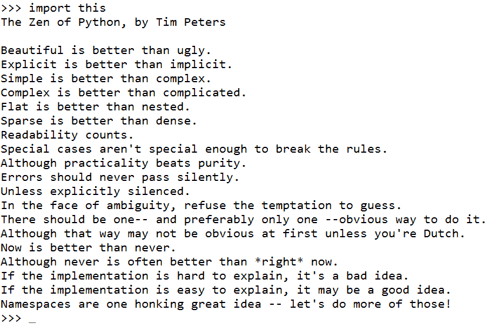
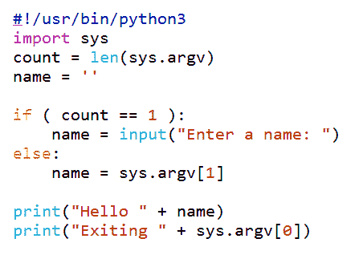

# 使用 Python 作为 Bash 脚本的替代方案

在前一章中，我们看到了一个使用 AWK 的实例，并了解了如何处理`lastlog`输出以产生更好的报告。 在本章中，我们将看看 bash 的另一种脚本替代方案。 我们将讨论 Python。 Python 是另一种脚本语言，也是到目前为止我们所了解的最新的脚本语言。 与 bash 类似，Python 是一种解释语言，并使用了 shebang。 虽然它没有 shell 接口，但是我们可以访问一个名为 REPL 的控制台，在那里我们可以输入 Python 代码来与系统交互。 在本章中，我们将涵盖以下主题:

*   Python 是什么?
*   用 Python 的方式说 Hello World
*   神谕的参数
*   重要的空白
*   阅读用户输入
*   字符串操作

# 技术要求

本章的源代码可在此下载:

[https://github.com/PacktPublishing/Mastering-Linux-Shell-Scripting-Second-Edition/tree/master/Chapter14](https://github.com/PacktPublishing/Mastering-Linux-Shell-Scripting-Second-Edition/tree/master/Chapter14)

# Python 是什么?

Python 是一种面向对象的解释语言，它被设计为易于使用和帮助**快速应用开发**。 这是通过使用语言中的简化语义来实现的。

Python 是由荷兰开发人员 Guido van Rossum 在 20 世纪 80 年代末 1989 年 12 月底创建的。 语言的大部分设计目标是清晰和简单，Python 的*Zen 的主要规则之一是:*

应该有一种，最好只有一种，明显的方法去做这件事。

通常系统会同时安装 Python 2 和 Python 3; 然而，所有更新的发行版都在切换到 Python 3。 我们将使用 Python 3。

因为我们使用的是 Linux Mint，所以它已经随 Python 3 一起发布了。

如果你使用的是其他 Linux 发行版，或者找不到 Python 3，你可以这样安装:

*   基于 RedHat 的发行版:

```sh
$ sudo yum install python36
```

*   关于基于 Debian 的发行版:

```sh
$ sudo apt-get install python3.6
```

虽然没有 shell，但我们可以使用 repr -读取、计算、打印和循环与 Python 交互。 我们可以通过在命令行中输入`python3`或`python36`(如果您使用的是 CentOS 7)来访问它。 你应该会看到类似下面的截图:


我们可以看到出现了`>>>`提示符，这被称为 REPL 控制台。 我们应该强调，这是一种脚本语言，像 bash 和 Perl 一样，我们通常会通过创建的文本文件执行代码。 这些文本文件的名称通常有一个`.py`后缀。

在使用 REPL 时，我们可以通过导入模块来独立打印版本。 在 Perl 中，我们将使用关键字; 在 bash 中，我们将使用命令源; 在 Python 中我们使用 import:

```sh
>>>import sys
```

加载模块后，我们现在可以通过打印版本来研究 Python 的面向对象特性:

```sh
>>> sys.version
```

我们将导航到命名空间中的`sys`对象，并从该对象调用 version 方法。

结合这两个命令，我们应该看到以下输出:


为了结束这一节的 Python 描述，我们应该看一下 Python 的禅。 在 REPL 中，我们可以输入`import this`，如下截图所示:



这不仅仅是 Python 的禅宗; 它实际上是所有编程语言的一个好规则，也是开发人员的一个指南。

最后，要关闭 REPL，我们在 Linux 系统中使用*Ctrl*+*D*，在 Windows 系统中使用*Ctrl*+*Z*。

# 用 Python 的方式说 Hello World

我们用 Python 编写的代码应该清晰整洁:稀疏比密集好。 我们将需要第一行的 shebang，然后是`print`语句。 `print`函数包含换行符，并且在行尾不需要分号。 我们可以在下面的例子中看到编辑的`$HOME/bin/hello.py`版本:

```sh
#!/usr/bin/python3
print("Hello World")
```

我们仍然需要添加执行权限，但是我们可以像前面那样使用`chmod`运行代码。 下面的命令显示了这一点，但我们现在应该已经习惯了:

```sh
$ chmod u+x $HOME/bin/hello.py
```

最后，我们现在可以执行代码来查看问候。

类似地，你可以使用 Python 解释器从命令行运行该文件，如下所示:

```sh
$ python3 $HOME/bin/hello.py
```

或者在一些 Linux 发行版中，你可以这样运行它:

```sh
$ python36 $HOME/bin/hello.py
```

再说一遍，知道至少一种语言会让你更容易适应其他语言，而且这里面并没有很多新特性。

# 神谕的参数

现在我们应该知道，我们想要将命令行参数传递给 Python，我们可以使用`argv`数组来实现这一点。 然而，我们更像 bash; 在 Python 中，我们将程序名和其他参数合并到数组中。

Python 在对象名中也使用小写而不是大写:

*   `argv`数组是`sys`对象的一部分
*   `sys.argv[0]`为脚本名
*   `sys.argv[1]`是提供给脚本的第一个参数
*   `sys.argv[2]`是第二个提供的参数，以此类推
*   参数计数将始终至少为 1，因此，在检查提供的参数时要记住这一点

# 提供的参数

如果我们创建了`$HOME/bin/args.py`文件，我们就可以看到它的作用。 该文件应该创建如下，并使其可执行:

```sh
#!/usr/bin/python3
import sys
print("Hello " + sys.argv[1])
```

如果我们使用提供的参数运行脚本，我们应该会看到类似以下截图的结果:


我们的代码仍然非常干净和简单; 然而，您可能已经注意到，我们不能将`print`语句中引用的文本与实参结合起来。 我们使用+符号将两个字符串连接在一起。 由于没有特定的符号来表示变量或任何其他类型的对象，它们不能以引号内的静态文本的形式出现。

# 计算参数

如前所述，脚本名是数组索引`0`处的第一个参数。 所以，如果我们试图计数参数，那么计数应该总是最少为 1。 换句话说，如果我们没有提供参数，则参数计数将为 1。 要计数数组中的项，可以使用`len()`函数。

如果我们编辑脚本来包含一个新行，我们会看到这样的工作，如下所示:

```sh
#!/usr/bin/python3
import sys
print("Hello " + sys.argv[1])
print( "length is: " + str(len(sys.argv)) )
```

像前面那样执行代码，可以看到我们提供了两个参数——脚本名和字符串`Mokhtar`:


如果我们尝试使用单个`print`语句来打印输出和参数数量，那么它将产生错误，因为我们无法将整数与字符串连接起来。 长度值是一个整数，在没有转换的情况下不能与字符串混合。 这就是为什么我们使用`str`函数将整数转换为字符串。 下面的代码将失败:

```sh
#!/usr/bin/python3
import sys
print("Hello " + sys.argv[1] + " " + len(sys.argv))
```


如果我们尝试运行脚本并忽略提供参数，那么当我们引用索引`1`时，数组中将会有一个空值。 这将给出一个错误，如下面的截图所示:


我们当然需要处理这个以防止错误; 输入重要空格的概念。

# 重要的空白

Python 和大多数其他语言之间的一个主要区别是，额外的空格可能意味着某些东西。 代码的缩进级别定义了它所属的代码块。 到目前为止，我们还没有将创建的代码缩进到行首之后。 这意味着所有的代码都处于相同的缩进级别，并且属于相同的代码块。 我们没有使用大括号或 do 和 done 关键字来定义代码块，而是使用缩进。 如果缩进使用两个或四个空格甚至制表符，则必须坚持使用这些空格或制表符。 当我们返回到前一个缩进级别时，我们返回到前一个代码块。

这看起来很复杂，但实际上非常简单，并保持您的代码干净整洁。 如果我们编辑`arg.py`文件以防止不受欢迎的错误，如果没有提供参数，我们可以在实际操作中看到:

```sh
#!/usr/bin/python3
import sys
count = len(sys.argv)
if ( count > 1 ):
    print("Arguments supplied: " + str(count))
    print("Hello " + sys.argv[1])
print("Exiting " + sys.argv[0])
```

`if`语句检查参数计数是否大于`1`。 为了方便起见，我们现在存储参数 count 有它自己的变量，我们称之为`count`。 代码块以冒号开始，然后所有以下缩进四个空格的代码将在条件返回 true 时执行。

当我们返回到前一个缩进级别时，我们返回到主代码块，不管条件的状态如何，我们都执行代码。

我们可以在下面的截图中看到这一点，在这里我们可以执行带参数和不带参数的脚本:


# 阅读用户输入

如果我们希望欢迎消息以名称欢迎我们，无论是否为脚本提供参数，我们都可以在脚本运行时添加一个提示来捕获数据。 Python 使这变得简单和容易实现。 我们可以看到，从下面的截图中显示的编辑文件，这是如何实现的:



我们在脚本中使用了一个新变量，该变量最初在主块中设置为一个空字符串。 我们在这里设置它，使该变量可用于完整的脚本和所有代码块:


Python 3 中的`input`函数(或 Python 2 中的`raw_input`函数)可用于获取用户输入。 我们将输入存储在`name`变量中。 如果我们提供了一个参数，我们将在`else`块中的代码中选取它，并将`name`变量设置为第一个提供的参数。 在主块的`print`语句中使用的就是这个。

# 使用 Python 写入文件

为了给本章增加一些变化，我们现在来看看如何将这些数据打印到一个文件中。 同样使用 Python，这是一种非常简单的方法。 我们将从复制现有的`args.py`开始。 我们将此复制到`$HOME/bin/file.py`。 新的`file.py`应该类似如下截图，并且有执行权限集:


您会注意到，我们刚刚修改了最后几行，现在我们打开了一个文件，而不是打印。 我们还看到了 Python 更多面向对象的特性，它动态地将`write()`和`close()`方法分配给对象日志，因为它被视为一个文件的实例。 当我们打开文件时，我们打开它的目的是追加，这意味着如果现有内容已经存在，我们不会覆盖它。 如果文件不在那里，我们将创建一个新文件。 如果我们使用`w`，我们将打开文件进行写入，这可能会转化为覆盖，所以要小心。

你可以看到这是一个简单的任务; 这就是为什么 Python 在许多应用中被使用，并且在学校中被广泛教授。

# 字符串操作

在 Python 中处理字符串非常简单:你可以轻松地搜索、替换、改变字符大小写和执行其他操作:

要搜索一个字符串，你可以像这样使用 find 方法:

```sh
#!/usr/bin/python3
str = "Welcome to Python scripting world"
print(str.find("scripting"))
```


Python 中的字符串计数也是从零开始的，所以单词`scripting`的位置是`18`。

你可以像这样用方括号得到一个特定的子字符串:

```sh
#!/usr/bin/python3
str = "Welcome to Python scripting world"
print(str[:2]) # Get the first 2 letters (zero based)
print(str[2:]) # Start from the second letter
print(str[3:5]) # from the third to fifth letter
print(str[-1]) # -1 means the last letter if you don't know the length

```


要替换一个字符串，你可以像这样使用 replace 方法:

```sh
#!/usr/bin/python3
str = "Welcome to Python scripting world" 
str2 = str.replace("Python", "Shell")
print(str2)
```


要改变字符大小写，可以使用`upper()`和`lower()`函数:


如您所见，在 Python 中处理字符串非常简单。 Python 作为另一种脚本语言是一个很棒的选择。

Python 的强大之处在于现有的库。 从字面上说，有成千上万的库可以提供你所能想象到的任何东西。

# 总结

现在我们对 Python 的了解就到此结束了，这当然是一次简短的参观。 我们可以再次强调许多语言的相似之处，以及学习任何编程语言的重要性。 你在一种语言中所学的东西在你遇到的大多数其他语言中都会有帮助。

我们从 Python 的 Zen 中学到的东西将帮助我们设计和开发优秀的代码。 我们可以使用以下 Python 代码打印 Python 的 Zen:

```sh
>>>import this
```

我们可以在 REPL 提示符上输入代码。 保持代码的整洁和良好的间隔将有助于提高可读性，并最终有助于代码的维护。

我们还看到，Python 喜欢在代码中显式地转换数据类型，而不会隐式地转换数据类型。

最后，我们看到了如何使用 Python 操作字符串。

我们也到了这本书的结尾，但希望这是你脚本生涯的开始。 祝你好运，谢谢你的阅读。

# 问题

1.  下面的代码将打印多少个字符?

```sh
#!/usr/bin/python3
str = "Testing Python.."
print(str[8:])
```

2.  以下代码将打印多少字?

```sh
#!/usr/bin/python3
print( len(sys.argv) )
Solution: Nothing
```

3.  以下代码将打印多少字?

```sh
#!/usr/bin/python3
import sys
print("Hello " + sys.argv[-1])
```

# 进一步的阅读

请参阅以下有关本章的资料:

*   [https://www.python.org/about/gettingstarted/](https://www.python.org/about/gettingstarted/)
*   [https://docs.python.org/3/](https://docs.python.org/3/)