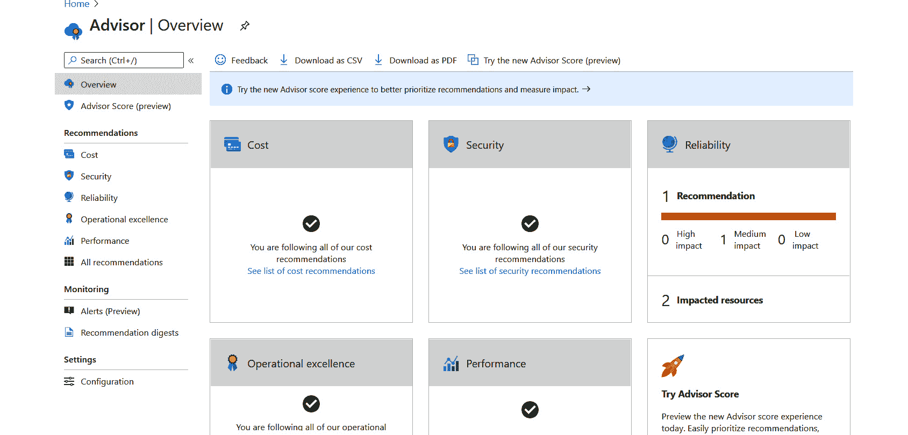
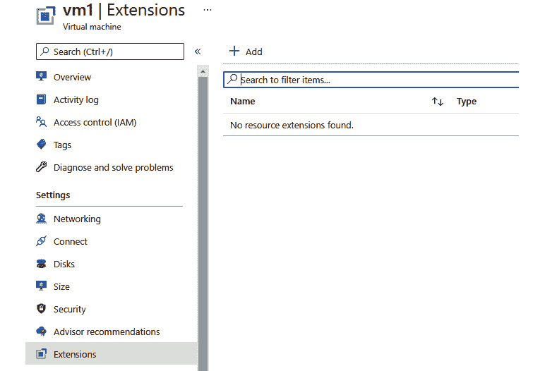
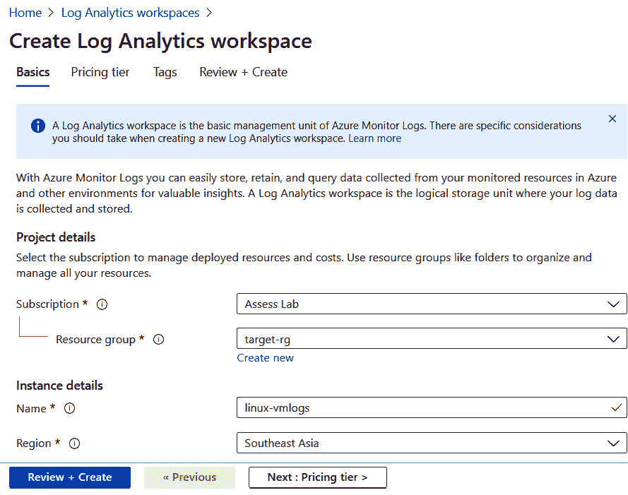
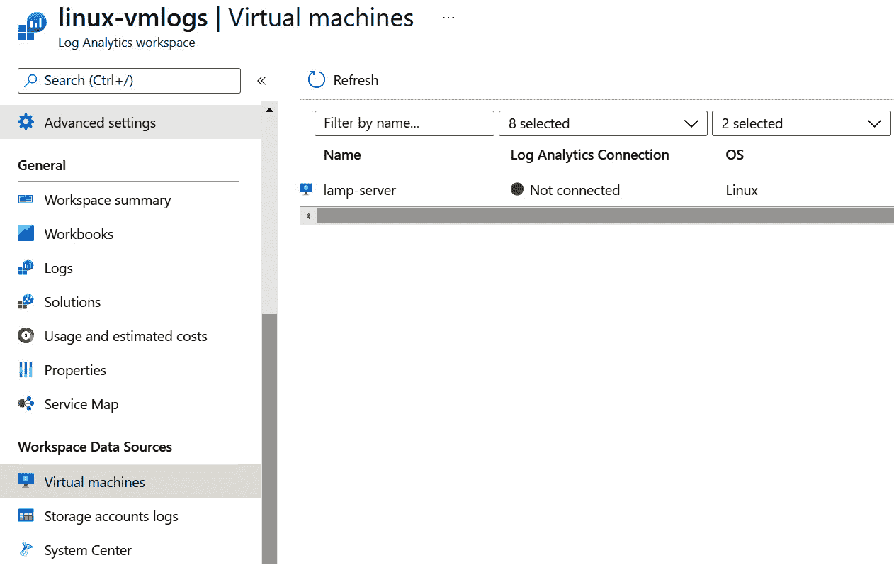
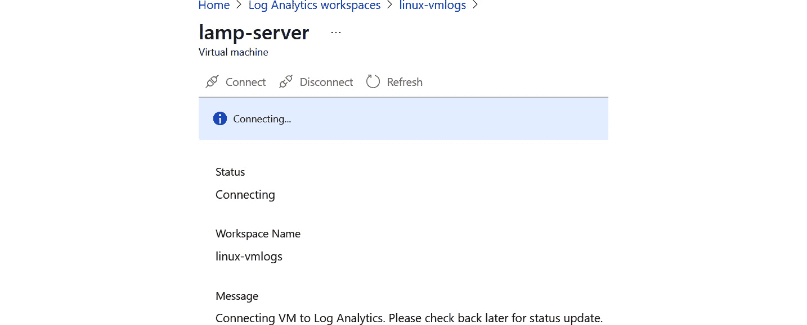
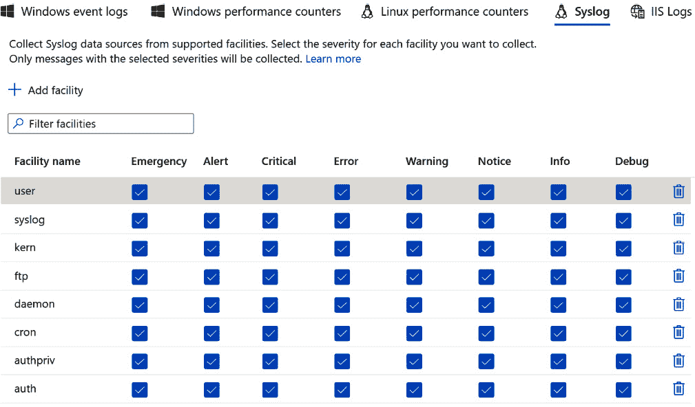
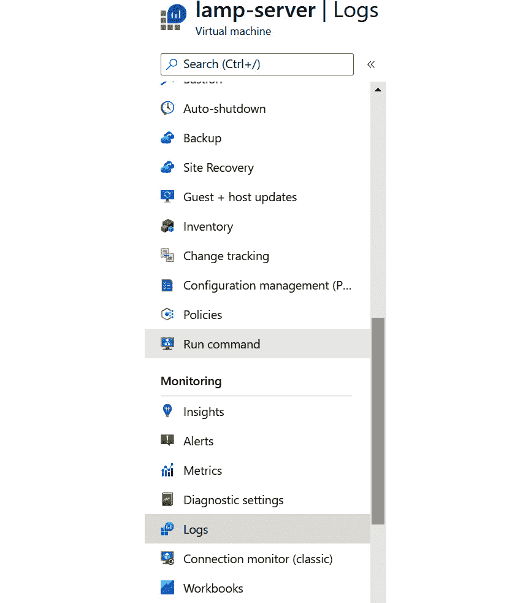

# 5.在 Azure 上操作 Linux

如果您还记得我们之前分享的迁移路线图，它是一个分四个阶段的过程。在最后两章中，我们介绍了*评估*和*迁移*里程碑。在*第 3 章*、*评估和迁移规划*中，我们讨论了正确评估和彻底规划迁移的必要性，因为它们是流程中不可避免的一部分。我们还在*第 4 章*、*中讨论了用于完成这些里程碑的工具执行到 Azure 的迁移*，并且我们将两台 Linux 服务器从 Hyper-V 迁移到 Azure。第一个服务器是 Ubuntu LTS，第二个是 MySQL 服务器，它被转换成 MySQL 服务的 Azure 数据库。

要记住的一件事是，旅程并不止于此。在本章中，我们将主要关注剩下的阶段:*优化*和*管理&保障*。我们需要确保工作负载得到优化，并且安全性是一流的。在内部环境中，安全通常完全由您来处理。但是，在云的情况下，您将工作负载部署到云提供商的数据中心。在这里，安全将是一个主要问题，但你不必担心。Azure 提供了许多服务，可以改变云部署的安全格局。

*优化*阶段主要关注分析您的成本，使用建议改进基础设施，并重新投资以实现更多目标。另一方面，*管理&安全*阶段更多地讨论安全性、数据保护以及最终监控。

本章的一些关键要点包括:

*   在 Azure 上优化成本
*   使用 Azure Linux 代理和扩展
*   Azure 上的 Linux 补丁
*   基础设施监控

让我们继续我们的迁移之旅，进入下一个里程碑*优化*，在这里我们将学习 Azure 中的一些成本优化技术。

## 优化

在这个阶段，您可能已经成功地将服务迁移到了 Azure 云。然而，正如本章导言中提到的，旅程并没有到此结束。如果您还记得，在我们的迁移过程中，我们可以选择需要在 Azure 中创建的虚拟机的大小。出于演示目的，我们让 Azure 决定目标虚拟机的大小。此时会出现几个问题，例如:*规模决策是否正确？迁移的工作负载是否高效运行？*

这些问题的答案在*优化*阶段给出。在此阶段，我们从成本和性能的角度确保迁移的工作负载高效运行。让我们继续介绍一些用于优化工作负载的工具，主要是从成本的角度。

在前面的章节中，我们讨论了在各个阶段使用的相关工具。同样地，*优化*阶段也有一套工具可供客户用来优化工作负载。让我们来看看这些工具。

### 蔚蓝成本管理

**Azure 成本管理** ( **ACM** )是一个很神奇的工具，可以用来分析不同管理范围的运行成本，比如计费账户、管理组、订阅、资源组，甚至资源层面。例如，您可以从 Azure 门户中选择任何订阅，单击成本分析刀片将为您提供与订阅中所有资源相关的成本的完整细分。*图 5.1* 显示了如何使用 ACM 中的不同图表来可视化成本:

图 5.1: ACM 视图

如果你仔细看*图 5.1* ，就在实际成本(美元)旁边，你可以在预测:图表视图打开下看到预测成本。使用当前部署的资源进行预测。除此之外，ACM 还提供了预算和警报功能，以便在您超出预算时会得到通知。此外，您可以将预算与行动组相结合，并调用 Azure Functions 或 Azure Logic Apps，以便在您跨过门槛时自动关闭工作负载。

除了上述功能，ACM 还具有以下优点:

*   您可以使用自动气象站连接器监控自动气象站的自动气象站成本。
*   ACM 提供了更丰富的 API，可以用来在您最喜欢的可视化工具中构建仪表板。

ACM 还有一个 Power BI 连接器，您可以利用它将数据从成本管理带到 Power BI。在撰写本书时，Power BI 连接器仅支持**企业协议** ( **EA** )和**微软客户协议** ( **MCA** )客户。**现收现付** ( **PAYG** )客户必须使用 API 在 Power BI 中创建仪表盘。

总之，就其提供的功能和在云支出方面提供的可见性而言，ACM 非常强大。您可以分析已迁移的服务或服务器的成本，并验证它们是否在您的预计预算范围内。如果没有，您可以考虑调整服务器的大小，前提是不影响应用的性能。

接下来，我们将进入*优化*阶段使用的下一个工具——Azure Advisor。

### 蔚蓝顾问

Azure Advisor 可以为您提供建议，帮助您审查和改进工作负载的优化和效率。Azure Advisor 现已集成到 ACM 刀片中，为降低成本提供建议。从降低成本的角度来看，建议包括调整未充分利用的 Azure 虚拟机的大小、利用额外折扣，以及将 PAYG 虚拟机转换为 Azure 保留实例，以便在 24x7 运行的工作负载上获得显著折扣。

对于未充分利用的资源，Azure Advisor 建议根据评估结果关闭实例或调整其大小。评估指标可以在这里找到:[https://docs . Microsoft . com/azure/advisor/advisor-成本-建议](https://docs.microsoft.com/azure/advisor/advisor-cost-recommendations)。

顾问的建议并不总是涉及成本，您将能够看到关于成本、安全性、可靠性、卓越运营和性能的建议。*图 5.2* 显示了来自 Advisor 刀片的视图，显示了不同的建议。在这种情况下，除了可靠性建议之外，大多数建议都已完成:

图 5.2: Azure 顾问建议

这些建议可以下载为 CSV 或 PDF 格式，您可以与在业务决策中发挥重要作用的其他利益相关方分享。

使用 ACM 分析成本并查看 Azure 顾问提出的建议将有助于您在 Azure 中优化工作负载。现在，让我们进入下一阶段的旅程，名为*管理&保护*。

## 管理和保护

在这个阶段，我们将确保我们迁移的资源是安全的，并且得到正确的管理。这一阶段的重点是安全和数据保护，我们将了解一些用于实现这些目标的工具。

Azure 中 Linux 管理最重要的部分之一是一个名为 **Linux 代理**的小组件。

### 【Azure 的 Linux 代理

Azure **结构控制器** ( **FC** )和虚拟机之间的 Linux 供应和交互由微软 Azure Linux 代理管理，也称为 **waagent** 或 **WaLinuxAgent** 。

Azure 部署上 Linux 的以下功能由 Azure Linux 代理管理:

*   供应图像
*   网络路由和接口命名
*   内核配置
*   诊断配置
*   微软**系统中心虚拟机管理器** ( **SCVMM** )部署
*   虚拟机扩展

代理通过两个渠道与 Azure 服务结构进行对话。在虚拟机部署期间，代理从包含所需配置详细信息的虚拟 DVD 映像装载符合**开放虚拟化格式** ( **OVF** )的配置文件。在运行时，通信通过代理提供的 REST API 进行，允许 Azure Fabric 向虚拟机推送信息和命令。

当创建您自己的 Linux 映像或修改现有映像时，最好记住代理不是完全单一的—它需要底层 Linux 系统的以下组件:

*   Python 2.6+
*   OpenSSL 1.0+
*   OpenSSH 5.3+
*   文件系统工具: **sfdisk** 、 **fdisk** 、 **mkfs** 、**分开**
*   密码工具: **chpasswd** 、 **sudo**
*   文本处理工具:**sed****grep**
*   网络工具: **ip 路由**

即使在没有代理的情况下在 Azure 上运行 Linux 在技术上是可能的，强烈建议始终在您的虚拟机中安装并激活代理。没有代理，您无法通过 Azure Fabric 向虚拟机运行任何远程命令。此外，Azure 不会获得任何关于虚拟机的状态信息，也不知道系统是否健康。

Azure 上所有认可的 Linux 发行版都预装了代理。对于您自己的映像，您可以从 DEB 和 RPM 包中安装代理，也可以使用基于 Python 的安装脚本。

#### 注意

您应该始终使用 Linux 发行厂商随虚拟机映像一起发行的代理版本。只有在没有适合你的 Linux 风格的官方软件包的情况下，才能手动安装。

以下是一些有用的命令，用于检查 Azure Linux 代理是否已安装并更新到最新版本:

*   To check whether it is installed and to show the current version number on Ubuntu:

    apt 列表–已安装| grep walinuxagent

    

图 5.3:检查 Ubuntu 上的 Azure Linux 代理版本号

或者，您可以运行 **waagent - version** ，它可以在任何发行版上使用，而不需要运行任何与包管理器相关的命令。

*   To update the agent or install it in the event that it is missing, run the following command:

    sudo apt-get 安装 walinuxagent

    

图 5.4:在 Ubuntu 上更新 Linux 代理

在我们的示例中，代理已经安装，并且是最新版本。

Azure Linux 代理有一个内置的自我更新机制。最好通过编辑其配置文件 **/etc/waagent.conf** 来确保启用:

#### 注意

您可以从 GitHub 了解更多关于代理的技术细节，因为代理是作为开源发布的:[https://github.com/Azure/WALinuxAgent](https://github.com/Azure/WALinuxAgent)。

使用代理的文档可以在这里找到:[https://docs . Microsoft . com/azure/virtual-machines/extensions/agent-Linux](https://docs.microsoft.com/azure/virtual-machines/extensions/agent-linux)。

熟悉 **cloud-init** 也不错，这是一个非常流行的工具，用于在 Linux 虚拟机第一次启动时定制它。它可以被认为是 Azure Linux 代理的替代品。你可以在这里读到更多关于它的信息。 **cloud-init** 适用于所有 Linux 发行版，不依赖于包管理器。

### 延伸

Azure 扩展是为 Azure 虚拟机提供配置和自动化功能的小型助手应用。一旦部署并启动了虚拟机和操作系统，就可以使用这些扩展。它们也可以在虚拟机部署期间使用 Azure 资源管理器模板来使用。

扩展是 Azure Linux 代理功能集的一部分，但是每个扩展都有自己的一组特性和用例。

要列出 Azure 上 Linux 的所有可用扩展，您可以运行以下 Azure CLI 命令:

az vm 扩展映像列表-东南亚位置-输出表

图 5.5:列出了 Azure 上所有可用的 Linux 扩展

这个列表很长，包含了微软和第三方发行商的扩展。在本例中，我们使用东南亚作为位置。除非您在特定的远程位置工作，否则您应该选择最近的地区。

#### 注意

您可以在这里探索扩展图像模块的所有选项:[https://docs.microsoft.com/cli/azure/vm/extension/image?view = azure-CLI-最新#az-vm-extension-image-list](https://docs.microsoft.com/cli/azure/vm/extension/image?view=azure-cli-latest#az-vm-extension-image-list) 。

虚拟机扩展也可以在 Azure 门户中找到(见*图 5.6* )。您可以在虚拟机属性下选择扩展，并使用安装向导添加它们:

图 5.6:Azure 门户中的扩展设置

扩展不仅对于部署工作负载及其配置非常有用，而且在故障排除和调试期间也非常有用。

### 数据保护

在 Azure 中，您的数据可以通过多种方式和多层得到保护。Azure 支持的加密模型如下:

*   客户端和服务器端加密
*   Azure 磁盘和 Azure 存储服务加密
*   Azure blobs 的客户端加密
*   数据库和数据库服务的各种加密方法
*   传输中的数据加密
*   使用密钥库进行密钥管理

根据您的迁移工作负载及其体系结构，您可能希望在项目中利用这些加密功能中的一项或多项。

例如，如果您的源虚拟机正在使用加密的文件系统，您可以按原样将其迁移到 Azure。但是，出于性能原因，关闭文件系统加密并在 Azure Storage 或托管磁盘上启用加密可能是有意义的。

如果您的整个内部存储系统都经过加密，最合理的选择是也在 Azure 存储级别进行加密。

#### 注意

您可以在加密概述文档中阅读更多关于各种加密功能的信息:[https://docs . Microsoft . com/azure/security/基本面/加密-概述](https://docs.microsoft.com/azure/security/fundamentals/encryption-overview)。

让我们仔细看看下一个特性。

### 蔚蓝磁盘加密

Linux 虚拟机 Azure 磁盘加密使用 *DM-Crypt* 为操作系统和数据磁盘提供卷加密。它与 *Azure 密钥库*集成，可管理和控制您的加密密钥和机密。还有与 Azure 安全中心的集成，如果您没有加密虚拟机磁盘，该中心可以向您发出警报:

图 5.7: Azure 安全中心

当涉及到对 Linux 虚拟机使用 Azure Disk Encryption 时，有一定的建议和限制，目前还没有直接的方法从 Linux 虚拟机上的操作系统磁盘中删除加密，这使得 ADE 操作系统加密的虚拟机在“没有引导/没有 ssh”的情况下的故障排除过程非常耗时。目前*表 5.1* 所示的内存要求适用:

表 5.1:有内存需求的虚拟机

#### 注意

加密完成后，您可以减小虚拟机的内存大小。

请记住，为了使用 Azure 磁盘加密，必须启用临时磁盘。实际上，这使得虚拟机类型 Dv4、Dsv4、Ev4 和 Esv4 无法使用磁盘加密。

另一个限制是目前不支持第 2 代虚拟机和 Lsv2 系列虚拟机。你可以在这里找到所有不支持的场景:https://docs . Microsoft . com/azure/virtual-machines/Linux/disk-encryption-Linux #不支持的场景。

支持 Azure 磁盘加密的 Linux 发行版列表非常广泛，但它只涵盖了所有认可发行版的一个子集。由于列表更新频繁，我们在此不做赘述，但您可以在 Azure 文档中找到最新列表:[https://docs . Microsoft . com/Azure/virtual-machines/Linux/disk-encryption-overview # supported-operating-system](https://docs.microsoft.com/azure/virtual-machines/linux/disk-encryption-overview#supported-operating-systems)。

接下来，让我们看看如何在 Azure 上跟上 Linux 的更新和安全补丁。

### 在 Azure 上更新 Linux

Azure 提供了更新所有支持的 Linux 发行版的机制。对于某些发行版，微软有自己的更新存储库，它是从官方上游存储库镜像而来的，而对于其他发行版，更新直接来自第三方供应商的存储库。

**红帽企业 Linux** ( **RHEL** )更新可从直接运行红帽更新基础设施的 Azure 获得。此更新存储库可用于 RHEL 的 PAYG 部署。对于使用**自带订阅** ( **BYOS** )方法部署的虚拟机，需要使用红帽自己的更新服务器或自己公司的红帽卫星服务器下载更新。

在 Azure 更新和 Azure RHUI 上阅读更多关于 RHEL 的信息。

#### 注意

如果您有一台红帽卫星服务器，您可以在 Azure 上将它与 RHEL 一起继续用于已经从内部迁移到 Azure 的虚拟机。卫星也可以用于 BYOS 装置。

你不应该使用卫星与 PAYG 图像，因为你会消费你的 RHEL 客户证书，以及消费你的 PAYG 订阅和实际上支付两倍的 RHEL 安装。

**SUSE Linux 企业服务器** ( **SLES** )的更新服务器架构略有不同:您的 SLES 虚拟机将直接从官方 SUSE 运营的存储库中获取更新。您可以从 SUSE 文档中找到有关 SLES 和 Azure 更新的更多详细信息:[https://www.suse.com/c/?s=cloud-regionsrv-client](https://www.suse.com/c/?s=cloud-regionsrv-client)。

要在 Azure 上更新您的 Linux 服务器，您可以通过 SSH 登录到服务器，并根据您的 Linux 发行版调用 **apt-get update** 或 **yum update** ，以传统的方式来完成。Azure 上的 Ubuntu 也可以从 Azure 上托管的镜像获得更新。Azure 上的 Ubuntu 映像默认配置的存储库服务器别名是**azure.archive.ubuntu.com**。该主机名被解析为资源组区域中的实际服务器:

图 5.8:查找更新服务器地址

在这个例子中，你可以看到离我最近的 Ubuntu 更新服务器位于东南亚地区，它的 IP 地址是**20.195.37.151**。

微软还提供了 Azure 更新管理，这是一个附加机制，可以帮助您管理 Linux 服务器的更新。

### 天青更新管理

为了避免手动重复工作，您可以使用 Azure 更新管理服务同时更新一台或多台服务器。该服务是 Azure Automation 的一部分，支持 Linux 和 Windows 操作系统。

Azure 更新管理并不是 Azure 中用于更新管理的唯一工具。如果您已经在使用 Ansible 进行更新管理和自动化，那么 Ansible Automation 也可以在 Azure 上使用。

目前，只有部分 Linux 发行版支持 Azure 更新管理。最新列表请参考文档:[https://docs . Microsoft . com/azure/automation/update-management/overview](https://docs.microsoft.com/azure/automation/update-management/overview)。

您可以使用 Azure 更新管理服务列出所有可用的更新，并管理为服务器安装所需更新的过程。该服务使用 Azure Linux 代理与虚拟机通信，如本章前面所述。

*图 5.9* 展示了 Azure 更新管理服务的架构:

图 5.9: Azure 更新管理架构

Azure Update Management 不会取代 Linux 发行版的正常更新机制或包管理器，但它会向那些执行所需维护任务的人发出请求。实际上，这意味着，例如，Ubuntu 更新仍然由 **apt** 工具安装，例如，在 RHEL，更新由 **yum** 管理。更新是从 Linux 安装中配置的存储库中获取的。

在 Linux 上，Azure 更新管理每小时自动轮询一次可用的更新。

现在，让我们来看看下一个在 Azure 上管理 Linux 的实践实验，以指导您在云之旅中走得更远。

## 在 Azure 上动手管理 Linux

Linux 日志可以进入日志分析工作区。在本实践练习中，我们将了解如何将迁移后的 Linux 机器中的系统日志摄取到日志分析工作区，并使用 **Kusto 查询语言** ( **KQL** )对其进行分析。

Syslog 是一种在 Linux 中广泛使用的事件日志记录协议。应用发送的消息可能会存储在本地计算机上，或者传递给系统日志收集器。使用 Linux 日志分析代理，我们将配置系统日志守护程序，将这些系统日志条目转发给代理，然后代理将消息发送到日志分析工作区，该工作区是 Azure Monitor 的一部分。在这里，我们使用日志分析代理将数据推送到日志分析工作区。

*图 5.10* 是数据如何从 Linux 机器发送到 Azure Monitor 的图形表示:

图 5.10:向 Azure 监视器发送系统日志消息

系统日志收集器支持以下功能:

*   **核**
*   **用户**
*   **邮件**
*   **守护程式**
*   **认证**
*   **系统日志**
*   lpr
*   **新闻**
*   **uucp**
*   **cron**
*   **authtype**
*   FTP
*   **local0-local7**

如果您想要收集列表之外的任何工具，那么您可能需要在 Azure Monitor 中配置一个自定义数据源。在我们的实践练习中，我们将把在*第 4 章*、*中迁移到 Azure* 的 LAMP 服务器装载到日志分析工作区，然后我们将对其进行配置以收集系统日志。

第一步是在虚拟机上运行，将日志发送到日志分析工作区。

### 创建日志分析工作区

过程非常简单—我们需要创建一个日志分析工作区，并将我们的虚拟机连接到该工作区。您可以按照这里概述的步骤来安装虚拟机:

1.  Navigate to the Azure portal and search for Log Analytics workspaces and click on that. Once you are in the Log Analytics workspaces blade, click on the New button as shown in *Figure 5.11* to create a workspace:

    

    图 5.11:添加新的工作空间

2.  Clicking on New will redirect you to the wizard to create a workspace and the Basics tab requires basic information such as Subscription, Resource group, Name, and Region. You can complete these details as shown in *Figure 5.12* and proceed to Pricing tier:

    

    图 5.12:创建日志分析工作区

3.  For Pricing tier, you can keep the default value: **Pay-as-you-go (Per GB 2018)**. You can also reserve the capacity reservation if required; however, for this hands-on exercise, it is not required.

    最后，您可以单击查看+创建，工作区将被创建。

### 加入 Azure 虚拟机

现在，您已经创建了日志将被接收到的工作区，下一个阶段是虚拟机入职。您需要打开我们创建的工作区来安装虚拟机。您可以在顶部搜索栏中搜索日志分析工作区，您将能够看到工作区的名称。点击它，打开工作区。入职步骤如下:

1.  Navigate to Virtual machines under Workspace Data Sources and you'll be able to see the virtual machine that we migrated from on-premises. Log Analytics Connection will be shown as Not connected, as seen in *Figure 5.13*:

    

    图 5.13:向工作区添加数据源

2.  Click on the virtual machine name and you will be taken to a new page where you will be able to see the Connect option, as shown in *Figure 5.14*. Please note that in order for the connect operation to succeed, the virtual machine should be in the running state, otherwise it will fail. Also, make sure that **walinuxagent** is installed, as already recommended in the *Manage and Secure* section, and that the agent is listed as Ready under the Properties blade of the virtual machine. Click on Connect, after which the extension will be configured on the virtual machine:

    

    图 5.14:连接到日志分析

3.  If you navigate back to the previous Virtual machines blade, you will be able to see that the status has been changed to Connecting, as is visible in *Figure 5.15*. This process will take some time and Log Analytics extensions will be configured on the selected virtual machine:

    

    图 5.15:验证连接状态

4.  一旦安装了扩展，虚拟机就会加入日志分析工作区。您可以通过验证连接状态为“已连接”来确认这一点。

入职完成；然而，我们仍然没有为日志分析工作区配置关于应该从虚拟机中提取什么类型的事件数据的说明。在下一节中，我们将配置数据收集。

### 数据收集

我们已经启动了我们的虚拟机，日志分析扩展已经准备好收集数据并将其接收到日志分析工作区。但是，我们需要设置数据收集，也就是说，我们需要指定需要从虚拟机中提取哪些数据集。我们可以按如下方式配置集合:

1.  Navigate back to the Log Analytics workspace we created and select Agents configuration, as shown in *Figure 5.16*:

    

    图 5.16:导航到数据收集配置

2.  Navigate to Linux performance counters and add the recommended counters. Azure will present you with a list of recommended performance counter names, as shown in *Figure 5.17*. If you require additional counters, you can click on Add performance counter and add it. Once done, click on Apply to save the configuration:

    

    图 5.17:配置性能计数器

3.  After configuring the performance counters, you can click on the Syslog tab. Clicking on Add facility will list all the facilities available to you, including auth, authpriv, and cron. Also, you can specify the logging level for each facility. You can add the following facilities as shown in *Figure 5.18*. Once added, click on Apply to save the configuration:

    

图 5.18:配置系统日志工具

这样，我们就配置了数据收集。现在，我们需要验证数据是否被吸收到日志分析工作区中，并且在完成入职后，吸收将需要一些时间。在下一节中，我们将运行一些示例查询，看看我们是否得到了结果。

### 查询数据

在前一节中，我们配置了几个性能计数器和系统日志工具，它们需要被吸收到我们的日志分析工作区中。现在，我们将使用 KQL 查询这些日志，并验证我们是否从虚拟机获取了数据。

将有不同的表来存储性能、系统日志和其他数据。您可以通过将查询范围限定到特定虚拟机来查询虚拟机的日志。如果从工作区级别运行查询，将返回所有已运行虚拟机的日志。不过，您也可以从这里更改范围。在我们的案例中，只有一台虚拟机连接到工作区，因此从虚拟机刀片或日志分析刀片进行查询是相同的。但是，让我们从虚拟机刀片进行查询，以确保我们看到的是正确的范围:

1.  Navigate to Virtual machines and open the virtual machine we migrated from on-premises in *Chapter 4*, *Performing migration to Azure*. From Monitoring, select Logs, as shown in *Figure 5.19*:

    

    图 5.19:从虚拟机刀片导航到日志

2.  To list all the tables in the workspace, you can run a **search** *** | distinct $table**, in the query window and see the results in the Results window. An example is shown in *Figure 5.20*:

    

    图 5.20:列出日志分析工作区中的所有表

3.  在结果中，可以看到多个表，如 **Syslog** 、 **VMProcess** 、 **VMBoundPort** 、 **VMConnection** 、 **Perf** 。让我们查询一些表并检查结果。以下所有脚本都需要在查询窗口中运行。
4.  Return all informational logs where the **syslog** message contains **rsyslog**:

    Syslog |其中 severity level = =“info”，SyslogMessage 包含“rsyslog”

5.  Render a time chart for the **% Used Memory** performance counter:

    性能|其中计数器名称= = %已用内存

    |项目时间生成，抵消值

    |渲染时间表

6.  Return all external connections made by processes, including the destination IP and port number:

    vrconnection

    | where DestinationIp！从“127.0.0”开始

    | distinct ProcessName、DestinationIp、DestinationPort

您可以使用可用的数据集运行任何类型的查询。KQL 非常强大，它可以在你的数据集上创造奇迹。通过本练习，我们已经完成了动手实验。在本实验中，我们将我们在*第 4 章*、*中迁移的内部虚拟机迁移到 Azure* ，迁移到日志分析工作区，并将性能和系统日志摄入工作区。此外，我们使用 KQL 查询摄取的数据，以获得一些结果和时间图。

## 总结

本章介绍了如何在 Azure 上有效操作 Linux 的各种细节。首先，我们经历了*优化*阶段，包括 ACM 和 Azure Advisor 工具。然后，我们进入了*管理&安全*阶段，在该阶段，我们花了一些时间使用数据保护功能以及 Azure Linux 代理。

就在动手实验之前，您还学习了 Azure 更新管理如何与各种 Linux 发行版的更新机制相结合。

我们现在已经讨论了关于评估、迁移和在 Azure 上操作 Linux 的所有主题。当事情不像你预期的那样运作时会发生什么？让我们在下一章中找到答案，我们将指导您在 Azure 上对 Linux 进行故障排除。