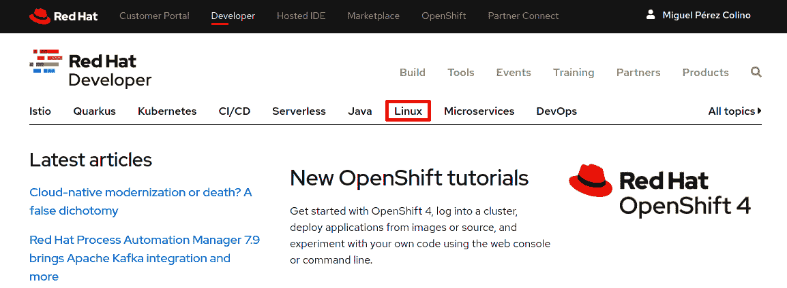
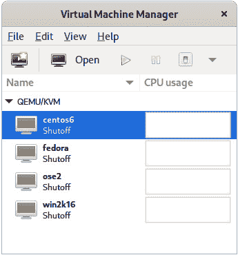
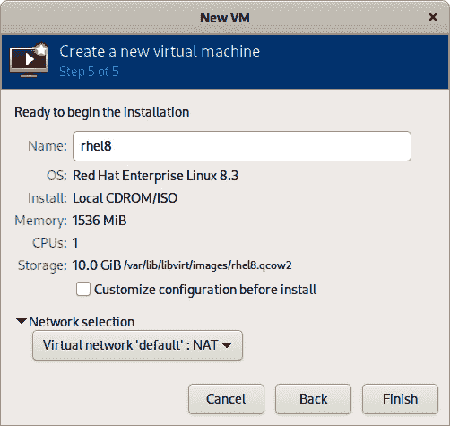
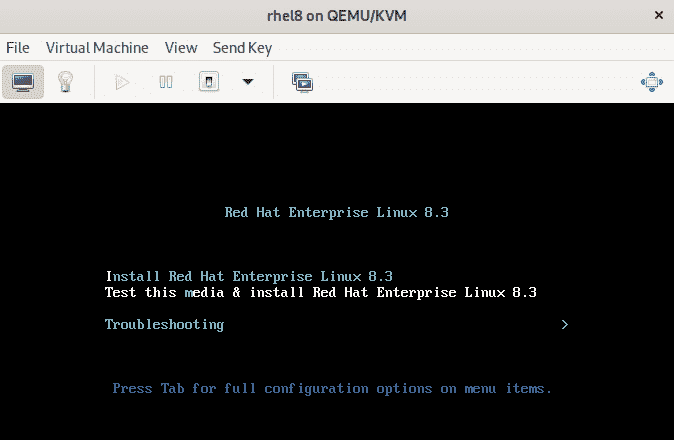
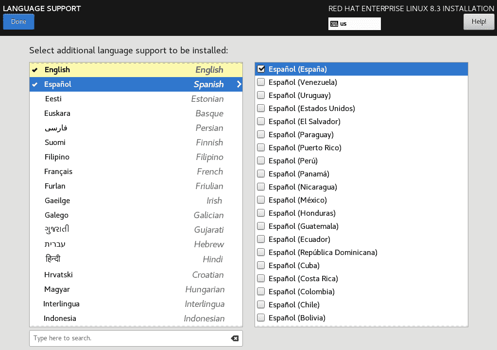
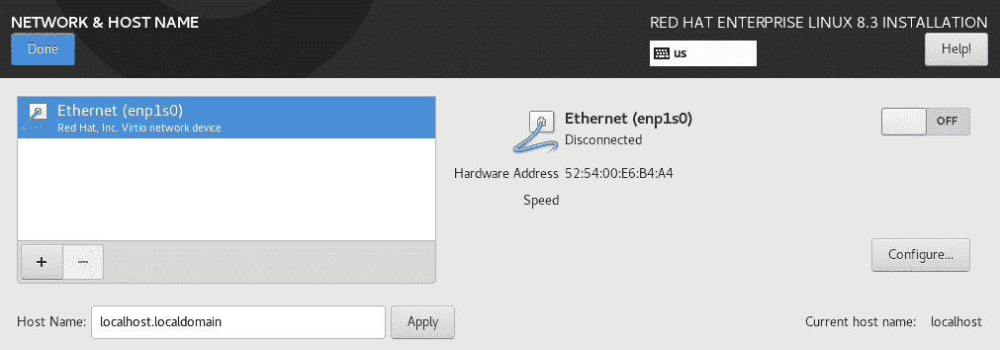
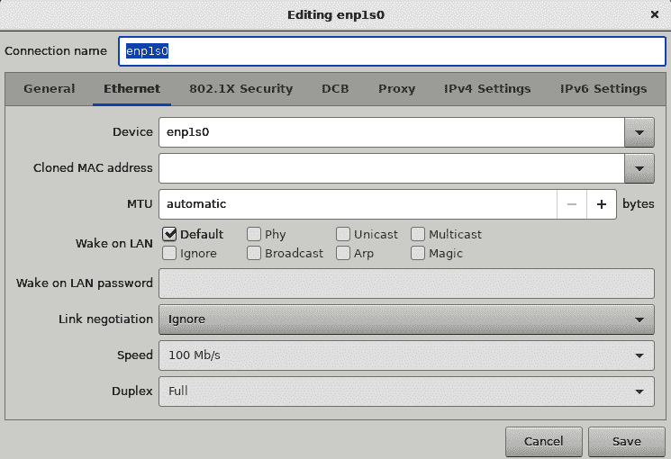
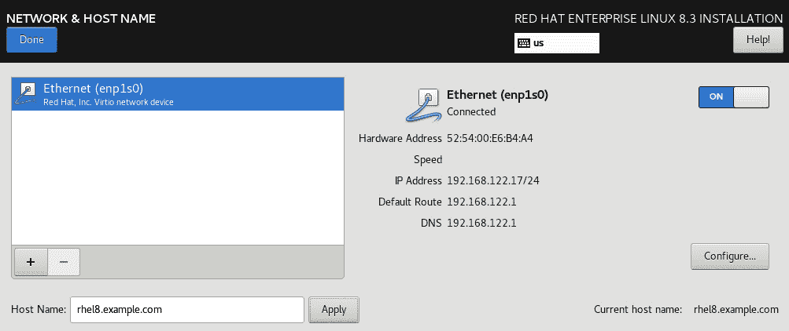
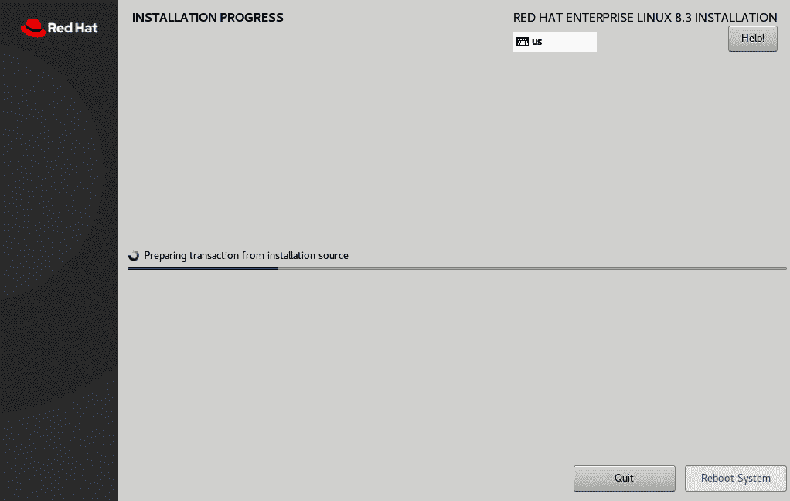

# *第 1 章*:安装 RHEL8

开始使用**Red Hat Enterprise Linux**或**RHEL**的第一步是让它运行。 无论是在您自己的笔记本电脑中作为主要系统，在虚拟机中，还是在物理服务器中，为了获得您想要学习使用的系统，它的安装都是必要的。 我们强烈建议您在阅读本书时使用物理或虚拟机来使用系统。

在本章中，您将部署自己的 RHEL8 系统，以便能够理解本书中提到的所有示例，并了解更多关于 Linux 的知识。

本章所涵盖的主题如下:

*   获取 RHEL 软件和订阅
*   Installing RHEL8

# 技术要求

最好的开始方式是使用一个**RHEL8**虚拟机。 您可以在您的主计算机中以虚拟机或物理机的形式进行操作。 在本章的下一节中，我们将回顾这两种选择，您将能够运行自己的 RHEL8 系统。

提示

虚拟机是一种模拟完整计算机的方法。 为了能够在您自己的笔记本电脑上创建这个仿真计算机，如果您使用的是 macOS 或 Windows，您将需要安装虚拟化软件，例如 Virtual Box。 如果您已经在运行 Linux，那么它已经为虚拟化做好了准备，您只需要添加`virt-manager`包。

# 获取 RHEL 软件及订阅

要能够部署 RHEL，您需要**Red Hat Subscription**来获取要使用的映像，以及访问带有软件和更新的存储库。 您可以在 Red Hat 开发者门户网站通过以下链接免费获取**开发者订阅**:[developers.redhat.com](http://developers.redhat.com)。 然后你需要遵循以下步骤:

1.  在[developers.redhat.com](http://developers.redhat.com)登录或创建一个帐户。
2.  Go to the [developers.redhat.com](http://developers.redhat.com) page and click on the **Log In** button:

    

    图 1.1 - developers.redhat.com 主页，指示单击何处登录

3.  Once in the login page, use your account or, if you do not have one, create it by clicking on **Register** in the top-right corner or on the **Create one now.** button directly in the registration box, as follows:

    

    图 1.2 - Red Hat 登录页面(所有 Red Hat 资源共用)

    您可以选择在几个服务中使用您的凭据(换句话说，*谷歌*、*GitHub*或*Twitter*)，如果您愿意这样做的话。

4.  Once you have logged in, go to the **Linux** section

    您可以在内容前面的导航栏中找到**Linux**部分:

    

    图 1.3 -访问 developers.redhat.com 上的 Linux 页面

    点击**下载 RHEL**，它在下一页显示为一个漂亮的按钮:

    

    图 1.4 -在 developers.redhat.com 上访问 RHEL 下载页面

    然后为**x86_64 (9 GB)**体系结构选择ISO 映像(这是基于 Intel 和 amd 的计算机中使用的映像):

    

    图 1.5 -为 x86_64 选择 RHEL8 的 ISO 下载

5.  获得**RHEL8 ISO**图像为:


图 1.6 - x86_64 的 RHEL8 下载对话框

ISO 映像是一个包含完整 DVD 内容的精确副本的文件(即使我们没有使用 DVD)。 这个文件将随后被用来安装我们的机器,是否倾销到 USB 驱动器为*裸金属安装,打开它对于网络安装,或者将它对于虚拟机安装(或使用带外功能服务器如 IPMI,国际劳工组织,或 iDRAC)*

 *提示

为了验证 ISO 图像，并确保我们获得的图像没有被破坏或篡改，可以使用一种称为“校验和”的机制。 校验和是一种检查文件并提供一组字母和数字的方法，这些字母和数字可用于验证文件是否与原始文件完全相同。 Red Hat 在 Customer Portal([https://access.redhat.com/](https://access.redhat.com/))的下载部分提供了一个`sha256`校验和列表。 可以在这里找到描述该过程的文章:[https://access.redhat.com/solutions/8367](https://access.redhat.com/solutions/8367)。

我们有软件，在本例中是 ISO 映像，可以在任何计算机上安装 RHEL8。 这些都是在世界范围内的生产机器中使用的相同的位，您可以将自己用于学习目的与您的开发人员订阅。 现在是时候在下一节中尝试一下了。

# 安装 RHEL8

在本章的部分中，我们将按照典型的安装过程将 RHEL 安装到一台机器上。 我们将遵循默认的步骤，检查每个选项。

## 物理服务器安装准备

物理的服务器在开始安装之前需要进行一些初始设置。 常见的步骤包括配置磁盘的内部数组*,它连接到网络,准备任何*界面聚合开关*,预计(合作,结合),*准备访问外部磁盘阵列*【显示】(换句话说,光纤通道数组*), 设置带外功能，并保护**BIOS**配置。

除了引导序列之外，我们不会讨论这些准备工作的细节。 服务器将需要从外部设备(如*USB u 盘*或*光盘*(无论是物理的还是通过带外功能模拟的)引导(开始加载系统)。

要从带有 Linux 或 macOS 的机器上创建可引导的 USB 拇指驱动器，只需使用`dd`应用程序进行“磁盘转储”即可。 执行以下步骤:

1.  Find your USB device in the system, usually `/dev/sdb` in Linux, or `/dev/disk2` in macOS (in macOS, this command requires special privileges; please run it as `sudo dmesg | grep removable`):

    ```sh
    $ dmesg | grep removable
    [66931.429805] sd 0:0:0:0: [sdb] Attached SCSI removable disk
    ```

    重要提示

    请非常仔细地验证磁盘名称，因为使用“磁盘转储”的过程将完全覆盖磁盘目标。

    检查 USB 是否挂载，如果挂载，请将其卸下(macOS 用户请使用`diskutil list`确定设备是否挂载):

    ```sh
    $ lsblk /dev/sdb
    NAME   MAJ:MIN RM  SIZE RO TYPE MOUNTPOINT
    sdb      8:0   1  3,8G  0 disk 
    ├─sdb1   8:1    1  1,8G  0 part /run/media/miguel/USB
    ├─sdb2   8:2    1 10,9M  0 part 
    └─sdb3   8:3    1 22,9M  0 part
    ```

    在这种情况下，只有`sdb`磁盘的分区 1(称为`sdb1`)被挂载。 我们需要*卸载*安装的所有分区。 在本例中，这很简单，因为只有一个。 为此，我们可以运行以下命令:

    重要提示

    使用**超级用户**或**sudo,管理任务,比如卸载设备,我们可以开一个【显示】管理员壳(在 Linux 和 unix 类系统`root`)或运行命令使用`sudo`,为当前用户提供管理权限。 当使用`sudo`运行命令时，将要求用户输入他们的密码(不是管理员密码，而是用户自己的密码)来继续执行(这个默认行为可能会在`sudoers`配置文件中被覆盖)。**

    ```sh
    **$ sudo umount /dev/sdb1**
    ```

    **转储映像! (警告，这会擦除选定的磁盘!)**

    ```sh
    **$ sudo dd if=rhel-8.3-x86_64-dvd.iso of=/dev/sdb bs=512k**
    ```

    **提示**

    **可以使用其他方法创建启动设备。 可以使用其他图形工具创建可以帮助选择映像和目标设备的启动设备。 在 Fedora Linux (RHEL 基于的社区发行版，并且是许多工程师和开发人员的工作站)中，可以使用**Fedora Media Writer**工具。 对于其他环境，**UNetbootin**工具也可以用于创建引导介质。**

 **现在，有了 USBu 盘，我们可以安装任何物理机器，从小型笔记本电脑到大型服务器。 下一部分涉及从**USB u 盘**引导物理机器。 这样做的机制将取决于所使用的服务器。 然而，在启动过程中提供选择启动设备的选项正变得越来越普遍。 下面以选择笔记本电脑的临时启动设备为例:

1.  Interrupt the normal startup. In this case, the boot process shows that I can do that by pressing *Enter*:

    

    图 1.7 -中断正常启动的 BIOS 消息示例

2.  Choose a temporary start up device, in this case by pressing the *F12* key:

    

    图 1.8 -中断启动的 BIOS 菜单示例

3.  选择要从其中引导的设备。 我们想要从 u 盘引导，在本例中，u 盘是**USB 硬盘:ChipsBnk 闪存盘**:


图 1.9 - BIOS 菜单中选择 USB 硬盘启动设备的示例

让系统从 USB 驱动器启动安装程序。

一旦我们知道了如何使用 RHEL 安装程序准备 USB 驱动器，以及如何使物理机从它启动，我们就可以跳到本章的*运行 RHEL 安装*一节，然后进行安装。 如果我们有一台迷你服务器(换句话说，一台英特尔 NUC)、一台旧电脑或一台笔记本电脑，那么这将非常有用。

接下来，我们将看看如何在您的安装中准备一个虚拟机，以防您正在考虑使用当前的主膝上型电脑(或工作站)执行本书，但您仍然希望保留一个单独的机器来工作。

## 虚拟服务器安装准备

虚拟服务器**的工作原理与在当前系统中模拟真实机器的虚拟化软件类似。 在 Linux 工作站安装`virt-manager`将增加所有底层的组件需要运行(对于您的信息,这些**【显示】组件 KVM**,**Libvirt【病人】,**Qemu**,**virsh【t16.1】,在)。 其他免费虚拟化软件，推荐用于 Windows 或 macOS 系统，包括**Oracle VirtualBox**和**VMware Workstation Player**。******

本节中的示例将使用`virt-manager`执行，但很容易适用于任何其他虚拟化软件，无论是笔记本电脑还是大型部署。

初步步骤已经在上面描述过，并且需要获得**Red Hat Enterprise Linux ISO**映像，在本例中，该映像将是`rhel-8.3-x86_64-dvd.iso`。 下载完成后，如果可能，检查了它的完整性(如*获取 RHEL 软件和订阅*一节的最后一个技巧中提到的)，让我们准备部署一个虚拟机:

1.  Start your virtualization software, in this case, `virt-manager`:

    

    图 1.10 -虚拟管理器主菜单

2.  Create a new virtual machine by going to **File** and then clicking on **New Virtual Machine**. Select **Local install media (ISO Image or CDROM)**:

    

    图 1.11 -虚拟管理器-新虚拟机菜单

3.  Select the *ISO image*. With this, the virtual machine will be configured with a **virtual DVD/CDROM drive** and already prepared to boot from it. This is customary behavior. However, when using a different virtualization software, you may want to perform a check:

    

    图 1.12 -选择 ISO 镜像作为安装介质的虚拟管理器菜单

4.  Assign memory and CPU to the virtual machine we are creating (note: a virtual machine is usually referred to as a **VM**). For **Red Hat Enterprise Linux 8** (also referred to as **RHEL8**), 1.5 GB of memory is the minimum, while 1.5 GB per logical CPU is recommended. We will use the minimum settings (1.5 GB memory, 1 CPU core):

    

    图 1.13 -选择内存和 CPU 的虚拟管理器菜单

    是时候分配至少一个磁盘给虚拟机了。 在这种情况下，我们将分配一个磁盘的最小磁盘空间，10gb，但在未来的章节中，我们将能够分配更多的磁盘来测试其他功能:

    

    图 1.14 -创建新磁盘并将其添加到虚拟机的虚拟管理器菜单

5.  我们的虚拟机器拥有启动所需要的一切:启动设备、内存、CPU 和磁盘空间。 在最后一步中，添加了一个网络接口，所以现在我们甚至有了一个网络。 让我们回顾一下数据并启动它:



图 1.15 -用于选择虚拟机和网络名称的虚拟管理器菜单

在执行这些步骤之后，我们就有了一个功能齐全的虚拟机。 现在是时候通过在其上安装 RHEL 操作系统来完成这个过程了。 在下一节中检查如何做到这一点。

## 运行 RHEL 安装

一旦我们准备好了要安装的虚拟服务器或物理服务器，就可以继续了。 如果我们到达下面的屏幕，我们将知道前面的所有步骤是否正确执行:



图 1.16 - RHEL8 安装的初始引导屏幕，选择 Install

我们有三个选项(*选择白色*):

*   **Install Red Hat Enterprise Linux 8.3**:该选项将引导并运行安装程序。
*   **Test this media&install Red Hat Enterprise Linux 8.3**:该选项将检查正在使用的映像，以确保它没有损坏，并确保安装能够顺利进行。 建议首次使用刚下载的 ISO 镜像或刚创建的媒体，如 u 盘或 DVD(在虚拟机中，运行检查大约需要 1 分钟)。
*   **Troubleshooting**: This option will help you review other options in case there are problems with installation, with a running system, or with hardware. Let's take a quick look at the available options on this menu:

    -**在基本图形模式下安装 Red Hat Enterprise Linux 8.3**:这个选项对于使用旧显卡和/或不支持显卡的系统是有用的。 在发现可视化问题时，它可以帮助安装系统。

    -**Rescue a Red Hat Enterprise Linux system**:当我们有一个系统启动问题或者当我们想要访问它来内省它(换句话说，检查一个可能被破坏的系统)时，这个选项可以使用。 它将启动一个基本的内存系统来执行这些任务。

    ——**运行内存测试**:可以检查,以防止系统内存问题,在一个全新的服务器的情况下,例如,我们希望确保其内存运行正确,或一个系统遭受问题和恐慌,可能表明一个与内存相关的问题。

    -**从本地驱动器启动**:如果你从安装介质启动，但你已经安装了一个系统。

    -**返回主菜单**:返回上一个菜单。

    重要提示

    RHEL 引导菜单将显示几个选项。 选中的文件将显示为白色，带有一个不同颜色的字母，在本例中，“i”代表安装，“m”代表测试媒体。 这些都是快捷方式。 按下这个键，我们就可以直接找到这个菜单项。

让我们继续用**测试这个介质&安装 Red Hat Enterprise Linux 8.3**，让安装程序检查我们正在使用的 ISO 映像:


图 1.17 - RHEL8 ISO 镜像自检

完成后，将到达第一个安装画面。 安装程序名为，名为**Anaconda**(一个笑话，因为它是用**Python**语言编写的，而且遵循循序渐进的方法)。 重要的是要注意我们将在安装过程中选择的选项，因为我们将在本书后面的*使用 Anaconda*自动化部署部分回顾它们。

### 本地化

安装的第一步是选择安装语言。 本次安装，我们将选择**英语**，其次是**英语(美国)**:


图 1.18 - RHEL8 安装菜单-语言

如果你不能很容易找到你的语言，你可以在列表下的框中输入它来搜索它。 选择语言后，可以点击**Continue**button 继续。 这将带我们进入**安装摘要**屏幕:


图 1.19 - RHEL8 安装菜单-主界面

在**INSTALLATION SUMMARY**屏幕上，显示了所需的所有配置部分，其中许多部分(下面没有警告标志和红色文本的部分)已经预先配置为默认值。

让我们回顾一下**本地化**设置。 一、**键盘**:


图 1.20 - RHEL8 安装-键盘选择图标

我们可以查看键盘设置，这不仅可以改变键盘，还可以添加额外的布局，以防我们想要在它们之间切换:


图 1.21 - RHEL8 安装-键盘选择对话框

这可以通过点击**+**按钮来完成。 下面是一个添加**西班牙语的例子; Castilian(西班牙语)**布局。 我们搜索`spa`，直到它出现，然后选择它，然后点击**添加**，如下:


图 1.22 - RHEL8 安装-键盘选择列表

要使其成为默认的选项，需要点击下面的**^**按钮。 在本例中，我们将把它作为第二个选项，以便安装支持软件。 完成后，点击**完成**:


图 1.23 - RHEL8 安装-不同键盘的键盘选择对话框

现在，我们将把移到**语言支持**:


图 1.24 - RHEL8 安装-语言选择图标

在这里，我们还可以添加我们的本地语言。 在本例中，我将使用**Español**，然后使用**Español (España)**。 这将再次包括支持已添加的语言所需的软件:



图 1.25 - RHEL8 安装-不同语言的语言选择对话框

我们将继续配置这两种语言，尽管您可能希望选择自己的本地化语言。

现在，我们将继续**时间&日期**，可以看到如下:


图 1.26 - RHEL8 安装-时间和日期选择图标

默认配置设置为美国的纽约市。 这里有两种可能性:

*   使用你当地的时区。 当您希望在该时区注册所有日志时(换句话说，因为您只在一个时区工作，或者因为每个时区都有本地团队)，建议这样做。 在这个例子中，我们正在选择**西班牙、马德里、欧洲**时区:


图 1.27 - RHEL8 安装-时间和日期选择对话框-马德里选中

*   使用**协调世界时**(也称为**UTC**)使全球所有服务器拥有相同的时区。 **Region:**|**Etc**，然后**City:**|**Coordinated Universal Time**:


图 1.28 - RHEL8 安装-时间和日期选择对话框- UTC 选择

我们将继续使用西班牙、马德里和欧洲的本地化时间，尽管您可能希望选择本地化时区。

提示

正如您在屏幕上看到的，有一个选项可以选择**Network Time**以使机器的时钟与其他机器同步。 该选项只能在网络配置完成后选择。

### 软件

**定位**配置完成(或接近完成; 稍后我们可能会回到网络时间)，我们继续到**软件**部分，或者，更准确地说，到它下面的**连接到 Red Hat**:


图 1.29 - RHEL8 install - Connect to Red Hat 选择图标

在本节中，我们可以使用自己的 Red Hat 帐户，就像我们之前在[developers.redhat.com](http://developers.redhat.com)下创建的帐户一样，来访问系统的最新更新。 要配置它，我们首先需要配置网络。

出于此部署的目的，我们现在不配置此部分。 我们将在本书第七章[](07.html#_idTextAnchor111)*、*添加、打补丁和管理软件*中回顾如何管理订阅和获取更新。*

 *重要提示

使用 Red Hat 卫星进行系统管理:对于超过 100 台服务器的大型部署，Red Hat 提供了“Red Hat 卫星”，它具有高级的软件管理功能(例如版本化内容视图、使用 OpenSCAP 的集中安全扫描以及简化的 RHEL 补丁和更新)。 为了连接到红帽卫星，可以使用激活密钥，从而简化系统的管理。

现在让我们继续**安装源**，如下所示:


图 1.30 - RHEL8 install -安装源图标

这可以用于使用远程源进行安装。 当使用只包含安装程序的引导 ISO 映像时，它非常有用。 在本例中，由于我们使用完整的 ISO 映像，它已经包含完成安装所需的所有软件(也称为*包*)。

下一步是**Software Selection**，如下截图所示:


图 1.31 - RHEL8 安装-软件选择图标

在这个步骤中，我们可以选择要安装在系统上的一组预定义的包，这样系统就可以执行不同的任务。 虽然在这个阶段这样做非常方便，但我们将采用一种更手动的方法，并选择**Minimal Install**配置文件稍后向系统添加软件。

这种方法还具有减少**攻击面**的优势，只需在系统中安装最小的包:


图 1.32 - RHEL8 install - Software Selection menu; 选择最小的安装

### 系统

选择了包集之后，让我们转到**System**配置部分。 我们将从安装的目的地开始，在那里我们可以选择一个或多个磁盘用于安装和配置它们:


图 1.33 - RHEL8 install -安装目标图标带有警告标志，表示此步骤未完成

这项任务非常重要，因为它不仅将定义系统在磁盘上的部署方式，而且还将定义如何分布磁盘以及使用哪些工具。 即使在本节中，我们也不会使用高级选项。 我们将花一些时间来审查主要选项。

这是默认的**Device Selection**屏幕，只发现一个本地标准磁盘，没有**Specialized&Network Disks**选项，准备运行**自动**分区。 这可以从下面的截图中看到:


图 1.34 - RHEL8 install - INSTALLATION DESTINATION 菜单，选择了自动分区

单击本部分中的**Done**将完成继续安装所需的最小数据集。

让我们回顾一下这些部分。

**本地标准磁盘**是安装程序使用的一组磁盘。 它可能是这样的情况，我们有几个磁盘，我们只想使用一个特定的磁盘:


图 1.35 - RHEL8 install - INSTALLATION DESTINATION 菜单，选择了几个本地磁盘

这是一个有三个可用磁盘且只使用第一个和第三个磁盘的示例。

在我们的例子中，我们只有一个磁盘，并且它已经被选中:


图 1.36 - RHEL8 install - INSTALLATION DESTINATION 菜单，选择单个本地磁盘

通过选择**Encrypt my data**，可以很容易地使用全磁盘加密，对于笔记本电脑安装或安装在信任级别较低的环境中，强烈建议使用:


图 1.37 - RHEL8 install - INSTALLATION DESTINATION 菜单，带有数据加密选项(未选中)

对于本例，我们将不加密驱动器。

**自动**安装选项将自动分配磁盘空间:


图 1.38 - RHEL8 install - INSTALLATION DESTINATION 菜单; 存储配置(自动)

它将通过创建以下资源来实现这一点:

*   `/boot`:分配系统核心(`kernel`)的空间和引导过程中的帮助文件(例如初始引导映像`initrd`)。
*   `/boot/efi`:支持 EFI 引导进程的空间。
*   `/"`:根文件系统。 这是系统所在的主要存储空间。 其他磁盘/分区将分配给文件夹(这样做时，它们将被称为`mountpoints`)。
*   `/home`:用户将存储个人文件的空间。

让我们选择这个选项，然后单击**Done**。

提示

系统分区和引导过程:如果您仍然不能完全理解关于系统分区和引导过程的一些扩展概念，请不要担心。 为了介绍文件系统、分区以及如何管理磁盘空间，有一章专门介绍了*管理本地存储和文件系统*。 为了回顾引导过程，有一章题为*理解引导过程*，该章将逐步回顾整个系统的启动顺序。

下一步涉及查看**Kdump**或**Kernel Dump**。 这是一种机制，允许系统保存状态，以防发生关键事件并崩溃(它转储内存，因此它的名字):


图 1.39 - RHEL8 install - Kdump 配置图标

为了工作，它将为自己保留一些内存，等待在系统崩溃时采取行动。 默认配置很好地计算了需求:


图 1.40 - RHEL8 install - Kdump 配置菜单

点击**Done**将进入下一步**Network&Host Name**，显示如下:


图 1.41 - RHEL8 install - Network & Host Name 配置图标

本节将帮助将系统连接到网络。 在虚拟机的情况下，对外部网络的访问将由**虚拟化软件**处理。 很常见,默认配置使用**网络地址转换**(**NAT)和【显示】**动态主机配置协议(DHCP**),这将提供一个网络配置【病人】虚拟机和访问外部网络。**

进入配置页面后，我们可以看到有多少网络接口分配给了我们的机器。 在这种情况下，只有一个，如下所示:



图 1.42 - RHEL8 install - NETWORK & HOST NAME 配置菜单

首先，我们可以通过点击右边的**on /OFF**开关来启用接口。 要关闭它，它看起来是这样的:


图 1.43 - RHEL8 install - NETWORK & HOST NAME 配置开关(OFF)

要打开它，它应该是这样的:


图 1.44 - RHEL8 install - NETWORK & HOST NAME 配置开关(ON)

我们将看到接口现在有一个配置(**IP 地址**、**默认路由**和**DNS**):


图 1.45 - RHEL8 install - NETWORK & HOST NAME 配置信息详细信息

为了使这个永久更改，我们将点击屏幕右下角的**配置**按钮来编辑界面配置:



图 1.46 - RHEL8 安装- NETWORK & HOST NAME 配置; 接口配置; 以太网选项卡

点击**General**标签将显示主要选项。 我们将选择**自动连接，优先级**，并保留值为**0**，如下所示:


图 1.47 - RHEL8 安装- NETWORK & HOST NAME 配置; 接口配置; General 选项卡

点击**Save**将使更改永久保存，并且在默认情况下启用此网络接口。

现在是时候给我们的虚拟服务器命名了。 我们将转到主页面的**主机名**部分，并键入我们想要的名称。 我们可以使用`rhel8.example.com`，然后点击**应用**:


图 1.48 - RHEL8 安装- NETWORK & HOST NAME 配置; 主机名的细节

提示

域`example.com`用于演示目的，在任何场合使用它都是安全的，因为它不会碰撞或对其他系统或域造成任何麻烦。

网络页面看起来像这样:



图 1.49 - RHEL8 install - NETWORK & HOST NAME 配置菜单; 配置完成

点击**Done**将带我们回到主安装页面，系统已连接到网络，并准备在安装完成后进行连接。

标题为*启用网络连接*的章节将更详细地描述在 RHEL 系统中可用的配置网络的选项。

重要提示

现在系统连接到网络,我们可以回到**时间&日期**,使网络时间(由安装程序自动完成),以及去**连接 Red Hat**订阅系统 Red Hat 的**内容分发网络**(或**CDN)。 本系统对 CDN 的订阅将在[*第七章*](07.html#_idTextAnchor111)、*添加、补丁和管理软件*中详细说明。**

现在是时候回顾最后一个系统选项，安全配置文件，通过转到**安全策略**，如下所示:


图 1.50 - RHEL8 安装-安全策略配置图标

在它中，我们将看到在我们的系统中可以默认启用的安全配置文件列表:


图 1.51 - RHEL8 install - SECURITY POLICY configuration 菜单

安全配置文件有我们在本安装中没有涉及的需求(例如拥有单独的`/var`或`/tmp`分区)。 我们可以点击**Apply security policy**将其关闭，然后点击**Done**:


图 1.52 - RHEL8 install -安全策略配置开关(关闭)

关于这个主题的更多内容将在[*第 11 章*](11.html#_idTextAnchor152)*，OpenSCAP 的系统安全配置文件*中讨论。

### 用户设置

在 Unix 或 Linux 系统中，主要的管理员用户称为`root`。

我们可以通过单击**root Password**部分来启用一个根用户，尽管这不是必需的，而且在安全受限的环境中，建议您不要这样做。 我们将在本章中这样做，以便学习如何做到这一点，并解释涉及的案例:


图 1.53 - RHEL8 install - Root 密码配置图标(警告，因为它没有设置)

点击**Root 密码**，弹出对话框输入:


图 1.54 - RHEL8 install - Root Password configuration 菜单

建议设置如下密码:

*   超过 10 个字符(最少 6 个字符)
*   大写和小写
*   数字
*   特殊字符(如$、@、%和&)

如果密码不符合这些要求，它将警告我们，并将迫使我们点击**Done**两次以使用弱密码。

现在可以通过单击**user Creation**为系统创建一个用户:


图 1.55 - RHEL8 install - User Creation 配置图标(警告，因为它没有完成)

这将把我们带到一个输入用户数据的部分:


图 1.56 - RHEL8 install - User Creation configuration 菜单

这里将应用与前一节中相同的密码规则。

单击**使此用户成为管理员**将启用管理任务的执行(而且也不需要配置`root`密码)。

提示

作为一种良好的实践，不要对根帐户和用户帐户使用相同的密码。

[*第 5 章*](05.html#_idTextAnchor081)*，使用用户、组和权限保护系统*中有一节介绍了如何使用`sudo`工具来管理用户的管理权限。

点击**Done**返回主安装程序界面。 安装程序已准备好继续安装。 主页看起来像这样:


图 1.57 - RHEL8 安装-主菜单一旦完成

点击**开始安装**上的将启动安装过程:

重要提示

如果省略了启动安装所需的任何步骤，**开始安装**按钮将变为灰色，因此无法单击。



图 1.58 - RHEL8 安装-正在进行安装

一旦安装完成，我们可以点击**Reboot System**，它就可以使用了:


图 1.59 - RHEL8 安装-安装完成

记住从虚拟机卸载 ISO 映像(或从服务器移除 USB u 盘)，并检查系统中的引导顺序是否配置正确，这一点很重要。

您的第一个 Red Hat Enterprise Linux 8 系统现在已经准备好了! 祝贺你。

如您所见，在虚拟机或物理机中安装 RHEL 并将其用于我们希望在其中运行的任何服务是很容易的。 在云中，这个过程是非常不同的，因为机器是由映像实例化来运行的。 在下一章中，我们将回顾如何在云中的虚拟机实例中运行 RHEL。

# 总结

*Red Hat Certified System Administrator*考试是完全实用的，基于真实世界的经验。 准备它的最好方法是尽可能多地实践，这就是为什么本书首先提供了对 Red Hat Enterprise Linux 8(RHEL8)的访问，并提供了如何部署自己的虚拟机的替代方案。

关于安装，我们讨论了不同的场景。 这些是最常见的，包括使用物理机、虚拟机或云实例。 在本章中，我们主要讨论使用虚拟机或物理机。

在使用物理硬件时，我们将关注这样一个事实:许多人喜欢重用旧硬件，购买二手或廉价的迷你服务器，甚至使用笔记本电脑作为他们的 Linux 体验的主要安装。

在虚拟机的情况下，我们考虑的是那些希望将所有工作都放在同一台笔记本电脑上，但又不想打乱他们当前的操作系统(甚至可能不是 Linux)的人。 通过在您自己的迷你服务器上拥有虚拟机，这也可以很好地与前面的选项一起工作。

读完本章后，您就可以继续阅读本书的其余部分了，至少有一个实例或 Red Hat Enterprise Linux 8 可供您使用和练习。

在下一章中，我们将回顾一些高级选项，例如为 RHEL 实例使用云、自动化安装和最佳实践。

让我们开始吧!****