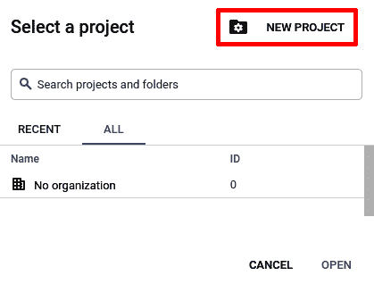
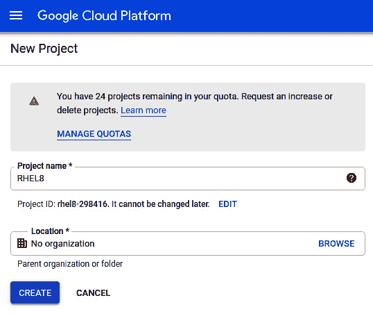
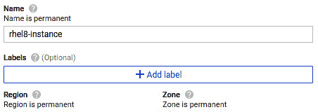

# *第 2 章*:RHEL8 高级安装选项

在前一章中，我们学习了如何在物理或虚拟机上安装**Red Hat Enterprise Linux**或**RHEL**，以便我们在阅读本书时使用它。 在本章中，我们将回顾如何在云中使用 RHEL*实例，以及这样做时出现的主要区别。*

您还将不仅了解如何部署系统，还将了解进行部署的最佳选择，并能够以*自动化方式*执行部署。

为了完成安装，包含了关于*最佳实践*的一节，这样您就可以从第一天开始避免长期问题。

以下是本章将涉及的主题:

*   使用 Anaconda 自动化 RHEL 部署
*   在云中部署 RHEL
*   安装的最佳实践

# 技术要求

在本章中，我们将回顾使用**Anaconda**的自动化安装过程。 为此，您将需要使用我们在前一章中创建的*RHEL8 部署*。

我们还将创建云实例，为此您需要在您选择的云环境中创建一个帐户。 我们将使用**谷歌云平台**。

# 使用 Anaconda 实现 RHEL 的自动化部署

一旦您在本地完成了 RHEL 的第一次部署，您就可以在计算机上以 root 身份登录，并列出`root`用户在其文件夹中的文件:

```sh
[root@rhel8 ~]# ls /root/
anaconda-ks.cfg
```

您将找到`anaconda-ks.cfg`文件。 这是一个重要的文件，名为`kickstart`，它包含在安装过程中给安装程序**Anaconda**的响应。 让我们回顾一下这个文件的内容。

重要提示

在云映像中，没有`anaconda-ks.cfg`文件。

这个文件可以被重用来安装其他系统，这些系统的选项与我们在本次安装中使用的选项相同。 让我们回顾一下在前面的安装过程中添加的选项。

以和`#`开头的行是注释，对安装过程没有影响。

指定正在使用的版本的注释如下:

```sh
#version=RHEL8
```

然后，执行一种类型的安装。 它可以是`graphical`或`text`(对于无头系统，通常使用第二个):

```sh
# Use graphical install
graphical
```

安装应用程序包或其他包的软件源通过`repo`项指定。 当我们使用 ISO 映像时，它就像一个*CDROM*一样被访问(挂载，用 Linux 的说法):

```sh
repo --name="AppStream" --baseurl=file:///run/install/sources/mount-0000-cdrom/AppStream
```

section 是用`%`符号指定的。 在本例中，我们将进入带有要安装包列表的`packages`部分，并使用`%end`特殊标记关闭它们。 有两种选择:一组包,被定义为从`@^`符号(在这种情况下,`minimal-environment`)和一个包的名称不需要任何前缀(在这种情况下,包是`kexec-tools`,`kdump`负责安装能力我们先前解释):

```sh
%packages
@^minimal-environment
kexec-tools
%end
```

我们继续单击没有节的选项。 在这种情况下，我们有键盘布局和系统语言支持。 如你所见，我们添加了*英语键盘*(标记为`us`)和*西班牙语键盘*、*西班牙语键盘*一个(标记为`es`):

```sh
# Keyboard layouts
keyboard --xlayouts='us','es'
```

对于系统语言，我们还添加了英语 USAmerican(`en_US`)和西班牙语、西班牙语(`es_ES)`)。 在操作系统中有几种管理、存储和表示文本的方法。 目前最常见的是`UTF-8`，它使我们能够在一个单一标准下拥有多个字符集。 这就是为什么系统语言会附加`.UTF-8`:

```sh
# System language
lang en_US.UTF-8 --addsupport=es_ES.UTF-8
```

提示

**Unicode(或通用编码字符集)转换格式- 8 位**,简称 utf - 8 字符编码,扩展了以往的功能以支持中国,斯拉夫字母或阿拉伯语(和其他很多)在同一文本(比如一个代表一个 web 页面或一个控制台)。 UTF-8 于 1993 年提出，全球 95.9%的网页使用 UTF-8。 以前的字符集只支持美国英语或拉丁字符，如 1963 年发布的**美国信息交换标准码**或**ASCII**。 要了解更多关于字符编码及其演变的信息，请查阅维基百科关于 UTF-8 和 ASCII 的页面。

现在，该配置网络接口了。 在本例中，我们只有一个，名为`enp1s0`。 配置使用 IPv4，**动态主机配置协议**(**DHCP**)和 IPv6，两者在启动时都是激活的。 主机名配置为`rhel8.example.com`:

```sh
# Network information
network  --bootproto=dhcp --device=enp1s0 --ipv6=auto --activate
network  --hostname=rhel8.example.com
```

现在，我们需要定义安装媒体。 在这种情况下，我们使用了一个模拟的 CDROM/DVD，使用的是我们下载的 ISO 镜像文件:

```sh
# Use CDROM installation media
cdrom
```

`firstboot`的选项默认为启用。 在这种情况下，由于安装没有包含*图形界面*，因此不会运行它，而是将其添加到`kickstart`文件中。 我们可以安全地移除它，像这样:

```sh
# Run the Setup Agent on first boot
firstboot --enable
```

现在，让我们配置磁盘。 首先，为了安全起见，我们将指示安装程序忽略除目标磁盘外的所有磁盘; 本例中`vda`:

```sh
ignoredisk --only-use=vda
```

重要提示

根据运行的平台不同，磁盘的名称也会有所不同。 通常是`vda`、`xda`或`sda`。 在本例中，我们展示了由安装程序 Anaconda 定义的`vda`磁盘，就像我们在前一章中使用的那样。

现在，我们必须安装引导加载程序来启动系统。 我们将在**主引导记录**或**MBR 的主要磁盘,`vda`,我们将指导使用`crashkernel`选项,使`kdump`机制(这个转储内存系统崩溃的情况下):**

```sh
# System bootloader configuration
bootloader --append="crashkernel=auto" --location=mbr --boot-drive=vda
```

现在，我们必须对磁盘进行分区。 在这种情况下，这将是完全自动化的:

```sh
autopart
```

系统使用的空间必须声明。 对于这个例子，我们将清除整个磁盘:

```sh
# Partition clearing information
clearpart --none --initlabel
```

让我们把时区设置为欧洲马德里:

```sh
# System timezone
timezone Europe/Madrid --isUtc
```

现在，我们将设置根密码，并创建一个用户(注意，为了安全起见，加密的密码已被编校):

```sh
# Root password
rootpw --iscrypted $xxxxxxxxxxxxxxxxxxxxxxxxxxxxxxxxxxxxxxxxxxxxxxxxxxxxxxxxxxxxxxxxxxxxxxxxxxxxxxxxxxxxxxxxxxxxxxxxxxxxxxxxx
user --groups=wheel --name=user --password=$xxxxxxxxxxxxxxxxxxxxxxxxxxxxxx xxxxxxxxxxxxxxxxxxxxxxxxxxxxxxxxxxxxxxxxxxxxxxxxxxxxxxxxxxxxxxxxxxxxxxxxxxx --iscrypted --gecos="user"
```

提示

前一章中生成的 Anaconda 文件包含一个加密的密码散列示例。 如果我们想要更改它，如果我们运行`python -c 'import crypt,getpass;pw=getpass.getpass();print(crypt.crypt(pw) if (pw==getpass.getpass("Confirm: ")) else exit())'`命令，可以生成一个新的加密的密码散列，将包含在这里。

现在，我们需要一个特殊的部分来配置`kdump`，以便自动保留内存:

```sh
%addon com_redhat_kdump --enable --reserve-mb='auto' 
%end
```

我们还需要一个特殊的部分，指定将用于安装的密码策略:

```sh
%anaconda
pwpolicy root --minlen=6 --minquality=1 --notstrict --nochanges --notempty
pwpolicy user --minlen=6 --minquality=1 --notstrict --nochanges --emptyok
pwpolicy luks --minlen=6 --minquality=1 --notstrict --nochanges --notempty
%end
```

这样，我们重新安装系统的`kickstart`文件就完成了。

要使用它，我们需要将 kickstart 选项传递给安装程序。 为此，我们编辑内核参数。 让我们看看它是怎么做的。

我们在引导过程中按下*Tab*开始，同时选中**行 Install Red Hat Enterprise Linux 8.3**。 启动行，以**vmlinuz**开始，将出现在屏幕底部:


图 2.1 - RHEL8 安装程序-编辑引导行

让我们删除`quiet`选项，添加，让安装程序知道 kickstart 在哪里:


图 2.2 - RHEL8 安装程序-将启动选项添加到启动行

我们添加的选项如下:

```sh
inst.ks=hd:sdc1:/anaconda-ks.cfg
```

我们可以从三个方面来看看:

*   `hd`:kickstart 将在一个磁盘中，例如第二个 USB 驱动器。
*   `sdc1`:存放文件的设备。
*   `/anaconda-ks.cfg`:设备中 kickstart 文件的路径。

有了这个，我们可以复制我们已经完成的完整安装。

提示

Red Hat Enterprise Linux 8 自定义 Anaconda 指南提供了详细的选项，如果您希望创建自己的*Anaconda Kickstart*文件或进一步自定义此文件，您可以遵循该指南。 可以在这里访问:[https://access.redhat.com/documentation/en-us/red_hat_enterprise_linux/8/html-single/customizing_anaconda/index](https://access.redhat.com/documentation/en-us/red_hat_enterprise_linux/8/html-single/customizing_anaconda/index)。

如您所见，创建一个启动文件并自动化 Red HatEnterprise Linux 的部署是非常容易的。

现在，让我们看看让 RHEL 8 实例可用的另一种方式:在云中。

# 部署 RHEL 到云端

在云上部署 Red Hat Enterprise Linux 与我们之前完成的部署有一些不同。 让我们来看看这些区别是什么:

*   We won't use an ISO image or Anaconda to perform a deployment, but a preconfigured image, usually prepared and made available by the cloud provider:

    -图像可以后来定制和适应我们的需要。

*   在安装期间，我们将无法选择系统的配置细节(例如，选择一个时区)，但在安装之后将能够选择。
*   An automated mechanism will be in place to change settings, such as adding a user and their credentials to access the system or configure network:

    -云提供商使用的最扩展和最知名的机制是`cloud-init`。

    —云提供商提供的一些映像包括`cloud-init`软件。

    ——系统通常使用`ssh`远程访问协议和 SSH 密钥由用户生成的云提供商(请查看[*第八章*](08.html#_idTextAnchor119),*远程管理系统,为更多的细节关于如何访问系统)。*

    *重要提示*

    *在创建 RHEL 映像时，可以为云或虚拟化创建我们自己的映像。 为此，我们可以使用 Red Hat Enterprise Linux 映像构建器([https://developers.redhat.com/blog/2019/05/08/red-hat-enterprise-linux-8-image-builder-building-custom-system-img/](https://developers.redhat.com/blog/2019/05/08/red-hat-enterprise-linux-8-image-builder-building-custom-system-img/))。 然而，它不是 RHCSA 的一部分，所以它不会被涵盖在这本书。 相反，我们将采用采用默认映像并自定义它的方法。*

 *云提供商提出了一个初始的启动方案，你可以免费试用他们的服务。 这是开始使用 RHEL 和云服务的好方法。

在这本书中，我们将使用谷歌云作为一个例子，所以其他云将不会被涵盖。 我们将提供一个简单的示例，说明如何在这个云环境中创建和修改 Red Hat Enterprise Linux 8 实例。 为此，我们将使用**谷歌云**(它提供了，截至 2020 年 12 月，一个初始信用，可以持续完成这本书所需的整个时间)。

要阅读本章，你需要完成以下步骤:

1.  如果你没有一个谷歌帐户，你将需要创建一个(如果你使用 Gmail 和/或 Android 手机，你将已经有一个)。
2.  在[https://accounts.google.com](https://accounts.google.com)登录到您的谷歌帐户(或检查您已经登录)。 你将被要求注册一个免费试用，然后你必须提供一个信用卡号。
3.  登录[https://cloud.google.com/free](https://cloud.google.com/free)申请免费积分。
4.  转到云控制台[https://console.cloud.google.com](https://console.cloud.google.com)。
5.  Go to the **Projects** menu, which is shown here as **No organization** at the top bar, to show the projects for the new account:

    

    图 2.3 - RHEL8 在谷歌云组织菜单访问

6.  Click on **NEW PROJECT**:

    

    图 2.4 -谷歌云组织菜单中的 RHEL8

7.  Name it `RHEL8` and click **CREATE**:

    

    图 2.5 -谷歌云组织菜单中的 RHEL8; 创建新项目

    重要提示

    根据如何配置您的谷歌帐户，您可能需要在此步骤之后启用计费功能。

8.  Go to the top-left menu (also called **Hamburger Menu**, with three horizontal lines next to it), click on **Compute Engine**, and then click on **VM Instances**:

    

    图 2.6 -谷歌云中的 RHEL8 -访问 VM 实例菜单

9.  Once **Compute Engine** is ready (this may take a few minutes), click on **Create**:

    

    图 2.7 -谷歌云中的 RHEL8 -创建新的 VM 实例

10.  We will name the instance `rhel8-instance`:

    

    图 2.8 -谷歌云中的 RHEL8 -创建新的 VM 实例; 的名字

11.  Select the most convenient region (or leave the one already provided):

    

    图 2.9 -谷歌云中的 RHEL8 -创建新的 VM 实例、区域和 zone

12.  Set the machine family and type to **General purpose** | **e2-medium**:

    

    图 2.10 -谷歌云中的 RHEL8 -创建新的虚拟机实例、类型和大小

13.  Click **Change** next to boot disk:

    

    图 2.11 -谷歌云中的 RHEL8 -更改引导磁盘

14.  Change **Operating system** to **Red Hat Enterprise Linux** and **Version** to **Red Hat Enterprise Linux 8**. Then, click **Select**:

    

    图 2.12 -谷歌云中的 RHEL8 -创建新的虚拟机实例、映像选择和磁盘大小

15.  Click **Create** and wait for the instance to be created:

    

    图 2.13 -谷歌云-虚拟机实例列表中的 RHEL8

16.  Later, we will learn how to connect via `SSH`. Now, click on the triangle next to `SSH`, under **Connect**, and select **Open in browser window**, as follows:

    

    图 2.14 -谷歌云中的 RHEL8 - VM 实例，访问控制台

17.  这样，您的新鲜 RHEL8 实例将被部署，如下面的截图所示:


图 2.15 -谷歌云中的 RHEL8 -虚拟机实例，控制台

需要一些时间去建立在云中,配置您的帐户,并找到`SSH`键(将所示[*第八章*](08.html#_idTextAnchor119),*远程管理系统),但是一旦它所有的设置,很容易得到一个新实例启动并运行。*

 *要成为管理员，只需要执行以下命令:

```sh
[miguel@rhel8-instance ~]$ sudo -i
[root@rhel8-instance ~]#
```

现在，您可以用`timedatectl`检查时间配置，并更改:

```sh
[root@rhel8-instance ~]# timedatectl 
               Local time: Sat 2020-12-12 17:13:29 UTC
           Universal time: Sat 2020-12-12 17:13:29 UTC
                 RTC time: Sat 2020-12-12 17:13:29
                Time zone: UTC (UTC, +0000)
System clock synchronized: yes
              NTP service: active
          RTC in local TZ: no
[root@rhel8-instance ~]# timedatectl set-timezone Europe/Madrid
[root@rhel8-instance ~]# timedatectl 
               Local time: Sat 2020-12-12 18:20:32 CET
           Universal time: Sat 2020-12-12 17:20:32 UTC
                 RTC time: Sat 2020-12-12 17:20:32
                Time zone: Europe/Madrid (CET, +0100)
System clock synchronized: yes
              NTP service: active
          RTC in local TZ: no
```

你也可以用`localectl`改变语言配置:

```sh
[root@rhel8-instance ~]# localectl 
   System Locale: LANG=en_US.UTF-8
       VC Keymap: us
      X11 Layout: n/a
```

要更改`locale`或语言支持，您需要首先安装其*语言包*，如下所示:

```sh
[root@rhel8-instance ~]# yum install glibc-langpack-es –y
... [output omitted] ...
[root@rhel8-instance ~]# localectl set-locale es_ES.utf8
[root@rhel8-instance ~]# localectl 
   System Locale: LANG=es_ES.utf8
       VC Keymap: us
      X11 Layout: n/a
```

现在，您有了一台配置了的机器，您可以在本书中使用它。 不需要继续进行这些区域设置更改，只需创建具有与前一章相同配置的机器即可。

现在我们知道了如何使用 Anaconda 自动重新部署 vm，以及如何在云中获取实例，让我们继续，看看在执行安装时需要考虑的一些最佳实践。

# 安装最佳实践

Red Hat Enterprise Linux 安装**有许多选项可供选择，您选择的内容应根据您的具体用例进行定制。 然而，一些常见的建议也适用。 让我们看看最常见的类型。**

 **第一种类型为**蓝图**:

*   Standardize the core installation and create a blueprint for it:

    -该蓝图应足够小，以作为所有其他蓝图和部署的基础。

*   Build a set of blueprints for common cases when needed:

    -尝试使用自动化平台来构建扩展案例(即 Ansible)。

    -尽量使案例模块化(即 App Server; 数据库蓝图可以合并到一台机器中)。

    —注意必须应用到模板蓝图中的要求，并适应您将使用的环境。

第二种类型为**软件**:

*   安装的软件越少，攻击的表面就越小。 尽量让服务器上只保留运行和操作所需的最小包集(也就是说，尽量不要向服务器添加图形用户界面)。
*   在可能的地方标准化安装的工具，以便在紧急情况下能够快速反应。
*   打包您的第三方应用程序，以便您拥有健康的生命周期管理(无论是使用 RPM 还是在容器中)。
*   建立一个补丁计划。

第三种类型为**n****网络**:

*   在虚拟机中，尽量不要过度使用网络接口的数量。
*   在物理机器中，尽可能使用接口组合/绑定。 使用 vlan 对网络进行分段。

第四种类型为**存储**:

*   对于服务器，尽可能使用**逻辑卷管理**(**LVM**)(通常是除`/boot`或`/boot/efi`之外的所有内容)。
*   如果您认为您将需要减少您的文件系统，使用*ext4*; 否则，使用默认的*xfs*。
*   Partition the disk carefully:

    —保持默认启动分区大小。 如果你改变了它，就放大它(在升级过程中你可能需要空间)。

    —默认的交换分区是最安全的下注，除非第三方软件有特殊要求。

    长期存在的系统,至少有单独的分区`/`(根)`/var`,`/usr`,`/tmp`,`/home`,甚至考虑另一个单独的`/var/log`和`/opt`(短暂的云实例或短暂的系统,这个不适用)。

第五种类型为**安全**:

*   不要禁用*SELinux*。 它在最新版本中已经改进了很多，很可能不会干扰您的系统(如果需要，将它设置为允许模式，而不是完全禁用它)。
*   请勿禁用防火墙。 通过服务部署自动打开端口。
*   尽可能将日志重定向到中心位置。
*   标准化您希望安装的安全工具和配置，以检查系统完整性和审计(即:*AIDE*、*logwatch*和*auditd*)。
*   检查软件安装(*RPM*)*GPG*键，以及 ISO 镜像，以确保完整性。
*   尽量避免使用密码(尤其是你的根帐户)，在需要的时候使用强密码。
*   使用*OpenSCAP*检查系统以检查安全性(如果需要，在安全团队的帮助下创建您自己的硬件 SCAP 配置文件)。

最后，我们将看一下**miscellanea**type:

*   保持系统时间同步。
*   检查*logrotate*策略以避免由于日志导致的“磁盘满”错误。

遵循这些最佳实践将帮助您避免问题，并使所安装的基础更加易于管理。 这样，您就知道了如何以结构化的、可重复的方式在系统上部署 Red Hat Enterprise Linux，同时以快速和弹性的方式为其他团队提供服务。

# 总结

在前一章中，我们提到了如何准备一台可以在本书中使用的机器。 另一种选择是使用云实例，我们可以使用来自公共云的虚拟机实例，这可能简化我们的消费，并为我们提供足够的免费信贷来准备*RHCSA*。 此外，一旦自我训练过程完成，机器仍然可以用来提供自己的公共服务(如部署博客)。

当您作为专业人员使用 Linux 时，理解对环境进行标准化的需要以及这样做的影响也很重要。 从一开始就采用一组良好的实践(自动化安装、跟踪已安装软件、减少攻击面等等)是非常关键的。

现在您已经完成了本章，您已经准备好继续阅读本书的其余部分，因为您现在有了一个可以使用的 Red Hat Enterprise Linux 8 实例。 在下一章中，我们将回顾该系统的基础知识，使我们在使用该系统时感到舒适并获得信心。******