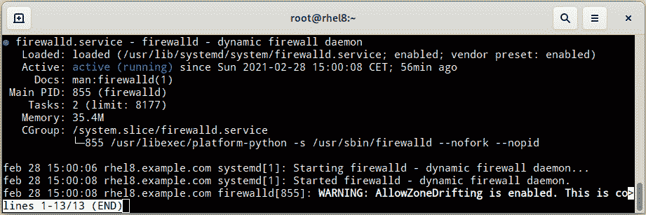
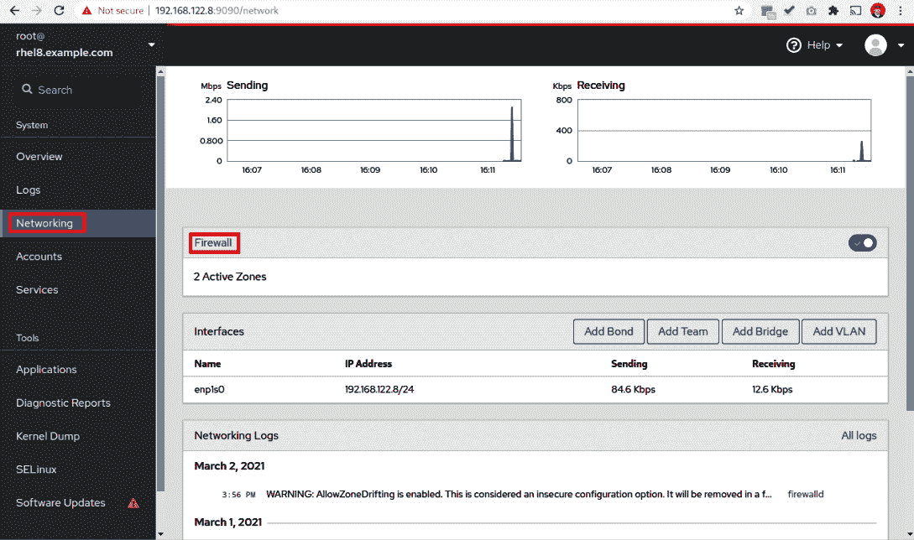
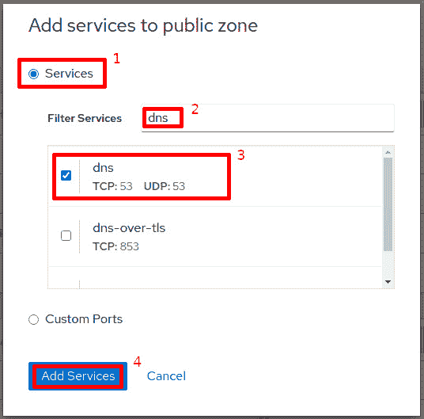

# 九、使用防火墙保护网络连接

一位在军事受限环境下工作的伟大导师和技术专家曾经告诉我，*“唯一安全的系统是关闭的，与任何网络断开，埋在沙漠中央的系统。” 当然，他是对的，但是我们必须提供一种服务，使系统有用。 这意味着让它运行并连接到网络。*

安全性中用于减少事故的技术之一(例如避免意外暴露漏洞并启用未经授权的远程访问)是减少攻击表面并应用深度防御原则。 当您在网络中这样做时，第一步是使用**防火墙**过滤连接。 Red Hat Enterprise Linux(**RHEL**)中包含的防火墙管理工具是**防火墙**，它帮助我们管理区域、配置文件、服务和端口。 它还包括一个名为`firewall-cmd`的命令行工具和一个`systemd`服务单元，以简化其管理。

在本章中，我们将涵盖以下主题，以更好地理解如何管理 RHEL 中的默认防火墙:

*   RHEL 防火墙简介-防火墙
*   在系统上启用防火墙并检查默认区域
*   检查防火墙下的不同配置项
*   启用和管理服务和端口
*   创建和使用防火墙的服务定义
*   使用 web 界面配置防火墙

# RHEL 防火墙简介-防火墙

RHEL 提供了两种底层网络流量过滤机制:**nftables**，用于过滤 ip 相关的流量;**ebtables**，用于网桥中的透明过滤。 这些机制是静态的，使用一组规则来接受或拒绝流量，尽管它们确实提供了无数其他功能。 在 RHEL 中，它们都由**防火墙**动态处理和管理。 除非有特定的需要有非常低级的使用这些低级过滤机制，请使用防火墙(或其主命令; 即`firewall-cmd`)。 在本节中，我们将了解 RHEL 中的防火墙默认设置。

防火墙在系统中默认安装，我们可以使用`rpm`命令检查，所以不需要安装:

```sh
[root@rhel8 ~]# rpm -qa | grep firewalld
firewalld-filesystem-0.8.2-2.el8.noarch
firewalld-0.8.2-2.el8.noarch
```

如果我们的安装由于某些原因没有包含防火墙，我们可以通过运行`dnf install firewalld`来安装它。

防火墙包括一个名为`firewalld`的服务，该服务被配置为在启动时默认运行。 我们可以使用`systemctl status firewalld`命令来检查:



图 9.1 - "systemctl status firewalld"的输出

可以看到，`firewalld`服务已启用并正在运行。 这是 RHEL 系统中的默认状态。

系统管理员配置防火墙的主要方式是使用`firewall-cmd`命令。 但是，你也可以做以下事情:

*   在`/etc/firewalld/`中添加带有服务定义的新文件(如本章*为防火墙创建和使用服务定义*部分所述)
*   使用web 界面，即**座舱**来配置防火墙(如本章*使用 web 界面*配置防火墙部分所述)
*   在桌面环境中使用`firewall-config`图形界面

在本章中，我们将回顾主要的机制和网页界面。

现在我们已经知道了 RHEL 主防火墙的默认设置，让我们学习如何启用它。

# 在系统中启用防火墙，并查看默认分区

我们已经看到**防火墙**在系统中默认是启用的。 然而，我们可能需要禁用(即检查防火墙是否干扰了服务)，重新启用(即在恢复配置文件之后)，并启动和停止它(即重新加载配置或进行快速检查)。 这些任务的管理方式与系统中的任何其他服务一样; 即使用`systemctl`。 让我们停止`firewalld`服务:

```sh
[root@rhel8 ~]# systemctl stop firewalld
[root@rhel8 ~]# systemctl status firewalld
  firewalld.service - firewalld - dynamic firewall daemon
   Loaded: loaded (/usr/lib/systemd/system/firewalld.service; enabled; vendor preset: enabled)
   Active: inactive (dead) since Sun 2021-02-28 17:36:45 CET; 4s ago
     Docs: man:firewalld(1)
  Process: 860 ExecStart=/usr/sbin/firewalld --nofork --nopid $FIREWALLD_ARGS (code=exited, status=>
Main PID: 860 (code=exited, status=0/SUCCESS)

feb 28 17:36:19 rhel8.example.com systemd[1]: Starting firewalld - dynamic firewall daemon...
feb 28 17:36:20 rhel8.example.com systemd[1]: Started firewalld - dynamic firewall daemon.
feb 28 17:36:20 rhel8.example.com firewalld[860]: WARNING: AllowZoneDrifting is enabled. This is co>
feb 28 17:36:45 rhel8.example.com systemd[1]: Stopping firewalld - dynamic firewall daemon...
feb 28 17:36:45 rhel8.example.com systemd[1]: firewalld.service: Succeeded.
feb 28 17:36:45 rhel8.example.com systemd[1]: Stopped firewalld - dynamic firewall daemon.
```

在前面的输出中，如粗体所示，服务处于非活动状态。 我们可以使用`firewall-cmd --state`命令来检查:

```sh
[root@rhel8 ~]# firewall-cmd --state
not running
```

目前，防火墙服务已经停止，所有的规则都已被删除。 但是，服务的配置没有改变，所以如果我们重新启动系统，防火墙将再次运行。

提示

通过运行`nft list table filter`命令，我们总是可以看到底层的`netfilter`规则。 您可能希望在停止服务之前和之后运行它，以查看差异。

现在，让我们再次尝试启动服务:

```sh
[root@rhel8 ~]# systemctl start firewalld
[root@rhel8 ~]# systemctl status firewalld
  firewalld.service - firewalld - dynamic firewall daemon
   Loaded: loaded (/usr/lib/systemd/system/firewalld.service; enabled; vendor preset: enabled)
   Active: active (running) since Sun 2021-02-28 17:43:31 CET; 7s ago
     Docs: man:firewalld(1)
Main PID: 1518 (firewalld)
    Tasks: 2 (limit: 8177)
   Memory: 23.3M
   CGroup: /system.slice/firewalld.service
           └─1518 /usr/libexec/platform-python -s /usr/sbin/firewalld --nofork –nopid
```

让我们检查防火墙是否在运行:

```sh
[root@rhel8 ~]# firewall-cmd --state
running
```

要完全禁用该服务，我们需要运行以下命令:

```sh
[root@rhel8 ~]# systemctl disable firewalld
Removed /etc/systemd/system/multi-user.target.wants/firewalld.service.
Removed /etc/systemd/system/dbus-org.fedoraproject.FirewallD1.service.
```

让我们看看如何禁用服务，但仍然运行:

```sh
[root@rhel8 ~]# systemctl status firewalld -n0
  firewalld.service - firewalld - dynamic firewall daemon
   Loaded: loaded (/usr/lib/systemd/system/firewalld.service; disabled; vendor preset: enabled)
   Active: active (running) since Sun 2021-02-28 17:43:31 CET; 8min ago
     Docs: man:firewalld(1)
Main PID: 1518 (firewalld)
    Tasks: 2 (limit: 8177)
   Memory: 24.1M
   CGroup: /system.slice/firewalld.service
           └─1518 /usr/libexec/platform-python -s /usr/sbin/firewalld --nofork –nopid
```

当你服务与管理**systemd 使用`systemctl`**,你需要明白,启用和禁用该服务只会影响表现在启动顺序,同时启动和停止只会影响服务的当前状态。

提示

要在一个命令中禁用和停止，可以使用`--now`选项; 例如:`systemctl disable firewalld --now`。 这个选项也可以用来启用和启动; 例如`systemctl enable firewalld --now`。

让我们重新启用服务，并确保它在运行:

```sh
[root@rhel8 ~]# systemctl enable firewalld --now
Created symlink /etc/systemd/system/dbus-org.fedoraproject.FirewallD1.service → /usr/lib/systemd/system/firewalld.service.
Created symlink /etc/systemd/system/multi-user.target.wants/firewalld.service → /usr/lib/systemd/system/firewalld.service.
[root@rhel8 ~]# firewall-cmd --state
running
```

既然我们知道了如何启动和停止，以及如何启用和禁用`firewalld`服务，那么让我们了解配置结构，并通过查看默认配置了解如何与之交互。

## 检查防火墙下的不同配置项

防火墙在其配置中管理三个概念:

*   **区域**:防火墙区域是一组可以一起激活并分配给网络接口的规则。 它包括不同的服务和规则，还包括改变网络流量过滤行为的设置。
*   **服务**:防火墙服务是一个端口或一组端口，必须为特定的系统服务(因此得名)配置在一起，才能正常工作。
*   **端口**:防火墙端口包括端口号(即`80`)和一种流量类型(即 TCP)，可用于手动启用网络流量到自定义系统服务。

防火墙管理两种类型的配置:

*   **Running**:当前已经应用到系统的规则。
*   **Permanent**: The rules that have been saved and will be loaded when the service starts.

    重要提示

    运行与永久的概念是在运行的系统中尝试网络过滤规则，一旦确保它们正常工作，将它们保存为永久的。 记得检查您想要在系统中保存的规则是否正确。

现在，让我们检查一下我们的系统，看看哪些区域可用:

```sh
[root@rhel8 ~]# firewall-cmd --get-zones
block dmz drop external home internal nm-shared public trusted work
```

让我们也检查一下哪个区域是默认应用的:

```sh
[root@rhel8 ~]# firewall-cmd --get-default-zone
public
```

让我们通过查看下表来回顾防火墙中可用的区域:


重要提示

通过运行`man firewalld.zones`访问系统中可用的`firewalld.zones`手动页面，您总是可以访问关于这些区域的信息，甚至更多信息。 复习前面提到的手册页面是一个很好的练习。

前面提到的服务将在下一节中进行更详细的讨论。 现在，让我们学习如何管理区域。

让我们将默认区域更改为`home`:

```sh
[root@rhel8 ~]# firewall-cmd --set-default-zone=home
success
[root@rhel8 ~]# firewall-cmd --get-default-zone
home
```

我们可以建立一个`public`区域作为默认值，并分配一个`home`区域到我们的本地网络:

```sh
[root@rhel8 ~]# firewall-cmd --set-default-zone=public
success
[root@rhel8 ~]# firewall-cmd --permanent --zone=internal \
--add-source=192.168.122.0/24
success
[root@rhel8 ~]# firewall-cmd --reload
success
[root@rhel8 ~]# firewall-cmd --get-active-zones
internal
  sources: 192.168.122.0/24
public
  interfaces: enp1s0
```

这个配置允许我们只将服务发布到本地网络，该网络被定义为`192.168.122.0/24`并分配给`internal`区域。 从现在起，分配给`internal`区域的任何服务或端口只有在从内部网络中的 IP 地址访问时才可以访问。 我们避免允许从其他网络访问这些服务。

另外，要使服务能够从任何其他网络访问，我们只需要将它们分配到`public`区域。

让我们回顾一下使用的主要选项和其他一些可能有用的选项:

*   `--get-zones`:列出系统中已经配置的 zone。
*   `--get-default-zone`:显示默认配置的区域。
*   `--set-default-zone=<zone>`:设置默认区域。 这将应用于运行和永久配置
*   `--get-active-zones`:显示正在使用的区域所应用的网络/接口。
*   `--zone=<zone>`:为其他选项指定区域。
*   `--permanent`:用于将更改应用到已保存的配置。 当您使用此选项时，更改将不会应用于正在运行的配置。
*   `--reload`:在运行时加载保存的配置。
*   `--add-source=<network>`:在指定区域中添加 CIDR 格式的源网络。 如果没有指定，则使用默认区域。 更改应用于运行配置; 使用`--permanent`保存它们。
*   `--remove-source=<network>`:移除 CIDR 格式的源网络到指定区域。 如果没有指定，则使用默认区域。 更改应用于运行配置; 使用`--permanent`保存它们。
*   `--add-interface=<interface>`:接口到区域的路由。 如果没有指定，则使用默认区域。
*   `--change-interface=<interface>`:将路由到接口的流量改变为区域。 如果没有指定，则使用的默认区域。

虽然这个选项列表可能非常有用，但是在`firewall-cmd`的手册页上可以找到完整的选项列表。 您应该检查此页面，因为您将经常使用它，当您重新配置您的防火墙选项。

提示

要查看`firewall-cmd`手册页面，只需运行`man firewall-cmd`。

现在，我们已经了解了什么是区域以及如何选择它们，让我们学习如何管理服务和端口。

# 启用和管理服务和端口

正如我们在前一节中提到的，**防火墙服务**是一个端口或一组端口，它们被配置在一起，用于特定的系统服务(因此得名)正常工作。 在可用的**防火墙区域**的一个或多个中默认启用了一组服务。 让我们先来回顾一下:

*   **ssh**:提供对系统**Secure Shell**(**ssh**)服务的访问，并提供远程管理功能。 被接受的流量进入端口`22`，并且是`TCP`类型。
*   **mdns**:提供对**组播 DNS**(**mdns**)服务的访问，用于在本地网络中宣布服务。 在端口`5353`上，可以接收到组播地址`224.0.0.251`(IPv4)或`ff02::fb`(IPv6)，类型为`UDP`。
*   **ipp-client**:提供进入**互联网打印协议**(【显示】**IPP)的客户,去港口`631`,并使用`UDP`协议。**
*   **samba-client**:这是一个与 Microsoft Windows 兼容的文件和打印共享客户端。 它使用端口`137`和`138`，属于`UDP`类型。
*   **dhcpv6-client**:A**Dynamic Host Configuration Protocol**(**DHCP**)for IPv6 它的目的地是特殊的网络`fe80::/64`，它的端口是`546`，并且是`UDP`类型。
*   **座舱**:针对RHEL 的 web 管理界面。 其目的地为`9090`端口，为`TCP`类型。

如您所见，防火墙服务可以指定多个端口、一个目标地址，甚至一个目标网络。

现在，让我们看看在我们的防火墙中配置的服务:

```sh
[root@rhel8 ~]# firewall-cmd --list-services
cockpit dhcpv6-client ssh
[root@rhel8 ~]# firewall-cmd --list-services --zone=internal
cockpit dhcpv6-client mdns samba-client ssh
```

请注意，当您没有建立一个区域时，显示的服务是与默认区域相关的——在本例中是`public`。 但是，考虑到我们已经配置了多个区域。

现在，让我们安装一个 web 服务器-在本例中，Apache`httpd`服务器:

```sh
[root@rhel8 ~]# dnf install httpd -y
Updating Subscription Management repositories.
Last metadata expiration check: 0:25:05 ago on lun 01 mar 2021 17:02:09 CET.
Dependencies resolved.
====================================================================================================
Package       Arch   Version                                Repository                        Size
====================================================================================================
Installing:
httpd         x86_64 2.4.37-30.module+el8.3.0+7001+0766b9e7 rhel-8-for-x86_64-appstream-rpms 1.4 M
Installing dependencies:
apr           x86_64 1.6.3-11.el8                           rhel-8-for-x86_64-appstream-rpms 125 k
[omitted]
Installed:
  apr-1.6.3-11.el8.x86_64
  apr-util-1.6.1-6.el8.x86_64                          
  apr-util-bdb-1.6.1-6.el8.x86_64                                  
  apr-util-openssl-1.6.1-6.el8.x86_64                              
  httpd-2.4.37-30.module+el8.3.0+7001+0766b9e7.x86_64      
  httpd-filesystem-2.4.37-30.module+el8.3.0+7001+0766b9e7.noarch 
  httpd-tools-2.4.37-30.module+el8.3.0+7001+0766b9e7.x86_64   
  mailcap-2.1.48-3.el8.noarch  
  mod_http2-1.15.7-2.module+el8.3.0+7670+8bf57d29.x86_64 
  redhat-logos-httpd-81.1-1.el8.noarch                      

Complete!
```

让启用并启动`httpd`服务:

```sh
[root@rhel8 ~]# systemctl enable httpd --now
Created symlink /etc/systemd/system/multi-user.target.wants/httpd.service → /usr/lib/systemd/system/httpd.service.
[root@rhel8 ~]# systemctl status httpd -n0
● httpd.service - The Apache HTTP Server
   Loaded: loaded (/usr/lib/systemd/system/httpd.service; enabled; vendor preset: disabled)
   Active: active (running) since Mon 2021-03-01 17:31:57 CET; 8s ago
     Docs: man:httpd.service(8)
Main PID: 2413 (httpd)
   Status: "Started, listening on: port 80"
    Tasks: 213 (limit: 8177)
   Memory: 25.0M
   CGroup: /system.slice/httpd.service
           ├─2413 /usr/sbin/httpd -DFOREGROUND
           ├─2414 /usr/sbin/httpd -DFOREGROUND
           ├─2415 /usr/sbin/httpd -DFOREGROUND
           ├─2416 /usr/sbin/httpd -DFOREGROUND
           └─2417 /usr/sbin/httpd -DFOREGROUND
```

现在，让我们检查一下服务是否正在监听所有的接口:

```sh
[root@rhel8 ~]# ss -a -A "tcp" | grep http
LISTEN    0         128                 *:http                  *:*
```

可选地，我们可以通过使用外部机器(如果有的话)检查端口是否打开:

```sh
[root@external:~]# nmap 192.168.122.8
Starting Nmap 7.80 ( https://nmap.org ) at 2021-03-01 17:45 CET
Nmap scan report for rhel.redhat.lan (192.168.122.8)
Host is up (0.00032s latency).
Not shown: 998 filtered ports
PORT     STATE  SERVICE
22/tcp   open   ssh
9090/tcp closed zeus-admin
MAC Address: 52:54:00:E6:B4:A4 (QEMU virtual NIC)

Nmap done: 1 IP address (1 host up) scanned in 5.15 seconds
```

现在，我们可以在防火墙上启用`http`服务:

```sh
[root@rhel8 ~]# firewall-cmd --add-service http \
--zone=public --permanent
success
[root@rhel8 ~]# firewall-cmd --add-service http \
--zone=internal --permanent
success
[root@rhel8 ~]# firewall-cmd --reload
success
[root@rhel8 ~]# firewall-cmd --list-services
cockpit dhcpv6-client http ssh
[root@rhel8 ~]# firewall-cmd --list-services --zone=internal
cockpit dhcpv6-client http mdns samba-client ssh
```

这样，服务就被启用了，端口也打开了。 我们可以从外部机器验证这一点，就像这样(这是可选的):

```sh
[root@external:~]# nmap 192.168.122.8
Starting Nmap 7.80 ( https://nmap.org ) at 2021-03-01 17:50 CET
Nmap scan report for rhel.redhat.lan (192.168.122.8)
Host is up (0.00032s latency).
Not shown: 997 filtered ports
PORT     STATE  SERVICE
22/tcp   open   ssh
80/tcp   open   http
9090/tcp closed zeus-admin
MAC Address: 52:54:00:E6:B4:A4 (QEMU virtual NIC)

Nmap done: 1 IP address (1 host up) scanned in 5.18 seconds
```

现在我们可以看到端口`80`打开了。 我们也可以从web 服务器检索主页面，并显示第一行:

```sh
[root@external:~]# curl -s http://192.168.122.8 | head -n 1
<!DOCTYPE html PUBLIC "-//W3C//DTD XHTML 1.1//EN" "http://www.w3.org/TR/xhtml11/DTD/xhtml11.dtd">
```

重要提示

防火墙中服务的定义保存在`/usr/lib/firewalld/services`目录中的独立文件中。 如果你需要一个服务的细节，你可以去那里检查文件和它的定义。

现在，让我们尝试从公共网络中删除该服务，因为这将是一个内部服务:

```sh
[root@rhel8 ~]# firewall-cmd --list-services --zone=public
cockpit dhcpv6-client http ssh
[root@rhel8 ~]# firewall-cmd --remove-service http \
--zone=public --permanent
success
[root@rhel8 ~]# firewall-cmd --reload
success
[root@rhel8 ~]# firewall-cmd --list-services --zone=public
cockpit dhcpv6-client ssh
```

让我们假设我们没有服务定义，并且我们仍然希望在`public`接口中的`TCP`上打开端口`80`:

```sh
[root@rhel8 ~]# firewall-cmd --list-ports --zone=public

[root@rhel8 ~]# firewall-cmd --add-port 80/tcp --zone=public --permanent
success
[root@rhel8 ~]# firewall-cmd --reload
success
[root@rhel8 ~]# firewall-cmd --list-ports --zone=public
80/tcp
```

我们可以一次回顾端口和服务，如下所示:

```sh
[root@rhel8 ~]# firewall-cmd --list-all --zone=public
public (active)
  target: default
  icmp-block-inversion: no
  interfaces: enp1s0
  sources: 
  services: cockpit dhcpv6-client ssh
  ports: 80/tcp
  protocols: 
  masquerade: no
  forward-ports: 
  source-ports: 
  icmp-blocks: 
  rich rules:
```

现在，我们可以移除端口:

```sh
[root@rhel8 ~]# firewall-cmd --list-ports --zone=public
80/tcp
[root@rhel8 ~]# firewall-cmd --remove-port 80/tcp --zone=public --permanent
success
[root@rhel8 ~]# firewall-cmd --reload
success
[root@rhel8 ~]# firewall-cmd --list-ports --zone=public

[root@rhel8 ~]#
```

这样，我们就知道了如何在防火墙中添加和删除服务和端口，并检查它们的状态。 让我们回顾一下`firewall-cmd`可以使用的选项:

*   `--zone=<zone>`:指定分区。 当没有指定 zone 时，使用默认的 zone。
*   `--list-services`:显示指定 zone 的服务列表。
*   `--add-service`:向指定区域添加服务。
*   `--remove-service`:从指定区域移除服务。
*   `--list-ports`:列出指定区域内开放的端口。
*   `--add-port`:将端口加入指定的 zone。
*   `--remove-port`:从指定的 zone 中移除端口。
*   `--list-all`:列出与指定 zone 相关联的端口、服务和所有配置项。
*   `--permanent`:规则将应用到保存的配置，而不是运行中的配置。
*   `--reload`:从保存的配置重新加载规则。

现在我们知道了如何将服务和端口分配到防火墙中的不同区域，让我们看看如何定义它们。

# 创建和使用防火墙的服务定义

防火墙的服务定义存储在`/usr/lib/firewalld/services`目录中。 让我们来看一个简单的服务，例如存储在`ssh.xml`文件中的`ssh`服务，其内容如下:

```sh
<?xml version="1.0" encoding="utf-8"?>
<service>
  <short>SSH</short>
  <description>Secure Shell (SSH) is a protocol for logging into and executing commands on remote machines. It provides secure encrypted communications. If you plan on accessing your machine remotely via SSH over a firewalled interface, enable this option. You need the openssh-server package installed for this option to be useful.</description>
  <port protocol="tcp" port="22"/>
</service>
```

这里，我们可以看到，只有需要一个包含三个部分的 XML 文件来描述一个基本服务:

*   `short`:服务的简称
*   `description`:对服务的详细描述
*   `port`:为该服务打开的端口

假设我们想在服务器上安装一个 Oracle 数据库。 我们必须打开`1521`端口，并且它必须是`TCP`类型。 让我们创建包含以下内容的`/etc/firewalld/services/oracledb.xml`文件:

```sh
<?xml version="1.0" encoding="utf-8"?>
<service>
  <short>OracleDB</short>

  <description>Oracle Database firewalld service. It allows connections to the Oracle Database service. You will need to deploy Oracle Database in this machine and enable it for this option to be useful.</description>
  <port protocol="tcp" port="1521"/>
</service>
```

我们可以使用下面的代码来启用它:

```sh
[root@rhel8 ~]# firewall-cmd --reload
success
[root@rhel8 ~]# firewall-cmd --add-service oracledb
success
[root@rhel8 ~]# firewall-cmd --list-services
cockpit dhcpv6-client oracledb ssh
```

现在，可以在运行配置中使用它了。 我们可以像这样将它添加到永久配置中:

```sh
[root@rhel8 ~]# firewall-cmd --add-service oracledb --permanent
success
```

提示

开设更复杂的服务的情况并不常见。 在任何情况下，描述如何创建防火墙服务的手册页面是`firewalld.service`，可以通过运行`man firewalld.service`打开。

这样，我们就有了一种简单的方法来标准化要在系统防火墙中打开的服务。 我们可以在配置存储库中包含这些文件，以便与整个团队共享它们。

现在我们可以创建一个服务了，让我们看看在 RHEL 中配置防火墙的一种更简单的方法; 也就是说，使用网络界面。

# 通过 web 界面配置防火墙

要使用 RHEL8 的 RHEL web 管理界面，必须安装它。 运行它的包和服务都称为`cockpit`。 我们可以通过运行以下代码来安装它:

```sh
[root@rhel8 ~]# dnf install cockpit -y
Updating Subscription Management repositories.
[omitted]     
Installing:
cockpit                      x86_64 224.2-1.el8             rhel-8-for-x86_64-baseos-rpms     74 k
[omitted]     
  cockpit-224.2-1.el8.x86_64                      
  cockpit-bridge-224.2-1.el8.x86_64               
  cockpit-packagekit-224.2-1.el8.noarch           
  cockpit-system-224.2-1.el8.noarch               
  cockpit-ws-224.2-1.el8.x86_64                         

Complete!
```

现在，让我们启用它:

```sh
[root@rhel8 ~]# systemctl enable --now cockpit.socket
Created symlink /etc/systemd/system/sockets.target.wants/cockpit.socket → /usr/lib/systemd/system/cockpit.socket.
```

提示

驾驶舱使用了一个聪明的技巧来节省资源。 接口停止，但有套接字在端口`9090`上启用侦听。 当它接收到一个连接，驾驶舱开始。 这样，它只会在使用机器时消耗机器中的资源。

现在，让我们学习如何将`DNS`服务添加到的`public`区域。

让我们通过将浏览器指向机器的 IP 和端口`9090`(在本例中为`https://192.168.122.8:9090`)来访问座舱。 使用安装时提供的密码`root`登录:


图 9.2 -座舱登录界面

现在，我们可以进入驾驶舱的仪表盘，其中包含系统的信息:


图 9.3 -驾驶舱初始屏幕和仪表盘

现在，我们进入**网络**，然后点击**防火墙**，如下图所示:



图 9.4 -座舱访问防火墙配置

此时，我们可以点击**公共区域**区域中的**Add Services**对其进行修改，再添加一个服务:


图 9.5 -座舱防火墙配置界面

将**dns**服务添加到防火墙的**公共区域**部分的步骤很简单:

1.  点击**Services**。
2.  通过在服务中键入`dns`来筛选服务。
3.  选择带有**TCP:53**和**UDP:53**的**dns**服务。
4.  点击**添加服务**:



图 9.6 -座舱防火墙-向公共区域添加服务

完成此操作后，将把服务添加到正在运行的和永久的配置中。 将在驾驶舱**公共区**区域显示:


图 9.7 -座舱防火墙-将服务 DNS 添加到公共区域的结果

这样，我们就知道了如何使用 web 接口修改 RHEL8 中的防火墙。 我们将把它留给你作为练习来删除和重做我们在本章开始时用命令行做的配置，但用 web 界面代替。

# 总结

安全性是系统管理的一个非常重要的部分。 仅仅因为系统处于孤立的网络中，就禁用系统上的安全措施，这违反了深度防御原则，因此不建议这样做。

在本章中，我们看到了在 RHEL8 中使用防火墙配置防火墙是多么简单和容易，从而为我们提供了另一个工具来管理、过滤和保护系统中的网络连接。 我们还与座舱，一个网络管理工具，使这一任务更直观，更容易执行。

现在，我们可以控制系统的网络连接，提供对我们想要提供的服务的访问，并为它们添加一层安全。 我们还知道如何管理区域以及如何使用它们，这取决于我们系统的用例。 现在，我们已经准备好定义自己的自定义服务，以便始终能够为它们过滤网络连接。 通过使用 RHEL 中包含的防火墙，我们现在还可以部署更安全的系统。

现在，我们准备学习更多关于 RHEL 安全性的知识，这也是我们将在下一章中做的事情。 记住，安全性是一项团队运动，而系统管理员是关键。