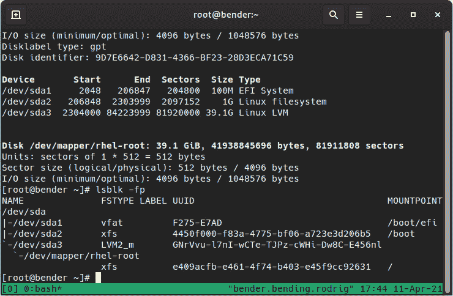
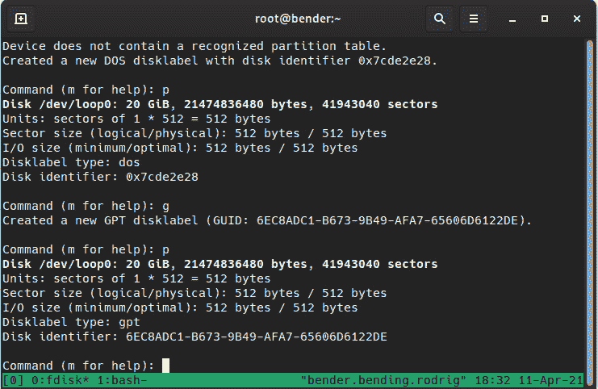
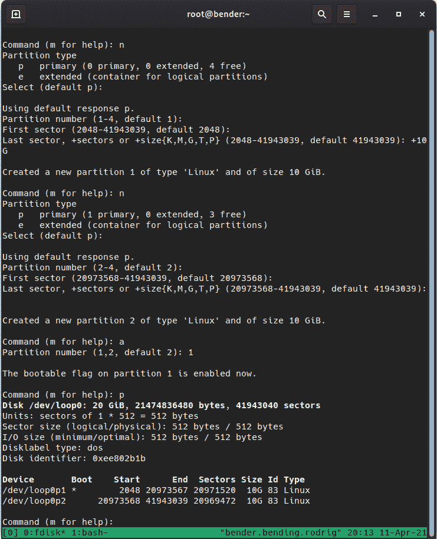

# *第十二章*:管理本地存储和文件系统

在前面的章节中，我们已经学习了安全性和系统管理。 在本章中，我们将重点讨论资源的管理—特别是存储管理。

存储管理是保持系统运行的重要组成部分:系统日志可能占用可用空间，新的应用可能需要为它们设置额外的存储(甚至在单独的磁盘上以提高性能)，这些问题可能需要我们采取行动来解决。

在本章中，我们将学习以下主题:

*   分区磁盘(**主引导记录**(**MBR)和**全球惟一标识符**(****GUID)【显示】分区表**(**GPT)磁盘)**
*   格式化和挂载文件系统
*   在`fstab`中设置默认挂载和选项
*   **网络文件系统**(**NFS**)使用网络文件系统

这将为我们提供基础知识，以构建我们的存储管理技能，以保持系统运行。

让我们动手!

# 技术要求

你可以继续练习使用**虚拟机(VM**)创建在这本书的开始[*第一章*](01.html#_idTextAnchor014)、【显示】安装 RHEL8。 本章所需的任何附加资料将在正文旁边注明。 您还需要分区磁盘(MBR 和 GPT 磁盘)。****

 **## 让我们从定义开始

分区是存储设备的逻辑划分，它用于将可用的存储逻辑地分隔成更小的块。

现在，让我们继续学习一些关于存储的起源，以便更好地理解它。

## 一点历史

存储也是相关系统使用它的能力,让我们来解释一下**个人电脑的历史**(**电脑),软件,允许他们引导(**基本输入/输出系统【显示】(****BIOS)),以及它如何影响存储管理。****

这听起来可能有点奇怪,但初始存储需求只是少量的**KB**(**KB),第一在电脑硬盘,存储**只有几兆字节**(****MB)。**

个人电脑也有一个特点和限制:个人电脑是兼容的，这意味着后续的型号与最初的**国际商业机器**(**IBM**)个人电脑设计具有兼容性。

传统磁盘分区在 MBR 之后的磁盘开始处使用一个空间，该空间允许四个分区寄存器(开始、结束、大小、分区类型、活动标志)，称为**主**分区。

PC 启动时，BIOS 通过在 MBR 中运行一个小程序检查磁盘的分区表，然后加载活动分区的引导区并执行该引导区，从而引导操作系统。

的 IBM 个人电脑包含一个**磁盘操作系统**(**DOS)和兼容机(ms - DOS, DR-DOS FreeDOS 等等)也使用文件系统命名为**文件分配表**(**【显示】脂肪)。 FAT 包含几个基于其演变的结构，表示为集群寻址大小(以及一些其他特性)。

有了集群数量的限制，更大的磁盘意味着更大的块，所以如果一个文件只使用有限的空间，其他文件就不能使用剩余的块。 因此，将更大的硬盘驱动器分成更小的逻辑分区或多或少成为一种常态，以便小文件不会因为限制而占用可用空间。

想想作为一个议程的最大条目数,类似于你的手机快速拨号:如果你只有 9 槽快速拨号,如打短号码语音信箱还算是有存储大型国际号码作为仍在使用一个插槽。

随后版本的 FAT 分级减少了这些限制，同时增加了所支持的最大磁盘大小。

当然，其他操作系统也引入了它们自己的文件系统，但是使用的是相同的分区模式。

之后,创建一个新的分区类型:**扩展分区**,使用一个可用的四个**主分区**槽和允许额外的分区定义里面,使我们能够根据需要创建逻辑磁盘分配。

此外，拥有几个主分区还允许在同一台计算机上安装不同操作系统的专用空间，这些空间完全独立于其他操作系统。

所以… 分区允许电脑有不同的操作系统,有一个更好的使用可用的存储、甚至逻辑排序的数据通过保持它在不同的领域,如空间独立于用户数据,以便让操作系统用户填充可用空间不会影响计算机的操作。

我们说,这些设计与原 IBM 个人电脑的兼容性限制,所以当新的电脑使用**可扩展固件接口**(**EFI)似乎克服传统 BIOS 的局限性,一个叫做**GPT 的新分区表的格式**到来。**

 **使用 GPT 的系统使用 32 位和 64 位支持，而 BIOS 使用 16 位支持(从 IBM PC 兼容性继承而来)，因此可以为磁盘使用更大的寻址，以及其他特性，如扩展控制器加载。

现在，让我们在下一节中学习磁盘分区。

# 分区磁盘(MBR 和 GPT 磁盘)

如前所述，使用磁盘分区允许我们更有效地使用计算机和服务器中的可用空间。

让我们通过首先确定要操作的磁盘来深入研究磁盘分区。

重要提示

一旦我们学会了什么导致磁盘分区的局限性,我们应该遵循一个模式或另一个基于系统规范,但记住 EFI GPT 和 BIOS 需要需要 MBR,所以系统支持 UEFI,但和 MBR 磁盘分区,将启动系统进入 BIOS-compatible 模式。

Linux 使用不同的【显示】基于符号的磁盘的方式连接到系统,例如这些- - - - -可以看到磁盘作为`hda`或`sda`或`mmbclk0`根据连接使用。 传统上,磁盘连接使用**集成驱动电路【病人】(****IDE)接口使用磁盘命名为`hda`,`hdb`,等等,而磁盘使用【t16.1】**小型计算机系统接口(SCSI**)用于有磁盘命名为`sda`,`sdb`等等。**

我们可以用`fdisk –l`或`lsblk –fp`列出可用的设备，如下截图所示:



图 12.1 - lsblk-fp 和 fdisk - l 输出

我们可以看到,我们的磁盘命名为`/dev/sda`有三个分区:`sda1`,`sda2`,`sda3`,`sda3`是`LVM`卷【显示】组,一个卷名为`/dev/mapper/rhel-root`。

为了以一种安全的方式演示磁盘分区，并使读者更容易使用 VM 进行测试，我们将创建一个假的**虚拟硬盘**(**VHD**)进行测试。 在此过程中，我们将使用`coreutil`包附带的`truncate`实用程序和`util-linux`包附带的`losetup`实用程序。

为了创建一个 VHD，我们将按照图 12.2 中所示的顺序执行以下命令:

1.  `truncate –s 20G myharddrive.hdd`

    请注意

    这个命令创建了一个 20**GB**(**GB**)大小的文件，但这将是一个空文件，这意味着该文件实际上并没有在我们的磁盘上使用 20 GB，只是显示了该大小。 除非我们使用它，否则它不会消耗更多的磁盘空间(这称为**稀疏文件**)。

2.  `losetup –f`，它将找到下一个可用的设备
3.  `losetup /dev/loop0 myharddrive.hdd`，这将`loop0`与所创建的文件相关联
4.  `lsblk –fp`，以验证新循环的磁盘
5.  `fdisk –l /dev/loop0`，列出新磁盘的可用空间

下面的屏幕截图显示了前面的顺序命令的输出:


图 12.2 -执行指定的命令创建一个假硬盘

`losetup -f`命令会找到下一个可用的环回设备，该设备用于对备份文件进行回退访问。 例如，这通常用于在本地挂载 ISO 文件。

对于第三个命令，我们使用先前可用的环回设备在设备`loop0`设备和我们用第一个命令创建的文件之间建立一个循环连接。

正如我们可以看到,在剩下的命令,设备现在出现在运行相同的命令,我们执行在图 12.1*,显示我们有可用的 20 GB 磁盘。*

重要提示

磁盘上的分区操作可能是危险的，可能导致系统不可用，需要恢复或重新安装。 为了减少这种可能性，本章中的例子将使用`/dev/loop0`创建的假磁盘，并且只与它交互。 在对实际的卷、磁盘等执行此操作时，请注意。

让我们通过在新创建的设备上执行`fdisk /dev/loop0`来开始创建分区，如下图所示:


图 12.3 -在/dev/loop0 上执行 fdisk

我们可以看到在图 12.3*,磁盘不包含一个认识到分区表,所以创建一个新的 DOS 分区磁盘标签,但变化只保持在内存中,直到写回到磁盘。*

在`fdisk`命令中，我们可以使用几个选项来创建分区。 我们应该注意的第一个是`m`，如图 12.3*中所示，它显示了帮助功能和可用的命令。*

首先要考虑的是我们之前对 UEFI、BIOS 等的解释。 默认情况下，`fdisk`正在创建一个 DOS 分区，但是我们可以在手册(`m`)中看到，我们可以通过在`fdisk`中运行`g`命令来创建一个 GPT 分区。

要记住的一个重要命令是`p`，它打印当前的磁盘布局和分区，如下面的截图所定义:



图 12.4 - fdisk 创建一个新的分区表

我们可以看到，最初的`disklabel`类型为`dos`，现在为`gpt`，与 EFI/UEFI 兼容。

让我们回顾一下我们可以使用的一些基本命令，如下所示:

*   `n`:创建新分区
*   `d`:删除分区
*   `m`:显示手册页面(帮助)
*   `p`:打印当前布局
*   `x`:进入高级模式(专为专家准备的额外功能)
*   `q`:无保存退出
*   `w`:将更改写入磁盘并退出
*   `g`:创建新的 GPT 磁盘标签
*   `o`:创建 DOS 磁盘标签
*   `a`:在 DOS 模式下，将引导标志设置为一个主分区

创建一个新的传统磁盘分区布局的顺序是什么?其中是用于操作系统的可引导分区，而另一个是用于用户数据的分区，每个分区的磁盘大小为原来的一半。

这将是命令的顺序(这些也显示在*图 12.5*中):

1.  `o`并按*进入*来创建一个新的 DOS 磁盘标签
2.  `n`和*输入*创建一个新分区
3.  按*进入*以接受主分区类型
4.  按*输入*确认使用第一个分区(`1`)
5.  按*进入*接受初始扇区
6.  `+10G`和*输入*以显示第一个扇区的大小为 10gb
7.  `n`和*输入*创建第二个新分区
8.  按*进入*以接受它作为主分区类型
9.  按*输入*以接受分区编号(`2`)
10.  按*进入*以接受第一个扇区作为 fdisk 提议的默认扇区
11.  按*进入*以接受 fdisk 提议的结束扇区为默认
12.  `a`然后按*进入*将分区标记为可引导
13.  `1`和*输入*来标记第一个分区

如你所见，大多数选项接受默认值; 唯一的变化是指定一个分区大小`+10G`,这意味着它应该 10 GB(磁盘是 20 GB),然后开始第二个分区与新`n`命令,现在不是指定大小我们想使用所有其余的人。 最后一步是将第一个分区标记为启动的活动分区。

当然，请记住我们之前说过的:除非执行`w`命令，否则的更改不会写入磁盘，我们可以使用`p`来检查这些更改，如下截图所示:



图 12.5 -磁盘分区布局的创建和写入磁盘之前的验证

为了结束本节，让我们使用`w`命令对磁盘进行修改，然后在下一节讨论文件系统。 但是，在此之前，让我们执行`partprobe /dev/loop0`来让内核更新它在磁盘上的内部视图，并找到两个新分区。 否则，`/dev/loop0p1`和`/dev/loop0p2`特殊文件可能无法创建，也无法使用。

注意一些分区修改在`partprobe` 执行后甚至没有更新，可能需要重新启动系统。 例如，这发生在有分区正在使用的磁盘中，例如在我们的计算机中保存根文件系统的磁盘。

# 格式化和挂载文件系统

在前一节中，我们学习了如何逻辑地划分磁盘，但是该磁盘仍然不能用于存储数据。 为了实现这一点，我们需要在它上定义一个**文件系统**作为第一步，使它对我们的系统可用。

文件系统是一种逻辑结构，它定义了文件、文件夹和更多的存储方式，并根据每种类型提供一组不同的特性。

支持的文件系统的数量和类型取决于操作系统的版本，因为在其发展过程中，可能会添加、删除新的文件系统，等等。

提示

请记住，**Red Hat Enterprise Linux**(**RHEL**)关注的是的稳定性，因此对于新版本添加或淘汰哪些特性有严格的控制，但在当前版本中没有。 你可以在[https://access.redhat.com/articles/rhel8-abi-compatibility](https://access.redhat.com/articles/rhel8-abi-compatibility)上阅读更多的。

在 RHEL 8 中,默认文件系统是**扩展文件系统**(**XFS),但你可以看到可用的 RHEL 文档的列表在[发现 https://access.redhat.com/documentation/en-us/red_hat_enterprise_linux/8/html/system_design_guide/overview-of-available-file-systems_system-design-guide](https://access.redhat.com/documentation/en-us/red_hat_enterprise_linux/8/html/system_design_guide/overview-of-available-file-systems_system-design-guide), 当然，也可以使用其他的，如**第四扩展文件系统**(**EXT4**)。**

文件系统的选择取决于几个因素，如使用意图、将要使用的文件类型等等，因为不同的文件系统可能会影响性能。

例如，EXT4 和 XFS 都是日志文件系统，可以提供更多的电源故障保护，但是最大的文件系统在其他方面有所不同，比如可能成为碎片等。

在选择文件系统之前，最好了解正在部署的文件类型及其使用模式，因为选择错误的文件系统可能会影响系统性能。

正如我们在上一节中定义的 VHD 上的两个分区，我们可以尝试同时创建 XFS 和 EXT4 文件系统。 然而,再次非常小心当执行操作,文件系统的创建是一个破坏性的操作,将新结构写回磁盘,系统的操作作为根用户,这是必需的,选择错了可以摧毁在几秒内可用的数据,我们已经在我们的系统。

重要提示

请记住检查正在使用的命令的手册页，以便熟悉每个命令的不同建议和可用选项。

然后，让我们使用创建的两个分区对两个文件系统 XFS 和 EXT4 进行测试，对每个设备分别使用`mkfs.xfs`和`mkfs.ext4`命令，如下所示:


图 12.6 -在 VHD 上创建文件系统

注意，我们使用指定了不同的循环设备分区，并且为每个命令指定了一个`-L`参数。 我们稍后会再看一遍。

现在已经创建了文件系统,我们可以运行`lsblk -fp`为了验证这一点,我们可以看到这两个设备,现在显示文件系统在使用`LABEL`和`UUID`值(当我们创建了文件系统的显示`mkfs`),我们可以看到下面的截图:


图 12.7 -创建文件系统后 lsblk - fp 的输出

从前输出,重要的是关注`UUID`和`LABEL`值(如果你还记得,我们列出的值中指定`mkfs`与`–L`命令选项),正如我们将在本章后面使用。

现在已经创建了文件系统，为了使用它们，我们需要挂载它们，这意味着让文件系统在系统中的一个路径上可用，以便每次在该路径中存储时，都将使用该设备。

安装一个文件系统可以通过几种方式,但最简单的方法是使用 autodetection 指定挂载的设备和本地路径安装它,但更复杂的允许几个选项定义可以发现当检查`man mount`帮助页面。

为了挂载我们创建的两个文件系统，我们将创建两个文件夹，然后通过执行以下命令来挂载每个设备:

1.  `cd`
2.  `mkdir first second`
3.  `mount /dev/loop0p1 first/`
4.  `mount /dev/loop0p2 second/`

此时，两个文件系统将在我们的主文件夹(根用户)中名为`first`和`second`的子文件夹中可用。

内核有自动找到每个设备正在使用的文件系统，并通过通过适当的控制器加载它，这是有效的，但有时我们可能需要定义特定的选项——例如，强制文件系统类型， 在过去，`ext2`和`ext3`是常用的文件系统，用于启用或禁用日志记录，或者，例如，禁用内置的特性，这些特性更新文件或目录访问时间，以减少磁盘 I/O 并提高性能。

一旦系统重新启动，在命令行上指定的所有选项或挂载的文件系统将不可用，因为这些只是运行时更改。 让我们继续下一节，学习如何在系统启动时定义默认选项和文件系统安装。

# 设置 fstab 中的默认挂载和选项

在前一节中，我们介绍了如何挂载磁盘和分区，以便我们的服务和用户可以使用它们。 在本节中，我们将学习如何以持久的方式提供这些文件系统。

`/etc/fstab`文件包含文件系统定义为我们的系统,当然,它有一个专门的手册页,可以检查与`man fstab`包含有用的信息格式,字段排序,等等,必须考虑,因为这个文件对系统的正常运转至关重要。

文件格式由由制表符或空格分隔的几个字段定义，以`#`开头的行被视为注释。

例如，我们将使用这一行来查看每个字段的描述:

```sh
LABEL=/ / xfs defaults 0 0
```

第一个字段是设备定义,它可以是一个特殊的块设备,远程文件系统,比例我们可以看到选择器由`LABEL`,`UUID`,或者,对于【显示】GPT 系统,也是一个`PARTUUID`或`PARTLABEL`。 `mount`、`blkid`和`lsblk`的`man`页提供了有关设备标识符的更多信息。

第二个字段是文件系统的挂载点，在这里可以根据我们的系统目录层次结构使文件系统的内容可用。 一些特殊的设备/分区(如交换区)将这个定义为`none`，因为实际上这些内容无法通过文件系统获得。

第三个字段是用于交换分区的`mount`命令或`swap`支持的文件系统类型。

第四场是支持的挂载选项`mount`或`swapon`命令(检查他们的`man`页面更多细节),在其最常见的选项默认设置一个别名(读/写,允许设备,允许执行,在引导加载,异步访问,等等)。 其他常见的选项可能`noauto`,它定义了文件系统但不安装在引导(通常用于移动设备),`user`,它允许用户安装和卸载,`_netdev`,它定义了远程路径需要网络之前挂载。

第五个字段由`dump`来决定应该使用哪些文件系统——其值默认为`0`。

第六个字段被`fsck`用来确定引导时检查文件系统的顺序。 根文件系统的值应该是 1，其他文件系统的值应该是 2(默认值是 0，而不是`fsck`)。 检查是并行执行的，以加快引导过程。 注意，对于具有日志的文件系统，文件系统本身可以执行快速验证，而不是完整的验证。

在下面的截图中，让我们看看它在输出`cat /etc/fstab`的系统中是什么样子:


图 12.8 -我们系统中的 fstab 示例

为什么我们要用`UUID`或`LABEL`来代替`/dev/sda1`这样的设备?

当系统引导时，磁盘顺序可能会改变，因为一些内核可能会引入设备在访问这些设备的方式上的差异，等等，从而导致设备枚举的变化; 这种情况不仅发生在**通用串行总线**(**USB**)等可移动设备上，也发生在等内部设备上，如网络接口或硬盘驱动器。

当我们使用`UUID`或`LABEL`而不是指定设备时，即使在设备重新排序的情况下，系统仍然能够找到要使用的正确设备并从中引导。 这是特别重要的,当系统**曾经 IDE**和**系列先进技术附件**(【显示】**SATA)驱动器和**SCSI 驱动器,甚至今天当**互联网 SCSI【病人】(****iSCSI)设备可能比预期连接以不同的顺序, 导致设备名称改变，到达设备名称失败。******

 **记住使用`blkid`或`lsblk –fp`命令检查文件系统的标签和**通用唯一标识符**(**uuid**)，以便在引用它们时使用。

重要提示

在编辑`/etc/fstab`文件时，要非常小心:更改系统使用的挂载点可能会导致系统无法使用。 如果有疑问，请仔细检查任何更改，并确保熟悉系统恢复方法，在需要时拥有可用的救援介质。

让我们在下一节的中学习关于挂载远程 NFS

# 通过 NFS 使用网络文件系统

挂载远程 NFS 的与挂载本地设备的没有太大区别，但是我们没有像在上一节中使用`/dev/loop0p1`文件指定本地设备，而是将`server:export`作为设备提供。

我们可以通过`man mount`查看手册页面找到一系列可用的选项，这将向我们展示几个选项和设备的外观。

当使用 NFS 挂载时，管理员需要使用主机和导出名称来挂载该设备—例如，根据以下 NFS 导出数据:

*   **服务器**:`server.example.com`
*   **出口**:`/isos`
*   **挂载点**:`/mnt/nfs`

使用前面的数据，很容易构造`mount`命令，如下所示:

```sh
mount –t nfs sever.example.com:/isos /mnt/nfs
```

如果我们分析前面的命令，它将定义要挂载的文件系统类型为`nfs`，由`server.example.com`主机名提供，并使用`/isos`NFS 导出，并且可以在本地的`/mnt/nfs`文件夹下使用。

如果我们想定义这个文件系统在引导时可用，我们应该在`/etc/fstab`中添加一个条目，但是… 我们应该如何表示呢?

基于本章中解释的设置，构建的条目看起来像这样:

```sh
server.example.com:/isos /mnt/nfs nfs defaults,_netdev 0 0
```

前面的代码包含在命令行参数我们表示,但也补充说,这是一个资源需要网络访问之前挂载它,需要网络能够达到 NFS 服务器,类似需要等其他网络存储 Samba 坐骑, iSCSI，等等。

重要提示

恢复保持系统可引导的思想，一旦我们对`/etc/fstab`配置文件进行了修改，建议执行`mount -a`，以便在运行的系统中执行验证。 如果在执行之后新的文件系统可用，并且在执行时显示(例如`df`)，并且没有出现错误，那么它应该是安全的。

# 总结

在本章中，我们学习了如何逻辑地划分磁盘以优化存储的使用，以及以后如何在该磁盘分区上创建一个文件系统，以便它可以用来实际存储数据。

一旦创建了实际的文件系统，我们就学习了如何在系统中访问它，以及如何通过修改`/etc/fstab`配置文件来确保下次系统重启后它仍然可用。

最后，我们还学习了基于提供给我们的数据使用远程文件系统和 NFS，以及如何将其添加到我们的`fstab`文件中以使其持久。

在下一章中,我们将学习如何使存储更加有用通过**逻辑卷管理(LVM**),赋予不同的逻辑单元的定义,可以调整大小,结合提供数据冗余,等等。**********