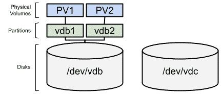
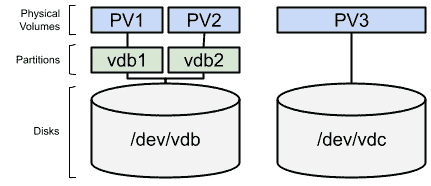
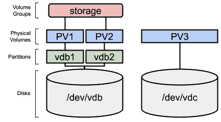
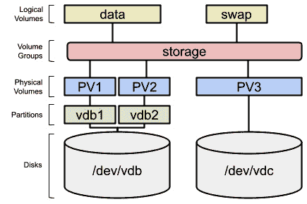
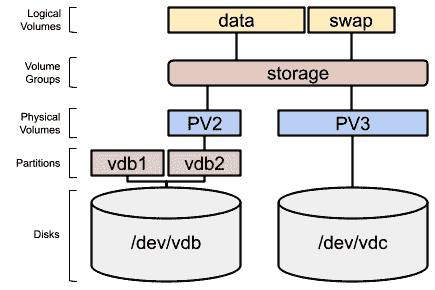
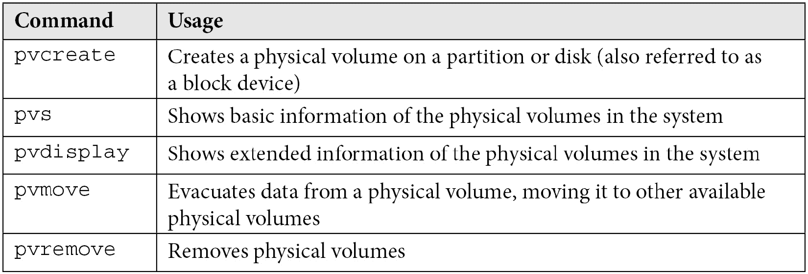

# 十三、LVM 的灵活存储管理

管理本地存储可以通过一个更灵活的方式比[*第十二章*](12.html#_idTextAnchor160),*管理本地存储和文件系统,通过使用**逻辑卷管理器(LVM【显示】)。 LVM 允许将多个磁盘分配给同一个逻辑卷(在 LVM 中相当于分配给一个分区)，在不同的磁盘之间复制数据，并创建卷的快照。***

 ***在本章中，我们将回顾 LVM 的基本用法以及用于管理存储的主要对象。 我们将学习如何准备与 LVM 一起使用的磁盘，然后将它们聚合到一个池中，从而不仅增加可用空间，而且使您能够一致地使用它。 我们还将学习如何将聚合的磁盘空间分布到类似于分区的块中，这些块在必要时可以很容易地扩展。 为此，我们将探讨以下议题:

*   理解 LVM
*   创建、移动和删除物理卷
*   将物理卷组合成卷组
*   创建和扩展逻辑卷
*   向卷组添加新磁盘并扩展逻辑卷
*   删除逻辑卷、卷组和物理卷
*   回顾 LVM 命令

# 技术要求

在本章中，我们将在机器中再添加两个磁盘，以便能够遵循本章中提到的示例。 以下是你的选择:

*   如果您使用的是物理机器，您可以添加两个 USB 驱动器。
*   如果使用的是本地虚拟机，则需要添加两个新的虚拟驱动器。
*   如果您正在使用一个云实例，您可以向它添加两个新的块设备。

作为示例，让我们看看如何将这些磁盘添加到 Linux 中的虚拟机中。 首先，我们关闭在第 1 章、*Installing RHEL8*中安装的虚拟机`rhel8`。 然后我们打开虚拟机的特征页面。 在这里我们找到了**添加硬件**按钮:


图 13.1 -编辑虚拟机属性

提示

根据您所使用的虚拟化平台，有不同的路径可以达到虚拟机特性。 然而，在虚拟机菜单中有一个选项是可以直接访问的，这是很常见的。

点击**添加硬件**将打开如下截图对话框。 在其中，我们将选择**Storage**选项，并指定要创建并连接到虚拟机的虚拟磁盘的大小，在本例中为 1 GiB，然后单击**Finish**:


图 13.2 -向虚拟机添加磁盘

我们将重复这个过程两次以添加两个磁盘。 最终结果看起来像这样:


图 13.3 -两个新磁盘添加到一个虚拟机，总共是三个

现在我们将启动虚拟机并登录它来检查新设备的可用性:

```sh
[root@rhel8 ~]# lsblk 
NAME          MAJ:MIN RM SIZE RO TYPE MOUNTPOINT
vda           252:0    0  10G  0 disk 
├─vda1        252:1    0   1G  0 part /boot
└─vda2        252:2    0   9G  0 part 
  ├─rhel-root 253:0    0   8G  0 lvm  /
  └─rhel-swap 253:1    0   1G  0 lvm  [SWAP]
vdb           252:16   0   1G  0 disk 
vdc           252:32   0   1G  0 disk
```

我们可以看到新的 1 GiB 磁盘`vdb`和`vdc`是可用的。 现在我们已经有了一个系统磁盘，我们在其中安装了 RHEL 8 操作系统，还有两个磁盘可以使用，我们准备继续学习本章。

提示

Linux 中磁盘设备的命名取决于它们使用的驱动程序。 附加为 SATA 或 SCSI 的设备显示为`sd`和一个字母，如`sda`或`sdb`。 与 IDE 总线连接的设备使用`hd`和一个字母，如`hda`或`hdb`。 例如，使用 VirtIO 半虚拟化驱动程序的设备使用`vd`和一个字母，例如`vda`或`vdb`。

# 理解 LVM

LVM 使用三层来管理系统中的存储设备。 这些层如下:

*   **物理卷**(**PV**):第一层 of LVM。 直接分配给块设备。 物理卷可以是磁盘上的一个分区，也可以是完整的原始磁盘本身。
*   **卷组**(**VG**):LVM 的第二层。 它将物理卷分组以聚合空间。 这是一个中间层，不是很明显，但它的作用非常重要。
*   **逻辑卷**(**LV**):LVM 的第三层。 它分配卷组聚集的空间。

让我们看看我们想要使用两个新添加的磁盘实现的示例:


图 13.4 -使用两个磁盘的 LVM 示例

让我们来解释这个例子图，以理解所有的层:

*   我们有两个磁盘，在图中，它们是**Disk1**和**Disk2**。
*   **Disk1**被划分为两个分区:**Part1**和**Part2**。
*   **Disk2**未分区。
*   There are three physical volumes. The mission of these is to prepare the disk space to be used in LVM. The physical volumes are as follows:

    **PV1**，创建在**Part1**分区上的**Disk1**

    **PV2**，创建在**Part2**分区上的**Disk1**

    -**PV3**，直接在**Disk2**上创建

*   单个卷组**VG1**聚集了三个物理卷**PV1**、**PV2**和**PV3**。 现在，所有的磁盘空间都得到了整合，可以很容易地重新分配。
*   空间分为四个逻辑卷:**LV1**、**LV2**、**LV3**、**LV4**。 请注意，逻辑卷并不使用整个磁盘。 这样，如果我们需要扩展卷或创建快照，就可以实现。

这是对各层如何分布的基本描述，不涉及镜像、精简配置或快照等复杂情况。

根据经验，我们需要理解 pv 的设计目的是准备 LVM 使用的设备，vg 聚合 pv，而 lv 分布聚合空间。

有趣的是，如果我们创建一个 VG，我们可以向它添加一个额外的磁盘，从而增加它的大小，而不需要停止或重新启动机器。 同样，我们可以将添加的空间分布在需要它的 lv 上，而无需停止或重新启动机器。 这就是为什么 LVM 如此强大并推荐用于每台服务器的主要原因之一，几乎没有例外。

现在我们知道了 LVM 划分的层，让我们开始使用它们来了解它们是如何工作的。

# 创建、移动和移除物理卷

有我们的机器准备好了两个新的磁盘,`vdb`和`vdc`,因为*技术要求部分解释说,我们可以开始实施示例图,如图 13.4 所示*,在我们的机器。**

 **第一步并不是与 LVM 直接相关的，但是继续示例仍然很重要。 第一步涉及对`vdb`磁盘进行分区。 让我们来看看分区管理工具`parted`:

```sh
[root@rhel8 ~]# parted /dev/vdb print
Error: /dev/vdb: unrecognised disk label
Model: Virtio Block Device (virtblk)
Disk /dev/vdb: 1074MB
Sector size (logical/physical): 512B/512B
Partition Table: unknown
Disk Flags:
```

重要提示

您的磁盘设备(如果您使用的是物理机器或不同的磁盘驱动器)可能是不同的。 例如，如果我们使用 SATA 磁盘，它将是`/dev/sdb`而不是`/dev/vdb`。

磁盘是完全未分区的，正如我们在`unrecognised disk label`消息中所看到的。 正如在[*第十二章*](12.html#_idTextAnchor160)，*管理本地存储和文件系统*中所解释的，我们可以使用两种类型的磁盘标签; `msdos`**(也称为 MBR**),机器的旧类型【t16.1】与**基本输入输出系统(BIOS**)可以使用引导,`gpt`,**的新型机器统一的可扩展固件接口**(**UEFI)可以使用引导。 如果有的疑问，使用`gpt`，就像我们在这个例子中所做的那样。 `parted`用于创建新标签的选项是`mklabel`:******

```sh
[root@rhel8 ~]# parted /dev/vdb mklabel gpt
Information: You may need to update /etc/fstab.

[root@rhel8 ~]# parted /dev/vdb print
Model: Virtio Block Device (virtblk)
Disk /dev/vdb: 1074MB
Sector size (logical/physical): 512B/512B
Partition Table: gpt
Disk Flags: 

Number  Start  End  Size  File system  Name  Flags
```

提示

要创建一个`msdos`标签，命令应该是`parted /dev/vdb mklabel msdos`。

现在我们有一个带有`gpt`标签的磁盘，但是没有分区。 让我们在交互模式下使用`mkpart`选项创建一个分区:

```sh
[root@rhel8 ~]# parted /dev/vdb mkpart
```

现在我们可以输入分区名称`mypart0`:

```sh
Partition name?  []? mypart0
```

对于下一步，指定文件系统，我们将使用`ext2`:

```sh
File system type?  [ext2]? ext2 
```

现在是设置起点的时候了。 我们将使用第一个可用扇区，即`2048s`:

```sh
Start? 2048s
```

提示

根据定义，现代磁盘中的第一个扇区是`2048s`。 该工具不提供此功能。 当有疑问时，我们可以通过运行`parted /dev/vda unit s print`来检查其他现有的磁盘。

然后我们进入最后一步，设置端点，它可以描述为我们想要创建的分区的大小:

```sh
End? 200MB
```

该命令完成后出现如下警告:

```sh
Information: You may need to update /etc/fstab.
```

为了确保分区表在系统中被刷新，并且允许在`/dev`下生成设备，我们可以运行以下命令:

```sh
[root@rhel8 ~]# udevadm settle
```

提示

在非交互模式下运行的完整命令是`parted /dev/vdb mkpart mypart0 xfs 2048s 200MB`。

我们可以看到新分区可用:

```sh
[root@rhel8 ~]# parted /dev/vdb print
Model: Virtio Block Device (virtblk)
Disk /dev/vdb: 1074MB
Sector size (logical/physical): 512B/512B
Partition Table: gpt
Disk Flags: 

Number  Start   End    Size   File system  Name     Flags
1      1049kB  200MB  199MB               mypart0
```

我们需要更改分区，以便能够承载`LVM`物理卷。 `parted`命令使用`set`选项来更改分区类型。 我们需要指定分区编号，即`1`，然后键入`lvm`和`on`来激活:

```sh
root@rhel8 ~]# parted /dev/vdb set 1 lvm on
Information: You may need to update /etc/fstab.

[root@rhel8 ~]# udevadm settle
[root@rhel8 ~]# parted /dev/vdb print
Model: Virtio Block Device (virtblk)
Disk /dev/vdb: 1074MB
Sector size (logical/physical): 512B/512B
Partition Table: gpt
Disk Flags: 

Number  Start   End    Size   File system  Name     Flags
1      1049kB  200MB  199MB               mypart0  lvm
```

我们看到分区的标志现在被设置为`lvm`。

让我们添加第二个分区`mypart1`:

```sh
[root@rhel8 ~]# parted /dev/vdb mkpart mypart1 xfs \
200MB 100%
Information: You may need to update /etc/fstab.

[root@rhel8 ~]# parted /dev/vdb set 2 lvm on
Information: You may need to update /etc/fstab.

[root@rhel8 ~]# parted /dev/vdb print
Model: Virtio Block Device (virtblk)
Disk /dev/vdb: 1074MB
Sector size (logical/physical): 512B/512B
Partition Table: gpt
Disk Flags: 

Number  Start   End     Size   File system  Name     Flags
1      1049kB  200MB   199MB               mypart0  lvm
2      200MB   1073MB  872MB               mypart1  lvm
```

现在我们已经创建了两个分区`/dev/vdb1`(名称为`mypart0`)和`/dev/vdb2`(名称为`mypart1`)，下面是的存储:


图 13.5 -在两个新磁盘中创建的分区

提示

RHEL8 中默认提供了另一个用于管理分区的工具`fdisk`。 你可能想尝试一下，看看你是否觉得它更容易使用。

现在是时候创建持久卷了。 我们将只在新创建的分区上执行此操作。 首先，我们使用`pvs`命令检查可用的持久卷:

```sh
[root@rhel8 ~]# pvs
  PV         VG   Fmt  Attr PSize  PFree
  /dev/vda2  rhel lvm2 a--  <9,00g    0 
```

现在，我们继续使用`pvcreate`创建持久卷:

```sh
[root@rhel8 ~]# pvcreate /dev/vdb1
  Physical volume "/dev/vdb1" successfully created.
[root@rhel8 ~]# pvcreate /dev/vdb2
  Physical volume "/dev/vdb2" successfully created.
```

并且我们再次检查它们已经被正确地用`pvs`创建:

```sh
[root@rhel8 ~]# pvs
  PV         VG   Fmt  Attr PSize   PFree  
  /dev/vda2  rhel lvm2 a--   <9,00g      0 
 /dev/vdb1       lvm2 ---  190,00m 190,00m
 /dev/vdb2       lvm2 ---  832,00m 832,00m
```

注意，持久化卷没有自己的名称，只有创建它们的分区(或设备)的名称。 我们可以用`PV1`和`PV2`来画图。

这是现在的状态:



图 13.6 -在两个新分区中创建持久性卷

我们还可以直接在磁盘设备`vdc`上创建一个持久卷。 让我们做到:

```sh
[root@rhel8 ~]# pvcreate /dev/vdc 
  Physical volume "/dev/vdc" successfully created.
[root@rhel8 ~]# pvs
  PV         VG   Fmt  Attr PSize   PFree  
  /dev/vda2  rhel lvm2 a--   <9,00g      0 
  /dev/vdb1       lvm2 ---  190,00m 190,00m
  /dev/vdb2       lvm2 ---  832,00m 832,00m
  /dev/vdc        lvm2 ---    1,00g   1,00g
```

与前面的示例一样，物理卷没有名称，我们将其称为`PV3`。 结果如下所示:



图 13.7 -在两个新分区和新磁盘设备中创建的持久卷

现在我们已经有了持久卷，让我们在下一节中使用虚拟组对它们进行分组。

# 将物理卷组合成卷组

现在是使用前面添加的物理卷创建新的卷组的时候了。 在此之前，我们可以使用`vgs`命令检查可用的卷组:

```sh
[root@rhel8 ~]# vgs
  VG   #PV #LV #SN Attr   VSize  VFree
  rhel   1   2   0 wz--n- <9,00g    0
```

我们可以看到，只有在安装操作系统期间创建的卷组可用。 让我们使用`vgcreate`命令创建带有`/dev/vdb1`和`/dev/vdb2`分区的`storage`卷组:

```sh
[root@rhel8 ~]# vgcreate storage /dev/vdb1 /dev/vdb2 
  Volume group "storage" successfully created
[root@rhel8 ~]# vgs
  VG      #PV #LV #SN Attr   VSize    VFree   
  rhel      1   2   0 wz--n-   <9,00g       0 
  storage   2   0   0 wz--n- 1016,00m 1016,00m
```

可以看到，新的`storage`卷组已经创建。 当前状态的图表现在看起来像这样:



图 13.8 -使用两个物理卷创建的第一个卷组

重要提示

卷组**是 LVM 中的一个非常薄的层，它的唯一目标是将磁盘或分区聚合到一个存储池中。 该存储的高级管理(例如，将数据镜像到两个不同的磁盘)是通过逻辑卷完成的。**

 **我们已经将分区和磁盘准备为物理卷，并将它们聚合到卷组中，因此我们有一个磁盘空间池。 让我们继续下一节，了解如何使用逻辑卷来分配磁盘空间。

# 创建和扩展逻辑卷

目前，创建了几个物理卷，其中两个分组到一个卷组中。 让我们进入下一层，使用`lvs`命令检查逻辑卷:

```sh
[root@rhel8 ~]# lvs
  LV   VG   Attr       LSize  Pool Origin Data%  Meta%  Move Log Cpy%Sync Convert
  root rhel -wi-ao---- <8,00g
  swap rhel -wi-ao----  1,00g  
```

我们在承载操作系统的`rhel`卷组上看到了`root`和`swap`卷。

现在，我们可以在`storage`卷组上创建一个简单逻辑卷`data`，大小为 200mb:

```sh
[root@rhel8 ~]# lvcreate --name data --size 200MB storage 
  Logical volume "data" created.
[root@rhel8 ~]# lvs
  LV   VG      Attr       LSize   Pool Origin Data%  Meta%  Move Log Cpy%Sync Convert
  root rhel    -wi-ao----  <8,00g                         
  swap rhel    -wi-ao----   1,00g                                  
  data storage -wi-a----- 200,00m
```

我们现在的配置是这样的:


图 13.9 -从卷组使用空间创建的第一个逻辑

创建的逻辑卷是块设备，类似于磁盘分区。 因此，为了使用它，我们需要使用文件系统对其进行格式化。 让我们用`xfs`格式来格式化它:

```sh
[root@rhel8 ~]# mkfs.xfs /dev/storage/data 
meta-data=/dev/storage/data      isize=512 agcount=4, agsize=12800 blks
         =                       sectsz=512   attr=2, projid32bit=1
         =                       crc=1 finobt=1, sparse=1, rmapbt=0
         =                       reflink=1
data     =                       bsize=4096 blocks=51200,imaxpct=25
         =                       sunit=0      swidth=0 blks
naming   =version 2              bsize=4096   ascii-ci=0, ftype=1
log      =internal log           bsize=4096  blocks=1368, version=2
         =                       sectsz=512 sunit=0 blks, lazy-count=1
realtime =none                   extsz=4096   blocks=0, rtextents=0
Discarding blocks...Done.
```

现在准备安装。 我们可以创建`/srv/data`目录并将其挂载到这里:

```sh
[root@rhel8 ~]# mkdir /srv/data
[root@rhel8 ~]# mount -t xfs /dev/storage/data /srv/data
[root@rhel8 ~]# df -h /srv/data/
Filesystem                Size  Used Avail Use% Mounted on
/dev/mapper/storage-data  195M   12M  184M   6% /srv/data
```

我们已经在系统中设置了支持 lvm 的可用空间。 手动挂载文件系统(如前面的示例中所示)可以在系统未关机或重新启动时工作。 为了使其持久，我们需要在`/etc/fstab`中添加以下一行:

```sh
/dev/storage/data   /srv/data    xfs    defaults        0 0
```

为了测试这一行是否正确编写，我们可以运行以下命令。 首先，卸载文件系统:

```sh
[root@rhel8 ~]# umount /srv/data
```

检查挂载点的可用空间:

```sh
[root@rhel8 ~]# df -h /srv/data/
Filesystem             Size  Used Avail Use% Mounted on
/dev/mapper/rhel-root  8,0G  2,8G  5,3G  35% /
```

`df`(对于*磁盘空闲*)命令的输出显示`/srv/data/`目录中的空间与`root`分区相关，这意味着该文件夹没有与之相关联的任何文件系统。 现在让我们在系统启动时运行`mount`命令:

```sh
[root@rhel8 ~]# mount –a
```

`/etc/fstab`中所有未挂载的文件系统都将被挂载，如果中存在任何问题(例如中的打字错误)，则会显示一个错误。 让我们检查它是否安装:

```sh
[root@rhel8 ~]# df -h /srv/data/
Filesystem                Size  Used Avail Use% Mounted on
/dev/mapper/storage-data  195M   12M  184M   6% /srv/data
```

重要提示

`/dev/storage/data`和`/dev/mapper/storage-data`设备是由**设备映射器**组件生成的同一设备的别名(更准确地说，是符号链接)。 它们完全可以互换。

正如我们所看到的，文件系统已正确安装。 现在我们知道了如何创建逻辑卷并为其分配文件系统和挂载点，我们可以继续进行更高级的任务，例如在 LVM 层及以上扩展磁盘空间。

# 向卷组添加新磁盘并扩展日志 ical 卷

关于 LVM(更确切地说，卷组)，的一个伟大之处是我们可以向它添加一个新磁盘，并开始使用新扩展的空间。 让我们尝试将`/dev/vdc`中的物理卷添加到`storage`卷组中:

```sh
[root@rhel8 ~]# vgs
  VG      #PV #LV #SN Attr   VSize    VFree  
  rhel      1   2   0 wz--n-   <9,00g      0 
  storage   2   1   0 wz--n- 1016,00m 816,00m
[root@rhel8 ~]# vgextend storage /dev/vdc
  Volume group "storage" successfully extended
[root@rhel8 ~]# vgs
  VG      #PV #LV #SN Attr   VSize  VFree
  rhel      1   2   0 wz--n- <9,00g    0 
  storage   3   1   0 wz--n- <1,99g 1,79g
```

现在，我们的磁盘分布看起来像这样:


图 13.10 -包含三个物理卷的扩展卷组

现在让扩展`data`逻辑卷，增加 200 MB:

```sh
[root@rhel8 ~]# lvs
  LV   VG      Attr       LSize   Pool Origin Data%  Meta%  Move Log Cpy%Sync Convert
  root rhel    -wi-ao----  <8,00g
  swap rhel    -wi-ao----   1,00g 
  data storage -wi-ao---- 200,00m 
[root@rhel8 ~]# lvextend --size +200MB /dev/storage/data
  Size of logical volume storage/data changed from 200,00 MiB (50 extents) to 400,00 MiB (100 extents).
  Logical volume storage/data successfully resized.
[root@rhel8 ~]# lvs
  LV   VG      Attr       LSize   Pool Origin Data%  Meta%  Move Log Cpy%Sync Convert
  root rhel    -wi-ao----  <8,00g 
  swap rhel    -wi-ao----   1,00g
  data storage -wi-ao---- 400,00m
```

逻辑卷已被扩展。 但是，它上面的文件系统没有:

```sh
[root@rhel8 ~]# df -h /srv/data/
Filesystem                Size  Used Avail Use% Mounted on
/dev/mapper/storage-data  195M   12M  184M   6% /srv/data
```

我们需要扩展文件系统。 这样做的工具取决于文件系统的类型。 在我们的例子中，因为它是`xfs`，所以扩展它的工具是`xfs_growfs`。 让我们做到:

```sh
[root@rhel8 ~]# xfs_growfs /dev/storage/data 
meta-data=/dev/mapper/storage-data isize=512    agcount=4, agsize=12800 blks
         =                       sectsz=512   attr=2, projid32bit=1
         =                       crc=1 finobt=1, sparse=1, rmapbt=0
         =                       reflink=1
data     =                       bsize=4096 blocks=51200 imaxpct=25
         =                       sunit=0      swidth=0 blks
naming   =version 2              bsize=4096   ascii-ci=0, ftype=1
log      =internal log           bsize=4096   blocks=1368 version=2
         =                       sectsz=512   sunit=0 blks, lazy-count=1
realtime =none                   extsz=4096   blocks=0, rtextents=0
data blocks changed from 51200 to 102400
[root@rhel8 ~]# df -h /srv/data/
Filesystem                Size  Used Avail Use% Mounted on
/dev/mapper/storage-data  395M   14M  382M   4% /srv/data
```

现在，文件系统添加了一些额外的空间并可用。

重要提示

执行该任务时，逻辑卷可以被挂载并被系统使用。 LVM 可以在运行时在生产系统上进行卷扩展。

可以很容易地重新分配空间并添加另一个逻辑卷:

```sh
[root@rhel8 ~]# lvcreate --size 100MB --name img storage 
  Logical volume "img" created.
[root@rhel8 ~]# lvs
  LV   VG      Attr       LSize   Pool Origin Data%  Meta%  Move Log Cpy%Sync Convert
  root rhel    -wi-ao----  <8,00g                     
  swap rhel    -wi-ao----   1,00g                        
  data storage -wi-ao---- 400,00m                          
  img  storage -wi-a----- 100,00m                          
[root@rhel8 ~]# mkfs.xfs /dev/storage/img 
meta-data=/dev/storage/img       isize=512    agcount=4, agsize=6400 blks
         =                       sectsz=512   attr=2, projid32bit=1
         =                       crc=1 finobt=1, sparse=1, rmapbt=0
         =                       reflink=1
data     =                       bsize=4096 blocks=25600 imaxpct=25
         =                       sunit=0      swidth=0 blks
naming   =version 2              bsize=4096   ascii-ci=0, ftype=1
log      =internal log           bsize=4096  blocks=1368, version=2
         =                       sectsz=512   sunit=0 blks, lazy-count=1
realtime =none                   extsz=4096   blocks=0, rtextents=0
Discarding blocks...Done.
[root@rhel8 ~]# mkdir /srv/img
[root@rhel8 ~]# mount -t xfs /dev/storage/img /srv/img
[root@rhel8 ~]# df /srv/img/
Filesystem              1K-blocks  Used Available Use% Mounted on
/dev/mapper/storage-img     96928  6068     90860   7% /srv/img
[root@rhel8 ~]# df -h /srv/img/
Filesystem               Size  Used Avail Use% Mounted on
/dev/mapper/storage-img   95M  6,0M   89M   7% /srv/img
```

`lvcreate`命令的`--size`和`--extents`选项有几个选项可以用来定义要消耗的空间:

*   **人类可读的**:我们可以用人类可读的块定义大小，例如使用`GB`定义千兆字节，使用`MB`(换句话说，`--size 3GB`)定义兆字节。
*   **区段**:如果我们只在`--extents`之后提供一个数字，该命令将使用其内部度量`extents`，这类似于磁盘分区的块大小(即`--extents 125`)。

`--size`和`--extents`选项也适用于`lvextend`命令。 在本例中，我们可以使用前面为`lvcreate`显示的选项来定义逻辑卷的新大小。 我们也有其他选项来定义要分配给它们的空间增量:

*   **添加空间**:如果我们向`lvextend`提供数字之前的`+`符号，这将增加所提供的测量数据中的大小(即`--size +1GB`向当前逻辑卷增加了一个额外的 gb)。
*   **Percentage of free space**: We can provide the percentage of free space to be created or extended by using `--extents`, and the percentage of free space to be used followed by `%FREE` (that is, `--extents 10%FREE`).

    提示

    正如我们之前在其他工具中看到的，我们可以使用手册页面来提醒自己可用的选项。 请运行`man lvcreate`和`man lvextend`来熟悉这些工具的页面。

我们将创建一个逻辑卷，用作**交换卷**，它是磁盘的一部分，系统将其用作内存的停车空间。 系统将消耗内存和不活动的进程放在那里，以便释放物理内存(比磁盘快得多)。 当系统中没有更多的空闲物理内存时，也可以使用它。

让我们在 LVM 上创建一个交换设备:

```sh
[root@rhel8 ~]# lvcreate --size 100MB --name swap storage
  Logical volume "swap" created.
[root@rhel8 ~]# mkswap /dev/storage/swap 
Setting up swapspace version 1, size = 100 MiB (104853504 bytes)
no label, UUID=70d07e58-7e8d-4802-8d20-38d774ae6c22
```

我们可以使用`free`命令检查内存和交换状态:

```sh
[root@rhel8 ~]# free
              total        used        free      shared   buff/cache   available
Mem:        1346424      218816      811372        9140       316236      974844
Swap:       1048572           0     1048572
[root@rhel8 ~]# swapon /dev/storage/swap
[root@rhel8 ~]# free
              total        used        free      shared   buff/cache   available
Mem:        1346424      219056      811040        9140       316328      974572
Swap:       1150968           0     1150968
```

重要提示

这两个新更改将需要为每个更改添加一行到`/etc/fstab`，以便在重新引导期间持续地使用它们。

我们的磁盘空间分布现在看起来是这样的:


图 13.11 -包含三个物理卷的扩展卷组

这个分布看起来很像我们用来描述 LVM 层的初始示例。 我们现在已经练习了所有的层，以创建所需的作品在每一个他们。 我们知道如何创建，所以现在是时候学习如何在下一节中删除它们了。

# 删除逻辑卷、卷 gr 组和物理卷

为了从用于删除的 e 命令开始，让我们执行重新移动`img`逻辑卷的简单步骤。 首先我们需要检查它是否挂载:

```sh
[root@rhel8 ~]# mount | grep img
/dev/mapper/storage-img on /srv/img type xfs (rw,relatime,seclabel,attr2,inode64,logbufs=8,logbsize=32k,noquota)
```

当它被安装时，我们需要卸下它:

```sh
[root@rhel8 ~]# umount /srv/img 
[root@rhel8 ~]# mount | grep img
```

最后一个命令显示一个空输出，这意味着它没有挂载。 让我们继续删除它:

```sh
[root@rhel8 ~]# lvremove /dev/storage/img 
Do you really want to remove active logical volume storage/img? [y/n]: y
  Logical volume "img" successfully removed
```

现在，我们还可以移除挂载点:

```sh
[root@rhel8 ~]# rmdir /srv/img
```

这样就完成了逻辑卷的删除。 这个过程是不可逆的，所以运行时要小心。 现在我们的磁盘分布是这样的:



图 13.12 -删除逻辑卷的卷组

现在该执行更复杂的任务了，即从虚拟组中删除一个物理卷。 这样做的原因是，有时您想要将存储在物理磁盘上的数据转移到另一个磁盘上，然后将其卸载并从系统中删除。 这是可以做到的，但首先，让我们将一些文件添加到`data`逻辑卷:

```sh
[root@rhel8 ~]# cp -ar /usr/share/scap-security-guide \
/srv/data/
[root@rhel8 ~]# ls /srv/data/
scap-security-guide
[root@rhel8 ~]# du -sh /srv/data/
30M  /srv/data/
```

现在让我们使用`pvmove`命令从`/dev/vdb1`中提取数据:

```sh
[root@rhel8 ~]# pvmove /dev/vdb1
  /dev/vdb1: Moved: 7,75%
  /dev/vdb1: Moved: 77,52%
  /dev/vdb1: Moved: 100,00%
```

重要提示

根据区段的分配情况，您可能会收到一条声明`no data to move for storage`的消息。 这意味着已将保存的数据分配到另一个磁盘。 您可以使用`pvmove`与其他设备一起尝试。

现在，`/dev/vdb1`中没有存储数据，可以从卷组中删除数据。 我们可以使用`vgreduce`命令:

```sh
[root@rhel8 ~]# vgreduce storage /dev/vdb1
  Removed "/dev/vdb1" from volume group "storage"
```

可以看到，现在存储卷组中的空间更少了:

```sh
[root@rhel8 ~]# vgs
  VG      #PV #LV #SN Attr   VSize  VFree
  rhel      1   2   0 wz--n- <9,00g    0 
  storage   2   2   0 wz--n-  1,80g 1,30g
[root@rhel8 ~]# vgdisplay storage
  --- Volume group ---
  VG Name               storage
  System ID             
  Format                lvm2
  Metadata Areas        2
  Metadata Sequence No  20
  VG Access             read/write
  VG Status             resizable
  MAX LV                0
  Cur LV                2
  Open LV               2
  Max PV                0
  Cur PV                2
  Act PV                2
  VG Size               1,80 GiB
  PE Size               4,00 MiB
  Total PE              462
  Alloc PE / Size       129 / 516,00 MiB
  Free  PE / Size       333 / 1,30 GiB
  VG UUID               1B6Nil-rvcM-emsU-mBLu-wdjL-mDlw-66dCQU
```

我们还可以看到物理卷`/dev/vdb1`没有附属于任何卷组:

```sh
[root@rhel8 ~]# pvs
  PV         VG      Fmt  Attr PSize    PFree   
  /dev/vda2  rhel    lvm2 a--    <9,00g       0 
  /dev/vdb1          lvm2 ---   190,00m  190,00m
  /dev/vdb2  storage lvm2 a--   828,00m  312,00m
  /dev/vdc   storage lvm2 a--  1020,00m 1020,00m
[root@rhel8 ~]# pvdisplay /dev/vdb1
  "/dev/vdb1" is a new physical volume of "190,00 MiB"
  --- NEW Physical volume ---
  PV Name               /dev/vdb1
  VG Name               
  PV Size               190,00 MiB
  Allocatable           NO
  PE Size               0   
  Total PE              0
  Free PE               0
  Allocated PE          0
  PV UUID               veOsec-WV0n-JP9D-WMz8-UYeZ-Zjs6-sJSJst
```

提示

`vgdisplay`、`pvdisplay`和`lvdisplay`命令显示关于 LVM 任何部分的详细信息。

最重要的部分是我们可以在系统自信地运行生产工作负载时执行这些操作。 我们的磁盘分布现在看起来像这样:



图 13.13 -删除了物理卷的卷组

现在是时候删除卷组了，但是我们需要首先删除逻辑卷，就像之前所做的那样(可以在每个命令之前和之后运行`lvs`和`vgs`来检查进度):

```sh
[root@rhel8 ~]# swapoff /dev/storage/swap
[root@rhel8 ~]# lvremove /dev/storage/swap
Do you really want to remove active logical volume storage/swap? [y/n]: y
  Logical volume "swap" successfully removed
```

在此基础上，我们删除了`/dev/storage/swap`。 现在让我们使用`--yes`选项删除`/dev/storage/data`，这样我们就不会得到请求确认(在脚本中使用此命令时很重要):

```sh
[root@rhel8 ~]# umount /dev/storage/data
[root@rhel8 ~]# lvremove --yes /dev/storage/data 
  Logical volume "data" successfully removed
```

现在可以移除`storage`卷组了:

```sh
[root@rhel8 ~]# vgremove storage
```

已成功移除`storage`卷组。

最后，清理物理卷:

```sh
[root@rhel8 ~]# pvremove /dev/vdb1 /dev/vdb2
  Labels on physical volume "/dev/vdb1" successfully wiped.
  Labels on physical volume "/dev/vdb2" successfully wiped.
```

通过这个，我们知道了如何在我们的 RHEL8 系统中使用 LVM 的每个部分。 让我们回顾下一节中使用的命令。

# 审阅 LVM 命令

作为对用于管理物理卷的命令的总结，让我们看一下下表:



现在，让我们回顾一下用于管理卷组的命令:


最后，让我们回顾一下用于管理逻辑卷的命令:


请记住，您总是可以使用每个命令可用的手册页来获取关于您想要使用的选项的更多信息，并通过运行`man <command>`来学习新的选项。

重要提示

web 管理界面座舱，有一个扩展管理存储组件。 可以使用以下命令`dnf install cockpit-storaged`将其安装为`root`(或与`sudo`一起)。 对你来说，一个很好的练习是使用驾驶舱中的存储接口重复本章中所做的过程。

# 总结

LVM 是 Red Hat Enterprise Linux 中非常有用的一部分，它提供了管理、重新分配、分发和分配磁盘空间的功能，而不需要停止系统中的任何东西。 经过多年的实战测试，它是系统管理员的一个关键组件，并且有助于将其他扩展功能整合到我们的系统中(通过 iSCSI 提供共享存储的一种灵活方式)。

在测试机器上实践 LVM 非常重要，因此我们可以确保在生产系统上运行的命令不会意味着服务停止或数据丢失。

在本章中，我们看到了使用 LVM 可以完成的最基本、但也是最重要的任务。 我们了解了 LVM 的不同层是如何工作的:物理卷、卷组和逻辑卷。 同时，我们也看到了它们是如何相互作用以及如何管理的。 我们已经实践了创建、扩展和删除逻辑卷、卷组和物理卷。 这将是重要的实践，以巩固所获得的知识，并能够在生产系统中使用它们。 然而，这样做的基础现在已经具备。

现在，让我们进入下一章，发现 RHEL8 中的一个新特性，通过添加重复数据删除功能进一步改进存储层——**虚拟数据优化器**(**VDO**)。*************